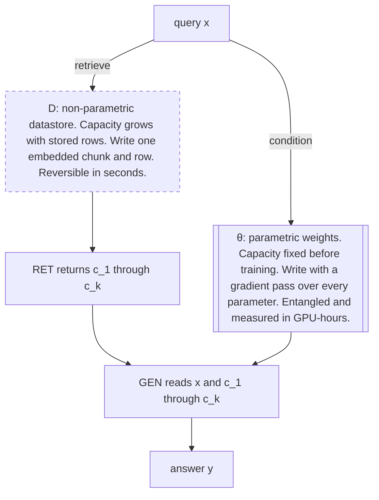
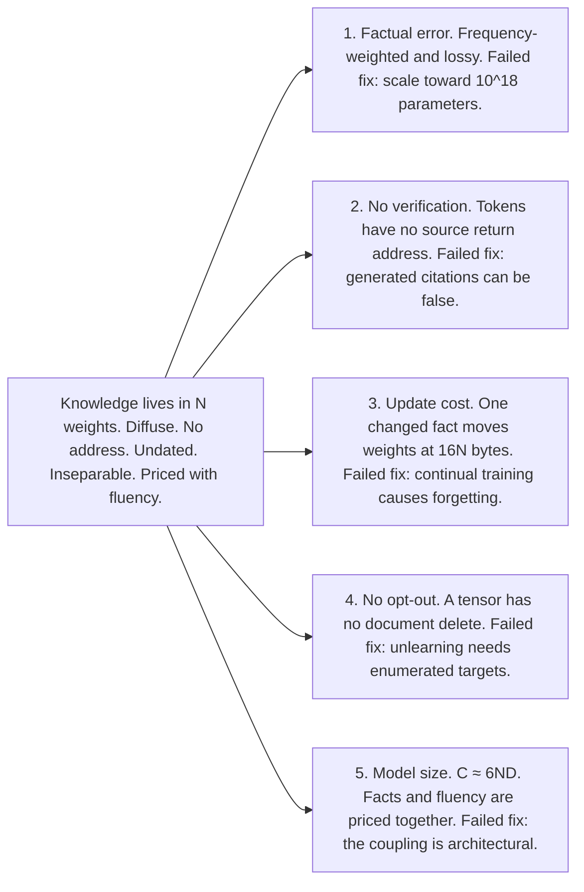
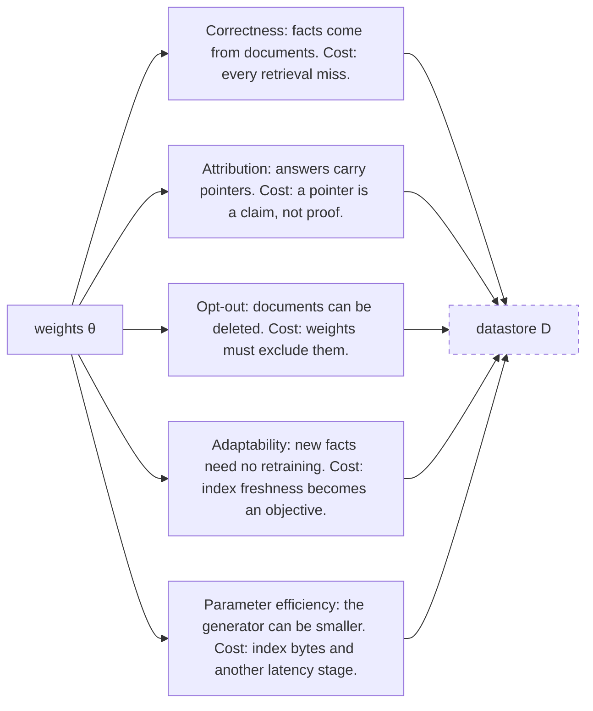

# Chapter 1: What a RAG Interview Actually Tests

Retrieval-augmented generation (RAG) interviews test whether you can route knowledge to the right store, price that choice, and recognize when retrieval is the wrong tool.

## TL;DR

- A language model is a fixed-capacity knowledge store. A datastore grows as rows are added. RAG joins those two stores.
- The decisive difference is write cost. A datastore row is addressable and reversible. A fact spread through model weights is entangled and expensive to change.
- Five bottlenecks follow from storing knowledge in weights: factual error, no source verification, high update cost, no bounded opt-out, and model size tied to factual coverage.
- Five RAG benefits move those responsibilities into a datastore: correctness, attribution, opt-out, adaptability, and parameter efficiency. Each move creates a retrieval-side cost.
- RAG is one special case of tool use. Its call is read-only, retryable, and returns passages with source identifiers.
- Retrieval cannot answer queries that require every matching record when it returns only the top few records. Aggregates and actions need different tools.
- Retrieval can harm answers the model already knows. Gate it by measured subject popularity or a product-specific frequency proxy once the crossover is known. In the worked popularity example, selective retrieval reaches 80.2% accuracy, beats always-retrieve by 4.1 points, and cuts retrieval work by 55%.

## The story

Imagine an interview room as a working library with two places to keep knowledge. The first place is a stone memory wall. Facts are carved across many stones at once. This is the parametric store, meaning its capacity was fixed before training. Reading it is fast, but changing one fact means recarving a wide surface. The second place is an expandable card room. Each card has an address and can be inserted, corrected, or removed. This is the non-parametric datastore, meaning its knowledge capacity grows as cards arrive. RAG is the librarian who uses both rooms. The librarian reads the question, retrieves a few cards, and asks the memory wall to compose an answer from the question and those cards. That combination is semi-parametric, meaning one fixed store works with one expandable store. The interviewer first inspects the memory wall for five cracks. Rare facts fade because the carving is lossy. A sentence has no return address to its source. A correction requires recarving. A deletion cannot target one original document. More factual coverage also means paying for a larger wall on every visit.

Moving facts into the card room repairs those cracks, but the bill moves too. A missing card can spoil correctness. A citation can point to the wrong support. A deletable card helps only if the same text was never carved into the wall. Fresh cards require an ingestion schedule. A smaller wall now depends on room space and an extra reading step. The library also has other service desks. The retrieval desk returns source cards and is safe to ask twice. The calculator desk returns a value but no source passage. The action desk opens a ticket or sends a message and must not be called twice by accident. RAG is one desk, not the whole library. Some questions ask for a few relevant cards. Other questions ask for the sum of every invoice. A top-card desk cannot guarantee a complete total, even with perfect ranking. The interviewer wants you to route the first query to retrieval and the second to a complete query tool. Finally, a doorman decides whether the librarian should enter the card room at all. Obscure subjects benefit because the wall remembers them poorly. Famous subjects can be harmed by a distracting card because the wall already knows the answer. The strongest interview answer therefore sounds like a library operating plan. Name the two stores. Price each write. Trace the five cracks and five transfers. Route each query to the right desk. Then place a measured gate at the point where retrieval stops helping.

## Decoder table

| Technical term | Plain-English meaning | Why it matters |
|---|---|---|
| Retrieval-augmented generation (RAG) | A system that retrieves passages from a datastore and conditions a generator on those passages. | It supports the chapter's two-store frame and evidence-retrieval decisions. |
| Language model | A model that assigns next-token probabilities from preceding tokens. | It supports the chapter's two-store frame and evidence-retrieval decisions. |
| Token | One vocabulary unit processed or generated by the model. | It supports the chapter's two-store frame and evidence-retrieval decisions. |
| Query | The input question or request the system must answer. | It supports the chapter's two-store frame and evidence-retrieval decisions. |
| Passage | A text span returned by retrieval and supplied to the generator. | It supports the chapter's two-store frame and evidence-retrieval decisions. |
| Context | The query and supplied text the generator reads for its next output. | It supports the chapter's two-store frame and evidence-retrieval decisions. |
| Context window | The maximum token sequence available to one model call. | It supports the chapter's two-store frame and evidence-retrieval decisions. |
| Pre-training | The original large training run that compresses corpus patterns into weights. | It supports the chapter's two-store frame and evidence-retrieval decisions. |
| Training corpus | The text collection used to update model weights. | It supports the chapter's two-store frame and evidence-retrieval decisions. |
| Parametric model | A model whose parameter count and capacity are fixed before training. | It supports the chapter's two-store frame and evidence-retrieval decisions. |
| Parameter | One learned number in the model's fixed weight tensor. | It supports the chapter's two-store frame and evidence-retrieval decisions. |
| Weight tensor | The full collection of learned parameters. Facts are distributed across it rather than stored at document addresses. | It supports the chapter's two-store frame and evidence-retrieval decisions. |
| `θ` | The chapter's symbol for the generator's parametric weights. | It supports the chapter's two-store frame and evidence-retrieval decisions. |
| Conditional token distribution | The model's probabilities for the next token given preceding tokens. | It supports the chapter's two-store frame and evidence-retrieval decisions. |
| Vocabulary size `V` | The number of possible token outputs considered by the model. | It supports the chapter's two-store frame and evidence-retrieval decisions. |
| Lossy compression | Storage that preserves recurring patterns but cannot retain every source fact intact. | It supports the chapter's two-store frame and evidence-retrieval decisions. |
| Long tail | Rare subjects or facts that appeared too few times to be represented reliably in the weights. | It supports the chapter's two-store frame and evidence-retrieval decisions. |
| Datastore `D` | The expandable external store that retrieval searches. | It supports the chapter's two-store frame and evidence-retrieval decisions. |
| Non-parametric store | A store whose effective knowledge capacity grows with the number of stored items. | It supports the chapter's two-store frame and evidence-retrieval decisions. |
| Semi-parametric system | A system that combines fixed model weights with an expandable datastore. | It supports the chapter's two-store frame and evidence-retrieval decisions. |
| Capacity `O(N)` | Capacity that grows in proportion to the number `N` of stored chunks. | It supports the chapter's two-store frame and evidence-retrieval decisions. |
| Chunk | A bounded passage stored and retrieved as one unit. | It supports the chapter's two-store frame and evidence-retrieval decisions. |
| Embedding | A numerical vector used to place a chunk or query in a searchable space. | It supports the chapter's two-store frame and evidence-retrieval decisions. |
| Dense retrieval | Ranking by proximity between learned embedding vectors. | It supports the chapter's two-store frame and evidence-retrieval decisions. |
| Exact-match retrieval | Ranking that rewards literal identifiers or terms, useful for fields such as stock keeping units. | It supports the chapter's two-store frame and evidence-retrieval decisions. |
| Stock keeping unit (SKU) | A precise catalog identifier whose exact text matters. | It supports the chapter's two-store frame and evidence-retrieval decisions. |
| Bi-encoder | An encoder that represents the query and chunks separately so their vectors can be compared. | It supports the chapter's two-store frame and evidence-retrieval decisions. |
| Encoder | The model that converts text into an embedding vector. | It supports the chapter's two-store frame and evidence-retrieval decisions. |
| k-nearest-neighbor search | A non-parametric method that returns the `k` closest stored vectors. | It supports the chapter's two-store frame and evidence-retrieval decisions. |
| Retriever `RET` | The read step that maps a query and datastore to `k` passages. | It supports the chapter's two-store frame and evidence-retrieval decisions. |
| Generator `GEN` | The model step that maps the query and retrieved passages to an answer. | It supports the chapter's two-store frame and evidence-retrieval decisions. |
| Top-k | The highest-ranked `k` retrieved items. | It supports the chapter's two-store frame and evidence-retrieval decisions. |
| Retrieval miss | A query result that fails to include the answer-bearing passage. | It supports the chapter's two-store frame and evidence-retrieval decisions. |
| Grounding | Constraining an answer to information in supplied passages. | It supports the chapter's two-store frame and evidence-retrieval decisions. |
| Grounded accuracy | Accuracy measured while requiring correct use of retrieved evidence. | It supports the chapter's two-store frame and evidence-retrieval decisions. |
| Tenant isolation | Keeping one customer's stored knowledge separate from another customer's knowledge. | It supports the chapter's two-store frame and evidence-retrieval decisions. |
| Addressable | Stored at a location that can be targeted directly. | It supports the chapter's two-store frame and evidence-retrieval decisions. |
| Revocable | Removable without changing unrelated stored knowledge. | It supports the chapter's two-store frame and evidence-retrieval decisions. |
| Entangled | Spread across many weights so one fact cannot be isolated cleanly. | It supports the chapter's two-store frame and evidence-retrieval decisions. |
| Gradient pass | A training update that changes model parameters. | It exposes the update, memory, compute, or serving cost of weights and indexes. |
| Fine-tuning | Additional training that changes the model's weights for a target task or corpus. | It exposes the update, memory, compute, or serving cost of weights and indexes. |
| Full fine-tuning | Updating all model weights. | It exposes the update, memory, compute, or serving cost of weights and indexes. |
| Continual fine-tuning | Repeatedly training on newly arriving material. | It exposes the update, memory, compute, or serving cost of weights and indexes. |
| Catastrophic forgetting | Loss of earlier capability when narrow new training changes the weights. | It exposes the update, memory, compute, or serving cost of weights and indexes. |
| Replay mixture | Old or unrelated training data mixed with new data to protect prior knowledge. | It exposes the update, memory, compute, or serving cost of weights and indexes. |
| Model editing | A targeted attempt to change a fact in selected model layers. | It exposes the update, memory, compute, or serving cost of weights and indexes. |
| Collateral damage | Unintended changes to unrelated knowledge after a model edit. | It exposes the update, memory, compute, or serving cost of weights and indexes. |
| Unlearning | Training that penalizes reproduction of specified sequences in an attempt to remove them. | It exposes the update, memory, compute, or serving cost of weights and indexes. |
| 32-bit floating point (FP32) | A four-byte number format used in the source's memory calculations. | It exposes the update, memory, compute, or serving cost of weights and indexes. |
| 16-bit brain floating point (bf16) | A two-byte number format used in the source's serving calculations. | It exposes the update, memory, compute, or serving cost of weights and indexes. |
| Adam | The optimizer in the full fine-tuning memory example. | It exposes the update, memory, compute, or serving cost of weights and indexes. |
| Gradient | The update signal stored for each parameter during training. | It exposes the update, memory, compute, or serving cost of weights and indexes. |
| Optimizer moments | Adam's two stored state values per parameter in the source calculation. | It exposes the update, memory, compute, or serving cost of weights and indexes. |
| Activation | An intermediate value created while the model processes input. | It exposes the update, memory, compute, or serving cost of weights and indexes. |
| Training epoch | One pass over the selected training corpus. | It exposes the update, memory, compute, or serving cost of weights and indexes. |
| Regression check | A test that looks for unrelated behavior that worsened after an update. | It exposes the update, memory, compute, or serving cost of weights and indexes. |
| Floating-point operations (FLOPs) | The arithmetic work used to price training and inference. | It exposes the update, memory, compute, or serving cost of weights and indexes. |
| Model-FLOPs utilization | The share of hardware peak arithmetic sustained by model execution. | It exposes the update, memory, compute, or serving cost of weights and indexes. |
| Graphics processing unit hour (GPU-hour) | One accelerator used for one hour. | It exposes the update, memory, compute, or serving cost of weights and indexes. |
| Accelerator | The computing card used for model training or inference. | It exposes the update, memory, compute, or serving cost of weights and indexes. |
| H100 | The accelerator model used for the source's peak, sustained-throughput, and memory assumptions. | It exposes the update, memory, compute, or serving cost of weights and indexes. |
| Sustained throughput | The arithmetic rate actually achieved, rather than the hardware's peak rate. | It exposes the update, memory, compute, or serving cost of weights and indexes. |
| Index | A data structure that supports fast retrieval over stored chunks. | It exposes the update, memory, compute, or serving cost of weights and indexes. |
| Index upsert | Insert a new index row or replace the row with the same key. | It exposes the update, memory, compute, or serving cost of weights and indexes. |
| Latency | Elapsed time added to a served query. | It exposes the update, memory, compute, or serving cost of weights and indexes. |
| Vector dimension `d` | The number of numeric coordinates in one embedding. | It exposes the update, memory, compute, or serving cost of weights and indexes. |
| Float32 vector | An embedding whose coordinates each occupy four bytes. | It exposes the update, memory, compute, or serving cost of weights and indexes. |
| High-cardinality knowledge | A collection with many distinct values, such as a large catalog. | It exposes the update, memory, compute, or serving cost of weights and indexes. |
| Low-frequency knowledge | Facts that appear rarely in the training corpus. | It exposes the update, memory, compute, or serving cost of weights and indexes. |
| Parametric prior | The answer tendency already stored in the model weights before retrieval. | It exposes the update, memory, compute, or serving cost of weights and indexes. |
| Factual correctness | Whether the answer contains the right fact. | It identifies a RAG benefit or the datastore-side cost that accompanies it. |
| Attribution | Connecting an answer claim to a source passage. | It identifies a RAG benefit or the datastore-side cost that accompanies it. |
| Provenance | The origin of the evidence supplied to the answer. | It identifies a RAG benefit or the datastore-side cost that accompanies it. |
| Citation coverage | Whether answer text carries citation markers. | It identifies a RAG benefit or the datastore-side cost that accompanies it. |
| Citation support | Whether the cited span actually entails the associated claim. | It identifies a RAG benefit or the datastore-side cost that accompanies it. |
| Entailment check | A test of whether a cited span supports a generated sentence. | It identifies a RAG benefit or the datastore-side cost that accompanies it. |
| Sample-and-rerank | Generate several candidate answers, then rank them against evidence. | It identifies a RAG benefit or the datastore-side cost that accompanies it. |
| GopherCite | The cited system that samples answers and reranks them against quoted support. | It identifies a RAG benefit or the datastore-side cost that accompanies it. |
| Opt-out | The ability to remove specified data from the served system. | It identifies a RAG benefit or the datastore-side cost that accompanies it. |
| Adaptability | The ability to serve changed facts without changing model weights. | It identifies a RAG benefit or the datastore-side cost that accompanies it. |
| Freshness objective | A committed limit on how stale the searchable index may become. | It identifies a RAG benefit or the datastore-side cost that accompanies it. |
| Ingestion pipeline | The process that converts changed documents into searchable chunks and index entries. | It identifies a RAG benefit or the datastore-side cost that accompanies it. |
| Rebuild cadence | The schedule for refreshing or reconstructing an index. | It identifies a RAG benefit or the datastore-side cost that accompanies it. |
| Parameter efficiency | Serving the task with fewer generator parameters because facts live outside the weights. | It identifies a RAG benefit or the datastore-side cost that accompanies it. |
| Perplexity | The language-model quality measure cited when low-risk-only training weakens the base model. | It identifies a RAG benefit or the datastore-side cost that accompanies it. |
| High-bandwidth memory (HBM) | Accelerator memory used for model weights, cache, and activations. | It identifies a RAG benefit or the datastore-side cost that accompanies it. |
| Dynamic random-access memory (DRAM) | Host memory used for the retrieval index in the example. | It identifies a RAG benefit or the datastore-side cost that accompanies it. |
| Host memory | Memory on the retrieval machine rather than on the model accelerator. | It identifies a RAG benefit or the datastore-side cost that accompanies it. |
| Key-value cache (KV cache) | Accelerator memory that stores attention state during generation. | It identifies a RAG benefit or the datastore-side cost that accompanies it. |
| Hierarchical navigable small world (HNSW) | The graph index used in the parameter-efficiency example. | It identifies a RAG benefit or the datastore-side cost that accompanies it. |
| HNSW neighbor limit `M` | The graph parameter whose source example is `M = 16`. | It identifies a RAG benefit or the datastore-side cost that accompanies it. |
| Inverted file with product quantization (IVF-PQ) | The compressed vector representation priced at 96 bytes per vector. | It identifies a RAG benefit or the datastore-side cost that accompanies it. |
| Scalar quantization | Another index-compression option named in the source. | It identifies a RAG benefit or the datastore-side cost that accompanies it. |
| Prefill | Processing prompt tokens before answer generation begins. | It identifies a RAG benefit or the datastore-side cost that accompanies it. |
| Retrieval gate | A policy that decides whether a query should retrieve at all. | It defines the measured gate between retrieval rescue and retrieval-induced harm. |
| Closed-book answer | An answer produced from model weights without retrieved context. | It defines the measured gate between retrieval rescue and retrieval-induced harm. |
| Subject popularity `s` | The source's query-level variable, measured as monthly Wikipedia page views. | It defines the measured gate between retrieval rescue and retrieval-induced harm. |
| Power-law distribution | A distribution with a small popular head and a large rare tail. | It defines the measured gate between retrieval rescue and retrieval-induced harm. |
| Head, torso, and tail | Popularity buckets for frequent, medium-frequency, and rare subjects. | It defines the measured gate between retrieval rescue and retrieval-induced harm. |
| Popularity bucket | A group of queries with a similar subject-frequency range. | It defines the measured gate between retrieval rescue and retrieval-induced harm. |
| Closed-book accuracy `p(s)` | Accuracy without retrieval at subject popularity `s`. | It defines the measured gate between retrieval rescue and retrieval-induced harm. |
| Retrieval accuracy `r(s)` | Accuracy with retrieval at subject popularity `s`. | It defines the measured gate between retrieval rescue and retrieval-induced harm. |
| Rescue rate `g` | The chance that retrieval fixes an answer that was wrong without retrieval. | It defines the measured gate between retrieval rescue and retrieval-induced harm. |
| Harm rate `h` | The chance that retrieval spoils an answer that was correct without retrieval. | It defines the measured gate between retrieval rescue and retrieval-induced harm. |
| Retrieval value `Δ(s)` | The accuracy change `r(s) - p(s)` caused by retrieval. | It defines the measured gate between retrieval rescue and retrieval-induced harm. |
| Accuracy threshold `p⋆` | The closed-book accuracy level `g / (g + h)` where retrieval's net value changes sign. | It defines the measured gate between retrieval rescue and retrieval-induced harm. |
| Popularity crossover `s⋆` | The popularity where `p(s⋆) = p⋆`. Retrieval helps below it and hurts above it. | It defines the measured gate between retrieval rescue and retrieval-induced harm. |
| Retrieval-induced harm | A correct closed-book answer becoming wrong after retrieved context is added. | It defines the measured gate between retrieval rescue and retrieval-induced harm. |
| Rank-1 precision | How often the first retrieved item is answer-bearing. | It defines the measured gate between retrieval rescue and retrieval-induced harm. |
| Recall at 1 | Whether an answer-bearing passage appears in the first retrieved position. | It defines the measured gate between retrieval rescue and retrieval-induced harm. |
| Recall at 20 | Whether an answer-bearing passage appears among the first twenty retrieved items. | It defines the measured gate between retrieval rescue and retrieval-induced harm. |
| Approximate nearest-neighbor (ANN) search | Fast vector search used to retrieve likely neighbors. | It defines the measured gate between retrieval rescue and retrieval-induced harm. |
| Reranker | A second ranking stage applied after initial retrieval. | It defines the measured gate between retrieval rescue and retrieval-induced harm. |
| Tool-augmented model | A generator that can choose and call one or more external tools. | It separates evidence retrieval from general tools, complete queries, and state-changing actions. |
| Tool selection | Choosing which available tool to call. | It separates evidence retrieval from general tools, complete queries, and state-changing actions. |
| Toolformer | The cited system that learns when to call an application programming interface using self-supervised training. | It separates evidence retrieval from general tools, complete queries, and state-changing actions. |
| ReAct | The cited approach that interleaves explicit reasoning with actions. | It separates evidence retrieval from general tools, complete queries, and state-changing actions. |
| Router | A classifier or policy that sends a query to an answer path. | It separates evidence retrieval from general tools, complete queries, and state-changing actions. |
| Learned policy | A trained decision rule for selecting an action or tool. | It separates evidence retrieval from general tools, complete queries, and state-changing actions. |
| Reinforcement learning | Learning a decision policy from action outcomes, cited for answer-versus-search routing. | It separates evidence retrieval from general tools, complete queries, and state-changing actions. |
| Argument synthesis | Producing a tool's query string or structured input. | It separates evidence retrieval from general tools, complete queries, and state-changing actions. |
| Query synthesis | Constructing the executable database or tool query. | It separates evidence retrieval from general tools, complete queries, and state-changing actions. |
| Structured Query Language (SQL) | The database query language used for complete aggregates in the example. | It separates evidence retrieval from general tools, complete queries, and state-changing actions. |
| JavaScript Object Notation (JSON) | A structured payload format that must parse and preserve correct fields. | It separates evidence retrieval from general tools, complete queries, and state-changing actions. |
| Application programming interface (API) | A callable software boundary used for reads or actions. | It separates evidence retrieval from general tools, complete queries, and state-changing actions. |
| Customer relationship management (CRM) | A business-record system named as a destination for a mutating tool call. | It separates evidence retrieval from general tools, complete queries, and state-changing actions. |
| Side effect | A call that changes external state. | It separates evidence retrieval from general tools, complete queries, and state-changing actions. |
| Retryable | Safe to call again without causing a second external change. | It separates evidence retrieval from general tools, complete queries, and state-changing actions. |
| Idempotent by key | A write design where repeating the same keyed request does not create a duplicate effect. | It separates evidence retrieval from general tools, complete queries, and state-changing actions. |
| Return type | The kind of result a tool provides, such as source passages or a computed value. | It separates evidence retrieval from general tools, complete queries, and state-changing actions. |
| Source identifier | A document reference carried with a retrieved passage. | It separates evidence retrieval from general tools, complete queries, and state-changing actions. |
| Read-only tool | A tool that observes data without changing it. | It separates evidence retrieval from general tools, complete queries, and state-changing actions. |
| Mutating tool | A tool that changes state, such as creating a ticket. | It separates evidence retrieval from general tools, complete queries, and state-changing actions. |
| Complete query | A query that examines every matching record needed for the answer. | It separates evidence retrieval from general tools, complete queries, and state-changing actions. |
| Complete aggregate | A sum, count, or average computed over every matching record. | It separates evidence retrieval from general tools, complete queries, and state-changing actions. |
| Metadata filter | A structured constraint that selects records by stored fields rather than relevance ranking. | It separates evidence retrieval from general tools, complete queries, and state-changing actions. |
| Evidence coverage | The share of all required records supplied to the generator. | It separates evidence retrieval from general tools, complete queries, and state-changing actions. |
| Global query | A question whose answer depends on a corpus-wide set rather than a few passages. | It separates evidence retrieval from general tools, complete queries, and state-changing actions. |
| Sensemaking query | The source's related term for a query requiring global corpus evidence. | It separates evidence retrieval from general tools, complete queries, and state-changing actions. |
| Abstention | Declining to answer when the available path cannot support a correct result. | It separates evidence retrieval from general tools, complete queries, and state-changing actions. |
| BM25 | A sparse text-ranking method used to show that RAG is defined by its contract, not vector plumbing. | It anchors a named source example, benchmark, method, or evaluation check. |
| Dense Passage Retrieval (DPR) | The published dense retriever used for two arithmetic sanity checks. | It anchors a named source example, benchmark, method, or evaluation check. |
| PopQA | The entity-question benchmark used for the popularity and retrieval-harm result. | It anchors a named source example, benchmark, method, or evaluation check. |
| Natural Questions | The benchmark used for the reported top-20 retrieval accuracy sanity check. | It anchors a named source example, benchmark, method, or evaluation check. |
| RoBERTa | The larger parametric model in the cited word-sense comparison. | It anchors a named source example, benchmark, method, or evaluation check. |
| Model judge | A model used to score answer quality when its scores are calibrated against human judgments. | It anchors a named source example, benchmark, method, or evaluation check. |
| Held-out calibration set | Human-scored examples kept separate to check whether an automated judge agrees. | It anchors a named source example, benchmark, method, or evaluation check. |
| Personally identifiable information (PII) | Data linked to a person and named as a reason to prefer an addressable store. | It supports the rule that deletable or constrained data must remain addressable. |
| Low-risk training split | Training weights on permissively usable text while placing sensitive or attribution-required text in the datastore. | It supports the rule that deletable or constrained data must remain addressable. |

## Core mechanics

### 1.1 Parametric, non-parametric, semi-parametric: the frame behind every question

#### What the frame is

A parametric language model fixes its parameter count `|θ|` before training. That count does not grow with the amount of training data. The model represents the next-token distribution below over a vocabulary of size `V`.

$$
P_{\theta}(x_n \mid x_1, \ldots, x_{n-1})
$$

After training, the source corpus is no longer an addressable part of the model. Everything retained from that corpus is compressed into the weights.

A non-parametric datastore grows with its contents. Store `N` chunks and its knowledge capacity is `O(N)`. Add chunk `N + 1` and capacity grows without retraining or disturbing an existing row. Dense retrieval is k-nearest-neighbor search in embedding space. It is non-parametric in capacity even though its encoder can contain tens or hundreds of millions of trained weights.

RAG composes the two stores.

$$
c_1, \ldots, c_k = \operatorname{RET}(x, D)
$$

$$
y = \operatorname{GEN}_{\theta}(x, c_1, \ldots, c_k)
$$

The query is `x`. The datastore is `D`. The retrieved chunks are `c_1` through `c_k`. The answer is `y`.

#### Why the split exists

The split earns its keep through write-cost asymmetry, not through an unconditional accuracy claim. Writing one fact to `D` embeds one chunk and inserts one row. That write takes milliseconds in the prose example, leaves other rows unchanged, and is reversible by deletion. Writing one fact to `θ` requires a gradient pass over the parameters. For a 27-billion-parameter model held in FP32, the weights alone occupy `27 × 4 = 108 GB` before optimizer state.

The update is smeared across the weight tensor and cannot be reversed by subtraction. Knowledge in the weights is effectively write-once and entangled. Knowledge in the datastore is addressable and revocable. Freshness, attribution, opt-out, and tenant isolation follow from that difference. The durable default is behavior in the weights and knowledge in the datastore.

Format, instruction following, refusal, and reasoning are learned dispositions. Facts, prices, policies, and tenant data are rows that may need a Tuesday correction.

#### What breaks without the frame

Putting changing facts into the weights makes corrections depend on another training run. Putting behavior into retrieval does not guarantee that the model will emit a required format such as JSON. The maximalist datastore design also fails. A tiny generator must still resolve references across `k` passages, reconcile contradictions, and notice missing information. A larger datastore increases that reading burden through near-duplicates and conflicting passages.

Knowledge load and comprehension load are different. The mirror design that folds retrieval back into the weights also fails the write-cost test. It restores retraining as the update primitive.

#### Compression arithmetic

The source uses Llama 3 to quantify the lossiness. It reports more than 15 trillion pre-training tokens and an 8-billion-parameter model. That is about `1,875 tokens per parameter`. English text is approximated at 4 bytes per token. A bf16 parameter occupies 2 bytes.

Each parameter therefore carries the residue of `1,875 × 4 = 7,500` source bytes in 2 stored bytes. The resulting compression ratio is near `3,750:1`. A fact appearing only three times in 15 trillion tokens is unlikely to earn a reliable representation. The model can then produce a plausible substitute rather than abstain.

#### Worked example: 40,000 internal documents

The corpus has 40,000 documents at 2,000 tokens each. That is `80,000,000` tokens. About 6% changes each quarter. The generator has 8 billion parameters. The parametric route uses the training-cost identity below.

$$
\text{training FLOPs} \approx 6 N_{\text{params}} N_{\text{tokens}}
$$

The factor 6 is 2 parts for the forward pass and 4 parts for the backward pass per parameter per token. One epoch costs `3.84 × 10^18 FLOPs`. The source budgets 10 epochs because one epoch will not memorize long-tail facts. Ten epochs cost `3.84 × 10^19 FLOPs`. The hardware assumption is 34% model-FLOPs utilization on an H100 with a dense bf16 peak near 1,000 trillion FLOPs per second.

The sustained throughput carried by the source is `3.4 × 10^14 FLOPs per second`. Training therefore takes `1.13 × 10^5 seconds`, or about `31.4 GPU-hours`. That cost repeats each quarter. The whole corpus is replayed because training only on the changed 6% invites catastrophic forgetting. The datastore route chunks at 300 tokens.

It produces about `2.67 × 10^5` chunks. Embedding uses a forward pass only at about 2 operations per encoder parameter per token. With a 110-million-parameter encoder, the initial embedding pass costs `1.76 × 10^16 FLOPs`. The source states 44 seconds of arithmetic at the same sustained rate. Direct division by the displayed `3.4 × 10^14 FLOP/s` gives about 51.8 seconds, so 44 seconds is a quoted source value that the displayed inputs do not reproduce. At 768 float32 dimensions, the raw vectors occupy `8.2 × 10^8 bytes`, or about 820 MB.

The quarterly 6% refresh touches `4.8 × 10^6` tokens and takes about 3 seconds of arithmetic. The compute ratio is about `2,180×` in favor of the datastore before serving any query. The independent ratio check is `(6 / 2) × (8 × 10^9 / 1.1 × 10^8) × 10`. Its three factors are backward-pass overhead near 3, a parameter-count ratio near 72.7, and 10 epochs. It also yields about `2,180`.

#### Practical decisions from the frame

- Route facts to `D` and behavior to `θ` by default.
- Keep a required disclaimer or fixed schema in behavior when it must appear even if no query asks for it.
- Choose the store by change frequency and correction deadline. If a correction must land within days, weights are the wrong store.
- Use weights for information that is genuinely static over the model's service life.
- Size the generator by comprehension load. Measure grounding and conflict resolution at fixed `k` before shrinking it.
- Keep licensed text, PII, and data with deletion obligations in the datastore.
- Put data into weights only when it is provably unencumbered and its distribution is what training should teach.
- Name the routing frame aloud before proposing architecture. If the interviewer has fixed the split, reason within that constraint.
- For an invented SKU, move the changing catalog to `D`, keep fine-tuning for response format, and use exact-match signals for the identifier field.
- A store growing from 2 million to 200 million chunks does not by itself justify shrinking a 70-billion-parameter generator to 8 billion. Test the increased reading load.
- If a licensed corpus must leave within 30 days, separate the claimed four-point language-competence loss from retrievable knowledge and keep the encumbered material deletable.

### 1.2 The five bottlenecks that created RAG

#### One storage choice, five consequences

The source's interview brief has 40,000 policy documents. A legal team audits every answer. A compliance officer can require one customer's data to be deleted within 30 days. The team has a 27-billion-parameter open-weight model and eight accelerators. Saying only that fine-tuning hallucinates is incomplete.

Even a correct parametric answer cannot identify its source document, guarantee deletion, or avoid retraining cost.

#### Bottleneck 1: factual error

Weight storage is frequency-weighted and lossy. Accuracy rises with the number of pre-training documents that mention a question's subject. Rare enterprise facts occupy the weak tail. Adding corpus volume is not proportional to adding distinct facts because web data is heavily correlated. Scaling parameters also fails as a practical tail strategy.

The cited trend extrapolates human-level long-tail accuracy to about `10^18 parameters`. At 2 bytes per bf16 parameter, the weights would occupy `2 × 10^18 bytes`. Holding them would require `2.5 × 10^7` accelerators with 80 GB each. That is 25 million cards for inference weights alone. The `10^18` estimate is an extrapolation from a fitted curve, not a measurement.

The source notes that no trained model is within nine orders of magnitude of it. Later in the same chapter, it characterizes the estimate as six orders beyond deployed systems. The point is an order-of-magnitude impossibility argument.

#### Bottleneck 2: no verification

A fact is a diffuse perturbation across weights, not a value stored at a document address. A sampled token carries no return address to the document that influenced training. Asking the model to cite does not reconstruct provenance and can produce a confabulated citation. The weight tensor is also undated. The correct answer to a leadership question can move from one person to another while the stored tendency stays stale.

The source illustrates that drift with a leadership answer moving from Jack Dorsey to Linda Yaccarino and then to another successor.

#### Bottleneck 3: update cost

Full fine-tuning with Adam in FP32 costs `4N` bytes for weights, `4N` for gradients, and `8N` for optimizer moments. The total is `16N bytes` before one activation. At `N = 27 billion`, that is 432 GB. The forward-pass weights alone are 108 GB. Training on only the changed document induces catastrophic forgetting.

Replay data is required to protect prior capability.

#### Bottleneck 4: no bounded opt-out

There is no operation that deletes one source document from a tensor. The cited memorization results establish three regularities. Larger models memorize more. Repeated examples are more extractable. Extractability rises as an attacker supplies more context tokens.

Unlearning reverses the training sign to punish specified sequences. It requires enumerating every target sequence in advance. The core problem is that the sensitive content in a large corpus is abundant and not fully known.

#### Bottleneck 5: model size

Training compute couples knowledge capacity to language competence. In this formula, `N` is parameter count and `D` is training-token count rather than the datastore.

$$
C \approx 6ND
$$

Every fact placed in weights is paid for through a larger model at every forward pass. That includes queries that need no external facts. Scaling can narrow factual error. It leaves verification and deletion unchanged and makes updates and serving more expensive. Model editing is not a complete escape.

Changing neurons associated with one fact can perturb unrelated knowledge and leave contradictory beliefs.

#### Worked example: one policy changes on Tuesday

The setup uses 40,000 documents, a 27-billion-parameter model, and eight 80 GB accelerators. Each accelerator sustains `3.4 × 10^14 FLOPs per second`. For continual fine-tuning, `16N` is 432 GB. That is 5.4 cards before activations, so six of the eight cards are consumed before the run begins. The replay budget is `1 × 10^9 tokens`.

Compute is `1.62 × 10^20 FLOPs`. Aggregate throughput is `2.72 × 10^15 FLOPs per second`. Elapsed time is `5.96 × 10^4 seconds`, or 16.5 hours. The run consumes 132 GPU-hours. At $2.50 per GPU-hour, it costs roughly $330 before the full regression suite.

For model editing, the source assumes about 50 atomic statements per document. The corpus then contains `2 × 10^6` facts. At 3% annual churn, it receives 60,000 edits per year, or 164 per day. Each edit needs a regression check because it can perturb neighboring knowledge. The arrival rate, not the cost of one edit, is the bottleneck.

For retrieval, the changed document becomes twenty 400-token chunks. A 110-million-parameter bi-encoder processes them in `1.76 × 10^12 FLOPs`. That is about 5.2 milliseconds at the assumed sustained rate, plus an index upsert. The elapsed-time ratio against continual fine-tuning is about `1.1 × 10^7`. That is seven orders of magnitude for the same update.

The later deletion is a row removal. The compute identity is checked against GPT-3. For 175 billion parameters and 300 billion tokens, it predicts `3.15 × 10^23 FLOPs`. The reported training compute is `3.14 × 10^23 FLOPs`. The 16.5-hour estimate therefore depends mainly on the replay budget assumption.

#### Practical decisions from the five bottlenecks

- Run all five bottlenecks against every proposal to put company documents into weights.
- Use fine-tuning for stable, always-needed, non-attributable behavior such as house style, output format, and domain jargon.
- Price memory with `16N` and training compute with `6ND` before rejecting the parametric route.
- Below roughly 1 billion parameters, a full fine-tune can take hours on one card. The argument then shifts toward attribution and opt-out.
- Keep customer data, licensed corpora, and retention-controlled data out of weights by default.
- Deleting a datastore row does not remove text memorized during base-model pre-training.
- A stronger model can help high-popularity closed-book accuracy. It does not solve bottlenecks 2 through 5.
- Size update systems by arrival rate. For facts that change annually or less, a scheduled retrain may be simpler.
- A million-token context can paste in a changed policy and keep its source text visible. It also turns index work into per-query prefill and does not solve every opt-out concern.
- Cheap fine-tuning addresses factual fit but leaves attribution, deletion, and coupled serving size intact.
- The long-context argument flips only if prefilling that million-token context costs less than the ranked retrieval stage it replaces.

### 1.3 The five benefits, and what each one costs you

#### One responsibility moves five times

The generation step can be written as a conditional answer over the query and retrieved chunks.

$$
p_{\theta}(y \mid x, \operatorname{RET}(x, D))
$$

The weights are learned and then frozen for service. The datastore is queried at inference time. Each claimed RAG benefit transfers one responsibility from the weights to that datastore. The responsibility does not disappear. It acquires a new operational failure surface.

#### Benefit 1: factual correctness

The fact no longer has to survive pre-training compression. Rare entities that appeared only a few times can be supplied directly from a document. The cost is placing retrieval on the critical path. A wrong passage can override a parametric answer that would have been correct. The cited PopQA comparison measures this reversal on roughly 10% of questions.

Retrieval miss and retrieval-induced harm are therefore part of the correctness budget.

#### Benefit 2: attribution

Retrieved chunks carry document identifiers, so generated claims can point back to supplied sources. The source names inline citation markers and GopherCite's verified quotes as examples. Purely parametric generation offers no equivalent path from a token to one training document. The cost is that a citation marker is a provenance claim, not proof of support. A generator can cite a passage it did not use or a passage that does not entail the sentence.

GopherCite samples multiple candidate answers and reranks them against quoted spans. Honest verified attribution therefore multiplies generation cost by the sample count.

#### Benefit 3: data opt-out

If a document exists only in `D`, removal is a row deletion. If it has entered `θ`, removal becomes the sequence-enumeration problem of unlearning. The cited low-risk split trains weights only on permissively usable text. Copyrighted, private, and attribution-required material stays in a test-time datastore that can be amended or dropped. The cost appears in the cited perplexity tables.

A model trained only on public-domain text is a weaker language model. Retrieval must repay that quality gap on every query, including queries that need no facts.

#### Benefit 4: adaptability

A current office-holder can change without a gradient step. The price is an index with a freshness objective, ingestion pipeline, and rebuild cadence. The stale parametric prior remains underneath the new passage and can contradict it.

#### Benefit 5: parameter efficiency

A generator that does not need to memorize the world can be smaller. The cited Min et al. result shows a retrieval-augmented model matching a much larger parametric RoBERTa on the two senses of `cheap`. The retrieved neighbors preserve the distinction between inexpensive and poor-quality construction that the weights had collapsed. The price is index memory and a second latency stage. Continual fine-tuning does not reproduce all five benefits.

It has no source attribution because gradients erase provenance. It has no bounded delete because targets must be enumerated. It pays catastrophic forgetting on updates and may require synthetic replay from the original model.

#### Worked example: 27 billion parameters versus 7 billion plus an index

The documentation corpus contains `10^7` chunks at 768 dimensions. Serving weights use bf16 at 2 bytes per parameter. A 27-billion-parameter model occupies 54 GB of accelerator memory. In FP32 it would occupy 108 GB. On an 80 GB H100, the bf16 model leaves about 26 GB for KV cache and activations.

It leaves no room for a second tenant. A 7-billion-parameter generator occupies 14 GB. The change frees 40 GB of HBM. The raw float32 vectors occupy `10^7 × 768 × 4 = 30.7 GB`. The HNSW graph uses `M = 16`.

Its base layer stores up to `2M = 32` four-byte neighbor identifiers per node. Those lists add 1.28 GB. The total index size is 32.0 GB. The trade is not 40 GB saved against 32 GB spent in the same medium. The saved bytes are accelerator HBM.

The spent bytes are host DRAM on a machine with no graphics processor. The source describes host memory as roughly an order of magnitude cheaper per byte. IVF-PQ at 96 bytes per vector stores the same `10^7` vectors in 0.96 GB. That is 32 times smaller than the raw vector store. The extra stage adds prompt work.

At `k = 5` chunks and 400 tokens per chunk, retrieval adds 2,000 prompt tokens. A forward pass is approximated as `2PT FLOPs` for `P` parameters and `T` tokens. For the 7-billion-parameter generator, prefill costs `2.8 × 10^13 FLOPs`. At `3.4 × 10^14 FLOPs per second`, that is 82 milliseconds. The vector arithmetic is checked against a shipped DPR index.

Twenty-one million Wikipedia passages at 768 float32 dimensions require 64.5 GB. The DPR release reports roughly 65 GB.

#### Practical decisions from the benefit ledger

- Compute `N × d × 4` before choosing index compression.
- Move to IVF-PQ or scalar quantization when flat vectors exceed roughly 60% of node memory. At `10^7 × 768`, that threshold is near a 64 GB host.
- Use chunk-level citations by default because they add one response field and no extra generation.
- Use verified-quote decoding when an unsupported sentence creates liability in regulated medical, legal, or financial output.
- Budget sample-and-rerank as a generation multiplier, not as a free citation feature.
- Keep the generator's broad parametric knowledge unless licensing is the binding constraint.
- Use low-risk-only training when a contract or jurisdiction requires proof that specified text never entered training.
- Gate retrieval instead of calling it on every query. This avoids harmful flips and saves the 82-millisecond prefill in the example.
- Retrieve unconditionally when the corpus is private and the model has no parametric coverage, because the gate has no correct skip path.
- State ingestion lag, rebuild cadence, and mid-rebuild reader behavior.
- An append-only immutable corpus, such as statutes or published papers, can use a simpler nightly incremental build.

### 1.4 RAG is one instance of tool use, not the general case

#### The formal boundary

A RAG system first retrieves passages and then generates from them.

$$
c_1, \ldots, c_k = \operatorname{RET}(x, D)
$$

$$
y = \operatorname{GEN}_{\theta}(x, c_1, \ldots, c_k)
$$

A tool-augmented generator generalizes that sequence by choosing a tool and arguments before producing an answer.

$$
o_i = \operatorname{TOOL}_{t_i}(a_i)
$$

$$
t_i \in T
$$

$$
y = \operatorname{GEN}_{\theta}(x, o_1, \ldots, o_m)
$$

RAG is the special case where `|T| = 1`. The sole tool is `RET`. Its argument is the query or a reformulation of the query. Its return type is passages in the model's token space, each with a document identifier. The boundary is the contract, not the index technology.

BM25 over web pages can satisfy the RAG contract. A search endpoint that returns only a synthesized answer string does not preserve it.

#### What general tool use adds

Tool selection turns a fixed retrieval pipeline into a policy. When `|T| > 1`, a classifier, router, or learned policy must choose `t_i`. The source names Toolformer as a self-supervised tool-selection approach. It names ReAct as an approach that interleaves reasoning and actions in the trace. It also notes that retrieval research can cast answer-versus-search as a reinforcement-learning policy.

Argument synthesis produces a query or payload before the call runs. A weak retrieval query usually degrades into poor ranking. A malformed SQL or JSON argument can fail to parse. A syntactically valid argument with the wrong date range can return a plausible but wrong number. Effects remove cheap retry.

Calling read-only retrieval twice adds latency but no second state change. Calling a ticket-creation tool twice can create a duplicate action.

#### Why retrieval has a distinct contract

The generator already knows how to read text in context, so passages require no new model capability. An answer span can be traced to a retrieved chunk and then to a source document. A human can audit the answer against those passages without trusting the model's hidden computation. A calculator that returns 42 has a different contract. Its warrant is the calculator's correctness, not a cited document.

RAG returns evidence that can be cited. Other tools often return values that must be trusted. The evidence-returning, state-mutating quadrant is nearly empty. A retrieval call that logs a query or decrements a quota remains citable but is no longer free to retry. That distinction matters when a low-confidence loop re-queries.

#### Why indexing everything fails

A relevance index returns the best few passages. An aggregate, count, average, or exhaustive list can depend on every matching record. If the answer depends on `M` records and retrieval returns `k`, the retriever supplies at most `min(k, M)` records. Evidence coverage is `min(k, M) / M`, which becomes `k / M` when `M > k`. A flawless ranker still fails because it optimizes relevance rather than completeness. The source names these corpus-wide demands global or sensemaking queries.

#### Worked example: route 1,000 production queries

The traffic mix has 620 lookups, 180 aggregates, 120 actions, and 80 closed-book queries. A RAG-only design uses `k = 20`. It can serve the 620 lookups and 80 closed-book queries. Its ceiling is `700 / 1,000 = 70%`. The 120 actions score zero because retrieval has no write path.

The aggregate example has 3,200 Europe, Middle East, and Africa invoices, one per chunk. Evidence coverage is `20 / 3,200 = 0.625%`. A sum over 0.625% of the addends is wrong unless the omitted 3,180 invoices cancel to zero. A routed design keeps the 620 lookups on retrieval. It sends the 180 aggregates to a text-to-SQL tool that scans all 3,200 rows.

That moves the failure surface from incomplete recall to query synthesis, which can be unit-tested against the database. It sends the 120 actions to a write API behind confirmation. Raising `k` to cover every invoice would add `3,200 × 50 = 160,000` tokens. That does not fit a 128,000-token context window. At an assumed $3 per million input tokens, the prefill would cost $0.48 per query.

The SQL aggregate returns one row of about 20 tokens. The retrieval route uses 8,000 times as many input tokens for the same answer. Production analytics systems scan an index or columnar store for a complete sum rather than ranking rows by relevance.

#### Practical routing decisions

- If an answer depends on a few passages, retrieve.
- If it depends on every matching record, use a query or compute tool.
- If it changes the world, use an action tool behind confirmation.
- When `M <= k`, retrieval can still be complete. Listing three support tiers at `k = 20` does not require SQL.
- Keep read-only tools inside retry loops and mutating tools outside them.
- A mutating call can enter the loop only when it is idempotent by key.
- Return passages plus source identifiers, not a pre-digested answer string.
- If latency requires server-side summarization, return both the summary and source identifiers.
- Add a router when more than one answer shape materially appears in traffic.
- Below roughly 10% non-lookup volume, one retrieval path plus abstention can beat the cost of a router.
- Above that range, the 70% ceiling in the worked traffic mix becomes material.
- An encoder-scale classifier is sufficient for triage in the source's recommendation.
- Before adding RAG to an agent, ask whether an existing search tool already returns passages with source locations.
- If no SQL surface exists, use a metadata-filtered count only when the schema makes it complete. Otherwise abstain.
- A unified agent loop can keep citations only if its retrieval tool still returns passages with source identifiers. Measure citation coverage before and after the migration because the learned policy can skip retrieval.

### 1.5 When not to retrieve: the popularity curve and retrieval-induced harm

#### The measured failure

Retrieval is not a strict improvement. The cited PopQA study reports that retrieval flips a correct closed-book answer to a wrong answer on roughly 10% of questions. The unassisted model wins outright on the high-popularity slice. Always retrieving can therefore improve the aggregate while regressing the most common queries. The failure is not necessarily fixed by a better reranker.

It follows from the relationship between what the model already knows and what retrieval can spoil.

#### The popularity model

Let `s` be subject popularity measured by monthly Wikipedia page views. Pre-training text follows a power-law distribution over entities. Popular subjects receive more supporting documents. Their facts are therefore more likely to survive in the weights. Let `p(s)` be closed-book accuracy.

Let `r(s)` be retrieval-augmented accuracy. Both rise with popularity because popular entities are also easier to index. Closed-book accuracy rises faster after retrieval has found one good page because additional popularity adds less retrieval value. Let `g` be the chance that retrieval supplies the answer when the closed-book answer was wrong. Let `h` be the chance that retrieved context overrides a correct closed-book answer.

$$
r(s) = p(s) + (1 - p(s))g - p(s)h
$$

$$
\Delta(s) = r(s) - p(s) = (1 - p(s))g - p(s)h
$$

Retrieval helps when the rescue term exceeds the harm term.

$$
\frac{p(s)}{1 - p(s)} < \frac{g}{h}
$$

The equivalent accuracy threshold is below.

$$
p(s) < p^{\star} = \frac{g}{g + h}
$$

Because `p(s)` rises monotonically and `p⋆` does not depend on `s`, the curves cross once. The crossover is `s⋆`, where `p(s⋆) = p⋆`. Retrieval helps below `s⋆` and harms above it. The threshold `p⋆` is a property of the retriever and reader through `g / h`, not a property of one question. A small harm rate can dominate in the popular head.

There, `1 - p` is near zero and suppresses rescue while `p` is near one and preserves harm.

#### What creates the harm rate

On the slice where retrieval flips a correct answer, recall at 1 is significantly lower than overall recall. The first-ranked document is often topically related but does not contain the answer. A grounding prompt tells the reader to trust that supplied passage. The strongest distractor in the corpus can then override correct parametric knowledge. The harm rate is approximately rank-1 imprecision filtered through how strongly the prompt orders context use.

Always-retrieve wins on average when `E[(1 - p)g] - E[ph] > 0`. It still pays the loss on the popular head, which can carry most traffic and executive scrutiny. Never-retrieve fails on the rare tail. The source again cites the `10^18` parameter extrapolation as the infeasible scale-only alternative. Popularity is not difficulty.

For any `h > 0`, `p⋆ < 1`. Better retrieval can shrink the harm region, but it disappears only if the reader never prefers an incorrect retrieved passage over correct parametric knowledge. A stronger generator can move the crossover back toward less-popular queries.

A popular subject can still require fresh, ambiguous, or multi-step evidence. An obscure question can become easy once its one good page is present. The gate must estimate where the answer already lives, not whether the wording looks easy.

#### Worked example: 100,000 daily queries

The head has at least `10^5` monthly page views and carries 55% of queries. The torso spans `10^3` to `10^5` views and carries 30%. The tail is below `10^3` views and carries 15%. Closed-book accuracies are 0.90 for head, 0.55 for torso, and 0.20 for tail. The assumed rescue rate is `g = 0.55`.

Traffic-weighted closed-book accuracy is 0.690. The 10% observed flip rate is treated as `h × 0.690`. That yields `h = 0.145`. The threshold is `p⋆ = 0.79`. The head lies above the threshold.

The torso and tail lie below it. After retrieval, bucket accuracies are 0.825 for head, 0.718 for torso, and 0.611 for tail. Closed-book-only accuracy is 69.0%. Always-retrieve accuracy is 76.1%. That is a 7.1-point aggregate gain and a 7.5-point loss on the head bucket.

The head bucket is 55% of traffic. Selective retrieval keeps the head closed-book and retrieves for torso and tail. Its accuracy is 80.2%. That is 4.1 points above always-retrieve. The recovered amount is exactly `0.55 × 0.075 = 0.041`.

Each retrieved query adds five chunks of 400 tokens, or 2,000 prompt tokens. Always-retrieve prefills 200 million extra tokens per day. Selective retrieval runs for 45,000 queries and prefills 90 million extra tokens per day. That is a 55% cut in prompt tokens, ANN searches, and reranker calls. The accuracy gain and cost cut point in the same direction because the removed work was harmful.

The source sanity-checks `g = 0.55` against DPR top-20 retrieval accuracy near 78% on Natural Questions. A reader does not exploit every answer-bearing passage it receives. The assumed 55% rescue rate therefore remains inside the reported retrieval envelope.

#### Practical gating decisions

- Slice evaluation into at least three popularity buckets before reporting an aggregate.
- For queries without linkable entities, use query frequency or head-phrase frequency in product logs as the proxy.
- Start with always-retrieve until the crossover is measured, then gate above it.
- If cost is the binding constraint, tune the gate to a spend target and report the accepted accuracy loss.
- Estimate `h` from rank-1 precision and prompt trust, not intuition.
- A prompt that says to answer only from supplied context raises `h`, lowers `p⋆`, and moves `s⋆` left.
- Re-measure the crossover after a generator or retriever change.
- A stronger generator raises `p(s)`, moves `s⋆` left, and expands the harm region.
- A stronger retriever raises `g`, lowers `h`, raises `p⋆`, and shrinks the harm region.
- For a minor version change, the source recommends re-measuring on a 2,000-query sample.
- Alert on head-bucket accuracy separately because an aggregate cannot expose a majority-traffic regression.
- Keep the gate and re-measure quarterly. Retire it only when the harm region falls below an agreed traffic share.
- Without relevance labels, run both branches offline on a few thousand sampled queries. Score against resolved tickets, human feedback, or a model judge calibrated on held-out human judgments, then locate the bucket where closed-book stops losing.

## Diagrams

The manifest records five figures and zero source tables. All five figures appear below. Figure 1.4 is a numbered figure rendered as a Markdown matrix, not a source table.

### Figure 1.1



Figure 1.1: RAG is semi-parametric because it holds knowledge in two stores whose write costs differ by orders of magnitude: a row in D can be inserted, corrected, or deleted in seconds, while the same edit to θ costs a gradient pass and cannot be undone.

### Figure 1.2



Figure 1.2: The five bottlenecks are five consequences of a single storage decision, which is why scaling the model relieves at most one of them and worsens two.

### Figure 1.3



Figure 1.3: Each RAG benefit is one responsibility moved from the weights to the datastore, and each move hands you a new failure surface on the receiving side.

### Figure 1.4

| Tool effect and retry contract | Returns evidence: passages with source identifiers | Returns a value: computed result with no source passage |
|---|---|---|
| Side-effect free and retryable | **RAG.** Retrieval over datastore `D`, enterprise search, or web search. Citable and retryable. | Calculator, Python sandbox, SQL over a warehouse, or read-only API. Trusted and not citable. |
| Mutates state and is not retryable | Nearly empty. A few calls both change the world and return evidence. | Create ticket, send email, place order, or write to CRM. Neither citable nor retryable. |

Figure 1.4: RAG occupies the one quadrant of the tool space where the call is safe to retry and its result is citable. Every other tool class surrenders one property or both, which is why attribution and recall-style evaluation transfer to retrieval and to nothing else.

### Figure 1.5

```text
accuracy
1.0 |                                      p(s) closed-book
    |                                 ____/
    |                         _______/#### retrieval-induced harm
    |          r(s) retrieval .......x........
0.5 |       ................../       | p > p⋆
    |                    ____/        |
    |        retrieval _/             |
    |        wins here                 | s⋆
0.0 +------------------------------------------------ popularity s
      10^1     10^2     10^3     10^4     10^5     10^6

production traffic by popularity bucket
tail 15%          | torso 30%                  | head 55%
```

Figure 1.5: Closed-book accuracy climbs steeply with subject popularity while retrieval-augmented accuracy climbs slowly, so the curves cross once. To the right of s⋆ retrieval is a net loss per query, and in a realistic query mix that region carries the majority of the traffic.

## Whiteboard pack

### What to draw

1. Draw a left box labeled `D: addressable datastore` and a right box labeled `θ: entangled weights`.
2. Put `query x` above both boxes.
3. Draw the retrieval arrow from `x` to `D` and label its output `c_1 ... c_k`.
4. Draw the conditioning arrow from `x` to the weights.
5. Join retrieved chunks and weights at a generator box, then draw `answer y` below it.
6. Write the five weight bottlenecks beside the weights: error, no source, update, no delete, coupled size.
7. Write the five datastore transfers beside `D`: correctness, attribution, opt-out, adaptability, efficiency.
8. Add a gate above retrieval and label it `retrieve only when expected rescue exceeds expected harm`.
9. Close with the routing rule: few passages use retrieval, complete sets use query tools, and state changes use confirmed action tools.

### Spoken script

The design has two knowledge stores. The weights hold behavior and compressed prior knowledge, while the datastore holds addressable facts. A query can go straight to the generator or retrieve passages first. This split fixes five weight bottlenecks: long-tail error, missing provenance, expensive updates, no bounded deletion, and facts priced with fluency. Each fix creates a datastore cost, including misses, stale indexes, index memory, and extra prefill. I gate retrieval because a distracting passage can override a correct answer. I also route aggregates to complete query tools and state changes to confirmed action tools.

## Interview traps

### 1. Why not fine-tune on every company document?

Fine-tuning can improve fixed-corpus factual fit, but it does not create source addresses or bounded deletion. Price the proposal with `16N` memory and `6ND` training work, then keep changing, attributable, or deletable facts in the datastore.

### 2. Can a larger datastore justify a much smaller generator?

Not automatically. A larger store increases near-duplicates, contradictions, and reading load, so compare grounded accuracy and conflict resolution at fixed `k` before shrinking the generator.

### 3. Why can recall at 20 be high while totals are wrong?

Recall asks whether relevant passages appear, but an aggregate needs all `M` matching records. At `M = 3,200` and `k = 20`, coverage is capped at 0.625%, so use SQL or another complete compute tool.

### 4. When should retrieval not be used?

Do not use retrieval for complete aggregates, mutating actions, or popular-subject questions above the measured crossover where harm exceeds rescue. Also skip it when the model already answers reliably and the added passage is more likely to distract than help.

### 5. Does a citation prove that an answer is supported?

No. Citation coverage only proves that a marker exists, so measure sentence-to-span support with an entailment check and budget verified sample-and-rerank by its generation multiplier.

## Key numbers

| Topic | Every committed number or threshold from the source unit |
|---|---|
| Opening design brief | 40,000 internal policy documents. One version begins three minutes into a round. Other prompts begin about twenty minutes into a round. |
| Chapter ledger | Five weight bottlenecks and five responsibility transfers define the central comparison. |
| Dense-retriever qualifier | A non-parametric datastore can still use an encoder with tens or hundreds of millions of trained weights. |
| Compression corpus | More than 15 trillion tokens and 8 billion parameters. |
| Compression density | About 1,875 tokens per parameter, 4 bytes per token, 2 bytes per bf16 parameter, 7,500 source bytes represented by 2 stored bytes, and about 3,750:1 compression. |
| Rare-fact illustration | A fact appearing three times in 15 trillion tokens is used as the long-tail example. |
| Weight write | A 27-billion-parameter model in FP32 occupies 108 GB before optimizer state. |
| Corpus-routing example | 40,000 documents, 2,000 tokens each, 80 million tokens total, 6% quarterly change, and an 8-billion-parameter generator. |
| Training identity | `6 × parameters × tokens`, split as 2 forward-pass parts and 4 backward-pass parts. |
| Parametric corpus cost | `3.84 × 10^18 FLOPs` per epoch, 10 epochs, and `3.84 × 10^19 FLOPs` total. |
| H100 assumption | Roughly 1,000 trillion bf16 FLOPs per second peak, 34% utilization, and `3.4 × 10^14 FLOPs per second` sustained. |
| Parametric elapsed time | `1.13 × 10^5 seconds`, about 31.4 GPU-hours, repeated each quarter over the full corpus. |
| Datastore corpus cost | 300-token chunks, about `2.67 × 10^5` chunks, a 110-million-parameter encoder, `1.76 × 10^16 FLOPs`, and a quoted 44 seconds. Direct division by the displayed `3.4 × 10^14 FLOP/s` gives about 51.8 seconds. |
| First index memory | 768 dimensions at 4 bytes each, `8.2 × 10^8 bytes`, or about 820 MB. |
| Quarterly index refresh | 6% or 4.8 million tokens, taking about 3 seconds of arithmetic. |
| Corpus route ratio | About 2,180 times in favor of the datastore. The independent factors are 3, 72.7, and 10. |
| Generator-sizing challenge | The store grows from 2 million to 200 million chunks while the proposed generator shrinks from 70 billion to 8 billion parameters. |
| Licensed-corpus challenge | Withdrawal is required within 30 days and the disputed benchmark loss is four points. |
| Compliance brief | Deletion within 30 days, a 27-billion-parameter model, and eight accelerators. |
| Correlated-corpus limit | Five times the web tokens is stated to be nowhere near five times the distinct facts. |
| Scale-only extrapolation | About `10^18` parameters, `2 × 10^18 bytes`, and 25 million 80 GB accelerators. It is an extrapolation, not a measurement. |
| Extrapolation distance | The source describes no trained model within nine orders of magnitude and later describes the target as six orders beyond deployed systems. |
| Adam memory | `4N` weights, `4N` gradients, `8N` moments, and `16N` total bytes before activations. At 27 billion parameters, this is 432 GB versus 108 GB for forward-pass weights. |
| Exact Adam bytes | The 27-billion-parameter state is `4.32 × 10^11 bytes`. A model ten times larger remains unauditable and undeletable while costing more to update. |
| Memorization findings | Three regularities are named: larger models, more repetition, and more attacker-supplied context each raise memorization or extractability. |
| Continual update hardware | Eight 80 GB accelerators, each at `3.4 × 10^14 FLOPs per second`. The 432 GB state is 5.4 cards, rounded to six before activations. |
| Replay update cost | 1 billion replay tokens, `1.62 × 10^20 FLOPs`, `2.72 × 10^15 FLOPs per second` aggregate, `5.96 × 10^4 seconds`, 16.5 hours, and 132 GPU-hours. |
| Replay update price | About $330 at $2.50 per GPU-hour before regression evaluation. |
| Model-edit arrival rate | 50 atomic statements per document, 2 million facts, 3% annual churn, 60,000 edits per year, and 164 per day. |
| Retrieval update | Twenty 400-token chunks, a 110-million-parameter bi-encoder, `1.76 × 10^12 FLOPs`, and about 5.2 milliseconds plus an upsert. |
| Update route ratio | About `1.1 × 10^7`, or seven orders of magnitude, in elapsed time. |
| Compute sanity check | GPT-3 at 175 billion parameters and 300 billion tokens gives `3.15 × 10^23 FLOPs` by the rule versus `3.14 × 10^23 FLOPs` reported. |
| Small-model exception | Below roughly 1 billion parameters, a full fine-tune can be hours on one card. |
| Live pricing speed | The source says the `16N` and `6ND` estimates can be stated in about twenty seconds. |
| Long-context challenge | The interview counterexample uses a 1-million-token context. |
| Retrieval harm baseline | Roughly 10% of questions flip from correct to wrong after retrieval. |
| Fine-tuning benefit limit | Continual fine-tuning promises all five responsibility transfers but delivers at most two. |
| Citation diagnosis | One interview prompt has 100% citation coverage but unsupported sentences. |
| Deletion and eval conflict | One prompt requires deletion within 24 hours while fine-tuning offers a three-point evaluation lift. |
| Parameter-efficiency corpus | 10 million chunks at 768 dimensions and 2 bytes per bf16 parameter. |
| Large generator memory | 27 billion parameters occupy 54 GB in bf16 or 108 GB in FP32. On an 80 GB H100, about 26 GB remains. |
| Smaller generator memory | 7 billion parameters occupy 14 GB and free 40 GB of HBM. |
| HNSW index | 30.7 GB of raw vectors, `M = 16`, up to `2M = 32` four-byte identifiers per node, 1.28 GB of graph lists, and 32.0 GB total. |
| Exact HNSW vector bytes | The raw vectors occupy `3.07 × 10^10 bytes`. |
| Memory-medium price | The source describes host DRAM as roughly one order of magnitude cheaper per byte than accelerator HBM. |
| Compressed index | IVF-PQ uses 96 bytes per vector, 0.96 GB total, and 32 times less space than raw vectors. |
| Retrieval prefill | Five chunks at 400 tokens each add 2,000 tokens. The 7-billion-parameter prefill costs `2.8 × 10^13 FLOPs` and about 82 milliseconds. |
| Forward and backward shares | A forward pass is one third of `6PT` training work. The backward pass supplies the other two thirds. |
| Published index check | 21 million passages at 768 float32 dimensions require 64.5 GB versus roughly 65 GB reported. |
| Exact published-index bytes | The DPR flat vectors occupy `6.45 × 10^10 bytes`. |
| Compression trigger | Compress when flat vectors exceed roughly 60% of node memory. The 10-million by 768 case lands near a 64 GB host. |
| Chunk-citation overhead | Chunk-level citation adds one response field and no extra generation in the source recommendation. |
| Tool-set special case | RAG has one tool in its tool set, the retriever. |
| General-tool freedoms | General tool use adds three degrees of freedom: tool selection, argument synthesis, and effects. |
| Evidence-return consequences | Passage returns yield three consequences: no new consumption capability, source tracing, and human auditability. |
| Tool quadrant | RAG occupies one of four retryability-by-return-type quadrants. The evidence-returning mutating quadrant is nearly empty, not entirely empty. |
| Calculator illustration | A calculator returns 42 without a source passage. |
| Tool traffic mix | One production week contains 1,000 queries: 620 lookups, 180 aggregates, 120 actions, and 80 closed-book questions. |
| RAG-only ceiling | At `k = 20`, 700 of 1,000 queries, or 70%, can be served in the example. Actions score zero. |
| Aggregate coverage | 3,200 invoices at `k = 20` gives 0.625% coverage and omits 3,180 invoices. |
| Long-context aggregate | 3,200 records at 50 tokens each require 160,000 tokens, beyond a 128,000-token window. |
| Aggregate token price | At $3 per million input tokens, 160,000 tokens cost $0.48. A 20-token SQL result is 8,000 times smaller in input length. |
| Small complete set | Three support tiers are complete at `k = 20`. |
| Router threshold | Below roughly 10% non-lookup traffic, one retrieval path plus abstention can beat a router. |
| Retrieval metric trap | The interview example gives recall at 20 of 0.94 while totals remain incomplete. |
| Product-regression lag | The always-retrieve regression example surfaces six weeks after launch. |
| Popularity traffic | 100,000 queries per day. Head is at least `10^5` views and 55% of traffic. Torso is `10^3` to `10^5` and 30%. Tail is below `10^3` and 15%. |
| Closed-book bucket accuracy | Head 0.90, torso 0.55, tail 0.20, and weighted total 0.690. |
| Rescue and harm | `g = 0.55`, observed flip rate 0.10, derived `h = 0.145`, and `p⋆ = 0.79`. |
| Crossover count and limit | The curves cross once. For any `h > 0`, `p⋆ < 1`, so the harm region cannot vanish unless harmful overrides reach zero. |
| Figure 1.5 axes | Accuracy marks are 0, 0.5, and 1.0. Popularity runs from `10^1` through `10^6` monthly page views on a log scale. |
| Rescue-harm weighting | In the popular head, a harm rate of a few percent can outweigh a rescue rate of about 50% because rescue is multiplied by `1 - p` and harm by `p`. |
| Retrieved bucket accuracy | Head 0.825, torso 0.718, and tail 0.611. |
| Retrieved bucket arithmetic | Head is `0.900 + 0.055 - 0.130 = 0.825`. Torso is `0.550 + 0.248 - 0.080 = 0.718`. Tail is `0.200 + 0.440 - 0.029 = 0.611`. |
| Policy comparison | Closed-book 69.0%, always-retrieve 76.1%, and selective retrieval 80.2%. |
| Policy arithmetic | Closed-book is `0.55 × 0.90 + 0.30 × 0.55 + 0.15 × 0.20 = 0.690`. Always-retrieve is `0.55 × 0.825 + 0.30 × 0.718 + 0.15 × 0.611 = 0.761`. Closed-book uses zero retrieval calls and zero retrieved tokens. |
| Hidden regression | Always-retrieve gains 7.1 points overall and loses 7.5 points on the 55% head bucket. |
| Gate gain | Selective retrieval gains 4.1 points over always-retrieve. The recovered share is `0.55 × 0.075 = 0.041`. |
| Daily gate cost | Five 400-token chunks add 2,000 tokens. Always-retrieve adds 200 million tokens daily. Selective retrieval handles 45,000 queries and adds 90 million, a 55% cut. |
| Retrieval sanity check | DPR top-20 retrieval accuracy is near 78% on Natural Questions, supporting a 55% rescue assumption. |
| Evaluation commitments | Use three popularity buckets, recheck minor model changes on 2,000 queries, and re-measure the gate each quarter. |
