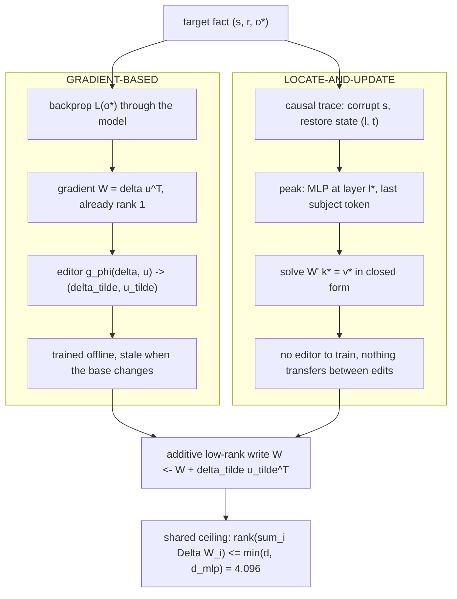
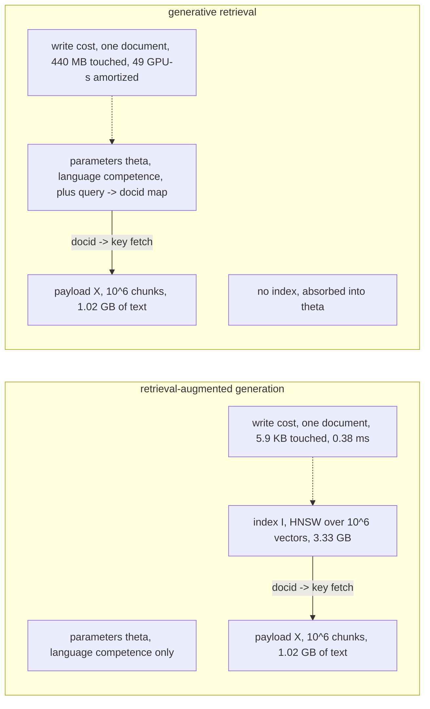
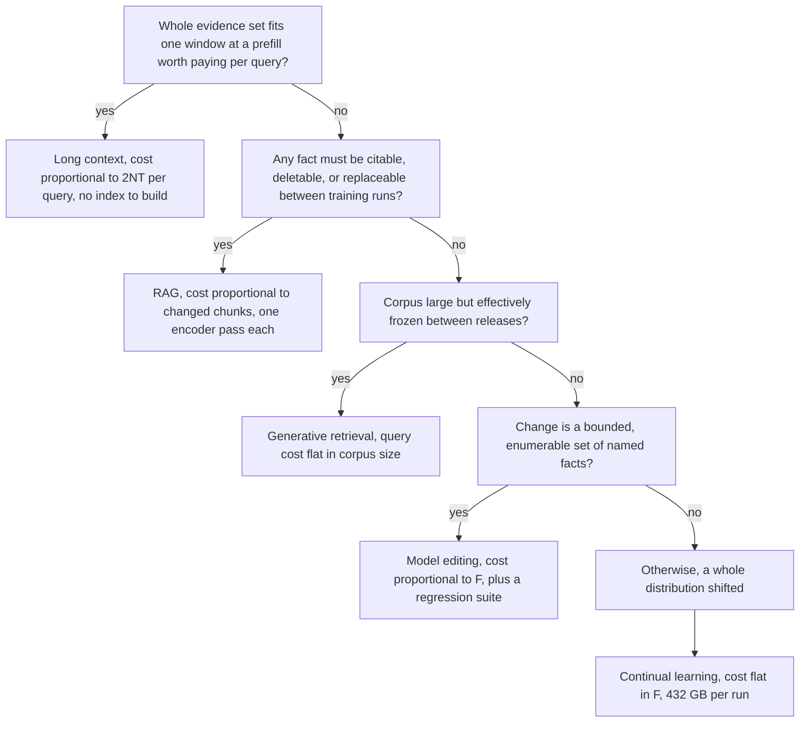

# Chapter 2: The Competing Answers to the Same Problem

Purpose: Choose among continual learning, model editing, long context, generative retrieval, and retrieval-augmented generation by matching each method to the constraint and cost shape it actually serves.

## TL;DR

- Retrieval-Augmented Generation (RAG) is the default for facts that change, need citations, or must be deleted because its update cost follows changed chunks.
- Continual learning changes a distribution or behavior, but learning grows linearly with the weight step while forgetting grows quadratically.
- Model editing can repair a bounded set of named facts, but the weight matrix has limited independent write directions. Collateral damage, logical inconsistency, and regression work also cap safe scale.
- Long context removes index maintenance only when the evidence fits comfortably, remains usable by position, and is worth paying for on every query.
- Generative retrieval moves the searchable index into model parameters. It does not move the document payload, and it replaces local writes with training runs.
- The decisive question is not which method wins an accuracy contest. It is what the method's cost scales with and which hard product constraint it satisfies.
- Weights are the right home for a distribution the model should have. A datastore is the right home for a fact the system may need to cite, change, or delete.

## The story

Imagine a legal library that receives a corrected rule every morning. The head librarian has five ways to keep answers current. First, she can retrain every librarian on the new shelves. That is continual learning, which means changing the model's weights by training on new material. The librarians learn the correction, but some old habits move too. The damage is catastrophic forgetting, which means prior abilities regress even though nobody intentionally erased them. Second, she can alter one association in a librarian's memory. That is model editing, which means rewriting a small internal key-value association for one named fact. It is fast for a few corrections. It becomes dangerous when many edits compete for the same limited directions in memory. Third, she can place every relevant book on the desk before each question. That is long context, which means putting evidence directly into the prompt. The desk has nominal capacity, but every question pays the reading bill again. Books near the middle may also receive less effective attention than books near either edge. Fourth, she can teach a librarian to say the shelf code directly. That is generative retrieval, which means decoding a document identifier instead of searching a separate index. The shelf-code map is the searchable index, and it moves into the model. The books remain on the shelves, so the payload store, the database that holds document text, still exists. Fifth, she can keep a searchable catalog, fetch a few books, and place only those on the desk. That is RAG, which means using retrieval to select evidence before generation. The catalog pays a local update when a book changes. Each query pays only for the selected passages. The metaphor exposes the real selection rule. Retrain the librarians when their overall behavior or language must change. Edit memory when a bounded set of named facts has no refresh cadence. Use the whole desk when the evidence is small, stable, shared, and positionally usable. Teach shelf codes when the library is effectively frozen and the query-to-code route is worth training. Keep the catalog when facts change, need citations, or must remain independently deletable.

## Decoder table

| Technical term | Plain-English meaning | Why it matters |
|---|---|---|
| Retrieval-Augmented Generation (RAG) | Search for a small evidence set, fetch its text, and place that text in the generator's prompt. | It keeps mutable evidence citable and ties updates to changed chunks. |
| Continual learning | Continue training a released model on new data. | It is the weight-based choice for a broad behavior or distribution change. |
| Catastrophic interference or catastrophic forgetting | A new training update damages abilities learned from the old distribution. | It explains why weight updates forget or how that damage is priced. |
| Released checkpoint | The fixed starting copy of model parameters before an update. | It explains why weight updates forget or how that damage is priced. |
| Parameter or weight | A learned numeric value inside the model. | It explains why weight updates forget or how that damage is priced. |
| Distribution | The pattern of examples, language, and behaviors represented by a dataset. | It explains why weight updates forget or how that damage is priced. |
| Loss | A numerical measure of model error that training tries to reduce. | It explains why weight updates forget or how that damage is priced. |
| Objective | The loss expression the optimizer is told to minimize. | It explains why weight updates forget or how that damage is priced. |
| Optimizer | The procedure that converts gradients into parameter updates. | It explains why weight updates forget or how that damage is priced. |
| Gradient | The local direction and rate at which a loss changes. | It explains why weight updates forget or how that damage is priced. |
| Learning rate | The scale applied to an optimizer step. | It explains why weight updates forget or how that damage is priced. |
| Step budget | The combined amount of movement allowed across learning rate and training steps. | It explains why weight updates forget or how that damage is priced. |
| Local minimum | A point where nearby moves do not reduce the old loss to first order. | It explains why weight updates forget or how that damage is priced. |
| Taylor expansion | A local approximation of a function by first-order and higher-order terms. | It explains why weight updates forget or how that damage is priced. |
| Hessian | The matrix of second derivatives that describes local curvature. | It explains why weight updates forget or how that damage is priced. |
| Curvature | How sharply old loss rises when weights move in a direction. | It explains why weight updates forget or how that damage is priced. |
| Fisher information matrix | The curvature proxy used here to weight parameter movement by old-distribution sensitivity. | It explains why weight updates forget or how that damage is priced. |
| Diagonal Fisher approximation | A practical version that stores one sensitivity value per parameter. | It explains why weight updates forget or how that damage is priced. |
| Anisotropic damage | Damage that depends on update direction, not only update length. | It explains why weight updates forget or how that damage is priced. |
| Stiff direction | A high-curvature direction where a small move causes large old-task loss. | It explains why weight updates forget or how that damage is priced. |
| Sloppy direction | A low-curvature direction where the same move causes less old-task loss. | It explains why weight updates forget or how that damage is priced. |
| Elastic weight consolidation (EWC) | A regularized continual-learning method that penalizes movement in Fisher-sensitive directions. | It explains why weight updates forget or how that damage is priced. |
| Regularizer | An extra objective term that discourages an unwanted kind of solution. | It explains why weight updates forget or how that damage is priced. |
| Low-rank adaptation (LoRA) | A parameter-efficient update that restricts a weight change to the product of two thin matrices. | It bounds how much a constrained weight update can learn or overwrite. |
| Rank | The number of independent directions represented by a matrix. | It bounds how much a constrained weight update can learn or overwrite. |
| Rank-one update | A matrix correction formed by one outer product. | It bounds how much a constrained weight update can learn or overwrite. |
| Adapter | A small trainable component that changes model behavior while the base weights stay fixed. | It bounds how much a constrained weight update can learn or overwrite. |
| Manifold | The lower-dimensional set of updates permitted by a constraint such as fixed rank. | It bounds how much a constrained weight update can learn or overwrite. |
| Replay | Mixing old-distribution examples into new training so the old objective remains represented. | It controls or detects regression during a weight update. |
| Synthesized replay | Replay examples sampled from the released model rather than drawn from real held-out data. | It controls or detects regression during a weight update. |
| Model collapse | Repeated self-training that sharpens common modes and thins the tail of the learned distribution. | It controls or detects regression during a weight update. |
| Re-warm and re-decay | Raise the learning rate from an ended schedule, then reduce it again during the update. | It controls or detects regression during a weight update. |
| Regression suite | Frozen questions used to detect damage to behavior unrelated to the update. | It controls or detects regression during a weight update. |
| Canary set | A compact frozen regression set that gates a release. | It controls or detects regression during a weight update. |
| Full fine-tuning | Updating the base model weights rather than a small adapter. | It controls or detects regression during a weight update. |
| Negative log likelihood | The training loss that penalizes low probability on the observed token. | It supports the stated Hessian and Fisher relationship at the old optimum. |
| Floating-point operation (FLOP) | One counted arithmetic operation used to price compute. | It determines accelerator memory, throughput, or compute cost. |
| Graphics processing unit (GPU) | The accelerator used for training or serving in the worked examples. | It determines accelerator memory, throughput, or compute cost. |
| Model FLOPs utilization (MFU) | The fraction of headline accelerator arithmetic sustained by the workload. | It determines accelerator memory, throughput, or compute cost. |
| Brain floating point 16-bit format (bf16) | A 16-bit numeric format used for dense accelerator arithmetic. | It determines accelerator memory, throughput, or compute cost. |
| Floating point 16-bit format (fp16) | A 16-bit storage or compute format used in examples. | It determines accelerator memory, throughput, or compute cost. |
| Floating point 32-bit format (fp32) | A 32-bit format that uses four bytes per stored number. | It determines accelerator memory, throughput, or compute cost. |
| Adam | The optimizer whose gradient and two moment buffers create large training state. | It determines accelerator memory, throughput, or compute cost. |
| Optimizer state | Gradients and moment buffers stored in addition to model weights. | It determines accelerator memory, throughput, or compute cost. |
| Bandwidth-bound decoding | Serving limited by how fast weights can be streamed from memory rather than by arithmetic. | It determines accelerator memory, throughput, or compute cost. |
| Byte units (kB, KB, MB, GB, TB) | Kilobyte, megabyte, gigabyte, and terabyte scales used for memory and bandwidth. | They convert parameter, index, payload, and cache sizes into hardware limits. |
| Encoder | A model that converts text into vectors for indexing or query search. | It defines the addressable retrieval path and its local update unit. |
| Embedding | A vector representation used for similarity search. | It defines the addressable retrieval path and its local update unit. |
| Chunk | A bounded text segment treated as one retrieval unit. | It defines the addressable retrieval path and its local update unit. |
| Index | A searchable structure that maps a query to document identifiers. | It defines the addressable retrieval path and its local update unit. |
| Payload store | The store that holds document text keyed by identifier. | It defines the addressable retrieval path and its local update unit. |
| Re-embedding and re-indexing | Recompute vectors for changed text and update the searchable structure. | It defines the addressable retrieval path and its local update unit. |
| Model editing | A targeted change to an internal association without a full training run. | It explains how a targeted edit is located, written, and capacity-limited. |
| Transformer | The layered sequence model whose attention and feed-forward blocks are analyzed here. | It is the shared base architecture behind every weight and context calculation. |
| Feed-forward block | The transformer sublayer that applies an expansion, nonlinearity, and projection at each token. | It explains how a targeted edit is located, written, and capacity-limited. |
| Multilayer perceptron (MLP) | The feed-forward network inside a transformer block. | It explains how a targeted edit is located, written, and capacity-limited. |
| Swish-Gated Linear Unit (SwiGLU) | The gated MLP variant named in the crossover sanity check. | It explains why measured parameter count raises the crossover above the simple block estimate. |
| Residual stream | The vector stream passed and updated across transformer layers. | It explains how a targeted edit is located, written, and capacity-limited. |
| Associative memory | A key-value interpretation in which patterns activate stored responses. | It explains how a targeted edit is located, written, and capacity-limited. |
| Key-value association | An input pattern paired with the value written back when that pattern activates. | It explains how a targeted edit is located, written, and capacity-limited. |
| Causal tracing | Corrupt a prompt, restore one hidden state, and measure how much the correct answer probability recovers. | It explains how a targeted edit is located, written, and capacity-limited. |
| Subject token | The token span naming the entity whose association is being tested. | It explains how a targeted edit is located, written, and capacity-limited. |
| Hidden state | A layer and token representation inside the model. | It explains how a targeted edit is located, written, and capacity-limited. |
| Indirect effect | The recovered correct-answer probability caused by restoring one hidden state. | It explains how a targeted edit is located, written, and capacity-limited. |
| Gaussian noise | The random corruption applied to subject embeddings during causal tracing. | It explains how a targeted edit is located, written, and capacity-limited. |
| Constrained least squares | Solve for a new mapping while minimizing disturbance to remembered mappings. | It explains how a targeted edit is located, written, and capacity-limited. |
| Uncentered covariance | The key-association matrix used to account for remembered key directions. | It explains how a targeted edit is located, written, and capacity-limited. |
| Outer product | A column vector times a row vector, producing a rank-one matrix. | It explains how a targeted edit is located, written, and capacity-limited. |
| Gradient-based editor | An auxiliary network that transforms raw gradient factors into a controlled edit. | It explains how a targeted edit is located, written, and capacity-limited. |
| Model Editor Networks with Gradient Decomposition (MEND) | The gradient-based editing method named in the source. | It explains how a targeted edit is located, written, and capacity-limited. |
| KnowledgeEditor | The other gradient-based editing method named in the source. | It explains how a targeted edit is located, written, and capacity-limited. |
| Rank-One Model Editing (ROME) | The one-edit-at-a-time locate-and-update method used in the worked example. | It explains how a targeted edit is located, written, and capacity-limited. |
| Mass-Editing Memory in a Transformer (MEMIT) | A method that solves many edits jointly across a band of critical layers. | It explains how a targeted edit is located, written, and capacity-limited. |
| Efficacy | Whether the target edited fact is produced. | It decides whether a successful target edit is safe to ship. |
| Locality or specificity | Whether unrelated facts and behaviors stay unchanged after an edit. | It decides whether a successful target edit is safe to ship. |
| Ripple effect | A logical consequence, inverse relation, composition, or paraphrase that should change with the edited fact. | It decides whether a successful target edit is safe to ship. |
| RippleEdits | The benchmark used to test whether logical consequences follow an edit. | It decides whether a successful target edit is safe to ship. |
| Context window | The maximum prompt capacity a model can accept. | It determines long-context capacity, cost, selection, or answer quality. |
| Long context | Supplying a large evidence set directly in the prompt. | It determines long-context capacity, cost, selection, or answer quality. |
| Corpus stuffing | Sending most or all of a knowledge base on every request and letting attention select. | It determines long-context capacity, cost, selection, or answer quality. |
| Top-k selection | Keep only the k highest-ranked retrieval candidates. | It separates evidence selection from window capacity. |
| Prefill | The computation that reads the prompt before the first output token. | It determines long-context capacity, cost, selection, or answer quality. |
| Attention | The token-to-token computation whose prompt cost grows quadratically with context length. | It determines long-context capacity, cost, selection, or answer quality. |
| Causal mask | The restriction that lets each token attend only to earlier tokens. | It determines long-context capacity, cost, selection, or answer quality. |
| Crossover length | The context length where weight-reading and attention prefill costs are equal. | It determines long-context capacity, cost, selection, or answer quality. |
| Nominal context | The advertised number of tokens the model can hold. | It determines long-context capacity, cost, selection, or answer quality. |
| Effective context | The portion and positions the model can use reliably. | It determines long-context capacity, cost, selection, or answer quality. |
| Closed-book baseline | Accuracy when the model answers without supplied evidence. | It determines long-context capacity, cost, selection, or answer quality. |
| Lost in the middle | The observed drop when the answer-bearing document sits near the middle of a long prompt. | It determines long-context capacity, cost, selection, or answer quality. |
| Key-value (KV) cache | Stored attention keys and values retained per prompt token during serving. | It determines long-context capacity, cost, selection, or answer quality. |
| Grouped-query attention | An attention design with fewer key-value heads than query heads. | It determines long-context capacity, cost, selection, or answer quality. |
| Prefix caching | Reuse the key-value cache for a shared prompt prefix. | It determines long-context capacity, cost, selection, or answer quality. |
| Cache invalidation | Discard cached work after an edit changes the prefix it depends on. | It determines long-context capacity, cost, selection, or answer quality. |
| Reranker | A more accurate later stage that reorders retrieved candidates. | It determines long-context capacity, cost, selection, or answer quality. |
| Recall headroom | Extra candidate capacity kept before final selection. | It determines long-context capacity, cost, selection, or answer quality. |
| Relevance cliff | The rank after which candidate relevance drops sharply. | It determines long-context capacity, cost, selection, or answer quality. |
| Global-synthesis query | A question whose evidence is the whole corpus rather than a top-ranked subset. | It determines long-context capacity, cost, selection, or answer quality. |
| Hierarchical summarization | Repeatedly summarize groups and then combine their summaries for global questions. | It determines long-context capacity, cost, selection, or answer quality. |
| Community summary | A graph-level summary used when evidence spans a connected corpus region. | It determines long-context capacity, cost, selection, or answer quality. |
| Generative retrieval | Decode a document identifier from a query instead of searching a separate index. | It explains which store generative retrieval moves and what training must learn. |
| Document identifier (docid) | The primary-key label emitted or returned by retrieval. | It explains which store generative retrieval moves and what training must learn. |
| Primary key | The exact identifier used to fetch one payload. | It explains which store generative retrieval moves and what training must learn. |
| Posting list | The documents associated with a term in an inverted index. | It explains which store generative retrieval moves and what training must learn. |
| Inverted index | A term-to-document searchable structure. | It explains which store generative retrieval moves and what training must learn. |
| Hierarchical Navigable Small World (HNSW) graph | The approximate vector-search graph used in the examples. | It explains which store generative retrieval moves and what training must learn. |
| Inverted file (IVF) cell | A vector-index partition used to narrow candidate search. | It explains which store generative retrieval moves and what training must learn. |
| Approximate nearest neighbor (ANN) lookup | Fast similarity search that avoids scoring every document. | It explains which store generative retrieval moves and what training must learn. |
| Bijection | A one-to-one assignment between documents and identifier labels. | It explains which store generative retrieval moves and what training must learn. |
| Stirling approximation | The approximation used to price the minimum bits for an arbitrary identifier assignment. | It explains which store generative retrieval moves and what training must learn. |
| Semantically structured identifier | A label derived from document similarity so part of the assignment is computable. | It explains which store generative retrieval moves and what training must learn. |
| Hierarchical clustering | Repeatedly group similar documents to create a structured identifier path. | It lowers the amount of arbitrary document naming the model must memorize. |
| Differentiable Search Index (DSI) | The generative-retrieval setup with indexing and retrieval objectives. | It explains which store generative retrieval moves and what training must learn. |
| DSI++ | The incremental generative-retrieval method measured across sequential corpora. | It explains which store generative retrieval moves and what training must learn. |
| Indexing objective | The training task that teaches document naming. | It explains which store generative retrieval moves and what training must learn. |
| Pseudo-query | A generated query-like training example paired with a document identifier. | It contributes most of the stated generative-retriever refresh tokens. |
| Routing objective | The training task that maps open query phrasings to the right identifier. | It explains which store generative retrieval moves and what training must learn. |
| Superposed map | A mapping distributed across many shared parameters with no local row for one document. | It explains which store generative retrieval moves and what training must learn. |
| Softmax | The output normalization where raising one identifier's probability takes probability mass from others. | It explains which store generative retrieval moves and what training must learn. |
| Hits at 10 (Hits@10) | Whether a relevant result appears in the first ten outputs. | It measures quality, freshness, or serving constraints in deployment. |
| Staleness service-level agreement (SLA) | The maximum allowed delay before new or retracted material affects retrieval. | It measures quality, freshness, or serving constraints in deployment. |
| Delta index | A small mutable index holding arrivals after the learned base was last trained. | It measures quality, freshness, or serving constraints in deployment. |
| Log-structured pattern | Keep a frozen base and a mutable recent layer, then query and merge both. | It measures quality, freshness, or serving constraints in deployment. |
| Constrained decoding | Restrict which identifiers a generative retriever may emit. | It measures quality, freshness, or serving constraints in deployment. |
| Unlearning | A requirement to remove a learned association, not merely suppress its output. | It measures quality, freshness, or serving constraints in deployment. |
| Adaptive retrieval | Retrieve only when a query needs external evidence. | It measures quality, freshness, or serving constraints in deployment. |
| Quantization | Store model or cache values with fewer bits. | It can lower memory constants but does not change the cost curve. |
| Tail latency at the 99th percentile (p99) | The latency value that 99 percent of requests meet. | It measures quality, freshness, or serving constraints in deployment. |
| Freshness cadence | How often new corpus state becomes available to queries. | It measures quality, freshness, or serving constraints in deployment. |
| Citability | The ability to connect an answer back to a source document. | It is a hard gate that selects the correct architecture. |
| Deletability | The ability to remove a fact through an addressable operation. | It is a hard gate that selects the correct architecture. |
| Replaceability | The ability to update one fact between model training runs. | It is a hard gate that selects the correct architecture. |
| Distribution shift | A broad change in data or desired behavior rather than a bounded list of facts. | It is a hard gate that selects the correct architecture. |

## Core mechanics

### Introduction

An answer sometimes needs knowledge that the released weights do not contain or no longer state correctly. This chapter compares five responses to that one problem. Continual learning writes a broad update into weights. Model editing writes a narrow update into weights. Long context puts evidence into the prompt. Generative retrieval puts the query-to-identifier index into weights while leaving payload text outside. RAG keeps facts in an addressable datastore and selects a small evidence set per query. The methods do not share one cost curve. The correct choice follows the constraint and the quantity that drives cost.

### 2.1 Continual learning and catastrophic forgetting

#### What it is and why it exists

The motivating case is a legal assistant built on an open-weight 27 billion parameter model. It ships in March. An appellate court reverses a standard in June. Training on the new opinions makes the assistant cite the reversal, but it also damages citation formatting and sends a venue answer to the wrong state. The update wrote 200 million new tokens into 27 billion parameters. Nothing was intentionally deleted. The optimizer simply moved shared parameters that supported more than the target facts. McCloskey and Cohen (1989) named this catastrophic interference in connectionist networks. Luo et al. (2023) found that continual instruction tuning eroded prior ability more severely at 7 billion parameters than at 1 billion. Scale did not remove the failure. Let the released checkpoint be theta zero. Let the old and new expected losses be the old loss and new loss. Let Delta be the accumulated update after T optimizer steps at learning rate eta.

$$
\Delta = \theta - \theta_0
$$

The naive objective minimizes only the new loss. It contains no term that protects the old loss. At a local minimum of the old loss, the old gradient is approximately zero. The first-order Taylor term vanishes. The old-loss increase is therefore approximately quadratic.

$$
\mathcal F(\Delta)
= L_{\mathrm{old}}(\theta_0+\Delta)-L_{\mathrm{old}}(\theta_0)
\approx \frac{1}{2}\Delta^{\mathsf T}H\Delta
\approx \frac{1}{2}\sum_i F_i\Delta_i^2
$$

For negative log likelihood evaluated at its own optimum, the Hessian coincides with the Fisher information matrix. The practical diagonal approximation stores one Fisher value per parameter. Forgetting is a curvature-weighted squared distance from the released checkpoint. The new loss is different. Its gradient at the released checkpoint is nonzero. The gain is first order.

$$
\text{new gain} \approx -g^{\mathsf T}\Delta
$$

Learning therefore grows linearly with update length. Forgetting grows quadratically. Halving the step keeps half the new knowledge and leaves one quarter of the damage. No setting gets both benefits. The point on this frontier is a product decision. Damage is also directional. A parameter direction pinned tightly by pre-training has a large Fisher value. An equal-length move along that stiff direction can cost nine times as much as a move along a sloppy direction when the constraint is three times tighter. The update cannot be aimed perfectly away from syntax, arithmetic, output format, or high-frequency entities.

#### What breaks and what the alternatives cost

Elastic weight consolidation directly penalizes the derived forgetting term.

$$
L_{\mathrm{new}}(\theta)
+ \frac{\lambda}{2}\sum_i F_i(\theta_i-\theta_{0,i})^2
$$

Kirkpatrick et al. (2017) showed that this mechanism works. It does not fit the operating constraints of the 27 billion parameter example. A diagonal Fisher in fp32 takes 108 GB. The Adam state already takes 432 GB. Estimating the Fisher also needs backward passes over the old distribution, which an open-weight user may not possess. The method asks for both the original data and another model-sized memory allocation. LoRA keeps the same principle in crude form. It restricts a matrix update to two thin factors of rank r.

$$
\Delta W = BA
$$

The permitted rank-r update manifold for a square width d matrix has dimension:

$$
r(2d-r)
$$

At width 4,096 and rank 16, the update can move in 130,816 of 16,777,216 directions. That is one direction in 128. Biderman et al. (2024) report the predicted pair of effects. LoRA forgets less than full fine-tuning and also learns less. Replay restores the missing old objective by sampling. With old-token fraction rho, the expected gradient becomes:

$$
(1-\rho)\nabla L_{\mathrm{new}}+\rho\nabla L_{\mathrm{old}}
$$

Ibrahim et al. (2024) report that re-warming and re-decaying the learning rate, plus replay near 5 percent of the original distribution, brings continual pre-training close to retraining on the union. Real held-out replay avoids the self-sampling loop. Synthesized replay repeatedly trains the model on its own outputs, which can amplify peaked modes and thin the tail. Retrieval takes the movement principle to its limit. It writes facts with Delta equal to zero. It cannot supply a new output form, language, or persistent vocabulary behavior.

#### A Worked Example

The source prices a quarterly update to Gemma 2 27B. The update contains 200 million tokens. An H100 is priced at 989 trillion dense bf16 FLOPs per second and 34 percent MFU, giving 340 trillion effective FLOPs per second. Continual pre-training uses the standard training estimate:

$$
6ND
= 6(2.7\times10^{10})(2\times10^8)
= 3.24\times10^{19}\ \mathrm{FLOPs}
$$

At the sustained rate, this is 95,300 seconds or 26.5 GPU-hours. A 5 percent replay fraction expands the stream to 210.5 million tokens. That is a 5.3 percent surcharge and 27.9 GPU-hours. The stream contains 10.5 million replay tokens. The 432 GB optimizer state needs six 80 GB cards before activations. If the base model's original data is unavailable, the released model can synthesize replay. Each decode step streams 54 GB of bf16 weights. At 3.35 TB per second, a step takes 16.1 milliseconds and returns a batch of 256 tokens. That is 15,900 tokens per second. Generating 10.5 million replay tokens takes 662 seconds or 0.18 GPU-hours. It is 0.7 percent of the training run. The hard part is sourcing faithful replay, not producing token volume. Re-embedding the same 200 million tokens with a 110 million parameter encoder costs:

$$
2ND
= 2(1.1\times10^8)(2\times10^8)
= 4.4\times10^{16}\ \mathrm{FLOPs}
$$

That is 129 seconds or 0.036 GPU-hours. At 512 tokens per chunk, the update creates 390,625 vectors. At 768 dimensions and four bytes per value, it adds 1.2 GB to the index. The compute ratio is independent of update size and MFU.

$$
\frac{6N_{\mathrm{gen}}D}{2N_{\mathrm{emb}}D}
= \frac{3N_{\mathrm{gen}}}{N_{\mathrm{emb}}}
= 736
$$

A quarterly retrain leaves a fact stale for 45.6 days on average. An hourly index build leaves it stale for 30 minutes. That is a freshness ratio of 2,190. Gemma 2 27B was pre-trained on 13 trillion tokens. The same estimate gives 2.11 times 10 to the power 24 FLOPs or 1.7 million GPU-hours. The quarterly run is only one sixty-five-thousandth of pre-training. Continual learning is cheap for writing weights and still 736 times the cost of writing the same knowledge into an index.

#### What You Actually Decide in Practice

- Default to retrieval for facts and continual learning for form.
- Use weights when no datastore can exist, such as the stated edge or air-gapped constraint.
- Freeze 200 to 500 unrelated regression questions.
- Accept the largest eta times T whose regression delta stays inside a stated tolerance.
- Start with LoRA rank 16 before full fine-tuning.
- Move to full fine-tuning only when the adapter underfits the larger new corpus.
- Budget 5 percent replay and a fresh learning-rate warm-up.
- Move toward 10 percent replay for a genuine distribution shift.
- Prefer real held-out replay over synthesized replay.
- Price cadence rather than one run.
- Quarterly continual training costs 106 GPU-hours per year plus four regression cycles.
- Quarterly re-indexing costs about 0.14 GPU-hours per year.
- Prefer continual learning for a one-off capability addition that can amortize.
- Prefer retrieval for a recurring knowledge feed that never stops changing.

#### How This Shows Up in Interviews

For weekly documentation, answer with the mechanism and exchange rate. The objective omits old loss, forgetting is quadratic, learning is linear, and weight writing costs 736 times re-indexing in the worked setup. Concede that fine-tuning owns form, style, and vocabulary. For a fully offline regulator deployment, take the no-datastore constraint as binding. Use rank constraint, learning-rate re-warm and re-decay, 5 percent replay, and a frozen canary gate. Sampling replay is only 0.7 percent of the run, but repeated synthesized replay risks model collapse. For a demand to remove an old legal standard, separate current-answer accuracy, suppression of the old rule, and certified removal from weights. Retrieval handles current grounded answers and can keep both versions with effective dates. Continual training cannot certify that the old association is gone.

#### Key Takeaways

Forgetting has a quadratic form. Learning is first order in step length. Damage lands according to Fisher curvature. EWC prices the right mechanism but needs 108 GB of Fisher state and unavailable old data. LoRA and replay reduce damage but preserve the trade. Re-indexing wins recurring factual updates by 736 to one in the worked example.

### 2.2 Model editing: gradient-based and locate-and-update

#### What it is and why it exists

The motivating fact says an enterprise tier includes 24/7 phone support even though the service ended in March. The assistant has told customers this for three months, and the vice president wants the claim gone by Friday. The claim is one sentence inside a 27 billion parameter model. At fp32, the model needs 108 GB for weights in the forward pass before gradients, optimizer state, or activations. A full retrain is not a Friday repair. A transformer feed-forward block computes:

$$
\mathop{\text{MLP}}(h)
= W_{\mathrm{proj}}\sigma(W_{\mathrm{fc}}h)
$$

The residual vector h has width d. The first matrix expands it to the feed-forward width. The projection matrix writes the result back to the residual stream. Geva et al. (2021) interpret these matrices as an associative memory. Rows of the expansion matrix act like keys. Columns of the projection matrix act like values. Editing one fact becomes rewriting one key-value association. Locate-and-update methods first find a site with causal tracing. Meng et al. (2022) run a prompt in three conditions.

1. Run it clean and record the probability of the correct object.
2. Corrupt the subject embeddings with Gaussian noise and observe the probability collapse.
3. Keep the prompt corrupted but restore one hidden state at layer l and token position t.

The recovered probability is the indirect effect of that state. Sweeping all layer and token positions produces a map. The source reports a sharp peak in mid-layer feed-forward modules at the final subject token. Writing at that site is constrained least squares. The goal is to send a new key to a new value while disturbing remembered key-value pairs as little as possible. The solution is rank one.

$$
W^{\prime}
= W+\Lambda(C^{-1}k^{*})^{\mathsf T}
$$

C is the uncentered covariance of remembered keys estimated from text. For GPT-J 6B, d is 4,096 and the feed-forward width is 16,384. The edited matrix has 67.1 million parameters. The update carries 20,480 free numbers. That is 0.031 percent of the matrix and 0.00034 percent of the model. It needs no optimizer state, training corpus, or full training run. Gradient-based editing starts from the desired output loss. The naive aggressive step overfits and scatters damage. MEND from Mitchell et al. (2022) and KnowledgeEditor from De Cao et al. (2021) train a small auxiliary network to transform the raw gradient into a controlled edit. For a linear layer, the gradient is already an outer product:

$$
\nabla_W L
= (\nabla_y L)x^{\mathsf T}
= \delta u^{\mathsf T}
$$

The editor can consume the two factors instead of every matrix entry. A full map from a 4,096 by 4,096 gradient to an equally large edit would need 280 trillion parameters. That is about 47,000 times the 6 billion parameter base model. Operating on the factors costs 33.6 million parameters.

#### What breaks and what the alternatives cost

Both editing families end with an additive low-rank write. They therefore share a hard capacity ceiling.

$$
\Delta W
= \sum_{i=1}^{n}u_iv_i^{\mathsf T}
$$

$$
\mathop{\text{rank}}(\Delta W)
\leq \min(n,d,d_{\mathrm{mlp}})
$$

GPT-J offers at most 4,096 independent directions per edited matrix. After that point, each new direction is a linear combination of directions already used. New facts then move values installed by older edits. MEMIT from Meng et al. (2023) spreads a joint write across a contiguous band of R critical layers. This multiplies the ceiling by R and removes sequential interference within the solved batch. It does not remove the ceiling. The source tests the scale against scientific publishing. At 2.5 million new articles per year and 20 checkable claims each, the stream contains 50 million edits per year. Even all 28 GPT-J layers provide only 114,688 independent directions. The first year exceeds capacity by a factor of 436. Hase et al. (2023) found that the layer highlighted by causal tracing is often not the layer where an edit works best. Trace strength barely predicts edit success. The batched closed-form write buys more scale than the localization map. Cohen et al. (2024) use RippleEdits to show another failure. Editors install the target triple but often fail logical consequences. A footballer can be moved to a North American club while the model still places him in a European league one question later. Target efficacy is necessary and insufficient.

#### A Worked Example

The assistant uses GPT-J 6B with 28 layers, residual width 4,096, and feed-forward width 16,384. The catalog turns over 12,000 facts per quarter. Continual fine-tuning uses 12 bytes of 16-bit Adam state per trainable parameter. Six billion parameters therefore need 72 GB before activations. It also carries the forgetting problem. One-at-a-time ROME writes 20,480 numbers per edit into a 67.1 million parameter matrix. Twelve thousand rank-one terms still produce rank no greater than 4,096. From edit 4,097 onward, each new key depends on directions earlier edits occupy. The newest fact can remain effective while a general benchmark falls. MEMIT across six mid-layers gives:

$$
6(4{,}096)=24{,}576
$$

The 12,000 facts fit under that ceiling. Joint solving also avoids placing each edit on top of a matrix disturbed by the previous edit. One edit optimizes one vector for about 25 steps over a 20-token prompt. That is 500 training tokens. The standard estimate gives 18 trillion FLOPs per edit and 216 quadrillion FLOPs for 12,000 edits. A single fine-tuning epoch over 1 billion tokens costs 36 quintillion FLOPs. Editing is about 170 times cheaper. MEMIT reports 10,000 installed facts. That is 41 percent of the 24,576-direction ceiling. The honest conclusion is that editing scales to about ten thousand facts on this 6 billion parameter model, not that it scales without limit. Editing also destroys historical addressability. Overwriting a past chief executive answer may make the current answer correct while removing the ability to answer the historical question. A versioned datastore can keep each fact with its validity interval. A weight matrix holds only the current winner.

#### What You Actually Decide in Practice

- Default to retrieval for facts with a refresh cadence.
- Reserve editing for bounded facts with no expected refresh.
- Consider editing for persistent behavior that retrieved text cannot reliably suppress.
- Budget sequential edits at no more than 10 percent of the rank ceiling before a full review.
- For one edited GPT-J matrix, this means a few hundred edits between regression runs.
- Move upward only with a jointly solved batch such as MEMIT.
- Gate on held-out locality and a before-and-after general benchmark.
- Treat 97 percent edit success without unrelated benchmarks as incomplete evidence.
- Test three ripple types for every edit: an inverse relation, a one-hop composition, and a paraphrase.
- Keep the ten-minute ripple test even when the target triple passes.
- Preserve superseded facts in a versioned datastore.
- Treat a legal erasure demand as unlearning, not as an ordinary edit.
- Pin the base checkpoint for a trained gradient editor because changing the base silently invalidates the editor.

#### How This Shows Up in Interviews

For one wrong product fact in a 27 billion parameter model, price the choices first. Full retraining needs 108 GB for fp32 weights alone. Editing writes roughly 20,000 numbers but requires regression, while retrieval changes one addressable row and fits a fact that will change again. For 5,000 sequential edits with 97 percent efficacy and a four-point general benchmark drop, lead with rank. The update passed the 4,096-direction ceiling, so new edits reused old directions. The structural response is joint batching across layers, not merely raising a tuning knob. For a retracted medical claim that an auditor says must be impossible to assert, accuracy is not the binding constraint. An edit lowers probability but cannot certify a negative over a weight matrix. Remove the document from an addressable datastore and use grounding plus abstention if the claim remains latent in pre-training.

#### Key Takeaways

Model editing rewrites an internal key-value association. Both method families end with a low-rank correction and share a rank ceiling. Causal tracing localizes a state, but localization strength does not reliably predict the best edit layer. The edited triple is the easy test. Locality and logical ripple decide deployment. Editing is about 170 times cheaper than a fine-tuning epoch and still 436 times short of the live-literature workload.

### 2.3 Long context vs retrieval

#### What it is and why it exists

The challenge starts with an 8 million token support corpus and a generator advertised with a million-token window. The proposed shortcut is to prune the corpus, paste it into every prompt, and delete the chunker, embedding job, vector store, and retrieval on-call work. The proposal changes no weights and builds no searchable index. It transfers the cost to serving. Let N be generator parameters, L be layers, d be residual width, and C be prompt tokens. Prefill has two terms. Every token reads every parameter once. Attention also compares token positions and applies the resulting weights. The causal mask leaves the lower triangle, producing:

$$
F_{\mathrm{prefill}}(C)
\approx 2NC+2LdC^2
$$

The terms are equal at:

$$
C^{*}=\frac{N}{Ld}
$$

For an 8 billion parameter decoder with 32 layers and width 4,096, the crossover is 61,035 tokens. Below it, doubling context roughly doubles prefill. Above it, attention dominates and doubling context roughly quadruples prefill. A retrieved prompt near 3,000 tokens remains in the linear regime. A 210,000-token stuffed prompt is 3.4 times the crossover and pays the quadratic term. A context window is capacity. Retrieval is selection. Capacity is billed on each query. Selection is primarily paid at indexing time and then limits how much evidence reaches prefill. Liu et al. (2023) measured position effects in multi-document question answering and synthetic key-value retrieval. Accuracy was strongest near the start and end and weaker in the middle. With the gold document in the middle, accuracy could fall below the closed-book baseline. Extended-context variants did not materially improve the shape of the curve. Buying a larger window buys capacity, not reliable use of every position. Corpus stuffing loses on compute and latency because it declines to perform the cheapest selection step. It does not prove retrieval always wins. Retrieval can also flip a correct parametric answer to wrong. Use retrieval to select, then spend extra window capacity on candidate and reranking headroom. One query class genuinely needs whole-corpus evidence. The example asks for three complaints recurring across all 12,000 tickets. No top-k set of eight chunks can represent that evidence. Route such work to hierarchical summarization or graph community summaries rather than pretending ordinary retrieval solved it.

#### A Worked Example

The support corpus contains 12,000 articles at 700 tokens each, or 8.4 million tokens. Chunking at 350 tokens creates 24,000 chunks. The generator has 8 billion parameters, 32 layers, width 4,096, and eight grouped-query key-value heads of width 128. It runs in fp16 on one 80 GB card at 340 trillion effective FLOPs per second and 2.50 dollars per GPU-hour. The KV cache per token is:

$$
2(32)(1024)(2\ \mathrm{bytes})
= 131\ \mathrm{kB}
$$

Corpus stuffing prunes to the 300 most-viewed articles, or 210,000 tokens. Weight reading costs 3.36 quadrillion FLOPs. Attention costs 11.6 quadrillion FLOPs, which is 3.4 times the weight term. Total prefill costs 14.9 quadrillion FLOPs or 43.8 seconds. The prompt needs 27.5 GB of KV cache. With 16 GB of weights resident, one 80 GB card holds two requests. Retrieval selects eight 350-token chunks and adds 200 instruction tokens. The prompt length is 3,000. Weight reading costs 48 trillion FLOPs. Attention costs 2.36 trillion FLOPs, only 5 percent of the bill. Total prefill costs 50.4 trillion FLOPs or 148 milliseconds. Query embedding plus the HNSW probe over 24,000 vectors adds about 1 millisecond. The KV cache is 0.393 GB. The 64 GB available beyond weights holds 162 concurrent requests. Seventy times fewer tokens buys 296 times less compute because the dominant attention bill squares the token ratio. At 2.50 dollars per GPU-hour, one stuffed query costs 0.0304 dollars. One retrieved query costs 0.000103 dollars. At 100,000 queries per day, stuffing consumes 4.38 million GPU-seconds. That is 50.7 GPU-days of work per day, 51 cards at full load, and 3,000 dollars daily. Retrieval consumes 14,800 GPU-seconds. That is 17 percent of one card and 10.30 dollars daily. The 43.8-second latency already rejects stuffing for an interactive product. For a standard transformer block, attention has about four times d squared parameters and the MLP has about eight times d squared. This gives approximately 12 times L times d squared model parameters. The crossover then becomes about 12d, or 49,152 tokens at width 4,096. The measured 61,035 is 24 percent higher because the stated SwiGLU MLP and untied embeddings add parameters without adding the same attention work. Scaling changes the crossover but not the shape. A 70 billion parameter decoder with 80 layers and width 8,192 crosses at 106,812 tokens.

#### What breaks and what the alternatives cost

Prefix caching is the strongest case for corpus stuffing. If a small, static corpus is shared by every request, prefill it once and reuse the KV cache. This converts recurring compute into resident memory. The argument fails as the prefix grows or changes. At 131 kB per token, an 800,000-token prefix needs 105 GB of KV cache. It does not fit one 80 GB card before a user-specific suffix arrives. Changing one article invalidates the cached suffix from that position to the end. A daily-changing corpus repays the prefill each day. Quantizing KV state to eight bits or using fewer KV heads can reduce the memory constant by a factor of two to four. It does not remove the linear memory curve or the quadratic attention term. Long context also exposes distractor and position effects. If reducing k from 20 to 5 raises accuracy, two mechanisms may explain it. The removed chunks may be noise. The surviving gold chunk may also move away from the weak middle. Hold k at 20 and reorder candidates to isolate position from content.

#### What You Actually Decide in Practice

- Compute the generator's crossover before the design meeting.
- Defend retrieval above about 61,000 tokens for the stated 8 billion parameter model.
- Defend retrieval above about 107,000 tokens for the stated 70 billion parameter model.
- Deviate for a small, static, shared corpus whose prefix can be cached once.
- Quote KV bytes per token rather than only the advertised window length.
- Spend a larger window on about 20 reranker candidates rather than on the full corpus.
- Stop after chunk three when relevance falls off after rank three.
- Plant a known fact at ten positions across the real prompt and measure the accuracy curve.
- Once a reranker fixes order, focus the continuing test on the top three positions.
- Route global-synthesis queries toward long context or hierarchical operators.

#### How This Shows Up in Interviews

For a 200,000-token knowledge base and a 256,000-token window, price prefill before stating a preference. At 210,000 tokens in the example, 70 times more context costs 296 times more compute, 43.8 seconds, and 27.5 GB of KV cache. Retrieval gives 148 milliseconds and 162 concurrent requests per card. For k falling from 20 to 5 and accuracy rising, name distractor removal and positional movement. Keep k at 20 and reorder to distinguish the two. If reordering fixes accuracy, position was the problem. If it does not, ranks 6 through 20 were noise. For an 800,000-token static prefix and a 1 million token window, concede that reusable prefill removes the per-query compute argument. Then price the 105 GB KV cache and the daily invalidation cost. Use the cached path for global synthesis and retrieval for ordinary local questions.

#### Key Takeaways

Prefill combines a linear weight term and a quadratic attention term. The crossover is 61,035 tokens for the stated 8 billion parameter model. A 70-fold context ratio becomes a 296-fold compute ratio. The same card holds two stuffed requests or 162 retrieved requests. Nominal capacity does not guarantee effective use of middle positions. Prefix caching moves the problem to resident memory and invalidation.

### 2.4 Generative retrieval: putting the index back in the weights

#### What it is and why it exists

A classical retrieval stack has three stores.

1. Parameters theta hold language competence and whatever training absorbed.
2. Index I maps a query to a short list of document identifiers.
3. Payload X stores document text by identifier.

A classical RAG query searches I, receives identifiers, fetches text from X, and puts that text into theta's context. The index can be an inverted index, an HNSW graph, or IVF cells. Generative retrieval deletes only I. The model reads a query and decodes a docid one token at a time. That docid still performs a primary-key fetch from X. The method replaces the card catalog, not the shelves. The distinction controls what capacity is buying. Take 1 million chunks of 256 tokens and a T5-base retriever with 220 million fp16 parameters. Assigning arbitrary identifiers to documents requires at least:

$$
\log_2(N!)
\approx N\log_2N-N\log_2e
$$

$$
10^6(19.93-1.44)
= 1.85\times10^7\ \mathrm{bits}
= 2.31\ \mathrm{MB}
$$

The fp16 parameter pool holds 3.52 billion bits. Naming all documents consumes 0.53 percent of that pool. The costly map runs in the other direction. It maps an open set of query phrasings to the correct identifier. Tay et al. (2022) train the naming objective and query-routing objective side by side in DSI. Routing consumes the meaningful capacity. Semantically structured identifiers can reduce the naming floor. Hierarchical clustering makes part of the assignment computable from document similarity. Clustering cannot make the open query-to-identifier route free. The payload never enters theta. At roughly four bytes per token, 1 million chunks times 256 tokens require 1.02 GB of text. That payload still needs storage, replication, backup, and fetching. The removed vector index stores 1 million vectors. Each has 768 four-byte dimensions, or 3,072 bytes, plus about 256 bytes of graph edges. The index size is 3.33 GB.

#### What breaks and what the alternatives cost

A conventional index accepts a local write. An inverted index appends posting-list entries. An HNSW index allocates a node and rewires a bounded neighborhood. A generative retriever has no local parameter region for one document. The query-to-identifier map is superposed across all 220 million parameters. Its write primitive is a gradient update over the model. Model editing does not repair this write path. Locate-and-update expects a canonical subject key that can be localized. The query side is an open set of paraphrases with no single surface form. Fine-tuning only the new documents also steals softmax probability mass from existing identifiers. Mehta et al. (2023) report in DSI++ that sequential corpus indexing substantially forgets documents indexed earlier. Generative retrieval changes how the system finds documents. It does not change where payload knowledge lives. Its constant query latency and quality ceiling are retrieval-architecture properties.

#### A Worked Example

The corpus has 1 million chunks of 256 tokens. The embedding encoder has 110 million parameters and width 768. The generative retriever has 220 million parameters in fp16. The HNSW graph uses 32 neighbors. Each accelerator sustains 150 trillion FLOPs per second. The ingestion rate is 400 documents per day. One RAG upsert embeds a 256-token document:

$$
2(1.1\times10^8)(256)
= 5.63\times10^{10}\ \mathrm{FLOPs}
$$

That takes 0.38 milliseconds. The new vector and edge list use 3,328 bytes. Back-edges touch about 32 times log base 2 of 1 million, or 638 slots. At four bytes per slot, that adds 2,552 bytes. The total rewrite is 5.9 KB out of 3.33 GB. The other 99.9998 percent stays bit-for-bit identical. The generative refresh has no smaller unit than training. Each document contributes the first 64 tokens plus ten generated pseudo-queries of 16 tokens each. That is 224 tokens per document per epoch. Across ten epochs and 1 million documents, training reads 2.24 billion tokens.

$$
6PT
= 6(2.2\times10^8)(2.24\times10^9)
= 2.96\times10^{18}\ \mathrm{FLOPs}
$$

Eight accelerators sustain 1.2 quadrillion FLOPs per second. The refresh takes 2,464 seconds, 41 minutes of wall time, and 5.5 GPU-hours. All 440 MB of parameters change. Across 400 daily arrivals, the amortized cost is 49.3 GPU-seconds per document. The byte ratio is 75,000. The compute ratio is 130,000. Both accountings land near five orders of magnitude. The 1.02 GB payload receives the same one-document append in both architectures. DSI++ reports 21.1 percent average Hits@10 improvement over competitive baselines with six times fewer model updates across five sequential corpora. Applying that six-fold benefit lowers the amortized refresh to 8.2 GPU-seconds per document. It remains 22,000 times the 0.38-millisecond upsert.

#### What You Actually Decide in Practice

- Ask when an employee can find a document published this morning.
- Treat seconds for an upsert and 41 minutes plus queue, evaluation, and rollout as different freshness regimes.
- Deviate toward generative retrieval for a genuinely frozen versioned corpus updated quarterly.
- Keep the payload store even when deleting the vector index.
- Remove the payload only when the identifier itself is the product, such as a route or label.
- Size parameters against the routing map, not the 2.31 MB naming floor.
- Consider a larger model when queries are lexically far from documents.
- Write the staleness SLA before prototyping.
- A 41-minute rebuild can support an hourly SLA and cannot support a minute-level SLA.
- Put fresh arrivals in a mutable ANN delta index, query both paths, and merge.
- Expect two retrieval paths to cost more than the deleted index below roughly 1 million documents.

#### How This Shows Up in Interviews

When asked what a generative retriever memorizes, separate parameters, index, and payload. The searchable index dissolves into weights. The 1.02 GB payload remains, and the docid still performs a primary-key fetch. For a legal retraction within one hour, separate suppression, payload deletion, and unlearning. Masking the identifier during constrained decoding stops return immediately. Deleting X removes the payload, while removing the learned association from theta still needs rebuilding plus evaluation and rollout. For growth from 1 million to 100 million chunks, query identifier length grows only logarithmically. Per-document parameter capacity falls one hundredfold. The 41-minute rebuild rises to 68 hours, so a generative-only architecture loses the freshness regime. The source closes by keeping the index and using the parametric route as an additive source of candidate context, not as a universal replacement for retrieval.

#### Key Takeaways

Generative retrieval relocates the index and not the payload. Arbitrary naming costs only 2.31 MB for 1 million documents. Routing from open query language consumes the model capacity. One local index update touches 5.9 KB and takes 0.38 milliseconds. One amortized generative refresh touches 440 MB and costs 49.3 GPU-seconds per document. The write gap is structural.

### 2.5 Choosing between them out loud in an interview

#### What it is and why it exists

The design prompt says an application programming interface assistant answers from internal documentation. The docs change every sprint. Customers still hear about endpoints deprecated two releases ago. Saying "build RAG" is often correct and still incomplete. The interviewer is testing whether the candidate can rule methods out by constraint and cost shape. Let N be generator parameters. Let F be facts changed in one update cycle. Let T be evidence tokens read per query. Continual learning costs a training run that is flat in F. For a 27 billion parameter model trained in fp32 with Adam, weights, gradients, and two moments use 16 bytes per parameter.

$$
27\times10^9(16\ \mathrm{bytes})
= 432\ \mathrm{GB}
$$

The cost is the same whether one fact or ten thousand facts changed. Replay then pulls the update toward the unchanged distribution. Model editing has a small per-edit cost linear in F. Its regression and contradiction risk grow with the edit set. The regression suite, not raw edit execution, sets the release schedule. Long context has no update cost. Its prefill bill follows evidence tokens on every query. The source uses the linear forward approximation 2NT here, then adds the previously derived attention and position costs when context is large. Generative retrieval keeps query cost roughly flat as corpus size grows. New identifiers live in weights, so corpus churn triggers training. RAG has update cost linear in changed chunks at one encoder forward pass each. Query cost is ANN search plus prefill for the selected k chunks. The team controls k. Weights fit a distribution the model should have. The datastore fits facts that must be cited, changed, or deleted. Fine-tuning 3 percent of a corpus pays 100 percent of a training run, needs replay to protect the other 97 percent, and still provides no span-to-document link.

#### Decision gates in source order

1. Ask whether the whole evidence set fits one window at a prefill cost worth paying on every query.
2. Ask whether any fact must be citable, deletable, or replaceable between training runs.
3. Ask whether the corpus is large but effectively frozen between releases.
4. Ask whether the change is a bounded, enumerable set of named facts.
5. Treat the remaining case as a whole distribution shift.

Fitting is not the same as being usable. A corpus inside a 128,000-token window can perform worse than closed-book when the relevant passage sits in the middle. Read the first gate as fitting with room to spare while keeping the answer near an edge. A 30,000-token corpus may make an embedding model, vector store, and reranker unnecessary.

#### A Worked Example

The documentation contains 12,000 chunks of 512 tokens, or 6,144,000 tokens. Each two-week sprint changes 3 percent. That is 360 chunks and 184,320 tokens. The generator has 27 billion parameters. Continual learning needs 432 GB of optimizer state. An eight-card node with 80 GB per card has 640 GB total and leaves 208 GB for activations. The fit is tight rather than comfortable. The team repeats it 26 times per year to move 3 percent each time. Model editing sees about eight checkable statements per changed chunk. That is 2,880 edits. At a generous one second per edit, raw execution takes 2,880 seconds or 48 minutes. The edits are affordable. Proving that they left the other 11,640 chunks' behavior unchanged is the costly part. The result still lacks citations. Long context over only the changed subset costs:

$$
2(27\times10^9)(184{,}320)
= 9.95\times10^{15}\ \mathrm{FLOPs\ per\ query}
$$

Pasting the full 6,144,000-token corpus costs 332 quadrillion FLOPs per query under the same linear approximation. RAG with five chunks reads 2,560 tokens.

$$
2(27\times10^9)(2{,}560)
= 1.38\times10^{14}\ \mathrm{FLOPs\ per\ query}
$$

It is 72 times cheaper than pasting the changed subset and 2,400 times cheaper than pasting the whole corpus on every query. Re-embedding 184,320 changed tokens with a 110 million parameter encoder costs 40.6 trillion FLOPs. An entire sprint's re-index is about one eight-thousandth of one full-corpus long-context query. As a sanity check, the same bytes-per-parameter method gives 810 GB for LLaMA 3.1 405B at fp16 inference. That exceeds the 640 GB eight-card node. The arithmetic correctly predicts a need for multiple nodes or reduced precision.

#### What You Actually Decide in Practice

- Name proportionality before method.
- Say that a 3 percent update needs a cost that follows changed chunks, then select RAG.
- Put citable, deletable, or replaceable facts in a datastore.
- Put behavior, format, refusal style, and domain vocabulary in weights.
- Start with small k and stop where relevance falls off.
- Use long context for whole-document or whole-corpus synthesis.
- Use adaptive retrieval when the model already knows popular facts.
- Mallen et al. (2023) found retrieval flipped roughly 10 percent of otherwise-correct answers to wrong, concentrated on high-popularity entities.
- Retrieve unconditionally for private or post-cutoff domains with no correct parametric answer to protect.
- Re-walk the gates when window size, compliance rules, corpus cadence, or another binding constant changes.

#### How This Shows Up in Interviews

For sprint-changing documentation, state the update shape and citation requirement first. RAG follows changed chunks. Fine-tuning pays a full run for 3 percent, needs replay for 97 percent, and still cannot cite the current document. For million-token windows, concede the removal of index and embedding staleness. Then price a 6.1 million token corpus at about 2,400 times a five-chunk prompt and add the middle-position accuracy failure. If a smaller corpus truly fits with room and usable position, long context can win. For a 400-millisecond p99 limit, treat ANN lookup and reranking as real tens-of-milliseconds work. Use caching and smaller k to fit retrieval inside the budget. A nightly fine-tune still pays a full training run and does not produce the citation that caused the ticket.

#### Key Takeaways

Continual learning and generative retrieval have update costs flat in changed facts. Model editing is linear in changed facts. Long context is linear in query traffic and at least linear in evidence tokens. RAG is linear in changed chunks and selected prompt evidence. The gates test hard constraints before method quality. Re-walk them when a binding constant changes.

## Diagrams

### Figure 2.1

```text
(a) iso-forgetting contours of F(Delta) = 1/2 Delta^T F Delta

                              step l up: F = 9
                                      ^
                                      |
                 .--------------------|--------------------.   F = 9
              .-----------.           |           .-----------.
            .------.        .         |         .        .------.
  sloppy  <-   9        4       F = 1 theta0 ------> same step l right: F = 1
  Fi small                            |
                                      |
                                      v
                                stiff, Fi large

(b) what one step buys and what it costs

normalized amount
1      |                              *
       |                         _.-'  :
1/2    |-------------*------.-'       :  learned proportional to step
       |           . :    .'          :
1/4    |-------o-----:---'             :  forgotten proportional to step squared
       |    .-'      :                 :
0      +-------------+-----------------+----> step size
                    1/2                1

At step 1/2, learned = 1/2 and forgotten = 1/4.
```

> Figure 2.1: Forgetting is the quadratic form 1/2 Δ^T F Δ, so the same step length costs nine times as much along a direction the pre-training distribution constrained three times as tightly (a), and shrinking a step trades linearly on what it buys against quadratically on what it destroys (b) - halving the step keeps half the new knowledge for a quarter of the damage.

### Figure 2.2



> Figure 2.2: The two editing families differ in how they choose what to write, but both end at an additive low-rank correction to a feed-forward weight matrix - so both inherit the same hard ceiling on how many independent facts can be installed.

### Figure 2.3

```text
(a) prefill time, 8B decoder at 3.4 x 10^14 FLOP/s

100 s |                                            quadratic 2LdC^2
      |                                  * stuffed, 210k tokens
43.8 s|                                .'
 10 s |                     o C* = N/(Ld) = 61,035
      |                  _.'
  1 s |              _.-'       linear 2NC
0.1 s | * k = 8, 3k tokens, 148 ms
      +---------+----------+----------+----------> context tokens C
             10^3       10^4       10^5       10^6

(b) one 80 GB card, 131 kB of KV cache per token

stuffed, 2 concurrent
0 GB  [weights 16 GB][KV 27.5 GB][KV 27.5 GB][idle]  80 GB

retrieved, 162 concurrent
0 GB  [weights 16 GB][162 x 0.39 GB of KV cache.........]  80 GB
```

> Figure 2.3: Prefill is linear in context up to C ∗ = N/(Ld) = 61,035 tokens and quadratic above it, which turns a 70× token ratio into a 296× compute ratio. The same 80 GB card then holds two stuffed requests or 162 retrieved ones.

### Figure 2.4



> Figure 2.4: Generative retrieval relocates one of the three stores, not all of them. The index dissolves into the parameters, the payload store survives unchanged and is still addressed by primary key, and the write path changes by five orders of magnitude because a superposed map has no local write.

### Figure 2.5



> Figure 2.5: Each gate tests a constraint you already have - window size, citability, corpus volatility - rather than which method scores best, and every leaf is labeled by what its cost scales with.

## Whiteboard pack

### Numbered drawing order

1. Write the target problem at the top: knowledge outside or wrong inside released weights.
2. Draw the first gate for whole-evidence fit and per-query prefill.
3. Send its yes branch to long context.
4. Draw the hard gate for citation, deletion, and replacement.
5. Send its yes branch to RAG.
6. Draw the frozen-corpus gate and send yes to generative retrieval.
7. Draw the bounded named-fact gate and send yes to model editing.
8. Send the remaining distribution-shift case to continual learning.
9. Label every leaf with its cost driver.
10. Add the closing rule: weights for distributions, datastore for mutable facts.

### 90 to 100 word script

Start with the constraint, not the favorite method. If all evidence fits comfortably and remains usable, choose long context. If facts must be cited, deleted, or replaced between training runs, choose retrieval-augmented generation. If the corpus is large but frozen, generative retrieval can move the index into weights while keeping the payload store. If changes are a bounded set of named facts, model editing may fit, but regression burden grows. Otherwise, use continual learning for a distribution shift. The key is proportionality. Weights suit behavior, while a datastore suits facts that change, need provenance, or must disappear.

## Interview traps

### 1. Our documentation changes every week. Why not fine-tune every week?

The new objective omits old loss, so learning grows linearly with the update while forgetting grows quadratically. In the worked setup, writing the same tokens into weights costs 736 times re-indexing, so use RAG for facts and reserve fine-tuning for form, vocabulary, or an offline deployment with no datastore.

### 2. One product fact is wrong in a 27 billion parameter model. What should we do?

Full retraining needs 108 GB for fp32 weights before training state, while one edit writes about 20,000 numbers and one datastore update changes an addressable row. Choose retrieval for a product fact with a refresh cadence, and choose editing only when the fact is bounded, persistent, and worth a complete locality and ripple regression.

### 3. The knowledge base fits the advertised context window. Why keep retrieval?

Fit is only the first gate because prefill crosses into quadratic attention cost at 61,035 tokens for the stated 8 billion parameter model, and middle-position accuracy can fall below closed-book. Use long context when the corpus fits with room, stays positionally usable, and can share a cached prefix, but use retrieval when each request would otherwise repay large compute and KV memory.

### 4. Does generative retrieval memorize the corpus into weights?

It moves the query-to-docid index into weights and keeps the 1.02 GB payload outside for primary-key fetch and citation. Choose it for an effectively frozen corpus, but reject it for rapid churn because a 0.38-millisecond local upsert becomes a 41-minute refresh with evaluation and rollout.

### 5. How do we choose among all five methods without hand-waving?

Walk the cheapest hard gates in order: usable window fit, citability and deletion, corpus volatility, then whether changes are a bounded fact set. The resulting cost shapes select long context, RAG, generative retrieval, model editing, or continual learning, and the choice must be revisited when a binding constant changes.

## Key numbers

| Area | Number or threshold | Meaning |
|---|---|---|
| Continual-learning example | 27 billion parameters and 200 million new tokens | Scale of the legal-assistant update. |
| Scale finding | 7 billion versus 1 billion parameters | Prior ability eroded more at the larger scale in the cited continual-instruction result. |
| Step trade-off | Half the step | Keeps 50 percent of learning for 25 percent of forgetting. |
| Direction trade-off | Three times tighter constraint | Produces nine times the forgetting at the same step length. |
| EWC memory | 108 GB | Diagonal fp32 Fisher for 27 billion parameters. |
| Adam memory | 432 GB | Training state at 16 bytes per parameter for the 27 billion parameter model. |
| LoRA example | Width 4,096 and rank 16 | Allows 130,816 of 16,777,216 directions, or one in 128. |
| Default replay | 5 percent | Starting replay share for continual pre-training. |
| Shifted replay | Toward 10 percent | Suggested increase for a genuine distribution shift. |
| Continual update hardware | H100 at 989 trillion dense bf16 FLOPs per second | Headline arithmetic used in the example. |
| Sustained utilization | 34 percent MFU | Produces 340 trillion effective FLOPs per second. |
| Continual update compute | 32.4 quintillion FLOPs | Compute for 200 million tokens on the 27 billion parameter model. |
| Continual update time | 95,300 seconds or 26.5 GPU-hours | Base quarterly training run. |
| Replay-expanded stream | 210.5 million tokens | Five percent replay creates a 5.3 percent surcharge. |
| Replay run time | 27.9 GPU-hours | Continual run after replay. |
| Replay volume | 10.5 million tokens | Old-distribution tokens in the stream. |
| Card floor | Six 80 GB cards | Holds 432 GB of optimizer state before activations. |
| Replay decoding | 54 GB of weights at 3.35 TB per second | Makes one step take 16.1 milliseconds. |
| Replay batch | 256 tokens per step | Produces 15,900 tokens per second. |
| Replay generation | 662 seconds or 0.18 GPU-hours | Only 0.7 percent of the training run. |
| Encoder size | 110 million parameters | Re-embedding model in the continual-learning comparison. |
| Re-embedding compute | 44 quadrillion FLOPs | Takes 129 seconds or 0.036 GPU-hours. |
| Chunking | 512 tokens per chunk | Produces 390,625 new vectors. |
| Vector storage | 768 dimensions at four bytes | Adds 1.2 GB to the index. |
| Weight-to-index ratio | 736 to 1 | Continual training compute divided by re-embedding compute. |
| Quarterly freshness | 45.6 days average staleness | Compared with 30 minutes for an hourly index build. |
| Freshness ratio | 2,190 | Quarterly retraining versus hourly indexing. |
| Gemma pre-training | 13 trillion tokens | Implies 2.11 times 10 to the power 24 FLOPs and 1.7 million GPU-hours. |
| Relative update size | One sixty-five-thousandth | Quarterly continual run versus full Gemma 2 27B pre-training. |
| Regression suite | 200 to 500 questions | Frozen unrelated canaries for selecting the largest safe step budget. |
| Annual cadence | 106 GPU-hours versus 0.14 GPU-hours | Four continual updates versus four index updates. |
| Model-editing forward memory | 108 GB | fp32 weights alone for a 27 billion parameter model. |
| GPT-J shape | 6 billion parameters, 28 layers, width 4,096, MLP width 16,384 | Editing example architecture. |
| Edited matrix | 67.1 million parameters | One 4,096 by 16,384 projection. |
| Rank-one edit | 20,480 numbers | 0.031 percent of the matrix and 0.00034 percent of the model. |
| Naive full-gradient editor | 280 trillion parameters | About 47,000 times the 6 billion parameter base. |
| Factor editor | 33.6 million parameters | Cost of operating on two width-4,096 factors. |
| Per-matrix ceiling | 4,096 independent directions | Hard rank limit on sequential GPT-J edits. |
| Literature stream | 2.5 million articles times 20 claims | Produces 50 million edits per year. |
| All-layer capacity | 28 times 4,096 equals 114,688 | The literature stream exceeds it by 436 times in year one. |
| Catalog churn | 12,000 facts per quarter | Worked model-editing workload. |
| Fine-tuning state | 12 bytes per parameter and 72 GB | 16-bit Adam state for GPT-J 6B. |
| Sequential failure | Edit 4,097 onward | New ROME directions must reuse an occupied 4,096-dimensional space. |
| MEMIT band | Six layers | Raises the ceiling to 24,576 directions. |
| Edit optimization | 25 steps over a 20-token prompt | Equals 500 training tokens per edit. |
| Edit compute | 18 trillion FLOPs each | Twelve thousand edits cost 216 quadrillion FLOPs. |
| Fine-tuning comparison | 1 billion tokens and 36 quintillion FLOPs | Editing is about 170 times cheaper. |
| Demonstrated MEMIT scale | 10,000 facts | About 41 percent of the six-layer ceiling. |
| Sequential edit budget | At most 10 percent of the rank ceiling | A few hundred edits per matrix before full regression. |
| Ripple test | Three consequences in ten minutes | Check inverse, one-hop composition, and paraphrase. |
| Failure example | 5,000 edits, 97 percent efficacy, four-point benchmark drop | Shows target success can hide rank interference. |
| Prefill crossover | 61,035 tokens | Equal linear and quadratic terms for the stated 8 billion parameter model. |
| Stuffed context | 210,000 tokens | About 3.4 times the crossover. |
| Global query example | 12,000 tickets and top k of eight | Whole-corpus evidence has no correct eight-chunk answer. |
| Support corpus | 12,000 articles at 700 tokens | Totals 8.4 million tokens. |
| Support chunks | 350 tokens | Produces 24,000 chunks. |
| Decoder shape | 8 billion parameters, 32 layers, width 4,096 | Long-context worked model. |
| Attention layout | Eight grouped-query KV heads of width 128 | Produces the stated KV cache constant. |
| Serving card | 80 GB at 340 trillion FLOPs per second | Costs 2.50 dollars per GPU-hour. |
| KV cache | 131 kB per token | Main memory conversion for long prompts. |
| Pruned stuffing | 300 articles and 210,000 tokens | Stuffed request size. |
| Stuffed weight term | 3.36 quadrillion FLOPs | Linear prefill component. |
| Stuffed attention term | 11.6 quadrillion FLOPs | 3.4 times the weight component. |
| Stuffed total | 14.9 quadrillion FLOPs and 43.8 seconds | Interactive latency failure. |
| Stuffed memory | 27.5 GB KV plus 16 GB weights | Allows two concurrent requests. |
| Retrieved prompt | Eight chunks plus 200 instructions equals 3,000 tokens | Selected context size. |
| Retrieved prefill | 48 trillion plus 2.36 trillion FLOPs | Attention is 5 percent of the bill. |
| Retrieved latency | 148 milliseconds plus about 1 millisecond retrieval | Total before generation in the example. |
| Retrieved memory | 0.393 GB KV | Allows 162 concurrent requests from 64 GB available. |
| Token and compute ratios | 70 times fewer tokens and 296 times less compute | Quadratic attention amplifies the savings. |
| Per-query price | 0.0304 dollars versus 0.000103 dollars | Stuffed versus retrieved. |
| Daily stuffed load | 100,000 queries and 4.38 million GPU-seconds | Needs 51 cards and 3,000 dollars per day. |
| Daily retrieved load | 14,800 GPU-seconds | Uses 17 percent of one card and 10.30 dollars per day. |
| Width approximation | Crossover near 12d or 49,152 tokens | Simple standard-block estimate. |
| Measured difference | 61,035 is 24 percent higher | SwiGLU and untied embeddings raise parameters without equal attention work. |
| Larger decoder | 70 billion parameters, 80 layers, width 8,192 | Crosses at 106,812 tokens. |
| Context decision thresholds | About 61,000 and 107,000 tokens | Stated 8 billion and 70 billion retrieval defense points. |
| KV optimization | Factor of two to four | Possible constant change from eight-bit KV or fewer KV heads. |
| Recall headroom | About 20 candidates | Suggested use of extra window capacity. |
| Relevance cliff | After chunk three | Send three when scores collapse there. |
| Position test | Ten prompt positions, then top three | Measures effective context and narrows after deterministic reranking. |
| Cached prefix | 800,000 tokens | Needs 105 GB of KV cache and exceeds one 80 GB card. |
| Generative corpus | 1 million chunks at 256 tokens | Base scale for store accounting. |
| Generative model | T5-base with 220 million fp16 parameters | Holds 3.52 billion parameter bits or 440 MB. |
| Identifier floor | 18.5 million bits or 2.31 MB | Only 0.53 percent of the parameter pool. |
| Payload | Four bytes per token and 1.02 GB total | Remains outside weights. |
| Vector index | 768 dimensions at four bytes plus 256 edge bytes | Totals 3.33 GB. |
| HNSW setting | 32 neighbors | Used for local write accounting. |
| Ingestion | 400 documents per day | Amortization base. |
| Accelerator rate | 150 trillion FLOPs per second each | Eight devices provide 1.2 quadrillion per second. |
| One upsert | 56.3 billion FLOPs and 0.38 milliseconds | Encoder cost for one 256-token document. |
| Local bytes | 3,328 new-node bytes plus 2,552 back-edge bytes | About 5.9 KB touched. |
| Unchanged index | 99.9998 percent | Local upsert leaves almost all 3.33 GB identical. |
| Refresh examples | First 64 tokens plus ten pseudo-queries of 16 tokens | Equals 224 tokens per document per epoch. |
| Refresh training | Ten epochs and 2.24 billion tokens | Costs 2.96 quintillion FLOPs. |
| Refresh time | 2,464 seconds, 41 minutes, 5.5 GPU-hours | Full generative retriever update. |
| Amortized refresh | 49.3 GPU-seconds per document | All 440 MB of parameters change. |
| Write ratios | 75,000 by bytes and 130,000 by compute | Both are near five orders of magnitude. |
| DSI++ result | 21.1 percent Hits@10 gain, six times fewer updates, five corpora | Best stated incremental comparison. |
| Improved refresh | 8.2 GPU-seconds per document | Still 22,000 times the local upsert. |
| Freshness threshold | 41 minutes supports hourly, not minute-level | Evaluation and rollout add more delay. |
| Hybrid threshold | Roughly 1 million documents | Below this, two retrieval paths may cost more than the index they replace. |
| Growth case | 1 million to 100 million chunks | Per-document capacity falls one hundredfold and rebuild time reaches 68 hours. |
| Decision model | 27 billion parameters at 16 bytes each | Continual-learning state is 432 GB. |
| Small-window caution | 128,000 tokens can still be unusable | Mid-context evidence can underperform closed-book. |
| Overengineering caution | 30,000-token corpus | Long context may beat a full retrieval stack. |
| Application programming interface corpus | 12,000 chunks at 512 tokens | Totals 6,144,000 tokens. |
| Sprint update | Every two weeks, 3 percent, 360 chunks, 184,320 tokens | Repeats 26 times per year. |
| Node capacity | Eight 80 GB cards equals 640 GB | Leaves 208 GB beyond 432 GB training state. |
| Edit count | Eight statements per changed chunk | Produces 2,880 edits. |
| Edit execution | One second each and 48 minutes total | Regression over the other 11,640 chunks dominates. |
| Changed-subset prefill | 9.95 quadrillion FLOPs per query | Long-context cost for 184,320 changed tokens. |
| Full-corpus prefill | 332 quadrillion FLOPs per query | Long-context cost for 6,144,000 tokens. |
| RAG prompt | Five chunks and 2,560 tokens | Costs 138 trillion FLOPs per query. |
| RAG ratios | 72 times and 2,400 times cheaper | Compared with changed-subset and full-corpus stuffing. |
| Sprint re-index | 40.6 trillion FLOPs | About one eight-thousandth of one full-corpus query. |
| Large-model check | 405 billion parameters at two bytes | Needs 810 GB, above a 640 GB node. |
| Adaptive retrieval | Roughly 10 percent of correct answers flipped wrong | Concentrated on high-popularity facts in the cited result. |
| Latency budget | 400 milliseconds p99 | ANN lookup and reranking consume real tens of milliseconds. |
| Cost shape | Flat in F | Continual learning and generative retrieval updates. |
| Cost shape | Linear in F | Model editing. |
| Cost shape | Per query and at least linear in T | Long context. |
| Cost shape | Linear in changed chunks and selected k | RAG. |
