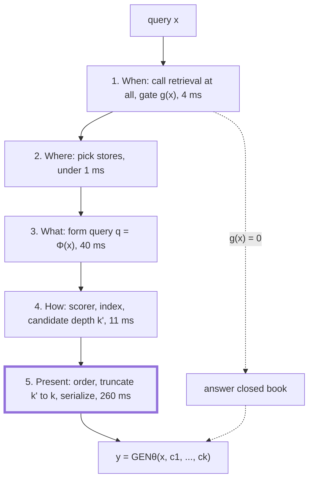
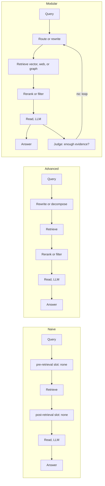
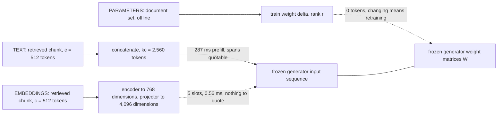
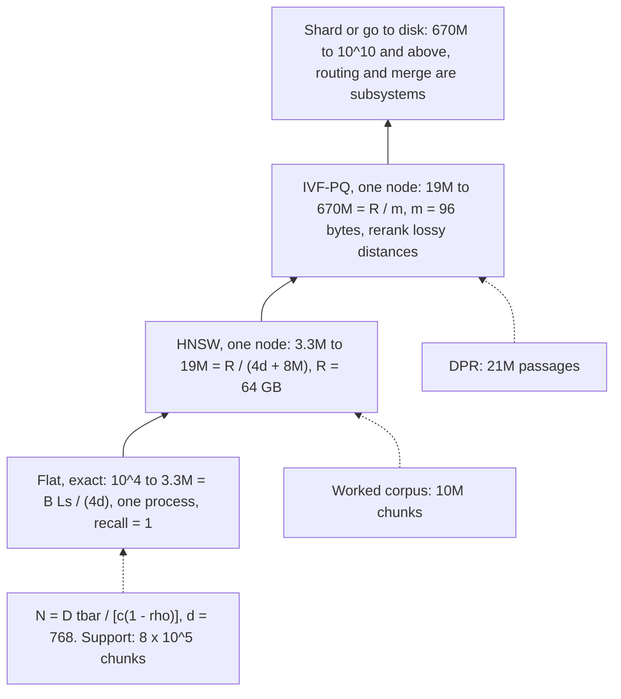
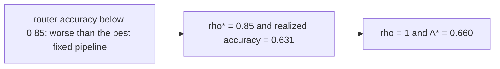

# Chapter 3: A Repeatable Framework for Any Retrieval-Augmented Generation (RAG) Design Question

This chapter gives one repeatable way to turn an underspecified retrieval design prompt into explicit choices, priced trade-offs, and a defensible interview answer.

## TL;DR

- Start with five decisions in order: when to retrieve, where to retrieve, what query to issue, how to retrieve, and how to present evidence to the generator.
- Name a design's maturity by the measured failure it fixes. Naive, advanced, and modular RAG describe graph connectivity, not engineer quality.
- Retrieved knowledge can enter as text, projected embeddings, or parameter updates. Text preserves citation, embeddings save input slots, and parameters trade query cost for update delay.
- Ask for chunk count, peak queries per second, and end-to-end latency before choosing an index. These numbers select the architecture rather than merely tune it.
- Price generation before optimizing search. In the worked sizing example, embedding, approximate search, and reranking use 8.6 milliseconds of a 940 millisecond request.
- Separate candidate depth from presentation depth. Retrieving 50 and presenting 5 can preserve recall without paying generation cost for all 50.
- Treat adaptivity as a measured routing problem. Ship a router only when its accuracy or cost dividend clears its own break-even threshold.

## The story

Picture a busy airport control tower that must answer one vague radio call: "Get this passenger to the right destination." The weak controller starts naming equipment before asking where the passenger is going. The strong controller starts with five decisions.

Does this passenger need a connecting flight at all? That is the retrieval gate, meaning the choice to search or answer from the model's own knowledge. If a connection is needed, which airport should handle it? That is source selection among documentation, tickets, a wiki, or the open web. What should the flight plan say? That is query compression, expansion, rewriting, or decomposition.

How should the tower find a route? That is scoring and indexing, meaning the machinery that ranks evidence and makes a corpus searchable. Which passengers and bags should enter the final cabin, and in what order? That is reranking, truncation, serialization, and prompt placement. Rebuilding the airplane is parameter training, not retrieval, so it sits outside the five decisions.

The same airport explains maturity and interfaces. Naive RAG is a direct flight. Advanced RAG adds planning before takeoff and inspection before boarding. Modular RAG adds switches and return routes, but every stop adds delay and another failure point. The aircraft also has three loading doors. Text keeps readable passages, projected embeddings save input slots but lose quotable spans, and parameter updates add no context tokens but delay new facts until training.

Before assigning a runway, the tower sizes chunk count, rush-hour query rate, and passenger wait time. A small airport scans every option exactly, a larger one needs a graph, and a still larger one compresses or shards. Passengers also differ. Some need no connection, some need one fact, some need several hops, and some carry a spreadsheet. Adaptivity is the dispatcher, whose gain is the gap between segment winners and the best single route. Misroutes give that gain back, so route only after the segment table proves break-even.

## Decoder table

| Term | Plain-language decoding | Why it matters here |
|---|---|---|
| Retrieval-Augmented Generation (RAG) | A generator answers with information fetched from an external datastore. | It is the system being designed. |
| Query | The user's information request or its retrieval-ready transformation. | It is the input to gating, routing, and search. |
| Corpus | The full collection of source material available for indexing. | Its token and chunk count determine architecture. |
| Token | One model input or output unit. | Prefill and decode cost scale with token counts. |
| Prompt | The serialized input given to the generator. | Evidence count and placement change its cost and behavior. |
| Model parameter | One learned numeric value in a model's weights. | Parameter count drives model compute and adapter size. |
| Index | A data structure that makes a corpus searchable. | Its family determines memory, recall, and operations. |
| Vector database | A service that stores vectors and answers similarity queries. | The source compares it with an in-process exact array. |
| Context window | The maximum input and output token capacity available to a model. | A naive 8,000-token retrieval nearly fills an 8,192-token window. |
| Frequently asked questions (FAQ) | Repeated common questions served by a support system. | The source gives a small single-hop FAQ counterexample. |
| Hyperparameter | A setting chosen outside model training, such as HNSW search breadth. | It adds tuning and retuning work. |
| efConstruction | The HNSW parameter that controls graph construction effort. | It joins M and efSearch in the tuning surface. |
| Streaming | Returning generated tokens before the full answer is complete. | It changes the defended latency from completion time to first token. |
| Network hop | A request crossing from one process or service to another. | A managed vector service adds this dependency. |
| Eventual consistency | A state where replicas or stores may agree only after a delay. | A separate vector service can lag the source of truth. |
| Cache hit rate | The fraction of requests that can reuse cached computation. | Low reuse removes the value of document KV caches. |
| Schema | The required structure of an output. | Stable schema behavior can live in an adapter. |
| Wall-clock latency | Elapsed real time seen by the request. | Small arithmetic work can still take about 2 ms in the router example. |
| Portable document format (PDF) | The document format in the 50 GB sizing prompt. | Its layout extraction quality controls token estimates. |
| Millisecond (ms) | One thousandth of a second. | Most latency budgets in the chapter use this unit. |
| Queries per second (QPS) | Request throughput measured each second. | Peak QPS sizes machine bandwidth and replicas. |
| Generator | The model that produces the final answer. | It consumes the query and selected evidence. |
| Retriever | The function that searches a datastore for evidence. | Four of the five decisions shape its use. |
| Datastore | One or more external stores of searchable content. | Choosing among stores can prevent contradiction. |
| Gate | A rule that decides whether retrieval runs for a query. | Retrieval can hurt an answer that was already correct. |
| Closed-book answer | An answer produced without external retrieval. | It is the bypass branch of decision one. |
| Classifier | A model that assigns a query to a decision class. | It can implement retrieval gating or source routing. |
| Confidence threshold | A cutoff on the generator's estimated certainty. | It is one gate family. |
| Perplexity threshold | A cutoff based on how surprising the generator finds the query or output. | It is another gate family named in the source. |
| Self-reflective retrieval | A scheme in which the model signals that it wants to search. | It makes the gate part of generation. |
| Search token | A generated control token that requests datastore access. | It expresses self-reflective retrieval. |
| Unified Active Retrieval (UAR) | A gate that combines intent, knowledge, time sensitivity, and self-awareness classifiers. | It supplies the worked gate pattern. |
| Large language model (LLM) | The language model used for control or answer generation. | Control calls and final generation have different costs. |
| Hidden state | An internal vector produced by a model layer. | UAR reads hidden states and embedding injection writes into them. |
| Frozen model | A model whose weights are not changed during a training step. | xRAG trains a projector while keeping endpoints frozen. |
| Source router | A controller that selects which datastore to query. | It avoids indiscriminate fan-out. |
| Fan-out | Searching several stores or shards at once. | It can improve recall but increase contradiction and merge work. |
| Contradiction rate | The probability that retrieved evidence conflicts with current truth. | It is the main risk of poor source selection in the worked example. |
| Query transformation | A function that converts the user input into a retrieval query. | It resolves missing context or complex information needs. |
| Compression | Removing irrelevant query content. | It is one query transformation. |
| Expansion | Adding related retrieval terms or context. | It is one query transformation. |
| Rewriting | Restating a query so the retriever can resolve it. | It helps conversational follow-ups. |
| Decomposition | Splitting one request into several sub-queries. | It can recover evidence spread across documents. |
| Scoring function | A rule that assigns relevance scores to query-document pairs. | It determines candidate ranking. |
| Sparse retrieval | Retrieval based on sparse lexical features. | Best Matching 25 and its learned successors are examples. |
| Inverted index | A mapping from terms to documents that contain them. | It makes sparse retrieval searchable. |
| Best Matching 25 (BM25) | The sparse scorer named in the source. | It represents a lexical retrieval family. |
| Sparse Lexical and Expansion model (SPLADE) | A learned sparse retrieval method named in the source. | It is a learned successor to BM25. |
| DeepImpact | A learned sparse retrieval method named in the source. | It is another learned successor to BM25. |
| Dense retrieval | Retrieval based on compact numeric vectors. | It supports single-vector approximate search. |
| Bi-encoder | A model that encodes queries and documents separately. | Separate vectors make large-scale retrieval practical. |
| Dense Passage Retrieval (DPR) | The dense single-vector retriever named in the source. | Its 21 million passage corpus anchors a sizing check. |
| Cross-encoder | A model that scores a query and document jointly. | It gives stronger reranking at a per-pair compute cost. |
| Late interaction | A design that encodes tokens separately, then combines query-document token matches late. | It preserves more detail than one vector per document. |
| Contextualized Late Interaction over Bidirectional Encoder Representations from Transformers (ColBERT) | The source's multi-vector late-interaction retriever. | Its per-token vectors multiply index size. |
| Maximum similarity (MaxSim) | The ColBERT operation that keeps the strongest token match. | It combines the many token vectors. |
| Candidate depth | The number of items retrieved before reranking, written as k'. | It should be separate from presentation depth. |
| Presentation depth | The number of chunks actually placed in the generator input, written as k. | It drives prefill cost. |
| Reranker | A stage that reorders retrieved candidates with a stronger scorer. | It can preserve recall while shrinking the prompt. |
| Serialization | The format and order used to turn evidence into generator input. | It is part of decision five. |
| Prompt placement | Where evidence and the query appear in the input sequence. | It affects caching and generator behavior. |
| Time to first token | Delay from request arrival to the first generated token. | It is the main latency budget in section 3.1. |
| 95th percentile (p95) | A latency level that 95 percent of requests meet. | The worked service target uses it. |
| Service level objective (SLO) | A committed operating target such as p95 latency. | It constrains retrieval and presentation choices. |
| Floating-point operation (FLOP) | One numerical operation used to estimate model compute. | Prefill, reranking, and control work are priced with it. |
| Tera floating-point operations per second (TFLOP/s) | Trillions of FLOPs completed each second. | It converts model work into time. |
| Giga floating-point operations (GFLOP) | Billions of FLOPs. | It sizes the small routing encoder. |
| Bfloat16 (bf16) | A 16-bit numeric format used for model weights and arithmetic. | The first worked generator and accelerator use it. |
| 16-bit floating point (FP16) | A 16-bit floating-point format. | Later sizing and adaptivity examples use it. |
| 32-bit floating point (FP32) | A 32-bit floating-point format. | Flat vectors use four bytes per dimension. |
| Model FLOP utilization (MFU) | The share of peak arithmetic throughput achieved in practice. | The worked examples assume 40 percent. |
| Prefill | Processing all input tokens before decoding begins. | Retrieved text makes this stage expensive. |
| Decode | Producing output tokens one at a time. | Weight bandwidth often dominates it. |
| Prefix caching | Reusing computation for a shared prompt prefix. | It cannot recover a query placed after changing passages. |
| Graphics processing unit (GPU) | The accelerator running the model. | Daily costs are stated in GPU-hours. |
| A100 | The accelerator model used in the first and third worked examples. | Its throughput and memory anchor the arithmetic. |
| Memory bandwidth | How many bytes an accelerator or machine can move per second. | It bounds decode, scan, and random vector reads. |
| Hierarchical Navigable Small World (HNSW) | A graph-based approximate vector index. | It trades memory, tuning, and approximate recall for faster search. |
| efSearch | An HNSW parameter controlling search breadth. | It affects how many neighbors are touched. |
| M | The HNSW neighbor count per node. | It changes memory and search work. |
| Random-access bandwidth | Effective throughput for scattered memory reads. | It is lower than sequential peak bandwidth in the worked search. |
| Naive RAG | Retrieve, concatenate, then generate. | It is the baseline graph. |
| Advanced RAG | Naive RAG with pre-retrieval and post-retrieval processing. | It fixes measured candidate or augmentation failures. |
| Modular RAG | A library of modules connected as a graph that may branch or loop. | It adds routing and feedback when justified. |
| Retrieval failure | The answer evidence never enters the candidate set. | Later stages cannot recover from it. |
| Generation failure | The evidence is present but the generator reasons incorrectly. | A better retriever does not automatically fix it. |
| Augmentation failure | Evidence is badly ordered, redundant, noisy, or stitched. | It calls for post-retrieval processing. |
| Pre-retrieval slot | Processing before candidate retrieval, such as rewriting. | It repairs a wrong candidate set. |
| Post-retrieval slot | Processing after retrieval, such as reranking or filtering. | It repairs noise, redundancy, and ordering. |
| Control call | An LLM call for rewrite, route, judge, or stop decisions. | Each call adds latency and cost. |
| Intermediate generation | Reasoning text produced inside a retrieval loop. | Loops multiply this work by round count. |
| Recall@k | Whether relevant evidence appears within the first k candidates. | Comparing recall@5 and recall@50 locates ranking failures. |
| Multi-hop query | A question whose evidence spans more than one step or document. | It can justify decomposition or iteration. |
| Agentic design | A module graph that makes control decisions and may loop. | It needs measured value and stage instrumentation. |
| Injection interface | The point where retrieved knowledge enters the generator. | It fixes cost, update speed, and citation properties. |
| Tokenizer | The mapping from text into model input tokens. | Embedding injection bypasses it for documents. |
| Embedding | A numeric vector representing content. | It can index text or enter the generator through a projector. |
| Projector | A learned mapping from retrieval-vector space to generator hidden space. | It fixes modality mismatch. |
| Modality mismatch | A mismatch between the objective and geometry of two representation spaces. | Raw retrieval vectors are not native generator inputs. |
| Alignment data | Training examples that teach a projector how representations should correspond. | They are the expensive part of the projector project. |
| Instruction tuning | Training on examples that map instructions to desired behavior. | xRAG uses it with paraphrase objectives. |
| Attention sink | Concentration of attention on an early sequence position. | It helps explain why one projected state can be readable. |
| xRAG | The embedding-injection method named in the source. | It freezes encoder and generator, then trains the projector. |
| Low-Rank Adaptation (LoRA) | A removable low-rank weight update. | It implements the parameter interface. |
| Adapter | A small learned weight delta attached to a model. | It suits stable behavior better than fast-changing facts. |
| Rank | The inner dimension of a low-rank factorization. | It controls adapter parameter count. |
| Retrieval-Augmented Language Model pre-training (REALM) | The source's example that retrieval can be trained into weights. | Its pre-training cost explains why the path is uncommon. |
| Span-level citation | Linking an answer claim to exact readable source text. | Projected vectors cannot provide spans. |
| Key-value (KV) cache | Stored attention keys and values for earlier tokens. | Reusing document caches can save recomputation without changing interfaces. |
| Position identifier | The token position carried into attention. | Concatenated caches retain original positions and need correction. |
| Chunk | A retrievable slice of a document. | Chunk length and overlap determine index size. |
| Chunk overlap | Repeated content between adjacent chunks. | It increases the number of indexed vectors. |
| Peak query rate | The busiest queries per second, written as lambda. | It sizes throughput and replicas. |
| End-to-end latency | Total request time from query through answer. | It prevents local search optimization from hiding generation cost. |
| Exact scan | Comparing a query with every vector. | It gives recall 1.0 when the corpus fits the bandwidth budget. |
| Approximate nearest neighbor (ANN) | Search that avoids comparing every vector. | It lowers search work at the cost of approximate recall. |
| Quantization | Compressing vectors into lower-cost codes. | It raises single-node capacity with lossy distances. |
| Product quantization (PQ) | Splitting a vector into subvectors and storing compact centroid codes. | The source uses 96 bytes per vector. |
| Inverted file with product quantization (IVF-PQ) | A coarse partitioned index with product-quantized vectors. | It is the one-node regime above HNSW capacity. |
| Facebook AI Similarity Search (FAISS) | The vector-search library whose HNSW memory formula is cited. | It supplies bytes-per-vector arithmetic. |
| Centroid | A representative vector used by quantization. | Centroid count affects the codebook. |
| Codebook | The stored set of quantization centroids. | It must be retrained when embedding distributions drift. |
| Random-access memory (RAM) | Memory available to hold an index on one node. | A 64 GB usable budget sets two thresholds. |
| Shard | A partition of an index placed on a separate machine. | Crossing one-node capacity adds routing and merge systems. |
| Replica | Another copy of a service or index. | Peak load can require more copies. |
| Tombstone | A deletion marker retained until rebuild. | It is an HNSW operational cost. |
| Duty cycle | The share of one machine's capacity used over time. | It shows that the support example fits one process. |
| Peak-to-mean ratio | Peak traffic divided by average traffic. | The worked sizing example assumes 5 times. |
| Per-tenant filtering | Restricting results to one customer's data. | It can trigger a managed shared index earlier. |
| Mixture | A query stream made of distinct information-need segments. | One average configuration can be wrong for every segment. |
| Segment | A group of queries on which configurations behave similarly. | It forms a row in the payoff matrix. |
| Payoff matrix | Accuracy of each configuration on each segment. | It makes adaptive value computable. |
| Fixed policy | One configuration used for all segments. | It supplies the baseline accuracy Afix. |
| Oracle routing | Always choosing the best configuration for each segment. | It supplies the ceiling A*. |
| Adaptivity dividend | The gap D between oracle accuracy and best fixed accuracy. | It is the most accuracy a router can earn from the current menu. |
| Misroute penalty | Mean accuracy lost when the router chooses the wrong branch. | It determines router break-even. |
| Controller | The router that selects a branch. | Its quality and drift can erase adaptive gains. |
| Abstention | Falling back when router confidence is thin. | It can cap accuracy loss at the best fixed policy. |
| Off-distribution behavior | Behavior on traffic unlike the controller's training data. | It causes operational pages and routing drift. |
| Parametric-sufficient query | A query the generator can answer from its weights. | Retrieval can disturb it. |
| One-shot RAG | One retrieval and generation pass. | It is the middle configuration in the adaptive menu. |
| Iterative RAG | Several retrieve-and-reason rounds. | It is accurate for some multi-hop queries but expensive. |
| Exact match | A strict answer-accuracy measure. | The opening adaptive system reports 63 percent overall. |
| Reflection token | A learned token signaling search or self-evaluation. | Self-RAG uses distilled reflection tokens. |
| Silver label | A generated supervision label rather than a directly human-authored one. | Adaptive-RAG uses it to train routing. |
| Interleaving Retrieval with Chain-of-Thought (IRCoT) | A style that alternates retrieval with reasoning steps. | Re-reading accumulated context raises loop cost. |
| Table-aware configuration | A branch that preserves row and column structure. | It can raise a weak segment rather than just reroute it. |
| TAPAS | A table-aware model line named in the source. | It represents a missing fourth branch. |
| TableFormer | A table-aware model line named in the source. | It also represents a missing fourth branch. |
| Service level agreement (SLA) | An externally meaningful service commitment. | The adaptive staff prompt treats latency as an SLA. |

## Core mechanics

### 3.1 The five retrieval decisions as an answer skeleton

#### The formal boundary

Let `x` be user input, `D` the datastore, `theta` the generator weights, `c1` through `ck` the selected contexts, and `y` the answer.

$$
c_1,\ldots,c_k = \mathop{\text{RET}}(x,D)
$$

$$
y = \mathop{\text{GEN}}_{\theta}(x,c_1,\ldots,c_k)
$$

The source argues that five retrieval choices exhaust the free parameters in these two lines. Changing `theta` is possible, but it is training rather than retrieval.

The component walk loses because ingest, chunk, embed, index, retrieve, rerank, and generate appear in nearly every design. It cannot express the highest-leverage option, which is not retrieving. In the opening prompt, a candidate has 38 minutes and only "design retrieval for our support assistant." The weak pattern spends 20 minutes naming six components and makes zero explicit decisions. The staff interviewer has seen the loop 40 times and listens for decision order.

#### The five decisions

| Decision | What it is | Why it exists | What breaks without it | Stated cost or complexity |
|---|---|---|---|---|
| 1. When | Compute a gate `g(x) ∈ {0, 1}`. | Some queries need retrieval and some are harmed by it. | Always retrieving flips roughly 10 percent of otherwise-correct answers to wrong in the cited Mallen et al. (2023) result. | A classifier, generator threshold, or search-token scheme adds control work. |
| 2. Where | Form `D = D1 ∪ ... ∪ Dm`, then select `Dj ⊆ D`. | Different stores have different authority and freshness. | Conflicting stores give the generator a contradiction that it may resolve silently. | Routing is cheap in the example, but conflict is not. |
| 3. What | Form `q = Φ(x)` by compression, expansion, rewriting, or decomposition. | The literal query may omit conversational referents or hide multiple needs. | The correct evidence never enters the candidate set. | Rewriting can require another model decode. |
| 4. How | Choose scorer `s(q, d)`, index, and candidate depth `k'`. | The system needs a searchable ranking mechanism. | Recall, memory, and reranking cost become accidental. | Sparse, dense, cross-encoder, and late-interaction families have different compute and storage. |
| 5. Present | Order, rerank, truncate `k'` to `k`, serialize, and place evidence. | The generator pays for every presented token. | Relevant evidence can be buried, duplicated, or made too expensive to process. | This decision owns 260 ms and 82 percent of the first worked budget. |

Decision one has three gate families. A query classifier predicts whether search is needed. A generator confidence or perplexity threshold uses the model's own signal. A self-reflective scheme lets the model emit a search token. Unified Active Retrieval combines four lightweight classifiers over frozen LLM hidden states. They are intent-aware, knowledge-aware, time-sensitive-aware, and self-aware, then joined in one decision tree. Decision four includes BM25, SPLADE, DeepImpact, DPR, joint query-document cross-encoders, and ColBERT. ColBERT stores one vector per token and aggregates token matches with MaxSim. The five items form a decision list, not a control-flow graph. Iterative and agentic systems can re-enter decisions one and three on every hop.

#### Worked support-assistant budget

The example has 10 million chunks of 400 tokens, 5 sustained queries per second, 432,000 queries per day, an 8 billion parameter bf16 generator, one A100 with 80 GB, and an 800 ms p95 time-to-first-token budget. The A100 rating is 312 TFLOP/s for dense bf16 and 2.0 TB/s memory bandwidth. At 40 percent MFU, effective arithmetic is 125 TFLOP/s. Prefill is estimated as `2PT` FLOPs for `P` parameters and `T` tokens.

- Decision one reads a 30-token query. Its `2 x 8 billion x 30` work is `4.8 x 10^11` FLOPs, 3.8 ms rounded to 4 ms.
- The gate cost is paid twice because the query follows passages and prefix caching cannot reuse it.
- Measurement says 35 percent of traffic needs no store lookup. That is 151,200 queries per day.
- At the roughly 10 percent flip rate, gating avoids about 15,000 answers per day that retrieval would change from right to wrong.
- Decision two reuses the same hidden states. Its classifier head costs under 1 ms.
- If 12 percent of ticket chunks contradict current documentation, placing three such chunks creates `1 - 0.88^3 = 0.32` conflict probability.
- Decision three uses a 1 billion parameter bf16 rewriter only for conversational follow-ups.
- The 2 GB rewriter at 2.0 TB/s costs 1.0 ms per decoded token. A 40-token rewrite costs 40 ms.
- Decision four uses HNSW with `M = 32` and `efSearch = 128`.
- The search touches roughly `128 x 64 = 8,192` neighbors.
- Each 768-dimensional FP32 read is 3,072 bytes. The 25 MB of scattered traffic costs about 2.5 ms at 10 GB/s effective random-access bandwidth.
- Reranking 50 candidates uses a 22 million parameter cross-encoder over `30 + 400 = 430` tokens per pair.
- Its work is `9.5 x 10^11` FLOPs and 7.6 ms. Search plus reranking totals 11 ms.
- Decision five presents 5 chunks and a 30-token query, so `T = 2,030` tokens.
- Its `3.25 x 10^13` FLOPs take 260 ms.

The total is `4 + 1 + 40 + 11 + 260 = 316 ms`. Decision five contributes `260 / 316 = 82 percent`. Raising presentation depth from 5 to 20 makes prefill 1,029 ms and total time 1,085 ms. That is 36 percent over the 800 ms budget, while decisions one through four still total 56 ms. At 5 chunks, daily prefill is 31.2 GPU-hours. At 20 chunks it is 123.5 GPU-hours. At 2 dollars per A100-hour, daily cost rises from 62 dollars to 247 dollars, a 185 dollar daily gap and about 67,000 dollars per year. At the published 312 TFLOP/s peak, prefill cannot exceed 19,500 tokens per second for the 8 billion parameter model. The 8,030-token input at `k = 20` therefore has a 412 ms hard floor even at 100 percent utilization.

#### Practice defaults and deviations

- State "when, where, what, how, present" in about 60 seconds, then ask for corpus size, query rate, and latency. If the prompt pins one decision, name the other four in one sentence.
- Default to gating. Retrieve on every query when attribution is contractually required, because citation rather than accuracy then sets the rule.
- Default to one routed store per query. Fan out when stores are disjoint or a downstream reranker can arbitrate conflicts.
- Budget presentation first. In this example, present 5 after retrieving 50.
- Keep `k'` and `k` separate. Without a reranker they collapse to the same value and the index must buy recall.
- Short 100-token chunks allow `k = 20` at the same prefill cost as five 400-token chunks.

### 3.2 Naive, advanced, and modular RAG as design maturity

#### Failure class before paradigm name

The opening maturity prompt arrives 25 minutes into a design loop. The bad reflex is to promise a rewriter, reranker, router, and loop because they sound advanced. The source gives a counterexample. Query decomposition and a cross-encoder tripled latency for an internal FAQ bot with single-hop questions and 4,000 documents, while fixing a failure class the product did not have. Lewis et al. (2020) named the naive two-stage pattern. Retrieve passages, concatenate them, then generate. Gao et al. (2023) organize its failures into three classes.

| Failure class | What it is | Correct repair location | What breaks if misdiagnosed |
|---|---|---|---|
| Retrieval | The correct evidence is absent from candidates. | Before retrieval, through rewrite, expansion, or decomposition. | Every later stage chooses among wrong evidence. |
| Generation | Correct evidence is present, but reasoning fails. | In prompting or generator capability. | A better retriever leaves the failure unchanged. |
| Augmentation | Evidence is noisy, redundant, badly ordered, or stitched. | After retrieval and before generation. | Concatenation repeats or buries facts. |

The source's generation example asks a model trained through 2023 for total H-1B filing cost in 2026. The correct pages are present, but the model lists base, training, and fraud-prevention fees without summing them. If all components occupy one chunk, a prompt instruction to sum adds zero modules and zero retrieval latency. Decomposition is justified only when the components are spread across documents. Advanced RAG fills a pre-retrieval slot and a post-retrieval slot. Modular RAG turns the modules into a graph that may route, branch, judge, and loop. Naive RAG is already the small module graph `retrieve -> read`. Advanced RAG adds a rewriter and reranker to the same graph. The right design is the least connected graph that closes a measured failure.

#### Additive and multiplicative latency

Let `Lr` be retrieval latency, `Lg` final generation, `Lc` one control call, `Lk` reranking, `LgPrime` an intermediate generation, and `T` the number of rounds.

$$
L_{\text{naive}} = L_r + L_g
$$

$$
L_{\text{advanced}} = L_c + L_r + L_k + L_g
$$

$$
L_{\text{modular}}(T) = T(L_c + L_r + L_k + L_{g'}) + L_g
$$

Naive to advanced adds the constant `Lc + Lk`. Advanced to a loop multiplies control, retrieval, reranking, and intermediate generation by `T`. Every added stage creates another failure source and another instrumentation obligation. An abstract agent graph is also not designable until the domain is known, while the cost of running more models arrives immediately. No paradigm fixes an empty datastore. If the fact is absent, decomposition, reranking, and loops all return a nearest available neighbor and can answer confidently from it.

#### Worked maturity budget

The example uses 10 million chunks at 400 tokens behind HNSW. Query embedding is 8 ms and ANN search is 5 ms, so retrieval latency is 13 ms. A cross-encoder scores 1,000 query-document pairs per second. A control LLM call is 250 ms, final generation is 1,200 ms, and an intermediate generation is 600 ms. Generator input costs 3 dollars per million tokens. The control model costs 0.15 dollars per million tokens.

- Naive presents 20 chunks. Latency is `13 + 1,200 = 1,213 ms`.
- Its 8,000 retrieved tokens cost 0.0240 dollars per query.
- Advanced decomposes into 3 sub-queries, retrieves 20 for each in parallel, reranks 60, and keeps 5.
- Reranking 60 pairs takes 60 ms. Total latency is `250 + 13 + 60 + 1,200 = 1,523 ms`, or 1.26 times naive.
- Advanced presents 2,000 tokens for 0.0060 dollars and adds about 0.0001 dollars for control. Total cost is 0.0061 dollars, about 3.9 times cheaper than naive.
- Modular uses 2 retrieve-reason rounds. Each round costs `250 + 13 + 60 + 600 = 923 ms`.
- Total modular latency is `2 x 923 + 1,200 = 3,046 ms`, or 2.5 times naive.
- Ten accumulated chunks cost 0.0120 dollars in generator input.

Advanced buys a 75 percent prompt-token reduction for 310 ms more latency. The loop buys multi-hop capability for another 1,523 ms and doubles the advanced token bill. Twenty 400-token chunks occupy 8,000 tokens. An 8,192-token context window leaves only 192 tokens for the system prompt, question, and answer, so a post-retrieval stage is mandatory. The 6,000 removed tokens save 0.018 dollars per query. The source cites Liu et al. (2024) for accuracy falling with longer context and falling further when answer evidence sits in the middle.

#### Practice defaults and deviations

- Ship naive RAG first and call it naive. Add a module only for a measured retrieval, generation, or augmentation failure.
- Compare recall@5 with recall@50. High recall@50 and low recall@5 call for post-retrieval reranking. Low recall@50 calls for pre-retrieval repair or a corpus audit.
- Budget 250 ms for each full control-model round trip. Under a 1 second p95 target, the example can afford exactly one unless it overlaps retrieval.
- Label a few hundred production queries to measure the multi-hop rate. Below roughly 20 percent, default to advanced RAG. Above that, route only the multi-hop slice through the 3,046 ms loop.
- Log candidates, reranked results, and final context separately before adding another module.

For a product with a 2 second SLO and a 12 percent multi-hop rate, routing 88 percent through 1,523 ms advanced RAG and 12 percent through 3,046 ms modular RAG gives 1,706 ms expected latency. A missed loop risks an incomplete answer. A spurious loop risks a slow answer.

### 3.3 The three injection interfaces

#### One distribution, three entry points

Let `q` be the query, `D = {d1, ..., dk}` the selected documents, `theta` the generator weights, `h` hidden size, `e(·) ∈ R^d` the retrieval encoder, and `Wp: R^d → R^h` the projector. The source warns that an implicit interface choice can force a rebuild six months later.

$$
p_{\theta}(y \mid \mathop{\text{tok}}(d_1) \oplus \cdots \oplus \mathop{\text{tok}}(d_k) \oplus \mathop{\text{tok}}(q))
$$

The text interface converts documents into tokens and concatenates them with the query.

$$
p_{\theta}(y \mid W_p e(d_1), \ldots, W_p e(d_k), \mathop{\text{tok}}(q))
$$

The embedding interface projects retrieval vectors into generator hidden states and uses one input slot per document in the worked design.

$$
p_{\theta + \Delta\theta(D)}(y \mid \mathop{\text{tok}}(q))
$$

The parameter interface compiles the corpus into a weight delta before the query arrives.

| Interface | What it is | Why it exists | What breaks without care | Stated cost or complexity |
|---|---|---|---|---|
| Text | Put retrieved text into the input sequence. | It needs no training and preserves readable spans. | Prefill repeats for every query and grows with chunk count and length. | Five 512-token chunks add 2,560 input tokens and 287 ms in the example. |
| Embeddings | Project one retrieval vector per document into hidden space. | It compresses input slots by the chunk length. | Raw vectors have the wrong objective, citations vanish, and multi-hop structure can be lost. | A 3.1 million parameter projector and alignment corpus are required. |
| Parameters | Train a weight delta from the corpus. | It removes retrieved-content tokens from each query. | Fast-changing facts wait for retraining. | Per-query context cost is zero, but every update is a training run. |

#### Text and embedding arithmetic

Dense-transformer forward work is approximated as 2 FLOPs per parameter per token. For a 7 billion parameter generator, 5 chunks, and 512 tokens per chunk, retrieved prefill is `3.58 x 10^13` FLOPs.

An A100 peaks at 312 TFLOP/s in bf16. At 40 percent MFU, achieved throughput is `1.25 x 10^14` FLOP/s and the retrieved text costs 0.287 seconds, or 287 ms, before the first output token.

Five documents represented by five vectors use 5 input slots rather than 2,560. That is a 512 times compute reduction because the ratio is `kc / k = c`.

A 768-dimensional FP32 vector contains 24,576 bits. The source compares that with a 512-token passage at roughly 2,048 characters and Shannon's (1951) estimate of about 1 bit per English character, giving 12 times raw headroom.

Capacity is not the binding failure. Morris et al. (2023) show near-exact inversion for sentence embeddings, but the source later notes that their demonstrated inputs are 32 tokens rather than 512-token passages.

Retrieval vectors are trained for ranking. Generator hidden states are trained for next-token prediction. xRAG, attributed to Cheng et al. (2024), freezes the retrieval encoder and generator, then trains only the projector using paraphrase-style and instruction-tuning objectives.

The projector from 768 to 4,096 dimensions has `768 x 4,096 = 3,145,728` parameters. That is about 3.1 million or 0.045 percent of a 7 billion parameter generator.

The source notes near-diagonal local attention in the first two layers and concentration on the first position from roughly layer two upward, citing Xiao et al. (2024). This attention-sink behavior makes one hidden-state slot a shape the transformer already reads.

#### Parameter arithmetic and losses

LoRA, attributed to Hu et al. (2021), replaces a full `din x dout` update with rank `r` factors containing `r(din + dout)` trainable values. The source describes the update as additive, removable, and stackable.

The parameter interface has no canonical paper like the other two. REALM, attributed to Guu et al. (2020), is presented as evidence that retrieval can be trained into weights. Its pre-training cost helps explain why the parameter route is uncommon.

Embedding injection loses when the product must quote source spans. It also weakens on multi-hop questions in the xRAG evaluation because one vector per document may not preserve cross-document structure.

Parameter injection loses when corpus changes happen faster than retraining. Text loses when repeated chunks make prefill dominate the measured budget.

Precomputed KV caches are not a fourth interface. They retain the text tokens and citation ability while memoizing computation. Concatenated per-document caches lose cross-document attention and retain original position identifiers, so both need correction.

#### Worked interface budget

The example uses 10 million chunks, 512 tokens per chunk, 5 retrieved documents, a 7 billion parameter generator with hidden size 4,096, a 768-dimensional retrieval encoder, and 1 million queries per day.

- Raw text uses 2,560 prefill tokens, `3.58 x 10^13` FLOPs, and 287 ms at 40 percent MFU.
- At 2 dollars per GPU-hour, one GPU-second costs `5.56 x 10^-4` dollars.
- Raw-text prefill costs `1.60 x 10^-4` dollars per query and 160 dollars per day.
- Embedding injection uses 5 hidden states, `7.0 x 10^10` FLOPs, and 0.56 ms.
- Its daily prefill cost is 0.31 dollars, which is a 512 times reduction.
- A 4,096 by 4,096 attention projection has `1.68 x 10^7` weights.
- A rank-8 adapter trains `8 x (4,096 + 4,096) = 65,536` values, 256 times fewer.
- Parameter injection adds zero retrieved-content tokens and zero related prefill, but each update needs training.
- If 1 document in 10,000 changes each hour, the parameter configuration is wrong regardless of latency.
- Text versus embedding injection differs by 159.2 dollars per day or about 58,000 dollars per year.

The 512 times result is a compute ratio, not demonstrated fidelity. The demonstrated inversion scale is nearer 32 to 1, leaving a 16 times gap between compute saving and recovery evidence.

#### Practice defaults and deviations

- Default to text because it supports span citation, needs no training, and updates through the index.
- Measure prefill before changing interfaces. Suspicion is not enough.
- Reuse KV caches first when chunks repeat. A low cache-hit rate removes this advantage.
- Reject embedding injection when generated quotes need exact spans. Document-level metadata may be enough only when the generator never quotes.
- Use adapters for stable behavior such as tone, format, and schema, not hourly facts. Re-check the assumed change cadence every quarter.
- Treat a projector as a training project bound to one frozen encoder-generator pair.

For 400 customers with hourly corpus updates, per-customer adapters would require 400 training runs per hour. The source's decision is retrieval for facts and adapters for tone or output schema.

### 3.4 Size the problem before selecting the architecture

#### The three numbers

The opening design interview lasts 45 minutes. The weak candidate names HNSW, a 768-dimensional bi-encoder, and a top-20 cross-encoder by 90 seconds, then learns at minute 30 that the corpus has only 200,000 articles.

Ask first for chunk count `N`, peak query rate `lambda`, and end-to-end latency budget `L`. Index family, quantization, shards, replicas, and reranker depth follow from them.

Document count alone is misleading. With document count `D`, average tokens per document `tbar`, total tokens `T = D tbar`, chunk length `c`, and overlap fraction `rho`, chunk count is:

$$
N = \frac{D\bar{t}}{c(1-\rho)}
$$

One million tweets averaging 30 tokens yield 1 million chunks because they do not split. One million 10-K filings averaging 50,000 tokens, chunked at 400 with 25 percent overlap, yield `1.67 x 10^8` chunks. The same document count creates 167 times more vectors.

When only text bytes are given, the source converts English at roughly 4 characters per token.

#### Bytes per vector and architecture thresholds

At dimension `d = 768`, a flat FP32 vector uses `4d = 3,072` bytes.

FAISS gives HNSW memory as `4d + 8M` bytes per vector. At `M = 32`, that is 3,328 bytes.

Product quantization with `m = 96` subvectors and `256` centroids stores 1 byte per subvector, or 96 bytes per vector. It compresses a 3,072-byte vector by 32 times. Its codebooks occupy `256 x 768 x 4 = 786,432` bytes regardless of corpus size.

| Regime | Derived boundary | What exists there | What breaks on crossing |
|---|---|---|---|
| Flat exact | Up to 3.3 million vectors | One process scans all vectors with exact recall. | Bandwidth can no longer meet the 50 ms search budget. |
| One-node HNSW | Up to 19 million vectors | A 64 GB node holds the graph and FP32 vectors. | The index no longer fits. |
| One-node IVF-PQ | Up to 670 million vectors | Quantized codes fit one 64 GB node. | Sharding becomes necessary. |
| Sharded or disk | Above 670 million vectors | Routing and result merging become subsystems. | Operations and distributed failure modes enter the design. |

The flat threshold assumes 200 GB/s sequential bandwidth and a 50 ms search budget. The machine can scan 10 GB, so `10^10 / 3,072 = 3.3 million` vectors.

The HNSW threshold is `64 x 10^9 / 3,328 = 19 million`. The product-quantized threshold is `64 x 10^9 / 96 = 670 million`. The source states 34 times more one-node headroom, while the unrounded formulas give about 34.7 times.

Crossing a threshold changes the index family, recall behavior, build time, training requirements, and operating model. The three sizing numbers take under two minutes to compute. Between the HNSW and IVF-PQ regimes, rebuild time can move from seconds to hours. A 100 times larger-corpus follow-up tests this architecture change. It does not merely tune the same design.

Multi-vector retrieval moves a corpus up the ladder without adding documents. ColBERT uses one 128-dimensional FP32 vector per token. A 400-token chunk takes `400 x 128 x 4 = 204,800` bytes rather than 3,072, a 67 times increase. Three million chunks become 614 GB.

#### Generation-first latency budget

For a 7 billion parameter FP16 generator at `3.4 x 10^14` achieved FLOP/s, prefill costs 0.041 ms per token. Decode reads 14 GB of weights per token and costs 4.2 ms at 3.35 TB/s.

Five 400-token chunks plus a 200-token instruction create 2,200 prefill tokens and 91 ms. A 200-token answer costs 840 ms to decode.

Embedding a 32-token query with a 110 million parameter encoder costs 7.0 GFLOP and 0.021 ms. Reranking 20 pairs of 432 tokens costs 1.90 TFLOP and 5.6 ms. Adding a generous 3 ms ANN hop makes the retrieval stack 8.6 ms of 940 ms, which is under 1 percent.

Choose the index for memory and cost unless retrieval dominates. The named exceptions are retrieval-only products, very large `k`, and corpora above the sharding threshold where each query fans out.

#### Worked support-corpus sizing

The brief has 200,000 support articles, 3 million queries per month, and an answer target of about 1 second.

Average article length is 1,200 tokens, so the corpus contains `2.4 x 10^8` tokens. Chunks of 400 with 25 percent overlap advance by 300 tokens and yield 800,000 chunks.

The flat index is `800,000 x 3,072 = 2.46 GB`, which fits laptop memory. The corpus is one quarter of the way to the 3.3 million exact-scan threshold.

Three million monthly queries are 1.16 average queries per second over 30 days. A 5 times peak-to-mean ratio gives 5.8 peak queries per second.

One exact scan reads 2.46 GB and takes 12.3 ms at 200 GB/s. Peak load consumes `5.8 x 12.3 = 71` ms of bandwidth per second, a 7 percent duty cycle.

HNSW uses 2.66 GB, takes roughly 1 ms per search, and adds three hyperparameters: `M`, `efConstruction`, and `efSearch`. They require retuning when the embedding model changes. Rebuilds take minutes and deletions remain tombstones until rebuild.

Flat search uses 2.46 GB, takes 12.3 ms, gives recall@k of 1.0, and has zero hyperparameters. Rebuild is an array copy and deletion is a mask.

HNSW buys 11.3 ms, or 1.2 percent of the 940 ms request, in exchange for approximate recall, tuning, and rebuild work. Exact search is the senior answer at this scale.

The ANN trigger arrives near 3.3 million chunks. The same corpus reaches it at 825,000 articles or by shrinking chunks from 400 to 100 tokens, where 25 percent overlap yields 3.2 million chunks.

The DPR reference corpus from Karpukhin et al. (2020) has 21,015,324 passages at 768 dimensions. It needs 64.5 GB flat, 69.9 GB under HNSW with `M = 32`, or 2.0 GB under IVF-PQ with `m = 96`. It is 26 times the support corpus, just above the one-node HNSW boundary, and still does not require a cluster when quantized.

#### Practice defaults and deviations

- Ask for tokens or text bytes rather than document count unless records are truly homogeneous.
- Default to exact search below a few million vectors. Deviate when `lambda x beta x N / bandwidth` approaches one machine.
- At 3,072 bytes per vector and 200 GB/s, one million vectors consume a full machine near 65 queries per second.
- In a retrieval-only product, even 12 ms can be material because search is the whole budget.
- Quantize before sharding. A full-precision rerank of top candidates largely recovers the lossy distance. Deviate when exact filtering or high-churn per-tenant deletion makes codebook retraining costly.
- Budget from decode backward. A 200-token answer cannot finish under 840 ms on the stated hardware.
- With streaming, defend time to first token instead. Retrieval plus prefill is 85 ms in the source's framing. Its rounded 8.6 ms and 91 ms components sum to 99.6 ms.
- Size the reranker with `k` and the index with `N`. Shard-local candidates multiply reranker depth by shard count.

One million 768-dimensional FP32 vectors occupy 3.07 GB flat or roughly 96 MB with product quantization. A 50 GB PDF corpus converts to `1.25 x 10^10` tokens and `4.2 x 10^7` chunks at 400 tokens with 25 percent overlap. It exceeds one-node HNSW, while IVF-PQ occupies about 4.0 GB.

The source also flags extraction quality. A PDF corpus is a layout-extraction problem before it is an index problem, so the token estimate inherits extractor quality.

For the 800,000-chunk support corpus, a managed vector database adds a network hop, availability dependency, and eventual-consistency window relative to an in-process array. The exception should expire at 3.3 million chunks, when per-tenant filtering arrives, or when more than one service needs the vectors.

### 3.5 Adaptivity as the default answer

#### Mixtures, menus, and ceilings

The opening shipped pipeline uses recursive character chunks of 512 tokens, one embedding model, HNSW, top 5, and a cross-encoder. Overall exact match is 63 percent, yet support users remain unhappy.

Traffic separates into four needs. A fifth is parametric-sufficient and retrieval can disturb it. Half is one fact in one paragraph. The remaining 30 percent is split between multi-hop evidence and tabular or numeric questions.

Let segment weights `pi_i` sum to 1. Let `a_ij` be the accuracy of configuration `j` on segment `i`.

$$
A_{\text{fix}} = \max_j \sum_i \pi_i a_{ij}
$$

The best fixed policy chooses one column for all traffic.

$$
A^{*} = \sum_i \pi_i \max_j a_{ij}
$$

Oracle routing chooses the best cell in every row.

$$
D = A^{*} - A_{\text{fix}} \ge 0
$$

The adaptivity dividend `D` is zero exactly when one configuration is at least as good as every other configuration on each segment with positive weight.

Suppose router accuracy is `rho` and mean loss on a misroute is `Lloss`.

$$
A(\rho) = A^{*} - (1-\rho)L_{\text{loss}}
$$

$$
\rho \ge 1 - \frac{D}{L_{\text{loss}}}
$$

The numerator is only the improvement over the already-best compromise. The denominator includes every wrong route, including closed-book handling of a multi-hop query or an expensive loop on a known fact.

The source names UAR's four-criterion tree, Self-RAG's distilled reflection tokens, and Adaptive-RAG's silver-label supervision as examples of controller engineering.

Always retrieve, rerank, and iterate is a legitimate fallback when `D` is small and no buildable router clears break-even. It still pays the most expensive branch on all traffic and inherits the roughly 10 percent retrieval flip rate on identifiable parametric-sufficient queries.

#### Worked payoff matrix

| Segment and weight | No retrieval | One-shot RAG | Iterative RAG | Row winner |
|---|---:|---:|---:|---|
| Parametric-sufficient, 0.20 | 0.78 | 0.68 | 0.66 | No retrieval |
| Single-hop factoid, 0.50 | 0.31 | 0.72 | 0.71 | One-shot RAG |
| Multi-hop, 0.15 | 0.18 | 0.34 | 0.58 | Iterative RAG |
| Tabular or numeric, 0.15 | 0.22 | 0.36 | 0.38 | Iterative RAG |
| Fixed-policy accuracy | 0.371 | 0.601 | 0.631 | Best fixed is iterative RAG |

Oracle routing scores 0.660. The dividend is `0.660 - 0.631 = 0.029`, or 2.9 accuracy points.

The bottom row's best score is only 0.38 because none of the three text configurations preserves table structure. A fourth TAPAS or TableFormer-style branch raises that row rather than reallocating existing strengths.

This principle applies to all five decisions. Retrieval gating is only the narrow paper usage of "adaptive retrieval." Source choice, chunk size, hop count, query transformation, and injection interface can also vary by segment.

#### Worked adaptive latency and break-even

The matrix comes from 100,000 queries per day, one week of logs, and offline runs of all three configurations. The generator has 7 billion parameters in FP16 and 14 GB of weights.

The accelerator provides 3.35 TB/s memory bandwidth and `3.4 x 10^14` effective FLOP/s. Decode is `14 / 3350 = 4.2 ms` per token. Prefill is estimated as `2NP` FLOPs for `N` tokens and `P` parameters.

- Configuration A has no retrieval. Two hundred question tokens cost `2.8 x 10^12` FLOPs and 8 ms.
- A 60-token answer costs 252 ms to decode. Total latency is 260 ms.
- Configuration B is one-shot RAG with top 5. Embedding is 8 ms, ANN search 15 ms, and reranking 20 candidates 60 ms, totaling 83 ms.
- Five 400-token chunks add 2,000 prefill tokens, `2.8 x 10^13` FLOPs, and 82 ms.
- Configuration B totals `260 + 83 + 82 = 425 ms`.
- Configuration C uses 3 rounds. Each retrieval and prefill cycle costs `83 + 82 = 165 ms`.
- Two intermediate 30-token reasoning steps cost 252 ms. Total latency is `3 x 165 + 252 + 260 = 1,007 ms`.

The row-wise misroute losses are 0.11, 0.21, 0.32, and 0.09. Their weighted mean is `0.20(0.11) + 0.50(0.21) + 0.15(0.32) + 0.15(0.09) = 0.189`.

Break-even router accuracy is `1 - 0.029 / 0.189 = 0.85`. A less accurate router is worse on accuracy than always running iterative RAG.

Oracle mean latency is `0.20(260) + 0.50(425) + 0.30(1,007) = 567 ms`. That is 44 percent below the fixed iterative path at 1,007 ms.

The router is a 110 million parameter encoder over 32 query tokens. Its work is 7 GFLOP, described as microseconds of arithmetic and roughly 2 ms wall-clock time.

A table-aware fourth configuration raising the bottom row from 0.38 to 0.61 adds `0.15 x 0.23 = 0.0345`, or 3.5 points. This beats the 2.9-point ceiling of a perfect router over the original three branches.

The iterative to one-shot ratio is `1,007 / 425 = 2.4 times`. Adaptive-RAG, attributed to Jeong et al. (2024), reports a multi-step baseline closer to an order of magnitude slower than a single step.

At 5 rounds, iterative latency becomes `5 x 165 + 4 x 126 + 260 = 1,589 ms`, or 3.7 times one-shot. IRCoT-style chains can cost more because they run to a step cap and reread accumulated context each round.

#### Practice defaults and deviations

- Build a segment table from a few thousand labeled production queries and run every candidate configuration on it.
- Before launch, ship the best fixed pipeline and make the segment table the first post-launch artifact.
- Keep the best fixed column until the router can clear the relevant threshold.
- A weaker router may still buy latency because a wrong cheap route can cost less than always running the expensive route.
- Enlarge the menu before tuning the controller when every branch is weak on one segment.
- State whether routing buys accuracy, latency, or cost. These currencies have different break-even points.
- Abstain into the best fixed column when controller margin is thin. If cost binds and that fallback is expensive, fall back cheap and alert on the accuracy change.
- Monitor route-distribution drift because traffic weights move with product launches.

Deleting the router in the staff scenario costs under 3 accuracy points. The source states that it adds 421 ms of mean latency, while its rounded displayed means subtract to 440 ms. The proposed control is low-margin abstention, a monitored route-distribution band, and automatic full fallback, without promising that next quarter's mixture is knowable today.

## Diagrams

### Figure 3.1

**Figure 3.1:** The five decisions are the five free parameters of y = GENθ (x, RET(x, D)), and only the first one has a bypass. Milliseconds are the worked example's time-to-first-token budget. The heavy box is the decision that owns 82% of it.

### Figure 3.2

**Figure 3.2:** Advanced RAG is naive RAG with two empty slots filled. Modular RAG is those same slots plus routing and a feedback edge - the three names describe connectivity, not quality.

### Figure 3.3

**Figure 3.3:** Text and embeddings enter the generator through the input sequence. Parameters enter through the weights - which is why only the first two can be changed between one query and the next.

### Figure 3.4

**Figure 3.4:** The thresholds that separate RAG index architectures are set by three constants - memory bandwidth, node RAM, and bytes per vector - so the corpus size alone decides which of four systems you are being asked to build.

### Figure 3.5

#### A. Which configuration wins each segment

| Segment and weight | A. No retrieval | B. One-shot RAG | C. Iterative RAG |
|---|---:|---:|---:|
| Parametric-sufficient, pi = 0.20 | **0.78** | 0.68 | 0.66 |
| Single-hop factoid, pi = 0.50 | 0.31 | **0.72** | 0.71 |
| Multi-hop, pi = 0.15 | 0.18 | 0.34 | **0.58** |
| Tabular or numeric, pi = 0.15 | 0.22 | 0.36 | **0.38** |
| Fixed-policy accuracy | 0.371 | 0.601 | **0.631** |

Oracle routing is 0.660. The dividend `D` is 0.029.

#### B. What the router must achieve before it is worth having

**Figure 3.5:** Routing can only ever collect the gap between the average of the row winners and the best single column, and an imperfect router gives that gap back faster than it earns it.
## Whiteboard pack

### Numbered drawing order

1. Write the two-line retrieval and generation formalism at the top.
2. Draw five boxes down the center labeled When, Where, What, How, and Present.
3. Add a bypass from When to a closed-book answer.
4. Write 4, under 1, 40, 11, and 260 ms beside the five boxes.
5. Thicken the Present box and write 82 percent.
6. To the right, draw naive, advanced, and modular pipelines with empty, filled, and looped slots.
7. Below them, draw the text, embedding, and parameter entry doors into one generator.
8. Add the index ladder at 3.3 million, 19 million, and 670 million vectors.
9. Finish with the four-row payoff matrix and mark router break-even at 0.85.

### 90-100 word script

I start with five decisions: when to retrieve, where to search, what query to issue, how to rank candidates, and what evidence to present. The last decision often owns the latency because generation pays for every presented token. I name the least connected graph that fixes a measured failure, then choose text, embeddings, or parameters based on citation and update needs. Before selecting an index, I ask for chunk count, peak traffic, and latency. Finally, I segment the workload and route only when the measured dividend exceeds the controller's misroute penalty.

## Interview traps

### 1. "Why not begin with the standard ingest, chunk, embed, index, retrieve, rerank pipeline?"

That walk lists components shared by almost every design, so it does not expose choices. It also has no place for "do not retrieve," even though retrieval can flip roughly 10 percent of otherwise-correct answers.

### 2. "Why not call every serious production system modular RAG?"

Modular describes connectivity rather than quality. A loop multiplies control, retrieval, reranking, and intermediate-generation cost by the round count, so use the least connected graph that fixes a measured failure and instrument each added stage.

### 3. "Would a single vector per document solve prefill latency?"

It can reduce document input slots by the chunk length, 512 times in the example, but it requires a trained projector and removes quotable spans. Default to text and try KV-cache reuse first unless measured prefill dominates and product requirements allow document-level rather than span-level attribution.

### 4. "The corpus has 200,000 articles. Why not use HNSW immediately?"

Article count is not chunk count, so derive `N` first. In the worked corpus, 800,000 vectors occupy 2.46 GB and exact scan costs 12.3 ms, while HNSW buys only 11.3 ms of a 940 ms request and adds approximate recall, tuning, and rebuild work.

### 5. "Is adaptive routing always better than one fixed pipeline?"

No. Its accuracy ceiling is the dividend `D`, and a router wins only above `1 - D / Lloss`, which is 85 percent in the example. A new table-aware branch earns 3.5 points, more than the original router's 2.9-point ceiling, so design maturity can mean enlarging the menu before perfecting the controller.

## Key numbers

### Decision skeleton and support budget

| Number | Meaning and committed trade-off |
|---:|---|
| 38 minutes | Time available in the opening design prompt. |
| 40 loops | Number of similar loops the staff interviewer has run. |
| 20 minutes, 6 components, 0 decisions | The weak component-first pattern. |
| Roughly 10 percent | Correct closed-book answers flipped wrong by retrieval in the cited measurement. |
| 5 decisions | When, where, what, how, and present. |
| 10 million chunks | Worked support corpus size. |
| 400 tokens | Worked chunk length. |
| 5 queries per second | Sustained traffic. |
| 432,000 queries per day | Daily traffic at 5 queries per second. |
| 8 billion parameters | Worked generator size. |
| 80 GB | A100 memory capacity. |
| 800 ms p95 | Time-to-first-token objective. |
| 312 TFLOP/s | Published dense bf16 arithmetic peak. |
| 2.0 TB/s | A100 memory bandwidth used in the examples. |
| 40 percent and 125 TFLOP/s | Assumed MFU and effective arithmetic. |
| 30 tokens | Gate input length. |
| 4.8 x 10^11 FLOPs, 3.8 ms, rounded to 4 ms | Gate work and budget. |
| 35 percent and 151,200 per day | Traffic that needs no store lookup. |
| About 15,000 per day | Retrieval-flipped answers avoided by gating. |
| Under 1 ms | Marginal source-router cost. |
| 12 percent, 3 chunks, 32 percent | Stale-ticket rate, fan-out evidence count, and resulting conflict probability. |
| 1 billion parameters and 40 output tokens | Conversational rewrite model and output length. |
| 2 GB, 1.0 ms per token, 40 ms | Rewriter weight size and bandwidth-bound latency. |
| M = 32 and efSearch = 128 | HNSW settings. |
| 8,192 neighbors | Approximate neighbor touches. |
| 768 dimensions and 3,072 bytes | FP32 vector size. |
| 25 MB, 10 GB/s, 2.5 ms | Scattered search traffic, effective bandwidth, and latency. |
| 50 candidates | Candidate depth before reranking. |
| 22 million parameters and 430 tokens | Cross-encoder size and pair length. |
| 9.5 x 10^11 FLOPs and 7.6 ms | Reranking work and latency. |
| 11 ms | Search plus reranking. |
| 5 chunks and 2,030 tokens | Presentation depth and resulting input length. |
| 3.25 x 10^13 FLOPs and 260 ms | Presentation prefill work and latency. |
| 316 ms and 82 percent | Total time and presentation share. |
| 20 chunks, 1,029 ms, 1,085 ms | Deeper presentation and resulting prefill and request time. |
| 36 percent | Amount over the 800 ms target at 20 chunks. |
| 56 ms | Decisions one through four at the deeper presentation setting. |
| 31.2 and 123.5 GPU-hours per day | Prefill use at 5 and 20 chunks. |
| 2 dollars per hour | A100 rental assumption. |
| 62 and 247 dollars per day | Prefill cost at 5 and 20 chunks. |
| 185 dollars per day and 67,000 dollars per year | Cost difference caused by decision five. |
| 19,500 tokens per second | Theoretical prefill ceiling at peak throughput. |
| 8,030 tokens and 412 ms | Deep prompt size and hard prefill floor. |
| 60 seconds | Recommended time for the initial five-decision skeleton. |
| About 15 percent | Retrieval share that would falsify the senior latency prediction in the source prompt. |
| 769 ms | Extra prefill caused by raising presentation depth from 5 to 20. |
| 100-token chunks | Chunk length that allows 20 chunks at the five-by-400-token prefill cost. |

### Design maturity

| Number | Meaning and committed trade-off |
|---:|---|
| 25 minutes | Point when the maturity challenge arrives in the opening scene. |
| 4,000 documents and 3 times latency | FAQ example where advanced machinery fixed no measured need. |
| 3 failure classes | Retrieval, generation, and augmentation. |
| Through 2023 and in 2026 | Training horizon and target year in the filing-fee reasoning example. |
| 10 million chunks and 400 tokens | Maturity worked corpus. |
| 8 ms plus 5 ms equals 13 ms | Embedding, ANN search, and retrieval latency. |
| 1,000 pairs per second | Cross-encoder throughput. |
| 250 ms, 1,200 ms, 600 ms | Control call, final generation, and intermediate generation. |
| 3 dollars and 0.15 dollars per million tokens | Generator and control-model prices. |
| 20 chunks, 8,000 tokens, 1,213 ms | Naive prompt and latency. |
| 0.0240 dollars | Naive cost per query. |
| 3 sub-queries, 60 candidates, 5 kept | Advanced retrieval and reranking shape. |
| 60 ms and 1,523 ms | Rerank time and advanced total latency. |
| 1.26 times | Advanced latency relative to naive. |
| 2,000 tokens, 0.0060 dollars, 0.0001 dollars | Advanced prompt and component costs. |
| 0.0061 dollars and 3.9 times cheaper | Advanced total cost and saving relative to naive. |
| 2 rounds, 923 ms each, 3,046 ms total | Modular loop. |
| 2.5 times | Modular latency relative to naive. |
| 10 chunks, 4,000 tokens, 0.0120 dollars | Accumulated modular context and generator cost. |
| 75 percent and 310 ms | Advanced token reduction and latency tax. |
| 1,523 ms | Additional latency from advanced to the loop. |
| 8,192, 8,000, 192 tokens | Context window, retrieved context, and space left for everything else. |
| 6,000 tokens and 0.018 dollars | Tokens removed and per-query saving. |
| Recall@5 and recall@50 | Diagnostic depths for ranking versus candidate failure. |
| 1 second and exactly 1 control call | Control budget under the stated p95 target. |
| A few hundred and roughly 20 percent | Production labels for the multi-hop check and its routing threshold. |
| 12 percent, 88 percent, 1,706 ms | Multi-hop mix, advanced mix, and expected adaptive latency. |
| 2 second SLO | Product latency constraint in the staff prompt. |

### Injection interfaces

| Number | Meaning and committed trade-off |
|---:|---|
| 5 chunks and 512 tokens | Text-interface example. |
| 2,560 slots versus 5 slots | Text and embedding input sizes. |
| 512 times | Compute compression from one vector per chunk. |
| 7 billion parameters | Generator size. |
| 3.58 x 10^13 FLOPs and 287 ms | Raw-text prefill. |
| 768 dimensions and 24,576 bits | Retrieval-vector capacity. |
| Roughly 2,048 characters and 1 bit per character | Source's passage information estimate. |
| 12 times | Estimated raw vector headroom. |
| 768 by 4,096 equals 3,145,728 | Projector shape and parameter count. |
| 3.1 million and 0.045 percent | Projector size and share of the generator. |
| First 2 layers and roughly layer 2 upward | Attention behavior described in the source. |
| 10 million chunks and 1 million queries per day | Worked scale. |
| 2 dollars per hour and 5.56 x 10^-4 dollars per second | GPU price conversion. |
| 1.60 x 10^-4 dollars per query and 160 dollars per day | Text prefill cost. |
| 7.0 x 10^10 FLOPs, 0.56 ms, 0.31 dollars per day | Embedding prefill work, latency, and cost. |
| 4,096 by 4,096 equals 1.68 x 10^7 | Attention projection size. |
| Rank 8, 65,536 values, 256 times fewer | Adapter example. |
| 1 in 10,000 per hour | Change rate that disqualifies parameter storage. |
| 159.2 dollars per day and 58,000 dollars per year | Text-versus-embedding cost gap. |
| 32 tokens, 32 to 1, and 16 times | Demonstrated inversion scale, evidence ratio, and gap to compute ratio. |
| Six months, every quarter, 400 customers, 400 runs per hour | Silent-interface-constraint warning, cadence recheck, and adapter update burden. |

### Sizing and index selection

| Number | Meaning and committed trade-off |
|---:|---|
| 45 minutes, 90 seconds, minute 30, under 2 minutes | Interview duration, premature design point, late sizing reveal, and sizing arithmetic time. |
| 200,000 articles | Small opening corpus. |
| 3 required numbers | Chunk count, peak query rate, and latency. |
| 1 million tweets and 30 tokens | Small-document example yielding 1 million chunks. |
| 1 million filings, 50,000 tokens, 400-token chunks, 25 percent overlap | Large-document example. |
| 1.67 x 10^8 chunks and 167 times | Filing chunk count and growth over tweets. |
| 4 characters per token | English conversion used for text bytes. |
| 768 dimensions, 3,072 bytes | Flat FP32 vector. |
| M = 32 and 3,328 bytes | HNSW memory per vector. |
| m = 96, 256 centroids, 96 bytes | Product-quantized vector. |
| 32 times and 786,432 bytes | PQ compression and total codebook size. |
| 200 GB/s, 50 ms, 10 GB | Exact-scan bandwidth, budget, and scan capacity. |
| 3.3 million vectors | Exact-scan ceiling. |
| 64 GB and 19 million vectors | One-node HNSW capacity. |
| 670 million vectors | One-node IVF-PQ capacity. |
| 34 times source-stated, about 34.7 times derived, 100 times, seconds to hours | Quantized headroom, changed-corpus follow-up, and rebuild regime shift. |
| 128 dimensions, 400 token vectors, 204,800 bytes | ColBERT chunk footprint. |
| 67 times and 614 GB | ColBERT blow-up and size for 3 million chunks. |
| 3.4 x 10^14 FLOP/s and 0.041 ms per token | Prefill throughput and unit latency. |
| 14 GB, 3.35 TB/s, 4.2 ms per token | Decode weight size, bandwidth, and latency. |
| 5 chunks, 400 tokens, 200 instruction tokens | Generator input shape. |
| 2,200 tokens and 91 ms | Total prefill and latency. |
| 200 output tokens and 840 ms | Decode length and latency. |
| 32 tokens, 110 million parameters, 7.0 GFLOP, 0.021 ms | Query embedding. |
| 20 pairs, 432 tokens, 1.90 TFLOP, 5.6 ms | Cross-encoder rerank. |
| 3 ms, 8.6 ms, 940 ms, under 1 percent | ANN allowance, retrieval stack, request budget, and share. |
| 1,200 tokens per article and 2.4 x 10^8 tokens | Worked support corpus content. |
| 800,000 chunks and 2.46 GB | Worked flat index. |
| 3 million per month, 1.16 average QPS, 5 times, 5.8 peak QPS | Traffic conversion. |
| 12.3 ms, 71 ms per second, 7 percent | Exact scan latency and duty cycle. |
| 2.66 GB and roughly 1 ms | HNSW footprint and search. |
| 3 hyperparameters | M, efConstruction, and efSearch. |
| 11.3 ms and 1.2 percent | HNSW saving and request share. |
| 825,000 articles | Article-count trigger for 3.3 million chunks. |
| 100-token chunks and 3.2 million vectors | Chunk-size trigger at 25 percent overlap. |
| 21,015,324 passages | DPR reference size. |
| 64.5 GB, 69.9 GB, 2.0 GB | DPR flat, HNSW, and IVF-PQ footprints. |
| 26 times | DPR size relative to the support corpus. |
| 65 QPS per million vectors | Approximate full-bandwidth trigger. |
| 85 ms source-stated, 99.6 ms from rounded components | Retrieval plus prefill under streaming and the arithmetic discrepancy. |
| 3.07 GB and 96 MB | One million vectors flat and quantized. |
| 50 GB, 1.25 x 10^10 tokens, 4.2 x 10^7 chunks, 4.0 GB | PDF sizing chain and quantized footprint. |

### Adaptivity

| Number | Meaning and committed trade-off |
|---:|---|
| 512 tokens and top 5 | Shipped fixed pipeline settings. |
| 63 percent | Overall exact match before segmentation. |
| 0.20, 0.50, 0.15, 0.15 | Segment weights. |
| 0.78, 0.68, 0.66 | Parametric-sufficient row. |
| 0.31, 0.72, 0.71 | Single-hop row. |
| 0.18, 0.34, 0.58 | Multi-hop row. |
| 0.22, 0.36, 0.38 | Tabular or numeric row. |
| 0.371, 0.601, 0.631 | Fixed-policy column accuracies. |
| 0.660 and 0.029 | Oracle accuracy and adaptive dividend. |
| Roughly 10 percent and 100 percent | Retrieval flip rate and traffic share paid by an always-maximal pipeline. |
| 100,000 queries per day, 1 week, and 1 quarter | Worked traffic, labeling window, and router-versus-menu decision horizon. |
| 7 billion parameters and 14 GB | Adaptive generator. |
| 200 question tokens, 8 ms, 60 output tokens, 252 ms, 260 ms | No-retrieval path. |
| 8 ms, 15 ms, 60 ms, 83 ms | One-shot embedding, ANN, reranking, and retrieval subtotal. |
| 5 chunks, 400 tokens, 2,000 tokens, 82 ms, 425 ms | One-shot context and total. |
| 3 rounds, 165 ms each, 2 reasoning steps, 30 tokens each | Iterative structure. |
| 1,007 ms | Three-round iterative total. |
| 0.11, 0.21, 0.32, 0.09 | Row-wise misroute penalties. |
| 0.189 and 85 percent | Mean misroute loss and router break-even. |
| 567 ms and 44 percent | Oracle mean latency and reduction from fixed iterative. |
| 110 million parameters, 32 tokens, 7 GFLOP, roughly 2 ms | Router size and cost. |
| 0.38 to 0.61, 0.0345, 3.5 points | Table-aware branch improvement. |
| 2.9 points | Perfect-router ceiling with the original menu. |
| 2.4 times | Three-round iterative to one-shot ratio. |
| 5 rounds, 1,589 ms, 3.7 times | Deeper iterative path. |
| 421 ms source-stated, 440 ms from rounded displayed means | Mean-latency cost of deleting the router in the staff case and the arithmetic discrepancy. |
