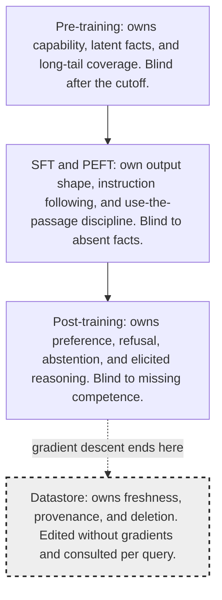
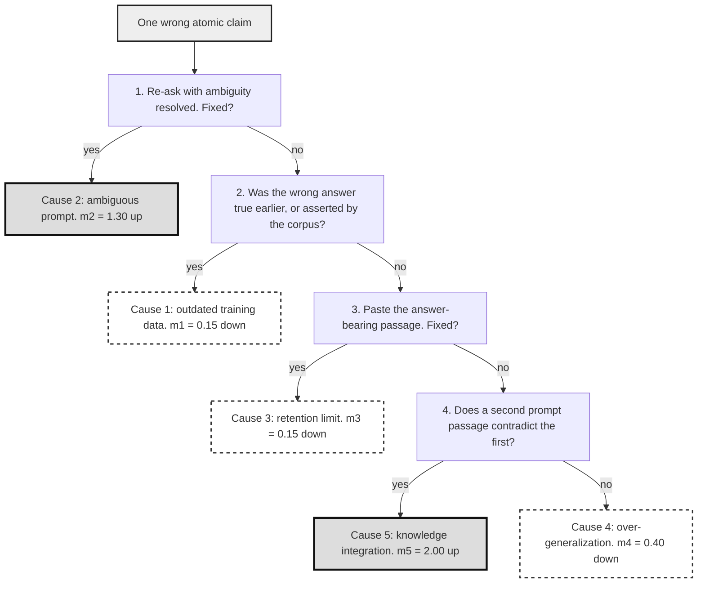
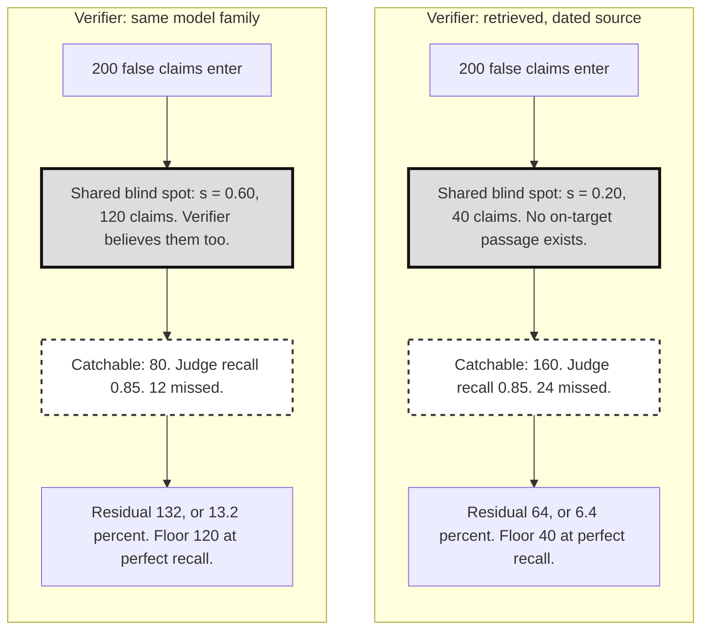

# Chapter 4: What the LLM Brings and What It Breaks

This chapter explains what the Large Language Model (LLM) contributes to Retrieval-Augmented Generation (RAG), what it breaks, and how to assign each failure to the right owner before choosing a fix.

## TL;DR

- Pre-training installs capability and uneven factual memory. Supervised fine-tuning shapes answers. Post-training shapes preferences. A datastore owns facts that change.
- Memorized text becomes easier to extract as model size, corpus duplication, and supplied context length rise.
- The model knows common facts better than rare facts. Retrieval helps the rare tail, but an off-target passage can overwrite a correct answer on common facts.
- Faithfulness asks whether a claim follows the supplied context. Factuality asks whether it is true in the world. One score cannot replace the other.
- Factual errors come from outdated data, ambiguous prompts, retention limits, over-generalization, or failed knowledge integration. Retrieval shrinks some causes and enlarges others.
- Verification is statistical because generation varies. It also faces moving truth and shared blind spots between generator and judge.
- Diagnose the stage, error bucket, traffic slice, and verifier oracle before spending money on more training, more retrieval, or a stronger judge.

## The story

Picture one newsroom.
The reporter is the LLM. Pre-training is the reporter's broad education from years of reading. It gives writing ability and uneven memory, but it ends at a cutoff date.
Supervised fine-tuning is the newsroom stylebook. It teaches the reporter to answer the assignment instead of continuing a random conversation. Post-training is the editor who shapes tone, refusal, and when to say "I do not know."
The datastore is the live news wire. It owns current prices, office holders, policies, provenance, and deletions because editors can update it without retraining the reporter.
The archive clerk is the retriever. The clerk is most useful for an obscure local story that the reporter barely saw during training. On a famous story, however, the reporter may already be right, and a bad clipping can make the answer worse.
Faithfulness asks whether the reporter copied the supplied clipping correctly. Factuality asks whether the story is actually true today. A stale clipping can produce a faithful but false article.
The copy desk sorts each wrong claim by cause. It asks whether the source was stale, the assignment was ambiguous, the reporter forgot a rare fact, the reporter followed a familiar pattern, or several sources were combined badly.
The final verifier is another copy editor. If that editor learned the same false rumor as the reporter, greater editing skill does not help. The verifier needs a dated, independent source that the reporter did not already use.
The newsroom lesson is simple. Train the reporter for capability and behavior. Use the live wire for changing facts. Retrieve selectively. Grade against the right source. Verify with independent evidence.

## Decoder table

| Technical term | Plain-English meaning | Why it matters |
|---|---|---|
| Large Language Model (LLM) | A generator trained to predict and produce text | It supplies capability, memory, and fluent answers, but it also creates the chapter's failure modes |
| Retrieval-Augmented Generation (RAG) | A system that retrieves passages and gives them to a generator | It moves some knowledge outside the weights and into editable context |
| Parametric memory | Information represented inside model weights | It can answer without retrieval, but it becomes stale and is hard to delete |
| Datastore | An external collection queried at answer time | It owns freshness, provenance, and per-document deletion |
| Pre-training | Large-scale next-token learning on collected text | It installs capability and uneven latent knowledge |
| Causal next-token objective | The rule that rewards predicting the next true token from earlier tokens | It explains why the base model learns continuations rather than instructions |
| Capability | An ability such as reading a table or doing arithmetic | Later stages and retrieval cannot reliably add reasoning that pre-training never installed |
| Latent knowledge | Facts absorbed into weights during training | It helps common questions but weakens on rare and changing facts |
| Training cutoff | The latest date represented in training data | Facts after this date were preventable at no training stage |
| Supervised fine-tuning (SFT) | Training on curated input and desired-output pairs | It teaches output shape, instruction following, and use of supplied passages |
| InstructGPT | The cited supervised fine-tuning and preference-training recipe | It anchors the source's claim about how instruction-following behavior is installed |
| Output shape | The required form of an answer | It includes prose, JavaScript Object Notation (JSON), tone, and citation format |
| Grounding discipline | The behavior of using or ignoring supplied evidence correctly | A model can possess a fact yet still answer against the passage |
| Post-training | Preference or reward training after SFT | It shapes helpfulness, refusal, abstention, and elicited reasoning |
| Reinforcement learning from human feedback (RLHF) | Training from human rankings of candidate answers | Ranking is cheaper than asking annotators to write every ideal answer |
| Direct preference optimization (DPO) | Preference training without a separate reward model | It targets the same preference layer with a different procedure |
| Reinforcement learning from verifiable rewards (RLVR) | Reward training where correctness can be checked automatically | It removes the human judge when outcomes are decidable |
| Abstention | Declining to answer when evidence is inadequate | It trades answer coverage for fewer unsupported claims |
| Continual pre-training | Re-running next-token training on fresh data | It can refresh weights, but it risks forgetting and demands replay data |
| Catastrophic forgetting | Loss of earlier knowledge during new training | It makes frequent weight refreshes operationally expensive |
| Replay data | Older training data mixed into a refresh run | It protects prior knowledge but may no longer be available |
| Model editing | Changing weights tied to a chosen association | It requires enumerating facts to change and can damage neighbors |
| Unlearning | A gradient procedure intended to remove named training influence | It does not scale to unknown future deletion requests |
| Parameter-efficient fine-tuning (PEFT) | Updating a small set of added parameters | It changes behavior more cheaply than full-parameter training |
| Low-Rank Adaptation (LoRA) | A PEFT method that trains low-rank matrices beside frozen weights | It moves format and grounding behavior without refreshing stale facts |
| Rank | The small inner dimension of a LoRA update | It sets adapter parameter count and capacity |
| Floating-point operations (FLOPs) | A measure of compute work | The chapter uses it to compare retraining, auditing, and serving |
| Gigabyte (GB) | A billion-byte storage unit in the source's decimal accounting | It converts weight and accelerator capacity into hardware counts |
| 32-bit floating point (FP32) | A four-byte numeric format used in the weight-memory calculation | It turns 27 billion weights into 108 GB before training state |
| Adam optimizer state | Weights, gradients, and two moment estimates stored for training | Its 16-byte-per-parameter footprint makes a refresh a multi-accelerator job |
| Prefill | Processing all prompt tokens before generation | Retrieved chunks add prefill cost and latency |
| Graphics processing unit (GPU) | An accelerator used to train and serve models | GPU memory and hours convert designs into capacity and dollar costs |
| k-extractability | Exact reproduction of a training continuation after k prefix tokens | It makes memorization measurable for a specific probe |
| Greedy decoding | Always selecting the highest-probability next token | The standard extraction definition depends on this decoding rule |
| GPT-Neo family | The 125-million through 6-billion parameter family used in the memorization measurements | It supplies the measured capacity ordering in Figure 4.2 |
| Duplication count | How often a sequence appears in the corpus | More copies make verbatim extraction more likely |
| Context length | The number of prompt tokens supplied at inference | Longer matching prefixes make memorized continuations easier to unlock |
| Induction head | Attention circuitry that copies what followed a matched pattern | It supports both useful in-context learning and verbatim regurgitation |
| In-context learning | Learning a pattern from examples inside the prompt | It shares machinery with memorized copying, so the two cannot be cleanly separated |
| Divergence attack | A prompt that pushes a chat model away from aligned behavior | It can expose raw pre-training continuations missed by normal probes |
| Application Programming Interface (API) | The paid query interface used in the outside extraction experiment | It makes the external attack cost comparable with the internal audit cost |
| Deduplication | Removing duplicate or near-duplicate training text | It cuts memorized emissions without the capability loss of shrinking the model |
| Perplexity | A held-out next-token prediction measure | Unchanged perplexity shows that deduplication did not reduce measured language quality |
| n-gram containment check | A search for long generated spans that match licensed text | It catches continuation beyond a retrieved chunk boundary |
| MinHash | A compact near-duplicate detector | It estimates duplicate rates and wasted retrieval slots |
| Personally identifiable information (PII) | Person-linked information named among sensitive corpus contents | It is one kind of material the chapter says should remain outside weights when extraction is unacceptable |
| Long-tail knowledge | Facts supported by very few training documents | These facts remain weak even in large models |
| Fact triple | A subject, relation, and object representation of one fact | It makes support and co-occurrence countable |
| Support count d | The number of pre-training documents containing a fact's subject and object | Accuracy rises roughly with log10 d |
| Co-occurrence bias | Preference for the word most often seen near a subject | It explains confident wrong answers when the true object is rare |
| Modal companion | The object most frequently associated with a subject | Greedy decoding can choose it instead of the relation's true object |
| Stock keeping unit (SKU) | A catalog product identifier | It represents a private tail entity in the chapter's support example |
| Copy path | The mechanism that reads a relation from supplied context | It can rescue a tail fact or faithfully copy an off-target passage |
| Popularity threshold τ | The traffic-dependent point where weights overtake retrieval | It separates queries that should retrieve from queries that should trust memory |
| Adaptive retrieval | Retrieving only for selected queries | It can avoid overwriting correct head answers and save context cost |
| PopQA | The cited question-answering benchmark used to measure retrieval flips and popularity routing | It supports the crossover between trusting weights and retrieving |
| Zipfian traffic | A distribution where a small head receives much of the demand | Entity share and traffic share can differ sharply |
| Faithfulness | Whether a claim follows the supplied context | It is computable per request because the context is available |
| Factuality | Whether a claim is true in the world | It requires an external oracle and usually an offline audit |
| Oracle | The evidence source used to grade a claim | Changing the oracle can change the verdict without changing the answer |
| Large Language Model judge | A model used to grade generated claims | It can share false beliefs with the generator and hide its own oracle |
| Gold label | A reference answer used to grade a system | It can rot when the underlying fact changes after annotation |
| Entailed claim | A claim supported by the context | It passes faithfulness but can still be false if the context is stale |
| Not enough information (NEI) | The label for a claim the source does not address | It is the fact-checking name for the extrinsic column of the taxonomy |
| Extrinsic hallucination | An unsupported claim not addressed by the context | It points to retrieval coverage or abstention policy |
| Intrinsic hallucination | A claim that contradicts the supplied context | It points to the generator, distractors, position, or context limits |
| Atomic claim | One independently checkable proposition | Claim decomposition makes long answers measurable |
| FActScore | A method that decomposes long text into atomic claims for factuality checks | It supplies the unit of analysis used in the chapter |
| RAGAS faithfulness | The fraction of emitted claims entailed by retrieved context | It measures grounding with the retrieved corpus as oracle |
| Corpus correctness q | The chance that a context-entailed claim is true in the world | It sets the ceiling of perfectly grounded output |
| Closed-book accuracy pθ | Accuracy on the same traffic with retrieval removed | It values unsupported fallback to parametric memory |
| Inaccurate or outdated data | A source that was false or became stale | Retrieval helps only if it brings a corrected source |
| Ambiguous prompt | A query with multiple plausible readings | Retrieval can amplify the wrong reading with confident-looking evidence |
| Retention limit | A fact that training included too rarely to survive in weights | Retrieval can repair it when the answer passage arrives |
| Over-generalization | Answering from a familiar surface pattern | An on-target passage can correct it, while an off-target passage can reinforce it |
| Knowledge integration error | Bad reconciliation of several sources or entities | More retrieved passages can increase this error |
| Answer-passage recall r | The chance that retrieval places the answer-bearing passage in the prompt | It controls residual knowledge-absence errors |
| Error multiplier mi | The factor by which retrieval scales cause i | It exposes that retrieval helps some causes and hurts others |
| Retrieval flip rate φ | The share of previously correct answers made wrong by retrieval | It creates an error floor that better recall cannot remove |
| Break-even error ε0* | The closed-book error below which retrieval loses overall | It supports per-query routing instead of always retrieving |
| Approximate nearest-neighbor (ANN) lookup | A fast index search for candidate passages | It is the inference-time alternative to buying more parameter decades |
| Cross-encoder reranker | A model that scores query-passage pairs after broad retrieval | It can retrieve many candidates while feeding only a few to the generator |
| Black-box generator | A model whose internal cause is not visible from its output | Verification can observe samples but cannot directly localize faults |
| Sampling temperature T | A control over generation randomness | At T above zero, one test run is only one draw |
| Bernoulli draw | One yes-or-no observation of whether a claim appeared | Repeated draws are needed to estimate an emission probability |
| Normal approximation | The sample-size estimate applied to repeated Bernoulli draws | It produces the 385-sample worst-case requirement |
| Emission rate | The probability that a generator produces a claim | It is more informative than one pass or fail |
| SelfCheckGPT | A detector that resamples answers and flags unstable claims | It uses black-box variation without inspecting weights |
| Feature attribution | A method that connects outputs to influential inputs or features | It can partially localize black-box failures at a cost |
| Mechanistic interpretability | Analysis of internal model circuits | It seeks causal explanations but is expensive |
| Poisson change process | A model where truth-changing events arrive randomly at a fixed rate | It converts fact lifetime into a label-refresh cadence |
| Mean lifetime τ | The average time before a fact changes | It determines how quickly answers and gold labels decay |
| Label rot | A gold answer becoming wrong as the world changes | It can be as large as the measured system gain |
| FreshQA | The cited benchmark separating fast-changing from never-changing questions | It shows why model evaluation must classify facts by lifetime |
| PageRank | A link-graph prestige signal used by search systems | It contrasts source authority with a model's frequency signal |
| Allowlist and blocklist | Explicit rules admitting or rejecting sources | They are authority controls that parametric frequency does not provide |
| n-gram frequency | The model's repetition-based evidence signal | Frequency can support learning without establishing source trust |
| Shared blind-spot share s | The fraction of false claims the verifier also believes | It creates a residual floor that judge quality cannot cross |
| Independent miss rate μ0 | The verifier's miss rate on errors outside shared blind spots | Better judge capacity can reduce only this term |
| Macro-averaged F1 (macro-F1) | The cited aggregate attribution-judge score | Its roughly 80 percent value motivates the incorrect independence baseline |
| Information-access symmetry | The judge and annotator seeing the same amount of source evidence | Violating it causes attribution errors unrelated to judge capability |
| Self-consistency | Resampling and voting within one model distribution | It misses confident falsehoods that sit at the mode |
| Oracle independence | Giving the verifier evidence the generator did not have | It reduces shared blind spots more than a same-source judge upgrade |
| VeriScore | A correction that separates unverifiable claims and rewards factual recall | It prevents precision-only scoring from rewarding silence |

## Core mechanics

### 4.1 Pre-training, SFT, post-training: which stage owns which failure

#### Stage ownership

The opening assistant was shipped last quarter with a 27-billion-parameter open-weight model fine-tuned on 40,000 internal tickets.
It names a vice president who left in March, returns prose when the frontend expects JSON, and invents a refund window for a product line launched six weeks earlier.
The stale name, wrong output form, and absent new fact belong to different owners.
Pre-training maximizes the sum over t of log Pθ(xt given the tokens before t) over collected text.
Here θ is the full parameter vector.
It has no gold labels, so scale tends to beat curation.
It installs capability and uneven knowledge.
The source frames a working hypothesis: a competence absent from the pre-training corpus cannot be added later.
Accuracy rises with the number of documents that mention an entity, and frequent text can be memorized.
SFT maximizes log Pθ(Y | X) over curated input-output pairs.
Ouyang et al. (2022) established this instruction-tuning recipe with InstructGPT.
It changes "continue this text" into "produce this output for this input."
The National University of Singapore (NUS) example shows the difference. A pure base model may continue one question with more questions because web text does that.
SFT fixes this wrong behavior. It also trains instruction following, output form, and grounding discipline.
Post-training replaces gold answers with preference or verifiable reward signals.
RLHF lowers the annotation burden from writing an ideal answer to ranking two answers.
DPO removes the separate reward model. RLVR removes the human judge when correctness is decidable.
Post-training owns helpfulness, honesty, harmlessness, tone, refusal, abstention, and elicited reasoning.
It remains unresolved whether post-training adds capability or mostly raises the probability of behavior the base model could already produce.
Use the conservative view. The base model sets the ceiling for all downstream stages, including whether it can reason over a retrieved passage.

#### What training cannot own

The stale vice president is not a capability, shape, or preference failure.
The model learned the fact correctly, then the world changed after the cutoff.
Continual pre-training can refresh it, but models with only a few hundred million parameters can suffer substantial catastrophic forgetting.
Each refresh then needs replay data that may no longer exist.
Model editing changes named associations, but it inherits the enumeration problem of unlearning.
You must know every future fact or sequence that will need a change.
It also cannot guarantee complete removal and can damage neighboring associations.
Scale cannot close the tail economically.
Kandpal et al. (2023) extrapolated competitive accuracy on sparsely supported facts to about 10^18 parameters.
At two bytes per weight, storage is 2 x 10^18 bytes.
Dividing by 8 x 10^10 bytes per 80 GB accelerator gives 2.5 x 10^7 accelerators before processing one token.
The datastore owns facts that outlive gradient descent because it supports freshness, provenance, and deletion.
Deleting a datastore row removes future retrieved exposure, but it cannot erase text the base model already memorized during pre-training.
Domain SFT loses as a knowledge patch.
It raises Pθ(Y | X) for written examples but does not erase far more frequent contradictory pre-training evidence.
It creates internal conflict and returns the bill when the fact changes again.

#### Worked example and costs

The assistant fails 370 of 1,000 queries: 180 stale facts, 90 contradictions of correct context, 60 format violations, and 40 errors on low-presence entities.
For a weight refresh, use N = 27 x 10^9 parameters and D = 10^10 fresh tokens.
32-bit floating point (FP32) weights occupy 108 GB.
Adam training uses about 16 bytes per parameter for weights, gradients, and two moments, or 432 GB total.
That needs six 80 GB accelerators before activations.
Training work is approximately 6ND = 1.62 x 10^21 FLOPs.
At 3.4 x 10^14 FLOP/s, that is 4.76 x 10^6 seconds or 1,324 GPU-hours.
At $2.50 per GPU-hour, the refresh costs about $3,310.
It fixes the 180 stale facts and some of the 40 tail errors until the next refresh.
For context repair, retrieve five 400-token chunks, adding 2,000 prefill tokens.
At about 2N FLOPs per token, this adds 1.08 x 10^14 FLOPs or 0.32 GPU-seconds per query.
The cost is $2.2 x 10^-4 per query.
One $3,310 refresh therefore buys about 15 million retrieval-augmented queries with no refresh schedule and with per-document deletion.
For behavior repair, a few thousand supervised pairs can move the 60 format failures and most of the 90 context contradictions.
A rank-16 LoRA update on one 4,096 by 4,096 projection trains 16 x (4,096 + 4,096) = 131,072 parameters instead of 16,777,216.
That is a 128-fold reduction, but it moves none of the 180 stale answers.
The compute sanity check uses Llama 3 405B and 15.6 trillion tokens.
The 6ND estimate gives 3.79 x 10^25 FLOPs against the reported 3.8 x 10^25.
Dividing by 30.84 million H100-hours gives the sustained 3.4 x 10^14 FLOP/s rate used here.

#### Practical decisions

- Reproduce a failure on the base checkpoint before blaming SFT. If that checkpoint cannot run, probe the smallest sibling in its family.
- Put any fact with a change cadence shorter than retraining in the datastore. For fewer than roughly 100 bounded facts, a templated system prompt can beat an index on latency and operational surface.
- Use LoRA for shape and full-parameter training for capability. Frozen embeddings may not add a language or domain vocabulary the tokenizer never saw.
- Ask refresh cadence before model size. A static million-document domain on an annual cadence can justify continual pre-training.
- Keep a retrieval-free capability probe. About a dozen supplied-text arithmetic and two-hop questions can separate base-model regressions from index regressions. Run it on each base-model swap rather than each index rebuild.

### 4.2 Memorization: three laws and their consequences

#### Definition and laws

A security probe samples 3,000 training documents, supplies 50 tokens, greedily decodes 50 more, and finds two exact matches.
The reported 0.07 percent looks reassuring.
Production later receives four paragraphs of a paywalled report and continues with the next 300 words verbatim, even though retrieval never supplied them.
The model did not change. The prompt grew from 50 to about 2,000 tokens.
A sequence is k-extractable when greedy decoding after a k-token training prefix reproduces the following sequence exactly.
Extractability belongs to the model, decoding rule, and context together.
Every probe is a lower bound because it tests only sampled prefixes.
Carlini et al. (2023) measured a log-linear relation across GPT-Neo models from 125 million to 6 billion parameters.
Pr[k-extractable] is approximately α log N + β log d + γ log k + δ, with α, β, and γ positive.
The transferable findings are the signs, not family-specific coefficients.
Law one says larger models memorize a larger fraction.
Law two says duplicated sequences are more extractable.
Law three says longer supplied context increases extraction.
Duplication adds repeated gradient steps on the same continuation until greedy decoding follows it deterministically.
Longer context gives more evidence that the prompt is one exact document rather than a similar one.
Induction heads perform the matching and copying.
The same circuitry supports in-context learning and verbatim regurgitation.
No intervention can simply remove one while preserving the other.

#### Why the short audit fails

The 50-token result describes a regime the product does not use.
Alignment also provides no extraction floor outside normal prompts.
Nasr et al. (2023) used a divergence attack that asked an aligned chat model to repeat one word. It recovered more than 10,000 unique memorized examples from ChatGPT for about $200 in application programming interface (API) queries.
The controls follow the laws.
Probe at deployed context length.
Deduplicate the corpus. Lee et al. (2022) reported memorized text about ten times less often with no held-out perplexity loss.
Keep material that cannot be extracted safely outside the weights.
Detector audits using the approach of Gehman et al. (2020) estimate toxic documents at 2 to 4 percent of web-crawled corpora, alongside personally identifiable information (PII) and copyrighted books.
RAG supplies long verbatim corpus prefixes, so it operates in the highest-extraction prompt regime.
Serving a smaller model does reduce extraction, but it loses capability on every query.
Deduplication dominates when available because it gives a tenfold reduction without measured perplexity loss.
Heavily duplicated text remains extractable at each useful model scale.
This is not classical overfitting.
The measured models saw roughly one corpus pass, and held-out loss was still falling.
Early stopping and weight decay therefore do not address the cause.

#### Audit cost

Take a 7-billion-parameter generator and 100,000 sampled sequences.
At k = 500, the probe processes a 500-token prefix and 500-token continuation, or 1,000 tokens per sequence.
Work is 1.4 x 10^13 FLOPs per sequence and 1.4 x 10^18 FLOPs overall.
At 3.4 x 10^14 FLOP/s, this takes 4.1 x 10^3 seconds or 1.1 GPU-hours.
At $2.50 per GPU-hour, it costs $2.90.
At deployed k = 2,000, five 400-token chunks form the prefix and the 500-token continuation makes 2,500 tokens of work.
Work is 3.5 x 10^13 FLOPs per sequence, 3.5 x 10^18 FLOPs overall, and 1.03 x 10^4 seconds overall.
That is 2.9 GPU-hours or $7.15, about 2.5 times the short probe.
If 1 percent of the sample reproduces exactly, the audit confirms 1,000 memorized sequences at $0.007 each.
A tenfold deduplication effect predicts roughly 100 after rebuilding.
The outside attack cost about $0.02 per extracted example.
The internal audit is about three times cheaper because it knows the corpus, yet both costs share the same order of magnitude.

#### Practical decisions

- Probe at the 95th-percentile production prompt length. Use the fixed template maximum when the product caps context.
- Deduplicate before shrinking a model. If pre-training is outside your control, keep licensed text out of later gradient updates.
- If a license permits indexing but forbids training, do not fine-tune on retrieved licensed passages. Popular passages repeat across pairs, so epoch count becomes a legal parameter. Train grounding on permissive or paraphrased passages and keep the licensed corpus at test time.
- Report a lower bound with k, duplication threshold, and sample frame. Bias sampling toward highly duplicated sequences.
- Flag generated spans of roughly 50 or more tokens that match a licensed-content index. Log rather than block when verbatim extraction is the requested product.
- Measure the datastore's duplication distribution with near-duplicate checks. A curated single-source manual is a reasonable exception.

### 4.3 Long-tail knowledge and co-occurrence bias

#### Support and wrong-answer selection

A 70-billion-parameter model correctly names Microsoft's founders, their birth years, and the company's founding date while missing an internal product rule documented across 40 pages.
For stock keeping unit (SKU) 4471, it says 30 days instead of the true 14 days with equal confidence.
This gap can produce 90 percent accuracy on head-heavy public benchmarks and 40 percent on tail-heavy product traffic.
Represent a fact as subject s, relation r, and object o.
Let d(f) count pre-training documents containing both s and o.
Question-answering accuracy follows A(d) approximately β log10 d + c.
Near d = 0, no prompt or decoding trick can recover evidence that never entered the weights.
Accuracy is bought in decades of support, not percentage increases.
At fixed d, A(N, d) is approximately α log10 N + β log10 d + c, where α is smaller than β.
Holding accuracy fixed gives Δ log10 N = (β / α) Δ log10 d.
The estimated exchange rate is about two decades of parameters for one decade of missing documents.
Human-level accuracy on the least-supported questions extrapolates beyond 10^18 parameters from measured models around 2 x 10^11.
Tail support is roughly 10^0.5 documents against about 10^4 for head facts.
The implied ratio is β / α approximately log10(10^18 / (2 x 10^11)) / log10(10^4 / 10^0.5) = 6.7 / 3.5, or about 1.9.
A decade of parameters multiplies training FLOPs and serving memory by ten on every query.
A decade of documents supplied at inference costs one approximate nearest-neighbor lookup.
Five times more web data adds only log10 5 = 0.70 decades, and correlated crawls mostly repeat earlier data.
When support is weak, next-token learning favors Pθ(o | context(s)) proportional to count(s, o).
Greedy decoding returns arg max over o of count(s, o), so it selects the subject's most frequent companion rather than necessarily selecting the true relation object.
If Tokyo appears with Toyota ten times as often as Toyota City, relation words must overturn a tenfold prior.
Kang and Choi (2023) found that about 30 percent of measured failures selected a high-co-occurrence word instead of the correct object.
The rare true object is both unsupported and outvoted, which explains confident error instead of abstention.

#### Retrieval crossover

Retrieval changes the estimator rather than the storage.
One occurrence in the prompt can outvote 10^5 corpus occurrences through the copy path.
An off-target passage activates the same path and gets copied faithfully.
Mallen et al. (2023) found that retrieval flipped a previously correct unassisted answer on around 10 percent of PopQA questions.
Damage concentrated on popular subjects where parametric memory was already strong.
The weights-only and weights-plus-retrieval curves therefore cross at threshold τ.
Traffic sets τ. Model identity alone does not.
Training a narrowed domain corpus for more epochs loses in three ways.
It amplifies the modal association, ties freshness to training cadence, and catastrophically forgets uncovered knowledge.
Entity popularity only approximates fact support.
A famous entity can have a rare attribute, so routing must include the relation.

#### Routing example

The assistant handles 10,000 questions per day across 5,000 products.
Assume product mentions and traffic follow a Zipf law with exponent 1. These constants are assumed rather than measured.
Traffic on the top r entities is Hr / H5000, where Hr is approximately ln r + 0.577.
H5000 is about 9.09 and H50 is about 4.50.
The top 50 entities are 1 percent of the catalog but carry 49.5 percent of traffic.
Label 500 questions and place τ near rank 50.
Closed-book accuracy is 82 percent on the head and 24 percent on the tail.
Retrieval accuracy is 68 percent on the tail.
Applying a 10 percent flip rate to the head loses 8.2 points and gives a pessimistic 73.8 percent with retrieval.
Always retrieving scores 0.495 x 73.8 + 0.505 x 68.0 = 70.9 percent.
Never retrieving scores 0.495 x 82.0 + 0.505 x 24.0 = 52.7 percent.
Routing below τ scores 0.495 x 82.0 + 0.505 x 68.0 = 74.9 percent and retrieves on 50.5 percent of queries.
Routing gains 4.1 points over always retrieving and 22.2 points over never retrieving.
Five 400-token chunks add 2,000 input tokens per retrieved query.
Always retrieving uses 2 x 10^7 input tokens per day. Routing uses 1.01 x 10^7.
At $0.30 per million tokens, the daily costs are $6.00 and $3.03.
Annual savings are under $1,100, so accuracy is the main argument.
Routing also removes roughly 120 milliseconds of retrieval and reranking latency from half the traffic.
The gain check is 0.495 x 8.2 = 4.06 points, which matches the reported 4.1-point gap.
Mallen et al. (2023) reported the same ordering on PopQA, with adaptive retrieval above always-retrieve and never-retrieve.

#### Practical decisions

- Stratify accuracy by log d and weight by query logs. Entity share does not size traffic cost.
- If every entity is internal, treat every query as tail and skip threshold fitting.
- Start with always-retrieve until a labeled set measures τ. Routing becomes attractive when head traffic exceeds roughly one third. Refit τ when campaigns change traffic, weekly in the source scenario.
- Use popularity and relation support before model confidence. Co-occurrence bias can make the modal wrong answer highly confident. For novel or internal entities with no frequency signal, use confidence and accept its calibration risk.
- Build one co-occurrence trap per relation. Use search hit counts when direct corpus counts are unavailable.
- Put tail facts in the datastore. A small, closed, static domain on an annual update cadence is the defensible exception for repeated domain training.

### 4.4 Hallucination taxonomy: factuality versus faithfulness, intrinsic versus extrinsic

#### Two oracles and three source relations

One reviewer compares "refunds are processed within 14 days" with a retrieved 30-day passage and marks a hallucination.
Another checks a live page updated three weeks earlier to 14 days and marks it correct.
The first measures faithfulness against supplied context.
The second measures factuality against the world.
Maynez et al. (2020) fixed this distinction for abstractive summarization, and Ji et al. (2023) carried it into the LLM literature.
A rise from 0.70 to 0.93 faithfulness can accompany more complaints when the corpus is stale or the model abstains more.
The source relation has three labels.
An entailed claim is supported or attributable.
An unaddressed claim is not enough information (NEI), extrinsic, or extrapolatory.
A contradicted claim is refuted, intrinsic, or contradictory.
Decompose each answer into atomic claims as FActScore does.
Let f be the fraction entailed by context, as in RAGAS faithfulness.
Let q be corpus correctness, equal to one minus staleness.
Let pθ be closed-book accuracy on the same traffic.
Assuming the generator falls back to memory outside context, Pr(factual) = f q + (1 - f) pθ.
Grounding changes factuality at rate ∂Pr(factual) / ∂f = q - pθ.
Grounding helps only when the corpus is more reliable than model memory.
The metric gap is Pr(factual) - f = (1 - f)pθ - f(1 - q).
The positive term is true but unsupported content.
The negative term is faithful but false content.
As f approaches 1, the first term vanishes and the second approaches the corpus error 1 - q.
Perfect grounding transcribes corpus error rather than guaranteeing truth.
Intrinsic hallucinations contradict evidence already in the prompt and belong to generation.
Extrinsic hallucinations fill retrieval gaps and belong to coverage or abstention.
A single judge prompt hides its oracle, mis-scores a whole cell, and cannot route the bug.
Factuality alone also fails as an online gate because the world oracle is unavailable in the request path.
Instruction-following and logical hallucinations fit neither axis.
A true, grounded translation that answers the capital instead still violates the instruction.
A correct method with bad arithmetic can support every intermediate claim yet fail at the conclusion.

#### Worked example

Audit 200 questions with about five atomic claims each.
Measured corpus staleness is 4 percent, so q = 0.96.
Closed-book accuracy is 30 percent, so pθ = 0.30.
Without a grounding constraint, 1,000 claims split into 700 entailed, 80 contradicting, and 220 unaddressed.
Faithfulness is 0.70.
Staleness makes 28 of the 700 entailed claims false.
Of the 300 unfaithful claims, 30 percent are true: 8 contradictions and 82 unsupported claims.
Factuality is 762 of 1,000, or 76.2 percent.
Faithfulness understates truth by 6.2 points.
With grounded-or-abstain, the model declines 50 of 200 questions and emits 750 claims.
The claims split into 700 entailed, 10 contradicting, and 40 unsupported.
Faithfulness is 700 / 750 = 0.933.
Factuality is 0.933 x 0.96 + 0.067 x 0.30 = 0.916, or 687 true claims.
Faithfulness now overstates truth by 1.7 points.
The first setup delivers 3.81 true and 1.19 false claims per question.
The second delivers 3.44 true and 0.32 false claims.
It removes 175 false claims while surrendering 75 true claims.
The exchange rate is 2.33 false claims removed per true claim lost.
Ship that trade only when a wrong claim costs more than 2.33 times a missing one.
The compliance variant makes the same trade visible. Zero unsupported claims can cut answer coverage by 20 points while a 30-day refresh cadence still leaves faithful but stale answers.
Batching five claims per judge call requires 200 calls and about 440,000 input tokens.
At $0.30 per million tokens, the faithfulness pass costs about $0.13.
In an outside summarization audit, more than 70 percent of summaries contained hallucinated content and roughly 90 percent of those hallucinations were false.
That leaves about one in ten hallucinations true but unsupported, or pθ near 0.10.
The support assistant's pθ of 0.30 is three times higher because its unsupported content is often generic background.

#### Practical decisions

- Report faithfulness, sampled factuality, and the intrinsic-extrinsic split. If no world oracle exists, make faithfulness the contract and corpus freshness the service obligation.
- Gate on faithfulness online. Audit factuality offline unless a high-stakes error justifies a second retrieval loop.
- Route contradictions to generation and unsupported claims to retrieval or abstention. A post-update contradiction spike may instead signal disagreeing documents.
- Sample supported claims to estimate q. Start with 100 entailed claims per corpus per month and increase frequency when freshness exceeds 30 days or documents have legal owners.
- Pair faithfulness with true claims per question. In regulated settings, state the precision-coverage trade and obtain explicit ownership. Require attribution for answer-bearing claims while allowing a stated policy for extrinsic background claims.

### 4.5 The five causes of factual error

#### Cause model

The closed-book assistant is wrong on 38 percent of graded answers.
After retrieval it is wrong on 23.5 percent.
The residual errors concentrate in causes that retrieval can enlarge, so a better retriever is not automatically the next fix.
Cause 1 is inaccurate or outdated training data.
Cause 2 is an ambiguous or under-specified prompt.
Cause 3 is a knowledge-retention limit on a rare fact.
Cause 4 is over-generalization from a surface pattern.
Cause 5 is failed integration of disagreeing sources or crossed entity attributes.
Let ε0 be closed-book error and ei each cause's share, with Σi ei = 1.
Let mi be retrieval's multiplier for cause i and φ its correct-to-wrong flip rate.
Then εR = ε0 Σi ei mi + φ(1 - ε0).
For causes 1 and 3, m1 = m3 = 1 - r because retrieval repairs them when the answer passage arrives.
For cause 4, m4 is greater than 1 - r because off-target but plausible context can reinforce the pattern.
Ambiguity makes a bad retrieval query and can give the wrong interpretation confident evidence, so m2 exceeds 1. Shi et al. (2023) showed that irrelevant context can reduce accuracy rather than being ignored.
Knowledge integration also worsens because the model reconciles weights plus k passages.
The number of source pairs is (k + 1)k / 2, or 15 at k = 5 and 210 at k = 20.
Longpre et al. (2021) showed that models often retain memorized answers when retrieved context contradicts them.
Retrieval therefore shrinks missing-knowledge causes and enlarges reconciliation causes.
Let S = Σi ei mi.
Retrieval helps only above ε0* = φ / (1 - S + φ).
The flip term does not improve with recall.
Global scale levers miss ambiguity and integration.
Five times more data buys only 0.70 decades of support.
Parameter scaling reaches the 10^18 long-tail extrapolation.
More domain epochs sacrifice broad coverage.
The five labels can overlap in reality.
The ordered cascade assigns one operational owner so counts add up.
Changing the test order changes the attribution, so teams must not compare differently ordered counts.

#### Audit and alternatives

Take 1,000 questions with one graded atomic claim each.
At ε0 = 0.38, there are 380 wrong claims.
The ordered tests assign 140 to outdated data, 60 to ambiguity, 120 to retention, 40 to over-generalization, and 20 to integration.
With top-k = 5 and r = 0.85, use m1 = m3 = 0.15, m2 = 1.30, m4 = 0.40, and m5 = 2.00.
The surviving buckets are 21, 78, 18, 16, and 40.
They total 173, so S = 173 / 380 = 0.455.
A 10 percent flip rate turns 62 of the 620 correct answers wrong.
Total error is 235 of 1,000, or 23.5 percent.
The net gain is 14.5 points, but ambiguity becomes the largest bucket.
Ambiguity and integration hold 118 of 173 carried errors, or 68 percent.
Raising recall from 0.85 to 0.95 cuts causes 1 and 3 to 7 and 6.
Carried error becomes 147 and total error becomes 209, or 20.9 percent.
The recall upgrade gains 2.6 points.
A clarification turn matches that gain by removing 26 ambiguity errors.
It changes m2 from 1.30 to 0.87 because 60 x 0.87 = 52.
It needs one short rewrite call, which is cheaper than the larger retrieval and reranking path.
The recall upgrade raises prefill from five 400-token chunks, or 2,000 tokens, to twenty chunks, or 8,000 tokens.
Across 1,000 questions, that adds 6 million input tokens and costs about $1.80 at $0.30 per million.
It also adds 20 cross-encoder passes per query and increases conflict pairs from 15 to 210.
The break-even is 0.10 / (1 - 0.455 + 0.10) = 0.155.
Retrieval stops paying when closed-book accuracy reaches about 84.5 percent.

#### Practical decisions

- Triage 100 failures through the four tests before changing retrieval. About two engineer-days can estimate the cause vector.
- Track ambiguity and integration separately. A single authoritative source with k at most 2 is the main low-conflict exception.
- Set generator top-k against conflict, not recall alone. Retrieve 50 candidates, rerank them, and feed 5 unless near-duplicate canonical passages justify more.
- Run the same evaluation closed-book to measure flips in both directions. A 14.5-point net gain can hide 62 newly wrong answers.
- Gate retrieval once a slice falls below roughly 15 percent closed-book error. Retrieve anyway when contractual attribution, rather than accuracy, is the requirement.

### 4.6 Why verification is hard: black box, moving truth, biased verifiers

#### Three structural difficulties

A radiology assistant claims the liver has multiple small hypodense masses when the computed tomography (CT) series excludes the liver.
A judge scores it 0.91 faithful because it forms the same impression.
An attending radiologist catches the problem in four seconds.
A dashboard claim of 94 percent faithfulness is meaningful only if its verifier and oracle are understood.
First, a sampled generator is a distribution rather than a deterministic function.
At temperature T above zero, one run is a Bernoulli draw.
To estimate a claim probability within plus or minus 0.05 at 95 percent confidence, use n = z^2 p(1 - p) / Δ^2.
At worst-case p = 0.5 and z = 1.96, n is 385 samples per claim.
Verification has become estimation, increasing the cost by about two orders of magnitude.
Manakul et al. (2023) turned variation into the SelfCheckGPT detector by resampling and flagging claims that do not survive.
The output still does not localize error to corpus, retrieval, or decoding.
Feature attribution and mechanistic interpretability offer partial but expensive localization.
Second, truth and gold labels move.
Under a Poisson change process with mean lifetime τ, survival after time t is e^(-t / τ).
The question about the United States president had four correct answers in sixteen years.
Vu et al. (2023) built FreshQA to separate fast-changing questions from never-changing ones because model scores differ across them.
The honest refresh cadence for label-rot tolerance δ is t* = τ ln[1 / (1 - δ)].
At τ = 2 years and δ = 1 percent, t* is 0.0201 years or 7.3 days.
Parametric answers supply no web address, retrieval date, or authority for rechecking.
Search ranking uses link prestige such as PageRank from Page et al. (1999), hundreds of engineered features, allowlists, and blocklists.
The model mainly has n-gram frequency, which does not establish trust.
Third, verifier errors correlate with generator errors.
Let ε be generator false-claim rate, s the shared blind-spot share, and μ0 the independent miss rate.
Residual error is εpost = ε[s + (1 - s)μ0], which is at least sε.
Judge quality changes μ0 but cannot change s.
Oracle independence changes s and therefore moves the floor.
Self-verification methods measure dispersion. They include the self-consistency of Wang et al. (2023), the calibrated P(true) evaluation of Kadavath et al. (2022), and same-distribution voting.
Shared false beliefs sit at the mode, so every resample can repeat them confidently.
A frontier judge trained on the same crawl can share the same floor.
Some claims have no settleable truth condition, such as vague statements about what many people believe.
Route these claims out of the numerator and report their share separately.
Otherwise, marking them wrong punishes hedging and marking them right inflates the metric.
Precision-only factuality also rewards silence, which VeriScore corrects with a recall term.

#### Verifier audit and costs

Audit 1,000 atomic claims with ε = 0.20, so 200 are false.
Replay the 200 known-false claims through the judge. It passes 120, so s = 0.60.
Judge recall on injected errors is 0.85, so μ0 = 0.15.
With a same-family judge, all 120 shared blind spots pass.
The judge catches 68 of the remaining 80 and misses 12.
Residual error is 132 claims, or 13.2 percent.
Verification gains 6.8 points.
A perfect judge removes the 12 independent misses but leaves 120 claims, or 12.0 percent.
All remaining judge-quality headroom is 1.2 points.
Now attach one retrieved, dated passage per claim.
Retrieval is on target for 70 percent of claims and correct on 95 percent of those.
A usable external check exists with probability 0.70 x 0.95 = 0.665.
The new blind-spot share is about 0.60 x (1 - 0.665) = 0.201.
That gives 40 blind-spot claims and 160 catchable claims.
At 0.85 recall, the judge misses 24 and residual error is 64, or 6.4 percent.
Oracle independence buys 6.8 points where judge capacity can buy at most 1.2, a factor of 5.7.
A small judge costs $0.24 for 1,000 claims with 800-token prompts at $0.30 per million tokens.
Adding one 400-token passage per claim costs $0.12 plus one lookup, for $0.36 total.
A frontier judge at $3.00 per million costs $2.40.
That is 6.7 times the independent-oracle configuration for one sixth of its effect.
An independence assumption with the 20 percent error implied by roughly 80 percent macro-F1 predicts only 40 residual claims, or 4.0 percent.
The correlated result of 132 is 3.3 times larger.
Replay distinguishes these models in an afternoon.
If 30 percent of 1,000 gold labels are time-sensitive with τ = 2 years, then 66 rot after six months.
The calculation is 300 x (1 - e^(-0.25)) = 66.
That 6.6-point measurement error nearly equals the measured 6.8-point gain.

#### Practical decisions

- Estimate s before upgrading a judge. Replay 100 to 200 confirmed false claims, or inject known errors when no incident corpus exists.
- Give the verifier a retrieved passage with a web address and timestamp that the generator did not have. Shared context is already an independent oracle for pure faithfulness checks.
- Check information-access symmetry. Roughly one quarter of attribution-judge errors arise when judges and annotators see different amounts of source text.
- Stamp gold labels with validity dates and lifetime classes. Recheck the τ = 2 year, 1 percent-tolerance slice weekly, stable facts annually, and fast-changing prices, headcounts, or org charts daily.
- Report claim emission rates at production temperature. Start with five samples per item because three emissions in five differ from five in five. Use temperature zero only for explicitly labeled regression gates.
- Send clinical, legal, and financial claims to experts when generator and judge share a distribution and s approaches 1. Use an authoritative curated source instead when one exists.

## Diagrams

### Figure 4.1



Figure 4.1: Each training stage installs one class of behavior and is structurally blind to another. The failures that outlive all three are what the datastore exists to own.

### Figure 4.2

```text
fraction k-extractable, log scale
^
|          x10 duplication                              6B
|              ^                           ____________/
|              |                 __________           1.3B
|                    - - - - - -
|          . . . . . . . . . . . . . . . . . .       125M
|
+----------|------------|----------|----------------|----> context tokens k, log scale
          50           200        500             2,000
       audit probe                     RAG prompt
          [ range a probe at k = 50 never measures ]
```

Figure 4.2: The three laws push in one direction: capacity separates the curves, duplication shifts a sequence upward, and context length carries every curve to the right - so an audit run at 50 tokens of context reports a lower bound for a system that prompts at two thousand. Axes are schematic. The log-linear shape and the ordering by capacity are the measured findings of Carlini et al. (2023).

### Figure 4.3

```text
answer accuracy (%)
^
| 80                                      / weights only
|                                      __/ | answers retrieval flips wrong
|                         . . . . . . X . . weights plus retrieval
| 60              . . . .             | tau
|           . . .                     |
| 40                         _________/
|                    _______/
| 20          ______/
|
+---------|---------|---------|---------|---------|----> supporting documents d, log scale
         10^0      10^1      10^2      10^3      10^4
         retrieve                         trust the weights
```

Figure 4.3: The parametric model is worthless where the corpus gave it nothing and overtakes retrieval where the corpus gave it plenty, so the curves cross at a threshold τ set by your traffic rather than by your model - and every query right of τ that you retrieve for is a chance to overwrite a correct answer. Shape after Kandpal et al. (2023) and Mallen et al. (2023). Axis values are schematic.

### Figure 4.4

| World verdict | Supported, attributable. Faithfulness passes | Not addressed, extrinsic. Faithfulness fails | Contradicted, intrinsic. Faithfulness fails |
|---|---|---|---|
| True. Factuality passes | SHADED: grounded. Context says 14 days and so does the world. Ship it. Owner: none | True, unsupported. Adds a correct fact the context never had. Owner: policy call | True, contradicting. Memory overrides a stale passage. Owner: corpus |
| False. Factuality fails | Faithful, false. Copies the stale 30-day policy page. Owner: corpus freshness | Extrinsic, false. Invents a number nobody supplied. Owner: coverage and abstention | Intrinsic, false. Contradicts a passage that was in the prompt. Owner: generator |

Figure 4.4: Faithfulness grades the columns and factuality grades the rows, so the two verdicts differ in three of the six cells - most dangerously in the faithful-but-false cell directly below the shaded one, which no faithfulness metric can ever see. Each cell names a different owner, which is the taxonomy's operational value.

### Figure 4.5



Figure 4.5: Four cheap tests, run in this order, assign every failure to exactly one cause - and the order matters, because a stale-correct answer is also repaired by pasting the passage, so staleness must be tested before absence. Dashed boxes are the causes retrieval shrinks. Heavy shaded boxes are the two it enlarges. Multipliers are from the audit below.

### Figure 4.6



Figure 4.6: Judge accuracy moves only the dashed middle box. The oracle the judge is allowed to read moves the shaded one, which is where the floor lives - so the left configuration cannot fall below 120 residual errors however good its judge becomes. Counts are from the audit below.

## Whiteboard pack

### Numbered drawing order

1. Draw a vertical stack labeled pre-training, SFT, and post-training.
2. Write capability beside pre-training, shape beside SFT, and preference beside post-training.
3. Draw a dotted boundary under gradient descent.
4. Add a datastore below it with freshness, provenance, and deletion.
5. Draw two accuracy curves against fact support d. Mark their crossover τ.
6. Label the left side retrieve and the right side trust the weights.
7. Draw a two-row by three-column grid for factuality and faithfulness.
8. Add the five-cause diagnostic cascade beside the grid.
9. Finish with two verifier boxes. Give one the same model family and the other a dated source.
10. Circle the shared blind-spot floor and write oracle independence first.

### 90 to 100 word script

Start by separating what lives in the model from what lives outside it. Pre-training gives the model capability and uneven memory. Supervised fine-tuning shapes how it answers, and post-training shapes preferences and abstention. A datastore owns facts that change. Retrieval helps rare facts, but it can overwrite a correct memory with a bad passage. So I grade claims on two axes: faithful to the supplied context and factual in the world. Then I bucket errors by cause. Finally, I verify with dated evidence the generator did not see, because a stronger judge cannot detect a blind spot both models share.

## Interview traps

### 1. Would you fine-tune on a new price list?

No, unless the prices are static for longer than the retraining cycle. SFT fixes output shape and grounding behavior, while a datastore fixes freshness cheaply and supports immediate deletion.

### 2. A 50-token probe found 0.07 percent extractability. Is licensed content safe?

That number is only a lower bound for k = 50 and the chosen prefixes. Re-run at the deployed context, such as k = 2,000, then deduplicate and report the sample frame because longer context and duplication both raise extraction.

### 3. When should retrieval be skipped?

Skip it on traffic where closed-book memory already beats retrieval, or where closed-book error falls below the measured break-even. An off-target passage can flip a correct head answer, so measure the popularity crossover and route by fact support rather than retrieve everywhere.

### 4. Does higher faithfulness mean higher truth?

Only when corpus correctness q exceeds closed-book accuracy pθ. Perfect faithfulness copies the corpus's error rate, so pair online faithfulness with sampled factuality, freshness audits, and true claims delivered per question.

### 5. Should verification budget buy a stronger judge or dated sources?

Measure shared blind spots first. A stronger judge only lowers independent misses, while a dated source lowers the shared-error floor, so oracle independence wins unless the verifier already has independent evidence.

## Key numbers

| Topic | Number or threshold | Meaning |
|---|---|---|
| Opening assistant | 27B parameters and 40,000 tickets | Scale and domain data of the deployed model |
| Opening failures | Vice president left in March. Product launched six weeks earlier | Examples of stale and post-cutoff facts |
| Weight-scale extrapolation | 10^18 parameters | Estimated scale for competitive long-tail accuracy |
| Weight storage | 2 bytes per parameter and 2 x 10^18 bytes total | Weight-only storage assumption at the extrapolated scale |
| Accelerator count | 80 GB each and 2.5 x 10^7 accelerators | Capacity needed just to hold 10^18 two-byte weights |
| Evaluation mix | 1,000 queries and 370 failures | Baseline for the stage-ownership example |
| Failure buckets | 180 stale, 90 context contradictions, 60 format, 40 tail | Symptoms assigned to datastore, behavior, and coverage owners |
| Refresh data | 10^10 tokens | Continual pre-training volume in the worked example |
| FP32 storage | 4 bytes per weight and 108 GB | Weight memory for 27 x 10^9 parameters |
| Adam state | 16 bytes per parameter, 432 GB, six 80 GB accelerators | Training-state memory before activations |
| Refresh compute | 6ND and 1.62 x 10^21 FLOPs | Estimated work for the 27B refresh |
| Sustained rate | 3.4 x 10^14 FLOP/s | Published-run-derived rate used throughout the chapter |
| Refresh time and cost | 4.76 x 10^6 seconds, 1,324 GPU-hours, $2.50 per GPU-hour, about $3,310 | Price of one weight refresh |
| Retrieval context | Five chunks x 400 tokens = 2,000 tokens | Added prefill per query |
| Retrieval work | 2N FLOPs per token, 1.08 x 10^14 FLOPs, 0.32 GPU-seconds | Per-query generator work from context repair |
| Retrieval price | $2.2 x 10^-4 per query and about 15 million queries per $3,310 | Query-equivalent of one refresh bill |
| LoRA example | Rank 16 on a 4,096 by 4,096 projection | Adapter setup for behavior repair |
| LoRA parameters | 131,072 instead of 16,777,216, a 128-fold reduction | Trainable parameter savings |
| Scale sanity check | 405B parameters and 15.6T tokens | Llama 3 run used to check 6ND |
| Reported compute check | 3.79 x 10^25 estimated versus 3.8 x 10^25 reported FLOPs | Agreement of the compute approximation |
| Hardware-time check | 30.84 million H100-hours | Source of the sustained rate |
| Small changing set | Fewer than roughly 100 facts | Range where a system-prompt template may beat an index |
| Forgetting regime | A few hundred million parameters | Scale where continual pre-training can substantially degrade prior knowledge |
| Behavior data | A few thousand supervised pairs | Order of data needed to move format and most context-use failures in the example |
| Capability probe | About 12 questions | Small retrieval-free regression set |
| Deletion requirement probe | Within 24 hours | Example where datastore deletion dominates unlearning |
| Initial extraction audit | 3,000 documents, 50-token prefixes, 50-token continuations, two hits | Short-context security probe |
| Initial extraction result | 0.07 percent | Lower bound that did not describe production |
| Production leak | Four supplied paragraphs and 300 extra words | Verbatim continuation missed by the audit |
| Measured model sizes | 125M through 6B, with 1.3B shown between | Capacity ordering in the memorization law |
| Divergence attack | More than 10,000 examples for about $200 | Extraction outside normal instruction-following prompts |
| Deduplication effect | About 10 times fewer emissions | Reduction with no measured held-out perplexity loss |
| Toxic-corpus estimate | 2 to 4 percent | Threshold-dependent estimate in web-crawled corpora |
| Figure 4.2 contexts | 50, 200, 500, and 2,000 tokens | Schematic context-axis points |
| Memorization audit model | 7B parameters and 100,000 sequences | Cost example setup |
| Short audit | k = 500 and 1,000 total tokens per sequence | Prefix plus continuation work |
| Short audit compute | 1.4 x 10^13 FLOPs per sequence and 1.4 x 10^18 total | Work for 100,000 samples |
| Short audit cost | 4.1 x 10^3 seconds, 1.1 GPU-hours, $2.90 | Cost at the sustained rate |
| Deployment audit | k = 2,000 and 2,500 total tokens per sequence | Five chunks plus continuation |
| Deployment audit compute | 3.5 x 10^13 FLOPs per sequence, 3.5 x 10^18 total, and 1.03 x 10^4 seconds | Long-context work |
| Deployment audit cost | 2.9 GPU-hours and $7.15, about 2.5 times the short audit | Cost of the honest probe |
| Confirmed extraction example | 1 percent, 1,000 sequences, $0.007 each | Internal audit unit cost |
| After deduplication | Roughly 100 sequences | Tenfold-effect expectation |
| Outside attack unit cost | About $0.02 per example | Roughly three times the internal cost |
| Generated-span check | Roughly 50 or more matching tokens | Licensed-content containment flag |
| Tail example | 70B model, 40 internal pages, 30-day answer versus 14-day truth | Common-versus-rare knowledge contrast |
| Benchmark shift | 90 percent versus 40 percent | Head-heavy benchmark against tail-heavy traffic example |
| Capacity extrapolation base | About 2 x 10^11 measured parameters to beyond 10^18 | Starting and extrapolated scales |
| Support regimes | About 10^0.5 tail documents versus 10^4 head documents | Support gap used for the exchange rate |
| Scale-to-data exchange | 6.7 / 3.5 about 1.9 | Roughly two parameter decades per document decade |
| Extra web data | 5 times data equals 0.70 decades | Logarithmic support gain |
| Co-occurrence prior | Tokyo with Toyota 10 times Toyota City | Example of a modal companion outvoting truth |
| Co-occurrence failures | About 30 percent | Failures choosing a high-co-occurrence word |
| Context override | One prompt occurrence can outvote 10^5 corpus occurrences | Strength of the copy path |
| Retrieval flips | Around 10 percent | Previously correct PopQA answers made wrong |
| Routing traffic | 10,000 questions per day and 5,000 entities | Adaptive retrieval example |
| Traffic law | Zipf exponent 1 | Assumed traffic and mention distribution |
| Harmonic values | H5000 about 9.09 and H50 about 4.50 | Values behind the traffic concentration |
| Head concentration | Top 50 entities, 1 percent of catalog, 49.5 percent of traffic | Why entity share and traffic share differ |
| Routing labels | 500 questions and τ near rank 50 | Threshold fitting setup |
| Closed-book accuracy | 82 percent head and 24 percent tail | Parametric performance by support |
| Retrieval accuracy | 68 percent tail and pessimistic 73.8 percent head | Retrieval performance after head flips |
| Routing scores | 74.9 percent route, 70.9 percent always, 52.7 percent never | Accuracy comparison |
| Routing gains | 4.1 points over always and 22.2 over never | Benefit of avoiding head flips |
| Retrieval share | 50.5 percent | Queries sent to the datastore |
| Daily input volume | 2 x 10^7 always versus 1.01 x 10^7 routed tokens | Context use |
| Input price | $0.30 per million tokens | Cost assumption in several examples |
| Routing cost | $6.00 versus $3.03 per day and under $1,100 per year saved | Small monetary effect |
| Routing latency | Roughly 120 milliseconds removed from half of queries | Latency benefit |
| Routing check | 0.495 x 8.2 = 4.06 points | Reproduction of the 4.1-point gain |
| Routing activation | Head traffic above roughly one third | Suggested point where labeling can pay |
| Campaign shift | 40 percent of traffic on three new SKUs at d near zero | Example that invalidates an old τ |
| Campaign constraint | Latency budget cut by 150 milliseconds | Reason to route rather than always retrieve |
| Taxonomy example | 14 days in the world versus 30 days in context | True but unfaithful claim |
| Metric shift | Faithfulness 0.70 to 0.93 | Change that can hide staleness and abstention |
| Taxonomy audit | 200 questions and about five claims each | Worked example sample size |
| Corpus and model reliability | q = 0.96 from 4 percent staleness. pθ = 0.30 | Two inputs to factuality decomposition |
| Ungrounded claims | 1,000 total, 700 entailed, 80 contradictory, 220 unaddressed | First configuration |
| Ungrounded truth | 28 stale entailed errors, 8 true contradictions, 82 true unsupported | External-oracle allocation |
| Ungrounded scores | 0.70 faithfulness and 76.2 percent factuality | Faithfulness understates truth by 6.2 points |
| Grounded-or-abstain | 50 of 200 questions declined and 750 claims emitted | Coverage trade-off |
| Grounded claim split | 700 entailed, 10 contradictory, 40 unsupported | Second configuration |
| Grounded scores | 0.933 faithfulness and 0.916 factuality, or 687 true claims | Faithfulness overstates truth by 1.7 points |
| Compliance variant | 20-point answer-coverage drop and 30-day refresh | Perfect support does not repair stale truth |
| Claims per question | 3.81 true and 1.19 false versus 3.44 true and 0.32 false | Output trade-off |
| Exchange rate | 175 false removed for 75 true lost, or 2.33 to 1 | Cost of grounded abstention |
| Faithfulness audit cost | Five claims per call, 200 calls, 440,000 tokens, about $0.13 | Online-available metric cost |
| Summarization audit | More than 70 percent contained hallucinations and about 90 percent were false | Outside comparison |
| Unsupported truth comparison | pθ about 0.10 versus 0.30 | One-in-ten outside rate and three-times-higher support rate |
| Freshness sample | 100 entailed claims per corpus per month | Default corpus-correctness audit |
| Freshness trigger | More than 30 days | Condition for increasing audit cadence |
| Error-rate headline | 38 percent closed-book and 23.5 percent with retrieval | Five-cause opening result |
| Conflict pairs | 15 at k = 5 and 210 at k = 20 | Pair growth as context expands |
| Error audit | 1,000 questions and 380 closed-book errors | Five-cause worked example |
| Cause counts | 140 outdated, 60 ambiguous, 120 retention, 40 over-generalization, 20 integration | Ordered attribution |
| Retrieval settings | top-k = 5 and r = 0.85 | First retrieval configuration |
| Multipliers | m1 = 0.15, m2 = 1.30, m3 = 0.15, m4 = 0.40, m5 = 2.00 | Retrieval effect by cause |
| Carried buckets | 21, 78, 18, 16, and 40 | Post-retrieval cause counts |
| Carried mass | 173 errors and S = 0.455 | Residual before flips |
| Flip mass | φ = 0.10 and 62 of 620 correct answers flipped | New errors caused by retrieval |
| Retrieval total | 235 errors, 23.5 percent, 14.5-point net gain | Result after carried and flipped errors |
| Enlarged-cause share | 118 of 173, or 68 percent | Ambiguity plus integration share |
| Recall upgrade | r from 0.85 to 0.95 | Larger pool and reranker change |
| Recall-upgrade result | Cause counts 7 and 6. Total 209 errors or 20.9 percent | 2.6-point gain |
| Disambiguation match | Remove 26 errors and move m2 from 1.30 to 0.87 | Same 2.6-point gain |
| Prefill expansion | 2,000 to 8,000 tokens | Five versus twenty 400-token chunks |
| Recall-upgrade cost | 6 million extra tokens, about $1.80, plus 20 reranker passes per query | Cost and operational burden |
| Retrieval break-even | ε0* = 0.155 and closed-book accuracy about 84.5 percent | Point below which always-retrieve loses |
| Triage sample | 100 failures and about two engineer-days | Suggested diagnostic investment |
| Low-conflict exception | k at most 2 | Single-authority setting where conflict stays small |
| Candidate strategy | Retrieve 50 and feed 5 | Separate candidate recall from generator conflict |
| Radiology judge | 0.91 faithfulness and four seconds of expert review | Shared-blind-spot example |
| Dashboard challenge | 94 percent faithful | Metric that requires an oracle explanation |
| Sampling target | Plus or minus 0.05 at 95 percent confidence | Desired emission-rate precision |
| Worst-case sample | p = 0.5, z = 1.96, n = 385 | Samples needed per claim |
| Verification growth | About two orders of magnitude | Cost rise from testing to estimation |
| Moving presidency | Four correct answers in sixteen years | Example of fast-changing truth |
| Label cadence | τ = 2 years and δ = 1 percent gives 0.0201 years or 7.3 days | Derived re-verification interval |
| Verifier audit | 1,000 claims, ε = 0.20, 200 false | Shared-bias example setup |
| Same-family blind spot | 120 passes and s = 0.60 | False claims the judge also believes |
| Judge performance | Recall 0.85 and μ0 = 0.15 | Independent-error performance |
| Same-family residual | 132 claims or 13.2 percent | 6.8-point verification gain |
| Perfect-judge floor | 120 claims or 12.0 percent | Only 1.2 points of judge-quality headroom |
| External-oracle availability | 70 percent on target x 95 percent correct = 0.665 | Usable dated-source probability |
| External blind spot | s about 0.201 and 40 claims | New correlated-error floor |
| External residual | 64 claims or 6.4 percent | 24 independent misses plus 40 blind spots |
| Oracle advantage | 6.8 points versus 1.2, a factor of 5.7 | Independence gain against judge-capacity gain |
| Small-judge cost | 1,000 x 800 tokens at $0.30 per million = $0.24 | Base verification bill |
| Dated-source cost | Add 400 tokens per claim and $0.12, total $0.36 plus lookups | Independent-oracle bill |
| Frontier-judge cost | $3.00 per million and $2.40 total | 6.7 times the dated-source bill for one sixth the effect |
| Independence baseline | 20 percent judge error predicts 40 residual claims or 4.0 percent | Incorrect independent-error prediction |
| Automatic-judge baseline | Roughly 80 percent macro-F1 | Source of the 20 percent independence assumption |
| Correlation gap | 132 versus 40, or 3.3 times | Measured impact of bias |
| Gold-label rot | 30 percent time-sensitive with τ = 2 years gives 66 stale labels after six months | 6.6 points of measurement error |
| Blind-spot replay | 100 to 200 known-false claims | Default estimate of s |
| Information asymmetry | Roughly one quarter of attribution-judge errors | Errors caused by judges and annotators seeing different source amounts |
| Production sampling | Five samples per item | Default emission-rate report |
| Regression exception | T = 0 | Deterministic gate that does not represent a sampled production setting |
