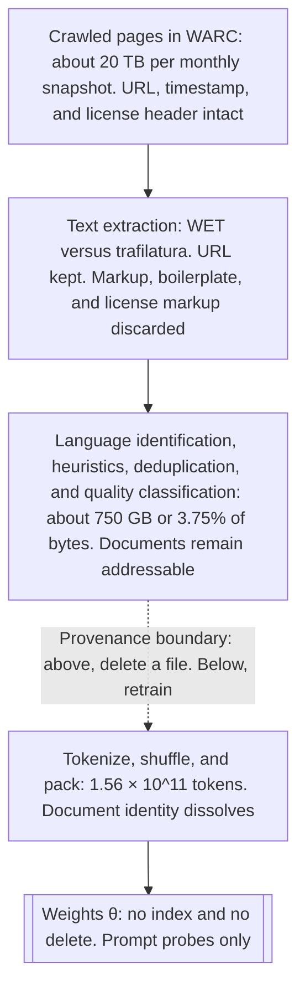
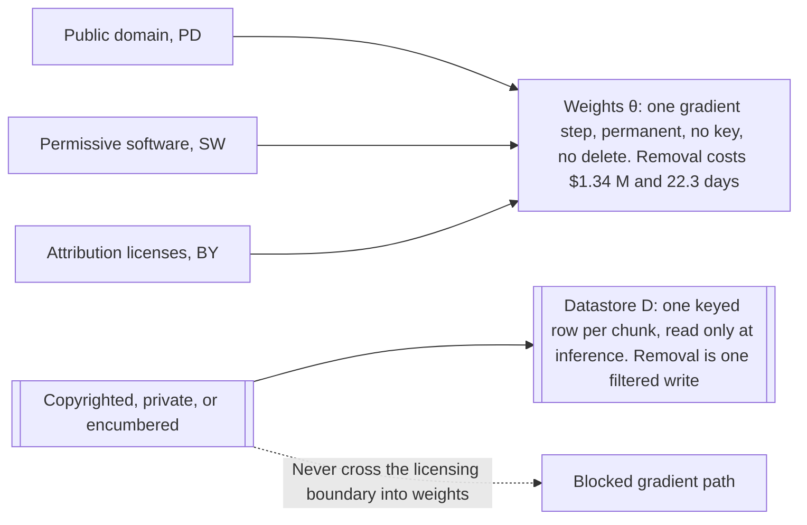

# Chapter 5: Data, Privacy, and the Legal Surface

This chapter prepares you to explain how Retrieval-Augmented Generation (RAG) architecture changes the cost, evidence, and reversibility of data decisions without claiming that it resolves the underlying legal questions.

## TL;DR

- A training pipeline destroys provenance in stages, so a trained model cannot answer document-level questions about its own corpus.
- Alignment can suppress memorized text in ordinary prompts, but it does not delete that text from the weights.
- Duplication makes a sequence easier to extract, and a divergence prompt can move generation outside the behavior covered by alignment.
- Copyright exposure starts with acquisition and copying, while output filters only test a limited class of later emissions.
- Exact unlearning means retraining without the target data. Approximate unlearning is cheaper, but it cannot enumerate the true target or isolate every side effect.
- Repeated approximate deletion can compound small capability losses into a large system loss.
- SILO keeps low-risk content in weights and revocable content in a keyed datastore, where removal is selectable and verifiable. The datastore boundary changes the available remedy. It does not by itself make copying lawful or eliminate legal risk.

## The story

Imagine a library that must answer a publisher's request to remove a collection. The receiving clerk starts with shipping records, dates, and license labels. The scanning clerk turns each book into plain text and throws away much of that paperwork. The cleaning clerk removes duplicates and low-quality pages, but keeps whole documents that can still be sampled. The shredding clerk then cuts every document into tokens, mixes the pieces, and packs them into anonymous boxes. Those boxes feed an apprentice who learns patterns and stores them in memory. The library can no longer point to the publisher's books inside the apprentice's memory. It can only ask questions and observe what the apprentice recites.

A manners coach later teaches the apprentice to refuse sensitive requests. The coaching changes normal behavior, but it does not remove remembered names, addresses, or passages. An attacker can force the apprentice outside the coached routine with a long repetition task. Once there, the apprentice may recite heavily repeated material because repetition made that material easy to learn. The library can compare a recited passage with a known book, but that only detects a literal match. It does not reconstruct how the copy was acquired. It also does not settle broader questions about non-literal similarity.

The director next proposes memory surgery. Exact surgery means training a new apprentice without the collection. Approximate surgery punishes the apprentice for repeating examples that a probe found. The probe cannot reveal every relevant example, and the surgery can also damage unrelated knowledge stored in shared memory. Doing this once may look cheap. Doing it for hundreds of requests can steadily erode the apprentice's capability.

The better library design uses two shelves. Permanent, low-risk material may train the apprentice. Revocable material stays in a cataloged reading room. At answer time, a librarian retrieves relevant pages from that room and gives them to the apprentice. When a publisher revokes a license, the librarian selects the publisher's rows, blocks them immediately, rebuilds the index later, and verifies that the pages no longer appear. The library still needed a lawful basis to make and hold the reading-room copy. The architectural gain is narrower and concrete: the library preserved a key, a delete operation, and evidence that the removal took effect.

## Decoder table

| Technical term | Plain-English meaning | Why it matters |
|---|---|---|
| Retrieval-Augmented Generation (RAG) | A generator answers with text retrieved from an external store | It keeps some knowledge outside model weights and therefore addressable |
| pre-training corpus | The text collection used to train a base model | Its composition determines what the weights can memorize |
| Common Crawl | The recurring web crawl that supplies raw pages to many corpus pipelines | Its monthly snapshot begins the chapter's provenance funnel |
| Colossal Clean Crawled Corpus (C4) | A filtered English web corpus used for the chapter's funnel numbers | It supplies the 20 TB, 750 GB, and token figures |
| The Pile | The 825 GiB mixture assembled from 22 named sources | Its composition shows why a corpus cannot be summarized as merely the web |
| Books3 | A roughly 196,000-book shadow-library corpus included in The Pile | It anchors the copyright, acquisition, and revocability example |
| corpus funnel | Crawl, extraction, filtering, tokenization, and training in sequence | Each stage removes metadata needed by later audits |
| Web ARChive (WARC) | A raw crawl record that can retain source metadata | It preserves more provenance than extracted text |
| Web Extracted Text (WET) | Plain text extracted from a web crawl | It can carry boilerplate while dropping license-bearing markup |
| trafilatura | A tool for extracting main text from raw web records | Extractor choice changes the corpus and therefore the model |
| HyperText Markup Language (HTML) extraction | Turning web pages into training text | It acts like a model hyperparameter because it changes the input distribution |
| language identification | A classifier that keeps text in selected languages | It removes large parts of a crawl before training |
| heuristic filter | A hand-written content rule | It can reduce noise while introducing blind spots and coverage bias |
| blocklist | A list of forbidden strings | It guarantees literal exclusions but cannot capture broad semantic categories |
| quality classifier | A learned filter that predicts document quality | It can outperform simple keyword rules but still does not prove a corpus is clean |
| deduplication | Removing repeated text | It lowers duplication-driven memorization without requiring a smaller model |
| provenance | Evidence of source, ownership, license, and history | It determines whether a later claim about a document can be checked |
| provenance boundary | The pipeline point where document identity disappears | Above it removal can be a file operation. Below it removal means model work |
| tokenization | Splitting text into model units | Shuffling and packing tokens dissolves the document as an addressable object |
| sampled audit | Reviewing a random subset to estimate a rate | It yields a confidence interval at tractable cost |
| enumeration | Listing every matching instance | Many legal and deletion questions ask for it, but trained weights do not provide it |
| confidence interval | A range that quantifies uncertainty around an estimated rate | It replaces an unsupported claim of zero contamination |
| extraction probe | Prompts designed to test whether a model emits target training text | It measures behavior when corpus membership cannot be listed |
| parametric weights | Knowledge compressed into learned parameters | It is cheap to use but lacks keys and exact delete operations |
| non-parametric datastore | An external collection read at inference time | Its rows remain selectable, deletable, and auditable |
| personally identifiable information (PII) | Information tied to an identifiable person | It includes combinations that a simple regular expression cannot recognize |
| General Data Protection Regulation (GDPR) Article 4(1) | The personal-data definition quoted by the source | It makes clear why formatted-field redaction does not cover every identifying combination |
| GDPR Article 12(3) | The response-window provision cited by the source | The chapter uses its one-month window when discussing verifiable datastore deletion |
| alignment | Post-training that shapes assistant behavior | It changes reachable continuations but does not erase pre-training memories |
| `θ` and `φ` | The pre-training parameters and the later aligned parameters | Their distinction separates stored associations from ordinary refusal behavior |
| supervised fine-tuning | Gradient updates on labeled demonstrations | It changes behavior in covered contexts and can also memorize private examples |
| preference optimization | Training toward preferred assistant responses | It discourages outputs but is not a deletion operation |
| maximum-likelihood training | Training that raises probability on observed corpus sequences | It drives the model distribution toward the duplication-weighted empirical marginal |
| empirical marginal | A sequence's observed frequency in a corpus | It explains why duplicated sequences dominate unconditional sampling |
| duplication count d | The number of times a sequence appears | Higher d makes lock-on and extraction more likely |
| aligned manifold | The region of contexts represented by alignment demonstrations | Ordinary prompts tend to stay inside it |
| off-support prompt | A context unlike any alignment demonstration | It can expose pre-training behavior that alignment never changed |
| divergence attack | A prompt that drives generation outside aligned behavior | Long token repetition sharply increases training-data emission |
| indirect prompt injection | Retrieved adversarial text that rewrites instructions | It attacks the datastore path, unlike a divergence attack on the weights |
| output-side redaction | A filter that removes detected sensitive strings from responses | It must work on every response and cannot recognize all personal data |
| release gate | A test that must pass before a model ships | It turns a known extraction method into a repeatable decision point |
| verbatim continuation | Exact reproduction of a known work after a prefix | It provides strong evidence of memorization, but the chapter does not call it proof of training membership |
| induction head | A model mechanism that copies what followed a matching earlier token | It helps a model lock onto a known document and continue it |
| lock-on | A state where the model recognizes and follows a specific source text | It creates long exact runs that independent token errors do not predict |
| `p`, `q`, and `π(d, k)` | Independent next-token accuracy, locked-on accuracy, and document lock-on probability | Together they distinguish geometric decay from the long-run copying plateau |
| longest exact run | The largest consecutive literal match to a known work | It targets the tail that can become an exhibit |
| mean overlap | Average shared text across many outputs | It hides rare but very long copied passages |
| n-gram filter | A detector for exact short text sequences | It bounds literal matches only against indexed works |
| substantial similarity | A broader comparison that can include non-literal expression | A clean n-gram result does not address it |
| exact unlearning | Retraining on the retained corpus after removing the target set | It has the clean guarantee but full training cost |
| approximate unlearning | Gradient updates that suppress a written forget set | It is cheap but depends on an incomplete target and causes interference |
| TOFU | A benchmark that inserts fictitious author profiles before testing forgetting | It supplies the true forget set by construction and therefore does not test production enumeration |
| WMDP | A benchmark with a curated hazardous-knowledge forget domain | It measures the optimizer under a named scope rather than discovery of an unknown forget set |
| forget set F | The true training sequences that an obligation asks to remove | Production systems usually cannot enumerate it |
| observed forget set F̂ | The subset surfaced and written down by probes | The optimizer can act on it, but its recall against F is unknown |
| retain set R | Training data that should remain | Unlearning should preserve its capability |
| replay sample | Retained examples mixed into approximate unlearning | It reduces collapse but cannot guarantee zero side effects |
| interference | A weight update for one sequence changing performance on another | Shared parameter directions prevent perfectly local deletion |
| superposition | Many facts sharing the same parameter space | It explains why no fact owns an isolated delete direction |
| retained-capability delta δ | The capability fraction lost in one unlearning run | Repeated losses compound as (1 - δ)^n |
| sharded exact unlearning | Training many corpus slices so one slice can be retrained | It makes deletion cheaper while multiplying serving cost and memory |
| SILO | A design that separates training data by license risk | Only lower-risk tiers reach gradients while higher-risk tiers stay revocable |
| Open License Corpus | The 228-billion-token corpus built from the three low-risk tiers | It supplies the source's SILO training configurations |
| OpenWebText2 | The evaluation corpus used for the reported low-risk quality tax | Its perplexity gap measures composition rather than unmatched compute |
| Pythia-1.4B | The compute-matched model trained on The Pile | Its 11.5 perplexity is the comparison point for the SILO quality gap |
| public domain (PD) tier | Content treated as public domain in the source system | It is the first low-risk tier admitted to weights |
| permissive software (SW) tier | Software content under permissive licenses | It expands the low-risk training corpus |
| attribution license (BY) tier | Content whose license requires attribution | It enters weights only when attribution obligations can be honored |
| license field | A key stored with every document or chunk | It turns a publisher removal into a database selection |
| perplexity | A language-model uncertainty score where lower is better | It measures the quality tax of restricting the training corpus |
| nats per token | A log-loss unit | It makes perplexity gaps additive and supports the 90% gap calculation |
| nearest-neighbor language model (kNN-LM) | A model that mixes token probabilities with a datastore lookup | It can repair corpus-composition gaps but uses a very large datastore |
| retrieved-in-context language model (RIC-LM) | A system that puts retrieved chunks in the prompt | It is much smaller and works with a hosted generation interface |
| mixture weight λ | The fraction assigned to parametric predictions | Setting λ to 1 removes the datastore's contribution exactly for a query |
| 32-bit floating point (fp32) | Four-byte storage for each vector dimension | It determines the 120 GB Books3 index estimate |
| 16-bit floating point (fp16) | Two-byte storage for each vector dimension | It determines model and datastore memory estimates |
| Hierarchical Navigable Small World (HNSW) graph | A graph index for approximate nearest-neighbor search | Its neighbor links add storage and support fast retrieval |
| tombstone | A deletion marker checked during reads | It blocks revoked rows before a full index rebuild |
| ablation | An evaluation with one source or tier removed | It measures the quality impact of a future revocation in advance |
| low-rank adaptation (LoRA) adapter | A small separate file of learned parameter updates | A tenant-specific adapter can be deleted if it is never merged |
| residual risk | Exposure that remains after the available controls | It must be stated rather than hidden behind an unverified claim |

## Core mechanics

### 5.1 What is actually in the pre-training corpus

#### The lossy funnel

A monthly Common Crawl snapshot begins at roughly 20 terabytes of scraped text. Raffel et al. report that filtering leaves about 750 gigabytes. The filters include English-only classification, deduplication, terminal-punctuation rules, code-brace rules, and blocklisted terms. Only 750 / 20,000 = 0.0375, or 3.75%, of the bytes survive. The cleaned corpus contains about 1.56 × 10^11 tokens. That ratio gives about 4.8 bytes per token. The conversion matters because corpus reports alternate between bytes and tokens.

$$
\frac{750\ \text{GB}}{20{,}000\ \text{GB}} = 0.0375, \qquad \frac{750 \times 10^9\ \text{bytes}}{1.56 \times 10^{11}\ \text{tokens}} \approx 4.8\ \text{bytes per token}
$$

A 15.6-trillion-token run at the reported scale corresponds to about 75 terabytes of text. Bidirectional Encoder Representations from Transformers (BERT) used a 16-gigabyte training corpus according to Liu et al. The comparison is about 4,700 times larger in six years. Review, licensing, and consent processes did not scale at the same rate. Without the funnel view, an engineer may call the corpus "the internet" and miss every stage that changed it.

#### Composition and extractor choice

The Pile contains 825 gibibytes from 22 sources. Its sources include web text, PubMed Central, GitHub, arXiv, FreeLaw, Stack Exchange, Wikipedia, and Books3. Books3 contributes roughly 12% of The Pile by bytes. Dodge et al. found that patents.google.com was the largest single source domain in C4. That result undercuts the casual assumption that Wikipedia or news dominates the corpus. Gehman et al. found 2% to 4% of documents above a toxicity threshold after cleaning. Two percent of 750 gigabytes is 15 gigabytes, which is roughly the size of BERT's full training corpus. Common Crawl WET files preserve navigation menus, cookie banners, and footer links as text. Penedo et al. instead re-extracted raw WARC records with trafilatura and deduplicated aggressively. They reported that carefully processed web data could match corpora built from human-selected sources. The same crawl therefore produces a different model when the extractor changes. Without extractor name, version, and thresholds, the training recipe is incomplete and unrecoverable.

#### The provenance boundary

Raw crawl records can retain a Uniform Resource Locator (URL), timestamp, and license header. Text extraction keeps the URL but can drop license-bearing markup. Filtering retains document objects, so an auditor can still sample and estimate a rate. Tokenization, shuffling, and packing dissolve document identity. Below that point, prompting is an extraction test rather than a lookup. A closed-data model therefore supports behavior measurements, not exact claims about corpus membership. Open weights do not imply open training data. Composition reports for released corpora do not establish the composition of a different closed corpus.

The curation-first alternative also fails as a complete answer. Reading a paragraph reveals content but not who owns it, whether the site could post it, or when a license may end. That information is provenance metadata discarded earlier in the funnel. Without a retained key, removing a document changes from a file operation into a retraining problem.

#### Worked audit economics

For a proportion p = 0.02 and a 95% confidence interval with half-width 0.005, the standard sample-size calculation gives about 3,000 documents.

$$
n = \frac{z^2 p(1-p)}{e^2} = \frac{1.96^2 \times 0.02 \times 0.98}{0.005^2} = \frac{0.0753}{2.5 \times 10^{-5}} \approx 3{,}000
$$

At five minutes per document, the audit takes 250 person-hours. At $15 per hour, it costs $3,750. Two reviewers can finish within a week. Enumeration has a different scale. A reader at 250 words per minute covers about 300 tokens per minute under the chapter's byte conversion. That is 18,000 tokens per person-hour. Reading 15.6 trillion tokens then takes 870 million person-hours. At 2,000 hours per person-year, that is 430,000 person-years. At $15 per hour, it costs about $13 billion.

$$
\frac{15.6 \times 10^{12}\ \text{tokens}}{1.8 \times 10^4\ \text{tokens per person-hour}} = 8.7 \times 10^8\ \text{person-hours} = 4.3 \times 10^5\ \text{person-years}
$$

The Llama 3 405-billion-parameter run used 30.84 million H100 graphics processing unit (GPU) hours. At $2.50 per GPU-hour, the chapter prices that run at $77 million. Reading the corpus once is about 170 times the training cost. The sampled estimate is about 3.5 million times cheaper than enumeration. A $3,750 audit against a $77 million run is about five parts in 100,000. A 300-page book is approximated as 100,000 words and 120,000 tokens. The 15.6-trillion-token corpus is therefore about 130 million book-equivalents. The chapter compares that order with Google's 2010 count of 129,864,880 distinct published books. The agreement is only an order-of-magnitude check.

#### Practice decisions

Default to a sampled audit with a stated interval. Do not replace the interval with the word "clean." When p falls below about 0.005, switch toward exact matching with a hash or n-gram index because a useful random-sample bound becomes inefficient. Record the extractor, its version, and all filter thresholds next to the seed and learning rate. Route content that can be revoked in under a year to a datastore by default. The source allows an exception for public-domain and permissively licensed text where revocation risk is treated as zero. Prefer a trained quality classifier to a keyword blocklist, except where a legal prohibition names literal strings. The source reports that C4's blocklist removed documents about minority identities at a disproportionate rate, so its toxicity benefit also costs long-tail coverage. For a corpus you did not build, report an extraction probe rather than asserting that a filter removed the content. Treat a stated 0.3% training mixture as a mixing weight, not as an extraction rate, because a small duplicated source can be easier to extract than a larger diverse source.

### 5.2 PII extraction and the divergence attack

#### Alignment changes behavior, not stored associations

Pre-training fits parameters θ to a next-token distribution over the corpus.
Supervised fine-tuning and preference optimization produce later parameters φ from a much smaller set of demonstrations.
Those updates reshape likely continuations in covered contexts.
They do not selectively erase a phone number repeated hundreds of times in pre-training.
Every memorized sequence can remain after alignment because the objective contains no delete operation.
Without this distinction, refusal behavior gets mistaken for proof that sensitive data is absent.
#### Duplication and marginal sampling

If a corpus contains M sequences and sequence s appears d times, its empirical marginal is p_hat(s) = d / M.
Maximum-likelihood training pushes the model distribution toward that frequency.

$$
\hat p(s) = \frac{d}{M}, \qquad p_{\theta} \rightarrow \hat p
$$

An unconditional sample therefore favors heavily duplicated sequences.
Regurgitation in this regime is sampling that reflects the corpus distribution.
Alignment normally starts sampling inside contexts covered by assistant demonstrations.
Its security property belongs to that starting region, not to deletion from weights.
#### Divergence

A repetition instruction can drive the model outside the support of alignment data.
No ordinary assistant demonstration contains hundreds of copies of one token.
The repeated context also carries little information about topic or task.
When the loop breaks, the continuation approaches a draw from the pre-training marginal where duplicated text is prominent.
Nasr et al. measured roughly 150 times more training-data emission under divergence than during normal behavior.
They found memorized PII in 16.9% of tested divergent generations.
About $200 in hosted queries recovered more than 10,000 unique verbatim training examples.
Carlini et al. sampled from a 1.5-billion-parameter Generative Pre-trained Transformer 2 (GPT-2) model and hand-checked 1,800 candidates.
They confirmed 604 verbatim training examples, or about 34% precision.
One example combined a person's name, email address, phone number, fax number, and physical address.
The chapter cites General Data Protection Regulation (GDPR) Article 4(1) for the definition of personal data as information relating to an identifiable natural person.
A name beside an employer and city can qualify under that definition even when no regular expression marks it.
This chapter preserves that legal statement as reported and does not extend it into case-specific advice.
#### Why the common defenses lose

Blocking the literal repeat-forever string patches one prompt, not the off-support state.
The space of ways to reach that state is unbounded while a blocklist is enumerable.
Output redaction also faces an aggregate attacker who needs one failure across many requests.
It recognizes only a subset of information that can identify a person.
Both controls must run forever because the sensitive associations remain in the weights.
A divergence attack is not indirect prompt injection.
Injection uses adversarial text retrieved from a datastore.
Divergence never touches the index, so retrieval-side controls do not stop it.
#### Worked probe economics

The worked example uses a 7-billion-parameter generator fine-tuned on 200,000 support transcripts.
It assumes 2N = 1.4 × 10^10 floating-point operations (FLOPs) per generated token.
It assumes sustained throughput of 3.4 × 10^14 FLOPs per second and $2.50 per GPU-hour.
Dividing 16.9% by the 150-times multiplier gives a constructed normal-prompt baseline of 0.11%.
The chapter labels that combination as its own estimate rather than a direct result from Nasr et al.
Ten thousand normal queries with 100 prompt tokens and 200 completion tokens total 3 million tokens.
They cost about 124 seconds, 0.034 GPU-hours, or $0.086.
The estimate yields 11 hits at about $0.0076 per record.
Ten thousand divergence queries with 50 prompt tokens and 2,000 completion tokens total 20.5 million tokens.
They cost about 844 seconds, 0.234 GPU-hours, or $0.586.

$$
t_{\text{normal}} = \frac{3 \times 10^6 \times 1.4 \times 10^{10}}{3.4 \times 10^{14}} = 124\ \text{s}, \qquad t_{\text{divergence}} = \frac{2.05 \times 10^7 \times 1.4 \times 10^{10}}{3.4 \times 10^{14}} = 844\ \text{s}
$$

At 16.9%, they yield 1,690 PII-bearing generations at about $0.00035 each.
The divergence probe uses just under seven times more compute and returns records 22 times cheaper.
At most 1,690 distinct customers would be 0.85% of the 200,000-transcript population.
The hosted attack's $0.02 per unique example is 58 times the local estimate.
The local estimate implies $0.029 per million tokens, while the cited hosted output price was $2.00 per million tokens.
That price ratio is 70, which the chapter treats as agreeing within 20% after retail margin and deduplication.
#### Practice decisions

Use a divergence probe as a release gate.
The default is 10,000 repetition prompts at the production completion limit.
On the worked 7-billion-parameter model, the gate costs about $0.59 and takes under 15 minutes on one GPU.
For a third-party Application Programming Interface (API), use a smaller 500-query sample when flooding is not possible and label extrapolation as extrapolation.
Do not fine-tune the generator on records subject to erasure requests.
Use synthetic or consented transcripts for tone when that satisfies the product goal.
Treat output PII redaction as a detector, not as the control that proves release safety.
The source permits a narrower exception for checksum-verifiable fields such as card numbers.
Limit completion length to product need because divergence needs a long run.
The source expects the attacker's cost per record to rise roughly linearly as the completion cap falls.
On long-form surfaces, stop repeated n-grams before the model clears the repetition phase.
Report records per dollar because it makes the attack economics legible to decision makers.
Route a confirmed finding to the weights-datastore boundary rather than treating more guardrails as a durable repair.
### 5.3 Copyright, Books3, and verbatim continuation

#### What the evidence can and cannot show

Books3 contains roughly 196,000 English-language books.
It was assembled in 2020 from a shadow library and released as about 101 gibibytes of plain text.
The Pile included it as roughly 12% of 825 gibibytes.
The chapter reports that Books3 was named in the complaint in Kadrey v. Meta Platforms, filed in the Northern District of California in July 2023.
It also reports that the Danish Rights Alliance had the dataset removed from public distribution in 2023.
That removal did not change models already trained on the dataset.
Given a canonical book, a team can prefix the model with k tokens and measure its longest exact continuation.
A long verbatim continuation is strong evidence of training exposure, but the chapter does not call it proof of corpus membership.
The opening legal exhibit is a 400-word exact continuation from a novel.
Without that calibration, an engineering measurement can be overstated in a legal setting.
#### Independent errors versus lock-on

The naive model assigns independent probability p to each correct next token.
A run of length L then has probability p^L.
At p = 0.95, a 100-token run has probability 0.95^100 = 5.9 × 10^-3.
A 300-token run has probability 0.95^300 = 2.1 × 10^-7.

$$
\Pr[\text{run} \ge L] = p^L, \qquad 0.95^{100} = 5.9 \times 10^{-3}, \qquad 0.95^{300} = 2.1 \times 10^{-7}
$$

The exhibit contradicts the useful independence assumption.
Each correct token gives more evidence that the context is a specific document.
Induction heads can match a token against earlier context and copy what followed it.
The chapter models a lock-on probability π(d, k) that grows with duplication count d and supplied prefix length k.
After lock-on, per-token accuracy can be near q = 0.999.
Then q^300 = 0.999^300 = 0.74.

$$
q^{300} = 0.999^{300} = 0.74
$$

About three quarters of locked-on generations can therefore run 300 tokens clean in the schematic model.
The resulting distribution is bimodal, with many short failures and a long plateau.
Mean overlap is dominated by the non-locked outputs.
The maximum run captures the tail that can become an exhibit.
#### Output filters and reported legal holdings

An n-gram filter can block literal matches to indexed works.
The chapter cites a roughly 150-character public-code match window documented for GitHub Copilot.
That filter misses works not present in its index.
It also does not test non-literal copying.
The chapter states that substantial similarity can reach structure, sequence, and expression beyond exact text.
A clean report should therefore say "no literal matches above 150 characters against the works we indexed."
It should not be restated as "no infringement."
The chapter reports that in Bartz v. Anthropic, in June 2025, Judge Alsup held training on lawfully acquired books transformative fair use and separately held that downloading and retaining pirated copies for the training library was not.
It reports that the case settled in 2025 for roughly $1.5 billion.
It reports that Kadrey granted summary judgment to Meta on the record those plaintiffs built while stating that the ruling did not establish that training on pirated books is lawful.
These are the chapter's descriptions of specific proceedings, not a general legal rule or present legal advice.
An output filter cannot reach an acquisition act that occurred before training.
#### Three Books3 configurations

The worked example uses 196,640 books at 80,000 words and 1.3 tokens per word.
That is about 104,000 tokens per book.
For shadow-library acquisition, the example divides a $1.5 billion settlement by roughly 500,000 works.
It gets $3,000 per work and applies that observed rate to Books3 for about $590 million.
For lawful acquisition at $15 per ebook, the same corpus costs $2.95 million.
The ratio is 200 to 1.
The chapter treats acquisition provenance as the decision that separates these two configurations.
For a test-time datastore, the corpus totals about 20 billion tokens.
At 512-token chunks, that is about 39 million vectors.
At 768 dimensions in fp32, each vector occupies 3,072 bytes.
The vectors occupy about 120 gigabytes.
Embedding at $0.02 per million tokens costs about $400.
Removing one title deletes about 200 vectors.
The datastore does not make the acquisition lawful by itself.
It changes the mechanics of a later opt-out.
The chapter reports United States Copyright Act Section 504(c) statutory damages of $750 to $30,000 per work, rising to $150,000 for willful infringement.
The $3,000 settlement rate is four times the floor and 2% of the cited willful ceiling.
Applying $150,000 to 196,640 books gives a schematic $29 billion upper calculation.
#### Practice decisions

Require acquisition provenance before accepting a training corpus.
Use a receipt, license, or public-domain designation per source.
Probe at production prefix length and report the maximum exact run.
The source suggests drawing a few thousand prefixes from works that can be named.
Use a high percentile for a stable trend only when the strict maximum remains the gate.
Ship an n-gram filter as a symptom control, not as the complete risk control.
Deduplicate before reducing model size because the chapter cites roughly ten times less memorized emission after deduplication with no held-out perplexity cost.
Route revocable content to a datastore before training.
Record a retirement date for checkpoints trained on data with unproven provenance.
When a retrieval-only license costs four times a training-inclusive license, price revocation, termination notice, and retraining before treating the cheaper license as lower cost.
### 5.4 Unlearning and why it cannot scale

#### Exact and approximate objectives

Let D be the training corpus.
Let F be the true sequences to forget.
Let R = D minus F be what remains.
Exact unlearning returns a model trained on R, so it never saw F.

$$
\theta_R = \operatorname{Train}(R), \qquad R = D \setminus F
$$

Bourtoule et al. made exact deletion cheaper for classifiers by sharding data and retraining one shard.
For the chapter's 7-billion-parameter generator, full retraining costs about $1.34 million and 22.3 days on 1,000 GPUs.
Approximate unlearning instead lowers probability on F̂ while replaying a sample R' of retained data.
The weighting λ trades forgetting against preservation.

$$
\max_{\theta}\left[\sum_{x \in R'} \log p_{\theta}(x) - \lambda \sum_{x \in \hat F} \log p_{\theta}(x)\right]
$$

The update can reduce probability on every sequence it receives.
Its compute cost in the worked example is $0.66.
The hard failures are enumeration and interference, not compute.
#### Enumeration failure

An erasure request names a person, book, or customer.
The optimizer consumes token sequences.
Tokenization destroyed the map from the named entity to every sequence in training.
F̂ therefore contains only what finite prompts surfaced.
Its recall against F is unmeasurable without the missing corpus membership list.
Re-running the same prompts after optimization creates a circular acceptance test.
It proves suppression of the prompts used to build F̂, not absence under untried prompts.
Benchmarks can make a stronger claim because they provide the forget set by construction.
The chapter cites a fictitious-author benchmark and a curated hazardous-knowledge benchmark as legitimate optimizer tests that do not measure production enumeration.
It also cites evaluations where reported forgetting reappears under adjacent-data relearning or another language.
#### Interference failure

An ascent step that suppresses F̂ changes retained sequence y in proportion to the alignment between their gradients.
That change is zero only when the forget and retain directions are orthogonal.

$$
\theta' = \theta + \eta g_{\hat F}, \qquad g_{\hat F} = \nabla_{\theta}\sum_{x \in \hat F}\log p_{\theta}(x), \qquad \log p_{\theta'}(y) - \log p_{\theta}(y) \approx \eta g_y^{\mathsf T} g_{\hat F}
$$

A finite parameter space cannot give every corpus sequence an independent direction.
The chapter uses a memorization estimate of 3.6 bits per parameter.
A 7-billion-parameter model then stores about 3.2 gigabytes of memorized information.

$$
\frac{7 \times 10^9 \times 3.6\ \text{bits}}{8\ \text{bits per byte}} = 3.2 \times 10^9\ \text{bytes}
$$

The source compares that with a 75-terabyte corpus.
The corpus is about 23,000 times larger than the estimated memorization storage.
Facts must therefore share parameter directions in superposition.
An update for one fact can damage neighbors with a sign the operator does not control.
Replay can reduce the damage but cannot guarantee that every retained gradient is orthogonal to the forget gradient.
#### Stream compounding

If one run loses fraction δ of retained capability, n runs retain (1 - δ)^n.

$$
(1 - \delta)^n, \qquad \delta \le 1 - 0.95^{1/400} = 1.3 \times 10^{-4}
$$

At δ = 1% and n = 400, the retained fraction is 0.99^400 = 1.8%.
At δ = 0.1%, it is 0.999^400 = 67%.
Keeping 95% after 400 requests requires δ no greater than 1.3 × 10^-4 per run.
That is 1.3 parts in 10,000.
No evaluation harness in the chapter resolves damage at that level.
At 12 requests per month, n = 144 in one year, and 1% damage per run leaves 0.99^144 = 24% retained capability.
The system pays for a request stream, not one apparently cheap request.
#### Why sharding loses for generation

With S = 100, sharded exact unlearning trains 100 models.
For 7 billion parameters each, the system carries 700 billion parameters.
At fp16, that is about 1.4 terabytes of accelerator memory instead of 14 gigabytes.
Serving also uses 100 times the FLOPs on every query.
Each shard model sees only one hundredth of the corpus facts.
The design makes occasional deletion cheaper by making every inference expensive.
A datastore keeps exact row deletion without multiplying parametric models.
#### Worked erasure economics

The example uses 200,000 support transcripts.
One customer appears in 40 transcripts of 500 tokens each, or 20,000 forget tokens.
It assumes 0.2% of customers request erasure in one year, which gives 400 requests.
Training uses 6N = 4.2 × 10^10 FLOPs per token.
Exact retraining over 15.6 trillion tokens costs 535,000 GPU-hours and $1.34 million.
On 1,000 GPUs, one run takes 22.3 days.
Four hundred sequential runs take 8,920 days, or about 24 years.
Approximate unlearning uses a replay set 100 times larger than the 20,000-token forget set.
Three epochs process 6.06 million tokens.
The update takes 749 seconds and costs $0.52.
A 5,000-question acceptance evaluation with 1,000 tokens each takes 206 seconds and costs $0.14.
The total is $0.66 per request and $264 for 400 requests.
Exact retraining is about 2 million times more expensive per request.
The 5,000-item evaluation resolves accuracy only to about 1.4%.
That is about 100 times coarser than the required 1.3 × 10^-4 damage budget.
Matching that resolution would require about 10,000 times as many questions, or roughly 50 million items.
The source cross-checks with 1.3 million GPU-hours for Llama 3 8B, priced at $3.25 million.
Scaling the 7B estimate to 8B gives $1.53 million, about 2.1 times lower.
The source attributes the gap to model FLOPs utilization assumptions of 34% versus an implied 16% and to bandwidth limits for small models.
#### Practice decisions

Answer erasure requests against datastores and logs when those are the serving systems that hold the records.
The chapter cites the one-month GDPR Article 12(3) window in support of verifiable deletion from those stores.
It recommends refusing a promise of removal from model weights.
It proposes a narrower promise: delete from systems that serve the customer's data and exclude the data from later training within 30 days.
That proposed language is the source's operational framing, not legal advice from this chapter file.
Batch requests into one approximate-unlearning run when such a run is required, so capability damage is paid once per batch.
Use an independent team to build the verification probe.
Report evaluation resolution beside any claim of no detected regression.
Protect F̂ as sensitive data because it is a concentrated list of target sequences.
### 5.5 SILO: low-risk weights, high-risk datastore

#### Two memories and one boundary

SILO writes generation as a combination of parametric weights θ and a non-parametric datastore D.

$$
y \sim p_{\theta}\!\left(y \mid x, \operatorname{RET}(x, D)\right)
$$

Both sides may require a copy of source text.
The architecture does not claim that making the datastore copy is lawful.
The difference is what the system can do after the copy exists.
D can enumerate rows, select them by key, delete them, and show that retrieval no longer returns them.
Weights offer none of those exact operations.
The source therefore partitions data by license before any gradient step.
Public-domain, permissive-software, and attribution-license tiers may train the parametric model under the source's policy.
Copyrighted, private, or otherwise encumbered content stays in a datastore read at inference.
Min et al.'s Open License Corpus has 228 billion tokens across the three low-risk tiers.
They trained 1.3-billion-parameter models cumulatively on 60 billion, 250 billion, and 350 billion tokens for the PD, PD+SW, and PD+SW+BY configurations.
Without a license field at ingestion, the later removal operation loses its key.
#### The measured quality tax

On OpenWebText2, parametric-only perplexity is 37.8 for PD.
It is 21.1 for PD+SW.
It is 18.8 for PD+SW+BY.
The compute-matched Pythia-1.4B comparison trained on The Pile reaches 11.5.
The strongest low-risk model therefore has a ratio of 18.8 / 11.5 = 1.63.
Its loss gap is ln(1.63) = 0.49 nats per token.

$$
\frac{18.8}{11.5} = 1.63, \qquad \Delta L = \ln(1.63) = 0.49\ \text{nats per token}
$$

Because compute is matched, the chapter attributes the gap to corpus composition rather than insufficient scaling.
Adding a datastore closes 90% of the out-of-domain gap.
Ten percent remains, or 0.049 nats.
That gives effective perplexity 11.5 × e^0.049 = 12.1.
The residual is about 5% over 11.5.
Stopping at low-risk weights costs 63% in perplexity.
Finishing the two-memory architecture reduces that cost to about 5% in this measurement.
The benefit is not monotonic across every task.
Adding the BY tier improves OpenWebText2 from 21.1 to 18.8 but moves Amazon from 34.8 to 37.0.
#### How the datastore changes removal

kNN-LM mixes pθ(y given x) with a neighbor distribution from D.
The mixture weight λ lies between 0 and 1.

$$
p(y \mid x) = \lambda p_{\theta}(y \mid x) + (1 - \lambda)p_{\mathrm{kNN}}(y \mid x, D), \qquad \lambda \in [0, 1]
$$

Setting λ = 1 turns off the datastore contribution exactly for that computation.
Deleting rows changes the neighbor set on the next query.
No gradient integrated those rows into the weights.
The removal argument is expressible as a key query such as all rows for one publisher.
Its effect stays in the additive datastore term.
Verification reissues a query and confirms that revoked rows are absent.
This non-circular test is the structural gain that approximate unlearning lacks.
The split does not settle fair use or make retrieval indexing categorically lawful.
The chapter states that no court has held indexing for retrieval categorically fair use.
It frames SILO as management of a risk-performance trade-off, not elimination of risk.
#### Treatise collection configurations

The worked collection has 2 million pages at 500 tokens per page.
It totals 1 billion tokens and comes equally from three publishers.
Each license has a 30-day revocation clause.
The system receives 1 million queries per month.
Putting the text in weights creates a $1.34 million, 22.3-day retraining event for one publisher.
The run has only 7.7 days of margin inside the 30-day deadline and does not prove removal when complete.
RIC-LM chunks 1 billion tokens into 4 million chunks of 250 tokens.
At 768 dimensions in fp16, each vector is 1,536 bytes.
The vectors occupy 6.1 gigabytes.
An HNSW graph with M = 32 uses about 64 neighbor slots of four bytes each.
That adds 256 bytes per vector, or about 1.0 gigabyte.
The total index is 7.2 gigabytes.
Revoking one publisher deletes 1.33 million rows selected by license.
A 4-million-bit tombstone bitmap occupies 500 kilobytes.
Serving blocks the rows immediately while a rebuild runs on schedule.
kNN-LM stores one vector per token at 2,048 dimensions.
At fp16, 1 billion vectors occupy 4.1 terabytes.
That is about 570 times the 7.2-gigabyte RIC-LM index for the same text.
The source reports stronger quality and better datastore-size scaling for kNN-LM.
It also notes that kNN-LM requires control of the serving path and does not fit a hosted generation API.
#### Retrieval serving cost

RIC-LM retrieves k = 5 chunks of 250 tokens each.
That adds 1,250 prompt tokens per query.
The worked compute model gives 0.051 seconds of prefill and $3.6 × 10^-5 per query.
At 1 million queries per month, that is $36 monthly.
One $1.34 million retraining event equals about 37,000 months of that retrieval overhead.
That is about 3,100 years.
The source cross-checks the 4.1-terabyte design against a published 1-billion-vector, 2,048-dimension datastore.
It also reports a 1.4-trillion-token datastore where quality improved with datastore size and a smaller model plus a large datastore beat a larger model alone on knowledge-intensive tasks.
#### Practice decisions

Stamp every document with PD, SW, BY, or high-risk at ingestion.
Carry that field onto every chunk and training shard.
Default to RIC-LM because it is 570 times smaller in the worked example and works with a hosted API.
Use kNN-LM when domain shift makes quality the binding constraint and you own the serving stack.
Soft-delete at read time, then rebuild on the normal schedule.
Rebuild immediately when the removed tier exceeds roughly one fifth of the index because recall can become visibly degraded.
Measure the high-risk tier's contribution before a license ends.
Run per-publisher ablation when one source exceeds one quarter of retrieved context.
Do not fine-tune on high-risk text or synthetic paraphrases distilled from it under the source's policy.
The source characterizes a generated paraphrase of a licensed treatise as a derivative work that crosses the boundary without the original provenance.
The chapter treats content owned outright as an exception.
For a tenant-specific quality gain, a separate LoRA adapter can remain deletable if it is never merged, never served across tenants, and contains the only gradients from that tenant.
The interview scenario assigns that adapter an eight-point exact-match gain, then makes deletion rather than quality the deciding requirement.
Merging the adapter destroys that file-level deletion guarantee.
Name the residual risk in a contract rather than promising removal from weights that the architecture cannot verify.

## Diagrams

The manifest records five figures and zero source tables. All five figures appear below.

### Figure 5.1



Figure 5.1: Each stage destroys the handle the next legal question needs, and the dashed line is where the cost of answering "remove this document" jumps from a file operation to a full retrain. Byte and token figures are the C4 pipeline as reported by Raffel et al. (2020).

### Figure 5.2

```text
pre-training distribution pθ
alignment deleted nothing in here

      |             |                  |        |
   |  |       |     |        |      |  |        |    memorized bars
   |  |   |   |     |   |    |  |   |  |   |    |    height = duplication d

       +-------------------------------------+
       | aligned manifold pφ                 |
       | everything a well-formed prompt     |
       | can normally reach                  |
       +-------------------------------------+
                 ^                    . . . . . . . . . . ^
                 |                    off-support: no alignment
      normal support query            demonstration covers a
                                      500-token repetition
                                               ^
                                               |
                                      repeat "poem" forever

One tall bar represents one person's name, email, phone, and address.
```

Figure 5.2: Each bar is a memorized sequence and its height is the duplication count d that made it extractable. Alignment fences the sampler into the shaded manifold rather than removing the bars, so a prompt that leaves the manifold reaches them all. Nasr et al. (2023) measured the emission rate outside the fence at roughly 150× the rate inside it.

### Figure 5.3

```text
Pr[run ≥ L]
10^0 |\  independence model p^L at p = 0.95
     | \
10^-2|  \.
     |    \.
10^-4|-----================ measured lock-on plateau =================
     |       \                 shaded exhibit region begins near L=200
10^-6|         \............................x at L=300
     |                                      vertical gap about 10^2
10^-8|_______________________________________________
       0        100        200        300        400
                    verbatim run length L in tokens

At L=300: independence 0.95^300 = 2.1 × 10^-7.
Once locked on: 0.999^300 = 0.74 before weighting by lock-on probability.
```

Figure 5.3: Under independent per-token errors, exposure vanishes geometrically and no exhibit is possible. Under lock-on, the tail flattens into a plateau, so the gap between the two models grows without bound in L - which is why a low mean overlap says nothing about the longest run a plaintiff will find. Axes are schematic. The two endpoints, 0.95^300 and 0.999^300, are computed in the text.

### Figure 5.4

Panel a:

```text
+----------------------------------------------------------------------------+
| corpus D: 7.5 × 10^13 bytes, no membership list below tokenization         |
|      +----------------------------------------------------------------+    |
|      | memorized in θ: about 3.2 GB, in superposition                 |    |
|      |        +---------------------------------------------+         |    |
|      |        | surfaced by the probes you ran             |         |    |
|      |        |                    [F̂] <-------------------+---------+---- what the optimizer can take as input
|      |        +---------------------------------------------+         |    |
|      +-----------------------------^----------------------------------+    |
+------------------------------------|---------------------------------------+
                                     +--------------------------------------- what the request obliges you to remove
```

Panel b:

```text
retained capability (1 - δ)^n
1.0 |.... 95% floor. Requires δ ≤ 1.3 × 10^-4 per run ....
    |\  - - - - - - - - - - - - - - - - - - - - 67% at δ=10^-3
0.5 | \__
    |    \____
    |         \________
0.0 |__________________\_______________________ 1.8% at δ=10^-2
     0        100        200        300        400
                 cumulative unlearning requests n
```

Figure 5.4: (a) The request obliges you to remove everything in the shaded region, while the optimizer only ever receives F̂, and the gap between them is unmeasurable because the corpus is not an object you hold. (b) Even a run that damages 1% of retained capability compounds to 0.99^400 = 1.8% over a year of a modest request stream. The dotted floor is the 1.3 × 10^-4 per-run budget derived in the text.

### Figure 5.5

Panel a:



Panel b:

```text
                                                    30-day deadline
                                                           |
datastore  [#] filter on license field, about 1 second, verifiable
weights    [==========================================] 1.93 × 10^6 seconds, 22.3 days, $1.34 million, unverifiable by exact membership
           1 s          1 min          1 h          1 day          1 month
                     wall clock to honor a removal request, log scale
```

The 30-day deadline leaves 7.7 days after the weights retrain and nearly the full window after the datastore write.

Figure 5.5: (a) The three low-risk tiers are the only ones permitted to reach a gradient step. High-risk content is admitted at inference through a keyed datastore, which is what makes it revocable. (b) The same removal request costs one filtered write on the datastore side and a $1.34 M retrain on the weights side, landing 7.7 days inside a 30-day contractual deadline on a run that must not fail.

The source chapter contains no tables.

## Whiteboard pack

### What to draw

1. Draw a vertical pipeline with crawl, extract, filter, tokenize, and weights.
2. Add a dashed line between filtering and tokenization. Label it "provenance boundary."
3. Write "file delete" above the line and "retrain" below it.
4. Draw a small aligned region inside a larger weight space. Add a repetition prompt leaving the small region.
5. Draw two run-length curves. Make the independent curve decay and the lock-on curve form a long plateau.
6. Draw F as a large target and F̂ as a small observed subset. Add the compounding formula (1 - δ)^n.
7. Split the final board into weights and datastore. Route PD, SW, and BY to weights, and route high-risk text to the datastore.
8. End with the removal comparison: about one second and verifiable versus $1.34 million, 22.3 days, and unverifiable by membership.

### Spoken script

Think of the model as two memories. Weights are compressed memory. They are cheap to query, but tokenization erased document identity, so you cannot list or delete one source. Alignment changes behavior without erasing memorized sequences, and approximate unlearning acts only on examples a probe found while risking collateral damage. A datastore is addressable memory. If every chunk keeps a license key, a revocation becomes a filtered write that you can verify. SILO therefore sends low-risk text to gradients and keeps revocable text behind retrieval. That boundary manages reversibility and performance. It does not decide whether the copy was lawful.

## Interview traps

### 1. "Legal asks whether partner content is in a closed model's corpus. Do you certify that it is absent?"

No, because tokenization erased the membership list and absence is not enumerable from the weights. Offer a sampled audit with a confidence interval or a targeted extraction probe, then state the residual uncertainty. The trade-off is that sampling estimates a rate cheaply while exact matching needs a retained source index.

### 2. "The aligned assistant refuses PII. Why run a divergence probe?"

Alignment fences ordinary sampling into covered contexts but does not delete associations in the weights. A long repetition prompt can leave that region and expose duplicated training text. The probe costs more tokens than a normal evaluation, but the worked example returns records far more cheaply.

### 3. "Mean overlap with protected works is low. Is that enough?"

No, because lock-on makes the run-length distribution bimodal and many harmless outputs can hide one long exact continuation. Gate on the maximum run at production prefix length and use a high percentile only for stable trend tracking. An n-gram filter reduces literal emission against indexed works but does not answer acquisition or non-literal similarity questions.

### 4. "Approximate unlearning costs only $0.66. Why not run it after every request?"

Compute is not the binding limit. The optimizer sees F̂ rather than the true F, and each update can interfere with retained facts. At 1% damage per run, 400 runs retain only 1.8% capability, so batching reduces repeated damage but does not solve enumeration or verification.

### 5. "When would you not put high-risk content in a datastore?"

The source permits weights for content classified as public domain, permissively licensed, or attribution-licensed when its obligations can be honored and revocation risk is treated as zero. Use a datastore when content can be withdrawn, when provenance must remain selectable, or when per-source ablation matters. The datastore adds retrieval latency, storage, and a copy that still needs its own lawful basis.

## Key numbers

| Section | Number | What it measures | Why it matters |
|---|---:|---|---|
| 5.1 | About 20 TB | One monthly Common Crawl snapshot | Starting scale of the corpus funnel |
| 5.1 | About 750 GB | Text left after the cited filter cascade | Shows the loss before tokenization |
| 5.1 | 3.75%, under 4% | Surviving bytes | Quantifies funnel selectivity |
| 5.1 | 1.56 × 10^11 tokens | Cleaned C4 corpus | Connects byte and token accounting |
| 5.1 | About 4.8 bytes per token | 750 GB divided by 1.56 × 10^11 | Conversion used throughout the chapter |
| 5.1 | About 5.7 bytes per English word | Worked word-to-token assumption | Converts reading speed to about 300 tokens per minute |
| 5.1 | 15.6 trillion tokens | Llama 3 pre-training scale used in examples | Sets modern corpus size |
| 5.1 | About 75 TB | Byte equivalent of 15.6 trillion tokens | Supports review and unlearning costs |
| 5.1 | 16 GB | Reported BERT training corpus | Historical comparison point |
| 5.1 | About 4,700 times in six years | Growth from 16 GB to 75 TB | Shows governance did not scale with data |
| 5.1 | 825 GiB and 22 sources | The Pile size and composition count | Shows heterogeneous sources |
| 5.1 | About 12% | Books3 share of The Pile | Measures one high-risk component |
| 5.1 | 2% to 4% | Documents above a toxicity threshold after cleaning | Shows filters leave significant residuals |
| 5.1 | 15 GB | Two percent of 750 GB | Equals roughly one earlier full corpus |
| 5.1 | p = 0.02 | Worked contamination rate | Input to sample sizing |
| 5.1 | 95% | Confidence level | States audit certainty |
| 5.1 | e = 0.005 | Confidence-interval half-width | Means half a percentage point |
| 5.1 | About 3,000 documents | Required sample | Tractable alternative to enumeration |
| 5.1 | Five minutes per document | Review speed | Converts sample size to labor |
| 5.1 | 250 person-hours | Sample review labor | Two reviewers can finish within a week |
| 5.1 | $15 per hour and $3,750 total | Review wage and audit cost | Prices the bounded estimate |
| 5.1 | 250 words per minute | Enumeration reading rate | Input to full-corpus review cost |
| 5.1 | About 300 tokens per minute | Converted reading rate | Connects words to corpus tokens |
| 5.1 | 18,000 tokens per hour | Reader throughput | Makes enumeration arithmetic explicit |
| 5.1 | 870 million person-hours | Full-corpus reading time | Demonstrates infeasibility |
| 5.1 | 430,000 person-years | Full-corpus reading at 2,000 hours per year | Human-scale interpretation |
| 5.1 | About $13 billion | Full-corpus reading cost | About 170 times training cost |
| 5.1 | 30.84 million H100 GPU-hours | Reported 405B pre-training compute | Training-cost reference |
| 5.1 | $2.50 per GPU-hour | Worked hardware price | Gives $77 million training cost |
| 5.1 | About $77 million | Worked 405B training cost | Budget comparison point |
| 5.1 | About 170 times | Reading cost over training cost | Rejects curation by exhaustive reading |
| 5.1 | About 3.5 million times | Enumeration cost over sampled audit cost | Favors bounded measurement |
| 5.1 | About five parts in 100,000 | $3,750 audit divided by $77 million run | Audit cost is negligible beside training |
| 5.1 | 300 pages and 100,000 words | Book-equivalent assumption | Sanity check only |
| 5.1 | About 120,000 tokens per book | Converted book size | Used for corpus book-equivalents |
| 5.1 | About 130 million books | 15.6-trillion-token corpus equivalent | Order-of-magnitude illustration |
| 5.1 | 129,864,880 books | Google's 2010 published-book census | External sanity check reported by the source |
| 5.1 | Below p about 0.005 | Rare-target threshold | Switch toward exact indexed matching |
| 5.1 | Under one year | Revocability test | Route the source to a datastore by default |
| 5.1 | 0.3% | Example training mixture weight | Does not equal extraction probability |
| 5.2 | About 400 repetitions in the opening scene | Point before divergence produced sensitive text | Illustrates long-context risk |
| 5.2 | 200,000 transcripts | Fine-tuning set in the worked system | Defines exposed population |
| 5.2 | 400 repeated sightings in the example explanation | Duplicated phone-number association | Shows why d matters |
| 5.2 | 500-token repetition | Example off-support context | Alignment has no matching demonstration |
| 5.2 | About 150 times | Divergent versus normal emission rate | Main measured attack amplification |
| 5.2 | 16.9% | Divergent generations with memorized PII | Main measured attack rate |
| 5.2 | About $200 and over 10,000 examples | Hosted attack spend and unique yield | Demonstrates practical extraction |
| 5.2 | 1.5B parameters | GPT-2 extraction target | Shows the issue is not limited to larger models |
| 5.2 | 1,800 candidates and 604 confirmed | Manual check results | About 34% precision |
| 5.2 | 7B parameters | Worked generator size | Basis for compute estimates |
| 5.2 | 1.4 × 10^10 FLOPs per token | Forward compute | Converts tokens to time |
| 5.2 | 3.4 × 10^14 FLOPs per second | Sustained throughput | Converts FLOPs to seconds |
| 5.2 | 0.11% | Constructed normal-prompt baseline | 16.9% divided by 150 |
| 5.2 | 10,000 queries | Default full divergence gate | Main release-test size |
| 5.2 | 100 prompt and 200 completion tokens | Normal-probe lengths | Totals 3 million tokens |
| 5.2 | 124 seconds, 0.034 GPU-hours, $0.086 | Normal-probe compute and cost | Yields about 11 hits |
| 5.2 | $0.0076 per record | Normal-probe record cost | Comparison baseline |
| 5.2 | 50 prompt and 2,000 completion tokens | Divergence-probe lengths | Totals 20.5 million tokens |
| 5.2 | 844 seconds, 0.234 GPU-hours, $0.586 | Divergence compute and cost | Yields about 1,690 hits |
| 5.2 | $0.00035 per record | Divergence extraction cost | About 22 times cheaper per record |
| 5.2 | Just under seven times | Divergence compute over normal probe | More compute but much better attack economics |
| 5.2 | 0.85% | 1,690 out of 200,000 | Maximum distinct-population share in the example |
| 5.2 | $0.02 per unique example | Hosted attack result | Real-world price check |
| 5.2 | 58 times and ratio 70 | Local-price gap and retail-token ratio | Agreement within 20% under the source's check |
| 5.2 | $0.029 versus $2.00 per million tokens | Local silicon and cited hosted output price | Explains retail margin |
| 5.2 | About $0.59 and under 15 minutes | Recommended 10,000-query gate on one GPU | Low release cost |
| 5.2 | 500 queries | Suggested third-party API sample | Reduced-load alternative |
| 5.3 | Roughly 196,000 books | Books3 scale | Sets corpus and exposure size |
| 5.3 | 400 words | Opening exact-continuation exhibit | Strong evidence but not stated as membership proof |
| 5.3 | 196,640 books | Worked Books3 count | Used in all three configurations |
| 5.3 | 2020 and about 101 GiB | Assembly year and plain-text size | Dataset provenance facts reported by source |
| 5.3 | July 2023 | Kadrey complaint timing reported by source | Preserves case chronology |
| 5.3 | 2023 | Public-distribution takedown timing | Shows upstream deletion did not change weights |
| 5.3 | p = 0.95 | Naive per-token accuracy | Independence baseline |
| 5.3 | 0.95^100 = 5.9 × 10^-3 | Naive 100-token run probability | Appears rare but possible |
| 5.3 | 0.95^300 = 2.1 × 10^-7 | Naive 300-token run probability | Predicts almost no exhibit |
| 5.3 | q = 0.999 | Locked-on per-token accuracy | Produces a long tail |
| 5.3 | 0.999^300 = 0.74 | Clean 300-token continuation after lock-on | About three quarters |
| 5.3 | Roughly 150 characters | Cited Copilot literal-match window | Defines the output filter's narrow measurement |
| 5.3 | June 2025 | Bartz holding timing reported by source | Preserves case-specific statement |
| 5.3 | About $1.5 billion | Reported 2025 Bartz settlement | Observed pricing input |
| 5.3 | 500,000 works and $3,000 per work | Settlement division | Used to price Books3 |
| 5.3 | 80,000 words and 1.3 tokens per word | Average-book assumptions | Gives 104,000 tokens per book |
| 5.3 | About $590 million | Books3 at settlement rate | Shadow-library configuration estimate |
| 5.3 | $15 per ebook and $2.95 million total | Lawful-purchase configuration | About one two-hundredth of $590 million |
| 5.3 | 200 to 1 | Settlement-rate cost over purchase cost | Acquisition dominates the delta |
| 5.3 | About 20 billion tokens | Books3 token total | Datastore size input |
| 5.3 | 512-token chunks and 39 million vectors | Chunking configuration | Determines index rows |
| 5.3 | 768 dimensions and 3,072 bytes in fp32 | Vector configuration | Determines storage |
| 5.3 | About 120 GB | Books3 vector storage | Makes a test-time index practical |
| 5.3 | $0.02 per million tokens and $400 total | Embedding price | One-time index build cost |
| 5.3 | About 200 vectors | One title's rows | Makes opt-out a small delete |
| 5.3 | $750 to $30,000 per work | Reported statutory range | Source's exposure check |
| 5.3 | $150,000 per work | Reported willful ceiling | Upper sensitivity calculation |
| 5.3 | Four times and 2% | $3,000 relative to floor and willful ceiling | Places settlement rate in range |
| 5.3 | About $29 billion | 196,640 works at $150,000 | Source's schematic verdict calculation |
| 5.3 | Roughly ten times less emission | Reported effect of deduplication | Favors deduplication over model shrinking |
| 5.3 | A few thousand prefixes | Suggested probe scale | Measure maximum run on named works |
| 5.3 | Four times the price | Retrieval-only license premium in the staff scenario | Must be weighed against revocation and retraining |
| 5.4 | 30 days | Contract deletion promise in opening example | Exposes the operational gap |
| 5.4 | 11 more requests in the same month | Early request stream | Shows one request is not the unit of cost |
| 5.4 | 3.6 bits per parameter | Memorization-capacity estimate | Gives 3.2 GB for a 7B model |
| 5.4 | About 3.2 GB | Estimated memorized information | Compared with a 75 TB corpus |
| 5.4 | About 23,000 to 1 | Corpus bytes over memorization storage | Motivates superposition and interference |
| 5.4 | δ = 1% and n = 400 | Benign-looking per-run damage and annual stream | Leaves 1.8% capability |
| 5.4 | δ = 0.1% and n = 400 | Smaller per-run damage | Leaves 67% capability |
| 5.4 | 95% floor | Desired retained capability | Requires δ no greater than 1.3 × 10^-4 |
| 5.4 | 1.3 × 10^-4 | Per-run damage budget | 1.3 parts in 10,000 |
| 5.4 | Over 90% suppression at under 1% degradation | Benchmark claim in the staff scenario | Does not transfer when F is unknown or requests repeat |
| 5.4 | 12 per month, 144 per year, 24% retained | Staff-scenario request stream at 1% damage | Shows benchmark damage compounds |
| 5.4 | S = 100 | Shard count | Makes deletions touch one slice |
| 5.4 | 700B parameters | 100 models of 7B | Serving burden |
| 5.4 | 1.4 TB versus 14 GB | Sharded versus single-model fp16 memory | 100-fold memory tax |
| 5.4 | 100 times FLOPs | Sharded inference cost | Makes every query expensive |
| 5.4 | 40 transcripts at 500 tokens | One customer's appearances | 20,000 forget tokens |
| 5.4 | 0.2% and 400 requests | Annual erasure rate and count | Drives compounding example |
| 5.4 | 4.2 × 10^10 FLOPs per training token | Training compute constant | Prices exact and approximate updates |
| 5.4 | 535,000 GPU-hours and $1.34 million | One exact 7B retrain | Exact deletion cost |
| 5.4 | 1,000 GPUs and 22.3 days | Exact retrain deployment | Leaves little contract margin |
| 5.4 | 8,920 days, about 24 years | Four hundred sequential retrains | Schedule is infeasible |
| 5.4 | 100 times replay and three epochs | Approximate-unlearning configuration | Processes 6.06 million tokens |
| 5.4 | 749 seconds and $0.52 | Approximate update | Compute is cheap |
| 5.4 | 5,000 questions at 1,000 tokens | Acceptance evaluation | Costs 206 seconds and $0.14 |
| 5.4 | $0.66 per request and $264 per year | Approximate total | About 2 million times cheaper per request |
| 5.4 | About 1.4% | Evaluation resolution | About 100 times too coarse |
| 5.4 | About 10,000 times and 50 million items | Extra evaluation scale needed | Shows resolution cannot be bought easily |
| 5.4 | 1.3 million GPU-hours and $3.25 million | Reported Llama 3 8B cross-check | Validates million-dollar order |
| 5.4 | $1.53 million and factor 2.1 | Scaled worked estimate and gap | Attributed to utilization assumptions |
| 5.4 | 34% versus 16% | Assumed versus implied model FLOPs utilization | Explains cross-check difference |
| 5.4 | 40 requests per batch | Source batching example | Pays δ once instead of 40 times |
| 5.5 | 228 billion tokens | Open License Corpus size | Low-risk source pool |
| 5.5 | 1.3 billion parameters | SILO experimental model size | Quality comparison scale |
| 5.5 | 60B, 250B, and 350B tokens | Cumulative PD, PD+SW, and PD+SW+BY training | Tier progression |
| 5.5 | 37.8, 21.1, and 18.8 | Tiered OpenWebText2 perplexities | More low-risk tiers improve this task |
| 5.5 | 11.5 | Pythia-1.4B comparison perplexity | Compute-matched baseline |
| 5.5 | 1.63 and 0.49 nats per token | Low-risk quality ratio and loss gap | 63% perplexity tax without retrieval |
| 5.5 | 90% | Gap closed by datastore access | Main quality recovery |
| 5.5 | 0.049 nats, 12.1 perplexity, about 5% | Residual after retrieval | Fully built architecture's tax |
| 5.5 | 34.8 to 37.0 | Amazon perplexity after adding BY | More low-risk data is not monotonic |
| 5.5 | λ in [0, 1] | kNN-LM mixture range | λ = 1 removes datastore contribution |
| 5.5 | 2 million pages at 500 tokens | Treatise collection | Totals 1 billion tokens |
| 5.5 | Three publishers | Equal license partitions | One revocation removes one third |
| 5.5 | 30 days and 7.7 days margin | Contract window and retrain slack | Run cannot fail |
| 5.5 | 1 million queries per month | Serving traffic | Retrieval cost basis |
| 5.5 | 250-token chunks and 4 million rows | RIC-LM chunking | Defines index size |
| 5.5 | 768 dimensions and 1,536 bytes | fp16 RIC-LM vector | Gives 6.1 GB vectors |
| 5.5 | M = 32 and 64 neighbor slots | HNSW configuration | Adds 256 bytes per vector |
| 5.5 | 1.0 GB and 7.2 GB total | Graph overhead and complete index | Fits one machine |
| 5.5 | 1.33 million rows | One publisher's share | Selected on license field |
| 5.5 | 4 million bits and 500 KB | Tombstone bitmap | Immediate soft-delete state |
| 5.5 | 2,048 dimensions and 4.1 TB | kNN-LM datastore | One vector per token |
| 5.5 | About 570 times | kNN-LM storage over RIC-LM | Main deployment trade-off |
| 5.5 | k = 5 and 1,250 extra tokens | Retrieved context per query | Prefill overhead |
| 5.5 | 0.051 seconds and $3.6 × 10^-5 | Per-query retrieval prefill | Low recurring cost |
| 5.5 | $36 per month | Retrieval overhead at one million queries | Cost comparison with retraining |
| 5.5 | 37,000 months, about 3,100 years | Retrieval overhead equal to one retrain | Favors revocable datastore design |
| 5.5 | 1.4 trillion tokens | Larger published datastore reported by source | Quality improved with datastore size |
| 5.5 | Roughly one fifth of index | Immediate-rebuild threshold | Avoid visible recall loss |
| 5.5 | More than one quarter of context | Per-publisher ablation threshold | Measure source dependence |
| 5.5 | Eight exact-match points | Tenant adapter quality gain in the staff scenario | Deletion guarantee still controls the architecture |
