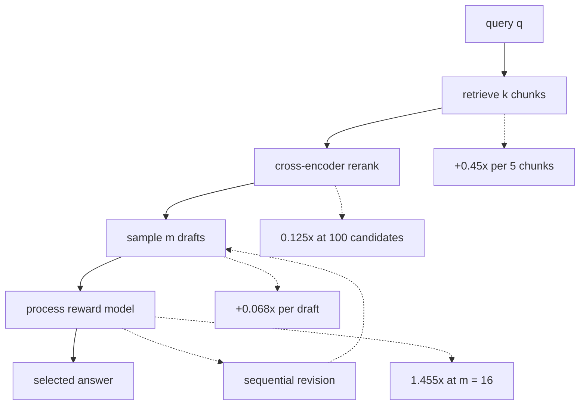
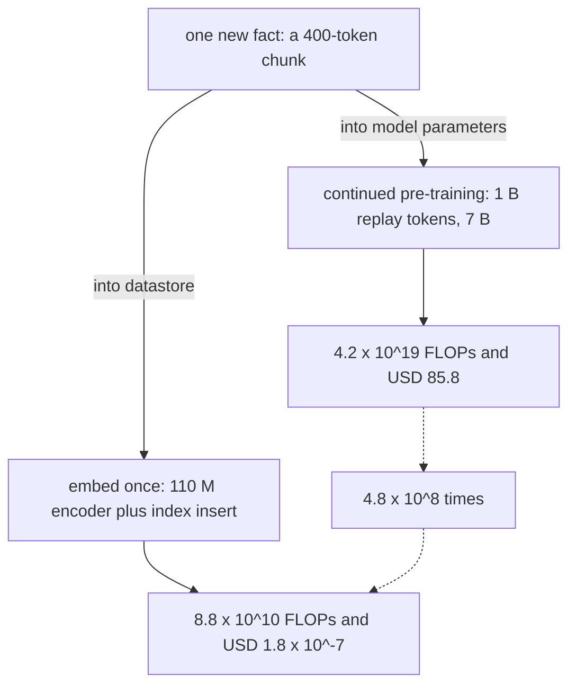

# Chapter 6: Scaling Laws and the Economics of Retrieval vs Parameters

This chapter explains how to allocate training, serving, memory, and retrieval budgets for a Retrieval-Augmented Generation (RAG) system.

## TL;DR

- Training compute is approximately 6ND floating-point operations (FLOPs), while generation costs 2N FLOPs per token.
- Kaplan allocation drives the token-to-parameter ratio down with budget, while Chinchilla keeps it near 20 at its scale.
- Chinchilla minimizes training compute, not lifetime cost. Serving overtakes training at Dinf = 3Dtr.
- Memory has three bills: weights, optimizer state, and the key-value (KV) cache. Retrieval controls the variable cache bill through context length.
- At fixed non-embedding parameter count, architecture shape changes loss only a few percent. Shape still changes cache size and decode latency.
- Test-time search wins at modest query volume only when a verifier can select better candidates.
- Retrieval can replace parameters that store facts. It cannot replace the competence needed to read and use retrieved evidence. Datastore growth forces retrieval depth upward. A reranker keeps the generator context flat as the corpus grows.

## The story

Think of the system as a library with a skilled clerk. Model parameters pay for the clerk's reading and reasoning skill, while the datastore pays for shelves that can be updated cheaply. A larger clerk may remember more books, but every answer then costs more to serve. A smaller clerk can consult the shelves, but only if the clerk can read the right passage and the catalog can surface it. The economic choice is therefore not simply big model versus small model. It is how much permanent skill to buy, how much factual content to store externally, and how much search and verification to purchase per query. As the library grows, a reranker prevents the clerk from receiving an ever larger pile of passages.

## Decoder table

| Term | Meaning in this chapter | Decision it controls |
|---|---|---|
| N | Non-embedding parameter count unless the text says total parameters | Training compute, generation compute, quality scaling |
| D | Number of processed training tokens | Training allocation and repeated-data cost |
| C | Training compute in FLOPs | Budget constraint |
| L | Test cross-entropy in nats per token | Scaling-law outcome |
| alpha_N | Parameter scaling exponent, about 0.076 under Kaplan | Loss reduction from more parameters |
| alpha_D | Data scaling exponent, about 0.095 under Kaplan | Loss reduction from more tokens |
| B | Batch size in Kaplan's allocation result | Part of the token-count scaling |
| S | Training steps in Kaplan's allocation result | Part of the token-count scaling |
| Dtr | Training-token volume in the lifetime bill | One-time training cost |
| Dinf | Generated-token volume in the lifetime bill | Repeated serving cost |
| b | Bytes used to store one number | Weight and cache memory |
| Llayers | Transformer layer count | Attention work and KV cache |
| d | Model width | Attention work, body size, and cache |
| s | Context length in tokens | Attention work and per-request cache |
| nkv | Number of key and value heads | KV-cache width |
| dhead | Head dimension | KV-cache width |
| Nbody | Transformer-body parameter count | Compute-relevant model size |
| V | Vocabulary size | Embedding-table memory and tokenization |
| nlayer | Model depth | Body size, cache, and sequential decode |
| Tin | Input tokens for one query | Prefill cost |
| Tout | Output tokens for one query | Decode cost |
| Q | Lifetime query count | Amortization of pre-training |
| m | Per-query compute multiplier of a test-time method | Breakeven against larger pre-training |
| Qstar | Query count where two lifetime-cost choices cross | Pre-training versus test-time compute |
| theta | Model parameters | Parametric storage path |
| rho | Fraction of the corpus that outranks the gold chunk | Retrieval-depth growth rate |
| rbar | Mean rank of the gold chunk | Empirical input to rho |
| corpus size | Number of datastore chunks | Retrieval depth and index memory |
| k | Chunks passed toward the generator | Recall, context, and answer-bearing fraction |
| kret | Deep retrieval count before reranking | Corpus-growth cost |
| kmax | Maximum chunks that fit the context window | Retrieval ceiling |
| f | Token-count reduction from a better tokenizer | Prefill, cache, and context savings |
| Floating-point operation (FLOP) | One numerical operation in the chapter's compute estimates | Prices training, serving, embedding, and reranking |
| Cosine learning-rate schedule | A schedule that decays the training rate over a run's actual length | Explains the methodological correction behind Chinchilla |
| Numeric precision | 32-bit floating point (fp32), bfloat16 (bf16), 8-bit floating point (fp8), 8-bit integer (int8), or 4-bit integer (int4) storage | Determines weight memory and card boundaries |
| Concurrency | Requests served at the same time | Multiplies the per-request KV-cache bill |
| Gold chunk | The labeled passage containing the evidence needed for an answer | Supports reading tests, rank measurement, and reranking decisions |
| Kaplan allocation | N grows as C^0.73 and D grows as C^0.27 | Favors parameters increasingly at larger budgets |
| Chinchilla allocation | N and D each grow as C^0.50 | Holds the token-to-parameter ratio constant |
| Post-Chinchilla allocation | Smaller models trained on far more tokens | Trades a small loss penalty for lower serving cost |
| Iso-FLOP curve | Loss across model and token allocations at fixed compute | Finds an allocation minimum |
| Compute-optimal | Minimum training compute for a target loss | Correct only for a training-only objective |
| Over-trained | More tokens per parameter than Chinchilla | Reduces parameter count and serving cost |
| Weight memory | Nb bytes | Fixed serving cost |
| Training state | Weights, gradients, master weights, and Adam moments | Full fine-tuning feasibility |
| KV cache | Keys and values retained for every token and request | Serving concurrency |
| Attention correction | Parameter-free attention work omitted by 6ND | Long-context compute accuracy |
| Low-rank adaptation (LoRA) | Small trainable matrices added to frozen weights | Fine-tuning state reduction |
| Activation checkpointing | Recompute forward activations during backward | Memory reduction for 33% more parameter work |
| Mixture-of-experts (MoE) | Store many parameters but activate only some per token | Splits memory sizing from compute sizing |
| Shape independence | Loss changes only a few percent across a wide shape range at fixed N | Moves shape choice to serving constraints |
| Embedding table | Vocabulary lookup rows | Memory without multiply-add compute |
| Convergence | Validation loss plateau for one model-data pair | Not a compute-budget allocation rule |
| Repeated-data ceiling | About four epochs remain near fresh-data value | Caps productive reuse |
| Proposer | Produces candidate answers | Uses test-time compute to explore |
| Verifier | Scores passages or answer chains. Pass-at-16 checks whether any of 16 proposals is correct. | Converts exploration into accuracy |
| Best-of-N | Generate m complete answers and select the top score | Default search at larger budgets |
| Beam search | Prune partial solutions using verifier scores | Stronger at small budgets on easier tasks |
| Lookahead search | Add Monte Carlo rollouts to beam search | Loses at matched budget in the cited result |
| Process reward model (PRM) | Scores reasoning steps | Stronger signal than final-answer-only scoring |
| Outcome reward model | Scores only the final answer | Weaker verifier signal in the cited comparison |
| Competence parameters | Support syntax, instructions, attention, and copying | Cannot be outsourced to retrieval |
| Content parameters | Support closed-book factual production | Can be partly substituted by a datastore |
| Write path | Cost to add or update one fact | Main economic advantage of retrieval |
| Reranker | Cheap discriminator over retrieved candidates | Holds generator context flat |
| Product quantization | Compresses stored vectors | Makes large index memory practical |

## Core mechanics

### 6.1 Kaplan, Chinchilla, and post-Chinchilla token-to-parameter ratios

#### What the scaling laws say

The basic compute relation is:

$$
C \approx 6ND
$$

Kaplan et al. fit separate power laws for parameters and data. The straight-line log-log fits span seven orders of magnitude:

$$
L(N) = \left(\frac{N_c}{N}\right)^{\alpha_N},
\qquad
\alpha_N \approx 0.076
$$

$$
L(D) = \left(\frac{D_c}{D}\right)^{\alpha_D},
\qquad
\alpha_D \approx 0.095
$$

Their allocation rule is:

$$
N_{opt} \propto C^{0.73}
$$

$$
D_{opt} \propto C^{0.27}
$$

Kaplan also reports batch size proportional to C^0.24 and steps proportional to C^0.03. Those exponents combine to give D proportional to C^0.27.

The token-to-parameter ratio therefore obeys:

$$
\frac{D_{opt}}{N_{opt}} \propto C^{-0.46}
$$

The ratio falls as the compute budget grows. GPT-3 uses 175 B parameters and 300 B tokens, or 1.7 tokens per parameter. Gopher uses 280 B parameters and 300 B tokens, or 1.1 tokens per parameter.

#### Why Chinchilla changed the answer

Hoffmann et al. matched the cosine learning-rate schedule to each run's actual length. Kaplan had used one schedule across runs of different lengths. That choice undervalued longer training because some runs were evaluated before the schedule finished decaying. Hoffmann et al. also counted embedding parameters.

Three estimation routes agreed on exponents near one half:

$$
N_{opt} \propto C^{0.50}
$$

$$
D_{opt} \propto C^{0.50}
$$

Thus:

$$
\frac{D_{opt}}{N_{opt}} \propto C^0
$$

The ratio is constant. At Chinchilla's scale, its level is about 20 tokens per parameter. The statement that model size and tokens scale one-to-one refers to exponents. It does not mean one token per parameter. Reading it that way creates a 20 times error.

Chinchilla uses 70 B parameters and 1.4 T tokens. Its ratio is 20. Gopher uses 280 B parameters and 300 B tokens. Its ratio is 1.1.

The matched-budget check is:

$$
C_{Gopher}
=
6(2.8 \times 10^{11})(3.0 \times 10^{11})
=
5.0 \times 10^{23}
$$

$$
C_{Chinchilla}
=
6(7.0 \times 10^{10})(1.4 \times 10^{12})
=
5.9 \times 10^{23}
$$

The budgets differ by 17%, while the parameter counts differ by four times. Chinchilla reports 67.6% average on the Massive Multitask Language Understanding (MMLU) benchmark. Gopher reports 60.0%.

Using 3.4 × 10^14 FLOP/s sustained and USD 2.50 per accelerator-hour, 5.0 × 10^23 FLOPs becomes 1.5 × 10^9 seconds. That is 4.1 × 10^5 accelerator-hours and about USD 1.0 million. The displayed scores differ by 7.6 percentage points. The source prose calls the gain seven and a half points.

#### Why the training-only optimum fails after deployment

Chinchilla minimizes training compute for a loss target. Generation cost depends on N but not on the training-token count.

The lifetime bill is:

$$
C_{total} = 6ND_{tr} + 2ND_{inf}
$$

Training and serving are equal when:

$$
6ND_{tr} = 2ND_{inf}
$$

Therefore:

$$
D_{inf} = 3D_{tr}
$$

N cancels. Serving overtakes training after the model generates three times its training-token count. For Chinchilla, that point is 4.2 T generated tokens.

Once expected inference volume enters the objective, the optimum moves toward a smaller model trained on more tokens. The shift grows with serving demand. Llama 1 at 7 B saw 1.0 T tokens, or 143 per parameter. Llama 2 at 7 B saw 2.0 T tokens, or 286 per parameter. Llama 3 at 8 B saw over 15 T tokens, or 1,875 per parameter. The last ratio is 94 times Chinchilla's ratio.

#### Worked budget comparison

Use C = 7.2 × 10^23 FLOPs.

For Chinchilla, impose D = 20N:

$$
C = 120N^2
$$

$$
N = \sqrt{\frac{7.2 \times 10^{23}}{120}}
=
7.7 \times 10^{10}
$$

$$
D = 20N = 1.55 \times 10^{12}
$$

This is 77 B parameters on 1.55 T tokens. At bfloat16 (bf16), weights use 155 GB. The model cannot fit on one 80 GB accelerator.

For the post-Chinchilla ratio, impose D = 1,875N:

$$
C = 11{,}250N^2
$$

$$
N = \sqrt{\frac{7.2 \times 10^{23}}{1.125 \times 10^4}}
=
8.0 \times 10^9
$$

This is 8 B parameters on 15 T tokens. The bf16 weights use 16 GB.

Generation costs 1.55 × 10^11 FLOPs per token for the 77 B model. It costs 1.6 × 10^10 for the 8 B model. The serving ratio is 9.7.

At 10^13 generated tokens, serving costs 1.55 × 10^24 FLOPs for the 77 B model. It costs 1.6 × 10^23 FLOPs for the 8 B model. Lifetime totals are 2.27 × 10^24 and 8.8 × 10^23 FLOPs. The training-optimal model costs 2.6 times as much to own.

The 77 B model still has lower loss at equal training compute. The trade is lower serving cost against some quality. The source says to verify that loss trade on the actual evaluation because iso-FLOP minima are flat nearby.

The 6ND estimate also matches Llama 3 405B. Using 405 B parameters and 15.6 T tokens gives 3.79 × 10^25 FLOPs. The reported value is 3.8 × 10^25. The agreement is 0.3%.

#### Practical decision

Ask for expected lifetime inference volume before naming N. Treat 20 tokens per parameter as a floor for a served system, not a universal target. Use the largest token-to-parameter ratio that keeps the model resident on one accelerator at serving precision. Run a small iso-FLOP sweep when the data distribution, tokenizer, or architecture differs materially. Buy factual coverage with a datastore. Buy compositional and procedural capability with parameters.

### 6.2 FLOPs, attention, and memory arithmetic

#### What 6ND contains

A linear layer with n parameters uses n multiplications and n additions per token. With `y = W^T x`, backward computes `dL/dx = W(dL/dy)` and `dL/dW = x(dL/dy)^T`. The forward pass is 2n FLOPs. Summed across the model, it is 2N.

Backward computes a gradient for the inputs and a gradient for the weights. Each costs 2n. Backward is therefore 4N.

$$
2N + 4N = 6N
$$

Across D training tokens:

$$
C \approx 6ND
$$

Generation has no backward pass. Its parameter term is 2N per token.

#### What 6ND omits

Causal attention scores and value aggregation add 2Llayerssd FLOPs per token. A standard block has about 12d^2 parameters. The parameter term is approximately 24Llayersd^2.

The omitted-to-parameter ratio is:

$$
\frac{2L_{layers}sd}{24L_{layers}d^2}
=
\frac{s}{12d}
$$

Kaplan calls this term negligible when d is greater than s divided by 12. For d = 4,096, the threshold is 49,152 tokens. At an 8k prompt, attention adds one sixth of the parameter term. At 32k, it adds two thirds. Long retrieved contexts are where 6ND undercounts most.

#### The three memory tiers

Weight memory is Nb bytes. Use b = 4 for 32-bit floating point (fp32). Use b = 2 for bf16. Use b = 1 for 8-bit integer (int8). Use b = 0.5 for 4-bit integer (int4).

A 27 B model uses 108 GB at fp32. It uses 54 GB at bf16. It uses 27 GB at int8. The fp32 weights already overflow one 80 GB card.

Full Adam fine-tuning uses 16 bytes per parameter before activations. The source counts 2 bytes of bf16 weights, 2 of gradients, 4 of fp32 master weights, 4 of momentum, and 4 of variance. Pure fp32 also totals 16 bytes through four 4-byte states. An 8 B model needs 128 GB. A 27 B model needs 432 GB.

The KV cache uses:

$$
2L_{layers}n_{kv}d_{head}b
$$

bytes per token.

For Llama 3.1 8B, use 32 layers, 8 key-value heads, head dimension 128, and bf16.

$$
2(32)(8)(128)(2)
=
131{,}072 \text{ bytes}
=
128 \text{ KiB per token}
$$

The cache then multiplies by context length and concurrency. With 16 GB of weights on an 80 GB card, 64 GB remains. That space holds 119 requests at 4k, 59 at 8k, and 14 at 32k.

Pricing deployment by parameter count alone fails because context length changes concurrency. It also fails for MoE models. Mixtral 8x7B stores 46.7 B parameters but activates 12.9 B per token. Its memory resembles a 47 B model. Its compute resembles a 13 B model.

#### Fine-tuning choices

Serving the 27 B at fp32 fails at 108 GB. Serving it at bf16 uses 54 GB and leaves 26 GB. That cuts free cache memory from 64 GB to 26 GB, or by 2.5 times. A deeper and wider model also caches more per token.

Full Adam state needs 128 GB for 8 B and 432 GB for 27 B. Those figures correspond to two and six 80 GB cards before activations.

A rank-r LoRA matrix trains `r(din + dout)` values. Rank-16 LoRA on the query and output projections of all 32 layers in the 8 B model trains:

$$
16(4{,}096 + 4{,}096)(2)(32)
=
8.39 \times 10^6
$$

parameters.

The same full matrices contain 1.07 × 10^9 parameters. LoRA trains 0.78% as many. The reduction factor is d divided by 2r, or 128. Its gradients and Adam state use 134 MB. The frozen bf16 base remains 16 GB.

Activation checkpointing adds one extra forward pass. That raises the parameter work from 6ND to 8ND. The increase is exactly 33%.

#### RAG prefill check

An 8k prompt on 8 B has a parameter prefill term of:

$$
2(8 \times 10^9)(8{,}192)
=
1.31 \times 10^{14}
$$

FLOPs.

Attention adds:

$$
2(32)(4{,}096)(8{,}192^2)
=
1.76 \times 10^{13}
$$

FLOPs.

The total is 1.49 × 10^14 FLOPs. At 3.4 × 10^14 FLOP/s, prefill takes 0.44 seconds before the first output token. The cache is 1.07 GB per request. The remaining 64 GB holds 59 requests.

At 32k, cache per request rises from 1.07 GB to 4.29 GB. Concurrency falls from 59 to 14. The parameter prefill term is 5.24 × 10^14 FLOPs. Attention is 2.81 × 10^14. The total is 8.06 × 10^14. Latency rises from 0.44 seconds to 2.4 seconds. That is 5.4 times for a four times longer context.

The bf16 weight rule also predicts 810 GB for Llama 3.1 405B. An eight-card node with 80 GB per card holds 640 GB. The model therefore cannot fit on one such node at bf16. The source notes a 405 GB 8-bit floating-point (fp8) variant and a multi-node path for bf16.

#### Practical decision

Answer fit questions with weights, training state, and KV cache. Use LoRA by default above about 7 B on single-node hardware. Buy concurrency first by shortening and reranking context. Add attention and checkpointing corrections to 6ND. Use active parameters for MoE compute and stored parameters for memory. Use bf16 serving weights unless a card boundary forces int8 or int4. The source calls quantization the cheapest 2 to 4 times memory reduction in the stack. Use 4-bit frozen base weights for quantized LoRA when fine-tuning memory is the binding constraint.

### 6.3 Three observations that change decisions: shape, embeddings, convergence

#### Shape is nearly free in loss

At fixed N, changing feed-forward ratio, aspect ratio, and head dimension moves loss only a few percent across the measured range. Doubling N changes loss by:

$$
\frac{L(2N)}{L(N)}
=
2^{-0.076}
=
0.949
$$

That is a 5.1% reduction.

A ten times increase gives:

$$
10^{-0.076}
=
0.839
$$

That is a 16.1% reduction.

A shape sweep can cost more compute than its loss gain. The loss result does not make shape irrelevant. It moves shape selection to serving.

Under multi-head attention, cache is 2nlayerdb bytes per token. It grows linearly with depth and does not depend directly on N. Depth also serializes decode. Forty-eight layers require 48 sequential layer executions per token. Twenty-four layers require 24.

The result only holds within a wide practical range for dense decoder-only transformers. One layer remains bad at any width. A head dimension of 8 remains bad. MoE breaks a single-N comparison because stored and active parameters differ.

#### Embeddings distort parameter comparisons

A standard transformer body is approximately:

$$
N_{body} \approx 12n_{layer}d^2
$$

The embedding table is:

$$
N_{embed} = Vd
$$

The body grows quadratically with width. The table grows linearly. Counting both bends the scaling fit because the embedding share changes with model size.

GPT-2 small uses 12 layers, width 768, and vocabulary 50,257. Its body is 84.9 M parameters. Token and positional lookup tables total 39.4 M. The lookup share is 32%.

Llama 3 70B uses width 8,192 and vocabulary 128,256 with untied embeddings. Its embedding count is 2.10 B against 70.6 B total. The share is 3.0%.

Counting embeddings inflates the small model by 45% and the large model by 3%. The differential log shift is 0.15 decades.

XLM-R base and BERT-base have the same 84.9 M body. Their vocabularies are 250,002 and 30,522. Their advertised totals are 278 M and 110 M. The 2.5 times difference is lookup rows. Both encode at 1.7 × 10^8 FLOPs per token. The multilingual table adds 168 M rows and 0.34 GB at bf16.

A larger vocabulary can still help by emitting fewer tokens. If it reduces token count by a factor f, prefill and cache fall by f. A fixed context can also hold f times as much evidence. Choose vocabulary for tokenization efficiency on the actual corpus. Do not treat lookup rows as reasoning capacity.

#### Convergence misallocates a fixed budget

At fixed compute, a larger model stopped before convergence can outperform a small converged model. The scaling law for D was fit on fresh tokens. Repeated tokens have lower returns. Muennighoff et al. report negligible loss difference from fresh data through about four repeated epochs. Returns decay toward zero beyond that range.

The failed rule is to train the biggest model that converges on the available corpus. That lets the validation plateau choose N. The plateau has no direct relationship to the approved compute budget.

#### Worked budget comparison

The corpus contains 20 B tokens. The budget is 1.2 × 10^21 FLOPs. At 3.4 × 10^14 FLOP/s and USD 2.50 per accelerator-hour, that is 980 accelerator-hours and about USD 2,450.

A 300 M model converging after 20 passes processes 4 × 10^11 tokens.

$$
C_1
=
6(3 \times 10^8)(4 \times 10^{11})
=
7.2 \times 10^{20}
$$

It spends 60% of the budget. The remaining 4.8 × 10^20 FLOPs equal 392 accelerator-hours and USD 980. Epochs 1 through 4 are 20% of the spent tokens. Only 12% of the total budget lands in the productive four-epoch window.

Cap repeats at four epochs. Then D = 8 × 10^10.

$$
N
=
\frac{1.2 \times 10^{21}}{6(8 \times 10^{10})}
=
2.5 \times 10^9
$$

This model gets 32 tokens per parameter. It spends 100% of the budget. The parameter increase is 8.33 times. The scaling law predicts a loss multiplier of 0.851. That is a 14.9% reduction.

For N near 2.4 B, compare 48 layers at width 2,048 with 24 layers at width 2,880. Both satisfy the body approximation. At bf16 with multi-head attention, their caches are 384 KiB and 270 KiB per token. Weights use 4.8 GB and leave 75.2 GB on an 80 GB card. At 8k, requests use 3.22 GB and 2.26 GB. The card holds 23 and 33 requests. The wider, shallower model gives 43% more throughput.

For GPT-2 small, the body estimate is 84.93 M. Token embeddings are 38.60 M. Positional embeddings are 0.79 M. The sum is 124.3 M against a published 124 M. Agreement is 0.2%.

#### Practical decision

Compare non-embedding parameters for quality and compute. Use total parameters for hardware sizing. Choose shape from cache and latency constraints. Cap repeated data near four epochs before spending surplus on a larger N. Size N from the budget and token ceiling. Stop short of convergence unless converged loss is the experimental target. Buy fresh domain tokens before more repeated epochs.

### 6.4 Test-time compute versus pre-training compute

#### Lifetime breakeven

Pre-training is a fixed cost:

$$
C_{pre} = 6ND_{pre}
$$

A RAG query costs:

$$
C_{query}
=
2N(T_{in} + T_{out})
$$

Across Q queries, inference is Q times Cquery. If a test-time method multiplies query compute by m, the breakeven with added pre-training is:

$$
Q^{*}
=
\frac{\Delta C_{pre}}{(m-1)C_{query}}
$$

Pre-training is constant in Q. Inference is linear in Q. Lifetime query volume decides which bill amortizes.

#### Search needs a verifier

The proposer generates candidate answers. The verifier scores them and selects one. Sampling without a verifier has the same expected accuracy as drawing one answer and choosing at random.

Best-of-N is simple and competitive at larger budgets. Beam search is stronger at small budgets and on easier problems. Its advantage fades as budget and difficulty rise. Lookahead search loses at matched budget because rollouts displace complete candidates. A process reward model that scores steps beats an outcome reward model that scores only the final answer in the cited mathematical-reasoning result.

The source boundary is conditional. Extra test-time compute is the better purchase for easy and moderate problems under modest inference load. Extra pre-training compute wins for genuinely hard problems under large inference load.

At batch size one, decode is memory-bandwidth bound because each token streams all N weights. Parallel samples can share a prompt and advance together. That raises arithmetic intensity. Sequential revision cannot batch across dependent passes. It is therefore more expensive at equal FLOPs.

A 3 B model run 256 times uses 1.54 × 10^12 FLOPs per output token. One 70 B pass uses 1.4 × 10^11. The smaller model uses 11 times more compute. Its bf16 weights use 6 GB instead of 140 GB. That is 23 times less weight memory.

#### Worked RAG query

The assistant serves 10,000 queries per day. Each query retrieves 10 chunks of 400 tokens. Question and instructions add 100 tokens. The answer adds 300. Tin is 4,100. Tout is 300. The total is 4,400 tokens.

The attention term is 4.41 × 10^12 FLOPs. The parameter term is 6.56 × 10^13. Attention adds 6.7%. The source drops it from ratios because it cancels.

An 8 B greedy pass costs:

$$
2(8 \times 10^9)(4{,}400)
=
7.04 \times 10^{13}
$$

FLOPs. That is 0.207 seconds of accelerator time. It costs USD 0.144 per thousand queries.

Best-of-16 shares one 4,100-token prefill. That prefill costs 6.56 × 10^13 FLOPs. Sixteen 300-token decode branches cost 7.68 × 10^13. An 8 B process reward model scoring 16 chains of 400 tokens costs 1.02 × 10^14. The total is 2.45 × 10^14 FLOPs. That is 3.48 times baseline and USD 0.50 per thousand queries.

A 70 B greedy pass costs 6.16 × 10^14 FLOPs. That is 8.75 times baseline and USD 1.26 per thousand queries. Its 140 GB of bf16 weights also forces a second card.

Pre-training the 70 B at 20 tokens per parameter costs 5.88 × 10^23 FLOPs. The 8 B comparison costs 7.68 × 10^21. The difference is 5.80 × 10^23.

With m = 3.48:

$$
Q^{*}
=
\frac{5.80 \times 10^{23}}
{2.48(7.04 \times 10^{13})}
=
3.32 \times 10^9
$$

queries.

At 10,000 per day, breakeven is 910 years. At 10 million per day, it is 332 days.

One 300-token sample costs 4.80 × 10^12 FLOPs. Three hundred extra context tokens cost the same. Five 400-token chunks cost 3.20 × 10^13. That equals 6.7 samples.

A 110 M cross-encoder reranking 100 candidates of 400 tokens costs 8.80 × 10^12 FLOPs. That is 0.125 times the baseline query. It is the cheapest verifier in the stack.

The deployment consumes 1.61 × 10^10 inference tokens per year. The 70 B pre-training run uses 1.4 × 10^12. The ratio is 0.011. It lies two orders of magnitude below one.

#### Practical decision

Spend marginal FLOPs at test time until lifetime volume crosses Qstar. Use passage reranking before chain verification. Buy an extra sample before an extra chunk unless the miss is a retrieval-recall miss. Use best-of-N with a process reward model by default. Use beam search at small budgets on easy queries. Do not use lookahead search under the cited matched-budget result. Route more search compute only to predicted hard queries when the router is reliable. Measure pass-at-16 on the failing set. If the small model never proposes a correct answer, no verifier can rescue it.

### 6.5 The small-model-plus-datastore argument and its limit

#### What retrieval can replace

Parameters perform two jobs. Competence supports syntax, instruction following, attending to context, and copying. Content supports closed-book recall. Retrieval can substitute for content. It cannot substitute for the competence required to read the retrieved passage.

The capacity argument alone is insufficient. Allen-Zhu and Li report a stable ceiling near 2 bits per parameter, including int8. A 7 B model then stores about:

$$
2(7 \times 10^9)
=
1.4 \times 10^{10}
$$

bits.

The source's comparison says this exceeds English Wikipedia and textbooks combined. The corpus can fit in principle. The economic difference is the write path.

Embedding one 400-token chunk with a 110 M bi-encoder costs:

$$
2(1.1 \times 10^8)(400)
=
8.8 \times 10^{10}
$$

FLOPs.

The index row is 3,072 bytes. At the chapter's throughput and price, the write costs USD 1.8 × 10^-7.

Continued pre-training of a 7 B model on 1 B replay tokens costs:

$$
6(7 \times 10^9)(1 \times 10^9)
=
4.2 \times 10^{19}
$$

FLOPs.

That is 34.3 accelerator-hours and USD 85.8. The write-path ratio is 4.8 × 10^8.

The datastore wins because one fact requires one insert instead of a training run. It also supports updates when facts change.

Kandpal et al. report that factual question-answering accuracy is log-linear in relevant pre-training documents per question, then extrapolate scale-only long-tail coverage to about 10^18 parameters. RETRO at 7.5 B matches GPT-3 at 175 B and Jurassic-1 at 178 B on the Pile with 25 times fewer parameters and a 2-trillion-token database. Atlas at 11 B exceeds 42% on Natural Questions from 64 examples. It is three points above a 540 B model with 50 times fewer parameters. A k-nearest-neighbor language model trained on 100 M tokens with a datastore from 3 B beats the same architecture trained on all 3 B. The source also reports a roughly 350 M phrase-prediction system that uses retrieval to distinguish a poor-quality sense from an inexpensive sense. Local retrieval is personalization rather than federated learning because no gradient or model update crosses the device boundary.

#### The datastore growth limit

Define rho from mean gold rank:

$$
\rho
=
\frac{\bar r - 1}{|D|}
$$

The number of chunks outranking gold is rho times corpus size. Gold survives top-k only when:

$$
k \geq \rho |D| + 1
$$

The source treats rho as a retriever property that remains roughly fixed as documents are added. At fixed retriever quality, required retrieval depth grows linearly with datastore size.

Each chunk is 400 tokens. A 32k context reserves 400 tokens for question and answer. The source caps the prompt at 80 chunks. As k grows, the answer-bearing fraction falls to 1 divided by k. The generator's job changes from finding one useful chunk in five to one in two hundred.

The resolution is deep retrieval followed by a cross-encoder reranker. Retrieve approximately rho times corpus size. Rerank the candidates. Pass five chunks to the generator. Only the 110 M reranker bill grows with the corpus. The 8 B generator context stays flat.

#### Worked support assistant

The index holds 50 M chunks of 400 tokens. That is 2 × 10^10 corpus tokens. Queries add 100 input tokens and emit 300 output tokens.

A closed-book 70 B query over 400 tokens costs 5.6 × 10^13 FLOPs. It costs USD 0.114 per thousand queries. Its bf16 weights occupy 140 GB and require two accelerators.

Training that model over the 2 × 10^10 corpus tokens costs 8.4 × 10^21 FLOPs. That is 6,863 accelerator-hours and USD 17,157 per refresh. The corpus is 1.4% of the model's 1.4 T Chinchilla-optimal training tokens.

An 8 B model with 10 retrieved chunks processes 4,400 tokens. It costs 7.04 × 10^13 FLOPs and USD 0.144 per thousand queries. That is 1.26 times the 70 B closed-book query. Retrieval does not save per-query compute in this comparison. It saves weight memory and update cost.

The 8 B weights occupy 16 GB on one card. A daily refresh of 20,000 changed chunks costs 1.76 × 10^15 FLOPs. That is USD 0.0036 instead of USD 17,157.

The full-precision index costs:

$$
(5 \times 10^7)(768)(4)
=
1.536 \times 10^{11}
$$

bytes.

That is 153.6 GB. Product quantization at 96 bytes per vector reduces it to 4.8 GB. Here, compression is required rather than optional.

If the corpus grows to 5 × 10^9 chunks, use the original mean rank of 3:

$$
\rho
=
\frac{2}{5 \times 10^7}
=
4 \times 10^{-8}
$$

The minimum k becomes 201. The context becomes 80,400 tokens before question and answer. The gold chunk occupies 0.5% of the retrieved context instead of 20%.

Stuffing all 201 chunks gives 80,800 total tokens. It costs 1.29 × 10^15 FLOPs.

Reranking 80,400 tokens with a 110 M cross-encoder costs 1.77 × 10^13 FLOPs. The generator then reads five chunks for 3.84 × 10^13. The total is 5.61 × 10^13. That is 23 times cheaper than stuffing. It is the only compared design whose generator cost stays flat as the corpus grows.

The assumed generator reduction is 8.75 times. The source compares it with reported 25 times and 50 times substitutions. The worked assumption is therefore three to six times more conservative.

#### Practical decision

Choose the smallest generator that passes a reading test with the gold chunk pasted into context. Put new factual content in the datastore. Use weights for style, procedures, output format, and tool conventions when retrieval is unreliable. Measure rho before promising that the design scales. Rerank instead of continually raising generator top-k. Quantize the index before shrinking the model again. If the gold chunk is already rank one and the small model still fails, buy more competence with parameters.

## Diagrams

### Figure 6.1

#### Panel a: allocation policies and observed models

| Policy or model | Parameters N | Training tokens D | Tokens per parameter | Figure marker or rule |
|---|---:|---:|---:|---|
| Kaplan rule | grows with C^0.73 | grows with C^0.27 | falls with C^-0.46 | D proportional to N^0.37 |
| GPT-3 | 175 B | 300 B | 1.7 | open square |
| Gopher | 280 B | 300 B | 1.1 | open square |
| Chinchilla rule | grows with C^0.50 | grows with C^0.50 | 20 at this scale | D = 20N |
| Chinchilla | 70 B | 1.4 T | 20 | filled circle |
| Llama 1 | 7 B | 1.0 T | 143 | filled diamond |
| Llama 2 | 7 B | 2.0 T | 286 | filled diamond |
| Llama 3 | 8 B | 15 T in the worked comparison | 1,875 | filled diamond |

#### Panel b: lifetime compute under the same training budget

| Configuration | Training compute | Serving compute for 10^13 tokens | Lifetime total |
|---|---:|---:|---:|
| Chinchilla-optimal, 77 B on 1.55 T | 0.72 × 10^24 FLOPs | 1.55 × 10^24 FLOPs | 2.27 × 10^24 FLOPs |
| Over-trained, 8 B on 15 T | 0.72 × 10^24 FLOPs | 0.16 × 10^24 FLOPs | 0.88 × 10^24 FLOPs |

**Figure 6.1:** (a) Three allocation policies, and the models that obeyed them. Kaplan's rule sends the ratio down as budgets grow - open squares, GPT-3 at 175 B×300 B tokens (1.7) and Gopher at 280 B×300 B (1.1). Chinchilla holds it at 20 - filled circle, 70 B×1.4 T. Every post-Chinchilla release sits far above both - filled diamonds, Llama 1 at 143, Llama 2 at 286, Llama 3 at 1,875. (b) The same 7.2 × 10^23 FLOP training budget, spent two ways: the Chinchilla-optimal shape costs 2.6× the lifetime compute of the over-trained shape once the model serves 10^13 tokens, because serving scales with N and not with D.

### Figure 6.2

#### Panel a: fixed memory steps

| Operation | Arithmetic | Memory |
|---|---:|---:|
| Serve 8 B at bf16 | 8 × 2 | 16 GB |
| Serve 27 B at bf16 | 27 × 2 | 54 GB |
| Serve 27 B at fp32 | 27 × 4 | 108 GB |
| Fine-tune 8 B with Adam | 8 × 16 | 128 GB |
| Fine-tune 27 B with Adam | 27 × 16 | 432 GB |
| One-card boundary | 1 × 80 | 80 GB |

#### Panel b: variable KV-cache slopes

| Context s | Cache per request | Requests at 64 GB free |
|---:|---:|---:|
| 4k | about 0.54 GB | 119 |
| 8k | 1.07 GB | 59 |
| 32k | 4.29 GB | 14 |

**Figure 6.2:** (a) Weight and optimizer memory are step functions you pay once: the same 27 B model is 54 GB or 108 GB depending only on b, and full Adam fine-tuning multiplies the parameter count by 16 bytes, putting an 8 B past one card and a 27 B past five. (b) The KV cache is a slope you pay per concurrent request, and retrieval sets its gradient: at 128 KiB per token for Llama 3.1 8B, the 64 GB left after weights holds 119 requests at a 4k context, 59 at 8k, and 14 at 32k. The weights never moved.

### Figure 6.3

#### Panel a: loss sensitivity

| Change | Loss reduction |
|---|---:|
| Shape at fixed N | a few percent |
| Double N | 5.1% |
| Increase N ten times | 16.1% |

#### Panel b: lookup-table share

| Model | Lookup-table share |
|---|---:|
| XLM-R base, vocabulary 250k | 69% |
| GPT-2 small | 32% |
| BERT-base, vocabulary 30.5k | 22% |
| Llama 3 8B | 13% |
| Llama 3 70B | 3.0% |

#### Panel c: allocation of the 1.2 × 10^21 FLOP budget

| Configuration | Productive four-epoch share | Other outcome |
|---|---:|---|
| 300 M to convergence over 20 epochs | 12% | epochs 5-20 have low return and 40% of budget remains unspent |
| 2.5 B at four epochs | 100% | stopped before convergence |

**Figure 6.3:** (a) At fixed N, architecture shape moves the loss by a few percent, less than the 5.1% that one doubling of N buys under αN = 0.076. (b) The fraction of a model's parameters that is a lookup table ranges from 69% to 3.0%, so total parameter count is not comparable across vocabularies. (c) The same budget spent two ways: converging a 300 M model puts 12% of the budget inside the productive four-epoch window and strands the other 88% in low-return repeats or leaves it unspent, while a 2.5 B model at four epochs spends all of it productively.

### Figure 6.4

#### Panel a: proposer and verifier in a RAG stack

#### Panel b: cost against one 8 B generation pass

| Knob | Relative per-query FLOPs |
|---|---:|
| One extra sample | 0.068× |
| Rerank 100 candidates with 110 M | 0.125× |
| Five extra chunks | 0.45× |
| Baseline 8 B, k = 10, one sample | 1.00× |
| Process reward model over 16 chains | 1.455× |
| Best-of-16 plus process reward model | 3.48× |
| 70 B, one sample | 8.75× |

**Figure 6.4:** (a) Snell et al.'s proposer/verifier decomposition maps onto a RAG stack that already alternates between the two roles, with the reranker acting as a verifier over passages and the reward model as a verifier over chains. (b) Priced against a single 8 B generation pass, the passage-side verifier costs 0.125× while the chain-side verifier costs 1.455×, and searching sixteen drafts on the 8 B lands at 3.48× against 8.75× for one pass of the 70 B.

### Figure 6.5

#### Panel a: two write paths for one fact

#### Panel b: retrieval depth against datastore size

| Datastore chunks | rho times corpus size at rho = 4 × 10^-8 | Exact minimum from k greater than or equal to rho times corpus size plus 1 | Generator chunks after reranking |
|---:|---:|---:|---:|
| 5 × 10^6 | 0.2 | 2 after integer rounding | 5 |
| 5 × 10^7 | 2 | 3 | 5 |
| 5 × 10^8 | 20 | 21 | 5 |
| 2 × 10^9 | 80 | 81 | 5 |
| 5 × 10^9 | 200 | 201 | 5 |

The plotted line uses the dominant linear term rho times corpus size. The exact inequality adds one. The figure marks the approximate collision with the 80-chunk context ceiling at 2 × 10^9 chunks.

**Figure 6.5:** (a) Capacity is not what makes weights the wrong place for a fact - the write path is. The same 400-token chunk costs $85.8 to put into a 7 B model's parameters and $1.8 × 10^-7 to put into an index, a factor of 4.8 × 10^8. (b) The datastore is not free to grow either: at a fixed retriever quality ρ = 4 × 10^-8, retrieval depth must rise linearly with |D|, and it collides with a 32k context window at two billion chunks. A reranker is what keeps the generator's slice flat while the corpus grows underneath it.

There are no source tables in this chapter.

## Whiteboard pack

### Numbered drawing order

1. Write training compute as 6ND.
2. Add generation cost as 2N per token.
3. Draw the lifetime bill with training and serving terms.
4. Mark Dinf = 3Dtr as the crossover.
5. Split memory into weights, Adam state, and KV cache.
6. Draw the proposer and verifier path for test-time search.
7. Split model parameters into competence and factual content.
8. Draw datastore growth, deep retrieval, reranking, and a fixed five-chunk generator input.

### 90-100 word script

Start with the lifetime bill: training costs 6ND, and generation costs 2N per token. Ask for expected query volume before choosing model size. Chinchilla fixes the training-only ratio near 20 tokens per parameter, but a shipped system often favors a smaller model trained longer because serving scales with N. Next price weights, Adam state, and the KV cache separately. For retrieval, test whether the small model can answer when given the gold chunk. If it can, keep facts in the datastore. As the corpus grows, retrieve deeply, rerank cheaply, and keep the generator context flat.

## Interview traps

### 1. Is 20 tokens per parameter the final scaling rule?

No, it is the Chinchilla level for a training-compute objective at that scale. Serving crosses training at Dinf = 3Dtr, so a heavily served system can justify a smaller model trained on far more tokens. The trade is a small loss penalty against lower memory and lower cost for every generated token.

### 2. Does a 27 B model fit on one 80 GB card?

Precision and workload decide. Weights use 108 GB at fp32 or 54 GB at bf16, while full Adam state uses 432 GB before activations. The KV cache then scales with context and concurrency, so the trade is quality against card count, interconnect traffic, and request capacity.

### 3. Should multi-step failures trigger an 8 B to 70 B upgrade?

Not before measuring pass-at-16 and verifier quality. Best-of-16 plus a process reward model costs 3.48 times the 8 B baseline, while one 70 B pass costs 8.75 times and needs 910 years to amortize at 10,000 queries per day. Upgrade when the 8 B rarely proposes a correct answer because a verifier cannot select a candidate that never appears.

### 4. Does RAG always reduce per-query compute?

No. The worked 8 B with 10 chunks costs 1.26 times the 70 B closed-book query, so its wins are 16 GB rather than 140 GB of weights and a USD 0.0036 rather than USD 17,157 refresh bill. Use the smallest model that answers with the gold chunk, then retrieve deeply and rerank as the corpus grows because stuffing 201 candidates costs 1.29 × 10^15 FLOPs while rerank-then-read costs 5.61 × 10^13.

### 5. Should a fixed training budget fund a shape sweep or a small model trained to convergence?

Usually neither, because shape moves loss only a few percent at fixed non-embedding N and convergence lets the model-data pair choose the budget. On 20 B tokens and 1.2 × 10^21 FLOPs, a converged 300 M model leaves 40% unspent and puts only 12% inside the productive window, while 2.5 B at four epochs spends everything and predicts 14.9% lower loss. The limits matter because shape is nearly free only across the measured dense-transformer range and repeated data stays near fresh-data value only through about four epochs.

## Key numbers

### Allocation and lifetime

| Scope | Values and committed relationship |
|---|---|
| Kaplan allocation | Kaplan uses alpha_N = 0.076, alpha_D = 0.095, N proportional to C^0.73, batch proportional to C^0.24, steps proportional to C^0.03, D proportional to C^0.27, and D divided by N proportional to C^-0.46. GPT-3 is 175 B on 300 B at 1.7. Gopher is 280 B on 300 B at 1.1. |
| Chinchilla allocation | Chinchilla uses 0.50 and 0.50 exponents, a level of 20, and 70 B on 1.4 T. Its 5.9 × 10^23 FLOPs sit within 17% of Gopher's 5.0 × 10^23 despite a 4× parameter gap. MMLU is 67.6% versus 60.0%, a displayed 7.6-point gain that the prose calls seven and a half points. |
| Cost and crossover | The cost constants are 3.4 × 10^14 FLOP/s and USD 2.50 per accelerator-hour. A 5.0 × 10^23 run is 1.5 × 10^9 seconds, 4.1 × 10^5 hours, and about USD 1.0 M. Serving crosses training at Dinf = 3Dtr, or 4.2 T generated tokens for Chinchilla. |
| Post-Chinchilla comparison | Llama ratios progress from 143 for 7 B on 1.0 T, to 286 for 7 B on 2.0 T, to 1,875 for 8 B on over 15 T. The last is 94× Chinchilla. The post-2023 range is 100-2,000. At 7.2 × 10^23 FLOPs, 77 B on 1.55 T uses 155 GB and 8 B on 15 T uses 16 GB. Serving is 1.55 × 10^11 versus 1.6 × 10^10 FLOPs per token, a 9.7× gap. At 10^13 annual tokens, about 2.7 × 10^10 daily, serving is 1.55 × 10^24 versus 1.6 × 10^23 and lifetime cost is 2.27 × 10^24 versus 8.8 × 10^23, a 2.6× gap. The 405 B and 15.6 T sanity check gives 3.79 × 10^25 against 3.8 × 10^25, or 0.3% agreement. |

### Compute and memory

| Scope | Values and committed relationship |
|---|---|
| Compute relation | Parameter work is 2N forward, 4N backward, 6N training, and 2N generation. Attention adds s divided by 12d. At d = 4,096 the threshold is 49,152 tokens. The addition is one sixth at 8k and two thirds at 32k. |
| Precision and training state | Storage is 4 bytes for fp32, 2 for bf16, 1 for int8, and 0.5 for int4. Quantization is the cheapest stated route to a 2-4× reduction. A 27 B uses 108 GB, 54 GB, and 27 GB at the first three precisions. Adam uses 16 bytes per parameter, or 128 GB for 8 B and 432 GB for 27 B. Moving 27 B to bf16 cuts free memory from 64 GB to 26 GB, a 2.5× loss. |
| Cache and mixture of experts | Llama 3.1 8B uses 32 layers, 8 key-value heads, and head dimension 128. Its cache is 131,072 bytes or 128 KiB per token. With 64 GB free, concurrency is 119 at 4k, 59 at 8k, and 14 at 32k. Mixtral stores 46.7 B but activates 12.9 B. |
| LoRA and long context | Rank-16 LoRA on two projections in 32 layers trains 8.39 M against 1.07 B, or 0.78% and a 128× reduction. State is 134 MB above a 16 GB base. At 8k, parameter prefill is 1.31 × 10^14, attention is 1.76 × 10^13, total is 1.49 × 10^14, latency is 0.44 seconds, and cache is 1.07 GB. At 32k, cache is 4.29 GB, parameter work is 5.24 × 10^14, attention is 2.81 × 10^14, total is 8.06 × 10^14, and latency is 2.4 seconds. A 4× context produces 5.4× latency. Checkpointing raises 6ND to 8ND, or 33%. A 405 B uses 810 GB at bf16 against 640 GB on eight 80 GB cards, while fp8 is 405 GB. |

### Shape, embeddings, and convergence

| Scope | Values and committed relationship |
|---|---|
| Shape sensitivity | Shape changes loss a few percent. Doubling N gives 0.949 or 5.1% lower loss. Ten times N gives 0.839 or 16.1% lower loss. Figure lookup shares are 69%, 32%, 22%, 13%, and 3.0%. |
| Embedding shares | GPT-2 small uses 12 layers, width 768, vocabulary 50,257, an 84.9 M body, and 39.4 M lookup parameters at 32%. Llama 3 70B uses width 8,192, vocabulary 128,256, and 2.10 B embeddings at 3.0% of 70.6 B. Including embeddings inflates the two ends by 45% and 3%, a 0.15-decade shift. |
| Encoder vocabularies | XLM-R base is 278 M with vocabulary 250,002. BERT-base is 110 M with vocabulary 30,522. Both bodies are 84.9 M and cost 1.7 × 10^8 FLOPs per token. The advertised ratio is 2.5×. The extra 168 M rows use 0.34 GB. |
| Repeat and shape budget | Repeats retain near-fresh value through about four epochs. A 20 B-token corpus with 1.2 × 10^21 FLOPs equals 980 hours and USD 2,450. A 300 M model over 20 passes uses 4 × 10^11 tokens and 7.2 × 10^20 FLOPs, or 60%. It strands 4.8 × 10^20, 392 hours, and USD 980. Only 12% is in the productive window and 88% is low-return or unspent. A 2.5 B at four epochs uses 8 × 10^10 tokens, 32 tokens per parameter, and 100% of budget. Its 8.33× parameter gain predicts 0.851 or 14.9% lower loss. Shapes 48 by 2,048 and 24 by 2,880 use 384 and 270 KiB per token, 3.22 and 2.26 GB per 8k request, and support 23 and 33 requests with 4.8 GB weights and 75.2 GB free, a 43% gain. The GPT-2 check is 84.93 M plus 38.60 M plus 0.79 M, or 124.3 M against 124 M with 0.2% agreement. |

### Test-time compute

| Scope | Values and committed relationship |
|---|---|
| Small repeated model | A 3 B run 256 times uses 1.54 × 10^12 FLOPs per output token, 11× one 70 B pass at 1.4 × 10^11. Weight memory is 6 GB versus 140 GB, or 23× less. |
| Baseline query | The worked query rate is 10,000 daily. Ten 400-token chunks, 100 instruction tokens, and 300 output tokens give Tin = 4,100 and 4,400 total. Attention is 4.41 × 10^12, or 6.7%, against a 6.56 × 10^13 parameter term. The 8 B baseline is 7.04 × 10^13, 0.207 seconds, and USD 0.144 per thousand. |
| Best-of-16 and 70 B | Best-of-16 uses 6.56 × 10^13 shared prefill, 7.68 × 10^13 decode, and 1.02 × 10^14 reward scoring. Total is 2.45 × 10^14, 3.48×, and USD 0.50 per thousand. The 70 B is 6.16 × 10^14, 8.75×, and USD 1.26 per thousand. |
| Breakeven and marginal FLOPs | Pre-training is 5.88 × 10^23 for 70 B and 7.68 × 10^21 for 8 B, a 5.80 × 10^23 difference. With m = 3.48 and excess 2.48, Qstar is 3.32 × 10^9. That is 910 years at 10,000 daily and 332 days at 10 million daily. A 300-token sample is 4.80 × 10^12. A 400-token chunk is 6.4 × 10^12, or 1.33 samples. Five chunks are 3.20 × 10^13, or 6.7 samples. A 110 M reranker over 100 by 400 tokens costs 8.80 × 10^12 or 0.125×. Figure increments are 0.068× per sample, 0.45× per five chunks, and 1.455× for the process reward model. Annual inference is 1.61 × 10^10 tokens against 1.4 × 10^12 pre-training tokens, a ratio of 0.011. |

### Retrieval versus parameters

| Scope | Values and committed relationship |
|---|---|
| Capacity and write paths | Capacity is about 2 bits per parameter, or 1.4 × 10^10 bits for 7 B. One 400-token fact embedded by 110 M costs 8.8 × 10^10 FLOPs and adds a 3,072-byte row for USD 1.8 × 10^-7. A 7 B replay over 1 B tokens costs 4.2 × 10^19 FLOPs, 34.3 hours, and USD 85.8. The write ratio is 4.8 × 10^8. |
| Published substitutions | Scale-only long-tail recall extrapolates to about 10^18 parameters. RETRO at 7.5 B uses a 2 T-token database and matches 175 B and 178 B models with 25× fewer parameters. Atlas at 11 B exceeds 42% from 64 examples, beats 540 B by 3 points, and uses 50× fewer parameters. The nearest-neighbor result compares 100 M training tokens with a 3 B-token datastore. The phrase system is roughly 350 M. |
| Context limit and large-model refresh | A 32k window with 400 reserved tokens caps 400-token chunks at 80. The answer fraction degrades from 1 in 5 to 1 in 200. The starting index is 50 M chunks or 2 × 10^10 tokens. A closed-book 70 B query is 5.6 × 10^13 FLOPs and USD 0.114 per thousand with 140 GB weights. Refresh is 8.4 × 10^21 FLOPs, 6,863 hours, and USD 17,157. The corpus is 1.4% of 1.4 T. |
| Retrieved small model and corpus growth | The retrieved 8 B query is 7.04 × 10^13 FLOPs and USD 0.144 per thousand, or 1.26×, with 16 GB weights. Updating 20,000 chunks costs 1.76 × 10^15 FLOPs and USD 0.0036. A 50 M by 768 by 4-byte index is 153.6 GB. At 96 bytes per vector it is 4.8 GB. Mean rank 3 gives rho = 4 × 10^-8. At 5 × 10^9 chunks, a 100× growth, k is 201, context is 80,400 tokens, total is 80,800, and gold falls from 20% to 0.5%. Stuffing costs 1.29 × 10^15. Reranking costs 1.77 × 10^13 and five-chunk generation costs 3.84 × 10^13, for 5.61 × 10^13 total and a 23× gap. The assumed 8.75× generator reduction is three to six times more conservative than the 25× and 50× reports. |
