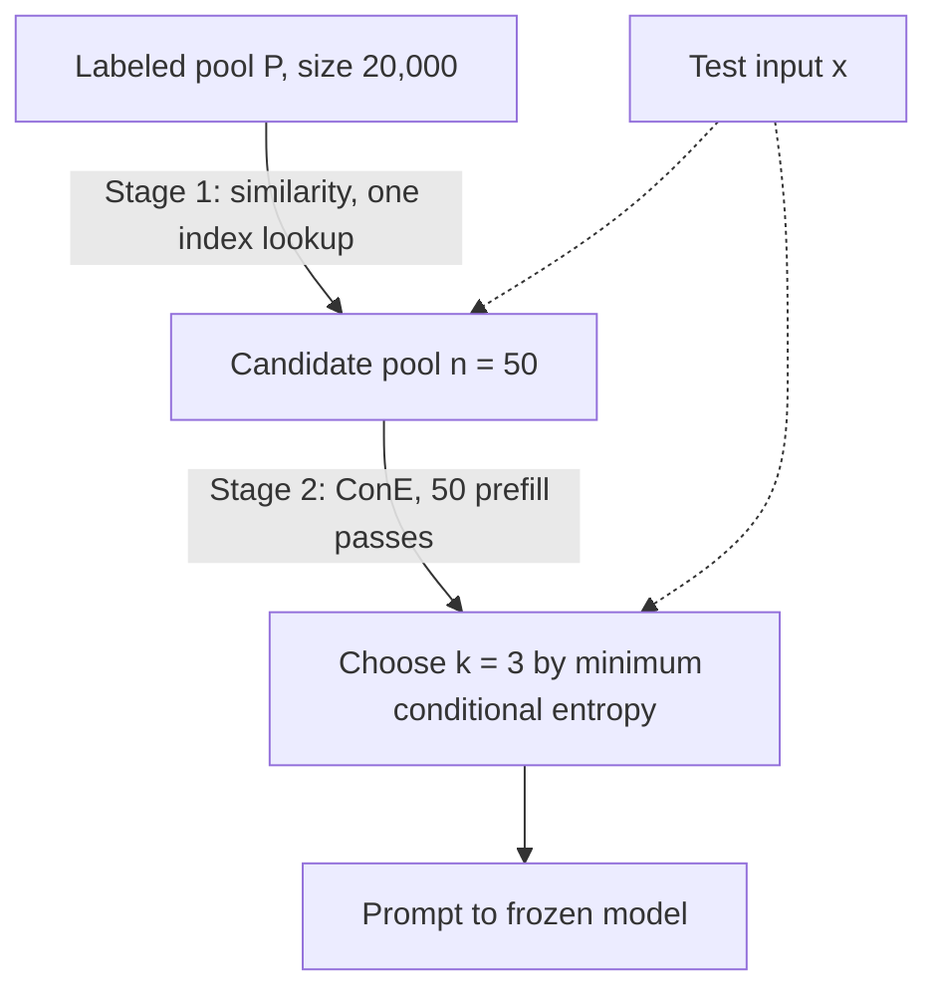
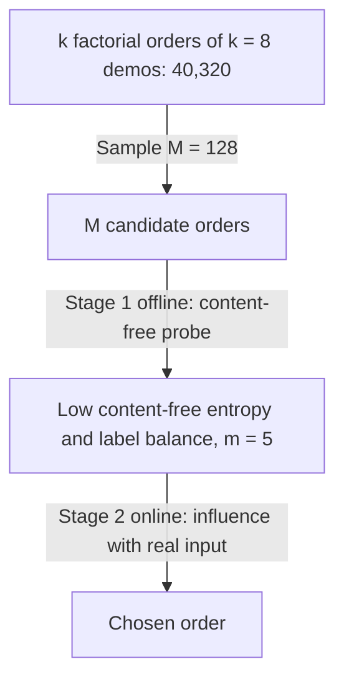
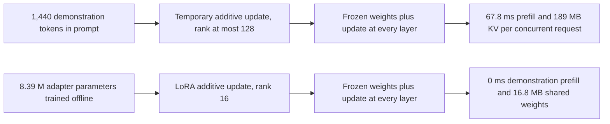

# Chapter 7: In-Context Learning - The Mechanism RAG Rides On

This chapter explains how Retrieval-Augmented Generation (RAG) uses in-context learning (ICL), when supervised fine-tuning (SFT) is the better tool, and how selection, format, order, inference theory, and cost shape the design.

## TL;DR

- SFT changes model weights once. ICL leaves the weights frozen and places examples in every prompt.

- Prompted examples consume context, latency, and serving compute on every query. A small fine-tune can become cheaper after surprisingly little traffic.

- Choose candidate examples with a cheap search, then let the generator judge which examples reduce its uncertainty about the live input.

- Format and order are measured model settings. A template or ordering that wins on one model may fail on another.

- One theory says examples help the model infer which hidden task produced the prompt. Another says attention builds a temporary update with the shape of a gradient step.

- More examples eventually stop helping. They can crowd out retrieved evidence, repeat one label, dilute one another, and still fail on tasks that need many optimization steps.

- Use fine-tuning for stable behavior. Use retrieval for missing or changing knowledge that must remain deletable and citable.

## The story

Picture a chef working at one small counter.

The chef's permanent training is the model's stored behavior.

Sending the chef to a course changes those permanent habits. That is SFT, which means training on labeled examples and changing the weights.

Placing sample dishes on the counter changes only the next order. That is ICL, which means guiding a frozen model with examples inside the current prompt.

The counter has fixed space. Every sample dish displaces ingredients that the kitchen runner retrieved for the real order.

The runner first finds plausible samples cheaply. The chef then judges which sample makes the current ticket easiest to understand.

Presentation matters. The same dish on a plate, in a bowl, or inside a box can cue different habits.

Sequence matters too. The last sample sits nearest the chef and can pull the answer toward its label.

When the chef sees several samples, the chef first infers the event being served, such as a banquet or a tasting menu. The chef then gives more weight to samples that resemble the current ticket.

The samples also rearrange the chef's temporary workspace. That rearrangement resembles a small weight update, but the kitchen rebuilds it for every order.

Adding more plates does not create a larger counter or more training steps. It can merely divide attention among more plates.

The practical choice is therefore concrete. Retrain stable habits once, keep changing facts in the ingredient store, and spend counter space only on samples that measurably help.

## Decoder table

| Technical term | Plain-English meaning | Why it matters |
|---|---|---|
| Retrieval-Augmented Generation (RAG) | A system that retrieves external evidence and places it in a model prompt | It inherits every selection, format, order, and context-limit problem of ICL |
| In-context learning (ICL) | Task behavior induced by examples inside the current prompt | It changes conditioning without changing weights |
| Supervised fine-tuning (SFT) | Training on labeled input-output pairs | It changes stable behavior once instead of paying a prompt tax forever |
| Demonstration | A worked input-output example placed before the live input | Its tokens compete directly with retrieved evidence |
| Shot | One demonstration in the prompt | Shot count controls prompt size and evidence about the task |
| Zero-shot | Answering with no demonstrations | It is the fallback when no candidate lowers uncertainty |
| Few-shot | Answering with a small demonstration set | It trades context and latency for task cues |
| Next-token predictor | A model trained to continue a token sequence | It explains why instruction following is not automatic |
| Parameter | A learned model weight | SFT changes parameters while ICL does not |
| Parametric update | A change stored in model weights | It persists across requests and can forget older behavior |
| Non-parametric conditioning | Guidance supplied in the current input | It can change per query but must be paid for per query |
| Maximum likelihood | Training that raises the probability of labeled outputs | It shapes a conditional behavior rather than an addressable fact store |
| Conditional probability | The probability of an output given an input and prefix | Both SFT and ICL try to raise the desired conditional probability |
| Floating-point operation (FLOP) | One unit of arithmetic work | The chapter uses FLOPs to compare training and serving costs |
| Prefill | Processing all prompt tokens before generation starts | Demonstrations add prefill latency on every uncached query |
| Decode | Generating output tokens after prefill | The chapter prices prefill and decode at the same approximate FLOPs per token |
| Time to first token | Delay before the first generated token appears | Demonstration prefill directly increases it |
| Context window | The fixed token capacity available to one request | Demonstrations can crowd out retrieved chunks |
| Headroom | Unused context capacity | Figure 7.1 shows demonstrations cutting it from 3,992 to 1,992 tokens |
| Prefix cache | Reused key and value states for a fixed prompt prefix | Static demonstrations can amortize, while query-selected content usually cannot |
| Key-value cache (KV cache) | Stored attention states for earlier tokens | Prompted updates occupy memory per concurrent request |
| Low-Rank Adaptation (LoRA) | A small trained additive adapter | It stores one shared update instead of rebuilding a prompt update per request |
| Catastrophic forgetting | Damage to older abilities during new training | It is an SFT risk that frozen-weight ICL avoids |
| Hallucination | Unsupported model output | Training new facts into weights can raise errors on facts previously answered correctly |
| Recall at k | Whether relevant evidence appears in the top k retrieved items | Lost context can force recall at 10 down to recall at 5 |
| Demonstration selector | A policy that chooses which examples enter the prompt | Its objective must match what moves generator accuracy |
| Candidate generator | A cheap first stage that retrieves a broad pool | It makes expensive model-side reranking feasible |
| Embedding similarity | Closeness between vector representations | It is useful for candidate generation but does not consult the consuming model |
| Best Matching 25 (BM25) | A lexical retrieval score | It supplies a cheap candidate pool before model-side scoring |
| Top-k | The k highest-scoring items | Using similarity top-k as the final selector can reward duplicates and one label |
| Reranker | A slower second stage that reorders a candidate pool | Conditional entropy is useful as a reranking score, not a corpus scan |
| Cross-encoder | A scorer that jointly processes a query and candidate | A small one can be much cheaper than the generator but may measure a different objective |
| Conditional entropy (ConE) | Average uncertainty the model retains about test-input tokens after a candidate prefix | A helpful demonstration should lower it |
| Test-input conjecture | The claim that ICL depends on the model understanding the live input | Word-shuffling experiments support this bottleneck location |
| Empty-prefix baseline | The model's uncertainty with no candidate demonstration | It supplies a zero-shot threshold rather than a ranking term |
| Label balance | Keeping selected demonstrations spread across output classes | It prevents a selector from filling the prompt with one label |
| Lexical overlap cap | A limit on near-verbatim similarity to the test input | It stops predictable duplicates from winning ConE without teaching the task |
| Subset search | Evaluating combinations of demonstrations | Its combinatorial cost makes individual scoring the practical choice |
| Template | A rule that turns content into an exact token string | It is a fitted setting for a specific model-task pair |
| FormatSpread | A budgeted sampler over plausible prompt formats | It searches a large format space without enumerating every prompt |
| Byte Pair Encoding (BPE) | A tokenization method that merges byte patterns into tokens | Small separator changes can produce different model inputs |
| Induction head | Attention behavior that matches an earlier pattern and copies what followed | Prompt separators affect the pattern ICL relies on |
| Valid-response rate | Fraction of outputs that follow the required schema | Formatting can change parseability as well as correctness |
| JavaScript Object Notation (JSON) | A structured text format often consumed by parsers | Format sensitivity can surface as JSON parse failures |
| Standard error | Expected sampling variation in an evaluation score | It prevents a lucky format winner from being mistaken for a real gain |
| Paired test | A comparison of two formats on the same examples | It can resolve differences more cheaply than independent samples |
| Continuous integration (CI) job | An automated check run when software or models change | A small format sweep can fit into each model upgrade |
| Macro F1 score | The average class-wise F1 score | It exposes large order effects even when the demonstration set is unchanged |
| Permutation | One ordering of a fixed demonstration set | k demonstrations create k factorial possible orders |
| Exchangeability | The assumption that demonstration order carries no information | Measured order sensitivity violates it |
| Content-free probe | A prompt with the test input replaced by a placeholder | Any remaining label preference measures prompt bias rather than evidence |
| Content-free prior | The label distribution produced by a content-free probe | Dividing by it can correct positional bias |
| Content-free entropy | Entropy of the label distribution under a content-free probe | DEmO uses it offline with a label-balance constraint |
| DEmO | A two-stage method for choosing a demonstration order without gold labels | It probes orders offline, then scores a short list per query |
| Influence score | The largest shift from a content-free prior to the real-input distribution | DEmO uses it to pick among shortlisted orders |
| Contextual calibration | Dividing output scores by the content-free prior | It is cheaper than per-query permutation search |
| Recency bias | Preference for labels near the end of the prompt | It explains why the last demonstration can dominate |
| Latent concept | A hidden topic, task, genre, or format that could generate a document | The Bayesian account treats demonstrations as evidence about this concept |
| Prior | Belief over concepts before seeing the prompt | Demonstrations update it into a posterior |
| Posterior | Belief over concepts after seeing prompt evidence | It concentrates on the intended task as useful demonstrations accumulate |
| Hidden Markov model | A sequence model with hidden states | Xie et al. use mixtures of these models to formalize concept inference |
| Kullback-Leibler divergence (KL divergence) | Per-example evidence that separates two distributions | It sets the exponential rate at which wrong-concept probability falls |
| Nat | A unit of information based on natural logarithms | The worked example expresses discriminating power in nats |
| Kernel regression | Prediction by a similarity-weighted local average | It describes how attention can combine demonstration labels |
| Nadaraya-Watson estimator | A normalized kernel-weighted average | One attention head has this form under the stated reading |
| Query, key, and value | Attention representations for matching and carrying information | Their products define weights and temporary updates |
| Softmax | Normalization that turns attention logits into weights | It makes demonstrations dilute rather than simply accumulate |
| Effective sample size (ESS) | The number of equally weighted examples that would give similar weight concentration | It reveals when duplicates make eight demonstrations behave like far fewer |
| Linear attention | Attention with the softmax removed | It exposes the exact algebraic link to a gradient update |
| Outer product | A rank-one matrix built from two vectors | Both accumulated gradients and linear attention sums use this shape |
| Meta-gradient | A temporary forward-pass update induced by context | It names the demonstration contribution in the gradient account |
| Gradient descent | Repeated parameter updates that reduce a loss | Linear self-attention can implement a bounded number of such steps |
| Squared-error loss | A loss based on squared prediction error | Its linear-layer gradient has the same outer-product form as linear attention |
| Ridge regression | Linear regression with a penalty on weight size | Larger trained transformers can match its closed-form predictor in synthetic settings |
| Ordinary least squares | Linear regression that minimizes squared error | Scratch-trained transformers matched it on in-context linear functions |
| Rank | Number of independent directions a matrix can express | One head's temporary update is bounded by demonstration tokens and head width |
| Depth | Number of transformer layers | It bounds the implicit step budget under the one-layer, one-step construction |
| Grouped-query attention | Attention that shares fewer key-value heads across query heads | It determines the worked KV-cache memory calculation |
| Adapter | A small trained parameter module added to a frozen model | It trades training once for shared storage and zero demonstration prefill |
| Generative Pre-trained Transformer (GPT) | The model family name used in several cited results | The chapter compares format, calibration, and ICL findings across GPT versions |
| p99 latency | The latency below which 99% of requests finish | It sets a strict serving budget for demonstration selection |

## Core mechanics

### 7.1 ICL versus SFT

#### What each method changes

A pre-trained language model predicts the next token.
Without post-training, a question can be continued as another question rather than answered.
SFT trains on labeled pairs D = {(x_i, y_i)} and moves parameters θ to raise the desired output probability.
Its objective is ordinary maximum likelihood.
The same objective can make a summarizer, entity tagger, or domain-specific answerer by changing the labeled pairs.
Ouyang et al. built the first InstructGPT stage this way with roughly 10^4 labeler-written prompts.
ICL leaves θ frozen.
It prepends k demonstrations and predicts from those pairs plus the test input.
Brown et al. made this scale-dependent behavior the headline GPT-3 result.
SFT changes the model side of the conditional probability.
ICL changes what appears on the conditioning side.
#### Why the distinction exists

SFT suits a stable behavior defect such as wrong register, wrong output schema, ignored citations, or wrong tool calls.
Retrieval suits missing or changing knowledge.
Maximum likelihood shapes a mapping. It does not create an addressable store from which one named fact can be read, deleted, versioned, or cited.
Gekhman et al. found that new knowledge inconsistent with existing model knowledge trains more slowly.
As those examples are fit, hallucination rises on facts the model previously answered correctly.
RAG is ICL with a retriever choosing the context.
Retrieved passages and demonstrations enter through the same prompt and consume the same window.
Selection, format, and order are therefore RAG engineering variables.
#### What fails without the distinction

The slogan that fine-tuning is expensive and prompting is cheap compares different ledgers.
A growing demonstration block can consume a quarter of the window and remove chunks six through ten.
Fine-tuning facts into weights also removes citation and deletion control.
If perfect retrieval would fix the answer, the defect is knowledge or ranking.
If perfect retrieval would not fix the answer, the defect is behavior.
#### Cost and complexity

Training N non-embedding parameters on D tokens costs about 6ND FLOPs.
Serving costs about 2N FLOPs per token for both prefill and decode.
A block of k demonstrations with t_d tokens each adds 2Nkt_d FLOPs to every uncached query.
An SFT run costs 6ND_SFT once.
The costs cross at Q* = 3D_SFT divided by kt_d queries.
Model size cancels because N multiplies both sides.
In the worked 8 B example, SFT costs 42 minutes and $1.76 of accelerator time.
Eight demonstrations add 94 ms and 2,000 tokens on every query.
They cost five 400-token retrieved chunks inside an 8,192-token window.
The crossover arrives after 27,000 queries, or 2.7 days at 10,000 queries per day.
A LoRA run removes roughly one third of the full-weight training FLOPs and crosses near 18,000 queries.
Static demonstrations can use a prefix cache.
Query-selected demonstrations and retrieved chunks change per request, so the chapter prices them uncached unless measured reuse machinery exists.
#### Operating rule

Use ICL while the task specification still moves.
Switch toward SFT after behavior has stayed frozen for a month.
Reconsider once demonstrations exceed roughly 10% of the context window.
Price demonstrations in lost chunks, not only in tokens or dollars.
Run at least three orderings and two formats unless the serving prompt is pinned byte for byte.
### 7.2 Demonstration selection and the test-input conjecture

#### What selection should measure

A cheap baseline embeds the live input and every candidate, then takes the nearest k examples.
Liu et al.'s KATE baseline beat random selection and became standard.
The score never consults the generator that must consume the result.
Min et al. replaced gold demonstration labels with random labels and saw only a marginal drop.
Their result says demonstrations mainly communicate label space, input distribution, and format.
Peng et al. shuffled increasing fractions of the test input while holding demonstrations fixed.
Accuracy fell at one shot and three shots.
Embedding-style lexical content stayed similar, but readability fell.
This result locates a bottleneck on the test-input side.
#### Conditional entropy criterion

For a candidate c and m-token test input x, compute the model's average token uncertainty:
H_theta(x given c) = -(1 / m) Σ from t = 1 to m of log p_theta(x_t given c and x before t).
Compare it with the empty-prefix value.
Delta(c) = H_theta(x given c) - H_theta(x given empty prefix).
Choose the candidate with minimum Delta.
The baseline is constant across candidates, so it supplies a threshold rather than changing the ranking.
If the best Delta is not below zero, the pool did not help this query.
Serve zero-shot in that case.
#### Why a two-stage funnel exists

ConE reads only the test input.
It needs no reference output, so it can score live traffic.
REPLUG instead measures how much a passage raises the probability of the reference output.
That makes REPLUG useful as a training signal but unavailable as a live selector when the output is unknown.
ConE needs one generator forward pass per candidate.
It cannot scan a corpus.
Use BM25 or embedding search to build a pool, then use ConE to rerank that pool.
Peng et al. reported gains over random, BM25, and embedding top-k pools.
The gain is therefore complementary to first-stage retriever quality.
#### What fails without constraints

Low entropy is not proof of understanding.
A near-verbatim duplicate makes test tokens predictable and can win without teaching the task.
Cap lexical overlap and enforce label balance.
Similarity also has no natural zero for saying that no candidate helps.
Using similarity as the final decision rule can collapse the prompt onto one label and many duplicates.
#### Cost and complexity

The figure's pool has 20,000 labeled items.
One similarity lookup creates 50 candidates.
Fifty ConE prefill passes select k = 3 demonstrations.
On the 8 B worked model, three random or BM25 demonstrations make a 660-token prefill and a 40-token answer.
That answer costs 1.12 x 10^13 FLOPs and 33 ms.
Fifty ConE passes cover 300 tokens each and cost 2.4 x 10^14 FLOPs or 706 ms.
Total latency reaches 739 ms.
Selection costs 21 times the answer.
Scoring all C(50, 3) = 19,600 subsets takes 609 seconds per query.
Individual scoring takes about 0.7 seconds.
Putting all 50 candidates directly in the prompt processes 9,120 tokens and takes 429 ms.
It is cheaper than reranking because individual passes repeatedly encode the test input.
It still loses on quality and consumes 9,000 tokens needed for evidence.
A 110 M-parameter cross-encoder scores 50 candidates in 9.7 ms.
Its ranking must be distilled against the generator's Delta because it no longer measures the generator directly.
#### Operating rule

Start with n = 20 candidates and k = 3 selected demonstrations.
At the worked scale, each candidate costs about 14 ms.
Twenty cost 282 ms and five cost 71 ms.
Measure the Delta distribution before building the selector.
If even the best member of a 50-deep pool barely lowers entropy, use a fixed cached demonstration block.
Never search subsets online.
### 7.3 Format sensitivity

#### What format changes

A template maps the same chunks, input, and labels to one exact token string.
Two templates can mean the same thing to a human and still produce very different model behavior.
The chapter's modest grammar has six independent slots.
Their counts are 5, 3, 4, 4, 4, and 3.
They create 2,880 semantically equivalent prompts.
Adding instruction wording and chunk numbering pushes the space above 10^4.
Sclar et al.'s FormatSpread samples this space with a bandit-style method.
It spends more budget in promising regions instead of running the full grid.
#### Why sensitivity exists

There is no privileged formatting channel.
Separators, brackets, labels, and evidence all enter as tokens.
Demonstrations transmit format as part of their payload.
BPE tokenization gives different token sequences to a colon, a colon plus a space, and a doubled colon.
Induction heads match earlier patterns and copy what followed.
A rare separator creates a rare matching key and can weaken that copying behavior.
Format is therefore a hyperparameter of the model-task pair.
It is not a universal property of the task.
#### Evidence and failure

Sclar et al. measured a 76-point spread between semantically equivalent formats on LLaMA-2-13B.
The spread persisted at 70 B and in GPT-3.5.
A Japanese-template classification result placed GPT-4 at 49% under one template and 25.44% under another with the same meaning.
Formatting also changes valid-response rate.
A JSON parse alarm can therefore be a format regression rather than a model-quality regression.
More demonstrations can reduce sensitivity without removing it.
An inherited paper template or old model template is an unmeasured sample.
Rankings do not transfer reliably across models.
#### Cost, noise, and complexity

The worked sweep uses an 8 B model and 250 labeled queries.
Each query processes 620 tokens.
One format therefore processes 155,000 tokens.
All 2,880 formats cost 4.46 x 10^8 tokens, 7.14 x 10^18 FLOPs, and 5.8 accelerator hours.
A 20-format sample costs 3.1 x 10^6 tokens, 4.96 x 10^16 FLOPs, and 146 seconds.
At 70% accuracy on 250 examples, one score has a standard error of 2.9 points.
The best of 20 equally good formats wins by about 5.4 points through luck alone.
The expected best-minus-worst range is about 10.8 points.
A six-point win is not a result at that sample size.
Resolving a true two-point difference at 95% confidence with independent samples needs about 4,000 examples.
A paired test on the same examples can be cheaper.
The published 76-point spread is about seven times the 10.8-point noise range.
#### Operating rule

Sweep 15 to 25 formats for every model-task pair and every generator version bump.
Track valid-response rate beside accuracy.
Reject a format if more than 1% of outputs are unparseable.
Use a held-out set or paired test before shipping a winner.
Keep evidence in a cacheable prefix unless a question-first template wins beyond the noise range.
Version the exact format string with its evaluation baseline.
### 7.4 Ordering and content-free calibration

#### Why order is a real variable

One refactor changed only the order of eight demonstrations.
Macro F1 fell from 0.78 to 0.69.
Eight examples have 8! = 40,320 arrangements.
Lu et al. found accuracy ranging from near chance to near state of the art across permutations of one fixed set.
The best order did not transfer across models.
Larger models did not remove the variance.
Exchangeability predicts that order should not matter.
The observation falsifies that assumption for real prompts.
#### Why search loses

Four examples have 24 orders.
Ten have 3,628,800.
Selecting and ordering k from n creates n! divided by (n - k)! possibilities.
For n = 50 and k = 8, the space is about 2.2 x 10^13.
A development-set winner may not be best for the live query.
Per-query order changes also invalidate the prefix cache from the first swapped demonstration.
#### DEmO

DEmO replaces the live input with a content-free placeholder such as not applicable (N/A) or a mask token.
It measures the label distribution when there is nothing to classify.
Any variation across orders is positional artifact.
Stage 1 samples orders offline.
It keeps low content-free entropy orders under a label-balance constraint.
Entropy alone would choose orders already committed to one label.
Stage 2 runs on the real input.
It chooses the shortlisted order that moves the model furthest from its own content-free prior.
This score needs no gold label.
#### Contextual calibration

Zhao et al. keep one order and estimate p_cf from content-free probes.
They divide each real-input label score by the corresponding p_cf value.
They reported up to 30.0 absolute accuracy points on GPT-3 and GPT-2.
They also reduced variance from format, selection, and order.
The diagnosis includes majority-label bias, common-token bias, and recency bias.
Recency bias gives later demonstration labels extra influence.
Content-free does not mean empty.
N/A, an empty string, and a mask token can produce different priors.
Average several fixed probes and version them with the model.
#### Cost and worked correction

One order pass processes 1,560 tokens and costs 73.4 ms on the worked 8 B model.
All 40,320 orders take 49 minutes, 1.006 x 10^18 FLOPs, or $18.87 of hosted input tokens per query.
DEmO stage 1 samples 128 orders offline and costs 8.7 seconds.
Stage 2 evaluates five survivors online and costs 367 ms per query.
A fixed-order content-free probe costs 68 ms once.
Per query, calibration then needs four divisions.
The worked prior is (0.52, 0.24, 0.16, 0.08) against uniform 0.25.
Label A starts with 2.08 times its uniform mass.
The raw query distribution is (0.41, 0.38, 0.13, 0.08), which predicts A by 0.03.
Division gives (0.788, 1.583, 0.813, 1.000).
Renormalization gives (0.188, 0.378, 0.194, 0.239), which predicts B.
A frozen cached order prefills only the 120-token input in 5.7 ms.
Calibration is 65 times cheaper per query than the five-order stage 2.
#### Operating rule

Freeze one prefix-cached order and apply content-free calibration for finite-label tasks.
Treat a label above roughly twice uniform as bias that needs correction.
Balance labels across positions and inspect the tail of the block for recency bias.
Report accuracy across 10 random orders unless the serving prompt is byte-identical.
For free-form generation, a finite label distribution does not exist.
Probe a constrained first-token decision if one exists, choose an order offline, and measure the spread.
### 7.5 Bayesian and kernel accounts

#### Bayesian concept inference

Pre-training data is a mixture of topics, genres, tasks, and formats.
Treat each document as emitted by a latent concept drawn from a prior.
The model predicts by averaging concept-specific predictions under a posterior conditioned on the prompt.
The prompt supplies evidence about which concept generated the text.
Xie et al. formalized this with a mixture of hidden Markov models.
Demonstrations separated by delimiters may be improbable as natural documents.
Their evidence can still accumulate faster than the bounded transition penalty.
The posterior then converges toward the Bayes-optimal predictor for the shared concept.
#### Exponential evidence

Log posterior odds equal prior log odds plus a sum of demonstration log-likelihood ratios.
Each demonstration from the intended concept contributes expected KL divergence D nats against a competitor.
Wrong-concept mass falls approximately as e^(-kD).
Returns are log-linear rather than linear.
The useful quantity is D, the example's discriminating power.
An example that every plausible concept could emit has D near zero and still pays full prefill cost.
Format quality and shot count can substitute for each other.
#### Kernel regression

At the answer position, attention compares the live query representation with demonstration keys.
Softmax converts those comparisons into normalized weights.
Values carry demonstration information such as labels.
The resulting weighted average has the Nadaraya-Watson form under a kernel induced by the model.
Han et al. argued for this correspondence in large language models.
With few examples, the broad posterior and pre-trained prior dominate.
With more examples, the posterior concentrates and prediction becomes more local.
#### What the theories explain and miss

The demonstrations identify which task is intended.
They need not teach the literal input-to-label map.
Min et al. found random labels cost only a few points across 12 datasets.
Removing the label space or replacing inputs with out-of-distribution text hurt more.
The Bayesian account describes an effective computation rather than the circuit that implements it.
It assumes exchangeability, which order sensitivity contradicts.
Pure kernel averaging cannot create a reasoning chain absent from all demonstrations.
Scrambling labels should pull a strong kernel average toward uniform, yet the observed drop is small.
That result weakens literal local averaging and leaves concept identification standing.
#### Cost and worked posterior

The worked prior odds are 50 to 1 against the intended concept.
To push wrong-concept mass below 5%, kD must exceed ln(950) = 6.856 nats.
At D = 1.2 nats, six demonstrations cross the threshold.
Wrong-concept mass is 29.2% at k = 4, 3.60% at k = 6, 0.34% at k = 8, and 0.0028% at k = 12.
Moving from eight to twelve buys 0.33 points for 720 tokens and 33.9 ms.
At D = 0.35 nats, twenty demonstrations reach the same target.
They require 3,600 prefill tokens and 169.6 ms instead of 1,080 tokens and 50.9 ms.
That is 3.3 times the prefill.
#### Duplicate weights

The worked block has eight demonstrations.
Three near-duplicates labeled A have attention logit 4.0.
Five diverse examples have logit 2.0 and labels B, B, C, D, A.
The unnormalized weights are e^4 = 54.60 and e^2 = 7.389.
Their sum is 200.74.
Each duplicate receives 0.272 of the mass.
Label A receives 85.3% in total.
ESS falls to 4.4 despite paying for eight demonstrations.
Capping the duplicate cluster at one drops A to 67.7%.
The figure reports ESS = 2.6 of 6 after that cap.
#### Operating rule

Start with four to eight demonstrations.
Treat a request for 32 as a possible format, coverage, or diversity problem.
For classification, k must at least cover the label count when the kernel can only average labels that appear.
Cluster the pool and cap one example per near-duplicate group unless frequency represents a real prior.
Alert when ESS falls below k divided by 2.
Sweep k in {2, 4, 8, 16} and inspect the slope.
A curve that is flat from k = 2 can indicate that the required concept is absent from the pre-training mixture.
### 7.6 Gradient descent as inference

#### The algebraic identity

Remove the softmax from one attention head.
For context representation x_i, the value projection W_V x_i and key projection W_K x_i form an outer product.
Summing across tokens creates a matrix that acts on the query q.
Split ordinary context tokens from demonstration tokens.
The demonstration tokens contribute an additive matrix Delta W_ICL.
Gradient descent on a linear layer under squared error also accumulates error-input outer products.
Under the linear-attention identification, the two objects are the same algebraic shape.
Irie et al. established the dual form.
Dai et al. called the demonstration contribution a meta-gradient produced during the forward pass.
#### Evidence for the mechanism

Von Oswald et al. constructed weights for which one linear self-attention layer executes exactly one gradient step on least squares.
Models trained on those tasks converged toward that construction.
Akyurek et al. found small trained transformers matching one gradient step.
At larger scale, their models matched closed-form ridge regression.
Garg et al. trained transformers from scratch to learn linear functions in context at accuracy comparable with ordinary least squares.
The targets were continuous and unavailable for direct copying.
#### Limits and failure modes

The exact identity requires linearized attention.
Served transformers use softmax, so the relationship is approximate.
With comparable logits, k demonstrations each receive about 1 divided by k of the attention mass.
Moving from k = 8 to k = 32 cuts each share from 12.5% to 3.1%.
Prefill still rises from 1,440 to 5,760 tokens.
Demonstrations dilute rather than simply accumulate.
Per-head update rank is at most the smaller of demonstration-token count m and head width d_h.
Rank can saturate inside the first demonstration.
The implicit step budget is bounded by depth, not shot count.
Shen et al. found ICL and gradient descent diverging on ordinary pre-trained language models, including order sensitivity.
Deutch et al. found that untrained transformers can score similarly on gradient-similarity metrics.
Treat those plots as hypotheses rather than mechanism evidence.
#### Worked capacity and residency

The worked 8 B model has width 4,096, 32 layers, 32 attention heads of width 128, and eight key-value heads.
Eight 180-token demonstrations make 1,440 tokens and 67.8 ms of prefill.
One head's temporary update lives in a 128 by 128 space.
Its maximum rank is 128.
It reaches that ceiling after 128 tokens, or 71% of one demonstration.
A 32-layer stack has at most 32 implicit steps under the construction.
An explicit fine-tune with 1,000 examples, batch size 8, and three epochs has 375 steps.
That is 11.7 times more.
Each token stores 2,048 key-value numbers per layer in the worked grouped-query shape.
Across 32 layers at two bytes per number, that is 131,072 bytes or 128 KiB per token.
The 1,440-token block occupies about 189 MB per concurrent request.
A rank-16 LoRA on query and output projections across all 32 layers has 8.39 million parameters.
It occupies 16.8 MB in half precision and is shared by all requests.
The prompt copy uses about 11 times the memory and adds 67.8 ms each time.
#### Operating rule

Prefix-cache a static demonstration block before distilling it.
At 10,000 requests per day, caching the 67.8 ms block recovers 11.3 accelerator minutes daily.
If demonstrations change per query, the cache misses.
Treat depth as the ceiling on in-context task difficulty.
Use an explicit reasoning scaffold or fine-tune when a multi-step task has a flat k-sweep.
Cap demonstrations near eight for classification-shaped tasks and spend marginal context on evidence.
Convert a prompt into weights by training or distillation, not by algebra alone.
Keep the prompt when tasks change faster than retraining can follow.
## Diagrams

### Table 7.1

| Axis | SFT | ICL |
|---|---|---|
| What it changes | θ (parametric) | the conditioning (non-parametric) |
| When you pay | once, 6ND_SFT | every query, 2Nkt_d |
| Edit latency | label, train, evaluate | rewrite the prompt |
| Forgetting | catastrophic forgetting is a risk | none. Weights untouched |
| Capacity ceiling | labeled data and compute | the context window |
| Dominant variance | data mix and seed | demo choice, format, order |
| Right tool for | wrong behavior, register, format | missing or changing knowledge |

> Table 7.1: The two methods differ on when the bill arrives and on what fails when they are misapplied - which is why the deciding question is not cost but whether the defect is one of behavior or one of knowledge.

### Figure 7.1

```text
(a) Context window, 8,192 tokens

Fine-tuned theta prime, no demonstrations, prompt = 4,200
[ question + instructions + 10 chunks = 4,200 ][ headroom = 3,992 ]

Frozen theta, k = 8 demonstrations, prompt = 6,200
[ 8 demos = 2,000 ][ question + instructions + 10 chunks = 4,200 ][ 1,992 ]
0                                                                            8,192

(b) Cumulative FLOPs

ICL, 3.2 x 10^13 FLOPs per query
^                                                /
|                                              /
| SFT, one-time 8.64 x 10^17 FLOPs ---------o
|                                           /  Q* = 27,000 queries
|                                         /    about 2.7 days at 10^4 per day
|                                       /
+---------------------+-----------------------+----> queries served
                      27,000                  54,000
```

> Figure 7.1: (a) Demonstrations and retrieved passages compete for one window, so an 8-demo block at 250 tokens each costs exactly five 400-token chunks of head-room. (b) The one-time fine-tuning cost is constant in query volume while the demonstration tax is linear, so the two cross once - here after 27,000 queries, under three days of traffic.

### Figure 7.2



```text
(b) ICL accuracy
high  *  3-shot
      |\
      | \        *
      |  \        \
      *---\--------*  3-shot
      |    \        \
      |     \--------  1-shot
low   +----------------------> fraction of test-input words shuffled
      0                      1

Both trends fall. The magnitudes are schematic.
```

> Figure 7.2: (a) Demonstration selection is retrieve-then-rerank with the generator as the reranker: a cheap similarity stage builds a pool, and one prefill pass per candidate picks the demonstrations that minimize the model's conditional entropy on the test input. (b) Corrupting only the test input, while holding the demonstrations fixed, degrades ICL accuracy at both 1 and 3 shots - the experiment that locates the bottleneck on the test-input side (Peng et al., 2024). The trend is the finding. The magnitudes here are schematic.

### Figure 7.3

| Surface-form slot | Choices | Count |
|---|---|---:|
| field separator | colon, colon plus space, dash, tab, doubled | 5 |
| descriptor casing | lower, Title, UPPER | 3 |
| value wrapper | none, quotes, brackets, backticks | 4 |
| demo separator | newline, blank line, space, rule | 4 |
| label verbalizer | positive, Positive, 1, P | 4 |
| template style | plain, markdown, JSON | 3 |

Semantically equivalent prompts: 5 x 3 x 4 x 4 x 4 x 3 = 2,880.

| Rank, better to worse | Model M1 | Model M2 |
|---:|---|---|
| 1 | format A | format B |
| 2 | format B | format C |
| 3 | format C | format D |
| 4 | format D | format A |

> Figure 7.3: (a) Six independent surface-form slots, none of them exotic, already generate 2,880 prompts with identical meaning - which is why format selection is a search problem under budget rather than a style choice. (b) Rankings over that space do not transfer: the format that wins on one model can sit at the bottom on another, so an inherited template is an unmeasured sample. The crossing pattern is the finding. The specific ranks here are schematic.

### Figure 7.4



| Label | Content-free p_cf | Raw p given x | Divide by p_cf | Calibrated q given x |
|---|---:|---:|---:|---:|
| A | 0.52 | 0.41 | 0.788 | 0.188 |
| B | 0.24 | 0.38 | 1.583 | 0.378 |
| C | 0.16 | 0.13 | 0.813 | 0.194 |
| D | 0.08 | 0.08 | 1.000 | 0.239 |

Uniform reference: 1 divided by 4 = 0.25. The raw winner is A. The calibrated winner is B.

> Figure 7.4: Both defenses against ordering bias probe the prompt with the test input deleted. (a) DEmO shortlists permutations offline by content-free entropy under a label-balance constraint, then ranks the survivors per query by how far each moves the model off its own content-free prior. (b) The same probe supports the cheaper fix: with no content in the prompt the label distribution should be uniform, so the gap between p_cf and the dashed 1/|Y| line is the prompt's positional bias - dividing it out flips this query's prediction from A to B. The probabilities are the worked example's.

### Figure 7.5

| Demonstrations k | Wrong-concept mass at D = 1.2 nats |
|---:|---:|
| 4 | 29.2% |
| 6 | 3.60% |
| 8 | 0.34% |
| 12 | 0.0028% |

The D = 0.35 curve reaches the same 5% reference near k = 20. The D = 1.2 curve reaches it at k = 6.

| Duplicate treatment | Demonstrations represented | Kernel mass on A | ESS |
|---|---:|---:|---:|
| Three near-duplicates retained | 8 | 85.3% | 4.4 of 8 |
| Duplicate cluster capped at one | 6 | 67.7% | 2.6 of 6 |

> Figure 7.5: Evidence accumulates exponentially and then averages locally. (a) Posterior mass on the wrong concept falls as e^(-kD), so a format that raises per-demonstration discriminating power from 0.35 to 1.2 nats reaches the same 5% residual ambiguity at k = 6 instead of k = 20 - shot count is a substitute for format quality, at 3.3× the prefill. (b) The same softmax that averages the demonstrations counts three near-duplicates three times, putting 85.3% of the kernel mass on label A before the query is read. Capping the cluster at one drops that to 67.7% and exposes how much of the remaining mass rides on a single neighbor.

### Figure 7.6



| Update path | Optimization-step budget |
|---|---:|
| Implicit, one per layer | at most 32 |
| Explicit SFT, 1,000 examples x 3 epochs, batch 8 | 375 |

> Figure 7.6: Prompting and adapter fine-tuning build updates of the same algebraic shape and pay for them in different currencies. (a) The demonstration block's contribution to one head is an additive, rank-bounded matrix rebuilt on every request and carried as 189 MB of KV cache per concurrent request. A rank-16 LoRA is the same kind of additive term, trained once and shared across every request at 16.8 MB. (b) What the prompt cannot buy is optimization steps: one linear self-attention layer executes at most one gradient step, so a 32-layer stack has a step budget an order of magnitude below a modest fine-tune - which is why raising the shot count does not make a multi-step task learnable in-context.

## Whiteboard pack

### What to draw

1. Draw one large rectangle labeled context window.

2. Put retrieved passages on the left and demonstrations beside them to show their competition for space.

3. Draw a fork below it. Label one branch SFT changes weights once and the other ICL changes each prompt.

4. On the ICL branch, draw cheap retrieval into a candidate pool, then generator-side entropy reranking.

5. Add three small knobs labeled format, order, and shot count.

6. Under order, draw a content-free probe leading to a bias vector and division.

7. Under shot count, draw a falling e^(-kD) curve that flattens.

8. Finish with two update boxes. Label one temporary prompt update per request and one shared trained adapter.

### Spoken script

RAG works because the model can change behavior from what sits in its current context, even while its weights stay frozen. Demonstrations and retrieved passages use the same limited window, so I price examples in lost evidence, latency, and repeated compute. I retrieve a candidate pool cheaply, then let the generator rerank examples by how much they reduce uncertainty about the live input. I also measure format and order because both can move accuracy sharply. More shots eventually saturate. They identify the task and build a temporary update, but they cannot create more context, more depth, or unlimited optimization steps.

## Interview traps

### 1. When would you fine-tune instead of adding demonstrations?

Fine-tune stable behavior such as format, register, or tool use, and keep changing knowledge in a retrievable datastore because it remains citable, versioned, and deletable.

A prompt changes in minutes, while training needs labels and evaluation. However, a permanent demonstration tax can cross the one-time fine-tune after only 27,000 queries in the worked case.

### 2. Why not choose the most similar few-shot examples?

Similarity is a cheap recall-oriented first stage, but it does not ask whether the consuming generator finds the live input easier after seeing the example.

Rerank a small pool by generator-side conditional entropy, then constrain lexical overlap and label balance. The trade-off is one expensive prefill pass per candidate, so never use this score to scan the full corpus.

### 3. Does demonstration order matter, and should you search it?

Order matters enough to move a fixed eight-example set from near chance to near state of the art, and eight examples already create 40,320 permutations.

Do not search them per query. Instead, freeze one prefix-cached order and divide output scores by a content-free prior when the task has a finite label set.

### 4. If ICL resembles gradient descent, why not keep adding examples?

The exact identity holds for linearized attention and constrains the update's shape, but softmax attention dilutes each example while per-head rank and depth impose hard limits.

More examples can therefore add prefill without adding expressive rank or optimization steps. A rising held-out k-sweep can override this expectation, but the measurement must show it.

### 5. A model upgrade drops accuracy while retrieval is unchanged. What do you test first?

Check parse and refusal rates before sweeping the same small format set on both models over the same examples. Compare best-format with best-format, not the old tuned template with an untuned new model.

Keep a house template for maintainability unless a per-model override clears sampling noise on a held-out comparison.

## Key numbers

| Topic | Number, formula, or threshold | Meaning |
|---|---|---|
| InstructGPT SFT scale | order 10^4 prompts | Approximate size of the labeler-written supervised split |
| SFT objective | maximize the sum of log p_theta of each target token given its input and earlier target tokens | Maximum-likelihood update over labeled pairs |
| ICL prediction | choose y that maximizes p_theta of y given k demonstrations and test input x | Frozen-weight conditioning rule |
| SFT compute | about 6ND_SFT FLOPs | One-time training cost |
| Serving compute | about 2N FLOPs per token | Approximate prefill and decode cost |
| Demonstration tax | 2Nkt_d FLOPs per query | Uncached recurring ICL cost |
| Breakeven | Q* = 3D_SFT divided by kt_d | Query count where recurring prompt compute equals SFT compute |
| Opening failure | one third of answers rejected | Behavior fails even when retrieval and citations are correct |
| Prompt-growth story | 6 weeks, 8 examples, 10,000 daily queries | Demonstrations grow into a recurring production cost |
| Lost context story | one quarter of the window, chunks 6 through 10 | Examples displace evidence |
| Figure 7.1 fine-tuned prompt | 4,200 tokens | Question, instructions, and 10 chunks |
| Figure 7.1 fine-tuned headroom | 3,992 tokens | Space left in an 8,192-token window |
| Figure 7.1 ICL prompt | 6,200 tokens | Adds eight demonstrations totaling 2,000 tokens |
| Figure 7.1 ICL headroom | 1,992 tokens | Space left after demonstrations |
| Figure 7.1 crossover | 27,000 queries | Point where the two compute lines cross |
| Figure 7.1 traffic time | about 2.7 days at 10^4 queries per day | Time to breakeven |
| Worked generator | 8 B parameters | Model used throughout the cost examples |
| Worked retrieval | 10 chunks x 400 tokens | 4,000 retrieved tokens per query |
| Other query tokens | 200 input and 300 output | Total input and output becomes 4,500 without demonstrations |
| Sustained throughput | 3.4 x 10^14 FLOP per second | Accelerator constant used by the chapter |
| Accelerator price | $2.50 per hour | Cost constant for the first worked example |
| SFT data | 10,000 pairs x 600 tokens x 3 epochs | D_SFT = 1.8 x 10^7 tokens |
| SFT run | 8.64 x 10^17 FLOPs | 2,541 seconds, 42 minutes, and $1.76 |
| Baseline serving | 7.20 x 10^13 FLOPs per query | $0.147 per thousand queries |
| ICL demonstrations | 8 x 250 = 2,000 tokens | 24% of the 8,192-token window and five 400-token chunks |
| ICL serving | 1.04 x 10^14 FLOPs per query | 1.44x baseline and $0.212 per thousand |
| Marginal ICL | 3.2 x 10^13 FLOPs per query | 94 ms added time to first token |
| LoRA training approximation | about 4ND_SFT | Removes roughly one third of full-weight training FLOPs |
| LoRA breakeven | 1.8 x 10^4 queries | Under two days at the worked traffic |
| Pre-training cross-check | 20 tokens per parameter | An 8 B model uses 1.6 x 10^11 tokens |
| Pre-training compute | 7.68 x 10^21 FLOPs | Fine-tune is 1.1 x 10^-4, about one part in 9,000 |
| Practical ICL threshold | roughly 10% of the window | Point to reconsider a permanent demonstration block |
| Specification stability | frozen for 1 month | Practical point for moving from ICL toward SFT |
| Parser case | 1 or 2 format demonstrations | Can move a 30% JSON failure rate toward zero in the stated example |
| Behavior examples | 40 tools or 30 report sections | Cases that may not fit as demonstrations |
| Evaluation spread | at least 3 orders and 2 formats | Minimum recommended prompt variation check |
| Selection story | 3 examples from 20,000 tickets | Initial triage example |
| Embedding gain | half a point | Change described as inside the noise band |
| Test-input probe | 1 shot and 3 shots | Both degrade as shuffled-word fraction rises |
| ConE zero-shot gate | best Delta(c) below 0 | No negative candidate means the pool does not help |
| Conditional entropy | H_theta(x given c) = negative mean token log probability under candidate c | Generator-side test-input uncertainty |
| ConE score | Delta(c) = H_theta(x given c) minus H_theta(x given empty prefix) | Candidate ranking and zero-shot gate |
| Figure 7.2 funnel | 20,000 to 50 to 3 | Pool size, candidate count, and selected count |
| Selection input lengths | 120-token test, 180-token demonstration, 40-token answer | Worked ConE sizes |
| Random or BM25 prompt | 660 prefill plus 40 decode tokens | 1.12 x 10^13 FLOPs and 33 ms |
| ConE candidate pass | 300 tokens and 4.8 x 10^12 FLOPs | One candidate cost |
| ConE top-50 | 2.4 x 10^14 FLOPs and 706 ms | Total becomes 739 ms |
| Selection ratio | 21x | Selector cost relative to answering |
| Subset space | C(50, 3) = 19,600 | Each subset needs a 660-token pass |
| Subset cost | 2.07 x 10^17 FLOPs and 609 seconds | About ten minutes per query |
| Stuff all 50 | 9,120 tokens, 1.46 x 10^14 FLOPs, 429 ms | Cheaper compute but consumes 9,000 demo tokens |
| Re-encoding ratio | 15,000 divided by 9,120 = 1.65 | Why individual scoring costs more than stuffing |
| Small scorer | 110 M parameters | 6.6 x 10^10 FLOPs per pair and 9.7 ms for 50 |
| Scorer ratio | 72.8 measured versus 72.7 parameter ratio | Arithmetic cross-check |
| Default selector | n = 20 and k = 3 | Recommended starting funnel |
| Candidate latency | about 14 ms each | n = 20 costs 282 ms and n = 5 costs 71 ms |
| Latency scenario | p99 falls from 800 ms to 250 ms | Interview trade-off between selector, chunks, and zero-shot |
| Chunk-cut proposal | 10 chunks to 4 | Retrieval recall cost considered in that scenario |
| Format slots | 5 x 3 x 4 x 4 x 4 x 3 | 2,880 equivalent prompts |
| Format accuracy story | 71% to 65% exact match | Same corpus, top-5 chunks, and prompt after a model swap |
| Format-space formula | size of T = 5 x 3 x 4 x 4 x 4 x 3 | Six independent surface-form choices |
| Expanded format space | above 10^4 | Result after adding more phrasing and numbering choices |
| Published spread | 76 accuracy points | LLaMA-2-13B format spread |
| Larger models | 70 B, GPT-3.5 | Format sensitivity persists |
| GPT-4 formats | 49% versus 25.44% | Same-meaning Japanese templates |
| Format evaluation | 250 queries, 620 tokens each | 155,000 tokens per format |
| Exhaustive format grid | 4.46 x 10^8 tokens and 7.14 x 10^18 FLOPs | 21,007 seconds or 5.8 hours |
| Sampled sweep | 20 formats | 3.1 x 10^6 tokens, 4.96 x 10^16 FLOPs, 146 seconds |
| Format standard error | 2.9 points at p = 0.70 and n = 250 | Single-format sampling noise |
| Best-of-20 luck | about 1.87 standard errors or 5.4 points | Expected winner advantage with equal formats |
| Noise range | about 3.74 standard errors or 10.8 points | Expected best-minus-worst spread |
| Standard-error formula | square root of p times (1 minus p) divided by n | Gives 0.029 at p = 0.70 and n = 250 |
| Independent-sample formula | n at least 1.96 squared x 2p(1-p) divided by 0.02 squared | About 4,000 examples for a two-point gap |
| Two-point resolution | about 4,000 independent examples at 95% confidence | Sample size estimate |
| Practical sweep | 15 to 25 formats | Recommended model-upgrade search |
| Parse failure gate | more than 1% | Makes a format ineligible |
| Interpretable subgrid | 5 separators x 4 verbalizers = 20 | Exhaustive factor check inside the larger format space |
| Router scenario | 3 generators and a 4-point claimed win | Four points on 250 examples is inside best-of-20 noise |
| Order regression | macro F1 0.78 to 0.69 | Same examples, template, and model with new order |
| Order spaces | 4! = 24, 8! = 40,320, 10! = 3,628,800 | Factorial growth |
| Select-and-order space | 50! divided by 42! is about 2.2 x 10^13 | n = 50 and k = 8 |
| Content-free entropy | H_cf(pi) = negative sum over vocabulary probabilities times their logs | Offline order score with no live content |
| DEmO influence | maximum label shift from content-free probability to real-input probability | Online score over shortlisted orders |
| Calibration formula | q(y given x) proportional to p_theta(y given order and x) divided by p_cf(y) | Diagonal content-free correction |
| Contextual calibration result | up to 30.0 absolute points | Reported GPT-3 and GPT-2 gain |
| Order worked prompt | 8 x 180 = 1,440 tokens | Test input is 120, labels are 4, answer is 1 token |
| One order | 1,560 tokens, 2.496 x 10^13 FLOPs, 73.4 ms | Candidate permutation pass |
| All eight-order permutations | 6.29 x 10^7 tokens and 1.006 x 10^18 FLOPs | 2,960 seconds or 49 minutes |
| DEmO stage 1 | M = 128 and 1,444 tokens each | 184,832 tokens, 2.96 x 10^15 FLOPs, 8.7 seconds offline |
| DEmO stage 2 | m = 5 | 367 ms per query versus 73.5 ms to answer once |
| Fixed calibration probe | 1,444 tokens and 68 ms | Paid once |
| Content-free prior | 0.52, 0.24, 0.16, 0.08 | Uniform reference is 0.25 and A is 2.08x uniform |
| Raw distribution | 0.41, 0.38, 0.13, 0.08 | Raw winner A has margin 0.03 |
| Divided values | 0.788, 1.583, 0.813, 1.000 | Elementwise correction |
| Calibrated distribution | 0.188, 0.378, 0.194, 0.239 | Winner flips to B |
| Cached input prefill | 120 tokens and 5.7 ms | Frozen demonstration block is reused |
| Calibration saving | 65x | Compared with five-order online search |
| Hosted input price | $0.30 per million tokens | 62,899,200 tokens cost $18.87 per query |
| One answer price | $0.00047 | Hosted-token comparison |
| Bias flag | roughly 2x uniform | Practical probe threshold |
| Probe set | N/A, empty string, and mask token | Three content-free choices to average |
| Order reporting | 10 random orders | Recommended spread estimate |
| Wrong-concept decay | e^(-kD) | D is per-demo KL evidence in nats |
| Bayesian marginal | prediction equals the concept-specific prediction averaged under the posterior | Prompt changes the posterior over latent concepts |
| Posterior log odds | prior log odds plus the sum of demonstration log-likelihood ratios | Evidence adds linearly in log space |
| Random-label evidence | 12 datasets | Gold-label replacement costs only a few points |
| Prior odds | 50 to 1 against intended concept | Worked Bayesian starting point |
| Residual target | below 5% | Requires kD greater than ln(950) = 6.856 |
| Strong format | D = 1.2 nats | Six demos reach the target |
| Strong-format masses | 29.2%, 3.60%, 0.34%, 0.0028% | Values at k = 4, 6, 8, and 12 |
| Extra shots | k = 8 to 12 | 0.33 points for 720 tokens and 33.9 ms |
| Weak format | D = 0.35 nats | Twenty demos reach the target |
| Weak-format prefill | 3,600 tokens and 169.6 ms | Versus 1,080 tokens and 50.9 ms, or 3.3x |
| Duplicate logits | 3 at 4.0 and 5 at 2.0 | Labels are A,A,A and B,B,C,D,A |
| Kernel weights | e^4 = 54.60 and e^2 = 7.389 | Total is 200.74 |
| Kernel formula | K(x, x_i) = exp of query-key similarity divided by square root of head width | Model-induced similarity weight |
| Kernel prediction | weighted sum of labels divided by total kernel weight | Nadaraya-Watson form |
| ESS formula | square of total weight divided by sum of squared weights | Converts concentrated weights into effective examples |
| Duplicate mass | 0.272 each | Label A reaches 85.3% |
| Duplicate ESS | 4.4 of 8 | 1,440 tokens and 67.8 ms were paid |
| Effective cost | 15.4 ms per effective demo | Derived in the worked example |
| Deduplicated mass | 61.99 divided by 91.54 = 67.7% | Figure ESS becomes 2.6 of 6 |
| Shot default | k from 4 to 8 | Classification-shaped starting range |
| ESS alert | below k divided by 2 | Duplicate-concentration threshold |
| Shot sweep | 2, 4, 8, 16 | Diagnostic slope check |
| Gradient scenario | 3,000 prompt tokens, 1,440 demo tokens, 10,000 daily queries | Motivation for prompt-to-adapter conversion |
| Linear-attention output | F(q) = sum of value-key outer products, then multiplied by q | Context builds the operator applied to the query |
| Prompt update | Delta W_ICL = sum over demonstration value-key outer products | Temporary additive update |
| Gradient update | Delta W = learning rate times sum of error-input outer products | Same algebraic shape under the stated identification |
| Softmax dilution | k = 8 to 32 changes 12.5% to 3.1% each | Prefill grows 1,440 to 5,760 tokens |
| Worked model width | 4,096 | 32 layers and 32 query heads |
| Attention head width | 128 | 4,096 divided by 32 |
| Key-value heads | 8 | Grouped-query attention configuration |
| Prefill cost per token | 4.71 x 10^-5 seconds or 0.0471 ms | From 1.6 x 10^10 FLOPs at stated throughput |
| Demonstration block | 8 x 180 = 1,440 tokens | 67.8 ms per uncached request |
| Temporary update rank | at most min(1,440, 128) = 128 | Full rank after 128 tokens |
| General rank bound | rank at most min(m, d_h) | Demonstration tokens and head width limit expressive rank |
| Rank saturation | 128 divided by 180 = 71% | Inside the first demonstration |
| Implicit steps | at most 32 | One step per layer under the construction |
| Explicit steps | 1,000 x 3 divided by 8 = 375 | 11.7x the implicit bound |
| KV values per token per layer | 2 x 8 x 128 = 2,048 | Keys plus values |
| KV bytes per token | 131,072 bytes or 128 KiB | Across 32 layers at two bytes each |
| Prompt KV residency | 1.89 x 10^8 bytes or about 189 MB | Per concurrent request |
| LoRA rank | 16 | Adapter comparison |
| LoRA update | Delta W_LoRA = B times A | Stored additive adapter term |
| LoRA parameters | 8.39 x 10^6 | Query and output projections across 64 matrices |
| LoRA residency | 16.8 MB | Half precision and shared across requests |
| Residency ratio | about 11x | Prompt KV versus shared adapter |
| Cache recovery | 11.3 accelerator minutes per day | 67.8 ms across 10,000 requests |
| Context conflict | 8k context, 32 demos, 20 passages | Cutting to eight demos returns 4,320 tokens to passages |
