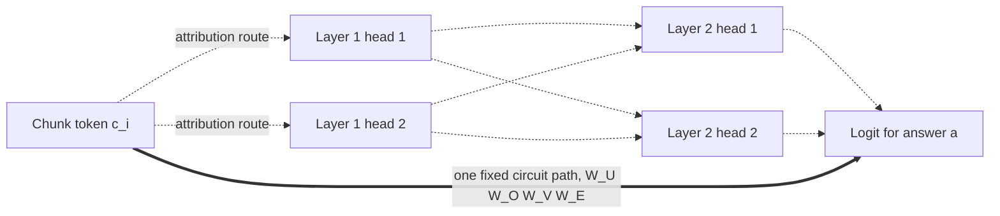
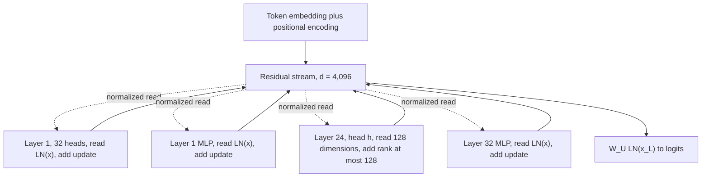
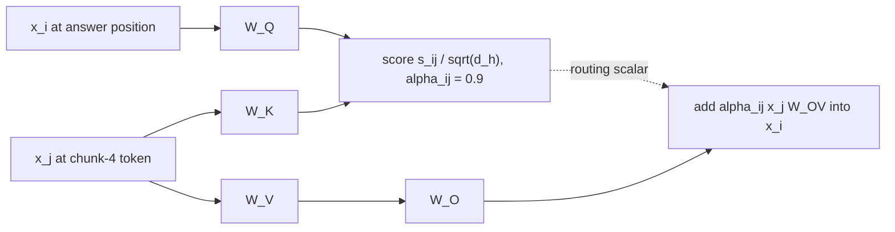
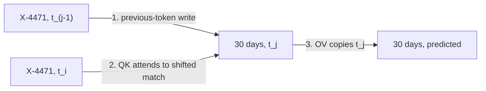
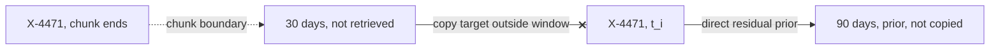
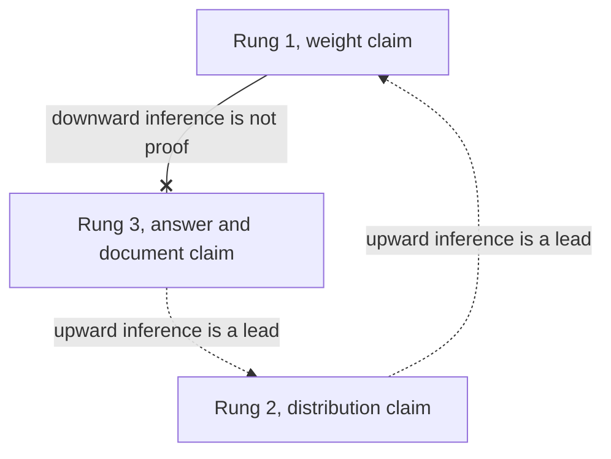

# Chapter 8: Reading the Machine: Circuits, Induction Heads, and Attribution

Purpose: Distinguish evidence about one model run from evidence about fixed model weights, then use residual streams, query-key circuits, output-value circuits, and induction heads to reason about Retrieval-Augmented Generation (RAG) failures without claiming more than the evidence supports.
## TL;DR

- RAG attribution scores one input. A circuit describes a fixed weight path that can transfer to later inputs.
- Attention mass shows where information could flow. It does not prove that removing a chunk would change the answer.
- Leave-one-out ablation directly tests document use, but duplicate chunks can hide each other's contribution.
- The residual stream is a fixed-width information bus. Every layer reads and adds updates in one shared coordinate system.
- A query-key (QK) circuit decides where a head reads. An output-value (OV) circuit decides what it writes.
- An induction head implements the pattern [A][B] ... [A] to [B]. Literal token matching explains both unseen-string copying and chunk-boundary failures.
- Circuit evidence can support capability and distribution claims. Only an input-level document counterfactual can show that one answer used one document.
## The story

Picture the generator as a fixed-width information bus running from token embeddings to answer logits. Retrieved chunks wait at many positions along the route.
Attention routes content across positions. The residual stream carries that content through depth while every block reads the same coordinates and adds an update. The bus never widens when retrieval adds chunks.
At the answer stop, one 4,096-dimensional vector must contain everything needed for the next token. The QK circuit selects the route. The OV circuit sets the cargo. A strong route score cannot certify the cargo, and two heads can follow the same route while writing opposite logit effects.
An induction circuit adds a two-head transfer. The first head shifts the previous token forward. The second matches the current token against that shifted token and copies what followed. This lets the bus carry an identifier absent from training.
A chunk boundary can preserve the matching token while placing the payload outside the window. The route recognizes the key, but the cargo is gone. The direct residual route then supplies a fluent answer from the parametric prior.
Attribution audits one completed bus trip. A gradient measures local sensitivity, a probe reads decodable information, and a Shapley value averages causal credit across chunk combinations.
A circuit inspection studies a fixed part of the bus design and can reveal copying capability across inputs. It cannot prove which document controlled one answer. For that claim, remove the document and rerun the trip. The evidence must use the same unit as the claim.
## Decoder table

| Technical term | Plain-English meaning | Why it matters |
|---|---|---|
| RAG | Retrieval-Augmented Generation | A system that places retrieved chunks in the generator context. Limit: Retrieval does not prove that the generator used a chunk |
| I | Prompt instruction | A fixed part of the model input. Limit: Its effect remains input-specific |
| C | Retrieved set of chunks | The candidate evidence placed in context. Limit: Presence in C is not use |
| c_i | Retrieved chunk i | One attribution or ablation unit. Limit: Overlap can make it redundant with another chunk |
| n | Number of retrieved chunks | Controls exact and leave-one-out attribution cost. Limit: It does not measure chunk independence |
| q | Query | The question supplied to the generator. Limit: Changing q changes run-level attribution |
| a | Answer | The generated sequence whose score is measured. Limit: Its probability is a margin over many paths |
| Logit and answer margin | A pre-softmax token score and its gap over competing scores | The emitted token depends on the full margin, not one circuit contribution |
| Softmax | Normalization that turns routing scores into attention weights | Saturation can make a heavily used route have a small local gradient |
| Parametric prior | The answer tendency carried in model weights without retrieved evidence | It produces a fluent fallback when a context-copying path fails |
| S | A subset of C | One coalition in Shapley attribution. Limit: Exact enumeration scales as 2^n |
| v(S) | Log probability of a under I, S, and q | A causal score for comparing chunk subsets. Limit: It applies to one answer and one input setup |
| phi_i | Attribution assigned to chunk i | A per-chunk contribution score. Limit: It changes with the input |
| Gradient times input | Sum of embedding times answer-score gradient over a chunk | A one-run differential saliency score. Limit: Saturation can make strong reliance look weak |
| Integrated gradients | A differential method motivated by saturation failures | A less local gradient attribution. Limit: It is still run-level attribution |
| Probe | A classifier trained on an intermediate activation | Evidence that a property is decodable. Limit: Accuracy does not prove that the model uses the direction |
| Selectivity baseline | Probe performance relative to control labels | A check against probe memorization. Limit: It still does not establish causality |
| Leave-one-out | Drop one chunk, rerun, and measure the change | A direct document counterfactual. Limit: Duplicate chunks can each receive zero |
| Cosine threshold | Similarity cutoff for grouping near-duplicate chunks | It turns redundant chunks into one ablation unit before attribution |
| Shapley value | Average marginal contribution over chunk orderings | Causal credit under redundancy. Limit: Exact cost is exponential |
| Sampled Shapley | Approximation from sampled coalitions | Offline causal attribution at lower cost. Limit: It is not suitable for the request path in the chapter example |
| Attention weight | A scalar route weight across positions | Evidence about where information could flow. Limit: It is not exclusive evidence of use |
| Mechanistic circuit | One fixed chain of weight products from embedding to logit | A weight-level claim that transfers across inputs. Limit: It covers one path, not the full answer |
| Residual stream | Fixed-width vector carried through model depth at each position | A shared space for patching, decoding, and steering. Limit: Its width does not grow with retrieval |
| Pre-norm and post-norm | Normalization before versus after an additive sublayer | The clean shared-bus account applies to the pre-norm arrangement in the source |
| Positional and rotary embeddings | Position information added to token representations, with rotary embeddings rotating query and key by relative offset | Residual addition preserves position information but does not create it |
| Superposition | Several features sharing nonorthogonal residual directions | Oversubscription forces feature sharing and interference |
| x_t | Embedding of token t | Input to gradient attribution. Limit: The associated derivative is local |
| x_l | Residual stream at layer l | State read and updated by the next block. Limit: One layer-position state does not certify a document |
| d | Residual-stream width | The number of shared bus coordinates. Limit: Width alone does not prevent superposition |
| L | Number of layers | Depth of the stack. Limit: Path count grows exponentially in L |
| H | Number of heads per layer | Per-layer attention count. Limit: Single-head evidence may be small relative to the full stream |
| d_h | Width of one attention head | Maximum rank of one head update. Limit: A head touches only a low-rank slice |
| Layer normalization (LN) | Normalization applied before a pre-norm sublayer read | Stabilizes the read into each additive block. Limit: It adds a per-position scale to QK scores |
| Multilayer perceptron (MLP) | Non-attention sublayer that adds to the stream | Up to rank d write demand per layer. Limit: It contributes to oversubscription and later overrides |
| W_E | Token embedding matrix | Maps vocabulary tokens into the residual space. Limit: Token-level circuit formulas are approximate with some serving details |
| W_U | Unembedding matrix | Maps the final residual state to logits. Limit: It reads the same shared basis under the pre-norm bus view |
| W_Q | Query projection | One factor in the QK product. Limit: It is not individually identifiable |
| W_K | Key projection | One factor in the QK product. Limit: It is not individually identifiable |
| W_V | Value projection | One factor in the OV product. Limit: It is not individually identifiable |
| W_O | Head output projection | Returns a head update to the residual stream. Limit: It is not individually identifiable |
| W_QK | Product W_Q W_K^T | Determines the attention pattern. Limit: It does not determine what the head writes |
| W_OV | Product W_V W_O | Determines the channel update. Limit: It does not determine where the head reads |
| A | Attention matrix | Mixes positions on the left of X. Limit: It says nothing by itself about the OV content |
| alpha_ij | Attention from position i to position j | One run's routing factor. Limit: It is recomputed for every input |
| s_ij | Pre-softmax attention score | Pairwise routing score. Limit: A one-layer score only sees the two current token identities |
| QK_full | Vocabulary-expanded QK bilinear form | Scores query-token and key-token pairs. Limit: It has no copying eigenspectrum |
| OV_full | Vocabulary-expanded OV linear map | Maps an attended token to logit changes. Limit: Materializing it is prohibitively large |
| Gauge freedom | Invertible basis change inside one head | Explains why only projection products are identifiable. Limit: Individual matrix columns are coordinate conventions |
| Eigenvalue lambda_i | Spectral value of the reduced OV operator | Indicates copying or suppression direction. Limit: The result is a weight-level statistic |
| Copying score kappa | Mean normalized real part of OV eigenvalues | Cheap copier scan across heads. Limit: Its null floor changes with d_h |
| Skip-trigram copying | One-layer memorized association such as are to perfect | Copying of learned token patterns. Limit: It does not generalize to an unseen identifier |
| Previous-token head | Layer-1 head that shifts token j-1 into position j | Creates the key-side state needed for induction. Limit: The payload still must remain in the window |
| Induction head | Two-layer circuit implementing [A][B] ... [A] to [B] | Context copying for unseen strings. Limit: Production-scale causal evidence remains limited |
| Virtual attention head | Functional unit visible through a composition of heads | A composed mechanism not found in either head alone. Limit: Composition search grows rapidly with depth |
| Prefix-matching score | Attention from a current token to the position after an earlier copy | One-pass correlational locator for induction heads. Limit: Causality requires ablation |
| In-context learning score | Loss difference between later and earlier positions in the repeated-sequence probe | Regression signal for copying behavior. Limit: It does not prove document use on one answer |
| Fuzzy induction | Approximate matching by synonym, translation, or nearby direction | A mechanism for nonliteral context reuse. Limit: It can copy the neighboring wrong span |
| Constrained decoding | A sampler rule that restricts output to an allowed source string | It gives a quotation guarantee that a copying spectrum cannot provide |
| Quantization | Lower-precision model representation used for serving | Copying behavior can change across a precision swap before fluency reveals it |
| Direct residual path | Non-head path that continues to influence logits | Explains fluent fallback when copying fails. Limit: It can override a correct copying contribution |
| Activation patching | Replace an activation in one run with the corresponding clean activation | Causal localization at a layer and position. Limit: Its unit is a model coordinate, not a document |
| Logit lens | Apply the unembedding to intermediate residual states | Shows when a candidate token becomes decodable. Limit: Early-layer readout can be degenerate |
| Tuned lens | A trained layer-specific readout | Improves early-layer decoding. Limit: It is still a readout rather than proof of use |
| Steering vector | Additive intervention in residual space | Behavioral control that respects the additive bus. Limit: Addition does not directly delete a direction |
| Rung 1 | Claim about fixed weights and every input | Circuit scan and prefix-matching evidence. Limit: It cannot prove a specific answer used a chunk |
| Rung 2 | Claim in expectation over a query distribution | Head knockout on held-out queries. Limit: It transfers only to the sampled distribution |
| Rung 3 | Claim about one answer and one document | Document counterfactual. Limit: It says nothing about other inputs |
| top-k | Maximum retrieved chunks passed into the generator | It caps document-level ablation cost while model head count keeps growing |
## Core mechanics

### 8.1 Feature attribution versus mechanistic interpretability

#### The attribution object

What: The model sees an instruction, retrieved chunks, and a query. It emits answer a.
The subset value is:
$$
v(S)=\log p(a\mid I,S,q)
$$
An attribution method returns one value per chunk.
Why: The value lets an incident review compare the same answer under different evidence subsets.
Failure without it: Attention mass can look decisive while the answer still comes from the parametric prior.
Cost or complexity: The cost depends on whether the method differentiates, probes, ablates, or enumerates coalitions.
#### Differential attribution

What: Gradient times input assigns:
$$
\phi_i=\sum_{t\in c_i}x_t^{T}\nabla_{x_t}\log p(a)
$$
Why: It obtains a chunk score from one backward pass after the forward pass.
Failure without its limit: A saturated softmax can hide total reliance.
For one attention weight:
$$
\frac{\partial \alpha}{\partial z}=\alpha(1-\alpha)
$$
At alpha equal to 0.98, sensitivity is 0.0196.
The maximum is 0.25 at alpha equal to 0.5.
The relative attenuation is 12.8 times.
Cost or complexity: One backward pass is cheap, but the result is a first-order local approximation.
Sundararajan et al. (2017) used saturation as the motivating axiom failure for integrated gradients.
#### Probing

What: A probe predicts a property such as grounding from a residual activation.
Why: High accuracy shows that the property is linearly decodable.
Failure without its limit: Decodability does not show that the model reads that direction.
Hewitt and Liang (2019) showed that capable probes can fit random control labels.
Cost or complexity: Training and a selectivity baseline are required before the accuracy is informative.
An intervention is still required before calling the direction a mechanism.
#### Shapley attribution

What: The exact Shapley value averages each chunk's marginal contribution over all coalitions.
$$
\phi_i=
\sum_{S\subseteq C\setminus\{c_i\}}
\frac{|S|!(n-|S|-1)!}{n!}
\left[v(S\cup\{c_i\})-v(S)\right]
$$
Why: Every term compares two actual runs, so the attribution is causal.
Failure without it: Leave-one-out fails when two duplicate chunks each preserve the answer after the other is removed.
For two duplicate chunks:
$$
v(\emptyset)=0
$$
$$
v(\{4\})=v(\{11\})=v(\{4,11\})=1
$$
Each duplicate receives 0.5 Shapley credit.
Cost or complexity: Exact computation requires 2^n generations.
At n equal to 20, that is 1,048,576 replays and 9.2 graphics processing unit (GPU)-days in the worked example.
Sampling 2,048 coalitions costs 26 minutes.
#### Circuits and attention

What: A circuit isolates one direct product of weight matrices.
For one head's direct OV route to logits, the chapter uses:
$$
W_UW_OW_VW_E
$$
Why: The product is fixed by the weights and can support a claim about a later query.
Failure without the distinction: A gradient aggregates all routes for one run, while a circuit isolates one route across runs.
Jain and Wallace (2019) found weak correlation between attention and gradient importance in attention-based classifiers. They also produced very different attention distributions with equivalent predictions.
Wiegreffe and Pinter (2019) argued that adversarial attention needs a baseline. Their narrower conclusion allows attention to remain plausible evidence.
The defensible claim here is only that attention weight is not exclusive evidence of use.
Cost or complexity: Expanding all routes creates:
$$
(H+1)^L
$$
end-to-end terms in an attention-only stack.
At L equal to 2 and H equal to 12, the count is 169.
Elhage et al. (2021) enumerated that small case.
At L equal to 32 and H equal to 32, the count is 3.9 times 10^48.
Even depth-two compositions in the 32-layer, 32-head model produce 507,904 head pairs.
Three query, key, and value composition routes make 1,523,712 norms.
#### Worked attribution budget

What: The chapter prices one replay for an 8 billion parameter generator.
Prefill uses 2N floating-point operations per token.
At 1.6 times 10^10 operations per token and 3.4 times 10^14 floating-point operations per second (FLOP/s), one prefill token costs 0.0471 ms.
A 4,000-token prompt costs 188.4 ms.
Decode reads 16 gigabytes (GB) of half-precision weights through 3.35 terabytes per second (TB/s) of high-bandwidth memory.
That costs 4.78 ms per token.
A 120-token answer costs 573.1 ms.
One replay costs 761.5 ms, or about 0.76 s.
Why: This price converts abstract evidence choices into incident and serving budgets.
Failure without it: Teams can fund exhaustive analysis for a question that a cheap document ablation settles.
Cost or complexity: Leave-one-out takes 21 replays and 16.0 s for 20 chunks.
Exact Shapley takes 1,048,576 replays and 9.2 days.
Sampled Shapley takes 2,048 replays and 26 minutes.
De-duplicate before attribution. Collapse near-duplicates above a cosine threshold into one ablation unit. If six chunks repeat one fact, treat the retrieval budget as the finding.
Use saliency only to rank the first ten ablation candidates when n reaches the hundreds.
Lundberg and Lee (2017) introduced sampled kernel estimation to make Shapley attribution usable at this scale.
Run attribution offline, and log the prompt, retrieved chunk identifiers, and sampling seed for replay.
Use generation-time citation when per-answer provenance is required. Treat a 0.90 AUC probe as a monitor until an intervention shows use. Reserve circuit work for failures that repeat across hundreds of unrelated queries.
### 8.2 The residual stream as an information bus

#### Plain composition and its two failures

What: A plain deep stack computes:
$$
x_l=f_l(x_{l-1})
$$
$$
x_L=f_L\circ\cdots\circ f_1(x_0)
$$
Why: This form exposes why residual addition changes more than gradient flow.
Failure without residuals: Gradients multiply through L Jacobians.
A mean singular value of 0.9 over 32 layers leaves 0.034 of the signal.
A mean singular value of 1.1 produces a factor of 21.1.
The second failure is representational.
Each layer can rewrite its input in an unrelated basis.
Then layerwise decoding, patching, and steering are not well-typed across layers.
Cost or complexity: The issue grows with depth through a product of Jacobians.
#### Additive pre-norm blocks

What: A residual block computes:
$$
x_l=x_{l-1}+b_l(x_{l-1})
$$
The chapter's pre-norm attention and MLP update is:
$$
x_l=x_{l-1}
+\sum_{h=1}^{H}A_{lh}(\operatorname{LN}(x_{l-1}))
+M_l\left(\operatorname{LN}\left(x_{l-1}+\sum_hA_{lh}\right)\right)
$$
Why: Every block reads and writes the coordinate system created by the embedding.
The gradient contains a pure identity route because:
$$
\frac{\partial x_l}{\partial x_{l-1}}=I+J_l
$$
He et al. (2016) provide the residual-network anchor for that identity path.
Failure without it: Activation patching, the logit lens, and steering lose their shared basis.
Cost or complexity: A four-block stack expands as:
$$
(1+a)(1+b)(1+c)(1+d)
$$
This contains the identity and every subset of edits.
#### One head on the bus

What: One head reads through W_V and writes through W_O.
$$
W_{OV}=W_VW_O
$$
For d equal to 4,096 and d_h equal to 128, the update rank is at most 128.
Why: The head touches a 128-dimensional slice and leaves 3,968 directions alone.
Attention moves information across positions.
The residual stream carries it forward through depth.
Failure without the distinction: Teams patch a small head when the full answer-position stream is the causal state they need.
Cost or complexity: By layer 24, the worked approximation contains 24 times 33, or 792, unit writes.
Its norm is about the square root of 792, or 28.1.
One unit write is about 3.6 percent of that stream.
Full-stream patching replaces the whole state.
#### Oversubscription and superposition

What: Standard parameterization uses:
$$
Hd_h=d
$$
Attention writes d dimensions per layer.
The MLP can write another d.
Why: Total write demand is:
$$
\frac{2Ld}{d}=2L
$$
At 32 layers, the bus is oversubscribed by a factor of 64.
Failure without enough independent directions: Features share nonorthogonal directions.
Elhage et al. (2022) call this superposition.
Some heads and neurons also appear to delete information, as reported by Elhage et al. (2021).
Cost or complexity: Two random unit vectors in 4,096 dimensions have root mean square inner product 0.0156.
A fixed 128-dimensional read subspace captures:
$$
\sqrt{\frac{128}{4096}}=0.177
$$
of an unrelated unit write.
Generative Pre-trained Transformer 2 (GPT-2) small uses 12 times 64 equal to 768. Generative Pre-trained Transformer 3 (GPT-3) 175B uses 96 times 128 equal to 12,288.
The chapter's 8 billion parameter model uses 32 times 128 equal to 4,096. Their oversubscription factors are 24, 192, and 64.
The pressure grows with depth rather than width.
#### The retrieval funnel

What: The next-token logits come from the final answer-position state.
$$
W_U\operatorname{LN}(x_L)
$$
Why: Every retrieved contribution must reach one d-dimensional vector before sampling.
Failure without enough selection: More chunks compete for the same fixed-width answer state.
The source ties this mechanism to the empirical result that retrieving more can increase hallucination.
Cost or complexity: Fifty chunks of 500 tokens create 25,000 positions.
One layer of half-precision residual states occupies 195 mebibytes (MiB).
The answer position occupies 8 kibibytes (KiB).
The funnel is 25,000 to 1.
Reducing k from 50 to 5 cuts layer storage from 195 MiB to 19.5 MiB.
It leaves the answer state at 8 KiB.
#### Caveats and practical choices

What: The clean shared-bus statement applies to the pre-norm arrangement.
Why: The original Transformer used post-norm and rescaled the bus in place.
Xiong et al. (2020) analyzed the training stability of pre-norm.
Failure without the caveat: Residual connections alone get credited for a cleaner read-write contract than they guarantee.
Residual addition also does not create positional information.
It preserves positional information written at embedding time.
Without positional encoding, attention remains permutation-equivariant across positions.
Cost or complexity: Sweep full-stream patches across layer and position first.
Use a tuned lens when raw early-layer decoding fails, which is common outside GPT-2.
Rerank hard and keep k small unless the query requires aggregation. A 200,000-token window still does not widen the 8 KiB answer state.
Use decomposition for queries that need many facts.
Cunningham et al. (2023) motivate sparse autoencoders as a response to shared residual directions.
Compare a write's norm with the stream norm. Early layers 0 through 2 make one edit proportionally larger.
Use additive steering for an added behavior. Use an explicit projection when the goal is deletion.
Patch the 5-chunk answer stream into the 50-chunk run to test assembly failure with two forward passes.
### 8.3 QK and OV circuits

#### One attention head

What: For context matrix X with n positions and width d:
$$
A=\operatorname{softmax}\left(\frac{XW_QW_K^{T}X^{T}}{\sqrt{d_h}}\right)
$$
$$
h(X)=AXW_VW_O
$$
Why: The equation separates routing from channel transformation.
Failure without the split: A 0.9 attention weight gets mistaken for proof that the right content was written.
Cost or complexity: Each head has four projection matrices.
For d equal to 4,096 and d_h equal to 128, one head has 2,097,152 projection parameters.
#### Gauge-invariant products

What: For any invertible matrix R:
$$
W_Q'=W_QR
$$
$$
W_K'=W_KR^{-T}
$$
The product W_Q W_K^T stays fixed.
The same basis freedom holds for W_V and W_O.
Why: Only the products describe the model function independently of the head's internal coordinate choice.
Failure without it: A statement about one column of W_Q, W_K, W_V, or W_O becomes a statement about an arbitrary basis.
Cost or complexity: Two copies of the general linear group GL(128) contribute 32,768 gauge directions.
That is 1.5625 percent of one head's projection parameters.
The freedom touches every column, so the small fraction is still fatal to per-matrix interpretation.
#### Where to look and what to move

What: Define:
$$
W_{QK}=W_QW_K^{T}
$$
$$
W_{OV}=W_VW_O
$$
Then:
$$
A=\operatorname{softmax}\left(\frac{XW_{QK}X^{T}}{\sqrt{d_h}}\right)
$$
$$
h(X)=(AX)W_{OV}=A(XW_{OV})
$$
Why: A multiplies rows and mixes positions.
W_OV multiplies columns and mixes channels.
The operations commute because they act on different indices.
Failure without it: A correct QK route can hide an OV write that copies, suppresses, or changes the wrong token.
Cost or complexity: The split is exact for the head computation and drops no term.
#### Vocabulary-expanded circuits

What: The expanded maps are:
$$
\operatorname{OV}_{full}=W_EW_{OV}W_U
$$
$$
\operatorname{QK}_{full}=W_EW_{QK}W_E^{T}
$$
Why: One OV entry gives the logit shift from an attended source token to a target token.
One QK entry gives a score contribution from a query-side token and a key-side token.
Failure without the type distinction: A bilinear QK form gets treated as an operator with a copying spectrum.
Only the linear vocabulary-to-vocabulary OV map has that spectrum.
Cost or complexity: The full OV map for a 128,256-token vocabulary has 1.645 times 10^10 entries.
It occupies 32.9 GB, or 30.6 gibibytes (GiB), in half precision per head.
Across 1,024 heads, it would occupy 30.6 tebibytes (TiB).
#### Low-rank spectrum

What: Factor the expanded OV map:
$$
W_EW_{OV}W_U=AB
$$
$$
A=W_EW_V
$$
$$
B=W_OW_U
$$
The nonzero eigenvalues of AB equal those of BA.
$$
BA=W_OW_UW_EW_V
$$
Why: BA is only 128 by 128.
Failure without the reduction: The vocabulary-expanded map is too large to materialize.
Cost or complexity: The reduced problem has 16,384 numbers and occupies 32 KiB per head.
All 1,024 heads require 32 MiB.
The reduction is one millionfold.
Diagonalizing all heads costs about 2.1 times 10^9 floating-point operations.
The chapter describes that as seconds on a laptop.
For GPT-2 small, 50,257 vocabulary items and head width 64 reduce 2.526 times 10^9 expanded entries to a 4,096-entry eigenproblem, a factor of 6.2 times 10^5.
#### Copying score and null

What: The copying score is:
$$
\kappa=\frac{1}{d_h}\sum_i\frac{\operatorname{Re}(\lambda_i)}{|\lambda_i|}
$$
Positive-real eigenvalues indicate copying.
Negative-real eigenvalues indicate suppression.
Why: A copier raises the logit of the token it attends to.
Failure without a null: Random weights can appear weakly aligned by chance.
At symmetric initialization, the expected kappa is exactly zero.
Under the disk approximation, the noise floor at d_h equal to 128 is 0.0625.
Cost or complexity: A conservative three-sigma copying threshold is kappa greater than 0.19.
The noise floor scales as:
$$
\frac{1}{\sqrt{2d_h}}
$$
It must be recalculated when head width changes.
#### Serving-model caveats

What: The expanded formulas are exact for the one-layer attention-only model with learned absolute positions analyzed by Elhage et al. (2021).
Why: Layer normalization rescales each position before a read.
Rotary embeddings insert a relative rotation between query and key.
$$
x_iW_QR_{i-j}W_K^{T}x_j^{T}
$$
Failure without the caveat: A token-only QK map gets treated as exact for a production decoder.
The OV side remains untouched by both stated modifications.
Cost or complexity: Move the gold chunk between first and last position to classify QK-side failures. If attention is diffuse rather than misplaced, cut k.
Inspect W_QK and W_OV rather than individual projections. Per-matrix deltas remain meaningful only when two checkpoints share a fixed basis.
Use the OV spectrum to scan copying machinery and attention statistics to inspect routing.
Route persistent OV-side failures to a low-rank adapter, steering, a different base model, constrained decoding, or another decode-level intervention.
Changing retrieval, reranking, chunking, or ordering changes X and the QK route. It does not change W_OV. Record kappa across all 1,024 heads on each base-model change and rederive its floor when d_h changes.
### 8.4 Induction heads and advanced copying

#### The one-layer ceiling

What: A one-layer attention score between current token i and earlier token j is:
$$
s_{ij}=t_iW_EW_{QK}W_E^{T}t_j^{T}
$$
Why: The score depends only on the identities of t_i and t_j.
Failure without another layer: The desired location is marked by t_(j-1), not by payload token t_j.
An unseen part number has no trained bigram entry that points to its payload.
Cost or complexity: One-layer heads can implement memorized skip-trigram associations.
They cannot implement the general unseen-token pointer by this score alone.
#### The two-layer construction

What: A layer-1 previous-token head shifts t_(j-1) into the residual stream at j.
$$
x_j^{(1)}=t_jW_E+t_{j-1}W_EW_{OV}^{P}
$$
A layer-2 head composes through the key.
One term in its score is:
$$
s_{ij}^{ind}
=
t_iW_EW_{QK}^{I}
\left(W_{OV}^{P}W_E^{T}t_{j-1}^{T}\right)^{T}
$$
Why: Training can make the composed vocabulary map close to a positive multiple of the identity.
Then the score is high when the current token matches the predecessor copied into position j.
The layer-2 OV circuit copies t_j into the logits.
Failure without the composed identity: The circuit would depend on the specific content A and B.
The near-identity composition names no specific identifier or payload.
Cost or complexity: The mechanism implements [A][B] ... [A] to [B] with two layers.
Elhage et al. (2021) call the pair an induction head and the composition a virtual attention head.
#### Why chunk boundaries break copying

What: Literal identity matching finds an earlier occurrence of the current token.
The payload is the token immediately after that earlier occurrence.
Why: A retrieved chunk can therefore support an identifier never seen in training.
In the source example, X-4471-B and 30 days become a confident 90 days two weeks after rechunking into 512-token windows with no overlap. The weights, retriever, and correct indexed row do not change.
Failure without the payload in the window: A boundary can preserve the key and remove the next token.
The direct residual path then produces a plausible prior answer.
That explains a fluent wrong number rather than an abstention.
Cost or complexity: Keep atomic records within one chunk.
Apply the same normalization to query and corpus text.
Use one delimiter template across demonstrations, chunks, and questions.
Use lexical retrieval for identifiers that must appear literally.
#### Claim limits

What: Olsson et al. (2022) observed a training phase change where the in-context learning score rose as induction heads formed.
They causally knocked out heads in small attention-only models.
Why: The joint change and knockout support the induction account in those settings.
Failure without the boundary: Correlational production-scale evidence gets reported as a causal explanation of the served model.
Models with real depth also contain fuzzy heads that can match synonyms, translations, or fixed strides.
Fuzzy copying can select a neighboring wrong span.
Cost or complexity: Copying is a mechanism, not a faithfulness guarantee.
Verbatim quotation requires constrained decoding.
#### Random-repeat probe

What: Sample 256 random tokens and concatenate the sequence with itself.
A uniform predictor over 128,256 tokens pays:
$$
\ln(128256)=11.762
$$
nats per token.
That is 16.97 bits per token.
If copy-2 loss is 3.5 nats:
$$
p=1-\frac{3.5}{11.762}=0.70
$$
Why: Copy 2 is predictable only through the repeated prefix.
Failure without the probe: A base-model or quantization change can degrade copying before a RAG evaluation set catches it.
Cost or complexity: One 512-token prefill costs 24.1 ms.
Thirty-two sequences cost 0.771 s for all 1,024 heads.
The published in-context learning score is loss at token 500 minus loss at token 50 in this doubled-sequence geometry.
The prefix-matching scan is correlational.
Ablating 1,024 heads plus one baseline costs 13.2 minutes, about half the sampled-Shapley time for one answer. Spend it only when a decision depends on head identity.
Run this acceptance probe at serving precision and context length. A bfloat16 (bf16) probe does not certify the deployed 4-bit model.
#### Chunking cost example

What: A 5,000-row table at 18 tokens per row contains 90,000 tokens.
Why: It makes record fragmentation measurable.
Failure without overlap: A 512-token, no-overlap chunker creates 176 chunks and 175 internal boundaries.
Only 1 in 18 boundaries lands between rows.
The expected split count is:
$$
175\frac{17}{18}=165
$$
That is 3.3 percent of the catalog.
Cost or complexity: A 32-token overlap changes the stride to 480 and the chunk count to ceil((90,000 - 512) / 480) + 1 = 188.
The index and embedding cost rise by a factor of 1.07.
The overlap exceeds the 18-token record and removes split rows in the worked setup.
Use record-aware splitting when records approach about one tenth of the chunk. Normalize query and corpus text identically. For optical character recognition or scraped tables, normalize at ingestion.
Route identifier-shaped queries to lexical retrieval. Dense-only retrieval is the source exception when traffic is overwhelmingly natural-language paraphrase.
When a delimiter changes, compare the token sequences before sweeping formats. `Q:` and `Q :` are different token sequences. Standardize the winner and resweep after tokenizer changes.
### 8.5 What circuits license and what they do not

#### Routing factor and weight factor

What: One head's source-position influence factors into a run-specific route and a fixed weight map.
$$
\Delta x_i^{(h)}
=
\sum_jA_{ij}^{(h)}x_jW_{OV}^{(h)}
$$
After unembedding, source position j contributes:
$$
A_{ij}^{(h)}
\times
t_jW_EW_{OV}^{(h)}W_U
$$
Why: Circuit analysis freezes the left factor and reads the right factor from the weights.
Failure without the distinction: Naming an induction head gets treated as proof that it used chunk 4 on this input.
Cost or complexity: The attention factor must be recomputed on every run.
The fixed circuit transfers across runs but does not identify one document's causal role.
#### One addend versus the answer

What: The final answer logit is a sum of the direct path, 1,024 single-head terms, and their compositions.
Why: The emitted token depends on the margin over the entire sum.
Failure without this limit: One correct circuit contribution gets mistaken for control of the answer.
The source example gives the right token a 3.1-nat push from one copier.
The rest of the stack gives the wrong token a 3.4-nat push.
The wrong token wins by 0.3 nats while the copier still behaves exactly as predicted.
Cost or complexity: Head-by-head explanation scales with the model's head count and path count.
#### Three evidence rungs

What: Rung 1 concerns the weights for every input.
OV eigenspectra, QK entries, and prefix matching license this claim.
Why: It supports a capability statement such as this stack copies from context.
Failure without the quantifier: A weight-level property gets applied downward to one answer.
Cost or complexity: The chapter's scan costs 0.771 s per model.
What: Rung 2 concerns expectation over a query mix.
Head knockout on held-out queries licenses this claim.
Why: It shows that selected heads carry copying on the sampled distribution.
Failure without the quantifier: The result gets transferred beyond the query distribution.
Cost or complexity: The chapter's causal scan costs 13.2 minutes per model.
What: Rung 3 concerns one answer and one document.
Dropping the chunk and rerunning licenses this claim.
Why: It answers whether the answer changed when that document disappeared.
Failure without matching units: Head patching returns a layer or head when legal asks about a document.
Cost or complexity: A 20-chunk answer takes 21 replays and 16.0 s.
Inference can move upward as a lead.
It never moves downward as proof.
#### Why head-level causal tracing loses the audit

What: Activation patching can causally localize an input-specific effect.
Meng et al. (2022) patch clean activations into corrupted runs.
Why: The method can reach an input-specific claim.
Failure without unit alignment: Its output is a model coordinate rather than a document.
Once positions map to chunks, direct chunk ablation answers the document question more cheaply.
Cost or complexity: Patching all 1,024 heads plus a baseline takes 1,025 replays.
At 0.7615 s each, that is 780.5 s, or 13.0 minutes per answer.
Document ablation takes 15.99 s.
The ratio is 48.8 times, exactly 1,025 divided by 21.
#### Audit-scale economics

What: Audit 1 percent of 40,000 daily answers.
That creates 400 audited answers.
Why: The calculation compares evidence in document units with evidence in head units.
Failure without the comparison: A team pays for more expensive evidence that does not answer the stated question.
Cost or complexity: Document ablation costs 6,396 s, or 1.78 accelerator-hours per day.
That is 7.4 percent of one continuously running accelerator.
Head patching costs 312,200 s, or 86.7 accelerator-hours per day.
That requires 3.6 accelerators continuously.
Heads grow with L times H.
Retrieved chunks remain capped by top-k.
The gap therefore widens with model generations in the source's comparison.
#### Licensed claims and remaining limits

What circuits license:

- Capability claims that survive the next query.
- Predictions about chunk boundaries, one-sided normalization, and retokenized delimiters.
- Cheap regression probes for base-model and quantization changes.
- Distribution-tested interventions that act on heads.
A calibration-set intervention can locate gullible heads and reduce their attention to low-credibility spans at inference.
What circuits do not license:

- A claim that one answer used one cited chunk.
- A guarantee that copied content is true.
- A guarantee that fuzzy copying selected the correct neighboring span.
- A causal production-scale explanation merely because a copying head was located.
Rashkin et al. (2023) define attribution as a predicate over a source and a statement.
That operational instance-level definition already uses document units.
Min et al. (2023) found that more than 30 percent of both supported and unsupported sentences carried citations.
Citation presence therefore did not discriminate support in that result.
Olsson et al. (2022) provide knockout evidence for small attention-only models.
Their production-scale evidence remains correlational.
"Our model has induction heads" is not a finding by itself.
Their absence or a score collapse after quantization would be a finding.
Copying a stale or poisoned source can be mechanically faithful and factually wrong.
Mechanism is not warrant. Run rung 1 per model build, rung 2 per release when head identity matters, and rung 3 per incident or audit slice.
Use generation-time citation with sampled document ablation for provenance. Pair copying claims with source credibility unless ingestion already settled a single curated internal store.
## Diagrams

### Figure 8.1

| Method over 20 chunks | Forward passes | Time in the figure |
|---|---:|---:|
| Saliency map | 1 | 0.76 s |
| Leave-one-out | 21 | 16.0 s |
| Sampled Shapley | 2,048 | 26 min |
| Exact Shapley | 2^20 | 9.2 days |
Figure 8.1: Attribution and circuits answer different questions and are priced differently. (a) A saliency score, a probe, or a Shapley value summarizes every route from a chunk token to the answer logit for one particular input. The head's OV path is a single product of weight matrices that is defined without any input at all, which is why only it generalizes to the next query. (b) On a 20-chunk context and an 8 B generator at 0.76 s per replay, causal attribution costs between 21 and 2,048 forward passes depending on how much chunk redundancy you must untangle, and the exact game-theoretic answer costs 9.2 GPU-days.
### Figure 8.2

| Context side | Answer side |
|---|---|
| 50 chunks x 500 tokens = 25,000 positions | One answer position |
| 25,000 x 8 KiB = 195 MiB at one layer | 4,096 x 2 B = 8 KiB |
| All positions can hold retrieved content | This vector decides the next token |
Figure 8.2: The residual stream is a fixed-width channel, and that width is what fails to scale with retrieval. (a) At one position, every head and MLP reads a normalized copy of the stream and adds an update back into the same 4,096 coordinates, so the space the embedding wrote into is the space the unembedding reads from. One head touches a 128-dimensional slice and leaves 3,968 directions alone. (b) Across positions, 50 chunks occupy 195 MiB of stream at a single layer, but the next token is read from 8 KiB at the answer position - a 25,000:1 funnel that does not widen with k.
### Figure 8.3

| Circuit | Matrix shape | Maximum rank | Question |
|---|---:|---:|---|
| W_QK = W_Q W_K^T | 4,096 x 4,096 | 128 | Where to look |
| W_OV = W_V W_O | 4,096 x 4,096 | 128 | What to move |

| OV spectrum | Visual pattern from the figure | Copying score |
|---|---|---:|
| Copying head | Eigenvalues cluster near the positive real axis | kappa approaches +1 |
| Random initialization | Eigenvalues spread across a disk | kappa about 0 plus or minus 0.0625 |
Figure 8.3: Splitting a head into two circuits turns an opaque 0.9 attention weight into two separately testable claims. (a) W_Q W_K^T mixes positions and fixes where the head reads. W_V W_O mixes channels and fixes what it writes back. The two share no parameters, so a correct attention pattern is no evidence at all about the content that follows it. (b) Only the OV side admits a spectrum, because it maps the vocabulary to itself: eigenvalues on the positive reals mean the head raises the logit of the token it attends to, while random weights spread over a disk and score κ ≈ 0 with a 0.0625 noise floor at d_h = 128.
### Figure 8.4

Figure 8.4: The induction circuit is what lets a generator quote a string absent from its training data: a layer-1 head shifts every token onto the following position, and a layer-2 head attends wherever that shifted token matches the current one, then copies what came next. Because the match is on literal token identity and the payload is the next token, a chunk boundary that separates the two (b) removes the copy target while leaving the match intact, and the direct residual path answers from the parametric prior - fluent, and wrong.
### Figure 8.5

| Rung and claim | Evidence that licenses it | Unit and cost |
|---|---|---|
| Rung 1, the weights. "This stack copies from context." True of every input. | OV eigenspectrum, QK entries, prefix-matching scan. One forward pass and no particular input. | Heads. 0.771 s per model. |
| Rung 2, the distribution. "These heads carry the copying." True in expectation over a query mix. | Knock the head out and remeasure on a held-out query sample. | Heads x queries. 13.2 min per model. |
| Rung 3, this answer. "The answer used chunk 4." True of one input only. | Counterfactual on the input. Drop the chunk, rerun, and compare the answer. | Documents. 16.0 s per answer. |

Figure 8.5: Interpretability evidence sits at three quantifier levels, and the only rung that answers "did this answer use that document" is the cheapest one. Rungs one and two are denominated in heads and hold across inputs. Rung three is denominated in documents and holds for a single input. Inference runs upward as a hint and never downward as proof.
## Whiteboard pack

### Drawing order

1. Draw a vertical box labeled residual stream with width d.
2. Add token embedding and positional encoding at the top.
3. Draw two sublayers beside the box. Use dashed arrows for normalized reads and solid arrows for additive writes.
4. Draw two token positions. Show attention moving information sideways between them.
5. Split one head into W_QK for where to look and W_OV for what to move.
6. Add a previous-token head, then a second head that matches [A] and copies [B].
7. Finish with the three evidence rungs. Cross out any downward move from circuit evidence to one-answer proof.
### 90 to 100 word script

Start with the residual stream as a fixed-width bus. Each block reads a normalized copy and adds an update in the same coordinates. Attention moves information across positions. The stream carries it through depth. Split one head into QK, which chooses where to read, and OV, which determines what to write. Compose a previous-token head with a copying head and you get induction: [A][B] followed later by [A] predicts [B]. That explains unseen-string copying and chunk-boundary failures. But a circuit describes fixed weights, not one answer. To prove document use, drop that chunk, rerun, and compare.
## Interview traps

### 1. "The answer attends 0.9 to the policy chunk. Did the model use it?"

No, because the weight shows strong routing but does not show whether the OV write changed the final answer margin.
Drop the chunk and rerun. For 20 chunks, the worked cost is 21 replays and 16.0 s.
### 2. "Leave-one-out says no chunk mattered, but the answer came from context. Is ablation broken?"

Check redundancy first. If chunks 4 and 11 both contain the fact, dropping either leaves the other, so both leave-one-out marginals become zero.
Group near-duplicates before ablation or use sampled Shapley, because exact Shapley costs 2^20 replays in the example even though it splits credit correctly.
### 3. "Why do residual connections matter beyond gradient flow?"

Additivity preserves one shared basis from embedding to unembedding, so activation patching, layerwise logit decoding, and steering remain well-defined.
The answer-position stream stays fixed at 4,096 dimensions as k grows, while residuals preserve positional information written at input but do not create it.
### 4. "The correct chunk gets 0.9 attention, but the model attaches its number to the wrong entity. Is retrieval at fault?"

The observed route says QK may have worked, but the failure can live in OV or in later layers that overwrite the correct update.
Permute chunk positions to test routing sensitivity, then patch and decode the answer-position stream layer by layer.
Do not interpret W_Q or W_K alone because gauge freedom makes each projection basis-dependent.
### 5. "We found induction heads. Can we claim this answer used chunk 4?"

No, because a circuit fixes a weight-level transformation across inputs but does not fix the run-specific attention factor or the full logit sum.
Use document ablation for the one-answer claim, and state the quantifier on every finding.
## Key numbers

| Topic | Value | Meaning |
|---|---:|---|
| Example generator | 8 B parameters | Model used throughout the chapter |
| Opening incident | 30-minute review, 60-day answer, 30-day chunk at position 4 of 20 | Attribution separates two fixes that each cost a quarter |
| Prompt length | 4,000 tokens | Prefill example |
| Answer length | 120 tokens | Decode example |
| Sustained throughput | 3.4 x 10^14 FLOP/s | Replay-cost assumption |
| Prefill work | 1.6 x 10^10 FLOPs per token | Twice the parameter count |
| Prefill time | 0.0471 ms per token | Derived from throughput |
| Full prefill | 188.4 ms | 4,000-token prompt |
| Half-precision weights | 16 GB | Decode bandwidth example |
| High-bandwidth memory rate | 3.35 TB/s | Decode bandwidth assumption |
| Decode time | 4.78 ms per token | Weight-read time |
| Full decode | 573.1 ms | 120-token answer |
| One replay | 761.5 ms | About 0.76 s |
| Saturated attention example | alpha = 0.98 | Sensitivity falls to 0.0196 |
| Maximum softmax sensitivity | 0.25 | Reached at alpha = 0.5 |
| Saturation attenuation | 12.8 x | 0.25 divided by 0.0196 |
| Leave-one-out at n = 20 | 21 replays | Baseline plus one drop per chunk |
| Leave-one-out time | 16.0 s | One answer |
| Chunk overlap example | 20 percent | Creates duplicate "30 days" chunks 4 and 11 |
| Duplicate Shapley credit | 0.5 each | Credit splits across the two duplicate chunks |
| Sampled Shapley | 2,048 replays | Sampled coalition count |
| Sampled Shapley time | 26 min | Offline audit scale |
| Exact Shapley | 1,048,576 replays | 2^20 coalitions |
| Exact Shapley time | 221.8 accelerator-hours | 9.2 days |
| Mechanistic paths at L = 2, H = 12 | 169 | Full attention-only path expansion |
| Mechanistic paths at L = 32, H = 32 | 3.9 x 10^48 | Production-depth path expansion |
| Depth-two head pairs | 507,904 | 32-layer, 32-head stack |
| Depth-two composition norms | 1,523,712 | Query, key, and value routes |
| Residual width d | 4,096 | Chapter model |
| Vanishing-gradient example | 0.9^32 = 0.034 | Signal left through a plain stack |
| Exploding-gradient example | 1.1^32 = 21.1 | Signal multiplier through a plain stack |
| Layers L | 32 | Chapter model |
| Heads per layer H | 32 | Chapter model |
| Head width d_h | 128 | Chapter model |
| Total heads | 1,024 | L times H |
| Head update rank | At most 128 | Low-rank OV write |
| Untouched directions | 3,968 | 4,096 minus 128 |
| Write-demand factor | 64 | 2L oversubscription |
| Total write demand | 262,144 dimensions | 32 layers times 8,192 writes per layer |
| Random-vector root mean square inner product | 0.0156 | Geometry at d = 4,096 |
| Unrelated write captured by one read subspace | 0.177 | Square root of 128 divided by 4,096 |
| Writes through layer 24 | 792 | 24 times 33 |
| Approximate stream norm | 28.1 | Square root of 792 |
| One unit write share | 3.6 percent | One divided by 28.1 |
| Context example | 50 x 500 tokens | 25,000 positions |
| Context stream at one layer | 195 MiB | Half-precision residual states |
| Answer-position stream | 8 KiB | 4,096 half-precision values |
| Retrieval funnel | 25,000 to 1 | Context positions to answer position |
| k increase example | 5 to 50 | Tenfold tighter context-to-answer funnel |
| Smaller k context stream | 19.5 MiB | Five chunks rather than 50 |
| Large-window warning | 200,000 tokens versus an 8 KiB answer state | Context capacity does not widen the output funnel |
| Early intervention range | Layers 0 through 2 | One write is a larger share before the stream accumulates many edits |
| One-head parameters | 2,097,152 | Four 4,096 by 128 projections |
| Gauge directions | 32,768 | Two copies of GL(128) |
| Gauge fraction | 1.5625 percent | Function-preserving coordinate freedom |
| Vocabulary size | 128,256 | Chapter model |
| Expanded OV entries | 1.645 x 10^10 | One head |
| Expanded OV storage | 30.6 GiB | One head in half precision |
| Expanded OV decimal storage | 32.9 GB | Same one-head map in decimal units |
| Expanded OV storage for all heads | 30.6 TiB | 1,024 heads |
| Reduced OV eigenproblem | 128 x 128 | Same nonzero spectrum |
| Reduced storage | 32 KiB per head | 16,384 numbers |
| Reduced storage for all heads | 32 MiB | 1,024 heads |
| Spectrum reduction | 1.0 x 10^6 | Expanded entries divided by reduced entries |
| GPT-2 spectral sanity check | 50,257 vocabulary, d_h = 64, 2.526 x 10^9 versus 4,096 entries, 6.2 x 10^5 reduction | Low-rank reduction transfers across model shape |
| All-head eigendecomposition | 2.1 x 10^9 FLOPs | Chapter estimate |
| Random kappa mean | 0 | Symmetric initialization |
| Kappa noise floor | 0.0625 | d_h = 128 |
| Conservative copying call | kappa greater than 0.19 | Three times the stated floor |
| Probe monitoring example | 0.90 area under the curve (AUC) | Decodability without proof of use |
| Saliency triage | First 10 candidates when n is in the hundreds | Rank candidates before causal ablation |
| Random-repeat sequence | 256 tokens repeated | 512-token context |
| Uniform loss | 11.762 nats or 16.97 bits | Vocabulary size 128,256 |
| Published in-context learning score | Loss at token 500 minus loss at token 50 | Olsson et al. probe anchor |
| Example copy-2 loss | 3.5 nats | Implies 70 percent recovered |
| One probe prefill | 24.1 ms | 512 tokens |
| Thirty-two probes | 0.771 s | All-head prefix scan |
| Causal head scan | 1,025 runs | One baseline plus 1,024 ablations |
| Causal head scan time | 13.2 min | Per model |
| Parts table | 5,000 rows | Chunking example |
| Row length | 18 tokens | Atomic record size |
| Table length | 90,000 tokens | 5,000 times 18 |
| No-overlap chunks | 176 | 512-token windows |
| Internal boundaries | 175 | No-overlap chunking |
| Clean-boundary probability | 1 in 18 | Chance that a boundary falls between rows |
| Expected split rows | 165 | 3.3 percent of catalog |
| Overlap | 32 tokens | Exceeds row length |
| Overlap stride | 480 | 512 minus 32 |
| Overlap chunks | 188 | Worked count |
| Index-cost factor | 1.07 | 188 divided by 176 |
| Record-aware split threshold | About one tenth of a chunk | Point where overlap becomes the expensive guarantee |
| Correct head contribution | 3.1 nats | Example push toward 30 |
| Competing contribution | 3.4 nats | Example push toward 90 |
| Wrong-answer margin | 0.3 nats | Difference between contributions |
| Per-answer head patching | 1,025 replays | Baseline plus each head |
| Per-answer head patch time | 780.5 s | 13.0 minutes |
| Head versus document ratio | 48.8 | 1,025 divided by 21 |
| Daily answers | 40,000 | Audit example |
| Audit slice | 1 percent | 400 answers |
| Document-ablation audit | 6,396 s per day | 1.78 accelerator-hours |
| Document audit capacity | 7.4 percent | Fraction of one continuous accelerator |
| Head-patching audit | 312,200 s per day | 86.7 accelerator-hours |
| Head-patching capacity | 3.6 accelerators | Continuous capacity |
| Citation observation | More than 30 percent | Both supported and unsupported sentences in the cited result |
