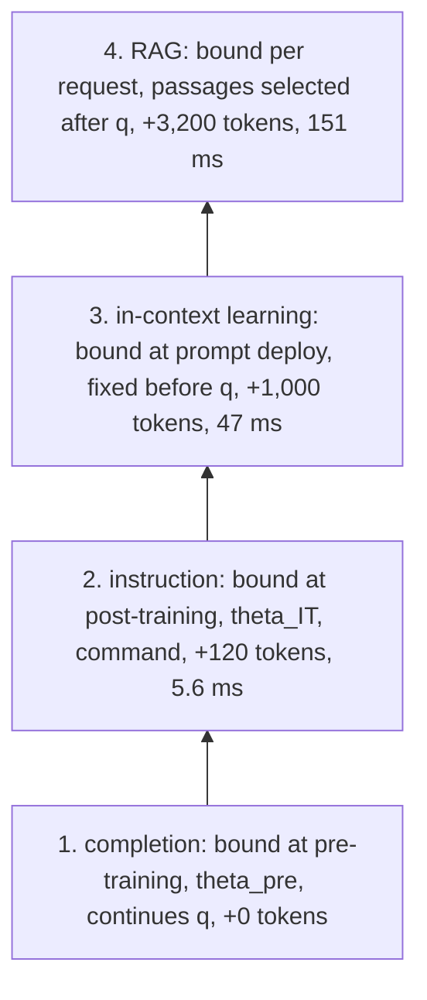
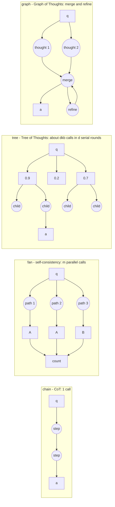

# Chapter 9: Prompting for Retrieval-Augmented Systems

Purpose: Explain where prompting ends, where retrieval begins, how reasoning scaffolds change decoding, and why more calls or more passages can reduce answer quality.

## TL;DR

- A Retrieval-Augmented Generation (RAG) prompt has four cumulative rungs: completion, instruction, In-Context Learning (ICL), and query-time retrieval.
- The key difference between ICL and RAG is binding time. Demonstrations are fixed before the query, while retrieved passages are selected after the query arrives.
- Chain-of-Thought (CoT), self-consistency, Tree of Thoughts, and Graph of Thoughts change decoding. They do not change the weights or the retrieved passages.
- Self-consistency estimates an answer marginal by sampling paths and counting final answers. It reduces variance, but it cannot correct bias from a wrong retrieved context.
- A scaffold is a program the model must execute. Its realized gain is discounted by the probability that every model-executed step works.
- Raising top-k can improve recall and reduce answer accuracy. More passages increase competition for the generator's attention.
- Choose prompt rungs, scaffold depth, and top-k with measured failure partitions, execution reliability, ranker margin, latency, and cost.

## The story

Picture an open-book exam with four rungs on a ladder beside the student's desk. On the first rung, the student gets only the question and continues the text from memory. This is completion, which means predicting what text comes next without special directions or external material.

On the second rung, the examiner adds an instruction. The student now knows to answer instead of continuing the question. The instruction changes behavior, but it does not add a missing policy fact.

On the third rung, the examiner puts worked examples on the board before seeing the new question. This is In-Context Learning (ICL), which means guiding the current answer with examples while leaving permanent training unchanged. The examples teach answer form, citation style, refusal wording, or a JavaScript Object Notation (JSON) envelope, but they cannot carry every changing fact in a large corpus.

On the fourth rung, the examiner lets the student find the relevant page after reading the question. This is Retrieval-Augmented Generation (RAG), which means finding evidence after the request and giving it to the answer writer. The page can be fresh, query-specific, deletable, and citable, but the student must still find and use it correctly.

Now give the student scratch paper. A single reasoning chain is one worked path, while a fan of five paths lets the student solve the problem five ways and count the final answers. A tree adds branching, scoring, pruning, and continuation, while a graph can also merge or revise partial work.

Each extra move asks the same student to execute another instruction. If every move is 98% reliable, thirty moves succeed together only 54.5% of the time. Too much scaffolding, meaning added scratch-work procedure, turns the exam ladder into a maze.

The same warning applies to the open book. Five pages may include the right page and few distractors, while forty pages can raise recall, meaning how often the right page is present, and bury the answer among plausible competitors. A better ranker gives the right page a larger score margin, and that margin decides how many pages the student can safely receive.

The interview lesson is concrete. Do not fix a missing page by rewriting instructions, biased pages by sampling more answers, or weak ranking by buying a longer desk. Climb the right rung, add only executable scratch work, and send only as many pages as the student can reliably distinguish.

## Decoder table

| Technical term or symbol | Plain-English meaning | Why it matters |
|---|---|---|
| Retrieval-Augmented Generation (RAG) | A generator answers with passages selected after the query arrives. | It binds fresh, query-specific, deletable, and citable evidence at request time. |
| Prompt | The exact structured input sent to the generator. | Treating it as one opaque string hides which part caused a failure. |
| Prompt hierarchy | Completion, instruction, in-context examples, and retrieval arranged by binding time. | It routes each defect to the layer that can actually repair it. |
| Prompt rung | One level of that hierarchy. | The rungs stack rather than replace one another. |
| Instruction slot `s` | Query-independent directions in the served input. | It controls behavior but cannot supply a missing fact. |
| Demonstration block `e_1:m` | Fixed worked examples placed before the live input. | It teaches form and mapping while consuming context on every query. |
| Retrieved passage block `d_1:k` | Evidence chosen for the current query. | Its presence, order, and use determine grounded answer quality. |
| Query `q` | The user's live request. | It arrives late enough to select request-specific evidence. |
| Generator parameters `theta` | The learned weights that hold behavior and parametric memory. | Training changes them, while prompting and retrieval do not. |
| Conditional probability | The model's probability of an output given its input. | All four prompt rungs change what conditions the same prediction. |
| Completion | Base-model continuation from the query alone. | It explains why an untreated model can continue a question instead of answering it. |
| Pre-training | The original next-token learning run. | It fixes the earliest binding time for facts stored in weights. |
| Base checkpoint | A model before instruction post-training. | It can expose an undistorted token distribution but may not follow commands. |
| Parametric memory | Knowledge represented inside model weights. | It has no source pointer or timestamp and updates only through training. |
| Instruction tuning | Training on instruction-response pairs across tasks. | It makes an instruction read as a command. |
| Instruction-tuned checkpoint | A model whose weights were trained to follow instructions. | It is the normal generator foundation for production RAG. |
| Preference optimization | Post-training that favors outputs people or a reward signal prefer. | The source places it above instruction tuning in the behavior stack. |
| Zero-shot | Answering without demonstrations. | It preserves context for evidence when examples do not improve form. |
| In-Context Learning (ICL) | Guiding a frozen model with examples in the current prompt. | It is mechanically similar to RAG but binds examples before the query. |
| Few-shot | Answering with a small demonstration set. | It trades prompt space and latency for task and format cues. |
| Demonstration | One worked input-output example in the prompt. | It can fix output form but cannot cover a changing corpus. |
| Binding time | The latest moment when information can enter the system. | It separates static behavior from fresh query-specific knowledge. |
| Capacity | How much information one storage or prompt path can hold. | A million-token corpus cannot fit in an 8,192-token window. |
| Context window | The token capacity available to one model request. | Instructions, examples, passages, and the query compete inside it. |
| Compression factor `rho` | Whole-corpus tokens divided by tokens retrieved for one query. | It quantifies the capacity advantage of request-time retrieval. |
| Corpus size `M` | Number of stored facts or documents. | It sets the full-text burden a fixed demonstration block would face. |
| Fact size `t_f` | Average tokens per fact or document. | It converts corpus count into token capacity. |
| Chunk size `t_c` | Tokens in one retrieved chunk. | It converts top-k into prompt cost. |
| Update delay `tau` | Time from a fact change to a served update. | It measures how long stale facts remain live. |
| Change interval `Delta` | Time between changes to the fact. | Comparing it with update delay gives the stale fraction. |
| Stale fraction | Share of time the served system reflects the old fact. | It exposes why a three-day training cycle fails a weekly policy. |
| Retriever `R(q)` | The component that selects passages for query `q`. | Its output binds after the query and before generation. |
| Top-k | The highest-ranked `k` retrieved passages. | Raising it trades recall against prompt cost and distractor competition. |
| Vector database | One possible store and search implementation for embeddings. | It is plumbing rather than the definition of RAG. |
| JavaScript Object Notation (JSON) | A machine-readable output format. | Demonstrations can reduce parse failures when a downstream system requires it. |
| Citation | A pointer from an answer claim to a source. | Retrieval can provide one, but a pointer still needs support checking. |
| Provenance | Where a claim or passage came from. | It lets auditors trace an answer to a source. |
| Abstention | Refusing to answer when support is missing. | It is safer than inventing a claim from weak context. |
| Entailment check | A test of whether a cited span supports a claim. | It turns traceability from prompt wording into a verifiable control. |
| Unsupported-claim metric | Count or rate of answer claims without evidence. | It measures the compliance failure directly. |
| Prompt token | One model input unit. | It is the recurring currency of instructions, examples, and passages. |
| Prefill | Processing prompt tokens before generation begins. | More context increases time to first output. |
| Floating-point operation (FLOP) | One arithmetic operation used to price model work. | The chapter compares prompt and scaffold costs in FLOPs. |
| Graphics processing unit (GPU) | Accelerator hardware used for model computation. | GPU time converts FLOPs into latency and money. |
| Exact match | An evaluation score that requires the predicted answer text to match a reference. | It supports the RAG-Sequence and closed-book comparison. |
| RAG-Sequence | The cited RAG system that conditions answer generation on retrieved evidence. | It beats a much larger closed-book model in the source comparison. |
| Bidirectional and Auto-Regressive Transformers (BART) | The generator family used by RAG-Sequence. | It anchors the smaller retrieved model in that comparison. |
| Text-to-Text Transfer Transformer (T5) | The closed-book model family in the comparison. | Its 11-billion-parameter result shows that parameters alone did not buy the same accuracy. |
| Natural Questions | The question-answering benchmark used for exact match and retrieval anchors. | It grounds two quantitative comparisons in the chapter. |
| Generative Pre-trained Transformer 3 (GPT-3) | A cited model family used for ICL and calibration results. | It anchors the historical prompting evidence. |
| FLAN | The cited instruction-tuning recipe over many tasks. | It shows that instruction behavior can beat a larger zero-shot model. |
| Reasoning scaffold | A procedure that changes how outputs are sampled and combined. | It changes decoding, not weights or retrieved passages. |
| Decoding | The procedure that turns model probabilities into an output. | Chains, fans, trees, and graphs differ mainly here. |
| Chain-of-Thought (CoT) | Generating an explicit reasoning path before the answer. | It exposes one path but does not marginalize over alternatives. |
| Reasoning path `z` | One generated sequence of intermediate steps. | Several paths can reach the same answer. |
| Answer marginal | Total probability of an answer summed across all paths that reach it. | The most probable path can end at a less probable answer. |
| Greedy decoding | Choosing the highest-probability next token at each step. | It returns one path and can discard answer mass on other paths. |
| Self-consistency | Sampling several reasoning paths and counting their final answers. | It estimates the answer marginal without a learned scorer. |
| Monte Carlo estimate | An approximation made from random samples. | Self-consistency buys lower sampling error with more model calls. |
| Sampling temperature | A control over randomness in generated samples. | Zero temperature repeats one path and defeats an ensemble. |
| Majority vote | Returning the answer produced by more than half the samples. | It reduces independent variance but cannot correct shared bias. |
| Standard error | Expected sampling variation in an estimate. | It tells whether more samples or an evaluation difference are meaningful. |
| Variance | Random spread around an underlying result. | Voting can reduce it when sample errors differ. |
| Bias | A systematic tendency toward the same wrong answer. | A wrong passage or order-sensitive judge survives repeated sampling. |
| Best-of-N | Generating `N` candidates and selecting one with a scorer. | It differs from self-consistency because it needs a quality model. |
| Reward model | A learned scorer for candidate outputs. | It adds cost and its own execution error. |
| Chain topology | One serial path from query to answer. | It gives transparency with one model call. |
| Fan topology | Independent paths followed by a counter. | Its paths can run in parallel and need no evaluator. |
| Tree of Thoughts | Branch, score, keep, and expand partial solutions. | It buys exploration only when partial states can be judged reliably. |
| Graph of Thoughts | A reasoning graph that can merge and revise partial thoughts. | Its extra edges add flexibility and more model-executed stages. |
| Topology | The allowed nodes and edges in a reasoning procedure. | It determines parallelism, reversibility, and evaluator needs. |
| Branching factor `b` | Children generated from each kept tree state. | It controls call count at every level. |
| Tree depth `d` | Number of serial expansion levels. | It sets latency rounds and the pruning exponent. |
| Kept width `k` | Children retained after each tree score. | It trades exploration against irreversible pruning. |
| State evaluator | A scorer for a partial solution. | A tree is only useful when this scorer beats chance. |
| Pruning | Permanently discarding branches during search. | A mistaken prune removes the correct path irreversibly. |
| Aggregation edge | An edge that merges two partial thoughts. | Graph of Thoughts can use it while a tree cannot. |
| Refinement edge | An edge that revises an existing thought. | It enables self-correction but adds another execution boundary. |
| Serial round | A stage that must finish before the next begins. | Depth can violate latency even when token totals look affordable. |
| Multi-hop question answering | Answering a question that needs evidence from several passages. | It motivates reasoning after retrieval succeeds. |
| Prefix cache | Reuse of model states for an unchanged prompt prefix. | It can make several samples much cheaper. |
| Key-value cache (KV cache) | Stored attention states for earlier tokens. | Sharing it prevents every branch from rereading the same passages. |
| 95th-percentile latency (p95) | Time below which 95% of requests finish. | It limits the serial depth a production scaffold can use. |
| Grade School Math 8K (GSM8K) | A math word-problem benchmark. | It anchors the chain-of-thought and self-consistency results. |
| Game of 24 | A constraint puzzle with an exact partial-state check. | It explains why Tree of Thoughts transfers poorly to tasks without an oracle. |
| Pathways Language Model (PaLM) | The model family in the 40-sample self-consistency result. | It supplies the published arithmetic cross-check. |
| Step reliability `q_j` | Probability that model-executed step `j` runs correctly. | These probabilities multiply across a scaffold. |
| Execution rate `e` | Probability that the whole scaffold runs as designed. | It discounts paper-level design accuracy in deployment. |
| Design accuracy `p_s` | Accuracy if the scaffold executes perfectly. | It states the proposal's best-case value. |
| Misfire accuracy `p_d` | Accuracy when the scaffold fails to execute. | It determines how damaging a failed program is. |
| Incumbent accuracy `A_0` | Accuracy of the current simpler system. | It sets the break-even target for a new scaffold. |
| Break-even execution `e_star` | Minimum execution rate needed to beat the incumbent. | It converts an architectural proposal into a measurable reliability bar. |
| Deterministic aggregator | Ordinary code such as a counter. | It adds no model execution probability. |
| Reversible decision | A choice that keeps discarded candidates recoverable. | Reranking degrades more safely than pruning. |
| Branch survival `r` | Chance that the correct branch survives one pruning level. | Its power across depth determines whether the tree can recover. |
| Large language model (LLM) | A generative model used for stages, scoring, or answers. | Model-executed orchestration inherits model reliability limits. |
| LLM-Blender | A cited rank-and-fuse system over outputs from several models. | It illustrates a learned aggregator that can fix bias but adds a stage. |
| Learned comparator | A model that chooses between candidate answers. | Candidate order can bias its verdict. |
| Positional bias | Preference caused by where content appears in the prompt. | Swapping candidate order can change a judge's decision. |
| Self-review | Asking the model to inspect and revise its own answer. | It can raise confidence without raising correctness. |
| Model collapse | Degradation caused by repeatedly learning from model-generated material. | The source links it to repeated self-confirmation. |
| McNemar statistic | A paired-test signal based on examples where two systems disagree. | It checks whether a small claimed gain is more than paired noise. |
| Recall at k `R(k)` | Chance that the answer-bearing passage appears among the first `k`. | It can rise even when answer accuracy falls. |
| Answer-bearing or gold passage | The passage that contains the required evidence. | Its presence and use must be measured separately. |
| Closed-book accuracy `p_0` | Accuracy without retrieved passages. | It is the parametric baseline that distractors can undercut. |
| No-gold accuracy `m` | Accuracy with distractors after removing the gold passage. | It measures how much wrong context overrides parametric memory. |
| Co-occurrence substitution | Filling an answer from a passage that mentions the right entities but the wrong fact. | It explains why retrieval misses can be worse than no retrieval. |
| Utilization `u(k)` | Chance that the generator uses the gold passage when it is present. | It falls as more competitors enter the prompt. |
| Ranker margin `mu` | Gold-passage score lead measured in distractor standard deviations. | It determines how many passages the generator can safely compare. |
| Distractor | A plausible passage that does not contain the answer. | Each one can outscore or override the gold evidence. |
| Standard normal cumulative distribution `Phi` | Probability that a standard normal value lies below a threshold. | It maps ranker margin into one-competitor win probability. |
| Dilution penalty `beta` | Relative utilization loss from one more passage. | It stays roughly constant while marginal recall shrinks. |
| Grounding rate `G(k)` | Recall multiplied by utilization. | It measures both finding and using the evidence. |
| Non-monotone answer accuracy `A(k)` | Accuracy that rises, peaks, and then falls with passage count. | It replaces the false assumption that more context can only help. |
| Recall slope `c` | Log-linear gain in recall as top-k grows. | It quantifies the shrinking benefit of another passage. |
| Optimal passage count `k_star` | Passage count where recall gain balances dilution. | It can be derived from recall slope and ranker margin. |
| Bi-encoder | A fast retriever that scores query and passage representations separately. | It supplies candidates but can leave a small gold-passage margin. |
| Cross-encoder | A slower joint query-passage scorer. | It can raise margin enough to support a larger final top-k. |
| Reranker | A second-stage scorer over retrieved candidates. | It buys separation, not merely a new order. |
| Score cliff | Sharp drop between strong and weak candidate scores. | It can set a query-specific cutoff instead of fixed top-k. |
| Distractor-injection sweep | Add distractors while holding gold evidence fixed. | It measures utilization decay and ranker margin. |
| Dense Passage Retrieval (DPR) | The cited dense retriever with top-20 and top-100 recall anchors. | Its measurements set the worked recall curve. |
| Independent-distractor assumption | Simplifying assumption that competitor scores are independent. | Near-duplicate correlation limits the accuracy model. |
| Positional decay | Lower evidence use caused by where a passage sits in a long prompt. | The worked utilization model omits it and therefore gives an upper bound. |
| Conditional retrieval | Retrieving only when the query needs external evidence. | It avoids replacing a reliable closed-book answer with weak context. |
| High-popularity subject | A topic the model has likely seen often during training. | Retrieval can harm these queries when parametric knowledge is already strong. |

## Core mechanics

### 9.1 The prompt hierarchy: completion to instruction to ICL to RAG

#### The four-slot input

What: Treat the served prompt as a structured input.

$$
x = [s \Vert e_{1:m} \Vert d_{1:k} \Vert q],
\qquad p_{\theta}(y \mid x)
$$

The slots are instruction, demonstrations, retrieved passages, and query.

Why: A failure belongs to one slot or to the parameters.

Failure without it: Teams concatenate one opaque prompt and cannot identify which artifact caused a regression.

Cost and complexity: Version the instruction, demonstration block, retrieval configuration, and checkpoint separately.

#### Rung 1: completion

What: A base checkpoint uses next-token prediction and receives only the query.

Why: This is the lowest rung and the source of parametric recall.

Failure without the next rung: The model continues text instead of treating the text as a command. Given `hi`, a calibrated continuation can be `how are you?`.

Cost and complexity: It adds no prompt tokens. Its facts are bound when the checkpoint is trained.

#### Rung 2: instruction

What: Post-train on instruction-response pairs across a broad task mixture.

Why: The instruction slot becomes a command rather than text to extend.

Failure without it: A base model can continue retrieved passages instead of answering from them.

Cost and complexity: The training cost is paid once in the parameters. The rung adds zero serving tokens through the checkpoint itself.

Wei et al. (2022) built FLAN over 62 datasets in 12 task clusters.

Their instruction-tuned 137 billion parameter model beat zero-shot GPT-3 175 billion on 20 of 25 held-out datasets.

Longpre et al. (2023) scaled the recipe to 1,836 tasks from 473 datasets.

Ouyang et al. (2022) added preference optimization.

#### Rung 3: in-context learning

What: Add `m` worked examples while keeping the model frozen.

Why: Demonstrations can teach mapping and output form.

Failure without it: The model can return correct content in an unusable citation style, refusal format, or JSON envelope.

Cost and complexity: Demonstrations consume prompt tokens on every query. They are selected before the query and remain a deployment constant.

Brown et al. (2020) made this paradigm a headline result of GPT-3.

#### Rung 4: retrieval-augmented generation

What: Select the top-k passages after the query arrives.

Why: Retrieval binds facts late enough to provide current, query-specific evidence.

Failure without it: Instructions and fixed demonstrations cannot supply a missing or newly changed fact.

Cost and complexity: Retrieval consumes prompt tokens on every request and adds index, ranking, and utilization failure modes.

Mechanically, rung 4 enters through the same context channel as rung 3.

The transformer has no native slot type that distinguishes a demonstration from a passage.

The decisive difference is that the retrieved block is a function of the query.

#### Capacity

What: Compare the whole corpus with the small block selected for one query.

$$
\rho = \frac{M t_f}{k t_c}
$$

Why: This shows why fixed demonstrations cannot replace retrieval for corpus facts.

Failure without it: A team mistakes a capacity shortfall for a prompt-tuning problem.

Cost and complexity: With 4,000 documents at 250 tokens, the corpus is 1,000,000 tokens.

Eight chunks at 400 tokens use 3,200 tokens.

The compression factor is about 313.

The full corpus equals 122 complete 8,192-token windows.

#### Binding latency

What: Measure the delay between a fact changing and the served system reflecting it.

$$
\text{stale fraction} = \min\left(1, \frac{\tau}{\Delta}\right)
$$

Why: Binding time decides which rung can carry a changing fact.

Failure without it: A fluent stale answer looks fresh because parametric memory has no timestamp and no source.

Cost and complexity: A three-day training cycle against a weekly change is stale 3/7 of the time, or 43%.

An index write of about five seconds is stale for about 5/604,800 of the week, or about 8 times 10 to the power of negative 6.

#### Why the growing system prompt loses

What: Appending another instruction constrains behavior.

Why: It can increase refusal when evidence is missing.

Failure without retrieval: It cannot create a fact absent from both the prompt and the parameters.

Cost and complexity: A 400-token clause on an 8 billion parameter generator costs 6.4 times 10 to the power of 12 floating-point operations (FLOPs).

That is about 19 ms of prefill on all 10,000 daily queries, even if the clause addresses only 2% of them.

#### The rungs stack

What: A production RAG prompt can use all four rungs.

Why: Each rung owns a different binding time and failure class.

Failure without stacking: The phrase `RAG versus fine-tuning` creates a false choice.

Cost and complexity: Use an instruction-tuned checkpoint, a system instruction, optional demonstrations for form, and retrieved passages.

#### Worked policy assistant

The system uses an 8 billion parameter generator and serves 10,000 queries per day. Its window is 8,192 tokens. The corpus has 4,000 policy documents averaging 250 tokens. Serving uses 1.6 times 10 to the power of 10 FLOPs per token at 3.4 times 10 to the power of 14 FLOPs per second. Graphics processing unit (GPU) time costs $2.50 per hour. The question uses 40 tokens.

Configuration 1 uses a 120-token instruction plus the question. It totals 160 tokens, 2.56 times 10 to the power of 12 FLOPs, and 7.5 ms of prefill.

Configuration 2 adds four demonstrations of 250 tokens each. The 1,000-token block costs 1.6 times 10 to the power of 13 FLOPs and 47 ms.

Configuration 3 adds eight retrieved chunks of 400 tokens each. The 3,200-token block costs 5.12 times 10 to the power of 13 FLOPs and 151 ms.

The complete 4,360-token prompt costs 6.98 times 10 to the power of 13 FLOPs and 205 ms of prefill. At $2.50 per GPU-hour, it costs $1.42 times 10 to the power of negative 4 per query, $0.14 per thousand queries, and $1.42 per day. The retrieval block alone costs $0.10 per thousand queries.

Lewis et al. (2020) reported 44.5 exact match on Natural Questions for RAG-Sequence. It used BART-large with roughly 400 million parameters and a Wikipedia index. Closed-book T5-11B scored 34.5 with a model 27 times larger. Retrieval bought ten exact-match points that 10.6 billion additional parameters did not buy.

#### Operational decisions from the hierarchy

- Route content plus an absent supporting passage to retrieval.
- Route content plus a present supporting passage to generation or ordering.
- Route form failures to instruction or demonstrations.
- Use an instruction-tuned checkpoint for RAG generation.
- Use a base checkpoint only when the undistorted token distribution is the goal, such as likelihood ranking or infilling.
- Start with zero demonstrations.
- Add demonstrations only when measured format gains justify displacing retrieved chunks.
- Two format examples can be worthwhile if they cut a 30% JSON failure rate to near zero.
- Put facts in retrieval and behavior in instructions or demonstrations.
- Move facts into weights only when they change slowly, apply universally, and never need citation or deletion.
- Move facts out of weights when staleness approaches the change interval, erasure is required, or an auditor needs provenance.
- For strict traceability, require cited spans, entailment checks, abstention without support, and an unsupported-claim metric. Enforce evidence for asserted claims rather than claiming that parametric knowledge is unused.

### 9.2 Reasoning scaffolds: CoT, self-consistency, Tree of Thoughts, and Graph of Thoughts

#### What a scaffold changes

What: A scaffold changes the decoding procedure.

Why: The weights, retrieved passages, and question can stay fixed while the model explores more than one reasoning path.

Failure without it: A generator can receive both required passages and still fail to combine them for a multi-hop answer.

Cost and complexity: Price the family in model calls, generated tokens, prefix reuse, and serial rounds.

In the motivating support assistant, the supporting passage appears in the assembled context on 94% of the evaluation set.

The hard questions require information from more than one chunk.

A four-token prompt such as `Let's think step by step` competes with a thirty-call tree under an 800 ms 95th-percentile latency budget.

#### Chain-of-thought as a marginal over paths

What: Precede the answer with a reasoning path `z`.

$$
p_{\theta}(a \mid x) =
\sum_z p_{\theta}(a \mid z, x) p_{\theta}(z \mid x)
$$

Why: One answer can be reached by several paths.

Failure without marginalization: Greedy decoding returns the answer from the most probable single path, not necessarily the most probable answer.

Cost and complexity: One greedy chain uses one model call.

Three paths can reach `yes, with a $40 cap` with probabilities 0.20, 0.18, and 0.15.

Their answer mass totals 0.53.

One path can reach `no` with probability 0.25.

Greedy decoding returns `no`, even though the answer marginal favors `yes`.

Kojima et al. (2022) used `Let's think step by step` plus a second answer-extraction call.

On GSM8K, text-davinci-002 rose from 10.4% to 40.7%.

#### Self-consistency

What: Sample `m` paths at nonzero temperature, extract each final answer, and return the most frequent answer.

Why: Counting provides a Monte Carlo estimate of the answer marginal.

Failure without independence: A wrong passage induces correlated errors, so five samples can be confidently and unanimously wrong.

Cost and complexity: The standard error of a proportion decreases with the square root of sample count while the bill grows linearly with sample count.

At `p = 0.53` and `m = 5`, the vote-share standard error is 0.223.

At `m = 40`, it is 0.079.

Self-consistency uses a counter, not a scorer.

That separates it from best-of-N against a reward model.

#### Majority-vote arithmetic

What: Under the pessimistic two-answer model, the vote is correct only when more than half of the samples are correct.

$$
P(\text{majority correct}) =
\sum_{i=\lfloor m/2 \rfloor + 1}^{m}
{m \choose i} p^i (1-p)^{m-i}
$$

Why: This gives a concrete break-even before spending inference compute.

Failure without it: Teams assume more samples always help.

Cost and complexity: At `p = 0.60`, majority-of-five scores 0.683.

Majority-of-nine scores 0.733.

The first five samples buy 8.3 points over one sample.

The next four buy 5.0 more points.

At `p = 0.40`, majority-of-nine scores 26.7%, below the 40% single-sample accuracy.

Voting reduces variance and cannot remove bias.

#### Chain, fan, tree, and graph

What: The four topologies allow different edge operations.

Why: A chain gives transparency, a fan gives repeated exploration, a tree gives branching and pruning, and a graph adds merging and revision.

Failure without an evaluator: A tree prunes good and bad branches at similar rates while adding serial rounds.

Cost and complexity: A Tree of Thoughts expands `b` children, scores states, keeps `k`, and repeats for `d` levels.

Graph of Thoughts permits aggregation and refinement edges that a tree cannot draw.

Yao et al. (2023) reported GPT-4 on Game of 24 at 4% with CoT.

Self-consistency over 100 samples scored 9%.

A breadth-5 tree scored 74%.

Besta et al. (2024) reported Graph of Thoughts improving sorting quality by 62% over Tree of Thoughts at more than 31% lower cost.

Game of 24 provides an exact arithmetic state evaluator.

A half-finished policy answer does not.

The 70-point gain measures the evaluator as much as the tree.

Wei et al. (2022) found CoT gain to be an emergent property of scale in their setting.

Below roughly 100 billion parameters, their models produced fluent but illogical chains and did not beat standard prompting.

Distillation on reasoning traces moved the threshold downward.

The remaining failure is unchanged.

A scaffold the generator cannot execute costs tokens and buys nothing.

#### Worked scaffold costs

The shared input has 120 instruction tokens, eight retrieved chunks of 400 tokens, and a 40-token question. It totals 3,360 input tokens. The reasoning chain plus answer uses 250 tokens. Single-sample accuracy is 0.60 on the multi-hop slice.

One greedy chain processes 3,610 tokens. It costs 5.78 times 10 to the power of 13 FLOPs, 170 ms of GPU time, and $1.18 times 10 to the power of negative 4 per query.

Five uncached self-consistency samples process 18,050 tokens. They cost 2.89 times 10 to the power of 14 FLOPs, 849 ms, and $5.90 times 10 to the power of negative 4. Accuracy is 68.3%.

Five samples with a shared key-value (KV) cache process 4,610 tokens. They cost 7.38 times 10 to the power of 13 FLOPs, 217 ms, and $1.51 times 10 to the power of negative 4. They preserve the same accuracy and are 3.9 times cheaper. The samples can batch, so 217 ms is GPU time rather than wall-clock time.

A tree with `b = 3`, `d = 3`, and `k = 2` generates 3, then 6, then 6 children. Fifteen generation calls plus fifteen score calls make thirty model calls. Each generation uses 120 state tokens plus 80 generated tokens. Each score uses 120 state tokens plus 5 generated tokens.

The cached tree adds 4,875 marginal tokens to one 3,360-token prefill. It processes 8,235 tokens, 1.32 times 10 to the power of 14 FLOPs, 388 ms, and $2.69 times 10 to the power of negative 4.

Without the cache, the tree rereads the passages thirty times. It processes 106,800 tokens, 1.71 times 10 to the power of 15 FLOPs, 5.0 seconds, and $3.49 times 10 to the power of negative 3. It is 13 times the cached tree and 30 times one chain. Its three generate-and-score levels remain serial.

Wang et al. (2023) reported PaLM-540B on GSM8K at 56.5% with greedy CoT and 74.4% with 40 sampled chains. The two-answer normal approximation predicts 74.9%, within half a point.

#### Operational decisions for scaffolds

- Partition failures before choosing a scaffold.
- Use scaffolds only where the supporting passage is present.
- Start with CoT plus self-consistency at `m = 5` and a shared prefix cache.
- Raise `m` toward 20 when three-two splits routinely decide answers.
- Drop to one greedy chain when the task is extraction and all five samples agree on the evaluation set.
- Use sampling temperature around 0.7 for an ensemble and greedy decoding for one answer.
- Temperature zero returns repeated copies of one sample.
- Lower temperature when parseable output rate falls. Raise it when the system is unanimously wrong.
- Reject a tree or graph until its evaluator beats chance.
- Exact checks, Structured Query Language (SQL) parsing, arithmetic checks, and entailment against a cited span can qualify.
- Budget a fan as one parallel round and a depth-`d` tree as `d` serial generate-and-score rounds.
- Log the full vote distribution. A three-two split and a five-zero split should not produce the same confidence signal.

### 9.3 When more scaffolding makes things worse

#### The execution discount

What: Treat every model-executed stage as an imperfect program step.

Why: Downstream stages consume upstream outputs, so execution reliability multiplies.

Failure without this model: Teams add stages as if their gains combined additively.

Cost and complexity: A decomposer, per-subquestion retriever, verifier, and synthesizer create four rounds and multiple failure boundaries.

In the source example, that pipeline scores 61.2% on the full multi-hop slice.

A two-line fan of five scores 68.0% in one round at one sixth of the calls.

For `c` model-executed steps, end-to-end execution is:

$$
e = \prod_{j=1}^{c} q_j
$$

Realized accuracy mixes the perfectly executed design with its misfire state:

$$
A = e p_s + (1-e) p_d
$$

The break-even execution rate against incumbent accuracy `A_0` is:

$$
e^\star = \frac{A_0-p_d}{p_s-p_d}
$$

Use `A_0 = 0.683`, `p_s = 0.85`, and `p_d = 0.45`.

The break-even execution rate is 0.583.

A thirty-call tree therefore needs per-call reliability of 0.982.

At 0.98 per call, the tree executes end to end only 0.545 of the time.

The design gain is additive, but the execution discount is geometric.

#### Deterministic aggregation and reversible decisions

What: Prefer a counter outside the model and prefer reranking over pruning.

Why: A counter adds no model execution probability. Reversible stages preserve recovery paths.

Failure without it: A learned selector adds systematic bias, and irreversible pruning compounds errors across depth.

Cost and complexity: A chance scorer that keeps 2 of 3 children preserves the correct path through three levels with probability 0.296.

Jiang et al. (2023) built the large language model (LLM) system LLM-Blender.

It ranks outputs from eleven open-source models pairwise and sends top candidates to a fusion model.

Peiyi Wang and colleagues (2023) found that an LLM judge can change its verdict when candidate order is swapped.

Their fix scores both orders and averages, which doubles comparison calls.

Self-review can reinforce the model's own answer and raise confidence without improving correctness. The source connects this mechanism to model collapse.

#### Reliability audit

A five-sample fan gets all five parseable outputs with probability 0.904 at 98% per-call parseability.

Exactly four parse with probability 0.092.

Fewer than four parse with probability 0.004.

A four-sample vote with random tie-breaking scores 0.648 at `p = 0.60`.

The realized fan accuracy is 0.680, only 0.3 points below its ideal 0.683.

A thirty-call tree at 98% execution and a perfect scorer realizes 0.668.

It uses six times the calls, takes three serial rounds, and trails the fan by 1.2 points.

If its evaluator keeps the correct branch 90% of the time, full execution falls to 0.398.

Realized accuracy falls to 0.609, seven points below the fan.

The evaluator must keep the correct branch more than 83.5% of the time to break even.

Measure this on 200 labeled pruning decisions before writing orchestration.

On Game of 24, a perfect finite search has `p_s = 1.0` and the self-consistency fallback is 0.09.

The reported 0.74 tree score implies execution near 0.714.

Even a free exact evaluator leaves a large execution discount.

Count model-executed steps as a reliability budget.

Prefer fewer than roughly ten unless the weakest stage has a measured `q_j`.

Log stage validity, correct-branch survival, truncation, and dropped constraints separately from final answer accuracy.

Ablate downward one stage at a time.

On 500 questions at accuracy near 0.68, one arm has standard error about 0.021.

A two-point move is inside that noise band. A selector with 15 net flips among roughly 100 discordant answers has a McNemar statistic of 1.5, below 1.96.

### 9.4 Retrieving more can hallucinate more

#### Recall is not answer accuracy

What: Separate passage recall from passage utilization.

Why: A passage can be present and still lose to a distractor inside the generator.

Failure without it: Raising top-k from 5 to 40 can raise recall from 72% to 81% and lower answer accuracy by about five points.

Cost and complexity: More passages increase prompt tokens and multiply selection competition.

The naive model assumes perfect use of the gold passage and closed-book fallback otherwise.

$$
A_{\text{naive}}(k) = R(k) + (1-R(k))p_0
$$

This expression can only rise with recall.

Production breaks its two assumptions.

When the gold passage is absent, the model can ground in a plausible wrong passage instead of returning to parametric memory.

This co-occurrence substitution gives no-gold accuracy `m`, with `m < p_0`.

#### Utilization and margin

What: Model the generator as selecting the passage with the highest internal relevance score.

Why: The gold passage must beat every distractor.

Failure without ranker margin: Added passages dilute use of the gold passage even while recall rises.

Cost and complexity: If the gold score is `mu` standard deviations above mean distractor score, utilization is:

$$
u(k) = \Phi(\mu)^{k-1}
$$

The relative penalty per added passage is `beta = 1 - Phi(mu)`.

At `mu = 2.0`, `beta = 0.0228`.

At `mu = 2.5`, `beta = 0.0062`.

At `mu = 3.0`, `beta = 0.00135`.

A reranker buys margin, not merely a different order.

#### The non-monotone accuracy model

$$
A(k) = m + (1-m) R(k) u(k)
$$

Grounding rate is `G(k) = R(k)u(k)`.

Recall rises with `k` while utilization falls.

Karpukhin et al. (2020) reported Dense Passage Retrieval (DPR) accuracy on Natural Questions of 78.4% at top-20 and 85.4% at top-100.

Over the bracketed interval from 5 through 100, use the log-linear interpolation:

$$
R(k) = 0.784 + c \ln\left(\frac{k}{20}\right),
\qquad c = \frac{0.854-0.784}{\ln 5} = 0.0435
$$

Marginal recall decays as `c/k`.

Marginal dilution stays near constant at `beta`.

The optimum solves:

$$
k^\star R(k^\star) = \frac{c}{-\ln\Phi(\mu)} \approx \frac{c}{\beta}
$$

At `mu = 3.0`, the optimum is about 40.

At `mu = 2.5`, the optimum is about 9.

At `mu = 2.0`, the fitted optimum is about 3 and lies below the fit range.

That result means fix the ranker rather than retrieve three.

Half a standard deviation of margin moves the optimum by more than a factor of four.

A longer context window does not change the number of competing passages.

Liu et al. (2023) found that extended-context variants of the same models were no better at using their context and barely moved the accuracy curve.

#### Worked retrieval audit

The chunks use 512 tokens.

Closed-book accuracy is 0.42.

Misgrounded accuracy after deleting every gold passage is 0.31.

Input costs $3 per million tokens.

With a bi-encoder, `k = 5`, and `mu = 2.5`, recall is 0.724 and utilization is 0.975.

Grounding is 0.706 and answer accuracy is 0.797.

The 2,560-token prompt costs $0.0077 per query.

With the same retriever and `k = 40`, recall rises to 0.814.

Utilization falls to 0.784.

Grounding falls to 0.638 and accuracy falls to 0.751.

The 20,480-token prompt costs $0.0614 per query.

The input bill rises eightfold while accuracy loses 4.6 points.

A cross-encoder over top-100 can raise the margin to 3.0 before sending 40 passages.

Utilization becomes 0.949, grounding becomes 0.772, and accuracy becomes 0.843.

The passages stay the same. The margin changes.

Truncating that reranked list to `k = 10` gives utilization 0.988, grounding 0.745, and accuracy 0.824.

It uses 5,120 tokens and costs $0.0154.

The last 1.9 points from 10 to 40 passages cost four times the input bill.

That is $46,000 per million queries before extra prefill latency for 15,360 tokens.

At `mu = 2.0` and `k = 100`, utilization is 0.102, grounding is 0.088, and accuracy is 0.370.

The system crosses below its 0.42 closed-book accuracy near `k = 73`.

Liu et al. (2023) observed the inversion at 20 documents in multi-document question answering.

The model here omits positional decay, so treat its optimum as an upper bound. Its independent-distractor assumption is also imperfect. Positive correlation among near duplicates lowers the modeled per-document penalty at large top-k and makes deduplication a substantive intervention.

Gate releases on answer accuracy, not recall at top-k.

Measure `m` by deleting the gold passage from every context.

Measure dilution by fixing the gold position and injecting distractors.

Prefer a score cliff over a fixed top-k when scores are calibrated.

Retrieve conditionally when closed-book answers are reliable.

Retrieve unconditionally when every answer requires a citation, while accounting for the accuracy trade.

Mallen et al. (2023) found the unassisted model beating retrieval augmentation on high-popularity subjects.

## Diagrams

### Figure 9.1



Figure 9.1: The four rungs are cumulative rather than alternative, and they differ in the one property that decides everything else - how late the information they carry can be bound, from the pre-training corpus up to the request itself - with the price of that lateness paid in prompt tokens on every query.

### Figure 9.2



Figure 9.2: The four scaffolds differ in one structural property - what an edge is allowed to do - and every cost follows from it: the fan is embarrassingly parallel and needs no scorer, while the tree buys exploration only by adding a serial round per level and a state evaluator at every node.

### Figure 9.3

```text
realized accuracy
90% |                                             tree reaches 85%
80% |                                        ____/
70% |---------------- fan of five: 68.3% ---*      break-even q = 0.982
60% |                              _________/
50% |             _______________/
40% |____________/
     0.90          0.94          0.98        1.00
              per-call execution reliability q

tree: b = 3, d = 3, 30 model calls
A = 0.45 + 0.40 q^30
```

Figure 9.3: Realized accuracy of a 30-call tree, A = 0.45 + 0.40 q^30, against a fan of five held flat at its 68.3%. The curve is geometric in the call count, so the tree only repays its design accuracy of 85% once per-call execution reliability clears 98.2% - and it is already losing at 98%.

### Figure 9.4

```text
answer accuracy A(k)
90% |
80% |  mu = 3.0 _________* k = 40 ______
70% |  mu = 2.5 * k = 9  \_______________
60% |                      \_______________
50% |  mu = 2.0 \__________________________
42% |----------- closed book --------------* k about 73
40% |                                      \
     5         10        20        40      100
             passages sent to generator k, log scale

m = 0.31
R uses DPR top-20 recall 0.784 and top-100 recall 0.854
```

Figure 9.4: Answer accuracy A(k) = m + (1 - m) R(k) Φ(µ)^(k-1) against the number of retrieved passages, at three ranker margins, with m = 0.31 and R anchored on DPR's published top-20 and top-100 recall. Every curve has an interior maximum. Half a standard deviation of margin moves it from k = 9 to k = 40, and at µ = 2.0 the retrieval-augmented system drops below its own closed-book accuracy at about k = 73.

## Whiteboard pack

### What to draw

1. Draw four stacked boxes labeled completion, instruction, ICL, and RAG.
2. Write the binding time beside each box.
3. Add the four prompt slots: instruction, demonstrations, retrieved passages, query.
4. Draw a fan of five sampled chains with a counter.
5. Draw a depth-3 tree with generation and score calls.
6. Write `e = product of q_j` under the tree.
7. Draw recall rising with top-k.
8. Draw utilization falling with top-k.
9. Multiply them into a curve with an interior maximum.

### Spoken script

Start with the four prompt rungs. Completion recalls from weights, instruction sets behavior, examples fix form, and retrieval binds evidence after the query. Then separate retrieval from decoding. A reasoning scaffold only changes how many paths we sample and how we combine them. A fan counts answers, while a tree needs serial scoring and reliable pruning. Its execution probability multiplies across calls, so thirty 98% reliable calls succeed together only 54.5% of the time. Finally, split retrieval quality into recall and utilization. Raising top-k improves recall but adds distractors. Ranker margin decides where answer accuracy peaks.

## Interview traps

### 1. Is RAG just in-context learning with a vector database?

Mechanically, both place tokens in the same context channel and leave the generator weights frozen, but binding time is the decisive difference. Demonstrations are fixed before the query, while retrieved passages are selected after it. A vector database is plumbing, not the definition.

### 2. Will self-consistency turn 60% grounded question-answering accuracy into 75%?

No. Majority-of-five reaches 68.3%, while majority-of-nine reaches 73.3%. Voting can recover probability mass already present across independent paths, but it cannot correct a wrong or missing passage that biases every sample.

### 3. When does more scaffolding make results worse?

It gets worse when the scaffold adds many model-executed stages, weak evaluators, irreversible pruning, or systematic comparators. Thirty calls at 98% per-call reliability execute together only 54.5% of the time. A chance scorer that keeps 2 of 3 branches preserves the correct path through three levels only 29.6% of the time.

### 4. When does more retrieval make results worse?

It gets worse when marginal recall from another passage is smaller than the utilization loss from another competitor. At ranker margin 2.5, moving from 5 to 40 passages raises recall from 0.724 to 0.814 but lowers answer accuracy from 0.797 to 0.751. Measure distractor sensitivity and no-gold accuracy before raising top-k.

### 5. Does a million-token window remove the need for ranking?

No. A larger window removes a token-capacity limit but does not remove competition among passages. Dropping the reranker lowers the gold passage's margin while raising the number of competitors, which you can test by fixing the gold position and sweeping distractor count.

## Key numbers

| Topic | Source number | Meaning |
|---|---:|---|
| Policy corpus | 4,000 times 250 = 1,000,000 tokens | 122 full 8,192-token windows |
| Retrieval block | 8 times 400 = 3,200 tokens | About 313 times compression |
| Prompt stack | 4,360 tokens | 205 ms and $0.14 per thousand queries |
| Binding latency | 3 days versus about 5 seconds | 43% stale versus about 8 times 10 to the power of negative 6 |
| RAG-Sequence | 44.5 exact match | Ten points above closed-book T5-11B at 34.5 |
| Majority voting | 60% to 68.3% with 5 samples | 73.3% with 9 samples |
| Cached fan | 4,610 tokens | 3.9 times cheaper than the uncached fan |
| Cached tree | 30 calls and 3 serial rounds | 8,235 tokens and 388 ms of GPU time |
| Tree break-even | 98.2% per call | 98% yields only 54.5% end-to-end execution |
| Pruning | 83.5% required survival | 66.7% is the chance floor when keeping 2 of 3 |
| DPR anchors | 78.4% at top-20 and 85.4% at top-100 | Log-linear recall slope 0.0435 |
| Ranker margin | 2.5 gives top-k about 9 | 3.0 gives top-k about 40 |
| Weak margin | Accuracy 0.370 at top-100 | Below closed-book 0.42 and crossing near 73 passages |
| Reranked top-40 | Accuracy 0.843 | Bi-encoder top-40 scores 0.751 |
| Last 1.9 points | $46,000 per million queries | Four times the input bill before extra prefill latency |
