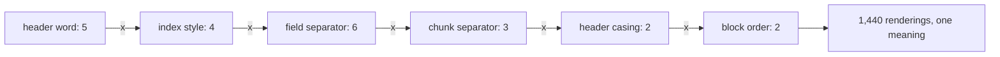
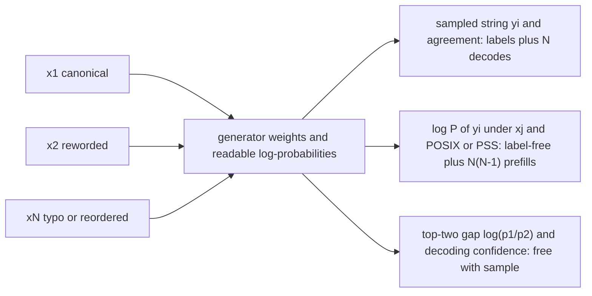
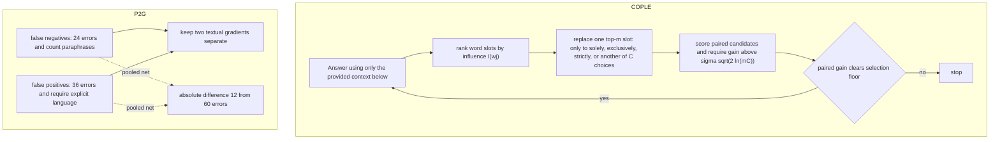

# Chapter 10: Prompt Sensitivity

This chapter explains how meaning-preserving prompt changes can alter Retrieval-Augmented Generation (RAG), how to measure the effect, and how to make defensible template and optimization decisions.

## TL;DR

- Six meaning-free wrapper choices create 1,440 renderings of one request. Published spreads reach 76 accuracy points, so prompt format is a tuned system parameter.
- A single accuracy score is one draw from a format family. Compare retrievers only after controlling or independently optimizing the format for each arm.
- The prompt sensitivity index (POSIX) measures how much an answer's log-likelihood moves across equivalent prompt variants. It needs no correctness labels.
- Decoding confidence is a free warning signal. A small top-two probability gap means a modest prompt change can flip the next token.
- Sensitivity can rank candidate prompts, but it cannot certify correctness. A generator can trust a wrong retrieved passage and stay confidently wrong under every rewrite.
- In-format examples reduce sensitivity more than model scale or ordinary instruction tuning. They still do not eliminate the spread, and they consume context and key-value cache capacity.
- Prompt optimization needs a restricted search, paired comparisons, staged allocation, and held-out confirmation. Otherwise selection noise can fully explain a reported gain.

## The story

Imagine a restaurant where a pantry runner retrieves the ingredients and a chef prepares the answer. The order ticket is the prompt. The retrieved chunks are the ingredients placed beside that ticket. The wrapper is the ticket layout, including its header, numbering, separators, casing, and where the cooking instruction appears.

Two tickets can request the same meal but use different boxes and punctuation. The chef still sees different marks in different positions. That is why an identical request can produce a different dish.

The manager first lists every harmless ticket layout. Six layout choices multiply into 1,440 tickets for one meaning. The manager treats the winning layout as a kitchen setting, not as decoration. The manager also checks whether the finished plate follows the required serving format, because an unreadable plate fails even when its food is correct.

Labels are slow, so the manager needs a faster fragility test. For each equivalent ticket, the chef exposes how strongly it prefers the dish it produced. POSIX compares those preference scores across tickets. Large movement means the chef depends heavily on ticket layout.

The top-two choice gap is another clue. A chef barely choosing soup over salad can flip after a tiny layout change. A chef with a wide preference gap needs a larger change. The manager must not confuse steadiness with correctness. If the pantry runner supplies the wrong ingredient, the chef can prepare the wrong dish with complete confidence every time. Sensitivity therefore helps rank ticket layouts, but a groundedness or labeled check must still inspect the meal.

The kitchen can pin a few correctly filled sample tickets beside the station. Those in-format examples show the chef how this exact layout maps to an answer. A larger kitchen or more general training can improve average cooking, but neither directly teaches indifference to ticket layout. The examples narrow the spread, though they use counter space and eventually add less help.

Finally, an optimizer edits the ticket wording. It changes one influential word slot at a time because every-word combinations are too numerous to search. The manager tastes candidate dishes on the same orders, advances only clear winners, and confirms the survivor on untouched orders. The manager also puts overly inclusive and overly exclusive mistakes in separate trays. Mixing those trays gives the editor opposing instructions that cancel.

The lesson stays consistent across the kitchen. Control the ticket, measure the chef's reaction, inspect the retrieved ingredients, and distrust any winner selected on the same tasting set that created it.

## Decoder table

| Technical term | Plain-English meaning | Why it matters |
|---|---|---|
| Retrieval-Augmented Generation (RAG) | A system that retrieves passages and gives them to a generator | Prompt format can change how the generator uses the retrieved evidence |
| Prompt | The token sequence that asks the generator to act | The model consumes exact tokens, not only human meaning |
| Prompt template | Reusable text and structure around each request | It must be versioned and evaluated like any other configuration |
| Context wrapper | The headers and separators around retrieved chunks | Meaning-free wrapper edits can move accuracy and parse rate |
| Retrieved chunk | A passage supplied as evidence | Its placement and wrapper affect the generator's token context |
| Meaning-preserving format | A different spelling or layout with the same intended request | It isolates sensitivity to form rather than task meaning |
| Format family F | The complete set of allowed equivalent renderings | Accuracy should be viewed across this family, not at one arbitrary member |
| Format grammar | Independent slots and choices that generate prompt variants | It turns prompt formatting into a countable search space |
| FormatSpread | A tool that enumerates meaning-preserving prompt formats | Its reported spreads show that formatting effects can be very large |
| Token | One model input unit | Equivalent human text can become different token sequences |
| Tokenization | Conversion from text into token identifiers | A format change can alter length, position, and all later computation |
| Activation | A model's internal numeric state | Equivalent meanings need not create equivalent states |
| Key-value set | Attention memory created from earlier tokens | Retokenization changes what later tokens attend to |
| Residual stream | The evolving internal representation at each position | Format changes can move computation into a different region |
| Pre-training | Learning next-token likelihood from a corpus | It matches observed format frequencies and does not enforce format invariance |
| Instruction tuning | Training on instruction and response pairs | It improves instruction following but normally shows one rendering per instruction |
| Invariance | Equal behavior under meaning-preserving changes | Standard objectives do not explicitly require it |
| Low-density format | A format that appeared rarely in training data | Behavior there can be less smooth |
| Hyperparameter | A configuration chosen outside learned weights | The context wrapper can have a larger effect than many retriever changes |
| Accuracy A(f) | Correctness under format f | One reported value is a draw from the format family |
| Parse rate | Share of outputs that a parser can read | End-to-end quality can fall even when parsed-answer accuracy looks stable |
| Valid-response rate | Share of outputs that follow the required output form | It must be logged beside correctness |
| Regular expression | A text pattern used to extract fields such as citations | Format changes can break extraction without changing answer content |
| Exhaustive grid | Evaluation of every candidate format | It is reliable but can be expensive |
| Successive halving | Repeatedly test candidates and keep only the strongest fraction | It cuts format-search cost while preserving a small finalist set |
| Search split | Examples used to rank candidates | Reusing it for final proof creates selection bias |
| Held-out split | Untouched examples used only for confirmation | It is the clean fix for the winner's curse |
| Winner's curse | Inflation caused by selecting the best noisy score | Best-of-many gains can vanish on fresh data |
| Standard error | Expected sampling variation in an estimated score | It sets the noise floor for a claimed gain |
| Selection floor | Approximate best-of-many inflation under noisy evaluation | Candidate gains should clear it before acceptance |
| Paired test | Comparison on the same examples for both systems | Only discordant outcomes carry the difference signal |
| Per-arm maximum | Best score after tuning each system separately | It is the fair target when formats interact with retrievers |
| Generator | The model that writes the answer | Its model family and tokenizer determine format preferences |
| Open-weight model | A generator whose weights can be run and scored directly | It enables teacher-forced log-likelihood evaluation |
| Hosted generator | A model accessed through a vendor service | Missing token probabilities can block POSIX computation |
| Application programming interface (API) | A service boundary for model calls | Its probability access determines available monitors |
| Variation operator | A rule that creates equivalent prompt variants | The chosen family defines what sensitivity means |
| Output agreement | How often variants produce the same answer | It is easy to understand but discards probability margins |
| Exact match | Equality only when answer strings are identical | It is too brittle for free-form grounded answers |
| Embedding threshold | A similarity cutoff for deciding whether answers match | It is not a complete equality rule for grounded answers |
| Log-likelihood | The model's score for an entire answer under a prompt | Its movement across variants is the core sensitivity signal |
| Ordered pair | A source prompt and target prompt where direction matters | Canonical-to-typo and typo-to-canonical scoring can differ |
| Prompt sensitivity index (POSIX) | Average absolute per-token log-likelihood shift across ordered prompt pairs | It measures distributional consistency without correctness labels |
| Prompt sensitivity score (PSS) | An instance-level sensitivity score paired with generation confidence | It exposes risky queries that a dataset mean can hide |
| Decoding confidence | Strength of the model's emitted-token preferences | More confident generations tend to be more consistent under rewording |
| Logit | An unnormalized score before token probabilities | Top-two logit distance is the flip barrier |
| Argmax | The option with the largest score | The answer changes when perturbation crosses the winner's margin |
| Top-two gap | Log ratio between the two leading token probabilities | A small gap means higher fragility |
| Mean per-token log-probability | Average emitted-token confidence across an answer | It is free to log because decoding already computes it |
| Nat | A log-likelihood unit using natural logarithms | It gives prompt drift and decoding margin shared units |
| Teacher-forced scoring | Scoring a supplied continuation token by token | POSIX needs it for answers not sampled from the scoring prompt |
| One-sided sensitivity | Score one canonical answer under the rewrites | It is much cheaper but misses reverse-direction effects |
| Full POSIX matrix | Score every variant answer under every other variant | It preserves asymmetry at higher compute cost |
| Prefill | Parallel processing of prompt and supplied answer tokens | POSIX rescoring mostly uses this cheaper phase |
| Decode | Sequential generation of new tokens | It is slower per token for the worked hardware case |
| bfloat16 (bf16) | A 16-bit numeric format for model weights and compute | It sets the worked memory and throughput arithmetic |
| Graphics processing unit (GPU) | Hardware used to run the generator | Compute time and memory set evaluation cost |
| Floating-point operation (FLOP) | One arithmetic operation used in compute accounting | Prefill cost is estimated from parameter and token counts |
| Trillion floating-point operations per second (TFLOP/s) | A compute throughput rate | It converts prefill work into time |
| Memory bandwidth | Rate at which weights can be read | It bounds decode speed in the worked example |
| Operations-to-byte ratio | Compute rate divided by memory bandwidth | It checks the maximum prefill-to-decode speed gap |
| Label-free proxy | A measurable signal used without gold correctness labels | It can reduce labeling, but it cannot replace correctness evidence |
| Correlation rho | Linear association between sensitivity and accuracy | A negative value supports ranking but leaves residual error |
| Absolute correlation r | Magnitude of the sensitivity-accuracy correlation | It controls ranking accuracy and captured oracle gain |
| Best linear prediction | Accuracy estimate derived from sensitivity and correlation | Its residual shows why sensitivity is not an accuracy meter |
| Residual standard deviation | Accuracy variation left after using the proxy | It quantifies uncertainty that the proxy cannot remove |
| Gaussian copula | A joint model used to connect correlation with rank agreement | It yields the pairwise ordering probability in the chapter |
| Kendall's tau | A rank association measure | It turns correlation into expected pairwise ranking accuracy |
| Confident error | A stable, high-margin answer that is wrong | Sensitivity can mark it safe even when retrieval misleads the generator |
| Retrieved distractor | A fluent but wrong passage used as evidence | It can make a wrong answer both grounded-looking and stable |
| Self-consistency | Agreement among repeated samples from one fixed prompt | It measures sampling variation, not prompt variation |
| Temperature | A control on sampling randomness | Temperature zero can be self-consistent while still format-sensitive |
| Mean accuracy over formats | Average accuracy across the format family | Scale and instruction tuning can lift it |
| Variance over formats | Accuracy spread across equivalent renderings | Prompt robustness is a claim about this quantity |
| Few-shot prompting | Adding solved examples to the prompt | In-format examples supply a local pattern that narrows sensitivity |
| In-format demonstration | A solved example using the live wrapper exactly | Matching typography is part of the proposed mechanism |
| Copy mechanism | Attention from a current pattern to earlier matching patterns | It adds evidence for the demonstrated continuation |
| Local prior | Pattern evidence placed in the current prompt | It replaces dependence on how common that typography was in training |
| Softmax attention | Normalized attention over available context | Normalization makes each added example contribute less at larger k |
| Key-value (KV) cache | Stored attention state for prompt tokens | More demonstrations reduce concurrency unless the prefix is shared |
| Prefix cache | One stored KV state reused for a shared prompt prefix | It can remove most repeated cache cost for fixed demonstrations |
| Grouped-query attention | Attention with fewer key-value heads than query heads | It can reduce KV bytes per token |
| Low-Rank Adaptation (LoRA) | A cheaper parameter adaptation method | It lowers instruction-tuning cost but still optimizes the wrong robustness statistic |
| Automatic prompt optimization | Programmatic search over prompt wording | Search gains depend on proposal restrictions and accept tests |
| COPLE | A black-box framework for combinatorial optimization over a prompt's lexicon | It makes exponential word choices tractable through coordinate moves and influence ranking |
| Lexicon | The allowed word choices in a prompt | Its size determines the raw combinatorial space |
| Coordinate move | Change one word slot while holding all others fixed | It gives credit assignment but misses word interactions |
| Coordinate-wise local optimum | A prompt no single allowed word replacement improves | COPLE can reach this result but cannot claim a global optimum |
| Leave-one-out influence | Score change after removing one word | It ranks word slots before spending on replacements |
| Proxy-task score | Noisy development-set objective used during search | Its noise floor can dominate reported gains |
| Accept rule | Test that decides whether a candidate replaces the incumbent | It determines whether improvements survive held-out evaluation |
| Best-arm identification | Allocate more evaluation to promising candidates | It reduces the cost of selecting a winner |
| ProTeGi | A method that uses textual feedback and staged candidate evaluation | Its best-arm step supports disciplined prompt search |
| Textual gradient | Natural-language critique that suggests an opposite prompt edit | It converts error examples into an edit direction |
| Minibatch | A small sample of errors used for feedback | Pool composition can cancel opposing signals |
| False positive | A negative case incorrectly classified as positive | Its critique calls for a stricter instruction |
| False negative | A positive case incorrectly classified as negative | Its critique calls for a more inclusive instruction |
| P2G | A method that keeps opposing error pools as separate improvement directions | It prevents false-positive and false-negative feedback from canceling |
| Pooled critic | One critique written from mixed error types | Opposing corrections can shrink its useful signal to zero |
| Credit assignment | Knowing which edit caused a score change | Whole-prompt rewrites obscure it |
| Semantic drift | An edit that quietly changes the task meaning | It can create a false proxy-set win |
| APE | A named whole-prompt rewriting approach | It can escape a coordinate basin but loses per-edit attribution |
| OPRO | A named whole-prompt rewriting approach | It shares the higher-variance accept-test problem of free-form rewriting |

## Core mechanics

### 10.1 How much formatting alone moves accuracy

#### Count the format family

- **What:** Decompose the context wrapper into independent choices.
- Headers are Document, Passage, Context, Source, or Excerpt. Indices are 1, 01, [1], or (a). Field separators are colon-space, colon-newline, space-hyphen-space, bare newline, space-pipe-space, or space-double-colon-space. Chunk separators are one newline, two newlines, or a horizontal rule. Header casing and instruction position each have 2 choices.
- Their product is 1,440 renderings of one meaning.
- **Why:** The count makes the supposedly cosmetic format a real search space.
- **Failure without it:** A team treats one inherited string as neutral and attributes its effect to the retriever or model.
- **Cost or complexity:** The raw family is small enough for a grid once, but not cheap enough to repeat carelessly on every release.

$$
|F| = 5 × 4 × 6 × 3 × 2 × 2 = 1,440
$$

#### Explain the mechanism

- **What:** A format change retokenizes the prompt.
- Different token lengths move later positions, attention inputs, and residual-stream states.
- Pre-training assigns likelihood according to corpus frequency.
- It does not supply an operator that makes equivalent renderings identical.
- **Why:** This explains why typography can change behavior even when human meaning stays fixed.
- **Failure without it:** Engineers assume model scale or instruction tuning must remove the effect.
- **Cost or complexity:** The effect persisted in LLaMA-2-70B and GPT-3.5. No single format won across models.

#### Preserve the observed claim limits

- Sclar et al. (2024) measured a worst-to-best spread of up to 76 accuracy points on one LLaMA-2-13B task.
- A Japanese-template study reported GPT-4 moving from roughly 49% to 25.44% under a meaning-preserving restructure.
- The chapter reports worse robustness for less-studied languages than for English.
- These findings establish large possible effects.
- They do not make every observed four-point change real.

#### Treat accuracy as format-indexed

- **What:** Report accuracy as A(f), where f identifies the wrapper.
- A single A(f0) is one draw, not the system's format-independent accuracy.
- A shared f0 comparison estimates the difference at that one format.
- The desired tuned comparison is the difference between each arm's own maximum.
- **Why:** A retriever change alters the context content and can alter which wrapper works best.
- **Failure without it:** Format noise can be larger than the retriever delta.
- **Cost or complexity:** Separate format searches cost one sweep per arm. Fixing f0 is cheaper, but then the format and its spread must be published.

$$
\widehat{\Delta} = A_{R_1}(f_0) - A_{R_2}(f_0)
$$

$$
\Delta^\star = \max_f A_{R_1}(f) - \max_f A_{R_2}(f)
$$

#### Search efficiently and control selection bias

- **What:** Use successive halving over the format grammar.
- Start with all candidates on a small seed.
- Keep the top quarter and increase the evaluation set each round.
- Select on a search split.
- Confirm the winner on an untouched held-out split.
- **Why:** It preserves budget for confirmation while reducing the grid dramatically.
- **Failure without it:** Best-of-1,440 selection can turn noise into an apparent gain.
- **Cost or complexity:** The worked grid costs 720,000 generations and $812.
- Successive halving costs 56,420 generations, 7.8% of the grid, and about $64.

#### Read the worked result correctly

- The worked search finds 71.2% best, 52.8% worst, and 64.0% incumbent accuracy.
- That is an 18.4-point spread and a 7.2-point apparent gain.
- On 500 questions at p about 0.64, one-arm standard error is 0.021, or 2.1 points.
- The independent-arm best-of-family approximation is 8.0 points of inflation.
- Correlated format scores make the true inflation smaller than 8 points, but not zero.
- A four-point movement is therefore plausible and still under two one-arm standard errors.
- The first response is a paired test on discordant questions, not an automatic rollback.

#### Own the full output contract

- **What:** Log valid-response rate beside parsed-answer accuracy.
- **Why:** Formatting can change whether the response is parseable.
- **Failure without it:** A benchmark can hide end-to-end loss.
- A two-point parsed-accuracy loss plus a five-point parse-rate loss becomes a seven-point service loss.
- **Cost or complexity:** Logging is cheap. Ignoring it can misdiagnose the component that failed.

#### Practical decision rule

- Version the template with measured accuracy, parse rate, and an owner.
- Search again after a generator, version, vendor, or tokenizer change.
- Use exhaustive search only when the family is under about 50 candidates.
- Report each system as the best format searched over F.
- If transfer matters, test the old top 5 plus 20 random formats on the new model.
- Keep the old winner only if it lands in the new top quintile under the stated tie-breaker. A shared tokenizer and shared instruction-tuning lineage favor transfer, but do not prove it.

### 10.2 Measuring sensitivity with POSIX, PSS, and decoding confidence

#### Replace agreement with probability movement

- **What:** Build N intent-preserving variants for each query.
- Variants can include a paraphrase, typo, option reorder, or wrapper-header change.
- Agreement decodes all N variants and asks whether their outputs match.
- POSIX instead measures how the generated answer's log-likelihood moves under other variants.
- **Why:** Probability movement preserves distance to a decision flip.
- **Failure without it:** Exact match and embedding thresholds do not provide a reliable equality rule for free-form grounded answers.
- Agreement also treats a one-nat margin and a twenty-nat margin as equally stable if both emitted strings match.
- **Cost or complexity:** Agreement needs N full decodes. POSIX needs decodes plus cheaper teacher-forced scoring passes.

#### POSIX definition and design choices

- **What:** Generate response y_i from prompt x_i. Chatterjee et al. (2024) call the resulting index POSIX.
- Score y_i under every other x_j.
- Take the absolute log-likelihood ratio.
- Divide by answer length.
- Average over all ordered pairs.
- **Why:** Absolute value prevents opposing shifts from canceling.
- Length normalization reports nats per token rather than rewarding short answers.
- Ordered pairs preserve directional asymmetry.
- **Failure without it:** A variant that raises one answer's likelihood and lowers another's can average to false calm.
- **Cost or complexity:** The full matrix uses N(N - 1) scoring passes after N generations.

$$
\operatorname{POSIX} = \frac{1}{N(N-1)} \sum_{i=1}^{N} \sum_{j \ne i} \frac{1}{|y_i|} \left|\log \frac{P(y_i \mid x_j)}{P(y_i \mid x_i)}\right|
$$

- A 40-token answer moving from total log-likelihood -12.0 to -13.6 contributes 1.6 / 40 = 0.040 nats per token.

#### Connect sensitivity to the decoding margin

- **What:** Let p1 and p2 be the top two next-token probabilities.
- Their logit gap is log(p1 / p2).
- A rewrite flips the argmax only when it moves the gap far enough.
- **Why:** Drift and margin now share units.
- **Failure without it:** A raw agreement bit discards how close the answer was to changing.
- **Cost or complexity:** Mean per-token log-probability costs nothing extra because decoding already computes it.

$$
\Delta z = \log \frac{p_1}{p_2}
$$

$$
\bar{\ell}(y) = \frac{1}{|y|} \sum_{t=1}^{|y|} \log p(y_t \mid x, y_{1:t-1})
$$

- A confident 0.90 versus 0.05 split has a 2.89-nat barrier.
- A hesitant 0.35 versus 0.30 split has a 0.154-nat barrier.
- The hesitant step is 19 times closer to flipping under the same perturbation.

#### Use PSS for tails

- **What:** PSS pairs instance-level sensitivity with confidence.
- **Why:** Production failures concentrate in the tail, not necessarily in the mean.
- **Failure without it:** A mean can look calm when 5% of queries sit at 0.09 nats per token and the other 95% sit at 0.005.
- **Cost or complexity:** Tail quantiles require storing per-query scores, but not new labels.

#### Respect scoring access limits

- **What:** POSIX needs teacher-forced log-likelihood for an arbitrary answer under another prompt.
- **Why:** The score cannot be reconstructed from only the tokens a hosted model chose to emit.
- **Failure without it:** A monitor is designed around a capability the vendor does not expose.
- **Cost or complexity:** Open weights permit direct scoring. Many hosted chat APIs do not provide it.
- A judge model is a fallback only when the generator hides token probabilities.
- The judge adds its own prompt sensitivity and costs 56 calls per query at N = 8.

#### Price full and one-sided measurement

- The worked generator has 7 billion parameters in bf16 on one A100-80GB.
- It uses 14 GB of weights, 2.0 TB/s memory bandwidth, and 156 TFLOP/s achieved compute.
- A 1,400-token prefill costs 0.13 s.
- A 120-token decode costs 0.84 s.
- One generation costs 0.97 s.
- One 1,520-token scoring pass costs 0.136 s.
- A labeled eight-variant sweep over 500 queries costs 4,000 generations, 3,880 GPU-seconds, and 4,000 unavailable judgments.
- Full POSIX costs 15.4 s per query, 7,700 s total, or 2.1 GPU-hours.
- One-sided sensitivity costs 1.92 s per query, 960 s total, or 16 GPU-minutes.
- One-sided scoring is about 8 times cheaper than the full matrix.
- It can miss sensitivity that appears only in the reverse direction. Escalate to the full matrix when variants disagree on the answer string.

#### Interpret a score without inventing a threshold

- Six ordered-pair shifts over three variants sum to 5.7 nats on a 40-token answer.
- POSIX is 5.7 / (40 × 6) = 0.0238 nats per token.
- Over 120 tokens, that is 2.85 nats of total drift and a 17-fold likelihood ratio.
- It is 0.8% of a 2.89-nat confident barrier and 15% of a 0.154-nat hesitant barrier.
- Sensitivity has no absolute safe threshold.
- Compare candidates only under the same variant family, query set, and tokenizer.
- Report the total answer swing beside the per-token value.
- Gate a template against the incumbent's relative sensitivity and alert on a tail quantile. Rebaseline after any model or tokenizer change.

### 10.3 Sensitivity as a label-free performance predictor

#### Separate ranking from measurement

- **What:** Sensitivity S and accuracy A have a reported strong negative correlation.
- Let rho be their correlation and r its absolute value.
- Best linear prediction gives a point estimate and a residual standard deviation.
- **Why:** The residual quantifies what the proxy cannot know.
- **Failure without it:** A team writes that the lowest-sensitivity template is the most accurate without labels.
- **Cost or complexity:** Estimating r requires a labeled vertical with the same model, task, and variant family.

$$
\widehat{A} = \mu_A + \rho \frac{\sigma_A}{\sigma_S}(S - \mu_S)
$$

$$
\operatorname{sd}(A - \widehat{A}) = \sigma_A \sqrt{1-\rho^2}, \qquad A = \rho Z + \sqrt{1-\rho^2}\,\varepsilon
$$

- At r = 0.7, the residual is 0.714 σ_A.
- The proxy removes 28.6% of accuracy uncertainty, not 70%.
- If σ_A is 4.5 points, one residual standard deviation is 3.2 points.
- The corresponding 95% interval is plus or minus 6.3 points.

#### Convert correlation into ranking quality

- **What:** Under the chapter's bivariate normal assumption, the Gaussian copula connects correlation to Kendall's tau.
- The probability of ordering a random pair correctly depends on arcsin r.
- **Why:** Ranking only needs the sign of a difference.
- **Failure without it:** The phrase "strong correlation" hides a substantial reversal rate.
- **Cost or complexity:** Even a high r leaves some pairs backwards.

$$
\tau = \frac{2}{\pi}\arcsin \rho, \qquad \Pr[\text{correct order}] = \frac{1}{2} + \frac{1}{\pi}\arcsin r
$$

- r = 0.3 gives 59.7% pairwise accuracy.
- r = 0.5 gives exactly two thirds.
- r = 0.7 gives 74.7%.
- r = 0.9 gives 85.6%, so about one pair in seven is still backwards.

#### Explain the correlation and its blind quadrant

- **What:** Sensitivity and correctness both depend partly on decoding margin.
- Small margins make tokens easier to flip and likelier to be wrong.
- **Why:** A shared cause explains the negative correlation.
- **Failure without it:** The proxy is mistaken for the target variable.
- A retrieved distractor can create a wide-margin wrong answer.
- That answer stays stable under paraphrases, reorders, and typos.
- Low sensitivity therefore covers both confidently correct and confidently wrong answers.
- **Cost or complexity:** Pair sensitivity with a check that reads the retrieved evidence, plus labels on the finalist slice.

#### Do not substitute self-consistency

- **What:** Self-consistency samples repeatedly from one fixed prompt.
- Prompt sensitivity changes the prompt while holding the requested meaning fixed.
- **Why:** They probe different sources of variation.
- **Failure without it:** Temperature zero appears perfectly self-consistent while formatting can still move accuracy by 76 points.
- **Cost or complexity:** Sampling k completions adds k decodes and still does not isolate wrapper sensitivity.

#### Use a shortlist-then-label protocol

- The worked case has six templates and 500 unlabeled legal queries.
- Labeling all candidates requires 3,000 judgments, 100 expert hours, $3,000, and nine days.
- Sensitivity ranking costs 5,760 GPU-seconds, 1.6 GPU-hours, and $4.00 in the direct configuration.
- With r = 0.7 and σ_A = 4.5, a labeled oracle gains 5.7 points over random selection.
- The label-free pick captures 70% of that gain, or 4.0 points.
- Of 15 template pairs, the expectation is 11.2 correctly ranked and 3.8 backwards.
- Keep the top two, then label 200 paired questions per finalist.
- That requires 400 judgments, 13.3 expert hours, $400, and one day.
- If the finalists disagree on 30 of 200 questions, their paired difference standard error is 2.7 points.
- The hybrid uses 13% of the full-label cost.
- The chapter later reports $3.20 for ranking all six in this hybrid protocol.
- That value and the earlier $4.00 direct configuration are both retained as stated.

#### Practical decision rule

- Use sensitivity to shortlist and labels to decide.
- Report a rank such as "lowest sensitivity of six candidates."
- Do not publish predicted accuracy from sensitivity alone.
- Ship on sensitivity alone only when the residual cannot change the decision.
- Estimate r on a labeled vertical before transferring it. Fix the candidate count F before looking at the scores.
- Re-estimate r after any generator change.
- Pair the monitor with a groundedness check for confident errors.

### 10.4 Few-shot beats scale for reducing sensitivity

#### Name the statistic being optimized

- **What:** Accuracy across formats has a mean and a variance.
- Scale and ordinary instruction tuning target expected likelihood and tend to lift mean accuracy.
- Prompt robustness concerns variance over the meaning-preserving format family.
- **Why:** The three candidate interventions do not act on the same statistic.
- **Failure without it:** A team buys a 10-times larger serving bill to solve a variance problem the objective never names.
- **Cost or complexity:** Measuring variance requires evaluating a format family rather than one leaderboard prompt.

$$
\mu_M = \mathbb{E}_{f \sim F}[A_M(f)]
$$

$$
\sigma_M^2 = \operatorname{Var}_{f \sim F}[A_M(f)]
$$

#### Why scale and standard instruction tuning do not impose invariance

- **What:** Pre-training minimizes expected negative log-likelihood under observed corpus frequencies.
- Standard instruction tuning keeps cross-entropy and swaps in instruction-response data.
- Neither objective normally ties two renderings of one request to the same output distribution.
- **Why:** A missing constraint receives no direct gradient.
- **Failure without it:** Better average accuracy is reported as format robustness.
- **Cost or complexity:** Sclar et al. found formatting spread persisting from 13B to 70B and into GPT-3.5.
- GPT-4 was reported as more robust than smaller models while still sensitive.
- Format preferences did not transfer across model families.

#### Why in-format demonstrations help

- **What:** Put k solved examples in the exact live wrapper before the query.
- Attention can match the current pattern to prior examples and add evidence to the demonstrated continuation.
- Model each demonstration as adding g nats to the top-two margin.
- **Why:** The prompt supplies a local typography prior that does not depend on corpus frequency.
- **Failure without it:** A demonstration rendered in a different wrapper uses context without supplying the intended pattern match.
- **Cost or complexity:** Attention normalizes over demonstrations, so g shrinks as k grows and the curve flattens.

$$
\Delta z(k) = \Delta z_0 + kg
$$

- The worked values are Δz0 = 0.154 nats, g = 0.35 nats, and drift = 0.0238 nats per token.
- Drift is 15.5% of the barrier at k = 0.
- It is 4.7% at k = 1, 2.8% at k = 2, 1.5% at k = 4, and 0.81% at k = 8.
- At k = 8, the barrier is 2.954 nats, close to the 2.89-nat confident-step barrier.
- Few-shot reduces sensitivity more than scale or instruction tuning in the cited work.
- It does not eliminate sensitivity at any k.

#### Price the three interventions

- **Scale to 70B:** bf16 weights require 140 GB, so the model does not fit one 80 GB card.
- Two cards each stream 70 GB per decode step.
- Decode becomes 35 ms per token and 4.2 s for 120 output tokens.
- This is 5 times the latency, 2 times the hardware, and 10 times the GPU-seconds of the 7B case.
- **Instruction-tune 7B:** 50,000 examples at 1,500 tokens produce 7.5 × 10^7 training tokens.
- The chapter's 6ND estimate is 3.15 × 10^18 FLOPs and 5.6 GPU-hours.
- LoRA is cheaper still, and serving cost stays unchanged.
- **Four demonstrations:** Four 250-token examples grow the prompt from 1,400 to 2,400 tokens.
- Prefill rises from 0.126 s to 0.215 s.
- Total latency moves from 0.97 s to 1.06 s, a 9% increase.

#### Account for KV cache and concurrency

- **What:** The 7B example uses 0.524 MB of KV cache per token.
- With 66 GB free, concurrency falls from 89 requests at 1,400 tokens to 52 at 2,400 tokens.
- That is a 42% throughput cut before runtime overhead.
- **Why:** Context, not arithmetic compute, is the binding cost of demonstrations here.
- **Failure without it:** A latency-only estimate hides the capacity loss.
- **Cost or complexity:** Put a fixed demonstration block ahead of retrieved chunks so a prefix cache can reuse it.
- The 70B grouped-query-attention example uses 0.328 MB per token.
- It caches less per token than the 7B because it has 8 key-value heads rather than an incorrectly assumed 64.

#### Practical decision rule

- Spend the first robustness budget on two to four in-format demonstrations.
- Start at k = 4 and measure sensitivity against prompt tokens.
- Do not jump directly to k = 16 because marginal gains shrink.
- Use scale when the failure is missing knowledge or reasoning depth.
- Few-shot cannot recover an answer document that retrieval never supplied.
- Keep demonstrations byte-identical to the live wrapper.
- Place a fixed block before retrieved chunks for prefix caching. Select demonstrations per query only when task diversity justifies losing that cache.
- Re-measure after a model swap instead of carrying k forward.
- When trading examples for retrieved chunks, score grounded accuracy and sensitivity for both arms.

### 10.5 Prompt optimization with COPLE and P2G

#### Count the lexical space before choosing an algorithm

- **What:** Represent a 60-word instruction as L word slots.
- Give each slot 8 meaning-preserving alternatives plus the incumbent.
- The raw space is 9^60, about 1.8 × 10^57 prompts.
- **Why:** The count rules out enumeration and unguided random search.
- **Failure without it:** A search result is described as broad when it covers a microscopic local slice.
- **Cost or complexity:** Every workable optimizer must impose a structural restriction.

$$
|X| = (C + 1)^L = 9^60 ≈ 1.8 × 10^57
$$

#### COPLE restriction and guarantee

- **What:** COPLE changes one word slot at a time.
- It measures leave-one-out influence for all L words.
- It permits replacements only at the top m slots.
- With L = 60, m = 10, and C = 8, one sweep costs 140 evaluations.
- **Why:** Influence ranking makes the sweep linear in prompt length rather than exponential.
- **Failure without it:** Whole-space search is impossible.
- Coordinate edits also miss interactions between words.
- **Cost or complexity:** Five sweeps evaluate 700 prompts, only 4 × 10^-55 of the space.
- The result is a coordinate-wise local optimum, not a global optimum.

$$
I(w_j) = \left|S(x) - S(x_{\setminus j})\right|
$$

$$
L + mC = 60 + 10 \times 8 = 140, \qquad \text{selection floor} \approx \sigma\sqrt{2\ln(mC)}
$$

#### The accept rule controls whether a gain is real

- **What:** Compare candidate and incumbent on identical examples. Pryzant et al. (2023) attach this best-arm-identification step to ProTeGi.
- Stage evaluation so weak candidates receive fewer examples.
- Confirm the final survivor on examples never used for ranking.
- **Why:** Search repeatedly selects the largest noisy score.
- **Failure without it:** A greedy keep-any-win rule accepts selection inflation at each sweep.
- **Cost or complexity:** At n = 200 and p about 0.70, one-arm standard error is 3.24 points.
- Best-of-80 selection has an approximate 9.6-point floor.
- A nine-point development gain can therefore be pure selection noise.
- With 24 disagreements in 200 paired examples, the difference standard error is 2.45 points.
- The unpaired comparison is 4.58 points.

#### P2G prevents feedback cancellation

- **What:** ProTeGi creates a textual gradient from a minibatch of errors.
- False positives ask for stricter language.
- False negatives ask for more inclusive language.
- P2G keeps those pools as separate improvement directions.
- **Why:** Their recommended edits point in opposite directions.
- **Failure without it:** A pooled critic follows only the difference between error counts.
- With 36 false positives and 24 false negatives, it acts on 12 errors of a 60-error signal.
- Four fifths of the information cancels.
- At equal counts, the pooled step becomes zero even though both error types remain fixable.
- **Cost or complexity:** P2G reports roughly 89% accuracy after three iterations across seven legal-domain classification tasks.
- The result was less dependent on the chosen iteration count.

#### Know when free-form rewriting loses and wins

- **What:** APE from Zhou et al. (2023) and OPRO from Yang et al. (2024) ask a model to rewrite the whole prompt from failures.
- **Why teams use it:** A large move can escape a basin that coordinate descent cannot.
- **Failure:** One rewrite can change fourteen parts at once, destroy credit assignment, and drift the task meaning.
- A broader proposal distribution also needs more evaluation for the same confidence.
- **Cost or complexity:** Use a free-form proposal only after two coordinate sweeps accept nothing.
- Treat it as a fresh incumbent.
- Resume coordinate-wise refinement so the shipped diff stays reviewable.

#### Price disciplined COPLE

- A 700-token prompt and 4-token answer cost 62.8 ms of prefill plus 28 ms of decode.
- One evaluation rounds to 91 ms.
- One candidate on 200 examples costs 18.2 s.
- A greedy sweep uses 28,000 generations and 2,548 s.
- Five greedy sweeps use 140,000 generations, 3.5 GPU-hours, and $8.85.
- Staged influence ranking uses 3,000 generations.
- Candidate halving uses 4,300 generations against 16,000 for flat scoring.
- The combined sweep uses 7,300 generations.
- Five staged sweeps use 36,500 generations, 3,322 s, 0.92 GPU-hours, and the source's stated $1.85. At its stated $2.50 per GPU-hour, 0.92 hours instead gives about $2.30, so those source values do not reconcile.
- The disciplined procedure is 3.8 times cheaper.
- It covers 700 prompts from a 1.8 × 10^57 space, so its guarantee remains local.

#### Practical decision rule

- Pair every accept test on identical examples.
- Use staged allocation and a held-out confirmation.
- The source allows flat scoring when mC is under about 10 and calls sqrt(2 ln 10), about 2.2, a 2.2-point floor. That value is only the multiplier. With the stated 3.24-point sigma, the formula gives about 7.0 points, so the source threshold does not reconcile.
- Make one-slot, meaning-preserving edits the default.
- Split errors by type before asking for critique.
- For multiclass tasks, use the largest off-diagonal confusion cells as directions.
- Stop adding a direction below roughly 20 errors.
- A critique from 5 examples is only a critique of those 5 examples.
- Score surviving prompts on POSIX and accuracy.
- At equal accuracy, prefer the flatter candidate.
- Re-run optimization after a generator, tokenizer, or wrapper change.

## Diagrams

### Figure 10.1



| Reported comparison | Accuracy movement |
|---|---:|
| LLaMA-2-13B, formatting alone | 76 points |
| GPT-4, template restructure | roughly 49% to 25.44% |

Scale in the source runs from 0 to 80 accuracy points between the worst and best semantically equivalent prompt.

Figure 10.1: One wrapper around the same retrieved chunks admits 1,440 semantically identical spellings, and choosing badly among them costs more accuracy than most retriever upgrades win. Spreads are as reported by Sclar et al. (2024) for LLaMA-2-13B and by the Japanese-template study for GPT-4.

### Figure 10.2



Figure 10.2: One forward pass over a family of meaning-preserving prompt variants offers three read-outs. The top one is what teams reach for and is the only one that needs labels. The middle one is POSIX, label-free and continuous. The bottom one is already in your logits and costs nothing to log on live traffic.

### Figure 10.3

```text
accuracy A (points)
^
|  o
|    o   o
|      o    o             upper residual band
|        o      o       /--------------------
|          o      o   /  negative slope rho sigma_A / sigma_S
|            o      o/-----------------------
| [filled points]
|  *   *   *   confident errors
|              stable under rewrites
|              wrong under labels
+--------------------------------------------------> prompt sensitivity S (nats per token)

Residual band width: plus or minus sigma_A sqrt(1 - rho squared)
```

Figure 10.3: Sensitivity tracks accuracy through the decoding margin, so the cloud slopes down and a ranking built on it beats chance. The filled points are what the proxy cannot see: answers held with a wide margin because the generator trusts a retrieved distractor. They sit in the quadrant the correlation promises is safe, and they are the failures a RAG system actually ships.

### Figure 10.4

```text
Top panel, schematic accuracy bands across 1,440 renderings

7B, zero-shot                 [----------|----------]
70B, or instruction-tuned             [----------|----------]
7B plus four in-format demos             [----|----]

Scale or instruction tuning translates the band.
In-format demonstrations narrow the band.

Bottom panel, drift of 0.0238 nats per token as a share of gap delta z(k)

k = 0  | ############### 15.5%
k = 1  | #####           4.7%
k = 2  | ###             2.8%
k = 4  | ##              1.5%
k = 8  | #               0.81%
```

Figure 10.4: Adding parameters or instruction data translates the band of accuracies over meaning-preserving formats, while in-format demonstrations narrow it (top panel, schematic). The mechanism is margin: under ∆z(k) = 0.154 + 0.35k nats, the drift measured in section 10.2 falls from 15.5% of the flip barrier to 1.5% by four demonstrations (bottom panel, derived).

### Figure 10.5



Figure 10.5: Both methods work by refusing to search the whole space. COPLE restricts edits to one influential word slot at a time, which makes the sweep linear in prompt length and the accept test the only thing standing between you and selection noise. P2G refuses to average its feedback: pooling false positives with false negatives leaves a step proportional to their difference, so the signal collapses exactly where both error types are still worth fixing.

## Whiteboard pack

### What to draw

1. Draw three boxes labeled "equivalent prompt wrappers."
2. Put "same meaning" above those boxes.
3. Add arrows from all three wrappers into one generator box.
4. Draw three readout boxes after the generator.
5. Label them "agreement," "POSIX log-likelihood drift," and "top-two confidence gap."
6. Draw a downward sensitivity-versus-accuracy cloud.
7. Add a filled cluster labeled "confident retrieved errors" in the low-sensitivity, low-accuracy region.
8. Draw a wide format-accuracy band for zero-shot and a narrower band for in-format examples.
9. Draw a prompt optimizer loop with one-word proposals, paired testing, staged allocation, and held-out confirmation.
10. Split the optimizer's error feedback into false-positive and false-negative branches.

### Spoken script

Prompt sensitivity means a model can react differently to two prompt formats that mean the same thing. I would draw a family of equivalent wrappers feeding one generator, then three readouts: agreement, POSIX, and decoding confidence. POSIX measures how much an answer's log-likelihood moves under rewrites without needing labels. Lower sensitivity can rank candidates, but it cannot certify accuracy because a model can be confidently wrong about a retrieved distractor. Few-shot examples usually narrow the spread more than scaling. Prompt optimization still needs paired tests, staged search, and held-out confirmation, or selection noise can look like a gain.

## Interview traps

### 1. A punctuation-only change moves accuracy by four points on 500 questions. Is that real?

It is plausible, because published meaning-preserving format spreads reach tens of points. It is not proven by that observation, because the one-arm standard error near 64% is 2.1 points and four points is under two such errors. Run a paired test on the discordant questions before rolling back.

### 2. Can POSIX tell you which prompt is most accurate without labels?

It can help rank comparable candidates, but it does not measure accuracy. At r = 0.7, pairwise ordering is 74.7% correct and the residual is 0.714 of the accuracy spread. Shortlist with POSIX, then use labels and a groundedness check on the finalists.

### 3. What if the hosted generator does not expose log-probabilities?

Full POSIX is unavailable because it needs teacher-forced scoring of arbitrary continuations. Use the weaker N-sample agreement measure on a traffic sample, retain any available emitted-token confidence, and treat an open-weight shadow model only as a canary for its own fragility.

### 4. When do few-shot examples not solve prompt sensitivity?

They do not manufacture missing knowledge, recover an answer document that retrieval omitted, or eliminate format spread. Their benefit also flattens as attention normalizes across more examples, while context and KV-cache costs grow. Measure the curve and still keep a sensitivity monitor.

### 5. When does prompt optimization not solve the problem?

COPLE cannot see interactions beyond its coordinate moves, so it can stop at a local optimum. Any optimizer can also select noise, drift the task meaning, or find a sharp prompt that fails after a format or model change. Use paired staged tests, untouched confirmation data, semantic review, and sensitivity scoring.

## Key numbers

| Topic | Number | Meaning or claim limit |
|---|---:|---|
| Opening regression | 64.0% to 59.8% | Grounded accuracy changes when only the wrapper format changes |
| Header words | 5 | Document, Passage, Context, Source, and Excerpt |
| Index styles | 4 | The worked format grammar has four choices |
| Field separators | 6 | The worked format grammar has six choices |
| Chunk separators | 3 | The worked format grammar has three choices |
| Header casing choices | 2 | The worked format grammar has two choices |
| Block orders | 2 | Instruction can precede or follow context |
| Total formats | 1,440 | Product of the six wrapper slots |
| LLaMA-2-13B spread | up to 76 points | Worst-to-best formatting spread on one task |
| Scale comparison | 13B to 70B | Formatting spread persisted under the reported scale increase |
| Other reported model | GPT-3.5 | Formatting sensitivity persisted there |
| Japanese GPT-4 restructure | roughly 49% to 25.44% | A 23.56-point drop under a task-preserving template change |
| Parse example | 2 plus 5 equals 7 points | Parsed accuracy loss plus parse-rate loss becomes end-to-end loss |
| Format evaluation set | 500 questions | Basis of the section 10.1 worked example |
| Retrieved context | 5 chunks at 250 tokens | 1,250 retrieved tokens per query |
| Other input | roughly 150 tokens | Question and instruction size |
| Total input | 1,400 tokens | Worked per-generation input |
| Output | 120 tokens | Worked grounded-answer length |
| Input price | $0.60 per million tokens | Pricing assumption |
| Output price | $2.40 per million tokens | Pricing assumption |
| Exhaustive grid | 720,000 generations | 1,440 formats on 500 questions |
| Exhaustive input | 1,008 million tokens and $604.80 | Input bill |
| Exhaustive output | 86.4 million tokens and $207.36 | Output bill |
| Exhaustive total | about $812 | Affordable once, not per release |
| Halving round 1 | 1,440 by 20 equals 28,800 | All formats on seed questions |
| Halving round 2 | 360 by 40 equals 14,400 | Top quarter advances |
| Halving round 3 | 90 by 80 equals 7,200 | Next quarter advances |
| Halving round 4 | 22 by 160 equals 3,520 | Rounded survivor count |
| Halving final | 5 by 500 equals 2,500 | Finalists on full set |
| Halving total | 56,420 generations | 7.8% of the grid and about $64 |
| Format search result | 71.2%, 52.8%, 64.0% | Best, worst, and incumbent |
| Search gain and spread | 7.2 and 18.4 points | Apparent improvement and full observed spread |
| Single-arm standard error | sqrt(0.64 × 0.36 / 500) = 0.021 | A 2.1-point one-arm noise scale |
| Best-of-1,440 factor | 3.81 | Approximate square root of 2 ln 1,440 |
| Selection inflation bound | up to 8.0 points | Independence approximation, with correlation making truth smaller |
| Retrieval roadmap delta | 2.5 points | 1.2 standard errors and under one seventh of the 18.4-point spread |
| Format noise ratio | roughly 9 times | Spread relative to one-arm standard error |
| Exhaustive-search threshold | family under about 50 | Chapter's default switch point |
| Small hand-written set | 3 or 4 candidates | Held-out confirmation may be skipped only knowingly |
| Best-of-4 factor and floor | 1.67 and 3.5 points | Selection accounting for four candidates |
| Transfer probe | old top 5 plus 20 random | Cheap model-migration test |
| Production traffic | 200,000 queries a day across 4 verticals | Labels cover only one vertical in the setup |
| Agreement margin contrast | 1 nat versus 20 nats | Same output agreement can hide very different fragility |
| Pair scoring example | -12.0 to -13.6 over 40 tokens | 0.040 nats per token |
| Confident top-two split | 0.90 versus 0.05 | log 18 equals 2.89 nats |
| Hesitant top-two split | 0.35 versus 0.30 | log 1.167 equals 0.154 nats |
| Margin ratio | 19 times | Hesitant step is closer to flipping |
| Tail example | 95% at 0.005 and 5% at 0.09 | Mean can hide the incident-producing tail |
| Variant count | N = 8 | Full ordered matrix has 56 cross-scores |
| Model and precision | 7B in bf16 | Worked measurement model |
| Hardware | one A100-80GB | Worked measurement device |
| Weights | 14 GB | 7B bf16 model size |
| Bandwidth | 2.0 TB/s | Decode arithmetic assumption |
| Peak compute | 312 TFLOP/s | Hardware peak |
| Achieved compute | 50% or 156 TFLOP/s | Prefill arithmetic assumption |
| Decode step | 7.0 ms | One full 14 GB weight read per token |
| Decode total | 0.84 s | 120 tokens |
| Prefill work | 1.96 × 10^13 FLOPs | 2PT for 1,400 tokens |
| Prefill time | 0.13 s | Worked estimate |
| One generation | 0.97 s | Prefill plus decode |
| Scoring pass | 1,520 tokens and 0.136 s | Prompt plus answer teacher-forced pass |
| Labeled variant sweep | 4,000 generations and 3,880 s | Also needs 4,000 judgments |
| Full POSIX | 8(0.97) + 56(0.136) = 7.76 + 7.62 = 15.4 s | 7,700 s or 2.1 GPU-hours for 500 queries |
| One-sided POSIX | 0.97 + 7(0.136) = 1.92 s per query | 960 s, 16 GPU-minutes, and about 8 times cheaper |
| POSIX shifts | 1.6, 0.4, 1.6, 0.7, 0.4, 1.0 | Six ordered-pair shifts total 5.7 nats |
| POSIX value | 0.0238 nats per token | 5.7 divided by 40 times 6 |
| Answer-level drift | 2.85 nats | 120-token extension of 0.0238 |
| Likelihood ratio | 17 times | Exponential of 2.85 |
| Barrier shares | 0.8% and 15% | Relative to confident and hesitant barriers |
| Scoring rate | 0.0895 ms per token | 1,520 tokens in 0.136 s |
| Hardware ratio | 78 times or 78 FLOP per byte | Prefill-to-decode check from compute over bandwidth |
| Template comparison | 0.024 versus 0.019 | 2.9 versus 2.3 nats over 120 tokens and roughly 17 versus 10 times likelihood |
| Candidate templates | 6 | Legal launch ranking example |
| Launch window | 3 weeks | Labels quote 9 days for a first batch |
| Working correlation | r = 0.7 | Stated assumption, not a universal constant |
| Residual ratio | sqrt(1 - 0.49) = 0.714 sigma_A | Leaves 71.4% of the original standard deviation |
| Uncertainty removed | 28.6% | Not 70% |
| Accuracy spread prior | sigma_A = 4.5 points | Worked legal-template assumption |
| Residual uncertainty | 3.2 points at one standard deviation | 95% interval is plus or minus 6.3 points |
| Pairwise accuracy at r 0.3 | 0.5 + 0.3047 / pi = 59.7% | Barely above chance |
| Pairwise accuracy at r 0.5 | two thirds | Exact result under the assumption |
| Pairwise accuracy at r 0.7 | 0.5 + 0.7754 / pi = 74.7% | About one pair in four backwards |
| Pairwise accuracy at r 0.9 | 85.6% | About one pair in seven backwards |
| Self-consistency temperatures | 0.7 and 0 | Sampling example and deterministic limit |
| Full labeling | 3,000 judgments | 2 minutes each, 100 hours, $30 per hour, $3,000, and 9 days |
| Six-template sensitivity run | 5,760 s | 1.6 GPU-hours and $4.00 at $2.50 per GPU-hour |
| Expected max of 6 normals | 1.267 | Exact working value, below the 1.89 asymptote |
| Oracle selection gain | 5.7 points | 4.5 times 1.267 |
| Proxy selection gain | 4.0 points | 70% of the oracle gain at r 0.7 |
| Pair accounting | 15 pairs | Expect 11.2 correct and 3.8 backwards |
| Hybrid labels | 400 judgments | 2 finalists by 200 questions |
| Hybrid labor and cost | 13.3 hours, $400, 1 day | 13% of full-label configuration |
| Finalist disagreement | 30 of 200 | Paired difference standard error is 2.7 points |
| Hybrid ranking price | $3.20 | Later source value retained alongside the $4.00 direct configuration |
| Format-family size | 1,440 | Used for mean-versus-variance analysis |
| Few-shot margin model | 0.154 + 0.35k nats | Stated additive approximation |
| Drift shares by k | 15.5%, 4.7%, 2.8%, 1.5%, 0.81% | Values at k equal to 0, 1, 2, 4, and 8 |
| Eight-shot barrier | 2.954 nats | 0.154 plus 2.80, close to 2.89 |
| 70B bf16 weights | 140 GB | Does not fit one 80 GB card |
| 70B serving | 2 cards at 70 GB each | 35 ms per token and 4.2 s for 120 tokens |
| Scale cost | 5 times latency, 2 times hardware, 10 times GPU-seconds | Spread still persists in the cited result |
| Instruction data | 50,000 by 1,500 tokens | 7.5 × 10^7 training tokens |
| Instruction-tuning work | 3.15 × 10^18 FLOPs | 5.6 GPU-hours under the 6ND estimate |
| Demonstration block | 4 by 250 tokens | Prompt grows from 1,400 to 2,400 tokens |
| Few-shot latency | 0.97 s to 1.06 s | Prefill becomes 0.215 s and total rises 9% |
| 7B KV cache | 524,288 bytes or 0.524 MB per token | 32 layers, 4,096 width, no grouped-query attention |
| Free cache | 66 GB | Worked concurrency budget |
| Concurrency | 66,000 / 734 = 89 to 66,000 / 1,258 = 52 | 1,400 to 2,400 tokens, a 42% cut |
| 70B KV cache | 327,680 bytes or 0.328 MB per token | 80 layers, 8 KV heads, head dimension 128 |
| Incorrect KV assumption | 64 heads | Would wrongly predict higher per-token cache |
| Recommended demonstration count | 2 to 4, default 4 | Measure before considering 16 |
| Retrieval trade | recall at 5 to recall at 7 | Two 250-token chunks compete roughly one-for-one with two examples |
| Optimizer development gain | 9 points | Reported after 5 iterations on 200 questions |
| Optimizer word diff | 11 words | Small diff does not prove causality |
| Raw lexical space | 9^60 or about 1.8 × 10^57 | 60 words with 8 replacements plus incumbent |
| COPLE active slots | m = 10 | Top influence positions admit replacement |
| COPLE sweep | 140 evaluations | 60 influence tests plus 10 by 8 candidates |
| Five COPLE sweeps | 700 prompts | About 4 × 10^-55 of the raw space |
| Proxy standard error | 3.24 points | n 200 and p about 0.70 |
| Candidate count | 80 | mC for 10 slots and 8 replacements |
| Best-of-80 factor | 2.96 | Approximate square root of 2 ln 80 |
| Best-of-80 floor | 9.6 points | Can fully explain a 9-point development gain |
| Paired disagreements | 24 of 200 | Difference standard error 2.45 points versus 4.58 unpaired |
| P2G error pools | 36 false positives and 24 false negatives | Net 12 from 60, so four fifths cancels when pooled |
| P2G result | roughly 89% after 3 iterations | Across 7 legal-domain classification tasks |
| Whole-prompt edit | 14 changes | Example of lost credit assignment |
| Short classifier prompt | 700 input and 4 output tokens | Prompt-optimization cost case |
| Short evaluation | 62.8 ms prefill plus 28 ms decode | About 91 ms total |
| One candidate | 200 examples and 18.2 s | At 91 ms per example |
| Greedy sweep | 28,000 generations and 2,548 s | 140 candidates or influence tests on 200 examples |
| Five greedy sweeps | 140,000 generations | 3.5 GPU-hours and $8.85 at $2.50 per hour |
| Influence ranking stage | 60 by 50 equals 3,000 | Smaller subset for slot ranking |
| Candidate halving stages | 2,000, 1,000, 500, 800 | 80 by 25, 20 by 50, 5 by 100, and 2 by 400 |
| Candidate allocation | 4,300 versus 16,000 | 27% of flat candidate scoring |
| Full staged sweep | 7,300 generations | Includes 3,000 influence-ranking generations |
| Five staged sweeps | 36,500 generations and 3,322 s | The source states 0.92 GPU-hours, 55 GPU-minutes, and $1.85, but 0.92 × $2.50 is about $2.30 |
| Savings | 3.8 times | Disciplined run versus greedy full-proxy run |
| Prefill share | 69% | The 0.065 s linear check agrees with 0.0628 s, or 62.8 ms of 91 ms |
| Long-answer decode share | 0.84 s of 0.97 s | Grounded-question case |
| Long-form optimization cost | roughly 10 times higher | Per evaluation than short-output classification |
| Three P2G iterations | 21,900 generations | About 110 full proxy-set passes |
| Flat-search threshold | mC under about 10 | The source calls sqrt(2 ln 10), about 2.2, a point floor. Its stated 3.24-point sigma makes the formula about 7.0 points |
| Rewrite escape trigger | 2 failed coordinate sweeps | Then admit one free-form proposal |
| Feedback direction floor | roughly 20 errors | A 5-example critique is too narrow to generalize |
