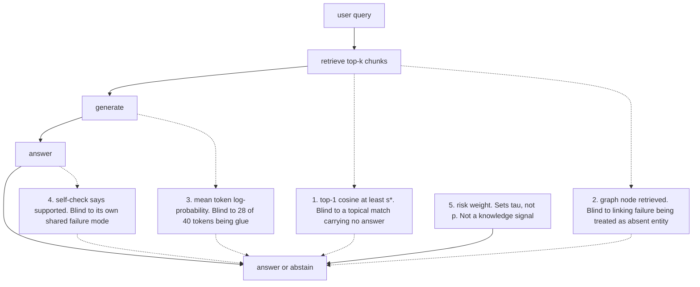
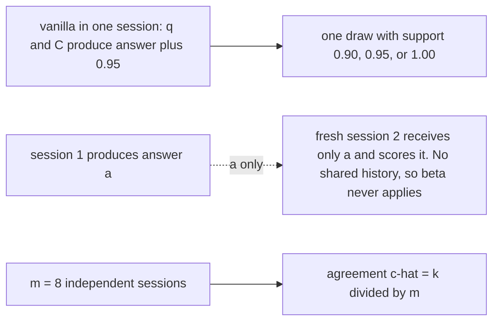

# Chapter 11: Abstention and Calibration

This chapter explains when a Retrieval-Augmented Generation (RAG) system should refuse, how to build a useful confidence signal, and how to keep that signal honest for short and long answers.

## TL;DR

- Abstention is a product decision. The model estimates correctness, while the product sets a threshold from the costs of a wrong answer and a refusal.
- A checkable citation can lower the harm of a wrong answer. A citation that users cannot inspect earns no such reduction.
- Every cheap abstention signal has a blind spot. Similarity sees topic, token probability sees fluency, and a self-check often repeats the generator's mistake.
- Repeated self-reflection can raise stated confidence without raising accuracy. It conditions the model on its own earlier answer instead of on new evidence.
- Calibration and failure prediction are different. A score can match average accuracy perfectly while being useless for sorting correct answers above wrong ones.
- A black-box model yields better confidence through independent samples than through a requested percentage. The extra resolution costs additional generation calls.
- Long answers need a confidence target that names what it summarizes. Expected claim support and the chance that every claim is supported can lead to opposite decisions.

## The story

Imagine a newsroom that answers readers' policy questions.

The retriever is the newsroom librarian. The librarian finds relevant files, but a relevant file may still omit the answer.

The generator is the writer. The writer turns those files into a clean reply, but fluent prose can still contain a wrong claim.

The support judge is the fact-checker. The fact-checker compares the draft with the files, yet the checker can also make mistakes.

The managing editor owns the decision to publish or refuse. The editor asks what a wrong story costs and what leaving a reader unanswered costs. Those costs set the publication threshold.

A checkable citation acts like a highlighted source packet beside the story. It lets the reader catch a residual mistake, but only when the packet opens to the relevant span.

The editor should not ask the writer to reread the same story eight times and treat eight approvals as independent. The writer sees the same files and the same draft. Each rereading can harden the original choice without adding evidence.

The editor also needs two scorecards. Calibration asks whether stories labeled 80% reliable are right about 80% of the time. Failure prediction asks whether good stories receive higher scores than bad stories. The publication gate spends the second property.

If the newsroom rents a black-box writer, it may not see internal token scores. It can send the same assignment to several fresh desks and measure agreement. That costs more calls, but it creates a score with more usable levels.

Finally, a six-paragraph story is not one indivisible fact. The editor must decide whether confidence means the expected fraction of supported claims or the chance that every claim is supported. The cost of one bad sentence decides which meaning the newsroom needs.

## Decoder table

| Technical term | Plain-English meaning | Why it matters |
|---|---|---|
| Retrieval-Augmented Generation (RAG) | A system that retrieves evidence and gives it to a generator | Retrieval supplies external evidence, but it does not guarantee a supported answer |
| abstention | Choosing not to answer | It can prevent costly unsupported claims |
| refusal | The user-facing result of abstention | Its rate and message affect utility and diagnosis |
| confidence p | An estimate between 0 and 1 that an answer is correct | The gate compares p with a product-owned threshold |
| threshold tau | The minimum confidence required to answer | Costs, not model instinct, determine it |
| wrong-answer cost cw | Harm from a wrong answer in units of one correct answer | Higher cw raises the threshold |
| abstention cost ca | Harm from leaving a query unanswered | Higher ca lowers the threshold |
| expected value | Average utility under uncertain outcomes | It turns answering versus refusing into a decision rule |
| cost matrix | The values assigned to correct, wrong, and refused outcomes | Different routes need different thresholds |
| global cutoff | One threshold used for every query type | It ignores differences in consequence |
| per-route threshold | A threshold attached to one intent or risk class | It keeps low-stakes and high-stakes queries separate |
| checkable citation | A source reference that opens to a readable supporting span | It can reduce the effective cost of a wrong answer |
| verification rate q | Fraction of users who open a citation and catch an unsupported claim | It controls how much value a citation adds |
| verification cost cv | Cost paid when a user checks a citation | It enters the effective wrong-answer cost |
| support gate | A classifier that decides whether evidence supports a claim | Its own errors cap enforceable precision |
| macro-F1 | The average F1 score across classes | The cited 80% value summarizes support-judge quality |
| precision | Fraction of answered queries that are correct | A selective system tries to raise it |
| recall | Fraction of valid items that a method retains | Refusing correct answers lowers it |
| coverage | Fraction of queries the system answers | Risk-coverage analysis trades coverage against selective quality |
| attribution judgment | Deciding whether a reference supports a claim | It measures the relation a grounded product promises |
| retrieve-or-not decision | Choosing whether to call retrieval before evidence exists | It is different from post-generation abstention |
| reflection token | A generated control signal that can trigger retrieval | It does not itself decide whether to refuse the final answer |
| retrieval similarity | A score for how close a query and chunk are in representation space | It measures topic overlap, not answer containment |
| top-1 cosine score | Similarity of the highest-ranked chunk | Its absolute level can drift across query types |
| dense passage retrieval | Retrieval through learned dense vector scores | Its training objective fixes score gaps, not global score levels |
| softmax objective | A normalized loss that rewards a positive document over alternatives | Adding a query-specific constant leaves it unchanged |
| normal distribution and standard normal CDF Phi | A stated bell-shaped score model and the fraction of its mass below a cutoff | They convert the proxy cutoffs into refusal and pass rates |
| temperature T | A scale inside a softmax or sampling distribution | It changes sharpness but does not add evidence |
| knowledge graph | Entities and relations stored as nodes and edges | Node absence can mean missing knowledge or a linking failure |
| entity linking | Mapping a text mention to a graph node | Multiple mentions compound linking errors |
| token log-probability | The log score assigned to generated tokens | It often reflects fluency and formatting more than factual support |
| nat | A log-probability unit based on the natural logarithm | The token example compares shifts in nats per token |
| syntactic glue | Words and punctuation that express structure rather than the claim | Glue tokens can dominate a mean token score |
| self-check | Asking a model to grade its own answer | Shared weights and context correlate checker and generator errors |
| true-positive rate | Pass rate on genuinely correct answers | It forms the numerator of a positive-check likelihood ratio |
| false-positive rate | Pass rate on wrong answers | Correlation can raise it and destroy the checker's value |
| likelihood ratio | How much a verdict changes prior odds | Independent and correlated checks can have very different ratios |
| risk weighting | Adjusting a decision for domain stakes | It belongs in the threshold, not in knowledge confidence |
| coverage gate | A gate that says the corpus does not cover a query | It should feed an index-gap workflow |
| entailment gate | A gate that checks whether evidence supports the generated claim | It diagnoses a different failure from missing coverage |
| cross-encoder | A scorer that reads a candidate and its context together | It adds a support or reranking pass with a separate latency bill |
| closed-world statement | A claim only about what a fixed corpus contains | It must not be confused with absence in the world |
| model collapse | Loss of low-probability behaviors after training on model samples | It is the long-timescale analogy for self-reflection drift |
| finite-sample error | Loss caused when a rare event never appears in a sample | Once absent, the next generation cannot learn it back |
| sampling resolution 1/N | The rarity level a sample of size N can represent | Events much rarer than 1/N are likely to disappear |
| absorbing absence | A missing behavior that cannot return from self-generated data | Repeated resampling erases the tail |
| self-reflection | Sequentially asking a model to critique or revise its own answer | It conditions later rounds on earlier model output |
| commitment bonus beta | Added logit support for repeating a prior claim | It can turn a slight preference into near-certainty |
| logit | An unnormalized score before probability conversion | A commitment bonus adds directly to it |
| log-odds | Logarithm of one outcome's odds against another | It shows how repeated commitment sharpens a choice |
| sigmoid | A map from log-odds to a probability | It converts 6.6007 log-odds to 0.9986 |
| self-consistency | Independent samples followed by a vote | Partial independence can improve accuracy |
| plurality vote | Choosing the answer with the most samples | It can beat sequential revision at equal token spend |
| Expected Calibration Error (ECE) | Bucketed mismatch between stated confidence and observed accuracy | It measures reliability, not ranking quality |
| Area Under the Receiver Operating Characteristic curve (AUROC) | Probability that a correct answer outscores a wrong one, with half credit for ties | It measures failure prediction and ordering |
| calibration | Agreement between a score and empirical correctness frequency | Users can interpret a calibrated probability |
| failure prediction | Separating correct from wrong answers by score | An abstention gate needs this property |
| recalibration | Monotone post-processing of existing scores | It can repair reliability but cannot create ordering |
| temperature scaling | One-parameter monotone recalibration of logits | It leaves strict score ordering unchanged |
| Platt scaling | A lower-variance parametric calibration map | It can be preferable with limited labeled data |
| isotonic regression | A flexible non-decreasing calibration map | It may merge buckets and turn ranking wins into ties |
| Brier score | Mean squared error of probability forecasts | It decomposes into reliability, resolution, and uncertainty |
| Brier skill score | Resolution divided by task uncertainty after reliability is zero | It measures improvement over the constant base-rate forecast |
| reliability REL | Penalty for confidence not matching bucket accuracy | Recalibration can drive it toward zero |
| resolution RES | Variation in accuracy across score buckets | A gate spends this separation, and post-processing cannot create it |
| uncertainty UNC | Base-rate variance fixed by the task | The confidence method cannot change it |
| base accuracy a | Overall probability an answer is correct | A constant score equal to a is calibrated but uninformative |
| climatology baseline | Always predicting the base rate | It exposes perfect reliability with zero useful separation |
| risk-coverage curve | Selective quality plotted against fraction answered | It shows every threshold operating point |
| black-box model | A model application programming interface (API) that hides weights and token probabilities | Confidence must be elicited from outputs and repeated calls |
| p99 latency | A response-time boundary that 99% of requests meet | Parallel confidence sampling can fit the median while missing the tail budget |
| sequence probability | Probability of one exact answer string | It splits mass across equivalent phrasings |
| perplexity | A length-normalized sequence score | It still scores strings rather than meanings |
| semantic entropy | Entropy after grouping answers by meaning | It repairs surface-form splitting with samples and entailment |
| bidirectional entailment | Checking whether two answers support each other both ways | It groups sampled phrasings into semantic clusters |
| verbalized confidence | A percentage requested in model text | It tends to occupy a few round values |
| agreement score | Fraction k/m of samples that agree with the served answer | It estimates the model's answer distribution |
| binomial model | A model for k agreements in m draws | It gives the variance and standard error of agreement |
| standard error SE | Sampling uncertainty of an estimated agreement fraction | It limits which adjacent score levels are distinguishable |
| self-probing | A fresh session that scores an answer produced elsewhere | It avoids the original session's commitment bonus |
| multi-step elicitation | Confidence per reasoning step followed by aggregation | It anchors scores to sub-claims |
| top-k elicitation | Asking for several candidate answers and confidence for each | It forces probability mass onto alternatives |
| pairwise ranking | Comparing sampled answers in pairs | The cited study found it best for calibration |
| average confidence | Averaging confidence across samples | The cited study found it best for failure prediction |
| P(True) | A prompted probability that a proposed answer is true | It is another black-box confidence probe |
| long-form calibration | Confidence for an answer with several atomic claims | One scalar can hide different notions of correctness |
| atomic claim | One independently verifiable statement | Long answers decompose into these units |
| support fraction S | Supported claims divided by total claims | It lies on a continuum from 0 to 1 |
| FActScore | Atomic-fact support fraction against a reliable source | It operationalizes long-form factual support |
| proportional utility | Value that scales with the supported fraction | It consumes the mean of S |
| all-or-nothing utility | Value that requires every claim to be supported | It consumes the probability that S equals 1 |
| cumulative distribution function (CDF) | Probability that S is at or below each level | It retains more information than one scalar |
| Continuous Ranked Probability Score (CRPS) | A proper score for a predicted distribution over S | It reduces to the Brier score for binary outcomes |
| indicator function | A term that equals 1 when its condition holds and 0 otherwise | It writes the realized support threshold inside CRPS |
| strictly proper score | A score optimized by reporting the true predictive distribution | It discourages strategic probability reports |
| continuous self-evaluation | Repeated fresh-session scoring of one answer | It estimates a distribution over support |
| claim-overlap similarity | Agreement measured over claims rather than exact strings | Long briefs rarely match word for word |
| VeriScore | A factuality measure that handles verifiability, context, and recall | It prevents short hedged answers from winning on precision alone |
| target claim count K | Desired number of claims for recall accounting | It exposes omitted content |
| F1 at K | Harmonic mean of fact precision and recall against K | It penalizes saying too little |

## Core mechanics

### 11.1 Should a RAG system ever refuse?

#### The decision belongs to the cost matrix

- **What:** Let p be answer correctness, cw the cost of a wrong answer, and ca the cost of abstaining. Normalize a correct answer to value 1.
- **Why:** The same p can be acceptable for a photocopier question and unacceptable for a drug interaction question because the consequences differ.
- **Failure without it:** One global cutoff becomes permissive on high-stakes traffic and conservative on low-stakes traffic.
- **Cost or complexity:** The product owner must state cw and ca per route. The model supplies only p.

Answering has expected value p - (1 - p)cw. Abstaining has value -ca. Answer when:

$$
p - (1-p)c_w > -c_a
\Longleftrightarrow
p(1+c_w) > c_w-c_a
\Longleftrightarrow
p > \tau = \frac{c_w-c_a}{1+c_w}
$$

At cw = 2 and ca = 0.5, tau = 1.5/3 = 0.500. At cw = 200 with the same ca, tau = 199.5/201 = 0.993.

If ca > cw, then tau < 0. The cost-optimal policy never refuses because abstention costs more than a wrong answer.

Abstention happens after retrieval and generation. A retrieve-or-not reflection token acts before evidence exists. A system can retrieve often and still refuse often.

#### Citations change cost, not confidence

- **What:** Let q be the fraction of users who open a citation and catch an unsupported claim. Let cv be the verification cost. The effective wrong-answer cost is:

$$
c'_w = (1-q)c_w + qc_v
$$

- **Why:** A readable cited span lets the user detect residual support failures.
- **Failure without it:** Citation presence alone does not carry correctness information. The cited FActScore result found citations on over 30% of supported sentences and over 30% of unsupported sentences.
- **Cost or complexity:** The product must measure citation open rate and span-level correctness. An access-controlled or unreadable source does not reduce cw.

At cw = 20, q = 0.6, and cv = 0.2, the effective cost is 8.12. The threshold moves from 19.5/21 = 0.929 to 7.62/9.12 = 0.836.

#### The support gate creates a ceiling

- **What:** The gate that labels an answer supported or unsupported is itself a classifier.
- **Why:** Its errors limit the precision that any cutoff can enforce.
- **Failure without it:** A team may promise 99% selective correctness even though the gate cannot deliver it at any threshold.
- **Cost or complexity:** The cited AttributionBench result is roughly 80% macro-F1. The book assumes symmetric class error as an optimistic simplification.

For base accuracy a = 0.81, the optimistic enforceable precision is:

$$
\frac{0.8a}{0.8a + 0.2(1-a)}
=
\frac{0.8 \times 0.81}{0.8 \times 0.81 + 0.2 \times 0.19}
=
\frac{0.648}{0.686}
= 0.945
$$

No threshold reaches 0.993 through that gate. Solving tau(cw) = 0.945 gives cw approximately 26 for bare answers and approximately 65 with citations. Above those stated bounds, change the interface or escalate to a human instead of pretending a cutoff can meet the stakes.

A standing disclaimer on 100% of answers is a constant rather than a correctness signal. It leaves cw unchanged, while a threshold-triggered refusal emits one correctness-correlated bit.

#### Worked traffic economics

- **What:** The example has 5,000 daily queries in four measured support bands.

| Queries | Grounded accuracy | Correct | Wrong |
|---:|---:|---:|---:|
| 2,300 | 0.96 | 2,208 | 92 |
| 1,400 | 0.88 | 1,232 | 168 |
| 850 | 0.62 | 527 | 323 |
| 450 | 0.20 | 90 | 360 |
| 5,000 | 0.811 overall | 4,057 | 943 |

- **Why:** It shows that thresholding and citations are separate economic levers.
- **Failure without it:** Never refusing produces 4,057 - 943 x 20 = -14,803 units per day.
- **Cost or complexity:** At cw = 20 and ca = 0.5, bare thresholding answers 2,300 and refuses 2,700, a 54% refusal rate. Value is 2,208 - 92 x 20 - 2,700 x 0.5 = -982.

With cited cost 8.12 and tau = 0.836, the system answers 3,700, gets 3,440 correct and 260 wrong, and refuses 1,300, a 26% refusal rate. Value is 3,440 - 260 x 8.12 - 1,300 x 0.5 = +679.

Citations without a threshold still lose. Their value is 4,057 - 943 x 8.12 = -3,600.

The band mix gives 81.1% overall accuracy. The book compares this with stated reliability-weighted RAG results of 81.2% for standard RAG and 91.3% for the weighted variant.

Under the optimistic 80% support gate, 3,246 correct answers pass and 189 wrong answers slip through. Precision is 3,246/3,435 = 94.5%, and 811 correct answers are refused unnecessarily.

The opening audit found the answer verbatim in the top retrieved chunk for 31 of 50 sampled refusals. That identifies a gate failure rather than evidence that the cost policy itself was wrong.

### 11.2 Five abstention mechanisms and how each fails

#### Mechanism 1: retrieval similarity

- **What:** Refuse when the top-1 chunk score falls below s*.
- **Why:** It is cheap and already available from retrieval.
- **Failure without a better signal:** Dense Passage Retrieval (DPR) training fixes score gaps within a query but not absolute score levels. It also scores topic overlap, not answer containment.
- **Cost or complexity:** It is nearly free as a pre-filter. It is not a calibrated answer-confidence score.

The training loss is:

$$
L = -\log \frac{\exp(s(q,d^+)/T)}{\sum_j \exp(s(q,d_j)/T)}
$$

Adding the same constant c to all scores for one query multiplies numerator and denominator by exp(c/T). The loss does not change, so a global score level is unconstrained.

A 2024 parental-leave question can retrieve a 2019 policy page at high similarity. The chunk is topical but can carry the wrong number.

#### Mechanism 2: knowledge-graph node absence

- **What:** Refuse when no graph node matches the query entity.
- **Why:** A missing entity appears to provide a clean ignorance signal.
- **Failure without diagnosis:** The event conflates true absence, a different surface form, and a missing relation in the schema.
- **Cost or complexity:** Entity-linking errors compound across mentions. At 0.90 accuracy per mention, three entities all link with probability 0.90^3 = 0.729. Therefore 27.1% of otherwise answerable three-entity queries can refuse for the wrong reason.

#### Mechanism 3: token log-probability

- **What:** Refuse when mean generated-token log-probability is too low.
- **Why:** It is available from some model APIs and seems to measure certainty.
- **Failure without semantic isolation:** A 40-token answer has 12 claim tokens and 28 glue tokens. One formatting surprise can move the mean almost as much as collapse across every claim token.
- **Cost or complexity:** It is cheap when token probabilities are exposed. It is unavailable from many closed APIs and is sensitive to format.

The two mean changes are:

$$
\frac{12\ln(0.9/0.6)}{40} = 0.1216
\qquad \text{versus} \qquad
\frac{\ln(0.97/0.02)}{40} = 0.0970
$$

The glue-token change is roughly four-fifths of the full content collapse. The cited FormatSpread result reports swings up to 76 accuracy points on LLaMA-2-13B from formatting.

#### Mechanism 4: self-check

- **What:** Ask the generator whether its own answer is supported.
- **Why:** It requires no new model or labeled classifier.
- **Failure without independence:** The checker reads the same misleading passage with the same weights, so its errors correlate with the generator's errors.
- **Cost or complexity:** One check costs a second forward pass. The worked example treats that as roughly doubling per-query decode cost.

With true-positive rate 0.9 and false-positive rate 0.2, a pass verdict has likelihood ratio 0.9/0.2 = 4.5. If the checker repeats the generator's mistake on three-quarters of wrong cases, false-positive rate becomes 0.75 and the ratio becomes 0.9/0.75 = 1.2.

#### Mechanism 5: risk weighting

- **What:** Adjust the decision by domain stakes.
- **Why:** Identical confidence should lead to different actions for different consequences.
- **Failure when placed inside p:** Preference tuning can freeze a surface-topic prior. A refusal then mixes missing evidence with high consequence.
- **Cost or complexity:** Risk belongs in editable per-route tau. It is not a knowledge signal and should not require generator retraining.

#### Two diagnosable gates beat one blended scalar

- **What:** Use a coverage gate at retrieval and an entailment gate on the generated claim and evidence.
- **Why:** They have different blind spots and produce different repairs.
- **Failure without separation:** A single blend hides whether the index lacked the document, the linker failed, or a prompt format shifted.
- **Cost or complexity:** The entailment judge adds another cross-encoder pass. The coverage gate is cheap and should feed the index-gap queue.

A coverage refusal means this corpus does not cover the query. It does not mean the fact is absent from the world.

Use token log-probability only for short extractive answers where a few tokens carry the semantics. Use at most one same-model self-check, and require a useful second checker to change weights or evidence and prove its value on known generator errors.

#### Worked proxy comparison

- **What:** The example has 1,000 queries. Of these, 820 have a supporting passage and 180 do not. The generator is correct on 90% of the answerable set, yielding 738 correct and 262 wrong answers, or 73.8% precision.
- **Why:** It compares cheap proxies against the 94.5% optimistic support-judge ceiling.
- **Failure without the comparison:** Refusal rate alone can be optimized by refusing everything.
- **Cost or complexity:** The example states overlapping score distributions as constants. Answerable scores follow N(0.81, 0.05), and unanswerable scores follow N(0.73, 0.07).

At s* = 0.75, the answerable refusal fraction is Phi(-1.20) = 0.1151, or 94 good queries. The unanswerable pass fraction is 1 - Phi(0.286) = 0.3875, or 70 wrong queries. The system catches 110 unanswerable queries, answers 796, gets 653 correct, and reaches 82.0% precision after 204 refusals.

For a log-probability cutoff at the 10th percentile, the cutoff is mu - 1.2816 sigma with sigma = 0.06 nats per token. A format shift of 0.0970 nats is 1.617 sigma. Refusal becomes Phi(0.336) = 63.1% even though the model, corpus, and queries are unchanged.

For a self-check, prior odds are 738/262 = 2.817. An independent ratio of 4.5 yields posterior odds 12.68 and 92.7% precision. The correlated ratio of 1.2 yields odds 3.38 and 77.2% precision. It refuses 0.1 x 738 + 0.25 x 262 = 139 queries to buy 3.4 points, while cosine refuses 204 to buy 8.2 points.

The cosine proxy captures (82.0 - 73.8)/(94.5 - 73.8) = 40% of the available headroom.

### 11.3 Self-reflection compounds: the model-collapse connection

#### Finite-sample collapse

- **What:** Train a model, sample N outputs from it, train the next generation on those samples, and repeat.
- **Why:** The process exposes what self-generated data cannot preserve.
- **Failure without outside data:** A behavior with probability q appears zero times with probability (1 - q)^N, approximately exp(-qN). Once absent, the next model cannot learn it back.
- **Cost or complexity:** Survival requires qN much greater than 1. The sampling resolution is 1/N.

For q = 10^-4 and N = 5,000:

$$
P(\text{extinct in one generation})
= e^{-qN}
= e^{-0.5}
= 0.6065
$$

Survival through three generations is:

$$
(1-0.6065)^3 = 0.3935^3 = 0.0609
$$

Only about 6% of a one-in-10,000 behavior survives. The source claim is about rarity, not correctness. Long-tail answers matter because deployed systems must serve the full information-need distribution.

#### Self-reflection as context-window resampling

- **What:** Round t + 1 samples from the question plus prior answers, not from the question alone.

$$
p(\cdot \mid q,a_1,\ldots,a_t)
\quad \text{rather than} \quad
p(\cdot \mid q)
$$

- **Why:** The prior answer in context creates a commitment bonus beta for repeating the claim.
- **Failure without new evidence:** Confidence sharpens even when accuracy does not move.
- **Cost or complexity:** Each sequential revision adds decode latency. Beta can be measured by comparing the same answer's log-probability with and without the prior turn in context.

Take beta = 0.8 nats, pwrong = 0.55, and pright = 0.45. Initial log-odds are ln(0.55/0.45) = 0.2007. After eight rounds:

$$
\log \frac{p^{(8)}_{wrong}}{p^{(8)}_{right}}
= 0.2007 + 8 \times 0.8
= 6.6007
$$

$$
p^{(8)}_{wrong} = \sigma(6.6007) = 0.9986
$$

The equivalent temperature is T = 0.2007/6.6007 = 0.030. Eight self-affirmations sharpen this one decision like a temperature drop from 1.0 to 0.03, with no new evidence.

#### Stated odds and real odds diverge

- **What:** A naive aggregator treats every self-check pass as independent.
- **Why:** Independent evidence would justify multiplying odds by 4.5 per pass.
- **Failure without dependence correction:** Eight passes report a multiplier of 4.5^8 = 168,151. The real update is 1.2 once. Later rounds approach a likelihood ratio of 1 as the checker agrees with correct and incorrect answers alike.
- **Cost or complexity:** More rounds buy serial cost and misleading confidence. They do not buy independent votes.

#### Parallel samples versus sequential revisions

- **What:** Self-consistency samples blind reasoning chains in parallel and votes. Reflection conditions every new draw on previous draws.
- **Why:** Partial independence lets errors cancel. Sequential commitment increases correlation.
- **Failure without an external signal:** The cited intrinsic self-correction result reports that rounds without external feedback degrade reasoning accuracy, with greater degradation as rounds increase.
- **Cost or complexity:** At equal token spend, parallel sampling needs batch capacity. A useful revision loop instead consumes a fresh retrieval, executed test, compiler error, or different model family.

#### Worked reflection economics

- **What:** Start from 1,000 queries, 73.8% accuracy, and prior odds 2.817. Each generation or check emits 250 output tokens at 40 tokens per second. Output price is stated as $3.00 per million tokens.
- **Why:** It shows that reported confidence can become wrong by orders of magnitude while accuracy stays fixed.
- **Failure without independence accounting:** A self-reflection dashboard can celebrate 99.9998% confidence at only 77.2% measured precision.

- **Cost or complexity:** One self-check yields 664.2 correct passes and 196.5 wrong passes, or 860.7 answered at 77.2% precision. Two passes total 500 tokens, 12.5 seconds of serial decode, and $1.50 per day.

Eight reflection rounds leave true odds at 3.380. A naive calculation reports 2.817 x 4.5^8 = 473,682 odds and 99.9998% confidence. Reported odds exceed real odds by 473,682/3.380 = 1.4 x 10^5.

Nine total passes cost 2,250 tokens, 56.3 seconds, and $6.75 per day. The incremental annual cost above one self-check is $1,916, and latency regresses 4.5x for zero accuracy gain.

For eight parallel samples, assume each sample is correct with probability 0.738 and wrong answers spread across four distinct values. Under that idealized independence assumption:

$$
C \sim \mathop{\text{Bin}}(8,0.738)
$$

$$
P(C \le 2)
= 2.22 \times 10^{-5}
+ 5.00 \times 10^{-4}
+ 4.93 \times 10^{-3}
= 5.46 \times 10^{-3}
$$

The idealized plurality accuracy is at least 99.45%, a gain of 25.7 points, at 2,250 tokens and 6.3 seconds when batched. The book immediately limits this claim. Samples from one model on one prompt are correlated. The cited forty-sample result on Grade School Math 8K (GSM8K) for PaLM-540B is +17.9 points, so real gain is a fraction of the ideal calculation.

When a checker judges evidence rather than a draft, clear prior answers and verdicts from its context. Log confidence by round and alert when it rises while labeled accuracy stays flat.

Do not fine-tune a successor on unverified outputs from its predecessor. The stated safeguards are external verification, rare-intent oversampling, and a fresh human-labeled tail set.

### 11.4 Calibration versus failure prediction

#### Two independent score properties

- **What:** Calibration asks whether stated confidence matches empirical accuracy. Failure prediction asks whether correct answers outrank wrong ones.
- **Why:** User-facing probabilities need calibration, while an abstention gate needs ordering.
- **Failure without separation:** A temperature sweep can cut Expected Calibration Error (ECE) from 0.21 to 0.01 while leaving the refused set and selective precision unchanged.

- **Cost or complexity:** Compute both ECE and Area Under the Receiver Operating Characteristic curve (AUROC), or publish the full risk-coverage curve.

For score buckets B1 through BM:

$$
\mathop{\text{ECE}}
= \sum_{m=1}^{M}\frac{|B_m|}{n}
\left|\mathop{\text{acc}}(B_m)-\mathop{\text{conf}}(B_m)\right|
$$

For one correct and one wrong draw:

$$
\mathop{\text{AUROC}}
= P(s_{correct}>s_{wrong})
+ \frac{1}{2}P(s_{correct}=s_{wrong})
$$

Emit the constant score s = a, where a is base accuracy. Then ECE = 0 exactly for any bucket count M, while AUROC = 0.5 exactly. The score is perfectly calibrated and useless for abstention.

#### Why recalibration cannot create separation

- **What:** Temperature scaling, Platt scaling, and strictly increasing calibration maps relabel scores without changing their order.
- **Why:** They can repair numerical probability meaning after a good signal exists.
- **Failure without this invariant:** A team may select a confidence method on ECE and ship the method that is worse at routing failures.

- **Cost or complexity:** AUROC and the risk-coverage curve stay unchanged under strictly increasing maps. Isotonic regression is only non-decreasing. When it merges buckets, it turns wins into ties and can lower AUROC, never raise it.

The cited black-box elicitation study found different winners. Pairwise-ranking aggregation gave the best calibration. Average confidence over samples gave the best failure prediction. It also reported systematic overconfidence under vanilla verbalized prompting and better failure prediction with more samples.

#### Brier decomposition

- **What:** Murphy's Brier score (BS) decomposition separates probability error into reliability, resolution, and task uncertainty.
- **Why:** It names which budget post-processing can fix.
- **Failure without it:** Reliability improvements can be mistaken for a better gating signal.

- **Cost or complexity:** Fit calibration on held-out labeled data. Resolution must come from a better raw signal.

$$
\mathop{\text{BS}}
=
\underbrace{\sum_m \frac{|B_m|}{n}
\left(\mathop{\text{conf}}(B_m)-\mathop{\text{acc}}(B_m)\right)^2}_{REL}
-
\underbrace{\sum_m \frac{|B_m|}{n}
\left(\mathop{\text{acc}}(B_m)-a\right)^2}_{RES}
+
\underbrace{a(1-a)}_{UNC}
$$

Recalibration can drive REL to zero. The task fixes UNC. A monotone map cannot create RES because bucket membership stays the same.

#### Worked calibration comparison

- **What:** Use the same 1,000 queries with base accuracy a = 0.738 and UNC = 0.738 x 0.262 = 0.1934.
- **Why:** The example holds answers fixed and changes only the confidence signal.
- **Failure without the comparison:** ECE alone chooses the wrong gate.

- **Cost or complexity:** The verbalized signal uses three levels. The agreement signal requires eight samples.

Verbalized confidence has 300 queries at 0.90 with 210 correct, 400 at 0.95 with 300 correct, and 300 at 1.00 with 228 correct. Bucket accuracies are 0.700, 0.750, and 0.760.

$$
\mathop{\text{ECE}}
= 0.3(0.200)+0.4(0.200)+0.3(0.240)
= 0.212
$$

Among 738 x 262 = 193,356 correct-wrong pairs, it has 70,320 wins and 65,316 ties. AUROC is (70,320 + 32,658)/193,356 = 0.533.

Eight-sample agreement creates buckets of sizes 350, 200, 180, 150, and 120 for scores 8/8, 7/8, 6/8, 5/8, and at most 4/8. Correct counts are 329, 168, 126, 75, and 40. Accuracy spreads from 0.940 to 0.333. ECE is 0.061, and AUROC is 153,888/193,356 = 0.796.

Isotonic recalibration maps 0.90 to 0.700, 0.95 to 0.750, and 1.00 to 0.760. No buckets merge. ECE becomes 0.000 and AUROC remains 0.533.

At cw = 20 and ca = 0.5, tau = 0.929. The recalibrated verbalized signal answers no queries because its best bucket is 0.760. The eight-sample signal answers 350 queries because its top bucket is 329/350 = 94.0%.

With REL = 0, Brier skill against the base-rate baseline is RES/UNC. The verbalized configuration gives 0.000636/0.1934 = 0.33%. The agreement configuration gives 0.0448/0.1934 = 23.2%.

#### Deployment rules and claim limits

- **What:** Select the raw signal on AUROC or risk-coverage. Fit calibration afterward.
- **Why:** The product chooses an operating point from a cost ratio in probability units.
- **Failure without maintenance:** A map fit to one model version and query mix goes stale.

- **Cost or complexity:** Refit after model-version changes and query-mix shifts. The book suggests isotonic regression with enough labels, but warns that under roughly 1,000 labeled examples it may fit noise. Platt or temperature scaling is then lower variance.

Global ECE at M = 1 reduces to the absolute gap between mean confidence and accuracy. Opposite segment errors can cancel. Report ECE by query type, source, and language.

Coverage at a fixed tau is a label-free drift signal. The book suggests triggering a refit when coverage moves more than a few points without a release.

### 11.5 Eliciting confidence from a black box

#### Sequence probability scores strings, not meanings

- **What:** A white-box model can expose p(a given q and C) or a length-normalized perplexity score.
- **Why:** It looks like a direct confidence signal.
- **Failure without semantic grouping:** Fluency is not truth, and probability mass splits across equivalent phrasings.

- **Cost or complexity:** Many closed models expose no token probabilities. Semantic entropy already needs repeated samples and bidirectional entailment clustering.

If five correct phrasings each have probability 0.12 and one wrong canonical phrasing has 0.20, the top string is wrong. The correct meaning still holds total probability 5 x 0.12 = 0.60.

#### Verbalized confidence has little resolution

- **What:** Ask the model to state a percentage in its reply.
- **Why:** It costs only a few output tokens and works through a closed API.
- **Failure without sampling:** The percentage is another generated token. In the example, all 1,000 scores are 0.90, 0.95, or 1.00. The risk-coverage curve therefore has only 30%, 70%, and 100% coverage points, and the best bucket accuracy is 0.760.

- **Cost or complexity:** Recalibration can move the three values but cannot invent more levels.

The cited study reports that vanilla verbalized confidence is systematically overconfident. Other cited work limits the criticism. Verbalized probabilities from Reinforcement Learning from Human Feedback (RLHF) models can be better calibrated than conditional token probabilities, and a model can be fine-tuned to verbalize calibrated probabilities. Those results address reliability, not resolution.

#### Agreement from m independent samples

- **What:** Draw m answers in fresh sessions. Let c-hat = k/m be the fraction agreeing with the served answer.
- **Why:** It measures the model's answer distribution instead of asking the model to describe that distribution.
- **Failure without uncertainty accounting:** The middle score levels can be closer than their sampling noise.

- **Cost or complexity:** The score has m + 1 levels and costs m generation calls.

For k distributed binomially:

$$
\mathop{\text{Var}}(\hat c)=\frac{c(1-c)}{m}
\qquad
\mathop{\text{SE}}(\hat c)=\sqrt{\frac{c(1-c)}{m}}
$$

Adjacent levels are 1/m apart. Requiring one level gap to exceed one standard error gives:

$$
\frac{c(1-c)}{m} < \frac{1}{m^2}
\Longleftrightarrow
m < \frac{1}{c(1-c)}
$$

At m = 8, this requires c(1 - c) < 0.125. The boundaries are c = (1 plus or minus sqrt(0.5))/2, approximately 0.854 and 0.146. Single-level differences are resolvable only above 0.854 or below 0.146.

More samples shrink spacing as 1/m while noise shrinks as 1/sqrt(m). For every m at least 4, nominal granularity outruns statistical granularity. More samples still reduce standard error for fixed coarse buckets. A high-end gate is the intended use.

#### Conditioning strategy

- **What:** Vanilla scoring stays in the original session. Self-probing uses a fresh session. Multi-step scoring attaches confidence to sub-claims. Top-k elicitation forces alternatives. Sampling aggregates consistency, average confidence, or pairwise rankings.
- **Why:** A fresh scorer sets the commitment bonus to zero by construction.
- **Failure without fresh context:** The same-session checker inherits beta = 0.8 and the correlated likelihood ratio of 1.2 rather than 4.5.

- **Cost or complexity:** The cited comparison finds all non-vanilla strategies reduce overconfidence. More samples improve failure prediction. Pairwise ranking wins calibration, while average confidence wins failure prediction. P(True) is a fixed-question version of the same fresh-session probe.

#### Worked elicitation economics

- **What:** The system serves 1,000 queries per day. Each call has five chunks of 450 tokens plus 150 question and instruction tokens, or 2,400 input tokens, and 150 output tokens. Prices are $3 per million input tokens and $15 per million output tokens.
- **Why:** It prices confidence as an explicit multiple of generation.
- **Failure without pricing:** A team can add sampling without knowing what decision value it must recover.

- **Cost or complexity:** One generation call costs:

$$
2400 \times 3 \times 10^{-6}
+ 150 \times 15 \times 10^{-6}
= 0.0072 + 0.00225
= \$0.00945
$$

Vanilla verbalized confidence adds about 10 output tokens, or $0.00015. Total cost is $0.00960 per query and $9.60 per day. It yields three levels.

Self-probing adds a fresh call with 2,550 input tokens and 10 output tokens:

$$
2550 \times 3 \times 10^{-6}
+ 10 \times 15 \times 10^{-6}
= \$0.00780
$$

Total cost is $0.01725 per query and $17.25 per day, or 1.8x baseline. It adds one sequential round trip and still yields three levels.

Eight-sample agreement costs 8 x $0.00945 = $0.0756 per query and $75.60 per day. Parallel calls make latency one round trip plus the tail. The score has nine levels and is resolvable above 0.854.

The eight-sample method costs $66.00 more per day than verbalized confidence. It admits 350 queries at 94.0% precision where verbalized confidence admits none at tau = 0.929.

$$
350\left[0.94-0.06\times20-(-0.5)\right]
=350\times0.24
=84\ \text{units per day}
$$

Break-even is $66.00/84 = $0.79 per unit. At a stated loaded rate of $60 per hour, that equals 47 seconds of reader time.

At m = 8, tau = 0.929 lies between 7/8 = 0.875 and 8/8 = 1.000. The gate therefore admits the top 35.0% bucket within the resolvable band.

At temperature 0, all m draws are identical and c-hat = 1 for every query. That constant-score failure has AUROC = 0.5. The book recommends nonzero sampling temperature and suggests raising it if more than one-third of queries have c-hat = 1.

If latency forces m from 8 to 4, the score has five levels. Every level except the exact midpoint satisfies the stated resolvability condition, and standard error rises by sqrt(2). The decision check is precision at fixed 35% coverage. The source proposes rejecting m = 4 if it costs more than one precision point.

At clinical cw = 200, the source says the gate value per admitted answer can justify a 32-sample budget. This is a cost-dependent claim, not a universal sample-count rule.

### 11.6 Long-form calibration: 80% of what?

#### A scalar must name its functional

- **What:** Decompose a long answer into n atomic claims. If k are supported, S = k/n is the support fraction.
- **Why:** S lies in [0, 1], so binary correctness calibration no longer defines what 0.80 means.
- **Failure without a named functional:** A score meant as E[S] can be compared with a threshold derived for Pr(S = 1). The number looks valid and the decision silently uses the wrong event.

- **Cost or complexity:** FActScore extracts atomic facts, verifies them against a reliable source, and reports the supported fraction. Claim extraction and verification add model work.

Two candidate summaries are:

$$
c = P(S=1)
\qquad \text{or} \qquad
c = E[S]
$$

The first means every claim is supported with the stated probability. The second means that fraction of claims is supported on average.

#### The cost model selects the functional

- **What:** Under proportional harm, a partial answer earns S - cw(1 - S). Under all-or-nothing harm, it earns 1 only when S = 1 and -cw otherwise.
- **Why:** Each utility reads exactly one summary of the distribution.
- **Failure without the right summary:** A compliance memo can look safe under average claim support while one bad claim still creates the full incident cost.

- **Cost or complexity:** Product owners must classify each output route as proportional, all-or-nothing, or another explicitly modeled utility.

$$
E[U_{prop}] = E[S](1+c_w)-c_w
$$

$$
E[U_{all}] = P(S=1)(1+c_w)-c_w
$$

Both produce the same numeric threshold:

$$
\tau = \frac{c_w-c_a}{1+c_w}
=\frac{19.5}{21}
=0.929
$$

The identical algebra is the trap. The statistic under the threshold differs.

#### Length amplifies the difference

- **What:** Under the stated independence model, each of n claims is supported with probability p.
- **Why:** It exposes how answer length affects full-support probability.
- **Failure without length adjustment:** E[S] remains p for every n, while Pr(S = 1) decays as p^n.

- **Cost or complexity:** An all-or-nothing gate requires p at least tau^(1/n). At tau = 0.929, n = 12 requires p at least 0.9939. At n = 30 it requires 0.9975.

Claims that share retrieved context are positively correlated. The book therefore calls p^n a floor rather than an estimate. The geometric calculation is a mechanism illustration, not a measured production forecast.

#### Predict the full distribution

- **What:** Emit a predicted cumulative distribution F-hat over S and score it with the Continuous Ranked Probability Score (CRPS).
- **Why:** One distribution serves consumers that need the mean, a tail probability, or the mass at full support.
- **Failure with one scalar:** Choosing Pr(S = 1) discards the mean. Choosing E[S] discards the full-support atom.

- **Cost or complexity:** The cited black-box routes score the same answer in m fresh sessions or sample m alternative briefs and measure claim-level corroboration.

$$
\mathop{\text{CRPS}}(\hat F,s)
=\int_0^1\left(\hat F(t)-\mathbf{1}[s\le t]\right)^2dt
$$

For a Bernoulli(c) forecast, CRPS reduces exactly to the Brier score. It is strictly proper and carries a reliability, resolution, and uncertainty decomposition. Resolution still cannot be created by post-processing.

Exact string matching fails for long briefs because samples rarely match word for word. Use similarity over atomic claims or named entities.

#### Claim extraction and recall

- **What:** VeriScore excludes unverifiable claims, resolves references beyond one sentence, and adds recall against a target claim count K.
- **Why:** Atomic-fact precision alone rewards a short, hedged answer.
- **Failure without recall:** A two-claim brief can score S = 1.000 while omitting ten expected claims.

- **Cost or complexity:** Context-aware claim extraction and a target K are required. The source example uses K = 12.

#### Worked long-form economics

- **What:** The agreement gate admits 350 briefs per day. Each has n = 12 verifiable claims, or 4,200 claims total. Per-claim support is p = 0.95, leaving 210 unsupported claims per day.
- **Why:** It shows the same 0.95 score can produce positive proportional value and strongly negative all-or-nothing value.
- **Failure without functional alignment:** Mean support clears tau while nearly half the briefs contain at least one unsupported claim.

- **Cost or complexity:** Gate on E[S] = 0.950 under proportional costs. Net value relative to abstention is:

$$
350\left[0.95\times21-20-(-0.5)\right]
=350\times0.45
=157.5\ \text{units per day}
$$

Under all-or-nothing costs, the gate should read 0.95^12 = 0.540. About 189 briefs are fully supported and 161 carry at least one unsupported claim. The correct policy under the stated costs is to refuse all 350. Shipping them yields:

$$
350\left[0.540\times21-20+0.5\right]
=350\times(-8.16)
=-2856\ \text{units per day}
$$

To clear tau on full support, per-claim p must reach 0.929^(1/12) = 0.9939. That means 4,200 x 0.0061 = 26 unsupported claims per day instead of 210, an 8x reduction in claim-level error.

A supported two-claim hedge has precision 1.000 but recall 2/12 = 0.167. Its score is:

$$
F1@K = \frac{2(1.000)(0.167)}{1.167} = 0.286
$$

As a check, 0.94^12 = 0.476 and 0.94^40 = 0.084. The source interprets the latter as a mostly correct 40-claim biography receiving binary failure about 92% of the time.

The recommended outputs are E[S] and Pr(S at least s0) for an explicit s0. A single consumer may use one field, but its name should identify the functional, such as expected_support or p_fully_supported.

At p = 0.95 and n = 12, a mean-support gate refuses nothing while 46%, or 161 briefs per day, carry at least one unsupported claim.

If all-or-nothing requirements make a 12-claim brief unreachable, length is a design variable. Cutting to four claims lowers the required per-claim support from 0.9939 to 0.9818. Per-claim gating can emit supported claims and drop unsupported ones, but F1 at K must keep the recall loss visible.

## Diagrams

### Figure 11.1

```text
threshold tau
1.00 |################################ unreachable region
0.945| - - - - - - support-gate ceiling - - - - - -
0.75 |             bare answer curve       ........
0.50 |       ......                  cited curve
0.25 | ......               ........
0.00 +----+----+----+----+----+----+----+---- cost cw
       1    2    5   10   20   50  100  200
ceiling intersections: cw about 26 bare, cw about 65 cited
```
**Figure 11.1:** Raising the cost of a wrong answer raises the confidence threshold at which answering beats abstaining. Attaching a verifiable citation lowers that cost and with it the threshold. Above the dashed line no gate built on an 80%-macro-F1 support judge can enforce the required threshold at all, which bounds the stakes a refusing system can honestly serve at cw ≈ 26 bare and cw ≈ 65 with citations.

### Figure 11.2



**Figure 11.2:** Each abstention mechanism taps the pipeline at a different point, and its blind spot is fixed by what that point cannot see. Mechanism 5 taps nothing, because risk sets the threshold rather than estimating knowledge.
### Figure 11.3

```text
(a) corpus resampled from the model's own output
generation 0        generation 1        generation 3
    #                   #                   #
   ###                 ###                  #
  #####      ->       #####      ->        #
 #######             #######             #####
anything rarer than 1/N goes extinct and cannot return. Modes absorb its mass

(b) answer reread from the model's own context
odds 10^6 |                              stated: x4.5 each round
     10^4 |                    o--o--o--o
     10^2 |          o--o--o--o
     10^0 | o================================ actual: x1.2 once
             0  1  2  3  4  5  6  7  8 reflection rounds k
```

**Figure 11.3:** The same operator at two timescales: resampling a corpus from your own model deletes everything below the sampling resolution, and re-reading your own answer from your own context multiplies stated confidence by a factor the evidence never earned.

### Figure 11.4

| Panel | Signal | Reliability view | Separation view |
|---|---|---|---|
| (a) and (b) | verbalized | ECE 0.212, then points slide to the diagonal | AUROC 0.533, with correct and wrong mass heavily overlapping |
| (a) and (b) | 8-sample agreement | ECE 0.061 | AUROC 0.796, with visibly better separation |

The reliability panel moves scores sideways under isotonic recalibration. The separation panel keeps each answer's order and overlap unchanged. Grey denotes correct answers. White denotes wrong answers. Each distribution is normalized to its own total.

**Figure 11.4:** Panel (a) is fixable by sliding points sideways onto the diagonal. Panel (b) is not, because a sideways slide cannot change how much the grey and white mass overlap. Recalibration operates only on (a), which is why it moves ECE and leaves AUROC exactly where it was.
### Table 11.1

**Table 11.1:** The same 1,000 queries scored two ways. Recalibration zeroes reliability and leaves resolution and ordering untouched - and resolution is what the gate spends.

| Metric | verbalized | + isotonic | 8-sample agreement |
|---|---:|---:|---:|
| ECE | 0.212 | 0.000 | 0.061 |
| AUROC | 0.533 | 0.533 | 0.796 |
| reliability REL | 0.0453 | 0.0000 | 0.0045 |
| resolution RES | 0.0006 | 0.0006 | 0.0448 |
| Brier score | 0.2380 | 0.1927 | 0.1531 |
| coverage at tau = 0.929 | 0% | 0% | 35.0% |

### Figure 11.5



| Score support | Expressible levels | Resolvability at m = 8 |
|---|---|---|
| verbalized | 0.90, 0.95, 1.00 | All three crowd above 0.9 around tau = 0.929 |
| 8-sample agreement | 0, 0.125, 0.250, 0.375, 0.500, 0.625, 0.750, 0.875, 1.000 | 0, 0.125, 0.875, and 1.000 lie outside the one-standard-error shaded band |

**Figure 11.5:** Verbalized confidence piles onto three round values, all crowded above 0.9, so it cannot express a cutoff at 0.929. Eight-sample agreement lays down nine levels, and the four outside the shaded band are the ones separated by more than one standard error - which is exactly where the gate operates.
### Figure 11.6

| Predictive distribution over S | E[S] | Pr(S = 1) | E[U] at cw = 20, proportional | E[U] at cw = 20, all-or-none |
|---|---:|---:|---:|---:|
| (a) right or not right | 0.80 | 0.80 | -3.2 | -3.2 |
| (b) every brief 80% supported | 0.80 | 0.00 | -3.2 | -20.0 |
| (c) mostly good, rarely perfect | 0.80 | 0.10 | -3.2 | -17.9 |

**Figure 11.6:** Three predictive distributions over the support fraction S, all summarized by the same scalar 0.80. The mean is identical by construction. The mass at S = 1 runs from 0.80 down to zero, and at cw = 20 that is a 16.8-unit spread in expected value the scalar cannot express.

## Whiteboard pack

### Numbered drawing order

1. Draw a left-to-right pipeline: query, retrieve, generate, support judge, answer or abstain.
2. Above the final gate, write p from the model and tau from costs.
3. Write tau = (cw - ca)/(1 + cw) below the gate.
4. Add a cited-span branch and label it lower effective cw.
5. Draw separate coverage and entailment gates with separate refusal messages.
6. Draw two score axes. Label one calibration and the other failure prediction.
7. Add m fresh black-box samples feeding an agreement score.
8. Finish with a long answer split into n claims and label E[S] versus Pr(S = 1).

### 90-100 word script

Start with a query flowing through retrieval, generation, and a support gate. The model supplies a correctness estimate, but the product sets the refusal threshold from the costs of a wrong answer and an abstention. Add a cited-span branch because a checkable citation can lower harm. Then split confidence quality into calibration and failure prediction. Calibration aligns scores with observed frequencies. Failure prediction orders correct answers above wrong ones, which is what the gate needs. For a black-box model, use fresh independent samples. For long answers, label confidence as expected claim support or the probability that every claim is supported.

## Interview traps

### 1. Is a well-calibrated score enough for abstention?

No. A constant score equal to base accuracy has ECE = 0 and AUROC = 0.5, so no threshold separates correct from wrong answers. Select the signal on failure prediction or its risk-coverage curve, then calibrate it.

### 2. Why can temperature scaling improve ECE without improving selective precision?

Temperature scaling is strictly increasing, so it preserves score order. At fixed coverage, the answered set is identical. It changes the numeric cutoff that reaches that set, not the set itself.

### 3. When should you not use repeated self-reflection?

Do not loop when every round uses the same weights, context, and prior draft. The rounds repeat correlated evidence and can amplify commitment. Use a loop only when each round consumes an external signal such as a fresh retrieval, test result, compiler error, or different model family.

### 4. What does 80% confidence mean for a six-sentence answer?

It is undefined until the score names a functional of support fraction S. It may mean E[S] = 0.80 or Pr(S = 1) = 0.80, and the cost of one unsupported claim determines which quantity the gate needs.

### 5. When would you not pay for eight black-box samples?

Do not use m = 8 when generation cost or the p99 tail cannot support the fan-out. Try m = 4 and compare precision at the same 35% coverage. If it loses more than one precision point in the source's decision rule, renegotiate latency or use a different support signal.

## Key numbers

| Topic | Exact numbers and limits |
|---|---|
| Cost thresholds | cw = 2 and ca = 0.5 give tau = 0.500. cw = 20 gives 0.929. cw = 200 gives 0.993 |
| Citation effect | q = 0.6 and cv = 0.2 reduce cw = 20 to 8.12 and tau to 0.836. Citations occur on over 30% of supported and unsupported sentences in the cited result |
| Gate ceiling | Roughly 80% macro-F1, optimistic symmetric error, a = 0.81, enforceable precision 0.945, cw bounds about 26 bare and 65 cited |
| Daily 5,000-query example | Bands 2,300 at 0.96, 1,400 at 0.88, 850 at 0.62, 450 at 0.20. Totals 4,057 correct, 943 wrong, 81.1%. The opening audit found 31 of 50 sampled refusals had the answer verbatim in the top chunk |
| Daily value | Never refuse -14,803. Bare threshold -982 at 54% refusal. Cited threshold +679 at 26% refusal. Citations alone -3,600 |
| Attribution gate cross-check | 3,246 correct and 189 wrong pass, 3,435 answered, 94.5% precision, 811 correct refused |
| Retrieval and graph proxies | Linking 0.90^3 = 0.729, so 27.1% fail. Token shifts 0.1216 versus 0.0970 nats. Formatting result up to 76 points |
| Proxy traffic | 820 answerable and 180 unanswerable. 738 correct and 262 wrong. Cosine gate answers 796 at 82.0% after 204 refusals. Self-check answers at 77.2% after 139 refusals |
| Checker ratios | Independent pass ratio 4.5. Correlated ratio 1.2. Prior odds 2.817. Posterior odds 12.68 independent and 3.38 correlated |
| Collapse | q = 10^-4, N = 5,000, extinction 0.6065 in one generation, survival 0.0609 through three, resolution 1/N |
| Commitment | beta = 0.8, initial wrong probability 0.55, log-odds 0.2007, eight-round log-odds 6.6007, wrong probability 0.9986, equivalent T = 0.030 |
| Reflection cost | 4.5^8 = 168,151. Reported odds 473,682 versus true 3.380. Nine passes cost 2,250 tokens, 56.3 seconds, and $6.75 daily. The incremental annual cost above one self-check is $1,916, with 4.5x latency |
| Parallel vote limit | Idealized eight-sample accuracy at least 99.45%, +25.7 points, 6.3 seconds batched. Published forty-sample comparison +17.9 points |
| Calibration | Base a = 0.738 and UNC = 0.1934. Verbalized ECE 0.212 and AUROC 0.533. Agreement ECE 0.061 and AUROC 0.796. Isotonic ECE 0.000 and AUROC 0.533 |
| Brier decomposition table | REL 0.0453, 0.0000, 0.0045. RES 0.0006, 0.0006, 0.0448. Brier 0.2380, 0.1927, 0.1531. Coverage 0%, 0%, 35.0% |
| Agreement resolution | m = 8 gives nine levels. Adjacent levels resolve only above 0.854 or below 0.146. tau = 0.929 lies between 0.875 and 1.000 |
| Elicitation cost | One call $0.00945. Verbalized $9.60 daily. Self-probing $17.25 daily and 1.8x baseline. Eight samples $75.60 daily. Increment $66.00 daily |
| Decision value | Eight samples admit 350 queries at 94.0%, worth 84 units daily. Break-even $0.79 per unit or 47 seconds at $60 per hour |
| Long-form threshold | tau = 0.929. n = 12 needs p = 0.9939. n = 30 needs 0.9975. n = 4 needs 0.9818 |
| Long-form traffic | 350 briefs, 12 claims each, 4,200 claims, p = 0.95, 210 unsupported. Mean utility +157.5. Full-support probability 0.540, 189 perfect and 161 imperfect briefs, all-or-nothing utility -2,856 |
| Long-form claim limits | Reducing error to 0.0061 leaves 26 unsupported claims, an 8x cut. Two supported claims at K = 12 give recall 0.167 and F1 at K = 0.286. Also 0.94^12 = 0.476 and 0.94^40 = 0.084 |
