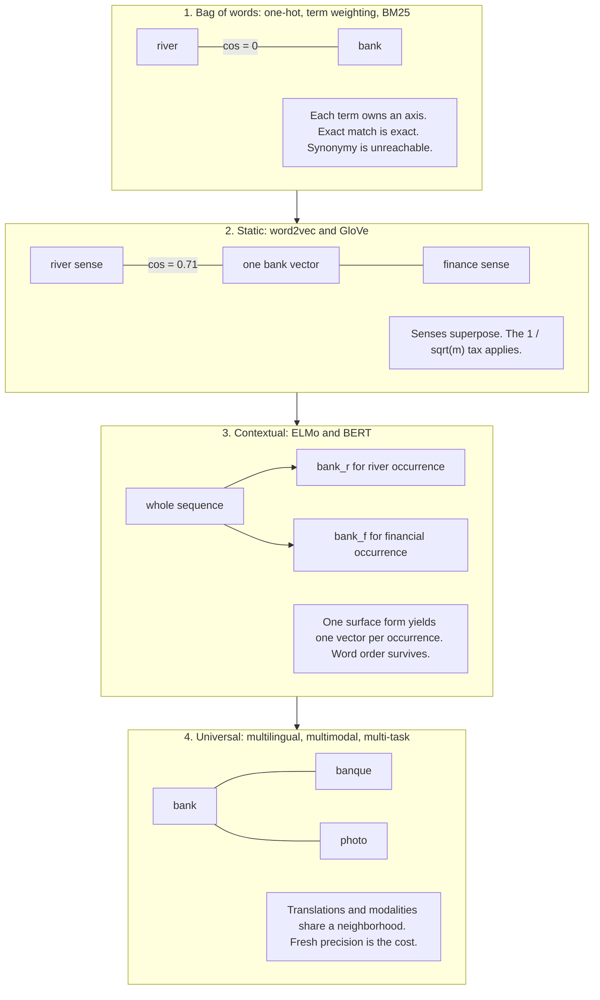
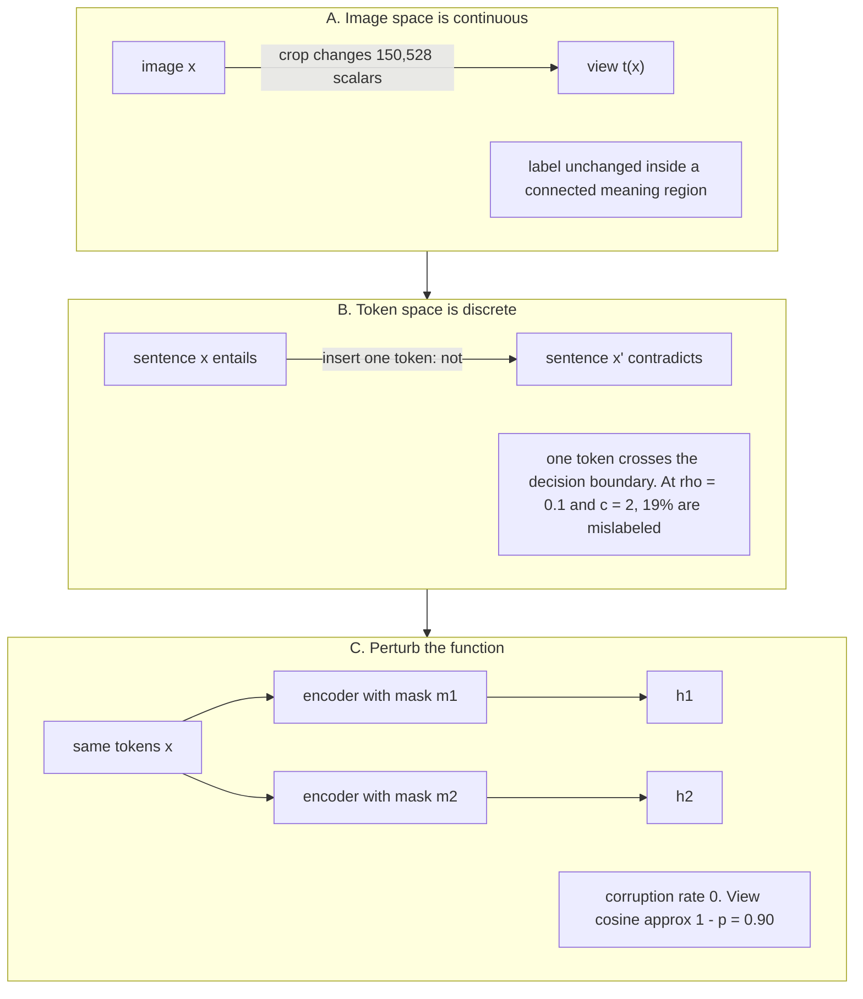
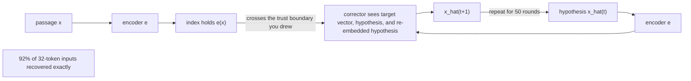

# Chapter 12: Text Representation

This chapter explains how text representations trade exact matching, semantic reach, operational stability, training cost, and privacy in a Retrieval-Augmented Generation (RAG) system.

## TL;DR

- A lexical vector gives every term its own fixed axis. It catches rare codes exactly, but it cannot recognize synonyms unless another mechanism helps.
- A static dense vector brings related words together. It also averages every sense of a word into one point and loses word order when a chunk is mean-pooled.
- A contextual vector chooses a meaning from the whole sequence. A universal vector extends the shared space across languages, modalities, or tasks, but each extension can reduce precision elsewhere.
- Sparse and dense describe support, not memory cost. A 30,522-dimensional sparse chunk stores 160 nonzero values, while a 768-dimensional dense chunk stores all 768 values.
- An embedding space is tied to the corpus and encoder version that created it. Never mix vectors from independently trained encoders without a validated alignment.
- Text augmentation can change meaning with one token. Two dropout passes preserve the input while creating distinct training views, which makes dropout the stronger free positive in the reported experiments.
- A sentence embedding is not a privacy-safe hash. The reported inversion method recovered 92% of 32-token inputs exactly, and quantization reduced memory without becoming redaction.

## The story

Imagine one secure technical library that must answer questions about millions of support manuals.

The librarian starts with a card catalog. Every printed term owns one drawer. A rare error code points to exactly the manuals that contain it. The drawers cannot infer that car and automobile are related, because those cards live in different places.

The librarian next builds a semantic floor map. Words used near the same topics sit near each other. This map finds synonyms, but one pin must represent every meaning of bank. The pin lands between the river meaning and the financial meaning.

The librarian then reads each sentence before placing its pin. Bank beside river gets one pin, while bank beside finance gets another. Word order also survives because placement depends on the full sequence.

The librarian later connects several buildings. French labels, English manuals, and photographs can share one neighborhood. That universal map opens new routes, but the librarian has limited map space. Adding languages and modalities can blur distinctions that one building handled more precisely.

The library keeps both the card catalog and the map. The catalog catches an error code that appears in three manuals. The map catches a paraphrase. Removing either system chooses a class of questions that may fail.

The collection changes over time. The word agent once lived near broker and attorney. New manuals use agent for autonomous software. The map reflects the corpus that trained it, so the librarian measures drift rather than assuming that word meanings stay fixed.

The librarian also stamps every map with its encoder version. Two cartographers may draw the same relative neighborhoods after rotating the whole page. A distance measured across their unaligned pages describes the rotation, not meaning.

The card catalog looks enormous because it has a drawer for every term. It is cheap because each manual touches only a few drawers. The dense map looks small because it has hundreds of coordinates. It is expensive because every manual stores every coordinate.

The librarian cannot name dense coordinate 412. A cartographer can rotate all coordinates while preserving every distance. The card catalog remains readable because drawer 412 has a term label fixed before training.

The training team now wants two views of every sentence. Cropping a photograph can preserve its subject. Deleting or replacing one word can reverse a sentence. The librarian therefore keeps the words unchanged and perturbs the mapmaker with two dropout masks.

Finally, the security officer asks whether a stolen map leaks the manuals. The vector holds far more bits than a short passage, and an attacker can guess text, re-embed the guess, and correct it toward the stolen vector. The library must guard the vector index like the source collection.

Compression makes the index smaller. It does not erase the encoded content. The librarian redacts before mapping, protects the embedding service, deletes vectors with source records, and never calls quantization a privacy control.

The complete lesson is one library policy. Choose each representation by the failure it prevents, keep incompatible maps apart, train sentence vectors with meaning-preserving positives, and treat every stored vector as governed content.

## Decoder table

| Technical term | Plain-English meaning | Why it matters |
|---|---|---|
| Text representation | A numeric form of words, passages, or sentences | Retrieval can compare numeric objects at scale |
| Vocabulary V | The set of terms that receive lexical coordinates | It fixes the axes of a classical sparse vector |
| Bag of words | A representation that counts terms and ignores order | It gives exact lexical evidence but cannot preserve sequence |
| One-hot vector | A vector with one active coordinate for one term | It makes different terms orthogonal by construction |
| Term frequency and inverse document frequency | A weighting that rewards terms in a document and discounts common terms | It lets rare terms dominate lexical scores |
| Best Matching 25 (BM25) | A lexical ranking function with inverse document frequency and saturated term frequency | It remains strong for rare tokens and out-of-domain retrieval |
| Inverse document frequency (idf) | A weight that rises as a term appears in fewer documents | It gives rare identifiers strong ranking power |
| Diagonal weighting | Scaling each fixed term axis without mixing axes | It cannot create synonym similarity |
| Orthogonal terms | Terms whose vectors have zero inner product | Exact separation helps literal match and blocks synonymy |
| Static embedding | One learned dense vector for each surface word form | It captures semantic neighbors but mixes word senses |
| Continuous Bag of Words (CBOW) | A model that predicts a center word from its surrounding window | It learns a static distributional space |
| Skip-gram | A model that predicts surrounding words from a center word | Its learned geometry reflects word-context counts |
| Global Vectors (GloVe) | A static embedding method based on global co-occurrence counts | It reaches similar geometry through matrix factorization |
| Distributional hypothesis | The idea that contextual use provides evidence about meaning | It makes embeddings statistics of a corpus and moment |
| Polysemy | One surface word having several senses | A static vector averages those senses |
| Sense superposition | A frequency-weighted mixture of a word's sense vectors | It limits similarity to the intended sense |
| Contextual embedding | A vector that depends on the whole token sequence | It separates senses and restores word order |
| Embeddings from Language Models (ELMo) | Contextual vectors read from bidirectional recurrent layers | It represents one occurrence rather than one word type |
| Long Short-Term Memory (LSTM) | A recurrent sequence layer | Two bidirectional LSTM layers form the cited ELMo stack |
| Bidirectional Encoder Representations from Transformers (BERT) | A bidirectional transformer encoder trained with masked tokens | It creates contextual token representations |
| Masked language modeling | Training that predicts hidden tokens from surrounding text | It creates contextual features but does not directly train sentence similarity |
| Universal embedding | One space intended to serve multiple languages, modalities, or tasks | It enables broader retrieval and introduces capacity trade-offs |
| Multilingual space | A shared vector space for several languages | A query in one language can retrieve a chunk in another |
| Multimodal space | A shared vector space for text and another modality such as images | A text query can retrieve a photograph |
| Multi-task space | One embedding space evaluated across several task types | It tests whether one model transfers across uses |
| Subword tokenization | Splitting an unseen string into familiar token fragments | Rare codes can lose their identity in a pooled dense vector |
| Inverted index | Posting lists from terms to matching documents | It creates an exact lexical gate and compact sparse storage |
| Posting | One stored occurrence or document reference for a term | Posting count drives classical index size |
| Mean pooling | Averaging token vectors into one passage vector | It is order-invariant and dilutes a rare deciding token |
| Bi-encoder | Separate encoding of query and passage before fast vector comparison | It makes large retrieval collections practical |
| Hybrid retrieval | Combining lexical and dense retrieval legs | It covers literal tokens and paraphrases together |
| Rank fusion | Combining ordered result lists rather than raw scores | It merges legs whose scores are not directly comparable |
| Hierarchical Navigable Small World (HNSW) graph | A neighbor graph for approximate dense-vector search | It adds memory beyond the vectors |
| Approximate nearest neighbor search | Fast search that trades exact scanning for an indexed candidate path | Encoder dimension changes require a new recall and latency sweep |
| Pointwise Mutual Information (PMI) | A log ratio measuring how strongly a word and context occur together | Count changes directly alter distributional geometry |
| Meaning drift | A change in a word's context distribution over time | A frozen encoder can become mismatched to a live corpus |
| Law of conformity | The reported pattern that frequent words change more slowly | Rare terms can drift faster |
| Law of innovation | The reported pattern that polysemous words change faster | Ambiguous terms deserve closer drift monitoring |
| Orthogonal transform | A rotation or reflection that preserves inner products | Independently trained spaces can disagree in coordinates without disagreeing in geometry |
| Orthogonal Procrustes alignment | Finding the best orthogonal map between two vector spaces | Drift comparisons need a common frame |
| Singular value decomposition (SVD) | A matrix factorization used to solve the stated alignment problem | It supplies the closed-form alignment map |
| Stale content | A source document that is itself outdated | It requires recrawling rather than re-embedding alone |
| Stale index | Correct content that never reached the vector index | It requires an incremental index write |
| Stale representation | An encoder whose fitted distribution no longer matches the corpus | It requires a full re-embed or domain adaptation |
| Sparse vector | A high-dimensional vector with few nonzero coordinates | Storage follows nonzeros rather than ambient dimension |
| Dense vector | A lower-dimensional vector whose coordinates are all stored | Every chunk pays for every coordinate |
| Ambient dimension | The size of the mathematical space containing a vector | It is different from the amount of stored support |
| Support | The coordinates with nonzero values | It determines sparse per-document storage |
| Nonzero count (nnz) | The number of active coordinates in a vector | It is the right first estimate for sparse index size |
| Fixed basis | Coordinates assigned meanings before model training | It makes lexical coordinates readable across index builds |
| Learned basis | Coordinates chosen by training and defined only up to rotation | An individual dense dimension has no stable label |
| Exact-match gate | A literal term either contributes a lexical posting or contributes nothing | It creates a large, auditable distinction |
| Dense margin | The small score advantage caused by one token inside a pooled vector | It can disappear within normal candidate-score spread |
| Anisotropy | Dense vectors concentrating in similar directions | It compresses useful cosine differences |
| Welch bound | A lower bound on how coherent many unit vectors must be in a finite dimension | It shows that 768 dimensions have enough directional capacity for the cited vocabulary |
| Heaps' law | A relation predicting vocabulary growth with corpus size | A huge vocabulary need not make sparse storage huge |
| Learned sparse model | A model that predicts weights on vocabulary coordinates | It keeps a readable basis while expanding beyond literal terms |
| Sparse Lexical and Expansion Model (SPLADE) | The cited learned sparse method that can activate absent vocabulary terms | Its active coordinate means query usefulness, not literal presence |
| FLOPS regularizer | A training penalty used to control learned sparse activation cost | It limits expanded nonzero counts |
| Sentence embedding | One vector for a whole token sequence | It enables fast pairwise comparison and retrieval |
| Classification token | The first BERT token sometimes used as a sentence vector | Raw use performs poorly when sentence similarity was not trained |
| Cross-encoder | A model that jointly reads both texts for each pair | It is accurate but expensive for all-pairs comparison |
| Information Noise Contrastive Estimation (InfoNCE) | A batch loss that pulls a positive close and pushes other items away | Positive-pair quality controls what the sentence space learns |
| Anchor | The first item in a contrastive pair | Its designated positive defines the desired invariance |
| Positive | A second item trained to be close to the anchor | A corrupted positive teaches the wrong equivalence |
| Negative | Another batch item trained to stay farther away | In-batch negatives provide comparison pressure |
| Temperature tau | A scale on contrastive logits | At tau 0.05, a cosine gap of 0.1 becomes a logit gap of 2 |
| Text augmentation | Editing a sentence to create another training view | A one-token edit can reverse meaning |
| Corruption rate | The probability that an edit destroys paraphrase equivalence | The cited formula quantifies mislabeled positives |
| Dropout | Randomly masking hidden units during training | Two masks create different views without changing the tokens |
| Simple Contrastive Learning of Sentence Embeddings (SimCSE) | The cited contrastive sentence-embedding method | Its reported dropout results test the proposed mechanism |
| Semantic Textual Similarity Benchmark (STS-B) | The cited sentence-similarity evaluation | It supplies the reported Spearman scores |
| Spearman correlation | A rank-correlation score | It measures agreement between embedding similarity and benchmark judgments |
| Alignment | Pulling positive examples together | It fails when both views use one fixed mask |
| Uniformity | Spreading representations through the space | It can improve even while positive alignment dies |
| Natural Language Inference (NLI) | Labeled entailment and contradiction data | Entailments supply stronger positives and contradictions supply hard negatives |
| Eval mode | Inference mode with dropout disabled | Every indexed text must use the same deterministic function |
| Embedding inversion | Recovering source text from its vector | It makes the vector index a copy-risk surface |
| Iterative correction | Guessing text, re-embedding it, and correcting toward a target vector | The encoder grades each attack hypothesis |
| Encoder oracle | Access to the same embedding function used by the index | It turns inversion into a measurable search loop |
| Cryptographic hash | A digest designed to destroy recoverable structure | It is the wrong analogy for similarity-preserving embeddings |
| Product quantization | Encoding subvectors with short codebook identifiers | It reduces memory but does not guarantee privacy |
| Binary quantization | Storing one bit per embedding dimension | It is smaller but still above the cited passage-content bit budget |
| Redaction | Removing sensitive text before encoding | It prevents the removed content from entering the vector |
| Personally Identifiable Information (PII) | Data that can identify a person | It must be removed before embedding when policy requires it |
| Tombstone | A marker that hides a deleted index item before compaction | It is an immediate retrieval control, not final physical removal |
| Service Level Agreement (SLA) | A committed deadline for completing an operation | Vector compaction needs a stated deletion deadline |
| Large Language Model (LLM) projector | A learned map from retrieval vectors into the generator's input space | It can replace many retrieved tokens with one vector |
| Modality mismatch | A gap between retrieval-vector geometry and generation-input geometry | The projector must learn to bridge it |
| Attention sink | Attention mass concentrating on an early position | It helps explain why one projected vector can carry document information |
| Multi-hop question | A question that combines a hierarchy of facts | One projected vector has limited structure for this case |
| V, d, W, e_i, delta_ij, m, v_j, v_w, n, v_i, and f | Vocabulary and embedding sizes, lexical weighting, basis vectors, the equality indicator, sense count and vectors, sequence length, contextual token vector, and encoder | These symbols define the four representation eras and the clean polysemy bound |
| D, number(w,c), P(w,c), u_w, v_c, b_w, b_c, k, r, and Delta PMI | Corpus and count statistics, word and context factors, biases, negative-sample count, relative count growth, and association change | These symbols connect distribution drift to movement in embedding geometry |
| Q, W_t, W_(t+1), I, U S V^T, and norm_F | Orthogonal alignment map, embedding matrices at two times, identity matrix, singular value decomposition factors, and Frobenius norm | These symbols state why model spaces need alignment before drift comparison |
| x, z, nnz, rho, S, N, d, M, m, k, and beta | Sparse and dense vectors, support size, mean token correlation, token-vector sum, corpus and vector sizes, graph degree, Welch vector count, and Heaps-law constants | These symbols price sparse support, dense storage, exact-match margin, and directional capacity |
| x_i, x_i+, h_i, h_i+, tau, loss_i, c, p, m_1, m_2, u_i, v_i, e(x), x_hat(t), t, and product-quantization m | Contrastive texts and vectors, temperature and loss, critical-token count, dropout rate and masks, masked views, encoder output, iterative text guess, correction round, and subvector count | These symbols define the contrastive, dropout, inversion, and quantization mechanisms |

## Core mechanics

### 12.1 Four eras: bag of words to static to contextual to universal

#### Era one: fixed lexical axes

What it is: Fix a vocabulary V. A chunk becomes d in R^V. Coordinate t is a function of how often term t occurs.
The chapter treats a vocabulary near 10^5 as ordinary for English technical prose.
Term-frequency and inverse-document-frequency weighting and BM25 use different term-frequency transforms. Both keep the same diagonal geometry.
Let W be the diagonal matrix of inverse-document-frequency weights. Distinct term basis vectors remain orthogonal.

$$
inner(e_i, W e_j) = idf_i · δ_ij
$$

Why it exists: A rare term keeps its own axis. A code found in three chunks out of five million can dominate a result without supervision.

What breaks without it: A dense-only system can miss an exact code, version, product identifier, or rare name. No rescaling of fixed orthogonal axes can create synonym similarity either.
Cost and complexity: The worked corpus has 5 x 10^6 chunks and about 150 distinct terms per chunk. It stores 7.5 x 10^8 postings. At 5 bytes per posting, that is 3.75 GB.
#### Era two: static dense word vectors

What it is: Project vocabulary axes into about 300 learned dimensions. Similar contexts place words near one another.
CBOW predicts the center word from its surrounding window. Skip-gram predicts the surrounding window from the center word (Mikolov et al., 2013). GloVe factorizes a global co-occurrence matrix (Pennington et al., 2014).
For m equally frequent, mutually orthogonal unit senses v_j, Arora et al. (2018) give the cited clean-case superposition:

$$
v_w = (1 / sqrt(m)) · Σ from j=1 to m of v_j
$$

$$
cos(v_w, v_j) = 1 / sqrt(m)
$$

Why it exists: Off-diagonal similarity becomes nonzero. Synonymy becomes reachable.

What breaks without it: Lexical axes treat car and automobile like unrelated terms.
What this era breaks: One surface form gets one vector. A two-sense word reaches at most 0.71 cosine with the intended clean-case sense. A three-sense word reaches 0.58. The chapter notes that merely topical neighbors can exceed 0.6.
Cost and complexity: Mean-pooling 300-dimensional static vectors for 5 x 10^6 chunks costs 6.0 GB in 32-bit floating point. Mean pooling also makes word order invisible.
#### Era three: contextual vectors

What it is: Token i becomes a function of the full sequence.

$$
v_i = f(w_1, ..., w_n)_i
$$

ELMo stacks two bidirectional LSTM layers and learns a mixture of them (Peters et al., 2018). BERT uses a bidirectional transformer trained by masked language modeling (Devlin et al., 2019).

Why it exists: The sequence selects the sense. It removes static sense averaging and restores word order.

What breaks without it: The sentences does the driver block the update and does the update block the driver receive the same mean-pooled static vector.
What this era still breaks: Rare identifiers can fragment under subword tokenization. Mean pooling gives one deciding token only 1/n of the pooled contribution.
Cost and complexity: A 768-dimensional contextual index for 5 x 10^6 chunks costs 15.36 GB in 32-bit floating point.
#### Era four: universal spaces

What it is: One space attempts to serve several languages, modalities, or tasks.
Across languages, a French query can retrieve an English chunk. The chapter ties the same shared-space property to translation without an explicit translation objective.
Across modalities, text and images can share a neighborhood. Across tasks, Muennighoff et al.'s benchmark evaluates one model on 8 task types, 58 datasets, and 112 languages.

Why it exists: One index can support cross-language and cross-modal retrieval.

What breaks without it: Separate monolingual or unimodal spaces cannot directly answer a cross-space query.
What this era can break: The chapter cites the curse of multilinguality. At fixed capacity, adding languages can reduce per-language quality past a point.
Cost and complexity: A 1024-dimensional universal multilingual index for 5 x 10^6 chunks costs 20.48 GB in 32-bit floating point.
An HNSW graph with M0 = 32 neighbors and 4-byte neighbor identifiers adds 128 bytes per vector. That is 0.64 GB, or 3% overhead.
#### The rare-token worked example

The corpus has 5 x 10^6 chunks, 250 tokens per chunk, four languages, and 10,000 queries per day.
The query is ERR_0x8007005F failed to write registry key.
The code occurs in 3 chunks. Its stated BM25 inverse document frequency is:

$$
ln(((5 · 10^6 - 3 + 0.5) / 3.5) + 1) = 14.17
$$

Each of four ordinary words occurs in about 10^6 chunks. Each gets ln(4.0 + 1) = 1.61.
With equal saturation factors, the code contributes:

$$
14.17 / (14.17 + 4 · 1.61) = 69%
$$

Mean pooling gives the same token 1/250 = 0.4% of the contextual vector. The chapter states a factor of 170 between 69% and 0.4% in allowed influence.
A 1024-dimensional 32-bit vector occupies 4,096 bytes. The 250-token chunk is roughly 1,000 English characters. The vector index is about four times larger than the corpus it indexes.
Why the comparison matters: The benchmark cited by Thakur et al. found BM25 a robust out-of-domain baseline. Dense retrievers trained on one distribution often failed to beat it off that distribution.
Claim limit: This does not say BM25 always wins. It says one global recall score can hide a literal-token regression and that each representation chooses a failure class.
#### Decisions from section 12.1

Default to hybrid retrieval with a sparse leg and a contextual or universal dense leg.
Remove the sparse leg only after query logs show no identifiers, codes, versions, tokenizer-external proper nouns, or other literal-token demand.
Split evaluation into literal-token and paraphrase slices. Do not trust one global recall-at-k score.
Do not mean-pool static word vectors over text longer than a phrase. The result is both order-blind and sense-averaged.
Use static vectors for lexical-neighbor query expansion when that is the desired behavior.
Adopt a multilingual model only after measuring dominant-language regression and real cross-language demand.
Treat re-embedding as an operations migration. The cited corpus contains 1.25 x 10^9 tokens.
At 2N floating-point operations per token for a 110 million-parameter encoder, the work is 2.75 x 10^17 floating-point operations. At the book's sustained 3.4 x 10^14 floating-point operations per second, it takes 13.5 minutes.
The dual-index window, evaluation rerun, and rollback plan set the schedule. A changed dimension also requires new approximate-nearest-neighbor parameters and a fresh recall-versus-latency sweep.
### 12.2 Distributional semantics and meaning drift

#### Meaning as a corpus statistic

What it is: The distributional hypothesis estimates a word representation from the contexts in which that word occurs.
The chapter traces this view to Harris (1954), Firth (1957), and Wittgenstein (1953).
Let number(w, c) count word-context pairs in corpus D. Pointwise mutual information is:

$$
PMI(w, c) = log(P(w, c) / (P(w) P(c)))
$$

$$
PMI(w, c) = log(number(w, c) · size(D) / (number(w) · number(c)))
$$

Levy and Goldberg (2014) show that skip-gram with negative sampling has the stated sufficient-dimensionality optimum:

$$
u_w^T v_c = PMI(w, c) - log(k)
$$

GloVe states the count dependence as:

$$
u_w^T v_c + b_w + b_c = log(number(w, c))
$$

Why it exists: It turns observed use into computable geometry.

What breaks without it: A representation cannot learn semantic neighborhoods from unlabeled corpora.
Its limit: The vector describes one corpus at one moment. It does not store an eternal meaning.
#### Count drift

Append m uses of word w in contexts disjoint from an old context c. Let r = m / number(w).
The old association changes by:

$$
Delta PMI(w, c) = -log(1 + r)
$$

At r = 0.5, the change is -ln(1.5) = -0.405 nats. The old association ratio falls to 1/1.5 = 0.67.
Why it matters: The whole row rotates toward the new contexts in proportion to their share.
The slow clock is language change over decades. Hamilton et al. recover the cited shifts of gay and broadcast from decade slices.
They report a law of conformity, with semantic-change rate scaling as a negative power of frequency. They also report a law of innovation, with rate scaling as a positive power of polysemy.
Operational implication: Rare and ambiguous terms can drift fastest. Those terms can also decide lexical rankings because of high inverse document frequency.
The fast clock is a company's live corpus, which can adopt a new sense in months.
#### Why cross-model cosine fails

What it is: Inner-product objectives identify relative geometry only up to an orthogonal transform Q.
Replacing u by Qu and v by Qv leaves every inner product unchanged.
Why alignment exists: Two independent models can place the same relative triangle at different absolute coordinates.

What breaks without it: A cosine between vectors from different model versions measures coordinate disagreement. It does not measure semantic drift.
The stated Procrustes problem is:

$$
minimize over Q: norm(W_t Q - W_(t+1))_F
$$

$$
subject to Q^T Q = I
$$

If W_t^T W_(t+1) has SVD U S V^T, the stated closed-form map is Q = U V^T.
The chapter attributes this closed form to Schoenemann (1966).
Cost and complexity: Alignment needs a stable-word anchor set and validation. The operational alternative is usually a full re-embed.
#### Three different stale states

Stale content means the source document is wrong. Recrawl it.
A stale index means a correct document was never embedded. Write it incrementally.
A stale representation means the encoder's fitted distribution no longer matches the corpus. Re-embed everything or adapt the encoder.
Only stale representation is meaning drift. An incremental content pipeline cannot repair it.
#### The engineering-wiki worked example

The index has 2 x 10^6 chunks of 250 tokens. It uses a 768-dimensional, 110 million-parameter encoder. The corpus grows 4% per month.
The token agent appears in 12,000 chunks at build time. Nine months later, 6,000 new chunks use its autonomous-software sense.
Then r = 6,000/12,000 = 0.5. The old-context change is -0.405 nats.
The frozen encoder can place new documents and new queries consistently in the old broker neighborhood. Both sides are consistently wrong, so a consistency check does not expose the failure.
If only the 6,000 new chunks use encoder v2, queries from v2 compare against 2 x 10^6 old v1 vectors.
For random unit vectors in d = 768, the stated prior is mean cosine 0 and standard deviation:

$$
1 / sqrt(768) = 0.036
$$

A working threshold near 0.6 is about 0.6/0.036 = 17 standard deviations away. The old index becomes unreachable rather than degrading smoothly.
For 4% monthly all-new-sense growth:

$$
1 + r(t) = 1.04^t
$$

The association-halving threshold arrives at:

$$
t = ln(2) / ln(1.04) = 0.693 / 0.0392 = 17.7 months
$$

A hot term that doubles every quarter reaches the same threshold in one quarter.
Re-embedding 2 x 10^6 chunks at 250 tokens processes 5 x 10^8 tokens.
At the stated rate, this is 1.1 x 10^17 floating-point operations, 324 seconds, or 5.4 minutes.
Claim limit: The 17.7-month cadence is not universal. The fastest important slice sets the cadence.
#### Decisions from section 12.2

Make the model version part of the index identity. Use one collection per encoder and revision pair.
Refuse partial migrations unless an alignment map has passed held-out paraphrase validation.
Trigger re-embedding from measured drift rather than a calendar alone.
The chapter's default monitor reports terms whose document frequency more than doubled since build time. It intersects that list with query logs and re-embeds when such a term appears in more than 1% of queries.
Separate a new token from a new sense. A sparse index handles a new surface token as soon as it is written. It does not separate two senses of an old term.
Freeze 200-300 query and known-relevant-chunk probe pairs at index build time. Report the known chunk's rank monthly.
Refresh the probe set when it stops matching live traffic. Mark that refresh as a discontinuity.
Use continued contrastive training when permanent domain senses have tens of thousands of in-domain pairs.
When examples number only in the hundreds, the chapter recommends a cheaper and more auditable alias or sparse expansion layer.
### 12.3 Sparse versus dense

#### Dimension is not storage

What it is: A sparse document vector x lives in R^V. Its nonzero count is nnz(x).
A dense vector z lives in R^d. The encoder emits no exact zeros, so nnz(z) = d.
For a 250-token chunk with type-token ratio 0.64, the chapter uses 160 distinct terms.
With V = 30,522, density is 160/30,522 = 0.52%.
The dense vector stores all 768 coordinates. The 30,522-dimensional sparse object stores 4.8 times fewer numbers per document.
Why the distinction exists: Dimension measures ambient space. Support measures stored coordinates.

What breaks without it: Capacity planning can invert the true memory ratio by reasoning from dimension names alone.
#### Fixed basis and readable coordinates

What it is: Sparse coordinate j means term j because the vocabulary fixes the basis before training.

Why it exists: A rare term owns one axis. A new term gets an axis when indexed.

What breaks without it: An individual dense coordinate cannot carry a stable label.
The dense objective depends on inner products. Any orthogonal rotation rewrites coordinates while preserving retrieval.
Claim limit: A probe can find a predictive direction. The symmetry rules out a stable claim about one coordinate, not every analysis of a direction.
Interpretability comes from the fixed basis, not sparsity alone.
Learned sparse models preserve a vocabulary basis but change the coordinate claim. SPLADE can activate a term absent from the document. The weight then means the term is a useful query for that document, not that the document contains it.
#### Exact match as gate versus margin

Take unit token vectors v_1 through v_n with mean pairwise inner product rho. Let S be their sum.

$$
norm(S) = sqrt(n + n(n - 1) rho)
$$

For an identifier-only query q = v_t, the extra cosine from the matching token is:

$$
Delta cos = 1 / sqrt(n + n(n - 1) rho)
$$

At n = 250 and rho = 0, the generous margin is 1/sqrt(250) = 0.063.
At rho = 0.5, norm(S) = sqrt(31,375) = 177.1. The margin is 0.0056.
Why it matters: That 0.0056 advantage must survive the spread of already-high dense scores.
The chapter cites Ethayarajh (2019) for last-layer GPT-2 word cosine near 1.0 and increasing anisotropy with depth in BERT and ELMo.
On the sparse side, a document without the term scores exactly 0 for that term. The distinction is a gate rather than a small margin.
#### Why more dense dimensions do not fix the objective

Raising d from 768 to 4096 for 10^7 chunks costs 164 GB in 32-bit floating point. That is 5.3 times the 30.7 GB vector cost at d = 768.
The stated Welch-bound floor for m unit vectors in R^d is:

$$
sqrt((m - d) / (d(m - 1)))
$$

For m = 30,522 and d = 768, it is:

$$
sqrt((30,522 - 768) / (768 · 30,521)) = sqrt(1.269 · 10^-3) = 0.0356
$$

This is close to the random-unit-vector chance level 1/sqrt(768) = 0.036.

Why it exists: The bound tests directional capacity.
What the result means: The space can fit the cited vocabulary in almost orthogonal directions. Training spends that capacity on semantic similarity instead of reserving one axis per string.
Claim limit: Higher d can help other representation-quality failures. This derivation says it does not target exact string matching.
#### Ten-million-chunk memory example

Take N = 10^7 chunks, 250 tokens each, 160 distinct terms per chunk, and d = 768.
The inverted index has 10^7 x 160 = 1.6 x 10^9 postings.
Naive 4-byte document identifiers plus 4-byte term frequencies cost 12.8 GB.
Sorted identifiers permit gap coding. The chapter states the approximate information cost:

$$
log_2(choose(N, n)) approx n · (log_2(N/n) + log_2(e)) bits
$$

At posting-list length n = 10^5, the result is 6.64 + 1.44 = 8.09 bits per posting, about one byte.
The cited range is 0.60 bytes at n = 10^6 to 2.67 bytes at n = 10.
Document identifiers then cost 1.6 GB. Mostly-one term frequencies add 0.4 GB. The sparse estimate is 2 GB.
Dense vectors cost 10^7 x 768 x 4 = 3.07 x 10^10 bytes, or 30.7 GB.
An HNSW graph with M = 32 stores 64 layer-zero neighbor identifiers. It adds 2.56 x 10^9 bytes, or 2.6 GB.
The dense total is 33.3 GB, or 16.6 times the sparse index, even though the vocabulary is about 40 times the dense dimension.
Heaps' law with k = 30 and beta = 0.5 over 2.5 x 10^9 tokens predicts 1.5 x 10^6 types (Manning et al., 2008). That is nearly 2,000 times d and still fits the 2 GB posting estimate.
For query E-4471-B, the dense exact-match advantage at n = 250 and rho = 0.5 is 0.0056. Sparse gives every nonmatching chunk zero for the term.
Reducing vector precision from 32-bit to 16-bit floating point takes 30.7 GB to 15.4 GB. It does not change what the space can express.
The cited Dense Passage Retrieval release has 21,015,324 Wikipedia passages at d = 768 (Karpukhin et al., 2020). The flat 32-bit calculation is 64.6 GB, matching the quoted approximate 65 GB.
The estimated classical inverted index over those passages is near 2 GB.
#### Decisions from section 12.3

Estimate sparse storage as N x nonzeros x about 1 byte.
Estimate dense storage as N x d x bytes plus N x 2M x 4 for the stated HNSW layer-zero graph.
Adjust the sparse estimate upward for learned expansion. SPLADE's FLOPS regularizer controls that cost.
Keep a fixed-basis leg for queries whose answer is a string. Examples include stock-keeping units, error codes, ticket identifiers, versions, and names.
Fuse by rank rather than raw score.
Do not raise d to fix string misses. Spend on a lexical leg.
If paraphrase misses dominate, a stronger or multi-vector encoder can be the right spend.
Measure the exact-match margin. Embed 100 paired passages with and without identifiers. Compare paired score differences with the interquartile range of top-100 live-query scores.
At n = 25 and rho = 0.5, the same formula gives 0.056. That is ten times the 250-token margin.
Use sparse term weights as a debugging surface. Do not claim that they explain why a passage answers a question.
### 12.4 Sentence embeddings and text augmentation

#### A sentence vector needs a sentence objective

What it is: A sentence encoder maps token sequence x = (w_1, ..., w_n) to h in R^d.

Why it exists: Pairwise cross-encoding does not scale to retrieval collections.
For 10^4 sentences, all unordered pairs total 49,995,000 forward passes.
Reimers and Gurevych report roughly 65 hours for that comparison. Pre-encoding each sentence and using dot products takes about 5 seconds.
Three cited pooling choices are the first BERT classification token, the first token generated by a decoder, and the mean of encoder token vectors.
Raw BERT classification-token vectors score 29.19 average Spearman on the cited semantic-textual-similarity benchmarks.
Mean-pooled BERT scores 54.81. Both trail averaged GloVe vectors in that report.

What breaks without the right objective: Masked language modeling never asks a pooled sentence vector to place paraphrases together. Pooling alone cannot add that property.
#### Contrastive training and positive sensitivity

For anchor x_i, positive x_i+, batch size N, and temperature tau, the stated loss is:

$$
loss_i = -log(exp(cos(h_i, h_i+) / tau) / sum from j=1 to N of exp(cos(h_i, h_j+) / tau))
$$

The chapter sets tau = 0.05.
A cosine gap of 0.1 becomes a logit gap of 2.

Why it exists: The loss directly asks the sentence space to recognize designated equivalents.

What breaks without valid positives: A corrupted positive teaches the encoder to merge different meanings.
#### Why vision augmentation does not transfer

A 224 x 224 x 3 image contains 150,528 real-valued scalars.
A crop, color change, or blur can alter many scalars while keeping a human label.
Text lives on a discrete token lattice V^n. The smallest edit is one whole token.
Inserting not into a six-word clinical claim changes one seventh of the input and can switch entailment to contradiction.
Let n = 20 and let c tokens carry the meaning-sensitive details. Edit each token independently with probability rho.
The chance of corrupting at least one critical token is:

$$
P(corrupted) = 1 - (1 - rho)^c
$$

For c = 2, the rates are 19% at rho = 0.1, 36% at rho = 0.2, and 51% at rho = 0.3.
Why the formula matters: The contrastive loss cannot identify mislabeled pairs. It pulls a claim toward its negation exactly as instructed.
Claim limit: The chapter does not claim every generated paraphrase is bad. It requires measuring semantic corruption rather than assuming label preservation.
#### Dropout moves the function, not the input

Feed the same tokens through the same encoder with independent dropout masks m_1 and m_2.

$$
h_1 = f_(m_1)(x), h_2 = f_(m_2)(x)
$$

For keep probability 1 - p with inverted scaling:

$$
u_i = m_(1i) h_i / (1 - p), v_i = m_(2i) h_i / (1 - p)
$$

The stated expectations are:

$$
E[inner(u, v)] = norm(h)^2
$$

$$
E[norm(u)^2] = norm(h)^2 / (1 - p)
$$

The resulting approximation is:

$$
cos(u, v) approx 1 - p
$$

At p = 0.1, expected view cosine is about 0.90. At p = 0.5, it is about 0.50. An identical mask gives 1.0.

Why it exists: The tokens remain identical, so corruption rate is zero by construction. The hidden views still differ.

What breaks without independent masks: A fixed shared mask produces the same positive vector. The positive numerator becomes constant and only negatives receive gradient.
#### Reported augmentation findings

Unsupervised SimCSE with p = 0.1 scores 82.5 Spearman on STS-B development (Gao et al., 2021).
The p = 0.5 result is 71.0. The p = 0 result is 71.1. Reusing a fixed mask falls to 43.6.
The interpretation stated in the chapter is that alignment dies while uniformity improves with the fixed mask, using the decomposition of Wang and Isola (2020).
Every tested discrete augmentation loses to dropout in the cited table.
Cropping 10% of tokens scores 77.8. Deleting one word scores 75.9. Synonym replacement scores 77.4. Masked-language-model token replacement at 15% scores 62.2.
Supervised SimCSE uses NLI entailments as positives and contradictions as hard negatives.
Its cited averaged Spearman score is 81.6 versus 76.3 for unsupervised SimCSE. The difference is 5.3 points.
Claim limit: Dropout is the best free positive in the reported comparison. It is not better than genuine labeled positives.
#### Two-million-ticket worked example

The setup has 2 x 10^6 support tickets, a 110 million-parameter encoder, median n = 20, and c = 2 critical tokens.
Training samples 10^6 sentences for one epoch at batch size 64. That is 15,625 steps.
At rho = 0.1, word deletion removes 2 of 20 tokens on average.
The 19% corruption rate means about 12 of 64 positive pairs per batch are not paraphrases. The epoch contains 190,000 mislabeled pairs.
For corruption rates 19%, 36%, and 51%, the cited 10%, 20%, and 30% crop scores are 77.8, 71.4, and 63.6.
Those are drops of 4.7, 11.1, and 18.9 from the 82.5 dropout baseline.
The chapter's two-endpoint regression gives (18.9 - 4.7)/(51 - 19) = 0.44 Spearman points lost per percentage point of corrupted pairs.
For dropout p = 0.1, corruption is 0 and view similarity is about 0.90.
The simple exchange rate predicts an 8.4-point cost for 19% corruption. The measured gap between single-word deletion at 10% and dropout is 6.6. The estimate is high by under 2 points.
Each training step runs 128 sequence views padded to 32 tokens, or 4,096 tokens.
Forward and backward work is 6N = 6.6 x 10^8 floating-point operations per token.
That is 2.70 x 10^12 floating-point operations per step and 4.22 x 10^16 for the epoch.
At the book's sustained rate, training takes 124 seconds.
Embedding the full corpus at 64 tokens per ticket costs 2.82 x 10^16 floating-point operations and another 83 seconds.
The chapter concludes that evaluation quality, not this compute estimate, is the constraint.
#### Decisions from section 12.4

Use dropout as the only augmentation when no labeled positives exist.
Prefer real positives from duplicate-ticket links, accepted-answer pairs, or NLI entailment when available.
Tune p as a view-similarity target. The chapter recommends sweeping 0.05 to 0.15, recentered if the base encoder used another dropout rate.
Audit 100 generated pairs. Stratify negation, numerals, and entity names.
Use 19% corruption as the cited prior when rho = 0.1 and c = 2. Measure instead of assuming it.
The chapter says back-translation through a high-resource language corrupts far less than token edits, but it still requires measurement.
For sensitive text, an external paraphraser also creates a data-residency decision and inherits its teacher's limits.
Match serving-time pooling to checkpoint training. A silent classification-token versus mean-pooling mismatch can exceed any approximate-search tuning gain.
Switch the encoder to eval mode for indexing and queries. Training-mode dropout makes repeated encodings inconsistent.
Any checkpoint, p, or pooling change creates a new representation version and requires a new index.
### 12.5 What a sentence embedding actually contains

#### Capacity before intuition

What it is: A d = 768 vector in 32-bit floating point stores:

$$
768 · 32 = 24,576 bits = 3,072 bytes
$$

A 32-token passage is estimated at 32 x 4 = 128 English characters.
Using the cited estimate of about 1 bit of entropy per printed English character, the passage contains roughly 128 bits.
The vector container therefore holds 24,576/128 = 192 times as many bits.
Why it matters: There is no bit-capacity obstacle to recovering the short passage.
Claim limit: Capacity permits recovery. It does not prove that the encoder preserved every passage.
#### Iterative inversion

The naive decoder emits text once from e(x). It cannot grade whether its guess maps near the target.
The cited correction method emits hypothesis x_hat(t), re-embeds it, and conditions the next correction on the target vector, current text, and current vector.

$$
x_hat(t+1) = corrector(e(x), x_hat(t), e(x_hat(t)))
$$

The same public encoder supplies the objective distance between e(x_hat) and e(x).

Why it exists: Re-embedding turns one-shot generation into search with a self-grading oracle.
Reported finding: Morris et al. recover 92% of 32-token inputs exactly from the embedding alone.
Figure 12.5 states 50 correction rounds for that illustrated result.

What breaks without access to the encoder: The attack loses its cheap grading oracle. The chapter therefore treats authenticated, logged, rate-limited embedding access as a security control when weights are not already public.
#### Why embedding-as-hash fails

A cryptographic hash is designed to destroy recoverable structure and separate similar inputs.
An embedding is designed to preserve similarity distances.
Why the distinction matters: Similarity search and irreversibility pull in opposite directions.
The chapter's strongest formulation is that the embedding carries the sentence in another basis. The reported exact-recovery result supports that claim for the stated 32-token setting.
Claim limit: Recovery accuracy degrades as passages lengthen. The source does not claim 92% exact recovery for every model or passage length.
#### Productive use of the stored content

xRAG freezes the vector store and the LLM. It trains a projector from a retrieval embedding into the LLM input space (Cheng et al., 2024).
A retrieved document can then enter context as one vector instead of 200 tokens.
The stated obstacle is modality mismatch. Retrieval space serves similarity. LLM input space serves generation.
The projector uses paraphrase captioning and instruction tuning, drawing on vision-language alignment objectives.
The cited report finds an average improvement above 10% across six knowledge-intensive tasks and a 3.53 times reduction in overall floating-point operations.
The chapter links this behavior to attention patterns. The first two layers attend locally. From roughly layer two upward, attention mass concentrates on the first position, matching the attention-sink behavior named by Xiao et al. (2023).
The reported weak case is multi-hop questions. One vector has limited room to preserve a hierarchy of facts for the projector.
Claim limit: The chapter recommends embedding-as-context only when prefill dominates and the task is single-hop.
#### Quantization and the content line

For 10^7 chunks, unquantized 32-bit vectors cost 10^7 x 3,072 bytes = 30.7 GB.
Each vector holds 24,576 bits versus about 128 content bits, or 192 times more container than content.
Product quantization with m = 48 subvectors and 8 bits per subvector stores 48 bytes per vector.
That is 0.48 GB for 10^7 vectors, a 64 times memory reduction.
The code still holds 384 bits, or 3 times the estimated passage content.
Binary quantization stores 1 bit per dimension. A 768-dimensional code is 96 bytes.
That is 0.96 GB, a 32 times memory reduction. The 768-bit code is 6 times the estimated content.
To reach at most 128 bits with 8-bit product-quantization codes, m must be at most 16.
That assigns one code to every 48 dimensions and compresses the vector 192 times. The chapter states that this gives up the recall the index exists to provide.
Why the comparison matters: Moving left on the memory axis does not become redaction while the code remains above the content line.
Claim limit: The chapter says no useful point on this stated compression curve serves as a privacy control. Quantization remains a recall-memory choice.
#### Attack cost

The example uses 50 correction rounds, beam width 8, a 110 million-parameter encoder, a 220 million-parameter corrector, and 32 generated tokens.
One hypothesis costs 2 x 1.1 x 10^8 x 32 = 7.0 x 10^9 floating-point operations to re-embed.
Generation costs 2 x 2.2 x 10^8 x 32 = 1.4 x 10^10 floating-point operations.
Total per hypothesis is 2.1 x 10^10 floating-point operations.
The 50 x 8 = 400 hypotheses cost 8.4 x 10^12 floating-point operations per passage.
At 3.4 x 10^14 floating-point operations per second, that is about 25 milliseconds per passage.
For 10^7 passages, the stated total is 2.5 x 10^5 seconds, or about 69 hours.
A 512-token chunk carries about 2,048 bits under the same rough entropy estimate. That remains below 24,576 container bits.
Claim limit: Longer text lowers exact recovery. The source still treats partial reconstruction as unsafe.
#### Decisions from section 12.5

Classify the vector store at the same level as the source text.
Apply the same access controls, retention clock, region restrictions, and deletion path.
Never call quantization a privacy control. Select code size and bit depth from the recall-memory curve.
Redact PII before embedding. Store any mapping inside the governed system.
If redaction destroys required retrieval signal, exclude the corpus instead of assuming the vector forgets it.
Authenticate, rate-limit, and log the embedding endpoint when the encoder is private.
If the encoder weights are public, rate limiting does not remove a local attacker's oracle.
Delete the vector, its compressed code, its replicas, and its tombstone target when honoring erasure.
Pair immediate tombstoning with a compaction SLA. A soft-deleted vector left in an HNSW graph remains a recoverable copy.
Use embedding-as-context only when measured prefill cost dominates and the question path is single-hop.
## Diagrams

### Figure 12.1



Figure 12.1: Following the word bank through the four spaces: era one holds it orthogonal to everything else, era two averages its senses into one point, era three splits it back apart per occurrence (r for the river sense, f for the financial one), and era four pulls its translations and its pictures into the same neighborhood. Each step conflates something the previous step kept apart.

### Figure 12.2

```text
A. Drift, measured inside one aligned frame

{broker, attorney}       2015 agent ---- 2021 agent ---- 2024 agent       {planner, tool use}
                              one common coordinate frame

B. Two independently trained spaces

model v1                                  model v2
+----------------------+                  +----------------------+
| agent   broker       |   orthogonal Q   |    broker     agent   |
|   planner            | --------------> | planner              |
+----------------------+                  +----------------------+
same relative triangle                    rotated coordinates
```

Figure 12.2: Drift is only measurable after alignment: inside one frame the vector for agent visibly changes neighborhoods (A), while two independently trained models place the same three words in the same relative configuration at different coordinates (B), so a cosine taken across model versions reports the rotation rather than any change in meaning.

### Figure 12.3

| Property | A. Sparse, fixed basis | B. Dense, learned basis |
|---|---|---|
| Coordinates | V = 30,522 axes | d = 768 axes |
| Stored support | 160 nonzero, or 0.52% | All 768 nonzero |
| Meaning of one coordinate | Coordinate j is term j | Any orthogonal Q can rewrite it |
| Rare string | Owns an axis and posting list | No axis is reserved for it |
| Missing term | Scores exactly 0 | Loses only a small cosine margin |
| Retrain | Coordinate labels survive | Scores survive rotation while coordinate labels do not |

```text
e4471b -> [41] [903] [5122] ...
sea    -> [12] [41]  [778]  ...

dense vector [all 768 values] -- orthogonal Q --> [all coordinates rewritten]
                                      every retrieval score stays identical
```

Figure 12.3: The sparse representation is expensive in dimensions and cheap in stored numbers because its basis is fixed by the vocabulary in advance, which is what makes its coordinates readable and its exact-match behavior a gate rather than a margin. The dense representation stores every one of its 768 coordinates and is identified only up to an orthogonal transform, so no individual dimension means anything.

### Figure 12.4



Figure 12.4: The asymmetry that kills the transfer. A vision augmentation moves a long way through a continuous input space without leaving the meaning-preserving region. A text edit takes the shortest move the lattice allows and can still land on the far side of the decision boundary. The only perturbation guaranteed to preserve meaning is one applied to the encoder rather than to the input.

### Figure 12.5



```text
B. Bits stored per vector versus bits of content, log scale

128 bits               384 bits               768 bits                         24,576 bits
passage content         PQ, m = 48             binary, 1 bit per dimension      float32, d = 768
|-----------------------|----------------------|--------------------------------------|
                        every code to the right stores more bits than the passage
                        quantization is not redaction
```

Figure 12.5: Inversion needs two things and has both: a search loop that can grade its own guesses by re-embedding them, and a code that never had to throw the passage away. Compressing the vector moves you left along the axis but not past the content line, so a smaller code buys memory, not privacy.

## Whiteboard pack

### What to draw

1. Draw a left box labeled fixed lexical basis. Put one rare code on its own axis.
2. Draw a right box labeled learned dense basis. Put paraphrases close together.
3. Under the boxes, write gate under sparse and small margin under dense.
4. Add a version stamp to the dense box. Draw a rotated copy and write align or re-embed.
5. Draw one unchanged sentence feeding two dropout-mask encoders and joining as a positive pair.
6. Draw a vector store inside the same security boundary as the source text.
7. Close with two arrows into rank fusion, one from lexical retrieval and one from dense retrieval.

### Spoken script

Text representation is a choice of failure mode. Sparse retrieval gives each term a fixed axis, so rare codes match exactly, while a dense encoder learns semantic neighborhoods and catches paraphrases. Context helps choose the right sense, but pooling can still dilute one deciding token. Dense coordinates also rotate across model versions, so never mix indexes without alignment or a rebuild. During training, token edits can change meaning, while two dropout masks keep the text intact. Treat vectors like source data, because iterative re-embedding can recover short passages. In practice, I ship hybrid retrieval and version every representation.

## Interview traps

### Sparse vectors have more dimensions. Why can they use less memory than dense vectors?

Dimension is ambient space, while storage follows support. In the worked case, sparse stores 160 nonzeros in 30,522 dimensions and costs about 2 GB, while dense stores all 768 values plus its graph and costs 33.3 GB.

### When would you choose dense-only retrieval?

Only when measured traffic is prose over prose and the logs show no codes, identifiers, versions, rare names, or other literal-token class. I would still stratify evaluation because one global recall score can hide the exact-match regression.

### Can you label each dense embedding dimension for an auditor?

No stable per-coordinate label exists because an orthogonal rotation changes every coordinate while preserving every score. A probe can identify a useful direction, but term-level auditability requires a fixed vocabulary basis or another explicit attribution surface.

### Why not make positive sentence pairs by deleting words or swapping synonyms?

The smallest text move is one token, and that token can invert meaning. With two critical tokens and a 10% independent edit rate, 19% of pairs are corrupted, while independent dropout masks change the encoder view with zero input corruption.

### What are the limits of a sentence embedding?

The objective and pooling determine what it preserves. It can dilute rare strings, become incompatible across encoder versions, leak recoverable source content, and lose fact hierarchy when one projected vector must answer a multi-hop question. The source supports each limit in a stated setting, not as a universal failure rate.

## Key numbers

| Topic | Number | Meaning |
|---|---:|---|
| Typical technical vocabulary | 10^5 terms | Scale used for era-one discussion |
| Static embedding | About 300 dimensions | Era-two projection size |
| Two equal orthogonal senses | 0.71 cosine | Maximum clean-case similarity to one sense |
| Three equal orthogonal senses | 0.58 cosine | Maximum clean-case similarity to one sense |
| Universal benchmark | 8 task types, 58 datasets, 112 languages | Breadth of the cited one-model evaluation |
| First worked corpus | 5 x 10^6 chunks, 250 tokens each | Support-document scale |
| First worked traffic | 10,000 queries per day | Query volume |
| Sparse postings | 7.5 x 10^8 at 5 bytes each | 3.75 GB BM25 estimate |
| Rare code frequency | 3 chunks | Basis for inverse document frequency 14.17 |
| Ordinary-word frequency | About 10^6 chunks | Basis for inverse document frequency 1.61 |
| Rare-code lexical share | 69% | Share of the stated BM25 score |
| Static index | 300 dimensions, 6.0 GB | Mean-pooled 32-bit vectors |
| Contextual index | 768 dimensions, 15.36 GB | 32-bit vectors |
| Rare-token pool share | 1/250 = 0.4% | Dense mean-pooling contribution |
| Sparse versus dense influence | Factor of 170 | 69% versus 0.4% |
| Universal index | 1024 dimensions, 20.48 GB | 32-bit vectors |
| HNSW overhead | M0 = 32, 128 bytes per vector | 0.64 GB or 3% |
| 1024-dimensional vector | 4,096 bytes | About four times the cited chunk text size |
| First re-embed | 1.25 x 10^9 tokens | 2.75 x 10^17 floating-point operations |
| First re-embed time | 13.5 minutes | At 3.4 x 10^14 operations per second |
| Drift perturbation | r = 0.5 | Delta PMI is -0.405 nats and ratio becomes 0.67 |
| Wiki corpus | 2 x 10^6 chunks, 250 tokens | Drift example scale |
| Wiki encoder | 768 dimensions, 110 million parameters | Drift example model |
| Corpus growth | 4% per month | Leads to 17.7-month association halving |
| Old agent uses | 12,000 chunks | Baseline count |
| New agent uses | 6,000 chunks | Gives r = 0.5 after nine months |
| Cross-space chance | 0 plus or minus 0.036 | At d = 768 |
| Working relevance threshold | Near 0.6 | About 17 chance standard deviations |
| Hot-term cadence | One quarter | Time to halving when mentions double quarterly |
| Wiki re-embed | 5 x 10^8 tokens | 1.1 x 10^17 operations |
| Wiki re-embed time | 324 seconds or 5.4 minutes | Compute estimate |
| Drift trigger | More than doubled and over 1% of queries | Chapter's default monitoring rule |
| Golden probes | 200-300 pairs | Monthly rank check |
| Sparse example | V = 30,522, 160 nonzeros | 0.52% density and 4.8 times fewer stored values |
| Exact-match margin, unrelated tokens | 0.063 | n = 250 and rho = 0 |
| Exact-match margin, coherent passage | 0.0056 | n = 250 and rho = 0.5 |
| Coherent-passage sum norm | 177.1 | Square root of 31,375 |
| Welch floor | 0.0356 | m = 30,522 and d = 768 |
| Large sparse corpus | 10^7 chunks | 1.6 x 10^9 postings |
| Naive postings | 12.8 GB | 8 bytes per posting |
| Compressed posting estimate | 0.60-2.67 bytes | Range from long to short posting lists |
| Sparse index estimate | 2 GB | 1.6 GB identifiers plus 0.4 GB frequencies |
| Dense vectors | 30.7 GB | 10^7 x 768 x 4 bytes |
| Dense HNSW graph | 2.6 GB | M = 32 and 64 layer-zero neighbors |
| Dense total | 33.3 GB | 16.6 times the sparse estimate |
| Heaps prediction | 1.5 x 10^6 types | k = 30, beta = 0.5, 2.5 x 10^9 tokens |
| Raised dimension | 4096 and 164 GB | 5.3 times the 768-dimensional vector cost |
| 16-bit dense vectors | 15.4 GB | Half the 30.7 GB vector memory |
| Dense Passage Retrieval release | 21,015,324 passages | 64.6 GB, approximately the quoted 65 GB |
| Short-chunk margin | 0.056 | n = 25 and rho = 0.5 |
| All-pairs sentence comparison | 49,995,000 passes | 10^4 sentences |
| Cross-encoder versus vectors | About 65 hours versus 5 seconds | Cited comparison time |
| Raw BERT pooling scores | 29.19 classification token, 54.81 mean | Average Spearman results |
| Contrastive temperature | tau = 0.05 | A 0.1 cosine gap becomes 2 logits |
| Image input | 224 x 224 x 3 = 150,528 scalars | Continuous-space example |
| Text corruption | 19%, 36%, 51% | c = 2 at rho 0.1, 0.2, 0.3 |
| Dropout view similarity | About 0.90 at p = 0.1 | Approximation 1 - p |
| STS-B dropout curve | 82.5, 71.0, 71.1, 43.6 | p 0.1, p 0.5, p 0, and fixed mask |
| Discrete augmentations | 77.8, 75.9, 77.4, 62.2 | Crop, one-word delete, synonym, 15% masked replacement |
| Supervised versus unsupervised | 81.6 versus 76.3 | 5.3 averaged Spearman points |
| Ticket training | 10^6 samples, batch 64, 15,625 steps | One epoch |
| Mislabeled ticket positives | About 12 per batch, 190,000 per epoch | 19% corruption |
| Crop score curve | 77.8, 71.4, 63.6 | 10%, 20%, 30% crop rates |
| Loss exchange rate | 0.44 Spearman points | Per percentage point of corrupted pairs in the stated fit |
| Ticket training compute | 4.22 x 10^16 operations, 124 seconds | At the book's sustained rate |
| Ticket indexing compute | 2.82 x 10^16 operations, 83 seconds | Full corpus estimate |
| Recommended dropout sweep | 0.05-0.15 | Recenter on base pretraining rate if needed |
| Augmentation audit | 100 pairs | Stratified semantic check |
| Float32 embedding | 24,576 bits or 3,072 bytes | d = 768 |
| Short-passage content | About 128 bits | 32 tokens and about 128 characters |
| Container-to-content ratio | 192 times | Float32 vector versus short passage |
| Exact inversion | 92% | 32-token inputs in the cited report |
| Inversion loop | 50 rounds, beam width 8 | 400 hypotheses per passage |
| Product quantization | m = 48, 48 bytes, 384 bits | 0.48 GB and 64 times smaller |
| Binary quantization | 96 bytes, 768 bits | 0.96 GB and 32 times smaller |
| Content-line product code | m at most 16 | 128 bits and 192 times vector compression |
| Attack models | 110 million and 220 million parameters | Encoder and corrector |
| Attack per hypothesis | 2.1 x 10^10 operations | Re-embed plus generation |
| Attack per passage | 8.4 x 10^12 operations, about 25 ms | 400 hypotheses |
| Attack full index | 2.5 x 10^5 seconds, about 69 hours | 10^7 passages |
| Longer passage | 512 tokens, about 2,048 bits | Partial recovery remains the stated risk |
| xRAG context | One vector instead of 200 tokens | Projected retrieval embedding |
| xRAG report | Above 10% on 6 tasks, 3.53 times fewer operations | Reported average gain and compute reduction |
