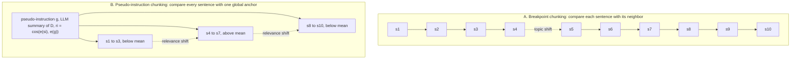
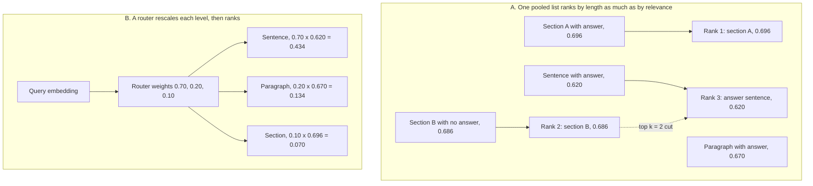
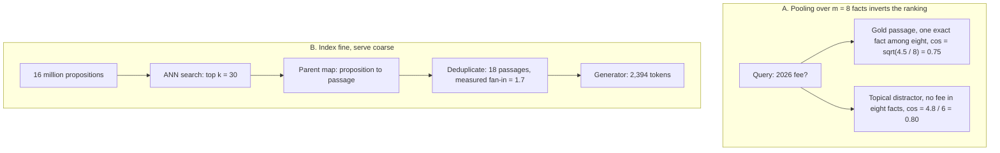

# Chapter 13: Chunking and Granularity

This chapter explains how to choose retrieval units, route across granularities, preserve enough context, and measure whether a chunker actually improved retrieval.

## TL;DR

- Chunking is an index-time decision. Retrieval-Augmented Generation (RAG) cannot repair a fact that no indexed chunk contains whole.
- Start from the smallest unit that must survive intact. Set overlap from that unit's length, not from a fixed percentage.
- Use boundaries already present in the document before paying a model to infer them. Meaning-based and model-generated splitting can cost 3.5x and about 45x as much as fixed splitting.
- Query type determines useful granularity. Never pool raw similarity scores from sentences, paragraphs, and sections into one ranking.
- Fine retrieval helps when pooling hides one exact fact. Index a self-contained proposition, then return its parent passage so the generator still sees qualifiers.
- Evaluate retrieved extent with token recall, precision, and intersection over union (IoU). Recall alone rewards oversized chunks.
- Semantic chunking pays only when real boundaries create separable embedding gaps. On one modeled real document, the same rule that reached 100% boundary recall on stitched text reached only 31%.

## The story

Imagine a library that receives long policy binders. A cutting clerk prepares every binder before patrons arrive. The clerk's cuts are chunks, meaning the pieces that the library can search later. Once those pieces enter the catalog, nobody at the front desk can glue a severed fact back together.

The cheapest clerk counts words and cuts on schedule. If a clause crosses the cut, the two halves land on different cards. Overlap acts like photocopying the edge of one card onto the next. It guarantees survival only when the needed passage is no longer than the copied edge.

A more careful clerk follows paragraph breaks. A better clerk reads the binder's headings, table rows, and clause numbers. Those author-provided marks usually reveal the intended units for almost no extra work. A meaning-aware clerk listens for topic changes. A model-driven clerk reads the whole binder and proposes cuts. Those last two clerks cost more, and they can rediscover boundaries the author already supplied.

Some binders contain useful policy text wrapped in repetitive legal boilerplate. A local clerk compares each sentence with its neighbor and cuts when the subject changes. A pseudo-instruction clerk first writes a one-card summary of the binder. The clerk then compares every sentence with that summary and separates runs when usefulness changes. The summary is a proxy for future patron questions.

The library also keeps cards at sentence, paragraph, and section size. A dosage question wants the sentence card. A broad recommendation question wants the section card. Raw catalog scores from these shelves are not comparable because long, coherent cards can inherit a high background score. The library therefore uses a router, meaning a clerk who reads the question and weights each shelf before ranking.

The finest cards hold propositions, meaning one self-contained fact each. A sentence such as "the fee rises to $780 that year" is too dependent on its neighbors. The proposition card rewrites it with the subject, date, and value. The search desk matches that precise card, then follows its parent pointer back to the original passage.

The parent passage matters because the answer clerk is a large language model (LLM), and the LLM needs conditions and qualifiers. The proposition is the match unit. The passage is the serve unit. If the library serves only the proposition, a true fragment can still support a wrong answer.

The head librarian audits each cutting policy against highlighted gold excerpts. Token recall asks how much highlighted text came back. Token precision asks how much returned text was highlighted. IoU charges for both missing text and padding. A one-card-per-binder policy gets perfect recall but nearly useless precision.

Finally, the head librarian tests the meaning-aware clerk on two shelves. One shelf joins unrelated articles. Topic changes are obvious, so the clerk finds almost every seam. The other shelf contains single coherent policies. Adjacent sections share vocabulary and style, so real seams look like ordinary sentence gaps. The same detector now cuts mostly in the wrong places.

The library's rule is practical. Use declared structure first. Buy overlap when it protects a measured answer span. Add fine cards only when pooling truly dilutes exact facts. Add a router only when queries genuinely need different scales. Make every expensive clerk win on real binders before funding a full recataloging.

## Decoder table

| Technical term | Plain-English meaning | Why it matters |
|---|---|---|
| Retrieval-Augmented Generation (RAG) | A system that retrieves source text before a model answers | Chunk boundaries decide what evidence the system can retrieve |
| Chunk | One indexed piece of a source document | It is the unit that retrieval ranks and returns |
| Chunker | The procedure that divides documents into chunks | Its index-time errors cannot be repaired downstream |
| Granularity | The scale of a retrieval unit, such as sentence, paragraph, or section | Different questions need different scales |
| Token | The text unit counted by encoders and generators | Chunk size, overlap, cost, and context are priced in tokens |
| Atomic unit | The shortest span that contains everything needed to answer one question | It sets the protection that chunking must provide |
| Fixed-length splitting | Cutting after every fixed number of tokens | It is cheap but ignores content and structure |
| Stride | The distance between consecutive chunk starts | With chunk length L and overlap o, stride is L - o |
| Overlap | Text repeated in adjacent chunks | It guarantees survival for spans no longer than the overlap |
| Severance rate | The probability that a required span crosses a boundary | It quantifies damage from blind cuts |
| Separator splitting | Cutting at an ordered list of paragraph, line, space, and character boundaries | It preserves known separator-delimited units that fit under the cap |
| Document-specific splitting | Cutting at author-provided structure such as headings, rows, or functions | It often gives faithful units with no model calls |
| Semantic chunking | Inferring boundaries from changes in embedding meaning | It adds compute and only works when boundary gaps are distinguishable |
| Breakpoint chunking | Cutting where adjacent sentence windows become dissimilar | It detects local subject changes |
| Agentic chunking | Asking an LLM to propose boundaries and often titles or summaries | It can judge unstructured text but requires a generation pass |
| Optical character recognition (OCR) | Conversion of scanned pages into text | OCR text may lack reliable document structure |
| Automatic speech recognition (ASR) | Conversion of speech into text | ASR transcripts may need inferred boundaries |
| HyperText Markup Language (HTML) | Structured markup used by web documents | Its tags provide free boundary evidence |
| Embedding | A vector representation used for similarity search | Semantic chunking and retrieval both depend on it |
| Cosine similarity | The angle-based similarity between two vectors | The chapter uses it to score sentences, chunks, and anchors |
| Bi-encoder | An encoder that maps queries and text into separately comparable vectors | Its cosine band and throughput affect chunking choices |
| Anisotropy | The tendency of embedding cosines to occupy a narrow model-specific band | It makes one absolute threshold hard to transfer |
| Pseudo-instruction chunking (PIC) | Splitting sentences by relevance to a generated document summary | It targets usefulness rather than only topic continuity |
| Pseudo-instruction | A generated summary used as a stand-in for future queries | It anchors sentence relevance before real queries exist |
| Anchor | The vector against which every sentence is scored | Its quality determines the useful and boilerplate split |
| Document centroid | The normalized sum of all sentence vectors | It is free but points toward whatever content is most numerous |
| Per-document mean threshold | A cutoff equal to the mean sentence score within one document | It self-normalizes across documents and encoders |
| Score-spread guard | A rule that avoids splitting when maximum and minimum sentence scores are too close | It prevents single-topic pages from being cut on noise |
| Content hash | A fingerprint of document content | It lets a system reuse summaries for unchanged documents |
| Cold start | A newly ingested document with no query history | It still needs a proxy such as a summary |
| Mixture of Granularity (MoG) | A retriever that learns query-conditioned weights for chunk sizes | It makes per-level scores comparable before ranking |
| Router | A small network that assigns a weight to each granularity for a query | It selects fine or coarse evidence at query time |
| Soft target | A training target distributed across granularity levels | It supervises a router without differentiating through top-k selection |
| Mixture of Granularity Graph (MoGG) | A graph extension that treats hop range as granularity | It allows coarse evidence to gather across documents |
| Mean pooling | Averaging or summing unit vectors and normalizing the result | It can dilute an exact fact or create a length-dependent floor |
| Background similarity b | Similarity between a query and non-answering sentences on the same topic | It sets the long-chunk score floor |
| Internal coherence rho | Mean pairwise similarity among sentences or propositions in one unit | It controls dilution and length effects |
| Crossover condition | The inequality b > a sqrt(rho) | Above it, coarse chunks can outrank the correct fine chunk |
| Small-to-big retrieval | Retrieving a fine unit and expanding it to its parent | It avoids cross-level score mixing and restores context |
| Reciprocal rank fusion (RRF) | Combining ranked lists using rank instead of raw score | It is scale-free when router labels are unavailable |
| Sparse retrieval | Retrieval based on explicit term matches | Its length bias differs from dense mean pooling |
| Term frequency-inverse document frequency (tf-idf) | A sparse weighting scheme for terms and documents | Its cosine score can over-penalize long documents |
| Best Matching 25 (BM25) | A sparse ranking function with tunable length normalization | Its chunk-length intuition does not transfer directly to dense pooling |
| Pivoted length normalization | A correction that adds length back into sparse scoring | It addresses the sparse system's opposite length pathology |
| Proposition | One rewritten, self-contained, decidable fact | It removes pooling dilution while preserving meaning without neighbors |
| Decontextualization | Rewriting a fragment to restore its missing subject, date, or reference | It makes fine retrieval units searchable on their own |
| Parent map | A mapping from a proposition back to its source passage | It restores source context after fine-grained matching |
| Fan-in | The number of retrieved propositions that collapse onto one parent | It converts proposition top-k into returned parent count |
| Multi-hop question | A question that needs evidence from multiple facts or units | Fine units may require several hits instead of one passage |
| Recursive Abstractive Processing for Tree-Organized Retrieval (RAPTOR) | A tree of recursive summaries for broad retrieval | It supplies coarse units and complements propositions |
| Approximate nearest neighbor (ANN) search | Fast vector search that may not inspect every vector exactly | Index size and graph settings affect retrieval cost and recall |
| Hierarchical Navigable Small World (HNSW) | A graph index for ANN search | More vectors add neighbor-list memory and may require retuning |
| Product quantization | Compact codes that replace full vectors | It can shrink a proposition index sharply |
| Floating-point 32-bit (fp32) | Four-byte storage for each vector dimension | It drives the chapter's index-memory arithmetic |
| Int8 | One-byte integer storage per dimension | It is one cited option for reducing a sentence index |
| Token-offset annotation | A gold answer stored as source token positions | It survives changes to the chunker |
| Recall | The share of gold answer tokens retrieved | It catches missing evidence but rewards large chunks |
| Precision | The share of retrieved tokens that belong to the gold excerpt | It exposes padding and irrelevant extent |
| Intersection over union (IoU) | Gold and retrieved overlap divided by their union | It charges for both missed evidence and extra text |
| F1 | The harmonic combination of precision and recall | IoU is a harsher monotone transform of it |
| Pk | A segmentation error rate based on whether window endpoints share a segment | It grades boundaries without running retrieval |
| WindowDiff | A segmentation error rate that compares boundary counts within a window | It reduces Pk's asymmetry around nearby boundaries |
| Fixed retrieved-token budget | Comparing systems that return the same amount of text | It removes the advantage of simply making chunks larger |
| Change-point detector | A method that marks shifts in a sequence | A semantic chunker is this detector over sentence embeddings |
| Within-topic gap | Distance between adjacent sentences inside one topic | Its distribution forms the detector's negative class |
| Boundary gap | Distance between adjacent sentences across a real topic change | Its separation from within-topic gaps sets the ceiling |
| Separability Delta | The mean boundary-gap difference divided by shared spread | It predicts whether semantic boundaries are detectable |
| Percentile threshold | A cutoff chosen by rank within the observed distance distribution | It forces a fixed fraction of cuts even on homogeneous text |
| False positive rate (FPR) | The share of within-topic gaps incorrectly cut | It reveals spurious boundaries |
| Distribution tail | The rare longest chunks produced by variable-length splitting | It can exceed the encoder limit and create invisible corpus holes |
| Prefill | Processing retrieved context before the model generates | Coarse chunks can dominate query latency and cost |
| Floating-point operations (FLOPs) | Arithmetic operations used to estimate compute | The worked examples compare ingestion and generation cost with them |
| Normalized discounted cumulative gain (nDCG) | A ranking metric that rewards relevant results near the top | A gain can still be invalid if the evaluation corpus manufactures boundaries |
| recall@k | Whether relevant evidence appears within the top k results | It mixes chunking quality with encoder, index, and k effects |
| Rank inversion | A distractor scoring above the true answer | Pooling and cross-level scale differences can cause it |
| Self-containment check | A filter for unresolved pronouns, demonstratives, or missing entities | It blocks malformed propositions from entering the index |
| Corpus | The full collection of source documents | Its formats and query needs determine the right chunker |
| Index | The stored searchable representation of chunks | Boundary changes require rebuilding its vectors |
| Retriever | The component that selects evidence for a query | It can only select units the chunker created |
| Reranker | A second-stage model that reorders retrieved candidates | It cannot recover a fact absent from every candidate |
| Generator | The model that writes the final answer from retrieved context | It often needs broader context than matching does |
| Query | The user's search or question | Its answer scale determines useful granularity |
| Top-k | The first k ranked retrieval results | Fine units may need a larger k to cover several facts |
| Rerank depth | The number of initial results a second-stage model inspects | A target below that cutoff cannot be rescued |
| Context budget | The maximum retrieved text the generator can accept or afford | Parent expansion and coarse routing consume it quickly |
| Backfill | Reprocessing an existing corpus after a chunker or prompt change | Expensive agentic policies can repeat this cost |
| Re-ingestion | Rebuilding indexed content from its sources | Semantic chunking adds a detection pass to it |
| Ground-truth boundary | A human or structural label for a real topic change | It lets a boundary detector be evaluated directly |
| Held-out set | Labeled data reserved for calibration rather than fitting | It sets spread guards and thresholds without using test queries |
| Gaussian gap model | A bell-shaped model for within-topic and boundary distances | It converts separability into recall and false positives |
| Spread sigma | The shared standard deviation of the two gap populations | It scales their mean difference into Delta |
| Query-conditioned weight | A granularity weight computed from the current query | It avoids one corpus-wide size choice |
| Candidate set | Chunks returned before final ranking or generation | Candidate count can bind reranker cost |
| Relevance shift | A transition between below-anchor and above-anchor sentence runs | PIC uses it as a chunk boundary |
| T, L, o, s, D, s_i, B, and q | Corpus token count, chunk length, overlap, required span, document sentence sequence, one sentence, boundary set, and query | These symbols define fixed splitting and the query-dependent ideal boundary |
| e, g, r_i, r_mean, z_i, S, alpha, beta, u, v, epsilon, delta, and sigma | Encoder, pseudo-instruction, sentence score, mean cutoff, binary label, vector sum, class strengths and directions, residual directions, and score noise | These symbols state the pseudo-instruction method and its worked geometry |
| n, a, b, rho, s(n), w_g(q), s_g(c), N, d, M, and k | Unit length, answer and background similarities, coherence, pooled score, router weight and candidate score, corpus size, dimension, graph degree, and result count | These symbols expose cross-granularity score bias and price routing |
| P, m, p_j, gamma, q, and fan-in | Passage, proposition count and vectors, distractor similarity, query, and proposition hits per parent | These quantities define pooling dilution and fine-match to coarse-serve expansion |
| E_q, T_q, a, e, t, R, P, IoU, F1, c, o, u, k, and ell | Gold and retrieved token sets, overlap and set sizes, recall, precision, overlap metrics, chunk settings, split fraction, window width, and reference segment length | These symbols measure retrieval extent and segmentation error |
| d_i, t, mu_w, mu_b, sigma, Delta, Phi, C, L, and S | Adjacent gap, threshold, within-topic and boundary means, spread, separability, Gaussian cumulative function, chunk length, answer length, and stride | These symbols turn semantic chunking into a measurable detection problem |

## Core mechanics

### 13.1 Five levels of splitting

#### The irreversible index-time decision

- **What:** Splitting compresses a source into searchable units before retrieval runs.
- **Why:** Each indexed unit must contain the full span needed for an answer.
- **Failure without it:** A 900-token indemnity clause cut at 512 can put the obligation in one chunk and the liability cap in the next. A reranker can only reorder existing chunks. The generator receives those same chunks.
- **Cost and complexity:** Boundary changes invalidate the index. Treat a chunker version like a model version.

For a document with T tokens, chunk length L, and overlap o, the stride is L - o.

The document yields ceil((T - o) / (L - o)) chunks.

The embedding pass processes T x L / (L - o) tokens.

For blind fixed cuts, a required unit of s tokens is severed with probability (s - 1) / L.

At s = 40 and L = 512, the probability is 39 / 512 = 7.6%.

Any span with s <= o appears whole in at least one overlapping chunk.

The overlap multiplier is L / (L - o). It applies to embedding calls, stored vectors, and ANN graph nodes.

At L = 512 and o = 64, the multiplier is 512 / 448 = 1.143. That is 14.3% more of each indexed resource.

#### The five splitting levels

| Level | What it does | Why it exists | Failure without the right fit | Stated cost |
|---|---|---|---|---|
| 1. Fixed length | Cuts every L tokens | It gives a simple fallback | It cuts through units without reading them | About 1.143T embedded tokens at L = 512 and o = 64 |
| 2. Separators | Tries paragraph, line, space, then character boundaries | It preserves units that end at known separators | A unit larger than L still falls through to a space cut | Level 1 token cost plus one string scan |
| 3. Document-specific | Uses headings, HTML tags, functions, rows, slides, or numbered clauses | It takes boundaries the author already declared | Ignoring structure can turn one table into two corrupted fragments | T embedded tokens plus one parser per format and zero model calls |
| 4. Semantic | Embeds sentence windows and cuts at large adjacent distances | It infers boundaries in structure-free text | A percentile rule cuts even when no topic shift occurred | About 4T tokens, or 3.5x level 1 in the stated setup |
| 5. Agentic | Sends the document through an LLM to propose cuts and often summaries | It handles units that require judgment | It can pay to rediscover free markup boundaries | T generation tokens plus chunk embedding, about 45x level 1 |

The level-four implementation described in the source uses a sentence window with one neighbor on each side. Each sentence appears in three windows. The breakpoint pass therefore costs 3T, and embedding the final disjoint chunks costs another T.

The level-four threshold is the 95th percentile. It guarantees a cut at that percentile whether a true shift exists or not.

Level five earns its cost mainly when markup is absent. The source names OCR scans, ASR transcripts, and raw plain text.

Raising L does not remove the trade-off. Doubling L halves blind severance probability. It also doubles prefill per retrieved chunk, dilutes one deciding token to 1 / L of a mean-pooled vector, and biases cross-length similarity.

#### Worked corpus

The corpus has 100,000 documents at 4,000 tokens each. Total T is 4 x 10^8 tokens.

Embedding costs $0.02 per million tokens. The generation model costs $1.00 per million input tokens.

| Configuration | Boundary result | Index result | Cost result |
|---|---|---|---|
| Fixed, L = 512, o = 64 | Spans up to 64 tokens survive. The 900-token clause is still severed | 9 chunks per document and 900,000 vectors | 4.571 x 10^8 embedded tokens and $9.14 |
| Recursive separators | Paragraph-ended clauses survive. Oversized clauses still split | Same vector and token shape as fixed | Same embedding bill plus one string scan |
| Numbered clauses | All 12 clauses per contract survive | 1.2 million vectors at mean 333 tokens. This is 33% more vectors | 3.69 GB fp32 at 768 dimensions versus 2.76 GB. No overlap lowers embedding to $8.00 |
| Semantic | Breakpoints depend on the embedding model | Replacing the encoder changes both cuts and encodings | 1.6 x 10^9 tokens and $32.00. This is 3.5x fixed |
| Agentic | A model proposes boundaries | Prompt changes can force a new backfill | $400 generation plus $8 embedding, or $408 total. This is 44.6x fixed |

If 5% of the corpus changes weekly, agentic steady-state cost is $20 per week in this example.

Dense Passage Retrieval (DPR) used 21,015,324 disjoint 100-word English Wikipedia passages. At about 1.33 tokens per word, L is about 133. A 40-token span has modeled severance 39 / 133 = 29%. A 5-token short answer has modeled severance 4 / 133 = 3.0%. The crude splitter fit that task because the required unit was short.

#### Practical decisions

- Default to level three when markup exists. In the worked corpus it is structurally faithful and costs $8.00 instead of $9.14.
- Set o from measured required-span length. Protecting 40 tokens requires o >= 40.
- Increase o only after sampled failures show longer spans. The source proposes 100 sampled failures.
- Index subchunks and return the parent when a structural unit exceeds the encoder's useful length.
- Cap parent expansion when top-k parents overrun the context budget.
- Buy level five for high-traffic documents first. The example applies it to 5% of documents for $20 instead of a $408 full pass.
- Chunk length does not change ANN search latency once every chunk is a d-dimensional vector. ANN cost follows vector count N, dimension d, and graph settings. Variable length changes generator prefill and its tail.

### 13.2 Chunking by intent: pseudo-instructions

#### The conditioning problem

- **What:** A document is an ordered sentence sequence D = (s1, ..., sn). A chunker chooses boundary positions B from 1 through n - 1.
- **Why:** The ideal B would keep every sentence needed by query q in one run and exclude everything else.
- **Failure without it:** The ideal boundary depends on q, but the index must commit boundaries before q exists.
- **Cost and complexity:** Every practical chunker must choose a proxy for the unknown query.

Fixed splitting conditions on nothing.

Breakpoint chunking compares each sentence si with neighbor si+1. It cuts on local subject change.

Pseudo-instruction chunking generates a document summary g and compares every sentence with that global anchor.

For each sentence, ri = cos(e(si), e(g)).

The threshold is the document mean r_mean = sum(rj) / n.

The binary label is zi = 1 when ri >= r_mean and 0 otherwise.

The boundary set is every i where zi differs from zi+1.

This turns the sequence into runs of above-mean and below-mean usefulness.

#### Why the summary anchor matters

- **What:** The generated summary estimates what future queries are likely to seek.
- **Why:** It is salience-weighted rather than frequency-weighted.
- **Failure without it:** A local breakpoint can fuse adjacent boilerplate because the boilerplate is internally similar. A centroid can point at boilerplate when boilerplate is most of the document.
- **Cost and complexity:** The summary requires an LLM pass. Real attributed query logs are better when available.

Let S be the sum of unit-norm sentence vectors. The centroid is S / norm(S).

The sum over sentences of cos(e(si), centroid) equals norm(S).

The mean centroid score is norm(S) / n. It measures document homogeneity, not document intent.

The reported ablations replace the true summary with another document's summary, a random document sentence, or the average embedding. All three degrade retrieval. The claim limit is that the published evaluation is general-domain. A specialist query distribution may emphasize an attribute no summarizer includes.

The mean threshold always creates at least one cut when scores are not identical. Since min(ri) < r_mean <= max(ri), a single-topic page can split on noise.

Guard with max(ri) - min(ri). Emit one chunk when the spread is below a threshold calibrated on a held-out set.

#### Worked policy example

The corpus has 200,000 policy documents. Each has 40 sentences at 22 tokens each, or 880 tokens.

Twelve sentences contain policy. Twenty-eight contain preamble, revision history, and footer material.

The geometry uses alpha = beta = 0.8. The summary anchor gives policy-sentence similarity 0.72 and boilerplate similarity 0.16.

For a chunk with a policy sentences and b boilerplate sentences, cos(q, c) = a alpha / sqrt(a^2 alpha^2 + a(1 - alpha^2) + b^2 beta^2 + b(1 - beta^2)).

| Configuration | Composition and score | Ranking or error |
|---|---|---|
| Fixed 512-token chunks | The useful chunk has a = 6 policy and b = 14 boilerplate sentences. Its cosine is 4.8 / 12.477 = 0.385 | Against N(0.20, 0.06^2), z = 3.08. About 415 of 400,000 chunks score higher, so the answer is near rank 416 |
| PIC | All 12 policy sentences form one run. Its cosine is 9.6 / 9.822 = 0.977 | z = 12.9 and rank 1 |
| Summary anchor | Class separation is 0.560 and mean score is 0.328 | With score noise sigma = 0.08, boilerplate flip rate is Phi(-2.10) = 1.8%, or 0.5 flips across 28 sentences |
| Centroid anchor | Policy scores 0.326 and boilerplate scores 0.741. Separation is 0.415 and mean is 0.617 | Boilerplate flip rate is Phi(-1.55) = 6.1%, or 1.7 flips. Each interior flip creates two cuts |

The fixed target at rank 416 lies beyond a cross-encoder rerank depth of 100.

#### Cost and operating rules

The full corpus contains 1.76 x 10^8 tokens.

A 110 million-parameter encoder at 2N operations per token uses 3.87 x 10^16 FLOPs. At 3.4 x 10^14 FLOP/s, that is 114 seconds.

An 8 billion-parameter summarizer uses 2.82 x 10^18 FLOPs for prefill and 2.56 x 10^17 to decode 80 tokens per document. Total cost is 3.07 x 10^18 FLOPs, 2.5 hours, and 79x the embedding pass.

Prefill supplies 92% of that summarization compute.

- Cache the pseudo-instruction on a content hash.
- A nightly refresh with 2% document changes pays about 79 x 0.02 = 1.6x the embedding pass, not 79x the whole nightly pass.
- Use real queries with document attribution where they exist. Use summaries for cold start.
- Avoid PIC for short single-topic documents with no intent structure.
- Cap each intent run after the relevance cut. Split an overlong run at the nearest paragraph break.
- Score the chunker with IoU against answer spans. recall@k alone is confounded by encoder and ANN settings.

### 13.3 Mixture of Granularity: routing over chunk sizes

#### Why one tuned size fails

- **What:** The source sweeps 128, 256, 512, and 1,024-token chunks with 20% overlap on 400 questions.
- **Why:** Factoid queries need fine evidence. Thematic queries need broad evidence.
- **Failure without it:** The aggregate winner at 512 serves neither query population optimally.
- **Cost and complexity:** Multi-level indexes add vectors, searches, a router, and a context-budget decision.

Index nested sentence, paragraph, and section units. Let a be query similarity to the one answering sentence. Let b be similarity to each non-answering neighbor. Let rho be mean pairwise sentence similarity. For an n-sentence chunk:

s(n) = (a + (n - 1)b) / sqrt(n x (1 + (n - 1)rho)).

As n grows, s(n) approaches b / sqrt(rho), not zero.

Coarse chunks outrank the correct sentence when b > a sqrt(rho).

With a = 0.62, b = 0.50, and rho = 0.5:

| Unit | n | Score |
|---|---:|---:|
| Correct sentence | 1 | 0.620 |
| Paragraph containing it | 4 | 0.670 |
| Section containing it | 16 | 0.696 |
| Different 16-sentence section with no answer | 16 | 0.686 |
| Long-chunk ceiling | Limit | 0.707 |

A global top-2 list returns the correct section and the wrong section. It drops the exact answer sentence.

For a thematic query with a = b = 0.45, sentence, paragraph, and section scores are 0.450, 0.569, and 0.617. The same coarse bias now makes the correct choice, which helps the bug survive review.

#### Router and fallback choices

- **What:** MoG feeds the query embedding to a small network that emits one weight wg(q) per granularity.
- **Why:** It rescales each level before candidates compete.
- **Failure without it:** Raw similarities encode length and relevance together.
- **Cost and complexity:** The router needs downstream answer-quality supervision and creates a query-conditioned failure surface.

Each candidate receives weighted score wg(q) x sg(c).

Top-k selection is not differentiable. The source therefore describes a soft training target over levels, not a gradient through retrieval.

For a factoid query, weights (0.70, 0.20, 0.10) turn raw scores 0.620, 0.670, 0.696 into 0.434, 0.134, 0.070.

For a thematic query, weights (0.10, 0.20, 0.70) make the section score 0.70 x 0.617 = 0.432.

MoGG removes the requirement that levels be nested. It links chunks above a similarity threshold and uses graph hop range as granularity.

Small-to-big is the default that should ship first. It retrieves only at the finest scale, then returns the parent. It fixes exact-fact retrieval without cross-level comparison. It still fails on thematic queries because no fine unit carries the broad selection signal.

When labels are missing, retrieve separately per level and use RRF. It fuses ranks rather than raw scales.

Sparse scoring has the opposite length pathology. In tf-idf cosine, only query terms enter the numerator while the document norm grows. Long documents are over-penalized. Pivoted length normalization and BM25 address that sparse problem. Dense pooling has nonzero background contributions in both numerator and denominator, so its ratio flattens.

#### Worked clinical-reference example

The corpus has 20,000 documents at 4,000 tokens each, or 8 x 10^7 tokens. Dimension d is 768 in fp32. Sentences average 25 tokens, paragraphs 100, and sections 400.

| Configuration | Vector and graph cost | Query result |
|---|---|---|
| Paragraph only | 800,000 vectors and 2.46 GB | One ANN search |
| Three levels pooled raw | 3.2 million sentence, 800,000 paragraph, and 200,000 section vectors. Total is 4.2 million, or 5.25x. Vectors use 12.9 GB and HNSW neighbor lists add 1.1 GB at M = 32 | The 0.686 wrong section beats the 0.620 answer sentence |
| Three levels with router | The two-layer 768 by 768 network uses 1.2 million multiply-accumulates | Factoid and thematic queries select different levels |

Two extra HNSW searches cost about 2 ms each, or 4 ms total.

Prefilling five 400-token sections supplies 2,000 tokens. A 7 billion-parameter model uses 2.8 x 10^13 FLOPs. An A100 at 1.5 x 10^14 bfloat16 FLOP/s takes 187 ms.

Five 25-token sentences supply 125 tokens and take 11.7 ms.

Routing moves prefill by 175 ms and costs 4 ms. The source calls that a 44x return.

DPR's 21,015,324 vectors at d = 768 and four bytes each use 64.6 GB, matching the reported approximately 65 GB flat index.

Sections add 200,000 vectors and 0.6 GB. Sentences add 3.2 million vectors and 9.8 GB.

#### Practical routing decisions

- Default to sentence and section levels. They total 3.4 million vectors in the example, versus 4.2 million with paragraphs added.
- Add another level only when query logs reveal a distinct answer-length mode.
- Ship small-to-big first. Consider a router when more than roughly one quarter of queries are thematic.
- Estimate rho from 200 same-document sentence pairs and b from 200 query to non-answer sentence pairs.
- Below the crossover, coarse units dilute instead of dominate. Use finer units rather than a router.
- Fail open to the middle granularity when router weights are near-uniform.
- Cap coarse contribution to the context budget because unusual queries can force expensive section prefills.
- Budget granularity against per-query prefill before one-time index memory. The example adds 11.3 GB and 4 ms, but level choice moves prefill by 175 ms.

### 13.4 Propositions and fine-grained retrieval

#### Pooling dilution

- **What:** A passage contains m atomic propositions with mean pairwise similarity rho.
- **Why:** One exact fact can contribute only a fraction of a pooled passage vector.
- **Failure without it:** A broadly topical passage with no answer can outrank the passage that contains the exact answer.
- **Cost and complexity:** Proposition retrieval removes dilution by creating more vectors and requiring model-written, self-contained units.

For a query that exactly matches one proposition, the pooled gold-passage score is:

sqrt((1 + (m - 1)rho) / m).

At m = 8 and rho = 0.5, the score is sqrt(4.5 / 8) = 0.75.

For a distractor with eight propositions, each at query similarity gamma = 0.6 and the same rho, the score is 4.8 / 6 = 0.80.

The distractor wins whenever gamma > (1 + (m - 1)rho) / m.

That threshold is the square of the gold passage score. It is 0.5625 in this example.

At proposition granularity, the exact fact scores 1.00 and the distractor scores 0.60.

#### Why propositions are not sentence splits

- **What:** A proposition rewrites a fact so it survives without neighboring text.
- **Why:** A sentence like "the base filing fee rises to $780 that year" lacks the visa class and year.
- **Failure without it:** Short sentence chunks can be precise but unsearchable because pronouns and references have no anchor.
- **Cost and complexity:** Rewriting requires a generation pass. Store offsets to the parent because the indexed proposition is model output, not original corpus text.

The self-contained rewrite in the source is "The base H-1B filing fee for fiscal year 2026 is $780."

Chen et al. (2024) compare passage, sentence, and proposition indexing across five open-domain question-answering datasets and six dense retrievers. Proposition indexing beats both alternatives, with the largest margin at small k. Sentence retrieval sits between passages and propositions. The claim is comparative, not a guarantee for every corpus.

Fine granularity breaks in two directions.

1. Coverage falls when a question needs several facts. One passage may bundle them, while several propositions must all reach top k.
2. Sufficiency falls when a proposition loses conditions such as effective dates or employer-size qualifiers.

Entity-relation triples go below the practical floor when they discard conditions. Stop at the smallest unit that is decidable on its own.

#### Index fine and serve coarse

- **What:** Search propositions, map hits to parent passages, deduplicate, then send parents to the generator.
- **Why:** Matching wants precision. Generation wants context.
- **Failure without it:** Serving only propositions strips qualifiers. Searching only passages restores pooling dilution.
- **Cost and complexity:** The design needs a parent map, source offsets, more index memory, and a measured fan-in.

RAPTOR attacks the broad-query side by building a tree of recursive summaries. It composes with proposition retrieval rather than replacing it.

#### Worked policy corpus

The corpus has 2 million passages of 100 words. Dimension d is 768 in fp32.

A passage averages five 20-word sentences and about eight propositions. Rewriting expands total words to about 1.4x the original.

| Configuration | Ranking | Memory and context |
|---|---|---|
| Passage index | Gold 0.75 and distractor 0.80 | 6.14 GB of vectors plus 0.51 GB of HNSW graph, or 6.6 GB total |
| Proposition index | Gold 1.00 and distractor 0.60 | 16 million vectors, 49.2 GB of vectors, and 4.1 GB of graph, or 53.3 GB total. This is 8x passage count |
| Index fine, serve coarse | Retrieve k = 30 propositions, map and deduplicate | At fan-in 1.7, 30 propositions become ceil(30 / 1.7) = 18 passages. At 133 tokens each, the generator receives 2,394 tokens |

Serving 30 raw propositions at about 23 tokens each gives only 690 tokens and drops neighboring qualifiers.

The parent-expanded result fits the stated 4,000-token context budget.

Decomposition uses 333 input tokens per passage. That contains 200 instruction and exemplar tokens plus 133 passage tokens. It produces 187 output tokens.

Across 2 million passages, that is 666 million input tokens and 374 million output tokens.

At $0.15 per million input and $0.60 per million output, cost is $99.90 plus $224.40, or $324 once.

The extra 46.7 GB of random-access memory (RAM) is permanent and recurs monthly in the source's cost framing.

At 96 bytes per product-quantized vector, the 49.2 GB proposition-vector leg becomes about 1.5 GB.

#### When fine granularity pays

The gain is 1 - sqrt((1 + (m - 1)rho) / m).

At m = 8 and rho = 0.2, headroom is 45%.

At m = 8 and rho = 0.9, headroom is 4.5%.

- Favor propositions for mixed reference material such as policies, frequently asked questions, catalogs, and long wiki pages.
- Skip them for tightly coherent prose with little pooling headroom.
- For 800-token parents, fan-in 1.7 and k = 30 produce 18 x 800 = 14,400 tokens. Serve a sentence window instead.
- Set k as target parent count times measured fan-in. In the example, 18 x 1.7 is about 30.
- If fan-in is near 1.0, the hits scatter across documents. Treat that as a multi-hop signal rather than merely increasing k.
- Reject propositions with unresolved pronouns, bare demonstratives, or missing named entities.
- The source cites contextual retrieval reporting a top-20 failure-rate reduction from 5.7% to 3.7% using a generated context prefix. It proposes that cheaper option for heavily anaphoric corpora.

### 13.5 Evaluating a chunker: IoU and segmentation metrics

#### Measure token extent, not chunk identity

- **What:** Annotate each gold answer as raw source token offsets before running any chunker.
- **Why:** The same annotation remains valid across chunking policies.
- **Failure without it:** Chunk IDs become stale after every boundary change. End-to-end answer accuracy cannot attribute a change to the chunker.
- **Cost and complexity:** Human annotators must mark the actual answer excerpt. The example uses 200 queries.

For query q, let Eq be gold token positions and Tq be the union of retrieved token positions.

Recall Rq = size(Eq intersect Tq) / size(Eq).

Precision Pq = size(Eq intersect Tq) / size(Tq).

IoUq = size(Eq intersect Tq) / size(Eq union Tq).

With a = overlap size, e = gold size, and t = retrieved size:

1 / IoU = 1 / R + 1 / P - 1.

IoU = F1 / (2 - F1).

IoU is a monotone transform of F1. It adds no ordering information. It uses a harsher scale between endpoints.

F1 = 0.80 becomes IoU = 0.67. F1 = 0.50 becomes IoU = 0.33.

A one-chunk-per-document policy gets R = 1.0. On a 3,000-token document with a 60-token gold excerpt, P = IoU = 60 / 3,000 = 0.02.

Embedding similarity cannot replace extent accounting. A 60-token answer plus 500 tokens of on-topic padding can remain strongly similar to the gold excerpt.

#### The three extent errors

For gold tokens 81 through 120 in a 200-token document:

| Error | Retrieved text | Precision | Recall | IoU |
|---|---|---:|---:|---:|
| Too small | Top-1 is tokens 81 through 100 | 1.00 | 0.50 | 0.50 |
| Too big | Whole 200-token document | 0.20 | 1.00 | 0.20 |
| Misaligned | Top-1 is tokens 61 through 110 | 0.60 | 0.75 | 0.50 |

IoU cannot distinguish the direction of error by itself. Too-small and misaligned both score 0.50. Report precision and recall beside it.

#### Boundary-only metrics

- **What:** Pk slides a window of width k and checks whether the reference and proposed segmentations agree that the endpoints share a segment.
- **Why:** It evaluates boundaries without retrieval or an encoder.
- **Failure without it:** IoU includes the effects of retrieval selection.
- **Cost and complexity:** Pk is asymmetric. A nearby spurious boundary can be partly masked, while a missed boundary is fully charged.

WindowDiff compares the number of boundaries inside the window rather than a same-segment bit.

For uniform reference segments of length ell, the conventional window is k = ell / 2.

A no-boundary segmenter scores 0.5. An all-boundary segmenter also scores 0.5. Report both baselines with either metric.

The chapter traces element-level precision, recall, and overlap to Extensible Markup Language (XML) retrieval, where systems had to return the correct section, paragraph, or span from a nested document.

#### Worked chunk-size comparison

The evaluation has 200 annotated queries. Mean gold excerpt length is 60 tokens. Excerpt starts are uniform relative to boundaries.

For chunk length c and overlap o, stride is c - o.

Split probability is (size(E) - 1 - o) / (c - o).

When split, the better of the two pieces has expected recall 3 / 4.

For a uniform split fraction u, the expectation is integral from 0 to 1 of max(u, 1 - u), which equals 3 / 4.

| Configuration | Split and recall | Precision and IoU | Prompt cost at k = 5 |
|---|---|---|---|
| c = 200, o = 0 | Split 59 / 200 = 0.295. Recall = 0.926. Overlap a = 55.6 tokens | Precision = 0.278 and IoU = 0.272 | 1,000 tokens |
| c = 1,000, o = 0 | Split 59 / 1,000 = 0.059. Recall = 0.985. Overlap a = 59.1 tokens | Precision = 0.0591 and IoU = 0.059 | 5,000 tokens |

The large chunk wins recall by about six points. The small chunk wins IoU by 0.272 / 0.059 = 4.6x.

At 10,000 queries per day and $3 per million input tokens, the prompt costs are $30 and $150 per day. The difference is $120 per day or $43,800 per year.

At c = 200 and o = 60, split probability is zero because o >= 59. Index inflation is 200 / 140 = 1.43x, or 43% more storage.

A 1,000-token chunk with 200-token overlap also protects the 60-token excerpt.

A 200-token chunk with 40-token overlap has split probability (59 - 40) / 160 = 0.119.

#### Evaluation decisions

- If source edits make offsets stale, anchor each annotation to a quoted string and relocate it at evaluation time.
- Compare chunkers at a fixed retrieved-token budget, not fixed k.
- At fixed budget B, precision becomes R x size(E) / B, so the comparison is forced onto boundary coverage.
- If the reranker is the binding limit, fix candidate count instead.
- Set overlap from the 95th-percentile annotated excerpt length.
- If 1.43x index inflation is too high, accept measured split rate and use k >= 2 to recover the neighbor.
- Use WindowDiff when reference boundaries cluster.
- A reported recall@5 rise from 0.71 to 0.79 is not enough when mean chunk length also rises from 220 to 610 tokens. That is 2.8x more text and 3,050 prompt tokens at k = 5 for a 60-token answer.

### 13.6 Does semantic chunking actually pay?

#### Semantic chunking as detection

- **What:** Embed sentences e1 through en and compute adjacent distance di = 1 - cos(ei, ei+1).
- **Why:** A large di may indicate a topic boundary.
- **Failure without it:** A claimed boundary can look almost identical to an ordinary within-topic transition in one coherent document.
- **Cost and complexity:** The detector needs a full sentence-embedding pass before the final index pass.

Model within-topic gaps as a Gaussian with mean mu_w and spread sigma.

Model true-boundary gaps as a Gaussian with mean mu_b and the same spread.

Separability Delta = (mu_b - mu_w) / sigma.

The source fixes sigma = 0.08 for its worked model.

On a stitched benchmark, mu_b = 0.90 and mu_w = 0.25. Delta = 8.1.

Inside one 40-page insurance policy, mu_b = 0.35 and mu_w = 0.25. Delta = 1.25.

The same detector therefore loses a factor of 8.1 / 1.25 = 6.5 in discriminability.

#### Same threshold, two corpora

Take a 200-sentence article with 8 real boundaries among 199 gaps. Boundaries are 4.0% of gaps.

A 95th-percentile rule emits about 0.05 x 199, or 10 cuts per document.

For threshold t, boundary recall is Phi((mu_b - t) / sigma). FPR is Phi((mu_w - t) / sigma).

| Corpus | Threshold | Boundary result | Final quality |
|---|---:|---|---|
| One real document | t = 0.39 | Recall Phi(-0.50) = 0.309. FPR Phi(-1.75) = 0.040. It finds 2.5 real boundaries and makes 7.6 spurious cuts, or 10.1 total | Recall 31% and precision 24% |
| Stitched benchmark | t = 0.435 | Recall Phi(5.81) = 1.00. FPR Phi(-2.31) = 0.010. It finds 8.0 real boundaries and makes 2.0 spurious cuts | Recall 100% and precision 80% |

Qu, Tu, and Bao (2024) compare fixed-size, breakpoint semantic, and clustering semantic chunking across document retrieval, evidence retrieval, and answer generation. They conclude that computational cost is not justified by consistent performance gains. The chapter limits the negative result to low-separability corpora. Concatenated chat logs, scraped bundles, multi-tenant exports, and meeting transcripts can raise Delta.

#### Overlap as the cheaper repair

For answer span length L = 80, chunk length C = 512, and stride S = C - o, intact probability is (C - L + 1) / S.

At o = 0, intact probability is 433 / 512 = 84.6%. Split rate is 15.4%.

At o = 50, intact probability is 433 / 462 = 93.7%. Split rate is 6.3%.

Fifty tokens of overlap remove about nine points of split rate for C / S = 512 / 462 = 10.8% more index tokens.

Semantic output has a length distribution. A coherent run of 90 sentences at about 25 tokens each becomes roughly 2,250 tokens. A 512-token encoder indexes less than one quarter and silently drops more than three quarters unless the run is capped.

#### Worked ingestion comparison

The corpus has 1.2 million articles at 3,000 tokens each. T is 3.6 x 10^9 tokens. At 25 tokens per sentence, it contains 1.44 x 10^8 sentences.

The encoder has 110 million parameters and costs 2N = 2.2 x 10^8 FLOPs per token. Sustained throughput is 3.4 x 10^14 FLOP/s. Compute costs $2.50 per graphics processing unit (GPU) hour.

| Configuration | Compute | Time and money | Boundary quality |
|---|---|---|---|
| Fixed 512 with overlap 50 | 3.99 x 10^9 embedded tokens and 8.78 x 10^17 FLOPs | 2,582 seconds, 43.0 minutes, $1.79 | 6.3% split rate for an 80-token answer |
| Breakpoint semantic | Detection uses 4.61 x 10^9 padded token slots and 1.01 x 10^18 FLOPs. Final indexing adds 3.6 x 10^9 tokens | 49.7 plus 38.8 minutes, or 88.5 minutes total. This is +106% ingestion compute | 31% boundary recall and 24% precision in the real-corpus model |
| Agentic or summary-based | An 8 billion-parameter model uses 5.04 x 10^13 FLOPs per document and 6.05 x 10^19 across the corpus | 1.78 x 10^5 seconds, 49.4 GPU-hours, and $124 | Boundary quality is not assigned by the cost model |

Sentence batches pad from a 25-token mean to 32 token slots. That creates the 4.61 x 10^9 detection slots.

The clustering step for 120 sentences has 7,140 pairs. At 1,536 FLOPs per pair, it costs 1.10 x 10^7 FLOPs per document, 1.32 x 10^13 across the corpus, or 0.04 seconds. Sentence embeddings are the bill.

The agentic compute is 34x the entire embedding budget of the semantic configuration. It is a compute-bound floor. The source says bandwidth-bound decoding makes wall time worse.

A random detector placing 10 cuts among 199 gaps with 8 true boundaries has expected precision 8 / 199 = 4%. The modeled 24% is six times better than chance and still puts three cuts in four inside a topic.

#### Shipping rule

- Measure Delta on 30 real documents before building. Label 200 adjacent sentence pairs.
- Below Delta = 2, the source says the percentile rule cannot clear one boundary in three and recommends stopping.
- Prefer headings, HTML sections, Portable Document Format (PDF) outlines, speaker turns, and ticket identifiers. They provide observed boundaries before inference.
- Spend marginal ingestion budget on overlap and k first on low-Delta corpora.
- For chunks above roughly 2,000 tokens, the same absolute overlap is a smaller fraction. Raise o with C instead of holding 50 forever.
- Cap variable chunks at the encoder maximum and alert on the length tail.
- With an 8,000-token encoder, cap against generator context and prefill cost instead.
- Reject gains measured only on a corpus constructed by concatenating passages. If synthetic data is unavoidable, generate whole documents rather than splice passages.

## Diagrams

### Figure 13.1

| Splitting policy | How boundaries are chosen | Observed placement in the source document | Index-time cost |
|---|---|---|---|
| 1. Fixed length | Every L tokens | Four cuts pass through units | 1.14T tokens |
| 2. Separators | Recursive ordered list | Known separators are preserved, but one cut still crosses code | 1.14T tokens plus one string scan |
| 3. Document-specific | Headers, cells, and definitions | Cuts align with the declared units | T tokens plus a parser |
| 4. Semantic | Sentence embeddings | Most cuts align, one crosses a unit, and one true boundary is missed | About 4T tokens |
| 5. Agentic | An LLM proposes cuts | Cuts align with the declared units | T generation tokens, about 45x level one |

Solid boundary means a cut on a real unit boundary. A crossed boundary cuts through a unit. A missed marker means the policy failed to place a boundary.

**Figure 13.1: The same document under five splitting policies: levels one and two place boundaries without reading it and sever the units they land in, level three cuts on structure the author already declared, and levels four and five pay 3.5× and 45× to rediscover - imperfectly, in level four's case - boundaries the markup already gives away.**

### Figure 13.2



**Figure 13.2: Breakpoint chunking cuts where the subject changes. Pseudo-instruction chunking cuts where the usefulness changes. The difference is entirely in what each sentence is compared against - its neighbor, or a single document-level anchor - and only the second comparison knows what the document is for.**

### Figure 13.3



For a thematic query, the router emits weights (0.10, 0.20, 0.70). The section wins at 0.70 x 0.617 = 0.432. Raw scores from different levels never compete directly.

**Figure 13.3: Pooling three granularities into one ranked list puts a section that answers nothing (0.686) above the sentence that is the answer (0.620), because the pooled cosine of a long chunk flattens onto the background floor b/√ρ instead of decaying. A query-conditioned weight per level restores the ordering.**

### Figure 13.4



The proposition is the self-contained match unit. The full passage is the serve unit that restores dates, conditions, and qualifiers.

**Figure 13.4: Mean pooling over eight facts costs the answering passage a quarter of its score and lets a topically broad passage with no answer in it rank first. Indexing propositions restores the ranking, and mapping the retrieved propositions back to their parents restores the context the generator needs.**

### Figure 13.5

```text
Gold excerpt E: tokens 81-120 of a 200-token document
                         |========|

A. Too small: top-1 is tokens 81-100
                         |====    |  P = 1.00  R = 0.50  IoU = 0.50

B. Too big: top-1 is tokens 1-200
 |==================================================|  P = 0.20  R = 1.00  IoU = 0.20

C. Misaligned: top-1 is tokens 61-110
                    |==========|     P = 0.60  R = 0.75  IoU = 0.50
                         :        :
                    dashed guides mark the gold extent
```

**Figure 13.5: The three ways a chunker gets the extent wrong, scored against one gold excerpt (dashed guides).**

Cases A and C reach the same IoU of 0.50 from opposite directions. One starves the answer. The other pads and clips it. Report IoU beside precision and recall.

### Figure 13.6

```text
A. Stitched benchmark corpus                    Delta = 8.1
within-topic gaps          true-boundary gaps
       /\                            /\
______/  \__________|______________/  \______ distance di
0                 t = 0.435                     1.0
95th-percentile cut: recall 100%, precision 80%

B. One real document                         Delta = 1.25
within-topic gaps       true-boundary gaps
       /\                  /\
______/  \_______|________/  \______________ distance di
0              t = 0.39                       1.0
Identical rule: recall 31%, precision 24%
```

In the stitched corpus, means are 0.25 and 0.90. The rule recovers all 8 boundaries and misfires twice. In one policy, means are 0.25 and 0.35. It recovers 2.5 of 8 boundaries and misfires 7.6 times.

**Figure 13.6: The same detector, the same threshold rule, two corpora. Separability, not the splitting code, sets the ceiling: when the two gap populations barely overlap the chunker is near-perfect, and when they nearly coincide it recovers under a third of the real boundaries while three of every four cuts it makes land inside a topic.**

## Whiteboard pack

### What to draw

1. Draw one long document bar and mark the atomic answer span inside it.
2. Add fixed chunk boundaries that cut through that span.
3. Add overlapping chunks and label the guarantee s <= o.
4. Add a structural boundary at a heading and label it "free signal."
5. Draw sentence, paragraph, and section shelves beside the document.
6. Put a query above a router, then draw one weight arrow to each shelf.
7. Draw one proposition hit and an arrow back to its parent passage.
8. Draw a gold token span and a retrieved span. Label recall, precision, and IoU.
9. Finish with two gap distributions. Show high Delta for stitched text and low Delta for one real document.

### Spoken script

Chunking is the index-time choice of what retrieval can ever see. I start with the smallest answer unit that must survive, use document structure when it exists, and set overlap from measured span length. Different questions need different scales, so I do not mix raw sentence, paragraph, and section scores. I route by query or fuse per-level ranks. When passage pooling hides one exact fact, I index a self-contained proposition and return its parent. I evaluate token recall, precision, and IoU. Semantic chunking ships only when real boundary gaps are separable enough to beat overlap and structural cuts.

## Interview traps

### 1. Why not always use 512 tokens with 10% overlap?

The required answer unit, not convention, determines the size. At L = 512, 10% overlap is about 51 tokens, so it protects roughly one sentence and does nothing for a 900-token clause.

### 2. When does semantic chunking not pay?

It does not pay when true boundary gaps resemble within-topic gaps, as they do inside one coherent policy. In the worked model, Delta falls to 1.25, boundary recall falls to 31%, precision falls to 24%, and ingestion compute rises 106%.

### 3. When does fine granularity not pay?

It does not pay when passages are already coherent, when questions need several co-located facts, or when parent expansion breaks the context budget. At rho = 0.9, the stated pooling headroom is only 4.5%, while proposition indexing still expands the example index to 53.3 GB.

### 4. Why is one global top-k across chunk sizes wrong?

Dense pooled cosine approaches b / sqrt(rho), so long coherent chunks keep a background score instead of decaying to zero. A no-answer section can therefore score 0.686 above the exact answer sentence at 0.620.

### 5. Did recall@5 improve because the new chunker is better?

Not necessarily. Recall can be purchased by returning more text, so compare at a fixed token budget and report precision plus IoU. A rise from 0.71 to 0.79 with mean chunk length rising from 220 to 610 tokens is confounded by 2.8x more retrieved text.

## Key numbers

| Topic | Exact value | Meaning or limit |
|---|---|---|
| Opening failure | 3 months, about 12 lines of splitter code, 900-token clause, cut at 512 | An old index-time choice can sever a fact permanently |
| Splitting ladder | 5 levels, about 45x cost range, only levels 4 and 5 read meaning | More expensive is not automatically better |
| Chunk count | ceil((T - o) / (L - o)) | Number of overlapping chunks |
| Embedded tokens | T x L / (L - o) | Overlap inflates every indexing resource |
| Blind severance | (s - 1) / L | Probability for a required span of s tokens |
| Severance example | s = 40, L = 512, 39 / 512 = 7.6% | Fixed boundaries cut the 40-token unit at this rate |
| Overlap guarantee | s <= o | Every qualifying span survives in some chunk |
| Overlap example | L = 512, o = 64, multiplier 1.143, increase 14.3% | Price of protecting spans through 64 tokens |
| Common overlap rule | 10% of 512 gives o = 51 | It protects about one sentence, not a 900-token clause |
| Semantic splitter | Buffer 1, 3T detection plus T final embedding, 4T total, 95th percentile | It costs 3.5x the 1.143T fixed setup and always forces percentile cuts |
| Contract corpus | 100,000 documents x 4,000 tokens = 4 x 10^8 tokens | Basis of the five-level cost comparison |
| Price assumptions | $0.02 per million embedding tokens, $1.00 per million generation input tokens | Worked-example prices only |
| Fixed contract index | 9 chunks per document, 900,000 vectors, 4.571 x 10^8 tokens, $9.14 | L = 512 and o = 64 |
| Structural contract index | 12 clauses per document, 1.2 million vectors, mean 333 tokens, 33% more vectors | It uses $8.00 of embedding and severs no clause |
| Structural memory | 3.69 GB versus 2.76 GB at 768 fp32 dimensions | Better boundaries use more vectors but no overlap |
| Semantic contract index | 1.6 x 10^9 tokens and $32.00 | It is 3.5x fixed and coupled to the encoder |
| Agentic contract index | $400 generation plus $8 embedding = $408, or 44.6x fixed | A full prompt revision can repeat the backfill |
| Selective agentic refresh | 5% weekly turnover costs $20 per week | Apply the expensive method by traffic or change rate |
| DPR split | 21,015,324 passages, 100 words, about 1.33 tokens per word, L about 133 | A 40-token span severs 29%, while a 5-token answer severs 3.0% |
| Overlap calibration | 100 sampled failures, o >= 40 for a 40-token unit | Measure answer length before raising overlap |
| PIC incident | 200,000 documents, 12 retrieved chunks, Monday ingest and Wednesday query | The future question was unavailable at index time |
| Centroid warning | 70% boilerplate | Frequency can pull the free anchor toward irrelevant text |
| PIC corpus | 200,000 x 40 x 22 = 1.76 x 10^8 tokens | Each 880-token document has 12 policy and 28 boilerplate sentences |
| PIC geometry | alpha = beta = 0.8 | Assumption in the worked vector model |
| Fixed PIC target | a = 6, b = 14, denominator 155.68, cosine 0.385 | Against N(0.20, 0.06^2), z = 3.08 and tail = 1.04 x 10^-3 |
| Fixed PIC rank | About 415 of 400,000 chunks score higher, so rank about 416 | It lies beyond rerank depth 100 |
| Isolated policy run | a = 12, b = 0, denominator 96.48, cosine 0.977, z = 12.9 | PIC moves the target to rank 1 |
| Summary anchor | g components 0.9, 0.2, 0.387. Class scores 0.72 and 0.16. Mean 0.328 | Class separation is 0.560 |
| Centroid anchor | norm squared 608.32, norm 24.66, mean 0.617 | Policy scores 0.326 and boilerplate 0.741, separation 0.415 |
| PIC noise | sigma = 0.08, margins 0.168 versus 0.124 | Flip rates are 1.8% versus 6.1%, or 0.5 versus 1.7 boilerplate flips |
| PIC compute | 110 million encoder parameters, 3.87 x 10^16 FLOPs, 114 seconds | Uses sustained 3.4 x 10^14 FLOP/s |
| Summary compute | 8 billion parameters, 3.07 x 10^18 FLOPs, 2.5 hours, 79x embedding | Prefill is 92%. Decode is 80 tokens per document |
| Cached nightly PIC | 2% changed gives 79 x 0.02 about 1.6x embedding | Hash unchanged documents |
| Granularity sweep | 128, 256, 512, 1,024 tokens, 20% overlap, 400 questions | Aggregate 512 hid two query populations |
| Dense length model | a = 0.62, b = 0.50, rho = 0.5, ceiling 0.707 | Scores are 0.620, 0.670, and 0.696 across levels |
| Rank inversion | Wrong section 0.686 above answer sentence 0.620 at top k = 2 | The gap reflects length, not relevance |
| Thematic query | a = b = 0.45 gives 0.450, 0.569, 0.617 | Raw pooling appears correct on broad questions |
| Router weights | Factoid (0.70, 0.20, 0.10), thematic (0.10, 0.20, 0.70) | Weighted factoid scores are 0.434, 0.134, 0.070. Thematic section is 0.432 |
| Multi-level corpus | 20,000 x 4,000 = 8 x 10^7 tokens, d = 768 | Sentence, paragraph, section lengths are 25, 100, 400 |
| Multi-level vectors | 3.2 million, 800,000, 200,000 = 4.2 million, or 5.25x paragraph only | Vector memory is 12.9 GB versus 2.46 GB |
| HNSW overhead | M = 32, 64 layer-zero neighbor IDs, 4 bytes each, 1.1 GB | Applies to 4.2 million vectors |
| Router compute | 2 x 768 x 768 = 1.2 million multiply-accumulates | Tens of microseconds in the source estimate |
| Retrieval and prefill | 2 extra searches x 2 ms = 4 ms. Five sections = 2,000 tokens and 187 ms. Five sentences = 125 tokens and 11.7 ms | Routing saves 175 ms for a 44x return |
| Generator assumption | 7 billion parameters, 2.8 x 10^13 FLOPs, A100 sustained 1.5 x 10^14 bfloat16 FLOP/s | Sustained rate is about half the stated 312 TFLOP/s peak |
| Multi-level memory choice | Extra 11.3 GB. Sentences alone add 9.8 GB. Sections add 0.6 GB | Consider routing above roughly 25% thematic traffic |
| Router sampling | 200 same-document pairs for rho and 200 query to non-answer pairs for b | Test b > a sqrt(rho) on the actual corpus |
| Staff routing case | 300 ms budget, 9-point factoid recall claim, 60% traffic gives 5.4 end-to-end points, 8% traffic reverses the decision | Deleting sentences saves 9.8 GB and about 2 ms but can spend 175 ms in prefill |
| Proposition dilution | m = 8, rho = 0.5, gold 0.75, distractor 0.80, threshold 0.5625 | Proposition comparison restores 1.00 versus 0.60 |
| Proposition evidence | 5 open-domain datasets and 6 dense retrievers | Reported comparison favors propositions, especially at small k |
| Proposition corpus | 2 million passages, 100 words, 5 sentences, 1 to 2 propositions each, m about 8 | Rewrites expand words about 1.4x |
| Proposition memory | Passage 6.6 GB. Proposition 53.3 GB. Fan-out 8x | Vectors are 49.2 GB and graph is 4.1 GB |
| Fine-to-parent serve | k = 30, fan-in 1.7, 18 parents, 133 tokens each, 2,394 tokens | Fits a 4,000-token budget. Raw propositions give only 690 tokens |
| Proposition generation | 333 input and 187 output tokens per passage, 666 million input, 374 million output | At $0.15 and $0.60 per million, total is $324 |
| Quantization | 96 bytes per vector reduces 49.2 GB to about 1.5 GB | The one-time generation bill is not the recurring bottleneck |
| Fine-grain headroom | rho = 0.2 gives 45%. rho = 0.9 gives 4.5% | Coherent prose may not justify decomposition |
| Long parents | 800 tokens x 18 = 14,400 tokens | Use windows instead of whole parents |
| Contextual prefix | Top-20 failure rate 5.7% to 3.7% | Reported alternative for heavily anaphoric text |
| Extent example | Gold tokens 81-120 in 200 tokens | Too small and misaligned both have IoU 0.50. Whole document has IoU 0.20 |
| IoU transform | F1 0.80 to IoU 0.67. F1 0.50 to IoU 0.33 | IoU is harsher but preserves ordering |
| Degenerate chunker | 60 / 3,000 = 0.02 precision and IoU, recall 1.0 | Recall alone calls one chunk per document perfect |
| Evaluation corpus | 200 queries, mean gold 60 tokens | c = 200 yields split 29.5%, recall 0.926, precision 0.278, IoU 0.272 |
| Large-chunk comparison | c = 1,000 yields split 5.9%, recall 0.985, precision 0.0591, IoU 0.059 | Six recall points cost a 4.6x IoU loss |
| Prompt budget | k = 5 gives 1,000 versus 5,000 tokens | At 10,000 daily queries and $3 per million, cost is $30 versus $150 daily, or $43,800 yearly difference |
| Overlap alternatives | c = 200, o = 60 gives zero split and 1.43x storage. o = 40 gives 11.9% split | Protect a 60-token excerpt with o >= 59 |
| Semantic opening | 1.2 million articles, 512-token chunks, 50 overlap, recall@10 = 0.71, proposed 2 sprints | A public double-digit lift does not guarantee transfer |
| Separability | sigma = 0.08. Stitched means 0.90 and 0.25 give Delta 8.1. Real means 0.35 and 0.25 give Delta 1.25 | Detectability drops 6.5x |
| Percentile detector | 200 sentences, 199 gaps, 8 boundaries, 4.0%, 95th percentile, about 10 cuts | Real t = 0.39 gives 31% recall and 24% precision. Stitched t = 0.435 gives 100% and 80% |
| Overlap repair | C = 512 and L = 80. o = 0 gives 15.4% split. o = 50 gives 6.3% split | Cost is 10.8% more index tokens for about 9 points less split |
| Semantic tail | 90 sentences about 2,250 tokens versus a 512-token encoder | More than three quarters can disappear |
| Fixed ingestion | 3.99 x 10^9 tokens, 8.78 x 10^17 FLOPs, 2,582 seconds, 43.0 minutes, $1.79 | Uses multiplier 1.108 and gives 6.3% split |
| Semantic ingestion | 4.61 x 10^9 padded slots, 1.01 x 10^18 FLOPs, 2,982 seconds detection plus 38.8 minutes index | Total 88.5 minutes, or +106% |
| Clustering add-on | 120 sentences, 7,140 pairs, 1,536 FLOPs each, 1.32 x 10^13 corpus FLOPs, 0.04 seconds | Sentence embedding dominates cost |
| Agentic ingestion | 3,000 input plus 150 output = 3,150 tokens, 5.04 x 10^13 FLOPs per article | Corpus total 6.05 x 10^19 FLOPs, 49.4 GPU-hours, $124, or 34x semantic embedding budget |
| Semantic calibration | 30 documents, 200 labeled adjacent pairs, stop below Delta = 2 | The rule cannot recover one boundary in three below that stated threshold |
| Length caps | Roughly 2,000 tokens changes overlap economics. An 8,000-token encoder shifts the cap to generator context | Monitor the tail, not only the mean |
