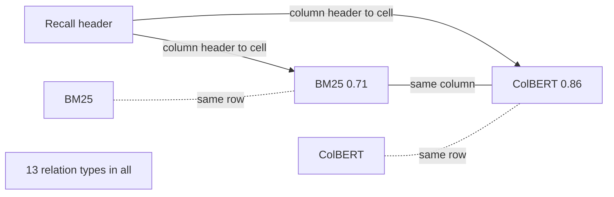
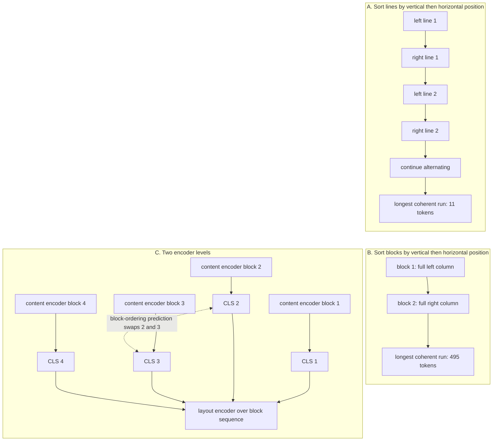
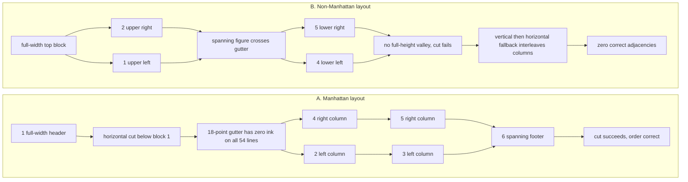

# Chapter 14: Beyond Plain Text - Tables, Layout, Documents

This chapter explains why table cells and document blocks lose meaning when they are flattened, how table and layout encoders restore structure, and which costs, invariance limits, metrics, and layout priors matter in a Retrieval-Augmented Generation (RAG) interview.

## TL;DR

- A table stores meaning in the triple of row key, column header, and cell value. A fixed text cut can separate those parts while leaving a chunk that looks healthy.
- Detect tables before splitting. Keep a fitting table atomic. For an oversized table, split only between rows and repeat the header in every fragment.
- TAPAS repairs row-major flattening with additive column, row, and rank lookups. Its absolute row and column fields also make equivalent renderings look different.
- TableFormer removes global, row, and column position IDs. It keeps within-cell order and adds 13 structural relation biases to attention.
- Accuracy alone can hide order sensitivity. Variation percentage (VP) counts paired answer flips and stays visible when correct-to-wrong and wrong-to-correct flips cancel.
- Clean extraction is not correct reading order. Sorting blocks instead of lines raises the coherent span in the worked two-column page from 11 tokens to 495.
- Layout rules are corpus assumptions. Reading direction, full-height gutters, relative type size, emphasis rarity, and the rendered table's key column must be tested on each domain.

## The story

Imagine a warehouse that receives crates of financial reports, manuals, forms, and tables. The search system is the shipping desk. It must find the right package and send enough contents to an answer station.

A prose paragraph arrives as one labeled crate. Its words carry most of its meaning. A table arrives differently. The header is the crate manifest, the first column is the pallet label, and each numeric cell is one loose item. If a clerk cuts the shipment after a fixed number of tokens, the manifest can stay upstairs while most pallets move downstairs.

The downstairs pallets still look orderly. Every row has aligned numbers and a region code. Yet the number 38.2 no longer says whether it is revenue, gross margin, operating expense, or net income. The shipping desk matches the query words to the upstairs manifest and sends the labeled crate without the requested row.

The first repair is operational. The receiving clerk marks each table before the cutting line. Small tables stay whole. Tall tables split only between rows, and every pallet receives a copied manifest. This costs more labels and more packages, but every number remains self-describing.

The warehouse then installs a table scanner. TAPAS reads each item with token, sequence position, segment, column, row, and numeric rank fields. The scanner understands the grid, but it also stamps absolute aisle and shelf numbers onto the items. Moving an unchanged pallet to another aisle changes its representation.

TableFormer changes the stamps. It removes global aisle and shelf numbers. It records relations such as same row, same column, and header-to-cell. A harmless pallet swap leaves those relations unchanged. The warehouse now measures paired answer flips, because aggregate accuracy can stay flat while many individual shipments change.

Documents create a second kind of warehouse error. A two-column page is two vertical racks. A line-level clerk alternates one shelf from the left rack and one from the right. Every word remains legible, yet each outgoing box mixes unrelated specifications. A block-level clerk empties one rack before moving to the next.

For long documents, the warehouse uses two floors of supervision. A lower encoder reads inside each block. A higher encoder reads block summaries, block types, order, adjacency, and image slots. The hierarchy makes block structure representable and reduces the attention pairs in the worked example by 39.6 times.

The final lesson is that warehouse geometry is not universal. English reports, Arabic contracts, vertical Japanese manuals, journals, slide decks, and spanning figures require different routing rules. A good system writes those priors down, tests them on held-out domains, and keeps relational invariance in the encoder while keeping rendering conventions in the parser.

## Decoder table

| Technical term | Plain-English meaning | Why it matters |
|---|---|---|
| Retrieval-Augmented Generation (RAG) | A system that retrieves source material before a model answers | Ingestion decides whether the needed structure survives long enough to be retrieved |
| Semi-structured data | Prose and tables interleaved in one source | Meaning can live in position even when the extracted text looks normal |
| Structured data | Rows or triples governed by an explicit schema | Exact predicates, joins, and aggregation are available without similarity ranking |
| Unstructured data | Prose, transcripts, or tickets whose meaning lives mainly in tokens | Standard chunkers and embedding models are designed around this case |
| Large Language Model (LLM)-generated data | Synthetic questions, summaries, or propositions written for retrieval | It provides query-like wording but moves provenance responsibility to the system owner |
| Asia-Pacific (APAC), Americas (AMER), and Europe, Middle East, and Africa (EMEA) | The three region labels printed in the worked table | They identify rows but do not identify the meaning of each numeric cell |
| Third quarter 2025 (Q3-25) | The period label used in the worked table | It is query vocabulary that can remain with the header while a value is cut away |
| Gross margin (GM%), operating expense (Opex), and net income (NI) | Abbreviated metric headers in the worked table | They give the numeric cells their column meaning |
| Table region | A two-dimensional page area identified as a table before linearization | It must be protected before a generic text splitter runs |
| Row key | The cell that identifies a row, usually in the first rendered column | A value needs its row key and column header to be interpretable |
| Column header | The label that names an attribute | Numeric cell text is weak retrieval material without this label |
| Row-major serialization | Printing the header, then every row from left to right | It places same-column cells far apart in the token sequence |
| Orphan row | A row separated from the header that gives its values meaning | Orphan rows can be fluent, retrievable, and semantically unusable |
| Atomic table | A table kept as one retrieval unit | It avoids header severance when the table fits the budget |
| Header repetition | Copying column labels into every row group or row serialization | It makes each table fragment self-describing |
| Retrieval surrogate | A short row-level or table-level description used for search | It decouples what the system embeds from the larger payload it injects |
| Table payload | The original table region returned after a surrogate matches | It preserves full context for comparison questions at a prefill cost |
| Lookup question | A query that names one row and one column | A header-repeated row can answer it |
| Aggregation question | A query about a whole column, such as highest, total, or count | No single row chunk can answer it by construction |
| Structured Query Language (SQL) | A language for exact operations over structured tables | It is the route for compound selection and aggregation when a schema is worth maintaining |
| Best Matching 25 (BM25) | A sparse term-matching ranker | It can rank the header chunk first because the query vocabulary occurs there |
| Dense Passage Retrieval (DPR) | A method label printed in the TAPAS illustration | It is one cell value in the exact source figure, not a new architecture introduced by this chapter |
| WordPiece | The subword token unit used in the stated table-encoder examples | Cell length in WordPiece tokens determines the row budget |
| Bidirectional Encoder Representations from Transformers (BERT) | The base encoder architecture used by TAPAS | Its learned position table has 512 rows in the stated base configuration |
| TAPAS | A table model that keeps the BERT transformer unchanged and adds table fields at input | It restores grid coordinates and numeric order with little parameter cost |
| Token identifier (ID) | The lookup key for a token's lexical identity | It stays unchanged under a row permutation |
| Position ID | The token's absolute place in the flattened sequence | It changes when the printed row or column order changes |
| Segment ID | The field separating query tokens from table tokens | TAPAS uses segment 0 for the query and the other segment for the table |
| Column ID | The absolute printed column assigned to a table token | It restores coordinates but introduces column-order sensitivity |
| Row ID | The absolute printed row assigned to a table token | It changes every token vector in swapped rows |
| Rank ID | The sorted position of a numeric or date cell within its column | It gives the model an explicit comparison feature and survives row permutation |
| Additive input embedding | A sum of learned lookup vectors before the first transformer layer | TAPAS changes representation rather than transformer capacity |
| Silent truncation | Dropping tokens beyond the encoder window without making the remaining sequence invalid | A maximum can be computed over 19 visible rows when the source had 20 |
| Verbalization | Rewriting cells as prose such as header is value | It avoids a custom encoder but repeats structure as costly content |
| Weak supervision | Training from final answers instead of explicit logical forms | TAPAS learns cell selection and one aggregation operator from answer-level signals |
| Cell-selection head | The output that chooses a set of cells | It does not express an arbitrary multi-step query plan |
| Sequential Question Answering (SQA), TabFact, and F1 | A table question-answering benchmark, a table fact-verification benchmark, and the metric-column label in one source example | SQA provides the 55.1 to 67.2 comparison, while SQA and TabFact receive permutation tests |
| Relational invariance | The requirement that equivalent row or non-key column permutations preserve the answer | It separates data meaning from rendering order |
| Permutation orbit | All row and column orders that denote the same relation | Its factorial size makes finite augmentation a weak guarantee |
| TableFormer | A table encoder that moves structure from absolute IDs into relation-aware attention bias | It builds exact row and column order symmetry into the architecture |
| Within-cell position | Token order that resets at each cell boundary | It preserves real word order such as Palo Alto |
| Structural relation | A pair type such as same cell, same row, same column, or header-to-cell | It survives harmless row and column permutations |
| Attention bias | A learned scalar added to an attention logit for a relation type | It encodes structure with very few parameters |
| Variation percentage (VP) | The share of paired queries whose answer flips after a label-preserving perturbation | It exposes instability that aggregate accuracy cancels |
| Marginal accuracy | Accuracy measured separately on original and perturbed sets | Equal totals do not imply the same questions were answered correctly |
| Conditional invariance | Invariance that holds only when the same cells survive serialization | Truncation can reintroduce order sensitivity even in TableFormer |
| Optical character recognition (OCR) | Conversion of a scanned page into text | High character confidence does not validate reading order |
| Raster order | Sorting page lines by vertical position and then horizontal position | It interleaves two columns with overlapping line heights |
| Reading order | The sequence in which document blocks should be consumed | Correct tokens in the wrong order produce useless chunks |
| Layout block | A typed page region such as header, paragraph, list, table, figure, or image | Block identity gives a representation level for document structure |
| Bounding box | The coordinates surrounding a page block | It supports ordering, citation, and layout features |
| Block adjacency | The relation between neighboring blocks independent of their token lengths | A flat sequence makes this relation drift with block size |
| Layout-Aware Multimodal Pre-training (LAMPreT) | A two-level document encoder with text and image blocks | It models semantics inside blocks and relations among blocks |
| Convolutional neural network (CNN) encoder | The image encoder feeding image blocks into the upper sequence | It gives non-text blocks a slot beside text blocks |
| Masked language modeling | Predicting hidden tokens from their context | Alone, it can ignore the upper layout level and solve each block locally |
| Image-text matching | Detecting an image swapped from another document | It is one of the two low-level LAMPreT objectives |
| Block-ordering prediction | Detecting whether two block summaries were swapped | It directly punishes layout blindness |
| Image fitting | Selecting the correct candidate for a masked image block | It tests cross-modal block association |
| Block filling | Selecting the correct candidate for a masked text block | It tests document-level text block association |
| Mean reciprocal rank (MRR) | A rank metric that rewards an earlier correct result | The stated LAMPreT evaluation uses it for block-level tasks |
| recall@5 and recall@10 | Whether the correct item appears among the first 5 or 10 results | The source uses recall@5 for block evaluation and recall@10 for layout transfer |
| LayoutLM | A flat encoder that adds normalized two-dimensional box coordinates | It fits single-page geometry but does not create a block sequence |
| Two-level hierarchy | A content encoder inside blocks and a layout encoder across block summaries | It makes multi-page structure fit a stock 512-position encoder |
| Layout prior | An assumed map from geometry or typography to meaning | Every linearizer supplies one in code or learned weights |
| Manhattan layout | Axis-aligned blocks separated by coherent whitespace | Recursive X-Y cut works when its full-height valleys exist |
| Recursive X-Y cut | Alternating projection cuts at the widest zero-ink valley | It discovers columns before ordering their blocks |
| Full-height gutter | A vertical whitespace band with zero ink across all lines in a region | It separates columns when ordinary word spaces disappear under projection |
| Non-Manhattan layout | A page with spanning elements or geometry that breaks full-height valleys | X-Y cut can fail and force a bad fallback order |
| Page-relative type ratio | A block's size divided by the character-weighted modal size on the page | It transfers across journals, slides, and contracts better than an absolute point threshold |
| Emphasis rarity gate | Treating bold as meaningful only while bold text is rare | Bold cannot mark a useful minority when most of the page is bold |
| Leftmost-key prior | The convention that the first rendered column identifies each row | It belongs in linearization and chunk metadata, not relational index embeddings |
| Script-aware sort | Choosing block order from writing direction | Left-to-right, right-to-left, and vertical scripts require different order functions |
| Held-out domain | A document category absent from parser training or rule tuning | It reveals learned or coded layout priors that do not transfer |
| Table symbols T, R, C, h_c, and t_r,c | The table, row count, column count, column-c header, and cell at row r and column c | They define the row-key, header, and value triple, while R! C! counts equivalent row and column permutations |
| Overloaded symbols L, o, w, n, and Delta(r) | L is chunk size, cell length, or layer count where locally defined. The others are overlap, tokens per cell, row or sequence count, and header distance | They expose fit, orphaning, and compute only when their local definitions stay explicit |
| TAPAS symbols Q, W, d, i, r, c, k, and Rmax | Query length, window, vector width, sequence position, row ID, column ID, rank ID, and maximum fitting rows | They price fit and separate content-derived fields from printed-order fields. In retrieval cost, k instead counts returned chunks |
| E_tok, E_pos, E_seg, E_col, E_row, and E_rank | Learned token, position, segment, column, row, and rank lookup tables | Their sum is the complete stated TAPAS input intervention |
| W_Q, W_K, d_h, alpha_ij, phi(i,j), b_phi(i,j), and pi | Query and key projections, head width, an attention logit, a structural pair type, its learned bias, and a row permutation | They show how TableFormer moves table structure from token vectors into permutation-stable attention |
| p and q | Correct-to-wrong and wrong-to-correct flip fractions | Their difference is accuracy change, while their sum is variation percentage |
| B, n, and T in the hierarchy | Block count, average tokens per block, and total tokens | They compare flat attention T squared with hierarchical attention Bn squared plus B squared |
| L_j and lambda_j | One pre-training loss and its weight | Weights only become interpretable after the component losses share a range |
| x, y, x0, y0, x1, and y1 | Block sort coordinates and bounding-box corners | They encode page geometry but do not by themselves define reading order |
| s, s0, and p in typography | A block's type size, the page's character-weighted modal size, and the bold-token fraction | They make heading and emphasis rules relative to the page |

## Core mechanics

### 14.1 Semi-structured data and why splitting a table corrupts it

#### A cell needs three coordinates

- **What:** A value is interpreted with its row key, column header, and cell value.
- **Why:** Only the cell value is adjacent to itself in row-major text.
- **Failure without it:** A retrieved value can be assigned the wrong column label.
- **Cost and complexity:** Preserving the triple requires table detection, row-aware splitting, and repeated labels.

Let a table have C columns, R data rows, header cells h1 through hC, and value tr,c in row r and column c.
The required semantic unit is the triple (tr,1, hc, tr,c).
If each serialized cell costs w tokens, the value sits near w(rC + c). Its header sits near wc.
The distance is:

$$
\Delta(r) = wrC
$$

The distance grows linearly with r. It is unbounded as the table becomes taller.

#### Fixed splitting creates orphan rows

- **What:** A splitter uses chunk size L and overlap o on the one-dimensional serialization.
- **Why:** The header appears once, before every data row.
- **Failure without it:** Only the first chunk contains both labels and values.
- **Cost and complexity:** Increasing overlap repeats nearby rows but does not carry a distant header forward.

The rows sharing the first chunk with the header number:

$$
n = \left\lfloor \frac{L - wC}{wC} \right\rfloor = \left\lfloor \frac{L}{wC} \right\rfloor - 1
$$

The retained fraction is n/R, so the orphan rate approaches 1 as R grows. For L = 512, o = 64, C = 6, and w = 5, one row costs 30 tokens and the first chunk keeps 16 rows with the header.
A 120-row table retains 16/120 = 13.3% and orphans 104 rows, or 86.7%. The header ends at token 30, chunk two starts at token 449, and the 64-token overlap carries about 2.1 rows but not the header.

#### Retrieval fails before generation

- **What:** The query uses header vocabulary such as gross margin and third quarter 2025.
- **Why:** Those words occur in the header chunk, while the Europe, Middle East, and Africa (EMEA) row occurs later.
- **Failure without it:** BM25 ranks the labels without the answer. The row chunk shares only the row key.
- **Cost and complexity:** A larger embedding model cannot reconstruct deleted labels.

The opening prose calls 38.2% the APAC number, while Figure 14.1 labels APAC as 41.7 and EMEA as 38.2. The source is internally inconsistent on this assignment, so this chapter does not reconcile it.
Keeping the whole table also has two limits. The stated BERT-family table encoders accept 512 positions and truncate silently, while one vector for R near-identical rows can retrieve the table but cannot rank inside it.
An 8,000-token embedder shifts a precision problem into generator prefill. Semantic splitting does not find a dip between highly self-similar rows.

#### Parse before splitting

- **What:** Detect table regions while the document is still two-dimensional.
- **Why:** A downstream token stream no longer carries the region boundary.
- **Failure without it:** The table can be cut before the system knows it is a table.
- **Cost and complexity:** Header repetition raises tokens and vector count.

Keep a fitting table atomic.
For an oversized table, split only between rows and repeat the header in each fragment.
This reduces header distance from wrC to order wC. The result is independent of r.

#### Worked table configurations

The table has R = 120, C = 6, and w = 5.
One row costs 30 tokens. The header plus data costs 30 x 121 = 3,630 tokens.

| Configuration | What happens | Cost and limit |
|---|---|---|
| Recursive character split | L = 512, o = 64, stride 448, 8 chunks | 16 rows keep labels. 104 rows are orphaned. Orphan rate is 86.7% |
| Header repeated per row | A cell grows from 5 to 7 tokens. A row grows from 30 to 42 | 120 x 42 = 5,040 tokens. This is 39% more. It uses 10 chunks, 1.39x embedding tokens, 1.25x vectors, and 0 orphan rows |
| 80-token table surrogate plus payload | One vector indexes the summary and the 3,630-token table stays attached | Retrieving 5 tables prefills 18,150 tokens. Ten row results prefill 420 tokens. Whole-table prefill is 43x larger |

The 43x whole-table cost buys comparison and ranking across rows, because highest margin is a property of a column that a single retrieved row cannot answer.
At about 4 characters per token, 3,630 tokens is about 14,500 characters. Direct cell counting gives about 13,100 characters, so the estimates agree within 10%.
The 3,630-token table is 7.1 times the 512-position limit. The table-native encoders assume the selected table already fits and do not make the ingestion decision.

#### Operating decisions

- Detect tables before the text splitter. Measure pipe, tab, and decimal-alignment density on a sample before assuming the corpus has almost no tables.
- Repeat headers in oversized table fragments and accept the stated 39% token increase.
- Index row surrogates for lookup traffic.
- Index table surrogates for comparison traffic and return the table payload.
- Route highest, total, year-over-year, and count questions to SQL when recurring shapes justify a maintained schema.
- Leave heterogeneous one-off layouts in retrieval when schema induction costs more than it returns.
- Stratify retrieval evaluation by whether the gold answer lives in a table.

### 14.2 Table encoding: TAPAS and its positional assumptions

#### The one-dimensional input problem

- **What:** A table has rows and columns, while a transformer receives one token sequence.
- **Why:** Row-major flattening creates misleading token distances.
- **Failure without it:** Same-row but unrelated cells look near. Same-column cells look far.
- **Cost and complexity:** A structural encoder adds input lookups and a parser that supplies their IDs.

For token wi at position i and segment si, BERT uses:

$$
h_i^{(0)} = E_{tok}(w_i) + E_{pos}(i) + E_{seg}(s_i)
$$

Each lookup returns dimension d = 768 in the stated BERT-base configuration.
The learned position table has 512 rows. The limit is a lookup-table size, not a formula.
After a query of Q tokens and two special tokens, a cell in row r and column c begins at:

$$
i(r,c) = Q + 2 + CL + (rC + c)L
$$

The product CL is the header-row length.
Side-by-side cells are L tokens apart.
Same-column cells are CL tokens apart.
At C = 8 and L = 3, those distances are 3 and 24.

#### TAPAS adds table fields at the input

- **What:** TAPAS sums column, row, and rank lookups into the BERT input.
- **Why:** The fields restore grid coordinates and explicit numeric order.
- **Failure without it:** The base position signal points toward printed neighbors instead of shared attributes.
- **Cost and complexity:** Three 256-entry tables add 589,824 parameters in the worked setup.

$$
h_i^{(0)} = E_{tok}(w_i) + E_{pos}(i) + E_{seg}(s_i) + E_{col}(c_i) + E_{row}(r_i) + E_{rank}(k_i)
$$

The query occupies segment 0 and carries zeros in all three table fields. The header uses row ID 0, while column and row IDs come from the printed grid.
For numeric or date columns, rank ID comes from sorting cell values. Other columns use rank ID 0. Rank exists because a query such as highest operating margin needs comparison, including 0.42 versus 0.31 across 20 attention hops in the stated example.

#### Positional assumptions

- **What:** Token, segment, and rank fields are content-derived or content-stable. Position, column, and row fields depend on rendering.
- **Why:** A relation can remain unchanged when rows or non-key columns move.
- **Failure without it:** Equivalent tables can produce different first-layer vectors and answers.
- **Cost and complexity:** Canonicalization can reduce parser churn but does not make the encoder invariant.

Under a row permutation, token IDs, segment IDs, and rank IDs stay fixed because value order does not depend on printed row. Absolute position and row IDs change, while column IDs change under column permutation.
The representation therefore mixes data properties with rendering properties. This is not purely a defect because rendered tables often use column one as the entity key, but the mechanism cannot distinguish a meaningful key-column move from a harmless metric-column swap.

#### Window and verbalization arithmetic

The worked table has R = 20, C = 8, L = 3, Q = 12, d = 768, 110 million parameters, and 512 positions. The opening failure says a user asks about 8 segments while truncation leaves 6 visible.
Structural length is 12 + 2 + 24 + 480 = 518 tokens. In general, Rmax = (W - Q - 2 - CL)/(CL), and solving 14 + 24 + 24R <= 512 gives R <= 474/24 = 19.75, so only 19 complete rows fit.
Verbalization uses 3 header tokens, 1 is token, 3 value tokens, and 1 comma per cell. Each row uses 3 + 8 x 8 = 67 tokens, so 20 rows use 1,340 table tokens and 1,354 tokens with query and specials.
The continuous budget is (512 - 14)/67 = 7.4 rows, so only 7 complete rows fit. Against 504 structural table tokens, verbalization costs 2.66x the tokens and (1,354/518)^2 = 6.8x the attention for the same 160 cells.

#### Parameter and result accounting

Three 256 by 768 tables add:

$$
3 \times 256 \times 768 = 589{,}824 \approx 0.59\text{ million}
$$

That is one 768 by 768 matrix and 0.54% of a 110 million-parameter encoder.
The source reports the SQA benchmark rising from 55.1 to 67.2, a 12.1-point absolute gain.
The architecture stays BERT while replacing a semantic-parsing pipeline. The result supports a representation fix, not a capacity fix.
Holding the key column fixed still leaves 20! x 7! = 2.43 x 10^18 x 5,040, or about 1.2 x 10^22 equivalent inputs.
The model saw one parser-emitted ordering. The objective does not tie the rest to the same answer.

#### TAPAS claim limits

TAPAS is not a query engine.
It predicts a set of cells and at most one operator from none, count, sum, or average.
It is trained by weak supervision from final answers, not logical forms.
Average margin across segments whose revenue grew requires two operations. The head cannot express that plan.
Route compound numeric questions to SQL.
Numeric parsing is also a gate.
The source states that one failed parse can collapse the rank field to 0 for the column.
Its examples are one `n/a` or one `1,204` with a thousands separator.
Normalize values at ingest and monitor column parse rates.

#### Operating decisions

- Compute the row budget before selecting the encoder.
- Reject rather than silently truncate.
- Shard by row group only with the header replicated.
- Route cross-shard comparisons and aggregates elsewhere.
- Prefer verbalization for few small tables when maintaining a serializer is cheaper than maintaining a model. The source calls it the right choice on a 5-row table and for open-ended reasoning with a long-context instruction-tuned model.
- Prefer structural encoding above roughly 10 rows in the stated cost comparison.
- Freeze canonical column order and parser version beside the index.
- Run row permutation tests on label-preserving tables.
- Do not permute chronological ledgers, ranked leaderboards, or other order-bearing tables.

### 14.3 Row and column order bias and TableFormer's fix

#### Put exact symmetries in the architecture

- **What:** A relation is a set of tuples over named attributes.
- **Why:** It has R! C! renderings when row and column order carry no label information.
- **Failure without it:** The model can learn an incidental printed order.
- **Cost and complexity:** Exact architectural bias replaces an impossibly large augmentation orbit.

A 10-row, 5-column table has 10! x 5! = 435,456,000 equivalent serializations.
Five augmented permutations cover 5/3,628,800 = 1.4 x 10^-6 of the row orbit alone.
Sampling five points does not guarantee symmetry over 4.35 x 10^8 inputs.

#### Why TAPAS changes after a swap

- **What:** Row and column embeddings appear inside every token vector.
- **Why:** The first attention logit is computed from those vectors.
- **Failure without it:** Swapping rows changes every logit that touches their tokens at layer 1.
- **Cost and complexity:** The perturbation can compound through the remaining 11 layers.

$$
\alpha_{ij} = \frac{(W_Q e_i)^T(W_K e_j)}{\sqrt{d_h}}
$$

Changing ri changes ei. That changes alpha for every affected pair.
No architecture rule forces the change to zero.
No stated pre-training objective penalizes it.

#### TableFormer moves structure into attention

- **What:** TableFormer deletes global position, row, and column IDs.
- **Why:** Absolute IDs encode rendering order as meaning.
- **Failure without it:** A harmless permutation rewrites token vectors.
- **Cost and complexity:** It adds one learned relation scalar to each attention logit.

Position resets inside each cell. Word order within a cell remains real.
The structural pair function maps each token pair to 1 of 13 relations.
The source names same cell, same row, same column, cell-to-header, header-to-cell, mirrored question-table relations, and a residual class.

$$
\alpha_{ij} = \frac{(W_Q e_i)^T(W_K e_j)}{\sqrt{d_h}} + b_{\phi(i,j)}
$$

For row permutation pi:

$$
\phi(\pi(i),\pi(j)) = \phi(i,j)
$$

The attention matrix is permuted with the table. It is not rewritten by the table.
This construction follows the same cheap relative-bias pattern as T5, with structural relation types replacing distance buckets.
It preserves within-cell order, so Palo Alto does not become Alto Palo.

#### Parameter and compute cost

TAPAS row and column tables use 2 x 256 x 768 = 393,216 parameters.
TableFormer deletes them.
The replacement uses 13 x 12 = 156 scalars when shared across layers.
It uses 13 x 12 x 12 = 1,872 scalars when each of 12 layers learns its own.
The larger figure is 0.48% of the deleted parameter count.
At n = 512, 12 heads, and 12 layers, the bias adds 3.77 x 10^7 additions per example.
The count is n^2HL = 262,144 x 144 = 3.77 x 10^7. The stated attention work is 4n^2dL = 9.66 x 10^9 floating-point operations (FLOPs).
The relation additions are 0.39% of attention compute.
Against the stated full BERT-base forward pass of 2 x 110 x 10^6 x 512 = 1.13 x 10^11 FLOPs, they are 0.03%.
T5-base uses 32 buckets across 12 heads, or 384 learned scalars. The source uses this as a scale check for the 156 shared TableFormer scalars.

#### Variation percentage sees canceled flips

- **What:** Let p be correct-to-wrong flips and q be wrong-to-correct flips.
- **Why:** Accuracy change is q - p, while VP is p + q.
- **Failure without it:** Equal flip counts cancel in aggregate accuracy.
- **Cost and complexity:** VP needs paired predictions on original and label-preserving perturbations.

The source evaluates TableFormer on SQA for table question answering and TabFact for table-based fact verification, plus row and column perturbations of both.
At 60.0% accuracy on both sets, p can equal q.
The constraints are p <= 0.600 and q <= 0.400.
VP can therefore reach 2 x 0.400 = 80% while accuracy change is zero.
The source reports TableFormer holding VP under 1% where TAPAS degrades.

#### Worked regression

The evaluation contains 1,000 questions over 200 filing tables.
The original serialization answers 600 correctly, or 60.0%.
After row permutation, 140 flip correct-to-wrong and 138 flip wrong-to-correct.
The new correct count is 600 - 140 + 138 = 598, or 59.8%.
The dashboard sees a 0.2-point drop.
VP is (140 + 138)/1,000 = 27.8%.
Only 722 of 1,000 answers are stable.
At sub-1% VP, TableFormer flips at most 10 of the 1,000 in this framing.

#### Invariance claim limit

The guarantee assumes the same cells survive serialization.
The flattened input still truncates at 512 tokens.
Cell inclusion can depend on the printed order when the table overruns the window.
That mechanism explains residual VP under 1% instead of exact zero in the stated result.
Absolute position can still carry legitimate rendering clues. A 2-row header partly signals its role by appearing on top, and moving Method beside F1 can make a human-readable table harder to parse.
For fitting tables, invariance is architectural.
For oversized tables, ingestion and sharding remain responsible.

#### Operating decisions

- Canonicalize row and column order in the parser before changing the encoder. Sorting rows by the key and pinning columns removes parser churn for the cost of a comparator.
- Keep order when order is data, including chronology and ranking.
- Report VP beside accuracy on structured-input evaluations. Permuting the existing set doubles it at zero labeling cost.
- Permute within order-free groups for partially ordered tables.
- Use architecture for exact symmetries and augmentation for formatting, whitespace, and casing changes.
- Repeat the header in every row block. A 60-row table that truncates becomes order-sensitive again.
- Route aggregates that cross row blocks to SQL.
- Read a table paper for its perturbation result as well as its headline accuracy.

### 14.4 Document layout: blocks, reading order, and hierarchical pre-training

#### Extraction and order are separate

- **What:** OCR or a parser can return every character correctly and still linearize the page wrongly. The opening parser reports 0.99 confidence across the page.
- **Why:** Two-column lines share vertical bands.
- **Failure without it:** Sorting each line by vertical then horizontal position alternates unrelated columns.
- **Cost and complexity:** Sorting blocks changes one key but requires trustworthy block boundaries.

The worked page has 2 columns, 45 lines per column, and 11 tokens per line.
It contains 2 x 45 x 11 = 990 tokens.
Line sorting produces one coherent line at a time, or 11 tokens.
Block sorting produces one 45-line column, or 495 coherent tokens.
That is a 45x improvement without model training.

#### What the parser must preserve

- **What:** Each block carries a bounding box, type, content, text properties, and image status.
- **Why:** Header, paragraph, list, table, figure, and image roles are different.
- **Failure without it:** The same words cannot reveal whether they govern later content.
- **Cost and complexity:** Block IDs, types, page numbers, boxes, and text properties add metadata and parser work.

Correct order is necessary but not sufficient.
A flat token stream cannot express block membership and block type directly. The source contrasts `Discontinued models` as a header governing 300 tokens with the same words as a table cell governing nothing.
It also measures block adjacency in tokens.
Blocks 3 and 4 remain neighbors whether block 3 contains 12 or 800 tokens.
The flat distance changes with block length anyway.

For scans, the source uses Optical Character Recognition (OCR). For born-digital Portable Document Format (PDF) and HyperText Markup Language (HTML), it uses a structure parser. Each block can carry font size, bold, italic, and underline properties, plus image status.

#### LAMPreT uses two encoder levels

- **What:** A lower transformer reads within blocks. A higher transformer reads block summaries.
- **Why:** Block order, type, adjacency, and image position need their own sequence.
- **Failure without it:** Long documents overrun the flat window and non-text blocks lack explicit slots.
- **Cost and complexity:** The system needs block parsing, two encoders, image encoding, and five objectives.

Each token embedding sums WordPiece, block index, block content type, modality, and text features.
A classification (CLS) token marks each block start.
The lower transformer's classification output represents that block.
The upper transformer receives the block outputs in layout order, so a header representation can attach to the paragraphs it governs instead of whichever text lands within 512 tokens.
Images pass through a CNN encoder and occupy upper-level block slots.
For B = 40 blocks averaging n = 60 tokens, total T = 2,400.
Flat attention uses:

$$
T^2 = 5.76 \times 10^6
$$

The hierarchy uses:

$$
Bn^2 + B^2 = 40 \times 60^2 + 40^2 = 145{,}600 = 1.456 \times 10^5
$$

The two terms are 144,000 and 1,600. The reduction is 39.6x.
The compute optimum from minimizing T^2/B + B^2 is about B = 142.
The actual 40 blocks are semantic units chosen by the document. They are not a tuning knob.
Both levels fit a 512-position table. The flat 2,400-token section is 4.7x over it.

#### Five pre-training objectives

- **What:** Two objectives operate within content and three operate on the block sequence.
- **Why:** Layout is learned only when a layout-blind model is punished.
- **Failure without it:** Masked language modeling can solve one block at a time and ignore the upper encoder.
- **Cost and complexity:** Five component losses require normalization, hypotheses, weights, and ablations.

The low-level objectives are masked language modeling and image-text matching.
Image-text matching swaps some images with images from other documents.
The high-level objectives are block-ordering prediction, image fitting, and block filling.
Block-ordering prediction swaps two blocks and asks whether the order is original.
Image fitting masks an image block and selects the best candidate.
Block filling applies the same construction to a text block.
A within-block-only model scores at chance on all three high-level tasks.
The total loss is:

$$
\mathcal{L} = \sum_j \lambda_j \mathcal{L}_j
$$

The source leaves every lambda tunable.
Weights are not comparable unless component losses share a range.
A weight of 0.1 on a loss in [0, 10] can outweigh a weight of 1.0 on a loss in [0, 0.5].
Normalize first. Set weights from a corpus hypothesis. Then sweep and ablate.

#### LayoutLM trade-off and claim limit

- **What:** LayoutLM adds normalized box coordinates (x0, y0, x1, y1) to a flat token input.
- **Why:** Absolute page geometry is useful for fitting single-page forms and receipts.
- **Failure without it:** Coordinates do not create an explicit block order or image slot.
- **Cost and complexity:** Flat two-dimensional positions are simpler for fitting pages. Hierarchy is more complex but supports blocks and images across longer documents.

LayoutLM is the stated strong choice when the document fits 512 tokens and position such as bottom-right matters. It adds normalized box embeddings to a flat BERT checkpoint and pre-trains with masked language modeling.
It loses on multi-block and multi-page documents for two mechanical reasons.
Coordinates do not state which block precedes which.
A flat token sequence has no explicit position for a non-text block.
LAMPreT's evaluation uses MRR and recall@5 for text block filling and image suggestion.
Its text-task performance is comparable to LayoutLM.
It is better at associating the correct image with a masked image block.
The claim is block-level and cross-modal association, not better text infilling.

#### Datasheet cost example

The corpus contains 40,000 pages at 990 tokens each, or 3.96 x 10^7 tokens.
At 512 tokens with no overlap, it yields 77,344 chunks.
At d = 768 in 32-bit floating point (fp32), vectors use 238 megabytes (MB).
The generator has 7 billion parameters and receives k = 5 chunks.
Raster-order extraction makes about 50% of each chunk distractor when electrical ratings and mechanical dimensions alternate across columns.
Across 2,560 context tokens, 1,280 are noise.
At the stated A100 sustained rate of 1.5 x 10^14 bfloat16 FLOPs per second, about half its 312 x 10^12 peak, wasted prefill is 119 milliseconds.
Block sorting leaves at most 17 foreign tokens in a 512-token chunk, or 3.3%.
Across the context, that is 85 distractor tokens and 7.9 milliseconds of wasted prefill.
One sort key recovers 111 milliseconds per query.
A parser at 0.4 seconds per page costs 16,000 core-seconds, or 4.4 core-hours.
Across 16 workers, that is 17 minutes once at ingest.
At 0.111 seconds saved per query, payback arrives after about 144,000 queries. This comparison is conservative because ingest spends central processing unit (CPU) seconds while serving saves accelerator seconds.
At 10 queries per second (QPS), that is about four hours of traffic.
The source warns that parser speed can vary by an order of magnitude. Measure it on the actual parser.

#### Operating decisions

- Sort blocks, not lines or tokens.
- Preserve the parser's internal order inside each block.
- Prepend the governing header chain to a chunk before buying a layout-aware model.
- Use the hierarchy when text must bind to images or multi-page block relations.
- Persist block ID, block type, page number, and bounding box beside each chunk. This costs a few dozen bytes per chunk beside 238 MB of vectors and avoids another 4.4 core-hours of parsing.
- Normalize all objective losses before setting their weights. A source hypothesis can weight masked language modeling low for image-dominated pages and high for text-dense filings.
- Evaluate layout with answer flips after block perturbation, not accuracy delta alone. When no stable order exists, such as on loose forms or slide decks, perturb block type labels instead.
- Use flat box positions for fitting single-page documents.
- Use hierarchy above 512 tokens or when cross-modal block association matters.

### 14.5 Layout priors you should be able to name

#### A sort key is a bundle of assumptions

- **What:** Sorting blocks by (y, x) means downward first and rightward within a band. The opening transfer case moves recall@10 from 0.83 on Securities and Exchange Commission filings to 0.31 on Osaka maintenance manuals while OCR, bounding boxes, and embedding weights remain unchanged.
- **Why:** It matches one common left-to-right Manhattan layout.
- **Failure without it:** It interleaves columns or reverses scripts whose reading direction differs.
- **Cost and complexity:** The system must classify columns, script, and region structure before sorting.

The naive sort asserts four priors.

1. Reading moves downward.
2. Reading moves rightward within a band.
3. Blocks are rectangular.
4. One global order exists.

With five blocks in each of two columns, the correct order has nine adjacent pairs.
The alternating sort preserves zero of nine.

#### Recursive X-Y cut

- **What:** Project ink onto one axis, cut at the widest zero valley, then recurse with the axis swapped.
- **Why:** A full-height gutter remains empty when ordinary word spaces fill under projection.
- **Failure without it:** A spanning element erases the valley and the fallback can interleave columns.
- **Cost and complexity:** One projection per region plus thresholds tied to body size.

United States Letter is 612 points wide in the worked example.
One-inch margins leave 468 points of text.
An 18-point gutter leaves two columns of (468 - 18)/2 = 225 points.
The page is 792 points high. Margins leave 648 points.
At 12-point leading, the region has 54 lines.
Body text is 10 points. Interword spaces are about 2.5 points in the source's approximation.
Those small spaces occur at different x coordinates and fill under projection.
The 18-point gutter has zero ink at the same x across all 54 lines.
A one-body-em threshold clears the gutter.
A spanning figure destroys the full-height valley.
The fallback then emits column 1, column 2, column 1, column 2 with zero correct adjacencies in the illustrated case.
One X projection per page can test for a full-height valley wider than one body em before the fallback runs.

#### Reading order depends on script and genre

Left-to-right documents use (y, x).
Hebrew and Arabic use (y, -x).
Vertical Japanese and traditional Chinese use (-x, y).
Newspapers require a choice between reading down a column and reading across the page.
When column edges do not align, the blocks may not form columns.
Mixed-script pages require region segmentation and an order per region.

#### Typography must be relative

- **What:** Size and weight mean something only against the rest of the page.
- **Why:** Journals, slides, and contracts use different absolute point sizes.
- **Failure without it:** A 14-point threshold misses contract headings and labels every token in a 24-point slide body.
- **Cost and complexity:** A character-weighted size histogram and emphasis-rate calculation are required per page.

Let s0 be the character-weighted modal size.
Mark a heading when s/s0 >= 1.10.
The interview transfer case moves a heading detector from 95% on the original PDF corpus to 40% after slide-deck uploads. The absolute point-size rule is the bug.
On 500 tokens, bold fraction p = 0.03 selects 15 tokens.
Against 12 true heading tokens, the precision ceiling is 12/15 = 0.80.
At p = 0.6, bold selects 300 tokens. The precision ceiling is 12/300 = 0.04.
Bold is useful only while bold is rare.

#### Worked mixed corpus

The corpus has 20,000 documents.
Journals are 60%. They use 10-point body, 12-point subheads, 14-point section heads, and 18-point titles.
Slides are 25%. They use 24-point body and 32-point headings.
Contracts are 15%. They use 11-point body and 11-point bold headings.

| Rule | Journals | Slides | Contracts | Weighted result |
|---|---|---|---|---:|
| Absolute s >= 14 points | Finds title and 4 section heads out of 17, recall 5/17 = 0.294 | Recall 1.0, but 1 title among 7 blocks gives precision 1/7 = 0.14 | Recall 0 | Weighted heading recall 0.426 |
| Relative s/s0 >= 1.10 plus bold fraction below 0.15 | Ratios 1.2, 1.4, and 1.8 all pass. Recall 17/17 = 1.0 | 32/24 = 1.333 passes while body 1.0 does not. Recall and precision are 1.0 | 12 bold heading tokens among 450 give 0.027, so the rarity gate passes | Weighted recall 1.0 |

The page histogram processes 20,000 x 12 x 2,400 = 5.76 x 10^8 character records.
At the stated 10^7 dictionary increments per second, it costs 58 seconds once.
The 1.10 threshold is not tuned in the example.
The cited type-scale mappings are 1.125 for a major second, 1.2 for a minor third, 1.25 for a major third, and 1.333 for a perfect fourth.
A threshold between 1.0 and 1.125 separates one standard step from body text.
The example excludes the 1.067 minor-second step on purpose. The source says a 6.7% difference is not a heading cue a human reads.
For OCR point estimates with several percent error, the source recommends 1.20 and more reliance on weight, capitalization, and position.

#### Rendering priors and encoder invariance coexist

- **What:** The rendered leftmost column often acts as the key, while the underlying relation remains column-order invariant.
- **Why:** Rendering and relation are different objects.
- **Failure without it:** Putting the leftmost-key rule into the encoder confuses typography with data semantics.
- **Cost and complexity:** The parser keeps the key in each chunk. The encoder keeps role relations without absolute index embeddings.

TableFormer drops row and column indices but keeps header-to-cell and same-column roles.
The linearizer keeps the key cell and required header rows in every fragment.
Arabic or other right-to-left rendering can invert the rendered-key convention without requiring an encoder change.

#### Learned priors also have domains

LayoutLM was pre-trained on scanned English business documents from the Illinois Institute of Technology Complex Document Information Processing (IIT-CDIP) corpus.
PubLayNet was built by matching Portable Document Format (PDF) text against PubMed Central Extensible Markup Language (XML). It covers scientific articles.
DocLayNet was created because single-domain layout corpora do not transfer.
Its authors annotated 11 layout classes across 6 document categories.
A coded prior can fail loudly on a held-out domain.
A learned prior can fail silently when the training domain is hidden from system tests.

#### Operating decisions

- Use page-relative size ratios instead of absolute point thresholds.
- Detect columns before applying a block sort.
- Audit a parser-provided reading-order field on 50 held-out pages. The source says most commercial parsers already emit one.
- Record script at ingest and select the order function from it.
- Carry the key cell and every required header row into table fragments.
- Preserve both header rows when the header spans two rows.
- Treat multi-column spanning cells as genuinely ambiguous unless structure is retained.
- Gate emphasis rules on the page's own emphasis rate. In single-weight documents, fall back to numbering patterns such as 1. or Article 3.
- Re-test every prior on a document category absent from development.
- Use the optometrist test as a diagnostic. Features visible when words are unreadable are layout signals that plain text extraction discards.

## Diagrams

### Table 14.1

| Type | Example | Retrieval gets free | What it costs |
|---|---|---|---|
| Structured | SQL rows, knowledge graph triples | Exact predicates, joins, aggregation. Ranking is almost unnecessary | The schema is yours to design and migrate forever |
| Semi-structured | Filings, wikis, manuals with prose interleaved with tables | Coverage with no schema work | Cell meaning is positional, so splitting corrupts it and cell text is weak similarity-search material |
| Unstructured | Prose, transcripts, tickets | Everything a chunker assumes, including sentences, redundancy, and distributional signal | No exact predicates. You rank, you do not query |
| LLM-generated | Synthetic question and answer pairs, summaries, propositions | A retrieval surface written in the query's own vocabulary | Provenance becomes yours to defend, and the errors are fluent |

**Table 14.1: Semi-structured data is the only one of the four types in which meaning is carried by position rather than by tokens, which is why it is the only one a text splitter can corrupt without producing anything that looks broken.**

### Figure 14.1

#### A. Row-major serialization, cut every L tokens

| Seg | Qtr | Rev | GM% | Opex | NI |
|---|---|---:|---:|---:|---:|
| header | header | header | header | header | header |
| ... | ... | ... | ... | ... | ... |
| cut | cut | cut | cut | cut | cut |
| EMEA | Q3-25 | 412.0 | 38.2 | 190.1 | 71.4 |

Above the cut, the header and 16 of 120 rows carry every query term and 13.3% of the data.

Below the cut, 86.7% of rows are bare numbers. The path from 38.2 to GM% is Delta(r) = wrC tokens and the cut severs it.

#### B. Row-wise serialization, header repeated

| Self-describing row | Position relative to cut |
|---|---|
| Seg:APAC Qtr:Q3-25 GM%:41.7 ... | above |
| Seg:EMEA Qtr:Q3-25 GM%:38.2 ... | above |
| cut | cut |
| Seg:AMER Qtr:Q3-25 GM%:35.9 ... | below |

Header distance is now order wC. The cut position no longer removes labels. Serialized tokens rise 39%.

**Figure 14.1: A fixed-length cut severs the header from every row beneath it: the top chunk holds the column names and 16 of 120 rows, and the remaining 104 rows become unlabeled numbers. Repeating the header inside each row makes every fragment self-describing and makes the cut position stop mattering.**

### Figure 14.2

#### A. Rendered table

| Method | Year | MRR |
|---|---:|---:|
| BM25 | 1994 | 0.31 |
| DPR | 2020 | 0.42 |

Same-row distance is L = 1. Same-column distance is CL = 3.

#### B. Row-major input fields

| Field | Method | Year | MRR | BM25 | 1994 | 0.31 | DPR | 2020 | 0.42 |
|---|---:|---:|---:|---:|---:|---:|---:|---:|---:|
| position ID | 1 | 2 | 3 | 4 | 5 | 6 | 7 | 8 | 9 |
| column ID | 1 | 2 | 3 | 1 | 2 | 3 | 1 | 2 | 3 |
| row ID | 0 | 0 | 0 | 1 | 1 | 1 | 2 | 2 | 2 |
| rank ID | 0 | 0 | 0 | 0 | 1 | 1 | 0 | 2 | 2 |

Position, column, and row IDs come from printed order. Rank IDs come from sorted values.

**Figure 14.2: TAPAS flattens the table row-major, which puts same-column cells CL tokens apart and unrelated same-row cells only L apart, then repairs the lost geometry with three additive lookups. Only the rank is derived from the cell values. the position, column, and row IDs are read off the printed order, so permuting rows hands the model a different input for the same data. The query occupies segment 0 and carries zeros in all three table fields.**

### Figure 14.3

#### A. TAPAS before and after a row swap

| r | c = 1 | c = 2 | c = 3 |
|---:|---|---:|---:|
| 0 | Method | Recall | Latency |
| 1 | BM25 | 0.71 | 12 |
| 2 | ColBERT | 0.86 | 44 |

| r after swap | c = 1 | c = 2 | c = 3 |
|---:|---|---:|---:|
| 0 | Method | Recall | Latency |
| 1 | ColBERT | 0.86 | 44 |
| 2 | BM25 | 0.71 | 12 |

The boxed conceptual row moves from r = 2 to r = 1. Every row-dependent token vector changes.

#### B. TableFormer relations

The relation edges survive the swap. Attention is permuted with the table.

**Figure 14.3: TAPAS binds a cell to an absolute row index, so swapping two rows rewrites every token vector in them. TableFormer binds it to a relation type, which the swap leaves fixed.**

### Figure 14.4

Token embedding equals WordPiece plus block index, block type, modality, and text features.

**Figure 14.4: Reading order is decided at the block level, not the token level: sorting lines rather than blocks cuts the longest coherent span on a two-column page from 495 tokens to 11, while a two-level encoder gives block order, block type, and block adjacency a representation level at which they can be predicted.**

### Figure 14.5

**Figure 14.5: Recursive X-Y cut recovers reading order only while whitespace runs the full height of the region, because the gutter is the one gap no intra-column word space can fill in across 54 lines. A single element straddling it erases the valley, the cut fails, and the (y, x) fallback emits column 1, column 2, column 1, column 2 - zero correct adjacencies.**

## Whiteboard pack

### What to draw

1. Draw a table with one header row and many data rows.
2. Draw a fixed cut below the header. Circle one orphan value.
3. Connect that value to its row key and column header. Label the path Delta(r) = wrC.
4. Redraw the rows with labels repeated. Mark orphan rate 0 and token cost plus 39%.
5. Draw TAPAS as six input fields. Circle position, row, and column as order-dependent.
6. Draw a row swap. Replace absolute IDs with TableFormer's same-row, same-column, and header-to-cell edges.
7. Write accuracy change q - p beside VP p + q.
8. Draw two page columns. Show line sorting as an alternating stripe and block sorting as two solid spans.
9. Stack a content encoder below a layout encoder. Add the five pre-training objectives.
10. Finish with a full-height gutter, a spanning figure, and script-dependent sort keys.

### Spoken script

Tables and pages are not plain token streams. I detect table and block structure before splitting. For a tall table, I split only between rows and repeat the header, so every value keeps its row key and column label. TAPAS adds row, column, and rank fields, but absolute indices create order bias. TableFormer moves structure into relation-aware attention, which survives harmless permutations. For documents, I sort blocks, not lines, and use hierarchy when block relations or images matter. I test reading-order, truncation, and permutation failures explicitly, because clean extracted text can still be structurally wrong.

## Interview traps

### 1. Why does a good text pipeline fail on table numbers?

The likely failure is table splitting, because query words stay in the header while the answer row lands elsewhere. Inspect one retrieved chunk, then detect tables before splitting, cut only between rows, and repeat the header if labels and values are separated. For a 200-page filing with 60 tables, index prose normally, keep fitting tables atomic, use row-atomic fallback for large tables, and restore headers on continuation pages.

### 2. Does adding row and column embeddings solve table structure?

It restores grid coordinates, but it also encodes printed order. TAPAS adds column, row, and rank fields while leaving BERT unchanged, so rank survives a row swap while absolute position and row IDs do not. For a 40-row by 12-column table with L = 3, one row costs 36 tokens and the stated budget is 12.8 rows, so shard with repeated headers and route cross-shard aggregates to SQL.

### 3. A row permutation moves accuracy from 60.0% to 59.8%. Is the model robust?

No, because accuracy compares marginals and opposite answer flips can cancel. Temperature 0 does not help because the inputs changed, and the worked 0.2-point change hides 278 flips among 1,000 questions, or VP 27.8%, while the zero-delta bound reaches 80%. If the relation bias truly blocks fused export, compare that measured instability against 5x augmentation, which covers only 1.4 x 10^-6 of the 10-row orbit and costs 5x the training compute.

### 4. Should I choose LayoutLM or a two-level layout encoder?

Use flat box coordinates for a fitting single-page form where absolute geometry is the signal, and use hierarchy above 512 tokens or when block adjacency and image slots matter. The stated LAMPreT result is comparable text block filling and better image association, not better text infilling. In the 40,000-page-per-day, 10 QPS, 300-millisecond scenario, combine page-image retrieval with block extraction and rank fusion because the image leg bypasses reading order but gives up lexical exact match on part numbers and error codes plus span citation.

### 5. Why not hard-code geometry and typography?

Vertical-then-horizontal sorting assumes downward reading, rightward movement within a band, rectangular blocks, and one global order. It preserves zero of nine adjacencies in the five-block-per-column example, while an absolute 14-point heading rule underlies the stated transfer from 95% to 40% after slide uploads. Detect columns and script first, use the page-relative s/s0 >= 1.10 rule with rarity-gated bold, and test every prior on held-out domains.

## Key numbers

| Topic | Exact value | Meaning or limit |
|---|---|---|
| Table geometry and retention | Delta(r) = wrC, n = floor(L/(wC)) - 1 | Header distance grows with row index, while retained rows do not grow with R |
| Opening split | L = 512, o = 64, C = 6, w = 5, row = 30 tokens | 16 of 120 rows retain labels, 13.3% retained, 104 orphaned, 86.7% orphan rate |
| Overlap and original size | Header ends at 30, chunk two starts at 449, overlap carries 2.1 rows, table is 30 x 121 = 3,630 tokens | The header is not repeated. The table is 7.1x BERT's 512 positions and makes 8 chunks at stride 448 |
| Header repetition | 5 to 7 tokens per cell, 30 to 42 per row, 5,040 tokens, 12 rows per chunk, 10 chunks | 39% token inflation, 1.39x embedding tokens, 1.25x vectors, 0 orphan rows |
| Surrogate and payload | 80-token surrogate, 1 vector, 5 x 3,630 = 18,150 payload tokens versus 420 row tokens | Whole-table prefill is 43x. Character estimates of 14,500 and 13,100 agree within 10% |
| BERT and flattening | d = 768, 512 positions, same-row distance L, same-column distance CL | At C = 8 and L = 3, distances are 3 and 24. TAPAS adds column, row, and rank, with zeros for query table fields |
| TAPAS window | R = 20, C = 8, L = 3, Q = 12, 518 structural tokens, R <= 474/24 = 19.75 | 19 rows fit and row 20 truncates silently. The opening asks about 8 segments while only 6 remain visible. At 40 rows, 12 columns, and L = 3, one row is 36 tokens and only 12 fit because the budget is 12.8 |
| Verbalization | 67 tokens per row, 1,340 table tokens, 1,354 total versus 518, budget 7.4 rows | Only 7 rows fit. Inflation is 2.66x and attention is 6.8x |
| TAPAS scale and result | 3 tables of 256 by 768 give 589,824 parameters, one 768 by 768 matrix, about 0.59 million and 0.54% of 110 million, SQA 55.1 to 67.2 | The gain is 12.1 points. The orbit is 20! x 7! = 2.43 x 10^18 x 5,040, or about 1.2 x 10^22 inputs, and the head emits one cell set with none, count, sum, or average |
| Numeric parse gate | One `n/a` or `1,204` can set rank to 0 for a column | Normalize numeric values and monitor parse rate before using rank IDs |
| Permutation orbit | 10! x 5! = 435,456,000, five samples cover 1.4 x 10^-6 of the row orbit | Augmentation does not guarantee exact symmetry and spends 5x training compute in the stated platform trade-off |
| TableFormer parameters | 13 relations, 393,216 row and column parameters deleted, 156 shared or 1,872 per-layer scalars added | The larger replacement is 0.48% of the deleted parameters |
| TableFormer compute | 262,144 x 144 = 3.77 x 10^7 additions, 4n^2dL = 9.66 x 10^9 attention FLOPs, 2 x 110 x 10^6 x 512 = 1.13 x 10^11 full-forward FLOPs | Bias is 0.39% of attention and 0.03% of the full estimate. T5's 32 x 12 = 384 scalars provide the scale check |
| VP limit and report | VP can reach 80% at 60% accuracy on both sets. TableFormer reports VP under 1% | Marginal accuracy can remain unchanged. Residual flips follow window overflow in the source |
| Worked regression | 600/1,000 = 60.0%, then 598/1,000 = 59.8%, with 140 down flips and 138 up flips | VP is 27.8%, 278 answers flip, and 722 remain stable |
| Reading order | 2 x 45 x 11 = 990 tokens, coherent span 11 versus 495 | Block sorting improves coherent span 45x |
| Hierarchy | B = 40, n = 60, T = 2,400, flat 5.76 x 10^6 pairs, hierarchical 144,000 + 1,600 = 1.456 x 10^5 | Flat input is 4.7x over 512. Hierarchy reduces pairs 39.6x and has a compute optimum near B = 142 |
| Objectives and loss | 5 objectives, weight 0.1 on [0, 10] versus 1.0 on [0, 0.5] | Two objectives are low-level and three are high-level. Normalize before comparing weights |
| Datasheet corpus | 40,000 x 990 = 3.96 x 10^7 tokens, 77,344 chunks, 238 MB at d = 768 fp32 | A chunk holds about 47 alternating line fragments. Raster order sends 1,280 distractor tokens, adds 1.79 x 10^13 prefill FLOPs, and wastes 119 milliseconds at 1.5 x 10^14 bfloat16 FLOPs per second, about half the stated 312 x 10^12 peak |
| Block-sort economics | 85 foreign tokens, 3.3%, 7.9 milliseconds wasted, 111 milliseconds recovered | Parser cost is 0.4 seconds per page, 16,000 core-seconds, 4.4 core-hours, or 17 minutes on 16 workers. Metadata is a few dozen bytes per chunk. Payback is 144,000 queries or about four hours at 10 QPS |
| Page-image trade-off | 40,000 pages per day, 10 QPS, 300-millisecond budget | Image retrieval bypasses reading order but gives up lexical exact match and span citation unless a block leg remains |
| Layout assumptions | 4 priors, 0 of 9 adjacencies preserved with five blocks per column | The priors are down, right, rectangles, and one global order |
| X-Y geometry | Page 612 by 792 points, text 468 by 648, gutter 18, columns 225, 54 lines at 12-point leading | Body is 10 points and word spaces are about 2.5 points. Only the gutter stays empty through all lines |
| Typography and emphasis | Heading detection 95% to 40%, p = 0.03 gives precision ceiling 0.80, p = 0.6 gives 0.04 | The transfer exposes an absolute-size bug. Both emphasis cases assume 12 true heading tokens among 500 |
| Mixed corpus result | 20,000 documents, 60% journals, 25% slides, 15% contracts | Absolute s >= 14 gives weighted recall 0.426. Relative s/s0 >= 1.10 with bold fraction below 0.15 gives 1.0 |
| Mixed corpus detail | Journal 5/17 = 0.294 versus 17/17 = 1.0, slide precision 1/7 = 0.14 versus 1.0, contract bold 12/450 = 0.027 | Histogram work is 5.76 x 10^8 records and 58 seconds at 10^7 increments per second |
| Type and transfer checks | Major second 1.125, minor third 1.2, major third 1.25, perfect fourth 1.333, excluded minor second 1.067 or 6.7%, 50-page parser audit | DocLayNet covers 11 classes across 6 categories to expose single-domain transfer limits |
