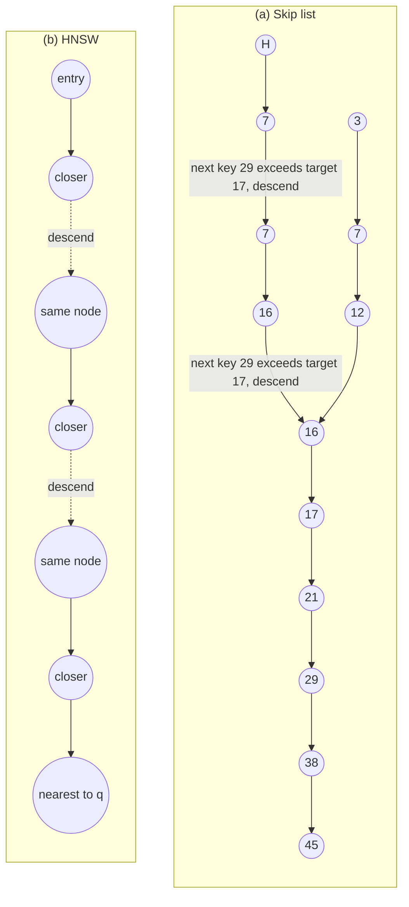
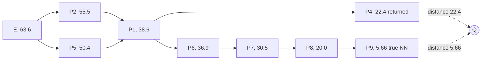
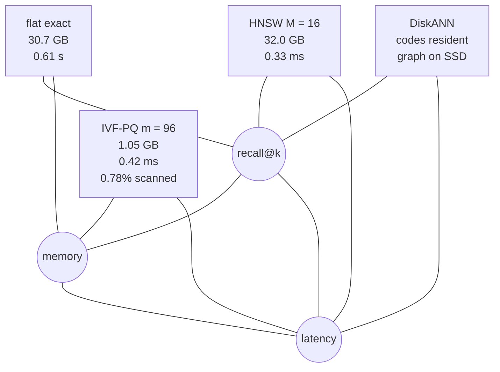

# Chapter 15: Approximate Nearest Neighbor Search

This chapter explains how to choose and defend an Approximate Nearest Neighbor (ANN) index for Retrieval-Augmented Generation (RAG) under recall, latency, memory, build, and update constraints.
## TL;DR

- Exact search reads every vector. At high dimension, classical exact indexes lose their pruning power and often become slower scans with pointer chasing.
- Hierarchical Navigable Small World (HNSW) search uses sparse upper layers and a dense base graph. It usually buys strong recall and low latency, but it keeps full vectors and an incompressible graph in memory.
- An inverted file (IVF) routes a query to learned centroid cells. Its `nprobe` knob buys back boundary misses, while a large `nlist` can move the bottleneck onto the centroid search itself.
- Locality-Sensitive Hashing (LSH) amplifies a weak collision signal with many bits and many tables. Its classical sublinear query bound comes with superlinear space, which makes it a poor default for production vector search.
- Graph indexes live or die by edge selection. Directional edges, a wider query beam, and a useful entry point prevent a greedy walk from getting trapped at the wrong local answer.
- Product Quantization (PQ) makes IVF compact. DiskANN moves full vectors and graph edges to a Solid-State Drive (SSD), while compact codes remain resident.
- No index wins every axis. Flat search keeps recall and memory, HNSW keeps recall and latency, IVF-PQ keeps memory and latency, and DiskANN relocates the memory bill to storage.

## The story

Imagine a fulfillment warehouse with millions of nearly identical boxes.
A customer asks for the box most similar to a photo.
Exact search means a picker opens every box and compares it with the photo.
That works in a small warehouse.
In a huge warehouse, the picker spends most of the time walking past bytes of inventory, not thinking.
A kd-tree is a rulebook that splits the warehouse by one label at each doorway.
The rulebook hopes a single label can prove that an entire wing is irrelevant.
With hundreds of labels, almost every box looks roughly equally far away in total.
One label cannot exclude a wing, so the picker visits every wing anyway.
HNSW is a layered network of warehouse walkways.
The sparse top floor has long express walkways.
Each lower floor adds shorter local walkways.
The picker follows a walkway only when it gets closer to the requested box, then drops a floor when no local move helps.
Its query beam is a shortlist of promising walkways kept open at once.
A wider shortlist finds more boxes but takes more time.
IVF is a set of learned warehouse zones.
Each centroid is the sign at the center of one zone, and each posting list is the inventory assigned to that sign.
The picker first finds nearby signs, then searches only their zones.
`nprobe` is the number of zone doors opened.
One door is fast, but the best box may sit just across the painted boundary.
Too many tiny zones create a new problem because reading every sign can cost more than searching the selected shelves.
LSH is a collection of yes-or-no stamps placed on every box.
One random stamp only weakly distinguishes a matching box from a common box.
Concatenating many stamps makes one strict shelf key.
Repeating that key across many independent catalogs restores the chance that a true match appears somewhere.
Those catalogs consume memory, and short keys flood the picker with false candidates.
A graph index is the warehouse walkway plan itself.
Connecting each box only to its closest boxes creates dense cul-de-sacs.
Directional edge selection reserves walkways that leave a neighborhood.
Vamana uses a pruning slack named α to decide which longer walkways survive.
Annoy uses several fixed tree maps instead of recoverable walkways.
When a tree sends the picker down the wrong branch, the picker must search another tree.
DiskANN stores the bulky walkway map and full box records on the SSD.
It keeps small PQ labels in Random Access Memory (RAM), so the warehouse can be much larger than memory.
Now the cost is storage rounds.
Every unnecessary hop becomes a random read.
The final choice is a triangle drawn on the warehouse budget sheet.
You may demand that the picker almost never misses, returns quickly, and uses little floor space.
The book's claim is that one design cannot hold all three corners at once.
Choose the two constraints the product has fixed, then price the third before naming an index.
## Decoder table

| Technical term | Plain-English meaning | Why it matters |
|---|---|---|
| Approximate Nearest Neighbor (ANN) search | Search that examines only a query-dependent subset and may miss the exact closest item | It escapes the high-dimensional collapse of exact pruning |
| Exact top-k search | Compare the query with every vector and return the true best k | It gives recall 1.0 but reads the whole corpus |
| Inner product | Multiply matching coordinates and add the results | Exact inner-product search performs one multiply and one add per coordinate |
| Cosine similarity | Compare vector direction after normalization | The chapter uses it for semantic similarity and random-hyperplane hashing |
| Euclidean distance | Straight-line distance between vectors | kd-trees, Voronoi cells, graph pruning, and LSH guarantees use it |
| Dimension d | Number of components in each vector | Vector bytes and distance work grow linearly in d |
| Corpus size N | Number of indexed vectors | Scan cost grows linearly in N, while index rules often depend on √N or log N |
| Floating-point 32-bit (fp32) | Four-byte storage for each vector component | An fp32 vector of dimension 768 occupies 3,072 bytes |
| Memory bandwidth B | Bytes that memory can stream per second | Exact scan time is 4Nd divided by B for fp32 vectors |
| Arithmetic intensity | Floating-point work performed per byte read | Exact scan has 0.5 floating-point operation per byte and is memory-bound |
| Memory-bound | Limited by bytes moved rather than processor arithmetic | Faster cores do little for an unbatched exact scan |
| Floating-point operation (FLOP) | One arithmetic operation on a floating-point value | A dot product costs 2Nd FLOPs across N vectors |
| Query per second (QPS) | One completed search request per second | It converts per-query bandwidth and storage reads into capacity |
| kd-tree | A binary tree that splits one coordinate at a time | Its high-dimensional pruning test stops excluding subtrees |
| Pruning radius r | Best full-space distance found so far | A kd-tree prunes only when a one-coordinate gap exceeds r |
| Distance concentration | Pairwise distances cluster tightly around their mean as dimension grows | It makes classical exact partitioning indexes degenerate |
| Coefficient of variation (CV) | Standard deviation divided by the mean | For the model in the chapter, CV shrinks as 1/√(2d) |
| Curse of dimensionality | Here, distance concentration in high dimension | The chapter excludes other meanings such as density sample complexity and shell volume |
| Intrinsic dimension | Effective dimension of the learned data manifold | ANN works when learned embeddings have far lower structure than random 768-dimensional noise |
| Contrast ratio | Ratio such as d100 divided by d1 for real queries | It measures whether the representation leaves a neighbor worth finding |
| Sequential scan | Read vectors in contiguous order | It uses hardware bandwidth better than pointer-heavy exact trees |
| Single Instruction, Multiple Data (SIMD) | One instruction applied across several numeric lanes | Flat arrays exploit it while tree pointer chasing does not |
| Skip list | Sorted linked list with geometrically thinning upper levels | It provides the conceptual derivation for HNSW |
| Total order | An ordering that tells whether a target lies ahead or below | Skip lists receive long express edges for free from this order |
| Promotion probability p | Chance that an item appears one level higher | It controls skip-list occupancy and expected height |
| Hierarchical Navigable Small World (HNSW) | Layered proximity graphs searched from sparse top to dense bottom | It replaces a skip list's total order with stored geometric links |
| Navigable Small World (NSW) | One flat graph mixing short and long links | It must crawl from a random entry and has polylogarithmic reported scaling |
| Proximity graph | Nodes are vectors and edges join selected nearby vectors | It supplies the local moves that replace sorted-list steps |
| Entry point | Node where a graph query starts | A poor entry can add hops or trap a greedy walk |
| Greedy descent | Move to the neighbor closest to the query when it improves distance | It is fast but can stop at a false local minimum |
| Local minimum | Node whose stored neighbors are all farther from the query | Pure greedy search halts there even when a better node exists elsewhere |
| Layer 0 | HNSW base layer containing every vector | Most query work and twice-M neighbor capacity live here |
| M | HNSW neighbor limit above the base layer | It controls connectivity, memory, layer occupancy, and rebuild cost |
| M0 | Base-layer HNSW neighbor limit, conventionally 2M | It sets the dominant base-layer expansion cost |
| ef_search | Query-time HNSW beam width | Raising it trades latency for recall without rebuilding |
| ef_construction | HNSW build-time search width | Raising it spends build work to improve the recall ceiling |
| Beam search | Keep several promising unvisited graph candidates | It can retain a branch that pure greedy search abandons |
| Select-neighbors heuristic | Admit a candidate only when it adds useful directional reach | It prevents dense clusters from consuming all graph degree |
| Relative Neighborhood Graph (RNG) rule | Drop a farther edge when a kept neighbor covers that direction | It underlies HNSW selection and Vamana pruning at α = 1 |
| Coarse quantizer | Map a vector to its nearest learned centroid | It is the routing layer of IVF |
| Inverted file (IVF) | Centroid-to-posting-list index over vectors | It scans a small number of learned cells instead of the full corpus |
| k-means | Iterative algorithm used to fit IVF centroids | It lets the data choose the partition |
| Lloyd's algorithm | The k-means procedure named in the chapter | It trains the coarse quantizer on a corpus sample |
| Centroid | Learned representative point for one partition | Queries pay stage-one distance comparisons against centroids |
| Voronoi cell | Region assigned to one nearest centroid | Queries near its boundary can have a true neighbor in the adjacent cell |
| Posting list | Vectors assigned to one centroid | IVF query work depends on the lengths of the probed lists |
| nlist | Number of IVF centroids and cells | More cells shorten lists but raise coarse-search cost |
| nprobe | Number of IVF cells opened per query | It is the reversible recall and latency knob for routing misses |
| Routing loss | Miss because the true neighbor lies in an unprobed cell | Raising PQ fidelity cannot repair it |
| Posting-list imbalance | Some centroid cells hold far more vectors than others | It can create high tail latency at fixed nprobe |
| Centroid staleness | Old centroids no longer fit the current topic distribution | Lists swell and recall falls without an explicit error |
| Locality-Sensitive Hashing (LSH) | Hash family whose collision chance falls with distance | It turns proximity into bucket retrieval with a formal guarantee |
| Avalanche property | Ordinary hash behavior that changes many output bits after a tiny input change | It deliberately destroys the locality retrieval needs |
| Sensitive family | An R, cR, p1, p2 guarantee for near and far pairs | It states collision limits only at the two design radii |
| Random hyperplane hash | Sign of a dot product with a random normal vector | For cosine, collision probability is 1 - θ/π |
| Collision probability p | Chance two vectors receive the same hash outcome | Amplification reshapes it into a useful retrieval probability |
| Amplification | Concatenate b bits, then union candidates across L tables | The first step improves selectivity and the second restores recall |
| Code length b | Independent hash bits in one table key | A longer key reduces spurious candidates sharply |
| Table count L | Number of independent LSH tables | More tables raise recall, candidate count, and memory |
| Exponent ρ | Ratio ln(1/p1) divided by ln(1/p2) | Classical LSH query is O(N^ρ) and space is O(N^(1+ρ)) |
| Candidate list | Union of items returned by probed buckets or graph expansion | Its size drives reranking latency |
| SimHash | Short binary fingerprint from random projections | The chapter keeps it for ingest-time near-duplicate removal |
| Hamming distance | Number of differing bits between binary fingerprints | A distance at most 3 marks near duplicates in the cited 64-bit setup |
| MinHash | Hash designed for set overlap | It replaces SimHash when Jaccard similarity over tokens matters |
| Jaccard similarity | Intersection divided by union for token sets | It fits boilerplate overlap better than embedding cosine |
| Multi-probe LSH | Probe extra nearby buckets in fewer tables | It trades query probes for lower table memory |
| k-nearest-neighbor graph | Connect each point to its k closest points | It can fragment because all edges stay inside a dense cluster |
| Directional edge selection | Preserve edges that leave in distinct directions | It protects reachability with limited degree |
| Cone width | Angular range sharing one directional representative | Narrow cones keep more edges and directions |
| Prefix minimum | Item closer than all earlier items in a random order | One cone keeps about a harmonic number of such edges |
| Harmonic number Hm | Sum of reciprocals from 1 through m, about ln m | It gives O(n log n) randomized neighborhood graph memory |
| Vamana | DiskANN graph-construction algorithm | Its α-pruning keeps long directional edges and controls hop bounds |
| Pruning slack α | Multiplier in Vamana's edge-discard test | Values above 1 retain more long edges and shorten the stated hop bound |
| Spread Δ | Starting distance divided by closest-pair scale | The bound on hops is log base α of Δ |
| DiskANN | Disk-resident graph with compact codes in memory | It moves full vectors and edges from RAM to SSD |
| Out-degree R | Maximum stored outgoing edges per DiskANN node | It controls graph memory and whether one node fits one sector |
| Sector | Fixed storage block read in one operation | Crossing 4,096 bytes doubles the reads per hop in the example |
| Non-Volatile Memory Express (NVMe) | SSD interface used for random reads | Its read latency and Input/Output Operations Per Second (IOPS) bound DiskANN |
| Annoy | Forest of random projection trees | It buys recall with more whole trees and cannot recover inside one tree |
| Product Quantization (PQ) | Replace a full vector with compact subvector codes | It changes memory by an order of magnitude but adds distortion |
| Asymmetric distance computation | Compare a query with reconstructed PQ codes | It can reorder candidates within correctly routed cells |
| Distortion loss | Recall lost because compressed-code distance changes ranking | A larger m or exact refine stage can address it |
| Exact refine stage | Re-score overfetched candidates using full vectors | It can recover PQ ordering without making all vectors resident |
| Recall@k | Fraction of the true top-k returned by the index | Index latency has meaning only at a stated recall operating point |
| Resident bytes | Memory that must remain available to answer queries | It usually decides whether HNSW or IVF-PQ is feasible |
| Tail latency | Slow-end latency such as p95 or p99 | List imbalance and storage rounds can dominate it |
| Query-time knob | Parameter changed without rebuilding | `ef_search` and `nprobe` move along recall-latency curves live |
| Build-time knob | Parameter baked into the index | M, m, α, and training choices require a rebuild to change |
| N, d, B, k, q, x, r, s, Z, p, ell, L, U, mL, M, M0, ef_search, and ef_construction | Corpus and vector sizes, bandwidth, result count, query and corpus vectors, pruning radius and split, standard normal variable, promotion chance and layer, uniform draw and layer multiplier, graph degrees, query beam, and build beam | These symbols size exact scan and derive the HNSW hierarchy, query work, memory, and build work |
| c_i, V_i, qc, nlist, nprobe, T(nlist), R, cR, p1, p2, theta, b, L, rho, alpha, Delta, Hm, R out-degree, and PQ m | Centroids and cells, coarse assignment, IVF counts and cost, LSH radii, collision probabilities, angle, code length, table count, exponent, graph slack and spread, harmonic number, disk degree, and subvector count | These symbols define IVF routing, hash amplification, graph pruning, storage rounds, and quantization |

## Core mechanics

### 15.1 Why exact search dies: the curse of dimensionality

- What exact scan does: It touches every vector for inner product or cosine top-k search.
- Why it exists: It returns the exact answer, needs no build, has no tuning knobs, and never goes stale.
- Failure without approximation: Bytes per query grow directly with N and d.
- Cost: fp32 scan traffic is 4Nd bytes.
- Cost: Arithmetic work is 2Nd FLOPs because each coordinate needs one multiply and one add.
- Cost: Arithmetic intensity is 2 divided by 4, or 0.5 FLOP per byte.
- Consequence: The scan is memory-bound on the Central Processing Unit (CPU) and Graphics Processing Unit (GPU) hardware described by the book.
- Formula: Scan time is `tscan = 4Nd / B`.
- Formula: Maximum QPS is `B / 4Nd`.

For N = 10^7, d = 768, and sustained bandwidth B = 50 GB/s, the vectors occupy 30.7 GB.
One scan takes 614 ms.
One socket therefore tops out at 1.6 QPS.
This lower bound assumes only that exact search reads each vector once.

- What a kd-tree does: It splits on one coordinate, descends to the query leaf, records best radius r, and considers sibling subtrees.
- Why it exists: It tries to prune most points and approach O(log N) exact search.
- Pruning rule: Prune the sibling split on axis i at s only when `|qi - s| > r`.
- Failure without a useful gap: The left side is one-coordinate distance, while r is a full-space distance.
- Cost when pruning fails: The tree evaluates every leaf and adds depth-first pointer chasing.

Under independent standard normal coordinates, one coordinate gap has expected size `E|Z| = 0.80`.
The squared query-to-point distance is a sum of d independent terms.
Each term has mean 2 and variance 8.
The squared distance therefore has mean 2d and standard deviation `2√(2d)`.
After taking the square root with the delta method, distance has mean `√(2d)` and standard deviation 1.
Its coefficient of variation is `1/√(2d)`.
At d = 4, the coefficient is 35%.
At d = 64, it is 8.8%.
At d = 768, it is 2.6%.
At d = 768, distances cluster around 39.2 with spread 1.0.
Across N = 10^7 independent draws, the extremes sit about `√(2 ln N) = 5.7` standard deviations from the mean.
The nearest point is about 33.5 and the farthest about 44.9.
The farthest is only 1.34 times as far as the nearest.

- What breaks: The best pruning radius stays near 33.5 while one-coordinate gaps stay near 0.8.
- Failure: A gap above 33 standard units essentially never appears, so no sibling subtree is excluded.
- Bookkeeping cost: A balanced tree over 10^7 points has depth `ceil(log2 10^7) = 24`.
- Coverage: Those splits constrain 24 of 768 coordinates, or 3.1%, and leave 744 unconstrained.
- Impossible exact coverage: Constraining each coordinate once would need depth 768 and 2^768 leaves.

Ball trees, R-trees, and other exact partitioning schemes inherit the same high-dimensional pruning problem.
The cited 1998 measurement found sequential scan faster than tested partitioning indexes above roughly ten dimensions.
The cited 1999 distributional result says the farthest-to-nearest distance ratio converges to 1 under broad conditions.
Approximation changes the question.
It permits a query-dependent subset through graph descent, Voronoi-cell probes, or hash collisions.

- Claim limit: If real embeddings followed independent noise, approximate search would also have little useful separation.
- Why ANN still works: Learned contrastive embeddings place related items near a lower-dimensional manifold.
- Evidence interpretation: A graph reaching 0.95 recall while touching one thousandth of a corpus shows that the independent-noise hypothesis fails for that corpus.
- Corollary: The closer vectors are to independent noise, the less any index can help.
- Terminology limit: This section uses curse of dimensionality only for distance concentration.
- Excluded meanings: It does not mean exponential density-estimation sample complexity or shell-volume concentration here.

Worked configuration 1 uses a 10-million-vector corpus, d = 768, fp32, a 20 ms ANN allowance inside a 200 ms p95 pipeline budget, and a 500 QPS target.
One CPU socket reads 30.7 GB per query at 50 GB/s.
It takes 614 ms and yields 1.6 QPS.
The compute-side check is 15.4 billion FLOPs per query.
A 3 GHz core issuing 32 fp32 FLOPs per cycle delivers 96 billion FLOPs per second and predicts 160 ms.
The 3.8 times disagreement confirms bandwidth is the tighter bound.
Both estimates exceed the 20 ms budget by more than 8 times.
The 500 QPS target would require 313 such sockets.
Worked configuration 2 places the same flat index on one NVIDIA A100 80GB accelerator.
At published 2,039 GB/s High-Bandwidth Memory (HBM) throughput, one query reads the index in 15.1 ms.
At batch 16, compute is 246 billion FLOPs against 19.5 trillion FLOPs per second, or 12.6 ms.
The batch still costs about 15 ms and delivers 1,060 QPS.
Exact search is viable at this scale because one index read serves the batch.
At 10^9 vectors, the index becomes 3.07 TB.
Holding 20 ms then requires 153 TB/s, equal to about 75 A100s for one query stream.
Worked configuration 3 uses HNSW with M = 32 and `ef_search = 128`.
Its base layer stores 2M = 64 neighbors.
The frontier evaluates about `128 × 64 = 8,192` distances.
That is 0.08% of 10^7 vectors.
It reads 25.2 MB instead of 30.7 GB, a 1,220 times reduction.
Sequential-byte time is 0.50 ms before random-access cost.
Its graph bill is `64 × 4 = 256` bytes per vector, 2.56 GB, or 8.3% above the vectors.
Its recall is below 1.0.
The SIFT1M sanity check uses N = 10^6 and d = 128.
Exact scan reads 512 MB, takes 10.2 ms at 50 GB/s, and caps one thread near 100 QPS.
The cited benchmark places HNSW two to three orders of magnitude above that at 0.9 recall.
The observed gain is below 1,220 times because graph traversal gives back some sequential bandwidth through cache misses.
Practice rule: An exact flat scan is the default below roughly 325,000 vectors at d = 768 for a 20 ms budget and 50 GB/s.
The derivation is 1 GB of readable data divided by `768 × 4` bytes.
Pay for exactness above that threshold when a miss is legally visible, such as compliance or e-discovery.
Move to ANN earlier when high QPS makes the per-socket ceiling bind.
Size flat search in bytes, not FLOPs.
Halving d from 768 to 384 or moving fp32 to fp16 halves scan latency.
GPU batching can move the work toward compute-bound behavior around batch 16.
Measure `d100 / d1` over one thousand real queries.
A ratio comfortably above 1.5 gives a graph useful contrast.
A ratio within a few percent of 1 points to the representation rather than the index.
Never tune ANN on random vectors unless the goal is a deliberate worst-case floor.
For multi-tenant systems, filter by tenant before sharding by size when each slice remains below the flat threshold.
Index only the heavy-tail tenant slices that sit orders of magnitude above it.
### 15.2 From skip lists to HNSW

- What a skip list is: A sorted linked list with progressively sparser upper levels.
- Why it exists: Upper pointers skip long stretches while preserving a local, certain halting test.
- Search rule: Advance while the next key is below the target, then descend when it is not.
- Example: Searching for 17 advances from the head to 7 on level 2, descends before 29, advances 7 to 16 on level 1, descends again, then reaches 17 on level 0.
- Example cost: Three advances and two descents replace scanning nine values.

If each item is promoted independently with probability p, expected occupancy at level ℓ is `np^ℓ`.
The top level satisfies `np^L ≈ 1`, so height is `L = log base (1/p) of n`.
Expected advances within one level are `1/p`.
The cited expected search cost is `L(n)/p + 1/(1 - p)`.
At p = 1/2 and n = 10^7, height is 23.3 and cost is about `2 log2 n + 2 ≈ 49` comparisons.
That replaces ten million key comparisons by about 49, a factor of 2 × 10^5.
Two properties make this possible.
First, a total order gives a certain local halting test.
Second, the order makes long links free because the list already knows what lies ahead.

- Losing alternative: Sort vectors by distance to one pivot.
- Why it fails: Triangle inequality gives only `|d(x,p) - d(y,p)| ≤ d(x,y)`, which is a lower bound.
- Failure: Equal pivot distance says nothing about pairwise distance.
- High-dimensional effect: Distance concentration places most points in a narrow band around the pivot.

HNSW keeps geometric layer occupancy and replaces the list with a proximity graph.
At node v, it evaluates every neighbor u against query q.
It moves to the closest u that improves on `d(v,q)`.
When no neighbor improves the distance, it descends to the copy of v on the next layer.
The base layer contains all n vectors.
Its halting test is relative, not absolute.
The metric space supplies no total order, so HNSW must store its long edges.
HNSW samples a node's top layer as `ℓ = floor(-ln(U) mL)`.
Here U is uniform on (0,1) and `mL = 1/ln M`.
The probability of reaching at least layer j is `M^(-j)`.
Occupancy falls by factor M per layer.
Height is `log base M of n`.
At M = 16 and n = 10^7, height is `ln(10^7)/ln(16) = 16.12/2.77 = 5.8`.
The structure therefore has about six layers.
Layer 1 has about 625,000 nodes.
Layer 5 has roughly ten nodes.

- What nearest-only edge selection does: Keep each node's M closest candidates.
- Why it looks attractive: It minimizes local edge length.
- Failure: Dense-cluster neighbors consume all M slots and fragment the graph into cliques.
- Replacement: Admit candidate e only when e is closer to the new node than to every already admitted neighbor.
- Why the replacement works: It reserves edges for new directions and cluster crossings.

Flat NSW mixes short and long links in one graph and starts from a random point.
Its cited scaling is polylogarithmic because search first crawls out of the random entry region.
HNSW separates length scales and searches long links first, which buys logarithmic scaling.
Geometric random promotion also keeps insertion local.
A deterministic every-second-node schedule would flip after an insertion at the front and force a rebuild.
Deletion is not local because removing a node requires repairing all inbound neighborhoods.
Worked configuration 1 scans 10^7 vectors at d = 768 in fp32.
It reads 30.7 GB and takes 0.61 s at 50 GB/s with recall 1.0.
Worked configuration 2 uses HNSW with M = 16, M0 = 32, and `ef_search = 64`.
Five upper layers budget two hops each and 16 neighbor evaluations per hop.
They cost `5 × 2 × 16 = 160` distance evaluations.
Layer 0 visits about 64 nodes and expands 32 neighbors at each.
It costs `64 × 32 = 2,048` distance evaluations.
Total query cost is 2,208 distance evaluations.
That is 4,529 times fewer than 10^7.
The query touches `2,208 × (3,072 + 128) = 7.1 MB`.
At a punitive 10 GB/s for scattered reads, byte time is 0.71 ms.
Recall must be measured because it is no longer 1.0.
Layer 0 links cost `32 × 4 = 128` bytes per vector.
Upper layers add `4M/(M - 1) = 4.3` bytes in expectation.
Total storage is about `10^7 × (3,072 + 132) = 32.0 GB`.
The graph is 4.3% overhead over 30.7 GB of vectors.
Build with `ef_construction = 200` costs about `10^7 × 200 × 32 = 6.4 × 10^10` distance evaluations.
That equals `6.4 × 10^10 / 2,208 = 2.9 × 10^7` query workloads.
This build bill motivates tombstones instead of immediate graph repair.
The documented HNSW-Flat memory rule is `4d + 8M` bytes per vector.
At d = 768 and M = 16, it gives 3,200 bytes and 32 GB for ten million vectors.
It omits the 4.3 bytes of expected upper links, an undercount of 0.13%.
After compression to a 64-byte PQ code, storage is `10^7 × (64 + 128) = 1.92 GB`.
The graph then occupies `128/192 = 67%` of the index.
This inversion is why HNSW stops being the default somewhere in the tens of millions when compression is required.
Practice rule: Start at M = 16 and tune `ef_search` first.
Raising `ef_search` from 64 to 128 doubles the dominant base-layer term from 2,048 to 4,096 evaluations.
It changes only latency and can be reverted per request.
Raise M only when recall plateaus as `ef_search` rises.
Moving M from 16 to 32 doubles graph bytes from 128 to 256 per vector and adds about 1.3 GB at ten million vectors.
Always require `ef_search ≥ k`.
Always report HNSW latency at a stated recall.
Set `ef_construction` above query-time ef, with 200 against 64 given as an ordinary ratio.
Lower build width only when re-index cadence is the binding Service-Level Objective (SLO).
Tombstone deletes and rebuild on a schedule.
Rebuild when measured recall at fixed ef falls because tombstones occupy beam slots.
At 500 million vectors, HNSW-Flat at 3,200 bytes is 1.6 TB.
HNSW over 64-byte PQ codes at 192 bytes is 96 GB, including 64 GB of graph.
IVF-PQ at 72 bytes in the comparison is 36 GB.
If IVF-PQ cannot meet recall inside the probe budget, the honest alternatives are another machine or a disk-resident graph.
### 15.3 IVF: coarse quantizers, centroids, Voronoi cells

- What IVF does: It learns a partition, assigns every vector to one centroid, and searches selected posting lists.
- Why it exists: It avoids reading most of the corpus and maps well to batch rebuilds and GPUs.
- Failure without learned routing: A fixed grid in d = 768 creates 2^768 mostly empty cells.
- Failure of data-independent routing: Random boundaries ignore the thin, clustered manifold and overload a few buckets.

IVF trains `nlist` centroids with k-means over a corpus sample.
The coarse quantizer is `qc(x) = arg min over i of ||x - ci||`.
This nearest-centroid map is the entire partition.
Cell i contains every x whose squared distance to ci is no larger than its distance to any cj.
Expanding the squared norms cancels the `||x||^2` term.
The remaining condition is `2x dot (cj - ci) ≤ ||cj||^2 - ||ci||^2`.
Each condition defines a half-space.
Its boundary is the perpendicular bisector between ci and cj.
The cell is an intersection of `nlist - 1` half-spaces and is therefore a convex polytope.
The inverted file stores the mapping `centroid → posting list`.
The chapter compares this literally with a text inverted index, with centroids playing the role of terms.
A query has two stages.
Stage 1 computes distances to `nlist` centroids.
Stage 2 scans `nprobe` lists, each averaging `N/nlist` vectors.
Total distance evaluations are `T(nlist) = nlist + nprobe × N/nlist`.
Differentiating gives `1 - nprobe N/nlist^2 = 0`.
The flat-centroid optimum is `nlist* = √(nprobe N)`.
At `nprobe = 1`, it becomes `nlist = √N`.
The resulting cost is `2√N` and the idealized speedup is `√N/2`.
At N = 10^7, that idealized speedup is 1,581.

- What a boundary miss is: q is assigned to one cell while its true neighbor sits just across the bisector.
- Why nprobe exists: Opening adjacent cells buys back this routing loss.
- Failure at nprobe = 1: IVF returns a worse in-cell point with no error signal.
- High-dimensional limit: A cell in 768 dimensions can border up to `nlist - 1` others.
- Claim: The fraction of cell volume near some face grows with dimension, so boundary proximity is typical rather than exceptional.
- Cost: nprobe changes at query time and adds posting-list scans without retraining.

Worked configuration 1 scans 10 million fp32 vectors at d = 768.
It evaluates 10^7 distances, reads 30.72 GB, and takes about 614 ms at 50 GB/s with recall 1.0.
Worked configuration 2 uses `nlist = 4,096` and `nprobe = 1`.
Average cell size is `10^7 / 4,096 = 2,441` vectors.
Total work is `4,096 + 2,441 = 6,537` distances.
It reads 20.1 MB and takes about 0.40 ms.
That is 1,530 times fewer bytes than exact scan, but it exposes the adjacent-cell miss.
Worked configuration 3 keeps `nlist = 4,096` and raises `nprobe = 32`.
Total work is `4,096 + 32 × 2,441 = 82,221` distances.
That is 0.82% of the corpus.
It reads 252 MB, takes about 5.0 ms, and uses 122 times fewer bytes than exact scan.
The centroid scan is only 5% of this configuration's work.
Worked configuration 4 uses `nlist = 65,536` and `nprobe = 32`.
Average cell size falls to 153 vectors.
Stage 2 costs `32 × 153 = 4,883` distances.
Flat stage 1 costs 65,536 distances.
Total work is 70,419 distances.
That is only 14% lower than 82,221 despite 16 times finer cells.
The coarse quantizer has become the bottleneck.
Putting HNSW over the 65,536 centroids and budgeting 1,000 centroid distances gives `1,000 + 4,883 = 5,883`.
That is a 14 times win over the 4,096-cell, 32-probe configuration while retaining finer cells.
The flat cost model predicts `√(32 × 10^7) = 17,889` centroids.
The library guideline of 65,536 differs because its coarse quantizer is sublinear rather than a flat scan.
Once stage 1 is indexed, nlist can rise far past `√(nprobe N)`.
The same library's sub-million guidance keeps the √N form with nlist between `4√N` and `16√N`.

- Unique IVF requirement: The index must be trained before population.
- Failure: Centroids trained on an old topic mix become stale and lists silently unbalance.
- Effect: Larger lists raise latency and recall at fixed nprobe can fall.
- Training lower bound: The cited k-means implementation warns below 39 training points per centroid.
- Training upper sampling rule: It subsamples above 256 points per centroid.
- Example: A 65,536-centroid index therefore wants 2.6 million to 16.8 million training vectors.

Practice rule: Start near `nlist ≈ 4√N` with a flat coarse quantizer.
Switch to an HNSW coarse quantizer past roughly 16,384 centroids, where stage 1 stops being a rounding error.
Do not use a √N-sized partition when it leaves only a few hundred vectors per cell and partition cost exceeds the savings.
Tune nprobe against measured recall@k, not against a fixed corpus percentage.
The fraction `nprobe/nlist` describes cost, not recall.
With no labeled queries, start at `nlist/128` and bisect against exact results for one thousand sampled queries.
Make nprobe a per-query parameter.
The chapter's two-tier example uses `nprobe = 8` for autocomplete and 64 for an analyst query.
Monitor the full posting-list size histogram.
The sum of selected list lengths sets tail latency.
A p99 ten times p50 at fixed nprobe can indicate cell imbalance rather than load.
Treat IVF as routing and choose storage separately.
IVFFlat overhead is one identifier per vector plus `nlist × d` centroid floats.
At the worked scale, that overhead is roughly 0.3%.
Its memory advantage appears only when it composes with PQ.
At 200 million vectors, 768 dimensions, and fp32, raw vectors alone occupy 614 GB.
An HNSW graph with roughly 3M links per node, 4-byte identifiers, and M = 32 adds about 77 GB.
IVFFlat adds under 2 GB.
Neither raw option meets a tight RAM budget.
PQ with m = 96 one-byte subquantizers cuts each vector from 3,072 bytes to 96, or roughly 19 GB for 200 million vectors.
The chapter therefore makes quantization the deciding question before HNSW versus IVF at that scale.
### 15.4 LSH and hash-collision retrieval

- What ordinary hashing does: It maps an exact key to a bucket in expected constant time.
- Why it fails for vectors: The avalanche property sends nearly identical inputs to unrelated outputs.
- What LSH changes: It requires collision probability to decrease with distance.
- Why it exists: It provides a formal sublinear query construction without fitting the partition to data.
- Failure in production: Buying recall with tables can consume superlinear space and return a large fraction of the corpus.

A hash family is `(R, cR, p1, p2)`-sensitive when c is greater than 1 and p1 is greater than p2.
Pairs within R collide with probability at least p1.
Pairs at or beyond cR collide with probability at most p2.
The guarantee says nothing about distances between R and cR.
For cosine similarity, draw `r` from a standard normal distribution and hash `hr(x) = sign(r dot x)`.
The bit records which side of a random origin-centered hyperplane contains x.
For unit vectors separated by angle θ, collision probability is `1 - θ/π`.
A neighbor at cosine 0.8 has `θ = 0.6435` radians and `p1 = 0.795`.
A non-neighbor at cosine 0.3 has `θ = 1.2661` radians and `p2 = 0.597`.
The single-bit margin is only 0.198.

- What AND amplification does: Concatenate b independent bits into one table key.
- Probability: One-table collision becomes `p^b`.
- Why it helps: The smaller p2 shrinks faster than p1.
- What OR amplification does: Build L independent tables and union their candidates.
- Probability: Retrieval becomes `1 - (1 - p^b)^L`.
- Why it helps: It restores near-neighbor recall after the strict key lowers all collisions.
- Cost: Every table stores another full set of corpus identifiers.

The classical choice sets `b = log base (1/p2) of N`.
This makes `N p2^b = 1`, or about one spurious item per table.
Define `ρ = ln(1/p1) / ln(1/p2)`.
Then `p1^b = N^(-ρ)`.
Choose `L = N^ρ` tables.
Success probability approaches `1 - e^(-1) = 0.632` per query.
Query cost is O(N^ρ) table probes and about O(N^ρ) candidates.
Space is O(N^(1+ρ)) because each of the L tables stores N entries.
This is a provable sublinear query with superlinear space.
The chapter identifies space, not deficient recall, as the production loss.
Data-independent random hyperplanes do not adapt to a thin learned manifold.
Most cells can be empty while a few overload.
IVF spends probes on fitted centroids and HNSW spends them on measured edges.
The cited best data-independent Euclidean exponent is `ρ = 1/c^2`.
The cited lower bound says that exponent is optimal for data-independent hashing.
The cited data-dependent exponent improves it to `ρ = 1/(2c^2 - 1)`.
The cited benchmark places graph indexes above hash indexes across essentially the whole recall-throughput frontier.
Claim limit: Retrieval probability belongs to a radius, not to an index alone.
With b = 16 and L = 178, cosine 0.8 is retrieved with probability 0.99.
At cosine 0.75, per-bit p is 0.770 and `p^16 = 0.0153`.
Retrieval becomes `1 - (1 - 0.0153)^178 = 0.935`.
Five points of cosine cost six points of recall in this configuration.
Worked configuration 1 uses N = 10^7, d = 768, p1 = 0.795, and p2 = 0.597.
Its exponent is `0.2292/0.5158 = 0.444`.
The classical code length is `ln(10^7)/0.5158 = 31.2`, rounded to 31 bits.
The table count is `10^(7 × 0.444) = 1,289`.
Each table returns 1.13 spurious candidates.
The union reranks about 1,463 vectors instead of ten million.
Hash projection cost is `1,289 × 31 = 39,959` hyperplane dot products.
At 768 multiply-adds each, that is `3.07 × 10^7` Multiply-Accumulate operations (MACs).
Reranking costs `1,463 × 768 = 1.12 × 10^6` MACs.
Brute force costs `10^7 × 768 = 7.68 × 10^9` MACs.
The speedup is 241 times.
Memory for 1,289 tables of ten million 8-byte identifiers is 103 GB.
That sits above the 30.7 GB of raw vectors.
Worked configuration 2 cuts the code to b = 16.
Then `p1^16 = 0.0256`.
Achieving 99% recall requires `L = ln(0.01)/ln(1 - 0.0256) = 178` tables.
Posting lists consume 14.2 GB and codes consume 3.6 GB, for about 17.8 GB.
For p2, `p2^16 = 2.60 × 10^(-4)`.
A non-neighbor appears in at least one table with probability 0.0453.
The index reranks 452,781 vectors, or 4.5% of the corpus.
That costs `3.48 × 10^8` MACs and gives a 22 times speedup.
At a background cosine of 0.1, the candidate list is still 72,764 vectors, or 0.73%.
HNSW at M = 16 stores 32 layer-0 neighbor identifiers and costs 1.28 GB of graph.
That is 14 times less memory than the affordable LSH example, with a candidate count three orders of magnitude smaller.
On the unit sphere, squared Euclidean distances are `2(1 - cosine)`.
The worked near and far radii give `R^2 = 0.4`, `(cR)^2 = 1.4`, and `c^2 = 3.5`.
The optimal data-independent exponent is then `1/3.5 = 0.286`.
It predicts `N^ρ = 100` candidates.
The hyperplane construction's 1,463 candidates are about 15 times above that optimum.
Practice rule: Use a graph index for ANN and reserve LSH for deduplication by default.
Choose b from corpus size through `b = log base (1/p2) of N`.
At ten million items and p2 = 0.597, 31 bits produce about one spurious item per table.
Do not treat 16 bits as close because it produces a 4.5% candidate list here.
Instrument candidates per query, whose expectation is `N × (1 - (1 - p2^b)^L)`.
A recall dashboard does not reveal this latency driver.
Use 64-bit SimHash at ingest for near-duplicate chunks.
The cited web-scale setup marked Hamming distance at most 3 across more than 8 billion pages.
Use MinHash when Jaccard token overlap, such as boilerplate headers, is the intended similarity.
Whenever quoting O(N^ρ) query, also quote O(N^(1+ρ)) space.
Multi-probe LSH can trade more probes per table for fewer tables, but the provisioned L must still be stated.
LSH supports exact local inserts and list removals across L tables.
That update property can beat graph tombstones when corpus churn outruns rebuilds.
The price remains roughly 14 times the graph memory in the chapter's equal-recall comparison and candidate lists measured in corpus percentages.
For a hot, high-churn shard, the chapter allows a hybrid with LSH on the hot slice and a graph on the cold majority.
### 15.5 Graph indexes: RNG, Vamana/DiskANN, Annoy

A graph index has one node per vector, a sparse directed edge set, and a greedy walk.
Edge selection separates the graph families.

- Losing rule: Connect each node p to its k nearest neighbors.
- Why it fails: Inside a dense cluster, every edge points in nearly the same direction.
- Consequence: Components fragment and greedy descent stops when every stored neighbor is uphill.
- Required replacement: Spend limited degree on different departure directions, including longer cross-cluster links.

The randomized neighborhood graph centers angular cones of diameter α on p.
Together the cones cover every departure direction.
Within one cone, randomly permute candidates `q1, q2, ..., qm`.
Add edge `p → qi` only when qi is closer to p than every earlier admitted qj.
The retained items are prefix minima.
The expected number is harmonic number `Hm = sum from i = 1 to m of 1/i ≈ ln m`.
Each cone therefore contributes O(log n) edges.
The whole graph uses O(n log n) memory.
Construction compares every pair and costs O(n^2).
The resulting query uses O(log n) hops.
Narrow cones create more cones, more edges, and more escape directions.
Wide cones merge directions and can remove the only outgoing edge toward a query.
Vamana replaces explicit cones with a multiplicative pruning slack α.
For node p, repeatedly move its closest surviving candidate p* into the neighbor list.
Then discard each remaining p'' satisfying `α × d(p*, p'') ≤ d(p, p'')`.
At α = 1, this is the RNG rule and the HNSW select-neighbors rule under another name.
Raising α makes the discard condition harder, so more edges survive.
The additional survivors are disproportionately long edges.
If target q is not retained directly, the exact rule provides a neighbor p* with `d(p*,q) ≤ d(p,q)/α`.
Each hop divides remaining distance by at least α.
After h hops, `dh ≤ d0/α^h`.
Define spread `Δ = d0/dmin`.
The stated bound is `h = log base α of Δ`.
At Δ = 10^4 and α = 1.2, the bound is `ln(10^4)/ln(1.2) = 9.21/0.182 ≈ 51` hops.
At α = 1.5, it is `9.21/0.405 ≈ 23` hops.
At α = 1, the denominator is zero and the guarantee disappears.
On disk, this α choice is a hop-latency choice because every hop can become a random read.

- Losing alternative: Annoy builds T random projection trees.
- Construction: Pick two random points, split on their equidistant hyperplane, and recurse until small leaves.
- Failure: A query near a split can lose its true neighbor to the sibling subtree, and one tree cannot reverse the descent.
- Cost: Recall is bought with more trees and memory grows linearly in T.
- Structural contrast: A graph can recover from a bad step with another hop.

Figure 15.5's greedy example starts at E, distance 63.6 from Q.
It moves to P5 at 50.4 because P5 beats P2 at 55.5.
It moves to P1 at 38.6 and then P4 at 22.4.
P4 has only an uphill neighbor, so greedy search returns P4.
The true nearest neighbor is P9 at 5.66.
P9 requires the abandoned branch through `P6 → P7 → P8`.
P4 beat P6 by 14.5 at the branch.
Beam width 2 keeps P6 and reaches P9 in four more expansions.

- Claim limit: Production builders prune an approximate candidate set, not all n points.
- Consequence: This approximate construction voids the ideal α-shrinkage guarantee.
- Mitigation 1: Use a candidate priority queue and beam search instead of pure greedy descent.
- Mitigation 2: Choose an entry point with a kd-tree over a sample instead of one fixed point.

The worked storage example uses N = 100 million, d = 768, fp32, 64 GB RAM, and an NVMe SSD.
Raw vectors occupy 307 GB.
An in-memory graph with out-degree R = 64 adds `100 × 10^6 × 64 × 4 = 25.6 GB`.
Total resident size is 333 GB, or 5.2 times the machine.
That means about six machines and sharding.
Annoy with 50 trees and leaf size 64 has about 1.56 million internal nodes per tree.
Each node stores a 768-dimensional split normal of 3,072 bytes.
One tree costs 4.8 GB and 50 cost 240 GB before vectors.
The forest is 1.8 times larger than the data it indexes.
DiskANN keeps m = 96 one-byte PQ codes in RAM.
Each vector shrinks from 3,072 bytes to 96, a factor of 32.
One hundred million codes occupy 9.6 GB, or 15% of the 64 GB box.
Full vectors and adjacency lists live on SSD with one node per 4 KB sector.
The sector constraint is `768 × 4 + 4R + 4 ≤ 4,096`.
It caps out-degree at R ≤ 255.
At R = 64, one node is 3,332 bytes with 764 bytes of slack.
At R = 256, it is 4,100 bytes, four bytes too large.
That 0.4% degree increase doubles sector reads per hop.
Assume 100 microseconds per random 4 KB read.
With beam width 4 and 120 visited nodes, the walk has `120/4 = 30` sequential rounds.
Storage latency is `30 × 100 microseconds = 3.0 ms`.
Each query issues 120 reads.
At 5,000 QPS, one drive must sustain `5,000 × 120 = 600,000` random-read IOPS.
Saving ten rounds saves 1 ms, one quarter of the example's Input/Output (I/O) budget.
The cited system result indexed one billion points on one 64 GB machine with SSD.
It served more than 5,000 QPS at above 95% recall@1 with mean latency under 3 ms.
The independently derived 3.0 ms and 600,000 IOPS land on that operating point.
Practice rule: Start at α = 1.2 and read it as a hop budget.
Move toward α = 1.5 when disk p99 is hop-bound.
Use α = 1 only when the graph is fully in RAM and extra edges cost more than cheap hops.
Start at R = 64 and verify `db + 4R + 4 ≤ 4,096` before tuning.
At d = 768, int8 storage frees 2,304 bytes and raises the sector ceiling to R ≤ 831.
Raise beam width before degree because beam is a live knob and degree requires a rebuild.
Choose Annoy only for a static, read-only, memory-mapped file shared across processes with near-zero load time.
When one query fails deterministically but aggregate recall is high, run brute-force cosine first.
If exact search ranks the missing chunk first, inspect graph reachability before re-embedding.
For DiskANN p99, measure sequential rounds, then tune beam width, confirm one-sector nodes, rebuild at higher α, and pin early graph layers in RAM.
FreshDiskANN is the named streaming variant for sustained inserts, alongside tombstones and periodic rebuilds.
Consolidation onto one disk box fails if peak QPS needs more IOPS than one drive supplies, regardless of recall.
### 15.6 Choosing an index: the recall/latency/memory triangle

Fix N as vector count, d as dimension, b as bytes per component, and k as returned result count.
The competing quantities are recall@k, query latency, and resident bytes.
Every family gives up at least one corner.
A flat scan stores Ndb bytes and examines all vectors.
At N = 10^7, d = 768, and b = 4, it stores 30.7 GB.
At 50 GB/s it takes 0.61 s and gives recall 1.0.
Flat search keeps recall and memory, then concedes latency.
For HNSW, layer 0 contributes 2M slots per node.
Upper-layer expected slots contribute `M × sum over ℓ ≥ 1 of p^ℓ` with p = 1/M.
Total expected slots are `N × (2M + M/(M - 1)) ≈ N × (2M + 1)`.
At four bytes per identifier and M = 16, the graph adds 132 bytes per vector.
That is 4.3% beside a 3,072-byte fp32 vector.
The documented approximation `4d + 8M` gives 3,200 bytes per element.
The derivation and documented rule agree within 0.2%.
The HNSW configuration priced here computes exact distance at every hop, so full vectors remain resident.
Its resident cost is about 3,204 bytes per vector and 32.0 GB at ten million vectors.
It spends about 1.3 GB above flat search to change a 0.61 s scan into a sub-millisecond walk.
HNSW keeps recall and latency, then concedes memory.
IVF-PQ with d = 768 and m = 96 stores 96 one-byte codes plus an 8-byte identifier.
That is 104 bytes per vector and 1.04 GB for ten million.
With `nlist = 4,096`, coarse centroids add 12.6 MB.
PQ codebooks add `96 × 256 × 8 × 4 = 0.79 MB`.
Total size is 1.05 GB, about 30 times smaller than HNSW.
IVF-PQ keeps memory and latency, then concedes recall through two leaks.
Routing loss occurs when the true neighbor is outside probed cells.
At `nprobe = 32` of 4,096, only 0.78% of the corpus is scored.
Distortion loss occurs when code distance reorders items inside probed cells.
Raise nprobe for routing loss.
Raise m or add an exact refine stage for distortion loss.
Raising m cannot repair a routing miss.
DiskANN relocates full vectors and graph edges to SSD while codes remain resident.
At 500 million vectors, HNSW at 3,204 bytes needs 1.6 TB.
IVF-PQ at 104 bytes needs 52 GB.
LSH also loses the default because more recall requires more tables, spending memory and candidate work together.

- Claim limit: HNSW and IVF-PQ are recall-latency curves, not fixed points.
- Runtime dials: `ef_search` and `nprobe` trade latency for recall without rebuilds.
- Comparison rule: Match latency, throughput, or memory before comparing recall.

The final worked contract is ten million vectors, d = 768, recall@10 at least 0.95, p99 under 50 ms, and one 64 GB machine.
Flat search fits at 30.7 GB but takes 0.61 s, missing latency by 12 times.
At 100 QPS, it requires 61 machine-seconds of bandwidth each second, or 61 machines.
HNSW with M = 16 and `ef_search = 64` occupies 32.0 GB.
It expands at most `64 × 32 = 2,048` base-layer distances.
It touches 6.29 MB, or 4,900 times less data than flat search.
Bandwidth time is 126 microseconds.
Adding 2,048 random accesses at roughly 100 nanoseconds gives about 0.33 ms.
That is 150 times inside the 50 ms budget.
IVF-PQ with `nlist = 4,096`, `nprobe = 32`, and m = 96 occupies 1.05 GB.
The coarse stage reads 12.6 MB in 252 microseconds.
Posting lists hold `32 × 10^7 / 4,096 = 78,125` codes.
They read 8.1 MB in 163 microseconds.
Total is 0.42 ms.
The coarse quantizer is 61% of that latency.
Indexing the centroids with HNSW addresses this relocated bottleneck.
At `ef_construction = 200`, HNSW build does at most `200 × 32 = 6,400` distance evaluations per insertion.
Ten million insertions cost `6.4 × 10^10` evaluations.
Dividing by 2,048 gives `3.1 × 10^7` query-equivalents.
At 0.33 ms each, that floor is about 2.9 core-hours.
The floor excludes neighbor selection and lock contention.
IVF-PQ trains k-means on a sample and makes one assignment pass, so its full rebuild is orders of magnitude cheaper in the book's comparison.
The cited DiskANN sanity check uses one billion SIFT vectors at d = 128.
Raw fp32 storage is 512 GB against 64 GB of RAM, an 8 times shortfall.
The memory budget permits at most 64 resident bytes per point.
Therefore compact codes stay resident while graph and full vectors stay on disk.
Practice rule: State resident bytes per vector, required QPS, and recall target before naming an index.
HNSW capacity is `Nmax = RAM/(db + 8M + 4)` under the chapter's rule.
At 64 GB, d = 768, fp32, and M = 16, capacity is about 20 million vectors.
Below roughly one million vectors, or about 3 GB, operational concerns can dominate because all choices fit and run quickly.
Use HNSW while `N(db + 8M + 4)` leaves 2 times RAM headroom.
Move to IVF-PQ when headroom disappears or rebuild cadence binds.
Move recall first with `ef_search` or nprobe.
Change M or m only when the runtime curve saturates below target.
Prefer IVF-PQ plus exact reranking over a larger m when the refine read fits p99 at target QPS.
Use a larger m when disk refine traffic would miss the latency budget.
Measure recall against a flat index over a 10,000-query sample.
For hourly corpus change, freeze a snapshot and recompute exact ground truth rather than dropping the measurement.
At 500 million vectors, HNSW occupies 1.6 TB, or 25 machines at 64 GB.
IVF-PQ occupies 52 GB on one machine.
If product recall cannot regress, use IVF-PQ with exact refine and test p99 plus disk saturation.
If refine fails the budget, the fleet is the honest answer.
Halving d halves every byte count, and metadata sharding can lower the vectors touched per query.
## Diagrams

### Figure 15.1

> Panel A overlays three distance distributions after dividing distance by its mean. The d = 4 curve is broad at CV = 35%, the d = 64 curve is narrower at CV = 8.8%, and the d = 768 curve is a sharp spike at 1.0 with CV = 2.6%. The horizontal axis runs from 0.4 through 0.7, 1.0, 1.3, and 1.6. Panel B is a 768-coordinate bar. Its first 24 coordinates are split coordinates from tree depth `ceil(log2 10^7)`, while the remaining 744 are unconstrained. A side note compares a one-coordinate gap near 0.8 with pruning radius near 33.5.

| Panel A dimension | CV | Shape after normalization by mean |
|---|---:|---|
| d = 4 | 35% | Broad dotted curve |
| d = 64 | 8.8% | Narrow dashed curve |
| d = 768 | 2.6% | Sharp solid spike containing the nearest and farthest of 10^7 points |

**Figure 15.1: As d grows, the distances from a query to the whole corpus collapse onto their mean at rate 1/√(2d), which leaves the kd-tree's pruning radius too large to ever exclude a subtree. The tree constrains 24 of 768 coordinates and degenerates into an exhaustive scan with pointer chasing on top.**
### Figure 15.2

Occupancy is about n/4, n/2, and n across the three skip-list levels.
Occupancy is about n/M^2, n/M, and n across the three HNSW layers.
**Figure 15.2: Both structures answer a query by advancing within a level and descending when advancing stops helping. What differs is the halting test. In (a) it is absolute - the next key 29 exceeds the target 17, so descend - because a total order is available for free. In (b) it is relative - no neighbor of the current node is closer to q, so descend - because a metric space admits no such order and the long edges must be stored. Occupancy thins geometrically in both, by 1/2 per level and by 1/M per layer, which is what bounds the height at log2 n and logM n respectively.**
### Figure 15.3

> Panel A shows two Voronoi cells split by a slanted perpendicular bisector. Query q falls in cell V1 near the boundary. Candidate x' in V1 is 9.22 away. True nearest x* lies just across the line in V2 and is 5.39 away. Centroids c1 and c2 sit deeper inside their cells. Panel B stacks stage-one centroid work and stage-two posting-list work for three configurations.

| Configuration | Stage 1 | Stage 2 | Total distances |
|---|---:|---:|---:|
| IVF4,096 with flat coarse quantizer | 4,096 | 78,125 | 82,221 |
| IVF65,536 with flat coarse quantizer | 65,536 | 4,883 | 70,419 |
| IVF65,536 with HNSW coarse quantizer | 1,000 | 4,883 | 5,883 |

**Figure 15.3: A query near a Voronoi boundary has its true nearest neighbor in the adjacent cell (a), which is the whole reason nprobe exists - and once nlist is large enough to make cells small, the coarse quantizer itself becomes the bottleneck (b), which is why production IVF configurations put an ANN index over their own centroids.**
### Figure 15.4

> Panel A places q, nearby u, and farther v around the origin with three random hyperplanes r1, r2, and r3. The hash records the side of each line. u agrees with q on all three bits at cosine 0.8. v disagrees on r2 at cosine 0.3. Panel B plots retrieval probability against per-bit collision p for b = 16. The L = 1 curve stays near zero until p exceeds 0.95. The L = 178 curve moves the step near p = 0.72.

| Item | Per-bit p | Retrieved with b = 16 and L = 178 |
|---|---:|---:|
| Neighbor p1 at cosine 0.8 | 0.795 | 0.994 |
| Non-neighbor p2 at cosine 0.3 | 0.597 | 0.049 |

**Figure 15.4: Amplification is what makes a 0.198 per-bit margin usable, and L - the number of independent tables the step function costs - is the term that reappears as index memory.**
### Figure 15.5

> Panel A uses the same ten candidates around p. Cones 36° wide retain five solid directional edges and prune farther points behind them. Cones 120° wide retain only three edges. Candidates q2 and q5 lose their departure edges. Panel B is recreated below. Solid arrows show graph moves. Dotted query-distance links label the wrong returned node and the true nearest neighbor.

**Figure 15.5: Edge selection is the whole design. (a) The same ten candidates around p: at a 36◦ cone width the rule keeps the nearest point in each occupied cone and prunes the farther duplicate behind it, giving five edges spanning five directions. Widening to 120◦ collapses three cones into one and leaves q2 and q5 with no edge at all, so a walk arriving at p can no longer depart in those directions. (b) The consequence at query time. Greedy descent from entry point E (at distance 63.6 from Q) moves to P5 (50.4, beating P2 at 55.5), then P1 (38.6), then halts at P4 (22.4) because P4 's only neighbor is uphill. The true nearest neighbor P9 , at 5.66, is reachable only through P6 → P7 → P8 - the branch greedy abandoned when P4 beat P6 by 14.5. Beam search with width 2 retains P6 and reaches P9 in four more expansions.**
### Figure 15.6

| Representation at d = 768 | Resident bytes per vector |
|---|---:|
| HNSW, M = 16 | 3,204 B |
| fp32, no index | 3,072 B |
| int8 scalar | 768 B |
| IVF-PQ, m = 96 | 104 B |
| Binary, 1 bit per dimension | 96 B |

**Figure 15.6: Each index family is a position on a triangle whose three corners cannot be held at once: the flat scan keeps recall and memory and concedes latency, HNSW keeps recall and latency and concedes memory, IVF-PQ keeps memory and latency and concedes recall, and DiskANN relocates the memory bill to SSD. Panel (b) shows why the argument is usually settled on the memory axis: at d = 768 the HNSW graph adds only 132 bytes to a 3,072-byte vector, so compression - not graph structure - is the only lever that changes the order of magnitude.**
## Whiteboard pack

### What to draw

1. Write the three constraints at the top: recall@k, query latency, and resident bytes.
2. Draw a flat scan under them. Label its cost `4Nd/B`, recall 1.0, and 30.7 GB at ten million by 768 fp32 vectors.
3. Draw three HNSW layers. Add long sparse links above, dense short links below, M on the graph, and `ef_search` on the query beam.
4. Draw IVF as centroid cells. Place q by a boundary, put the true neighbor across it, and label `nlist + nprobe N/nlist`.
5. Draw one LSH hyperplane, then b bits feeding one key and L tables feeding a candidate union. Write O(N^ρ) query and O(N^(1+ρ)) space.
6. Draw one graph cul-de-sac and a beam that keeps the alternate branch. Add α for Vamana and a 4 KB sector for DiskANN.
7. Finish with the triangle. Place flat, HNSW, IVF-PQ, and DiskANN at their traded corners.

### Spoken script

Approximate nearest neighbor search avoids reading every vector by accepting a measurable recall loss. Exact trees fail in high dimensions because distances concentrate, so their pruning tests stop excluding points. HNSW walks a layered graph and trades memory for low latency. IVF learns centroid cells and uses nprobe to trade more cell scans for recall. LSH hashes nearby vectors together, but its many tables make space expensive. Graph indexes also need directional edges and a beam to avoid local traps. I choose among them by fixing recall, latency, and resident memory, then pricing the third constraint before naming an index.
## Interview traps

### 1. Why not use a kd-tree or exact scan?

At d = 768, a kd-tree compares a coordinate gap near 0.8 with a best full-space radius near 33.5, so its prune rarely fires. Use flat exact search when the byte budget still fits, such as roughly 325,000 vectors under the stated 20 ms and 50 GB/s assumptions, or when a miss is legally unacceptable.
### 2. When do you choose HNSW, IVF-PQ, LSH, or another graph index?

Choose HNSW when full vectors fit with headroom and recall plus latency dominate. Choose IVF-PQ when memory, rebuild cost, or GPU-friendly batch construction dominates, LSH mainly for high-churn or deduplication cases that justify its table space, and DiskANN when the graph must spill to SSD. Annoy fits a static read-only memory-mapped forest, not a high-dimensional default.
### 3. Recall is low. Which knob moves first?

For HNSW, raise `ef_search` before M because ef is reversible per query. For IVF-PQ, test routing separately from distortion by probing every list on a sample. Raise nprobe for routing loss, then raise m or add exact refinement for distortion.
### 4. What does the recall-latency-memory triangle actually forbid?

It forbids claiming one index is best without a matched operating point. Flat search keeps recall and compact storage but loses latency, HNSW keeps recall and latency but keeps full vectors resident, and IVF-PQ keeps latency and memory but accepts routing and distortion loss.
### 5. When would you not use ANN at all?

Do not use ANN when exact scan meets the byte and QPS budgets or when a miss has an unacceptable legal consequence. Also fix the representation first when real-query contrast ratios sit within a few percent of 1, because no index can manufacture neighbor separation.
## Key numbers

| Topic | Numbers and commitment |
|---|---|
| Prototype growth | 50,000 vectors at d = 768 occupy 154 MB and return in 3 ms. Twenty million vectors are 400 times larger and take 1.2 s in the opening example |
| Exact scan identity | fp32 reads 4Nd bytes and computes 2Nd FLOPs. Intensity is 0.5 FLOP per byte. Time is 4Nd/B and maximum QPS is B/4Nd |
| Ten-million flat index | N = 10^7 and d = 768 occupy 30.7 GB. At 50 GB/s, one query takes 614 ms and one socket delivers 1.6 QPS |
| Distance concentration | CV is 35% at d = 4, 8.8% at d = 64, and 2.6% at d = 768. At d = 768, mean distance is 39.2 with spread 1.0 |
| Distance extremes | Across 10^7 random points, nearest is about 33.5 and farthest 44.9. The ratio is 1.34 and one coordinate gap is about 0.8 |
| kd-tree degeneration | Depth over 10^7 points is 24. It constrains 3.1% of 768 coordinates and leaves 744 free. Full one-split coverage implies 2^768 leaves |
| Reported dimension crossover | The cited 1998 experiment found tested partitioning indexes lose to scan above roughly ten dimensions |
| CPU sizing example | Pipeline p95 is 200 ms, ANN gets 20 ms, and target is 500 QPS. Scan is 15.4 billion FLOPs. The compute estimate is 160 ms versus 614 ms by bandwidth, a 3.8 times gap. Reaching 500 QPS takes 313 sockets |
| A100 exact example | One 80GB A100 at 2,039 GB/s scans in 15.1 ms. Batch 16 needs 246 billion FLOPs against 19.5 trillion FLOPs per second, costs about 15 ms, and delivers 1,060 QPS |
| Billion-vector flat scale | At 10^9 vectors, d = 768 fp32 is 3.07 TB. A 20 ms stream needs 153 TB/s, about 75 A100s |
| HNSW M = 32 example | `ef_search = 128` and M0 = 64 evaluate 8,192 distances, 0.08% of corpus. They read 25.2 MB, 1,220 times below flat. Graph cost is 256 bytes per vector, 2.56 GB, or 8.3% |
| SIFT1M check | N = 10^6 and d = 128 read 512 MB, take 10.2 ms at 50 GB/s, and cap near 100 QPS. Cited HNSW is two to three orders faster at recall 0.9 |
| Flat-search threshold | A 20 ms budget at 50 GB/s and d = 768 fp32 gives about 325,000 vectors. Halving d or bytes per component halves latency |
| Contrast test | Brute-force 1,000 real queries. `d100/d1` comfortably above 1.5 is useful separation. Within a few percent of 1 signals a representation problem |
| Skip-list scale | At p = 1/2 and n = 10^7, height is 23.3 and expected work is about 49 comparisons, a 2 × 10^5 reduction |
| HNSW layers | At M = 16 and n = 10^7, height is 5.8 or about six layers. Layer 1 has 625,000 nodes and layer 5 roughly ten |
| HNSW query example | M = 16, M0 = 32, and ef = 64 cost 160 upper-layer plus 2,048 base-layer evaluations, 2,208 total and 4,529 times below flat. Bytes touched are 7.1 MB and 0.71 ms at 10 GB/s scattered bandwidth |
| HNSW memory | Base links use 128 bytes and upper links 4.3 bytes per vector. Total is 32.0 GB and 4.3% graph overhead. The 4d + 8M rule gives 3,200 bytes per element and undercounts by 0.13% |
| HNSW build | `ef_construction = 200` at ten million and M0 = 32 costs 6.4 × 10^10 evaluations, equal to 2.9 × 10^7 worked-example queries |
| Compressed HNSW | A 64-byte PQ code plus 128-byte graph uses 192 bytes and 1.92 GB. Graph share is 67% |
| HNSW tuning | Move ef from 64 to 128 to double 2,048 to 4,096 base evaluations. Move M from 16 to 32 only after plateau, which adds about 1.3 GB at ten million |
| HNSW versus IVF at 500 million | HNSW-Flat is 1.6 TB. HNSW with a 64-byte code is 96 GB, including 64 GB graph. IVF-PQ at 72 bytes is 36 GB |
| IVF cost law | `T = nlist + nprobe N/nlist`. The flat optimum is `√(nprobe N)`. At nprobe = 1, cost is 2√N and idealized speedup at N = 10^7 is 1,581 |
| IVF4,096 and one probe | Average list is 2,441. Total is 6,537 distances, 20.1 MB, 0.40 ms, and 1,530 times fewer bytes than flat |
| IVF4,096 and 32 probes | Total is 82,221 distances, 0.82% of corpus, 252 MB, 5.0 ms, and 122 times fewer bytes than flat. Stage 1 is 5% |
| IVF65,536 and 32 probes | Flat coarse search plus 4,883 list distances totals 70,419. HNSW coarse search at 1,000 totals 5,883, a 14 times win over the 82,221 configuration |
| IVF rules | Flat optimum is 17,889 for nprobe 32 and N = 10^7. Guidance uses 65,536 in the 1M to 10M band, `4√N` to `16√N` below one million, and a graph coarse quantizer past roughly 16,384 centroids |
| IVF training | 39 to 256 training points per centroid makes 2.6 million to 16.8 million samples for 65,536 centroids |
| IVF operations | With no labels, start nprobe at nlist/128 and test 1,000 queries. Example service tiers use nprobe 8 and 64. A p99 at 10 times p50 can flag list imbalance. IVFFlat overhead is about 0.3% |
| Two-hundred-million scale | Raw fp32 is 614 GB. HNSW graph at M = 32 is about 77 GB. IVFFlat overhead is under 2 GB. A 96-byte PQ code is about 19 GB, a 32 times vector reduction |
| LSH single bit | Cosine 0.8 gives θ = 0.6435 and p1 = 0.795. Cosine 0.3 gives θ = 1.2661 and p2 = 0.597. Margin is 0.198 |
| LSH classical law | `b = log base (1/p2) of N`, `ρ = ln(1/p1)/ln(1/p2)`, and `L = N^ρ`. Success approaches 0.632. Query is O(N^ρ) and space O(N^(1+ρ)) |
| Figure 15.4 amplification | At b = 16 and L = 178, p1 retrieves at 0.994 and p2 at 0.049. One table needs p above 0.95, while 178 tables move the step near 0.72 |
| Radius sensitivity | At cosine 0.75, p = 0.770 and p^16 = 0.0153. Retrieval across 178 tables is 0.935, six recall points below the cosine 0.8 case |
| Classical hyperplane setup | ρ = 0.444, b = 31, L = 1,289, and candidates are about 1,463. Projection count is 39,959 or 3.07 × 10^7 MACs. Rerank is 1.12 × 10^6 MACs versus 7.68 × 10^9 brute-force MACs, a 241 times speedup. Table memory is 103 GB |
| Affordable LSH setup | b = 16 and L = 178 give 99% recall, 17.8 GB, and 452,781 candidates or 4.5%. Work is 3.48 × 10^8 MACs and 22 times faster than brute force. Background cosine 0.1 still gives 72,764 candidates or 0.73% |
| LSH versus HNSW | HNSW M = 16 graph uses 1.28 GB, 14 times less than affordable LSH, with three orders fewer candidates |
| Euclidean LSH check | On the unit sphere, R^2 = 0.4 and `(cR)^2 = 1.4`, so c^2 = 3.5 and optimal ρ = 0.286. It predicts 100 candidates, about 15 times below the hyperplane result |
| Deduplication setting | SimHash uses 64 bits and Hamming distance at most 3 in the cited corpus of more than 8 billion pages |
| Randomized neighborhood graph | Each cone keeps about Hm ≈ ln m edges. Memory is O(n log n), build O(n^2), and query O(log n) hops |
| Vamana hop bound | At spread 10^4, α = 1.2 gives about 51 hops and α = 1.5 about 23. At α = 1 the bound disappears |
| Figure 15.5 walk | E is 63.6 from Q. P5 is 50.4, P2 55.5, P1 38.6, P4 22.4, P6 36.9, P7 30.5, P8 20.0, and P9 5.66. P4 beats P6 by 14.5. Beam 2 reaches P9 in four more expansions |
| Hundred-million storage | Raw vectors are 307 GB. R = 64 graph adds 25.6 GB for 333 GB total, 5.2 times one 64 GB box and about six machines |
| Annoy example | 50 trees and leaf size 64 give 1.56 million internal nodes per tree. Each split normal is 3,072 bytes, each tree 4.8 GB, and the forest 240 GB or 1.8 times the indexed data |
| DiskANN resident codes | m = 96 cuts 3,072 bytes to 96, a factor of 32. At 100 million, codes use 9.6 GB or 15% of 64 GB |
| Disk sector bound | `768 × 4 + 4R + 4 ≤ 4,096` gives R ≤ 255. R = 64 uses 3,332 bytes with 764 slack. R = 256 uses 4,100 bytes and doubles reads. int8 frees 2,304 bytes and permits R ≤ 831 |
| Disk latency and throughput | A 100 microsecond random read, beam 4, and 120 visited nodes give 30 rounds and 3.0 ms. At 5,000 QPS, demand is 600,000 IOPS. Ten fewer rounds save 1 ms |
| Published DiskANN point | One billion vectors, one 64 GB machine, more than 5,000 QPS, above 95% recall@1, and mean latency under 3 ms |
| Triangle bytes per vector | HNSW M = 16 is 3,204 B. fp32 flat is 3,072 B. int8 is 768 B. IVF-PQ m = 96 is 104 B. Binary at one bit per dimension is 96 B |
| Final contract | Ten million vectors at d = 768. Recall@10 is at least 0.95, p99 is under 50 ms, and RAM is 64 GB |
| Final flat result | 30.7 GB and 0.61 s, which misses latency by 12 times. At 100 QPS it needs 61 machines worth of bandwidth |
| Final HNSW result | M = 16 and ef = 64 use 32.0 GB. The query evaluates 2,048 distances, touches 6.29 MB, uses 126 microseconds of bandwidth plus random reads, and totals about 0.33 ms, 150 times inside budget |
| Final IVF-PQ result | nlist 4,096, nprobe 32, and m 96 use 1.05 GB. Coarse stage is 12.6 MB and 252 microseconds. Lists are 78,125 codes, 8.1 MB, and 163 microseconds. Total is 0.42 ms and stage 1 is 61% |
| Final build result | HNSW at ef construction 200 costs 6.4 × 10^10 evaluations, 3.1 × 10^7 query-equivalents, and a 2.9 core-hour floor |
| SIFT1B resident bound | One billion d = 128 fp32 vectors use 512 GB. A 64 GB machine is 8 times short and permits at most 64 resident bytes per point |
| Capacity rules | HNSW capacity is `RAM/(db + 8M + 4)`, about 20 million at 64 GB, d = 768, fp32, M = 16. Below roughly one million or 3 GB, operations can decide. HNSW should retain 2 times headroom |
| Five-hundred-million final branch | HNSW is 1.6 TB or 25 machines at 64 GB. IVF-PQ is 52 GB. Exact refine is required if recall cannot regress, and its p99 plus disk traffic decide whether the fleet remains necessary |
