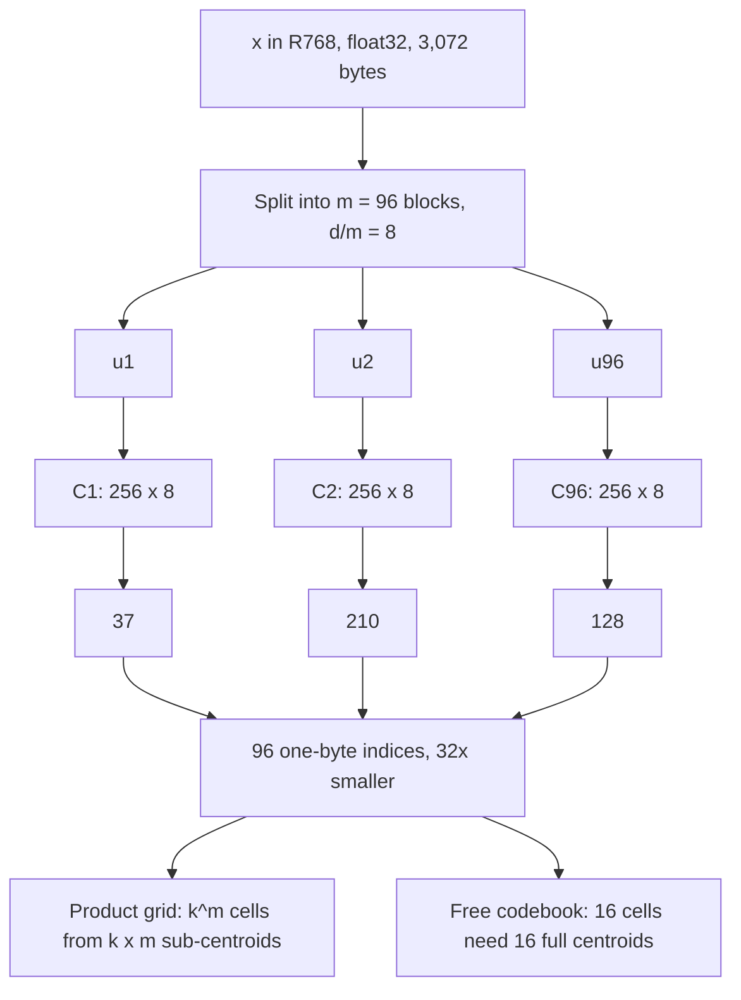
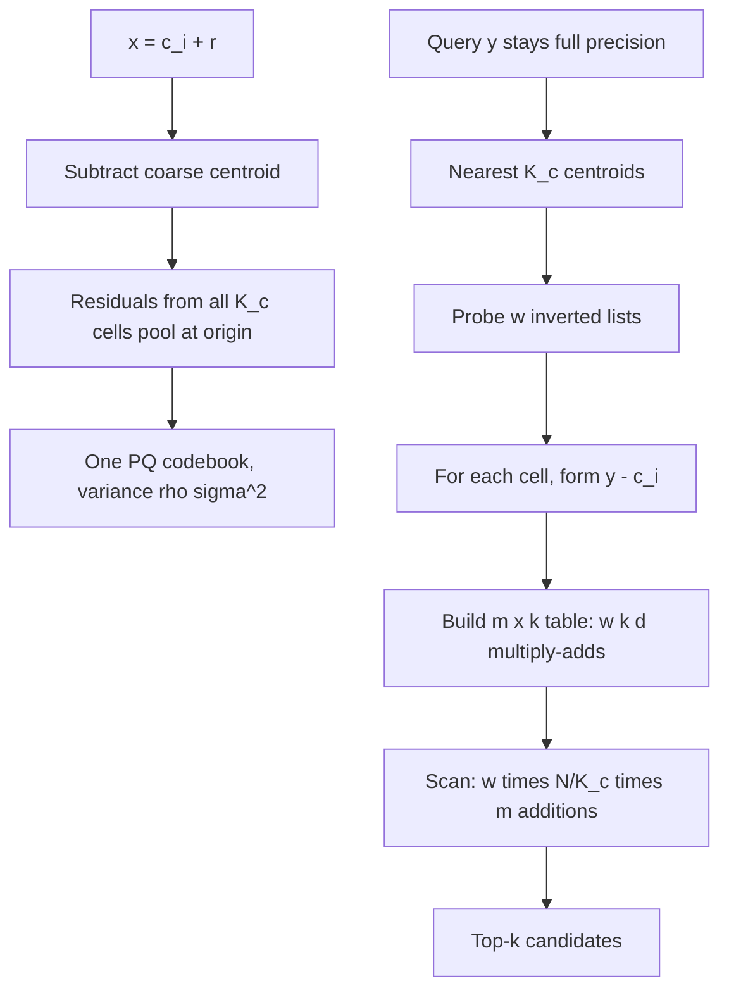
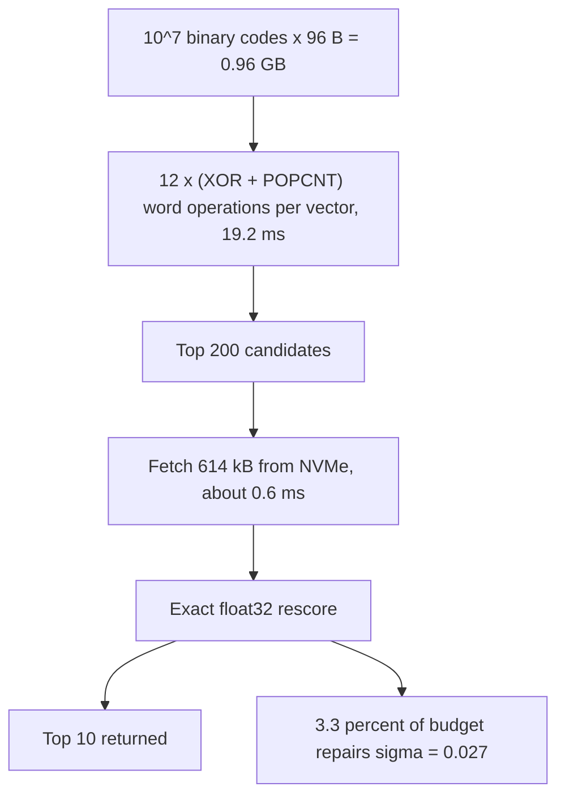
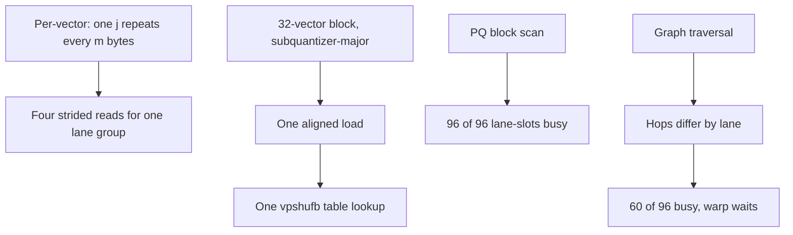

# Chapter 16: Compression and Index Economics

Purpose: Build a defensible retrieval index budget from code length, scoring error, scan shape, and fleet multipliers without confusing a smaller stored vector with a smaller system.

## TL;DR

- Quantization preserves the embedding dimension and changes its stored description. Dimensionality reduction changes the vector itself.
- Product quantization (PQ) stores `m log2(k)` bits per vector, addresses `k^m` composite codes, and stores only `k x d` centroid floats.
- Residual encoding spends the coarse inverted-file (IVF) cell assignment on accuracy. It also changes one asymmetric distance computation (ADC) table build into one build per probed cell unless a precomputed table is used.
- Eight-bit scalar quantization (SQ8) cuts float32 storage by `4x` in the stated example while adding cosine noise of about `4.53 x 10^-4`. Binary quantization reaches `32x` but changes the score to a Hamming-based angle estimate with noise near `0.027`.
- Product-quantized scans become fast when their codes are arranged for hardware. Blocks of 32 and 4-bit tables turn strided gathers into aligned loads and uniform lane work.
- Compression changes only part of the bill. Identifiers, graph links, exact refine vectors, rebuild headroom, replicas, and payload storage can dominate the compressed code array.
- The capacity answer is the fleet formula, not `N x d x 4`. Enumerate every term before multiplying.

## The story

Think of the index as a warehouse that must ship an answer under a strict space and time budget.

The original warehouse stores every item as a full 768-number crate. Each crate takes 3,072 bytes in float32. Ten million crates consume 30.7 GB before the warehouse adds aisles, identifiers, replicas, or the text that customers actually requested.

Product quantization stops storing whole crates. It divides each crate into `m` compartments and gives each compartment a catalog number. With `m = 96` and `k = 256`, each compartment needs one byte. A 3,072-byte crate becomes a 96-byte catalog slip while still describing all 768 dimensions.

The catalog has enormous reach because every eye, nose, and mouth choice can combine with every other choice. The warehouse can address `k^m` composite items while storing only `k x m` sub-centroids. Since each sub-centroid has width `d/m`, the stored catalog is only `k x d` floats. The price is a rigid grid. The catalog cannot place every boundary freely.

The IVF level acts like a regional depot. It first routes an item to the closest coarse centroid. Residual encoding then catalogs only what remains after that regional address is removed. This pools smaller, lower-variance residuals near the origin. The free accuracy is paid for during a query because each depot needs its own query residual and lookup table.

Scalar quantization changes the precision of every catalog coordinate. SQ8 is like rounding shelf measurements to a fine ruler. Under the chapter's calibration, the rounding noise sits far below the score gaps that decide the ranking. Binary quantization is different. It replaces the ruler with a yes-or-no side of a hyperplane. That makes the first pass fast, but the warehouse must reopen the best full crates before it promises the final order.

The shelving pattern then decides whether workers stay busy. A per-vector layout scatters one subquantizer's codes `m` bytes apart. A block-interleaved layout places the same subquantizer from 32 vectors together. One aligned load can feed all lanes, and every lane performs identical work.

The final invoice includes more than catalog slips. It includes identifiers, graph links, coarse centroids, codebooks, the second index present during a rebuild, replicas, exact refine vectors, chunk text, and filter metadata. Compression shrinks the first line of the invoice. Index economics is the discipline of carrying every later line to the fleet total.

## Decoder table

| Symbol or term | Meaning | Role in the chapter |
|---|---|---|
| Retrieval-Augmented Generation (RAG) | Retrieval supplies external context to a generator | The book context for the index design problem |
| `x` | Stored database vector | The object being encoded |
| `y` or `q` | Query vector | Kept in full precision under ADC |
| `d` | Embedding dimension | `768` in the main examples |
| `N` | Number of indexed vectors or chunks | `10^7`, `10^8`, or `10^9` in worked examples |
| Quantization | Fewer bits describing the same-dimensional vector | Reduces storage without changing `d` |
| Dimensionality reduction | Fewer vector coordinates | Changes the representation |
| Codebook | A finite set of centroids | Maps a vector or subvector to a stored index |
| `C` and `q(x)` | Flat codebook and quantized reconstruction | The nearest of `k` full-dimensional centroids |
| Distortion | Mean squared reconstruction error | The quantizer objective |
| Lloyd's algorithm | The k-means fitting procedure | A local codebook-training heuristic |
| `b` | Bits per scalar or flat code | Implies `2^b` levels or centroids |
| Product quantization (PQ) | Independent quantization of vector blocks | Replaces one flat codebook with `m` small codebooks |
| `m` | Number of subquantizers | Also equals bytes per vector when `k = 256` |
| `u_j` and `C_j` | Subvector and its codebook | Each subvector has dimension `d/m` |
| `k` | Centroids per subquantizer | Usually `256` or `16` here |
| `c(x)` | Tuple of sub-indices | The stored PQ code |
| `k^m` | Number of composite PQ codes | Exponential address space |
| `k m` | Number of stored sub-centroids | Linear stored count |
| `k d` | Total stored centroid floats | Independent of `m` |
| Bits per dimension | `m log2(k) / d` | Compression rate |
| Principal component analysis (PCA) | Dimensionality-reduction comparison | Changes the vector instead of its storage code |
| Optimized product quantization (OPQ) | Orthogonal rotation before PQ | Balances subspace variance without dropping dimensions |
| `R` as a matrix | OPQ rotation | Applied to `x` before quantization |
| Asymmetric distance computation (ADC) | Quantized database vector and exact query | Adds one quantizer-error term |
| Symmetric distance computation (SDC) | Quantized database vector and query | Adds two quantizer-error terms |
| `T` | Query-to-sub-centroid table | Has `m x k` entries |
| Inverted file (IVF) | Coarse partition into inverted lists | Routes a query to selected cells |
| Inverted file with ADC (IVFADC) | IVF plus residual PQ and ADC | Same structure the source calls `IndexIVFPQ` in its named library |
| `q_c(x)` and `c_i` | Coarse quantizer and centroid | Define the assigned cell |
| `K_c` or `nlist` | Number of coarse cells | Controls list length and residual information |
| `r(x)` | Residual `x - q_c(x)` | Value encoded by residual PQ |
| `rho sigma^2` | Within-cell variance | Residual source variance |
| `d*` | Intrinsic dimension | Cancels from the residual bit-gain result |
| `R` as a rate and `D` | Code bits and high-rate distortion | Used in the residual estimate |
| `xi` and `e` | Mean squared quantizer error and error vector | Explain ADC and SDC bias |
| `w` or `nprobe` | Probed IVF cells | Multiplies table builds and scans |
| `K_c*` | Table-build and scan crossover | `N m / (k d)` |
| Precomputed table | Stored cell-dependent ADC terms | Trades memory for fewer query-time builds |
| Scalar quantization (SQ) | Per-dimension integer encoding | Reconstructs component values |
| SQ8 and SQ4 | Eight-bit and four-bit scalar codes | Use 768 B and 384 B at `d = 768` |
| `alpha_j, beta_j` | Calibration range | Sets scalar quantizer bins |
| `Delta_j` and `sigma_e` | Quantizer step and error deviation | Determine score noise |
| Binary quantization | One sign bit per dimension | Uses Hamming distance |
| `theta`, `H`, and `theta_hat` | Angle, Hamming count, and angle estimate | Connect sign disagreement to cosine |
| Exclusive-or (XOR) and population count (POPCNT) | Bit difference and bit count | Implement binary distance |
| SimHash | Sign code tied to the random-hyperplane lemma | Source connection from angles to binary codes |
| Iterative Quantization (ITQ) | Learned rotation before sign bits | Source alternative to a sampled random rotation |
| Matryoshka Representation Learning | Leading coordinates are trained to be self-sufficient | Source example combining truncation and binarization |
| FAISS | Similarity-search library name not expanded on the permitted source pages | Provides IVF, PQ, fast-scan, and table options |
| Single instruction, multiple data (SIMD) | Parallel lanes with one instruction | Rewards uniform PQ scans |
| Graphics processing unit (GPU) warp | 32 lockstep threads | Matches a 32-vector block |
| `vpshufb` | In-register byte shuffle | Addresses a 16-entry table |
| WarpSelect | Register-resident top-k selection | Avoids global-memory sorting |
| CAGRA | GPU graph method named by the source | Uses fixed out-degree for warp-shaped work |
| Hierarchical navigable small world (HNSW) | Multi-layer graph index | Adds links and ragged traversal |
| `M`, `M_0`, `ell`, `m_L`, `U` | HNSW degree and level variables | Derive expected link bytes |
| `b_vec`, `b_id`, `b_link` | Vector, identifier, and graph bytes | Per-vector budget terms |
| `M_index` | One index copy | Per-vector plus fixed terms |
| `h` | Rebuild headroom | `1` in place or about `0.2` with a separate builder |
| `R` as replicas | Serving-copy count | Multiplies index capacity |
| `M_payload` and `M_fleet` | Payload and fleet memory | Final uncompressed term and total |
| Refine set | Full-precision vectors for exact rescoring | Can dominate the compressed index |
| Central processing unit (CPU) | General-purpose processor | Source default for graph indexes |
| Solid-state drive (SSD) | Storage for exact vectors | Trades RAM for access latency |
| Non-volatile memory express (NVMe) | SSD access path in the binary example | Uses a stipulated random-read latency |
| Resident set size (RSS) | Measured process memory | Used to validate the formula |
| p99 and out of memory (OOM) | Tail latency and capacity failure | Operational decision and failure measures |

## Core mechanics

### 16.1 Product quantization and the `k^m / (k m)` argument

#### What

A flat quantizer maps a vector to one of `k` centroids and stores the centroid index:

$$
q: \mathbb{R}^{d} \rightarrow C,\qquad C = \{c_1,\ldots,c_k\}.
$$

The index costs `log2(k)` bits. The fitting objective is:

$$
\lVert x - q(x) \rVert_2^2.
$$

Lloyd's k-means algorithm is a local heuristic. The source cites exact Euclidean sum-of-squares clustering as NP-hard even for `k = 2` in general dimension.

A flat `b`-bit code needs `2^b` centroids. At `b = 32` and `d = 768`:

$$
2^{32} \times 3{,}072 = 4{,}294{,}967{,}296 \times 3{,}072 = 1.32 \times 10^{13}\ \text{B} = 13.2\ \text{TB}.
$$

The source calls this about 400 times larger than the corpus it compresses. Its stated FAISS warning is 39 training points per centroid:

$$
39 \times 2^{32} = 1.7 \times 10^{11}\ \text{training vectors}.
$$

PQ splits `x` into `m` contiguous subvectors of width `d/m` and fits `k` sub-centroids per block. The code is:

$$
c(x) = (i_1,\ldots,i_m),\qquad \text{length} = m\log_2(k)\ \text{bits}.
$$

Its representable code count, stored sub-centroid count, and stored coordinates are:

$$
k^m,\qquad km,\qquad km\frac{d}{m} = kd.
$$

At `d = 768`, `m = 96`, and `k = 256`:

$$
\frac{d}{m}=8,\qquad \text{code}=96\ \text{B},\qquad \frac{3{,}072}{96}=32.
$$

$$
256^{96}=2^{768}\approx1.6\times10^{231}.
$$

$$
256\times96=24{,}576,\qquad 256\times768=196{,}608\ \text{floats}=768\ \text{KiB}.
$$

#### Why

The `m` factor cancels from codebook memory. Code reach grows exponentially with `m` while the stored codebook remains `k d` floats. The vector remains 768-dimensional.

When variance is uneven across coordinates, OPQ learns an orthogonal rotation `R` and quantizes `Rx`. This balances variance without discarding a dimension.
The source lets training cost or already-whitened vectors reverse the default to rotate.

#### Failure without it

For the same 32-bit code, PQ can use `m = 4` and `k = 256`. It stores 768 KiB and needs 9,984 training vectors per subspace under the 39-per-centroid rule. The flat alternative needs 13.2 TB and `1.7 x 10^11` training vectors.

The matched-codebook penalty is:

$$
k^{m-1}=256^3=1.7\times10^7.
$$

PQ gives up free placement of cell boundaries. Its product cells form a grid. The source limits recall claims to the corpus's measured variance and cross-subspace correlation. It recommends a recall curve below 0.5 bits per dimension.

#### Cost and complexity

ADC builds:

$$
T[j,\ell]=\lVert y_j-c_\ell^{(j)}\rVert_2^2.
$$

The `m x k` table costs `m k (d/m)=k d` multiply-adds. Each candidate then costs `m` lookups and about `m` additions.

At `d = 768`, `m = 96`, and `k = 256`, the build costs 196,608 multiply-adds. Against an exact dot product counted as `2d = 1,536` operations, the source gives:

$$
N^*=\frac{2kd}{2d-m}=\frac{393{,}216}{1{,}536-96}=273\ \text{candidates}.
$$

SDC quantizes the query and adds query error for no database-memory saving.

#### Worked numbers and decisions

- HNSW with 10 million float32 vectors uses 30.7 GB for vectors plus 2.56 GB of `M = 32` neighbor identifiers, or about 33.3 GB.
- PQ96 uses 960 MB plus a 768 KiB codebook. Its rate is one bit per dimension.
- A `96 x 256` table has 24,576 entries and costs 196,608 multiply-adds, or about 0.2 million floating-point operations (MFLOP).
- Scanning 10,000 codes reads 960 KB. The source says this fits in last-level cache.
- PQ32 uses 32-byte codes, 320 MB, `96x` compression, `2^256` codes, and 0.33 bits per dimension.
- At 96 equal bytes, PCA stores 24 float32 components and zeros 744 directions. PQ96 encodes all 768 coordinates.
- Which one wins depends on the embedding spectrum.
- An `IVF4096,PQ96` entry adds an 8-byte identifier. The 104-byte entry array is 1.04 GB, 8.3% above 960 MB.
- At `d = 128`, `m = 8`, and `k = 256`, the source's classic case has a 64-bit code and 128 KiB codebook. A flat `2^64` codebook at 512 bytes per centroid would occupy 9.4 zettabytes.
- Default `k = 256` makes `m` equal bytes per vector. Default `m = d/8` gives one bit per dimension.
- The listed divisors at `d = 768` are `96, 64, 48, 32, 24, 16`.
- Use `k = 16` when latency matters because 16 table entries fit in SIMD registers.
- OPQ adds one `d x d` matrix multiply per query.
- Retrain on material corpus or encoder shift with at least `39k = 9,984` vectors per subquantizer.
- Rescore several hundred candidates against exact vectors when those vectors are retrievable.
- The source treats 30.7 GB of exact vectors on NVMe at 10 million items as retrievable rather than prohibitive.

### 16.2 Residual quantization and IVFADC

#### What

IVF assigns each vector to the nearest of `K_c` centroids. Residual encoding stores:

$$
r(x)=x-q_c(x).
$$

At a k-means fixed point:

$$
c_i=\mathbb{E}[x\mid q_c(x)=c_i].
$$

The cross term vanishes:

$$
\mathbb{E}\lVert x-\bar{x}\rVert_2^2
=\mathbb{E}\lVert q_c(x)-\bar{x}\rVert_2^2
+\mathbb{E}\lVert x-q_c(x)\rVert_2^2.
$$

The last term is `rho sigma^2`. Under the stated high-rate model:

$$
\rho\approx K_c^{-2/d^*},\qquad D\approx\sigma^2 2^{-2R/d^*}.
$$

Matching residual-PQ without residuals costs:

$$
\Delta R=-\frac{d^*}{2}\log_2\rho=\log_2K_c\ \text{bits}.
$$

With `xi` as mean squared quantizer error and `e=q(x)-x`:

$$
\mathbb{E}\lVert y-q(x)\rVert_2^2=d(x,y)^2+\xi.
$$

$$
\mathbb{E}\lVert q(y)-q(x)\rVert_2^2=d(x,y)^2+2\xi.
$$

#### Why

The coarse level already describes between-cell variation. PQ spends the same code bits on lower-variance residuals. The list assignment contributes `log2(K_c)` implicit bits with no added code bytes.

The source treats that bit gain as a high-rate floor. Measured gains can exceed it because mean subtraction removes correlation that independent PQ blocks cannot represent.

#### Failure without it

Raw-vector PQ spans the whole corpus even though a list occupies one Voronoi cell. It spends codes on regions that list cannot issue.

Residual encoding can lose when `rho` is near 1. The source calls `rho > 0.8` a sign that residuals may be overhead. OPQ and residuals overlap, so the second technique can add less after the first.

#### Cost and complexity

Residual scoring uses `y-c_i`, which changes by probed cell. Table build and scan cost:

$$
\text{build}=wkd,\qquad \text{scan}=w\left(\frac{N}{K_c}\right)m.
$$

The crossover is:

$$
K_c^*=\frac{Nm}{kd}.
$$

Use `N = 10^7`, `d = 768`, `K_c = 4,096`, `m = 64`, `k = 256`, and `w = 32`:

- Code width is 64 bytes and entry width is 72 bytes with an 8-byte identifier.
- Entries cost 720 MB, centroids 12.6 MB, and codebooks 786 kB.
- Total memory is 733 MB versus 30.7 GB, or `41.9x` compression.
- Raw PQ builds one table for 196,608 multiply-adds.
- It scans `32 x 2,441 = 78,125` codes at 64 additions each, or `5.0 x 10^6` additions.
- One raw table build is 3.9% of the scan.
- IVFADC builds `32 x 196,608 = 6.29 x 10^6` multiply-adds, or `1.26x` the scan.
- Residual encoding adds 12 implicit bits to a 512-bit code, a 2.3% high-rate floor.

$$
K_c^*=\frac{10^7\times64}{256\times768}=3{,}255.
$$

The source gives a FAISS sizing range of:

$$
4\sqrt{N}\ \text{to}\ 16\sqrt{N}=12{,}649\ \text{to}\ 50{,}596.
$$

That range lies four to sixteen times beyond the crossover.

A precomputed table costs:

$$
K_cmk\times4\ \text{bytes}.
$$

Its reusable distance expansion is:

$$
\lVert(y-c_i)-\hat r\rVert^2=\lVert y-c_i\rVert^2+\lVert\hat r\rVert^2+2\langle c_i,\hat r\rangle-2\langle y,\hat r\rangle.
$$

It is 268 MB at `K_c = 4,096`, or 37% of the 733 MB index. It is 4.3 GB at `K_c = 65,536`.

#### Worked numbers and decisions

- Default to residual encoding, but measure `rho` and table-build share.
- Disable it when `rho` is high or the build exceeds about half the scan and precomputation is unaffordable.
- Default to ADC. Use SDC only when a query is already a stored code, such as deduplication, all-pairs search, or clustering.
- Default to exact reranking of a few hundred ADC hits. If exact vectors are unavailable, spend more bits on `m`.
- At `K_c = 65,536` and `w = 32`, the scan falls to `3.1 x 10^5` additions while table work stays `6.29 x 10^6`, about `20x` the scan.
- The corpus fraction falls from `0.78%` to `0.049%`.
- Restoring that fraction requires `w = 512`, returning the scan to `5.0 x 10^6` and raising table work to `1.0 x 10^8`.
- At that list count, disable residuals or budget the 4.3 GB table.

### 16.3 Scalar and binary quantization

#### What

Float32 costs `4d` bytes, or 3,072 bytes at `d = 768`. Scalar quantization stores:

$$
c_j=\left\lfloor\frac{x_j-\alpha_j}{\beta_j-\alpha_j}(2^b-1)+\frac12\right\rfloor.
$$

$$
\hat{x}_j=\alpha_j+\frac{c_j}{2^b-1}(\beta_j-\alpha_j),\qquad
\Delta_j=\frac{\beta_j-\alpha_j}{2^b-1}.
$$

The error lies in `[-Delta_j/2, Delta_j/2]`. Under the uniform-bin model:

$$
\mathbb{E}[e_j^2]=\frac{\Delta_j^2}{12}.
$$

For unit-normalized `d = 768` vectors, the source uses:

$$
\frac1{\sqrt{768}}=0.036.
$$

With `[alpha,beta]=[-0.2,0.2]` and `b = 8`:

$$
\Delta=\frac{0.4}{255}=1.569\times10^{-3},\qquad
\sigma_e=\frac{\Delta}{\sqrt{12}}=4.53\times10^{-4}.
$$

With an exact unit query:

$$
\langle q,\hat{x}\rangle=\langle q,x\rangle+\langle q,e\rangle,\qquad
\operatorname{Var}(\langle q,e\rangle)=\sigma_e^2.
$$

Binary quantization stores signs. For angle `theta`:

$$
p=\frac{\theta}{\pi},\qquad
H\sim\operatorname{Binomial}\left(d,\frac{\theta}{\pi}\right),\qquad
\hat{\theta}=\frac{\pi H}{d}.
$$

The source connects this random-hyperplane result to SimHash through Goemans and Williamson (1995) and Charikar (2002).

#### Why

SQ8 removes float32 precision that the stated ranking gaps cannot consume. Binary uses 768 bits to estimate one angle rather than reconstructing 768 one-bit components. It gives cheap XOR plus POPCNT candidate generation without a trained codebook.

#### Failure without it

Float16 keeps 11 significand bits. The source gives a relative rounding bound:

$$
2^{-11}=4.9\times10^{-4}.
$$

It estimates component error near `10^-5`, about 45 times below SQ8 at twice the bytes. Both sit roughly two orders below the source's ranking gaps.

Naive one-bit scalar quantization gives `Delta = 0.4` and `sigma_e = 0.115`. Binary changes the score meaning and still needs rescoring. Its random-hyperplane guarantee also needs a random or appropriate rotation when embeddings are anisotropic.

#### Cost and complexity

At cosine `0.80`:

$$
\theta=\arccos(0.8)=0.6435,\qquad p=0.2048.
$$

$$
\mathbb{E}[H]=768\times0.2048=157.3,\qquad
\operatorname{sd}(H)=\sqrt{768p(1-p)}=11.18.
$$

$$
\operatorname{sd}(\hat{\theta})=\frac{\pi\times11.18}{768}=0.0457\ \text{rad}.
$$

Since `sin(theta) = 0.6`, cosine noise is about `0.027`. Binary gives `8x` more compression than SQ8 and about `60x` its score noise. It is about `4x` less noisy than naive one-bit scalar reconstruction.

Assume 10 million vectors and 50 GB/s scan bandwidth:

| Configuration | Memory | Scan | Score behavior |
|---|---:|---:|---|
| float32 | 30.72 GB | 614 ms | Exact |
| SQ8 | 7.68 GB | 154 ms | `sigma = 4.53 x 10^-4` |
| Binary | 0.96 GB | 19.2 ms | `sigma about 0.027` before rescore |

SQ8 calibration costs `2 x 768 x 4 = 6,144` bytes. For a 0.05 score gap:

$$
\sqrt2\times4.53\times10^{-4}=6.4\times10^{-4},
$$

so closing it requires a 78-standard-deviation excursion under the model.

For binary:

$$
\sqrt2\times0.027=0.0388,\qquad
\Phi(-0.05/0.0388)=\Phi(-1.29)\approx10\%.
$$

Rescoring 200 candidates fetches:

$$
200\times3{,}072=614\ \text{kB}.
$$

At 100 microseconds per random read and queue depth 32:

$$
\frac{200}{32}\times100\ \text{microseconds}\approx0.6\ \text{ms}.
$$

That is 3.3% of the 19.2 ms scan.

#### Worked numbers and decisions

- PQ96 and 768-bit binary codes both use 96 bytes and have `2^768` possible codes.
- PQ learns data-adaptive locations. Binary fixes sign-hypercube corners.
- Default to SQ8 with per-dimension `0.1 / 99.9` percentile clipping.
- Apply a random rotation before sign bits. The source names ITQ by Gong and Lazebnik (2011) as a learned rotation.
- The source names `QT_8bit` and `QT_8bit_uniform`. One outlier that doubles a range quadruples squared error.
- Oversample binary hits by `3x` to `5x` and rescore exact vectors.
- Skip rescoring only under a sub-5 ms budget after measuring recall loss.
- Use PQ when recall at fixed bytes binds. Use binary when throughput or rebuild cost binds.
- Truncating Matryoshka embeddings to 256 dimensions and binarizing uses 32 bytes, or `96x` less than 768-dimensional float32.
- Ablate truncation and binarization separately because they fail differently.

### 16.4 FAISS, parallelism, and why block structure matters

#### What

PQ ADC computes:

$$
\hat{d}(q,x)^2
=\sum_{j=1}^{m}\left\lVert q^{(j)}-c_{\operatorname{code}_j(x)}^{(j)}\right\rVert_2^2
=\sum_{j=1}^{m}T[j,\operatorname{code}_j(x)].
$$

Building `T` costs `k d` multiply-accumulates. Scanning one code costs `m` lookups and `m - 1` additions.

The source counts one lookup-and-add as one operation here. At `d = 768`, `k = 256`, and `m = 16`:

$$
\frac{196{,}608}{16}=12{,}288\ \text{scanned vectors}.
$$

A conventional row stores all `m` codes of one vector together. SIMD needs one subquantizer across 32 vectors, but those codes are `m` bytes apart.

Fast scan transposes each block of 32 vectors. One aligned load retrieves all 32 codes for one subquantizer. The `vpshufb` shuffle addresses 16 table entries, which constrains `k = 16` and produces 4-bit codes.

At the same 128-bit budget:

| Layout | Parameters | Table |
|---|---|---:|
| PQ8 per vector | `m = 16, k = 256` | `16 x 256 x 4 = 16 KB` |
| PQ4 fast scan | `m = 32, k = 16` | `32 x 16 = 512 B` |

#### Why

Every PQ code requires identical, branch-free work. There is no pointer hop, early exit, or ragged logical stride. A 32-code block matches a GPU warp. Lanes share the query table while each lane scores one vector.

Register-resident top-k selection avoids writing all distances to global memory and rereading them for a sort.

#### Failure without it

The opening case reduces 307 GB of float32 to 1.6 GB of PQ codes, or `192x`, but the scan improves only about `2x`. A 16 KB table competes with the code stream for a 32 KB level-one cache.

A single 24,414-candidate query is only about 391 KB of code work, so an unbatched GPU can remain underutilized.

HNSW hops are dependent and neighbor lists are ragged. Lanes diverge and read uncoalesced addresses. The source states that FAISS has GPU flat, IVF-Flat, and IVF-PQ indexes but no GPU HNSW. It cites CAGRA's fixed out-degree as the concession that makes graph work warp-shaped.

#### Cost and complexity

The source reports the 4-bit block scan at `4x` to `6x` the conventional implementation. It reports WarpSelect at `8.5x` the prior GPU nearest-neighbor implementation and a billion-vector k-nearest-neighbor graph built in under 12 hours on four Maxwell Titan X GPUs.

Use `N = 10^8`, `d = 768`, `nlist = 262,144`, and `nprobe = 64`:

$$
\frac{10^8}{262{,}144}=381\ \text{vectors per cell},
\qquad
64\times381=24{,}414\ \text{candidates}.
$$

PQ8 with `m = 16` and `k = 256`:

- Stores 1.6 GB versus 307.2 GB float32, or `192x` less.
- Reads `24,414 x 16 = 390.6 KB` per query.
- Costs about 48 micro-operations per vector: 16 code extractions, 16 table loads, and 15 additions.
- Totals about 1.17 million scalar operations.
- Adds a table build worth 12,288 candidates, about 50% of this scan.

PQ4 with `m = 32` and `k = 16`:

- Keeps the same 128 bits and 1.6 GB.
- Converts 24,414 candidates to 763 blocks.
- Uses about seven vector instructions per subquantizer: one load, two nibble unpacks, two shuffles, and two saturating adds.

$$
763\times32\times7=171{,}000\ \text{operations}.
$$

That is `6.8x` fewer than the scalar count. Table build falls to:

$$
16\times768=12{,}288\ \text{multiply-accumulates},
\qquad
\frac{12{,}288}{32}=384\ \text{candidate equivalents}.
$$

That is 1.6% of the scan rather than 50%.

The scan emits:

$$
24{,}414\times4=97.7\ \text{kB}
$$

of distances. Writing and rereading them moves 195 KB, a 50% tax against 391 KB of code traffic.

The derived `6.8x` exceeds the reported `4x` to `6x` by about 30%. The source attributes the gap to unchanged code traffic, top-k maintenance, and scalar pipelining.

For residual IVFADC at these PQ8 settings, a precomputed table costs:

$$
262{,}144\times16\times256\times4=4.29\ \text{GB},
$$

more than `2.5x` the 1.6 GB code array.

#### Worked numbers and decisions

- Default to `IndexIVFPQFastScan` rather than classic `IndexIVFPQ` at the same bit budget.
- Keep `k = 256` only when 4-bit codebooks lose recall that a larger `m` cannot restore.
- Size `nprobe` against both recall and table-build break-even.
- The `k = 256, m = 16` break-even is 12,288 candidates. The `k = 16, m = 32` break-even is 384.
- Keep graph indexes on CPU and quantized indexes on GPU by default.
- Batch queries before adding hardware.
- For an interactive single-query path, a tuned CPU fast scan can beat an underfilled accelerator.
- Leave the IVFADC precomputed table off above roughly `2^16` centroids unless per-cell rebuilds dominate and memory is budgeted.

### 16.5 Index memory arithmetic, end to end

#### What

At `d = 768`:

| Stored form | `b_vec` |
|---|---:|
| float32 | 3,072 B |
| float16 | 1,536 B |
| SQ8 | 768 B |
| PQ with `m` eight-bit subquantizers | `m` B |

IVF entries add `b_id = 8` bytes. The base HNSW calculation uses implicit positional identifiers, but the source warns that stable external keys can require a map.

HNSW levels follow:

$$
\ell=\left\lfloor-\ln(U)m_L\right\rfloor,\qquad m_L=\frac1{\ln M}.
$$

The probability of reaching level `ell` is `M^(-ell)`. Layer zero stores up to `M_0 = 2M` links, and each higher occupied layer stores up to `M`.

With 4-byte identifiers:

$$
b_{\text{link}}
=4\left(2M+M\sum_{\ell\ge1}M^{-\ell}\right)
=4\left(2M+\frac{M}{M-1}\right).
$$

At `M = 32`:

$$
b_{\text{link}}=4(64+1.03)=260\ \text{B}.
$$

The source's FAISS rule gives 256 link bytes from `M x 2 x 4`. The 260-byte derivation is within 1.6%, with upper layers explaining the gap.

Fixed terms are `nlist d x 4` bytes of coarse centroids and `k d x 4` bytes of PQ codebook.

$$
M_{\text{index}}
=N(b_{\text{vec}}+b_{\text{id}}+b_{\text{link}})
+nlist\times d\times4
+k\times d\times4.
$$

$$
M_{\text{fleet}}=R(1+h)M_{\text{index}}+M_{\text{payload}}.
$$

#### Why

Every term is per-vector, fixed, or a multiplier. An in-place rebuild holds old and new copies, so `h = 1`. A separate builder and hot swap can use about `h = 0.2` for fragmentation and slack.

At 400 tokens and roughly 4 characters per token, the source budgets 1.6 KB of UTF-8 per chunk. Ten million chunks need 16 GB. Filterable metadata at 200 bytes per chunk adds 2 GB.

#### Failure without it

The naive `N x d x 4` estimate omits identifiers, links, rebuilds, replicas, payload, maps, allocator overhead, and tombstones. Graph links are about 8% of HNSW memory, but six copies at `h = 1, R = 3` multiply the miss. The source turns an 8% miss on a 30 GB index into about 15 GB of absent rebuild capacity.

A refine set changes the honest ratio. A 1.09 GB IVF-PQ index plus 15.36 GB of float16 vectors is 16.45 GB. Compression versus 33.32 GB falls from `30.5x` to `2.0x`.

The formula is a floor. Validate it with a 1% build and measured RSS. A 64 GiB machine is 68.7 GB. A 30 GiB index is 32.2 GB. Mixing units causes about a 7% error.

#### Cost and complexity

Use `N = 10^7`, `d = 768`, `nlist = 16,384`, `k = 256`, and decimal GB:

| Configuration | Per-vector bytes | Fixed terms | One index |
|---|---:|---:|---:|
| HNSW-Flat float32, `M = 32` | `3,072 + 0 + 260 = 3,332` | None stated | 33.32 GB |
| IVF-Flat | `3,072 + 8 = 3,080` | 50.3 MB centroids | 30.85 GB |
| IVF-PQ96 | `96 + 8 = 104` | 50.3 MB centroids and 786 KB codebook | 1.09 GB |
| IVF-PQ96 plus float16 refine | 104 plus 1,536 refine bytes | Same fixed terms | 16.45 GB |

- HNSW links alone cost about 2.6 GB.
- IVF-Flat saves 7% against HNSW-Flat. The source frames this as a rebuild and GPU-mapping choice, not a major memory choice.
- IVF-PQ96 is `30.5x` smaller before refinement.
- At `h = 1` and `R = 3`, HNSW needs about 200 GB and IVF-PQ96 about 6.5 GB.
- Both sit above an 18 GB shared payload.
- Compression removes about 193 GB from the multiplied term and zero from payload.

At `N = 10^9`, 104 bytes per vector is 104 GB. The source compares this with a reported 64 GB DiskANN workstation. Fewer than 64 resident bytes per vector leads to a 32-byte PQ code in RAM while full vectors and graph stay on SSD.

At `N = 10^5` and `nlist = 4,096`, centroids cost 12.6 MB while 104-byte entries cost 10.4 MB. The fixed partition is larger than the code array.

Halving `m` from 96 to 48 saves 0.48 GB, small beside a 15.36 GB resident refine set.

For 200 million chunks:

| Design | Bytes per vector | Total | Reduction |
|---|---:|---:|---:|
| HNSW-Flat float32 | 3,332 | 666 GB | Baseline |
| HNSW plus SQ8 | `768 + 260 = 1,028` | 206 GB | `3.2x` |
| IVF plus SQ8 | `768 + 8 = 776` | 155 GB | `4.3x` |

At 10% monthly growth:

$$
1.1^{12}=3.14,\qquad \frac{\ln4.3}{\ln1.1}\approx15\ \text{months}.
$$

#### Worked numbers and decisions

- Quote bytes per vector and multiply by `N` last.
- Provision `2x` steady-state index memory on each serving node for in-place rebuilds.
- Keep payload outside the replicated index tier unless the fetch breaks p99.
- Size the refine store before choosing `m`.
- Report `M_fleet` rather than one index copy.
- A 32.2 GB per-copy saving becomes 193 GB at `R = 3` and `h = 1`.
- At compounding growth, quantization is a bridge to sharding rather than a permanent answer.

## Diagrams

### Figure 16.1

| View at `m = 2, k = 4` | Cells | Stored pieces | Boundary freedom |
|---|---:|---:|---|
| Product codebook | 16 | 8 sub-centroids | Shared grid boundaries |
| Free codebook | 16 | 16 full centroids | Freely placed cells |

> Figure 16.1: Splitting the vector makes the effective codebook a Cartesian product, so k^m cells are addressed by k × m stored sub-centroids - exponential reach at linear cost - and the price is that every cell boundary is shared across the whole grid instead of being placed freely.

### Figure 16.2

> Figure 16.2: Residual encoding converts the coarse quantizer from a router into a first stage of the code, and the conversion is paid for at query time. In (a) each vector is written x = ci + r, and the residuals from every cell collapse onto one low-variance cloud that a single PQ codebook can cover. In (b) the query stays in full precision - the asymmetry in ADC - but because the stored code is of a residual, the lookup table depends on which centroid was subtracted and must be rebuilt for each of the w probed cells.

### Figure 16.3

| Code | Bits per dimension | Footprint | Cosine noise |
|---|---:|---:|---:|
| SQ8 | 8 | 768 B | `4.5 x 10^-4` |
| SQ4 | 4 | 384 B | `7.7 x 10^-3` |
| Naive scalar | 1 | 96 B | 0.115 |
| Binary Hamming | 1 | 96 B | 0.027 |

> Figure 16.3: Noise on the cosine score grows faster than compression saves bytes (a), and the binary point sits below the scalar curve only because Hamming distance estimates an angle instead of reconstructing components - which is why binary quantization is a candidate generator feeding a rescoring stage (b), never a final scorer.

### Figure 16.4

| Memory order | First group | Second group |
|---|---|---|
| Per vector | `v0:j0,j1,j2,j3` | `v1:j0,j1,j2,j3` |
| Block interleaved | `j0:v0,v1,v2,v3` | `j1:v0,v1,v2,v3` |

> Figure 16.4: The same product-quantized codes, transposed into blocks of 32, turn a strided gather into one aligned load feeding a single in-register table lookup (a). And because every code costs identical work, no lane of a 32-wide unit ever idles - a promise graph traversal cannot make (b, drawn illustratively).

### Figure 16.5

| Budget row | HNSW-Flat, float32, `M = 32` | IVF-PQ, `m = 96` |
|---|---:|---:|
| Stored vector, `d = 768` | 3,072 B | 96 B |
| Add identifier | Implicit, 0 | `+8 = 104 B` |
| Add graph links | `+260 = 3,332 B` | None |
| Multiply by `N = 10^7` | 33.32 GB | 1.04 GB |
| Add centroids and codebook | 33.32 GB | 1.09 GB |
| Multiply by `1 + h`, `h = 1` | 66.6 GB | 2.18 GB |
| Multiply by `R = 3` | 200 GB | 6.5 GB |
| Shared payload | 16 GB text plus 2 GB metadata | 16 GB text plus 2 GB metadata |

> Figure 16.5: Compression acts on the first row only. Every row below it is either an additive per-vector term or a multiplier that scales whatever survived, which is why a 30.5× smaller index still needs a capacity plan and why the payload store - shared across replicas, untouched by quantization - outweighs the entire compressed index.

## Whiteboard pack

### What to draw

1. Write `N = 10^7`, `d = 768`, and 3,072 bytes per float32 vector.
2. Split one vector into `m = 96` blocks of eight dimensions.
3. Put a `k = 256` codebook under each block. Write 96 bytes per code.
4. Write `k^m` above the code space and `k d = 196,608` floats below the codebook.
5. Draw an IVF centroid, subtract it, and pool residuals at the origin.
6. Keep the query exact and draw one table build per probed cell.
7. Branch to SQ8 at 768 bytes and binary at 96 bytes. Send binary through exact rescoring.
8. Transpose 32 codes by subquantizer and label one aligned load.
9. Finish with identifiers, links, fixed terms, rebuild headroom, replicas, refine vectors, and payload.

### Spoken script

Start with the deployment constraint: ten million vectors at 3,072 bytes each already consume 30.7 GB. Product quantization splits 768 dimensions into 96 eight-dimensional blocks and stores one byte per block, so the code falls to 96 bytes. The codebook stays only 768 KiB because its size is k times d. IVFADC subtracts each coarse centroid, keeps the query exact, and pays one table build per probed cell. Scalar eight-bit quantization is the safe four-times baseline. Binary codes need exact rescoring. Finally, add identifiers, graph links, rebuild headroom, replicas, and payload before naming fleet memory.

## Interview traps

### 1. Why not reduce to 24 dimensions?

That changes the representation because 96-byte PCA keeps 24 float32 directions and zeros 744. PQ96 describes all 768 coordinates. Under a fixed encoder and fixed `d`, quantize first, measure recall, and exact-rescore the shortlist.

### 2. What does ADC mean, and why can residuals hurt p99?

Asymmetric distance computation (ADC) keeps the query exact, so bias is `d(x,y)^2 + xi` rather than `d(x,y)^2 + 2xi`. Residual PQ spends `log2(K_c)` implicit cell bits on accuracy, but `y - c_i` changes by cell. Table work rises from `k d` to `w k d`.

### 3. Choose product, residual, scalar, or binary quantization.

Start with SQ8 for a low-risk `4x` storage cut, then use PQ when recall must survive at a much smaller fixed byte budget. Add residual encoding only when the coarse partition lowers variance enough to justify per-cell table work or precomputation. Use binary for throughput or rebuild simplicity, then exact-rescore because its cosine noise is about `0.027`.

### 4. Why did `192x` compression give only `2x` latency?

Classic PQ still performs strided lookups through a 16 KB table. Fast scan transposes 32 codes and uses a 512-byte 4-bit table. The source derives `6.8x` fewer operations but reports `4x` to `6x` because code traffic and top-k maintenance remain.

### 5. Did a `30.5x` smaller index solve fleet memory?

No, because a float16 refine set changes 1.09 GB to 16.45 GB and the honest ratio to `2.0x`. Rebuild headroom, three replicas, and 18 GB of text and metadata multiply costs outside compression. Compute `M_fleet` and validate it with measured resident set size (RSS).

## Key numbers

| Group | Numbers to retain |
|---|---|
| PQ | 3,072 B to 96 B, `32x`, `2^768` codes, 768 KiB codebook, 273-candidate ADC crossover |
| Flat comparison | 13.2 TB codebook, `1.7 x 10^11` training vectors, `1.7 x 10^7` memory penalty |
| Residual | 733 MB, `41.9x`, 12 implicit bits, `6.29 x 10^6` build, 3,255 crossover |
| Residual table | 268 MB at 4,096 cells and 4.3 GB at 65,536 cells |
| Scalar | SQ8 768 B, `4.53 x 10^-4` noise, 154 ms scan, 6,144 B calibration |
| Binary | 96 B, 0.027 noise, 19.2 ms scan, about 10% stipulated flip rate |
| Binary rescore | 200 vectors, 614 kB, about 0.6 ms, 3.3% of scan |
| Fast scan | 16 KB to 512 B table, 32-code blocks, `6.8x` derived, `4x` to `6x` measured |
| HNSW | 260 B links at `M = 32`, 33.32 GB at 10 million vectors |
| IVF | 30.85 GB flat, 1.09 GB PQ96, 16.45 GB with float16 refine |
| Fleet | 200 GB HNSW versus 6.5 GB IVF-PQ96, plus 18 GB shared payload |
| Growth | `1.1^12 = 3.14` and a `4.3x` cut buys about 15 months |
| PQ rate defaults | One bit per dimension at `m = 96` and 0.33 at `m = 32` |
| PQ divisors at `d = 768` | 96, 64, 48, 32, 24, 16 |
| PQ training floor | `39k = 9,984` vectors per subquantizer at `k = 256` |
| PQ query table | 24,576 entries, 196,608 multiply-adds, about 0.2 MFLOP |
| PQ 10,000-code scan | 960 KB |
| PQ32 | 320 MB, `96x` compression, `2^256` codes |
| Classic `d = 128` case | 64-bit codes and 128 KiB codebook |
| Classic flat comparison | 9.4 zettabytes |
| IVF4096,PQ64 entries | 72 B each and 720 MB total |
| IVF4096,PQ64 fixed terms | 12.6 MB centroids and 786 kB codebooks |
| Raw PQ table share | 3.9% of a `5.0 x 10^6`-addition scan |
| Residual build-to-scan ratio | `1.26x` |
| Residual high-rate increase | 12 bits over 512 bits, or 2.3% |
| FAISS list range at `N = 10^7` | 12,649 to 50,596 |
| Residual warning threshold | `rho > 0.8` |
| Large-list fixed probe | `3.1 x 10^5` scan additions and `20x` table ratio |
| Large-list restored probe | `w = 512` and `1.0 x 10^8` table work |
| Isotropic component scale | `1 / sqrt(768) = 0.036` |
| SQ8 calibrated step | `1.569 x 10^-3` |
| SQ8 pairwise difference noise | `6.4 x 10^-4` and a 78-standard-deviation gap |
| float16 relative bound | `2^-11 = 4.9 x 10^-4` |
| Naive one-bit scalar | 0.115 score noise |
| Binary Hamming mean | 157.3 bits at cosine 0.80 |
| Binary Hamming deviation | 11.18 bits |
| Binary angle deviation | 0.0457 rad |
| Binary pairwise deviation | 0.0388 |
| Binary compression comparison | `8x` smaller and `60x` noisier than SQ8 |
| Fast-scan candidate set | 24,414 codes from 64 cells of 381 |
| Fast-scan code traffic | 390.6 KB |
| PQ8 operation count | 1.17 million |
| PQ4 operation count | 171,000 |
| PQ4 table-build equivalent | 384 candidates, or 1.6% of scan |
| Selection traffic | 97.7 KB output and 195 KB write plus reread |
| GPU report | `8.5x` speedup and under 12 hours for a billion-vector graph |
| Large fast-scan precompute | 4.29 GB, more than `2.5x` the 1.6 GB codes |
| Index fixed terms | 50.3 MB centroids and 786 KB PQ codebook |
| Unit warning | 64 GiB is 68.7 GB and 30 GiB is 32.2 GB |
| Refine knob comparison | Halving `m` saves 0.48 GB beside a 15.36 GB refine set |
| Billion-point resident constraint | Under 64 B per vector and a 32 B PQ code in RAM |
