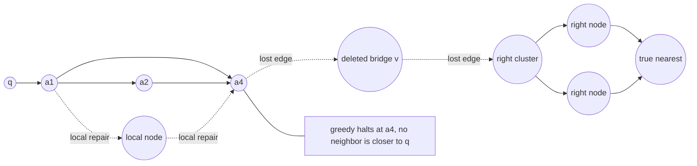
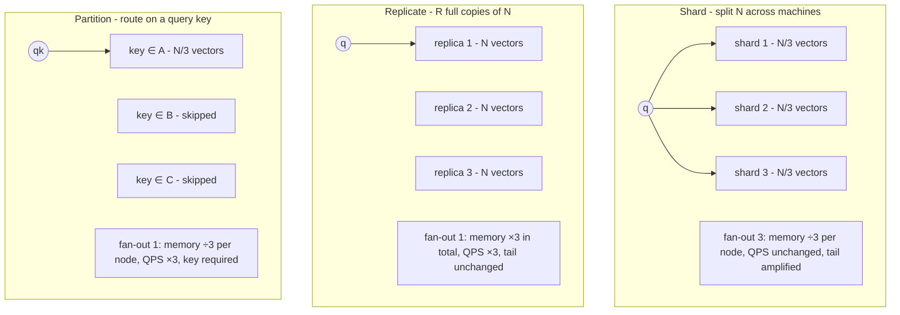
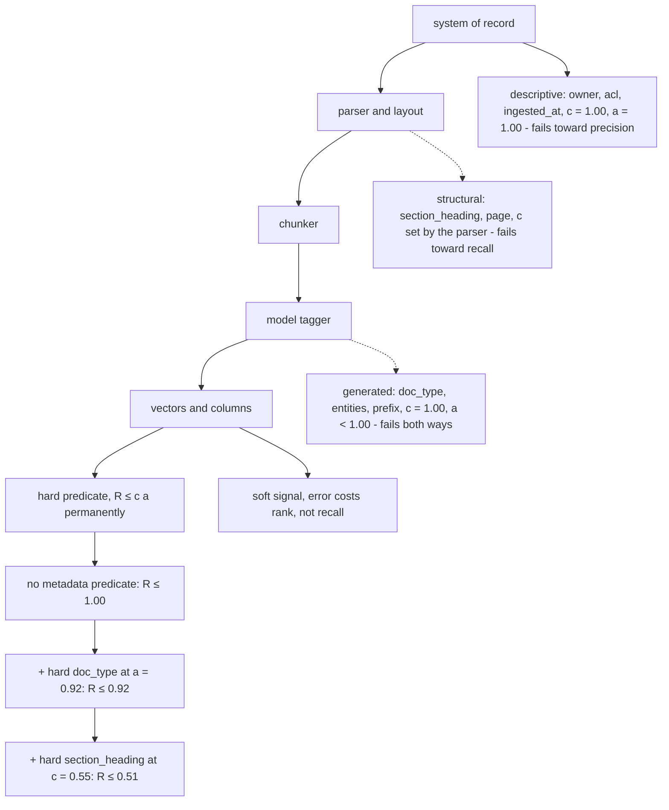
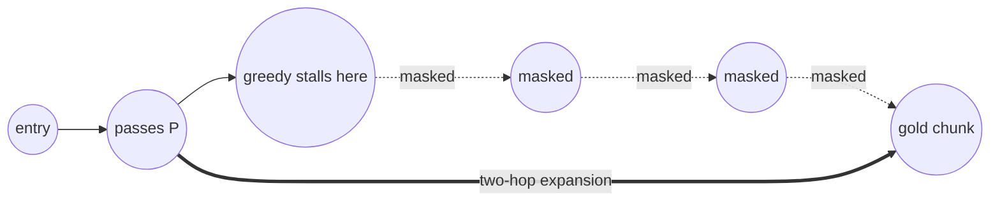
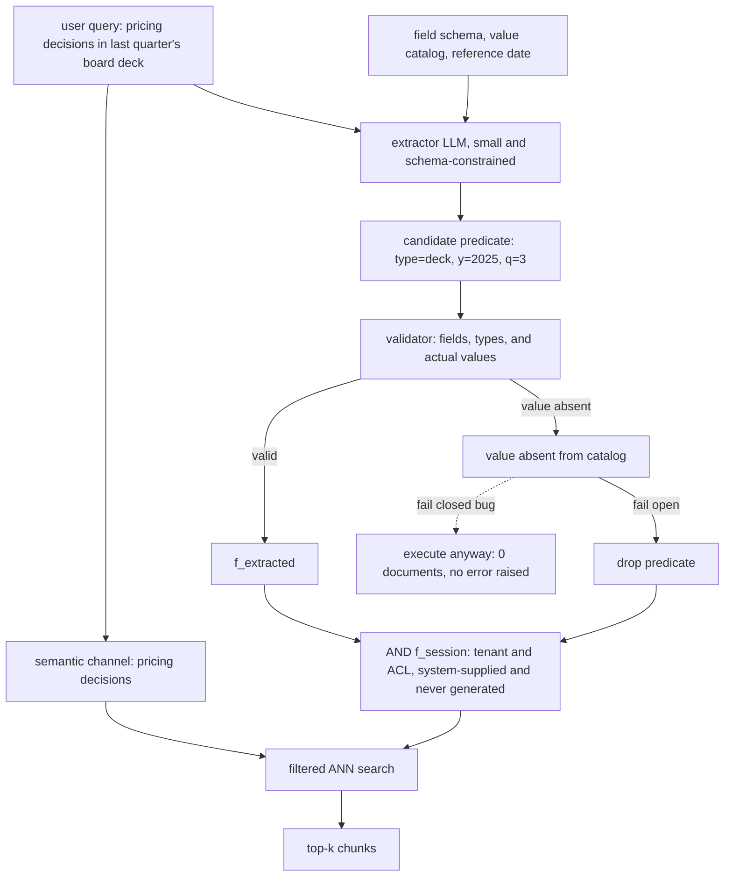

# Chapter 17: Operating a Vector Store

This chapter prepares you to operate the retrieval layer of a Retrieval-Augmented Generation (RAG) system under deletion, growth, metadata, filtering, and natural-language constraints.

## TL;DR

- Hierarchical Navigable Small World (HNSW) insertion is cheap enough to serve online. Faithful deletion is expensive and can silently disconnect the graph, so production systems usually tombstone deleted identifiers and rebuild later.
- Pick the rebuild cadence from the earliest of three limits: the cost optimum, the latency service-level objective (SLO), and the legal erasure deadline. Measure tombstones inside each query's candidate set because clustered deletion can hide behind a healthy global average.
- Sharding divides per-node memory, replication multiplies throughput and availability, and key-based partitioning routes a query to less data. These are different scaling axes.
- A vector database choice is mostly about durability, filtering, network topology, write behavior, tenancy, and operations. Approximate nearest-neighbor (ANN) search is often the smallest latency term.
- Metadata provenance sets the failure mode. A hard predicate on a field with coverage c and accuracy a caps recall at c × a, even if the embedding model and reranker are perfect.
- Selectivity decides how to filter. Use an exact pre-filtered scan for tiny sets, a filter-aware ANN index in the middle, and post-filtering only for broad predicates.
- A large language model (LLM) can split natural language into semantic text and a metadata predicate. Validate that predicate against real catalog values, fail open for ordinary unresolved constraints, and append tenant and access-control list (ACL) rules after model extraction.

## The story

Imagine a vast public library whose books are arranged by a walking map rather than by shelf number.

The walking map is the vector index. Nearby books discuss similar ideas, and the librarian follows links from one shelf to the next to reach a useful answer. Adding a new book is manageable. The librarian walks the existing map, finds nearby shelves, and draws new links. Removing a book is harder because that book may be the bridge between two wings.

The library therefore puts a red sticker on a withdrawn book. That sticker is a tombstone, which means the book cannot be handed to a reader even though it still occupies its shelf and still guides the librarian's route. Red stickers are cheap in storage, but they waste steps. The library periodically builds a clean map beside the old one and swaps it in when cost, delay, or an erasure deadline says it must.

When the collection outgrows one building, the director has three choices. Sharding divides different books among buildings, so every broad question must visit all buildings. Replication makes identical libraries, so more readers can be served but each copy needs all the shelves. Partitioning sends a reader to one building by a key such as tenant or region, which saves work only when the question carries that key.

Choosing the library building is not a race for the fastest hallway. The director must ask whether records survive a crash, whether catalog rules run before retrieval, whether the building is in the right region, and who answers the alarm at night. The hallway walk can be less than one millisecond while a remote building or a reranking desk consumes tens or hundreds of milliseconds.

The catalog also has three kinds of labels. The registrar supplies authoritative labels such as owner and permission. The document processor recovers structural labels such as heading and page. A model invents generated labels such as document type or summary. A wrong ranking label merely moves a book down the list. A wrong hard catalog rule removes the book from the search universe.

Filtering is the gate at the reading room. For a tiny admitted set, the librarian can inspect every permitted book exactly. For a broad set, the librarian can search globally and discard a few mismatches afterward. Between those cases, the walking map must include extra routes that remain usable after the gate masks forbidden shelves. A preference such as recent should usually influence ranking, while a permission rule must remain a hard gate.

Finally, a reader may ask for last quarter's board deck without filling out a catalog form. An intake clerk can split that sentence into topic words and a date-and-type predicate. The clerk must use the real field schema, the real value list, and today's date. If an ordinary value does not exist, the library drops that generated constraint and searches broadly. The clerk never writes the reader's permission rule. The library appends that rule afterward so no sentence can widen access.

## Decoder table

| Technical term | Plain-English meaning | Why it matters |
|---|---|---|
| Vector | A numeric representation of a chunk | The index searches these numbers rather than raw prose |
| Embedding | The process or model that maps content into a vector | Similar content should land near similar content |
| Vector store | A system that keeps vectors, metadata, and a search index | It surrounds ANN search with persistence, filtering, updates, and operations |
| Approximate nearest-neighbor (ANN) search | A fast search that may miss the exact nearest item | It trades some recall for lower latency and less work |
| Exact scan | A distance calculation against every admitted vector | It gives exact results and wins when a filter leaves very few vectors |
| Recall@k | The share of answerable queries whose gold chunk appears in the top k | It measures whether retrieval found the needed evidence |
| Precision | The useful share among returned or admitted items | A bad proxy can admit stale or irrelevant material |
| Ground truth | An exact or labeled answer set used for evaluation | It reveals misses that approximate search and filters can hide |
| N | Number of resident or indexed vectors | It sets memory, build work, shard size, and filter cardinality |
| d | Embedding dimension | It sets vector bytes and exact-scan work |
| Hierarchical Navigable Small World (HNSW) | A layered proximity graph used for ANN search | Its graph structure explains insertion, deletion, filtering, and sharding behavior |
| Inverted file product quantization (IVF-PQ) | A partitioned and compressed vector index | Its deletion and drift behavior differs from HNSW |
| Product quantization (PQ) codebook | Learned prototypes used to compress vector blocks | Distribution drift can make old codebooks stale |
| Coarse quantizer | The IVF model that assigns vectors to coarse cells | Cell imbalance and drift raise the probes needed for recall |
| nprobe | The number of IVF cells searched per query | Drift can force this value upward |
| M | HNSW's configured neighbor count on upper layers | It controls graph memory and connectivity |
| M0 | HNSW's base-layer out-degree, set to 2M here | It drives the dominant distance-evaluation term |
| efConstruction | The candidate beam used while building or inserting into HNSW | Larger values cost more build work and can improve graph quality |
| efSearch | The candidate beam used during HNSW queries | Larger values improve recall but cost latency |
| ef0 | Clean-index effective beam | Aging widens the physical beam to preserve this live width |
| Select-neighbors heuristic | The HNSW rule that chooses diverse graph links | It preserves bridges, which makes local deletion repair risky |
| Out-edge | A link recorded on the node where the link starts | HNSW stores these directly |
| In-neighbor | A node whose out-edge points into another node | Deletion needs this reverse set, but the base record does not store it |
| Reverse-edge index | An added map from a node to all nodes pointing at it | It enables structural deletion but nearly doubles the graph-link term here |
| Bridge edge | A link that connects otherwise distant graph regions | Deleting its endpoint can make a whole region unreachable |
| Tombstone | A deletion marker that suppresses an identifier without removing its graph node | It preserves navigation and moves the cost from structure to query latency |
| Deleted-identifier bitmap | One bit per identifier marking logical deletion | It makes result suppression cheap in bytes |
| Beam | The active candidate set explored during graph search | Tombstones consume beam slots even though they cannot be returned |
| Effective beam | The live candidates remaining after tombstones occupy slots | Holding it constant requires widening efSearch as the index ages |
| Churn rate c | The fraction of the live corpus replaced per day | It controls index growth and rebuild frequency |
| Tombstone fraction ϕ | The resident index share that is logically deleted | It determines expected beam inflation |
| Query rate λ | Queries served per day | Higher traffic makes stale-index query work more expensive |
| Clean query cost Q0 | The base layer's clean-index distance evaluations | It anchors the rebuild-cost formula |
| Rebuild cost B | The work required to build a clean index | It trades against accumulated query overhead |
| Cost-optimal period T* | The rebuild interval that minimizes build plus query work | It is only one of three cadence limits |
| T | Days since rebuild or the selected rebuild period | It drives tombstone accumulation and beam inflation |
| g(T) | Daily rebuild plus stale-query cost | Its minimum gives the economic rebuild period |
| g'(T) | Derivative of the daily cost with respect to rebuild period | Setting it to zero yields the economic optimum T* |
| T_SLO and T_legal | Latency and erasure ceilings on rebuild period | The earliest ceiling can override the economic optimum |
| Service-level objective (SLO) | A latency or reliability target the service promises | Beam growth can force a rebuild before the cost optimum |
| Erasure deadline | The latest time by which deleted bytes must disappear | Tombstoning alone does not satisfy physical deletion |
| Blue-green rebuild | Building a second clean index and swapping a pointer | It avoids degrading the live index at the cost of temporary double memory |
| Slot recycling | Reusing a tombstoned graph slot for a new vector | It controls growth but can inherit links chosen for a different point |
| Streaming merge | Folding updates into new immutable index segments over time | It avoids a single monolithic rebuild but adds update machinery |
| Shard | One disjoint slice of the corpus | It reduces memory per node but requires scatter-gather for broad queries |
| S (overloaded) | Shard count in scaling formulas or post-filter survivor count in probability formulas | The surrounding section determines whether it counts machines or results |
| R (overloaded) | Replication factor in scaling or recall in metadata formulas | It must not be confused across the two sections |
| P (overloaded) | Partition count, metadata predicate, or model-parameter count | The same letter names three different source quantities |
| f (overloaded) | Keyed-query fraction or extracted Boolean predicate | It prices routing in one section and selects a corpus subset in another |
| Partition key | The attribute used to route a query | Partitioning only wins when the query reliably carries it |
| Scatter-gather | Broadcasting to shards and merging their local top-k results | It keeps recall but amplifies tail latency |
| Fan-out | The number of machines a single query touches | A query waits for the slowest branch |
| Top-k | The k highest-scoring results requested | Shards each return local candidates that must be merged globally |
| Tail latency | Delay in the slowest portion of the request distribution | Fan-out turns rare slow machines into common slow queries |
| p95 and p99 | The 95th and 99th percentile latencies | They expose delay that a mean hides |
| Hash sharding | Assigning identifiers to shards with a hash | It balances load but destroys useful attribute locality |
| Attribute partitioning | Placing items together by tenant, region, type, or date | It routes keyed queries without broadcast |
| Skew | Uneven data or query load across partitions | A large tenant can make pure attribute partitioning fail |
| Hybrid partitioning | Routing small tenants directly while sub-sharding large tenants | It preserves routing gains while containing whales |
| Tenant | One customer or isolation domain in a shared system | Tenant size and permissions shape routing and filtering |
| Pareto frontier | Choices where improving one axis worsens another | No vector-store class wins every operational dimension |
| n | Refractive index of silica in the network example | It converts light speed into a physical round-trip floor |
| c as light speed | Vacuum light speed in the network example | It is distinct from churn rate c and metadata coverage c |
| t_RTT | Round-trip propagation time | It shows why cross-region placement can break the budget by itself |
| Durability | The ability to preserve data across crashes | It often adds write logging and synchronization cost |
| Write-ahead log | A durable record written before applying an update | It supports recovery but fights minimum in-memory latency |
| fsync | An operating-system call that forces buffered writes to durable storage | It improves durability and adds write latency |
| Single instruction, multiple data (SIMD) | Hardware execution of one operation across many values | Different implementations gain constant-factor speed from layout and vectorization |
| Structured Query Language (SQL) extension | Vector search added to a relational database | It gains joins and familiar operations but shares resources with transactions |
| Online transaction processing (OLTP) | The application's regular transactional database workload | A large vector index can compete with its buffer pool |
| B-tree | An ordered database index for scalar fields | A query planner can combine it with vector search for metadata predicates |
| Virtual private cloud (VPC) | An isolated cloud network boundary | Same-VPC placement can make the store hop small |
| Graphics processing unit (GPU) | A throughput-oriented accelerator | Large batches help throughput but can fight per-query tail latency |
| Field-programmable gate array (FPGA) | Reconfigurable search acceleration hardware | It is one database-selection axis named by the source |
| Reranker | A model that rescores retrieved candidates | It often costs far more latency than ANN search |
| Cross-encoder | A reranker that jointly reads a query and passage | It improves ranking at substantial compute cost |
| Floating-point operation (FLOP) | One arithmetic operation used to price model compute | It makes reranker and prefill costs comparable |
| 32-bit floating point (fp32) | Four-byte storage for each vector coordinate | It sets vector memory and scan bandwidth |
| Brain floating point 16 (bf16) | A two-byte model-weight format | It sets the extractor's weight-read floor |
| Byte units | Kilobyte (KB), megabyte (MB), gigabyte (GB), and terabyte (TB) | They price index memory, scan traffic, and rebuild traffic |
| Time units | Millisecond (ms) and microsecond (µs) | They make network, model, and search latency directly comparable |
| Random-access memory (RAM) | Main memory used for the resident index | Index size divided by usable RAM sets minimum shard count |
| High Bandwidth Memory (HBM) | Accelerator memory with very high transfer bandwidth | Autoregressive decoding repeatedly reads model weights from it |
| Matryoshka representation learning | An embedding design that retains usefulness after dimension truncation | It can reduce vector memory without training a separate full pipeline |
| Metadata | Fields stored beside a vector | Predicates can remove candidates before similarity scoring |
| Descriptive metadata | Fields emitted by the system of record | These fields are authoritative for what they actually measure |
| Structural metadata | Fields recovered by a parser or layout model | Coverage varies by document format |
| Generated metadata | Fields synthesized by a model at index time | Errors can reduce recall and pollute the wrong bucket |
| System of record | The authoritative source for a field | Hard security and ownership predicates need this provenance |
| Multipurpose Internet Mail Extensions (MIME) type | A standard content-type label | It is an example of descriptive metadata |
| Access-control list (ACL) | The authoritative list of who may access an item | It must never be generated by the query model |
| Coverage c | The fraction of chunks with a populated field | Missing values create a hard recall ceiling |
| Accuracy a | The correct share among populated values | Wrong values create misses and contamination |
| Hard predicate | A Boolean rule that excludes nonmatching chunks | Anything excluded cannot be recovered downstream |
| Soft signal | A feature added to text or ranking rather than used as a gate | An error changes rank instead of deleting the answer |
| Null-tolerant predicate | A rule that also admits chunks with missing metadata | It restores recall at the price of a larger search set |
| Cardinality | The count of distinct values or matching rows for a field | It guides planners, value catalogs, and selectivity estimates |
| Prompt hash | A compact identifier for an exact generation prompt | It supports targeted metadata backfills after prompt changes |
| Optical character recognition (OCR) | Text recovery from scanned page images | OCR without layout can lose headings and structural fields |
| Selectivity s | The fraction of the corpus a predicate admits | It decides exact scan, filter-aware ANN, or post-filtering |
| Pre-filtering | Resolving the predicate before vector scoring | It can enforce access and make tiny candidate sets cheap |
| Inverted index | A map from metadata values or terms to matching identifiers | It resolves a predicate before vector scoring |
| Post-filtering | Searching globally and discarding mismatches afterward | It is easy to implement but returns too few items for selective predicates |
| Binomial distribution | The count model for K independent candidates that each survive with probability s | It prices post-filter over-fetch |
| E[S], Var[S], and Pr(S >= k) | Expected survivors, survivor variance, and the chance of returning at least k survivors | They turn a short-result requirement into an over-fetch bound |
| Normal approximation | A bell-curve estimate of the binomial tail | It produces the 99% over-fetch threshold |
| Over-fetch K | The global candidate count requested before post-filtering | It must grow roughly as 20.6 divided by selectivity for top-10 at 99% confidence |
| Filter-aware ANN | An ANN structure or traversal that preserves paths under filters | It handles the middle selectivity band |
| Induced subgraph | The graph left after masking all nonmatching nodes | It can be disconnected even when the original graph was navigable |
| Multi-hop expansion | Looking beyond masked one-hop neighbors during traversal | It restores filtered connectivity at query-time cost |
| Label-aware edge | A graph link added to preserve paths within a filter category | It moves filtered-connectivity work into index construction |
| Over-filtering | Applying a valid hard rule that is wrong for the user's intent | Metrics over the already-filtered set cannot detect it |
| u | Square root of the expected post-filter survivors sK | It reduces the 99% over-fetch inequality to a quadratic |
| Self-querying | Model-based conversion of one utterance into semantic text and a predicate | It lets natural language express filters without a form |
| q and q_s | Query or query embedding, and its residual semantic text | Self-querying removes predicate language before embedding q_s |
| q_k | A query that carries a partition key | It can route to one partition instead of broadcasting |
| C and C_f | Full corpus and the subset admitted by predicate f | Retrieval searches C_f after extraction and validation |
| Semantic channel | The residual words sent to the embedding model | It carries topical meaning |
| Predicate channel | The Boolean constraints extracted from the utterance | It carries order, membership, and conjunction |
| Field schema | The allowed metadata names and types | It constrains what the extractor may emit |
| Value catalog | The actual distinct values present in the index | It detects predicates that parse but match nothing |
| Finite-state grammar | A fixed set of valid token transitions for structured output | It prevents malformed predicate strings |
| Text-to-SQL semantic parsing | Converting natural language into a structured database query | It frames self-querying as a smaller known-hard extraction task |
| Constrained decoding | Limiting generation to strings accepted by a grammar | It guarantees syntax, not correct meaning or existing values |
| Referential validity | Whether a predicate names values that actually exist | Syntax alone does not provide it |
| Detectable extraction error ed | A wrong field or value rejected by validation | Fail-open handling can recover to unfiltered recall |
| Undetectable extraction error eu | A valid-looking predicate that expresses the wrong constraint | Only labeled evaluation reveals it |
| p | Probability that the extracted predicate is correct | Blind self-querying breaks even only above a threshold on p |
| R_f and R_0 | Recall with a correct filter and with no filter | They set the extraction break-even and fallback value |
| E[R] | Expected recall across extraction outcomes | It exposes how validation changes detectable errors from zero recall to R_0 |
| f_session and f_extracted | System authorization and model-extracted predicates | Their conjunction lets the model narrow access but never widen it |
| Fail open | Drop an unresolved ordinary predicate and search without it | The downside becomes the unfiltered baseline rather than zero |
| Fail closed | Return nothing and raise when authorization cannot be enforced | Permission failure must not widen access |
| Session filter | A system-supplied tenant and ACL predicate | Conjoining it after extraction prevents model-written access expansion |
| Reference date | The literal current date supplied to the extractor | Relative phrases such as last quarter need a real clock |
| Query planner | Logic that chooses an execution path from data statistics and predicates | It switches among exact scan, filtered ANN, and post-filtering |

## Core mechanics

### 17.1 Static index, dynamic corpus: tombstones and re-indexing

#### Static assumptions and online insertion

- What it is: skip-list occupancy, HNSW height log_M N, inverted-file cells, and PQ codebooks assume a fixed set of N vectors. A production corpus instead receives publications, revisions, retractions, deletion requests, and tenant offboarding.
- Why it exists: HNSW insertion reuses the build procedure. It searches with efConstruction, applies select-neighbors, and wires in the new node.
- Failure without it: treating the corpus as static leaves no explicit answer for what happens after a delete request. In the source's 10:00 example, a nightly-only rebuild leaves 14 hours with no query-time guarantee.
- Cost: with N = 10^7, d = 768 in fp32, M = 16, M0 = 32, and efConstruction = 200, one insert costs 200 × 32 = 6,400 distance evaluations. At 2% daily churn, 2 × 10^5 inserts cost 1.28 × 10^9 evaluations per day. A full build costs 6.4 × 10^10, so insertion consumes 2% of one rebuild per day.

#### Why faithful graph deletion loses

- What it is: structural deletion removes a node and repairs every node that pointed to it.
- Why it exists: a physically removed node should neither answer queries nor remain on disk.
- Failure without reverse edges: HNSW records out-edges. It does not directly list all in-neighbors of the deleted node.
- Cost of reverse edges: storing 32 reverse neighbor identifiers at four bytes each adds 128 bytes per vector. Ten million vectors add 1.28 GB. The graph term rises from 132 to 260 bytes per vector.
- Cost of repair: roughly 32 in-neighbors each require an insertion-like 6,400-evaluation search. That is 2.05 × 10^5 evaluations per deletion.
- Daily cost: 2 × 10^5 deletions per day cost 4.1 × 10^10 evaluations. That is 64% of a full rebuild every day.
- Correctness failure: select-neighbors deliberately preserves diverse bridge edges. Removing a bridge and choosing local replacements can sever a region. Greedy search then returns the best reachable node with no exception or counter.

#### Tombstones and beam inflation

- What it is: a deleted-identifier bitmap marks a node as unavailable while leaving its vector and edges in place. Result assembly drops marked identifiers.
- Why it exists: the graph remains navigable and the answer set reflects the deletion on the next query.
- Failure without beam compensation: dead nodes still route traffic and occupy candidate slots. Holding efSearch fixed converts aging into silent recall loss.
- Storage cost: 10^7 bits equal 1.25 MB. That is 0.0039% of a 32 GB index.
- Query cost: let ϕ be the tombstoned share. A beam of width ef contains ef(1 - ϕ) live candidates in expectation.
- Required beam: preserving a clean effective beam ef0 = 64 requires ef = ef0 / (1 - ϕ).
- Steady-state relation: after T days at churn c, resident vectors equal N(1 + cT), ϕ = cT / (1 + cT), and 1 / (1 - ϕ) = 1 + cT.
- Layer-0 work: Q0 = ef0 × M0 = 64 × 32 = 2,048 evaluations. Aging raises it to 2,048(1 + cT).

#### Rebuild economics and hard ceilings

- What it is: a periodic rebuild creates a clean index and resets beam inflation.
- Why it exists: rebuild work is fixed while stale-index query overhead grows linearly.
- Cycle model: mean excess work per query over a cycle is 2,048cT / 2. At λ queries per day, total cycle work is B + 1,024λcT².
- Daily model: g(T) = B / T + 1,024λcT.
- Cost optimum: T* = √(B / (1,024λc)) = √(2B / (Q0λc)).
- Claim limit: T* is not the shipped cadence by itself. Use T = min(T*, T_SLO, T_legal).
- Traffic effect: a hundredfold increase in λ shortens T* by tenfold because of the square root.
- Low-traffic example: at 10 queries per second (QPS), λ = 8.64 × 10^5 per day and T* = √3,618 = 60 days. Then cT = 1.2, ϕ = 55%, and the beam more than doubles.
- High-traffic example: at 1,000 QPS, λ = 8.64 × 10^7 and T* = √36.2 = 6.0 days.
- Latency ceiling: allowing at most 20% layer-0 inflation gives cT ≤ 0.2, T ≤ 10 days, and ϕ ≤ 16.7%.
- Legal ceiling: the source identifies General Data Protection Regulation (GDPR) Article 17 erasure and the Article 12(3) one-month response window. A tombstone hides a result but leaves vector, text, and backups resident.
- Binding outcomes: the 10-QPS service rebuilds every 10 days on the SLO. The 1,000-QPS service rebuilds every 6 days on cost. The legal limit is 30 days in the example.

#### Operational checks and exceptions

- Rebuild feasibility: 6.4 × 10^10 evaluations reading 3,072 bytes each move 1.97 × 10^14 bytes, or 197 TB. At 50 GB/s, the build takes 3,932 seconds, or 1.1 hours. That is a 0.76% duty cycle over six days.
- Hourly limit: an hourly news-corpus cadence does not fit if build time exceeds the period. Shard the index or lower efConstruction.
- Correlated deletion: a global ϕ of 5% can hide a local ϕ of 90% after a coherent tenant or product deletion. Measure tombstone share inside each returned candidate set.
- Event trigger: bursty churn favors rebuilding when measured ϕ crosses the ceiling instead of following a fixed calendar.
- HNSW default: tombstone and rebuild. Slot recycling or a FreshDiskANN-style streaming merge from Singh et al. (2021) is an exception when growth, not latency, binds. A recycled node inherits edges selected for another point.
- IVF-PQ exception: deletion from a posting list costs O(list length) and does not break a graph invariant. Watch coarse-cell balance and retrain when the largest cell exceeds a few times the mean.
- Blue-green default: build beside the 32 GB live index, spend 64 GB temporarily, and swap atomically. If two copies do not fit, shard first and rebuild one shard at a time.
- Search dial: raise efSearch to ef0(1 + cT) as the index ages. Rebuild when that beam violates the p95 budget.
- Tight-deadline case: at 500 million vectors, the 50× corpus makes a one-hour whole-index rebuild take about 50 hours. A 24-hour erasure rule then requires on-demand payload and vector-byte deletion, with an orphaned tombstoned graph node until structural rebuild. This split is safe only when payload lookup fails closed on a missing record.
- Sanity check: the derived 16.7% ceiling is close to Lucene TieredMergePolicy's 20% deletesPctAllowed default. hnswlib exposes markDelete and replacement of deleted slots. FAISS IndexHNSW does not implement remove_ids.

### 17.2 Sharding, replication, partitioning

#### Three distinct scaling axes

- What sharding is: split N vectors across S machines. Each node stores N / S, and broad queries scatter to every shard.
- Why sharding exists: it solves per-node memory capacity and can parallelize rebuilds.
- Failure when misused: system QPS stays flat because every user query consumes one slot on each shard. The query also waits for the slowest shard.
- Traversal cost: HNSW depth grows logarithmically. Eight shards over 10^8 vectors change the depth ratio to log2(10^8 / 8) / log2(10^8) = 0.89, only an 11% cut.
- Tail cost: if one machine is slow on 1% of calls, an S-way query is slow with probability 1 - 0.99^S. At S = 100 this is 63.4%, matching Dean and Barroso (2013).

- What replication is: create R complete copies of a shard and route each query to one copy.
- Why replication exists: it raises throughput and availability.
- Failure when misused: it cannot make an oversized index fit because each replica still holds the full shard.
- Cost: throughput scales by R, and total memory also scales by R. It does not make one query intrinsically faster.

- What partitioning is: split the corpus by a query attribute such as tenant, region, document type, or date.
- Why partitioning exists: a query carrying the key can skip P - 1 partitions and remove scatter-gather.
- Failure when misused: a missing or wrong key routes to the wrong data or forces broadcast. Recall is at risk if the gold chunk lives elsewhere.
- Cost: the routing and balancing machinery only pays when enough queries carry the key.

#### Hashing, attributes, and hybrids

- Hash sharding is skew-free without knowing the query distribution. It balances N / S vectors and load.
- Hash sharding loses attribute locality. If 90% of queries carry tenant_id, a three-shard deployment still pays 3× fan-out.
- Attribute partitioning optimizes the mean partitions touched. Hashing optimizes load variance.
- A whale tenant can defeat pure attribute partitioning. The source's staff case uses one tenant with 40% of the corpus and 60% of queries.
- The hybrid routes small tenants by tenant_id and hash-shards the whale into sub-shards with dedicated replicas.
- The hybrid costs two paths and a rebalancing job when a small tenant becomes a whale.

#### Worked capacity example

- Corpus: 100 million chunks, d = 768 in fp32, HNSW M = 16, and 128 GB usable RAM per node.
- Raw vectors: 100 × 10^6 × 768 × 4 = 307.2 GB.
- Layer-0 links: 32 identifiers at four bytes each equal 128 bytes per vector and 12.8 GB total.
- Resident total: about 320.0 GB. The minimum shard count is ceiling(320 / 128) = 3.
- Per shard: 33.3 million vectors and 106.7 GB.
- Measured service point: 8 ms mean search at 16 concurrent threads gives 2,000 shard-queries per second per machine.
- Shard only: S = 3 and R = 1 use three machines. Capacity is 6,000 shard-queries per second, but fan-out 3 leaves 2,000 user QPS. Query p99 requires each shard near p99.67.
- Shard and replicate: S = 3 and R = 3 use nine machines. They serve 6,000 QPS and hold 960 GB. Fan-out and tail amplification remain 3.
- Tenant partition: P = 3 and R = 1 use three machines. Keyed fan-out 1 serves 6,000 QPS at 320 GB and restores single-machine tail behavior.
- Mixed query formula: expected partitions touched = f + (1 - f)P, where f is the keyed-query share.
- At f = 0.9 and P = 3, expected fan-out is 1.2 and throughput is 5,000 QPS.
- At f = 0.5, expected fan-out is 2.0 and throughput falls to 3,000 QPS.

#### Operating rules

- Set S to ceiling(index bytes / usable node RAM). Extra shards add tail exposure for only logarithmic traversal savings.
- Over-shard only when parallel build time must fit a rebuild window.
- If p99 rises after moving from one shard to eight, each branch now needs about its p99.87 to keep the whole query under p99. Consolidate to the minimum shard count, send a backup request to a replica when a branch is slow, or route on a key.
- Set R from availability first. Use R = 2 for one-node-loss tolerance and R = 3 when a rebuild removes one replica from rotation.
- Build one index segment and ship it to replicas. Independent replica writes force tombstone reconciliation.
- Measure f before partitioning. Below roughly f = 0.5, routing gains are small unless the key is also an isolation boundary.
- Push metadata filters to each shard before merging. If a filter is extremely selective, consider making it a partition key.
- Sharding does not inherently cost recall. Only the shard holding the gold chunk can return it, and its smaller graph may slightly improve local ANN recall at the same efSearch.

### 17.3 Choosing a vector database: no winner on all axes

#### Separate index choice from database choice

- What index choice is: select HNSW, IVF-PQ, or flat scan for a recall, latency, and memory point.
- What database choice is: select durability, filtering, update and delete behavior, tenancy, topology, and operational ownership around the index.
- Why the distinction matters: public benchmarks mostly expose the first choice while production failures often come from the second.
- Claim limit: at matched M and efSearch, recall is primarily an algorithm-and-parameter property. Implementations differ through SIMD width, memory layout, and runtime by constant factors that can reach 2-3×, not orders of magnitude.

#### Attribute the entire latency budget

- Budget: 200 ms p99 before the first prefill token.
- Embedding call: 20 ms.
- ANN search: 0.42 ms over 10 million vectors.
- Reranker: top 20 with a Bidirectional Encoder Representations from Transformers (BERT)-base-sized cross-encoder.
- Reranker work: 2 × 1.1 × 10^8 parameters × 512 tokens × 20 passages = 2.25 × 10^12 FLOPs.
- Reranker time: at 20 trillion floating-point operations per second (TFLOP/s), that is 113 ms.
- Network floor: light in silica at refractive index about 1.47 travels near 2.04 × 10^8 m/s.
- Northern Virginia to Ireland: t_RTT = 2 × 5.5 × 10^6 / (2.04 × 10^8) = 54 ms. Fiber paths near 1.4× the great-circle route make about 75 ms practical.
- Same region: 20 + 1 + 0.42 + 113 = 134 ms. ANN is 0.31%.
- Cross region: total is 208 ms and misses the budget.
- Comparison: a database with twice-as-fast ANN saves 0.21 ms. Wrong-region placement adds 75 ms, or 38% of the budget.

#### The Pareto frontier

- Durability adds a write-ahead log and fsync, which oppose minimum in-memory write latency.
- Horizontal scale adds sharding, which opposes exact global top-k and cross-shard transactions.
- GPU indexes favor batches, which oppose low-concurrency p99.
- A managed service reduces operational burden but adds a network boundary and can hide build parameters.
- The architectural classes are libraries, embedded stores, SQL extensions, search engines, distributed stores, and fully managed services.
- No class has structural strength on every axis.
- ANN-Benchmarks is a losing universal selector because its static, unfiltered, one-tenant, pre-batched workload hides the operational axes.
- The opposite reflex also loses. Putting every workload into an existing relational database fails once the resident vector index consumes the headroom needed by OLTP.

#### Worked product example

- Workload: 20 million chunks at d = 768, 5,000 tenants, 50 QPS, 200 ms retrieval p99, and 2% daily churn.
- In-process library: zero network hop gives 133 ms. HNSW at M = 16 costs 3,204 bytes per vector, or 64.1 GB before payload.
- Tenant size: 20 million / 5,000 = 4,000 chunks, or 0.02% of the corpus.
- Global top-100 post-filter: expected tenant results equal 0.02. The chance of at least one result is 2.0%, so 98% of queries return empty.
- Different-region managed service: filtering and durability work, but the path is 208 ms against 200 ms. Index tuning cannot remove fiber distance.
- Same-VPC SQL extension: one 0.5 ms trip, a B-tree tenant predicate, and payload in the same row produce the source's stated 133 ms. The listed terms sum to 133.92 ms, or about 134 ms, so that rounded source total is 1 ms low. The cost is a 64.1 GB index competing with OLTP.
- Matryoshka truncation example: reducing d to 384 gives 1,668 bytes per vector and 33.4 GB for the 20 million vectors.
- Write path: 400,000 daily inserts at 6,400 evaluations cost 2.56 × 10^9 evaluations.
- Query path: 50 × 86,400 × 2,048 = 8.85 × 10^9 evaluations per day.
- Maintenance tax: insertion work is 29% of query compute and is absent from static leaderboards.

#### Selection rules

- Keep the system the team already operates until the resident index exceeds memory headroom or the workload needs a missing index type.
- At d = 768 fp32, the source places the rough single-64-GB-box boundary near 20 million vectors.
- Co-locate the store with the application before index tuning. Data-residency law can instead require per-region replicas.
- Check veto axes first: maximum dimension, distance function, and filtered-search semantics.
- Benchmark the real corpus with real filters, concurrency, and background churn. Use a 10,000-query sample against a flat index for exact ground truth.
- Prefer a managed system when the team cannot operate a stateful service. Prefer an application programming interface (API) that also has a self-hosted path when portability matters.
- Treat product choice as a class-and-constraints decision before naming a vendor.

### 17.4 Metadata: descriptive, structural, generated

#### Provenance determines failure

- Opening precision example: a 2025 migration re-stamped 40% of the corpus. Filtering ingested_at > 2025-01-01 made a 2019 template look eleven months old because the field measured ingestion rather than authorship.

- What descriptive metadata is: owner, path, MIME type, ACL, and ingest timestamp from a system of record.
- Why it exists: these fields are complete and accurate for what they literally measure.
- Failure: semantic substitution causes precision loss. ingested_at can be correct while serving as a poor proxy for document date after migration.
- Cost: marginal generation cost is zero.

- What structural metadata is: heading, page, parent, table identifier, and reading order from a parser or layout model.
- Why it exists: it captures location inside a document.
- Failure: values are accurate where present but absent for formats the parser cannot recover. Scanned documents can become a dark slice.
- Cost: one parse pass, plus coverage measurement.

- What generated metadata is: type, entities, summary, sentiment, or context prefix from a model at index time.
- Why it exists: it can represent attributes with no authoritative field.
- Failure: a wrong value removes the chunk from its correct bucket and pollutes another.
- Cost: one model call per chunk, repeated after model, prompt, or chunking changes.

#### Recall ceiling

- Let c be field coverage and a be accuracy among populated values.
- A hard equality predicate lets the gold chunk survive only when the field is present and correct.
- The ceiling is R ≤ c × a.
- Two independent hard predicates give R ≤ c1a1c2a2.
- A reranker can reorder candidates but cannot restore a filtered-out chunk.
- A better embedding model can improve recall below the ceiling, not above it.
- A generated classifier at 92% accuracy imposes an 8% ceiling tax on every hard-filtered query.
- Consume generated fields softly by prepending them to embedded text or using a score boost. Reserve hard predicates for authoritative fields or measured structural fields.
- Tenancy and ACL are stricter because their error direction is disclosure, not a missed answer.

#### Worked metadata example

- Corpus: 180,000 documents and 2 million chunks at 400 tokens, totaling 800 million tokens.
- Format mix: 55% native DOCX or Hypertext Markup Language (HTML) with headings, and 45% scanned Portable Document Format (PDF) files processed by OCR without layout.
- Heading vocabulary: about 20 values, treated as uniform.
- Generated doc_type audit: 300 chunks at 92% accuracy. Standard error is √(0.92 × 0.08 / 300) = 0.0157, or about ±3.1 points at 95% confidence.
- Strict section filter: 0.55 / 20 = 2.75% of the corpus, or 55,000 chunks. Recall ceiling is 0.55.
- Null-tolerant section filter: 0.45 + 0.0275 = 47.75%, or 955,000 chunks. Recall ceiling returns to 1.00 at a 17× larger search space.
- Layout repair: if coverage reaches 0.95, strict filtering searches 4.75%, or 95,000 chunks, with a 0.95 ceiling.
- Adding hard doc_type at 0.92 accuracy to the original 0.55 coverage yields 0.506 recall. The missing share is 49.4%.
- Tagging pass: 2 million chunks × 500 input tokens equals 1,000 million input tokens. Thirty output tokens each add 60 million output tokens.
- Stipulated cost: at $1 per million input and $5 per million output, tagging costs $1,300.
- Embedding comparison: 800 million tokens at $0.02 per million cost $16. Tagging is 81× the embedding bill.
- Contextual-retrieval comparison: Anthropic's 2024 writeup reports $1.02 per million document tokens, or $816 here. The uncached $1,300 estimate is 1.6× higher because prompt caching explains the gap.
- Soft-path payoff: contextual embeddings plus contextual Best Matching 25 (BM25) reduced top-20 retrieval failure by 49% in the cited writeup.

#### Operating rules

- Store document date and ingest date separately. Use document date for recency.
- Measure c and a for every field before shipping a hard filter.
- A 300-item accuracy audit gives roughly ±3 points here. Raise the sample to 1,000 when the field gates compliance.
- Buy structural coverage with a parser before buying it with an LLM.
- Source tenant and ACL fields only from the permission system. At 2 million chunks, an 8% error mislabels 160,000 chunks.
- Version generated metadata with the model identifier and prompt hash so a backfill can target stale rows.

### 17.5 Pre-filtering, post-filtering, and the over-filtering risk

#### Selectivity and placement

- What selectivity is: s = |{x : P(x)}| / N, the admitted-vector share.
- Why it exists: the same predicate can leave hundreds, thousands, or millions of candidates.
- Correctness first: tenant, user, and classification boundaries must be enforced before a nonmatching identifier can leave the store.
- Preference separately: recency and popularity usually belong in reranking unless they are true validity constraints.

#### Post-filtering arithmetic

- What it is: search all N vectors for K candidates, then discard those failing the predicate.
- Why it exists: it requires no filter-aware index support.
- Failure: the survivor count S follows Binomial(K, s) under the charitable independence assumption. Small tenants receive short or empty lists.
- Mean and variance: E[S] = sK and Var[S] = Ks(1 - s), approximately sK for small s.
- Reliability requirement: Pr(S ≥ k) ≥ 0.99 uses the normal approximation sK - 2.33√(sK) ≥ k.
- For k = 10, let u = √(sK). Then u = (2.33 + √(2.33² + 40)) / 2 = 4.54 and sK = 20.6.
- Required over-fetch: K ≥ 20.6 / s, roughly twice naive k / s.
- Practical boundary: efSearch must be at least K. A ceiling ef = 512 gives s ≥ 20.6 / 512 = 0.040.
- Concrete rejection: at s = 10^-3, reliable post-filtering needs ef = 20,600, so raising the beam is not a practical fallback.
- Claim limit: below 4% selectivity, post-filtering does not degrade smoothly. It fails most often for the smallest groups.

#### Exact pre-filtering arithmetic

- What it is: resolve the predicate with an inverted index or bitmap, then scan all sN admitted vectors exactly.
- Why it exists: exact recall is 100% inside the correctly chosen set.
- Cost: a scan reads sN vectors at 4d bytes each.
- Budget: a 5 ms slice at 20 GB/s moves 10^8 bytes.
- At d = 768 fp32, each vector is 3,072 bytes. One query can scan 32,552 vectors.
- At ten concurrent queries sharing memory bandwidth, the limit is 3,255 vectors.
- With N = 10^7, that limit is s = 3.3 × 10^-4.
- Failure above it: memory bandwidth alone exceeds the latency slice.

#### The filter-aware middle

- The middle band is 3.3 × 10^-4 < s < 0.040 for the stated workload.
- Naive masking is wrong. Skipping nonmatching HNSW nodes creates the induced subgraph on admitted nodes.
- That induced subgraph can be disconnected. Greedy descent stalls in one reachable component and reports a confident wrong result.
- Filtered-DiskANN from Gollapudi et al. (2023) adds label-aware edges during construction so each label-induced subgraph remains navigable.
- ACORN from Patel et al. (2024) keeps the base graph predicate-agnostic and expands into two-hop neighborhoods when one-hop nodes are masked.
- Qdrant's filterable HNSW adds links inside payload categories during build.
- Trade-off: label-aware edges require known predicate categories at build time. Multi-hop expansion keeps flexibility and charges query-time work.

#### Over-filtering and worked example

- Over-filtering applies the predicate correctly but chooses the wrong universe. A year >= 2024 rule can remove a still-valid 2021 policy.
- Recall against exact search over the filtered set remains 100%, so that metric cannot detect the mistake.
- Measure recall both against the filtered set and the unfiltered corpus. Segment empty and short results by tenant size and predicate.
- Example corpus: N = 10^7, d = 768, and 5,000 tenants give 2,000 chunks per average tenant.
- Add the source's year >= 2022 clause, which passes 60%. The set has 1,200 chunks and s = 1.2 × 10^-4.
- Post-filter K = 100: expected survivors are 0.012. The chance of at least one is 1.2%, so about 99 in 100 queries return empty.
- Top-10 at 99%: K = 171,400, or 1.7% of the corpus. This is 335× the ef = 512 ceiling.
- Exact scan: 1,200 × 768 = 921,600 multiply-accumulates and 3.69 MB read. At 10 billion floating-point operations per second (GFLOP/s) and 20 GB/s, each side costs 0.18 ms, so total stays below 0.4 ms without overlap.
- HNSW comparison: ef = 128 and M0 = 32 evaluate up to 4,096 base-layer distances. The filtered exact scan is cheaper and exact.
- Middle example: s = 0.01 leaves 100,000 vectors. Scanning 307 MB costs 15.4 ms, while post-filtering needs K = 2,060, about four times the beam ceiling.
- Planner sanity check: Qdrant's 10,000 KB full_scan_threshold equals 10,240,000 bytes, or 3,333 vectors at 3,072 bytes. This is within 2.4% of the 3,255-vector derivation.
- Compression comparison: the 307 MB scan is 786× the 390.6 KB of PQ codes scanned by the cited 100-million-vector IVF-PQ query, despite this corpus being 10× smaller.
- Large-tenant case: 400,000 vectors require 1.23 GB per exact query and 61 ms at 20 GB/s. Partitioning by tenant can enforce access while restoring ANN inside that tenant's graph.
- Partitioning cost: the source prices that move as 5,000 small indexes, each with its own build and tail behavior.
- Coarse-to-fine option: FunnelRAG uses BM25 over about 4,000-token clusters, dense retrieval at document scale, and ranking at about 100-token passages. It reports about 40% faster retrieval at maintained accuracy.

### 17.6 Self-querying: LLM-extracted filter constraints

#### Split semantic text from predicates

- What it is: rewrite raw query q into semantic residual q_s and Boolean predicate f.
- Why it exists: embeddings express nearness. They do not directly express greater-than, membership, or conjunction.
- Search set: C_f = {x ∈ C : f(x) = 1}.
- Failure without it: last quarter and March 2024 remain weak text cues. Cosine similarity has no chronological direction.
- Failure with text-only metadata: writing dates into chunk text adds topical association, not an ordered constraint.

#### Extractor inputs and validation

- The extractor is a small instruction-tuned model.
- Run it as a dedicated extractor with its own prompt and labeled evaluation set rather than asking the answer generator to emit filters.
- Input one is the field schema with names and types.
- Input two is the actual value catalog for low-cardinality fields.
- Input three is the user query.
- Input four for relative time is a literal reference date supplied by the system.
- Constrained decoding with a finite-state grammar makes malformed output impossible.
- Claim limit: constrained decoding guarantees syntax, not referential validity or correct intent.
- A predicate such as doc_type = board_presentation can parse and type-check while the catalog stores board_deck.
- LangChain's self-query retriever is the referenced implementation pattern. The source notes that it supplies schema by default and leaves value catalogs to the system builder.
- The source compares the task to miniature text-to-SQL semantic parsing and cites Spider by Yu et al. (2018).
- It cites Willard and Louf (2023) for grammar-guided generation.

#### Recall arithmetic and fallback

- Partition outcomes into p for correct extraction, ed for wrong and detectable, and eu for wrong but undetectable.
- The probabilities satisfy p + ed + eu = 1.
- Let Rf be recall@k with a correct filter and R0 be unfiltered recall@k.
- Blind execution gives E[R] = pRf because every wrong executed predicate contributes zero.
- Break-even is p > R0 / Rf.
- With Rf = 0.95 and R0 = 0.62, the extractor needs more than 65.3% correctness merely to beat no filtering.
- Catalog validation and fail-open fallback give E[R] = pRf + edR0.
- The validator does not improve extraction intelligence. It converts detectable catastrophic misses into the unfiltered baseline.
- Undetectable eu cases use real values with the wrong meaning. Only labeled evaluation catches them.

#### Authorization composition

- Compose the final filter as f_final = f_session AND f_extracted.
- The session filter carries tenant and ACL constraints.
- Append it after model extraction and never serialize it into the extractor prompt.
- The extractor may narrow within the authorized set. It may never widen that set.
- Ordinary unresolvable predicates fail open, are dropped, and are logged.
- An unenforceable tenant or ACL clause fails closed, returns nothing, and raises.
- In an agentic loop, retrieved text may reach the extractor. Keeping authorization outside the model prevents that text from rewriting access.

#### Worked self-querying example

- Corpus: 2 million chunks, d = 768, five years, and fields doc_type, department, year, and quarter.
- Value counts: 12 document types and 8 departments. Board decks are 0.4% of the corpus.
- Correct filter: 0.004 × 2 × 10^6 = 8,000 board-deck chunks. Five years contain 20 quarters, leaving 400 chunks.
- Selectivity: 400 / (2 × 10^6) = 2 × 10^-4.
- Exact scan: 400 × 768 × 4 = 1,228,800 bytes, or 1.23 MB.
- At 50 GB/s, the scan takes 24.6 microseconds (µs).
- Labeled set: 200 queries with p = 0.86, ed = 0.10, and eu = 0.04.
- Blind execution: 0.86 × 0.95 = 0.817 expected recall.
- Validated fallback: 0.817 + 0.10 × 0.62 = 0.879, a gain of 6.2 recall points.
- Remaining 0.071 gap: 0.038 comes from eu and 0.033 comes from detectable errors recovered only to R0.
- Extractor model: 1 billion parameters in bf16 occupy 2 GB.
- Decode floor: at 3.35 TB/s HBM bandwidth, each token takes at least 2 / 3,350 = 0.60 ms. Forty output tokens take 24 ms.
- Prefill: 2 × 10^9 × 350 = 7 × 10^11 FLOPs. At 3.4 × 10^14 FLOP/s, it takes 2.1 ms.
- Total floor: about 26 ms before vector search. The source calls this roughly 70× the 0.33 ms HNSW query and later rounds it to 100×. The stated constants give about 79×, so both source ratios are coarse.
- Claim limit: this 26 ms is a hardware floor with no queueing or network delay.
- Search inversion: the 24.6 µs exact filtered scan is about 13× faster than the 0.33 ms graph walk.
- Value-catalog limit: include actual values by default. Above roughly 50 values per field, embed the vocabulary and snap an extracted string to a nearest value.
- Cache predicates by normalized query plus reference date. Near a period boundary, key relative-time queries by the resolved quarter.
- Alert on zero-result predicates and per-field cardinality because the failure produces a successful call with an empty candidate list.

## Diagrams

### Figure 17.1



```text
(b) evaluations per query

2,458  latency ceiling, phi = 16.7%     /|          /|          /|
                                          |         / |         / |
                                          |        /  |        /  |
                                          |       /   |       /   |
2,048  _________________________________/____|_____/____|_____/____|____
       0                                   T         2T         3T

       beam cost = ef0(1 + cT)
       rebuild at each vertical drop
       T = 10 days when c = 2% per day
```

Figure 17.1: Deleting structurally and deleting logically fail in different currencies. In (a) the select-neighbors heuristic kept v because it bridged two clusters. Removing v and repairing its in-neighbors from local candidates leaves the right-hand cluster unreachable, so greedy descent halts at a4 and returns a wrong answer with no error raised. In (b) the tombstone keeps the graph intact and converts the cost into a beam that must widen as ef₀(1+cT). The rebuild resets it, and the cadence T is whichever comes first of the cost optimum √(2B/(Q₀ λc)), the latency ceiling, and the erasure deadline.

### Figure 17.2



Figure 17.2: The three scaling axes are not interchangeable: sharding divides memory but broadcasts every query, replication multiplies throughput but also multiplies the memory bill, and only key-based partitioning divides memory and multiplies throughput at once - at the cost of requiring the query to carry the key.

### Figure 17.3

Panel (a):

| Placement | Embed | Network | ANN search | Rerank | Total | p99 budget |
|---|---:|---:|---:|---:|---:|---:|
| Same region | 20 ms | 1 ms | 0.42 ms | 113 ms | 134 ms | 200 ms |
| Cross-region | 20 ms | 75 ms | 0.42 ms | 113 ms | 208 ms | 200 ms |

Panel (b):

| Architectural class | recall/QPS | filtered search | txns & joins | horizontal scale | low ops burden | cost & portability |
|---|---|---|---|---|---|---|
| Library | Structural strength | Absent or bolted on | Absent or bolted on | Absent or bolted on | Absent or bolted on | Structural strength |
| Embedded | Structural strength | Workable | Workable | Absent or bolted on | Workable | Structural strength |
| SQL extension | Workable | Structural strength | Structural strength | Workable | Structural strength | Structural strength |
| Search engine | Workable | Structural strength | Absent or bolted on | Structural strength | Workable | Structural strength |
| Distributed store | Structural strength | Structural strength | Absent or bolted on | Structural strength | Workable | Structural strength |
| Fully managed | Structural strength | Structural strength | Absent or bolted on | Structural strength | Structural strength | Absent or bolted on |

Figure 17.3: The index is the smallest term you can optimize and the only one benchmarks measure. Panel (a): at 10^7 vectors the ANN search is 0.42 ms of a 134 ms same-region retrieval path, while putting the store in the wrong region adds 75 ms and breaks the budget on its own. Panel (b): every architectural class - a library such as FAISS or hnswlib, an embedded store such as Chroma or LanceDB, an SQL extension such as pgvector, a Lucene-family search engine, a purpose-built distributed store such as Milvus or Qdrant, and a fully managed service - gives up at least one column, so the choice is a position on a Pareto frontier rather than a ranking.

### Table 17.1

Table 17.1: The three metadata types differ in origin, marginal cost, and - decisively - in the direction they fail, which is what determines whether a field may be used as a hard predicate.

| Property | Descriptive | Structural | Generated |
|---|---|---|---|
| Origin | system of record | parser / layout model | model run at index time |
| Fields | owner, path, acl, ingested_at | section_heading, page, parent_id | doc_type, entities, summary, context prefix |
| Marginal cost | zero | one parse pass | one model call per chunk, repeated on re-index |
| Coverage c | 1.00 | format-dependent | 1.00 by construction |
| Accuracy a | 1.00 for what it measures | ≈ 1.00 where present | measured, below 1.00 |
| Fails toward | precision (wrong proxy) | recall (absent slice) | both |
| Safe as | hard predicate | hard predicate once coverage is measured | soft signal |

### Figure 17.4



Figure 17.4: The three metadata types enter at three different points in the pipeline, and only the first is owned by a system of record - which is why routing a generated field into a hard predicate multiplies a permanent recall ceiling into every query that uses it.

### Figure 17.5

Panel (a):

| Selectivity s | Matching count sN when N = 10^7 | Strategy |
|---:|---:|---|
| Up to 3.3 × 10^-4 | Up to about 3.3 × 10^3 | Pre-filter, exact scan |
| 3.3 × 10^-4 to 0.040 | About 3.3 × 10^3 to 4 × 10^5 | Filtered ANN, graph must cooperate |
| At least 0.040 | At least 4 × 10^5 | Post-filter, over-fetch 20.6 / s |

Panel (b):



Figure 17.5: Selectivity, not preference, decides where the predicate is evaluated (a). And masking a graph index in place is not a smaller graph but an induced subgraph, which can cut the search off from documents the predicate explicitly admits (b).

### Figure 17.6



Figure 17.6: Self-querying splits one sentence into a semantic channel and a predicate channel, and the branch at the validator decides which failure mode you own: dropping an unresolvable predicate costs you the unfiltered baseline, while executing it returns zero documents and raises no error. The session filter is conjoined after extraction, so no text reaching the model can widen it.

## Whiteboard pack

### What to draw

1. Draw a small HNSW graph with two clusters and label one connecting node bridge.
2. Cross out the bridge. Show that local repair leaves the right cluster unreachable.
3. Replace the cross-out with a tombstone bit and draw a beam that widens from ef0 to ef0(1 + cT).
4. Add a sawtooth reset and label T = min(T*, T_SLO, T_legal).
5. Draw three scaling rows: shard with broadcast arrows, replicate with one routed arrow, and partition with a query key.
6. Write memory under sharding, QPS and availability under replication, and less work under partitioning.
7. Draw the end-to-end latency bar with embed 20, network 1 or 75, ANN 0.42, and rerank 113 ms.
8. Draw metadata entering from system of record, parser, and model tagger.
9. Write the hard-filter ceiling R ≤ c × a beside the metadata path.
10. Draw the selectivity line with 3.3 × 10^-4 and 0.040 as boundaries.
11. Label exact scan, filter-aware ANN, and post-filter across those three bands.
12. Split one query into semantic text and an extracted predicate.
13. Put schema, value catalog, and reference date beside the extractor.
14. Add a validator branch that drops an ordinary unresolved predicate.
15. Append tenant and ACL as a system-supplied conjunction after extraction.

### Spoken script

Start with the lifecycle. Inserts can enter an HNSW graph online, but deletes become tombstones because local edge repair is costly and can disconnect search. Rebuild when cost, latency, or erasure policy first requires it. Scale by separating sharding for memory, replication for throughput and availability, and key partitioning for routed work. Choose the store around durability, topology, filtering, writes, and operations. Treat metadata provenance as a recall contract. Use exact pre-filtering at tiny selectivity, filter-aware ANN in the middle, and post-filtering only at high selectivity. Finally, validate model-extracted predicates against real values and append authorization outside the model.

## Interview traps

### 1. Why not delete an HNSW node and repair its neighbors in place?

The graph stores out-edges, so faithful deletion first needs a reverse-edge index. At the chapter's constants, repair costs 2.05 × 10^5 evaluations per deletion and 64% of a rebuild per day at 2% churn. Local repair can also remove a bridge and silently disconnect a region, so tombstone plus scheduled rebuild is the default.

### 2. Do sharding, replication, and partitioning all scale queries the same way?

No. Sharding divides memory but broadcasts broad queries, replication multiplies QPS and total memory, and key partitioning reduces work only when the query carries the key. Sharding addresses capacity, replication addresses throughput and availability, and partitioning bets on the query distribution.

### 3. Which vector database is fastest?

That question hides the real decision. At 10 million vectors, the source's ANN term is 0.42 ms inside a 134 ms same-region path, while wrong-region placement adds 75 ms and the reranker costs 113 ms. Compare durability, filtered-search semantics, topology, write rate, dimensions, distance functions, and operating burden before comparing matched-index constant factors.

### 4. When should filtering happen before, during, or after ANN search?

For the stated N and d, exact pre-filtered scan wins below s ≈ 3.3 × 10^-4, a filter-aware index serves the middle, and post-filtering needs s ≥ 0.040 under ef = 512. Access boundaries are always enforced before nonmatching identifiers leave the store, regardless of selectivity. Do not mask ordinary HNSW traversal because the induced graph can disconnect.

### 5. Should a self-querying extractor fail open or fail closed?

An unresolved ordinary predicate such as date or document type should fail open by dropping the predicate, logging it, and recovering R0. Authorization must fail closed because dropping tenant or ACL constraints would widen access. The extractor may narrow the system-supplied authorized set, but the session constraint is appended after extraction and never generated.

## Key numbers

| Area | Number or formula | Meaning |
|---|---|---|
| HNSW corpus | N = 10^7, d = 768 fp32 | Base deletion and filtering example |
| HNSW graph | M = 16, M0 = 32 | Neighbor constants |
| HNSW beams | efConstruction = 200, efSearch clean = 64 | Build and clean query settings |
| Resident index | 32 GB | Base ten-million-vector example |
| One insert | 6,400 evaluations | 200 × 32 |
| Delete timing example | 10:00 delete, 14 hours until nightly rebuild | Why tombstones need an immediate query guarantee |
| Daily churn | c = 2%, 2 × 10^5 updates | Worked lifecycle rate |
| Daily insert work | 1.28 × 10^9 evaluations | 2% of one rebuild |
| Full build | 6.4 × 10^10 evaluations | Rebuild cost B |
| Reverse edges | 128 bytes per vector, 1.28 GB total | Added in-neighbor map |
| Graph bytes | 132 to 260 bytes per vector | Link term with reverse edges |
| One faithful delete | 2.05 × 10^5 evaluations | About 32 insertion-like repairs |
| Daily delete repair | 4.1 × 10^10 evaluations | 64% of a rebuild |
| Tombstone bitmap | 10^7 bits = 1.25 MB = 0.0039% | Storage is not the main tombstone cost |
| Tombstone relation | ϕ = cT / (1 + cT) | Dead resident share after T days |
| Beam inflation | ef = ef0 / (1 - ϕ) = ef0(1 + cT) | Keeps live beam constant |
| Clean layer-0 work | Q0 = 64 × 32 = 2,048 | Baseline query evaluations |
| Latency ceiling | 2,458 evaluations, ϕ = 16.7% | 20% inflation point |
| Daily rebuild objective | g(T) = B / T + 1,024λcT | Build plus stale-query cost |
| Cost optimum | T* = √(2B / (Q0λc)) | Economic rebuild period |
| Low traffic | 10 QPS, λ = 8.64 × 10^5, T* = 60 days | Cost optimum is not binding |
| Low-traffic square root | √3,618 = 60 days | Explicit optimum arithmetic |
| Low-traffic rot | cT = 1.2, ϕ = 55% | State at the 60-day optimum |
| High traffic | 1,000 QPS, λ = 8.64 × 10^7, T* = 6.0 days | Cost becomes binding |
| High-traffic square root | √36.2 = 6.0 days | Hundredfold traffic effect |
| SLO limit | cT ≤ 0.2, T ≤ 10 days, ϕ ≤ 16.7% | 20% beam-growth cap |
| Legal example | T_legal = 30 days | One-month erasure response window |
| Rebuild I/O | 197 TB at 50 GB/s | Reads implied by the build |
| Rebuild time | 3,932 s = 1.1 hours | 0.76% of a six-day cycle |
| Local deletion skew | Global ϕ 5%, local ϕ 90% | Why per-query measurement matters |
| Lucene comparison | deletesPctAllowed default 20% | Same order as 16.7% ceiling |
| Tight legal case | 500 million vectors, 50 hours, 24-hour deadline | Whole-index rebuild cannot meet the window |
| Blue-green memory | 32 GB live, 64 GB during rebuild | Zero-query-impact swap cost |
| HNSW traversal sharding | (26.6 - 3.0) / 26.6 = 0.89 at N = 10^8, S = 8 | Only 11% depth reduction |
| Tail fan-out | 1 - 0.99^S | Slow-query probability |
| Hundred-way tail | 63.4% | 1% slow branches across 100 machines |
| Three-way p99 | 0.99^(1/3) = 0.9967 | Per-shard p99.67 for whole-query p99 |
| Eight-way p99 | 0.99^(1/8) = 0.9987 | Per-shard p99.87 for whole-query p99 |
| Sharding corpus | 100 million, d = 768 fp32 | Capacity example |
| Raw vector memory | 307.2 GB | 100 million × 768 × 4 |
| Link memory | 12.8 GB | 128 bytes per vector |
| Resident total | About 320.0 GB | Vectors plus layer-0 links |
| Node tier | 128 GB usable | Gives minimum S = 3 |
| Per shard | 33.3 million vectors, 106.7 GB | Three-shard placement |
| Per-machine service | 8 ms, 16 threads, 2,000 shard-QPS | Measured capacity point |
| Opening tail drift | p99 from 30 ms to 80 ms | Symptom that motivates scaling analysis |
| Shard only | 3 machines, 2,000 user QPS | 6,000 shard-QPS divided by fan-out 3 |
| Shard and replicate | 9 machines, 6,000 QPS, 960 GB | S = 3 and R = 3 |
| Tenant partition | 3 machines, 6,000 QPS, 320 GB | P = 3 and fan-out 1 |
| Keyed share 0.9 | Expected fan-out 1.2, 5,000 QPS | Partitioning mostly pays |
| Hash locality loss | 90% keyed queries still pay 3× fan-out | Hashing discards the routing signal |
| Keyed share 0.5 | Expected fan-out 2.0, 3,000 QPS | Half the routing benefit is gone |
| Default replicas | R = 2, or R = 3 during rebuild | Availability-first rule |
| Retrieval budget | 200 ms p99 | Database latency example |
| Embedding | 20 ms | End-to-end component |
| ANN | 0.42 ms at 10^7 vectors | 0.31% of 134 ms |
| Rerank workload | 1.1 × 10^8 parameters, 512 tokens, top 20 | Cross-encoder constants |
| Rerank compute | 2.25 × 10^12 FLOPs at 20 TFLOP/s | 113 ms |
| Fiber physics | n ≈ 1.47, speed 2.04 × 10^8 m/s | Network floor inputs |
| Virginia to Ireland | 5,500 km, 54 ms floor, 75 ms practical | Cross-region penalty |
| Measured region band | 70 to 80 ms, about 1.4× the 54 ms floor | Sanity range reported by the source |
| Same-region path | 134 ms | Within budget |
| Cross-region path | 208 ms | Misses budget |
| Twice-faster ANN | 0.21 ms, 0.11% of budget | Small database-index win |
| Latency diagnosis probe | 240 ms actual, 150 ms target, 2 ms search | The other 238 ms contains a 90 ms miss. Removing search recovers only 2.2% of that miss |
| Business product workload | 20 million chunks, 5,000 tenants, 50 QPS | Store-selection example |
| HNSW bytes | 3,204 bytes per vector, 64.1 GB | d = 768 and M = 16 |
| Tenant share | 4,000 chunks, 0.02% | Average tenant |
| Global top-100 | 0.02 expected, 2.0% chance of any result | 98% empty after post-filter |
| Same-VPC hop | 0.5 ms | SQL-extension example |
| Truncated vectors | d = 384, 1,668 bytes each, 33.4 GB | Matryoshka example |
| Daily store writes | 400,000 inserts, 2.56 × 10^9 evaluations | 2% churn |
| Daily store queries | 8.85 × 10^9 evaluations | 50 QPS |
| Maintenance tax | 29% | Write work relative to query work |
| Ground-truth sample | 10,000 queries | Suggested product benchmark |
| Metadata corpus | 180,000 documents, 2 million chunks, 800 million tokens | Worked example |
| Migration proxy failure | 40% re-stamped in 2025, 2019 template seen as eleven months old | ingested_at is not document date |
| Format coverage | 55% native, 45% scanned | Structural-field split |
| Heading values | About 20 | Selectivity assumption |
| Generated audit | 300 samples, 92% correct | a = 0.92 |
| Audit uncertainty | Standard error 0.0157, ±3.1 points at 95% | Accuracy claim limit |
| Strict heading filter | 2.75%, 55,000 chunks, ceiling 0.55 | Missing-heading failure |
| Null-tolerant filter | 47.75%, 955,000 chunks, 17× | Ceiling restored to 1.00 |
| Repaired coverage | c = 0.95, 4.75%, 95,000 chunks | Layout-pass outcome |
| Two hard fields | 0.55 × 0.92 = 0.506 | 49.4% of answers excluded |
| Tag input | 1,000 million tokens | 500 tokens × 2 million |
| Tag output | 60 million tokens | 30 tokens × 2 million |
| Tag price | $1,000 + $300 = $1,300 | Stipulated $1 input and $5 output per million |
| Embedding price | $16 | Stipulated $0.02 per million |
| Tag multiple | 81× | Generated metadata versus embedding |
| Context cost | $1.02 per million, $816 total | Source comparison |
| Soft retrieval gain | 49% lower top-20 failure | Contextual embedding plus BM25 |
| Security mislabels | 160,000 at 8% of 2 million | Why ACL cannot be generated |
| Post-filter reliability | K ≥ 20.6 / s | Top-10 with 99% confidence |
| Post-filter boundary | s ≥ 0.040 at ef = 512 | Broad-filter regime |
| Rejected beam | s = 10^-3 requires ef = 20,600 | Raising ef cannot rescue the middle band |
| Exact-scan budget | 5 ms of 50 ms at 20 GB/s | Moves 10^8 bytes |
| Exact-scan capacity | 32,552 vectors alone, 3,255 at concurrency 10 | Bandwidth threshold |
| Pre-filter boundary | s = 3.3 × 10^-4 at N = 10^7 | Tiny-set regime |
| Average tenant filter | 1,200 chunks, s = 1.2 × 10^-4 | Tenant plus 60% year filter |
| Post-filter K = 100 | 0.012 expected, 1.2% chance of any | About 99 in 100 empty |
| Reliable tenant K | 171,400, 1.7% of corpus | 335× ef ceiling |
| Tenant exact scan | 921,600 operations, 3.69 MB, under 0.4 ms | Cheaper and exact |
| HNSW comparison | ef = 128, M0 = 32, 4,096 distances | Unfiltered base-layer work |
| Middle-band example | s = 0.01, 100,000 vectors, 307 MB, 15.4 ms | Exact scan too slow |
| Middle post-filter | K = 2,060 | About four times ef ceiling |
| Planner default | 10,000 KB = 3,333 vectors | Within 2.4% of derivation |
| PQ comparison | 390.6 KB, 786× less than 307 MB | Compression check |
| Large tenant | 400,000 vectors, 1.23 GB, 61 ms | Exact scan breaks p99 |
| Tenant partition cost | 5,000 small indexes | Isolation restores ANN but adds build and tail surfaces |
| FunnelRAG | About 4,000-token clusters, 100-token passages, 40% speed-up | Coarse-to-fine option |
| Self-query corpus | 2 million chunks, five years, four fields | Extraction example |
| Value counts | 12 doc types, 8 departments | Low-cardinality catalog |
| Board-deck share | 0.4%, 8,000 chunks | First filter |
| Quarter subset | 400 chunks, s = 2 × 10^-4 | Five years equals 20 quarters |
| Quarter scan | 1.23 MB at 50 GB/s = 24.6 µs | Exact search after extraction |
| Blind break-even | p > R0 / Rf = 65.3% | R0 = 0.62 and Rf = 0.95 |
| Labeled outcomes | 200 queries, p = 0.86, ed = 0.10, eu = 0.04 | Extractor evaluation |
| Blind expected recall | 0.817 | 0.86 × 0.95 |
| Validated expected recall | 0.879 | Adds 0.10 × 0.62 |
| Validator gain | 6.2 recall points | One catalog lookup |
| Remaining gap | 0.071 = 0.038 + 0.033 | Undetectable plus baseline-recovery gaps |
| Extractor weights | 1 billion bf16 parameters, 2 GB | Decode memory floor |
| HBM rate | 3.35 TB/s, 0.60 ms per token | Weight-read floor |
| Decode | 40 tokens, 24 ms | Predicate generation |
| Prefill | 350 tokens, 7 × 10^11 FLOPs, 2.1 ms | At 3.4 × 10^14 FLOP/s |
| Extractor total | About 26 ms | Source states roughly 70× and later 100× a 0.33 ms query. The stated values give about 79× |
| Scan comparison | 24.6 µs versus 0.33 ms | Exact scan is about 13× faster |
| Value-catalog prompt limit | Roughly 50 values per field | Switch to vocabulary matching above it |
