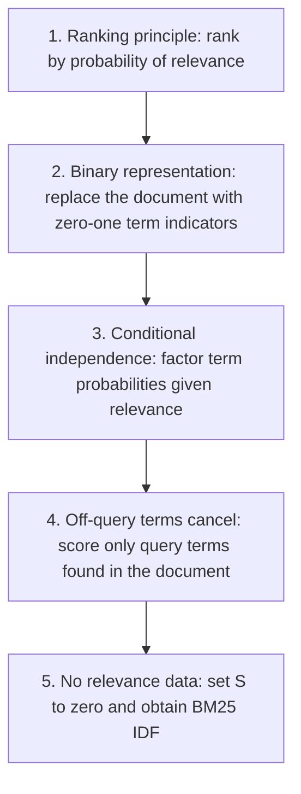
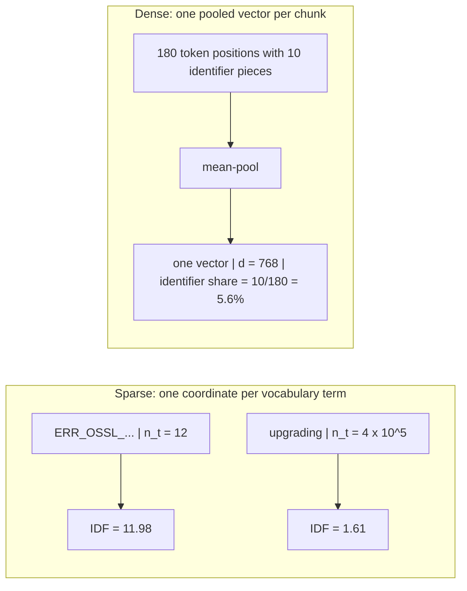

# Chapter 18: Classical Information Retrieval (IR) You Are Expected to Know

This chapter prepares you to explain how classical lexical ranking supports a Retrieval-Augmented Generation (RAG) system, where its assumptions fail, and why sparse retrieval still protects rare queries.

## TL;DR

- Boolean retrieval treats every term as a hard rule. AND can shrink a useful query to zero results, while OR can return a huge unordered set.
- Term Frequency-Inverse Document Frequency (TF-IDF) creates a ranking, but raw term frequency pays forever for repetition and cosine normalization can punish documents that cover more topics.
- Best Match 25 (BM25) caps the reward for repeated terms. Its `k1` value sets the repetition budget, and its `b` value controls how strongly document length is charged.
- BM25's rarity weight comes from a probability model. With no relevance judgments, the Robertson-Spärck Jones weight becomes BM25's inverse document frequency formula.
- The probability derivation assumes binary term presence and independent terms. BM25 repairs the first assumption with saturation, but it keeps the independence flaw.
- Sparse retrieval gives a rare identifier its own coordinate and a large rarity weight as soon as it is indexed. A dense pooled vector can dilute that identifier into a small share of the chunk.
- In practice, keep permissions and other correctness rules as strict filters. Rank softer evidence, keep a sparse arm for the long tail, and measure failures by query type.

## The story

Imagine one librarian serving a large policy archive.

A visitor asks whether the retention policy permits deleting customer records after eighteen months. The librarian first follows Boolean retrieval, which means treating each search word as a strict yes-or-no rule. She requires `retention AND deletion AND customer AND gdpr`. No folder passes every gate.

She switches to OR, which means accepting a folder that contains any one of the words. Now 1.64 million folders arrive in document-id order. The strict gate starved her, and the loose gate flooded her. Neither gate told her which folder to open first.

The librarian then gives each folder a partial score. An extended Boolean rule uses a `p` value as an exchange rate between strong coverage of some terms and weaker coverage of every term. At `p = 1`, AND and OR collapse to the same average. At very large `p`, the old strict gates return.

Next she tries TF-IDF, which means rewarding a word for appearing in a folder and rewarding it more when it is rare across the archive. This gives her an order. It also pays the eleventh copy of a word exactly as much as the first, so a stuffed page can defeat a responsive passage.

Her cosine normalization, which divides by vector length, creates a second problem. It forgives a folder that repeats the same text because repetition cancels out. It also cuts the score of a broad guideline that contains the answer plus nine other topics to about 32% of the answer section alone.

The librarian adopts BM25. Its repeated-word reward rises quickly and then approaches a ceiling. The first occurrence is worth one unit at average length, and all later occurrences together can buy at most `k1` more units.

BM25 also gives the librarian a length dial called `b`. At `b = 0`, she ignores length. At `b = 1`, she fully charges length. Values between them acknowledge that a long document may be repetitive or may simply cover more useful ground.

Her audit notebook explains the rarity weight. The Probability Ranking Principle says to rank by the chance of relevance when each folder can be judged alone. A two-by-two table records whether relevant and non-relevant folders contain a query term. With no relevance labels, its log odds ratio becomes BM25's rarity formula.

The notebook has limits. It treats term presence as binary, assumes terms are independent after relevance is known, and cannot reward a folder for useful words that the query never used. BM25 restores repeated-term evidence, but a later interaction model or cross-encoder must handle phrases and co-occurrence.

Finally, a visitor asks about `ERR_OSSL_EVP_UNSUPPORTED`. The sparse catalog gives that exact string one coordinate. Its rarity earns a weight of 11.98. The dense catalog uses a Large Language Model (LLM) encoder that breaks the string into pieces and mean-pools them. Ten pieces inside 180 tokens control only 5.6% of the pooled direction.

The librarian keeps both catalogs. The dense one helps when visitors paraphrase. The sparse one preserves exact identifiers, fresh terms, and the long tail. She keeps strict policy gates outside both scores because softening access control would change correctness, not ranking.

## Decoder table

| Technical term | Plain-English meaning | Why it matters |
|---|---|---|
| Information Retrieval (IR) | Finding and ordering documents for a query | It supplies the candidate evidence used by RAG |
| Retrieval-Augmented Generation (RAG) | A system that retrieves evidence before generating an answer | Its answer quality depends on what retrieval places in context |
| Boolean retrieval | A model in which a document either satisfies a logical query or does not | It enforces hard constraints but produces an unordered set |
| AND | A rule requiring every joined clause | Each added clause can multiply the result count downward |
| OR | A rule accepting any joined clause | It restores recall but can return a huge unordered set |
| NOT | A rule excluding documents that contain a term | It must stay strict when it represents policy or access control |
| Vocabulary `V` | The set of terms known to the index | Boolean sets and vector coordinates are defined over it |
| Corpus size `N` | The number of indexed documents or chunks | It scales expected Boolean result counts and every rarity estimate |
| Query `q` and document `d` or `D` | The request and one candidate being scored | Lowercase `d` and uppercase `D` name the same document role in different source formulas |
| Query term `t`, coordinate `i`, and query size `n` | One term, its position, and the number of query terms | These indices scope the sums, products, and conjunction arithmetic |
| Term set `T(d)` | The terms contained in document `d` | A Boolean query retrieves `d` only when this set satisfies the query |
| Inverted index | A map from each term to the documents containing it | It makes lexical matching efficient |
| Posting list `P_t` | The sorted document identifiers owned by indexed term `t` | AND intersects lists, OR unions them, and NOT subtracts them |
| Document frequency `df_i` or `n_t` | The number of documents containing a term | It predicts Boolean selectivity and drives rarity weighting |
| Feast or famine | The pattern of AND returning almost nothing and OR returning too much | It is a structural Boolean failure, not just bad tuning |
| Fallback ladder | Re-running a query after dropping one term at a time | It costs repeated index passes and creates incomparable result sets |
| Extended Boolean model | A soft version of Boolean retrieval that uses bounded term weights | It turns a set into a ranking without discarding query structure |
| Normalized term weight `w_i` | A term score bounded from zero to one | It lets logical operators become graded scores |
| Soft scores `S_OR(d)` and `S_AND(d)` | The extended Boolean OR and AND scores for document `d` | They replace hard membership with graded distance from an endpoint |
| Sum `∑` and product `∏` | Additive and multiplicative aggregation across terms | A sum forms a score, while a product explains geometric Boolean shrinkage |
| `p`-norm | A family of distance functions controlled by exponent `p` | It sets how strongly a missing query term is punished |
| Ideal corner | The point where every query-term weight equals one | Soft AND scores distance from this all-present point |
| Coordination-level match | A score based on the average amount of query coverage | At `p = 1`, extended AND and OR both reduce to it |
| Fuzzy-set endpoint | The min and max behavior reached as `p` becomes very large | On binary weights it recovers strict Boolean retrieval |
| Minimum-should-match | A threshold on how many optional clauses must match | It offers a coarse middle ground between AND and OR |
| Coordination factor | The fraction of query clauses a document matches | Classic Lucene used it as a discrete soft-coverage multiplier |
| Vector space model | One coordinate per vocabulary term for queries and documents | It creates a total ranking from vector similarity |
| Cosine similarity | The dot product divided by both vector lengths | It ranks by angle rather than raw magnitude |
| Cosine score `sim(q,d)` | The angle-based similarity between query `q` and document `d` | It supplies the vector model's total order |
| Dot product `q · d` | A sum of matching coordinate products | Common terms and long documents dominate it without weighting |
| Euclidean norm `||x||_2` | The square root of the sum of squared coordinates | Cosine divides by this length for both vectors |
| Term Frequency (TF) `f_(t,d)` or `f(t,D)` | The count of term `t` inside one document | Linear TF lets repetition keep buying score |
| Inverse Document Frequency (IDF) | A weight that grows as a term appears in fewer documents | It makes rare query terms more discriminating |
| TF-IDF coordinate | Term frequency multiplied by inverse document frequency | It combines within-document evidence with corpus rarity |
| Linear term frequency | A reward proportional to every occurrence count | The eleventh occurrence is worth exactly as much as the first |
| Sublinear term frequency | The slower reward `1 + ln f` | It reduces stuffing but has no ceiling |
| Cosine normalization | Division by a document vector's Euclidean length | It forgives pure repetition but can punish useful breadth |
| Scope | Length caused by covering more distinct material | Full normalization can unfairly demote it |
| Verbosity | Length caused by saying the same thing with more words | A useful scorer should discount it |
| Section variables `c_i`, `m`, and `α` | Section vectors, section count, and a pure repetition multiplier | They distinguish breadth from repeating the same vector |
| Pivoted length normalization | A length correction tilted around the point where retrieval and relevance curves cross | It is the direct ancestor of BM25's `b` control |
| Best Match 25 (BM25) | The twenty-fifth Best Match weighting function from the Okapi experiments | It combines rarity, TF saturation, and tunable length normalization |
| Saturation | A reward that rises but approaches a fixed ceiling | It prevents unlimited score purchases through repetition |
| `k1` | BM25's budget for all occurrences after the first | Larger values move the saturation knee outward |
| `b` | BM25's interpolation between ignoring and fully charging length | It expresses the verbosity-versus-scope trade-off |
| Average document length `avgdl` | Mean token count over the indexed collection | BM25 measures each document length relative to it |
| Relative length `ell` or `ℓ` | Document length divided by average document length | It centers the length factor at one |
| Document length `|D|` | Token count of candidate document `D` | The ratio `|D|/avgdl` controls BM25's length adjustment |
| Effective saturation constant `K` | The value of `k1` after length adjustment | It couples term frequency and document length inside BM25 |
| Two-Poisson eliteness model | A model with high and low occurrence rates for a concept | It motivates a term reward that rises quickly and then flattens |
| Dynamic pruning | Skipping postings that cannot beat the current score threshold | A bounded per-term score supplies a safe upper bound |
| Weak AND (WAND) | A pruning strategy that uses term-score upper bounds | Lucene's BM25 form supports efficient block-max WAND skipping |
| Probability Ranking Principle (PRP) | Rank by decreasing probability of relevance | It is optimal only when each document's usefulness is independent |
| Relevance variable `R` | A binary indicator of whether a document is relevant | It is the target of the probabilistic derivation |
| Probability `Pr(A|B)` and odds `O(R|d,q)` | Conditional probability and relevance odds for one document | A monotone odds transform keeps the same ranking |
| Prior odds | Query-level relevance odds before inspecting a document | They are constant across documents for one query and can be dropped |
| Likelihood ratio | Document probability under relevance divided by document probability under non-relevance | It remains after the prior cancels |
| Binary incidence vector `x` and coordinate `x_t` | Zero-or-one indicators for all terms and for term `t` | They make whole-document probabilities estimable but discard counts |
| Conditional independence | The assumption that terms occur independently once relevance is known | It enables factorization but loses phrases and co-occurrence |
| `p_t` | Chance that a relevant document contains term `t` | It forms the numerator odds of the term weight |
| `u_t` | Chance that a non-relevant document contains term `t` | It forms the denominator odds of the term weight |
| Relevant counts `S` and `s_t` | All judged-relevant documents and the subset containing `t` | Their small values drive feedback variance |
| Off-query cancellation | Setting `p_t = u_t` for terms outside the query | It reduces scoring to query terms that the document contains |
| Retrieval Status Value (RSV) | The sum of per-term probabilistic weights | It orders documents under the binary independence model |
| Robertson-Spärck Jones (RSJ) weight `w_t` | The log odds ratio for one query term | Its zero-label limit is BM25's classic IDF |
| Two-by-two cells `a`, `b`, `c`, and `d` | Counts split by relevance and term presence | Their diagonal odds ratio estimates `w_t` |
| Continuity correction | Adding 0.5 to every contingency cell | It prevents infinite estimates when a cell is empty |
| Relevance feedback | Updating term weights from judged relevant documents | Small samples can move weights too violently |
| Pseudo-relevance feedback | Treating the current top results as if they were relevant | It can feed the ranker's own errors back into its weights |
| Maximum spanning tree dependence model | A pairwise term-dependence structure | It faces `O(V^2)` dependencies when even marginal estimates are sparse |
| Late interaction | Comparing query and document token representations after separate encoding | It models term interactions that BM25 assumes away |
| Cross-encoder | A scorer that attends jointly to query and document tokens | It can represent phrases and co-occurrence in a later stage |
| Graded relevance | Labels such as the source's `0` to `4` scale | It changes learning-to-rank, not the binary independence derivation |
| Maximum Marginal Relevance (MMR) | Reranking that trades relevance against redundancy | It addresses joint utility when several chunks share one context window |
| Sparse retrieval | Vocabulary-space scoring with explicit term coordinates | Exact rare terms receive direct and immediate weight |
| Dense bi-encoder | A model that compresses a query and a chunk into pooled vectors | Semantic matching helps paraphrases but can dilute identifiers |
| Dense Passage Retrieval (DPR) | The cited mean-pooled dense bi-encoder pattern | It illustrates how a whole chunk becomes one vector |
| Byte-pair tokenizer | A tokenizer that splits unseen strings into reusable pieces | A rare identifier can lose its intact identity |
| Mean pooling | Averaging token representations into one chunk vector | A term's influence follows its token share, not its rarity |
| Contrastive training | Learning by separating paired and unpaired examples | Rare unseen strings have little or no direct supervision |
| Long tail | The many rare terms and query types in a corpus | A large fraction of distinct types occur once, so aggregate evaluation can hide most vocabulary types |
| Zipf's law | The stated pattern that term frequency falls roughly with reciprocal rank | It explains why many distinct vocabulary types are rare |
| Exact identifier field | An unanalyzed field that preserves a whole version, code, or identifier | It keeps full IDF on strings that analyzers might break |
| Sparse Lexical and Expansion Model (SPLADE) | A learned method that scores in vocabulary space | It recovers part of sparse exactness but keeps a general-text masked language model head |
| Masked Language Model (MLM) | The general-text prediction head inherited by SPLADE | It limits how fully learned sparse scoring closes the domain-tail gap |
| Pooling symbols `m`, `L`, and `d` | Subword count, chunk-token count, and dense-vector dimension | Here `m/L` is identifier share, and `d` is overloaded from the document symbol to a dimension |
| Approximate Nearest Neighbor (ANN) search breadth `ef` | Dense vector work controlled by search breadth and corpus size | Its cost does not fall just because a query term is rarer |
| Reciprocal Rank Fusion (RRF) | Combining systems through rank positions rather than raw scores | It avoids mixing corpus-dependent BM25 scores with bounded cosine scores |
| Normalized Discounted Cumulative Gain at 10 (nDCG@10) | A top-ten ranking metric | It can expose ordering harm that deep recall misses |
| Microsoft Machine Reading Comprehension (MS MARCO) | The cited passage collection and dense-training domain | Its narrow passage lengths do not transfer a `b` choice to wide-length wiki pages |
| Benchmarking Information Retrieval (BEIR) | The cited eighteen-dataset zero-shot benchmark | Its reported results support BM25's out-of-domain strength |
| Stock Keeping Unit (SKU) | An exact product identifier | It is a query type where sparse retrieval often protects recall |
| Portable Document Format (PDF) | A document format that can create long and uneven chunks | It appears in the chapter's length-bias interview examples |
| Application Programming Interface (API) | A named software interface and version | The source's `3.12` versus `3.9` example shows how dense pooling can dilute an exact version |
| Graphics Processing Unit (GPU) | Hardware used for dense model computation | The sparse worked example needs no training data and no GPU |

## Core mechanics

### 18.1 Boolean and extended Boolean models

#### Boolean retrieval defines a set

- What: A document `d` contains a term set `T(d)`, which is a subset of vocabulary `V`. The system retrieves `d` exactly when `T(d)` satisfies Boolean query `q`.
- Why: The model makes hard requirements exact. Metadata filters, `must`, `must_not`, and machine-extracted filters still use this model.
- Failure without ranking: The answer is a set. No returned document is more retrieved than another, so the model has nothing to put first.
- Cost or complexity: Each term owns a sorted posting list. Two-list AND costs `O(|P_1| + |P_2|)`. OR is a union, and NOT is a difference.

#### Conjunction shrinks geometrically

- What: Under independent term occurrence, an `n`-term conjunction has expected result size:

$$
E[|result|] = N ∏_{i=1}^{n}(df_i/N) = (∏_{i=1}^{n} df_i)/N^{n-1}
$$

- Why: The formula prices each hard clause before the query runs.
- Failure without soft evidence: Every added word multiplies the set by another factor `df_i/N`, even though users add words to express more intent. OR adds another slab of the corpus instead.
- Cost or complexity: The set can collapse geometrically in query length. This is the classical feast-or-famine failure.
#### A fallback ladder does not create one ranking

- What: The ladder runs all terms, drops one if too few results return, and repeats until it finds enough.
- Why: It tries to recover from a zero-result AND without changing the scorer.
- Failure: It guesses which term mattered least. Results from three of four terms have no score comparable to results from all four terms.
- Cost or complexity: It searches among `2^n` term subsets in principle and pays a fresh index pass per rung. A four-term query can require four sequential intersections.
#### Extended Boolean retrieval softens the operator

- What: It replaces membership with weights `w_i` in `[0,1]` and replaces connectives with `p`-norm scores:

$$
S_OR(d) = ((1/n) ∑_{i=1}^{n} w_i^p)^{1/p}
$$

$$
S_AND(d) = 1 - ((1/n) ∑_{i=1}^{n}(1-w_i)^p)^{1/p}
$$

- Why: Soft AND measures distance from the all-present corner. Soft OR measures distance from the origin.
- Failure without the exponent choice: `p` sets the exchange rate between broad weak coverage and strong partial coverage. Calling it mere smoothing hides the design decision.
- Cost or complexity: The source bounds `p` at `p >= 1`. Salton, Fox, and Wu (1983) report that intermediate values, especially `p = 2`, beat both endpoints on their test collections.
#### The endpoints explain the model

- What: At `p = 1`, both operators become the arithmetic mean:

$$
S_AND(d) = 1 - (1/n)∑_{i=1}^{n}(1-w_i) = (1/n)∑_{i=1}^{n}w_i = S_OR(d)
$$

- Why: This shows exactly when Boolean structure stops affecting the score.
- Failure: Shipping `p = 1` while claiming AND support is incorrect because AND and OR are then identical.
- Cost or complexity: As `p -> infinity`, `S_AND -> min_i w_i` and `S_OR -> max_i w_i`. Binary weights then recover strict Boolean retrieval exactly.
#### The compliance query makes the cliff concrete

- What: Use `N = 10^7` chunks and document frequencies `1.5 × 10^6`, `1.2 × 10^5`, `4 × 10^4`, and `8 × 10^3` for customer, deletion, retention, and gdpr.
- Why: Three-term AND gives `10^7 × 0.15 × 0.012 × 0.004 = 72` chunks. Adding gdpr multiplies by `8 × 10^-4 = 1/1,250`, giving `0.058` expected chunks and an empty result in practice.
- Failure: OR gives `N[1 - (0.85)(0.988)(0.996)(0.9992)] = 1.64 × 10^6` unranked chunks.
- Cost or complexity: Specificity changes the result from `1.5 × 10^6` to `1.8 × 10^4` to `72` to `0` under AND.
#### The worked soft score exposes the exchange rate

- What: Document A has weights `(0.9, 0.8, 0.6, 0.0)`. Document B has `(0.5, 0.5, 0.5, 0.5)`.
- Why: At `p = 2`, the scores are:

$$
S_AND(A) = 1 - √((0.01 + 0.04 + 0.16 + 1.00)/4) = 1 - √0.3025 = 0.45
$$

$$
S_AND(B) = 0.50
$$

- Failure: The documents do not change, but A moves from `0.575` at `p = 1` to `0.45` at `p = 2` to `0` as `p -> infinity`.
- Cost or complexity: B remains `0.50` for every `p` because all four complements equal `0.5`.
#### Soft scoring costs more postings work

- What: Soft AND scores the union instead of walking only the hard intersection.
- Why: One score scale avoids incomparable fallback rungs.
- Failure without hard-first evaluation: The engine decodes far more postings than a selective AND requires.
- Cost or complexity: The example decodes `1.5 × 10^6 + 1.2 × 10^5 + 4 × 10^4 + 8 × 10^3 = 1.67 × 10^6` postings. At `1` nanosecond (ns) each, that is about `1.7` milliseconds (ms) of single-threaded work, roughly two orders of magnitude above hard AND.
#### Practical Boolean decisions

- Put a clause in the filter only when a violating document would be wrong. Permissions, tenant, jurisdiction, and legal hold stay as Boolean pre-filters. A `10^-4` leak risk across `10^6` daily queries is `100` leaks per day. Make permission fields mandatory at ingest, fail closed, widen the candidate pool, and partition by tenant.
- Keep recency, source preference, and topic hints as weights. Fix ranker features before promoting more clauses to hard filters.
- Default minimum-should-match to all but one above two terms. Three of four is `75%`, matching the stated Solr staircase example `2<-1 5<-2 6<90%`.
- Use `100%` for machine-generated identifiers when any missing term is a defect.
- Start a `p`-norm at `p = 2`. Raise it for codes, part numbers, and legal citations. Lower it for long conversational queries.
- Bucket zero-result rate by query term count. An aggregate `3%` can hide `40%` for five-term queries.
- Cap a machine-generated filter at two hard conjuncts unless fields have low cardinality and mandatory ingest population.
- Diagnose zero-result logs offline with a pure-OR probe. OR results identify an operator failure, while no OR results identify a vocabulary failure. In serving, relax in one scored pass and do not descend a term-dropping ladder.
- Keep negation strict for policy exclusions. Soft NOT turns a guarantee into a preference.
### 18.2 Vector space model and TF-IDF's two failures

#### Vector space scoring creates an order

- What: Salton, Wong, and Yang (1975) represent queries and documents in one coordinate per vocabulary term and score their angle:

$$
sim(q,d) = (q · d)/(||q||_2 ||d||_2)
$$

- Why: A total order solves Boolean retrieval's missing-first-result problem.
- Failure without careful coordinates: The formula claims only that relevance is monotone in angle. It contains no probability or evidence model by itself.
- Cost or complexity: The source states no separate asymptotic cost for the cosine formula here.
#### Raw counts need rarity and length corrections

- What: Spärck Jones (1972) defines `idf(t) = ln(N/df(t))`, and TF-IDF uses document coordinate `f_(t,d) × idf(t)`.
- Why: IDF stops common terms from dominating. Cosine division stops larger raw-count vectors from winning only through magnitude.
- Failure: Both corrections point in the right direction but use the wrong shape for mixed-length chunks.
- Cost or complexity: The score needs corpus document frequencies and a document norm.

#### Failure one is linear repetition

- What: The unnormalized marginal reward is constant:

$$
∂(f_(t,d) idf(t))/∂f_(t,d) = idf(t)
$$

- Why: The derivative shows that the eleventh occurrence earns exactly what the first earned.
- Failure: One repeated term can outbid coverage of all query terms. A document editor can game the scorer.
- Cost or complexity: No extra cost is required to exploit the failure. Repetition alone purchases score.

#### Failure two confuses scope with verbosity

- What: Pure repetition maps `d -> αd`, and `α` cancels from cosine. Distinct extra sections increase the norm without helping the numerator.
- Why: For `d = c_1 ⊕ c_2 ⊕ ... ⊕ c_m`, disjoint equal-norm sections, and only `c_1` on topic:

$$
||d||_2 = √(∑_i ||c_i||_2^2) = √m ||c_1||_2
$$

$$
sim(q,d) = sim(q,c_1)/√m
$$

- Failure: A ten-section guideline scores `1/√10 = 0.32` of its answer section alone, a `68%` cut. A keyword-stuffed page pays nothing for repeated wording.
- Cost or complexity: The fixed `1/√m` penalty has no control knob.

#### Log damping helps but never caps repetition

- What: The classical patch replaces `f` with `1 + ln f`.
- Why: It slows growth and closes the worked stuffing gap from `3.29×` to `1.09×`.
- Failure: It remains unbounded. At `f = 1,000`, it reopens the gap to `2.48×`.
- Cost or complexity: The source describes it as one `sublinear_tf=True` flag in scikit-learn.

#### Default TF-IDF still contains both defects

- What: `TfidfVectorizer` ships with `sublinear_tf=False` and `norm='l2'`.
- Why: This makes the production warning current rather than historical.
- Failure: Default linear TF and unpivoted cosine activate both defects.
- Cost or complexity: `smooth_idf = ln((1+N)/(1+df)) + 1` changes the IDF floor but fixes neither defect.

#### The clinical example prices stuffing

- What: Use `N = 10^6`, with `df(insulin) = 10^4`, `df(dosage) = 10^5`, and `df(pediatric) = 5 × 10^4`.
- Why: The IDFs are `ln 100 = 4.61`, `ln 10 = 2.30`, and `ln 20 = 3.00`.
- Failure: Document A is a `1,200`-word page that repeats insulin twelve times. Document B is a `180`-word dosing table with insulin twice, dosage twice, and pediatric once.
- Cost or complexity: Raw unnormalized TF-IDF gives `A = 55.3` and `B = 16.81`, so A wins by `3.29×`.

#### Sublinear and cosine configurations still rank badly

- What: With `1 + ln f`, A scores `3.485 × 4.61 = 16.05`. B scores `1.693 × 4.61 + 1.693 × 2.30 + 3.00 = 14.69`.
- Why: This isolates damping from normalization.
- Failure: A still wins by `1.09×`. At one thousand repetitions A scores `7.91 × 4.61 = 36.4`, a `2.48×` lead.
- Cost or complexity: Damping changes a factor but supplies no upper bound.

#### Cosine promotes the tiny heading

- What: The query norm is `√(4.61^2 + 2.30^2 + 3.00^2) = 5.96`. A two-word heading has norm `5.15` and cosine `26.54/(5.15 × 5.96) = 0.865`.
- Why: The example shows that shrinking the denominator can win without adding answer evidence.
- Failure: For B, the remaining sixty terms contribute about `220` to squared norm. Its norm is `√(7.80^2 + 3.90^2 + 3.00^2 + 220) = 17.5`, and cosine is `53.93/(17.5 × 5.96) = 0.517`.
- Cost or complexity: The heading wins by `1.67×`. Putting B inside a ten-section guideline cuts it another `68%` to `0.163`.

#### BM25 supplies a tunable alternative

- What: At `k1 = 1.2` and `b = 0.75`, a once-occurring term in a document ten times average length gets `2.2/[1 + 1.2(0.25 + 7.5)] = 0.214` of the average-length score.
- Why: Cosine gives `0.316`, so both penalties have similar magnitude.
- Failure without `b`: Cosine's fixed square-root penalty cannot adapt to a corpus.
- Cost or complexity: BM25 can move from `0.214` to `1.00` by setting `b = 0`.

#### Practical TF-IDF decisions

- Default the sparse arm to BM25. Keep TF-IDF for small in-memory pools when a cross-encoder reranks everything and first-stage order barely survives.
- If TF-IDF must ship, turn on sublinear TF first.
- Merge or remove fragments below roughly `50` tokens unless short identifiers or glossary entries are the payload.
- Audit the document-length to target-length ratio before tuning. A fixed target can be `512` tokens while structure-derived chunks still span `5×` to `10×`, with the 95th percentile reaching `5×` the mean.
- Recompute IDF over the corpus actually searched after every large ingest.
- For sparse multi-tenant statistics, prefer global statistics with a floor over noisy per-tenant estimates.

### 18.3 BM25 saturation and length normalization

#### BM25 separates rarity from within-document evidence

- What: `BM` means Best Match, and `25` is the experiment serial number. The score is:

$$
BM25(q,D) = ∑_{t ∈ q} ln(1 + (N-n_t+0.5)/(n_t+0.5)) × [f(t,D)(k_1+1)/(f(t,D)+k_1(1-b+b|D|/avgdl))]
$$

- Why: The first factor prices corpus rarity. The second factor saturates TF and adjusts length.
- Failure without separation: A ranking bug caused by repetition needs a different fix from one caused by uncharged length.
- Cost or complexity: BM25 adds two free constants, `k1 > 0` and `b` in `[0,1]`.

#### `k1` is a bounded repetition budget

- What: At average length, the TF factor becomes `f(k1+1)/(f+k1)`.
- Why: At `f = 1`, the value is exactly `1`. As `f -> infinity`, it approaches `k1 + 1`.
- Failure without the bound: Any unbounded TF function lets more copies purchase more score.
- Cost or complexity: The full range is `[1, k1+1]`. Every occurrence after the first shares a total budget of `k1`.

#### The default curve spends its budget early

- What: At `k1 = 1.2`, the factor is `2.2f/(f+1.2)`.
- Why: It gives `1.000`, `1.375`, `1.774`, `1.964`, and `2.075` at `f = 1, 2, 5, 10, 20`.
- Failure without saturation: Ten extra occurrences from ten to twenty would keep paying strongly.
- Cost or complexity: The second occurrence buys `0.375`. Ten to twenty buys `0.111`. Five occurrences spend `64.5%` of the later-occurrence budget, and ten spend `80%`.

#### The two-Poisson argument gives the curve meaning

- What: Robertson and Walker (1994) model high and low term-occurrence rates for documents that are elite or not elite for a concept.
- Why: Log odds of eliteness rise sharply with early evidence and flatten after the evidence has convinced the model.
- Failure without this view: Calling `k1` smoothing hides its meaning as a bounded evidence budget.
- Cost or complexity: BM25 uses a tractable rational approximation with the needed shape.

#### Log damping loses because it remains purchasable

- What: `1 + log f` gives `1.00`, `1.69`, `2.61`, and `4.22` at `f = 1, 2, 5, 25`.
- Why: It follows BM25 reasonably on well-behaved documents.
- Failure: At `f = 10,000`, `1 + ln 10,000 = 10.21`, about six times the `1.69` earned by two honest occurrences.
- Cost or complexity: BM25 caps the same page below `2.2`. Bounded term scores also support safe dynamic-pruning upper bounds.

#### `b` interpolates between verbosity and scope

- What: Let `ell = |D|/avgdl`. Then:

$$
K = k_1(1-b+b ell)
$$

$$
b=0 => K=k_1
$$

$$
b=1 => K=k_1 ell
$$

- Why: The index cannot know whether length came from repetition or useful scope.
- Failure without interpolation: Ignoring length overpays verbosity. Full division overpunishes comprehensive documents.
- Cost or complexity: The discount sits inside the saturation denominator, so it is softer than direct division.

#### The twice-average example shows the soft discount

- What: Set `k1 = 1.2`, `b = 0.75`, `ell = 2`, and `f = 1`.
- Why: `K = 1.2(0.25 + 1.5) = 2.1`, so the TF factor is `2.2/3.1 = 0.710`.
- Failure without the soft form: Direct division by `ell` would leave `0.500`.
- Cost or complexity: BM25 applies a `29%` discount where straight division applies `50%`.

#### The IDF guard avoids negative rarity weights

- What: The raw RSJ form without `1 +` becomes negative when a term appears in more than half the corpus.
- Why: Lucene's guarded `ln(1 + ...)` keeps the contribution non-negative.
- Failure: A term in `70%` of chunks could otherwise lower a document's score when present.
- Cost or complexity: The guard changes the sign behavior for common terms while barely changing rare-term weights.

#### The release-note example separates the two constants

- What: A `3,000`-token runbook sits at rank `1`, while the `120`-token release note naming the fix sits at rank `40`. Use `N = 1,000,000`, `avgdl = 300`, and query-term document frequencies `400,000`, `250,000`, and `5,000` for kubernetes, pod, and eviction.
- Why: Lucene IDF gives `0.916`, `1.386`, and `5.298`. Release note A has length `120` and counts `(1,1,2)`. Runbook B has length `3,000` and counts `(12,30,25)`.
- Failure: Raw TF times IDF gives `A = 12.90` and `B = 185.0`, so B wins by `14×`. Dividing by relative length gives `32.2` and `18.5`, so A wins by `1.7×`.
- Cost or complexity: The normalizer alone reverses the ranking.

#### BM25 brings both candidates into the pool

- What: At `k1 = 1.2` and `b = 0.75`, `K_A = 0.66` and `K_B = 9.30`.
- Why: A's term contributions are `8.764 + 1.837 + 1.214 = 11.82`.
- Failure avoided: B's contributions are `8.496 + 2.328 + 1.136 = 11.96`. Both plausible documents remain available to a reranker.
- Cost or complexity: They finish `1.2%` apart rather than `14×` or `1.7×` apart.

#### Sweeping `b` identifies ownership of the bug

- What: At `b = 0`, A scores `9.59` and B scores `15.89`. At `b = 1`, A scores `12.82` and B scores `11.06`.
- Why: One constant moves the pair across the decision boundary.
- Failure without a sweep: Borrowing a benchmark default can hide corpus-specific length spread.
- Cost or complexity: The runbook wins by `1.66×` at one endpoint. The note wins by `1.16×` at the other.

#### Score bounds provide sanity checks and pruning

- What: No term can contribute more than `(k1+1) IDF`. For eviction, that is `2.2 × 5.298 = 11.66`.
- Why: A earns `8.764`, or `75%` of the maximum, with two occurrences. B earns `8.496`, or `73%`, with twenty-five.
- Failure without the check: A formula or implementation error can silently exceed the model's own ceiling.
- Cost or complexity: Twenty-three extra occurrences leave B two percentage points below A's share of the ceiling. Since Lucene 8, omitting `(k1+1)` scales totals to `5.371` and `5.436` but keeps the same order and `1.2%` gap.

#### Practical BM25 decisions

- Start at `k1 = 1.2` and `b = 0.75`. Tune `b` first when document lengths vary widely.
- In the worked pair, sweeping `b` moves the relative margin by about `1.9×` across its range.
- Raise `k1` toward `2.0` only when large term counts carry genuine depth evidence.
- Measure the ratio of the 95th to 5th percentile of document length. Below about `3×`, `b` is nearly inert. Above `10×`, it deserves a sweep.
- Chunk before tuning. Fixed-size chunks compress the length spread, while heading, section, and table chunks preserve it.
- Use collection-global `avgdl`, `N`, and `n_t` before comparing across shards.
- Prefer one shard below a few million chunks. Use `dfs_query_then_fetch` for multiple shards when the extra round trip is acceptable.
- Recompute `avgdl` on re-index, not on every write.
- Avoid absolute BM25 score thresholds. Use rank-based fusion when mixing retrievers.

### 18.4 Probabilistic models and the binary independence assumption

#### The Probability Ranking Principle starts the derivation

- What: Robertson (1977) ranks by decreasing `Pr(R=1 | d,q)` when each document's usefulness can be judged independently.
- Why: Any monotone transform preserves the order, so odds are convenient:

$$
O(R|d,q) = Pr(R=1|d,q)/Pr(R=0|d,q)
$$

$$
O(R|d,q) = [Pr(R=1|q)/Pr(R=0|q)] × [Pr(d|R=1,q)/Pr(d|R=0,q)]
$$

- Failure without the premise: A RAG context window reads chunks jointly. Redundant chunks have lower marginal value than their independent ranks suggest.
- Cost or complexity: The prior odds are constant for one query, so ranking drops them at no serving cost.

#### Binary independence makes document likelihood estimable

- What: Replace each document with incidence vector `x = (x_1,...,x_V)`, where each `x_t` is zero or one. Assume terms are independent given relevance.
- Why: With `p_t = Pr(x_t=1 | R=1)` and `u_t = Pr(x_t=1 | R=0)`, the likelihood ratio factorizes:

$$
Pr(x|R=1)/Pr(x|R=0) = ∏_{t:x_t=1}(p_t/u_t) × ∏_{t:x_t=0}((1-p_t)/(1-u_t))
$$

- Failure: Binary incidence discards term frequency. Conditional independence discards phrases and co-occurrence.
- Cost or complexity: The assumptions replace an unestimable whole-document distribution with per-term estimates.

#### Off-query terms collapse into a constant

- What: Assume `p_t = u_t` for every term outside query `q`, then multiply and divide by the absent-term factors for query terms.

$$
Pr(x|R=1)/Pr(x|R=0) = ∏_{t ∈ q ∩ d}([p_t(1-u_t)]/[u_t(1-p_t)]) × ∏_{t ∈ q}((1-p_t)/(1-u_t))
$$

- Why: The document-dependent score becomes a sum only over `t` in `q ∩ d`.
- Failure: A sparse score can never credit a document for useful material that the query did not mention.
- Cost or complexity: The cancellation is nearly free and makes sparse scoring practical.

#### The RSJ weight is a log odds ratio

- What: After taking a natural logarithm and dropping the query constant:

$$
RSV(d) = ∑_{t ∈ q ∩ d} w_t
$$

$$
w_t = ln([p_t(1-u_t)]/[u_t(1-p_t)])
$$

- Why: Each term weight compares its odds in relevant documents against its odds in non-relevant documents.
- Failure without smoothing: Empty contingency cells make the estimate infinite.
- Cost or complexity: One two-by-two table per query term supplies the estimate.

#### The contingency table yields the full estimator

- What: Over `N` documents, let `S` be judged relevant, `n_t` contain term `t`, and `s_t` be both relevant and containing `t`.
- Why: The four cells are `a=s_t`, `b=S-s_t`, `c=n_t-s_t`, and `d=N-S-n_t+s_t`.
- Failure without correction: Any zero cell breaks the odds ratio.
- Cost or complexity: Add `0.5` to all four cells:

$$
w_t = ln([(s_t+0.5)(N-S-n_t+s_t+0.5)]/[(S-s_t+0.5)(n_t-s_t+0.5)])
$$

#### Zero judgments produce BM25's classic IDF

- What: Set `S = 0`. Both relevant-row cells floor to `0.5` and cancel.
- Why: The result is:

$$
w_t = ln((N-n_t+0.5)/(n_t+0.5))
$$

- Failure of the heuristic story: Calling IDF a tuning trick loses its connection to relevance evidence.
- Cost or complexity: The formula is the maximal-ignorance limit of the RSJ estimator. Nothing was tuned.

#### Small relevance sets can increase variance

- What: Estimating `p_t` from human labels or the current top results replaces the zero-information value.
- Why: In principle, feedback can learn which query terms indicate relevance.
- Failure: `S-s_t+0.5` is a small denominator inside a logarithm. Pseudo-feedback can reinforce the current ranker's errors.
- Cost or complexity: In the worked example, changing one of twenty judgments moves one weight by `1.149` nats.

#### BM25 repairs two assumptions and leaves one

- What: The two-Poisson approximation restores graded TF through saturation. BM25 length normalization repairs another missing factor.
- Why: A second occurrence can count while a tenth barely changes the evidence.
- Failure: BM25 still assumes term independence. It cannot directly model phrases or co-occurrence.
- Cost or complexity: A pairwise maximum spanning tree needs `O(V^2)` dependencies. Late interaction and cross-encoders change representation instead.

#### Binary representation is not binary relevance

- What: The derivation uses a binary relevance split and a binary document representation.
- Why: The document representation is the assumption BM25's TF factor repairs.
- Failure: Confusing the two makes graded `0` to `4` relevance labels appear to change this derivation when they instead reshape learning-to-rank.
- Cost or complexity: The source gives no extra scoring cost for graded labels here.

#### The Irish Sea example shows feedback inversion

- What: Use `N = 1,000,000` and query `irish sea ferry`, with document frequencies `8,000`, `120,000`, and `40,000`.
- Why: With `S = 0`, weights are `4.820`, `1.992`, and `3.178` nats.
- Failure of rarity alone: Document A with irish and sea scores `6.812`. Document B with sea and ferry scores `5.170`, so A leads by `1.642` nats.
- Cost or complexity: The rare term decides the initial order.

#### Twenty judgments reverse the order

- What: Set `S = 20`, with `s_irish = 8`, `s_sea = 14`, and `s_ferry = 20`.
- Why: The full estimator gives `w_ferry = ln 984.5 = 6.892`, `w_irish = ln 84.40 = 4.436`, and `w_sea = ln 16.36 = 2.795`.
- Failure avoided: A now scores `7.231`, while B scores `9.687`. B leads by `2.456` nats.
- Cost or complexity: Ferry more than doubles from `3.178` to `6.892`, while irish slips from `4.820` to `4.436`.

#### One changed judgment exposes instability

- What: Keep `S = 20` but change `s_ferry` from `20` to `19`.
- Why: `w_ferry = ln 312.1 = 5.743`.
- Failure: One label moves the weight by `6.892 - 5.743 = 1.149` nats and cuts B's lead from `2.456` to `1.307`.
- Cost or complexity: That movement is `41%` of the `2.828`-nat gap between the common and rare query-term IDFs.

#### The guarded production form agrees on rare terms

- What: At `n_t = 600,000`, raw RSJ gives `ln(400,000.5/600,000.5) = -0.405`.
- Why: Lucene adds `1` inside the logarithm to prevent negative term contributions.
- Failure: Without the guard, omitting a common query term can increase rank.
- Cost or complexity: For irish, guarded and raw weights are `4.828` and `4.820`, a `0.008` or `0.17%` difference.

#### Practical probabilistic decisions

- Default to `S = 0` and pure IDF. Do not replace term weights from tiny feedback sets.
- Consider RSJ feedback for a stable head query only when human judgments reach the low hundreds. The source also requires at least `S >= 50` before any override when no second stage fits.
- Spend labels on evaluation and cross-encoder training when a later stage fits the budget.
- Use guarded `ln(1 + ...)` IDF except when reproducing a classic published result.
- Handle term interactions downstream. For dominant multi-word entities, index the whole phrase as one term.
- Never compare raw BM25 scores across queries. The derivation drops factors that are constant only within one query.
- Use rank-based fusion unless held-out data supports per-query normalization.

### 18.5 Why sparse still wins on the long tail

#### Sparse rarity grows as document frequency falls

- What: Lucene's rarity factor is:

$$
IDF(t) = ln(1 + (N-n_t+0.5)/(n_t+0.5))
$$

- Why: With `N = 2,000,000`, a term in `400,000` chunks gets `ln 5 = 1.61`. A term in `12` chunks gets `ln 160,000 = 11.98`.
- Failure without rarity: A rare exact string cannot outrank several common topical terms by itself.
- Cost or complexity: The rare term gets `7.4×` more weight per occurrence without training.

#### Dense pooling dilutes an unseen identifier

- What: A DPR-style bi-encoder breaks `ERR_OSSL_EVP_UNSUPPORTED` into pieces such as ERR, underscore, UNS, and ED, then mean-pools a whole chunk into one vector.
- Why: Those pieces occur in thousands of unrelated strings. Contrastive training saw the intact string rarely or never, so its location is extrapolated from generic pieces.
- Failure: Ten subword pieces in a `180`-token chunk control `10/180 = 5.6%` of the pooled direction whether the string is diagnostic or boilerplate.
- Cost or complexity: The example dense vector has dimension `d = 768`. Pooling has no `n_t` rarity factor and does not control whether the runbook lands at rank `12` or rank `340`.

#### Fine-tuning cannot manufacture tail supervision

- What: Domain fine-tuning supplies examples in proportion to how often a term appears.
- Why: It can improve common domain language, but under the stated Zipf argument the missing-supervision problem spans about half the vocabulary at once.
- Failure: Tail terms have few or no query-document pairs. Every release also creates new identifiers that were absent from training.
- Cost or complexity: The encoder remains one training cycle behind, while an inverted index becomes current when a document commits.

#### Learned sparse retrieval recovers only part of the gap

- What: SPLADE scores in vocabulary space instead of one pooled latent space.
- Why: Vocabulary coordinates preserve more lexical specificity.
- Failure: It still inherits an MLM head trained on general text.
- Cost or complexity: The source states no concrete cost for SPLADE in this section.

#### Sparse and dense have symmetric strengths

- What: Sparse wins on rare exact strings because rarity increases weight. Dense wins on paraphrase and vocabulary mismatch because it pools learned representations.
- Why: The two mechanisms fail for opposite reasons.
- Failure without both views: Calling sparse a generic fallback hides which query population it protects.
- Cost or complexity: Evaluation must separate head queries from high-IDF tail queries.

#### The error-string worked example fixes the scale

- What: The corpus has `2,000,000` chunks averaging `180` tokens. The dense system returns `3` generic chunks and leaves the exact runbook at rank `340`. The error string appears in `12` chunks, while upgrading, node, and 18 each appear in about `400,000`.
- Why: At average length and one occurrence, BM25's TF factor is `1 × 2.2/(1+1.2) = 1.0`, so the rare term contributes its full `11.98` IDF.
- Failure avoided: A topical chunk matching all three common terms twice gets `3 × 1.61 × 1.375 = 6.64`.
- Cost or complexity: The runbook wins by `1.8×` at rank one with no training data and no GPU.

#### Sparse storage is small beside the stated dense index

- What: At `110` distinct indexed terms per chunk and `4` bytes per posting, sparse storage is `2 × 10^6 × 110 × 4 = 8.8 × 10^8` bytes, or `0.88` gigabytes (GB).
- Why: A float32 dense index is `2 × 10^6 × 768 × 4 = 6.14 GB`.
- Failure of cost-only removal: Decommissioning sparse saves less storage than the raw index sizes suggest.
- Cost or complexity: Keeping sparse adds `0.88/6.14 = 14%` over the dense footprint.

#### Rare sparse lookup becomes cheaper

- What: The error string's posting list has only `12` entries.
- Why: Sparse query work follows posting-list length.
- Failure of dense-only cost intuition: ANN cost follows search breadth `ef` and corpus size regardless of term rarity.
- Cost or complexity: The rarer the exact term, the cheaper this sparse lookup becomes.

#### The public-collection sanity check preserves the gap

- What: The cited MS MARCO passage corpus has `8.8 million` passages of about `55` words and about `45` distinct terms per passage.
- Why: Sparse storage is `8.8 × 10^6 × 45 × 4 = 1.6 GB`.
- Failure of raw dense storage: A float32 `768`-dimension index is `8.8 × 10^6 × 768 × 4 = 27 GB`.
- Cost or complexity: The source describes the difference as the same one-to-two-orders-of-magnitude gap.

#### The reported zero-shot result matches the mechanism

- What: Thakur et al. (2021) report BM25 as the strongest zero-shot baseline across BEIR's eighteen datasets.
- Why: It beats MS MARCO-trained dense retrievers on the majority once they leave their training domain.
- Failure limit: This supports out-of-domain robustness. It does not claim sparse wins on paraphrases.
- Cost or complexity: The source states no serving-cost comparison for this benchmark result.

#### Practical sparse long-tail decisions

- Keep a BM25 arm after the dense retriever ships. Remove it only after the real query-term IDF distribution shows no meaningful tail.
- Stratify retrieval evaluation by maximum query-term IDF. Logged frequency is a coarser substitute.
- Preserve versions, codes, and identifiers in an unanalyzed exact field beside the normalized field.
- Normalize heavy optical character recognition or typo noise before indexing because each corruption can receive maximal IDF.
- Fuse sparse and dense ranks with RRF by default. Raw BM25 scores are corpus-dependent, while cosine lies in `[-1,1]`.
- Treat sparse retrieval as the freshness path and encoder fine-tuning as a batch process.
- If two systems are operationally unacceptable, test learned sparse retrieval on the existing vector infrastructure before removing vocabulary-space scoring.

## Diagrams

### Figure 18.1

```text
(a) Boolean result cliff

terms joined by AND       documents returned
customer                  1.5 x 10^6
+ deletion                1.8 x 10^4
+ retention               72
+ gdpr                     0

OR of all four            1.64 x 10^6, unranked

(b) Two-term documents scoring 0.5 under extended Boolean AND

w2
1.0 |\                 p = 1 straight line
    | \
    |  )                p = 2 circular arc from ideal corner
0.5 |--o........ B = (0.5, 0.5), score 0.5 for every p
    |   `--..
0.1 |          * A = (1.0, 0.1)
    +---------------- w1
    0      0.5     1.0

p -> infinity forms the right-angled min boundary.
A beats B at p = 1, loses at p = 2, and scores 0.1 as p -> infinity.
The two documents tie at p approximately 1.18.
```

Figure 18.1: Boolean AND fails by arithmetic, and the exponent p is what buys the failure back. In (a) each added conjunct multiplies the expected result count by df_i/N, so a query that gets more specific returns 1.5 × 10^6, then 1.8 × 10^4, then 72, then nothing - while the OR alternative returns 1.64 × 10^6 documents with no order at all. In (b) each curve is the set of two-term documents scoring exactly 0.5 under the extended Boolean AND: document B scores 0.5 at every p, while A, which is perfect on one term and nearly absent on the other, beats B at p = 1, loses to it at p = 2, and is scored 0.1 as p → ∞. The two tie at p ≈ 1.18.

### Figure 18.2

```text
A. Failure one: repetition never stops paying

weight
  ^                 raw f, linear and unbounded
4 |                /
3 |       1 + ln f . . . . . . . .
2 |--------------------------- k1 + 1 = 2.2
  |      BM25 saturation, k1 = 1.2
1 |   __/................................
  +--------------------------------------> f
      1          4          8          12

B. Failure two: the penalty lands on the wrong document

cosine score
1.00 |-------------------------------- length from repetition: no penalty
     |
     |\
     | `---___
0.32 |        `----------------------- length from new material: 1/sqrt(m)
     +--------------------------------> m
       1          4          7       10
```

Figure 18.2: TF-IDF's term weight grows without bound in f while BM25's saturates at k1 + 1, and TF-IDF's cosine normalization charges a 1/√m penalty for covering m topics while charging nothing at all for saying the same thing m times over.

### Figure 18.3

```text
A. Saturation in f at average document length

tf component
2.2 |-------------------------------- ceiling k1 + 1 = 2.2
    |                        * 2.075 at f = 20
2.0 |              * 1.964 at f = 10
    |       * 1.375 at f = 2
1.0 |   * 1.000 at f = 1
    +--------------------------------> f
        1       5       10      15      20

raw tf and 1 + log f both continue upward without a ceiling.
First occurrence = 1.
All later occurrences together are worth at most k1 = 1.2.

B. Length discount at f = 1

tf component
2.0 |\       divide by ell
    | \      b = 1, length fully charged
    |  \__   b = 0.75, default
1.0 |---*-------------------------------- b = 0, length ignored
    |    `---___
    +------------------------------------> ell = |D|/avgdl
         1       2       3       4

All four curves agree when |D| = avgdl.
BM25's b-controlled curves are gentler than direct division.
```

Figure 18.3: BM25 replaces TF-IDF's two unbounded behaviors with bounded ones: repetition buys at most k1 beyond the first occurrence, so no amount of stuffing crosses the ceiling (A), and length is discounted along a curve that b interpolates between ignoring length entirely and charging for it fully, always more gently than division (B).

### Figure 18.4

#### Panel A: one two-by-two table per query term

| | Contains `t` | Lacks `t` |
|---|---:|---:|
| Relevant, `S` | `a = s_t` | `b = S - s_t` |
| Non-relevant, `N - S` | `c = n_t - s_t` | `d = N - S - n_t + s_t` |

$$
w_t = ln([(a+0.5)(d+0.5)]/[(b+0.5)(c+0.5)])
$$

The weight is the main diagonal over the anti-diagonal, with every cell smoothed by `0.5`. At `S = 0`, `a` and `b` both floor at `0.5` and cancel. The result is `ln((N-n_t+0.5)/(n_t+0.5))`.

#### Panel B: what each assumption buys and costs



| Assumption | What it buys | What it costs |
|---|---|---|
| Ranking principle | An optimal order when documents are useful independently | A jointly read RAG context needs a useful set, not only independent ranks |
| Binary representation | An estimable document model | It discards term frequency, which BM25 restores with saturation |
| Conditional independence | A product of per-term probabilities | It discards phrases and co-occurrence |
| Off-query cancellation | A sum over `q ∩ d` | Sparse scoring cannot reward material absent from the query |
| No relevance data | Exact BM25 classic IDF | The weight expresses ignorance rather than tuning |

Figure 18.4: Five assumptions turn an optimality principle into a table lookup: the last one is why BM25's IDF has the shape it does, while the first two are what every retriever built after BM25 spends its effort repairing.

### Figure 18.5



Figure 18.5: Sparse retrieval gives the rare error string its own coordinate and a weight that grows as the string gets rarer. Dense retrieval averages its ten subword pieces into 5.6% of one pooled vector, where rarity buys nothing at all.

## Whiteboard pack

### What to draw

1. Draw one query box with four terms.
2. Split it into an AND lane and an OR lane.
3. Write `1.5M -> 18K -> 72 -> 0` under AND and `1.64M, unranked` under OR.
4. Draw a soft-scoring dial labeled `p`, with `mean` at `1` and `min or max` at the far endpoint.
5. Draw a TF-IDF curve that rises without a ceiling and a BM25 curve that approaches `k1 + 1`.
6. Add a length dial from `b = 0` to `b = 1`.
7. Draw a two-by-two relevance table and an arrow to IDF at `S = 0`.
8. Finish with a rare identifier. Give sparse retrieval its own weighted coordinate and show dense retrieval pooling ten pieces into 5.6% of a vector.

### Spoken script

Retrieval is a librarian balancing rules and evidence. Boolean filters enforce requirements, but AND can shrink results to zero and OR returns an unordered pile. TF-IDF adds ranking, yet it pays every repeated word equally and penalizes broad documents through cosine normalization. BM25 fixes both shapes. Its term-frequency reward saturates, and its b parameter controls how strongly length counts. Its IDF comes from a probabilistic log odds table when no relevance judgments exist. Sparse indexing preserves rare identifiers immediately, while dense pooling can dilute them. In practice, keep hard policy filters strict and combine sparse and dense retrieval.

## Interview traps

### 1. Why can Boolean retrieval not simply AND more terms until the answer becomes precise?

Each added term multiplies expected results by another `df_i/N`, so precision-seeking query length can drive the set to zero. OR avoids the zero but returns an unordered set close to the commonest posting list, so ranking is the missing mechanism.

### 2. What exactly does BM25 fix relative to TF-IDF, and when might TF-IDF still be acceptable?

TF-IDF pays linearly for repeated terms and uses one cosine norm that cannot separate verbosity from scope. BM25 adds a ceiling through `k1` and a tunable length interpolation through `b`. Plain or sublinear TF-IDF can remain acceptable for a small, nearly uniform in-memory pool when a cross-encoder reranks everything.

### 3. A 40-page onboarding PDF beats a two-sentence exact FAQ under BM25. Which constant do you turn?

First inspect per-term contributions. Raise `b` if length is undercharged, but lower `k1` if repetition is overpaid. Raising `b` can demote legitimately comprehensive sources, so test the change by length decile rather than turning a constant from the symptom alone.

### 4. What probabilistic assumptions produce BM25's IDF, and why not use a small feedback set to improve it?

Rank by relevance odds, replace documents with binary term indicators, assume conditional term independence, cancel off-query terms, and set `S = 0`. The RSJ log odds ratio then becomes classic IDF. With only twenty judgments, one changed label moved a term by `1.149` nats, so small feedback can add more variance than signal.

### 5. A 6 GB dense index reaches 92% recall overall but 61% on SKU queries. Why keep sparse retrieval?

Aggregate recall can hide high-IDF failures on versions, error strings, and product identifiers. Sparse retrieval gives those terms explicit coordinates and immediate rarity weights, while mean pooling may dilute them. Remove the sparse arm only after IDF-stratified evaluation shows that the real query distribution has no meaningful tail and the operational savings outweigh exact-term and freshness losses.

## Key numbers

| Number or setting | What it means |
|---|---|
| Boolean corpus | `N = 10^7`. The four document frequencies are `1.5 × 10^6`, `1.2 × 10^5`, `4 × 10^4`, and `8 × 10^3` |
| Boolean cliff | AND returns `1.5 × 10^6 -> 1.8 × 10^4 -> 72 -> 0`. The last expected count is `0.058` after a `1/1,250` cut. OR returns `1.64 × 10^6` |
| Extended Boolean endpoints | `p >= 1`. At `p = 1`, AND and OR become the mean. At `p = 2`, A scores `0.45`. At the infinite endpoint, AND is min and OR is max |
| Four-term soft example | A is `(0.9,0.8,0.6,0.0)` and scores `0.575`, `0.45`, then `0`. B is `(0.5,0.5,0.5,0.5)` and always scores `0.50` |
| Figure 18.1 pair | A is `(1.0,0.1)`, B is `(0.5,0.5)`, and they tie at `p ≈ 1.18` |
| Boolean serving cost | Soft scoring decodes `1.67 × 10^6` postings. At `1 ns` each, that is about `1.7 ms` and roughly two orders of magnitude above hard AND |
| Boolean controls | Three of four terms is `75%`. The Solr example is `2<-1 5<-2 6<90%`. A `30%` tail zero-result problem needs an offline OR probe. An overall `3%` can hide `40%` at five terms. The hard-filter cap is `2`. A `10^-4` soft-filter leak rate over `10^6` daily queries means `100` leaks per day |
| Clinical TF-IDF corpus | `N = 10^6`. Document frequencies are `10^4`, `10^5`, and `5 × 10^4`. IDFs are `4.61`, `2.30`, and `3.00`. The compared documents are `1,200` and `180` words |
| Stuffing scores | Twelve insulin occurrences give raw totals `55.3` versus `16.81`, a `3.29×` lead. Sublinear totals are `16.05` versus `14.69`, a `1.09×` lead. At `1,000` copies the lead is `2.48×` |
| Cosine heading example | Query norm is `5.96`. The heading scores `0.865`, the table `0.517`, and the lead is `1.67×`. Sixty terms averaging `1.9` add about `220` to squared norm |
| Scope and fragment controls | Ten sections impose `1/√10 = 0.32`, a `68%` cut. The nested-table score is `0.163`. The fragment floor is roughly `50` tokens. A fixed target can be `512` while structure-derived chunks span `5×` to `10×` |
| BM25 defaults and curve | `k1 = 1.2`, `b = 0.75`, and the ceiling is `2.2`. TF factors at `f = 1,2,5,10,20` are `1.000`, `1.375`, `1.774`, `1.964`, and `2.075` |
| Saturation budget | The second occurrence buys `0.375`. Ten to twenty buys `0.111`. Five and ten occurrences spend `64.5%` and `80%` of the later-occurrence budget |
| Log alternative | Values at `f = 1,2,5,25` are `1.00`, `1.69`, `2.61`, and `4.22`. At `f = 10,000`, the value is `10.21` |
| Twice-average length | BM25 leaves `0.710`, a `29%` discount. Direct division leaves `0.500`, a `50%` discount |
| Release-note corpus | `N = 1,000,000`, `avgdl = 300`. Document frequencies are `400,000`, `250,000`, and `5,000`, with IDFs `0.916`, `1.386`, and `5.298` |
| Release note and runbook | Lengths are `120` and `3,000`. Counts are `(1,1,2)` and `(12,30,25)`. Raw totals are `12.90` and `185.0`, a `14×` runbook lead. Directly divided totals are `32.2` and `18.5`, a `1.7×` note lead |
| BM25 near-tie | `K_A = 0.66`, `K_B = 9.30`. Totals are `11.82` and `11.96`, only `1.2%` apart |
| Length sweep | At `b = 0`, scores are `9.59` and `15.89`, a `1.66×` runbook lead. At `b = 1`, they are `12.82` and `11.06`, a `1.16×` note lead |
| BM25 bound check | Maximum eviction contribution is `11.66`. A and B earn `75%` and `73%`. Lucene-style scaled totals are `5.371` and `5.436` |
| Tuning ranges | Reported `k1` range is `1.2` to `2.0`. Below about `3×` length spread, `b` is nearly inert. Above `10×`, it deserves a sweep. The wiki spans `50` to `20,000` tokens, or `400×`. Borrowed settings `k1 = 0.9`, `b = 0.4`, and `+2` recall@1000 do not settle top-10 quality |
| Probabilistic constants | `S = 0` gives classic IDF. Every table cell gets `0.5`. A full pairwise term model needs `O(V^2)` dependencies |
| Irish Sea initial state | `N = 1,000,000`. Document frequencies are `8,000`, `120,000`, and `40,000`. Weights are `4.820`, `1.992`, and `3.178`. RSV totals are `6.812` and `5.170`, a `1.642`-nat lead |
| Twenty judgments | `S = 20` with term counts `8`, `14`, and `20` gives weights `4.436`, `2.795`, and `6.892`. RSV totals become `7.231` and `9.687`, a `2.456`-nat reversal |
| One-label sensitivity | At `s_ferry = 19`, the weight is `5.743`. It moves `1.149` nats, or `41%` of a `2.828`-nat gap, and leaves a `1.307`-nat lead |
| Guarded IDF check | Raw weight at `n_t = 600,000` is `-0.405`. Guarded and raw Irish weights are `4.828` and `4.820`, a `0.008` or `0.17%` difference |
| Feedback thresholds | Require at least `50` judgments before an override when no second stage fits. Prefer the low hundreds per query. `500` judgments over `50` queries leave only `10` each |
| Joint context | Redundancy matters more at `k = 5` than at `k = 50` |
| Long-tail rarity | `N = 2,000,000`. Frequencies `400,000` and `12` produce IDFs `1.61` and `11.98`, a `7.4×` advantage |
| Dense dilution | Ten pieces inside `180` tokens receive `5.6%` of a pooled vector with `d = 768`. Pooling does not control whether the runbook lands at rank `12` or rank `340` |
| Sparse win | The common-term TF factor is `1.375`, and three common terms score `6.64`. The rare string scores `11.98`, a `1.8×` lead |
| Internal footprint | `110` terms per chunk at `4` bytes per posting give `0.88 GB`. The dense index is `6.14 GB`. Sparse adds `14%`, and the rare lookup walks `12` postings |
| Public footprint | `8.8 million` MS MARCO passages average about `55` words and `45` distinct terms. Sparse is `1.6 GB`, while float32 dense is `27 GB` |
| Reported quality and interview metrics | BEIR has `18` cited datasets. The opening dense swap gains `4` recall@50 points overall but returns `3` generic chunks and leaves the exact runbook at rank `340`, versus BM25 rank `1`. The interview example has `92%` overall recall and `61%` on SKU queries. Another trap contrasts API versions `3.12` and `3.9` |
