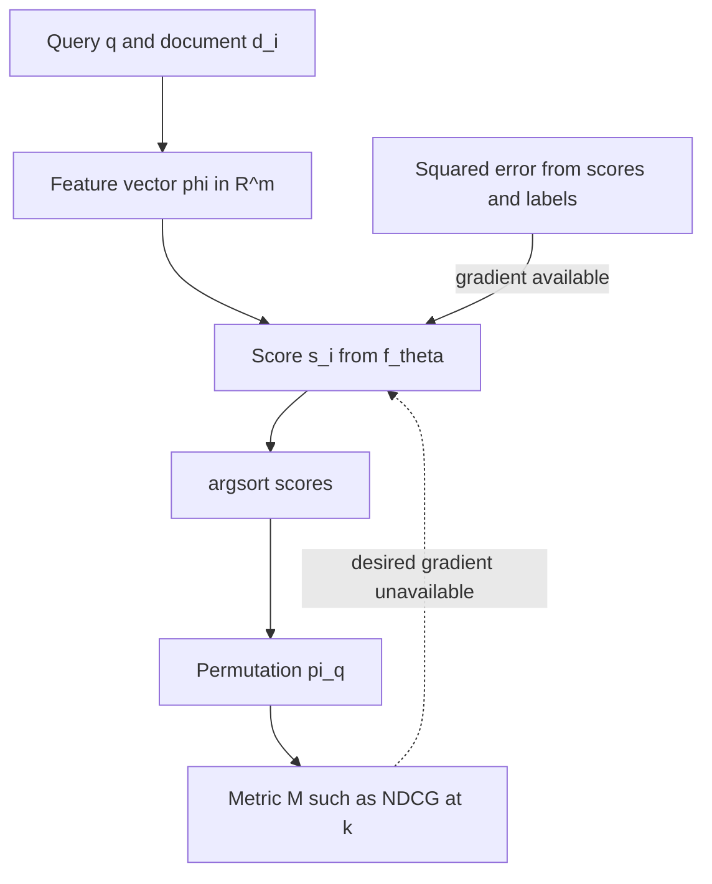
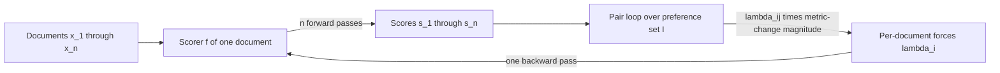
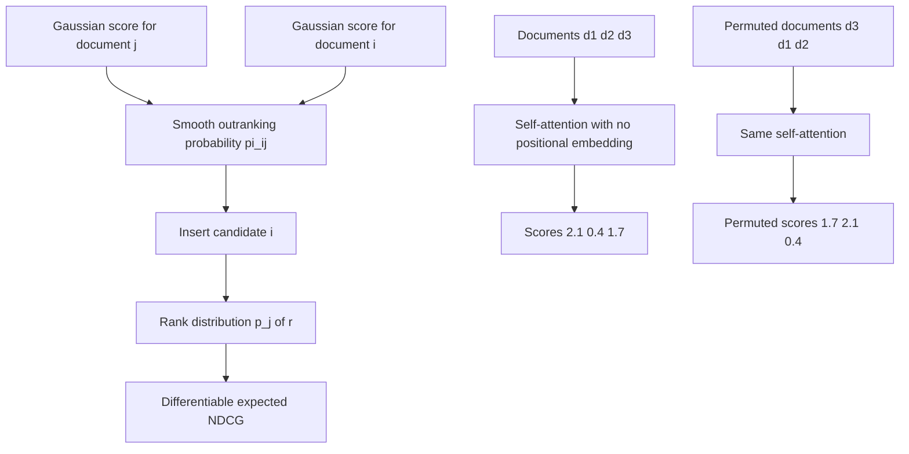
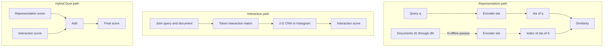

# Chapter 19: Learning to Rank

Purpose: Explain how Learning to Rank (LTR) aligns training gradients with ranked-list metrics, then choose among pointwise, pairwise, listwise, representation, interaction, and hybrid designs under real serving constraints.

## TL;DR

- A rank metric reads the order of documents, not the numeric scores that produced it. Squared error can improve while the order stays fixed.
- Normalized Discounted Cumulative Gain (NDCG) rewards good documents more when they appear near the top. A useful training signal must respect that position sensitivity.
- Pointwise methods score one document at a time. For graded labels, sort by expected gain or learn one continuous score with ordered grade cut points instead of sorting by the most likely class.
- Pairwise methods learn which of two documents should win. LambdaRank improves them by weighting each correction by the NDCG change that the swap would cause.
- Listwise methods either smooth integer ranks, define metric-aware gradients, or score the whole candidate set. Their costs and serving properties differ sharply.
- Representation models precompute document vectors. Interaction models wait for the query and usually score more accurately, but they cannot scan a large corpus cheaply.
- A practical funnel uses a representation model first and an interaction model inside a limited candidate window. The second stage cannot recover anything the first stage missed.

## The story

Imagine a parcel depot that must place the most urgent parcels at the front of a conveyor.

Each customer request is a query. Each parcel is a candidate document. Human inspectors attach priority stickers from 0 to 4, which are relevance grades. The numbers show an order, but they do not promise that the jump from 1 to 2 is the same size as the jump from 3 to 4.

The depot first hires a clerk who predicts each sticker number as closely as possible. The clerk's squared error falls every week. The conveyor barely improves because the shipping score cares only about parcel order. It cannot see whether the clerk wrote 2.0 or 20.0 when both numbers induce the same order.

The sorting gate, called argsort, keeps only the order and destroys the score scale. Its quality measure is a ranked-list metric, which gives more credit when an urgent parcel reaches the front. The depot therefore needs a smooth training substitute, called a surrogate loss, because the real sorting measure changes only when two parcels swap.

The first replacement is a pointwise inspector, which means an inspector who examines one parcel at a time. A five-class inspector should not emit only the winning sticker class. That would throw many parcels into one tied bucket. The depot instead computes expected priority from the whole predicted class distribution. An ordinal inspector can also learn one continuous urgency line with ordered cut points.

The second replacement is a pairwise referee, which means a referee who asks which of two parcels should go first. Maximum-margin training and RankNet make that comparison smooth. Plain pairwise training still treats a swap near the loading door like a swap at the back wall. LambdaRank adds the actual change in the shipping metric, so front-of-conveyor repairs pull much harder.

The third replacement is a listwise supervisor, which means a supervisor whose objective sees the candidate list. SoftRank turns each predicted score into a bell-shaped uncertainty and computes a smooth distribution over possible ranks. A boosted-tree route gives LambdaRank's metric-aware forces to trees. SetRank uses self-attention, which lets every parcel inspect every competitor, while removing position tags so the input order does not become an accidental signal.

The depot still has a serving problem. A representation worker stamps every parcel with a compact vector before any customer arrives. A query vector can then scan the stored parcel vectors. An interaction worker waits for the customer request, opens each candidate, and compares request words with parcel words. That richer comparison cannot be prepared in advance.

The depot therefore builds a funnel. The representation worker retrieves a manageable candidate set. The interaction worker reranks only that set. A hybrid scorer adds both views because they fail on different requests. The funnel is fast, but its ceiling is absolute. A parcel excluded by the first worker can never reach the second worker.

## Decoder table

| Technical term | Plain-English meaning | Why it matters |
|---|---|---|
| Learning to Rank (LTR) | Training a model to order candidates for each query | It is the chapter's central problem |
| Query `q` | The user's information request | Rankings are defined within one query |
| Candidate document `d` | One item that might answer the query | The scorer orders these items |
| Relevance label `y` | A human or behavioral judgment of usefulness | It supplies supervision |
| Query-document triple `(q, d, y)` | One query, one candidate, and its label | It is the basic judged record |
| Feature map `φ(q, d)` | A vector of signals for one query-document pair | Traditional rankers score this vector |
| Feature dimension `m` or `F` | The number of features in a vector | The source uses 46 and 136 in named benchmarks |
| Candidate set `D_q` and depth `|D_q|` or `n_q` | All judged candidates for query `q` and their count | They define the per-query sort, loss normalization, and cost |
| Candidate count `n`, class count `K`, and cutoff `k` | List length, number of relevance grades, and reported rank depth | The source uses each count for a different boundary |
| Indices `i`, `j`, and `r` | Candidate, comparison-candidate, and rank positions | They identify documents, preference pairs, and rank bins |
| Best Matching 25 (BM25) | A lexical relevance score named in the source | It is a feature and a first-stage retriever |
| Term Frequency-Inverse Document Frequency (TF-IDF) | A term-weighting feature family | It is one input to traditional rankers |
| PageRank | A document-level importance feature | It complements query-dependent signals |
| Scorer `fθ` | A model that maps features to a real score | Its scores induce the ranking |
| Parameters `θ` and metric `M` | The scorer's learned values and the ranked-list evaluation function | Training seeks parameters whose induced permutation raises the metric |
| Score `s_i` | The scalar assigned to candidate `i` | Sorting scores produces the output order |
| `argsort` | The operation that returns indices in score order | It discards score magnitudes and keeps order |
| Permutation `π_q` | The ordered candidate list for query `q` | Ranking metrics read this object |
| Normalized Discounted Cumulative Gain at `k` (NDCG@k) | A top-weighted graded ranking score normalized by the ideal order | It is the main reported metric |
| Discounted Cumulative Gain (DCG) | Graded gain reduced by rank-dependent discounts | It values useful documents near the top |
| Ideal Discounted Cumulative Gain (IDCG) | DCG for the best possible order | It normalizes DCG into NDCG |
| Mean Reciprocal Rank (MRR) | A rank metric named by the source | It also reads order rather than score scale |
| Mean Average Precision (MAP) | A rank metric named by the source | It is another order-only evaluation |
| Gain `g(y)` | The value assigned to a relevance grade | The standard form here is `2^y - 1` |
| Discount | The decreasing value attached to a rank | The source uses `1 / log2(1 + rank)` |
| Surrogate loss | A smooth objective used because the metric has no usable ordinary gradient | Every trainable LTR method needs one or an explicit gradient |
| Squared error | The sum of squared score-label gaps | It assumes a numeric scale that graded labels do not supply |
| Shift invariance | Adding one constant to all scores leaves the order unchanged | A ranking-aligned objective should respect it |
| Common score shift `c` | One constant added to every score for a query | It exposes squared error's mismatch with an unchanged ranking |
| Ordinal label | A label whose order is meaningful but whose spacing is not measured | Grades 0 through 4 have this status |
| Interval scale | A scale with meaningful equal gaps and a shared origin | Squared error requires it, but relevance grades lack it |
| Per-query normalization | Giving each query a controlled total loss weight | It prevents deeply judged queries from dominating |
| Head query | A query with many judgments or high frequency | Judgment depth can overweight it accidentally |
| Tail query | A query with few judgments | It can disappear from an unnormalized loss |
| Per-query z-score | A within-query standardization of labels or scores | It fixes some invariances but invents interval structure |
| Uniform Resource Locator (URL) | A document address | Its depth can be a ranking feature |
| Learning to Rank 4.0 (LETOR 4.0) | A public benchmark named by the source | It supplies 46 features per pair |
| Microsoft Learning to Rank WEB30K (MSLR-WEB30K) | A public benchmark named by the source | It supplies 136 features per pair |
| Microsoft Machine Reading Comprehension (MS MARCO) | A passage-ranking collection named by the source | It supplies binary judgments and a scale check |
| Pointwise method | A loss that consumes one candidate label at a time | It yields stable, cacheable per-document scores |
| Pairwise method | A loss derived from within-query document preferences | It learns which candidate should beat another |
| Listwise method | A method whose loss, gradient, or scorer uses list structure | It can align more closely with a ranked-list metric |
| Classifier | A model that predicts a label distribution | It is an honest pointwise reading of graded labels |
| Softmax | A normalized distribution over classes | A flat softmax treats grades as exchangeable classes |
| Cross-entropy | A loss for predicted class or preference probabilities | McRank and RankNet use forms of it |
| Arg max | Choosing the class with largest probability | It creates large tied buckets in graded ranking |
| Mode | The most probable class | It is not the same as expected relevance |
| Predicted distribution `p_j(d)` | The probability that document `d` has grade `j` | Its full shape supports expected gain |
| Expected relevance | The probability-weighted average grade | It produces a continuous pointwise score |
| Expected gain | The probability-weighted average metric gain | Sorting it maximizes expected DCG under the source derivation |
| Rearrangement inequality | The rule that pairs larger gains with larger discounts | It justifies sorting by expected gain |
| McRank | A multiclass boosted-tree pointwise ranker | It ranks by expected relevance instead of raw regression |
| Ordinal regression | A model with one score direction and ordered thresholds | It encodes grade order and avoids class ties |
| Ordinal direction `w` and threshold index `r` | A learned scoring vector and the first cut point above its score | The continuous value `wᵀφ` can rank even after thresholds are discarded |
| Monotone thresholds `b_1...b_K-1` | Ordered cut points on one continuous score | They partition the line into ordered grades |
| PRank | A perceptron method for ordinal ranking | It rotates one hyperplane and shifts offending thresholds |
| Perceptron | An online linear update rule | PRank adapts it to ordered classes |
| Large-margin ordinal model | A threshold model that separates neighboring intervals with slack | It extends PRank's ordinal construction |
| Support Vector Machine (SVM) | A maximum-margin classifier | RankSVM applies it to difference vectors |
| Preference set `I` | Within-query pairs where one label exceeds another | It is pairwise supervision |
| Difference vector `x_i - x_j` | The feature contrast for a preferred pair | RankSVM classifies it through the origin |
| RankSVM | A maximum-margin pairwise ranker | It makes score differences shift-invariant |
| Regularization weight `C` | The multiplier on summed RankSVM slack | It trades margin size against preference violations |
| Hinge loss | A margin penalty for an incorrect or weak preference | RankSVM uses its slack form |
| Slack `ξᵢⱼ` | The amount by which a pair misses the unit margin | RankSVM sums it across preferences |
| RankNet | A neural pairwise ranker with logistic cross-entropy | It gives smooth, equal-and-opposite pair forces |
| Logistic function `σ` | A smooth map from a score gap to a probability | RankNet uses it for preference probability |
| Shape parameter `γ` | The steepness applied to score differences | It controls RankNet's logistic curve |
| Linear score drop `α` | The worked example's score decrease per rank position | It fixes equal score gaps for the swap comparison |
| Score margin `s_i - s_j` | The difference between two document scores | Pairwise losses depend on it, so they are shift-invariant |
| Softplus | The smooth value `log(1 + exp(-margin))` | It is RankNet's collapsed cross-entropy |
| Pair force `λᵢⱼ` | The gradient contribution from one preference pair | It pushes one document up and the other down equally |
| Document force `λᵢ` | All incoming and outgoing pair forces for one document | It lets the network score each document once |
| Gradient factorization | Moving pair coupling outside model forward passes | It reduces network calls from pair count to document count |
| LambdaRank | RankNet-style forces weighted by metric change | It focuses learning where NDCG can move |
| Delta NDCG `ΔNDCGᵢⱼ` | The NDCG change from swapping documents `i` and `j` | It measures the value of repairing that pair |
| Relevance gains `rel_i`, `rel_j` and ranks `r_i`, `r_j` | The two gain values and positions used in a swap | Their gain and discount differences determine delta NDCG |
| Metric truncation | Computing metric change only to the served cutoff | It can zero training force below the reported depth |
| LambdaLoss | A probabilistic loss family matching lambda gradients | It supplies a genuine loss interpretation noted by the source |
| SoftRank | A method that randomizes scores and smooths rank distributions | It makes expected NDCG differentiable |
| Gaussian score | A normal random variable centered on a model score | It smooths pairwise outranking events |
| Smoothing width `σ` | The Gaussian standard deviation in SoftRank | It is an extra hyperparameter tied to score scale |
| Cumulative normal function `Φ` | The smooth Gaussian probability function | It yields SoftRank's pairwise outranking probability |
| Outranking probability `πᵢⱼ` | The probability that candidate `i` scores above `j` | It drives the rank insertion recurrence |
| Rank distribution `p_j(r)` | The probability that document `j` occupies rank `r` | Its expectation gives a smooth metric |
| Insertion recurrence | A sequential update over candidates and rank bins | It produces SoftRank's rank distribution |
| SoftNDCG | Expected NDCG under smoothed ranks | It is differentiable in the scores |
| Lambda Multiple Additive Regression Trees (LambdaMART) | LambdaRank gradients fitted by boosted regression trees | It is the source's production default for tabular features |
| Listwise scale `σ_l` | The steepness used in the listwise lambda equation | It controls the logistic part of the LambdaMART training force |
| Gradient-boosted regression tree | A sequence of trees fitted to residual targets | LambdaMART fits trees to document forces |
| Newton leaf step | A second-order update for a tree leaf value | LambdaMART uses it after fitting a tree |
| SetRank | A multivariate set-scoring ranker | A document score may depend on competitors |
| Self-attention | A learned interaction among all candidate rows | It contextualizes each candidate in SetRank |
| Attention matrices `Q`, `K`, `V` and width `d` | Query, key, and value projections with head width `d` | Their permutation identity proves SetRank's input-order symmetry |
| Permutation matrix `P` | A reordering of candidate rows | It expresses the required input-order symmetry |
| Permutation equivariance | Reordering inputs reorders outputs without changing their values | It prevents arbitrary candidate order from changing scores |
| Positional embedding | A signal for input position | SetRank removes it to preserve permutation equivariance |
| Ordinal prior-rank embedding | A deliberate feature for the first-stage rank | It reintroduces prior order in an ablatable way |
| ListNet | A permutation-likelihood method using a top-one distribution | It is cheap but does not optimize NDCG directly |
| Plackett-Luce softmax | A distribution over ranking choices | ListNet uses its top-one form |
| ListMLE | A method that maximizes ground-truth permutation likelihood | It is another listwise likelihood branch |
| NeuralSort | A later differentiable sorting relaxation named by the source | It carries forward SoftRank's relaxation idea |
| Univariate scorer | A scorer whose output depends on one document and query | It remains stable under sharding and pagination |
| Multivariate scorer | A scorer whose outputs depend on the candidate set | It can break shard merges and pagination stability |
| Representation model | A scorer that separately encodes query and document | Document vectors can be precomputed |
| Interaction model | A scorer that builds a joint query-document object | Nothing document-specific can be fully precomputed |
| Hybrid model | A sum or funnel using representation and interaction | It combines channels that fail differently |
| Bi-encoder | A modern representation model with separate encoders | It supports corpus-scale retrieval |
| Cross-encoder | A pointwise neural scorer that reads query and document jointly | It is accurate but requires a joint pass per candidate |
| Similarity function `sim` | Cosine or dot-product comparison of vectors | It joins precomputed representations |
| Encoder `η` | A map from text to an `m`-dimensional vector | Its document output can be indexed |
| Corpus size `N` | The number of indexed documents | It separates offline document work from per-query work |
| Index-time precomputation | Computing document-side work before a query arrives | It is the structural advantage of representation models |
| Deep Structured Semantic Model (DSSM) | A representation ranker using trigram hashing and cosine | It starts the lineage described by the source |
| Letter-trigram hashing | Mapping words to overlapping three-character features | It handles words outside a fixed vocabulary |
| Multi-hot vector | A vector marking every present trigram | DSSM projects it to 128 dimensions |
| Click-through supervision | Treating clicked results as relevant examples | It gave DSSM inexpensive training data |
| Contrastive loss | A softmax objective against sampled unclicked negatives | It trains the clicked document to beat sampled alternatives |
| Dense Passage Retriever (DPR) | A later representation model named by the source | It reuses the softmax-over-negatives shape |
| Contriever | A representation retriever named by the source | It retains the same scoring structure |
| Sparse Lexical and Expansion model (SPLADE) | A sparse retriever named by the source | It is another descendant in the stated loss lineage |
| Convolutional DSSM (C-DSSM) | DSSM with sequence convolution and max pooling | It learns phrases rather than a bag |
| Long Short-Term Memory DSSM (LSTM-DSSM) | A recurrent DSSM variant | It reaches farther in a sequence but not across hundreds of tokens |
| MatchPyramid | An interaction ranker over a token similarity matrix | It keeps detailed query-document matches |
| Interaction matrix `M_ij` | Cosine similarity for query token `i` and document token `j` | It exposes every token pair to the ranker |
| Two-dimensional convolutional neural network (2-D CNN) | Filters sliding over the interaction matrix | MatchPyramid uses it to learn match patterns |
| Receptive field | The input region a convolutional filter can combine | Here it spans positions in both texts |
| Deep Relevance Matching Model (DRMM) | An interaction model using similarity histograms | It makes input width independent of document length |
| Histogram aggregator | Fixed-width counts of similarity values | It removes document-length dependence and word order |
| Multilayer perceptron (MLP) | A feed-forward network over fixed-width bins | DRMM learns each histogram bin's contribution |
| 32-bit floating point (fp32) | Four-byte numeric storage | It sets vector and token-embedding byte counts |
| Vector budget | The fixed number of bits available for one document representation | It explains loss of rare literal distinctions |
| Duet | A model that sums representation and interaction channels | Its joint model beat either half in the source claim |
| Approximate nearest neighbor (ANN) index | A fast vector-search structure | Rebuilding it can change tie order from the first stage |
| Queries per second (QPS) | Request throughput | It makes cache and sequential-call costs operational |
| Large language model (LLM) reranker | A listwise or pointwise reranker using an LLM | Its serving boundary depends on windowing and latency |
| Floating-point operations (FLOPs) | Arithmetic work | The source contrasts it with bytes moved |
| p99 latency | The 99th-percentile response time | It is the tail-latency budget in a design probe |
| Recall@k | Fraction of relevant items present by cutoff `k` | It caps every downstream reranker |
| MaxSim | A late-interaction reshaping operation named by the source | It is part of the residual measured-system cost |
| Contextualized Late Interaction over Bidirectional Encoder Representations from Transformers (ColBERT) | A multi-vector late-interaction system named by the source | Its measured latency checks the byte estimate |

## Core mechanics

### 19.1 The LTR setup and why regression is the wrong framing

#### What it is

The training data contains triples `(q, d, y)`. The feature extractor maps each pair to `φ(q, d) in R^m`. The source examples include BM25 over title, body, and anchor text, TF-IDF variants, language-model scores, PageRank, URL depth, and click counts. LETOR 4.0 has 46 features per pair. MSLR-WEB30K has 136 features per pair. Both use the five-grade scale in the source. The scorer and serving order are:

$$
sᵢ = fθ(φ(q, dᵢ))
$$

$$
π_q = argsort↓(s₁, ..., s_|D_q|)
$$

The metric is `M(π_q, y_q)`. It reads the permutation and labels, not the scores. The desired objective is:

$$
maximize over θ: Σ_q M(π_q, y_q)
$$

This objective is piecewise constant in `θ`. It changes only when two scores cross. Its gradient is zero everywhere else.

#### Why it exists

The system needs a differentiable surrogate or an explicitly defined gradient. The three loss families encode increasing amounts of permutation structure. Pointwise methods keep one-document decomposition and treat labels as classes or ordinal bins. Pairwise methods use score differences, which are shift-invariant. Listwise methods place a smoothed metric or metric-aware structure into training.

#### What fails without alignment

Squared error is:

$$
L = Σ_q Σ_(i in D_q) (sᵢ - yᵢ)²
$$

It fails in three separate ways. First, it lacks the metric's shift invariance. Adding a constant `c` to every score leaves the ranking fixed, but changes loss by:

$$
Σ_i (2c(sᵢ - yᵢ) + c²)
$$

Second, grades are ordinal judgments, not interval measurements. The only guaranteed relation is `y₁ < y₂ < y₃`. The standard gain is `2^y - 1`. A grade 4 has gain 15 and a grade 3 has gain 7. Their gain ratio is 15/7 = 2.14, while their raw-label ratio is 4/3 = 1.33. That is a 1.61-fold re-spacing. Third, pair-summed loss weights queries by judgment depth while the metric averages queries. A query with 500 judgments and one with 5 give the first query 500/505 = 99.0% of loss but 50% of the metric. That is a 100-fold accidental overweighting. Per-query z-scoring does not repair the objective. It invents interval structure and makes a pair's target depend on the first-stage candidate pool. Changing from BM25 to a dense retriever can then change the target for the same `(q, d)` pair. Pointwise is not a synonym for regression. Classification and ordinal regression remain pointwise. Rejecting squared error does not require a pairwise model.

#### Worked example

Use five candidates with grades `y = (4, 3, 0, 0, 0)`. The ideal discounted gain is:

$$
IDCG = (2⁴ - 1)/log₂2 + (2³ - 1)/log₂3 = 15 + 7/1.585 = 15 + 4.417 = 19.417
$$

Model A predicts `s = (2.0, 2.1, 0, 0, 0)`. Its squared error is `4.00 + 0.81 = 4.81`. It inverts the top pair. Its DCG is `7 + 15/1.585 = 7 + 9.464 = 16.464`. Its NDCG is `16.464/19.417 = 0.848`. Model B predicts `s = (0.5, 0.2, 0.1, 0.1, 0.1)`. Its squared error is `12.25 + 7.84 + 0.03 = 20.12`. Its order is ideal, so NDCG is 1.000. Squared error prefers A by `20.12/4.81 = 4.2` times. NDCG prefers B by 15.2 points. For Model A, squared-error gradient magnitudes total `4.0 + 1.8 = 5.8`. For Model B, they total `7.0 + 5.6 + 3(0.2) = 13.2`. Squared error pushes 2.3 times harder on the model that already has NDCG 1.000. The source's internal check repeats the 15-to-7 gain ratio. Its external check notes that Li, Burges, and Wu introduced McRank in 2007 and reported that multiclass classification ranked better than regression on the same kind of labels and features. The Qin and Liu 2013 baselines named are RankSVM, RankBoost, ListNet, AdaRank, and LambdaMART. Least-squares regression is absent from that list.

#### Cost, complexity, and practice choices

The opening failure used 40,000 judged rows, a quarter of work, and a six-figure annotation budget. Training loss halved while held-out NDCG@10 moved by only 0.004. More labels, trees, features, or epochs do not fix a misaligned loss. Normalize each query's loss by `|D_q|`, or sample a fixed candidate count per query. Use explicit traffic frequency only when traffic weighting is deliberate. Freeze the first-stage retriever when comparing rankers. Report recall@k separately when evaluating retrieval because reranking cannot recover a missing candidate. Gate releases on NDCG@10 on a frozen evaluation set. Use surrogate loss as an optimization diagnostic. Its absolute value becomes directly informative when it diverges. Audit adjacent-grade annotator agreement. If adjacent disagreement is common, the source recommends collapsing 0 through 4 to three levels. If disagreement clusters at one boundary, rewrite that guideline instead. Clicks are a stated exception to the five-grade setup. With sparse binary judgments, the scale issue disappears and position bias becomes the hard problem. Dwell time is also a genuine continuous quantity, so the scale objection dissolves. The source contrasts 30 seconds on a recipe with 30 seconds on a troubleshooting page to show cross-query incomparability. The loss-metric mismatch, query weighting, cross-query incomparability, and exposure-policy bias remain. The source places dwell time in features or within-query preferences, then settles the choice with frozen-set NDCG@10.

### 19.2 Pointwise classification and ordinal regression

#### What it is

A pointwise model trains on individual `(φ, y)` pairs after dissolving query boundaries. For each of `k` candidates, serving computes one score, sorts descending, and cuts at 10. The source uses labels `y in {0, 1, ..., K - 1}` and the standard case `K = 5`. Pointwise decomposition makes scores independent of the rest of the candidate list. That property supports caching, batching, sharding, and stable behavior after index changes. The opening failure returns the same ten documents in a different order because five scores leave a large tied class whose order comes from a rebuilt ANN index. Binary labels are direct. The source allows a margin classifier, an SVM, or a maximum-entropy model, then ranks by `P(y = 1)`.

#### Why expected gain fixes the head

A flat `K`-way softmax treats classes as exchangeable. Its objective does not encode that 3 lies between 0 and 4. Arg max then maps 100 candidates onto only 5 scores. Ties become typical, not exceptional. Let `p_j(d) = P(y = j given φ(q, d))`. For standard gain `g(y) = 2^y - 1`:

$$
E[g(y_d)] = Σ_(j=0 to K-1) (2ʲ - 1)p_j(d)
$$

For a candidate permutation:

$$
E[DCG@k] = Σ_(i=1 to k) E[g(y_π(i))] / log₂(i + 1)
$$

The discounts decrease strictly with rank. The rearrangement inequality therefore makes descending expected gain optimal for expected DCG. McRank uses multiclass gradient-boosted trees and ranks by expected relevance `Σ_j j p_j(d)`. The linear-gain and exponential-gain versions usually agree on order in the source. The exponential version matches the metric.

#### Ordinal alternative

Ordinal regression learns one direction `w` and `K - 1` thresholds:

$$
b₁ ≤ b₂ ≤ ... ≤ b_(K-1)
$$

It predicts the first interval boundary above the score:

$$
y_hat = min{r : wᵀφ < b_r}
$$

PRank, from Crammer and Singer in 2001, initializes weights at zero. On a mistake it rotates the hyperplane like a perceptron and shifts offending thresholds by one. The thresholds remain ordered by construction. Shashua and Levin's 2002 method makes the construction large-margin. It learns both ends of each interval, maximizes neighboring margins, and uses slack. For ranking, the thresholds can be discarded. The continuous score `wᵀφ` gives a total order.

#### What fails without it

Sorting by the winning class probability ranks confidence, not estimated relevance. A document with `p₃ = 0.50` and nothing above it can lose in expectation to one with `p₃ = 0.45` and `p₄ = 0.35`. Pointwise training never directly learns that one item should beat another inside the same candidate set. An unnormalized query with 500 judgments outweighs one with 20 by 25 to 1. Classification accuracy is also misleading when class 0 contains about 90% of candidates. The score can be excellent while the head remains unordered.

#### Worked example

Use 10 candidates. Truth is `A = 4`, `B = C = 3`, `D = E = F = 2`, and the final four are 0. Exponential gains are `15, 7, 7, 3, 3, 3`, then four zeros. The source reports the ideal value as:

$$
IDCG@10 = 15/log₂2 + 7/log₂3 + 7/log₂4 + 3/log₂5 + 3/log₂6 + 3/log₂7 = 26.437
$$

Direct evaluation of that formula gives 26.437718, which rounds to 26.438 rather than 26.437. The source uses its displayed 26.437 in the remaining arithmetic. The head distributions are: `p(A) = (0.00, 0.05, 0.15, 0.45, 0.35)`. `p(B) = (0.00, 0.05, 0.25, 0.50, 0.20)`. `p(C) = (0.05, 0.10, 0.30, 0.45, 0.10)`. All three modes are class 3. Placing A first gives NDCG@10 = 1.000. Placing A second loses 2.953 DCG. The source reports `23.484/26.437 = 0.888`, while unrounded calculation gives DCG 23.485156. Placing A third loses 4.000 DCG. The source reports `22.437/26.437 = 0.849`, while unrounded calculation gives DCG 22.437718. Both NDCG values still round to 0.888 and 0.849. Across the six orders of `{A, B, C}`, the expected value is `(1.000 + 0.888 + 0.849)/3 = 0.912`. Breaking the tie by winning-class probability puts B first and A second. That gives NDCG@10 = 0.888. Expected relevance gives `3.10` for A, `2.85` for B, and `2.45` for C. Expected gain gives `8.90`, `7.30`, and `5.65`. Both order A, B, C and reach NDCG@10 = 1.000. The change is 0.088 absolute and 9.6% relative with no extra inference pass. At `K = 2`, expected relevance reduces to `p₁`. The source says monoT5, from Nogueira and colleagues in 2020, ranks by the decoder probability of the token `true`.

#### Cost, complexity, and practice choices

For `k = 100`, pointwise scoring needs 100 independent forward passes. At 250 query-document pairs per second, this takes 0.40 seconds. The passes batch and shard freely. All pairs require `100 choose 2 = 4,950` passes and 19.8 seconds. A comparison sort needs about `k log₂k = 664` comparisons, 2.66 seconds, and `log₂k` dependent rounds. Weight each example by `1/n_q` unless judgment counts are already uniform. Prefer expected relevance over arg max. For `K = 2`, both reduce to ranking by `p₁`. The source favors an ordinal head when the scale exceeds five levels or adjacent grades are noisy. For boosted trees, it favors McRank-style multiclass prediction plus expectation. Keep a hot-path reranker pointwise unless the candidate set is stable. Use listwise scoring for offline or low-QPS, high-value segments when its latency is justified. Use per-class recall only as a diagnostic, not the headline metric. Calibrate scores across queries only when the product needs an absolute abstention threshold. A sliding window of 20 with stride 10 over 100 candidates creates 9 sequential LLM calls in the source's staff example. The proposed boundary is pointwise from 100 to 20, then listwise from 20 to 10 only for justified segments. Pointwise, pairwise, and listwise describe the loss, not the architecture. A cross-encoder can be pointwise. RankNet can be pairwise even though its network scores one document at a time.

### 19.3 Pairwise RankSVM, RankNet, and LambdaRank

#### What it is

For one query, pairwise training derives:

$$
I = {(i, j) : yᵢ > yⱼ}
$$

Pairs must stay within one query. Grades are not calibrated across queries. RankSVM uses `sᵢ = wᵀxᵢ`. Its preference condition is `wᵀ(xᵢ - xⱼ) > 0`. It classifies the difference vector through the origin. There is no bias because a common score shift cannot change rank. Its max-margin program is:

$$
minimize over w: 0.5||w||² + C Σ_((i,j) in I) ξᵢⱼ
$$

$$
subject to wᵀ(xᵢ - xⱼ) ≥ 1 - ξᵢⱼ and ξᵢⱼ ≥ 0
$$

Herbrich and colleagues introduced the method in 2000. Joachims applied it to search in 2002. A click on result 3 after skipping results 1 and 2 yields two preference pairs in the source example.

#### RankNet and factorization

RankNet, from Burges and colleagues in 2005, keeps the preference pairs and uses a neural scorer. Its pair probability and target are:

$$
Pᵢⱼ = σ(γ(sᵢ - sⱼ)), P̄ᵢⱼ = 1 for (i, j) in I
$$

Cross-entropy collapses to:

$$
Cᵢⱼ = log(1 + exp(-γ(sᵢ - sⱼ)))
$$

Differentiation gives equal-and-opposite forces:

$$
∂Cᵢⱼ/∂sᵢ = -γ/(1 + exp(γ(sᵢ - sⱼ))) = -λᵢⱼ
$$

$$
∂Cᵢⱼ/∂sⱼ = λᵢⱼ
$$

Aggregate document force is:

$$
λᵢ = Σ_(j:(i,j) in I) λᵢⱼ - Σ_(j:(j,i) in I) λⱼᵢ
$$

The model gradient factorizes as:

$$
∂C/∂θ = Σ_(i=1 to n) λᵢ ∂sᵢ/∂θ
$$

The network therefore runs once per document, not once per pair. The pair loop assembles forces outside the network.

#### Why LambdaRank exists

RankSVM and RankNet count or smooth inversions without rank-position value. The same score gap gets the same force near rank 1 and rank 500. LambdaRank, from Burges, Ragno, and Le in 2006, specifies the metric-aware gradient directly. For documents at ranks `r_i` and `r_j`:

$$
|ΔNDCGᵢⱼ| = |relᵢ - relⱼ|/IDCG × |1/log₂(1 + rᵢ) - 1/log₂(1 + rⱼ)|
$$

$$
λLRᵢⱼ = γ|ΔNDCGᵢⱼ|/(1 + exp(γ(sᵢ - sⱼ)))
$$

The extra metric factor costs one multiplication per pair. The source says the authors tested more than ten candidate approximations before selecting it. The continuous derivative of the discount at rank 100 has magnitude `3.222 × 10^-4`. The discrete change is `3.199 × 10^-4`. They agree within 0.7%. The reweighting acts as a position derivative.

#### What fails without it

The opening run improves pairwise validation accuracy from 0.71 to 0.84 over six hours. NDCG@10 stays at 0.3869. Plain pairwise training can spend most of its gradient below the reported cutoff. Pairwise accuracy is useful for debugging pair construction, but the source says not to report it as the production outcome. LambdaRank historically had a gradient but no scalar loss. Gradient descent still works because it needs a parameter-update vector. The missing loss removes a directly comparable training number and an ordinary convergence claim. The source cites Donmez, Svore, and Burges in 2009 for empirical local-optimum evidence. It cites Wang and colleagues in 2018 for LambdaLoss as a genuine probabilistic loss framework. Neither result changes the implementation.

#### Worked example

Use `n = 120` candidates with two relevant documents at ranks 2 and 51. Scores fall by `alpha = 0.1` per rank and `gamma = 1`. The ideal value is `1/log₂2 + 1/log₂3 = 1.63093`. Swap A exchanges the relevant rank-2 document with the irrelevant rank-1 document. Swap B exchanges the relevant rank-51 document with the irrelevant rank-50 document. Both RankSVM pairs have margin `-0.1` and slack `1.1`. Substituting that margin into the source's general RankNet formula gives `1/(1 + exp(-0.1)) = 0.52498` for both forces. The worked example drops the minus sign in its printed exponential. Its printed `exp(0.1)` would instead give 0.47502. Across 236 discordant pairs, 71.4% of RankNet gradient magnitude lands on pairs where both documents are below rank 10. For LambdaRank, Swap A has metric change `|1 - 0.63093|/1.63093 = 0.22629`. Swap B has full-list metric change `|0.17629 - 0.17543|/1.63093 = 5.312 × 10^-4`. The ratio is 426. Metric weighting cuts below-rank-10 gradient mass from 71.4% to 21.6%. Truncating DeltaNDCG at 10 cuts it to exactly zero. The stalled NDCG@10 is `0.63093/1.63093 = 0.38685`. Swap A raises it to `1.00000/1.63093 = 0.61315`. The gain is 0.22629 absolute and 58.5% relative. Swap B changes truncated NDCG@10 by exactly zero.

#### Cost, complexity, and practice choices

A label split of `80/20/12/6/2` across grades 0 to 4 creates `120 choose 2 = 7,140` pairs. Of these, 3,432 share a label and 3,708 are discordant. Direct pair scoring needs 3,708 network evaluations. Factorization needs 120. That is a 30.9-fold saving, and the advantage grows linearly with `n`. The source compares LambdaRank with SoftRank here and describes SoftRank's rank-distribution recurrence as `O(n²)` per query. Section 19.4 later counts all documents, insertions, and rank bins and states `Θ(n³)` per query for full SoftRank. These are two distinct cost statements in the source. Default to LambdaRank over RankNet or RankSVM for a truncated, discounted metric. In a Retrieval-Augmented Generation (RAG) pipeline that supplies ten chunks, truncate ΔNDCG at ten when that cutoff is fixed. Do not bake in the cutoff while it is still being tuned. Keep pairs within each query and assert that invariant in the data loader. Score documents individually, then assemble document forces outside the network. For a pure recall@100 objective, delta recall is zero unless a swap crosses rank 100. Replacing ΔNDCG with delta recall would annihilate almost all gradient and leave one boundary. The source's proposed middle is NDCG weighting truncated at 100. If the generator is order-sensitive, recall@100 alone is also an incomplete target.

### 19.4 Listwise SoftRank, LambdaMART, and SetRank

#### What it is

NDCG depends on integer ranks:

$$
DCG = Σ_(j=1 to n) g(yⱼ)/log₂(1 + rⱼ)
$$

$$
NDCG = DCG/IDCG
$$

A tiny score change either leaves every rank fixed or swaps documents and jumps the metric. The gradient is zero almost everywhere and undefined at swap boundaries. The source develops three routes.

#### Route one: SoftRank

SoftRank, from Taylor and colleagues in 2008, randomizes each score:

$$
sⱼ is distributed as Normal(f(xⱼ), σ²)
$$

For independent Gaussians:

$$
πᵢⱼ = Pr[sᵢ > sⱼ] = Φ((f(xᵢ) - f(xⱼ))/(√2σ))
$$

Insert candidates one at a time. The recurrence is:

$$
pⱼ^(i)(r) = πᵢⱼ pⱼ^(i-1)(r - 1) + (1 - πᵢⱼ)pⱼ^(i-1)(r)
$$

It starts with all probability mass at rank zero. After `n - 1` insertions, every rank probability is differentiable in every score. Expected metric is:

$$
SoftNDCG = (1/IDCG) Σ_j g(yⱼ) Σ_r pⱼ(r)/log₂(1 + r)
$$

Each of `n` documents needs `n - 1` insertions. Each insertion updates `n` rank bins. The full recurrence therefore costs `Θ(n³)` per query and is sequential in insertion index.

#### Route two: LambdaMART

LambdaRank keeps the metric discrete and defines the gradient. The listwise section writes the pair force as:

$$
λᵢⱼ = -σ_l ΔNDCGᵢⱼ/(1 + exp(σ_l(sᵢ - sⱼ)))
$$

LambdaMART feeds the per-document forces to gradient-boosted regression trees. Each boosting round fits a tree to `lambda_j = Σ_j' lambda_jj'`. It sets leaf values with a Newton step. The source favors trees for heterogeneous, unnormalized features such as BM25, PageRank, click-through rate, and domain age.

#### Route three: SetRank

SoftRank and LambdaMART still score each document alone. SetRank, from Pang and colleagues in 2020, changes the scorer's arity:

$$
s = f(q, {d₁, ..., d_n})
$$

A document score can now depend on competitors. The output must not depend on arbitrary first-stage input order. Without positional encodings, self-attention obeys:

$$
softmax(PQKᵀPᵀ/√d)PV = P softmax(QKᵀ/√d)V
$$

SetRank removes positional embeddings and projects each contextualized candidate to a scalar. When prior rank should be a feature, it adds an ordinal embedding that can be ablated.

#### Other listwise likelihood methods

ListNet, from Cao and colleagues in 2007, uses a top-one Plackett-Luce softmax and cross-entropy against a label-derived distribution. ListMLE, from Xia and colleagues in 2008, maximizes likelihood of the ground-truth permutation. Top-one ListNet costs `O(n)` per query. It optimizes likelihood rather than NDCG. The source names NeuralSort, from Grover and colleagues in 2019, and differentiable ranking from Blondel and colleagues in 2020 as later relaxations carrying SoftRank's idea.

#### What fails and what the evidence limits

The opening list has 1,000 candidates. Most misordered pairs lie between ranks 300 and 800. The discount falls from `1/log₂301 = 0.12` to `1/log₂801 = 0.10`, versus 1.00 at rank 1. Pairwise cross-entropy can fall from 0.61 to 0.54 to 0.49 while NDCG@10 stays fixed for three weeks. SoftRank is principled but has cubic cost, sequential recurrence, and a smoothing width tied to score scale. Changing feature normalization requires retuning that width. Burges and colleagues reported in 2011 that the winning Track 1 entry of the 2010 Yahoo Learning to Rank Challenge combined 12 models, including 8 LambdaMART models. The source states that LightGBM offers `objective=lambdarank` and XGBoost offers `rank:ndcg`. It states that no mainstream library offers SoftRank. A set scorer can break shard-local reranking and stable pagination because competitor membership changes scores. An offline gain must therefore clear a candidate-order shuffle test and an interaction ablation.

#### Worked cost example

Use 10,000 queries, 1,000 BM25 candidates per query, 5 relevant documents per query, and 136 features per pair. Full SoftRank costs `1,000³ = 10^9` bin updates per query and `10^13` per epoch. The `999` insertions are sequential passes over a `1,000 × 1,000` table. Truncating SoftRank to 100 cuts the recurrence to `100³ = 10^6` per query and `10^10` per epoch. That is a 1,000-fold reduction. If first-stage recall@100 is 0.86 and recall@1,000 is 0.94, truncation discards 8 points of achievable recall. LambdaMART uses `5 × 995 = 4,975` differing-label pairs per query plus one `O(n log n)` sort. One epoch uses `10^4 × 4,975 = 4.98 × 10^7` pair evaluations. The ratio against full SoftRank is `2.0 × 10^5`. SetRank uses three attention blocks with `d = 256` and `n = 1,000`. Per block, attention costs `4n²d` floating-point operations. Four projections cost `8nd²`. A four-times-width feed-forward network costs `16nd²`. At the stated values these are `1.02 × 10^9`, `5.24 × 10^8`, and `1.05 × 10^9`. The total is `2.60 × 10^9` per block and `7.8 × 10^9` per query forward pass. Training at about three times forward costs `2.34 × 10^10` per query and `2.34 × 10^14` per epoch. At `3.4 × 10^14` FLOPs per second, the source estimates 0.69 seconds per epoch. Dense attention can beat the sequential cubic recurrence in wall time despite its quadratic exponent. MSLR-WEB30K contains 3,771,125 query-document pairs across 31,531 queries. That is 119.6 documents per query. At `n = 120`, the recurrence costs `1.73 × 10^6` per query, 579 times below the 1,000-document case.

#### Practice choices

Use LambdaMART by default for handcrafted tabular features. The source says a boosted tree cannot use a 768-dimensional dense vector and recommends a neural listwise model when features are learned text representations. Train at the depth production reranks, not automatically at retrieval depth. If first-stage recall at rerank depth is materially worse, deepen the candidate cut. Remove positional information from a set scorer unless prior rank is an intentional, ablatable feature. Shuffle candidate order ten times and compare NDCG@10 spread with the A/B decision threshold. Benchmark a new listwise model against LambdaMART when tabular features exist. In the sharded staff example, SetRank raises offline NDCG@10 from 0.412 to 0.431, a gain of 0.019. A shuffle spread of plus or minus 0.015 would put that gain inside order sensitivity. If removing attention preserves the gain, the model class caused it rather than set interaction. If the ablation kills the gain and shuffle spread is small, move reranking above the eight-shard merge and budget one global pass.

### 19.5 Neural LTR representation, interaction, and hybrid scoring

#### What it is

Neural LTR changes features from handcrafted values to learned text representations. It does not change the pointwise, pairwise, and listwise loss taxonomy. The source applies the same structural distinction to a 2016 CNN ranker, a 2020 bi-encoder, and a 2024 LLM reranker. Representation scoring factorizes:

$$
s_rep(q, d) = sim(η(q), η(d))
$$

The document vector `eta(d)` does not depend on the query. It can be computed when the document is indexed. Interaction scoring does not factorize:

$$
s_int(q, d) = f(φ(q, d))
$$

The joint object cannot exist before the query arrives. Parameter count is not the deciding property. The deciding question is whether the document contribution can be computed before the query is known.

#### Representation lineage

DSSM, from Huang and colleagues in 2013, hashes words into letter trigrams. The source bounds the distinct trigram count at roughly `30³ = 27,000`, using 26 letters, a word-boundary marker, and some punctuation. It projects the multi-hot trigram vector to 128 dimensions and scores by cosine. Click-through logs supply supervision. The clicked document must beat a handful of sampled unclicked documents under a softmax-over-negatives contrastive objective. The source says this objective reappears essentially unchanged in DPR, Contriever, and SPLADE. C-DSSM, from Shen and colleagues in 2014, convolves over word sequences and max-pools. LSTM-DSSM, from Palangi and colleagues in 2016, reaches farther in a sequence but still not across hundreds of tokens. Transformers address that context gap while keeping the representation shape.

#### Interaction lineage

MatchPyramid, from Pang and colleagues in 2016, constructs:

$$
Mᵢⱼ = cos(qᵢ, dⱼ)
$$

A 100-word query and 100-word document create `100 × 100 = 10,000` token similarities for one pair. MatchPyramid treats the matrix as an image and applies a 2-D CNN. Its filters span positions in both texts. The source says the usual complaint about CNN locality does not apply in the same way here. It describes the design in hindsight as attention without the softmax. DRMM, from Guo and colleagues in 2016, turns each matrix row into a similarity histogram. An MLP learns the contribution of each bin. Histogram width is independent of document length. That avoids the padding and truncation forced by a fixed interaction matrix. DRMM also destroys document word order. The source treats that as defensible for ad hoc aboutness matching. It treats it as indefensible when order carries meaning, such as Boston-to-Denver versus Denver-to-Boston. For directional or comparative queries, order destruction is the bug, not a small approximation.

#### Representation bottleneck and hybrid repair

A representation model compresses a document before it knows the future query. At `m = 128` in fp32, the vector has `128 × 32 = 4,096` bits. A 400-token chunk from a 30,522-piece vocabulary has a raw upper bound of:

$$
400 log₂(30,522) approximately equals 400 × 14.9 = 5,960 bits
$$

The vector budget is about `4,096/400 = 10` bits per token. That is below the 14.9 bits needed merely to name one vocabulary item under the raw bound. Natural language is redundant and has lower true entropy. The source therefore presents this as the shape of the constraint, not a break-even point. The vector budget stays fixed while document length varies. The encoder allocates coordinates to corpus-wide recurring distinctions. A part number occurring in one document among `10^6` may not receive a coordinate. Increasing width from 128 to 768 multiplies index bytes by 6. The source says this does not restore exact matching because the problem is allocation, not only room. Duet, from Mitra, Diaz, and Craswell in 2017, sums a representation score and an interaction score. The source's stated headline result is that the joint model beats each half. The claim is about complementary failure modes. If the two channels have high rank correlation on actual traffic, the source allows choosing one because correlated channels duplicate signal at twice the cost.

#### Worked cost example

Use a `10^7`-passage corpus, about the stated 8.8 million passage size of Microsoft Machine Reading Comprehension (MS MARCO). Each passage has 100 tokens with 300-dimensional fp32 token embeddings. The query has 10 tokens. The accelerator sustains 3.35 terabytes per second of memory bandwidth and `3.4 × 10^14` FLOPs per second. Full interaction streams:

$$
10^7 × 100 × 300 × 4 bytes = 1.2 × 10^12 bytes = 1.2 terabytes
$$

At the stated bandwidth, that is `0.358` seconds or 358 milliseconds before convolution. The data does not fit in one accelerator's memory. A representation index at `m = 128` streams:

$$
10^7 × 128 × 4 bytes = 5.12 × 10^9 bytes = 5.12 gigabytes
$$

That takes 1.53 milliseconds. The dot products cost `10^7 × 2m = 2.56 × 10^9` FLOPs. At the stated compute rate, they take 7.5 microseconds. Memory movement dominates arithmetic by more than 200 times. The byte ratio is `1.2 × 10^12 / 5.12 × 10^9 = 234`. A hybrid interaction stage over top `k = 100` streams `1.2 × 10^7` bytes in 3.6 microseconds. It runs on `10^-5` of the corpus. The stage adds 0.0036 milliseconds to a 1.53-millisecond retrieval, or 0.235% of that budget. It cannot recover a document excluded from top 100. At `10^4` documents, full interaction streams 1.2 gigabytes and takes 0.36 milliseconds. At that scale, the source says a first stage is pure complexity. A multi-vector index with one vector per token uses 100 times the bytes and streams in 153 milliseconds. ColBERT's published end-to-end latency on MS MARCO is 458 milliseconds in the cited 2020 work. The estimate is within a factor of 3. The source attributes the residual to ANN traversal, MaxSim reshaping, and final reranking.

#### Practice choices and limits

Default to representation at stage one and interaction inside a candidate window. Budget stage one in bytes streamed per query before focusing on FLOPs. The source calls the reranking stage compute-bound when a deep cross-encoder runs on a short list. Use a fixed-width aggregator when document lengths vary by more than about 3 times. Uniformly sized chunks can justify a position-preserving matrix because padding waste is bounded. Start from `m = 128` in the source's default and require a recall curve before moving to 768. The stated example moves index bytes from 5.12 gigabytes to 30.7 gigabytes. For rare literal misses, the source recommends a sparse or late-interaction channel instead of relying only on width. In the p99 probe, the budget drops from 400 milliseconds to 80 milliseconds. Cutting first-stage candidates from 1,000 to 50 reduces what the reranker can see by 20 times. The source proposes keeping both stages and cutting rerank depth where the measured quality curve flattens. If first-stage recall@50 and recall@1,000 are within one point, the cut is effectively free under the stated decision rule.

## Diagrams

### Figure 19.1



| Trace | Document positions and scores | Squared error | NDCG |
|---|---|---:|---:|
| Labels | `d3..d5 = 0`, `d2 = 3`, `d1 = 4` | Not applicable | Ideal order |
| Model A | `d1 = 2.0`, `d2 = 2.1`, irrelevant items `0` | 4.81 | 0.848 |
| Model B | `d1 = 0.5`, `d2 = 0.2`, irrelevant items `0.1` | 20.12 | 1.000 |

Figure 19.1: The argsort step destroys everything about the scores except their order, so the metric has no gradient and a surrogate loss is unavoidable (top). squared error is the wrong surrogate because it ranks Model A above Model B by a factor of 4.2 in loss while NDCG ranks Model B above Model A by 15.2 points (bottom).

### Figure 19.2

```text
(a) Rank by arg max_j p_j. k candidates collapse onto K = 5 values.

class 0      class 1      class 2      class 3      class 4
[       ]    [       ]    [       ]    [ A B C ]    [       ]
                                          |
                            tied. Candidate-list order decides.

(b) Rank by a continuous score. Use sum_j j p_j or w^T phi.

0----------1----------2-----2.45-----2.85-----3.10----------4
                              C        B        A
            b1         b2        b3                  b4
```

Figure 19.2: The same classifier, the same probabilities: taking the arg max leaves the head of the ranking as one unordered bucket, while an expectation over the predicted distribution recovers a total order for free.

### Figure 19.3



| One-position swap | Metric-change magnitude | Plain RankNet force |
|---|---:|---:|
| Ranks 1 and 2 | 0.22629 | 0.52498 |
| Ranks 50 and 51 | `5.31 × 10^-4` | 0.52498 |
| Ranks 100 and 101 | `1.96 × 10^-4` | 0.52498 |

The top repair and rank-50 repair differ by 426 times under the metric factor.

Figure 19.3: RankNet's gradient factorizes so the scorer never sees a pair, but it weights a top-of-list repair and a rank-50 repair identically. LambdaRank's |∆NDCG| factor separates them by 426×.

### Figure 19.4



SoftRank recurrence:

$$
pⱼ^(i)(r) = πᵢⱼ pⱼ^(i-1)(r - 1) + (1 - πᵢⱼ)pⱼ^(i-1)(r)
$$

SetRank equivariance:

$$
f(q, PD) = P f(q, D) for every permutation P
$$

Figure 19.4: Two ways to get a usable gradient out of a metric built on integer ranks. (a) SoftRank replaces each score with a Gaussian, which makes the pairwise probability πij smooth, then an insertion recurrence turns the discrete rank into a distribution pj (r) whose expected NDCG is differentiable - at a cost of Θ(n3 ) per query. (b) SetRank instead changes what is scored, pushing the whole candidate set through self-attention with the positional embeddings removed, so re-ordering the input permutes the scores rather than changing them.

### Figure 19.5



The representation path needs `N` offline document passes and one query pass. The interaction path needs `N` joint passes per query and has no precomputable document path.

Figure 19.5: The three shapes differ only in whether the document's contribution to the score can be computed before the query arrives: the dashed path in (a) runs at index time, (b) has no dashed path at all, and (c) pays for both because they fail on different queries.

## Whiteboard pack

### What to draw

1. Draw a query box and a candidate-document stack.
2. Draw one scorer that emits a score for every candidate.
3. Draw an `argsort` gate and a ranked list.
4. Write `metric sees order, not score scale` beside the gate.
5. Under the scorer, draw three loss choices labeled pointwise, pairwise, and listwise.
6. Connect pointwise to expected gain and ordinal thresholds.
7. Connect pairwise to score gaps, then multiply its arrow by `|ΔNDCG|` for LambdaRank.
8. Connect listwise to SoftRank, LambdaMART, and SetRank.
9. At the right, draw a two-stage funnel from representation retrieval to interaction reranking.
10. Mark the first-stage recall cutoff as the funnel's hard ceiling.

### Spoken script

Learning to rank is hard because the metric sees only document order, while training starts from continuous scores. Squared error can fall without any pair swapping, so it is the wrong target for graded relevance. Pointwise methods stay cheap and stable, but should rank by expected gain or an ordinal score. Pairwise methods learn preferences, and LambdaRank weights each pair by the NDCG change its swap would cause. Listwise methods smooth ranks, define metric-aware gradients, or score the candidate set jointly. In practice, I retrieve with precomputed representations, rerank a limited window with interaction, and measure the final ranked-list metric.

## Interview traps

### 1. Are pointwise, pairwise, and listwise model architectures?

No. They describe where list structure enters the training objective. A cross-encoder can be pointwise, while RankNet remains pairwise even when its neural scorer sees one document at a time.

### 2. Why can squared error fall while NDCG stays flat?

Squared error reads score magnitudes and label gaps. NDCG reads only the order induced by those scores, so common shifts and many scale corrections change loss without changing one rank.

### 3. Why not sort a five-way classifier by its arg max class?

Arg max collapses many candidates into five tied buckets and throws away the rest of each probability distribution. Sort by expected metric gain, or use the continuous latent score of an ordinal model.

### 4. What does LambdaRank add to ordinary pairwise learning?

RankNet weights equal score gaps equally, even when one swap changes rank 1 and another changes rank 50. LambdaRank multiplies each pair force by the NDCG change caused by that swap, and truncation can remove force below the served cutoff.

LambdaRank historically specified a gradient without a scalar loss, and the source names LambdaLoss as the later probabilistic framework that gives those gradients a genuine loss interpretation.

### 5. How do you choose among expensive listwise and neural scorers?

Use LambdaMART by default for handcrafted tabular features. Avoid full SoftRank at large list depth because its complete recurrence is cubic, and avoid full interaction over a large corpus because its document-side work cannot be precomputed. Avoid multivariate set scoring when sharding, caching, or pagination requires a stable per-document score, unless its measured gain survives shuffle and interaction ablations and justifies one global pass.

## Key numbers

| Number or range | What it commits to |
|---|---|
| 40,000 rows, one quarter, six-figure budget | Opening regression project that did not move the metric materially |
| Grades 0 through 4 | Standard five-point relevance scale used throughout |
| 46 features | LETOR 4.0 feature count |
| 136 features | MSLR-WEB30K feature count |
| Loss halved, NDCG@10 moved 0.004 | Opening evidence of objective mismatch |
| 15/7 = 2.14, 4/3 = 1.33, 1.61-fold | Metric-gain spacing versus raw-label spacing |
| 500 and 5 judgments | Query depths producing 99.0% versus 50% weighting and 100-fold overweighting |
| IDCG 19.417 | Five-document regression example ideal score |
| Model A 4.81 and 0.848 | Squared error and NDCG for calibrated but inverted scores |
| Model B 20.12 and 1.000 | Squared error and NDCG for badly scaled but ideal order |
| 4.2 times and 15.2 points | Opposite preferences of squared error and NDCG |
| 5.8 and 13.2, then 2.3 times | Gradient-magnitude totals and misplaced pressure |
| 30 seconds | Dwell-time example showing that one duration means different things across queries |
| K = 5 and k = 100 | Standard pointwise classes and candidate count |
| About 90% class 0 | Source's typical accuracy-dominating mass |
| IDCG@10 26.437 | Ten-candidate pointwise example ideal value |
| 26.437718, rounding to 26.438 | Independent evaluation of that IDCG formula and the source's rounding discrepancy |
| 1.000, 0.888, 0.849, expected 0.912 | Outcomes from arbitrary ordering of the tied head |
| 2.953 and 4.000 DCG | Loss from placing A second or third in the pointwise example |
| 23.484 and 22.437 | Resulting DCG values for those two placements |
| 3.10, 2.85, 2.45 | Expected grades for A, B, and C |
| 8.90, 7.30, 5.65 | Expected exponential gains for A, B, and C |
| 0.088 absolute and 9.6% relative | Gain from expected scoring over arbitrary ties |
| 250 pairs per second | Stated cross-encoder throughput |
| 100 passes and 0.40 seconds | Pointwise cost for 100 candidates |
| 4,950 passes and 19.8 seconds | All-pairs cost for 100 candidates |
| About 664 comparisons and 2.66 seconds | Comparison-sort alternative |
| 500 versus 20, or 25 to 1 | Pointwise query-weight imbalance |
| More than five levels | Source threshold favoring an ordinal head |
| 2001 and 2002 | PRank and its cited large-margin ordinal successor |
| 2007, 2009, 2020 | McRank, the cited LTR survey, and monoT5 years |
| Window 20, stride 10, 9 calls | Sequential listwise LLM window example over 100 candidates |
| 82% accuracy | Pointwise interview example with weak NDCG@10 |
| 800 QPS and hourly updates | Hot-path constraints in the pointwise staff example |
| 0.71 to 0.84 over six hours | Pairwise validation accuracy rise |
| NDCG@10 0.3869 | Metric that remained stalled |
| F = 136 | MSLR-WEB30K pairwise feature count |
| RankSVM years 2000 and 2002 | Introduction and search application cited by the source |
| RankNet 2005 | Cited introduction year |
| LambdaRank 2006 | Cited introduction year |
| More than 10 approximations | Candidate metric-gradient approximations tested |
| 3.222 × 10^-4 and 3.199 × 10^-4 | Continuous and discrete discount changes at rank 100 |
| 0.7% | Agreement of those two changes |
| n = 120, ranks 2 and 51 | Pairwise worked-example setup |
| alpha = 0.1 and gamma = 1 | Score slope and logistic shape |
| IDCG 1.63093 | Pairwise example ideal value |
| Margin -0.1 and slack 1.1 | Equal RankSVM treatment of both swaps |
| 0.52498 | Equal RankNet force for all shown swaps |
| 0.47502 | Value of the source's printed `1/(1 + exp(0.1))`, which exposes its omitted minus sign |
| 236 pairs and 71.4% | Discordant-pair count and below-cutoff RankNet gradient share |
| 0.22629 and 5.312 × 10^-4 | Full-list swap values at the head and rank 50 |
| 426 times | LambdaRank separation between those repairs |
| 21.6% and 0% | Below-rank-10 mass after full or truncated metric weighting |
| 0.38685 to 0.61315 | NDCG@10 before and after the top repair |
| 58.5% relative | Value of the top repair |
| Split 80/20/12/6/2 | Pairwise label counts across grades 0 to 4 |
| 7,140, 3,432, 3,708 | Total, same-label, and discordant pair counts |
| 120 versus 3,708, or 30.9 times | Factorized versus direct network evaluations |
| 2009 and 2018 | Cited local-optimum and LambdaLoss years |
| 1,000 candidates | Main listwise worked-example depth |
| Ranks 300 through 800 | Region containing most stated misordered pairs |
| Discounts 0.12 to 0.10 versus 1.00 | Position-value contrast in that region |
| Loss 0.61, 0.54, 0.49 over three weeks | Falling pairwise loss with flat NDCG@10 |
| Θ(n³) | Full SoftRank recurrence cost stated in section 19.4 |
| O(n²) | SoftRank rank-distribution cost statement made in section 19.3 |
| 12 models, 8 LambdaMART | Stated composition of the 2010 Yahoo winning blend |
| 2011 | Year of the cited report describing that blend |
| 2007, 2008, 2008 | ListNet, ListMLE, and SoftRank introduction years |
| 2019 and 2020 | NeuralSort and cited differentiable-ranking years |
| 10,000 queries, 5 relevant, 136 features | Listwise worked-example data |
| 10^9 per query and 10^13 per epoch | Full SoftRank bin updates |
| 100 candidates, 10^6 per query, 10^10 per epoch | Truncated SoftRank cost |
| 1,000-fold | Cubic saving from truncating 1,000 to 100 |
| Recall 0.86 versus 0.94 | First-stage recall at 100 versus 1,000 |
| 8 points | Achievable recall discarded by truncation in that example |
| 4,975 pairs and 4.98 × 10^7 per epoch | LambdaMART pair cost |
| 2.0 × 10^5 | Full SoftRank to LambdaMART cost ratio |
| Three blocks, d = 256 | SetRank worked-example architecture |
| 1.02 × 10^9, 5.24 × 10^8, 1.05 × 10^9 | Attention, projection, and feed-forward operations per block |
| 2.60 × 10^9 and 7.8 × 10^9 | SetRank operations per block and per forward pass |
| 2.34 × 10^10 and 2.34 × 10^14 | SetRank training operations per query and epoch |
| 3.4 × 10^14 FLOPs per second and 0.69 seconds | Stated accelerator rate and estimated epoch time |
| 3,771,125 pairs and 31,531 queries | MSLR-WEB30K totals |
| 119.6 documents per query | Benchmark average |
| 1.73 × 10^6 and 579 times | Recurrence cost at n = 120 and reduction from n = 1,000 |
| Top 50 rerank depth | Source example of training at serving depth |
| Ten candidate shuffles | Permutation-sensitivity diagnostic |
| 0.412 to 0.431, gain 0.019 | SetRank-style offline result in the staff probe |
| Plus or minus 0.015 | Shuffle spread that would place the gain inside noise |
| Eight shards | Deployment constraint in that probe |
| 0.03 NDCG@10 drop | Retriever-swap probe from BM25 to dense candidates |
| 100 by 100 = 10,000 | Token interaction cells for one pair |
| About 30^3 = 27,000 | DSSM trigram-feature bound |
| 26 letters | Main alphabet count inside the trigram bound |
| 2016, 2020, 2024 | CNN, bi-encoder, and LLM ranker timeline used for the structural distinction |
| 2013, 2014, 2016, 2017 | DSSM, C-DSSM, LSTM-DSSM or MatchPyramid, and Duet years |
| 128 dimensions | DSSM projection and source representation default |
| 4,096 bits | fp32 bit budget for a 128-dimensional vector |
| 400 tokens, vocabulary 30,522 | Representation bottleneck example |
| 5,960 raw bits, 14.9 per token, about 10 available | Raw-content bound and vector budget |
| One in 10^6 documents | Rare part-number frequency example |
| 128 to 768, 6 times | Width increase and index-byte multiplier |
| 10^7 passages and stated 8.8 million | Cost model corpus and MS MARCO comparison |
| 100 passage tokens, 300 dimensions, 10 query tokens | Interaction cost setup |
| 3.35 terabytes per second | Stated memory bandwidth |
| 1.2 terabytes and 358 milliseconds | Full interaction bytes and streaming floor |
| 5.12 gigabytes and 1.53 milliseconds | Representation bytes and streaming time |
| 2.56 × 10^9 FLOPs and 7.5 microseconds | Representation dot-product arithmetic |
| More than 200 times | Memory movement dominance over arithmetic |
| 234 times | Full-interaction to representation byte ratio |
| Top 100, 1.2 × 10^7 bytes, 3.6 microseconds | Hybrid reranking stream |
| 10^-5 and 0.235% | Corpus fraction and added retrieval-budget share |
| 10^4 documents, 1.2 gigabytes, 0.36 milliseconds | Scale where full interaction no longer needs a first stage |
| 100 times and 153 milliseconds | Multi-vector byte multiplier and streaming estimate |
| 458 milliseconds and factor 3 | Published ColBERT latency and agreement of the estimate |
| More than about 3 times | Document-length variation threshold favoring fixed-width aggregation |
| 5.12 to 30.7 gigabytes | Index growth from 128 to 768 dimensions |
| p99 400 to 80 milliseconds | Tail-latency reduction in the staff probe |
| 1,000 to 50, or 20 times | Candidate-window cut in that probe |
| Within one point | Recall difference that makes the cut effectively free in the source's decision rule |
