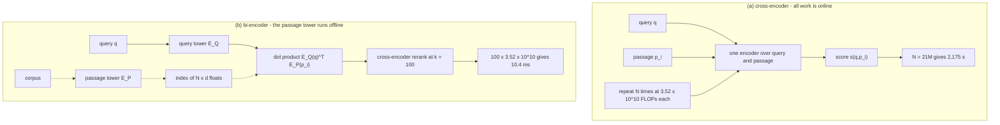
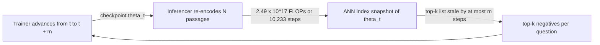
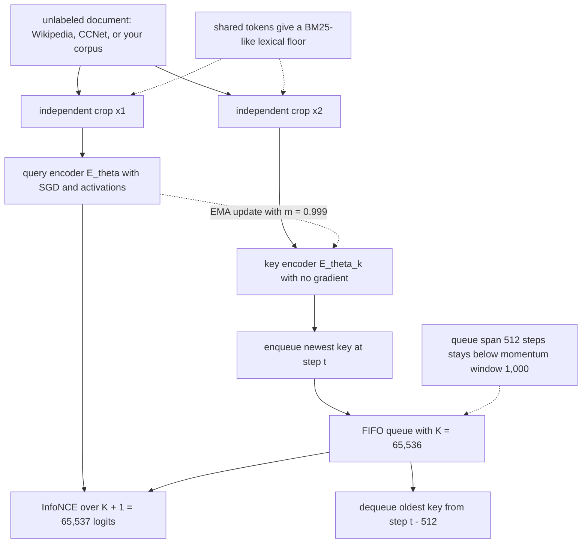
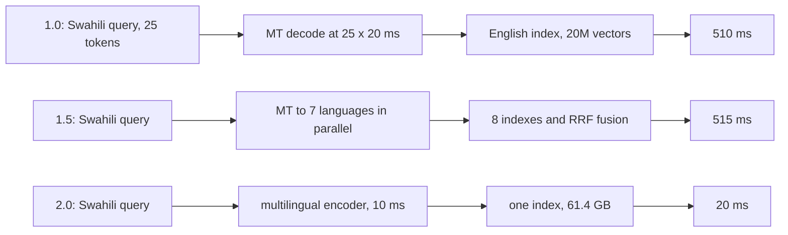

# 20. Dense Retrieval

This chapter prepares a Retrieval-Augmented Generation (RAG) candidate to explain dense retrieval, train it, price it, combine it with lexical search, and extend it across languages.

## TL;DR

- A cross-encoder reads each query and passage together. A bi-encoder encodes passages offline, so it can search 21,015,324 passages in 32 ms instead of cross-encoding them for 36 minutes per query.
- Dense Passage Retrieval (DPR) replaces missing query-passage attention with a contrastive loss. At batch size 128, in-batch sampling gives each question 255 negatives for 128 times fewer passage encodings than independent sampling.
- Best Matching 25 (BM25) wins on rare exact strings. Dense retrieval wins on paraphrases. Their competence moves in opposite directions as document frequency changes, so a hybrid protects both regimes.
- Approximate Nearest Neighbor Negative Contrastive Estimation (ANCE) mines the model's own near misses. A negative one nat below the positive carries 1,097 times the gradient weight of one eight nats below it.
- Unsupervised retrieval can create a positive pair from two independent crops of one document. Momentum Contrast (MoCo) then keeps 65,536 first-in, first-out (FIFO) queued negatives in 201 MB instead of paying 3.40 TB for in-batch activations.
- Cross-lingual retrieval needs more than a multilingual encoder. Language centroids can outrank meaning, so subtract per-language means and draw negatives from the positive's language.
- The production pattern is broad candidate generation with dense and sparse signals, followed by cross-encoder reranking at a shallow depth. The architecture decision is where to hand off, not which model to discard.

## The story

Imagine a parcel-sorting hub that must route millions of parcels whenever a customer asks for one. The cross-encoder is a careful clerk who opens the request and one parcel together, compares every word, and gives that pair a score. The clerk is expressive because each request can inspect each parcel directly. The clerk is also unusable at corpus depth because the inspection repeats for every parcel after every request arrives. The bi-encoder is a pre-sorting crew that stamps every parcel with a 768-number destination card before any customer arrives. At request time, a second crew stamps the request, and a dot product, a simple vector match, finds nearby cards. That speed comes from precomputation, which means doing passage work offline once. It also creates a limit because one fixed card must answer every future request about that parcel. The hub keeps an exact-string lane called BM25, a lexical ranker that scores words the request and parcel share. This lane catches a rare error code because one exact match carries enormous weight. The dense lane catches a paraphrase because nearby meanings can meet even when their words do not. Neither lane replaces the other because the rarest labels are strongest for BM25 and least represented in dense training. Training the dense crew is like showing it the right parcel beside wrong parcels. A contrastive loss, a rule that rewards the positive and pushes down negatives, learns almost nothing from obviously unrelated parcels. A hard negative is a wrong parcel that currently looks nearly right. ANCE, a sampler that searches the model's current approximate nearest neighbor list, keeps feeding those useful near misses back to training. The list must be rebuilt because yesterday's near miss becomes easy after the model learns it. If the hub has no labeled requests, it can cut two windows from the same parcel description and call them a positive pair. Information Noise-Contrastive Estimation (InfoNCE), the loss that distinguishes that pair from queued alternatives, then trains without human labels. MoCo is the slow-moving stamp machine that keeps old parcel cards comparable while a large FIFO queue supplies many cheap negatives. The queue expands what the loss can certify, but stale cards limit its useful size before memory does. Now the hub opens in several languages. A multilingual card can spend too much of its length on a language stamp instead of the parcel's meaning. That language centroid, the average direction for one language, gives same-language parcels a free score even when they are wrong. The hub subtracts each language's average stamp and samples wrong parcels from the same language, so the model must learn meaning rather than language identity. The complete hub therefore pre-sorts with dense vectors, preserves the exact-string BM25 lane, mines current near misses during training, uses a queue when labels are absent, removes language bias, and asks the careful clerk to rerank only the short final union.

## Decoder table

| Technical term | Plain-English meaning | Why it matters |
|---|---|---|
| Retrieval-Augmented Generation (RAG) | A system that retrieves evidence before generating an answer | Retrieval quality limits what evidence the generator can use |
| dense retrieval | Retrieval with learned continuous vectors | It can match meaning across different wording |
| sparse retrieval | Retrieval with term-based sparse features | It preserves exact lexical evidence |
| Best Matching 25 (BM25) | The chapter's lexical term-matching ranker | It is strong on rare strings and exact overlap |
| cross-encoder | One encoder that reads a query and passage jointly | It provides rich token-level conditioning at high online cost |
| bi-encoder | Separate query and passage encoders whose outputs meet in a score | It allows passage vectors to be built offline |
| Bidirectional Encoder Representations from Transformers (BERT) | The encoder family used in the chapter's cost examples | Its parameter and token counts set the compute arithmetic |
| Dense Passage Retrieval (DPR) | A supervised two-tower dense retriever | It supplies the main loss, batch geometry, and benchmark results |
| query tower E_Q | The encoder that maps a query to one vector | It runs once per request |
| passage tower E_P | The encoder that maps each passage to one vector | It runs offline and binds the index to its weights |
| dot product | The sum of matching vector coordinates | It joins independently computed query and passage vectors cheaply |
| conditioning | Letting a representation depend on the current query | A bi-encoder gives this up at passage-encoding time |
| embedding dimension d | The number of stored values in each vector | It controls index memory and bandwidth cost |
| corpus size N | The number of passages searched | It multiplies full-scan and re-encoding cost |
| parameter count P | The number of encoder parameters | The book uses it to estimate forward-pass FLOPs |
| floating-point operations (FLOPs) | A count of arithmetic work | It makes architecture costs comparable |
| floating-point operations per second (FLOP/s) | Sustained arithmetic throughput | It converts work into a lower-bound time |
| fp32 | Four-byte floating-point storage | It makes the 21M-vector index 64.6 GB |
| fp16 | Two-byte floating-point storage | It halves flat-index memory and bandwidth time in the example |
| high-bandwidth memory (HBM) | Accelerator memory with very high transfer bandwidth | Flat dense search is limited by reading vectors from it |
| memory-bound | Limited by bytes moved rather than arithmetic | More FLOP/s does not improve the cited flat scan |
| approximate nearest neighbor (ANN) search | A fast search that visits only part of the vector index | It lowers dense candidate retrieval into low milliseconds with recall cost |
| hierarchical navigable small world (HNSW) | The graph ANN method used in the worked designs | It replaces a linear scan with a graph walk |
| reranker | A second-stage model that rescores a small candidate set | It restores cross-encoder conditioning where it can affect the top results |
| candidate depth k | The number of passages sent to a later stage | It determines reranking cost and first-stage recall requirements |
| top-k | The first k results under a score | It defines mining pools and candidate handoff depth |
| recall@k | The fraction of questions whose answer survives in the first k results | It is the first-stage metric because lost answers cannot be recovered |
| normalized discounted cumulative gain at 10 (nDCG@10) | A top-ranked-list quality metric at depth 10 | It is appropriate for the precision-focused second stage |
| softmax | A normalization that turns scores into competing weights | DPR uses it to favor the positive over all negatives |
| negative log-likelihood | The loss from taking the negative log of positive probability | It is DPR's contrastive training objective |
| positive passage | A passage judged relevant to a query | It is the target the loss must rank above negatives |
| negative passage | A passage treated as irrelevant to a query | Its difficulty determines useful gradient signal |
| in-batch negative | Another example's passage reused as a negative | It gives many negatives without extra encodings |
| hard negative | A wrong passage with a score near the positive | It contributes far more gradient than an easy negative |
| static BM25 negative | A lexical near miss mined once before training | It starts useful but becomes stale as the model changes |
| self-mined negative | A near miss retrieved by the current dense model | It tracks the model's current confusion |
| false negative | A relevant passage that lacks a positive label | Pushing it down teaches the retriever the wrong behavior |
| cross-encoder filtering | Using a joint model to reject likely unlabeled positives from mined negatives | RocketQA uses it to protect sparse relevance labels |
| Sentence-BERT | A symmetric sentence-similarity training recipe | Its objective transfers poorly to asymmetric retrieval in the cited comparison |
| Stanford Natural Language Inference (SNLI) | The entailment dataset named in the Sentence-BERT recipe | It supplies symmetric sentence training rather than retrieval asymmetry |
| Semantic Textual Similarity (STS) | A cosine-similarity regression task | It optimizes sentence likeness rather than question-to-passage relevance |
| document frequency n(t) | The number of corpus documents containing term t | It predicts whether BM25 or dense retrieval has the advantage |
| inverse document frequency (IDF) | A larger weight for rarer terms | It makes BM25 strongest on rare exact strings |
| lexical overlap | Exact query terms shared with a passage | BM25 gives no semantic partial credit without it |
| paraphrase | The same meaning expressed with different words | It is the dense retriever's core advantage |
| hybrid retrieval | Combining dense and sparse candidate lists | It covers near-disjoint failure sets |
| WordPiece | The subword tokenization used in the rare-code example | It can represent an identifier as generic fragments rather than one exact code |
| Benchmarking Information Retrieval (BEIR) | The 18-dataset transfer benchmark cited in the chapter | It shows BM25 remains a strong zero-shot baseline out of domain |
| margin Δ | Positive score minus a negative score | Its exponential controls negative gradient weight |
| gradient norm | The size of a sample's parameter update contribution | Sampling in proportion to it minimizes the stated second moment |
| stochastic gradient descent (SGD) | Training by noisy gradient estimates from sampled data | ANCE aims to reduce its sampling variance |
| importance correction | Dividing a sampled gradient by its sampling probability | It keeps the one-sample estimator unbiased |
| descent lemma | The smooth-objective bound used for one SGD step | It isolates the second moment that sampling can reduce |
| second moment | Expected squared size of the sampled gradient estimator | The optimal negative distribution minimizes it |
| Cauchy-Schwarz inequality | The inequality used to solve the sampling allocation | Equality gives probability proportional to gradient norm |
| Approximate Nearest Neighbor Negative Contrastive Estimation (ANCE) | Periodic self-mining from an ANN index built by a recent checkpoint | It keeps negatives hard as parameters move |
| negative stagnation | Exponential loss of usefulness in a fixed mined set | It motivates periodic index refreshes |
| checkpoint θ_t | A saved parameter state at training step t | The mining index is a snapshot of its embedding space |
| RocketQA | The cited system that filters mined negatives with a cross-encoder | It addresses unlabeled positives in sparse judgments |
| asynchronous refresh | Rebuilding the mining index on separate workers | It avoids blocking the trainer for minutes or hours |
| Microsoft Machine Reading Comprehension (MS MARCO) | The passage corpus and training set used in several examples | Its size anchors mining, information, and memory calculations |
| unsupervised dense retrieval | Dense training without labeled query-passage pairs | It is the option for a new corpus with no search logs |
| Contriever | The cited retriever trained from document crops | It manufactures positive pairs without labels |
| independent cropping | Sampling two random spans from one document | It creates a positive pair and may preserve useful token overlap |
| random deletion and masking | Removing words from the cropped views | It keeps the model from stopping at pure lexical matching |
| Inverse Cloze Task (ICT) | Removing a sentence and pairing it with the remainder | Its guaranteed zero overlap discards the cited lexical floor |
| Information Noise-Contrastive Estimation (InfoNCE) | A contrastive loss over one positive and K negatives | Its information lower bound grows only with the negative count |
| mutual information | The amount of query-document dependence the objective can certify | The bound exposes the gap between batch size and corpus identification |
| Momentum Contrast (MoCo) | A queue plus a slowly updated key encoder | It provides many negatives without storing their activations |
| first-in, first-out (FIFO) queue | A buffer that removes the oldest key when adding a new one | It reuses negative vectors across steps |
| query encoder E_θ | The branch trained by SGD with activations retained | It produces the current query representation |
| key encoder E_θk | The branch updated only by momentum | It makes queued keys change slowly enough to remain comparable |
| exponential moving average (EMA) | The update θ_k = mθ_k + (1-m)θ | It sets the key encoder's effective averaging window |
| momentum m | The weight placed on the previous key encoder | It controls queue staleness and maximum useful queue size |
| queue span K/B | The age in steps of the oldest queued key | It must stay below the momentum window |
| no_grad | Forward computation without gradient storage | It makes queued keys far cheaper than in-batch negatives |
| activation | An intermediate value retained for backpropagation | Large batches cost terabytes because activations scale with samples |
| temperature τ | The divisor that sharpens contrastive logits | A sufficiently small value keeps the finite-score loss floor feasible |
| loss floor | The smallest possible loss under bounded cosine scores | If it is high, training cannot satisfy the objective |
| GradCache | The cited constant-memory replay method for exact large-batch contrastive gradients | It fixes memory but not the large batch's encoder compute |
| multilingual encoder | One encoder that embeds several languages into a shared space | It removes the online translation requirement |
| cross-lingual retrieval | Retrieving a document written in a different language from the query | Exact lexical overlap can be empty |
| language centroid μ_l | The average embedding direction for language l | It can add a constant same-language ranking advantage |
| semantic residual r(t) | The part of an embedding intended to carry meaning | Centering leaves this component up to monotone scaling |
| centroid strength α | The share of embedding norm spent on language identity | Above the derived threshold, language can dominate semantics |
| centroid cosine c | The cosine between two language means | It controls the cross-language bias term |
| mean-centering | Subtracting each language's mean embedding before indexing | It removes the additive language direction in the model |
| same-language negative sampling | Drawing negatives from the positive passage's language | It prevents language identity from becoming a free discriminator |
| curse of multilinguality | Capacity competition when a fixed model covers more languages | Adding languages can eventually hurt all languages |
| Cross-lingual Language Model RoBERTa (XLM-R) | The cited model trained on 100 languages | It illustrates the fixed-capacity multilingual trade-off |
| multilingual BERT (mBERT) | The cited multilingual BERT encoder | Centroid subtraction improved its cross-lingual sentence retrieval |
| Language-Agnostic Retrieval Question Answering (LAReQA) | A benchmark built to expose language bias | It separates translation ability from retrieval geometry |
| multilingual MS MARCO (mMARCO) | Translated MS MARCO training data | It shows translated supervision can work but inherits English query structure |
| multilingual DPR (mDPR) | DPR extended across languages | English-only training underperforms BM25 on most cited Mr. TyDi languages |
| Mr. TyDi | A multilingual retrieval benchmark with native-speaker queries | It is a more honest cross-lingual test than translated queries |
| Multilingual Information Retrieval Across a Continuum of Languages (MIRACL) | The cited benchmark spanning 18 languages | Its queries are written by native speakers |
| machine translation (MT) | Converting text from one language into another | Query translation adds autoregressive decoding to the critical path |
| reciprocal rank fusion (RRF) | Combining result lists by rank positions | Per-language indexes need this extra stage in the example |
| fertility | Tokenizer tokens per word | High fertility creates more chunks with less context |
| 95th-percentile latency (p95) | The response time below which 95 percent of requests finish | The translation designs miss the stated service budget |
| remote procedure call (RPC) | A network call to an encoder service | It dominates the cited multilingual query-encoding time |
| blue-green index cutover | Holding old and new indexes during model replacement | It doubles index storage during a safe transition |
| `q`, `p`, and `s(q,p)` | Query, passage, and their relevance score | They name the two retrieval inputs and the value used to rank them |
| `L_q` and `L_p` | Query and passage token lengths | They set the online encoding work in the corpus-depth calculation |
| `b` in `N x d x b` | Bytes stored per embedding coordinate | It converts a vector count into index memory |
| `B` | Number of query-positive examples in one batch | It sets the in-batch negative pool and queue turnover rate |
| `M` and `K` | Negative count in the margin derivation and queue size in MoCo | They size the contrastive denominator in their respective sections |
| `s+`, `s_j-`, `Delta_j`, and `Z` | Positive score, negative score, margin, and softmax normalizer | They expose the exponential weight assigned to each negative |
| `g`, `g_j`, and `g_hat` | Exact gradient, one negative's contribution, and sampled estimator | They define the variance-optimal sampling argument |
| `p_j` and `p_j*` | Sampling probability and its optimum | The optimum is proportional to gradient norm |
| `eta` and smoothness constant `L` | Step size and objective smoothness | They appear in the one-step descent bound |
| `I(q;p)` and `L_InfoNCE` | Mutual information and the InfoNCE loss | Their bound limits what a finite negative pool can certify |
| `s`, `h`, and `a` in activation accounting | Sequence length, hidden width, and attention-head count | They determine retained training activations per layer |
| `K/B` and `1/(1-m)` | Queue age and momentum averaging window | Their comparison bounds useful queue size before memory does |
| `f_theta`, `E_Q`, and `E_P` | Joint scorer, query tower, and passage tower | They distinguish online pair conditioning from offline passage encoding |
| `theta`, `theta_t`, and `theta_k` | Current, checkpointed, and momentum-key parameters | They make mining drift and queue staleness explicit |
| BM25 `k_1` and `b_BM25` | Term-frequency saturation and length-normalization controls | Tuning them cannot create cross-language lexical overlap |

## Core mechanics

### 20.1 Bi-encoders, DPR, and the efficiency-expressiveness trade

#### Joint scoring versus independent scoring

**What:** A cross-encoder scores the concatenated query and passage.
$$
s(q,p) = f_θ([q;p])
$$
**What:** A bi-encoder scores two independently computed vectors.
$$
s(q,p) = E_Q(q)^T E_P(p)
$$
**Why:** E_P(p) does not depend on the query, so the passage tower can run once, offline.

**Failure without it:** Full-corpus joint scoring waits for the query and repeats one encoder pass N times.

**Trade-off:** The bi-encoder gives up conditioning, not parameter capacity.

One 768-dimensional passage vector must support every future question about that passage. The cross-encoder instead computes all 32 × 128 = 4,096 query-token by passage-token attention interactions with the query present.

#### Corpus-depth arithmetic

The chapter uses the two-P FLOPs-per-token rule with BERT-base at P = 110M, L_q = 32, and L_p = 128.
$$
2P(L_q + L_p) = 2 × 1.10 × 10^8 × 160 = 3.52 × 10^{10} FLOPs
$$
$$
2PL_q = 7.04 × 10^9 FLOPs
$$
For N = 21,015,324 passages, the full cross-encoder and bi-encoder arithmetic are:
$$
3.52 × 10^{10} × 2.10 × 10^7 = 7.40 × 10^{17} FLOPs
$$
$$
7.04 × 10^9 + 2 × 768 × 2.10 × 10^7 = 3.93 × 10^{10} FLOPs
$$
**Why:** The factor is 1.9 × 10^7, which is seven orders of magnitude.

**Cost:** At 3.4 × 10^14 FLOP/s, full cross-encoding takes 2,175 s, or 36 minutes, for one query.

**Claim limit:** This time uses the book's sustained-throughput assumption.

#### DPR loss and in-batch negatives

**What:** DPR trains one question q_i, one gold passage p_i+, and negatives p_i,j- with a softmax over dot products.
$$
L(q_i) = -log(
exp(E_Q(q_i)^T E_P(p_i+)) /
[exp(E_Q(q_i)^T E_P(p_i+)) + Σ_j exp(E_Q(q_i)^T E_P(p_i,j-))]
)
$$
**Why:** The loss pushes query-passage interaction into training because inference deleted direct token interaction.

**Sampling method:** In a batch of B question-positive pairs, every other passage is reused as a negative.

DPR uses B = 128 and one BM25 hard negative per question. The passage pool is 2B = 256, so each question sees 2B - 1 = 255 negatives. Independent sampling would require 128 × 255 = 32,640 passage encodings per step instead of 256. The savings factor is exactly B = 128.

**Failure without useful negatives:** The training objective becomes easy while live-corpus recall stays poor.

#### Retrieval is not symmetric sentence similarity

**What:** Sentence-BERT trains on SNLI cross-entropy and mean-squared error over STS cosine similarity.

**Why it loses here:** A 10-word question and a 100-word passage need not look alike to be relevant.

**Comparison:** DPR trains separate E_Q and E_P towers on this asymmetry.

It reaches 78.4% top-20 accuracy on Natural Questions against BM25 at 59.1%. The gap is 19.3 percentage points on the same corpus.

**Claim limit:** This comparison applies to the cited Natural Questions setup and does not establish universal dominance.

#### Worked deployment configurations

The setting is N = 21,015,324 Wikipedia passages of 100 words, d = 768, fp32, BERT-base towers, a 32-token question, and a 50 ms budget.

**Configuration 1:** A full cross-encoder pays 7.40 × 10^17 FLOPs and 2,175 s.

It misses the budget by 4.4 × 10^4. Batching cannot change this asymptote.

**Configuration 2:** A flat bi-encoder index occupies:
$$
2.10 × 10^7 × 768 × 4 = 6.46 × 10^{10} bytes = 64.6 GB
$$
The dot products cost 3.23 × 10^10 FLOPs, or 95 μs of arithmetic. Streaming 64.6 GB at 2.0 TB/s takes 32 ms. The scan is memory-bound by a factor of 340. Halving d halves latency in this case, while doubling FLOP/s does nothing.

**Configuration 3:** HNSW visits a few thousand vectors, then a cross-encoder reranks k = 100.

The reranker pays 3.52 × 10^12 FLOPs, or 10.4 ms. The total is roughly 15 ms. Moving the same cross-encoder from corpus depth to depth 100 cuts its cost by 2.1 × 10^5.

**Published sanity check:** DPR reports 995 questions per second over its 21M-vector Facebook AI Similarity Search (FAISS) index.

BM25 on Lucene reports 23.7 questions per second. The DPR result is 1.01 ms per question end to end. The derived query encoding floor is 20.7 μs, or about 2% of that budget. The agreement supports the limited conclusion that the index, not query-encoder arithmetic, is the bill in this setup.

#### Practical boundaries

Use bi-encoder retrieval before cross-encoder reranking. A 50 ms budget at 3.52 × 10^10 FLOPs per pair buys about 480 pairs. A corpus below roughly 500 documents can therefore be cross-encoded outright under these constants. Fine-tune separate towers on in-domain query-positive pairs. With fewer than roughly 1,000 labeled pairs, the chapter prefers an unsupervised retriever over a badly fine-tuned one. Treat batch size as a negative-sampling budget. Moving B from 8 to 128 moves each query from 15 to 255 negatives. Use a shared tower for symmetric tasks such as deduplication, near-duplicate detection, or paraphrase search. Price the index as N × d × b. The cited 64.6 GB fp32 index becomes 32.3 GB in fp16. Evaluate the first stage with recall@k and the second with nDCG@10. A first-stage answer ranked 87th at depth 100 has survived. A missing answer cannot be repaired by a reranker.

#### Re-indexing when the model changes

Precomputed passage vectors are bound to the exact E_P weights that made them. For 500M chunks at 256 tokens, re-encoding costs:
$$
2 × 1.10 × 10^8 × 256 × 5 × 10^8 = 2.82 × 10^{19} FLOPs
$$
That is 8.3 × 10^4 s, or 23 hours, on one accelerator and under two hours on twelve under the chapter's throughput model. The 768-dimensional fp32 index is 1.54 TB. A blue-green cutover needs 3.1 TB plus a dual-write ingest window.

**Decision boundary:** If shadow evaluation moves recall@100 by less than the evaluation noise band, the rebuild buys no demonstrated benefit.

### 20.2 Where dense wins and where BM25 wins

#### Opposite dependence on document frequency

**What:** BM25 scores only query terms present in the document.

Its inverse document frequency is:
$$
IDF(t) = log((N - n(t) + 0.5)/(n(t) + 0.5)) + 1
$$
**Why:** A rarer exact term receives a larger weight.

**Failure without overlap:** A missing term contributes exactly zero, even when a synonym carries the right meaning.

On the 21,015,324-passage corpus, n(t) = 3 gives:
$$
log((2.1015 × 10^7 - 3 + 0.5)/3.5) + 1 = log(6.00 × 10^6) + 1 = 16.61 nats
$$
At n(t) = 10^5, the weight is log(209.2) + 1 = 6.34 nats. The rare term receives 2.6 times the weight.

#### Dense supervised exposure

**What:** Dense competence on a surface form depends on seeing useful supervised examples.

With 5.888 × 10^4 Natural Questions training pairs, the expected exposure for n(t) = 3 is:
$$
5.888 × 10^4 × 3/(2.1015 × 10^7) = 8.4 × 10^{-3}
$$
That is about one chance in 119 of seeing the term under supervision. At n(t) = 10^5, the same arithmetic gives 280 training pairs.

**Why:** Dense training is strongest on frequent semantic patterns.

**Failure:** New stock-keeping units, ticket identifiers, version strings, and names remain in the open-ended Zipfian tail after the training cutoff.

**Comparison:** BM25 weight falls while dense exposure rises as n(t) increases.

The exact curves cross near n(t) ≈ 3.9 × 10^3 for the cited corpus and training set.

#### Paraphrase and rare-string regimes

Dense retrieval can connect a question about the body of water between Ireland and Great Britain to a passage naming the Irish Sea and North Channel. BM25 can fail if the answer passage does not repeat the query terms. BM25 can retrieve a rare named entity or error code from one occurrence because its IDF dominates the sum. A dense model can collapse many rare codes into one topical neighborhood.

**Failure of the bigger-model alternative:** Raising d adds capacity but does not add missing occurrences.

Thakur et al. report BM25 as a strong zero-shot baseline that most dense retrievers failed to beat across 18 BEIR datasets out of domain.

**Claim limit:** The chapter uses this as a transfer result, not a claim that BM25 wins every dataset.

#### Enterprise support worked example

The example uses N = 2,000,000 documents, d = 768, and both dense and BM25 indexes. For a query about a single sign-on (SSO) certificate, the relevant title uses Security Assertion Markup Language (SAML) assertion and signing-key language. With no shared content term, BM25 assigns zero to that document. The dense retriever ranks it first in the constructed example. For the Secure Sockets Layer (SSL) query `ERR_SSL_5417 remediation`, the code appears in n(t) = 4 documents.
$$
log((2 × 10^6 - 4 + 0.5)/4.5) + 1 = log(4.444 × 10^5) + 1 = 14.00 nats
$$
`remediation` at n(t) = 2 × 10^5 receives log(9.00) + 1 = 3.20 nats. The code supplies 14.00/(14.00 + 3.20) = 81% of the query weight. BM25 retrieves all four matches within top 20, so recall@20 is 100% by construction. If 1,800 codes occupy one dense neighborhood, random selection gives recall@20 ≈ 20/1,800 = 1.1%.

**Claim limit:** The 1.1% against 100% split is constructed to expose the mechanism.

#### Hybrid union and benchmark reversal

Take the top 20 from dense retrieval and the top 20 from BM25. The union has at most 40 candidates. Cross-encoder reranking costs 40 × 3.52 × 10^10 = 1.41 × 10^12 FLOPs, or 4.1 ms at 3.4 × 10^14 FLOP/s. Karpukhin et al. report top-20 results of 78.4% for DPR and 59.1% for BM25 on Natural Questions. On the Stanford Question Answering Dataset (SQuAD), DPR scores 63.2% and BM25 scores 68.8%. The reversal is 5.6 percentage points. The authors attribute it to SQuAD annotators writing questions while viewing passages, which increases lexical overlap.

**Decision boundary:** Collection process can make a benchmark recommend the wrong retriever for a different query process.

#### Practical boundaries

Keep BM25 when dense retrieval launches unless production logs show essentially no identifiers, names, quoted strings, or codes. Segment evaluation by the rarest content term's document frequency. If corpus statistics are missing, separate queries with and without non-dictionary tokens. Try hybrid retrieval before doubling d from 768 to 1,536. Set sparse depth near 20 for exact hits and dense depth around 50 to 100 for semantic drift. With a fixed reranker budget, the chapter cuts dense depth first because existing sparse hits are already near-certain. Track zero-hit sparse queries and dense results with empty lexical overlap separately. For a verbatim-containment guarantee, route quoted strings and non-dictionary tokens through sparse retrieval with a hard containment filter. Dense scoring alone cannot guarantee term containment.

### 20.3 Hard negatives, gradient norm, and ANCE

#### Margin form of the contrastive loss

Let s+ be the positive score, s_j- a negative score, and Δ_j = s+ - s_j-. The DPR loss becomes:
$$
L = log(1 + Σ_{j=1}^{M} e^{-Δ_j})
$$
With Z = 1 + Σ_j e^-Δ_j:
$$
∂L/∂s_j- = e^{-Δ_j}/Z
$$
$$
∇_θ L_j = (e^{-Δ_j}/Z) ∇_θ s_j-
$$
**What:** A negative's gradient norm is proportional to e^-Δ_j.

**Why:** Hardness changes learning signal exponentially, not linearly.

A negative at Δ = 8 has weight e^-8 = 3.35 × 10^-4. A negative at Δ = 1 has weight e^-1 = 3.68 × 10^-1. The ratio is e^7 = 1,097.

**Failure without hard negatives:** A near-zero loss can report an easy task rather than a good retriever.

#### Variance-optimal sampling

Let g be the exact gradient across M negatives. Sample negative j with probability p_j and use g_hat = ∇_θ L_j/p_j. The estimator remains unbiased for any p. For an L-smooth objective and step size η, the descent lemma gives:
$$
E[f(θ_{t+1})] ≤ f(θ_t) - η||g||^2 + η^2 L E[||g_{hat}||^2]/2
$$
The sampler controls:
$$
E[||g_{hat}||^2] = Σ_j ||g_j||^2/p_j
$$
Cauchy-Schwarz gives equality at:
$$
p_j^* = ||g_j|| / Σ_i ||g_i||
$$
Since norm(g_j) is proportional to e^-Δ_j, the optimal sampler is the model's own ranked retrieval list.

**Claim limit:** The result is derived for the stated importance-corrected estimator and smooth-objective bound.

#### Dynamic mining with ANCE

**What:** ANCE builds an ANN index from a recent checkpoint and retrieves top candidates as negatives.

**Why:** The hardest useful negative depends on current parameters θ_t.

**Failure of static mining:** A fixed negative moves from Δ = 1 toward Δ = 4 as the model learns it.

That drift loses e^3 = 20.1 times its gradient weight at unchanged training cost. The chapter calls this negative stagnation. A BM25 near miss at Δ = 4 has weight 1.83 × 10^-2. It is e^4 = 54.6 times stronger than a random Δ = 8 negative. It is still e^3 = 20.1 times weaker than a top-ANN Δ = 1 negative. Matching one top-ANN negative with random examples would require e^7 = 1,097 of them. DPR's B = 128 would rise to B = 140,416 before the unnormalized weights are comparable. Bootstrap the first epoch with BM25 negatives, then switch to self-mining once the retriever beats BM25 on a held-out slice.

#### False negatives and RocketQA

Top retrieval results can contain unlabeled positives because one-positive judgments are sparse. Treating them as negatives pushes correct answers away. RocketQA filters mined candidates through a cross-encoder and keeps only candidates scored confidently irrelevant. Use this filter when positives are one-per-question rather than exhaustive.

#### MS MARCO worked example

The example uses N = 8,841,823 passages, P = 110M, d = 768, B = 128, 255 in-batch negatives, and one mined slot.

**Configuration 1:** With 255 negatives at Δ = 8, total unnormalized weight is 255 × 3.35 × 10^-4 = 0.0855.

Z = 1.0855. The loss is log(1.0855) = 0.0821 nats. Negatives carry 0.0855/1.0855 = 7.88% of the step.

**Configuration 2:** Add one static BM25 negative at weight 0.0183.

Z = 1.1039, loss is 0.0988 nats, and negative mass is 9.41%. This is a 1.19 times improvement in gradient mass over Configuration 1.

**Configuration 3:** Add one top-ANN negative at weight 0.3679.

Z = 1.4534, loss is 0.374 nats, and negative mass is 31.2%. That is 3.96 times Configuration 1. The single hard negative carries 25.3% of the whole step. Each in-batch negative carries 0.023%. The optimal distribution assigns the hard negative 0.3679/0.4534 = 81.1% of sampling budget. Uniform sampling assigns 1/256 = 0.39%. The informative example is undersampled by 208 times.

#### Refresh cost and cadence

Re-encoding one 128-token passage costs 2PL_p = 2.816 × 10^10 FLOPs. The full MS MARCO corpus costs 2.49 × 10^17 FLOPs. At 3.4 × 10^14 FLOP/s, the floor is 732 s. One training step costs:
$$
6P × (128 × 32 + 256 × 128) = 2.43 × 10^{13} FLOPs
$$
That step takes 0.0716 s under the same throughput model. One refresh therefore equals 10,233 training steps. Refreshing every 10,000 steps roughly doubles training compute and changes query-time cost by zero. For DPR's 21,015,324-passage index, the same lower bound is 5.92 × 10^17 FLOPs, or 29 minutes. Karpukhin et al. report about 8.8 hours on 8 graphics processing units (GPUs), which is 18 times the stated FLOP floor on 2020-era hardware.

**Claim limit:** The derived time is a lower bound, while the reported run includes real hardware and system overhead.

Run refresh asynchronously on separate workers. Log the mined margin and refresh after mean Δ grows by about 3 nats. If cadence must be fixed, keep refresh compute under half of training compute. For this corpus, that means no tighter than every 20,000 steps.

#### Large-corpus boundary

For 500M chunks, a refresh costs 1.41 × 10^19 FLOPs, or about 11.5 hours. A batch of 32,768 random Δ = 8 negatives carries 32,768/1,097 = 29.9 top-ANN equivalents of unnormalized weight. It still pays activation memory and spreads signal over near-identical easy directions. Mining from a 10% corpus sample costs 1.41 × 10^18 FLOPs, or 1.15 hours. The chapter says the k-th hardest sample passage approximates the 10k-th hardest overall at this corpus size. This is a proposed compromise, not a reported experiment.

### 20.4 Unsupervised dense retrieval: Contriever and MoCo

#### What labels supplied

DPR's label identifies the positive passage. Its negatives were sampled rather than labeled. Contriever creates the missing positive by independently cropping two spans from one document. The crops may overlap. Shared tokens create a BM25-like lexical floor, while random deletion and masking stop learning from ending there.

**Failure of direct transfer:** On BEIR, transferred dense retrievers lose to BM25 on most out-of-domain collections in the cited result.

MS MARCO has 502,939 training queries for 8,841,823 passages. That is about one labeled query per 17.6 passages. Matching that density for a new 8M-document corpus is a large labeling project.

#### InfoNCE information ceiling

With K negatives, the bound is:
$$
I(q;p) ≥ log(K + 1) - L_{InfoNCE}
$$
**What:** The objective can certify at most log(K + 1) nats.

**Why:** Without labels, random negatives cannot be mined against known query-positive pairs, so count is the remaining lever.

DPR's B = 128 gives log2(128) = 7.00 bits. Identifying one passage among 8,841,823 needs log2(8,841,823) = 23.08 bits. The affordable batch is about 16 bits short.

#### Activation cost versus a queue

For sequence length s, hidden size h, attention heads a, and half precision, the cited per-layer activation accounting is s × h × (34 + 5as/h) bytes. For a 128-token BERT-base passage with h = 768, a = 12, and 12 layers:
$$
128 × 768 × (34 + 5 × 12 × 128/768) × 12 = 51,904,512 bytes = 51.9 MB
$$
Holding 65,536 such passage activations costs 3.40 TB. A queued d = 768 fp32 key costs 768 × 4 = 3,072 bytes. The same 65,536 keys cost 201 MB. The queue is 16,900 times cheaper for the same negative count.

**Trade-off:** It discards backpropagation through queued negatives.

The chapter argues this is cheap because random negatives already have nearly zero weight.

#### MoCo's two-timescale condition

MoCo enqueues new keys and removes the oldest keys first. The key encoder follows the query encoder by EMA:
$$
θ_k ← mθ_k + (1-m)θ
$$
The effective momentum window is 1/(1-m) steps. The oldest key is K/B steps old. The design condition is:
$$
K/B ≲ 1/(1-m)
$$
**Why:** The key encoder must change more slowly than the queue turns over.

**Failure:** He et al. report failure to converge at m = 0, where the momentum window is one step.

#### Temperature as a feasibility condition

With unit-norm embeddings, cosine scores lie between -1 and 1. The largest possible margin is 2. The finite-score loss floor is:
$$
log(1 + K e^{-2/τ})
$$
At τ = 1 and K = 65,536, the floor is 9.09 nats. At MoCo's τ = 0.07, the floor is 2.6 × 10^-8 nats. Keeping it below 0.01 nats requires:
$$
τ ≤ 2/log(100K)
$$
For K = 65,536, τ must be at most 0.127. The chapter moves toward τ = 0.01 only for sharper reranker-distillation targets and warns of gradient-scale instability.

**Failure without this check:** The loss curve can reflect bounded score geometry rather than model quality.

#### Three negative-pool configurations

The setting uses P = 110M, d = 768, 12 layers, h = 768, a = 12, 128-token crops, and 32-token queries.

**Configuration 1:** B = 128 gives 127 negatives and a 7.00-bit ceiling.

The activations are 128 × 51.9 MB plus 128 × 10.8 MB = 8.0 GB. The source says this is why DPR's B = 128 fit across 8 V100 GPUs.

**Configuration 2:** B = 65,536 raises the ceiling to 16.0 bits.

It needs 3.40 TB for passage activations, equal to 106 devices with 32 GB each, before other tensors. Encoder FLOPs rise 512 times per step.

**Configuration 3:** K = 65,536, B = 128, and m = 0.999 give the same 16.0-bit ceiling in 201 MB.

The queue spans 512 steps. The momentum window is 1,000 steps. The headroom is 1.95 times. The forward-only momentum branch is 2/(6 + 2) = 25% of the step. Training costs 1.33 times a queue-free run. The query branch costs 1.08 × 10^13 FLOPs and the key branch costs 3.60 × 10^12 FLOPs. The large batch buys the same 16.0 bits at 512 times cost. The queue is 512/1.33 = 384 times cheaper per bit under this comparison.

#### Staleness binds before memory

He et al. use K = 65,536, B = 256, and m = 0.999. The queue span is 256 steps against a 1,000-step momentum window. The headroom is 3.9 times. At m = 0, the one-step window violates the condition 256-fold. Queueing all 8,841,823 passages costs 27.2 GB but spans 69,077 steps. It would require m at least 0.99999. The resulting key encoder would be a near-frozen average of an untrained network. At B = 128 and m = 0.999, K is capped at 128,000 by the condition. Raising m to 0.9999 permits a queue 10 times larger but makes the key encoder lag 10 times further.

#### Practical and experimental boundaries

Use independent cropping rather than ICT unless the corpus has a natural title-body or question-body pair. ICT removes one sentence and pairs it with the remainder, which guarantees zero token overlap and discards the cited lexical floor. Use unsupervised pre-training as an initializer when any labels exist. Izacard et al. report that fine-tuning Contriever beats fine-tuning raw BERT on MS MARCO and BEIR transfer. They also report unsupervised Contriever beating BM25 on recall@100 on 11 of 15 BEIR datasets. BM25 remains the stronger precision-oriented ranker on average in that comparison.

**Claim limit:** Recall@100 is the chosen metric because this retriever feeds a reranker.

For direct retrieval, top-of-list precision matters instead. The key encoder is discarded after training, so the serving index and latency match a supervised bi-encoder. GradCache can compute exact large-batch contrastive gradients in constant memory by caching representation-level gradients and replaying the encoder. It takes roughly double the forward passes and does not remove the large batch's compute cost.

### 20.5 Cross-lingual and low-resource retrieval

#### Why lexical retrieval returns zero

BM25 sums scores only over shared query-document terms. For an Arabic query and an English passage, the overlap can be empty. Every passage then receives exactly zero, and a tie-break determines the ranking.

**Failure:** Tuning BM25 parameters cannot create missing overlap.

Keep lexical retrieval within a language or for tokens that survive languages unchanged, such as product codes and Latin-script proper nouns.

#### Language centroid model

For a unit-norm text embedding in language l:
$$
e(t) = α μ_l + sqrt(1-α^2) r(t)
$$
Here μ_l is a unit language direction, r(t) is a unit semantic residual, and α is the norm share spent on language identity. The residual is assumed orthogonal to every centroid and averages to zero within a language. For query language a and document language b:
$$
e(q)^T e(d) = α^2 μ_a^T μ_b + (1-α^2)s
$$
Here s = r(q)^T r(d), and c = μ_a^T μ_b for different languages. A cross-language positive at s+ must beat a same-language distractor at s-. That requires:
$$
(1-α^2)(s+ - s-) > α^2(1-c)
$$
Equivalently:
$$
α^2 < (s+ - s-)/[(s+ - s-) + (1-c)]
$$
At s+ = 0.9, s- = 0.1, and c = 0.5, α^2 must be below 0.8/1.3 = 0.615. Thus α must be below 0.78. At α = 0.9, the best cited cross-language score is 0.81 × 0.5 + 0.19 × 0.9 = 0.576. The worst cited same-language score is 0.81 + 0.19 × 0.1 = 0.829. At c = 0, the threshold tightens to α below 0.67.

**Failure:** Language identity can outrank any trainable semantic gap in this model.

#### Mean-centering and sampling fixes

The mean embedding for language l is αμ_l under the stated residual assumptions. Its norm measures α. The cosine between two language means measures c. Embed 1,000 documents per language to estimate both. Subtracting the per-language mean removes αμ_l and leaves (1-α^2)s, a monotone rescaling of semantics. Libovicky et al. report substantially better cross-lingual sentence retrieval after centroid subtraction on mBERT. Roy et al. built LAReQA to measure same-language preference in encoders that still score well on translation ranking. Uniform negatives from an 80% English corpus let a Swahili query use language match as a free discriminator. Draw negatives from the positive passage's language so gradient must reach semantic residuals.

#### Capacity and tokenization

Conneau et al. trained XLM-R on 2.5 TB of CommonCrawl across 100 languages. They call the fixed-capacity competition the curse of multilinguality. Adding languages first helps low-resource languages through sharing, then hurts all languages when they compete for fixed parameters. The stated escape is more capacity and a larger vocabulary. At equal parameter count, the chapter says an encoder trained on the product's eight languages beats a 100-language encoder on those eight. Vocabulary allocation also changes fertility, which is tokenizer tokens per word. At fertility 1.3, a 512-token chunk holds 394 English words. At fertility 3.0, it holds 171 Swahili words. The Swahili leg creates 394/171 = 2.3 times as many chunks with 2.3 times less context per chunk. Set boundaries in words when possible, then cap by the encoder's token window.

#### Translation placement and latency

The worked system has 20M documents, 250 tokens per document, 8 languages, 25-token queries, a 300 ms p95 budget, translation at $1.00 per million output tokens, and decoding at 20 ms per token.

**Configuration 1:** Translate the corpus to English offline.

The volume is 20 × 10^6 × 250 = 5.0 × 10^9 tokens, or 5,000 million. The one-time price is $5,000. At 5% monthly churn, 1M changed documents produce 250M tokens and cost $250 per month. The online 25-token query translation still costs 25 × 20 = 500 ms. Search adds about 10 ms, for 510 ms total.

**Configuration 2:** Keep eight native indexes of 2.5M vectors each and translate the query to seven other languages in parallel.

The critical translation remains 500 ms. Eight ANN probes plus RRF bring the total to 515 ms.

**Configuration 3:** Use one multilingual bi-encoder and one index.

Query encoding costs 2 × 110M × 25 = 5.5 × 10^9 FLOPs. At an effective 50 trillion floating-point operations per second (TFLOP/s), arithmetic takes 0.11 ms. The figure assigns 10 ms to encoding service overhead and about 10 ms to HNSW search. Total latency is 20 ms, which is 25 times faster than the translating designs, with zero translation charge. The 20M by 768 fp32 index is 61.44 GB if chunk counts match the English estimate.

**Claim limit:** Fertility can increase non-English chunk counts, so 61.44 GB is conditional.

#### Cross-lingual evaluation boundaries

Zhang et al. report that English-only mDPR underperforms BM25 on most of Mr. TyDi's eleven languages. Only the BM25-dense hybrid beats both in the cited result. mMARCO translates English queries, so it preserves English question structure. Mr. TyDi has eleven languages with native-speaker queries. MIRACL has eighteen languages with native-speaker queries. Use those native-query benchmarks for the harder and more honest test described by the chapter. Before changing the model, test 50 hand-written Swahili queries with known English answers on recall@100. For a zero-label language, prefer unsupervised cropping before translated labels. When translation is reliable in a high-resource language, translated MS MARCO-style supervision can support hard-negative training.

#### Shared-index design boundary

Default to one multilingual index with per-language mean-centering. Partition by language when language itself is an access-control boundary. If original-language citation is required, keep original documents and their identifiers regardless of retrieval architecture. One proposed synthesis translates the corpus offline and indexes both original and English versions in the multilingual space. It keeps online queries translation-free and doubles the index from 61.4 GB to 122.9 GB. It also stays below the staff scenario's tightened 150 ms p95 budget. This is a design proposal from the chapter, not a reported benchmark.

## Diagrams

### Figure 20.1



> Figure 20.1: The same encoder is unaffordable at corpus depth and cheap at candidate depth: scoring 21M passages with a cross-encoder costs 36 minutes per query, while a bi-encoder answers in 32 ms because its passage tower ran offline - and the cross-encoder then returns as a reranker over 100 candidates for 10.4 ms. Dashed paths are precomputed. Solid paths run per query.

### Figure 20.2

```text
BM25 IDF(t), nats                              log10 training pairs seen
high  16.61 at n(t)=3       X\              /X       280 at n(t)=10^5  high
                              \            /
                               \          /
                                \   X    /         crossover near 3.9 x 10^3
                                 \      /
low                               \____/                               low
       1     10     10^2     10^3     10^4     10^5     10^6     10^7
       <--------- BM25 territory | dense territory ------------------->
            solid line falls     | dashed line rises          n(t)
```

> Figure 20.2: Both curves are exact for a 21,015,324-passage corpus and a 5.888 × 10^4-pair training set, and they run in opposite directions against the same variable: BM25's per-term weight falls as document frequency rises, while the dense encoder's supervised exposure to that term rises. They cross near n(t) ≈ 3.9 × 10^3, which is why neither method dominates and why the two error sets barely overlap.

### Figure 20.3

| Negative type | Margin Δ | Per-negative weight e^-Δ |
|---|---:|---:|
| top-ANN negative | 1 | 3.68 × 10^-1 |
| static BM25 negative | 4 | 1.83 × 10^-2 |
| random in-batch negative | 8 | 3.35 × 10^-4 |

The top-ANN weight is e^7 = 1,097 times the random in-batch weight.



If this loop is cut, mined margins drift from Δ = 1 to Δ = 4 and lose 20.1 times their gradient weight at unchanged training cost.

> Figure 20.3: A negative one nat from the positive carries 1,097 times the gradient weight of one eight nats away, so the sampler that minimizes SGD variance is the model's own retrieval list - and because that list moves as the parameters move, the index must be rebuilt periodically at a cost of roughly 10,233 training steps per refresh.

### Figure 20.4



> Figure 20.4: Two random crops of one document make a positive pair without any label, and a momentum-encoded FIFO queue raises the negative count from 128 to 65,536 - from 7.00 to 16.0 bits of certifiable query-document information - at 201 MB instead of the 3.40 TB of activations the same negatives would cost in-batch.

### Figure 20.5

```text
                         unit sphere
             d+ in English        d- and q in Swahili
                 o                      o  o
                  \                    /  /
                   \ mu_en      mu_sw /  /
                    \              /  /
                     \____ c=0.5 _/  /
alpha = 0.9
same-language distractor = 0.81 + 0.19(0.1) = 0.829
cross-language answer    = 0.81(0.5) + 0.19(0.9) = 0.576
subtracting alpha times the language centroid deletes the first term
```



> Figure 20.5: The language centroid adds a constant α^2 to every same-language score, so at α = 0.9 the worst Swahili distractor (0.829) outranks the best English answer (0.576). Removing the centroid and removing the query-time translation hop are the two independent fixes, worth a correct ranking and a 25 × latency reduction respectively.

## Whiteboard pack

### What to draw

1. Draw a query box and a passage box entering one joint cross-encoder.
2. Label that path N online passes and write 36 minutes for 21M passages.
3. Draw separate query and passage towers.
4. Put the passage tower behind a dotted offline boundary and connect it to a vector index.
5. Connect the query tower to ANN search and write 32 ms for the cited flat scan.
6. Split candidate generation into a dense lane for paraphrases and a BM25 lane for rare exact strings.
7. Merge both lanes into a cross-encoder reranker at depth 100 and write 10.4 ms.
8. Beside training, draw a positive with one near-miss and write gradient weight proportional to e^-Δ.
9. Add the ANCE loop from checkpoint to refreshed index to mined negatives to trainer.
10. Add two document crops, a momentum key encoder, and a FIFO queue for zero-label training.
11. Draw two language centroids, cross out their mean vectors, and label same-language negatives.

### Spoken script

Dense retrieval turns each query and passage into vectors, so passages can be encoded before a query arrives. That makes corpus search practical, but it removes direct query-passage attention and misses rare exact strings that BM25 catches. Training quality therefore depends on informative negatives. ANCE mines the model's current near misses, while Contriever and MoCo learn without labels by cropping documents and keeping many queued negatives. For multilingual search, language identity can dominate meaning, so center each language and sample same-language negatives. In production, retrieve broadly with dense and sparse signals, then let a cross-encoder rerank the short union.

## Interview traps

### 1. If cross-encoders are more accurate, why use a bi-encoder?

A cross-encoder over 21M passages costs 7.40 × 10^17 FLOPs, or 36 minutes under the chapter's throughput assumption. The bi-encoder precomputes passages, searches in 32 ms in the flat example, and still uses the cross-encoder at depth 100 for 10.4 ms.

### 2. Dense retrieval beats BM25 on Natural Questions. When must BM25 stay?

Keep BM25 for rare exact strings, identifiers, codes, quoted text, and any verbatim-containment requirement. Dense exposure falls in the rare tail while BM25's IDF rises, so an aggregate dense win can hide a near-disjoint production failure set.

### 3. A contrastive loss is already 0.08, but recall is flat. What failed?

The negatives are too easy. With 255 negatives at Δ = 8, the loss is 0.0821 nats, while one Δ = 1 near miss carries 1,097 times each negative's weight, so mine current top-ANN candidates and refresh the index as margins drift.

### 4. How do you train dense retrieval with no labeled queries?

Create positives from two independent crops of one document and optimize InfoNCE. Use a MoCo queue to raise the negative count cheaply, but size K so K/B stays below the momentum window 1/(1-m), and set temperature from the finite-score loss floor.

### 5. Why can a multilingual encoder still rank the wrong language-matched passage first?

Its embedding can spend norm on a language centroid, which gives same-language documents a free α^2 score. Measure per-language means, subtract them before indexing, sample negatives from the positive's language, and remove online translation because the cited 25-token hop costs 500 ms.

## Key numbers

| Topic | Number | Meaning or boundary |
|---|---:|---|
| source corpus | 21,015,324 passages | DPR English Wikipedia index used in sections 20.1 and 20.2 |
| BERT-base | P = 110M | Parameter count used in compute examples |
| token lengths | L_q = 32 and L_p = 128 | Query and passage lengths in the main compute example |
| embedding | d = 768 | Vector size used throughout the chapter's examples |
| cross-encoder pair | 3.52 × 10^10 FLOPs | One 160-token joint pass under the two-P rule |
| query encoding | 7.04 × 10^9 FLOPs | One 32-token query pass |
| full cross-encoding | 7.40 × 10^17 FLOPs | Corpus-depth joint scoring over about 21M passages |
| flat bi-encoder arithmetic | 3.93 × 10^10 FLOPs | Query encoding plus all dot products |
| architecture factor | 1.9 × 10^7 | Cross-encoder to bi-encoder arithmetic ratio |
| assumed throughput | 3.4 × 10^14 FLOP/s | Book-wide sustained accelerator value used for times |
| full cross-encoder time | 2,175 s or 36 minutes | One query over 21M passages |
| token interactions | 32 × 128 = 4,096 | Joint attention interactions available to the cross-encoder |
| DPR batch | B = 128 | Questions per training batch |
| passage pool | 2B = 256 | Positives plus one BM25 hard negative per question |
| per-query negatives | 2B - 1 = 255 | In-batch negatives seen by each question |
| independent encodings | 32,640 versus 256 | Passage work without and with in-batch reuse |
| in-batch savings | 128 times | Exactly the batch size B |
| Natural Questions | 78.4% versus 59.1% | DPR versus BM25 top-20 accuracy |
| Natural Questions gap | 19.3 points | DPR advantage in that setup |
| retrieval budget | 50 ms | Worked system target |
| cross-encoder overrun | 4.4 × 10^4 | Full cross-encoding relative to 50 ms |
| flat fp32 index | 64.6 GB | 21M by 768 by 4 bytes |
| flat fp16 index | 32.3 GB | Half the fp32 storage |
| dot products | 3.23 × 10^10 FLOPs or 95 μs | Arithmetic portion of flat search |
| HBM bandwidth | 2.0 TB/s | Value used for the flat scan |
| flat scan | 32 ms | Time to stream 64.6 GB at 2.0 TB/s |
| memory-bound factor | 340 | Bandwidth time relative to arithmetic time |
| rerank depth | k = 100 | Candidate count in the two-stage example |
| rerank work | 3.52 × 10^12 FLOPs | Cross-encoding 100 candidates |
| rerank time | 10.4 ms | Candidate-depth cross-encoder time |
| two-stage total | roughly 15 ms | ANN retrieval plus reranking |
| depth reduction | 2.1 × 10^5 | Corpus-depth to depth-100 cross-encoder cost reduction |
| DPR throughput | 995 questions/s | Reported FAISS-index throughput |
| BM25 throughput | 23.7 questions/s | Reported Lucene throughput |
| DPR latency inversion | 1.01 ms/question | Inverse of 995 questions/s |
| derived query floor | 20.7 μs or about 2% | Query-encoder share of that budget |
| all-cross threshold | about 480 pairs | Pairs available under 50 ms at the stated pair cost |
| corpus boundary | roughly 500 documents | Cited threshold for skipping a vector index |
| label boundary | roughly 1,000 pairs | Below this, the chapter favors an unsupervised initializer |
| small batch | B = 8 gives 15 negatives | Contrast with B = 128 and 255 negatives |
| dense candidate depth | 50 to 100 | Cited practical range |
| sparse candidate depth | up to about 20 | Cited exact-hit depth |
| larger dense vector | d = 1,536 | Doubling from 768 doubles the index bill without adding tail occurrences |
| monthly re-index corpus | 500M chunks at 256 tokens | Staff-level change-management example |
| monthly re-index compute | 2.82 × 10^19 FLOPs | Full passage re-encoding |
| monthly re-index time | 8.3 × 10^4 s or 23 hours | One-accelerator estimate |
| parallel re-index time | under 2 hours | Estimate on twelve accelerators |
| 500M live index | 1.54 TB | fp32 storage at d = 768 |
| blue-green footprint | 3.1 TB | Old and new index during cutover |
| rare BM25 term | n(t) = 3 and 16.61 nats | Rare-term IDF example |
| frequent BM25 term | n(t) = 10^5 and 6.34 nats | Frequent-term IDF example |
| IDF ratio | 2.6 times | Rare to frequent term weight |
| supervised set | 5.888 × 10^4 pairs | Filtered Natural Questions training set |
| rare expected exposure | 8.4 × 10^-3 or 1 in 119 | Expected sightings when n(t) = 3 |
| frequent exposure | 280 pairs | Expected sightings when n(t) = 10^5 |
| crossover | n(t) ≈ 3.9 × 10^3 | Exact cited dense-BM25 boundary for those constants |
| BEIR | 18 datasets | Transfer benchmark count in the cited result |
| support corpus | N = 2,000,000 | Rare-code worked example |
| code frequency | n(t) = 4 | Documents containing ERR_SSL_5417 |
| code IDF | 14.00 nats | BM25 weight for the code |
| remediation frequency | n(t) = 2 × 10^5 | Comparison term frequency |
| remediation IDF | 3.20 nats | Comparison term weight |
| code weight share | 81% | Share of the two-term query's total weight |
| sparse code recall | 100% at top 20 | Constructed result with four matching documents |
| dense code pool | 1,800 codes | Constructed topical neighborhood |
| dense code recall | about 1.1% at top 20 | 20 divided by 1,800 constructed estimate |
| hybrid union | at most 40 candidates | Top 20 from each retriever |
| hybrid rerank | 1.41 × 10^12 FLOPs or 4.1 ms | Cross-encoder insurance cost |
| SQuAD | 63.2% versus 68.8% | DPR versus BM25 top-20 result |
| SQuAD reversal | 5.6 points | BM25 advantage in that setup |
| hard loss opening | 0.08 nats | Symptom of easy negatives |
| top-ANN margin | Δ = 1 and 3.68 × 10^-1 | Hard-negative weight |
| static BM25 margin | Δ = 4 and 1.83 × 10^-2 | Static-negative weight |
| random margin | Δ = 8 and 3.35 × 10^-4 | Easy in-batch weight |
| hard-to-random ratio | e^7 = 1,097 | Per-negative gradient-weight ratio |
| BM25-to-random ratio | e^4 = 54.6 | Static hard-negative advantage |
| top-ANN-to-BM25 ratio | e^3 = 20.1 | Dynamic hard-negative advantage |
| random-equivalent batch | B = 140,416 | Batch needed to match one top-ANN weight from B = 128 |
| in-batch-only Z | 1.0855 | Normalizer with 255 random negatives |
| in-batch-only loss | 0.0821 nats | Exact worked loss |
| in-batch negative mass | 7.88% | Share of the step |
| BM25-added Z | 1.1039 | Normalizer with one static negative |
| BM25-added loss | 0.0988 nats | Exact worked loss |
| BM25-added mass | 9.41% | Negative share of the step |
| BM25 improvement | 1.19 times | Gradient-mass increase over in-batch only |
| ANN-added Z | 1.4534 | Normalizer with one top-ANN negative |
| ANN-added loss | 0.374 nats | Exact worked loss |
| ANN-added mass | 31.2% | Negative share of the step |
| ANN improvement | 3.96 times | Gradient-mass increase over in-batch only |
| one hard negative | 25.3% | Share of the entire step |
| one easy negative | 0.023% | Share per in-batch negative |
| optimal hard budget | 81.1% | Importance-sampling allocation |
| uniform hard budget | 0.39% | One of 256 slots |
| undersampling | 208 times | Optimal allocation divided by uniform allocation |
| MS MARCO corpus | 8,841,823 passages | Hard-negative and unsupervised examples |
| refresh compute | 2.49 × 10^17 FLOPs | Re-encoding MS MARCO at 128 tokens |
| refresh floor | 732 s | Time under stated throughput |
| training step | 2.43 × 10^13 FLOPs or 0.0716 s | DPR batch geometry |
| refresh equivalent | 10,233 steps | Refresh to training-step cost ratio |
| aggressive cadence | every 10,000 steps | Roughly doubles training compute |
| fixed cadence floor | every 20,000 steps | Keeps refresh under half of training compute |
| Wikipedia refresh | 5.92 × 10^17 FLOPs or 29 minutes | Derived lower bound |
| reported embedding run | 8.8 hours on 8 GPUs | DPR report cited for sanity |
| floor gap | 18 times | Reported run relative to FLOP floor |
| large refresh | 1.41 × 10^19 FLOPs or 11.5 hours | 500M-chunk example |
| giant random batch | 32,768 | Alternative negative count |
| giant batch equivalence | 29.9 top-ANN negatives | Unnormalized-weight comparison |
| sampled refresh | 10%, 1.41 × 10^18 FLOPs, 1.15 hours | Proposed large-corpus compromise |
| MS MARCO labels | 502,939 queries | Supervised query count |
| label density | 1 per 17.6 passages | Query-to-passage ratio |
| InfoNCE batch ceiling | 7.00 bits at B = 128 | Certifiable information with 127 negatives |
| corpus identification | 23.08 bits | Bits needed to identify one of 8,841,823 passages |
| information gap | about 16 bits | Corpus need minus batch ceiling |
| one activation | 51.9 MB | One 128-token BERT-base passage |
| large-batch activations | 3.40 TB | 65,536 passage activations |
| queued key | 3,072 bytes | One d = 768 fp32 vector |
| queue storage | 201 MB | 65,536 queued keys |
| queue memory saving | 16,900 times | Activation to key-storage ratio |
| MoCo queue | K = 65,536 | Negative count in the main example |
| MoCo logits | K + 1 = 65,537 | One positive plus the queued negatives |
| MoCo batch | B = 128 | Main queue example |
| MoCo momentum | m = 0.999 | Main queue example |
| queue span | 512 steps | K divided by B |
| momentum window | 1,000 steps | 1 divided by 1 minus m |
| span headroom | 1.95 times | Window divided by span |
| loss floor at τ = 1 | 9.09 nats | Infeasible large-queue objective |
| MoCo temperature | τ = 0.07 | Gives a 2.6 × 10^-8 nat floor |
| temperature ceiling | τ = 0.127 | Keeps floor below 0.01 nats for K = 65,536 |
| sharp temperature | τ = 0.01 | Distillation option with expected gradient-scale instability |
| large batch | B = 65,536 | Raises ceiling to 16.0 bits |
| large-batch devices | 106 at 32 GB | Activation-only estimate |
| large-batch compute | 512 times | Per-step encoder increase |
| momentum branch | 25% of a step | Forward-only compute share |
| queue training | 1.33 times | Cost relative to queue-free training |
| queue cost efficiency | 384 times cheaper per bit | 512 divided by 1.33 comparison |
| shipped MoCo batch | B = 256 | He et al. sanity check |
| shipped queue span | 256 steps | K divided by B |
| shipped headroom | 3.9 times | Momentum window divided by span |
| m = 0 violation | 256-fold | One-step window against 256-step span |
| whole-corpus queue | 27.2 GB and 69,077 steps | Memory and staleness for all MS MARCO passages |
| required whole-corpus m | at least 0.99999 | Momentum needed for that span |
| queue cap | K = 128,000 | Limit at B = 128 and m = 0.999 |
| Contriever result | 11 of 15 BEIR datasets | Recall@100 wins over BM25 |
| language skew | 80% English | Shortcut-training example |
| semantic scores | s+ = 0.9 and s- = 0.1 | Cross-language positive and same-language distractor |
| centroid cosine | c = 0.5 | Main geometric example |
| centroid threshold | α below 0.78 | Required for the 0.8 semantic gap at c = 0.5 |
| stronger separation | α below 0.67 at c = 0 | Tighter language-norm budget |
| biased centroid | α = 0.9 | Failure example |
| wrong distractor | 0.829 | Same-language score at α = 0.9 |
| right answer | 0.576 | Cross-language score at α = 0.9 |
| centroid measurement | 1,000 documents per language | Suggested estimation sample |
| XLM-R training | 2.5 TB and 100 languages | Multilingual-capacity example |
| multilingual corpus | 20M documents, 250 tokens, 8 languages | Translation worked example |
| per-language index | 2.5M vectors | One eighth of the 20M-document corpus |
| query length | 25 tokens | Translation and encoding example |
| p95 budget | 300 ms | Worked service limit |
| tightened p95 | 150 ms | Staff-level adjudication scenario |
| translation price | $1.00 per million output tokens | Cost assumption |
| decoding rate | 20 ms per token | Latency assumption |
| offline translation | 5.0 × 10^9 tokens and $5,000 | One-time corpus conversion |
| monthly churn | 5%, 1M documents, 250M tokens, $250 | Translation maintenance |
| query translation | 500 ms | Online 25-token decode |
| translated search | 510 ms | One English-index design |
| per-language design | 515 ms | Eight probes plus fusion |
| multilingual query compute | 5.5 × 10^9 FLOPs | 25-token forward pass |
| effective throughput | 50 TFLOP/s | Multilingual encoding assumption |
| arithmetic time | 0.11 ms | Query-encoder compute floor |
| multilingual service | 10 ms encode plus 10 ms search | Figure's online breakdown |
| multilingual total | 20 ms | Shared-index latency |
| latency improvement | 25 times | Translation designs to shared index |
| one multilingual index | 61.44 GB | 20M by 768 fp32 vectors |
| English fertility | 1.3 tokens per word | Tokenizer example |
| Swahili fertility | 3.0 tokens per word | Tokenizer example |
| English chunk | 394 words in 512 tokens | Context per chunk |
| Swahili chunk | 171 words in 512 tokens | Context per chunk |
| fertility penalty | 2.3 times | More chunks and less context |
| Mr. TyDi | 11 languages | Native-query benchmark count |
| MIRACL | 18 languages | Native-query benchmark count |
| cross-lingual smoke set | 50 queries | Hand-written Swahili queries with known English answers |
| dual original-translation index | 122.9 GB | Proposed citation-preserving synthesis |
