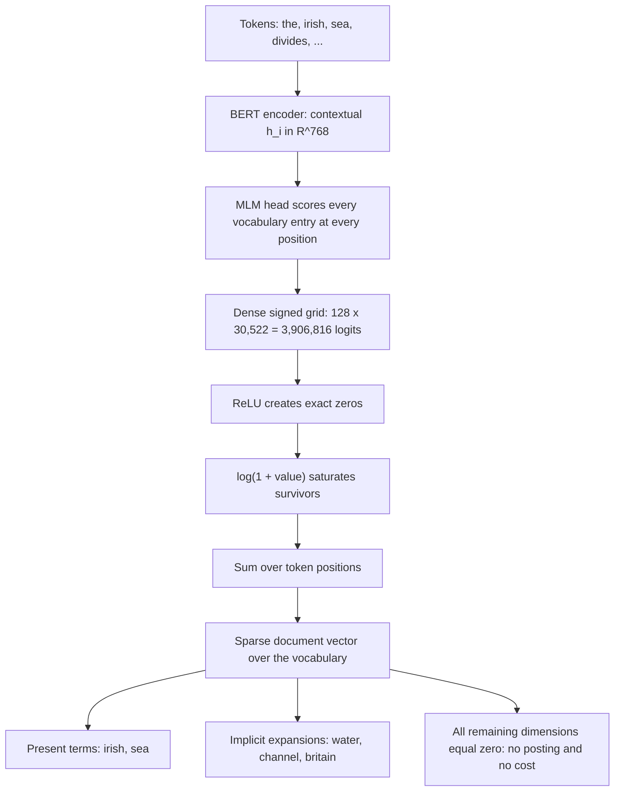
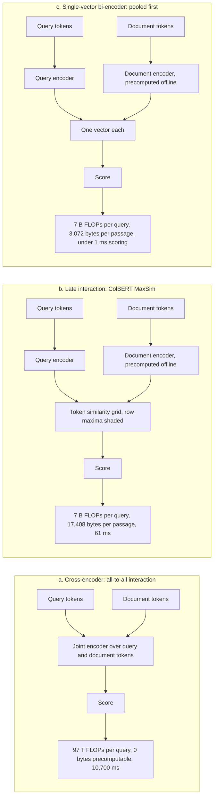

# Chapter 21: Learned Sparse and Multi-Vector Retrieval

This chapter prepares you to explain how learned lexical weights, token-level matching, compression, pruning, and rank fusion trade retrieval quality against index size and latency.

## TL;DR

- Best Matching 25 (BM25) and the Sparse Lexical and Expansion Model (SPLADE) use the same sparse dot-product shape. SPLADE replaces hand-written term weights with a masked language model that can weight terms absent from the text.
- Rectified Linear Unit (ReLU) creates exact zeros for an inverted index. The log transform limits very large weights, but a separate training objective must control how often vocabulary dimensions remain active.
- Floating-point operation count regularization, called FLOPS regularization in the source, balances traffic across vocabulary dimensions. Plain L1 regularization can hit the same nonzero count yet cost 56 times more per query.
- Bidirectional Encoder Representations from Transformers (BERT) supports Contextualized Late Interaction over BERT (ColBERT), which keeps one vector per token. MaxSim lets every query token take its strongest document-token match after both encoders finish.
- ColBERT's ablations rank the important choices. Keeping token-level vectors matters most, max matters next, and masked-token query augmentation matters least.
- ColBERTv2 compresses each token vector into a centroid identifier plus a two-bit residual. PLAID reuses those centroids to prune before decompression, which attacks the memory traffic that dominates late interaction.
- Reciprocal Rank Fusion (RRF) merges lexical and dense result lists without calibrating incompatible scores. It is a strong day-one default, but a tuned convex combination can win after in-domain labels become available.

## The story

Imagine one large library with a librarian named Mira. The old card catalog uses BM25, a literal-word clerk that files a book only under words printed in it. A patron asks for "laptop won't charge," while the manual says "AC adapter fails to supply power." Mira owns the right manual, but the catalog cannot connect the two phrasings.

Mira upgrades each catalog card with SPLADE. SPLADE is a learned sparse clerk that predicts useful vocabulary labels, including labels absent from the page. The manual can now receive a positive "charge" label even if that word never appears. Mira still uses the same inverted catalog. She has changed the weights written on the cards, not the shelves or the lookup rule.

The upgrade creates too many cards. ReLU, a gate that rejects every negative prediction, gives Mira exact blanks she need not file. The log transform, a cap on repeated confidence, stops one loud term from overwhelming a card. Yet neither step prevents popular labels from filling enormous drawers. FLOPS regularization acts as Mira's load balancer. It pushes hardest against drawers that are already crowded.

Some questions need more than vocabulary labels. Mira then uses ColBERT, a reference method that keeps a small note for every query token and every document token. Each query note scans the document notes and keeps its best match. MaxSim is this best-match rule. The interaction happens late, after Mira has prepared every document note offline, so she preserves detail without rereading every document through a joint model.

Mira tests what she can remove. Replacing all token notes with one summary card loses the most. Averaging every possible match instead of keeping the strongest loses less. Removing the extra masked query notes loses the least. The test says the detailed notes earn the system's quality, while the clever combining rule earns a smaller share.

The token notes occupy too much shelf space. ColBERTv2 lets Mira store a shared prototype card, called a centroid, plus a tiny correction, called a residual. PLAID then uses the prototype twice. It first finds and ranks likely books using cheap centroid identifiers. It opens and reconstructs the full residual notes only for the final survivors.

Mira still keeps the literal catalog beside the semantic catalog. Part numbers favor the literal list, while paraphrases favor the semantic list. Their raw scores use incompatible units, so she does not add them. RRF gives each rank a reciprocal vote and rewards books found by both lists. The rank constant decides whether agreement deep in the lists can beat one catalog's favorite.

The full lesson stays inside this library. Learn better catalog labels, balance crowded drawers, retain token notes when detail pays, compress shared patterns, postpone expensive reconstruction, and fuse distinct catalogs only with a rule whose exchange rate you can explain.

## Decoder table

| Technical term | Plain-English meaning | Why it matters |
|---|---|---|
| Retrieval-Augmented Generation (RAG) | A system retrieves external text before a generator answers | Retrieval quality determines what evidence reaches the generator |
| Sparse retrieval | Retrieval with mostly zero vocabulary coordinates | An inverted index can skip every zero coordinate |
| BM25 | A lexical ranker with hand-written term-frequency and inverse-frequency weights | It is fast and exact, but literal support creates vocabulary gaps |
| Inverted index | A map from each term to documents carrying that term | It evaluates sparse dot products without scanning every document |
| Posting | One term, document identifier, and weight entry | Posting count sets index size and contributes to query work |
| Posting list | All postings for one vocabulary dimension | Each active query dimension opens one such list |
| Vocabulary gap | A mismatch between query words and relevant document words | It explains failures such as "charge" versus "supply power" |
| WordPiece vocabulary `V` and size `|V|` | The fixed subword inventory used by the encoder | SPLADE predicts one weight for each of its 30,522 entries |
| Exact match | Evidence that the same literal token occurs on both sides | It remains valuable for part numbers, versions, and error codes |
| Sparse score `s(q,d)` and weights `w_j^q`, `w_j^d` | A sum of query-document weight products over shared active dimensions | BM25 and SPLADE keep this same scoring shape |
| Term weight | The importance assigned to one vocabulary entry | Learned weights can represent context and absent terms |
| Term support | The set of dimensions with nonzero weight | Support determines which postings exist |
| Inverse document frequency (IDF) | A larger weight for a rarer corpus term | BM25 uses it to value discriminative query terms |
| docT5query | Discrete document expansion by generated likely queries | It improves BM25 without changing scoring code, but it cannot train end to end through ranking |
| Sequence-to-sequence model | A model that generates one token sequence from another | docT5query uses it to append synthetic queries |
| Implicit expansion | Positive weights on terms absent from the original text | SPLADE closes vocabulary gaps without generating strings |
| Masked language model (MLM) head | A head that scores every vocabulary token at every position | SPLADE reuses it as a term-importance predictor |
| BERT-base | The 110-million-parameter encoder used in the worked examples | Its 768-dimensional hidden states and cost anchor the comparisons |
| Contextual state `h_i`, term embedding `E_j`, and logit `w_ij` | A token state, vocabulary embedding, and their predicted term score | They distinguish senses and create the full SPLADE weight grid |
| Tied input embedding | The vocabulary embedding reused by the output head | It maps contextual states back onto vocabulary dimensions |
| Gaussian Error Linear Unit (GELU) | The nonlinearity inside the MLM transform block | It is part of the unchanged pre-training head SPLADE reuses |
| Layer normalization (LayerNorm) | A normalization step inside the MLM transform block | It is part of the per-position vocabulary scorer |
| ReLU | A function that maps negative logits to exact zero | Exact zeros remove posting entries and their cost |
| Log saturation | Applying log(1 + value) to positive weights | It reduces dominance by repeated high logits |
| Sum pooling | Adding one term's contribution across token positions | It returns one sparse document weight per vocabulary entry |
| Max pooling | Keeping the strongest position for each vocabulary term | It improved one Microsoft Machine Reading Comprehension (MS MARCO) result, but the source says the gain is not universal |
| Nonzero | A vocabulary coordinate that survives sparsification | Nonzeros create postings and query traversals |
| In-batch negative | Another example in the training batch used as a negative | SPLADE v1 combines these with one BM25 hard negative |
| Hard negative | A high-ranked but irrelevant passage used for training | It teaches the model distinctions that random negatives miss |
| Cross-encoder teacher | A joint query-document model that supplies training scores | Distillation from it produced a larger gain than tuning sparsity alone |
| Distillation | Training a smaller or restricted model to match teacher scores | It raises retrieval quality without changing the serving architecture |
| Dense vector | A representation whose dimensions are generally all stored | It offers semantic matching but has different index economics |
| Float32 | A four-byte floating-point value | It sets the dense-vector storage arithmetic |
| Float16 | A two-byte floating-point value | Original ColBERT token vectors use it in the worked examples |
| Floating-point operations (FLOPs) | A rough count of numerical operations | It compares architectures, but it can badly overstate latency gains |
| Multiply-accumulate (MAC) | One multiply followed by an addition | Posting traversal and MaxSim work are priced in MACs |
| L0 count | The number of nonzero coordinates | It is the desired sparsity quantity but has zero gradient almost everywhere |
| L1 penalty | The sum of absolute weights | It controls average nonzeros but ignores posting-list popularity |
| Least Absolute Shrinkage and Selection Operator (LASSO) | A standard use of the L1 relaxation | It motivates L1 without making L1 a retrieval-cost model |
| Activation probabilities `p_j` and `q_j` | Fractions of documents and queries activating dimension `j` | Their product predicts posting-list traversal cost |
| Nonzero budgets `ubar_d`, `ubar_q` and work `C` | Average document and query support plus expected MAC count | They separate index size from query cost |
| Zipfian profile | A highly skewed frequency pattern proportional to 1 divided by rank | It crowds a few vocabulary dimensions and raises retrieval work |
| Harmonic number | The sum of reciprocal ranks up to the vocabulary size | It yields the source's effective-support estimate for a Zipfian profile |
| Participation ratio `m_eff` | The effective number of dimensions carrying activation mass | It separates equally sparse models with very different query cost |
| Effective support | The participation-ratio interpretation of vocabulary use | Larger effective support means shorter lists at the same nonzero budget |
| FLOPS penalty `loss_FLOPS`, batch mean `abar_j`, and batch size `B` | A squared mean-activation penalty over one training batch | Its gradient grows with load and couples documents across the batch |
| Ranking objective `L_rank` and weights `lambda_q`, `lambda_d` | Relevance loss plus separate query and document penalties | Two constraints receive two tunable exchange rates |
| Ranking loss | The objective that rewards relevant passages over negatives | It must establish useful dimensions before strong sparsity pressure begins |
| Quadratic warm-up | A schedule that raises a regularization weight gradually | It prevents the absorbing all-zero solution at training start |
| Weak AND (WAND) | A dynamic-pruning algorithm for top-k retrieval | BM25 benefits more because its score distributions support useful bounds |
| BlockMax-WAND | A block-level form of dynamic pruning | Learned sparse scores can weaken its skipping power |
| Impact-ordered evaluation | Scoring higher-impact postings before lower-impact ones | The source names it as an alternative when learned weights hurt WAND pruning |
| Service-level objective (SLO) | A promised latency or reliability target | Query and document penalties should respect distinct operational limits |
| p95 and p99 latency | The 95th and 99th percentile response times | Tail latency reveals costs that averages can hide |
| Bi-encoder | Separate query and document encoders with one vector per side | It allows document precomputation but pools away token detail |
| Cross-encoder | One joint encoder over the query-document pair | It retains all-to-all interaction but cannot precompute document states |
| Dense Passage Retrieval (DPR) | A single-vector dense retriever used in the storage comparison | Its 3,072-byte passage vector is the bi-encoder baseline |
| ColBERT counts `N_q`, `n_d`, width `m`, and token vectors `E_qi`, `E_dj` | Query rows, document rows, projected width, and their embeddings | They set MaxSim arithmetic and per-passage storage |
| Late interaction | Cross-side scoring after both encoders have finished | It makes document token vectors reusable across queries |
| L2 normalization | Scaling a vector to unit Euclidean length | It makes token dot products comparable similarities |
| Classification token [CLS] | A single encoder position used as a pooled summary | Collapsing to it measures the loss from representation granularity |
| Mask token [MASK] | A pre-training placeholder that BERT predicts from context | ColBERT uses padded mask rows as query augmentation |
| MaxSim score `S(q,d)` | Sum over query tokens of each token's best document-token similarity | It preserves localized evidence and supports pruning |
| Approximate nearest-neighbor (ANN) search | Fast search for vectors near a query vector | ColBERT can issue one search per query token to build candidates |
| Inverted file index with product quantization (IVF-PQ) | A partitioned compressed vector index | Original end-to-end ColBERT used it for candidate generation |
| Recall@1000 | Fraction of relevant passages found in the first 1,000 results | It exposes a first-stage ceiling that reranking cannot exceed |
| Mean reciprocal rank at 10 (MRR@10) | A ranking metric focused on the first relevant result within ten | The chapter uses it for SPLADE, ColBERT, and ablation comparisons |
| Ablation | A controlled component deletion with training and evaluation fixed | It measures that component's contribution, not another architecture's ceiling |
| Representation granularity | Whether a passage keeps one vector or one vector per token | It caused the largest ColBERT ablation drop |
| Query augmentation | Adding extra query-side rows beyond literal tokens | ColBERT obtains it from contextualized [MASK] positions |
| Approximate Nearest Neighbor Negative Contrastive Estimation (ANCE) | A later single-vector training system named in the source | Its result limits what the ColBERT [CLS] ablation proves |
| K-means | Clustering vectors around learned centers | ColBERTv2 uses it to build the centroid codebook |
| Centroid table `C`, assignment `t(v)`, embedding `v`, and residual `r` | A shared prototype, its selected row, the token vector, and their difference | They factor token identity from contextual detail |
| Codebook size `|C|`, embedding count `n_emb`, and residual width `b` | Centroid count, stored token count, and bits per residual dimension | They set compression, scan cost, and posting-list length |
| Residual `r = v - C_t(v)` | The difference between an embedding and its assigned centroid | It contains within-cluster context that can tolerate very low bit width |
| Residual quantization | Low-bit coding of that centroid-relative difference | It compresses without discarding the between-cluster identity |
| Quantile bucket edges | Thresholds chosen from the residual distribution | They define the one-bit or two-bit residual codes |
| Inverted File with Asymmetric Distance Computation (IVFADC) | A residual-coding argument previously used for passage vectors | ColBERTv2 applies the same logic to token vectors |
| PLAID | The centroid-first late-interaction retrieval funnel | It prunes with cheap identifiers before exact residual scoring |
| Candidate generation | Finding passages attached to top query centroids | It builds a union without reading residuals |
| Centroid pruning | Removing centroids too dissimilar to every query token | It shrinks later stages before they read more bytes |
| Centroid interaction | Approximate MaxSim over centroid identifiers | It keeps only ndocs and then ndocs divided by four |
| Ragged gather | Loading variable numbers of token vectors per passage | Reshape and padding make it a major runtime cost |
| Lookup table | Precomputed values used during decompression or scoring | PLAID uses them to accelerate central processing unit execution |
| Central processing unit (CPU) | A general-purpose processor | PLAID reports a larger speedup there than on a GPU |
| Graphics processing unit (GPU) | A highly parallel processor | Parallelism already hides some padding waste there |
| Peripheral Component Interconnect Express (PCIe) | The host-to-accelerator data path named in the serving discussion | Crossing it makes byte traffic more important than arithmetic |
| MiniLM | The 22-million-parameter cross-encoder teacher in ColBERTv2 | It supplies soft scores for denoised distillation |
| Kullback-Leibler (KL) divergence | A loss that matches two score distributions | ColBERTv2 uses it over 64-way tuples |
| Denoised distillation | Teacher training that reduces noisy binary-label effects | The source credits it, not compression, for ColBERTv2's quality gain |
| Normalized Discounted Cumulative Gain at 10 (nDCG@10) | A top-ten ranking-quality metric | The hybrid example starts from a four-point aggregate gain |
| Cosine similarity | A bounded dense-vector similarity in the range [-1, 1] | Its units cannot be added directly to BM25 scores |
| Min-max normalization | Rescaling observed list scores to [0, 1] | Pool-dependent extremes make the same raw score move with list depth |
| Convex combination | A weighted sum whose nonnegative weights total one | It can outperform RRF after sound normalization and in-domain tuning |
| Fusion weight alpha | The sparse-list share in a two-list convex combination | Different values yield different orders and require labels to choose |
| Rank | A document's position inside one result list | RRF uses it instead of raw score magnitude |
| RRF score `RRF(d)` and ranks `r_l(d)` | A sum of reciprocal rank weights across lists | It needs no cross-retriever score calibration |
| Rank constant `k`, list count `L`, and depth `m` | Denominator offset, number of lists, and candidates per list | Together they set the exchange rate between head rank and agreement |
| Raw list score `s_l(d)` and fusion weight `alpha` | One retriever's score and the sparse share in a convex combination | Their units and calibration determine whether score fusion is defensible |
| Weighted RRF | RRF with a measured weight for each list | It can reflect slice-specific retriever strength |
| Hierarchical fusion | Fuse correlated lists first, then fuse signal families | It prevents one family from receiving duplicate votes |
| RAG-Fusion | RRF across lists from generated paraphrases of one query | Correlated agreement can amplify a shared near-miss |
| Calibration | Mapping scores to meaningful comparable confidence | RRF deliberately avoids it and must not be treated as confidence |

## Core mechanics

### 21.1 SPLADE: MLM-predicted term importance and implicit expansion

#### The shared sparse scoring form

- What: Let V be the WordPiece vocabulary with size 30,522. Let w_j^q and w_j^d be the query and document weights on vocabulary entry j.
- Why: BM25 and SPLADE can both use an inverted index because they score only shared nonzero dimensions.
- Failure without it: A dense materialization would destroy the storage advantage of exact zeros.
- Cost: The index touches postings only where both factors are nonzero.

$$
s(q,d) = Σ_{j=1}^{|V|} w_j^q w_j^d
$$

BM25 instantiates the weights with hand-written functions. Here f_{j,d} is the raw term count, k_1 and b are BM25 constants, document length is |d|, and avgdl is average document length.

$$
w_j^d = f_{j,d}(k_1 + 1) / (f_{j,d} + k_1(1 - b + b|d|/avgdl))
$$

$$
w_j^q = IDF(j) I[j ∈ q]
$$

- What: BM25 sets the document weight to zero when f_{j,d} is zero.
- Why: Literal support makes its posting lists compact and exact.
- Failure without a learned repair: The relevant passage can use "AC adapter" while the query uses "charge." BM25 also cannot use context to separate river bank from mortgage bank.
- Cost: The chapter's opening production example serves BM25 in 40 ms at p99, but 12% of audited queries return nothing acceptable to the reranker.

#### Discrete expansion versus direct vocabulary weighting

- What: docT5query generates 40 queries that a passage might answer, appends them, and indexes the resulting text with BM25.
- Why: It widens lexical support without changing the serving scorer.
- Failure: Decoding temperature becomes a retrieval hyperparameter. Ranking gradients cannot pass through discrete generation. BM25 later treats generated and original terms as ordinary counts.
- Cost and result: Nogueira and Lin report MRR@10 of 0.277 on MS MARCO passage development data, versus 0.184 for BM25.

- What: SPLADE predicts a weight for every vocabulary entry directly from every contextual token position.
- Why: The MLM head already scores all vocabulary entries, including absent terms. It needs no generated string.
- Failure without the full-vocabulary head: The model cannot assign "water" to a passage that contains "sea" but never contains "water."
- Cost: For sequence length n = 128 and vocabulary size 30,522, the dense signed logit matrix holds 3,906,816 values before sparsification.

$$
w_{ij} = transform(h_i)^T E_j + b_j
$$

The hidden state h_i has 768 dimensions. E_j is the tied input embedding. The transform is the dense, GELU, and LayerNorm block from pre-training.

#### Exact zeros, saturation, and pooling

- What: ReLU maps negative logits to exact zero. The log transform saturates positive values. Summation over positions produces one vocabulary weight.
- Why: Exact zero removes a posting. Saturation prevents repeated confident predictions from flattening the rest of the vector.
- Failure: ReLU alone can leave thousands of positive dimensions. Raw summation lets one repeated high logit dominate.
- Cost: The output stays sparse at serving time even though indexing computes the full vocabulary head.

$$
w_j^d = Σ_{i=1}^{n} log(1 + ReLU(w_{ij}))
$$

The saturation example keeps all source arithmetic. Five logits of 12 sum to 60. Five logits of 1 sum to 5. The raw ratio is 12. After saturation, 5 ln(13) = 12.83 and 5 ln(2) = 3.47. The ratio falls to 3.7.

Summation discards word order only after contextual encoding. The model is contextual inside and bag-of-words outside. Max pooling raised SPLADE v2 from 0.322 to 0.340 MRR@10 on this benchmark, but the source limits the claim. The result did not reproduce everywhere, so max versus sum remains a measured hyperparameter.

#### Training and interpretability

- What: SPLADE v1 uses in-batch negatives and one BM25-retrieved hard negative per query.
- Why: The ranking loss trains expansion weights end to end.
- Failure: ReLU does not by itself control how many positive dimensions survive.
- Cost and result: SPLADE v1 reaches 0.322 MRR@10. Distilled v2 reaches 0.368, versus 0.184 for BM25 and 0.277 for docT5query.

The sparse dimensions remain readable words. An operator can inspect a document's top-weighted terms. The source recommends auditing the top 20 dimensions for a few hundred documents and blocking problematic brand or negation-flipped expansions when needed.

#### Worked index economics

Use N = 8,841,823 passages, vocabulary size 30,522, 40 distinct BM25 terms per passage, and 8 bytes per posting. Each posting has a 4-byte document identifier and a 4-byte weight.

| Configuration | Index arithmetic | Query arithmetic | Result |
|---|---|---|---|
| BM25 | 8.84 x 10^6 x 40 = 3.54 x 10^8 postings | 8 x 1.16 x 10^4 = 9.27 x 10^4 MACs | 2.83 GB |
| Unregularized SPLADE at 30% positive | 8.84 x 10^6 x 9,157 = 8.10 x 10^10 postings | 100 x 2.65 x 10^6 = 2.65 x 10^8 MACs | 648 GB and 2,900x BM25 query work |
| SPLADE at 160 nonzeros | 8.84 x 10^6 x 160 = 1.41 x 10^9 postings | 100 x 4.64 x 10^4 = 4.64 x 10^6 MACs | 11.3 GB and 50x BM25 query work |

At 160 pairs, one document needs 1,280 bytes. A 768-dimensional float32 dense vector needs 3,072 bytes. Across the corpus, learned sparse storage is 11.3 GB versus 27.2 GB for the flat dense index, so sparse is 2.4 times smaller. The MLM head costs 2 x 128 x 768 x 30,522 = 6.00 x 10^9 FLOPs per indexed passage. The BERT-base encoder costs 2 x 1.10 x 10^8 x 128 = 2.82 x 10^10 FLOPs. The head adds 21%. The source therefore places the main sparsity bill in memory and query time, not indexing throughput. At 500 million chunks, the source's staff example gives 1.54 TB for 768-dimensional float32 dense vectors, 160 GB for BM25 at 40 terms, and 640 GB for SPLADE at 160 nonzeros. SPLADE remains one exact-match-capable index. The reversal condition is measured p99. If aggressive query expansion breaks the latency budget and stronger query regularization loses more recall than two cheap indexes, BM25 plus a small dense index can win.

Practical choices follow from the same arithmetic. Budget nonzeros per document, with four times the BM25 average as a starting point. Regularize the query side harder when latency binds. Use a real inverted index rather than a dense vector store. A densely materialized 30,522-dimensional float32 vector would occupy 122 kB per document and 1,080 GB for this corpus. SPLADE-doc removes the query encoder and query expansion when query-side latency dominates. docT5query remains useful when a managed search product accepts text but not learned posting weights.

### 21.2 FLOPS regularization: making sparsity a trainable objective

#### Model the work the index performs

- What: Let p_j be the fraction of documents activating dimension j. Let q_j be the fraction of logged queries activating it. Posting list j contains Np_j entries.
- Why: A query opens that list with probability q_j, so expected exhaustive cost uses a product of the two activation profiles.
- Failure: Counting only document nonzeros cannot distinguish one flat profile from one crowded profile.
- Cost: Expected MACs per query are the following.

$$
C = N Σ_{j=1}^{|V|} q_j p_j
$$

The desired L0 count cannot serve directly as a loss. It is piecewise constant, so its gradient is zero almost everywhere. L1 is the tightest convex relaxation and does control the average document count because E[||w^d||_0] = Σ_j p_j = ubar_d. It remains blind to the products in C.

Assume the query profile follows the corpus profile.

$$
q_j = (ubar_q / ubar_d)p_j
$$

Then expected cost and effective support become:

$$
C = N ubar_q ubar_d / m_eff
$$

$$
m_eff = (Σ_j p_j)^2 / Σ_j p_j^2
$$

Cauchy-Schwarz gives 1 <= m_eff <= 30,522. The upper bound needs perfectly equal popularity. Two models with the same 160 nonzeros can therefore differ in cost by as much as the vocabulary size under this model.

#### Why a Zipfian profile is expensive

- What: The unregularized term profile follows p_j proportional to 1/j.
- Why: Natural language naturally concentrates mass in common dimensions.
- Failure: L1 applies equal pressure and permits that crowded profile.
- Cost: H_30,522 = ln(30,522) + gamma = 10.33 + 0.58 = 10.90. The squared reciprocal sum approaches pi^2/6 = 1.645. Therefore m_eff = 10.90^2 / 1.645 = 118.9 / 1.645 = 72.

#### FLOPS as load balancing

For a training batch of B documents, define the mean activation and penalty as follows.

$$
abar_j = (1/B) Σ_{b=1}^{B} w_j^{(b)}
$$

$$
loss_FLOPS = Σ_{j=1}^{|V|} abar_j^2
$$

- What: The batch mean stands in for activation probability, and its square penalizes crowding.
- Why: The batch couples documents. A document pays more for a dimension its batchmates already use.
- Failure: A per-document norm removes the cross-document coupling. Plain L1 gives every dimension the same pressure.
- Cost: The FLOPS gradient on one weight is 2abar_j/B. The L1 gradient is 1/B. A dimension at 2.0 receives 40 times the FLOPS pressure of one at 0.05, while L1 treats them equally.

At fixed document nonzero budget, loss_FLOPS = ubar_d^2/m_eff. Minimizing it maximizes effective support. The source therefore calls FLOPS a load balancer over vocabulary, not merely a sparsifier.

#### Separate query and document penalties

$$
L = L_rank + lambda_q loss_FLOPS(q) + lambda_d loss_FLOPS(d)
$$

- What: Query and document sides receive different regularization weights.
- Why: Document nonzeros cost disk and latency. Query nonzeros cost latency only. The two sides buy different recall.
- Failure: One lambda forces one exchange rate onto two different constraints.
- Cost: The source recommends lambda_q greater than lambda_d by roughly one order of magnitude as a default, then tuning to measured budgets.

The all-zero vector minimizes the penalty. ReLU makes a fully negative unit absorbing because no gradient returns through it. Formal and colleagues use a quadratic warm-up over the opening training phase. The practical recommendation is the first 10% to 15% of steps, followed by a constant weight. Starting at full lambda can kill every output permanently.

#### Worked cost profiles

Use N = 8,841,823, document nonzeros ubar_d = 160, and query nonzeros ubar_q = 30.

$$
N ubar_q ubar_d = 8,841,823 x 30 x 160 = 4.24 x 10^{10}
$$

| Configuration | Effective support | Query cost | Index size |
|---|---:|---:|---:|
| L1 with a Zipfian profile | 72 | 5.9 x 10^8 MACs | 11.3 GB |
| FLOPS-balanced profile | 4,000 | 1.06 x 10^7 MACs | 11.3 GB |
| Raise query pressure until only 8 query nonzeros remain | 4,000 | 2.83 x 10^6 MACs | unchanged |

The first two have identical average nonzeros and differ by 56 times in query work. Cutting queries from 30 to 8 gives another 3.75 times reduction without changing the index.

The FLOPS-balanced configuration still costs 114 times the source's BM25 posting-count estimate of 9.27 x 10^4 MACs. The L1 version costs 6,400 times BM25 and lies outside the range reported for shipped systems. This comparison has a claim limit. The posting-count model is pessimistic for BM25 because WAND and BlockMax-WAND skip postings that cannot reach top k. Mackenzie, Trotman, and Lin report that learned sparse weights weaken the score distributions those bounds rely on. Dynamic pruning may therefore help SPLADE less and renew interest in impact-ordered, score-at-a-time evaluation.

Practical measurement should pair average nonzeros with m_eff. The source suggests estimating it from 100,000 indexed vectors. Tune toward an interpretable target such as 160 nonzeros and m_eff at least 4,000. A 500-million-chunk index at 160 nonzeros occupies 640 GB. Prefer training-time FLOPS pressure to top-k truncation because truncation preserves popularity skew. Recompute m_eff after domain shift because p_j belongs to the deployed corpus.

### 21.3 ColBERT and late interaction

#### Locate the architectural gap

- What: A bi-encoder maps each side to one 768-dimensional vector and scores their dot product. A cross-encoder jointly encodes the concatenated pair and reads a score from [CLS].
- Why: The bi-encoder precomputes documents. The cross-encoder preserves all query-document attention.
- Failure: Mean pooling weights "the" like "retrieval." [CLS] still compresses a passage into one vector. The cross-encoder cannot reuse document states.
- Cost and result: At depth 1,000, the source gives 34.7 MRR@10 and 10,700 ms per query for a BERT-base cross-encoder.

$$
s_bi(q,d) = eta(q)^T eta(d)
$$

#### Keep token vectors and interact late

- What: ColBERT independently encodes query and document tokens, projects every output to m = 128, and L2-normalizes it. Documents retain all n_d vectors. Queries pad to N_q = 32 with [MASK] tokens.
- Why: The document representation stays query-independent and precomputable. Token distinctions survive.
- Failure: Early pooling irreversibly discards local evidence.
- Cost: Storage grows with token count instead of passage count alone.

$$
S(q,d) = Σ_{i=1}^{N_q} max_{j=1,...,n_d}(E_{qi}^T E_{dj})
$$

MaxSim asks whether each query token finds evidence anywhere in the document. Replace max with mean in a 68-token passage where one similarity is 0.95 and 67 are 0.10:

$$
(0.95 + 67 x 0.10) / 68 = 7.65 / 68 = 0.1125
$$

A passage with no match sits at 0.10. Max preserves a 9.5-times evidence separation. Mean leaves only a 12.5% lift. The dilution worsens as the document grows.

#### End-to-end candidate generation

- What: Issue one ANN search per query token, union the touched passages, then run exact MaxSim on that union.
- Why: A high MaxSim score requires some token-level near neighbors, so the score supports token-driven pruning.
- Failure: Reranking BM25's top 1,000 inherits BM25's recall ceiling.
- Cost and result: End-to-end ColBERT over IVF-PQ reports Recall@1000 of 96.8%. BM25 reranking remains at 81.4%, exactly BM25's Recall@1000.

#### Worked architecture costs

Use 8.8 million passages, average document length 68, query length 32, projection size 128, two bytes per token dimension, BERT-base with 110 million parameters, and rerank depth 1,000.

| Architecture | Online arithmetic | Stored bytes per passage | Reported behavior |
|---|---:|---:|---|
| Cross-encoder | 97 trillion FLOPs | 0 precomputable | 10,700 ms and 34.7 MRR@10 |
| ColBERT | 7.6 x 10^9 FLOPs | 17,408 | 61 ms at depth 1,000 |
| Single-vector bi-encoder | about 7.0 x 10^9 FLOPs | 3,072 for DPR | dot-product scoring under 1 ms |

The ColBERT query encoder costs 2 x 110 x 10^6 x 32 = 7.04 x 10^9 FLOPs. MaxSim costs 1,000 x 32 x 68 x 128 x 2 = 5.57 x 10^8 FLOPs. Total cost is 7.6 x 10^9. MaxSim is 7.3% of the 7.61-billion operation bill, while the query encoder is 93%.

The cross-encoder ratio is 97 x 10^12 / 7.0 x 10^9 = 13,857, reported as 13,900 times. Measured latency improves only 10,700 / 61 = 175 times. FLOPs overstate the win by 79 times. Query encoding and interaction take 13 of 61 ms. Gathering, stacking, and transferring embeddings take the remaining 48 ms. The source therefore calls multi-vector retrieval memory-movement-bound.

ColBERT stores 68 x 128 x 2 = 17,408 bytes per passage. DPR stores 768 x 4 = 3,072 bytes. The ratio is 5.67. Collection totals are 143 GiB versus 25.2 GiB.

Chunk size now has a direct storage cost. A single-vector index stores one vector whether a chunk contains 100 or 500 tokens. A multi-vector index doubles in size when token count doubles. The source recommends dimension reduction before abandoning late interaction. Moving from 128 dimensions at four bytes to 24 dimensions at two bytes takes the reported footprint from 286 GiB to 27 GiB. MRR@10 moves from 34.9 to 33.9. The larger index uses 10.6 times the storage for a 2.9% quality gain.

End-to-end retrieval removes the first-stage ceiling but takes 458 ms, versus 61 ms for reranking. A hard budget under 100 ms can justify reranking an existing BM25 index. The source treats a corpus below roughly one million chunks as a case where a 5.7-times multiplier may still be affordable.

### 21.4 The three ablations that show what makes ColBERT work

#### Read controlled deletions correctly

All variants rerank BM25's top 1,000 on MS MARCO passage development data. Full ColBERT scores 0.349 MRR@10.

| Controlled deletion | MRR@10 | Absolute drop | Relative drop | What it isolates |
|---|---:|---:|---:|---|
| Collapse token vectors to one [CLS] vector | 0.285 | 0.064 | 18.3% | Representation granularity |
| Replace row maximum with row mean | 0.331 | 0.018 | 5.2% | Aggregator choice |
| Remove [MASK] query augmentation | 0.343 | 0.006 | 1.7% | Expansion capacity |

BM25 itself scores 0.187. Full ColBERT buys 0.349 - 0.187 = 0.162 above that floor. The [CLS] variant buys 0.285 - 0.187 = 0.098. It therefore surrenders 1 - 0.098/0.162 = 39.5% of the headroom for which the architecture was bought.

Granularity's relative drop is 18.3/5.2 = 3.5 times the aggregator's. The source's conclusion is narrow and operational. Keeping token vectors matters more than making the pooled scorer clever. Once pooling removes a distinction, no downstream scorer can recover it.

Mean instead of max saves no storage and no FLOPs because it reads the same grid. It spends 0.018 MRR@10 only as evidence. The maximum asks whether evidence appears somewhere. The mean asks whether the passage is about that token on average.

The [MASK] slots run through BERT rather than becoming zeros. Pre-training lets each position form a contextual guess about a plausible query term. Removing them causes the smallest measured drop. In late interaction, another query term adds one row with n_d x m MACs per candidate. It needs no document re-encode and no second retrieval round. Appended rows can represent text rewrites, synonyms, a centroid of query token vectors, or term-table vectors. The same operation can expand documents.

#### Price each deletion

The full baseline occupies 143 GiB and costs 7.6 x 10^9 query FLOPs under the same constants as Section 21.3.

- [CLS] storage lever: One 128-dimensional vector at two bytes occupies 256 bytes per passage and 2.1 GiB total. It frees 140.9 GiB for 6.4 MRR@10 points, or 22.0 GiB per point.
- Dimension lever: Reducing 128 dimensions to 24 frees 116 GiB for one MRR@10 point. It returns 116/22.0 = 5.3 times more storage per point than token collapse.
- Mean lever: It loses 1.8 MRR@10 points and saves zero storage and zero FLOPs.
- Augmentation lever: For an eight-token query, encoding costs 1.76 x 10^9 FLOPs and MaxSim costs 1.39 x 10^8. Total 1.9 x 10^9 is four times lower than 7.6 x 10^9.

The wall-clock limit matters. Only 13 of 61 ms belongs to encoding and interaction. A four-times cut saves at most 9.8 ms, moving 61 ms to 51 ms. That is a 16% latency gain for a 1.7% quality loss. The fixed 32-token shape also supports one batched kernel instead of a ragged loop.

Appending one precomputed query vector costs 68 x 128 x 2 = 17,408 FLOPs per candidate. At depth 1,000 that is 1.74 x 10^7 FLOPs, only 0.23% of the query budget.

The ablation does not prove that all single-vector retrieval is 18.3% worse. It freezes ColBERT's training recipe. ANCE later reports 0.330 MRR@10 with one vector per passage and hard-negative training at one sixty-eighth of the token-storage footprint. The source explicitly calls the broader claim a common misreading. When an index must fit 30 GiB, the source's senior example chooses the 128-to-24 dimension cut and lands at 27 GiB for one MRR@10 point. A bi-encoder becomes attractive if its own Recall@k lands within one or two points of the multi-vector index. Short corpora such as titles, log lines, and product names can also narrow the difference between pooled and token-level representations.

### 21.5 Making multi-vector affordable: ColBERTv2 and PLAID

#### Factor shared identity from contextual detail

MS MARCO has 8.8 million passages averaging 68 tokens, for 5.984 x 10^8 token embeddings. Each original embedding has 128 float16 dimensions and occupies 256 bytes.

- What: Run k-means, store a codebook C, represent each token vector by its nearest centroid plus a residual, and quantize only the residual.
- Why: Embeddings for the same token cluster tightly. The centroid stores between-cluster identity once, while the residual stores within-cluster context.
- Failure: Direct two-bit quantization asks four levels per axis to cover the full embedding spread and can erase identity.
- Cost: Two-bit residuals need four levels per dimension over only the smaller within-cluster range.

$$
v = C_{t(v)} + r
$$

$$
r = v - C_{t(v)}
$$

With 2^18 = 262,144 centroids, the exact centroid identifier needs 18 bits and is stored in four bytes. A two-bit residual needs 128 x 2 / 8 = 32 bytes. Total storage is 36 bytes rather than 256, a 7.1-times reduction. The codebook costs 262,144 x 128 x 2 = 64 MiB, only 0.3% of the compressed index.

Residual compression applies the IVFADC argument to token vectors. The source limits its claim. Compression is quality-neutral by design in the reported comparison, but stale centroids under domain drift can inflate residuals and cause broad quality loss.

#### Reuse centroids in the PLAID funnel

1. Candidate generation scores 32 query vectors against every centroid in one matrix multiplication. It probes the top few centroids per token and unions their passage lists. It reads the 64 MiB codebook but no residuals.
2. Centroid pruning removes centroids whose maximum query similarity falls below a threshold.
3. Centroid interaction runs approximate MaxSim over four-byte centroid identifiers. It retains the top ndocs and then ndocs divided by four.
4. Residual decompression reconstructs and exactly scores only the final survivors.

Off-the-shelf IVF-PQ is the losing alternative in the source's comparison. Its compact product-quantization codes remain opaque until reconstruction, so pruning still pays decompression. PLAID uses one centroid table as coarse quantizer, residual anchor, and ranking proxy.

#### Worked storage and traffic

Use 2^18 centroids, two bits per residual dimension, 32 query tokens, 68 document tokens, two centroid probes per query token, and ndocs = 256. Then ndocs/4 = 64 passages reach exact scoring.

| Configuration | Arithmetic | Result |
|---|---|---:|
| Uncompressed float16 | 5.984 x 10^8 x 256 bytes | 143 GiB |
| Centroid plus two-bit residual | 5.984 x 10^8 x 36 bytes | 20.1 GiB plus 64 MiB |
| Ordinary decompression after candidate generation | 146,112 x 68 x 36 bytes | 341 MiB per query |
| PLAID centroid interaction plus final decompression | 37.9 MiB plus 153 KiB | 38.1 MiB per query |

Residual compression frees 143 - 20.1 = 123 GiB with no reported quality cost. Dimension reduction frees 116 GiB and costs one MRR@10 point.

The average centroid list holds 5.984 x 10^8 / 2^18 = 2,283 embeddings. Two probes for each of 32 query tokens touch at most 64 x 2,283 = 146,112 candidate embeddings or passages, 1.7% of the corpus, before any residual read.

Decompressing that candidate set costs 146,112 x 68 x 36 = 3.577 x 10^8 bytes, or 341 MiB. Reading only four-byte identifiers costs 37.9 MiB. Exact decompression of 64 passages costs 64 x 68 x 36 = 156,672 bytes, or 153 KiB. Total PLAID traffic is 38.1 MiB. The 341/38.1 ratio is 9.0, exactly the 36/4 payload-to-identifier ratio before extra pruning effects.

The 20.1 GiB footprint is 7.1 times below 143 GiB and lies inside the reported six-to-ten-times ColBERTv2 range. PLAID reports up to seven-times lower GPU latency and 45-times lower CPU latency. Format alone explains nine times less traffic. Centroid pruning reduces the candidate base further. Hand-written C++ CPU kernels and precomputed decompression tables attack ragged reshape and padding, which explains why CPU improvement can exceed GPU improvement.

#### Quality, bit width, and codebook limits

Do not credit compression with ColBERTv2's quality gain. The source reports 36.0 to 39.7 MRR@10 on MS MARCO development data. It attributes the gain to denoised distillation from a 22-million-parameter MiniLM cross-encoder with a KL-divergence loss over 64-way tuples. One-bit residuals need 4 + 16 = 20 bytes per embedding and 11.1 GiB total. Dropping the second bit saves 9.0 GiB but halves residual precision. The source defaults to two bits unless measured out-of-domain behavior justifies one bit.

At 2^18 centroids, the query-centroid scan costs 32 x 262,144 x 128 x 2 = 2.15 GFLOPs. That is 31% of the 7.04-GFLOP query encoder. At 2^20 centroids, the scan costs 8.59 GFLOPs and exceeds the encoder. A larger corpus can still justify more centroids when lists otherwise grow beyond a few thousand embeddings. Instrument stage recall. Compare gold-passage survival after centroid interaction with exhaustive MaxSim over the same candidate set before reducing ndocs or tightening thresholds. End-to-end MRR@10 alone cannot identify which funnel stage discarded a passage.

### 21.6 Hybrid retrieval and Reciprocal Rank Fusion

#### Why raw score fusion fails

- What: A hybrid system keeps lexical and dense retrievers because the two fail differently.
- Why: Dense retrieval catches paraphrases. BM25 catches rare literal strings such as part numbers, firmware versions, and error codes.
- Failure: BM25 scores are unbounded and depend on corpus statistics. Cosine similarities stay within [-1, 1]. Adding them elects one unit system rather than blending evidence.
- Cost: The source's deployment story gains four aggregate nDCG@10 points after moving to dense retrieval but creates exact-string support failures.

Per-query min-max normalization maps each list to [0, 1], then applies a convex combination.

$$
score(d) = alpha scorehat_sparse(d) + (1 - alpha) scorehat_dense(d)
$$

The same BM25 score 18.2 becomes (18.2 - 6.1)/25.3 = 0.478 in a top-100 window [6.1, 31.4]. It becomes (18.2 - 12.4)/19.0 = 0.305 in a top-10 window [12.4, 31.4]. Changing depth moves the normalized score by 36%. Min-max also forces every list winner to 1.0, whether the winning margin is 0.2 or a factor of three.

Naive rank summation has the opposite flaw. It values the gap from rank 61 to 62 like the gap from rank 1 to 2.

#### RRF and the meaning of k

$$
RRF(d) = Σ_{ell=1}^{L} 1 / (k + r_ell(d))
$$

Omit the term when a document is absent from a list. The relative weight inside one list is:

$$
w(r) / w(1) = (k + 1) / (k + r)
$$

This ratio equals one half at r = k + 2. The source interprets k as the exchange rate between rank and agreement, not as harmless smoothing.

A document at rank r in all L lists beats one list's rank-one document when:

$$
L/(k + r) > 1/(k + 1)
$$

$$
r < L(k + 1) - k
$$

For L = 2 and k = 60, the crossover is rank 62. Agreement through rank 61 beats a solo top hit, while rank 62 ties it. For k = 0, the crossover is rank 2 and only unanimous first place qualifies. For L = 3 and k = 60, the crossover is rank 123.

For list depth m = 100 and k = 60, one list's weight span is (k + m)/(k + 1) = 160/61 = 2.6. That is comparable to the factor of two supplied by agreement across two lists. At k = 0, the span is 100 and agreement becomes secondary. At k = 5, the crossover is rank 7 and the span is 105/6 = 17.5.

#### Worked fusion example

Use two lists of depth 100. Document dA is BM25 rank 1 only. Document dB is dense rank 1 only. Document dC appears at ranks 4 and 3. Document dD appears at ranks 9 and 7.

| Fusion choice | dA | dB | dC | dD | Final order |
|---|---:|---:|---:|---:|---|
| RRF at k = 60 | 0.016393 | 0.016393 | 0.031498 | 0.029418 | dC, dD, dA, dB |
| RRF at k = 0 | 1.000 | 1.000 | 0.583 | 0.254 | dA, dB, dC, dD |
| Min-max, alpha = 0.5 | 0.500 | 0.500 | 0.675 | 0.484 | dC, dA and dB, dD |
| Min-max, alpha = 0.7 | 0.700 | 0.300 | 0.596 | 0.393 | dA, dC, dD, dB |

At k = 60, dC = 1/64 + 1/63 = 0.015625 + 0.015873 = 0.031498. dD = 1/69 + 1/67 = 0.014493 + 0.014925 = 0.029418. Each solo rank-one document receives 1/61 = 0.016393.

At k = 0, dC = 1/4 + 1/3 = 0.583. dD = 1/9 + 1/7 = 0.254. The solo winners each receive 1.

The min-max example uses BM25 window [6.1, 31.4] and dense window [0.52, 0.83]. Sparse normalized scores are 1.000, 0.478, and 0.257 for dA, dC, and dD. Dense normalized scores are 1.000, 0.871, and 0.710 for dB, dC, and dD. Absent documents receive zero.

#### Cost and limits of rank fusion

Fusion over L lists at depth m costs Lm reciprocal additions plus a sort of at most Lm candidates. With two lists of 100, that is 200 reciprocal additions and a sort over at most 200 entries. Run a 15-ms inverted-index query and an 8-ms ANN query concurrently. Wall time is max(15, 8) = 15 ms rather than 23 ms serially. Hybrid retrieval costs another index and query path, not necessarily more wall-clock latency.

Cormack and colleagues used k = 60 without tuning. The source says 60 remains a common shipped default with list windows around 50 to 100. Configure k with m. At k = 60, increasing depth from 100 to 1,000 mainly enlarges a downstream rerank pool because new documents below the rank-62 crossover do little to the fused head. RRF's advantage is label-free deployment, not superior accuracy. Bruch and colleagues report that a convex combination with theoretical score bounds can outperform RRF after tuning on a small in-domain set. They also report that RRF is more sensitive to k and list depth than its parameter-free reputation suggests. The source recommends moving after a few hundred labeled in-domain queries.

RRF discards confidence margins. A BM25 winner at 31.4 versus 12.1 contributes the same 1/61 as a winner ahead by 0.2. For L = 2, k = 60, and m = 100, possible fused scores lie in [1/160, 2/61], a fixed 5.2-times range. Never threshold or log RRF as confidence.

Weighted RRF uses a measured list weight:

$$
weighted_RRF(d) = Σ_{ell=1}^{L} weight_ell / (k + r_ell(d))
$$

Choose weights from slice-level recall on rare-term and paraphrase queries, not aggregate nDCG. Correlated lists also need care. Adding SPLADE beside BM25 and one dense list gives the lexical family two votes. With three lists and k = 60, the crossover moves to 123. Hierarchical fusion can first combine BM25 and SPLADE, then give that family one vote against dense retrieval. RAG-Fusion applies the same formula to lists from generated paraphrases. Those lists are correlated. Agreement can reflect overlapping rewrites rather than independent evidence. If the datastore lacks the fact, every list can agree on the same near-miss and pass confidently wrong context to the generator.

## Diagrams

### Figure 21.1



Figure 21.1: Expansion in SPLADE is a side effect of the pre-training head, not a generation step: the MLM head already scores all 30,522 vocabulary entries at every position, so terms absent from the passage can receive positive weight, and ReLU is what turns the remaining |V | dimensions into free zeros an inverted index can skip. Bar lengths are schematic.

### Figure 21.2

```text
(a) Penalty gradient

gradient
  ^                                      FLOPS: 2 a_bar_j / B
  |                                  /
  |-------------------------------/  L1: 1 / B
  |                            /
  +-------------------------------------------------> dimension load a_bar_j

L1 gives every dimension the same downward pressure.
FLOPS pressure rises with the load already on the dimension.

(b) Same average nonzero count, different activation profiles

L1, 160 nonzeros                         FLOPS, 160 nonzeros
p_j                                     p_j
|#                                      |########
|##                                     |########
|###                                    |########
|#######                                |########
+-------------> vocabulary j            +-------------> vocabulary j

sum p_j = 160                           sum p_j = 160
m_eff = 72                              m_eff = 4,000
C = 5.9 x 10^8 MACs                    C = 1.06 x 10^7 MACs
```

Figure 21.2: The two penalties are indistinguishable by average nonzero count and differ by 56× in query cost: L1's constant gradient lets the learned profile settle into the Zipfian shape natural language already has, while FLOPS's load-proportional gradient spreads the same total mass across far more of the vocabulary. Bar heights are schematic. The cost figures are computed in the worked example below.

### Figure 21.3



Figure 21.3: Late interaction sits between the two ends and inherits the cost profile of the cheap one: ColBERT and a bi-encoder both spend about 7 B FLOPs per query because the query encoder dominates both, and they differ by 5.7× in bytes per passage. Figures are for MS MARCO at rerank depth 1,000 and are derived in the worked example. Circles are query tokens, squares document tokens.

### Figure 21.4

| Panel | Rows and columns | Cells that enter the score | Result |
|---|---|---|---|
| a. Full ColBERT | Query-token rows by document-token columns | One maximum cell from each row, then sum | 0.349 MRR@10 |
| b. [CLS] pooled pair | The token grid is discarded | One pooled-vector dot product | 0.285 MRR@10, -18.3% |
| c. Mean instead of max | Same full token grid | Every cell contributes 1/n_d to its row mean | 0.331 MRR@10, -5.2% |
| d. No query augmentation | Only real query-token rows remain | Row maxima from real tokens only | 0.343 MRR@10, -1.7% |

Figure 21.4: Representation granularity dominates the aggregator, which dominates query expansion: collapsing to a single vector costs 18.3% of MRR@10, mean-for-max costs 5.2%, and removing the [MASK] rows costs 1.7%. Rows are query tokens, columns document tokens. Shaded cells enter the score.

### Figure 21.5

```mermaid
flowchart TD
    subgraph A["a. One token embedding before and after residual compression"]
        U["ColBERT: 128 float16 dimensions = 256 bytes"] --> C["ColBERTv2: 4-byte centroid identifier + 32-byte two-bit residual = 36 bytes"]
        C --> X["7.1x smaller"]
    end
    subgraph B["b. PLAID funnel and allowed reads"]
        P["8.8 million passages"] --> G["Candidate generation: codebook only, 64 MiB, no residuals"]
        G --> N["At most 146,112 candidates"]
        N --> I["Centroid interaction: identifiers only, 4 bytes per embedding, 37.9 MiB"]
        I --> S["64 passages"]
        S --> R["Residual decompression: 36 bytes per embedding, 153 KiB"]
        R --> T["Top 10"]
    end
```



Figure 21.5: Compression and pruning share one artifact. The centroid table shrinks each embedding from 256 to 36 bytes, and then, reused as a ranking proxy, keeps all but 64 of the candidate passages from ever being decompressed - 38.1 MiB of query-time traffic instead of 341 MiB. Counts are for the worked example: 2^18 centroids, two probes per query token, ndocs = 256.

### Figure 21.6

| BM25 list | Dense list | RRF fused at k = 60 |
|---|---|---|
| rank 1: dA | rank 1: dB | 1. dC = 1/64 + 1/63 = 0.0315 |
| rank 4: dC | rank 3: dC | 2. dD = 1/69 + 1/67 = 0.0294 |
| rank 9: dD | rank 7: dD | 3. dA = 1/61 = 0.0164 |
| absent: dB | absent: dA | 4. dB = 1/61 = 0.0164 |

```text
One list's vote relative to its own rank-one vote

1.0 |*\                 k = 60
    |  \____
0.5 |-------\.........................*  rank 62
    |         \_______________________
    |*\___  k = 0
0.0 +----+----------------------------+-------> rank r
         1                            62      100

At k = 60, two lists at rank 62 tie one list at rank 1.
At k = 0, one vote at rank 62 is worth 1/62 of rank 1.
```

Figure 21.6: Reciprocal weighting makes agreement across lists commensurate with rank inside a list. At k = 60 a list's vote at rank 62 is worth exactly half its vote at rank 1, so two lists agreeing at rank 62 tie one list's top hit. At k = 0 the same vote is worth 1/62 and only rank matters. This is why the fused list in panel (a) is led by the documents both retrievers found, not by either retriever's favorite.

## Whiteboard pack

### What to draw

1. Draw one query box and one document box on the left.
2. Draw a shared inverted-index score at the top. Label BM25 as literal weights and SPLADE as learned vocabulary weights.
3. Draw many vocabulary bars. Cross out negative logits with ReLU and label the survivors as postings.
4. Draw a second profile with crowded bars and a flatter profile. Label L1 on the crowded side and FLOPS on the balanced side.
5. Draw a query-token by document-token grid. Circle one maximum in each query row and sum the circles as MaxSim.
6. Draw one centroid identifier plus a small residual beside each token vector.
7. Draw the PLAID funnel from centroid candidates to 64 exact survivors.
8. Draw BM25 and dense ranked lists entering the RRF equation. Mark k as the agreement exchange rate.

### Spoken script

SPLADE keeps an inverted index but lets a language model assign weights to words that never appeared in the document. ReLU makes exact zeros, while FLOPS regularization spreads activity so popular posting lists do not dominate cost. ColBERT keeps one vector per token and delays interaction until MaxSim, so documents stay precomputable without losing local evidence. Its main bill is memory traffic. ColBERTv2 stores a centroid plus a tiny residual, and PLAID prunes on centroids before decompression. Finally, RRF merges lexical and dense rankings by reciprocal rank when their raw scores cannot be compared directly.

## Interview traps

### 1. Why can two SPLADE models with 160 nonzeros have a 56x query-cost gap?

Average nonzeros constrain a sum of activation probabilities, while retrieval work depends on products of query and document activation profiles. L1 can preserve a Zipfian crowd around a few long posting lists, while FLOPS uses a squared batch mean to spread load and raise effective support.

### 2. What is late about ColBERT, and when would you not use it?

No query-document operation occurs until both encoders have produced token vectors, so document vectors are precomputable. Do not use it by default when the first-stage Recall@k is already high enough for a cross-encoder reranker, when token-scaled storage breaks the budget, or when compression cannot recover that budget without losing the needed recall.

### 3. What do the three ColBERT ablations actually prove?

They show that [CLS] collapse costs 18.3% relative MRR@10, mean-for-max costs 5.2%, and removing [MASK] augmentation costs 1.7% under one fixed training recipe. They do not prove a universal 18.3% gap between multi-vector and well-trained single-vector retrieval because ANCE later reaches 0.330 with a different negative-training recipe.

### 4. Why does ColBERTv2 use a centroid plus residual, and why does PLAID keep the centroid stage?

The centroid preserves between-cluster token identity exactly, so two-bit levels cover only the narrower within-cluster residual range. PLAID also ranks with centroid identifiers, which reduces query traffic from 341 MiB to 38.1 MiB before exact scoring. Remove that stage only if measured stage recall loss is worth the latency increase.

### 5. When does RRF lose to score fusion, and what happens when you add SPLADE to BM25 plus dense retrieval?

RRF wins as a label-free, calibration-free default, but a convex combination with theoretical score bounds can win after in-domain tuning. Adding SPLADE creates two correlated lexical votes, so hierarchical fusion can prevent the lexical family from overwhelming paraphrase queries.

## Key numbers

| Topic | Number | Meaning or limit |
|---|---:|---|
| Opening BM25 service | 40 ms p99 | Existing lexical service latency |
| Opening failure audit | 12% | Queries with no reranker-acceptable result |
| SPLADE latency incident | Recall@1000 up four points, 15 ms to 900 ms | Hypothetical regression when query terms expand from 8 to 100 |
| WordPiece vocabulary | 30,522 | SPLADE output dimensions |
| BERT hidden width | 768 | Contextual state size |
| Example sequence length | 128 | Positions scored by the MLM head |
| Dense SPLADE logit grid | 3,906,816 | 128 x 30,522 logits |
| docT5query expansion | 40 queries per passage | Discrete appended queries |
| BM25 MRR@10 | 0.184 | Baseline in the SPLADE comparison |
| docT5query MRR@10 | 0.277 | Expansion baseline |
| SPLADE v1 MRR@10 | 0.322 | In-batch negatives plus one BM25 hard negative |
| SPLADE v2 max-pool MRR@10 | 0.340 | Empirical benchmark gain that did not reproduce everywhere |
| Distilled SPLADE v2 MRR@10 | 0.368 | Cross-encoder distillation result |
| Saturation example | 60 versus 5 | Raw sums from five logits of 12 and five of 1 |
| Saturated sums | 12.83 versus 3.47 | Five ln(13) versus five ln(2) |
| Saturated ratio | 3.7 | Reduced from raw ratio 12 |
| MS MARCO passages | 8,841,823 | Sparse worked-example corpus size |
| BM25 terms per passage | 40 | Sparse baseline |
| Posting size | 8 bytes | Four-byte document identifier plus four-byte weight |
| BM25 postings | 3.54 x 10^8 | 2.83-GB index |
| BM25 average list | 1.16 x 10^4 | Posting entries per vocabulary dimension |
| BM25 query work | 9.27 x 10^4 MACs | Eight-term query estimate |
| Unregularized positive share | 30% | 9,157 nonzeros per SPLADE passage |
| Unregularized postings | 8.10 x 10^10 | 648-GB index |
| Unregularized average list | 2.65 x 10^6 | Entries per vocabulary dimension |
| Unregularized query work | 2.65 x 10^8 MACs | 100-term expanded query |
| Unregularized multiplier | 2,900x | Query work versus BM25 |
| Regularized SPLADE nonzeros | 160 | Four times BM25's 40 |
| Regularized SPLADE postings | 1.41 x 10^9 | 11.3-GB index |
| Regularized average list | 4.64 x 10^4 | Posting entries |
| Regularized query work | 4.64 x 10^6 MACs | 50 times BM25 |
| Sparse bytes per document | 1,280 | 160 eight-byte pairs |
| Dense bytes per document | 3,072 | 768 float32 dimensions |
| Flat dense collection | 27.2 GB | Versus 11.3 GB learned sparse |
| Sparse storage advantage | 2.4x | 11.3 GB versus 27.2 GB |
| MLM-head indexing cost | 6.00 x 10^9 FLOPs | Per passage |
| BERT-base indexing cost | 2.82 x 10^10 FLOPs | Per passage |
| MLM-head overhead | 21% | Extra indexing work |
| Dense SPLADE materialization | 122 kB per document | 1,080 GB for the corpus |
| Audit depth | Top 20 dimensions | Recommended expansion inspection |
| Large-corpus example | 500 million chunks | Staff-level sizing case |
| Large dense index | 1.54 TB | 768-dimensional float32 |
| Large BM25 index | 160 GB | 40 terms per passage |
| Large SPLADE index | 640 GB | 160 nonzeros per passage |
| Zipf harmonic terms | 10.33 + 0.58 = 10.90 | ln vocabulary plus gamma |
| Squared reciprocal limit | 1.645 | pi squared divided by six |
| Zipf effective support | 72 | 118.9 divided by 1.645 |
| FLOPS pressure example | 40x | Load 2.0 versus 0.05 |
| FLOPS worked query nonzeros | 30 | Before query-side reduction |
| FLOPS cost numerator | 4.24 x 10^10 | N x 30 x 160 |
| L1 query cost | 5.9 x 10^8 MACs | Effective support 72 |
| Balanced effective support | 4,000 | FLOPS configuration |
| Balanced query cost | 1.06 x 10^7 MACs | 56 times below L1 |
| Literal query nonzeros | 8 | Query-side reduction target |
| Reduced query cost | 2.83 x 10^6 MACs | Another 3.75-times gain |
| Balanced versus BM25 | 114x | Posting-count work estimate |
| L1 versus BM25 | 6,400x | Outside shipped range described in the source |
| Profile sample | 100,000 vectors | Suggested effective-support estimate |
| Lambda warm-up | First 10% to 15% of steps | Quadratic schedule recommendation |
| Lambda ratio default | About one order of magnitude | Query pressure above document pressure |
| FLOPS warning run | 158 versus target 160, then p99 at 40x budget | Same count can hide the wrong activation profile |
| Same-count checkpoint example | 160 nonzeros, 40 ms versus 2 s | Effective support separates the two models |
| Cross-encoder depth | 1,000 | MS MARCO rerank comparison |
| Cross-encoder quality | 34.7 MRR@10 | Reported BERT-base result |
| Cross-encoder latency | 10,700 ms | Single V100 query time |
| Cross-encoder work | 97 trillion FLOPs | No precomputable document work |
| ColBERT query tokens | 32 | Fixed padded length |
| ColBERT projection | 128 dimensions | Token embedding width |
| Average document tokens | 68 | MS MARCO passage average |
| ColBERT query encoder | 7.04 x 10^9 FLOPs | 2 x 110 million x 32 |
| ColBERT MaxSim | 5.57 x 10^8 FLOPs | Depth 1,000 grid work |
| ColBERT total | 7.6 x 10^9 FLOPs | Query plus MaxSim |
| MaxSim share | 7.3% | Query encoder takes 93% |
| FLOP ratio | 13,857, reported 13,900x | Cross-encoder versus ColBERT |
| Measured latency ratio | 175x | 10,700 divided by 61 |
| FLOP overstatement | 79x | 13,900 versus 175 |
| ColBERT latency | 61 ms | Depth-1,000 reranking |
| Compute portion | 13 ms | Encoding plus interaction |
| Data-movement portion | 48 ms | Gather, stack, and transfer |
| ColBERT bytes per passage | 17,408 | 68 x 128 x two bytes |
| DPR bytes per passage | 3,072 | 768 float32 dimensions |
| Passage storage ratio | 5.67x | ColBERT versus DPR |
| ColBERT collection | 143 GiB | 8.8 million passages |
| DPR collection | 25.2 GiB | Same corpus |
| End-to-end recall | 96.8% Recall@1000 | ColBERT ANN route |
| BM25 ceiling | 81.4% Recall@1000 | Same for BM25 and its reranker |
| End-to-end latency | 458 ms | Versus 61 ms reranking |
| Local-evidence example | 0.95 versus 0.10, mean 0.1125 | Max keeps 9.5x separation while mean leaves a 12.5% lift |
| Dimension footprint range | 286 GiB to 27 GiB | 128 float32 dimensions to 24 float16 dimensions |
| Dimension quality range | 34.9 to 33.9 MRR@10 | One-point loss |
| Dimension storage ratio | 10.6x | For 2.9% quality |
| Small-corpus heuristic | Roughly one million chunks | Case where 5.7x may stay affordable |
| Full ColBERT ablation score | 0.349 MRR@10 | Fixed-recipe baseline |
| [CLS] ablation | 0.285, -18.3% | 0.064 absolute drop |
| Mean ablation | 0.331, -5.2% | 0.018 absolute drop |
| No-augmentation ablation | 0.343, -1.7% | 0.006 absolute drop |
| BM25 ablation floor | 0.187 MRR@10 | First-stage baseline in that table |
| Full headroom | 0.162 | 0.349 minus 0.187 |
| [CLS] headroom | 0.098 | 0.285 minus 0.187 |
| Headroom surrendered | 39.5% | One minus 0.098 divided by 0.162 |
| Granularity ratio | 3.5x | 18.3 divided by 5.2 |
| [CLS] total footprint | 2.1 GiB | 256 bytes per passage |
| [CLS] storage freed | 140.9 GiB | For 6.4 MRR@10 points |
| [CLS] rate | 22.0 GiB per point | Storage returned per quality point |
| Dimension rate | 116 GiB per point | 5.3 times better than token collapse |
| Eight-token no-mask encode | 1.76 x 10^9 FLOPs | Short query encoder cost |
| Eight-token MaxSim | 1.39 x 10^8 FLOPs | Depth-1,000 interaction |
| No-mask total | 1.9 x 10^9 FLOPs | Four times below full query |
| Maximum latency saving | 9.8 ms | 61 ms to 51 ms |
| Wall-clock gain | 16% | For 1.7% quality loss |
| Added query vector | 17,408 FLOPs per candidate | 1.74 x 10^7 at depth 1,000 |
| Expansion cost share | 0.23% | Of query budget |
| ANCE result | 0.330 MRR@10 | Single-vector claim limit |
| [CLS] versus DPR footprint | 12x | 25.2 GiB divided by 2.1 GiB, matching 3,072 divided by 256 |
| Senior storage budget | 30 GiB | Dimension cut lands at 27 GiB |
| Token embeddings | 5.984 x 10^8 | 8.8 million x 68 |
| Original token embedding | 256 bytes | 128 float16 dimensions |
| Centroid count | 2^18 = 262,144 | ColBERTv2 worked setting |
| Centroid identifier | 18 bits, stored as 4 bytes | Exact cluster identity |
| Two-bit residual | 32 bytes | 128 x two bits |
| Compressed embedding | 36 bytes | Four-byte identifier plus residual |
| Compression ratio | 7.1x | 256 divided by 36 |
| Codebook | 64 MiB | 0.3% of compressed index |
| Compressed collection | 20.1 GiB | Plus the codebook |
| Reported footprint band | 6x to 10x | ColBERTv2 reduction range |
| Centroid probes | Two per query token | 64 probes for 32 tokens |
| Average centroid list | 2,283 embeddings | 5.984 x 10^8 divided by 2^18 |
| Maximum candidates | 146,112 | 1.7% of the corpus |
| PLAID ndocs | 256 | Final exact set is 64 |
| Ordinary candidate traffic | 341 MiB | Full residual decompression |
| Centroid interaction traffic | 37.9 MiB | Four-byte identifiers |
| Final exact traffic | 153 KiB | 156,672 bytes |
| PLAID total traffic | 38.1 MiB | Nine times below 341 MiB |
| Reported GPU speedup | Up to 7x | PLAID latency |
| Reported CPU speedup | Up to 45x | PLAID latency |
| ColBERT quality | 36.0 MRR@10 | Before v2 distillation gain |
| ColBERTv2 quality | 39.7 MRR@10 | Denoised distillation result |
| MiniLM teacher | 22 million parameters | Cross-encoder teacher |
| Distillation tuple | 64-way | KL loss over soft scores |
| One-bit embedding | 20 bytes | Four-byte identifier plus 16-byte residual |
| One-bit collection | 11.1 GiB | Saves 9.0 GiB versus two bits |
| 2^18 centroid scan | 2.15 GFLOPs | 31% of query-encoder work |
| 2^20 centroid scan | 8.59 GFLOPs | Exceeds the 7.04-GFLOP encoder |
| Hybrid quality story | Four nDCG@10 points | Aggregate gain with exact-string regressions |
| Cosine bounds | -1 to 1 | Incompatible with unbounded BM25 units |
| Min-max depth shift | 0.478 to 0.305 | 36% change for the same score 18.2 |
| Min-max windows | [6.1, 31.4] and [12.4, 31.4] | Depth 100 versus depth 10 |
| RRF default k | 60 | Label-free starting point |
| Two-list crossover | Rank 62 | At k = 60 |
| k = 0 crossover | Rank 2 | Only unanimous first place qualifies |
| Three-list crossover | Rank 123 | At k = 60 |
| Weight span | 160/61 = 2.6x | k = 60 and depth 100 |
| k = 5 span | 105/6 = 17.5x | Agreement fades below rank 7 |
| Worked RRF dC | 0.031498 | Ranks 4 and 3 at k = 60 |
| Worked RRF dD | 0.029418 | Ranks 9 and 7 at k = 60 |
| Worked solo hit | 0.016393 | Rank 1 in one list at k = 60 |
| Worked k = 0 dC | 0.583 | One fourth plus one third |
| Worked k = 0 dD | 0.254 | One ninth plus one seventh |
| Convex alpha values | 0.5 and 0.7 | Produce different worked orders |
| Fusion work | 200 reciprocal additions | Two lists at depth 100 |
| Concurrent retrieval | 15 ms | Maximum of 15-ms sparse and 8-ms dense paths |
| Serial retrieval | 23 ms | Sum of the same paths |
| Typical list windows | 50 to 100 | Regime paired with k = 60 |
| Deeper-list example | 100 to 1,000 | Mainly expands a downstream rerank pool |
| Labeled tuning point | A few hundred queries | When convex score fusion becomes viable |
| RRF score band | 1/160 to 2/61 | L = 2, k = 60, m = 100 |
| RRF dynamic range | 5.2x | Fixed across query and corpus |
| Invalid confidence threshold | RRF score above 0.02 | This cuts on list membership, not relevance |
