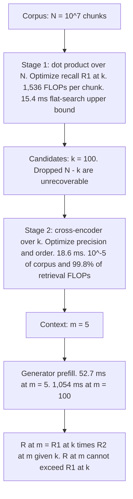
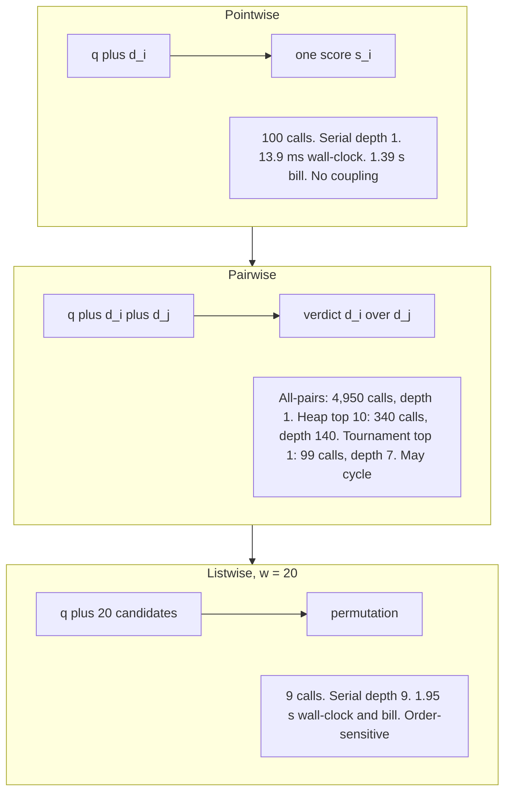
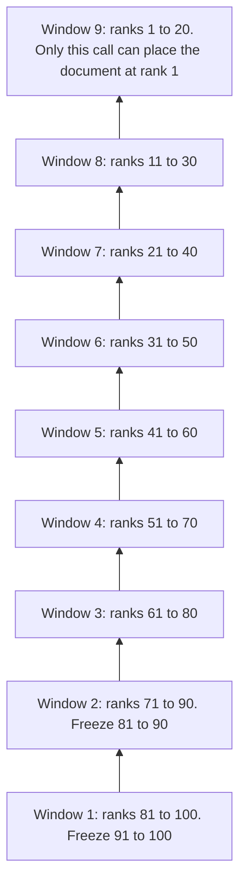

# Chapter 22: Reranking

This chapter explains why Retrieval-Augmented Generation (RAG) needs a second ranking stage, how to price and size it, and how cross-encoders, large language model (LLM) ranking modes, ranking losses, sliding-window prompting, instruction-aware scoring, and document-bound versus model-bound diagnosis support that choice.

## TL;DR

- A two-stage pipeline has a hard ceiling. End-to-end evidence recall is first-stage recall times conditional reranker recall, so a reranker cannot recover a document that retrieval never supplied.
- A Bidirectional Encoder Representations from Transformers (BERT) base cross-encoder costs about 0.195 ms per 288-token pair at the stated throughput. Depth therefore turns directly into latency, and `k = 100` costs about 19.5 ms.
- Rerank depth follows the first-stage recall curve and the reranker's distractor error. It is not a constant owned by the reranker or inherited from a paper.
- A frozen prompted LLM should compare candidates. Pointwise, pairwise, and listwise modes trade calibration, call count, accelerator bill, serial depth, and order sensitivity.
- monoT5's modeling error is its separable classification loss. RankT5 couples candidates with a listwise softmax loss while keeping serving cost unchanged.
- Zero-shot listwise reranking needs overlapping windows that move from the tail to the head. Any other schedule can leave deep candidates structurally unable to reach rank 1.
- Instruction awareness needs both an explicit instruction input and on-topic instruction-violating negatives. Random negatives alone let the scorer ignore the instruction. Compare the marginal value of one more document with the marginal value of a stronger ranker at the current `m`. The larger gain identifies whether the operating point is document-bound or model-bound.
## The story

Think of retrieval as auditions for a small theater.
The first-stage retriever is the casting assistant. It scans a vast crowd and invites `k` people into the room. Its job is recall. Anyone left outside is gone for this performance.
The reranker is the director. It can study each invited candidate with the role in mind, compare close choices, and choose the final `m`. Its job is precision and order. The director cannot cast someone the assistant never invited.
The generator is the stage. Every extra actor sent onstage consumes space and rehearsal time. Sending all 100 candidates because the stage is large wastes time and can bury the right evidence in the middle. A focused cast of five often costs less because the director's audition removes far more generator prefill than it adds in reranking.
Depth is the size of the audition room. A weak casting assistant may need 1,000 invitations. A stronger assistant may reach the same recall with 20. Each extra invitation creates one more expensive audition and one more chance that a distractor wins.
Pointwise, pairwise, and listwise ranking are three audition formats. Pointwise asks each actor for a solo score. Pairwise runs head-to-head auditions. Listwise puts a group onstage together and asks for an ordering. The correct format depends on whether training can calibrate solo scores and whether the production can afford serial decisions.
Sliding windows are a relay from the back row to the front. A deep candidate must win each hand-off. Start at the front or remove overlap, and the relay path breaks.
Instructions are role notes. A director who reads only the script topic cannot distinguish "authoritative policy" from "discussion thread." The training set must include actors who fit the topic but violate the role note. Otherwise the director can ignore the note and still win every easy comparison.
Finally, the producer asks where to spend the next quarter. If one more actor onstage helps more than a better director, the current show is document-bound. If a better director helps more at the same cast size, it is model-bound. The answer belongs to the current operating point, not to the pipeline forever.
## Decoder table

| Term | Meaning | Why it matters |
|---|---|---|
| RAG | Retrieval-Augmented Generation | Retrieval selects evidence before generation. |
| `N` | Corpus size in chunks | The cheap first stage may scan or index all `N`. |
| `k` | Candidate depth sent from stage 1 to stage 2 | Cross-encoder cost grows linearly with `k`. |
| `m` | Documents sent to the generator | Generator prefill and evidence coverage change with `m`. |
| `R1(k)` | Probability that the gold chunk appears in the first-stage top `k` | This is the hard set-membership ceiling. |
| `R2(m given k)` | Probability that the reranker places the gold in the top `m`, conditioned on its presence in the top `k` | This isolates stage-2 ordering and truncation. |
| `R(m)` | Probability that the generator sees the gold chunk | It equals the product of the two stage terms. |
| `d` | Dense embedding width | A dot product costs `2d` floating-point operations (FLOPs). |
| `P` | Model parameter count | The stated forward-pass rule charges about `2P` FLOPs per token. |
| `Lq` | Query token count | It contributes to every query-document pair. |
| `Lp` or `Ld` | Passage or document token count | It dominates pair length and listwise prompt size. |
| `Li` | Instruction token count | It is the extra input cost for instruction-aware reranking. |
| `L` | Joint pair length | For a cross-encoder, `L = Lq + Lp`, plus `Li` when used. |
| `h` | Transformer hidden width | It appears in the attention-cost term. |
| `ell` | Transformer layer count | It multiplies the attention-cost term. |
| First-stage retriever | Cheap sparse or dense scorer over the corpus | It buys recall at large depth. |
| Dense Passage Retrieval (DPR) | Dense first-stage system used in the Natural Questions measurements | Its fitted recall slope is 3.0 points per depth doubling. |
| BM25 | Sparse first-stage scoring system used in the comparisons | Its fitted recall slope is 6.3 points per depth doubling. |
| Approximate nearest neighbor (ANN) index | Index that avoids flat dense scanning | The worked example treats flat search time as an honest upper bound. |
| Cross-encoder | Joint query-document transformer | It can condition every document token on every query token. |
| Bi-encoder | Separate query and document encoders | It permits document-side precomputation but lacks joint token interaction. |
| `[CLS]` and `[SEP]` | Classification position used for the score and separator token placed between fields | They mark the joint sequence and expose the final relevance representation. |
| `epsilon` and `lambda = (k - 1)epsilon` | Per-distractor error probability and resulting Poisson mean | They set the depth where extra distractors begin to hurt. |
| Pointwise mode | Score one candidate per decision | Calls parallelize, but prompted absolute scores need calibration. |
| Pairwise mode | Compare two candidates per decision | It creates ordinal judgments but may produce cycles. |
| Listwise mode | Order a group of candidates per decision | It supplies context-level comparison but introduces serial windows and order sensitivity. |
| Serial depth | Longest dependent chain of model calls | It determines wall-clock latency when calls cannot overlap. |
| Comparator cycle | A result such as `A > B`, `B > C`, and `C > A` | A sort can hide the inconsistency and return arrival-order-dependent output. |
| `w` | Listwise window size | It controls candidates seen per listwise decision. |
| `s` (window use) | Sliding-window stride | It controls overlap and how many ranks each call freezes. |
| `N_pointwise`, `N_all-pairs`, `N_listwise`, and `N_calls` | Call counts for each comparison mode, with the last two naming the window total | They separate accelerator bill from serial wall-clock depth. |
| `n(g)` and `g` (window use) | Consecutive wins and starting rank in progressive reranking | Tail rescue probability decays with the win count. |
| `p_window` | Probability that a truly best candidate survives one listwise hand-off | Tail rescue is `p_window` raised to `n(g)`. |
| `g` (training use) | Candidate list size used by the RankT5 training loss | Training cost grows linearly with this separate use of `g`. |
| monoT5, `z_true`, `z_false`, and `s_i` | Pointwise Text-to-Text Transfer Transformer (T5), its two output logits, and sigmoid relevance score | Its pointwise objective never compares same-query candidates. |
| RankT5, `p_i`, `p_t`, and `y_i` | Ranking model, candidate softmax probability, gold probability, and relevance label | Its listwise loss couples a query's candidates. |
| Binary cross-entropy | Pointwise classification loss | Each document contributes independently. |
| Listwise softmax cross-entropy | Loss that normalizes scores over one query's list | Its denominator makes candidates compete. |
| LambdaRank | Pairwise method that rescales gradients by absolute normalized discounted cumulative gain change | It prices head-of-list inversions more heavily. |
| poly-1, `epsilon_poly`, and `p_t` | Extra loss, its weight, and the gold softmax probability | Its relative gradient contribution is `epsilon_poly * p_t`. |
| Mean reciprocal rank at 10 (MRR@10) | Average reciprocal gold rank, truncated at 10 | It supports the fitted geometric rank model. |
| Normalized discounted cumulative gain (nDCG) | Rank metric with larger discounts near the head | It exposes why all inversions should not cost the same. |
| Mean average precision (MAP) | Ranking metric preserved by monotone within-query calibration | It cannot improve when ordering does not change. |
| `I`, `q`, `d`, and `u` | Intent instruction, query, document, and the two-document score gap | They make the instruction-aware function and its impossibility proof explicit. |
| Task-aware Retrieval with Instructions full model (TART-full) | Instruction-aware cross-encoder described in the source | Its 90/10 negative mixture supplies topical and instruction gradients. |
| Intent-correct@1 and `n` (intent use) | Top-1 intent success and number of symmetric intents | An instruction-blind scorer is capped at `1/n`. |
| `A` | Generator extraction probability once gold is in context | It scales end-to-end quality. |
| `C(m)` | Conditional probability that the ranker puts gold inside the first `m` slots | It is the ranker's cumulative placement curve. |
| `E(m)` and `E_prime(m)` | Baseline and upgraded end-to-end quality at context size `m` | Their difference prices the ranker upgrade. |
| `p_rank` and `p_prime` | Baseline and upgraded geometric success probabilities | The fitted baseline uses `p_rank = 0.18`. |
| `q_rank` and `q_prime` | Their complementary failure probabilities | The cumulative placement curve is `1 - q_rank^m`. |
| Document-bound | One more document has the larger marginal gain | The current context is too small for the available ranking. |
| Model-bound | A better ranker has the larger marginal gain at fixed `m` | The current context is large enough that ordering is the better lever. |
| `m*` | Crossing where the two marginal gains are equal | The worked comparison gives approximately five documents. |
## Core mechanics

### 22.1 Why a second stage exists at all

#### What

A two-stage pipeline separates a cheap recall estimator from an expensive precision and ordering estimator.
The end-to-end evidence probability is

$$
R(m) = R_1(k) R_2(m \mid k) \le R_1(k).
$$
The inequality is the architecture. Stage 1 sets the ceiling. Stage 2 can approach that ceiling but cannot exceed it.
Stage 1 optimizes recall over `N`. Stage 2 optimizes precision and order over `k`. The generator receives `m`, with `m` no larger than `k` and `k` far smaller than `N`.
#### Why

A dense first-stage dot product costs

$$
2d = 2(768) = 1{,}536\ \text{FLOPs per chunk}.
$$
A BERT-base cross-encoder with `P = 110M`, a 32-token query, and a 256-token passage costs under the chapter's simple rule

$$
2(1.10 \times 10^8)(32 + 256) = 6.336 \times 10^{10}\ \text{FLOPs per pair}.
$$
One cross-encoder pair is

$$
\frac{6.336 \times 10^{10}}{1{,}536} = 4.13 \times 10^7
$$
times the arithmetic of one dot product.
Running that accurate model over a 10-million-chunk corpus would cost

$$
10^7(6.336 \times 10^{10}) = 6.34 \times 10^{17}\ \text{FLOPs per query}.
$$
The staged system with `k = 100` costs

$$
10^7(1{,}536) + 100(6.336 \times 10^{10}) = 6.35 \times 10^{12}\ \text{FLOPs}.
$$
That is a reduction of `9.98 × 10^4`, close to five orders of magnitude. Stage 2 sees `10^-5` of the corpus and still spends 99.8% of retrieval arithmetic.
The reranker also controls position. The source states that the same documents produce different generator quality when the answer-bearing chunk moves between the start, middle, and end of context. Recall cannot measure this ordering effect.
#### Failure without it

If the gold chunk is absent from the top `k`, stage 1 failed. Adding a reranker cannot help.
If the gold chunk is in the top `k` but outside the final `m`, stage 2 failed. Re-embedding the whole corpus targets the wrong stage.
If a pipeline logs only end-to-end accuracy, it observes the product `R1 * R2` and cannot attribute failure to either factor.
If the system passes all `k` candidates to a long-context generator, it pays much more prefill and exposes the answer to positional degradation.
#### Cost, complexity, and worked example

The worked stack uses 10 million chunks, 256 tokens per chunk, `d = 768` in 32-bit floating point (FP32), a BERT-base cross-encoder, a 7-billion-parameter generator, sustained throughput of `3.4 × 10^14` FLOPs per second, and memory bandwidth of 2.0 TB/s.
Flat dense search streams

$$
10^7(768)(4\ \text{bytes}) = 30.7\ \text{GB},
$$
which takes 15.4 ms at the stated bandwidth. An ANN index can reduce it, so 15.4 ms is an upper bound for stage 1.

| Configuration | Retrieval and reranking | Generator prefill | Total before decode | Quality interpretation |
|---|---:|---:|---:|---|
| One stage, raw top 5 | 15.4 ms | 52.7 ms | 68.1 ms | `R(5) = R1(5)`, with no second opinion or reorder. |
| Retrieve 100, rerank to 5 | 15.4 + 18.6 ms | 52.7 ms | 86.7 ms | Raises the ceiling to `R1(100)` and controls position. |
| Retrieve 100, send all 100 | 15.4 ms | 1,054 ms | 1,069 ms | Costs 12.3 times configuration 2 and usually buries the gold in a 25,600-token context. |
The 100-candidate reranker costs

$$
\frac{100(6.336 \times 10^{10})}{3.4 \times 10^{14}} = 18.6\ \text{ms}.
$$
Reducing prefill from 100 chunks to five removes 1,001 ms. The reranker returns 54 ms of generator time for each millisecond it spends. Its 18.6 ms adds 27% over the 68.1 ms raw-top-5 configuration.
For 200 chunks, long-context prefill reaches 51,200 tokens and `7.17 × 10^14` FLOPs, or about 2.1 seconds. Cross-encoding the 200 candidates costs 37.3 ms before sending five.
Published DPR measurements on Natural Questions give 78.4% top-20 and 85.4% top-100. The set-membership headroom is 7.0 points. That is 32% of the remaining `21.6` points of error.
#### Decisions and limits

- Measure recall at `k` and recall at `m` on the same query set before adding or removing the stage.
- Budget reranking against generator prefill saved, not only against retrieval latency.
- Use a set metric for stage 1 and a rank metric such as nDCG or MRR for stage 2.
- Keep the reranker's final order unless a deliberate diversity or recency pass replaces it.
- Treat `k = 100` as a starting point, then profile it.
- If a fixed-price generator application programming interface bills per call rather than per token, recompute the prefill trade in dollars.
- If generator accuracy is flat across insertion positions and prefill is cached across a multi-turn session, the reranker's remaining value can collapse to the set-membership gap.
### 22.2 Cross-encoders and choosing rerank depth

#### What

A cross-encoder forms one sequence, `[CLS] query [SEP] document [SEP]`, then runs a joint transformer pass. Every document token can attend to every query token.
That joint representation explains both quality and cost. The model can judge whether a passage answers this query, but no document representation can be precomputed offline.
#### Why

Let `L = Lq + Ld`. The chapter prices one pass as

$$
2PL + 4\ell L^2 h.
$$
For BERT-base with `P = 1.10 × 10^8`, `ell = 12`, `h = 768`, and `L = 288`, the linear term is

$$
2(1.10 \times 10^8)(288) = 6.336 \times 10^{10}.
$$
The attention term is

$$
48(288^2)(768) = 3.058 \times 10^9.
$$
The total is `6.642 × 10^10` FLOPs per pair. The quadratic term is only 4.8% of the linear term at this length.
At `L = 1,024`, the attention term is `3.865 × 10^10` against a linear term of `2.253 × 10^11`, or 17.2%. Total cost grows 3.97 times for a 3.56 times length increase. The fitted exponent is 1.09, not 2.
At the stated throughput, one pair costs

$$
\frac{6.642 \times 10^{10}}{3.4 \times 10^{14}} = 0.195\ \text{ms}.
$$
Reranking `k` candidates therefore costs `0.195k` ms.
First-stage recall is close to linear in `log2(k)` over the fitted range. DPR rises from 78.4% at 20 to 85.4% at 100. That is 7.0 points over 2.32 doublings, or 3.0 points per doubling. BM25 rises from 59.1% to 73.7%, or 6.3 points per doubling.
Going from 20 to 40 candidates buys 3.0 points for 3.9 ms, or 0.77 points per millisecond, behind the dense retriever. Going from 100 to 200 buys the same 3.0 points for 19.5 ms, or 0.15 points per millisecond.
BM25 needs 3.07 doublings beyond `k = 20` to reach 78.4%, so it needs approximately `k = 168`. That is 8.4 times the depth and 8.4 times the reranker bill of DPR at `k = 20`.
#### Failure without it

Depth is not monotonically helpful. Let `epsilon` be the chance that one irrelevant candidate outscores gold. The number of distractors above gold is

$$
\mathop{\text{Binomial}}(k - 1, \epsilon),
$$
with approximation

$$
\mathop{\text{Poisson}}((k - 1)\epsilon).
$$
Gold reaches the top `m` only when fewer than `m` distractors beat it. `R1(k)` rises with depth while `R2(m given k)` falls. Their product can peak at an interior depth and then collapse.
Inherited depth also wastes retriever improvements. A better first stage should often be redeemed as lower `k`, not stored as unmeasured headroom.
#### Cost, complexity, and worked example

The example uses `m = 5`, a 20 ms reranking budget, and `epsilon = 0.01`. At fixed `k = 100`, BM25 buys a 73.7% ceiling for 19.5 ms and dense retrieval buys 85.4%. Dense retrieval at `k = 20` still reaches 78.4% in 3.9 ms, beating the BM25 ceiling by 4.7 points and returning 15.6 ms.

| `k` | Rerank time | `R1(k)` | `R2(5 given k)` | End-to-end `R(5)` |
|---:|---:|---:|---:|---:|
| 20 | 3.9 ms | 78.4% | 100.0% | 78.4% |
| 50 | 9.8 ms | 82.4% | 100.0% | 82.4% |
| 100 | 19.5 ms | 85.4% | 99.7% | 85.1% |
| 200 | 39.0 ms | 88.4% | 94.8% | 83.8% |
| 500 | 97.5 ms | 92.3% | 44.2% | 40.8% |
| 1,000 | 195.0 ms | 95.3% | 2.9% | 2.8% |
The illustrative product peaks near `k = 150`. Rows beyond the published 85.4% DPR point extrapolate the fitted slope. They show shape, not a forecast.
The Nogueira and Cho counterexample keeps that claim honest. BERT-large reranking of BM25's top 1,000 reports MRR@10 of 0.365 on the Microsoft Machine Reading Comprehension (MS MARCO) development set, against 0.187 for BM25 alone.
At `epsilon = 0.01`, the Poisson mean is 9.99 and the chance of at most nine distractors is 0.46. At `epsilon = 0.005`, the mean is 5.0 and that chance is 0.97. An MRR@10 of 0.365 then implies a harmonic-mean rank near 2.7 among top-10 successes. The collapse constant is system-specific.
#### Decisions and limits

- Start near `k = 100` behind a dense or hybrid retriever, then refit after each first-stage change. Route depth by query class when a long-tail slice has a materially steeper recall curve than ordinary traffic.
- Measure recall at `k` values 20, 50, 100, and 200 on one held-out set.
- Measure `epsilon` before going deeper than 200.
- Spend on a stronger first stage before recurring per-query depth when retraining and re-embedding are available.
- If depth is fixed, scoring the best 256-token window instead of a 1,024-token candidate cuts pair cost by roughly four times. Similarity-based early exit at an empirical layer is another option. An exit that is too early reads more like lexical overlap than composed relevance.
- Do not truncate long candidates if answers often span windows. That converts ranking failure into recall failure.
- Widen the evaluation set when a three-point difference sits inside noise.
### 22.3 LLM rerankers: pointwise, pairwise, listwise

#### What

The three modes differ by how many candidates the model sees when it commits to a judgment.
Pointwise produces one absolute score. Pairwise produces a winner between two candidates. Listwise produces a permutation over a window.
Classical learning-to-rank can place coupling in the loss. McRank treats ordinal grades 0 through 4 as pointwise classes. RankNet keeps one-document forward passes and couples documents in a pairwise loss. SetRank removes positional embeddings so its self-attention scorer is permutation-invariant. A frozen prompted LLM cannot change its loss, so comparison must happen inside the context window.
#### Why

For a 7-billion-parameter reranker under the `2P` rule and the stated throughput, one input token costs

$$
\frac{1.4 \times 10^{10}}{3.4 \times 10^{14}} = 4.12 \times 10^{-5}\ \text{s} = 0.0412\ \text{ms}.
$$
With a 32-token query, 256-token document, and 50 instruction tokens, a pointwise prompt uses 338 tokens and costs 13.9 ms. A pairwise prompt uses 594 tokens and costs 24.5 ms.
A listwise prompt with `w = 20` uses 5,202 prefill tokens plus about 60 decoded identifier tokens, or 216.8 ms per call.
Call counts are

$$
N_{\text{pointwise}} = k,
$$

$$
N_{\text{all-pairs}} = \binom{k}{2},
$$
and, at stride `w / 2`,

$$
N_{\text{listwise}} = 1 + \frac{k - w}{w/2} = \frac{2k}{w} - 1.
$$
At `k = 100` and `w = 20`, listwise needs nine serial calls.
Pairwise top-`m` selection does not require all pairs. A heap needs at most

$$
2k + 2m\lceil \log_2 k \rceil.
$$
At `k = 100` and `m = 10`, that is `200 + 140 = 340` comparisons instead of 4,950. A single-elimination tournament finds top 1 in `k - 1 = 99` comparisons.
#### Failure without it

Zero-shot pointwise scores are cardinal quantities across documents the model never saw together. The prompt supplies no cross-document calibration.
Pairwise comparisons may violate transitivity. A sorting algorithm still returns an order after a cycle, but that order depends on the comparison sequence.
Listwise output can change when the input permutation changes. Its windows are also context-bounded and serial.
The source treats the origin of zero-shot comparative ability as an open hypothesis. Next-token prediction may encode orderings that instruction tuning elicits, but this is not presented as a result.
#### Cost, complexity, and worked example

| Mode | Calls | Total tokens | Accelerator time | Wall-clock at stated depth |
|---|---:|---:|---:|---:|
| BERT-base cross-encoder baseline | 100 | 28,800 | 19.5 ms | 0.195 ms |
| Pointwise LLM | 100 | 33,800 | 1.39 s | 13.9 ms |
| Pairwise all-pairs | 4,950 | 2,940,300 | 121.1 s | 24.5 ms |
| Pairwise heap top 10 | 340 | 201,960 | 8.32 s | 3.43 s |
| Pairwise tournament top 1 | 99 | 58,806 | 2.42 s | 171 ms |
| Listwise with `w = 20` | 9 | 47,358 | 1.95 s | 1.95 s |
Pointwise is the cheapest LLM mode and still costs 71.4 times the cross-encoder's accelerator time.
The parameter-only ratio is

$$
\left(\frac{7 \times 10^9}{1.10 \times 10^8}\right)\left(\frac{338}{288}\right) = 74.7.
$$
Correcting for the cross-encoder attention term divides by `6.642 / 6.336 = 1.048` and gives 71.2. The remaining 0.3% is rounding.
A cascade costs 19.5 ms to reduce 100 candidates to 20, then 216.8 ms for one listwise call. Total wall-clock is 236.3 ms. That is 8.3 times faster than full listwise reranking and uses nine times fewer LLM tokens.
An 8,192-token context could hold

$$
\left\lfloor \frac{8{,}192 - 82}{256} \right\rfloor = 31
$$
passages. The published `w = 20` leaves 55% headroom. The limiting factor is ordering quality over longer lists, not raw fit.
#### Decisions and limits

- Default to listwise for a frozen prompted LLM and pointwise for a fine-tuned model with a ranking loss. If long candidates force `w` below about eight, listwise competition becomes too small to justify its price.
- Avoid all-pairs above about `k = 20` unless concurrency is idle and latency dominates cost.
- Budget by serial depth, not only call count.
- Cascade a cross-encoder before an LLM unless the two stages disagree systematically about relevance.
- Measure listwise permutation sensitivity and pairwise cycle rate.
- Use all-pairs or permutation self-consistency mainly for offline labeling when latency is irrelevant.
### 22.4 monoT5 to RankT5: from classification to ranking losses

#### What

monoT5 formats the input as a query, document, and `Relevant:` prompt. It emits one token, `true` or `false`, then scores a candidate with

$$
s_i = \sigma(z_{\text{true}} - z_{\text{false}}).
$$
The model trains on roughly `5 × 10^5` MS MARCO query-passage pairs. The source reports transfer from that training to Text REtrieval Conference (TREC) Robust04, where monoT5 beats BERT-based rerankers and BM25 without a Robust04 label.
RankT5 keeps the candidate encoder and exposes an unnormalized real-valued score from the unused sentinel token named `extra_id_10`. The material improvement comes from the loss, not from the output head.
#### Why

The monoT5 pointwise objective is

$$
\mathcal{L}_{\text{point}} = \sum_i \ell(s_i, y_i).
$$
Its gradient with respect to one score depends only on that document and label. Two documents competing for one slot never meet in one term.
Move one negative score from 0.02 to 0.10. On an easy query with gold at 0.90, order does not change. On a hard query with gold at 0.05, the negative passes gold. Binary cross-entropy assigns the same penalty in both cases:

$$
\Delta \ell = -\ln(0.90) + \ln(0.98) = 0.1054 - 0.0202 = 0.0852\ \text{nats}.
$$
RankT5 uses listwise softmax cross-entropy

$$
\ell = -\log p_t,
$$

$$
p_t = \frac{e^{s_t}}{\sum_j e^{s_j}}.
$$
The same perturbation costs 0.0100 nats on the easy query and 0.5859 on the hard query, a factor of 58.8.
For one positive, the listwise gradient is

$$
\frac{\partial \ell}{\partial s_i} = p_i - y_i.
$$
Positive pull has magnitude `1 - pt`. All negatives together have the same magnitude. Each negative receives weight according to how close it is to winning.
Binary cross-entropy has negative-to-positive ratio

$$
\frac{\sum_j \sigma(s_j)}{1 - \sigma(s_t)}.
$$
With gold at 0.90 and negatives at 0.02, the ratio is 3.8 at `k = 20` and 19.8 at `k = 100`.
#### Failure without it

A 94% relevance classifier can leave nDCG unchanged because classification grades a boundary while ranking grades order inside the positive class.
Changing `P(true)` to the logit cannot fix the ordering. The sigmoid is strictly increasing.
Platt scaling and isotonic regression also cannot fix MRR, nDCG, or MAP within a query. Monotone maps preserve the permutation exactly.
A flat pairwise loss also misprices rank position. Swapping ranks 1 and 2 changes the nDCG discount by 0.3691. Swapping ranks 99 and 100 changes it by 0.000325. The ratio is 1,137 to one. LambdaRank addresses this by weighting a pair by absolute nDCG change.
#### Cost, complexity, and worked example

The 32,128-entry language-model head costs

$$
2(768)(32{,}128) = 4.93 \times 10^7\ \text{FLOPs}.
$$
Against a `5.20 × 10^10` encoder pass, that is 0.095%. The vocabulary head is not the material defect.
T5-base encoder blocks contain

$$
12(4h^2 + 2h d_{ff}) = 12(4(768^2) + 2(768)(3{,}072)) = 8.49 \times 10^7
$$
parameters. Its embedding table has `2.47 × 10^7` entries used as lookups rather than per-token matrix multiplies.
At `L = 288`, the encoder costs `4.89 × 10^10` FLOPs plus `3.06 × 10^9` attention FLOPs, or `5.20 × 10^10` total and 0.153 ms per candidate. One decoder step adds `2.26 × 10^8` FLOPs, under 1%.

| Configuration | Sequences per epoch | Training FLOPs | Time at stated throughput | Serving at `k = 100` |
|---|---:|---:|---:|---:|
| monoT5, one positive and one negative | `1.0 × 10^6` | `1.56 × 10^17` | 459 s | 15.3 ms |
| RankT5, list size `g = 16` | `8.0 × 10^6` | `1.25 × 10^18` | 3,669 s, or 61 minutes | 15.3 ms |
The fix costs eight times more in training and nothing more at serving.
Uniformly sampling 15 negatives from 10 million chunks can give `pt = 0.9983` and 0.0017 nats of loss. A real first-stage list with a 0.92 distractor produces 0.841 nats. The random-negative loss is 504 times smaller.
In the figure's 20-document example, pointwise training sends 71.9% of negative gradient to the top distractor and 28.1% to 18 settled documents. Listwise training sends 96.9% to the error-causing distractor.
BERT-base's published `1.10 × 10^8` parameters minus its `2.38 × 10^7` embedding block leaves `8.6 × 10^7`, within 1.3% of the T5 block formula. The 0.195 ms versus 0.153 ms gap reflects the 27% of embedding parameters charged by the simple `2PL` rule but not multiplied inside the encoder blocks.
The poly-1 variant adds

$$
\epsilon_{\text{poly}}(1 - p_t).
$$
Its gradient contribution relative to cross-entropy is `epsilon_poly * pt`, so it matters after cross-entropy already considers an example nearly finished.
#### Decisions and limits

- Use a listwise softmax loss when training control is available.
- Keep a pointwise objective when a downstream abstention gate needs scores comparable across queries.
- Build lists from the production first stage or a refreshed hard-negative pool.
- Set `g` from the number of plausible competitors, not only available memory.
- Present RankT5 as an eight-times training-cost change at `g = 16`, not a serving-latency change.
- Add poly-1 only after the base listwise loss and negative sampling are sound.
### 22.5 Zero-shot listwise prompting and the sliding window

#### What

The prompted ranker labels passages `1` through `w`, supplies the query, and asks for a permutation such as `[4] > [2] > [7] > ...`. It scores nothing and trains nothing.
When `k` exceeds `w`, progressive reranking moves an overlapping window from the tail toward the head. It reranks the window, writes the result in place, moves forward by stride `s`, and repeats.
The call count is

$$
N_{\text{calls}} = 1 + \frac{k - w}{s}.
$$
For `k = 100`, `w = 20`, and `s = 10`, it makes nine calls.
#### Why

After a window covering `[low, high]` is ranked, only its top `w - s` positions reappear in the next window. Its bottom `s` positions freeze permanently.
A document starting at rank `g` must survive

$$
n(g) = \min\left(\left\lceil \frac{g}{s} \right\rceil, N_{\text{calls}}\right)
$$
consecutive windows to reach the head. The counts are nine from rank 100, five from rank 50, two from rank 20, and one from rank 10.
If one-window survival is `p_window`, rescue probability is

$$
p_{\text{window}}^{n(g)}.
$$
At `p_window = 0.9`, a rank-100 candidate reaches the head with probability 0.387. A rank-10 candidate does so with probability 0.900. The gap is 2.32 times and comes only from the schedule.
The schedule is one bubble-sort pass, not a full sort.
#### Failure without it

Five disjoint blocks of 20 can move a rank-100 document only to rank 81, the top of its own block.
Sliding from the head toward the tail also caps rank-100 promotion at 81 because the top ranks freeze before the tail is read.
Setting `s = w` removes overlap, so no document crosses a block boundary.
Malformed permutations can repeat identifiers, omit identifiers, or emit values outside the valid range. Silent fallback can make a broken ranker look merely useless.
The repair algorithm keeps valid identifiers in first-appearance order, drops duplicates and out-of-range values, then appends missing identifiers in original relative order. A total parse failure returns the first-stage order.
#### Cost, complexity, and worked example

A call contains `Li + Lq + wLd` prefill tokens and about `3w` decoded identifier tokens. With `Li = 50`, `Lq = 32`, and `Ld = 256`, that is

$$
82 + 259w
$$
tokens per call. The example adds 80 ms of round-trip and queueing time per call. All windows are serial.

| Schedule | Calls | Tokens | Compute | Compute plus round trip | Rank-100 ceiling |
|---|---:|---:|---:|---:|---:|
| `w = 10`, `s = 5` | 19 | 50,768 | 2,092 ms | 3,612 ms | 1 |
| `w = 20`, `s = 10` | 9 | 47,358 | 1,951 ms | 2,671 ms | 1 |
| `w = 40`, `s = 20` | 4 | 41,768 | 1,721 ms | 2,041 ms | 1 |
| `w = 20`, `s = 20` | 5 | 26,310 | 1,084 ms | 1,484 ms | 81 |
At stride `w / 2`, document slots total

$$
N_{\text{calls}}w = 2k - w.
$$
With `w = 20`, the nine windows read 180 document slots, or 46,080 document tokens. Nine prompt-and-output overheads add 1,278 tokens for a total of 47,358.
Doubling `w` from 20 to 40 cuts calls by 2.25 times but tokens by only 11.8%. The round-trip-aware saving is 24%.
The wider window improves tail rescue if

$$
p_{40}^4 > p_{20}^9,
$$
or

$$
p_{40} > p_{20}^{2.25}.
$$
At `p20 = 0.9`, break-even is 0.789. Per-window reliability may fall 11 points and still improve total tail rescue.
Dropping overlap saves 44.4% of tokens but leaves the rank-100 ceiling at 81.
Halving `k` from 100 to 50 cuts the default wall-clock from 2,671 ms to 1,187 ms, or 56%. Depth moves the document-token bill linearly. Window size mainly changes overhead.
Pointwise reads 25,600 document tokens and repeats the 82-token preamble 100 times. Listwise reads 1.80 times more document tokens but only 1.40 times more total tokens because it amortizes the preamble.
#### Decisions and limits

- Default to `w = 20`, `s = w / 2`, and back-to-front motion.
- Cut `k`, not `w`, when a large latency reduction is required, then pay attention to recall lost below the new depth.
- Number passages locally from 1 through `w` so global first-stage rank does not anchor the model.
- Log permutation repair rate and input-output rank correlation.
- Use permutation self-consistency offline. Twenty repeated runs cost about 39 seconds per query under the default schedule.
- If recall at 50 is materially below recall at 100, keep depth and consider a cross-encoder cascade from 100 to 20 before one listwise window, about 217 ms for the LLM window plus the cross-encoder pass.
### 22.6 Instruction-aware reranking

#### What

An instruction-blind scorer computes `s_theta(q, d)`. Instruction-aware reranking adds the user's intent as a third argument and computes `s_theta(I plus q plus d)` in one cross-encoder sequence.
This makes every document token attend to every instruction token. The index can remain instruction-independent.
#### Why

Take two on-topic documents and two instructions. Document 1 is correct for instruction 1, and document 2 is correct for instruction 2. An instruction-blind scorer assigns fixed scores `a` and `b`. Let `u = a - b`.
The paired loss is

$$
\mathcal{L}_1 + \mathcal{L}_2
= \log(1 + e^{-u}) + \log(1 + e^u)
= \log(2 + e^u + e^{-u})
\ge \log 4.
$$
Average loss cannot go below `log 2 = 0.693` nats. With `n` symmetric instructions, total loss is at least `n log n`, average loss is at least `log n`, and intent-correct@1 is at most `1 / n`.
The cap is 50% for two intents and 33% for three. More parameters cannot lower a floor caused by missing function arguments.
Concatenating `I` is necessary but not sufficient. Off-topic random negatives can be rejected by the query alone. They supply almost no gradient that requires reading the instruction.
The instruction becomes a real input only when a negative cannot be rejected without it.
TART-full trains on instruction, query, and document across dozens of retrieval datasets. Each task has one human-written instruction and no synthetic instruction generation. Its negative pool is 90% random and 10% mined through Contriever and instruction-violating documents. The random majority teaches topic. The mined tenth carries the instruction-following gradient. The source reports cross-task gains over substantially larger rerankers that see only query and document.
#### Failure without it

An instruction on only the query side of a bi-encoder can move one query vector, but document vectors were built before the intent existed. It works only when intent is already a useful direction in the index geometry.
Folding intent into query words makes those words compete with topic terms in first-stage matching. A bag-of-terms score also cannot directly represent a negative intent such as excluding discussion threads.
Training with random negatives only can spend 11.7% more compute while leaving intent-correct@1 unchanged.
A single-intent benchmark cannot detect instruction following. When `n = 1`, the floor is `log 1 = 0`.
#### Cost, complexity, and worked example

The example uses a 4-million-chunk corpus, BERT-base, a 32-token query, 256-token documents, `k = 100`, and two overlapping intents.

| Configuration | Pair length | Pair FLOPs | Pair time | Depth-100 time | Predicted intent result |
|---|---:|---:|---:|---:|---|
| Instruction-blind | 288 | `6.642 × 10^10` | 0.195 ms | 19.5 ms | At most 50% intent-correct@1. |
| Add 32-token instruction, random negatives | 320 | `7.418 × 10^10` | 0.218 ms | 21.8 ms | No predicted quality change. |
| Same input, 90/10 negatives | 320 | `7.418 × 10^10` | 0.218 ms | 21.8 ms | Mined tenth makes ignoring instruction costly. |
At `L = 320`, the linear term is `7.040 × 10^10` and attention adds `3.775 × 10^9`, for `7.418 × 10^10` FLOPs.
The added instruction costs 2.3 ms at depth 100, or 11.7%.
If the mined tenth contains symmetric instruction violations, an instruction-ignoring model contributes

$$
0.10(0.693) = 0.069\ \text{nats}
$$
of irreducible batch loss. A plateau near this scale signals that the model is still deciding whether to use the instruction.
The same 2.3 ms could buy about

$$
\frac{2.32}{0.195} = 11.9
$$
more candidates. Going from `k = 100` to 112 at 3.0 recall points per doubling buys

$$
3.0\log_2(1.12) = 0.49
$$
recall points. The instruction costs about half a first-stage recall point under this comparison.
The fitted length exponent predicts

$$
\left(\frac{320}{288}\right)^{1.09} = 1.122,
$$
or 12.2%, close to the exact 11.7%. The gap comes from fitting the exponent over a range with a larger quadratic share.
#### Decisions and limits

- Use a metadata filter when a reliable document type already expresses the intent.
- Otherwise put the instruction in the cross-encoder and keep the retrieval index instruction-independent.
- Reserve about 10% of negatives for on-topic instruction violations from the production index.
- Audit the median absolute score change when only the instruction changes.
- Write one human instruction per stable intent. Normalize free user text into a small closed set when appropriate.
- Evaluate the same query under multiple instructions with different gold documents.
- A frozen instruction-tuned LLM is a useful low-traffic experiment. A trained cross-encoder better matches high traffic with a small stable intent set.
- Embedding task instructions into every document makes the index valid only for the instruction used at build time. A new intent then requires re-embedding all 4 million chunks in the example.
### 22.7 Document-bound versus model-bound

#### What

This is the central processing unit (CPU)-bound versus input-output-bound question asked about quality rather than runtime. Write first-stage recall as `R1`, generator extraction as `A`, and conditional ranker coverage as `C(m)`. End-to-end quality is

$$
E(m) = A R_1 C(m).
$$
One more document gains `E(m + 1) - E(m)`. A better ranker at fixed `m` gains `E_prime(m) - E(m)`.
The larger marginal names the bound. If the document gain is larger, the operating point is document-bound. If the ranker gain is larger, it is model-bound.
#### Why

Model gold rank geometrically:

$$
\Pr[\text{rank} = r] = (1 - p_{\text{rank}})^{r-1}p_{\text{rank}}.
$$
With `q_rank = 1 - p_rank`, cumulative placement is

$$
C(m) = 1 - q_{\text{rank}}^m.
$$
Nogueira and Cho report MRR@10 of 0.365. Using `p_rank = 0.18` gives 0.367, within 0.002, so it is a defensible stand-in for the worked cross-encoder.
Adding a document changes coverage by

$$
C(m + 1) - C(m) = p q^m.
$$
Upgrading from `q` to a better `q_prime` changes coverage by

$$
q^m - q_{\text{prime}}^m.
$$
Equating the two gives

$$
m^{*} = \frac{\ln q}{\ln q_{\text{prime}} - \ln q}.
$$
The common factors `A` and `R1` cancel. The crossing depends on the two rankers, not on generator extraction or first-stage recall.
For `p = 0.18`, `q = 0.82`, upgraded `p_prime = 0.212`, and `q_prime = 0.788`,

$$
m^{*} = \frac{-0.1985}{-0.2383 + 0.1985} = \frac{-0.1985}{-0.0398} = 4.99 \approx 5.
$$
At `m = 4`, a fifth document buys 8.14 coverage points while the better ranker buys 6.64. At `m = 6`, a seventh document buys 5.47 while the ranker buys 6.44.
#### Failure without it

Deleting the reranker and measuring a 15-point drop tests total contribution. It does not measure the marginal value of the next reranker improvement.
A large total contribution and a small marginal return can coexist. Removal answers "keep or cut." It does not answer "fetch more or rank better."
Calling a whole pipeline model-bound without naming `m` hides the operating point. The same pipeline can be document-bound at `m = 3` and model-bound at `m = 8`.
The geometric model makes `C(m)` monotone. Real generator quality can follow a U-shaped positional curve, so extra documents may eventually hurt. The chapter tells the reader to cap `m` by the smaller of these two ceilings.
#### Cost, complexity, and worked example

Use `R1 = 85.4%`, stated generator extraction `A = 75%`, baseline `p = 0.18`, and upgraded `p_prime = 0.212`. The common factor is

$$
AR_1 = 0.75(0.854) = 0.6405.
$$

| Operating point | Baseline quality | Add one document | Upgrade ranker at same `m` | Diagnosis |
|---|---:|---:|---:|---|
| `m = 3` | 28.7% | 35.1%, gain 6.4 | 32.7%, gain 4.0 | Document-bound by 2.4 points. |
| `m = 8` | 51.0% | 53.3%, gain 2.4 | 54.5%, gain 3.6 | Model-bound. |
One extra 256-token document costs

$$
2(7 \times 10^9)(256) = 3.584 \times 10^{12}\ \text{FLOPs},
$$
or

$$
\frac{3.584 \times 10^{12}}{3.4 \times 10^{14}} = 10.5\ \text{ms}.
$$
At `m = 3`, the document gains 0.61 quality points per millisecond. At `m = 8`, it gains 0.22.
The model predicts at `m = 5`

$$
0.6405(0.6293) = 40.3\%.
$$
The cited end-to-end Natural Questions value is 41.5. Matching it requires

$$
A = \frac{0.415}{0.854(0.6293)} = 0.772.
$$
The stated 75% extraction assumption is about two points low. The source calls this a same-ballpark check, not a replication.
The value `m* = 5` is a worked value, not a constant. The supporting published evidence is one plot where separation beyond five documents is small. The framing survives. The specific crossing must be remeasured.
At `m = 100` and `q = 0.82`, the marginal document term is numerically near zero. Moving from five to 100 chunks adds about 95 times 10.5 ms, roughly one second of prefill, before any positional harm.
#### Decisions and limits

- Measure both marginals on one held-out set at the current `m`.
- If no stronger reranker is available, use oracle ordering as an upper bound.
- Use below five versus above five only as a prior, then derive the crossing from the actual rankers. A wider ranker gap pulls the crossing toward one and makes the operating region model-bound earlier.
- Always state the operating point, such as "model-bound at `m = 8`."
- Re-run after changes to context budget, first stage, or chunk size.
- Do not manufacture a flip from a small evaluation set when changes are inside noise.
- Use removal ablation only when deciding whether the stage contributes at all.
- If the purchasable ranker gap is under one point, depth may remain the only practical dial.
## Diagrams

### Figure 22.1



**Figure 22.1:** The stages multiply, so the first sets a ceiling the second can approach but never exceed. The second stage sees 10-5 of the corpus, spends 99.8% of the retrieval arithmetic, and pays for itself by removing 1,001 ms of generator prefill for 18.6 ms of its own.
### Figure 22.2

```text
first-stage recall
90% |                         dense, dashed extrapolation
    |                   o.....
80% | o----------------'                 BM25, dotted extrapolation
    | ................................o  k about 168
70% |                         square
    |                 BM25 slope 6.3 points per doubling
60% | square
    +------------------------------------------------------
       20             50             100             200
       3.9 ms         9.8 ms         19.5 ms         39.0 ms
dense slope: 3.0 points per doubling
equal recall: 78.4% costs k = 20 dense and k about 168 sparse
price ratio: 8.4 times depth and 8.4 times reranker cost
```

**Figure 22.2:** Fitted to DPR's published Natural Questions results, recall climbs 3.0 points per doubling of depth behind a dense first stage and 6.3 behind BM25 - so the weaker retriever must buy with depth what the stronger one already has, and pays 8.4× the cross-encoder bill on every query to reach the same ceiling. Dashed segments are extrapolated past the fitted range.
### Figure 22.3



**Figure 22.3:** Descending the page, the model sees more candidates per decision and needs fewer calls to rank them, but the calls stop being independent: pointwise and all-pairs are depth 1 and parallelize completely, while sorted-pairwise and listwise trade call count for a serial chain that latency budgets feel directly.
### Figure 22.4

| Design | Candidate input | Output and loss | Gold gradient | Top-distractor gradient | Eighteen-tail gradient | Negative allocation |
|---|---|---|---:|---:|---:|---|
| monoT5 classification | One `q plus d_i` pair | `P(true)` with binary cross-entropy | 0.10 | 0.92 | 0.36 | 71.9% to the error, 28.1% to settled documents. |
| RankT5 ranking | One query's list | Real logit with listwise softmax | 0.569 | 0.551 | 0.018 | 96.9% to the error, with equal positive and negative mass. |
**Figure 22.4:** Both designs run the identical encoder over the identical candidate and differ only in what the loss is allowed to see. The gradient is where that difference lands. Bars are drawn to scale for one query whose gold passage scores 0.90 behind a distractor at 0.92, with eighteen tail documents at 0.02.
### Figure 22.5



**Figure 22.5:** Back-to-front sliding at w = 20, s = 10 over k = 100: every call permanently fixes the bottom ten ranks of its window, so the staircase is the only path by which a rank-100 document reaches rank 1 - and it requires winning all nine windows in a row.
### Figure 22.6

|  | Off topic | On topic |
|---|---|---|
| Follows instruction | Rejected on topic alone | Positive document |
| Violates instruction | Random negatives, the other 90% | Mined 10%, the only quadrant that requires reading the instruction |

> An instruction-blind scorer cannot separate the on-topic column by instruction. For two symmetric intents, its per-example floor is `log 2 = 0.693` nats.
**Figure 22.6:** Only the shaded quadrant - documents that match the query's topic but violate its instruction - puts gradient on the instruction tokens. The 90% random negatives are already rejected by the query, so they train topical relevance and leave the model free to ignore the instruction entirely.
### Figure 22.7

```text
marginal gain in C(m), percentage points
15 | fetch o
   |        \
10 |         o
   |           \       m* = 5
 5 | rerank . . square . X . square . .
   |                      \ o      o       fetch
 0 +------------------------------------------------
      1   2   3   4   5   6   7   8   9   10
      document-bound       |       model-bound
      one more document    |       better ranker
```

**Figure 22.7:** The bound flips where the two marginals cross. Under a geometric rank model fitted to Nogueira and Cho's reported MRR@10 of 0.365 (p = 0.18), sending one more document (solid) beats upgrading to a 3.2-point-better ranker (dashed) up to m⋆ = 5, and loses to it after. The generator's extraction rate and the first stage's recall scale both curves equally and so cannot move the crossing.
## Whiteboard pack

### What to draw

1. Draw a funnel with corpus `N`, candidates `k`, and final context `m`.
2. Write the multiplicative ceiling under it.
3. Put `1,536 FLOPs` beside stage 1 and `0.195 ms per pair` beside stage 2.
4. Draw the rising recall curve and the falling distractor-survival curve against `k`.
5. Draw pointwise, pairwise, and listwise boxes. Add call count and serial depth.
6. Draw nine overlapping windows from ranks 81 to 100 back toward ranks 1 to 20.
7. Add instruction as the third scorer input. Shade the on-topic instruction-violating negative quadrant.
8. Finish with two marginal curves crossing at `m* = 5`.
### Spoken script

Start with the funnel: a cheap retriever finds k candidates from N, then an expensive cross-encoder keeps m. Write R at m as R1 at k times R2 at m given k, so missed candidates are unrecoverable. Price one pair at 0.195 milliseconds and make depth a budget, not a tradition. Next compare pointwise, pairwise, and listwise modes by candidates seen per decision and serial depth. Show the back-to-front overlapping window, because only that staircase can rescue rank 100. Finally add instruction as a third argument and compare one more document with a better ranker at the current m.
## Interview traps

### 1. "What rerank depth do you use, and why?"

Answer: price the pair, fit first-stage recall at depths 20, 50, 100, and 200, and measure the reranker's distractor rate instead of inheriting a bare number. BERT-base at 288 tokens costs 0.195 ms per candidate, while fitted recall rose 3.0 points per doubling behind Dense Passage Retrieval and 6.3 behind BM25. Start near 100 for a dense or hybrid retriever, then stop where marginal recall per millisecond loses to the rest of the budget because accumulated distractors can make deeper actively worse.
### 2. "Pointwise, pairwise, or listwise for a frozen LLM over 100 candidates?"

Answer: choose listwise by default because a frozen prompt cannot create cross-document calibration for pointwise scores, then report both accelerator cost and serial depth. Pointwise bills 1.39 seconds, all-pairs bills 121.1 seconds at depth 1, and nine listwise windows bill 1.95 seconds at depth 9. A cross-encoder cascade to 20 candidates followed by one listwise window costs about 236.3 ms and is the practical comparison.
### 3. "Why slide listwise windows from the back, and why overlap them?"

Answer: promotion needs a complete path, and back-to-front overlap lets a rank-100 candidate enter the next window whenever it finishes in the top `w - s`, requiring nine wins at `w = 20` and `s = 10`. Head-first motion freezes the head before the tail appears, while disjoint windows freeze block boundaries, so both alternatives cap rank-100 promotion at 81. Log the permutation repair rate too because malformed output can silently preserve the input order.
### 4. "We added an instruction and quality did not change. What failed?"

Answer: inspect the negatives before rewriting the prompt because random off-topic negatives let the query solve the loss and give the instruction no useful gradient. Mine on-topic documents that violate the instruction for about 10% of the pool, then swap only the instruction for the same query-document pair and treat near-zero score movement as evidence that the instruction is decorative. Evaluate the same query across intents because a single-intent benchmark cannot detect instruction following.
### 5. "Should we send more documents or buy a better reranker?"

Answer: compare the two marginals by measuring quality at `m + 1` and a stronger ranker at the original `m`. In the worked example, the document and ranker gains are 6.4 and 4.0 points at `m = 3`, so it is document-bound, while they are 2.4 and 3.6 at `m = 8`, so it is model-bound. A removal ablation tests total contribution but does not identify where the next investment belongs.
## Key numbers

### Two-stage arithmetic

| Quantity | Value |
|---|---:|
| Dense dot product at `d = 768` | 1,536 FLOPs |
| BERT-base pair under simple `2PL` rule | `6.336 × 10^10` FLOPs |
| Full BERT-base pair with attention term | `6.642 × 10^10` FLOPs |
| Pair versus dot-product ratio | `4.13 × 10^7` |
| One-stage cross-encoding over 10 million chunks | `6.34 × 10^17` FLOPs |
| Staged retrieval with `k = 100` | `6.35 × 10^12` FLOPs |
| Staging reduction | `9.98 × 10^4` |
| Stage-2 corpus share | `10^-5` |
| Stage-2 retrieval arithmetic share | 99.8% |
| Flat-search bytes | 30.7 GB |
| Flat-search upper-bound time | 15.4 ms |
| Rerank 100 candidates | 18.6 ms under the simple pair rule, 19.5 ms with attention |
| Prefill five 256-token chunks with 7B generator | 52.7 ms |
| Prefill 100 chunks | 1,054 ms |
| Prefill removed by reranking 100 to five | 1,001 ms |
| Generator time returned per reranker millisecond | 54 ms |
### Depth and recall

| Quantity | Value |
|---|---:|
| DPR Natural Questions top 20 | 78.4% |
| DPR Natural Questions top 100 | 85.4% |
| DPR slope | 3.0 points per doubling |
| BM25 Natural Questions top 20 | 59.1% |
| BM25 Natural Questions top 100 | 73.7% |
| BM25 slope | 6.3 points per doubling |
| BM25 depth for 78.4% fitted recall | About 168 |
| Cost multiplier against DPR at 20 | 8.4 times |
| Cross-encoder cost per candidate | 0.195 ms |
| Illustrative optimum at `epsilon = 0.01`, `m = 5` | Near `k = 150` |
| Nogueira and Cho MRR@10 at `k = 1,000` | 0.365 |
| Consistent illustrative distractor rate | About 0.005 |
### LLM ranking modes

| Quantity | Value |
|---|---:|
| 7B reranker token time | 0.0412 ms |
| Pointwise prompt | 338 tokens, 13.9 ms |
| Pairwise prompt | 594 tokens, 24.5 ms |
| Listwise `w = 20` call | 5,262 total tokens, 216.8 ms |
| All-pairs at `k = 100` | 4,950 calls |
| Heap top 10 | 340 calls, serial depth 140 |
| Tournament top 1 | 99 calls, serial depth 7 |
| Sliding listwise | 9 calls, serial depth 9 |
| Pointwise accelerator bill | 1.39 s |
| All-pairs accelerator bill | 121.1 s |
| Listwise accelerator bill | 1.95 s |
| Cheapest LLM versus cross-encoder | 71.4 times |
| Cross-encoder to 20 plus one listwise window | 236.3 ms |
### Losses and training

| Quantity | Value |
|---|---:|
| Language-model head cost | `4.93 × 10^7` FLOPs |
| Head share of T5 encoder pass | 0.095% |
| Pointwise penalty in both perturbation cases | 0.0852 nats |
| Listwise easy-query penalty | 0.0100 nats |
| Listwise hard-query penalty | 0.5859 nats |
| Penalty ratio | 58.8 times |
| Pointwise negative-to-positive ratio at `k = 20` | 3.8 |
| Pointwise negative-to-positive ratio at `k = 100` | 19.8 |
| nDCG swap ratio, head versus ranks 99 and 100 | 1,137 to one |
| T5-base pair cost | `5.20 × 10^10` FLOPs, 0.153 ms |
| monoT5 epoch | `1.56 × 10^17` FLOPs, 459 s |
| RankT5 epoch at `g = 16` | `1.25 × 10^18` FLOPs, 3,669 s |
| Training multiplier | 8 times |
| Serving cost for either at `k = 100` | 15.3 ms |
| Random-negative listwise loss | 0.0017 nats |
| Hard first-stage list loss | 0.841 nats |
| Loss ratio | 504 times |
### Sliding windows and instructions

| Quantity | Value |
|---|---:|
| Default sliding schedule | `k = 100`, `w = 20`, `s = 10` |
| Default calls | 9 |
| Default tokens | 47,358 |
| Default compute | 1,951 ms |
| Default with 80 ms round trip per call | 2,671 ms |
| Rank-100 rescue at `p_window = 0.9` | 0.387 |
| Rank-10 rescue at `p_window = 0.9` | 0.900 |
| Wider-window token saving | 11.8% |
| Wider-window round-trip-aware saving | 24% |
| No-overlap token saving | 44.4%, with ceiling 81 |
| Halving depth wall-clock saving | 56% |
| TART negative mix | 90% random, 10% mined |
| Two-intent blind loss floor | 0.693 nats per example |
| Two-intent top-1 cap | 50% |
| Instruction-aware pair-time increase | 11.7% |
| Instruction time at depth 100 | 2.3 ms |
| Equivalent added candidates | About 12 |
| Equivalent fitted recall | 0.49 points |
### Bound diagnostic

| Quantity | Value |
|---|---:|
| Baseline geometric `p_rank` | 0.18 |
| Upgraded `p_rank` | 0.212 |
| Fitted MRR@10 | 0.367 versus reported 0.365 |
| Worked crossing | `m* = 4.99`, about 5 |
| At `m = 3`, document gain | 6.4 points |
| At `m = 3`, ranker gain | 4.0 points |
| At `m = 8`, document gain | 2.4 points |
| At `m = 8`, ranker gain | 3.6 points |
| One extra 256-token chunk | `3.584 × 10^12` FLOPs, 10.5 ms |
| Predicted exact match at `m = 5` | 40.3% |
| Cited exact match | 41.5% |
| Extraction rate needed to match cited value | 0.772 |
