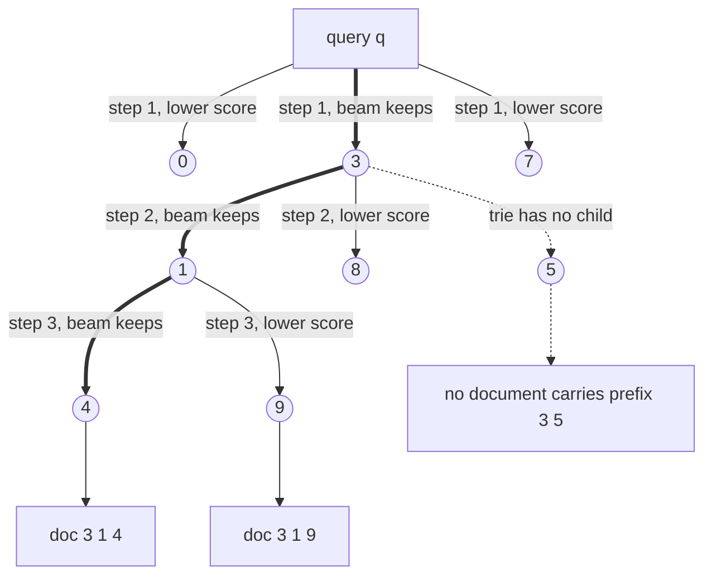
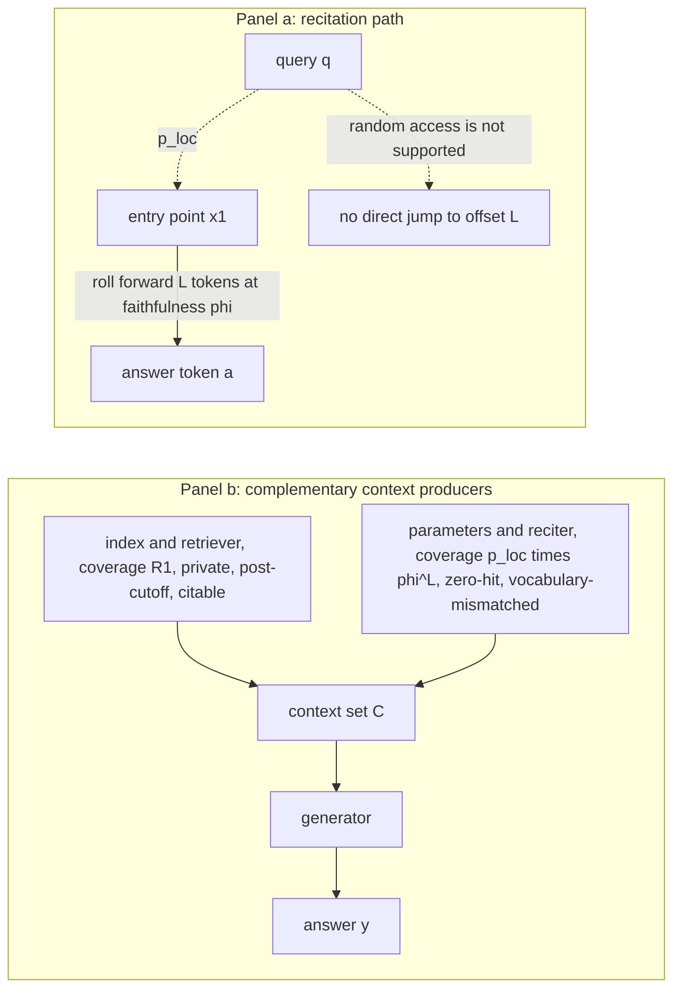

# Chapter 23: Generative Retrieval

This chapter explains when a model can retrieve by generating document identifiers, what that relocation costs, why updates remain hard, and how recitation can complement Retrieval-Augmented Generation (RAG).

## TL;DR

- Generative retrieval replaces a runtime corpus search with sequence decoding. A model reads a query and emits the identifier of a document.
- Atomic identifiers do not remove the index. They rebuild it as an N by d_model output matrix and force an exhaustive score over all documents.
- Hierarchical identifiers turn a document into a short path through semantic clusters. A prefix trie blocks paths that do not name real documents.
- Query latency grows with identifier length, about ⌈log_V N⌉ decoding steps. The corpus barely affects that path, but each document receives a shrinking share of fixed model capacity.
- Scaling the model with the corpus restores capacity but also makes each decoding step slower. This can erase the latency advantage.
- A learned index has no local write. New documents require rehearsal, retraining, a flat atomic layer, or a mutable approximate nearest neighbor (ANN) delta beside a frozen learned base.
- Recitation asks the model to generate a remembered passage before answering. It helps on some zero-hit queries, but its reliability falls exponentially with the distance from a remembered entry point. Retrieval remains the default for private, recent, changing, or citable material. Recitation is a measured fallback, not a source of provenance.

## The story

Imagine a library with an extraordinary librarian. In a normal library, the librarian searches a catalog. The catalog is the runtime index. It stores one addressable record for every book.

Generative retrieval trains the librarian to say a call number such as 629.2 directly after hearing a question. The call number is the document identifier, a short token sequence that names one document. The catalog did not disappear. Part of it moved into the librarian's memory, and part became the system used to organize call numbers.

Giving every book one unique spoken word is the atomic identifier design. It sounds simple, but the librarian must choose among every book in one step. That choice recreates a full shelf-sized catalog inside the final scoring layer.

A better design gives books hierarchical call numbers. The first digit chooses a broad wing, the next chooses an aisle, and later digits choose a shelf and book. These are semantically structured identifiers, which means nearby topics share early digits. The librarian now makes several small coarse-to-fine choices.

A prefix trie acts like a floor plan that lists every legal partial call number. If no book begins with 3 5, the floor plan closes that branch before it wastes a candidate slot. The librarian can carry several possible call numbers at once. That is beam search, a decoding method that keeps a fixed number of live prefixes.

This arrangement makes lookup time nearly flat as the library grows. The librarian only says one more digit when the number of books crosses the next power of the call-number alphabet.

The hidden problem is memory capacity. A physical catalog gives every book its own record. The librarian gives all books shares of one fixed memory. As the collection grows, the share available to distinguish each book shrinks. Making the librarian's memory larger can restore the share, but every spoken digit then requires reading a larger memory.

The next problem arrives with a shipment of new books. A catalog clerk can append local records. The trained librarian has no private memory slot assigned to one new book. Teaching only the new shipment can overwrite old associations because all call numbers compete in the same memory.

The practical library therefore freezes the librarian's learned catalog. It puts new books into a small mutable side catalog, searches both, and periodically retrains the librarian during compaction.

The librarian has one more useful talent. Sometimes the catalog search returns nothing, but the librarian remembers the start of a passage. The librarian can recite forward until the answer appears. This is recite-then-answer. It is continuation, not random access. Each extra word creates another chance to drift into the wrong passage. The physical catalog does not suffer that distance penalty.

The two routes therefore cooperate. The catalog supplies private, recent, and citable books. The librarian's recitation can cover a vocabulary-mismatched zero-hit question. Both routes produce passages for the same final answer writer. The system keeps their provenance labels separate so a remembered imitation never receives a false citation.

## Decoder table

| Technical term | Plain-English meaning | Why it matters |
|---|---|---|
| Retrieval-Augmented Generation (RAG) | A system that retrieves external passages and gives them to a generator | It keeps changing and citable facts outside model weights |
| Generative retrieval | Retrieval by generating a document identifier | It moves corpus lookup from a runtime index into model decoding |
| Generative Information Retrieval (GenIR) | The chapter's short name for generative retrieval | It distinguishes learned identifier generation from conventional search |
| Corpus D | The complete document collection | Classical retrieval touches it at query time while generative retrieval tries not to |
| Query q | The user's information request | It conditions identifier decoding and passage selection |
| Document d | One retrievable item in the corpus | It receives an identifier or an index record |
| Document identifier (docid) | A token string that names one document | The model retrieves by generating this string |
| Sequence-to-sequence model | A model that maps one token sequence to another | It maps documents and queries to identifiers |
| Autoregressive decoding | Generating identifier token t_j from p_theta(t_j given t_before_j and q) | Its product over T identifier tokens defines p_theta(i given q) |
| Differentiable Search Index (DSI) | A learned retriever that stores query-to-docid behavior in parameters | It demonstrates the model-based retrieval program |
| Indexing task | Training that maps a document's text to its own identifier | It teaches corpus memorization |
| Retrieval task | Training that maps a query to the relevant identifier | It teaches the behavior served at query time |
| Atomic identifier | One output vocabulary entry per document | It allows one-step decoding but creates an N by d_model output layer |
| Structured identifier | A multi-token identifier whose prefixes have meaning | It replaces a huge vocabulary with a short decode path |
| Semantically structured identifier | A structured identifier built from semantic clusters | It makes early token decisions easier and more informative |
| Naively structured identifier | A short identifier assigned in arbitrary corpus order | Its prefixes carry no topic signal and early errors discard large regions |
| Hierarchical k-means | Repeated clustering that creates a tree of document groups | It supplies coarse-to-fine semantic call numbers |
| Branching factor k | The number of child choices at a tree level | It trades identifier length against softmax width |
| Leaf capacity c | The maximum documents allowed in one terminal cluster | It determines how many final digits identify a document within a leaf |
| Symbols N, d, P, b, L, V, T, E, ∏, and Σ | Corpus size, embedding width, parameter count, stored bits per parameter, identifier length, alphabet size, training tokens, training epochs, product, and sum | They define the chapter's latency, capacity, training, and marginalization equations |
| Output embedding matrix | Learned vectors scored by the decoder's final layer | Atomic identifiers hide a dense document index here |
| Maximum inner product search | Ranking vectors by query-vector inner product | Atomic docid scoring performs it exhaustively without an index |
| Softmax | A normalized distribution over next-token choices | Its shared probability mass creates interference during updates |
| Best Match 25 (BM25) | The lexical retrieval method named in Figure 23.3 | Its inverted index supports local posting-list writes |
| Inverted file (IVF) | A coarse cluster index that probes selected lists | Structured decoding resembles an autoregressive IVF probe |
| Approximate nearest neighbor (ANN) | Fast vector search that avoids scanning all records | It is the conventional runtime alternative and the practical mutable delta |
| Hierarchical Navigable Small World (HNSW) | A graph-based ANN index | It offers local insertion and fast lookup at a resident-memory cost |
| Inverted File with Product Quantization (IVF-PQ) | A clustered vector index with compact codes | It is the quantized index baseline for latency and capacity comparisons |
| Product quantization (PQ) | A compact fixed-length code for a vector | Its 64-byte record sets one capacity parity point |
| Prefix trie | A tree containing all legal identifier prefixes | It masks impossible next tokens during decoding |
| Constrained decoding | Decoding that permits only structurally valid continuations | It makes nonexistent docids impossible |
| Generative Entity Retrieval (GENRE) | The named entity-retrieval system in the source | It introduced title decoding under a prefix trie |
| SEAL | The named substring-based retrieval system in the source | It permits corpus substrings as identifiers |
| Ferragina-Manzini index (FM-index) | A compressed substring index used to test legal continuations | It supports constrained decoding for arbitrary corpus n-grams |
| Beam search | Decoding that keeps several live prefixes | Beam width sets the maximum candidate-list depth |
| Beam width b or beta | The number of live decoding hypotheses, written beta in the latency argument | A beam of b can return at most b identifiers |
| Search controls e_search, n_list, n_probe, and ef_construction | HNSW query breadth, IVF list count, IVF lists probed, and HNSW insertion breadth | They set the worked search and write costs |
| Cross-entropy training | Training that raises probability on target sequences | It can make invalid identifiers unlikely but cannot forbid them |
| Top-k retrieval | Returning the k highest-ranked candidates | In generative retrieval its ceiling is set during beam decoding |
| Text-to-Text Transfer Transformer base model (T5-base) | The 220M-parameter backbone used in the worked examples | Its size anchors memory, bandwidth, and capacity calculations |
| Microsoft Machine Reading Comprehension (MS MARCO) | The 8.8M-passage benchmark corpus in the source | It exposes the scale failure of atomic identifiers |
| Neural Corpus Indexer (NCI), SEAL, and DSI with query generation (DSI-QG) | Named published generative retrievers in the source | They use structured or substring identifiers at passage scale |
| A100 accelerator | The processing device used in training and bandwidth examples | Its sustained rates turn arithmetic and bytes into time |
| doc2query-style generation | Manufacturing likely queries from each document | It reduces the mismatch between document training and query serving |
| Query-time footprint | Memory and structures touched while serving one query | Generative retrieval removes direct corpus access from this path |
| Bandwidth-bound decoding | Decoding limited by reading weights rather than arithmetic | Model size determines per-step latency at batch size one |
| Floating-point operation (FLOP) | One arithmetic operation in a compute budget | It prices encoding, decoding, training, and insertion |
| fp32, fp16, bf16, and int8 | 32-bit, 16-bit, brain 16-bit, and 8-bit numeric formats | They change model and index memory costs |
| Per-document capacity kappa_gen | The model's total stored bits divided among documents | kappa_gen(N) = bP/N falls as the corpus grows |
| Index capacity kappa_idx | The fixed number of stored bits per indexed document | kappa_idx stays flat as corpus size grows |
| Parity point N star | Corpus size where model bits per document equal index bits per document | N star = bP/kappa_idx is a screening calculation, not a release threshold |
| Quality ceiling | The loss of document-specific resolution as fixed model capacity is shared more widely | It limits corpus-scale quality even when latency stays flat |
| Dual encoder | A retriever that independently embeds queries and documents | It is the tuned quality baseline that large generative retrievers failed to match |
| Cross-encoder reranker | A model that jointly scores a query and each candidate | It can recover precision after a wide generative beam |
| Write locality | Updating only a bounded addressable region for one insertion | Classical indexes have it and learned indexes do not |
| Posting list | The documents associated with one lexical term | An inverted-index insertion touches only lists for the new document's terms |
| Out-degree M | The graph-neighbor limit in HNSW | It appears in the O(M log N) insertion cost |
| Parameter superposition | Many document mappings sharing the same parameter vector theta | A new mapping can disturb old mappings |
| Catastrophic forgetting | Losing old document mappings while learning new ones | It makes new-only fine-tuning unsafe |
| DSI++ | The continual-indexing method named in the source | It combines flatter updates with rehearsal to reduce forgetting |
| DSI-XXL | The 11B-parameter DSI variant in the source | It shows that ample nominal capacity does not guarantee retrieval quality |
| Sharpness-aware minimization | Training that favors parameter regions tolerant to perturbations | It helps preserve old mappings during continual updates |
| Generative memory | Pseudo-query rehearsal for already indexed documents | It restores old-document coverage during updates |
| Hits@10 | Whether a relevant item appears among ten returned items | It is the metric used for the reported DSI++ improvement |
| IncDSI | The incremental atomic-docid method named in the source | It inserts one new classifier row while freezing the rest of the model |
| Classifier row w_i | One learned vector assigned to document i | Adding one row creates local insertion but restores a flat scan |
| Log-structured merge (LSM) pattern | A frozen base plus a mutable delta and periodic compaction | It is the practical update architecture proposed by the source |
| Mutable delta N_delta | A small conventional index for documents newer than the learned base | It gives fresh documents local writes and immediate searchability |
| Compaction | Periodically rebuilding the learned base and clearing the delta | It amortizes expensive global retraining |
| Tombstone | A marker that makes a deleted item unreachable | It supports fast retrieval-path deletion in the mutable layer |
| Staleness window | Time from ingestion until successful retrieval | It exposes the operational cost of learned-index refreshes |
| Service-level agreement (SLA) | A promised freshness or availability target | Retraining time can make the design fail before quality matters |
| Service-level objective (SLO) | The measured operating target for a service | The source recommends p99 ingest-to-retrieval freshness |
| Low-Rank Adaptation (LoRA) | Updating a small low-rank parameter subspace | It saves update parameters but does not isolate old docid probabilities |
| Parametric store theta | Information absorbed into model weights theta | It can continue memorized text but cannot contain post-training facts |
| Non-parametric store D | External indexed documents | It supports updates, random access, and provenance |
| Recite-then-answer | Generate a remembered passage, then answer from it | It turns continuation memory into temporary context |
| Random access | Jumping directly to an item without generating earlier content | An autoregressive model does not natively provide it |
| Entry-point probability p_loc | Chance of generating the correct passage beginning | It is the first factor in s = p_loc times phi^L times A |
| Per-token faithfulness phi | Chance that each generated token stays on the true passage | phi^L creates exponential decay with distance L |
| Roll-forward distance L | Tokens between the remembered entry point and the answer | Longer distances sharply reduce recitation reliability |
| Extraction accuracy A | Chance of reading the answer after a clean passage is in context | It is the final factor in end-to-end recitation success |
| Marginalization over recitations | Summing P(a given q, r)P(r given q) over recited passages r | It explains sampling m recitations before answering |
| Context set C | Passages handed to the final generator | Retrieval and recitation both produce this same object |
| First-stage recall R1 | Chance the retriever supplies a useful passage | It combines with recitation coverage under an independence assumption |
| Zero-hit query | A query for which the external index returns no useful passage | It is the preferred trigger for recitation |
| Provenance | Evidence of where a passage came from | A recited passage cannot support an attributable citation |
| Dense Passage Retrieval (DPR) | The dense retriever used for the Natural Questions comparison | Its top-100 accuracy supplies the worked retrieval baseline |
| Natural Questions | The open-domain question-answering benchmark in the worked example | It anchors the recitation and retrieval measurements |
| Exact match | Answer accuracy requiring the expected answer string | It is the end-to-end outcome in the worked example |
| Self-consistency | Sampling several outputs and combining them | It helps only when error structure supports the voting rule |
| Error scattering | Wrong samples tend to disagree with one another | Two matching correct samples can then win |
| Error concentration | Wrong samples repeat the same attractor | Majority voting can become worse than one sample |
| Prefill | Parallel processing of supplied context tokens before generation | Retrieval plus prefill can be much faster than serial recitation |
| p95 and p99 | The 95th and 99th latency percentiles | They expose tail latency and freshness behavior |
| Normalized Discounted Cumulative Gain (nDCG) | A ranking-quality metric | A good score cannot rescue a design that misses its freshness SLA |

## Core mechanics

### 23.1 Generating document IDs instead of searching

#### Classical search keeps the corpus on the query path

- What: Classical retrieval computes d_hat = arg max over d in D of s(q, d).
- Why: Inverted lists, IVF cells, and HNSW graphs avoid evaluating the scoring function against all N documents.
- Without it: Exhaustive scoring touches every document for every query.
- Cost: The corpus must remain resident, sharded, replicated, and consistent because it is a runtime argument. The opening example keeps three replicas of its 27 GB index.

#### Generative retrieval turns retrieval into decoding

- What: Assign document d an identifier i(d) = (t1, ..., tL) from an alphabet of size k. Train p_theta(i given q) = ∏ from j = 1 to L of p_theta(t_j given t_before_j and q).
- Why: The query can reach a document by touching model weights and an identifier constraint, not the corpus itself.
- Without it: A conventional index remains in the serving path.
- Cost: The corpus footprint moves into identifier design and training. It does not disappear.

#### DSI trains memorization and generalization together

- What: Tay et al. (2022) train an indexing task from document text to its docid and a retrieval task from query to docid. Metzler et al. (2021) frame the program as replacing the index with parameters.
- Why: The indexing task teaches the corpus. The retrieval task teaches the mapping used in production.
- Without it: Document-only training does not match query-only serving.
- Cost: Training needs examples for both tasks. Generated queries cover documents that lack real query logs.

#### Atomic identifiers rebuild the index inside the softmax

- What: Give each document one vocabulary entry so retrieval finishes in one decode step.
- Why: The design appears simple and removes multi-step decoding.
- Without a structured alternative: The output matrix has N rows of width d_model, and every query scores every row.
- Cost: For 8.8M passages, d_model = 768, and fp32 storage, the table is 8.8 × 10^6 × 768 × 4 bytes = 27.0 GB.
- Cost: The 220M-parameter T5-base backbone is 880 MB in fp32. The identifier table is 31 times larger.
- Claim limit: Atomic retrieval performs exhaustive maximum inner product search with no ANN index to accelerate it.

#### Semantic hierarchy spends the identifier space differently

- What: Embed documents, run hierarchical k-means with k = 10, and split clusters larger than c = 100.
- Why: Each token becomes a coarse-to-fine semantic choice conditioned on the query and prior digits.
- Without semantics: An arbitrary first digit is a memorized fact. A step-one error discards one tenth of the corpus with six decisions remaining.
- Cost: At 8.8M passages, at least 88,000 leaves are needed. Five tree levels select a leaf, and two digits select among at most 100 leaf members.
- Cost: L = 7 tokens. The output table is 10 × 768 × 4 = 30,720 bytes, about 31 KB.
- Comparison: The design changes 27 GB of atomic output embeddings into seven decode steps.
- Evidence limit: Tay et al. found semantic identifiers strongest among their three schemes at their largest corpus scale.

#### The hierarchy resembles an autoregressive IVF probe

- What: Each generated digit narrows the active semantic cluster.
- Why: Later decisions can use the query and every earlier digit.
- Without autoregressive conditioning: A coarse IVF centroid comparison treats probe choices independently.
- Cost: Identifier latency grows linearly in the number of decode steps L.

#### Constrained decoding provides validity, not relevance

- What: Store assigned docids in a prefix trie. Mask a token whenever the current prefix has no matching child.
- Why: The decoder can otherwise produce any of k^L strings.
- Without it: With k = 10 and L = 7, 10^7 strings exist but only 8.8M are documents. About 1.2M valid-looking strings name nothing.
- Cost: The decoder consults the trie at each step.
- Comparison: De Cao et al. (2021) introduced GENRE with a trie for entity titles. Bevilacqua et al. (2022) use an FM-index in SEAL so corpus n-grams can be legal identifiers.
- Claim limit: The constraint eliminates hallucinated docids. It does not stop the model from choosing the wrong real docid.

#### Beam width is retrieval depth

- What: A beam of width b carries b live prefixes and returns at most b docids.
- Why: The beam supplies the candidate list for any downstream reranker.
- Without enough width: A beam of 10 cannot serve a reranker that expects 20 candidates.
- Cost: Wider beams add arithmetic, but hypotheses in one step share the same model-weight read.
- Claim limit: Filtering invalid docids after decoding wastes beam slots and can return fewer than b candidates.

#### Worked comparison at 8.8M passages

Configuration 1 uses dense vectors and HNSW.
- Vectors use 27.0 GB.
- At M = 32, the base layer stores up to 64 neighbor identifiers per node.
- Graph storage is 64 × 4 = 256 bytes per node, or 2.25 GB total.
- Total resident memory is 29.3 GB.
- At e_search = 128, a query touches about 10^3 candidate vectors.
- Each vector is a random 3,072-byte fetch at about 100 ns.
- Memory latency is about 0.1 ms.
- Arithmetic is about 10^3 × 768 × 2 = 1.5 million FLOPs.

Configuration 2 uses atomic generative identifiers.
- Output embeddings use 27.0 GB, plus 880 MB for the backbone.
- One fp32 step streams 2.70 × 10^10 bytes.
- At 2.0 TB/s, that takes 13.5 ms.
- fp16 halves the time to 6.8 ms.
- The source calls this configuration strictly dominated because it is slower and no smaller than the index.

Configuration 3 uses hierarchical identifiers.
- The fp16 model uses 440 MB.
- Encoding a 32-token query costs 2 × 1.1 × 10^8 × 32 = 7.0 billion FLOPs, or 0.06 ms.
- Seven decode steps read at most 7 × 440 MB = 3.08 GB.
- At 2.0 TB/s, that read takes at most 1.5 ms.
- A beam of 10 adds 2 × 1.4 × 10^8 × 10 × 7 = 19.6 billion FLOPs, or 0.16 ms.
- Total query time is about 1.6 ms.
- Comparison: Memory falls by 29.3 divided by 0.44 = 67 times. The source calls latency about eight times higher, but its stated endpoints, 1.6 ms and 0.1 ms, imply 16 times.
- Quantization limit: Int8 vectors use 6.8 GB. Adding the 2.25 GB graph gives 9.05 GB, or about 20.6 times the 440 MB model.
- Omitted bill: This serving arithmetic excludes the training run.

#### Scale checks and operating choices

- Tay et al. test atomic identifiers only through 320,000 documents. That output table is 320,000 × 768 × 4 = 983 MB, already larger than T5-base.
- NCI, SEAL, and DSI-QG use structured or substring identifiers at passage-ranking scale.
- ⌈log_10(8.8 × 10^6)⌉ = ⌈6.94⌉ = 7. Seven tokens are the information floor for a ten-symbol alphabet.
- Use semantic identifiers by default. Atomic identifiers become plausible only below roughly 10^5 documents, where the table stays under 1 GB.
- Choose branching factor from the decode budget. At 8.8M passages, k = 10 needs seven steps and k = 100 needs four.
- Four steps cut latency by 43 percent but widen the softmax by 10 times.
- Prefer smaller k when clusters are unbalanced because sparse wide branches weaken the prefix signal.
- Co-train indexing and retrieval. Manufacture pseudo-queries for corpus coverage unless real logs cover most documents.
- Adopt generative retrieval for footprint, not latency. The worked HNSW path is 0.1 ms versus about 1.6 ms.
- A tenfold corpus increase to 8.8 × 10^7 requires eight digits, about 14 percent more query latency.
- The same growth multiplies training data by ten and can force a tree rebuild that reassigns learned identifiers.
- A frozen corpus favors the architecture. Daily changes favor a conventional index.

### 23.2 Constant-time retrieval versus the quality ceiling

#### Query latency depends on the model and identifier

- What: At batch size one, each decode step streams decoder weights once.
- Why: The arithmetic finishes before the memory read, so decoding is bandwidth-bound.
- Without shared weight reads: Beam search would multiply the dominant memory traffic by beam width.
- Cost: Query time is L times the per-step weight-read time.
- Cost: Unique identifiers require L ≥ log_V N for an alphabet of V symbols.
- Claim limit: Retrieval is logarithmic, not truly constant. Base-ten identifiers need six digits at 320,000 documents, seven at 8.8M, and nine at one billion.
- Claim limit: A thousandfold corpus increase adds three decode steps.

#### Index cost still grows with the corpus

- What: An IVF index with √N lists and n_probe probes performs about (1 + n_probe)√N comparisons.
- Why: It compares against √N centroids and then members of the selected lists.
- Without partitioning: The index would compare against all N vectors.
- Cost: The growth is sublinear but unbounded.
- HNSW limit: Its hop count is logarithmic, but N × d × 4 bytes must remain resident.
- System limit: Crossing a machine boundary adds shard fan-out and the maximum of shard tail latencies.

#### Fixed model capacity creates a parity point

- What: An index gives every document a private record. A generative retriever divides bP stored bits among N documents.
- Why: Per-document capacity predicts when the model becomes definitely capacity-starved.
- Without the comparison: Small-corpus wins can be extrapolated beyond the regime that funded them.
- Cost: A 768-dimensional fp32 vector uses 768 × 32 = 24,576 bits.
- Cost: PQ with 64 subquantizers at 8 bits uses 512 bits, or 64 bytes.
- Cost: Model capacity per document is kappa_gen(N) = bP/N.
- Cost: Index capacity kappa_idx is constant.
- Parity: N star = bP/kappa_idx.
- Claim limit: bP/N is generous because the same parameters also store language and the identifier grammar.
- Claim limit: N star marks definite starvation beyond the point. It does not say quality is perfect below it.

#### Scaling the model restores the problem

- What: Keep bP/N fixed by scaling P in proportion to N.
- Why: This preserves the nominal bits available per document.
- Without model scaling: Each new document dilutes the shared pool and hurts near-duplicate separation.
- Cost: Each decode step reads P, so latency becomes linear in N.
- Comparison: A quantized lookup spends stored bits more cheaply than streaming a larger model through a matrix multiplication.
- Atomic limit: An N by d output layer reaches the same linear memory and retraining problem immediately.

#### Worked latency and capacity comparison

The shared constants are P = 220M parameters and b = 16 bits.
- The decoder holds about half the weights.
- One step streams 110 × 10^6 × 2 = 0.22 GB.
- At 1.6 TB/s, one step takes 0.22/1600 = 0.1375 ms.
- The IVF-PQ baseline uses d = 768, m = 64, and n_probe = 32.
- It scans 33√N candidates.
- Each candidate needs 64 table lookups.
- One core sustains 10^9 lookups per second.

At N = 320,000 documents:
- L = 6.
- Generative latency is 6 × 0.1375 = 0.825 ms.
- IVF-PQ compares 18,668 candidates.
- It performs 1.195 × 10^6 lookups in 1.20 ms.
- Model capacity is 3.52 × 10^9 divided by 3.2 × 10^5 = 11,000 bits per document.
- The PQ index provides 512 bits per document.
- The model has 21 times the nominal per-document budget and is faster in this calculation.

At N = 8.8M passages:
- L = 7.
- Generative latency is 7 × 0.1375 = 0.96 ms.
- IVF-PQ compares 97,894 candidates.
- It performs 6.27 × 10^6 lookups in 6.27 ms.
- A 27.5 times larger corpus raises generative latency by 17 percent.
- The same growth raises index latency by 424 percent.
- Model capacity falls to 3.52 × 10^9 divided by 8.8 × 10^6 = 400 bits per document.
- Capacity is now below the index's 512 bits.
- The latency argument strengthens while the quality argument flips.

The memory comparison has an important limit.
- The model remains 440 MB.
- The 64-byte PQ index uses 8.8 × 10^6 × 64 = 563 MB.
- The fp32 vector index uses 27.0 GB, about 60 times the model.
- The memory advantage is large against flat fp32 storage and nearly absent against PQ.

#### Evidence checks and decision rules

- N star is 3.52 × 10^9 divided by 512 = 6.9M documents.
- The 8.8M-passage corpus is 28 percent beyond that point.
- The capacity model predicts a base-sized retriever should lose there.
- Pradeep et al. (2023) found model scale dominant, yet multi-billion-parameter systems still failed to match a tuned dual encoder on the full corpus.
- An 11B DSI-XXL has 1.76 × 10^11 bits and a 344M-document parity point.
- It still lost at 8.8M, so capacity is necessary but not sufficient.
- The remaining gap is identifier assignment under this analysis.
- Compute N star before prototyping.
- Reject by default when N is within a factor of two of N star because the bound is optimistic.
- Consider the design when a static corpus is below one tenth of N star.
- Keep the ANN index unless measured ANN latency owns p99.
- One 256-token generator-prefill chunk can cost more than the 6.27 ms index scan.
- A beam of 50 still uses L decode steps, so candidate depth is nearly free in dominant weight-read terms.
- Add a cross-encoder when its latency does not consume the margin.
- Recompute parity after changing corpus size, model size, or quantization.
- Halving PQ bytes halves kappa_idx and doubles N star.
- At 20M documents, the 220M-parameter model has only 176 bits per document against 512 bits for PQ.
- An 11B fp16 decoder step streams 22 GB and takes 13.75 ms at 1.6 TB/s.
- Seven steps take about 96 ms, about 15 times the 6.27 ms IVF-PQ scan.

### 23.3 Incremental indexing: the open wound

#### Fresh documents have zero recall

- What: A trained decoder and its trie know only identifiers from the last training corpus.
- Why: New content needs both a legal docid and a learned query-to-docid mapping.
- Without an update: Recall on new documents is zero, not merely lower.
- Cost: Adding a docid to the trie alone does not create the missing model association.

#### Classical indexes have write locality

- What: An inverted-index insertion appends postings for the terms in document d.
- Why: Each update touches a bounded addressable region.
- Without locality: Every insertion becomes a global rewrite.
- Cost: Inverted-index write cost is O(∣d∣), independent of N.
- Cost: HNSW allocates one node and rewires O(M log N) nearby edges.
- Operating property: Both update paths can run alongside queries while untouched bytes remain identical.

#### A learned index superposes every document

- What: Every docid probability is a product of L shared softmax factors controlled by the full parameter vector theta.
- Why: The network stores mappings across all P parameters rather than in private document rows.
- Without preservation data: Raising probability for a new docid removes probability mass from existing choices.
- Cost: The gradient is dense in theta. No isolated submatrix belongs only to the new document.
- Claim: A correct insertion is global in principle because the architecture has no local write.

#### Full retraining sets the freshness floor

The source prices a DSI-style retriever with N = 10^7 and P = 2.2 × 10^8.
- Each document contributes its first 64 tokens.
- It also contributes 10 pseudo-queries of 16 tokens each.
- Total tokens are 64 + 10 × 16 = 224 per document per epoch.
- Ten epochs produce T = 10^7 × 224 × 10 = 2.24 × 10^10 tokens.
- The 6PT training estimate gives 6 × 2.2 × 10^8 × 2.24 × 10^10 = 2.96 × 10^19 FLOPs.
- Eight A100s each sustain 1.5 × 10^14 FLOP/s.
- Aggregate throughput is 1.2 × 10^15 FLOP/s.
- Training time is 2.46 × 10^4 seconds, or 6.84 hours.
- The job consumes 54.7 A100-hours.
- Claim limit: Queueing, evaluation, and approval make real staleness worse than 6.84 hours.

#### New-only fine-tuning forgets old mappings

- What: Fine-tune the checkpoint only on newly arrived documents.
- Why teams try it: It appears cheaper than global retraining.
- Without rehearsal: The shared softmax objective provides no term that preserves earlier docids.
- Failure: Mehta et al. (2023) report substantial forgetting during continual indexing in DSI++.
- Mitigation: Sharpness-aware minimization seeks flatter regions that tolerate parameter perturbations.
- Mitigation: Generative memory rehearses pseudo-queries for old documents.
- Measurement: The method reports 21.1 percent higher average Hits@10 over competitive baselines on Natural Questions.
- Measurement: It uses six times fewer model updates than retraining across five sequential corpora.
- Claim limit: Rehearsal makes the update incremental in gradient steps, not in data coverage.
- LoRA limit: A low-rank update restricts the update subspace. It does not give old and new docids disjoint probability mass.

#### IncDSI restores locality by restoring a flat layer

- What: Kishore et al. (2023) observe that with atomic docids, the last layer scores document i using the query encoding and one vector w_i.
- Why: IncDSI can add one row w_(N+1) while freezing the network.
- Constraint: The new row should rank first for its pseudo-queries and should not displace existing documents on their training queries.
- Cost: Insertion takes roughly 20 to 50 ms per document.
- Quality: The source reports quality competitive with full retraining.
- Failure moved elsewhere: The N dense rows require exhaustive scoring.
- Claim limit: Local writes return because the flat vector index returns.

#### Frozen base plus mutable delta is the shipping pattern

- What: Freeze the learned base. Put new documents in a small mutable ANN index. Query both, merge results, and retrain on a compaction schedule.
- Why: The mutable delta restores local insertion without abandoning the learned base immediately.
- Without compaction: The delta keeps growing and merge behavior becomes a larger part of serving quality.
- Cost: Delta writes follow conventional ANN insertion complexity.
- Deletion: A trie blocklist or tombstone can make an identifier unreachable quickly.
- Claim limit: Blocking retrieval does not remove memorized content from model parameters, and recitation can still surface it.

#### Worked update comparison at 0.5 percent daily churn

The corpus has 10^7 documents and receives 50,000 new documents each day.

Each new vector has d = 768 fp32 dimensions.

Configuration 1 retrains nightly.
- Compute is 2.96 × 10^19 FLOPs.
- Runtime is 6.84 hours on eight A100s.
- Consumption is 54.7 A100-hours.
- At $2 per A100-hour, one refresh costs $109.
- Annual cost is about $40,000.
- The honest freshness SLA is worse than seven hours.

Configuration 2 inserts one IncDSI row per document.
- At 50 ms each, 50,000 documents consume 2,500 seconds of Graphics Processing Unit (GPU) time.
- Each document becomes searchable about 50 ms after arrival.
- This improves staleness by roughly 5 × 10^5 relative to 2.46 × 10^4 seconds.
- The atomic matrix uses 10^7 × 768 × 4 = 3.07 × 10^10 bytes, or 30.7 GB.
- Every query performs 2 × 768 × 10^7 = 1.54 × 10^10 FLOPs.
- Reading 30.7 GB at 2.04 TB/s takes 15.1 ms of High Bandwidth Memory (HBM) traffic.
- Trade-off: Local writes purchase a brute-force read.

Configuration 3 uses an HNSW delta and weekly compaction.
- M = 32 and ef_construction = 200 require about 6,400 distance computations per insertion.
- Each distance costs 2d = 1,536 FLOPs.
- One insertion costs 9.83 × 10^6 FLOPs.
- One vectorized Central Processing Unit (CPU) core sustains 10^10 FLOP/s in the example.
- Insertion takes 0.98 ms per document.
- The whole day's arrivals take 49 seconds on one core.
- Staleness is about one millisecond.
- After seven days, the delta contains 3.5 × 10^5 vectors.
- That is 3.5 percent of the corpus and 1.08 GB.
- Weekly compaction amortizes to 7.8 A100-hours per day.
- Annual cost is about $5,700.
- Daily insertion compute is 5 × 10^4 × 9.83 × 10^6 = 4.92 × 10^11 FLOPs.
- Full retraining uses 6.0 × 10^7 times more arithmetic and gives worse freshness.

#### Sanity checks and decision rules

- Hoffmann et al. (2022) report 5.76 × 10^23 FLOPs for Chinchilla with 7 × 10^10 parameters and 1.4 × 10^12 tokens.
- The 6PT rule predicts 5.88 × 10^23 FLOPs, which is 2.1 percent high.
- A dense retriever inserts new document vectors locally but must re-embed all N documents after an encoder change.
- For a 110M-parameter encoder, 10^7 documents, and 256 tokens each, re-embedding costs 5.63 × 10^17 FLOPs.
- That takes about eight minutes on the same eight A100s.
- It is roughly 53 times cheaper than the generative retriever's full retrain.
- Dense retrieval pays after rare scheduled encoder changes. Generative retrieval pays after continuous corpus changes.
- Reject generative retrieval when 6PT divided by sustained cluster throughput exceeds the freshness SLA.
- A genuinely static corpus can pay the retraining bill once.
- Default to frozen base plus mutable delta.
- At 0.5 percent daily churn, weekly compaction leaves a 3.5 percent delta.
- Above roughly 2 percent daily churn, the delta rivals the base within a fortnight.
- In that regime, use a conventional ANN index with a reranker.
- Never update on new documents alone. Rehearse old-document pseudo-queries and evaluate old mappings.
- Choose atomic docids only after accepting the flat-index query bill.
- Above roughly 10^7 documents, semantic hierarchical identifiers are the stated alternative, with compaction-based updates.
- A decode-time blocklist satisfies fast unreachability but not a requirement that content no longer be stored.
- Track p99 time from ingest to first successful retrieval as a named freshness SLO.
- Keep recent regulated content in the mutable delta so deletion remains a tombstone operation.
- Admit only stable, cleared content into the frozen learned base.

### 23.4 Recite-then-answer, and GenIR as RAG's complement

#### Two stores can produce the same context object

- What: The parametric store theta contains training-time memory. The non-parametric store D contains indexed documents.
- Why: The source frames RAG as enabling a 7B model instead of a 70B model by keeping facts in D. DSI-style retrieval folds D into theta and emits docids.
- Third path: Ask theta to generate the remembered passage itself, then answer from that passage.
- Without the distinction: A design debate falsely treats retrieval and recitation as mutually exclusive.
- Claim: Both paths end with passages in context set C for the same generator.

#### Recitation converts continuation into temporary access

- What: An autoregressive model stores next-token behavior, P(x_t given x_before_t).
- Why: The weights natively support continuation from a left context.
- Without an entry point: The model has no random-access operation for a fact L tokens inside a memorized passage.
- Mechanism: Generate a title, opening line, or first sentence, then roll forward until the answer appears.
- Claim: Recitation manufactures the left context that makes the fact likely next. It does not retrieve the fact directly.

#### Recitation success has an exponential distance term

- What: Answer probability is P(a given q) = Σ over r of P(a given q, r)P(r given q).
- Approximation: Sample m recitations and answer from each.
- Entry factor: p_loc is the chance of locating the correct passage start.
- Continuation factor: phi is the per-token chance of staying faithful.
- Distance: L is the number of tokens between entry and answer.
- Extraction factor: A is the chance of answering once a clean passage is in context.
- Success: s = p_loc × phi^L × A.
- Without short distance: Even strong per-token faithfulness compounds into drift.
- Cost: At phi = 0.995, phi^60 = 74.0 percent and phi^200 = 36.7 percent.
- Claim limit: Retrieval has no phi^L term because the index provides random access.

#### Retrieval and recitation cover different misses

- What: Retrieval coverage is R1. Recitation coverage before extraction is p_loc × phi^L.
- Why: Under independence, union coverage is 1 - (1 - R1)(1 - p_loc × phi^L).
- Retrieval-only strengths: It supplies private, post-cutoff, changing, and citable documents.
- Recitation-only strength: It can survive a zero-hit query caused by vocabulary mismatch when the model memorized the relevant passage.
- Evidence: Yu et al. (2023) report that the strongest GenRead configurations combine generated and retrieved documents.
- Without provenance tags: A recited imitation can receive a fabricated citation that looks real.
- Claim limit: A larger model can improve p_loc and phi. It still does not create random access, post-cutoff knowledge, or source provenance.
- Mirror limit: Retrieval is not universally helpful. The source notes that a small model can fail to exploit a large datastore and retrieval can hurt high-popularity facts.

#### Worked recitation and retrieval comparison

The example uses a 7B generator, a DPR-grade retriever, and Natural Questions.

Shared constants are phi = 0.995, A = 0.75, and R1 = 85.4 percent top-100 retrieval accuracy.

Configuration 1 is a head entity with recitation only.
- p_loc = 0.70.
- L = 60.
- phi^L = 0.740.
- Coverage is 0.70 × 0.740 = 51.8 percent.
- End-to-end exact match is 0.518 × 0.75 = 38.9 percent.

Configuration 2 is a tail entity with recitation only.
- p_loc = 0.15.
- L = 200.
- phi^L = 0.367.
- Coverage is 5.5 percent.
- End-to-end exact match is 4.1 percent.
- Accuracy drops by a factor of nine with the same model and task.

Configuration 3 fuses retrieved and recited contexts.
- Union coverage is 1 - (1 - 0.854)(1 - 0.518).
- This is 1 - 0.146 × 0.482 = 93.0 percent.
- The gain is 7.6 percentage points over retrieval alone.
- Claim limit: The formula assumes independence between the two coverage events.

#### Voting depends on the error structure

- What: Draw m = 5 recitations with per-sample success s = 0.389.
- Scattered errors: The correct answer wins if it appears at least twice because wrong answers do not repeat.
- Result: 1 - (1 - s)^5 - 5s(1 - s)^4 = 64.4 percent.
- Concentrated errors: A repeated wrong attractor forces the correct answer to win a strict majority.
- Result: The probability of at least three correct samples is 29.9 percent.
- Without measuring correlation: Five expensive samples can underperform one sample at 38.9 percent.
- Claim: Below s = 0.5, correlated errors make self-consistency harmful in this example.

#### Recitation is slower in the worked serving model

- What: A 7B fp16 model reads 14 GB of weights per generated token.
- Cost: At 2.0 TB/s, each token takes 7.0 ms.
- Cost: A 60-token recitation takes 420 ms.
- Retrieval cost: ANN search takes about 10 ms.
- Prefill cost: Five 256-token chunks contain 1,280 tokens.
- Prefill compute: 2 × 7 × 10^9 × 1,280 = 1.79 × 10^13 FLOPs.
- At 3.4 × 10^14 FLOP/s, prefill takes 52.7 ms.
- Total retrieval path: About 63 ms.
- Comparison: Recitation provides lower coverage at 6.7 times the latency in this worked setup.

#### Sanity checks and operating choices

- Karpukhin et al. (2020) report 41.5 exact match for DPR on Natural Questions.
- The recitation model gives 38.9 percent, 2.6 points lower.
- DPR's implied extraction rate is 41.5 divided by 85.4 = 0.486.
- The recitation example assumes 0.75 because one clean on-topic passage reaches the reader.
- Claim limit: The simple decay model supports recitation as competitive with a 2020-grade retrieve-then-read system, not superior.
- Pasting a catalog into the prompt is not generative retrieval.
- Attention considers the whole catalog on every request, so cost is linear in catalog size and gains no index narrowing.
- Default to retrieval and trigger recitation on zero-hit queries.
- Run recitation in parallel only for a measured head-heavy traffic slice whose external index is thin.
- Choose the roll-forward cap from measured phi.
- Solving phi^L ≥ 0.5 at phi = 0.995 gives L ≤ 138 tokens.
- Past that point, more than half the recitations have drifted under the model.
- Measure phi against source passages that the model is known to have seen.
- Tag every context item as retrieved or recited before generation.
- Never attach a citation to a recited passage.
- Test five recitations over 200 queries to see whether wrong answers scatter or repeat.
- Keep m = 1 until scattering is demonstrated.
- Route by an external entity-popularity feature when available, not the reciter's own confidence.
- In the staff example, 12,000 changing documents out of 400,000 is 3 percent per week.
- After 13 weeks, 1 - 0.97^13 = 33 percent of memorized content is stale.
- Keep the index for this changing internal corpus. Add recitation only as a zero-hit fallback.
- A static corpus with no citation requirement and head-heavy queries is the condition that can reverse that decision.

## Diagrams

### Figure 23.1



Figure 23.1: Retrieval becomes decoding. Each step emits one identifier token. The heavy path is what the beam keeps, thin branches are valid continuations it scored lower, and the dashed branch is deleted by the prefix trie because no document lives under it. The path length is L = ⌈log_k N⌉ tokens - seven for 8.8M passages at k = 10 - so the query path touches the model's weights and a trie of identifiers, never the corpus.

### Figure 23.2

```text
Query latency, milliseconds, log scale

100 |                                      o  IVF-PQ
    |                              o          (1 + n_probe)sqrt(N)
 10 |                      o
  2 |                              *-------*  generative: L(N) decode steps
  1 |      *-------*-------*
    +------------------------------------------------------------>
          10^5    10^6    10^7    10^8    10^9  corpus size N

Capacity per document, bits, log scale

10^4| o......... dense fp32, d = 768: 24,576 bits ...............
    |  \
10^3|   \      N star = bP/kappa_idx
    |    \     = 6.9M
 512|-----o----- IVF-PQ: 512 bits -------------------------------
10^2|      \
    |       \                 bP/N
10^1|        o-----------o-----------o
    +------------------------------------------------------------>
          10^5    10^6    10^7    10^8    10^9  corpus size N
```

Figure 23.2: The same relocation seen from both sides, for a 220M-parameter model at b = 16 bits. Query latency (top) is flat for generative retrieval because it depends on identifier length, not corpus size, while IVF-PQ grows as √N. Capacity per document (bottom) is flat for an index because every document gets a private record, and falls as 1/N for generative retrieval because every document shares one pool. The curves cross at N ⋆ = 6.9M against a 64-byte quantized index and at 143k against an uncompressed one.

### Figure 23.3

| Index design | Storage rewritten by inserting one document | Write cost |
|---|---|---|
| Inverted index, BM25 | A handful of separate posting-list regions | O(∣d∣) posting lists |
| Graph index, HNSW | One local graph neighborhood | O(M log N) edges |
| Learned index, DSI-style GenIR | The full shared parameter field | All P parameters |
| Frozen learned base plus mutable delta | Delta neighborhood only. Base remains frozen | O(M log N_delta) edges. Base untouched |

Figure 23.3: Incremental indexing is decided by write locality. Inserting one document rewrites a handful of posting lists in an inverted index and O(M log N) edges in an HNSW graph, but a learned index superposes every document across every parameter, so the correct insertion is a global update - which is why production systems freeze the learned base and route new arrivals into a small mutable delta.

### Figure 23.4



Figure 23.4: Retrieval and recitation are two producers of the same object, so they compose rather than compete. (a) An autoregressive model has no random-access primitive. It reaches a fact at offset L only by locating an entry point and rolling forward, which costs a factor φ^L. (b) Each path covers what the other cannot, and under independence their union raises coverage from R1 alone to 1 - (1 - R1)(1 - p_loc φ^L).

## Whiteboard pack

### What to draw

1. Draw a query box on the left.
2. Draw two branches from the query.
3. On the upper branch, draw a sequence decoder that emits one hierarchical docid token at a time.
4. Put a prefix trie beside the decoder and show it masking one invalid branch.
5. Label the decode depth L = ⌈log_V N⌉ and the beam width as the candidate-list cap.
6. Under the decoder, write fixed pool bP/N and contrast it with fixed index record kappa_idx.
7. Draw a frozen learned base beside a small mutable ANN delta.
8. Send both base and delta results into one merge box.
9. Draw a second query path into a reciter, then into the same context set.
10. Label recitation success p_loc × phi^L × A.
11. Send retrieved and recited passages into one generator.
12. Mark retrieved passages citable and recited passages uncited.

### Spoken script

Generative retrieval replaces index search with decoding. The model maps a query to a document identifier, ideally a short semantic path, while a trie blocks identifiers that do not exist. Query cost is about log corpus size, but quality faces a ceiling because all documents share one fixed parameter pool. Updates are harder because a learned index has no local write, so production needs a frozen base plus a mutable ANN delta. Recitation is complementary. It can generate a remembered passage for zero-hit queries, but faithfulness decays with distance and provides no provenance. Retrieval remains the citable, updateable default.

## Interview traps

### 1. Where did the index go when the model generates document IDs?

It moved rather than vanished. Atomic identifiers place an N by d_model dense index in the output layer, while hierarchical identifiers place corpus structure in a cluster tree, a tiny output alphabet, and the training run.

### 2. Why can generated IDs be invalid, and what does a trie actually guarantee?

The decoder ranges over k^L strings even when only N strings name documents. A prefix-trie mask makes every decoded identifier real, but it cannot guarantee that the real document is relevant.

### 3. Is generative retrieval constant time, and where does its quality ceiling come from?

Its query cost is L = ⌈log_V N⌉ bandwidth-bound decode steps, so the source calls the curve flat but not truly constant. Quality faces a ceiling because each document receives only bP/N bits from one fixed pool, while an index gives each document a fixed private record.

### 4. What happens when new documents arrive?

Recall on them is zero until the system creates both a legal identifier and a learned query mapping. New-only fine-tuning forgets old mappings, so the practical answer is a frozen learned base, a mutable ANN delta, dual querying, and scheduled compaction.

### 5. When should recite-then-answer complement retrieval, and when should it not?

Use it as a measured zero-hit fallback when model memory may bridge a vocabulary mismatch. Do not use it as a replacement for private, recent, changing, regulated, or citable sources because phi^L decays with distance and recited text has no provenance.

## Key numbers

| Topic | Number | Meaning or calculation |
|---|---:|---|
| Chapter span | 18 physical PDF pages | Source pages 563 through 580 |
| MS MARCO corpus | 8.8M passages | Main passage-scale example |
| Atomic output width | 768 | d_model in the memory example |
| Atomic fp32 table | 27.0 GB | 8.8 × 10^6 × 768 × 4 bytes |
| T5-base | 220M parameters, 880 MB fp32 | Backbone scale and footprint |
| Atomic-to-backbone ratio | 31 times | 27 GB versus 880 MB |
| Hierarchy fan-out and leaf cap | k = 10, c = 100 | Digits per level and documents per terminal cluster |
| Required leaves and tree depth | 88,000 leaves, 5 levels | 8.8M divided by 100, then base-ten depth |
| Within-leaf and full identifier | 2 digits, 7 tokens total | Five tree digits plus two within-leaf digits |
| Structured output table | 30,720 bytes, about 31 KB | 10 × 768 × 4 bytes |
| Seven-digit identifier space | 10M possible, about 1.2M unused | 10^7 strings minus 8.8M documents |
| HNSW degree and base neighbors | M = 32, up to 64 neighbors | Graph setting and base-layer count |
| HNSW neighbor and graph memory | 256 bytes per node, 2.25 GB total | 64 × 4 bytes, then 8.8M nodes |
| Dense HNSW resident memory | 29.3 GB, three replicas in the opening | 27.0 GB vectors plus 2.25 GB graph |
| HNSW search and candidates | e_search = 128, about 10^3 candidates | Worked query setting |
| Vector fetch | 3,072 bytes at about 100 ns | 768 fp32 values and assumed random-fetch latency |
| HNSW query work | About 0.1 ms, 1.5 million FLOPs | Memory latency and 10^3 × 768 × 2 arithmetic |
| Worked A100 hardware | 80 GB, 2.0 TB/s, about 125 TFLOP/s | Three-way identifier comparison |
| Atomic decode | 13.5 ms fp32, 6.8 ms fp16 | Full-table stream at 2.0 TB/s |
| Hierarchical fp16 model | 440 MB | Full serving weights |
| Query encoding | 32 tokens, 7.0 billion FLOPs | 2 × 1.1 × 10^8 × 32 |
| Query encoding and weight reads | 0.06 ms, 3.08 GB | Encoding latency and 7 × 440 MB |
| Hierarchical decode and beam | At most 1.5 ms, beam width 10 | Weight-read bound and beam setting |
| Beam arithmetic | 19.6 billion FLOPs, 0.16 ms | 2 × 1.4 × 10^8 × 10 × 7 |
| Structured query and memory win | About 1.6 ms, 67 times less memory | Total latency and 29.3 GB divided by 0.44 GB |
| Latency and int8 index | Source says about 8 times slower, 6.8 GB vectors | Its 1.6 ms and 0.1 ms endpoints imply 16 times |
| Quantized gap and atomic test scale | 20.6 times with graph, 320,000 documents | 9.05 GB divided by 440 MB and largest cited atomic evaluation |
| Atomic table and boundary | 983 MB at 320K, roughly 10^5 practical boundary | Table calculation and under-1-GB rule |
| Wider branching | k = 100, 4 steps, 43 percent latency cut | Alternative to seven base-ten steps |
| Wider-softmax and tenfold depth | 10 times wider, 8 steps | 100 symbols and 8.8 × 10^7 documents |
| Tenfold query increase and 320K length | About 14 percent, 6 digits | One extra step and ⌈log_10 320,000⌉ |
| Base-ten lengths | 7 digits at 8.8M, 9 at one billion | Identifier depth by corpus size |
| Thousandfold growth and fp32 record | 3 extra steps, 24,576 bits | Base-ten depth and 768 × 32 bits |
| PQ setup and record | 64 by 8 bits, 512 bits or 64 bytes | Subquantizers and private record size |
| Model bits and PQ parity | 3.52 × 10^9 bits, 6.9M documents | 220M × 16 and division by 512 |
| fp32 parity and decoder share | 143K documents, about 110M parameters | Figure crossing and half of T5-base |
| Step stream and bandwidth | 0.22 GB at 1.6 TB/s | 110M × 2 bytes and worked bandwidth |
| Per-step latency and n_probe | 0.1375 ms, 32 lists | Step time and IVF-PQ probe count |
| IVF-PQ rule and throughput | 33√N, 10^9 lookups per second per core | Candidate rule and assumed rate |
| 320K query comparison | 0.825 ms generative, 18,668 IVF-PQ candidates | Six decode steps and 33√320,000 |
| 320K IVF-PQ work | 1.195M lookups, 1.20 ms | Candidates × 64 at the assumed rate |
| 320K capacity | 11,000 bits, 21 times PQ | Model bits per document and ratio |
| 8.8M query comparison | 0.96 ms generative, 97,894 IVF-PQ candidates | Seven steps and 33√8.8M |
| 8.8M IVF-PQ and corpus growth | 6.27 ms, 27.5 times more documents | Index latency and growth from 320K |
| Latency growth | 17 percent generative, 424 percent index | 320K to 8.8M comparison |
| 8.8M capacity and PQ memory | 400 bits per document, 563 MB | Below 512 bits and 8.8M × 64 bytes |
| fp32 ratio and parity position | About 60 times, 28 percent beyond parity | 27.0 GB versus 440 MB and 8.8M versus 6.9M |
| DSI-XXL scale | 11B parameters | Larger cited model |
| DSI-XXL stored bits | 1.76 × 10^11 | 11B × 16 bits |
| DSI-XXL parity | 344M documents | Against 512-bit PQ records |
| Prototype caution band | Within factor 2 of parity | Source default rejection rule |
| Preferred static regime | Below one tenth of parity | Source deviation condition |
| Candidate beam | 50 | Reranking recommendation example |
| 20M capacity | 176 bits per document | 3.52 × 10^9 divided by 20M |
| 11B step stream | 22 GB | fp16 decoder read |
| 11B step latency | 13.75 ms | At 1.6 TB/s |
| 11B seven-step latency | About 96 ms | About 15 times the IVF-PQ scan |
| Full-retrain corpus | 10^7 documents | Incremental-indexing example |
| Direct-index text | 64 tokens per document | Base document example |
| Pseudo-queries | 10 per document | Generated rehearsal and coverage |
| Pseudo-query length | 16 tokens | Training estimate |
| Tokens per document per epoch | 224 | 64 + 10 × 16 |
| Training epochs | 10 | Identifier memorization estimate |
| Training tokens | 2.24 × 10^10 | N × 224 × 10 |
| Training compute | 2.96 × 10^19 FLOPs | 6PT estimate |
| Training hardware | 8 A100s | Refresh estimate |
| Sustained rate per A100 | 1.5 × 10^14 FLOP/s | About half bf16 peak in the source |
| Aggregate training rate | 1.2 × 10^15 FLOP/s | Eight-device total |
| Reindex duration | 2.46 × 10^4 seconds, 6.84 hours | Best pre-queue staleness floor |
| Reindex consumption | 54.7 A100-hours | One full refresh |
| DSI++ Hits@10 gain | 21.1 percent | Average improvement on Natural Questions |
| DSI++ update reduction | 6 times fewer | Versus retraining over five sequential corpora |
| IncDSI insertion | Roughly 20 to 50 ms | One document row |
| Daily churn | 0.5 percent | 50,000 of 10^7 documents |
| Refresh price | $2 per A100-hour | Worked cost assumption |
| Refresh cost | $109 | One full retrain |
| Annual nightly cost | About $40,000 | Nightly full retraining |
| Daily IncDSI GPU time | 2,500 seconds | 50,000 × 50 ms |
| IncDSI staleness gain | Roughly 5 × 10^5 | 50 ms versus 2.46 × 10^4 seconds |
| Atomic matrix at 10M | 30.7 GB | 10^7 × 768 × 4 bytes |
| Atomic query compute | 1.54 × 10^10 FLOPs | 2 × 768 × 10^7 |
| Atomic HBM read | 15.1 ms | 30.7 GB at 2.04 TB/s |
| HNSW ef_construction | 200 | Delta insertion setting |
| Delta distances | 6,400 | 200 × 32 |
| FLOPs per distance | 1,536 | 2 × 768 |
| FLOPs per delta insert | 9.83 × 10^6 | 6,400 × 1,536 |
| CPU-core rate | 10^10 FLOP/s | Worked vectorized rate |
| Delta insert latency | 0.98 ms | Per document |
| Daily delta insertion | 49 seconds | One CPU core for 50,000 arrivals |
| Weekly delta count | 350,000 vectors | Seven days of arrivals |
| Weekly delta share | 3.5 percent | Fraction of base corpus |
| Weekly delta memory | 1.08 GB | fp32 vectors |
| Amortized compaction | 7.8 A100-hours per day | Weekly base retrain |
| Annual hybrid cost | About $5,700 | Worked compaction estimate |
| Daily delta compute | 4.92 × 10^11 FLOPs | 50,000 insertions |
| Arithmetic ratio | 6.0 × 10^7 | Full retrain versus daily delta inserts |
| Chinchilla parameters | 7 × 10^10 | Sanity-check training run |
| Chinchilla tokens | 1.4 × 10^12 | Sanity-check training run |
| Reported Chinchilla compute | 5.76 × 10^23 FLOPs | Published figure in the source |
| Predicted Chinchilla compute | 5.88 × 10^23 FLOPs | 6PT estimate |
| Compute-model error | 2.1 percent high | Sanity-check difference |
| Dense encoder scale | 110M parameters | Re-embedding comparison |
| Dense document length | 256 tokens | Re-embedding comparison |
| Dense re-embedding compute | 5.63 × 10^17 FLOPs | 10M documents |
| Dense re-embedding time | About 8 minutes | Same eight A100s |
| Dense cost advantage | Roughly 53 times | Versus full GenIR retraining |
| High-churn threshold | Roughly 2 percent daily | Delta rivals base within a fortnight |
| Recitation faithfulness | 0.995 per token | Worked phi value |
| Faithfulness at 60 tokens | 74.0 percent | 0.995^60 |
| Faithfulness at 200 tokens | 36.7 percent | 0.995^200 |
| Generator scale | 7B parameters versus a 70B framing | Recitation serving example and RAG motivation |
| Extraction accuracy | 0.75 | Given one clean passage |
| DPR top-100 accuracy | 85.4 percent | R1 on Natural Questions |
| Head p_loc | 0.70 | Entry-point probability |
| Head roll-forward | 60 tokens | Answer distance |
| Head recitation coverage | 51.8 percent | 0.70 × 0.740 |
| Head exact match | 38.9 percent | Coverage × 0.75 |
| Tail p_loc | 0.15 | Entry-point probability |
| Tail roll-forward | 200 tokens | Answer distance |
| Tail recitation coverage | 5.5 percent | 0.15 × 0.367 |
| Tail exact match | 4.1 percent | Coverage × 0.75 |
| Head-to-tail drop | 9 times | Same model and task |
| Fused coverage | 93.0 percent | Independent retrieval and recitation union |
| Fusion gain | 7.6 percentage points | Above 85.4 percent retrieval |
| Voting samples | 5 | Self-consistency example |
| Per-sample success | 0.389 | Head exact-match probability |
| Scattered-error vote | 64.4 percent | Correct answer appears at least twice |
| Concentrated-error vote | 29.9 percent | Strict majority required |
| Single-sample advantage | 9 points | 38.9 percent versus 29.9 percent |
| 7B fp16 weight read | 14 GB per token | Bandwidth-bound decode |
| Recitation bandwidth | 2.0 TB/s | Serving assumption |
| Decode latency | 7.0 ms per token | 14 GB divided by 2.0 TB/s |
| 60-token recitation | 420 ms | Serial decode time |
| ANN search | About 10 ms | Retrieval component |
| Retrieved chunks | 5 | Prefill example |
| Tokens per chunk | 256 | Context length per passage |
| Total prefill tokens | 1,280 | Five chunks |
| Prefill compute | 1.79 × 10^13 FLOPs | 2 × 7B × 1,280 |
| Prefill throughput | 3.4 × 10^14 FLOP/s | Serving assumption |
| Prefill latency | 52.7 ms | Worked estimate |
| Retrieval path | About 63 ms | ANN search plus prefill |
| Recitation latency ratio | 6.7 times | 420 ms versus 63 ms |
| DPR exact match | 41.5 | Published Natural Questions result |
| Recitation gap to DPR | 2.6 points | 41.5 minus 38.9 |
| DPR implied extraction | 0.486 | 41.5 divided by 85.4 |
| Half-faithful cap | 138 tokens | Largest L with 0.995^L at least 0.5 |
| Error-structure test | 5 recitations across 200 queries | Suggested measurement |
| Internal corpus | 400,000 documents | Staff interview example |
| Weekly changes | 12,000 documents, 3 percent | Internal-corpus churn |
| Quarterly staleness | 33 percent | 1 - 0.97^13 |
| Decode blocklist | About 1 ms within a 15-minute SLA | Fast unreachability does not remove content from weights |
