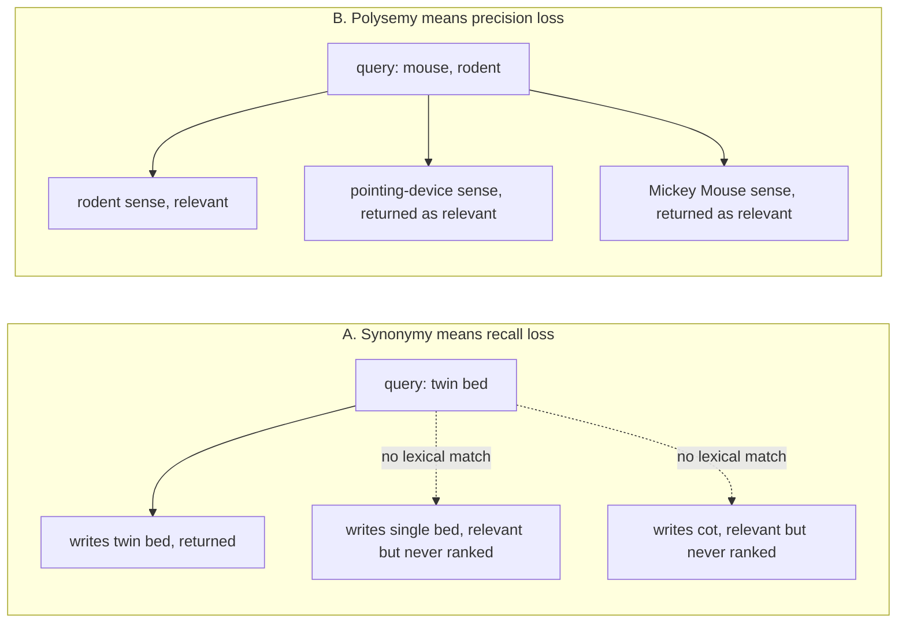
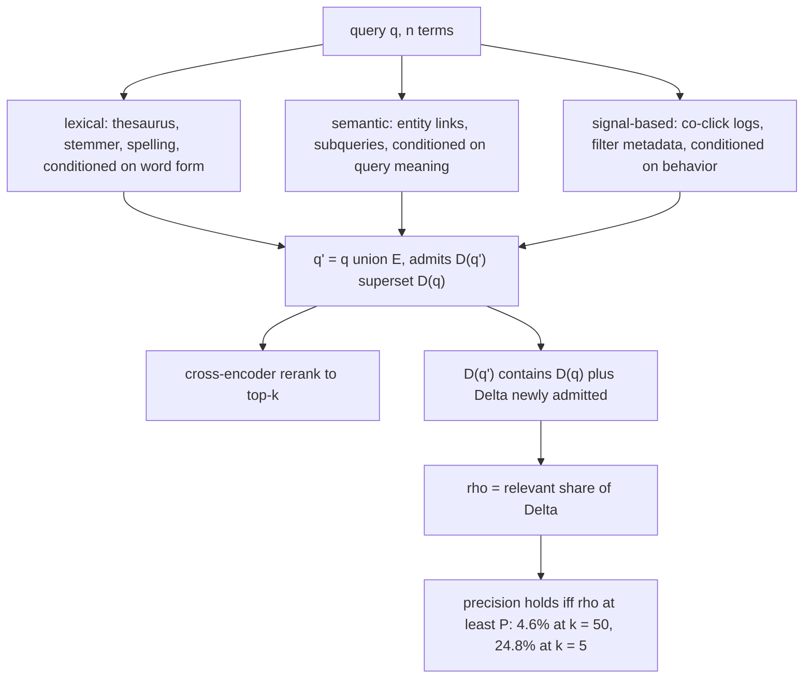
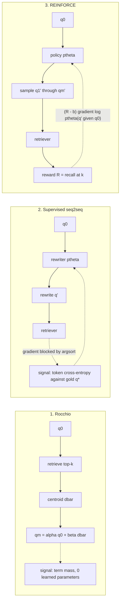
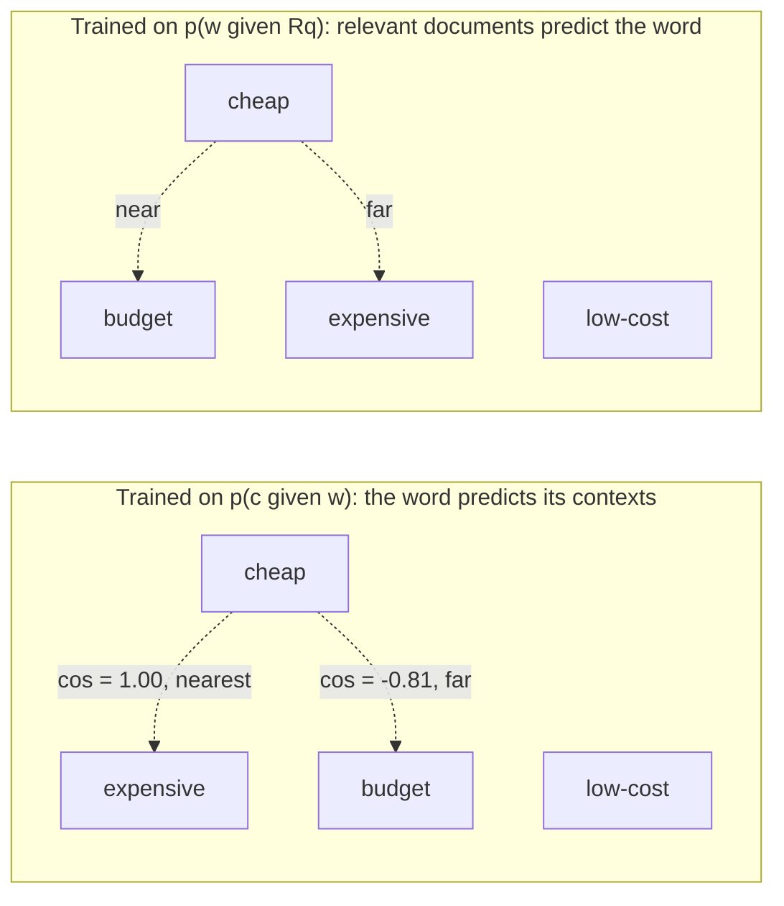
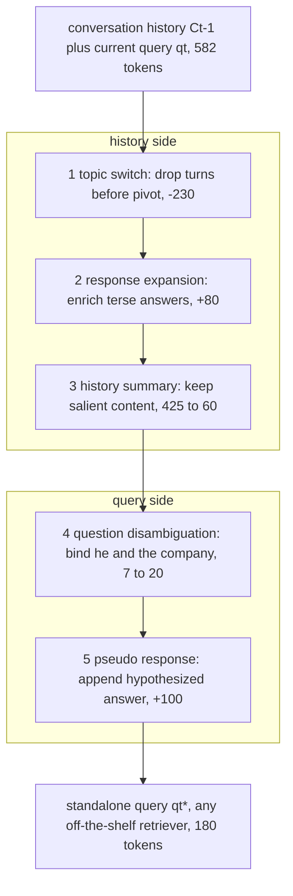
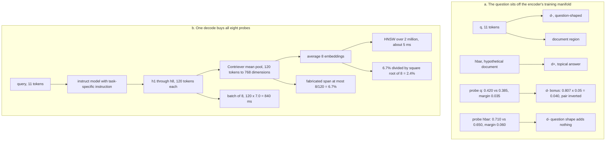

# Chapter 24: Query Reformulation

This chapter prepares you to explain how Retrieval-Augmented Generation (RAG) systems diagnose weak queries, expand or rewrite them, train retrieval-aware representations, repair conversational context, and search with hypothetical answers.

## TL;DR

- Misspelling and synonymy hide relevant documents, while polysemy admits irrelevant meanings. These failures need different fixes.
- Expansion can only enlarge the admitted candidate set. It preserves precision only when the added documents are at least as relevant as the current set.
- Rocchio uses feedback term mass, supervised sequence-to-sequence rewriting imitates a target string, and reinforcement learning can optimize the retrieval metric itself.
- General word embeddings learn shared context. They can place antonyms together, so retrieval-specific embeddings must learn from relevance instead.
- Conversational rewriting prunes stale history, enriches or summarizes what remains, resolves references, and can add a pseudo response.
- Hypothetical Document Embeddings (HyDE) generate an answer-shaped passage, embed it, and search with that document-shaped probe.
- Every reformulation lever buys recall, intent clarity, or representation alignment at a cost in precision, latency, training data, or operational complexity.

## The story

Imagine a librarian running a huge reference desk. A patron hands over a short request slip, and the librarian must use the catalog to find the right books before a researcher starts writing an answer.

The first slip says "twn bed." The catalog recognizes "bed" but has no entry for "twn." The librarian can still return bed books, yet the missing rare word removed most of the clue that distinguished the request.

Another patron writes "single bed," while the useful books say "twin bed." This is synonymy, which means two surface forms express the same concept. The librarian misses books that use the other wording.

A third patron writes "mouse" and means the animal. The catalog also finds books about pointing devices and Mickey Mouse. This is polysemy, which means one surface form carries several concepts. The librarian now has a precision problem instead of a recall problem.

The librarian can expand the slip by adding spelling variants, related concepts, or terms learned from past patrons. Expansion opens more catalog drawers. It cannot remove a book from the full admitted set, but noisy additions can crowd the first shelf that the patron actually sees.

The librarian therefore prices every added drawer. The new books must be relevant at least as often as the books already admitted. Otherwise the larger pile raises recall but lowers precision.

Rocchio acts like a clerk who reads the first returned books and moves the request slip toward their common vocabulary. Pseudo-relevance feedback means the clerk assumes those first books are relevant without asking the patron. One off-topic book then pulls the slip in the wrong direction.

A sequence-to-sequence rewriter acts like an editor who learned to imitate better slips. It can delete, reword, correct, and resolve. Its weakness is that a beautiful imitation may not retrieve anything better because token agreement is not recall.

A reinforcement-learning rewriter acts like a trainee paid for finding the right books. The catalog cannot send a normal gradient through its sorting step, so the trainee samples new slips and learns from their retrieval rewards.

The shelf map matters too. A general word embedding is like arranging words by the sentences they usually inhabit. "Cheap" and "expensive" occupy similar sentence frames, so that map can place them together even though they express opposite needs.

A retrieval-specific embedding rearranges the map by co-relevance. Two terms become neighbors when they occur in documents that answer the same request. That moves "budget" toward "cheap" and pushes "expensive" away.

Conversation adds a stack of earlier slips and librarian replies. Blindly stapling the stack together can bury the current request, retain an abandoned topic, and leave "he" or "the company" unresolved.

The conversational librarian uses five operations. The librarian detects a topic switch, enriches terse replies, summarizes surviving history, binds references, and may append a guessed answer. The first three repair history. The last two repair the current slip.

HyDE changes the object in the librarian's hand. Instead of searching with a question-shaped slip, the librarian drafts a hypothetical page that could answer it and searches with that page-shaped probe.

The hypothetical page may invent a detail. Mean pooling limits the influence of a short invented span, and averaging several drafts suppresses details that change across samples. A shared wrong topic does not cancel, so the librarian must still trust the drafting model's topical judgment.

The reference desk succeeds when it chooses the smallest repair that matches the failure. It corrects vocabulary gaps, disambiguates overloaded terms, learns from retrieval when labels exist, preserves a printable conversational rewrite, and pays HyDE's generation bill only when document-shaped probing earns it.

## Decoder table

| Technical term | Plain-English meaning | Why it matters |
|---|---|---|
| Retrieval-Augmented Generation (RAG) | A system that retrieves source material before generating an answer | Reformulation changes what evidence reaches the generator |
| Query reformulation | Changing the user's query before retrieval | It repairs wording or representation failures upstream |
| Information need | The underlying concept or answer the user wants | Several query strings can express the same need |
| Concept c | The intended meaning behind a query form | It separates meaning from spelling |
| Surface form f | The actual word or phrase used for a concept | Indexes usually match forms rather than concepts |
| Pr(f given c) and Pr(c given f) | Probability of a form given a concept, and a concept given a form | They set the single-form recall and precision ceilings |
| Synonymy | Different forms that express one concept | It caps recall when only one form is searched |
| Polysemy | One form that expresses several concepts | It caps precision when all senses match |
| Misspelling | A query form that rarely or never appears in documents | A zero-postings term contributes no score |
| Lexical retrieval | Retrieval based on exact terms and their statistics | It exposes vocabulary gaps clearly |
| Inverted index | A map from each term to the documents containing it | Missing terms have no posting list |
| Posting list | The documents associated with one indexed term | Traversing more postings raises retrieval work |
| Best Matching 25 (BM25) | The chapter's sparse term-scoring function | It sums nonnegative contributions from matched query terms |
| Inverse document frequency (IDF) | A rarity weight for a term | Rare terms carry more discriminative score mass |
| Term frequency | The count of a term inside one document | BM25 saturates its contribution |
| BM25 symbols N, nₜ, fₜ,₍d₎, k₁, b, d, and avgdl | Corpus size, document frequency, term frequency, saturation and length controls, document length, and average length | They determine each matched term's sparse score |
| Recall | The share of all relevant documents that retrieval finds | Synonymy and zero scores impose ceilings on it |
| Precision | The share of retrieved documents that are relevant | Polysemy and noisy expansion reduce it |
| Recall at k | Recall measured within the first k results | Expansion has no monotone guarantee at a fixed cutoff |
| Precision at k | Precision measured within the first k results | Its break-even bar rises at shallow cutoffs |
| Candidate pool | The documents admitted before reranking | Expansion deliberately enlarges this set |
| Superset property | The expanded sparse query admits every old candidate plus possible new ones | It proves admitted-set recall cannot fall |
| Expansion arm | One added term or retrieval variant | Arms can be ranked by relevant gain per posting scanned |
| Query q, expansion E, counts n and m, and expanded q' | Original query, added terms, their term counts, and the issued union | They define the reformulation object and its score-mass dilution |
| D(q), D(q'), R, a, nᴅ, Δ, ρ, and P | Old and new admitted sets, relevant set, old relevant count, old pool size, new count, new relevance rate, and precision | They reduce expansion break-even to ρ at least P |
| Lexical expansion | Adding spelling, morphology, acronym, or thesaurus variants | It is cheap but weakly conditioned on intent |
| Semantic expansion | Adding entities, ontology neighbors, or intent-level subqueries | It uses meaning but can still make polarity errors |
| Signal-based expansion | Adding terms from clicks or sessions | Its added-document relevance rate can be measured |
| Filter signal | Metadata that narrows the candidate set | It can raise precision only by risking recall |
| Query-independent global expansion | Applying one fixed expansion map to every context | Wrong senses often enter with near-zero relevance |
| doc2query | Predicting likely queries for each document before indexing | It moves expansion generation off the request path |
| Score-mass dilution | Added terms take a larger share of achievable BM25 score | Synonym-only documents can outrank exact matches |
| Reciprocal rank fusion (RRF) | Combining lists using rank positions rather than raw scores | It avoids score dilution across separate variants |
| Dense retrieval | Retrieval by vector similarity | Appending terms moves one vector rather than creating a superset |
| Cross-encoder reranker | A second-stage model that jointly scores a query and candidate | It can restore precision after broad expansion |
| Rocchio algorithm | A vector update toward relevant documents and away from non-relevant ones | It is the classical feedback-based reformulator |
| Rocchio q₀, qₘ, Dᵣ, Dₙᵣ, α, β, and γ | Original and modified queries, feedback sets, original retention, positive pull, and negative push | The weights price trust in user, positive, and negative evidence |
| Relevant centroid | The mean vector of documents judged relevant | Rocchio pulls the query toward it |
| Non-relevant centroid | The mean vector of documents judged non-relevant | Rocchio discounts and subtracts it |
| Pseudo-relevance feedback (PRF) | Treating top retrieved documents as if they were relevant | It removes label needs but can cause query drift |
| Query drift | Off-topic feedback terms pulling a query away from its intent | Drift grows with feedback impurity |
| Sequence-to-sequence rewriting | Generating a new query string from the original query | It can delete, reword, and resolve rather than only add |
| GenQR and GenPRF | The two weakly supervised generation systems named by the source | They mine rewrite targets from co-retrieval behavior |
| Weak supervision | Mining approximate labels from existing retrieval behavior | It avoids paying for reference rewrites at scale |
| Co-retrieval overlap | Similarity based on shared top-ranked documents | It can identify paraphrase-like query pairs |
| Cross-entropy | Token-level loss against a reference rewrite | It may improve while retrieval recall stays flat |
| Retrieval objective mismatch | Training on text imitation while shipping a ranking metric | It motivates direct retrieval reward |
| Argsort | Sorting all document scores into a ranked list | It blocks ordinary gradients through retrieval |
| Reinforcement learning (RL) | Learning from rewards produced by sampled actions | It can optimize a retrieval metric without differentiating the index |
| REINFORCE | The score-function policy-gradient estimator used here | It routes sampled retrieval reward into rewriter parameters |
| Policy | The probability distribution over rewritten queries | Sampling from it creates reward-bearing rewrites |
| Rewriter q*, parameters θ, reward R(q'), and sample count m | Target rewrite, trainable policy, retrieval score, and sampled candidates | They distinguish supervised imitation from retrieval-reward learning |
| Reward baseline b | A running reward reference subtracted before the update | It reduces variance without biasing the estimator |
| Long short-term memory (LSTM) | A recurrent sequence model used for long dependencies | The cited generation reformulator uses it instead of a plain recurrent model |
| Normalized discounted cumulative gain (nDCG) | A rank-sensitive relevance metric | It discourages generic queries that game pure recall |
| Mean reciprocal rank (MRR) | The reciprocal rank of the first relevant result, averaged over queries | It exposes head-ranking regressions |
| Bilingual Evaluation Understudy (BLEU) | A reference-overlap score for generated text | The source rejects it as the primary retrieval reward |
| Kullback-Leibler (KL) penalty | A distribution-distance penalty against the original policy | It can keep a visible rewrite readable |
| word2vec | A word embedding trained from nearby context words | Its objective can place antonyms together |
| Skip-gram with negative sampling | The word2vec objective used in the derivation | It learns context predictability rather than relevance |
| Pointwise mutual information (PMI) | A log ratio comparing conditional and marginal context probability | A word2vec vector compresses a PMI row |
| Embedding symbols w, c, D, k, Pₙ, σ, V, Rq, p̂, pᴹᴸ, and λ | Word, context, observed pairs, negative count and distribution, sigmoid, vocabulary, relevant set, learned model, baseline, and interpolation weight | They separate context prediction from relevance modeling |
| Context distribution | The probabilities of neighboring words around a target word | Identical context distributions produce identical vectors |
| Antonym inversion | Adding an opposite term as a semantic neighbor | It can reverse the user's intent and ranking |
| Relevance-based word embedding | An embedding trained from terms in relevant documents | It replaces co-occurrence with co-relevance |
| Relevance distribution | The term distribution within documents relevant to a query | It supplies the desired expansion target |
| Maximum-likelihood baseline | The unsmoothed query term model mixed with the learned score | It preserves original query evidence |
| Interpolation weight λ | The mixture weight between learned and baseline term scores | It controls how much the learned expansion changes the query |
| Dense Passage Retrieval (DPR) | The cited passage retriever trained on question and relevant-passage pairs | Its reported comparison illustrates relevance-trained representation |
| Sparse Lexical and Expansion (SPLADE) | The learned sparse expansion model named by the source | It is one possible relevance-based expansion scorer |
| Polarity regression set | Queries whose meaning flips under one token substitution | It catches antonym expansion failures |
| Conversational query | A query whose meaning depends on earlier turns | It often contains unresolved references |
| Conversation Cₜ₋₁, qᵢ, rᵢ, qₜ, and q*ₜ | Earlier query-response turns, current query, and standalone rewrite | A rewriter must decide which history survives and what the current query must say |
| CHIQ | The source's 2024 five-operation conversational-rewriting line | It separates history repair from current-query repair |
| Standalone query | A text query that contains enough context without the transcript | It works with sparse, dense, and hosted retrievers |
| Bidirectional Encoder Representations from Transformers (BERT) | The encoder family used in the source's truncation example | Its 512-wordpiece cap can remove the current query |
| Topic switch detection | Finding where the conversation changes subject | It prevents references from binding to an abandoned topic |
| Response expansion | Enriching terse or truncated prior answers | Later operations get denser history material |
| History summary | Compressing surviving history to salient content | It controls token dilution |
| Question disambiguation | Replacing pronouns and vague references with explicit entities | The retriever receives content-bearing terms |
| Pseudo response | A hypothesized answer appended to a query | It supplies answer-side vocabulary |
| Oracle rewrite | A target written while the gold passage is visible | It supplies silver supervision unavailable at inference |
| Iterative retrieval | Multiple retrievals used to discover intermediate facts | It solves a different problem from conversational rewriting |
| Approximate nearest-neighbor (ANN) lookup | Fast vector search over a large index | Rewriting latency is paid before this lookup |
| Graphics processing unit (GPU) | The accelerator used for the latency arithmetic | Model weight reads dominate token decoding at batch one |
| Key-value (KV) cache | Stored attention state for generated tokens | Batched HyDE samples consume it |
| Hypothetical Document Embeddings (HyDE) | Generating an answer-shaped document and embedding it as the search probe | It aligns a question with a document-trained encoder |
| LameR | The cited comparison of query rewriting with pseudo-answer generation | It reports richer pseudo-answer semantics winning the comparison |
| Frequently asked questions (FAQ) | Documents written in question-and-answer form | Their question register can attract a raw query for the wrong reason |
| Contriever | The zero-shot dense encoder in the source example | It was trained on document-document crops, not questions |
| Query register | The linguistic shape of a question | It can create similarity to question-shaped documents |
| Document register | The linguistic shape of corpus passages | HyDE generates this shape before embedding |
| HyDE topic u, scale γ, and means s̄qd and s̄dd | Document-expressed need, query-to-document scale, and measured mean similarities | Their ratio estimates how much question register shrinks topical margins |
| Residual n, pool length L, samples m, probes hᵢ, and mean h̄ | Question form, token count, generated documents, their embeddings, and averaged probe | They bound and suppress variable fabricated details |
| Register bonus ϕ and candidates d− and d+ | Question-shape alignment, distractor, and relevant document | A bonus larger than the topical margin can invert the pair |
| Mean pooling | Averaging token representations into one vector | It bounds a short fabricated span's influence |
| Sample averaging | Averaging embeddings from several hypothetical documents | Independent fabrications shrink while shared vocabulary remains |
| query2doc | Concatenating a pseudo-document with the original query | It keeps a sparse lexical anchor and adds document register |
| Distillation | Training a query encoder to predict the HyDE probe offline | It moves generation off the request path |
| Hierarchical navigable small world (HNSW) | The graph-based vector index in the cost example | Its search cost is tiny beside HyDE generation |
| Remote procedure call (RPC) | A networked service call | It contributes to the retrieval-only latency |
| 95th-percentile latency (p95) | The time below which 95 percent of requests finish | HyDE must fit this serving budget, not only an offline metric |

## Core mechanics

### 24.1 Why queries fail: misspelling, synonymy, polysemy

**What it is.** A lexical index sees the form f. The user intends the concept c. The chapter separates two conditionals.

$$
Pr(f | c) = how often concept c is written as form f
$$

$$
Pr(c | f) = how often form f means concept c
$$

Searching only one form creates two ceilings.

$$
Recall ≤ Pr(f | c)
$$

$$
Precision ≤ Pr(c | f)
$$

Bayes connects the conditionals, but it does not make them move together.

$$
Pr(c | f) = Pr(f | c) Pr(c) / Pr(f)
$$

The free marginal Pr(f) lets one form have high concept coverage and low sense purity. The source uses "single" as the example. It is common for a one-person bed in British listings, but most corpus uses of "single" express other meanings.

**Why it exists.** Synonymy explains missing relevant documents. Polysemy explains irrelevant returned documents. Misspelling is the limiting synonymy case where the chosen query form has Pr(f | c) approximately zero in documents.

**Failure without diagnosis.** One generic synonym lever can raise recall while lowering every shallow quality measure. Dense retrieval absorbs synonymy, but it does not structurally remove polysemy. A short query supplies little context for sense resolution.

Dense retrieval also changes observability. A lexical index exposes a zero-postings term. A dense encoder can return a confident but wrong neighborhood. A document can have 400 tokens to establish a sense while a one-token query has none. Zhuang and Zuccon (2021) found sharp degradation on typo-perturbed queries for BERT-based retrievers and rankers, with explicit typo-aware training needed for recovery.

**Cost and complexity.** A missing rare term can remove most query discrimination. Lucene's IDF formula in the source is:

$$
IDF(t) = ln(1 + (N − n + 0.5) / (n + 0.5))
$$

For N = 10⁷ chunks, n(bed) = 10⁵, and n(twin) = 10⁴:

$$
IDF(bed) = ln(100) = 4.61
$$

$$
IDF(twin) = ln(1000) = 6.91
$$

Using the unrounded IDFs, the intact query has 11.51 nats of discriminative mass. The typo query "twn bed" keeps 4.61. It loses 6.91 / 11.51 = 60 percent, including the term that distinguishes this need from generic bed queries.

BM25's term-frequency factor is:

$$
f(k₁ + 1) / (f + k₁(1 − b + b|d|/L̄))
$$

With k₁ = 1.2, its supremum is k₁ + 1 = 2.2. Using the unrounded bed IDF, a document matching only "bed" scores at most 10.13. An average-length document matching both terms once scores 11.51. Exact match leads by 14 percent, so keyword stuffing can still break through.

#### Worked lodging example

The index has N = 10⁷ chunks. Posting counts are n(bed) = 10⁵, n(twin) = 10⁴, n(single) = 3 × 10⁵, and n(cot) = 9 × 10⁴.

The relevant set has 1,000 chunks. Of these, 550 say "twin bed," 300 say "single bed," and 150 say "cot" without "bed." The split is assumed rather than measured. The arithmetic built on it is exact.

With "twn bed," the typo has no postings. Under the pessimistic but neutral assumption that bed-ness is uncorrelated with twin-ness, the expected relevant count in the top 100 is 100 × 850 / 10⁵ = 0.85. Recall at 100 is 0.85 / 1,000 = 0.085 percent. One character costs three orders of magnitude.

After correction to "twin bed," the 150 cot chunks still score zero. The 300 single-bed chunks score at most 10.13 against 11.51 for roughly 10⁴ chunks matching both query terms. They sit below rank 10⁴. Recall at 100 has a 550 / 1,000 = 55 percent ceiling. Raising k cannot rescue a zero score.

Full expansion to `(twin bed) OR (single bed) OR cot` gives every relevant chunk a matching term. The recall ceiling becomes 100 percent. The candidate pool grows from 10⁴ to at most 10⁴ + 3 × 10⁵ + 9 × 10⁴ = 4 × 10⁵ postings, a 40-fold scoring bill.

The precision ceiling moves from 550 / 10⁴ = 5.5 percent to 1,000 / (4 × 10⁵) = 0.25 percent. That is 22-fold worse precision for 1.8-fold better recall.

The cot arm gains 150 / (9 × 10⁴) = 1.67 × 10⁻³ relevant chunks per posting. The single arm gains 300 / (3 × 10⁵) = 1.0 × 10⁻³. Buying cot and dropping single creates a 10⁵ pool, a 70 percent recall ceiling, and a 700 / 10⁵ = 0.70 percent precision ceiling. That precision is 2.8-fold better than full expansion at one quarter of its scoring cost.

The expansion IDFs are IDF(single) = ln(1 + 32.3) = 3.51 and IDF(cot) = ln(1 + 110.1) = 4.71. Both are below IDF(twin) = 6.91. A rarer off-sense expansion would be more dangerous because IDF rewards rarity rather than correctness.

Furnas et al. (1987) found that two people spontaneously chose the same term for the same object less than 20 percent of the time across five domains. The source therefore calls its assumed 55 percent dominant-form share generous. It does not present 55 percent as a measurement.

#### Practical decisions and limits

Correct spelling against the index vocabulary rather than a general dictionary. Fold spelling variants at index time if dirty documents have created postings for misspellings.

Measure the single-form recall ceiling. Buy expansion arms by relevant gain per posting scanned. In recall-mandatory domains, the full pool may be required and precision becomes the reranker's problem.

Cap the weight of a synonym that is rarer than its source term. Make an exception only for a genuine single-sense domain identifier.

For a stable corpus, doc2query-style document expansion from Nogueira et al. (2019) amortizes generation and indexing over future queries. Prefer query-time work when the corpus changes faster than reindexing or when the gap comes from user jargon.

Route polysemy to disambiguation. Detect several tight but distant top-result clusters, diversify across senses, or ask one clarifying question. A batch pipeline cannot ask, so diversification is its remaining option.

A 12-token RAG chat question shifts the mix. More context helps sense resolution, but function words dilute IDF mass and create more places for a typo to hide. The source expects more synonymy and less polysemy in that workload.

### 24.2 Expansion: lexical, semantic, signal-based

**What it is.** Let q contain n terms. Let E contain m added terms. The issued query is q' = q ∪ E. Let D(q) be the documents admitted by q, and let R be the relevant set.

Lexical expansion conditions E on word form. It includes thesaurus synonyms, morphology, acronyms, and spelling corrections.

Semantic expansion conditions E on query meaning. It includes entity links, ontology neighbors, and generated subqueries.

Signal-based expansion conditions E on user behavior. It includes co-clicked and same-session queries. Its filter subfamily uses metadata such as locale to shrink rather than enlarge the set.

**Why it exists.** BM25 adds a nonnegative score for every matched term, and its IDF is positive. Therefore sparse expansion preserves every admitted document.

$$
D(q) ⊆ D(q')
$$

$$
cardinality(D(q') ∩ R) ≥ cardinality(D(q) ∩ R)
$$

This is the exact admitted-set recall guarantee.

**Failure without precision accounting.** Define a = |D(q) ∩ R| and nᴅ = |D(q)|. Baseline precision is P = a / nᴅ. Expansion admits Δ = |D(q')| − |D(q)| new documents. Let ρ be their relevant fraction.

$$
P' = (a + ρΔ) / (nᴅ + Δ)
$$

The precision break-even is:

$$
(a + ρΔ) / (nᴅ + Δ) ≥ a / nᴅ ⇔ nᴅρΔ ≥ aΔ ⇔ ρ ≥ P
$$

The expansion size cancels. The new candidates must be relevant at least as often as the old candidates.

Lexical expansion tends to have the lowest ρ because word form weakly predicts intent. Semantic expansion can raise ρ by using context, but a general embedding can place antonyms together. Signal-based expansion measures ρ from behavior. Filters work in reverse, raising precision by shrinking D and risking recall.

Global query-independent expansion often admits the wrong sense with ρ approximately zero. Voorhees (1994) found WordNet relations helped only the shortest Text Retrieval Conference (TREC) topics and degraded the rest. Xu and Croft (1996) found locally drawn expansion terms beat global corpus terms. The source limits these claims to the reported settings.

**Cost and complexity.** At comparable IDF, n original terms among n + m full-weight terms hold n / (n + m) of achievable score mass. A document matching several additions can outrank one matching every original term.

Down-weight E by α < 1, or issue variants separately and fuse them with RRF. Dense expansion requires fusion because appending terms displaces a single query vector rather than creating a candidate superset.

The admitted-set guarantee does not imply recall at k. A fixed cutoff returns the same count before and after expansion. New documents can evict relevant incumbents. A result at k = 1,000 says nothing about k = 5.

#### Worked support-search example

The corpus has 2 million chunks. The golden set averages four relevant chunks per query. Baseline recall at 5 is 0.31, and recall at 50 is 0.58.

The query "rotate signing certificate" has IDFs 4.1, 5.3, and 3.8. Its total achievable score mass is 13.2, with mean 4.4 per term.

Twelve full-weight additions are rotation, renew, renewal, cert, certs, certificates, sign, signed, signature, key, credential, and x509. At mean IDF 4.4 they add 12 × 4.4 = 52.8. Original terms now hold 13.2 / 66.0 = 20 percent of achievable mass.

A document matching five additions and no original scores 5 × 4.4 = 22.0. A document matching all three original terms scores 13.2. The expansion inverts the ranking.

At α = 0.3, the expansion-only document scores 5 × 4.4 × 0.3 = 6.6. Original terms recover 13.2 / 29.04 = 45 percent of the mass. The original-match document leads again.

At k = 50, recall 0.58 with four relevant chunks means 2.32 relevant results. Precision is 2.32 / 50 = 0.046, so expansion needs ρ at least 4.6 percent.

At k = 5, recall 0.31 means 1.24 relevant results. Precision is 1.24 / 5 = 0.248, so expansion needs ρ at least 24.8 percent. This is more than five times the deep-cutoff bar on the same system.

Original terms cover 240,000 postings. The additions cover 1.9 million, for 2.14 million total. At 40 million postings per second, traversal rises from 240,000 / (40 × 10⁶) = 6.0 ms to 2.14 million / (40 × 10⁶) = 53.5 ms. That is 8.9 times the retrieval work.

Twenty serial variants cost 20 × 6.0 = 120 ms. The source notes that web search has run roughly twenty back-end retrievals per typed query since the 1990s. Its sub-120 ms response is possible through parallel fan-out and heavy head-query caching, not serial execution.

#### Practical decisions and limits

Expand into a broad candidate pool before a cross-encoder, not directly into a five-document generator context. The worked break-even is 4.6 percent at k = 50 and 24.8 percent at k = 5. The source's practice note recommends k = 100 with a reranker, but it reuses 4.6 percent there without supplying recall at 100, so that threshold is not derived for k = 100.

Start around α = 0.3 for added terms. Give spelling corrections full weight because they replace the form rather than add a new meaning.

With traffic, mine co-click and same-session variants over a rolling 30-day window. The source proposes roughly 20 sessions as minimum support. Without logs, use whole-query semantic expansion rather than isolated nearest neighbors.

Start with one weighted sparse query. Pay fusion latency when variants express separate intents or when a dense leg makes vector displacement unavoidable.

Route known-item queries such as part numbers, error codes, versions, and filenames around expansion. Treat a documented alias such as x509 and X.509 as a spelling correction.

Document expansion over 2 million chunks, with three predicted queries of 60 tokens each, costs 360 million tokens. At 10,000 tokens per second that is about 10 GPU-hours once. Query expansion at 1 million queries per day and 40 tokens each costs 40 million tokens per day, about 1.1 GPU-hours daily. The source says the cost argument becomes a wash inside a fortnight. Query-time latency remains the main discriminator.

### 24.3 Rewriting: Rocchio to sequence-to-sequence to reinforcement learning

**What it is.** The three generations differ in their learning signal.

Rocchio's 1971 algorithm moves a query vector using judged documents.

$$
q⃗ₘ = αq⃗₀ + (β / |Dᵣ|) Σ[d⃗ in Dᵣ] d⃗ − (γ / |Dₙᵣ|) Σ[d⃗ in Dₙᵣ] d⃗
$$

The source reports the Manning et al. (2008) recommendation α = 1, β = 0.75, and γ = 0.15. Negative evidence gets a fivefold discount. Production PRF commonly treats the top 10 as relevant, sets Dₙᵣ empty, and uses γ = 0.

Supervised sequence-to-sequence training maps original q₀ to target q*. Wang et al. (2023) mine weak pairs for their GenQR and GenPRF systems. Two queries are paired when their top-ranked documents overlap substantially. The more effective query becomes the target, and stopwords are removed. Their ablation found all three filters together beat any subset.

Their contextual variant concatenated feedback documents into the generation prompt. It helped on only one dataset, and only the instruction-tuned model benefited there. The source does not claim that more prompt context generally helps.

The supervised token objective is:

$$
L = −Σₜ log pθ(q*ₜ | q*₍<ₜ₎, q₀)
$$

The shipped metric is R(q') = recall at k for the rewritten query. Similar token loss can hide large recall differences because one discriminative term moves documents across the cutoff.

Retrieval is an argsort over the index. It is piecewise constant in the query, so its derivative with respect to θ is zero almost everywhere.

REINFORCE treats the rewriter as policy pθ(q' | q₀) and uses the score-function estimator.

$$
∇θ E[q' sampled from pθ] R(q') = E[q' sampled from pθ] [(R(q') − b) ∇θ log pθ(q' | q₀)]
$$

The estimator only evaluates retrieval reward. It never differentiates the index. The baseline b is typically a running reward mean that reduces variance without bias.

Nogueira and Cho (2017) implement a term-selection model that keeps candidate terms above a probability threshold and a sequence-generation model that decodes with an LSTM. Both use REINFORCE against retrieval reward. They report that the RL reformulator beat supervised learning on the same task.

**Why it exists.** Rocchio offers a no-training baseline. Sequence generation can delete, reword, correct, and resolve. RL aligns the learning signal with the metric the system reports.

**Failure without objective alignment.** Rocchio cannot detect an off-topic feedback document. It only adds term mass, so it cannot delete a misleading word, fix a misspelling, resolve a pronoun, or express the intent in new words.

Supervised rewriting can optimize one arbitrary reference while recall remains flat. Pure recall reward is also gameable because generic queries broaden the pool. Pair recall with nDCG at k or MRR to retain rank sensitivity.

Conversational rewriting is the stated exception where supervised learning can win. Gold decontextualized rewrites exist, and dialogue rather than the index defines intent.

**Cost and complexity.** Retrieval reward requires sampled queries, repeated index calls, and a frozen versioned index. A changing corpus changes the reward function during training.

#### Worked PRF example

The query "reset token expiry" starts with unit weight on each term. PRF takes the top 5 documents.

Each on-topic document has weights reset 0.4, token 0.8, expiry 0.6, session 0.5, firmware 0.0. One off-topic router document has reset 0.9, firmware 0.8, and zero for the other terms.

With four on-topic and one off-topic document, the centroid is (0.500, 0.640, 0.480, 0.400, 0.160). With α = 1, β = 0.75, γ = 0, rewritten weights are reset 1.375, token 1.480, expiry 1.360, session 0.300, and firmware 0.120. Their sum is 4.635.

The genuine session expansion holds 0.300 / 4.635 = 6.5 percent of query mass. Firmware holds 0.120 / 4.635 = 2.6 percent.

With three on-topic and two off-topic documents, the centroid becomes (0.600, 0.480, 0.360, 0.300, 0.320). Rewritten weights become reset 1.450, token 1.360, expiry 1.270, session 0.225, and firmware 0.240. Their sum is 4.545.

Firmware now holds 5.3 percent and outweighs session, 0.240 against 0.225. One additional bad feedback document flips the preferred expansion.

Training on 100,000 queries with m = 8 sampled rewrites and 3 epochs issues 100,000 × 8 × 3 = 2.4 million retrieval calls. At 20 ms each, serial time is 48,000 seconds or 13.3 hours. At 32-way parallelism it is 25 minutes.

Weak-supervision mining needs 100,000 calls, which is 24 times cheaper. At serving time, PRF costs two index round trips, 2 × 20 = 40 ms. A learned rewriter decoding 16 tokens at 250 tokens per second costs 64 ms plus 20 ms retrieval, or 84 ms.

The source anchors these volumes against web search fan-out of roughly twenty retrievals inside a few hundred milliseconds. It identifies index freezing, not call volume alone, as the distinctive RL burden.

#### Practical decisions and limits

Start with top-10 Rocchio PRF at α = 1, β = 0.75, γ = 0. If top-10 precision is below roughly 0.5, shrink feedback depth to 3 through 5 or gate by an absolute retrieval score.

Mine supervision through co-retrieval overlap. Use real gold rewrites when the setting already has them.

Reward the metric you report. Do not substitute fluency, reference overlap, or BLEU. If users see the rewrite, add a KL penalty against the original policy to preserve readability.

Keep the original query in the candidate pool and fuse it with the rewrite. Reformulation is not monotone, and average recall can hide a harmed tail.

Freeze and version the index during RL training. For hourly corpus updates, train against periodic snapshots and pin each rewriter to its snapshot.

### 24.4 Retrieval-specific embeddings: why word2vec is wrong here

**What it is.** General word2vec training predicts context, not relevance. Skip-gram with negative sampling maximizes:

$$
max over w⃗,c⃗  Σ[(w,c) in D] [log σ(w⃗ · c⃗) + k E[cₙ sampled from Pₙ] log σ(−w⃗ · c⃗ₙ)]
$$

Here w⃗ is the center-word vector, c⃗ is the context-word vector, D contains observed word-context pairs, and k is the sampled negatives per positive.

Levy and Goldberg (2014) show that at the optimum, given enough embedding dimensions:

$$
w⃗ · c⃗ = PMI(w,c) − log k
$$

$$
PMI(w,c) = log(p(c | w) / p(c))
$$

A word vector compresses a row of the PMI matrix. Words with identical context distributions receive the same vector. Antonyms often fit the same grammatical frames, so their distributions can be nearly identical.

**Why retrieval-specific training exists.** Zamani and Croft (2017) replace the context target p(c | w) with p(w | Rq), the terms found in documents relevant to query q.

For vocabulary V, the learned query-conditioned distribution is:

$$
p̂(w | q) = exp(w⃗ · q⃗) / Σ[w' in V] exp(w⃗' · q⃗)
$$

The first variant minimizes:

$$
L = Σq KL(p(· | Rq) || p̂(· | q))
$$

The second variant treats term relevance as binary classification. Relevant-set terms are positives. Negatives are random vectors that map to no real vocabulary item because choosing genuine negative words remains unresolved in the source.

That second variant reads embeddings from a hidden layer and scores terms by dot product. Both variants interpolate the learned distribution with the maximum-likelihood query model.

$$
p*(w | q) = λ p̂(w | q) + (1 − λ) pᴹᴸ(w | q)
$$

The top-k terms are appended, and retrieval runs again. Under this objective, documents relevant to cheap-laptop queries do not give "expensive" relevance mass.

**Failure without it.** An in-domain word2vec model can be perfectly trained and still return the wrong neighbor. A larger model fitting the same context objective does not repair the mismatch.

A blacklist for known antonyms, a part-of-speech filter, or a co-occurrence requirement covers only known cases. It needs a curated lexicon per language. The only general filter, requiring a term to appear in relevant documents, recreates the relevance objective at query time.

**Cost and complexity.** Relevance training needs judged queries, pseudo-feedback, or synthetic query-document pairs. The serving procedure then scores and appends top-k terms. If relevance data is scarce, a strong general encoder plus a cross-encoder can beat a badly fit in-domain model.

#### Toy context-distribution example

Corpus marginals are p(price) = 0.2, p(laptop) = 0.5, and p(deal) = 0.3. Cheap and expensive each occur 10,000 times with conditional distribution (0.3, 0.4, 0.3). Budget has (0.1, 0.5, 0.4).

The PMI rows are:

$$
v⃗cheap = v⃗expensive = (0.41, −0.22, 0.00)
$$

$$
v⃗budget = (−0.69, 0.00, 0.29)
$$

Therefore cos(cheap, expensive) = 1.00 and cos(cheap, budget) = −0.81. The antonym is the top neighbor by construction. The desired expansion lies on the opposite side.

#### Worked BM25 example

The product index has N = 1,000,000 documents with k₁ = 1.2 and b = 0.75.

$$
BM25(q,d) = Σ[t in q] IDF(t) × fₜ,₍d₎(k₁ + 1) / (fₜ,₍d₎ + k₁(1 − b + b|d|/avgdl))
$$

$$
IDF(t) = ln(1 + (N − nₜ + 0.5) / (nₜ + 0.5))
$$

Document frequencies are affordable 5,000, cheap 30,000, budget 40,000, expensive 20,000, and laptop 50,000. Their IDFs are 5.30, 3.51, 3.22, 3.91, and 3.00.

Both candidates have average length, so each term factor is 2.2f / (f + 1.2). Document A is a budget roundup with affordable once, budget three times, and laptop five times. Document B is a premium review with expensive four times and laptop six times.

Using the unrounded IDFs and term factors, A scores 10.61 and B scores 5.49 without expansion. A leads by 5.12.

Unweighted word2vec expansion adds cheap and expensive. A stays at 10.61. B gains 3.91(1.692) = 6.62 and reaches 12.11. The premium review now outranks the budget roundup.

Relevance-trained expansion adds budget and discount. Budget alone gives A another 3.22(1.571) = 5.06, so A reaches 15.67. B remains 5.49. The correct margin widens from 5.12 to 10.18.

At α = 0.5, B's antonym gain falls to 3.31 and B lands at 8.80. The pair survives, but 3.31 is still 62 percent of affordable's 5.30 contribution across all 20,000 documents containing expensive. Weight control buys margin but does not fix direction.

Karpukhin et al. (2020) report DPR top-20 retrieval accuracy of 78.4 percent on Natural Questions against BM25's 59.1 percent. The source uses this as a passage-level analogy for replacing a language-modeling objective with relevance pairs.

#### Practical decisions and limits

Score expansions with relevance rather than raw language-model cosine. The source names relevance embeddings, a supervised sparse model such as SPLADE, and top-10 PRF as valid signals.

If no pairs exist, synthesize document-to-query examples before falling back to raw cosine. If cosine must ship, cap it at k = 3 additions and α = 0.5. Treat this as blast-radius control.

Build a 50-query polarity regression set. Include cheap versus expensive, with versus without, increase versus decrease, and refurbished versus new.

Parse hard constraints such as under $500, dates, negation, and required attributes into metadata filters when the corpus has fields for them.

Prefer in-domain relevance training once a few thousand pairs exist. Below that scale, with no synthesis route, use a strong general model and a cross-encoder rather than a poorly fit specialist.

### 24.5 Conversational rewriting: five operations

**What it is.** At turn t, conversation history is:

$$
Cₜ₋₁ = {(q₁,r₁), ..., (qₜ₋₁,rₜ₋₁)}
$$

The system needs passages relevant to current query qₜ given Cₜ₋₁. It can train a query encoder over the whole history, or emit a standalone text query q*ₜ. The chapter develops q*ₜ because plain text works with BM25, dual encoders, and hosted search interfaces.

The failure transcript begins with "tell me about the e-commerce companies Elon Musk founded." A later turn asks "when did he start the company?" The user means PayPal, but unresolved terms lead retrieval to Tesla founding material. The generator faithfully summarizes the wrong evidence.

The 2024 CHIQ conversational-rewriting line decomposes the task into five operations:

1. Topic switch detection asks whether qₜ starts a new subject and drops turns before the pivot.
2. Response expansion enriches terse, templated, or truncated system replies.
3. History summary compresses surviving history to salient content.
4. Question disambiguation binds expressions such as "he" to Elon Musk and "the company" to PayPal.
5. Pseudo response appends a hypothesized answer so the query matches answer-side vocabulary.

The first three repair history. The last two repair the query.

**Why it exists.** Raw qₜ can contain no indexable content. Concatenation adds words but can drown or truncate the current need.

Five past turns with 15-token user queries and 100-token responses contain 5 × 115 = 575 tokens. Adding the 7-token current query gives 582. A BERT-family encoder caps input at 512 wordpieces and truncates from the right in the source scenario. The 70 overflow tokens remove the current query itself.

Even without truncation, only 7 / 582 = 1.2 percent of pooled positions carry the current need.

The five-operation illustration prunes 230 tokens, adds 80 through response expansion, compresses 425 tokens to 60, expands the current query from 7 to 20, and appends a 100-token pseudo response. The result is a 180-token standalone query with 11 percent of its mass in the information need.

**Failure without composition rules.** Topic switching and summary both choose which history matters. The prompting-only variant skips history summary when a topic switch fires. It runs all five when there is no switch. After a switch, only one or two turns survive, and summarizing across the boundary can reintroduce the abandoned topic.

The fine-tuned variant generates targets with the gold passage visible. The model imitates an oracle rewrite at inference, where the gold passage is absent. The source presents this as silver-label supervision rather than direct access to future evidence.

An end-to-end conversational encoder gives up BM25 and hosted string interfaces. It must be retrained when the base encoder or index changes. It also replaces a printable q*ₜ with a 768-dimensional vector that is harder to debug. The source reports that enhanced history beats sparse and dense raw-history baselines by wide margins, without giving the margins here.

Conversational rewriting is not iterative retrieval. Iteration fetches an intermediate fact needed for a later retrieval. Rewriting issues one retrieval after repairing human under-specification.

**Cost and complexity.** The five calls form a dependency chain. Parallelism barely helps. Operation selection and model size dominate.

#### Worked latency example

The rewriter has 8 billion parameters in 16-bit floating point (fp16), so each decode step reads 8 × 10⁹ × 2 bytes = 16 GB of weights. An A100 80 GB accelerator provides roughly 2.0 TB/s peak bandwidth. At a realistic 70 percent of peak:

$$
16 GB / (0.7 × 2,000 GB/s) = 11.4 ms per decoded token
$$

Prefill runs at 10,000 tokens per second. The five operations emit 3, 80, 60, 20, and 100 tokens, totaling 263. They read 590 + 355 + 435 + 90 + 90 = 1,560 prompt tokens.

Sequential decode costs 263 × 11.4 = 2,998 ms. Prefill costs 1,560 / 10,000 = 156 ms. Total rewriting latency is 3,154 ms before retrieval.

Only topic-switch detection is independent. The critical chain emits 80 + 60 + 20 + 100 = 260 tokens and costs 2,964 ms. Maximal overlap saves 34 ms, about 1 percent.

Keeping only topic switch and disambiguation emits 23 tokens. Decode is 262 ms, and 950 prompt tokens add 95 ms. Total is 357 ms, which is 8.8 times faster. The 100-token pseudo response alone accounts for 38 percent of the full decode bill.

At batch one, the full set sustains 3,600 / 3.154 = 1,141 turns per hour. The trimmed set sustains 3,600 / 0.357 = 10,084. A one-call standalone rewriter emits about 20 tokens, so all five operations use 263 / 20 = 13.2 times its decode budget.

The source cites a one-second limit for uninterrupted flow and a ten-second limit for held attention from Nielsen (1993), following Miller (1968). The full 3.15-second rewrite cannot meet a one-second interaction target before retrieval or generation. The 357 ms trimmed path can.

#### Practical decisions and limits

Run topic-switch detection first. Its 3-token output costs about 34 ms and gates every later history operation. Skip it only when the product enforces reliable new-chat boundaries.

Ship question disambiguation alone as a first version. Add pseudo response when failure analysis shows vocabulary mismatch rather than unresolved reference.

Cache history summaries across turns. Do not precompute operations that depend on the current query.

Prefer a printable text rewrite. Use an end-to-end encoder only when you own the encoder and index, have hundreds of thousands of conversational relevance labels, and can retrain them together.

Distill a small rewriter from oracle-like targets when relevance labels exist. Use prompting when they do not.

Log q*ₜ with retrieved document identifiers. If storage forces sampling, the source says sample to 1 percent but never below.

For a one-second budget with 120 ms retrieval and 600 ms generation, rewriting has 280 ms. A 1-billion-parameter fp16 model reads 2 GB per token step. At 1,400 GB/s it costs 1.43 ms per token.

All five operations need 263 × 1.43 = 376 ms of decode. Dropping the 100-token pseudo response leaves 163 tokens, or 233 ms, plus about 18 ms prefill. The 251 ms total fits. Re-add pseudo response only if a matched-latency test justifies its extra 143 ms.

### 24.6 HyDE: searching with a hypothetical answer

**What it is.** Contriever was trained to compare document crops. A user question is a different kind of object. Split a unit-norm query vector into its document-expressed topic and its question residual.

$$
q = γu + √(1 − γ²)n
$$

Here u is the unit topic direction. The residual n is orthogonal to u and carries interrogative syntax, generic words, and length differences.

For an ordinary document d, the source assumes n · d approximately zero.

$$
cos(q,d) = γ cos(u,d)
$$

Uniform scaling by γ preserves rank exactly. It only reduces margin. The source measures γ from 1,000 query-gold pairs and 1,000 same-topic document pairs.

$$
γ ≈ s̄qd / s̄dd = 0.42 / 0.71 = 0.59
$$

A 0.06 topic margin in document space reaches the index as roughly 0.035.

Question-shaped documents have n · d = ϕ > 0. Their score becomes:

$$
cos(q,d) = γ cos(u,d) + √(1 − γ²)ϕ = 0.59 cos(u,d) + 0.807ϕ
$$

At ϕ = 0.05, the register bonus is 0.807 × 0.05 = 0.040. That exceeds the 0.035 topic margin and inverts the pair.

HyDE asks an instruction model to generate a passage that could answer the query. It embeds that passage and searches with the result. The probe now has document register, so γ approaches 1 and the question-shaped bonus disappears.

**Why it exists.** The method aligns the probe with the comparison the encoder learned. It does not merely improve query wording. It changes a question-shaped object into a document-shaped object.

**Failure without it.** Query rewriting keeps a query in question register. Nearest-neighbor expansion can also invert intent. Shen et al. (2023) compare these choices in LameR and find pseudo-answer generation beats query rewriting because the pseudo-answer carries richer semantics.

query2doc from Wang et al. (2023) keeps a middle position by concatenating the pseudo-document with the query. A sparse leg retains lexical anchoring while a dense leg gains document register.

A generated document can fabricate details. With mean pooling over L token vectors, an eight-token fabrication in 120 tokens has at most 8 / 120 = 6.7 percent of the probe. Repeated domain vocabulary occupies about 30 / 120 = 25 percent.

Averaging m independent generations suppresses variable fabrication as 1 / √m while shared vocabulary remains. At m = 8, the fabricated share becomes 2.4 percent. The signal-to-invention ratio rises from 3.7 to 10.5.

This defense has a hard limit. If every generation chooses the wrong topic, averaging reinforces the shared mistake. The source therefore says HyDE quality tracks instruction-model quality and degrades in low-resource languages.

**Cost and complexity.** HyDE adds a full generation before a cheap vector search. Distillation can train a query encoder to regress the averaged hypothetical embedding and move this cost offline.

#### Worked clinical-search example

The corpus has 2 million clinical documents at 250 tokens each. Contriever uses dimension 768 with mean pooling. Queries average 11 tokens. The p95 budget is 800 ms.

The generator has 7 billion parameters in fp16 on one A100 80 GB. Achieved bandwidth is 2.0 TB/s, and achieved compute is 156 trillion floating-point operations per second. One decode step reads 14 GB.

$$
14 GB / 2.0 TB/s = 7.0 ms per decoded token
$$

The raw query asks how long wisdom-tooth removal takes. The protocol says "third molar" repeatedly and "wisdom teeth" once. The FAQ repeats "wisdom tooth" 15 times without giving duration.

With k₁ = 1.2, b = 0.75, and average document length, the shared term contributes f(k₁ + 1) / (f + k₁). The FAQ scores 15 × 2.2 / 16.2 = 2.04. The protocol scores 1 × 2.2 / 2.2 = 1.00. Identical IDF makes the FAQ lead by 2.04 times.

Contriever encoding uses 2 × 110 million × 11 = 2.4 × 10⁹ floating-point operations. At an effective 50 trillion operations per second it takes 0.05 ms. HNSW over 2 million vectors adds about 5 ms. With RPC overhead, the retrieval-only path is about 12 ms.

The raw dense query also ranks the FAQ first. Its 0.040 register bonus exceeds the 0.035 topical margin.

For m = 1, prefill of the 60-token instruction and query costs:

$$
2 × 7 × 10⁹ × 60 / (1.56 × 10¹⁴) = 5.4 ms
$$

Decoding 120 tokens costs 120 × 7.0 = 840 ms. Encoding costs 0.53 ms, and search costs 5 ms. Total is 851 ms, over budget and 71 times the retrieval-only path.

For m = 8 in one batch, each decode step reads the same 14 GB for all sequences, so decode remains 840 ms. The key-value cache costs 8 × 180 × 0.5 MB = 0.72 GB on the 80 GB card. Eight encodes take 4.2 ms. Total is 855 ms.

Four extra milliseconds reduce the fabricated share from 6.7 percent to 2.4 percent. The source therefore recommends m = 8 whenever HyDE runs on this batched hardware.

At $2 per A100-hour, one 851 ms query costs 0.851 / 3,600 × $2 = $4.7 × 10⁻⁴. One million queries per day cost $473 daily and roughly $14,200 monthly. HyDE is two orders of magnitude dearer than the vector retrieval it wraps, before answer generation.

Gao et al. (2023) report HyDE beating BM25 and bare Contriever by a wide margin and matching or exceeding fine-tuned retrievers on several tasks. Their reported result concerns retrieval quality rather than p95 latency. The source uses this to explain why HyDE looks free on a leaderboard but expensive in a service.

#### Practical decisions and limits

Generate a document rather than a rewritten question when the corpus contains document passages. Do not use HyDE for a question-shaped corpus such as an FAQ, ticket archive, or question-title index.

Average m = 8 samples in one hardware batch. On a per-token metered interface, reduce to m = 3. This still gives √3 = 1.7 times suppression without multiplying wall-clock assumptions from the batched case.

Generate 100 to 150 tokens. An eight-token fabrication occupies 6.7 percent of a 120-token probe but 27 percent of a 30-token probe. Match probe length to corpus chunk shape.

Classify the query and choose a domain-specific instruction. Use one fixed instruction for a single-domain corpus.

Cache by normalized query. In conversation, use the resolved standalone query as the key rather than an unresolved phrase such as "how long does that take."

Do not ship HyDE in an unmeasured language. Fall back to the chapter's hybrid dense and lexical approach when the generator is weak.

Under a 250 ms p95 budget, 25 generated tokens cost 25 × 7.0 = 175 ms. They fit, but an eight-token fabrication would occupy 32 percent of the probe, and the short text remains close to question shape.

The source names three better exits for that budget. Cache head traffic, distill the averaged probe into an encoder, or drop HyDE and buy relevance labels. It proposes roughly a 60 percent cache-hit threshold as the tie-breaker between shipping caching now and beginning distillation.

## Diagrams

### Figure 24.1

Figure 24.1: The same inverted index fails in two opposite directions: matching one surface form of a concept leaves that concept's other forms scoring exactly zero, while matching one surface form of several concepts drags the other concepts into the ranking at full weight. Expansion moves the dashed boundary outward, which is a cure in panel A and a poison in panel B.

### Figure 24.2

Figure 24.2: The three expansion families differ only in what conditions the terms they add (top), and all three end at the same place (bottom): a superset of candidates, in which recall cannot fall but precision survives only when the newly admitted documents are relevant at a rate at least equal to the precision you already had.

### Figure 24.3

Figure 24.3: The three generations differ only in what supplies the learning signal (dashed boxes). Only REINFORCE routes the retrieval metric itself back into the parameters, by sampling instead of differentiating through the index.

### Figure 24.4

Figure 24.4: The same four words under two training objectives. Context prediction makes the antonym (dashed) the top neighbor of the query term and exiles the term you wanted. A relevance objective reverses the ordering, because documents relevant to cheap-laptop queries do not contain expensive.

### Figure 24.5

Figure 24.5: The five operations split by what they repair: three decide which history survives and in what form, two decide what the query itself must say, and the token counts show a 582-token concatenation becoming a 180-token standalone query in which the actual information need holds 11% of the mass instead of 1.2%.

### Figure 24.6

Figure 24.6: The query is the wrong shape for the index: its question register scales every topical margin by γ = 0.59 while handing question-shaped documents a +0.040 bonus the 0.035 margin cannot survive. Generating a document removes both effects, and mean pooling plus eight-sample averaging holds fabrications to 2.4% of the probe - for one 840 ms decode.

## Whiteboard pack

### What to draw

1. Draw a user query box, then split failures into misspelling, synonymy, and polysemy.
2. Draw an inverted index. Mark zero-postings documents as unreachable at every k.
3. Add lexical, semantic, and signal-based expansion branches into one larger candidate pool.
4. Write the precision gate ρ ≥ P beside the newly admitted candidates.
5. Draw three rewriter lanes labeled Rocchio, supervised sequence-to-sequence, and REINFORCE.
6. Contrast a context-trained word map with a relevance-trained word map.
7. Draw conversation history flowing through the five operations into a standalone query.
8. Finish with a question becoming a hypothetical document, then an embedding, then vector search.

### Spoken script

Query reformulation changes user wording into a probe the index can understand. I separate vocabulary gaps from ambiguity, because expansion helps the first and can worsen the second. For sparse search, expansion enlarges the candidate set, but new documents must clear the current precision rate. A rewriter can use Rocchio feedback, supervised targets, or retrieval reward. In conversation, I prune topic switches and resolve references before retrieval. When a document-trained dense encoder struggles with questions, HyDE generates an answer-shaped passage and searches with its embedding. Each step trades recall or alignment for precision, latency, labels, or debugging complexity.

## Interview traps

### 1. Does expansion always improve recall?

It guarantees only that the full sparse candidate set is a superset. Recall at a fixed k can fall when noisy additions evict relevant documents, so always name the evaluated cutoff and require ρ ≥ P for precision.

### 2. When do Rocchio, supervised rewriting, and reinforcement learning each win?

Use Rocchio when labels are absent and one extra retrieval is acceptable. Use supervised sequence-to-sequence when real standalone targets exist, especially in conversation, and use REINFORCE when retrieval reward exists, the index can stay versioned, and repeated training retrievals are affordable.

### 3. Why can a strong in-domain word embedding be wrong for expansion?

Context prediction rewards substitutability, so antonyms can become nearest neighbors and invert intent. Train from relevant-document terms, or use relevance feedback, and keep hard constraints in structured filters.

### 4. Why not concatenate the last few conversational turns?

A fixed window cannot represent a hard topic boundary, and 582 tokens can bury a 7-token need or truncate it from a 512-wordpiece encoder. Detect the switch, summarize only surviving history, resolve references, and add a pseudo response only when its recall gain earns the latency.

### 5. When should you not use HyDE?

Skip it when the corpus is already question-shaped, the generator is weak in the query language, or the latency budget cannot absorb roughly one decode. A fabricated detail is diluted by pooling and sample averaging, but a shared wrong topic survives and can become stronger.

## Key numbers

| Area | Values | Meaning or limit |
|---|---|---|
| Opening query failures | three tickets in one week, typo result count 40, document context 400 tokens vs query context 1, RAG question 12 tokens | Misspelling, synonymy, and polysemy have different signatures |
| Lexical IDF setup | N = 10⁷, posting counts 10⁵, 10⁴, 3 × 10⁵, and 9 × 10⁴ | IDFs for bed, twin, single, and cot are 4.61, 6.91, 3.51, and 4.71 |
| Typo loss | 11.51 to 4.61 nats, 60% lost | The rare discriminative term disappears |
| BM25 saturation | k₁ = 1.2, supremum 2.2, unrounded-IDF scores 10.13 vs 11.51 | Exact match leads by only 14% |
| Lodging relevance | 1,000 total, split 550, 300, 150 | The split is assumed, while derived arithmetic is exact |
| Typo retrieval | 0.85 expected relevant in top 100, recall 0.085% | One character costs three orders of magnitude |
| Corrected query | recall ceiling 55%, unmatched cot count 150 | Zero-score documents stay unreachable at every k |
| Full lodging expansion | pool 4 × 10⁵, cost 40 times, recall 100%, precision 0.25% | Precision is 22 times worse for 1.8 times recall |
| Cot-only arm | gain 1.67 × 10⁻³, pool 10⁵, recall 70%, precision 0.70% | It gives 2.8 times full-expansion precision at one quarter cost |
| Vocabulary study | less than 20% agreement across five domains | Furnas et al. measured term-choice disagreement |
| Expansion baseline | 2 million chunks, four relevant, recall at 5 = 0.31, recall at 50 = 0.58 | The cutoff changes the precision bar |
| Expansion service frame | live six weeks, 99th-percentile budget 250 ms | Generation and reranking must share the budget |
| Expansion score mass | 3 original terms at mean 4.4, 12 additions, 13.2 + 52.8 = 66.0, original share 20% | Five added matches score 22.0 against 13.2 |
| Expansion weighting | α = 0.3, added score 6.6, original share 45% | Down-weighting restores order in the example |
| Break-even | ρ at least 4.6% at k = 50 and 24.8% at k = 5 | The shallow bar is over five times higher. The source later reuses 4.6% at k = 100 without deriving it there |
| Posting work | 240,000 to 2.14 million, 6.0 to 53.5 ms | Expansion costs 8.9 times the traversal work |
| Variant fan-out | 20 serial variants cost 120 ms | Parallelism and caching explain the web-search anchor |
| Signal mining | rolling 30 days, roughly 20 sessions minimum | The source proposes this support for behavior variants |
| Offline versus online generation | 360 million tokens once vs 40 million daily | Costs are about 10 GPU-hours once vs 1.1 daily |
| Rocchio defaults | α = 1, β = 0.75, γ = 0.15, top-10 PRF sets γ = 0 | Negative feedback gets a fivefold discount |
| PRF defaults | top 10, γ = 0, shrink to 3 through 5 below roughly 0.5 precision | Impure feedback causes linear drift |
| PRF drift example | top 5, off-topic count 1 then 2, totals 4.635 then 4.545, parasite mass 2.6% then 5.3% | A second bad document outweighs the 0.225 genuine term with 0.240 |
| RL training | 100,000 × 8 × 3 = 2.4 million calls | 13.3 hours serial or 25 minutes at 32-way parallelism |
| Rewriter opportunity | hand-edited query recall at 20 = 61% | The opening scenario attributes many misses to query wording |
| Rewrite serving | PRF 40 ms, learned rewrite plus retrieval 84 ms | The learned path decodes 16 tokens at 250 tokens/s |
| Context toy model | marginals 0.2, 0.5, 0.3, conditionals (0.3, 0.4, 0.3) vs (0.1, 0.5, 0.4), 10,000 occurrences | cos(cheap, expensive) = 1.00 while cos(cheap, budget) = −0.81 |
| Embedding incident | $2,399 result in slot 2, three neighbors above cosine 0.8 | In-domain context quality does not imply relevance quality |
| Product ranking | N = 1 million, k₁ = 1.2, b = 0.75, document frequencies 5,000, 30,000, 40,000, 20,000, 50,000 | Scores 10.61 vs 5.49 become 10.61 vs 12.11 |
| Relevance ranking | 15.67 vs 5.49, margin 10.18 | Relevance terms widen the correct margin |
| Retrieval comparison | DPR 78.4% vs BM25 59.1% top-20 accuracy | Reported on Natural Questions |
| Embedding safeguards | at most 3 additions, α = 0.5, 50 polarity queries | A few thousand pairs mark the stated specialist-data boundary |
| Conversation size | 5 turns × (15 user + 100 response) = 575, plus 7 = 582, encoder cap 512, overflow 70 | The current need holds 1.2% and can be truncated |
| Five-operation result | 582 to 180 tokens, need share 11% | Counts include -230, +80, 425 to 60, 7 to 20, +100 |
| Full conversational rewrite | outputs 3 + 80 + 60 + 20 + 100 = 263, prompts total 1,560, decode 2,998 ms, prefill 156 ms, total 3,154 ms | Parallel critical path is 260 tokens and 2,964 ms, saving 34 ms or about 1% |
| Conversational capacity | 1,141 vs 10,084 turns/hour, full set costs 13.2 times a 20-token rewrite | Operation choice is a fleet-size decision |
| Trimmed conversational rewrite | 23 decoded, 950 prompt, 357 ms | It is 8.8 times faster and supports 10,084 turns/hour |
| Interaction anchors | 1 second uninterrupted flow, 10 seconds held attention | The 3.15-second path misses the first limit |
| Distilled 1B path | 1.43 ms/token, 163 tokens plus prefill = 251 ms | Dropping pseudo response fits a 280 ms rewrite budget |
| HyDE geometry | 1,000 query-gold and 1,000 document pairs, γ = 0.42/0.71 = 0.59, 0.06 becomes 0.035, 0.807 × 0.05 = 0.040 | Question register can invert the pair |
| Clinical miss | answer at rank 63, uncomplicated duration 30 minutes | The title match beats the answer before reformulation |
| Fabrication control | 8/120 = 6.7%, m = 8 gives 2.4% | Signal-to-invention rises from 3.7 to 10.5 |
| Clinical setup | 2 million documents, 250 tokens, dimension 768, query 11 tokens, 7B fp16 generator, 14 GB weights, p95 800 ms | Encode is 0.05 ms, HNSW about 5 ms, and the raw path about 12 ms |
| HyDE single and batch | prefill 5.4 ms, decode 840 ms, encode 0.53 ms, search 5 ms, m = 1 totals 851 ms, m = 8 totals 855 ms | Eight samples add 0.72 GB cache and 4.2 ms encoding |
| HyDE spend | $4.7 × 10⁻⁴/query, $473/day, about $14,200/month | Assumes $2 per A100-hour and 1 million daily queries |
| HyDE defaults | m = 8, 100 to 150 tokens | A metered interface uses m = 3 for 1.7 times suppression |
| Tight-budget warning | 25 tokens cost 175 ms but put 32% probe mass in an eight-token fabrication | Roughly 60% cache hits is the source's proposed decision point |
