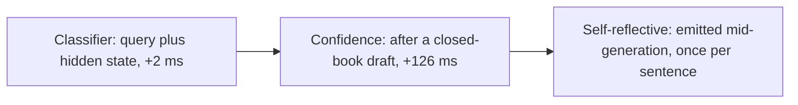
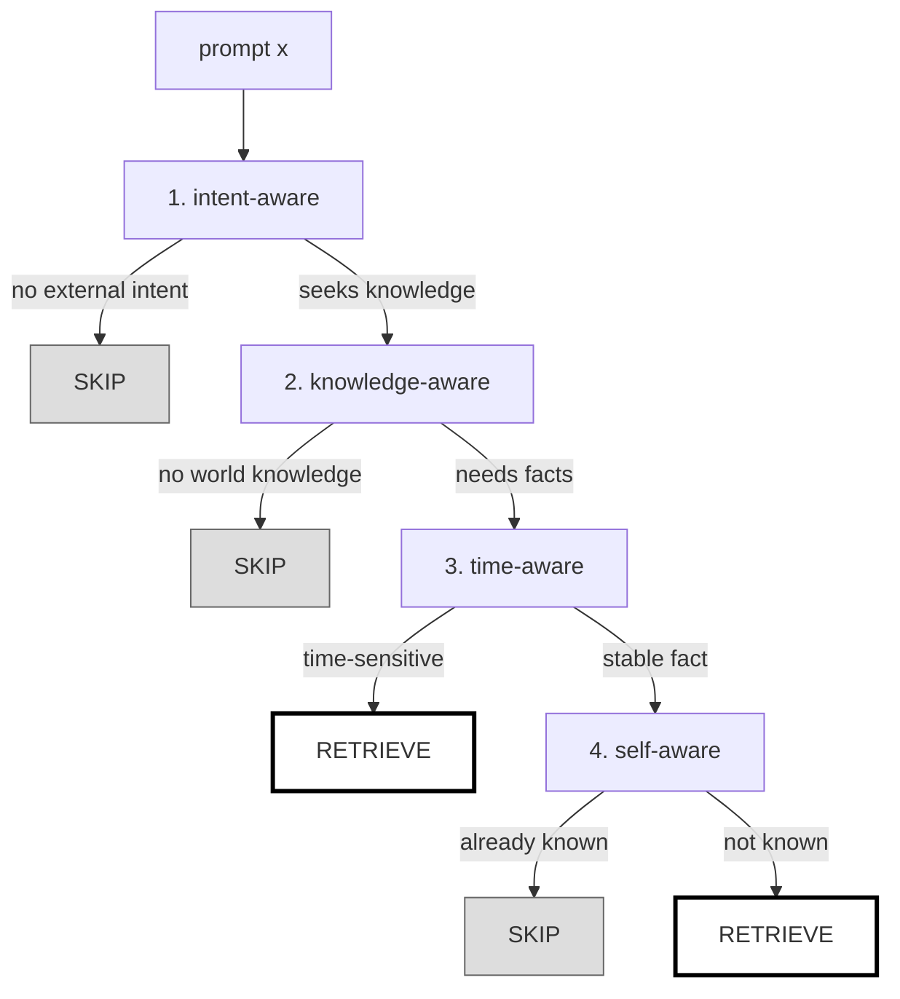
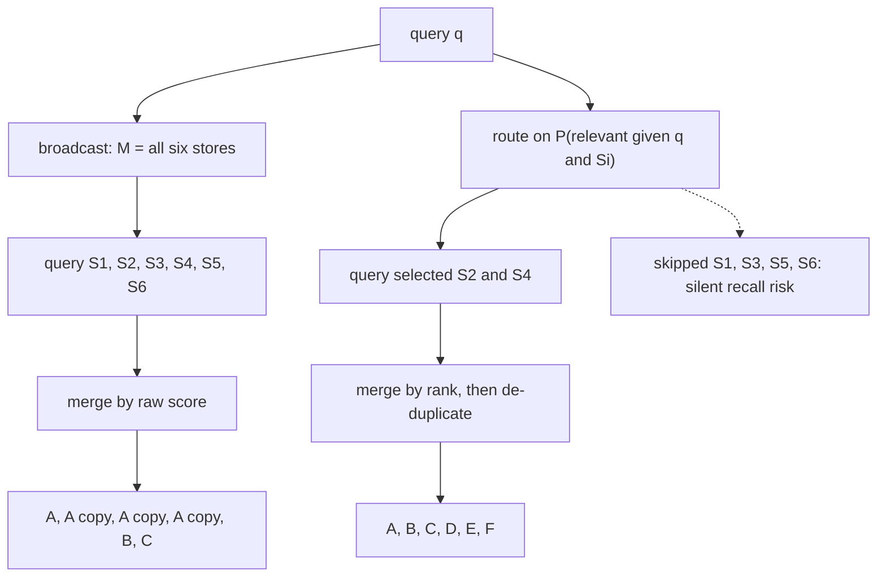
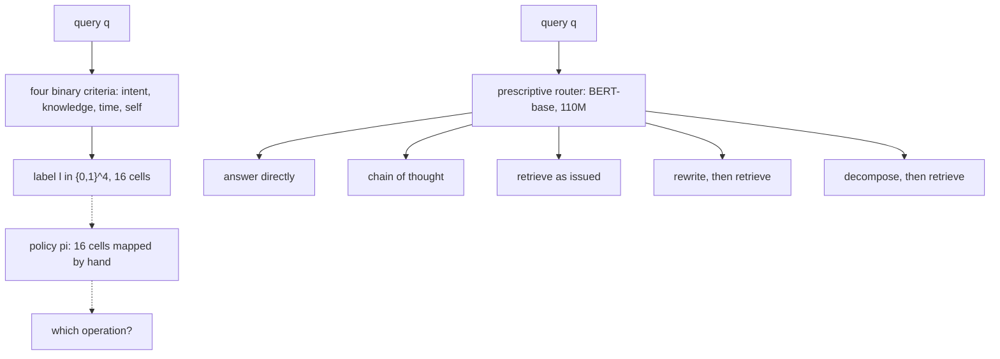
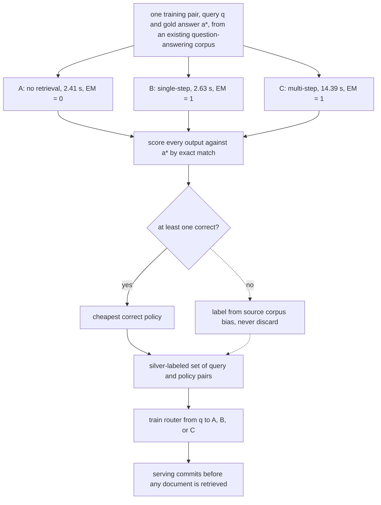

# Chapter 25: Routing and Adaptive Retrieval

This chapter explains how a Retrieval-Augmented Generation (RAG) system decides when to retrieve, where to look, which operation to run, and how to fail safely on unfamiliar queries.

## TL;DR

- Retrieval should fire only when it is more likely to help than hurt. The maximum accuracy gain over always retrieving equals the share of questions that the closed-book model gets right and retrieval gets wrong.

- A useful gate separates questions retrieval spoils from questions retrieval saves. Easy versus hard is the wrong dividing line.

- Unified Active Retrieval (UAR) checks four different facts in order: external intent, need for world knowledge, time sensitivity, and whether the model already knows a stable answer.

- Source routing chooses which stores to query. It prevents prohibited calls, repeated evidence, incompatible scores, and compounded tail latency, but it creates silent recall risk when it skips the right store.

- A descriptive classifier says what a query is like. A prescriptive router says what the system should do, such as answer directly, retrieve once, rewrite, or decompose.

- Query stratification asks what the corpus must supply: one fact, several facts, a written procedure, or an unwritten policy inferred from prior cases.

- Adaptive-RAG learns routes from silver labels. It runs every available policy offline and keeps the cheapest policy that produced the correct answer. Every learned router is weak out of distribution. Confidence measures distance from a decision boundary, so a separate distance-to-training-data gate must send unfamiliar inputs to the safer branch.

## The story

Imagine one large library with a service desk, several archive rooms, and a clerk who can sometimes answer from memory. A patron asks a question. The first choice is whether to send a records runner into the archives at all. The runner can help when the clerk lacks a fact. The runner can also return an old or distracting page that makes a correct remembered answer worse. The chief librarian therefore studies two piles. One pile contains questions the runner rescued. The other contains questions the runner spoiled. The useful gate learns the difference between those piles. It does not merely separate easy questions from hard ones. The librarian next checks four cards. The first card asks whether the patron wants outside knowledge at all. A request to reformat a note does not need a records runner. The second card asks whether the answer needs facts beyond the text already on the desk. The third asks whether the fact can become stale. The fourth asks whether this clerk already knows the stable fact.
Freshness comes before memory because a clerk can confidently remember last year's office holder. If retrieval is needed, the chief librarian chooses where to send the runner. Broadcasting sends runners to every room. That can violate a regional rule, call an expensive partner desk, or bring back four photocopies of one stale memo. Four copies look like four witnesses even though they come from one author. Routing opens only likely rooms, merges their result ranks, and groups copies by lineage before counting agreement. The chief librarian must then choose an operation. A descriptive tag such as "needs outside knowledge" does not say whether to search once, rewrite an unclear request, or split a compound request into several searches. A prescriptive route names the operation itself. The librarian also sorts requests by what the archive must provide. Level 1 needs one written fact. Level 2 needs several facts combined. Level 3 needs a whole written procedure. Level 4 needs examples of past decisions because nobody wrote the policy down. Each level needs different archive machinery. The library trains its dispatcher without asking people to guess hop counts.
For each question with a known answer, it tries the cheap desk answer, one archive trip, and a multi-trip investigation. It labels the question with the cheapest route that worked. That label is called silver because execution produced it automatically. The final danger is a patron from a new field using unfamiliar language. The dispatcher can sound very confident while sending that patron to the wrong room. Its confidence only says how far the request lies from its internal dividing line. It does not say whether the library has seen anything similar before. The safe library therefore measures distance to familiar requests. If the request lies too far away, it bypasses the dispatcher and uses the broader, more expensive investigation.

## Decoder table

| Technical term | Plain-English meaning | Why it matters |
|---|---|---|
| Retrieval-Augmented Generation (RAG) | A generator answers with retrieved external context | Retrieval can add evidence or corrupt an answer the model already knew |
| Closed-book answer | An answer produced without retrieved context | It is the baseline branch that a retrieval gate may preserve |
| Parametric memory | Facts represented in the model's weights | Popular facts may already be available without retrieval |
| Non-parametric memory | Facts stored outside the model and fetched at request time | It provides updateable evidence but can add noise |
| Exact match (EM) | A score that marks an answer correct only when it matches the gold answer | Adaptive-RAG uses it to manufacture route labels |
| Retrieval gate | A controller that chooses retrieve or skip | It can recover accuracy and cost when always-retrieve is harmful |
| Oracle gate | An impossible ideal gate that picks the better branch for every query | It defines the maximum available gating gain |
| α cell | Questions both closed-book and retrieval answer correctly | Skipping these changes cost but not accuracy |
| β cell | Questions only the closed-book branch answers correctly | This cell is the entire accuracy ceiling over always-retrieve |
| γ cell | Questions only the retrieval branch answers correctly | Skipping these questions gives accuracy back |
| δ cell | Questions both branches miss | A gate cannot repair them by branch selection |
| Classifier-based gate | A small model predicts retrieve or skip from the query or a hidden state | Its signal can exist before generation |
| Discriminative model | A model that predicts a class rather than generating an answer | It makes routing cheap and thresholdable |
| Large Language Model (LLM) | The generator whose weights and hidden states support answering | Its competence boundary determines useful routes |
| Hidden state | The model activation produced while reading the prompt | It exposes model-specific information that raw text lacks |
| Frozen model | A model whose weights stay unchanged while small probes train | UAR adds control without retraining the generator |
| Confidence-based gate | A gate that thresholds token probability, perplexity, or a competence proxy | Its timing and truthfulness determine whether it saves work |
| Token probability | The model's probability for a next token | It measures fluency under the model, not truth |
| Perplexity | A scalar derived from how surprising tokens are to a model | It is a possible confidence signal, not a truth detector |
| Entity popularity | A query-side proxy for how likely a fact appeared in pre-training | It is available before generation and supported adaptive retrieval in PopQA |
| Self-reflective gate | A model-generated control signal that requests retrieval | It can trigger during generation but only after some compute is spent |
| Control token | A special generated token that changes the pipeline action | It lets the generator request retrieval itself |
| Prefill | Processing prompt and retrieved context before token generation | Retrieved chunks can make this stage expensive |
| Decode | Generating output tokens one step at a time | A confidence gate may pay a full draft decode before deciding |
| Floating-Point Operation (FLOP) | One arithmetic operation used for compute estimates | It makes gate and generator costs comparable |
| 16-bit floating-point (FP16) | A compact weight format used in the decode estimate | The 7B example occupies 14 GB at this precision |
| High Bandwidth Memory 3 (HBM3) | Accelerator memory used in the decode estimate | Its bandwidth sets the weight-reading time per token |
| bfloat16 (BF16) | A 16-bit format used in the stated accelerator specification | It anchors the UAR throughput comparison |
| Unified Active Retrieval (UAR) | Four binary probes composed into a retrieval decision tree | It separates intent, knowledge, freshness, and self-knowledge |
| Intent-aware probe | A test for whether the instruction seeks external knowledge | It skips creative or formatting tasks that do not need facts |
| Knowledge-aware probe | A test for whether world knowledge is required | It skips pure reasoning over text already present |
| Time-aware probe | A test for whether the answer can become stale | It retrieves current facts even when the model is confident |
| Self-aware probe | A test for whether this model already knows a stable answer | It can skip retrieval for known facts |
| Multilayer Perceptron (MLP) | A small feed-forward classifier | UAR uses one lightweight probe per criterion |
| Logit | An unnormalized class score | Router margins can support asymmetric fallback decisions |
| Boolean composition | A fixed AND, OR, and NOT rule over binary criteria | It preserves the meaning and precedence of the four probes |
| Cascade | A sequence in which a terminal decision can stop later checks | It expresses precedence and may save cost when checks differ in cost |
| Conditional termination rate | The chance a gate stops the cascade after earlier gates pass | It is the correct quantity for ordering gates by cost |
| Hit-rate per unit cost | Conditional termination probability divided by evaluation cost | Descending order minimizes expected cost when verdicts are interchangeable |
| Source routing | Choosing which corpora or stores to query | It controls compliance, cost, duplication, and recall risk |
| Broadcast | Querying every available store | It avoids routing omissions but amplifies tails and duplicates |
| Fan-out | Sending one query to several stores in parallel | Wall-clock latency follows the slowest branch, not their sum |
| Tail latency | The chance a request exceeds its latency budget | More independent sources compound this probability |
| Source-selection accuracy | How often the router opens the store that contains useful evidence | A missed store leaves no result that can reveal the mistake |
| Cross-source duplication | The same document appearing in several stores | Copies consume context slots and create false agreement |
| Lineage | The common authored origin of copied or versioned documents | Counting lineages prevents replication from posing as corroboration |
| Heterogeneous stores | Sources with different corpora, scoring models, or scales | Their raw scores are not directly comparable |
| BM25 | A lexical ranking function whose score depends on collection statistics | Equal scores from different stores need not mean equal relevance |
| Cosine similarity | The angular similarity used by many embedding systems | Different models can occupy different effective score ranges |
| Pointwise cross-encoder | A reranker that scores each query-document pair independently | It promotes near-copies because it does not model redundancy |
| Reciprocal Rank Fusion (RRF) | A method that combines lists using ranks rather than raw scores | It avoids score calibration across heterogeneous stores |
| Metadata filtering | Narrowing candidates inside a chosen store | It cannot recover a store that routing never opened |
| Source abstention | Choosing no source when every relevance score is too low | It prevents least-bad stores from returning plausible noise |
| Descriptive controller | A classifier that outputs properties of a query | Its label still needs a separate action policy |
| Prescriptive router | A controller that directly outputs the operation to execute | It closes the gap between description and behavior |
| Label space | The set of descriptions a classifier can emit | Four binary criteria create 16 possible labels |
| Action space | The set of operations the system can execute | The chapter's router uses five concrete actions |
| Hand-written policy | A manually authored mapping from labels to actions | It grows combinatorially and lacks missing query properties |
| Action label | The cheapest operation that produced a correct answer | It can be manufactured from execution outcomes |
| Bidirectional Encoder Representations from Transformers base model (BERT-base) | A 110M-parameter encoder used as a published router scale | It can score a short query far more cheaply than generation |
| Softmax | A conversion from class logits to a probability distribution | It gives a margin that a fixed action router can threshold |
| Chain of thought | A reasoning path that does not require external retrieval | It keeps arithmetic queries away from distracting documents |
| Query rewrite | Turning an underspecified follow-up into a self-contained search query | It restores terms that lexical and dense retrievers can match |
| Query decomposition | Splitting a compound question into focused sub-queries | It raises per-fact coverage for multi-fact answers |
| Margin threshold | A cutoff based on the gap between top route scores | It enables conservative fallback when route scores are close |
| Query stratification | Classifying what kind of information the corpus must supply | It reveals which pipeline changes can raise the ceiling |
| Level 1 explicit facts | One written passage contains the answer | Chunk retrieval and reranking can solve it |
| Level 2 implicit facts | Several facts must be combined to derive the answer | Decomposition or iterative retrieval is needed |
| Level 3 interpretable rationales | A written procedure explains how to decide | The retrieval unit must preserve the whole procedure |
| Level 4 hidden rationales | Policy exists only in past decisions | Retrieval becomes case selection for in-context learning |
| Joint coverage | The chance every required fact reaches the generator | It falls as p to the power h when h facts are independently needed |
| Parent-document retrieval | Matching a chunk but returning its full document | It preserves multi-step procedures that chunking would cut apart |
| Exemplar selection | Retrieving prior cases to guide a new decision | It is the relevant form of retrieval when no rule is written |
| Outcome match | Similarity in decision structure and result, not just wording | It is the right quality target for Level 4 cases |
| Adaptive-RAG | A three-way router over no retrieval, single-step retrieval, and multi-step retrieval | Its main contribution here is executable supervision |
| Silver label | A training label generated automatically by a good-enough process | It avoids impossible human hop-count annotation |
| Policy execution | Running a complete candidate pipeline on a labeled question | It reveals which route actually works for this generator |
| Hop count | The number of retrieval and reasoning steps a query needs | It depends on both query and generator knowledge |
| Multi-step loop | Repeated retrieval and generation up to a cap | It supports hard queries at much higher latency |
| Source-corpus bias | A fallback label based on whether a dataset was built as single-hop or multi-hop | It retains unsolved hard examples but is crude |
| Class prior | The fraction of labels assigned to each route | It inherits the benchmark mix and may not match production |
| Reinforcement Learning (RL) | Learning a sampled policy from a verifiable reward | It becomes attractive when exhaustive route enumeration explodes |
| Out-of-distribution (OOD) query | A query unlike the router's training inputs | The router can classify it confidently and silently choose the wrong plan |
| Decision boundary | The surface separating route classes | Softmax confidence reflects distance from this surface |
| Training centroid | A representative center of familiar query embeddings | Distance to it supplies an independent novelty signal |
| Cluster radius | A scale for spread around a training centroid | It makes input distance interpretable across a cluster |
| k-nearest-neighbor (k-NN) distance | Distance to nearby training examples rather than only a centroid | It handles multi-modal training sets better when affordable |
| Under-routing | Sending a hard query to a cheaper, insufficient branch | It can cause a wrong answer that downstream stages cannot recover |
| Over-routing | Sending a simple query to an expensive branch | It wastes compute but may preserve correctness |
| Cost-sensitive threshold | A route cutoff derived from compute cost and wrong-answer loss | It replaces an unjustified 0.5 argmax threshold |
| Branch share | The fraction of traffic assigned to each route | It is observable without production route labels and can expose shift |
| Distribution shift | A change in the kinds of queries served | It invalidates learned routing assumptions before retrieval begins |
| Corrective Retrieval-Augmented Generation (CRAG) | A system with a trained evaluator in front of retrieval decisions | It illustrates the shared OOD weakness of supervised controllers |
| `p(q)`, `r(q)`, and `g(q)` | Closed-book correctness, retrieval correctness, and the binary retrieve decision for query `q` | They define the retrieval-gating objective |
| `A(g)`, `A(1)`, `A(0)`, and `A*` | Accuracy of a gate, always-retrieve, never-retrieve, and the oracle | Their differences expose the maximum value of gating |
| `S` | Set of queries on which a real gate skips retrieval | Its intersections with β and γ determine accuracy gained and lost |
| `a_int`, `a_know`, `a_time`, and `a_self` | External intent, world-knowledge need, time sensitivity, and model self-knowledge bits | UAR composes these distinct predicates instead of learning one opaque label |
| `y` | Final binary retrieval target produced by the four UAR bits | It makes the decision rule explicit and inspectable |
| `h(x)` and `d` | Frozen final-token hidden state for prompt `x` and its width | Every UAR probe reads this shared model-specific representation |
| `c_i`, `p_i`, `n`, and `E[C]` | Gate cost, conditional termination rate, gate count, and expected cascade cost | Their ratio determines the cheapest valid gate order |
| `N`, `S_i`, `K_i`, and `M` | Source count, source `i`, units in that source, and selected-source subset | They distinguish broadcast work from routed work |
| `ell_i` and tail probability `p` | Latency of source `i` and its chance of exceeding budget | Parallel fan-out compounds tail risk even when latencies do not add |
| `k`, replication `r`, and `k_distinct` | Context slots, copies per document, and distinct-document capacity | They quantify the context tax from duplicated evidence |
| `P(relevant given q and S_i)` | Query-conditioned relevance probability for one source | It is the source router's real target instead of a static source ranking |
| `q`, `L`, `A`, `f_desc`, `f_pres`, `l`, and `pi` | Query, label space, action space, two controller maps, one label, and the hand-written policy | They separate describing a query from choosing an executable operation |
| `h`, per-fact `p`, pooled `p1`, and decomposed `pd` | Fact count and the three recall terms in stratification | Their powers determine multi-fact joint coverage |
| Policies `A`, `B`, and `C` | No retrieval, single-step retrieval, and multi-step retrieval | Adaptive-RAG chooses the cheapest policy that answers correctly |
| `a*`, `Pi`, `G_pi(q)`, `c(pi)`, `pi*`, `T`, and `f_phi` | Gold answer, policy set, policy output, policy cost, silver label, loop cap, and trained router | They define the executable supervision procedure |
| `p`, wrong-answer loss `L`, `delta C`, and `tau*` | Expensive-route probability, error loss, extra branch cost, and cost-sensitive threshold | They replace an unjustified symmetric argmax decision |
| OOD fraction `f` and retrieval lift `d` | Unseen traffic share and accuracy value of querying the right source | Their product consumes the routing accuracy margin |
| Text-to-Text Transfer Transformer (T5) | Encoder-decoder family used by the Adaptive-RAG router and CRAG evaluator | It shows that these controllers are trained models, not score thresholds |
| Forward-Looking Active Retrieval augmented generation (FLARE) | Mid-generation retrieval triggered by low token confidence | Its signal arrives only after generation has begun |
| Self-RAG | A system whose model emits retrieval and critique controls | It is another supervised controller exposed to distribution shift |
| RAGRoute | Learned source router using query embeddings and source centroids | It supplies the routing savings and OOD exposure measurements |
| Interleaving Retrieval with Chain-of-Thought (IRCoT) | Multi-step method that alternates reasoning with retrieval | Its reported gain anchors the decomposition example |
| Approximate Nearest Neighbor (ANN) search | Indexed vector search that avoids a full scan | It is one recurring cost inside every retrieval call |
| Hierarchical Navigable Small World (HNSW) graph | Approximate vector index with sublinear search behavior | It limits how literally corpus-size ratios predict search savings |
| Generative Pre-trained Transformer 4 (GPT-4) | Model used to produce reflection labels in the Self-RAG example | Distillation transfers its label blind spots into the critic |
| Medical Information Retrieval-Augmented Generation Evaluation (MIRAGE) | Medical benchmark used in the source-routing measurements | It grounds the reported query, transfer, and accuracy changes |
| PageRank | Recursive web-authority score based on links from other authoritative pages | It shows why raw popularity alone is a gameable static source signal |
| Binary cross-entropy | Loss for independent binary predictions | RAGRoute uses it to train source relevance labels |
| Mutual information | Measure of dependence between two recorded decisions | It tests whether action and source selection should share one routing head |

## Core mechanics

### 25.1 When to retrieve: classifier, confidence, and self-reflective families

#### What it is

Let p(q) be the probability that the closed-book answer is correct. Let r(q) be the probability that the retrieval-augmented answer is correct. Let g(q) be 1 when the gate retrieves and 0 when it skips. The policy accuracy is:

$$
A(g) = E_q[g(q)r(q) + (1 - g(q))p(q)]
$$

Always-retrieve has accuracy E[r]. Never-retrieve has accuracy E[p]. The oracle gate has accuracy E[max(p, r)]. Its gain over always-retrieve is E[(p - r) positive part]. For binary outcomes, split queries into four cells. α means both branches are correct. β means only closed-book is correct. γ means only retrieval is correct. δ means both branches are wrong. Always-retrieve is α + γ. Never-retrieve is α + β. The oracle is α + β + γ. The maximum gain over always-retrieve is exactly β. A real gate skips a set S. Its change from always-retrieve is Pr(S intersects β) - Pr(S intersects γ).

#### Why it exists

On PopQA, Mallen et al. report that retrieval makes roughly 10% of questions wrong that the unassisted model would answer correctly. They also report that the unassisted model wins outright on high-popularity entities. Always-retrieve is therefore a policy with a measurable price. The first number to measure is β for the deployed generator and corpus.

#### Failure without it

A gate that merely skips easy questions mostly acts on α. That saves cost but changes no answers. The useful separator is β versus γ. The opening example asks who founded a company. Closed-book answers correctly, but retrieval injects an onboarding slide about the founding team and changes the answer to the wrong person. A stronger reranker can increase retrieval wins without directly eliminating questions where retrieval corrupts an already correct answer.

#### Signal families and timing

Classifier-based gates read the query or the frozen model's hidden state. Their signal exists before answer generation. Confidence-based gates threshold token probability, perplexity, or a competence proxy. Mallen et al. use entity popularity tuned on a held-out set because it is query-side and available before decoding. Self-reflective gates include Self-RAG's retrieve token and Forward-Looking Active Retrieval augmented generation (FLARE)'s mid-generation low-confidence trigger. Next-token confidence fails as a truth signal. The fluent false continuation "chocolate milk comes from brown cows" can still have high probability. The confidence signal also arrives only after a closed-book draft has already consumed a decode pass.

#### Cost and worked example

The worked system serves 100,000 queries per day with a 7B generator. Its outcome split is α = 52%, β = 10%, γ = 18%, and δ = 20%. Only β comes from the cited result. The other cells are assumed so the split sums to 100% and retrieval wins overall. Closed-book prompts contain 200 tokens. Retrieval adds five chunks of 400 tokens, for 2,200 prompt tokens. Always-retrieve accuracy is 70%. Closed-book accuracy is 62%. The oracle accuracy is 80%. The retrieval path spends 8 ms on embedding, 15 ms on Approximate Nearest Neighbor (ANN) search, and 60 ms reranking the top 20. The 2,000 extra prefill tokens cost 2 × 2,000 × 7 × 10^9 = 2.8 × 10^13 FLOPs. At 3.4 × 10^14 FLOP/s effective throughput, that is 82 ms. Total retrieval overhead is 83 + 82 = 165 ms per query. Always-retrieve processes 220 million prefill tokens per day. The popularity gate skips 30% of traffic. It rescues 6 of 10 β points and loses 3 of 18 γ points.
Accuracy becomes 70 + 6 - 3 = 73%. That captures one third of the 10-point oracle headroom. Daily prefill falls to 70,000 × 2,200 + 30,000 × 200 = 160 million tokens. That is a 27% cut with 30% fewer ANN and reranker calls. The expected latency avoided is 0.30 × 165 = 50 ms. A 110M-parameter encoder over 32 tokens costs about 7 GFLOPs and 2 ms wall time. It therefore nets 48 ms in the worked arithmetic. A 7B FP16 model holds 14 GB of weights. At 3.35 TB/s, one token takes 14/3350 = 4.2 ms to read the weights. A 30-token draft costs 126 ms on every query. The confidence gate therefore changes the 50 ms saving into 50 - 126 = -76 ms. The source's closing summary instead says the classifier saved 44 ms and confidence cost 80 ms. Those two summary values conflict with the worked arithmetic above.

#### Practice decisions and limits

Measure both branches on a few thousand production queries before building a gate. Treat β as model-and-corpus specific. A stronger model can grow β. A cleaner corpus can shrink it. Retune after every model or corpus change. Use cost-target gating only when cost or latency is the binding constraint. Log the input signal and the decision from day one. Track false skips separately from false fires. A false skip risks an ungrounded answer. A false fire spends 165 ms and risks context corruption.

### 25.2 Unified Active Retrieval: four criteria as a decision tree

#### What it is

A monolithic binary gate hides four latent facts. Define a_int as whether the instruction seeks external knowledge. Define a_know as whether the answer requires world knowledge rather than reasoning over prompt text. Define a_time as whether the answer is time-sensitive. Define a_self as whether this model already knows the answer. The retrieval target is:

$$
y = a_int ∧ a_know ∧ (a_time ∨ ¬a_self)
$$

The cascade first checks external intent. It then checks knowledge need. It retrieves immediately for time-sensitive facts. For stable facts, it skips only when the model already knows the answer.

#### Why it exists

The same binary skip label can mean no external intent, no world knowledge need, or a known stable answer. One output bit gives the gradient no direct signal about which sub-predicate failed. It also gives operations one bit of diagnosis when production quality moves. UAR supervises four independent binary probes and composes them explicitly. Each small MLP reads the frozen generator's final-prompt-token hidden state h(x). Intent, knowledge need, and time sensitivity may be legible in surface text. Self-knowledge is specific to the deployed weights, so the hidden state is the load-bearing input.

#### Failure without it

An intent-only failure retrieves roadmap chunks for a limerick request. A self-knowledge-only gate skips a request for the current vice president because the model confidently knows the former one. Staleness belongs to the world. Confidence belongs to the weights. The time-aware criterion must therefore precede the self-aware criterion. More training data for one undifferentiated output bit does not expose this structure.

#### Cost and ordering

The worked probe reads a d = 4,096 hidden state. It has a hidden width of 512 and two logits. Its parameter count is 4,096 × 512 + 512 × 2 = 2,098,176, or about 2.1 million. At two FLOPs per multiply-accumulate, each probe costs 4.2 MFLOPs. All four cost 16.8 MFLOPs. One 7B decode step costs 14 GFLOPs. The control plane ratio is 16.8 × 10^6 divided by 14 × 10^9 = 1.2 × 10^-3. That is 0.12% of one generated token. For gate i, let c_i be evaluation cost and p_i be the conditional chance it terminates the cascade. Expected cascade cost is:

$$
E[C] = \sum_{i=1}^{n} c_i \prod_{j \lt i}(1 - p_j)
$$

Two interchangeable adjacent gates are cheaper in i-then-i+1 order when p_i/c_i exceeds p_i+1/c_i+1. Order interchangeable gates by descending hit-rate per unit cost. Measure p_i on traffic that reaches gate i because knowledge need and external intent correlate. Full-workload rates misstate cascade cost. Four equal-cost probes over one shared hidden state gain nothing from early exit. They may run in parallel, after which the fixed tree consumes four bits. Ordering saves work only when one criterion is materially more expensive.

#### Worked example

The assistant serves 10,000 prompts per day. A retrieval adds 3,000 context tokens and 220 ms. The 220 ms contains 15 ms embedding, 25 ms ANN search, 80 ms cross-encoder reranking, and 100 ms extra prefill. Input costs $3 per million tokens. One retrieval therefore costs $0.009. Always-retrieve costs $90 per day and adds 220 ms to every prompt. Assume conditional termination rates p1 = 0.30, p2 = 0.20, and p3 = 0.25. Gate 4 splits its survivors 55% to skip and 45% to retrieve. Gate 1 skips 3,000 prompts. Gate 2 skips 1,400 of 7,000 survivors. Gate 3 sends 1,400 of 5,600 survivors directly to retrieval. Gate 4 skips 2,310 and retrieves 1,890 of the remaining 4,200. The final retrieval rate is 3,290/10,000 = 32.9%. Daily token cost falls to $29.61. The stated savings are $60.39 per day or $22,042 per year. Mean added latency falls to 0.329 × 220 = 72 ms.
Four probes over 10,000 prompts cost 168 GFLOPs per day. At an NVIDIA A100 specification of 312 TFLOP/s dense BF16, this is 0.54 ms of accelerator time per day. At 1% of peak, it is 54 ms per day. If the self-aware gate instead drafts 64 tokens, it costs 896 GFLOPs and always terminates. Putting it last means only 42% of traffic reaches it. Expected gating cost becomes about 376 GFLOPs instead of 896 GFLOPs. That is a 58% reduction. The hit-rate-per-cost ratios are 0.071 per MFLOP for gate 1 and 1.1 × 10^-6 for the draft gate. They differ by roughly 6 × 10^4.

#### Practice decisions and limits

Pin the self-aware probe to a generator version. Fail closed to retrieve when the version tag changes. Collapse the time gate to a constant only for a genuinely frozen corpus. Log the terminating gate, its margin, the final verdict, and the model version. Tune time-aware and self-aware probes for recall of retrieve by default. Tune intent-aware and knowledge-aware probes for precision of skip by default. That asymmetry can reverse when every unnecessary retrieval creates an injection surface. Replacing all probes with one generated structured verdict preserves decomposition but loses the activation-based self-knowledge signal. It also moves control cost from 0.12% of one decode step to more than a full answer's worth of generation on traffic that skips. The source proposes a possible split: use an LLM judge for intent, knowledge, and time, but retain a trained self-awareness probe. Evaluate per-field agreement on held-out and OOD slices.

### 25.3 Where to retrieve: source selection, conflict, heterogeneity

#### What it is

Suppose there are N stores S1 through SN. Store Si contains Ki indexed units. For each query, source routing chooses a subset M. Broadcast sets M to every store and searches Σ_i Ki units across N round trips. Routing searches Σ_(i in M) Ki units across |M| round trips. The choice sits after whether to retrieve and before query formulation inside the selected stores.

#### Why it exists

Some stores cannot be queried because of residency rules. Some charge per call or forbid bulk export. Some contain repeated or stale copies. Some use scoring systems that cannot be merged on raw values. The desired quantity is per-query relevance P(relevant given q and Si), not one static source leaderboard. Static document count or historical citation count rewards the largest or loudest source. PageRank illustrates the same failure one level lower. Counting inbound links is gameable, while recursive authority is only one query-dependent signal among many.

#### Failure without it

Parallel broadcast latency is the maximum source latency, not their sum. The real latency problem is compounded tail risk. If each source independently exceeds budget with probability p, N sources exceed it with probability 1 - (1 - p)^N. At p = 0.01, six sources produce 5.9% request-tail probability. Two sources produce 2.0%. Cross-source copies consume a fixed context window. One document copied r times leaves k - r + 1 distinct documents in a k-slot result when the other slots are unique. If every result is replicated r-fold, the effective distinct budget is the ceiling of k/r. At k = 10 and r = 3, only four distinct documents remain. Copies also create false consensus for agreement-based credibility estimation. A pointwise cross-encoder scores each copy independently and promotes all near-copies together. Heterogeneous raw scores are incomparable. BM25 depends on document frequency, corpus size, and average document length. A 120-token wiki and a 900-token PDF corpus normalize differently. A BM25 score of 14.2 in one store therefore cannot be equated to 14.2 in the other. Two embedding models may both output cosine values from -1 to 1 while placing typical relevant pairs near 0.85 and 0.35.
Merge heterogeneous lists on rank, not raw score. Routing errors are silent because an unopened store returns no evidence of its relevance.

#### Reported measurement

RAGRoute reports results on the MIRAGE medical question-answering benchmark and the Massive Multitask Language Understanding (MMLU) benchmark. Learned routing cut source queries by 77.5% and data transfer by 76.2%. Accuracy moved from 72.22% to 72.24%. Broadcast used 100/22.5 = 4.4 times as many source queries for 0.02 accuracy points.

#### Worked example

The constructed assistant has six stores. They contain 40,000, 8,000, 60,000, 300,000, 900,000, and 1,200,000 chunks. The total is 2,508,000 chunks. Each source returns 20 chunks averaging 600 tokens. Broadcast makes six round trips and returns 120 candidates. It transfers 72,000 tokens into fusion. Four copies of one policy occupy four of the final k = 10 slots. Only seven distinct documents remain. Three stale copies outvote one current copy by 3 to 1. Routing to the human-resources wiki and Singapore portal makes two round trips. It returns 40 candidates and transfers 24,000 tokens. That is a 66.7% reduction in candidates and transfer. The selected stores contain 48,000 vectors rather than 2,508,000. The 52 times ratio is only an upper bound on search savings because Hierarchical Navigable Small World (HNSW) search is sublinear in corpus size. Round trips, bandwidth, and reranker load are the durable savings. A cross-encoder at 200 pairs per second reranks 120 candidates in 0.60 seconds.
It reranks 40 candidates in 0.20 seconds. Routing returns 400 ms before generation. Near-duplicate detection reduces the four copies to two lineages: one old authored policy and one amendment. The vote becomes 1 to 1. Recency then selects the amendment. Deduplicating after the vote is too late.

#### Practice decisions and limits

Default to broadcast while N is at most 3 for homogeneous, in-region stores. Route sooner when calls are billed, residency-limited, or tail-dominating. Deduplicate across sources before the reranker. Key duplicates to lineage at ingest and retrieve one representative per lineage. Do not collapse translations, jurisdictional variants, or successive released versions when they are distinct evidence. Use RRF with k approximately 60 for heterogeneous stores. Give every selected source at least one merged slot. Use global top-k only when stores share one embedding model, one scorer, and one corpus scale. Stamp chunks with source, ingest time, and effective date. Resolve conflicts by effective date and provenance. Older signed contracts, court rulings, or released interface versions may remain authoritative. Surface surviving conflicts instead of silently hiding them. Add a no-relevant-source branch when every source score is below threshold. Metadata filtering is inside a store. It cannot recover a store that routing skipped. The seventh-source interview example adds a 30-million-document partner interface with no useful metadata and per-call billing. Residency removes bulk copying for the restricted European slice, so the source answer splits unrestricted replication from restricted live federation.

### 25.4 Query routers: descriptive versus prescriptive

#### What it is

A descriptive controller maps query q to label l in label space L. A prescriptive router maps q to action a in action space A. UAR uses four binary criteria, so its label space has 2^4 = 16 cells. The chapter's action space has five operations. They are answer directly, chain of thought, retrieve as issued, rewrite then retrieve, and decompose then retrieve. A prescriptive route to either of the first two actions answers the retrieve-or-skip question for free. A retrieve-or-skip label does not identify the correct retrieval operation.

#### Why it exists

The label "needs external knowledge" fits retrieve as issued, rewrite then retrieve, and decompose then retrieve. The correct choice also depends on hop count, ambiguity, and self-containment. The descriptive controller did not measure those properties. A hand-written mapping from 16 labels to five actions therefore has no basis for many choices. Train directly on action labels instead. Run each action, score the answer, and select the cheapest correct operation.

#### Failure without it

A follow-up such as "what about the second one" reaches the index without content-bearing terms. An arithmetic word problem gets irrelevant policy chunks even though no corpus contains its answer. A dispatcher whose action set contains only retrieval variants has no route for either case. The descriptive pipeline then collapses every knowledge-bearing query onto retrieve as issued.

#### Cost and alternatives

A five-way BERT-base softmax has 110 million parameters. At two FLOPs per parameter per token, a 32-token query costs 7.04 × 10^9 FLOPs. At 3.4 × 10^14 FLOP/s, that is 0.021 ms of arithmetic. A prompted 8B generator in bf16 reads 16 GB per token. At 3.35 TB/s, it takes 4.8 ms per token. A five-token routing decision takes 24 ms, roughly three orders of magnitude more than the encoder arithmetic. A generated label also lacks a score distribution for asymmetric thresholding. Fine-tuning that router on local traffic also requires touching the generator. The generative router wins when the action space is open-ended, such as hundreds of tools that a fixed softmax cannot enumerate.

#### Worked example

Query A asks for the capital of France. The router answers directly. A 32-token prefill costs 2 × 8 × 10^9 × 32 = 5.12 × 10^11 FLOPs, or 1.5 ms. Five decoded tokens add 24 ms. Query B gives four animals with ten legs and asks how many are chickens. The route is chain of thought. The equations yield three chickens and one rabbit. Retrieving five 400-token chunks would add 2,000 distractor tokens. That prefill costs 3.2 × 10^13 FLOPs, or 94 ms. Query C says "what about the second one". The router rewrites and then retrieves. A 20-token rewrite costs 96 ms before retrieval. Query D asks which of two Frankfurt data centers has the later contract renewal. The router decomposes, then makes two retrieval calls and two 94 ms prefills. The router's break-even diversion rate is 0.021/94 = 2.2 × 10^-4, or 0.022%. One correct diversion in about five thousand pays for the router.
A BERT-base cross-encoder over 100 candidates at 256 tokens each reads 25,600 tokens. That is exactly 800 times the router's 32 tokens and about 16.6 ms of arithmetic.

#### Practice decisions and limits

Supervise on actions when an evaluation set can score answers. Use a deliberately small descriptive policy only while action labels are unavailable. Prefer a small encoder for a fixed action set. Include non-retrieval actions unless the domain requires every answer to be corpus-grounded. Use a conservative fallback when the top two logits are close. The source defaults that fallback to retrieve as issued because a false direct answer can hallucinate while extra retrieval is usually a bill. Grade the router on end-to-end answer quality per unit cost. Log the chosen action and its margin. Do not trust one scalar routing accuracy because route confusions have different costs. The interview example reports 82% held-out routing accuracy while end-to-end quality falls. Inspect the confusion matrix and quality change per route. Joint routing over five actions and |S| sources creates 5|S| classes. Its silver-labeling cost also multiplies across actions and sources. Prefer an action router followed by source selection unless logged traffic shows strong dependence between action and source. Measure mutual information between action and source before merging the heads.

### 25.5 Query stratification: four levels of information need

#### What it is

Level is defined by what the corpus must supply. Level 1 supplies one explicit fact written in one place. Level 2 supplies several implicit facts that must be combined. Level 3 supplies an interpretable written rationale such as a standard operating procedure, manual, or regulation. Level 4 supplies examples of hidden rationale because no procedure was written. Level belongs to the query-and-corpus pair, not the query alone. The same question can be Level 1 in a documented company and Level 4 where policy survives only in past approvals.

#### Why it exists

Retriever tuning raises the ceiling for Levels 1 and 2. Level 3 fails when the retrieval unit cuts a procedure apart. Level 4 fails because the rule is absent from the corpus. One embedding model, one chunk size, one k, and one reranker cannot repair all four mechanisms.

#### Coverage mechanics

Let h be the number of independently required facts. Let p be the probability any one fact reaches context. Joint coverage is p^h. At p = 0.9 and h = 3, joint coverage is 0.9^3 = 0.729. Holding joint coverage at 0.9 for three facts requires p = 0.9^(1/3) = 0.965. A pooled query also divides one top-k budget across several needs. At k = 10 and h = 3, each need controls about three slots rather than ten. Decomposition raises the per-fact base probability by giving every fact its own query and top-k budget. It does not remove the exponent. Improving recall from 0.90 to 0.94 moves three-fact joint coverage from 0.729 to 0.830, a change of 0.101 if pooling penalties are ignored. That same improvement does nothing for a missing written rule or a chopped procedure.

#### Worked example

The corpus has 500,000 chunks of 200 tokens. The retriever returns k = 10. Single-fact recall is p = 0.90. Level 1 asks for a Tier-2 refund window. It retrieves one fact with probability 0.90 and prefills 2,000 tokens. The Level 2 query asks which Tier-2 products fall below a European Union (EU) minimum and needs three facts. The example assumes pooled per-fact recall p1 = 0.60. Joint coverage is 0.60^3 = 0.216. The decomposed version makes three sub-queries. It restores 0.90 per-fact recall and 0.729 joint coverage. The ratio 0.729/0.216 is 3.4 times. The cost is three embeddings, three ANN searches, and 6,000 prefill tokens. The Level 3 example is a nine-step escalation procedure across nine chunks and 1,800 tokens. Parent-document retrieval returns the full procedure plus six other 200-token slots. Total prefill is 3,000 tokens. The Level 4 refund-approval query has no written rule and retrieves eight resolved tickets of about 600 tokens each. That is 4,800 exemplar tokens.
With a 60%, 25%, 10%, and 5% traffic split across Levels 1 through 4, mean prefill is 3,240 tokens. The level-blind baseline uses 2,000. The level-aware design spends 1.62 times as much prefill to stop failing 40% of traffic structurally. The assumed pooled penalty from 0.90 to 0.60 is a stated assumption. Interleaving Retrieval with Chain-of-Thought (IRCoT) reports gains up to 21 retrieval points. Substituting p1 = 0.69 gives 0.69^3 = 0.329. The decomposed ratio becomes 0.729/0.329 = 2.2 times. The multiple shrinks but remains several-fold.

#### Practice decisions and limits

Hand-label 200 production queries by level before tuning retrieval. Use decomposition when h is at least 2 independent facts. Use parent-document retrieval when all facts co-occur reliably in one document. Maintain 200-token chunks for fact retrieval and full documents for procedures. The interview's well-tuned fact chunks are 200 tokens with 20% overlap, yet they remain the wrong unit for a nine-step procedure. Do not globally enlarge chunks to solve Level 3. Procedures under roughly 400 tokens may fit one chunk. Treat Level 4 as exemplar selection scored on outcome match. Promote Level 4 to Level 3 as soon as the policy can be written down. Report quality separately by level. A level below 1% of traffic may be explicitly out of scope. Abstain at Level 4 when no sufficiently similar case exists. When a failing slice is 12% of traffic and a decision is due within one week, label 200 failures by level before choosing a reranker or graph index.

### 25.6 Adaptive-RAG and silver-label supervision

#### What it is

Adaptive-RAG chooses among three policies. Policy A answers with no retrieval. Policy B retrieves once and generates. Policy C runs a retrieve-and-reason loop capped at T iterations. For query q with gold answer a*, let G_pi(q) be the generator output under policy pi. Let c(pi) be policy cost with c(A) below c(B) below c(C). The objective is:

$$
\pi^\star(q) = \underset{\pi \in \{A,B,C\}}{\arg\min}\ c(\pi) \quad \text{subject to}\quad \mathop{\text{EM}}(G_\pi(q), a^\star) = 1
$$

When several policies are correct, cheapest wins. When no policy is correct, the source dataset's single-hop or multi-hop bias supplies a fallback label. The hard queries stay in training rather than disappearing.

#### Why it exists

No question-answering dataset supplies the required hop count for a particular generator. An annotator cannot see which facts that generator memorized. The route label is a property of the query-and-generator pair. Execution converts this impossible annotation problem into measurement. Run all policies on every training question with a known answer. Score every output. Keep the cheapest successful policy. This costs |Pi| complete executions per training query, once and offline. A small T5-scale encoder-decoder then learns query to A, B, or C. It predicts which machine will solve the query rather than solving the query itself.

#### Failure without it

Routing every query to the multi-step loop approaches an order-of-magnitude overhead on simple facts. Routing every query to one retrieval loses bridging facts on multi-hop questions. Using dataset provenance as the main label predicts benchmark construction rather than actual generator need. Dropping questions no policy solved trains a router that never sees the hard tail. A post-generation confidence trigger pays for a pass before discovering that the pass was wrong. Adaptive-RAG commits before retrieval, which saves that work but exposes it to pre-evidence mistakes.

#### Worked example

The generator decodes at 50 tokens per second, or 20 ms per token. The answer has 120 tokens. Prefill runs at 8,000 tokens per second. Each retrieval call takes 90 ms and returns five 200-token chunks. The instruction and question use 100 tokens. Policy A prefills 100/8,000 seconds and decodes for 2.40 seconds. Its rounded total is 2.41 seconds. Policy B prefills 1,100 tokens in 0.14 seconds. Adding 0.09 seconds retrieval and 2.40 seconds decode gives 2.63 seconds. Policy C uses T = 5. Each iteration retrieves for 0.09 seconds and generates a 2.40-second reasoning step. The prompt grows by 1,000 tokens per iteration. Summed prefill is 1.94 seconds. Retrieval totals 0.45 seconds. Decode totals 12.00 seconds. The policy total is 14.39 seconds, or 5.5 times Policy B.
On 30,000 silver-labeled queries, assume 22% class A, 51% class B, and 27% class C. A perfect router then averages 0.22 × 2.41 + 0.51 × 2.63 + 0.27 × 14.39 = 5.76 seconds. Always using Policy C takes 14.39 seconds. The saving is 2.5 times while preserving the expensive route for class C. Each training query uses 1 + 1 + 5 = 7 generation calls. Thirty thousand queries use 210,000 calls. At roughly 2.4 seconds of decode each, that is 504,000 seconds or 140 serial hours. At 32-way batching, it is 4.4 hours. Human annotation at 30 seconds per query would take 250 annotator-hours and would not observe generator memory. The source says published timings put multi-step close to 10 times single-step. Its cost approximation is 2.565T + 0.0625T^2 seconds. Matching 10 × 2.63 seconds gives T = 8.5. That corresponds to eight or nine iterations before stopping.

#### Practice decisions and limits

Start with three classes, not five. Every extra class adds an execution pass and thins per-class data. If one class exceeds roughly 70% of labels, split inside that dominant class. Keep unsolved queries unless they exceed about one third of the set. Above that level, fix the retriever or generator before the router. Re-run labeling after a generator change. For a minor version, relabel a random 2,000-query sample first and compare class distributions. Budget the router against the route gap it arbitrages. The A-to-B gap is 0.22 seconds. The B-to-C gap is 11.76 seconds. Report EM and latency together. A hypothetical 65% three-way classifier cannot be judged by accuracy alone. Under-routing a class C query can lose the answer. Over-routing class A to C wastes 14.39 - 2.41 = 11.98 seconds but may remain correct. Bias uncertain cases upward toward the expensive route. If routing also chooses rewrite, source, and rerank depth, exhaustive labeling multiplies. The source example has 3 × 2 × 3 × 2 = 36 joint pipelines instead of 3.
That is a 12-fold labeling bill. Thirty-six classes over 30,000 queries average about 830 examples each before imbalance. Use a sampled RL policy with exact match as verifiable reward when the action space becomes a product rather than a small list.

### 25.7 The out-of-distribution weakness every router shares

#### What it is

The chapter groups several controllers under one risk. CRAG uses a fine-tuned T5-large evaluator with 770 million parameters to classify retrieved documents as correct, ambiguous, or incorrect. Adaptive-RAG predicts route complexity from silver labels over single-hop and multi-hop benchmarks. RAGRoute uses a three-layer fully connected network over query embeddings and per-source centroids with binary cross-entropy supervision. Self-RAG uses a critic distilled from GPT-4 reflection labels. Each is a small supervised classifier fitted to a fixed distribution and served against an open one.

#### Why it is different from retrieval failure

An unfamiliar query can make a retriever return weak documents. Weak documents may shift score distributions, lower reranker scores, trigger an evaluator, or cause generator abstention. A router commits before those stages. Every downstream component can execute correctly on the wrong plan. The branch not taken leaves no residual to inspect. Six weeks after launch, the opening incident loses two accuracy points after 4% of traffic shifts to a new vertical. Router confidence remains visually unchanged, including the fraction above 0.9.

#### Cost-sensitive decision

Let p be the router probability that a query needs the expensive branch. Let L be the loss from a wrong answer. Let delta C be the extra compute cost of the expensive branch. Under-routing costs pL in expectation. Over-routing costs delta C and is otherwise harmless under the chapter's assumption that the expensive branch still answers simple queries correctly. Choose the expensive branch when pL exceeds delta C. The resulting threshold is tau* = delta C/L. Adaptive-RAG reports the multi-step path at about ten times single-step. At $0.002 for single-step, extra compute is 9 × $0.002 = $0.018. Fifteen minutes of support time at $24 per hour costs L = $6. The threshold is 0.018/6 = 0.003. A symmetric argmax threshold of 0.5 is 167 times too reluctant to escalate under those constants. This cost correction still assumes the probability is meaningful.

#### Failure without an input-side gate

Softmax reports which side of a hyperplane an embedding lands on and how far past it lies. Its regions extend indefinitely beyond the training data. An unseen query can therefore have a large margin and be confidently wrong. Router confidence measures distance from the decision boundary. It does not measure distance from the training distribution. Escalating only low-confidence queries watches the quantity that fails. Use an independent input-side signal. Measure cosine distance from the query embedding to the nearest training centroid. Bypass the router beyond a high percentile of training distances. The source's practice threshold is the 99th percentile. Use k-NN distance when its lookup cost is affordable and the training set is multi-modal. Do not harvest labels only from the system's own failures because silver labels already inherit the producer's blind spots. The chapter notes that retrieval has a zero-shot benchmark for distribution shift while routers lack an equivalent.

#### Worked example

The RAGRoute setting has four medical corpora. Broadcast makes four source queries and reports 72.22% end-to-end accuracy. Routing reports 77.5% fewer source queries, 76.2% less transferred data, and 72.24% accuracy. Average fan-out becomes 4 × (1 - 0.775) = 0.90 sources per query. Routing saves 3.10 source queries for a gain of 0.02 accuracy points. Let f be the fraction of unseen traffic. Let d be the retrieval lift in accuracy points on that traffic. Routing remains accuracy-neutral only while fd is at most 0.02 points. At d = 10 points, f = 0.002, or two queries in one thousand. At d = 5 points, the allowance is 0.4%. At d = 20 points, it is 0.1%. One source query is priced at $0.0004. Saving 3.10 calls saves $0.00124 per user query. At 10 million queries per month, that is $12,400. With a $6 escalation and a 10-point retrieval lift, dollar break-even is f = 0.21%. The agreement with the accuracy calculation is an artifact of the chosen constants.
The order of magnitude is the intended lesson. The reported query reduction leaves 22.5% of source calls and 23.8% of transferred data. The retained corpora are therefore about 6% larger than average if sources are interchangeable. That supports the source-affinity interpretation but also exposes single-source dependence.

#### Practice decisions and limits

Make the expensive branch the default for ambiguous or unfamiliar inputs. If a hard latency service-level objective blocks that choice, cap expensive-branch traffic and page when the cap binds. Treat the cap binding as a distribution-shift alarm. Set tau* from written values of extra compute and wrong-answer loss. Use escalation or negative-feedback rates as a proxy when wrong-answer loss cannot be priced. Revisit the proxy quarterly. Log branch decisions and monitor branch share by traffic segment. Production route labels may be absent, but branch share is always observable. Sample distance-gated queries each week. Add labeled data when they form a coherent new vertical. Raise the gate percentile when the rejected set is diffuse noise.

## Diagrams

### Figure 25.1

#### Panel A: the only cell a gate can win

| Closed-book outcome | RAG correct | RAG wrong |
|---|---:|---:|
| Correct | α = 52 | β = 10, the gating ceiling |
| Wrong | γ = 18 | δ = 20 |

Always-retrieve = α + γ = 70. Closed-book = α + β = 62. Oracle gate = α + β + γ = 80.

#### Panel B: when each family's signal becomes available



Compute spent before the gate can fire increases from left to right.

**Figure 25.1:** Gating buys back exactly the questions retrieval spoils - the shaded β cell - and nothing else, while the three mechanism families differ chiefly in how much generation must already have happened before their signal exists.

### Figure 25.2



All four probes read the same hidden state from one prefill. They train independently, while the tree applies their bits as a precedence rule.

**Figure 25.2:** The four criteria are trained as independent binary probes over one frozen hidden state but applied as a cascade, so the tree encodes precedence rather than computation order: testing time-sensitivity before self-knowledge is what stops a confidently stale answer from short-circuiting the gate. Shaded terminals skip retrieval. Heavy terminals invoke it.

### Figure 25.3



The broadcast branch has three distinct documents in six slots and counts A four times as agreement. The routed branch has six distinct documents, but every skipped store creates silent recall risk.

**Figure 25.3:** The same context budget spent two ways: broadcasting and merging on raw score lets one replicated document occupy four of six slots and masquerade as cross-source agreement, while routing buys distinct evidence at the cost of a recall risk you can no longer observe. Slot counts are illustrative.

### Figure 25.4



The first two prescriptive actions never fire retrieval. The last three are distinct retrieval operations.

**Figure 25.4:** A descriptive controller (a) ends at a label and leaves the mapping to an operation unwritten, which is why the same label "needs external knowledge" silently collapses onto one action. A prescriptive router (b) emits the operation itself, and the when-to-retrieve answer falls out of the top two branches for free.

### Figure 25.5

| Level | What the corpus must supply | Machinery | Ceiling effect |
|---|---|---|---|
| L1, explicit facts | The answer written in one place | Chunking, embeddings, reranking, top-k | Retrieval quality raises the ceiling |
| L2, implicit facts | Several facts whose combination yields the answer | Decomposition, iterative retrieval, graph indexes, text-to-Structured Query Language | Retrieval quality raises the ceiling |
| L3, interpretable rationales | A written standard operating procedure (SOP), manual, or regulation | Document-level retrieval and procedure-following prompts | The corpus must contain the rationale |
| L4, hidden rationales | Past decisions that preserve an unwritten policy | Case retrieval as exemplars, offline rule mining, fine-tuning | The corpus must contain the rationale |

**Figure 25.5:** The four levels are separated by what the corpus must supply - a fact, a combination of facts, a written procedure, a policy that was never written - so tuning the retriever raises the ceiling on the top two bands and on neither of the bottom two.

### Figure 25.6



**Figure 25.6:** Nobody annotates hop counts, so the label is manufactured by executing every configuration against a known answer and keeping the cheapest one that was correct. The dashed path is what keeps the hardest queries - those no configuration solves - inside the training distribution.

### Figure 25.7

```text
cheap branch                                      expensive branch

       single-hop training set       / decision boundary
          .----------------.         /
         /  o  o  o  o     \       /       .----------------.
        |  o  o  o  o  o    |     /       /  []  []  []     \
         \       center     /     /       | []  []  []  []    |
          '----------------'     /          \ multi-hop set    /
                  . . . 2.6 r  /            '----------------'
                 X unseen query

          distance-to-data gate follows the dotted path
```

**Figure 25.7:** The unseen query lies 16.1 mm from the decision boundary, within three percent of the margin enjoyed by the centroid of the single-hop training cluster, while sitting 2.6 cluster radii r away from that centroid. A confidence score cannot separate those two situations, because it measures only the first distance. An input-side gate on the second (dashed) catches what the router's own output cannot.

## Whiteboard pack

### What to draw

1. Draw a query box at the far left.

2. Add a when-to-retrieve gate with four labels in order: intent, knowledge, time, self.

3. Draw a skip arrow to direct generation and a retrieve arrow to an action router.

4. Give the action router five branches: direct, reason, retrieve, rewrite, decompose.

5. From the retrieval actions, draw a source router that selects stores rather than broadcasting.

6. Add a four-row level box: one fact, several facts, written procedure, past cases.

7. Map those levels to one lookup, decomposition, parent-document retrieval, and exemplar retrieval.

8. Add an input-distance gate above the routers with a bypass to the expensive safe path.

9. End at generation, then annotate the router logs with action, margin, terminating gate, and branch share.

### Spoken script

Start with one question: should retrieval fire at all? A good gate separates cases retrieval saves from cases it spoils, then checks intent, knowledge need, freshness, and model self-knowledge. If retrieval is needed, a prescriptive router chooses the operation, while a source router chooses the stores. The information level then sets the machinery: one lookup, decomposition, procedure retrieval, or similar-case retrieval. Adaptive-RAG learns the action from silver labels made by running every policy and keeping the cheapest correct one. Finally, input-distance checks catch unfamiliar queries and send them to the safer, more expensive path.

## Interview traps

### 1. Retrieval raises overall accuracy but hurts common questions. What should trigger it?

Build the closed-book versus RAG 2 by 2 first, then identify β as the gain ceiling over always-retrieve and train the gate to separate β from γ rather than easy from hard. Prefer query-side or hidden-state signals because they exist before decoding. A next-token confidence gate measures fluency and pays for a draft before it can act.

### 2. Why not query every source and let the reranker choose?

Parallel fan-out compounds tail risk, can violate residency or billing constraints, and lets duplicate documents consume context slots. Raw scores from heterogeneous stores are incomparable, while a pointwise reranker promotes near-copies instead of suppressing them. Route likely stores, merge on rank, deduplicate by lineage before counting agreement, and expose the silent recall risk of skipped stores.

### 3. Is a when-to-retrieve classifier the same as a router, and how does query level change the answer?

No, because a descriptive classifier outputs a label while a prescriptive router outputs an operation such as direct answer, rewrite, or decomposition. The information level is a separate property of the query-and-corpus pair. It tells the router whether the corpus must supply one fact, several facts, a whole procedure, or similar past cases.

### 4. Nobody labels hop counts. How does Adaptive-RAG get supervision?

Run no-retrieval, single-step, and multi-step policies on questions with known answers, score every result by exact match, and keep the cheapest correct policy as the silver label. If none is correct, retain the query with the source corpus's bias as fallback. Recompute labels whenever the generator changes because the label depends on generator memory.

### 5. Why is router confidence not enough for OOD safety?

Confidence measures distance from the decision boundary, not distance from the training data. An unfamiliar query can be far from both, which makes it confident and wrong while every downstream stage follows the wrong plan correctly. Use an independent input-distance gate, route far inputs to the expensive safe branch, and monitor branch share by traffic segment.

## Key numbers

| Topic | Number or threshold | Exact meaning or limit |
|---|---:|---|
| PopQA retrieval harm | Roughly 10% | Questions retrieval made wrong that closed-book would answer correctly |
| Figure 25.1 α | 52 | Both branches correct in the illustrative matrix |
| Figure 25.1 β | 10 | Closed-book only, which is the oracle gain ceiling over always-retrieve |
| Figure 25.1 γ | 18 | Retrieval only in the illustrative matrix |
| Figure 25.1 δ | 20 | Both branches wrong in the illustrative matrix |
| Figure 25.1 always-retrieve | 70 | α + γ |
| Figure 25.1 closed-book | 62 | α + β |
| Figure 25.1 oracle | 80 | α + β + γ |
| Gate signal timing | 2 ms | Classifier wall time in the worked estimate |
| Gate signal timing | 126 ms | Closed-book 30-token confidence draft |
| Gate workload | 100,000 queries per day | Scale of the section 25.1 worked example |
| Gate generator | 7B parameters | Generator size in the section 25.1 example |
| Prompt sizes | 200 and 2,200 tokens | Closed-book versus five 400-token retrieved chunks added |
| Retrieval stages | 8, 15, and 60 ms | Embedding, ANN search, and top-20 cross-encoder reranking |
| Extra prefill | 2,000 tokens | Retrieved tokens beyond the 200-token prompt |
| Prefill compute | 2.8 × 10^13 FLOPs | 2 × 2,000 × 7 × 10^9 |
| Effective throughput | 3.4 × 10^14 FLOP/s | Assumed accelerator throughput |
| Prefill latency | 82 ms | Extra 2,000-token prefill |
| Total retrieval overhead | 165 ms | 83 ms retrieval path plus 82 ms prefill |
| Always-retrieve prefill | 220 million tokens per day | 100,000 × 2,200 |
| Popularity-gate skip | 30% | Traffic that avoids retrieval |
| Infrastructure skip request | 50% | Staff-level hypothetical that conflicts with zero accuracy regression unless traffic is segmented |
| Gate rescue and loss | 6 β points and 3 γ points | Accuracy moves from 70% to 73% |
| Gated prefill | 160 million tokens per day | 27% below always-retrieve |
| Expected latency avoided | 50 ms | 0.30 × 165 ms |
| Classifier encoder | 110M parameters and 32 tokens | About 7 GFLOPs and 2 ms |
| Classifier net saving | 48 ms | Worked arithmetic of 50 - 2 |
| Confidence weight read | 14 GB at 3.35 TB/s | 4.2 ms per token for 7B FP16 |
| Confidence net effect | -76 ms | Worked arithmetic of 50 - 126 |
| Source discrepancy | 44 ms and 80 ms | Closing summary values conflict with 48 ms and -76 ms arithmetic |
| UAR hidden state | 4,096 dimensions | Input width for each probe |
| UAR probe hidden width | 512 | Middle width of each two-layer probe |
| UAR output | 2 logits | Binary criterion output |
| UAR probe parameters | 2,098,176 | About 2.1 million parameters |
| UAR probe compute | 4.2 MFLOPs | Cost per probe |
| UAR total compute | 16.8 MFLOPs | Four probes |
| One 7B decode step | 14 GFLOPs | Comparison point for UAR overhead |
| UAR overhead | 1.2 × 10^-3 or 0.12% | Fraction of one generated token |
| UAR traffic | 10,000 prompts per day | Worked example scale |
| UAR retrieved context | 3,000 tokens | Context added per retrieval |
| UAR retrieval latency | 220 ms | 15 + 25 + 80 + 100 ms |
| UAR input price | $3 per million tokens | Makes one retrieval cost $0.009 |
| Always-retrieve cost | $90 per day | 10,000 retrievals |
| UAR termination rates | 0.30, 0.20, 0.25 | Conditional p1, p2, and p3 assumptions |
| UAR final split | 55% skip and 45% retrieve | Gate 4 split of survivors |
| UAR retrieval rate | 32.9% | 3,290 of 10,000 prompts |
| UAR daily cost | $29.61 | Cost after routing |
| UAR savings | $60.39 per day and $22,042 per year | Stated example savings |
| UAR mean added latency | 72 ms | 0.329 × 220 ms |
| UAR daily control compute | 168 GFLOPs | Four probes over 10,000 prompts |
| A100 reference | 312 TFLOP/s dense BF16 | Gives 0.54 ms per day at peak and 54 ms at 1% |
| Draft self-aware gate | 64 tokens and 896 GFLOPs | Expensive generated confidence criterion |
| Draft gate ordering | 42% reaches it | Last position cuts expected cost to 376 GFLOPs |
| Ordering reduction | 58% | 376 versus 896 GFLOPs |
| Hit-rate-cost ratio gap | About 6 × 10^4 | 0.071 versus 1.1 × 10^-6 per MFLOP |
| Source-tail probability | 1% per source | Six sources produce 5.9%, two produce 2.0% |
| Duplicate collapse | k = 10 and r = 3 | Pathological effective distinct budget is 4 |
| Heterogeneous lengths | 120 and 900 tokens | Wiki versus PDF average length example |
| BM25 comparison | 14.2 and 14.2 | Equal raw scores are not comparable across stores |
| Cosine comparison | 0.85 and 0.35 | Typical relevant-pair similarities can differ across models |
| RAGRoute reduction | 77.5% queries and 76.2% data | Reported source-routing savings |
| RAGRoute accuracy | 72.22% to 72.24% | Reported 0.02-point change |
| Broadcast query ratio | 4.4 times | 100/22.5 |
| Constructed store sizes | 40k, 8k, 60k, 300k, 900k, 1.2M | Six stores totaling 2.508M chunks |
| Source return size | Top 20 at 600 tokens each | Per-store candidate output |
| Broadcast transfer | 120 candidates and 72,000 tokens | Six stores queried |
| Duplicate vote | Four copies, three stale | Final window has seven distinct documents and a 3 to 1 stale vote |
| Routed transfer | 40 candidates and 24,000 tokens | Two stores queried, a 66.7% reduction |
| Selected vectors | 48,000 versus 2,508,000 | 52 times is only an upper bound on HNSW search saving |
| Reranker throughput | 200 pairs/s at 512 tokens | 0.60 seconds broadcast versus 0.20 seconds routed |
| Router default | Broadcast while N is at most 3 | Only for homogeneous, in-region stores |
| RRF constant | k approximately 60 | Rank-based merge default |
| Partner source | 30 million documents | Seventh-source example with no useful metadata and per-call billing |
| Descriptive labels | 2^4 = 16 | Four binary criteria |
| Prescriptive actions | 5 | Direct, reason, retrieve, rewrite, decompose |
| BERT-base router | 110M parameters and 32 tokens | 7.04 × 10^9 FLOPs or 0.021 ms |
| Generative router | 8B bf16 and 16 GB per token read | 4.8 ms per token at 3.35 TB/s |
| Routing generation | 5 tokens and 24 ms | About three orders slower than encoder arithmetic |
| Direct-answer example | 32-token prompt and 5-token answer | 1.5 ms prefill plus 24 ms decode |
| Arithmetic distraction | 2,000 tokens and 94 ms | Unnecessary retrieval prefill |
| Rewrite example | 20 tokens and 96 ms | Cost before retrieval |
| Router break-even | 0.022% | One correct diversion in about five thousand |
| Cross-encoder comparison | 100 × 256 = 25,600 tokens | 800 times router input, about 16.6 ms arithmetic |
| Held-out router accuracy | 82% | Hypothetical that still produces lower end-to-end quality because confusions have unequal cost |
| Joint action-source labels | 5 times the source count | Five actions crossed with every source |
| Reported recall | Recall@10 of 0.94 | Level-blind deployment still fails beyond lookups |
| Level count | 4 | Explicit fact, implicit facts, written rationale, hidden rationale |
| Joint coverage | 0.9^3 = 0.729 | Three facts at 90% per-fact recall |
| Required per-fact recall | 0.965 | Holds three-fact joint coverage at 0.9 |
| Pooled budget | k = 10 and h = 3 | About three slots per need |
| Recall upgrade | 0.90 to 0.94 | Three-fact joint coverage rises by 0.101 if pooling is ignored |
| Stratification corpus | 500,000 chunks at 200 tokens | Worked example base |
| Level 1 prefill | 2,000 tokens | Ten chunks |
| Level 2 pooled | 0.60^3 = 0.216 | Assumed pooled joint coverage |
| Level 2 decomposed | 0.90^3 = 0.729 | Three calls and 6,000 tokens, a 3.4-fold gain |
| Level 3 procedure | 9 steps and 1,800 tokens | Parent retrieval yields 3,000 total tokens |
| Level 4 exemplars | 8 × 600 = 4,800 tokens | Resolved-ticket context |
| Hidden-policy history | 400 past cases | Example where policy exists in decisions but not a rule document |
| Traffic mix | 60%, 25%, 10%, 5% | Levels 1 through 4 |
| Mean level-aware prefill | 3,240 versus 2,000 tokens | 1.62 times to address 40% structural failures |
| IRCoT anchor | Up to 21 points | Substitution gives 0.69^3 = 0.329 and a 2.2-fold ratio |
| Stratification sample | 200 queries | Default hand-labeling pass |
| Fact-chunk overlap | 20% | Well-tuned 200-token chunks remain wrong for a nine-step procedure |
| Failing-set decision | 12% of traffic, one week, 200 labels | Cheap stratification experiment before choosing a reranker or graph index |
| Decomposition threshold | h at least 2 | Unless facts reliably co-occur |
| Procedure chunk exception | Under roughly 400 tokens | May fit one chunk |
| Small level exclusion | Under 1% | May be explicitly out of scope |
| Adaptive-RAG policies | 3 | No retrieval, single-step, multi-step |
| Decode rate | 50 tokens/s or 20 ms/token | Worked latency model |
| Answer length | 120 tokens | 2.40 seconds decode |
| Prefill rate | 8,000 tokens/s | Worked latency model |
| Retrieval call | 90 ms | Embed, ANN search, and rerank |
| Retrieved context | 5 × 200 = 1,000 tokens | Per retrieval step |
| Policy A | 2.41 s | No retrieval |
| Policy B | 2.63 s | One retrieval and generation |
| Policy C | T = 5 and 14.39 s | Five retrieve-generate iterations, 5.5 times B |
| Policy C components | 1.94, 0.45, and 12.00 s | Prefill, retrieval, and decode |
| Silver-label set | 30,000 queries | 22%, 51%, and 27% in A, B, and C |
| Routed expected latency | 5.76 s | Versus 14.39 s always multi-step, a 2.5-fold saving |
| Label executions | 7 per query and 210,000 total | 1 + 1 + 5 over 30,000 queries |
| Labeling time | 504,000 s or 140 serial hours | 4.4 hours at 32-way batching |
| Human comparison | 30 s per query and 250 hours | Still cannot observe generator memory |
| Published timing anchor | Close to 10 times | Cost model reaches it at T = 8.5, or eight to nine iterations |
| Class split trigger | Roughly 70% | Split a dominant class |
| Unsolved trigger | About one third | Above it, fix generator or retriever first |
| Minor-version check | 2,000 queries | Relabel sample before full rerun |
| Route gaps | 0.22 s and 11.76 s | A-to-B and B-to-C arbitrage |
| Over-route cost | 11.98 s | Class A sent to C |
| Three-way router accuracy | 65% | Hypothetical that requires asymmetric error analysis before shipping |
| Joint routing grid | 3 × 2 × 3 × 2 = 36 | 12 times current labeling and about 830 examples per class |
| OOD incident | Six weeks, 2 accuracy points, 4% new traffic | Router confidence distribution stays unchanged |
| High-confidence share | Above 0.9 | Also appears unchanged in the incident |
| CRAG evaluator | 770M parameters and 3 classes | Correct, ambiguous, incorrect |
| Cost example | $0.002 single-step and $0.018 extra | Multi-step is about 10 times slower |
| Wrong-answer loss | $6 | Fifteen minutes at $24 per hour |
| Cost threshold | 0.003 | $0.018 divided by $6 |
| Argmax mismatch | 0.5 and 167 times | Symmetric threshold is too reluctant under the constants |
| Figure 25.7 boundary distance | 16.1 mm | Unseen-query distance to decision boundary |
| Figure 25.7 margin comparison | Within 3% | Similar to the single-hop centroid's boundary margin |
| Figure 25.7 data distance | 2.6 cluster radii | Unseen-query distance from the single-hop centroid |
| Distance bypass | 99th percentile | Practice threshold over training distances |
| Medical corpora | 4 | RAGRoute worked setting |
| Routed fan-out | 0.90 sources per query | Four times 22.5% remaining calls |
| Calls saved | 3.10 | Per user query |
| OOD accuracy allowance | fd at most 0.02 points | Entire reported routing margin |
| OOD slice at 10-point lift | 0.2% or 2 in 1,000 | Consumes the 0.02-point margin |
| OOD slice at 5-point lift | 0.4% | Accuracy-neutral limit |
| OOD slice at 20-point lift | 0.1% | Accuracy-neutral limit |
| Source-query price | $0.0004 | ANN search plus transfer |
| Routing dollar saving | $0.00124 per query | $12,400 at 10M queries per month |
| Dollar break-even OOD | 0.21% | With $6 loss and 10-point retrieval lift |
| Retained data ratio | 23.8% data versus 22.5% calls | Retained corpora are about 6% larger than average under interchangeability |
