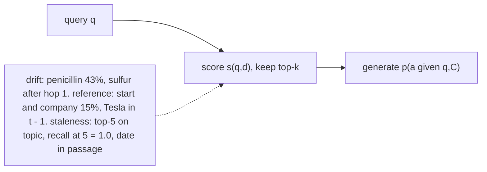
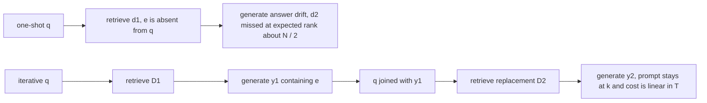
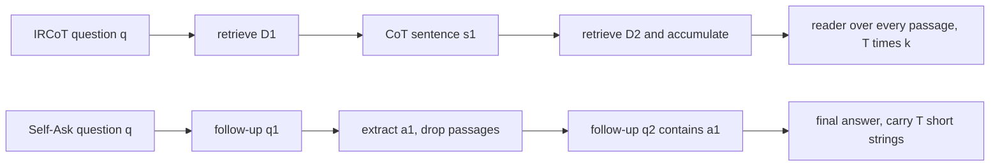
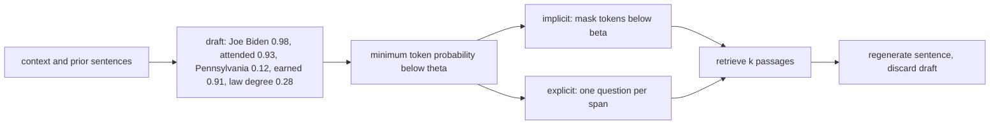
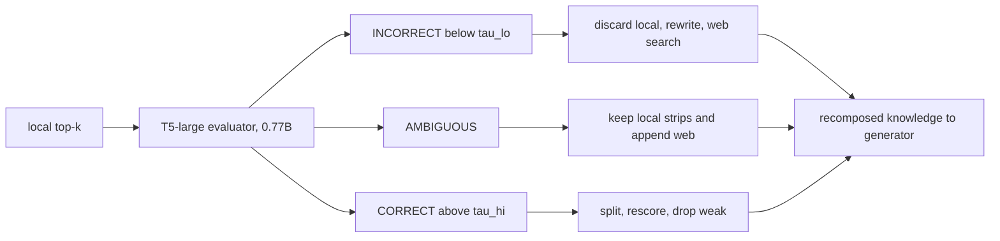
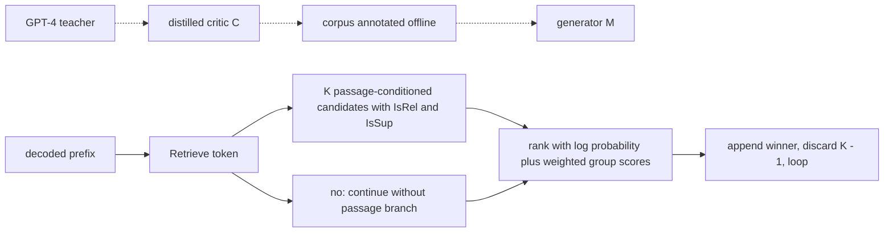
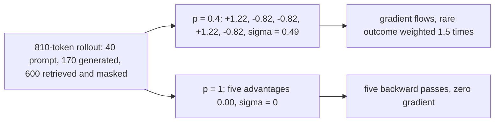
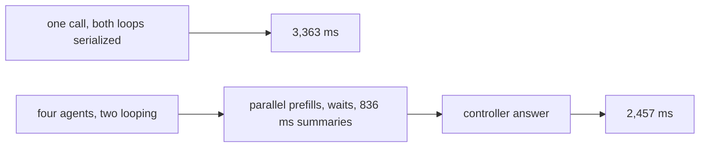
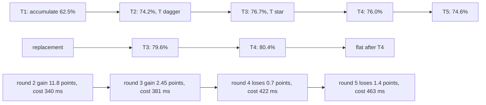

# Chapter 26: Iterative, Recursive, and Agentic Retrieval

Purpose: Explain why a single retrieval call fails when the useful query appears only after reasoning begins, then compare the retrieval-augmented generation (RAG) control loops that retrieve again, critique evidence, learn search behavior, fan out across sources, and stop before extra rounds reduce value.

## TL;DR

- One-shot retrieval freezes the query and context too early. Multi-hop drift, unresolved references, and stale-but-relevant evidence all place the deciding information after the only retrieval call.
- ITER-RETGEN, retrieval-augmented generation alternating with generation-augmented retrieval, feeds a draft back into the original query and replaces the retrieved set. This keeps prompt size linear in the number of rounds.
- Recursive methods derive a new hop from partial reasoning. Interleaved Retrieval with Chain-of-Thought Reasoning (IRCoT) keeps every passage, while Self-Ask keeps short intermediate answers.
- Forward-Looking Active Retrieval-Augmented Generation (FLARE) drafts a sentence, triggers on its minimum token probability, removes the uncertain span, retrieves, and regenerates.
- Corrective Retrieval-Augmented Generation (CRAG) uses a separate evaluator and two thresholds. Its ambiguous band preserves local evidence while adding web evidence, so a false positive costs context instead of the answer.
- Self-Reflective Retrieval-Augmented Generation (Self-RAG) compiles critique into reflection tokens. The tokens are cheap, but ranking one continuation per passage makes decode compute scale with the branch count.
- Search-R1 treats the whole think, search, information, and answer trace as the action. Group Relative Policy Optimization (GRPO) removes the critic used by Proximal Policy Optimization (PPO), but groups with identical rewards yield zero gradient. Agentic fan-out wins only when it overlaps multiple source-specific loops. Stopping must compare marginal coverage, dilution, latency, and price. Model confidence alone does not express those quantities.

## The story

Imagine a field team crossing a chain of islands with one radio call to headquarters. The first island is easy to name from the mission brief. The second is reachable only after the team reads a sign on the first.

A one-shot dispatcher sends every map before departure and cannot include that hidden name. ITER-RETGEN lets the scout radio back a draft route. Headquarters joins it to the mission and sends a replacement map.

IRCoT turns the journey into a growing field notebook, so every map stays in the pack. Self-Ask carries only the next island name. Its pack stays light, but a short note may omit evidence needed later.

FLARE sends a scout ahead. The team erases an uncertain word from the scout's draft before asking for a map. CRAG adds an independent inspector who replaces bad maps, trims good ones, and pairs uncertain ones with an outside map.

Self-RAG gives the scout compact signal flags. The flags cost little, but sending one scout down every candidate trail does not. Search-R1 lets reward shape search and stopping. GRPO learns nothing when every expedition succeeds or every expedition fails.

Agentic retrieval sends separate teams to separate islands. Parallel travel helps only when several teams need follow-up calls. Each team still owes a summary. The final rule is not "walk until confident." Stop when expected evidence gain no longer beats dilution and cost.

## Decoder table

| Term | Decode | Operational consequence |
|---|---|---|
| One-shot retrieval | Score one query once, freeze top-k context, then generate | No later evidence can repair the query or judge the retrieved set |
| Answer drift | A fluent answer is supported by the supplied context but answers the wrong implied question | Groundedness can remain green |
| Unresolved reference | The surface query omits a referent stored in dialogue history | Rewrite to a self-contained query before retrieval |
| Stale-but-relevant retrieval | The ranker returns topically correct but outdated or contradictory text | Recall at k cannot detect currency |
| Bridge entity | A term found in hop j that is required to retrieve hop j + 1 | Sequential retrieval is necessary when the bridge is not in the original query |
| D, d, C, k, N, s(q,d), p(a given q,C), f_j, d_j, h, rho_j, and e | Corpus, document, context, depth, size, scores, hop facts, hop documents, chain depth, hop recall, and bridge entity | They expose why later documents may be unreachable from the original query |
| q | Original user query | It anchors later query rewrites |
| q* | Self-contained information need reconstructed from query and history | It resolves references before ranking |
| D_t | Retrieved set at round t | Replacement keeps context flat, accumulation grows it |
| y_t | Generated draft or partial answer at round t | It can reveal the missing bridge entity |
| Q, C as a size, T, r_1, and r_2 | Query tokens, chunk tokens, rounds, hop-1 recall, and hop-2 recall | These symbols price replacement and accumulation |
| ITER-RETGEN | Alternate retrieval and generation with query q joined to the prior draft | Same index, new query, linear prompt growth under replacement |
| Iterative retrieval | Repeat retrieval with a revised version of the same information need | A draft often drives the revision |
| Recursive retrieval | Emit a new reasoning step or sub-question whose answer determines the next hop | Queries can differ semantically across hops |
| Static fan-out | Generate independent sub-queries from q and retrieve them concurrently | Works for comparisons, not dependent bridge chains |
| Reciprocal Rank Fusion (RRF) | Fuse several ranked lists without needing comparable raw scores | Useful after independent parallel retrieval |
| IRCoT | Recurse on one declarative chain-of-thought sentence and accumulate passages | Strong evidence retention, quadratic prefill in step count |
| Self-Ask | Recurse on one explicit single-hop question and carry extracted intermediate answers | Flat passage footprint, possible evidence loss during compression |
| p_on | Per-hop retrieval probability when the query names that hop's subject | Recursive loops try to make every hop on-subject |
| p_off | Per-hop retrieval probability when the query omits the hop's subject | It collapses one-shot coverage on bridge questions |
| a | Probability of extracting the bridge correctly | It compounds with recursive depth |
| P_one-shot, P_rec, m, n, tau, R, and p_i | One-shot coverage, recursive coverage, draft tokens, answer sentences, token time, retrieval-path cost, and token probability | These symbols price recursive and FLARE loops |
| Compositionality gap | Fraction of compositional questions missed despite correct isolated sub-answers | Scale did not remove the structural composition problem in the reported GPT-3 study |
| FLARE | Draft the next sentence, inspect confidence, retrieve if needed, then regenerate | Retrieval timing becomes sentence-specific |
| theta | Trigger threshold over the minimum draft-token probability | Decides whether to retrieve |
| beta | Mask threshold over draft-token probabilities | Decides which tokens are removed from the query |
| Implicit FLARE query | Mask low-confidence tokens and retrieve with the remainder | Adds no model call, but can erase the subject or blend two needs |
| Explicit FLARE query | Generate one question per uncertain span | Adds one short model call per span and separates needs |
| f* | Trigger-rate break-even against retrieval before every sentence | Equals retrieval cost divided by draft-plus-retrieval cost |
| CRAG | Grade the retrieved set, then filter local evidence, use web evidence, or do both | Adds an explicit correction point |
| tau_lo | Lower CRAG threshold | Scores below it enter INCORRECT |
| tau_hi | Upper CRAG threshold | Scores above it enter CORRECT |
| INCORRECT | Discard local results, rewrite to keywords, search the web | A false positive here can delete a correct local answer |
| AMBIGUOUS | Keep filtered local evidence and append filtered web evidence | Converts some false positives into extra prefill |
| CORRECT | Split local chunks into strips, rescore, drop weak strips, recompose | Reduces boilerplate without a web call |
| Knowledge strip | A sentence or two cut from a retrieved chunk and rescored | Fine-grained evidence filtering |
| Delta and p | Change in answer-presence probability and probability local top-k contains the answer | They expose the false-positive penalty |
| r | Evaluator recall on genuinely unhelpful sets | Controls misses rescued |
| f | Evaluator false-positive rate on genuinely helpful sets | Controls hits discarded |
| alpha | Web fallback success after a local miss | Multiplies rescued misses |
| alpha_0 | Web fallback success after a local hit was discarded | Reduces, but does not erase, the false-positive penalty |
| Self-RAG | Add learned reflection-token groups to the generator vocabulary | Critique becomes a decoder probability |
| Retrieve | Reflection group with yes, no, and continue | Gates evidence per segment |
| IsRel | Reflection group with relevant and irrelevant | Judges a retrieved passage |
| IsSup | Reflection group with fully supported, partially supported, and no support | Judges entailment of the generated segment |
| IsUse | Reflection group with ratings 1 through 5 | Rates the completed response |
| s_G | Probability of the desired reflection token normalized within its legal group | Supports calibrated workload-specific thresholds |
| V, C, M, x, d_i, y_1:t-1, and w_G | Vocabulary, distilled critic, generator, input, passage i, prior prefix, and critique weight | These symbols define Self-RAG training and ranking |
| K | Number of retrieved passages and candidate continuations per segment | Multiplies Self-RAG decode compute |
| Distilled critic | Model trained from external teacher labels and used to annotate the full corpus offline | Removes the teacher from serving |
| Search-R1 | Policy emits think, search, information, and answer tags in one interleaved trace | Exact match can supervise the whole control flow |
| PPO | Policy optimization with a learned value network baseline | A 7B critic plus training state costs 112 GB under the stated accounting |
| GRPO | Normalize each rollout reward by the mean and standard deviation of a same-question group | Removes critic memory and adds G-way rollout compute |
| G | Rollouts sampled for one question | Larger G reduces some dead groups and raises generation cost |
| A-hat_i, r_i, mu, sigma, c, and p | Rollout advantage, reward, group mean, group deviation, success count, and success share | They define Group Relative Policy Optimization statistics |
| Dead group | Every rollout has the same reward, so reward standard deviation is zero | Implementations set every advantage to zero |
| Retrieved-span mask | Exclude information tokens supplied by the search engine from the policy loss | Prevents imitation of retriever output |
| lambda, q_t, n, and EM | Per-search penalty, answer probability at turn t, search count, and exact match | They make learned stopping economic |
| Sub-agent | A model, private context, and exclusive retrieval interface | Its summary adds an unavoidable decode |
| Controller | Policy that dispatches sub-agents and synthesizes their outputs | Owns global step and spend limits |
| Fan-out | Run source-specific loops concurrently | Converts a sum of round counts into a maximum |
| L, d, T, N, m, n_s, and c | Layers, model width, tokens, parameters, agent count, rounds for source s, and per-round cost | They price split attention and fan-out |
| Conjunctive reliability | Probability every required agent result is correct | Equals a_agent raised to m when agents have equal independent accuracy |
| 2m + 2 scoreboards | Retrieval and faithfulness per agent, plus dispatch and synthesis | Minimum attribution surface for m agents |
| C(T) | Probability all required evidence is present after T rounds | Saturates at the deepest traffic hop |
| u(T) | Probability the generator uses gold evidence amid competing passages | Falls as accumulated context grows |
| pi_h, Phi, mu, m, and beta_dilution | Hop-depth share, normal cumulative distribution, score margin, misgrounded floor, and dilution rate | They define evidence use as context grows |
| A(T), Lambda(T), Delta C_T, and Delta A_T | Accuracy, latency, marginal coverage, and marginal accuracy after T rounds | They define accuracy and economic stopping crossings |
| T* | Accuracy-optimal number of rounds | Three in the stated accumulating example |
| T-dagger | Economically optimal number of rounds | Two at 100 ms per accuracy point in the stated example |
| Prefix caching | Reuse the unchanged prefix of an append-only prompt | Lowers accumulating-loop latency without changing accuracy |
| Best Match 25 (BM25) and Embeddings from Bidirectional Encoder Representations (E5) | Sparse term scoring and the dense encoder named in Search-R1 | They represent two retrieval families used in the source |
| Generative Pre-trained Transformer (GPT), Text-to-Text Transfer Transformer (T5), Incomplete Information Reading Comprehension (IIRC), and American Invitational Mathematics Examination (AIME) | Generator and evaluator families, multi-hop reading benchmark, and mathematics benchmark | They decode model names and bound two reported comparisons |

## Core mechanics

### 26.1 Why one-shot retrieval breaks

What:

- A user query q is scored against corpus D with s(q, d).
- The top k documents become context C.
- The generator produces p(a given q, C).
- One-shot means s is evaluated once and C is frozen before the first output token.

Why the failure appears:

- Multi-hop drift needs facts f_1 through f_h in documents d_1 through d_h.
- Under the source's independence model, complete evidence has probability

$$
\Pr(\text{complete evidence}) = \prod_{j=1}^{h} \rho_j(q)
$$

- Even the optimistic equal-hop example gives 0.8 squared = 0.64 for two hops.
- The deeper issue is that the term that identifies d_2 is f_1, and f_1 is absent from q.
- Iteration changes the second event from rho_2(q) to rho_2(q, f_1).

Failure without it:

- In the penicillin example, the system retrieves passages about penicillin, a discovery, a scientist, and a date.
- It answers "Alexander Fleming, in 1928."
- The passages support that response, so the error is answer drift rather than an unsupported hallucination.
- A groundedness check compares the answer with the wrong but internally consistent context and does not fire.
- In a conversation, "when did he start the company?" has only "start" and "company" after stoplisting.
- Those terms contribute 1.10 and 1.73 inverse document frequency units.
- The total 2.83 is about 15% of the 18.31 units in the self-contained question.
- The missing PayPal or Tesla referent remains in turn t - 1 and never enters ranking.
- Stale text survives a perfect ranker because topical relevance does not imply current truth.
- Recall at k is blind to this mode by construction.

Cost and complexity:

- Raising k and changing the encoder still rank documents against a fixed, incomplete query.
- In a corpus of 10^7 chunks, the term frequencies are 4,000 for penicillin, 300,000 for element, 400,000 for scientist, 800,000 for discovered, and 2,000,000 for found.
- Their stated BM25 inverse document frequency values are 7.82, 3.48, 3.18, 2.44, and 1.39.
- They sum to 18.31.
- Penicillin supplies 7.82 / 18.31 = 43% of the discriminative mass.
- The Lavoisier passage can contribute at most the remaining 10.49 units because it lacks penicillin.
- Dense retrieval changes the winners but still receives a query that lacks sulfur.
- At k = 50 and 400 tokens per chunk, context reaches 20,000 tokens and exceeds an 8k window.
- A 7B prefill costs 2 x 20,000 x 7 x 10^9 = 2.8 x 10^14 floating-point operations.
- At 3.4 x 10^14 floating-point operations per second, that is 824 ms, versus 82 ms at k = 5.
- Two k = 5 hops prefill roughly 2,000 tokens each.
- The source prices those prefills at 2 x 70 = 140 ms.
- A 7B model in 16-bit floating point (FP16) holds 14 GB of weights.
- At 3.35 TB/s, decode costs 14 / 3350 = 4.2 ms per token.
- A 20-token bridge query costs 84 ms.
- The stated total is 224 ms versus 700 ms for widening.

Mechanism example:

- Hop 1 retrieves penicillin chemistry and exposes sulfur.
- Sulfur appears in 30,000 chunks.
- Its hop-2 inverse document frequency is ln(9,970,000.5 / 30,000.5) = 5.81.
- The second query asks who established that sulfur is an element.
- The intended chain ends at Lavoisier's 1777 argument that sulfur is an element rather than a compound.
- The source limits the benchmark claim to HotpotQA's bridge construction, where two gold paragraphs appear among ten distractors and the second is reached through an entity in the first.

Practice decisions:

- Label 300 production queries as single-hop, multi-hop, reference-bearing, or currency-sensitive. Spend on the retriever by default when multi-hop is under 10%, unless that slice carries disproportionate value. Resolve references before retrieval. Widen k only for a measured recall at 50 minus recall at 5 depth gap. Prefer a cross-encoder for depth and a second query for a missing term. Put a relevance grader before generation for stale or contradictory evidence. Track retrieval calls, unresolved-reference flags, newest-chunk age, and cross-chunk contradiction.

### 26.2 Iterative retrieval with ITER-RETGEN

What:

- A bridge question maps billing-api to prod-ledger-3 in d_1.
- It then maps prod-ledger-3 to eu-central-1 in d_2.
- The bridge entity e occurs in both documents and in neither the original question nor the answer.
- One-shot chain recall is

$$
R_{\text{one-shot}} = r_1 r_2
$$

- ITER-RETGEN alternates retrieval and generation:

$$
D_1 = R(q, k)
$$

$$
y_1 = G(q, D_1)
$$

$$
D_t = R(q \oplus y_{t-1}, k)
$$

$$
y_t = G(q, D_t), \qquad t = 2, \ldots, T
$$

Why:

- The round-one draft is the available rewrite that can contain e.
- Joining q with y_t-1 retains the user's need while adding the bridge.
- Retrieving on y_t-1 alone risks drift toward an elaboration in the draft.
- D_t replaces D_t-1, so the prompt stays at k chunks.

Failure without it:

- d_2 shares no useful content term with q.
- Over N = 2 x 10^6 chunks, its expected rank is about 10^6.
- Raising k would need corpus-scale depth to reach it.
- Static decomposition also fails because "which region is prod-ledger-3 in?" cannot be written before hop 1.
- Static fan-out remains better for independent comparisons such as Postgres versus MySQL logical replication.
- The deciding property is decomposition topology, not the phrase "multi-hop."

Cost and complexity:

- Replacement prefill over T rounds is T(Q + kC).
- Accumulation prefill is

$$
TQ + kC\frac{T(T+1)}{2}
$$

- A round after chain depth h is a fixed point because D_h+1 is approximately D_h.
- That extra round still pays for one retrieval and one decode.

Worked example:

- N = 2 x 10^6 chunks.
- C = 400 tokens, Q = 200 tokens, 7B FP16 generator, k = 5.
- r_1 = 0.86 and r_2 = 0.09.
- Retrieval costs 8 ms for embedding, 15 ms for approximate nearest-neighbor search over 100 candidates, and 60 ms for cross-encoding.
- Total retrieval is 83 ms.
- Prefill throughput is 3.4 x 10^14 floating-point operations per second.
- Decode is 4.2 ms per token and answers use 80 tokens.
- One-shot k = 5 gives 0.86 x 0.09 = 7.7% chain recall.
- Its 2,200-token prefill is 3.08 x 10^13 floating-point operations, or 91 ms.
- Decode is 336 ms.
- Total is 83 + 91 + 336 = 510 ms.
- One-shot k = 50 gives r_1 = 0.97 and r_2 = 0.17.
- Chain recall is 16.5%.
- The 20,200-token prefill is 832 ms.
- Total is 1,251 ms.
- Two-round ITER-RETGEN has 0.86 x 0.90 = 0.774 probability of placing e in the second query.
- Hop-2 top-5 recall given q joined to y_1 is 0.78.
- Chain recall is 0.774 x 0.78 = 60.4%.
- Two identical 510 ms rounds total 1,020 ms.
- The source's cost check calls this 134 ms cheaper than wide one-shot and 3.7 times its chain recall. The listed totals give 1,251 - 1,020 = 231 ms, so the 134 ms claim does not reconcile.
- A later takeaway reports 992 ms for the same comparison. Preserve this as a source-level discrepancy rather than silently changing either value.
- An accumulating IRCoT-style loop with T = 7 prefills 7 x 200 + 2,000 x 28 = 57,400 tokens.
- The source prices this as 2,009 ms prefill, 2,352 ms decode, and 581 ms retrieval. The stated throughput formula gives 2,364 ms for prefill, so the source's prefill ledger does not reconcile.
- Total is 4,942 ms, or 10.0 times the 510 ms one-shot configuration.

Practice decisions:

- Default to T = 2 and require a labeled three-hop slice before T = 3. Route independent sub-questions to parallel RRF fan-out and dependent bridge chains to alternation. Replace passage text each round. Carry chunk identifiers when final citations require early evidence. Log every issued query. Use a hard wall-clock budget and return a partial answer at timeout.

### 26.3 Recursive retrieval with IRCoT and Self-Ask

What:

- An h-hop chain needs the next query to name an entity emitted by the previous hop.
- One-shot names only the first subject:

$$
P_{\text{one-shot}} = p_{\text{on}}p_{\text{off}}^{h-1}
$$

- A recursive loop makes every retrieval on-subject but must extract each bridge correctly:

$$
P_{\text{rec}} = p_{\text{on}}^h a^{h-1}
$$

Why:

- The example question asks who was president of the United States after the Soviet Union dissolved.
- The first evidence names December 1991 and George H. W. Bush.
- The missing query asks who was elected in November 1992.
- That leads to Bill Clinton taking office in January 1993.
- The second query does not exist until the first hop supplies the date transition.

Failure without it:

- With p_on = 0.85, p_off = 0.25, and a = 0.90, two-hop one-shot coverage is 0.85 x 0.25 = 0.21.
- The recursive loop gives 0.85 squared x 0.90 = 0.65.
- At h = 3, one-shot gives 0.053 and recursion gives 0.85 cubed x 0.90 squared = 0.50.
- At h = 5, recursive coverage falls to 0.85 to the fifth x 0.90 to the fourth = 0.29.
- Recursion repairs the missing query but does not make depth free.

IRCoT mechanism:

- Retrieve on q.
- Write exactly one declarative chain-of-thought sentence from q, all accumulated passages, and all prior reasoning sentences.
- Use that sentence verbatim as the next query.
- Append the new passages.
- Stop on the phrase "so the answer is" or a hard step cap.
- Run a final question-answering reader over the full collection.
- The declarative sentence matches the register of corpus prose, which suits BM25.

Self-Ask mechanism:

- A few-shot prompt emits "Are follow up questions needed here: Yes."
- It emits one single-hop follow-up question.
- Only that question reaches the retriever or search engine.
- The result returns as "Intermediate answer:".
- Passages are dropped after extracting the short answer.
- The loop ends with "So the final answer is."
- The reported compositionality gap did not close across the GPT-3 family. The claim is about that measurement, not all model families.

Cost and complexity:

- IRCoT preserves passages and grows prefill with T(T + 1) / 2.
- Self-Ask preserves short answer strings and grows passage processing linearly.
- A corpus catalog inside the prompt does not substitute for an index.
- A B-tree prunes, while attention still reads every in-context index entry.

Worked example:

- k = 5 passages, 200 tokens each, 50 ms per retrieval.
- Decode rate is 50 tokens per second.
- All questions are two-hop and bridged.
- One-shot uses 1,000 document tokens.
- One retrieval plus a 40-token answer costs 0.05 + 40 / 50 = 0.85 seconds.
- Evidence coverage is 0.21.
- IRCoT uses T = 3.
- Loop prefill is 1,000 x 6 = 6,000 document tokens.
- The final reader adds 3,000, for 9,000 total.
- Each reasoning step costs 0.05 + 30 / 50 = 0.65 seconds.
- Three steps plus a 0.80 second reader cost 2.75 seconds.
- That is 3.2 times one-shot latency.
- Self-Ask uses two follow-ups and processes 2,000 document tokens.
- It achieves the same 0.65 evidence coverage in the stated model.
- This is a 4.5 times document-token reduction versus IRCoT.
- At $0.50 per million input tokens and one million daily queries, stated prompt-token costs are $500, $4,500, and $1,000 per day for one-shot, IRCoT, and Self-Ask.
- The simple model predicts a 44-point gain from 21% to 65%.
- The reported IRCoT results are up to 21 points in retrieval recall and up to 15 points in downstream question answering on HotpotQA, 2WikiMultihopQA, MuSiQue, and IIRC.
- Replacing p_off = 0.25 with 0.55 raises one-shot coverage to 0.47 and leaves an 18-point gap.
- The source recommends about 0.5 as a public-benchmark prior and requires measurement on the actual corpus.

Practice decisions:

- Use Self-Ask when each bridge compresses to an entity, date, or title. Use IRCoT when a hop is a multi-sentence clause or symptom that the final reader must cite. Cap at four retrieval steps and monitor the cap-hit rate. Use k = 3 to 5 per step and widen only hop 1 when it is ambiguous. Require both an emitted terminator and a hard cap. Treat cap hits as abstention candidates. Measure per-hop gold-paragraph recall.

### 26.4 Confidence-triggered retrieval with FLARE

What:

- The answer is a sentence sequence s_1 through s_n.
- Before sentence s_t, FLARE drafts a throwaway sentence without retrieval.
- It triggers when the minimum draft-token probability falls below theta:

$$
\text{retrieve} \Longleftrightarrow \min_{1 \le i \le m} p_i < \theta
$$

- It removes low-confidence guesses from the retrieval query.
- It retrieves passages, regenerates s_t, discards the draft, and drops the passages after regeneration.

Why:

- A question-only retrieval can support opening sentences while later sentences introduce new facts.
- Retrieving every sentence spends searches on grounded text.
- A local uncertainty spike identifies the sentence that needs evidence.
- The uncertain span cannot remain in the query because retrieval would find neighbors of the model's guess and manufacture apparent support.

Failure without it:

- For 24 tokens at probability 0.95 and one fabricated token at 0.10, the mean is

$$
\frac{24 \times 0.95 + 0.10}{25} = \frac{22.9}{25} = 0.916
$$

- Perplexity is

$$
\exp\left(-\frac{24\ln 0.95 + \ln 0.10}{25}\right) = e^{0.1414} = 1.152
$$

- The no-fabrication comparator is e to the 0.0513 = 1.053.
- The perplexity gap is 9%, while the minimum falls from 0.95 to 0.10.
- A mean or perplexity is a low-pass filter over the local event.

Implicit and explicit queries:

- The implicit query masks every token below beta.
- Example: "Joe Biden attended [mask], where he earned [mask]."
- It adds zero model calls.
- It can leave a contentless frame when the subject is masked.
- It blends independent uncertain facts into one query.
- The explicit method generates one question per uncertain span.
- Examples: "Which university did Joe Biden attend?" and "What degree did Joe Biden earn?"
- It adds one short generation per span.
- It yields an interrogative query and separates independent needs.
- Theta decides whether to search.
- Beta decides what to delete.
- Both require per-token log probabilities.
- If the serving application programming interface (API) does not return log probabilities, this form of confidence triggering is not implementable.
- The stated fallback is a learned control token such as Self-RAG's Retrieve token.

Cost and complexity:

- A 12-sentence biography has 25 tokens per sentence.
- A 7B FP16 model on one H100 uses the 14 GB / 3.35 TB/s roofline.
- Decode is 4.2 ms per token.
- One sentence costs 105 ms and the 300-token answer costs 1,260 ms.
- Retrieval is 8 ms embedding plus 15 ms approximate nearest-neighbor search.
- Five 100-token passages require 2 x 500 x 7 x 10^9 = 7.0 x 10^12 floating-point operations.
- At 3.4 x 10^14 floating-point operations per second, prefill costs 21 ms.
- Total retrieval path R is 44 ms.
- Retrieve once costs 44 + 1,260 = 1,304 ms.
- Retrieve before every sentence costs 12 x 44 + 1,260 = 1,788 ms.
- It performs 12 searches and injects 6,000 retrieved tokens.
- Implicit FLARE firing on 4 of 12 sentences costs 1,260 + 4 x (105 + 44) = 1,856 ms.
- It performs 4 searches and injects 2,000 retrieved tokens.
- Six explicit 12-token question generations add 6 x 12 x 4.2 = 302 ms.
- Explicit total is 2,158 ms.

Break-even criterion:

$$
f^* = \frac{R}{m\tau + R}
$$

- With R = 44 ms and sentence decode m tau = 105 ms, f* = 44 / 149 = 0.295.
- A 1 / 3 trigger rate is above break-even, so FLARE is 68 ms slower than fixed every-sentence retrieval in this example.
- It still uses one third the searches and one third the injected context.
- With a 400 ms web search, f* = 400 / 505 = 0.79.
- The 4.2 ms token time is a roofline, not a measurement.
- The source gives 70% to 85% of roofline and 5 to 6 ms per token as the honest batch-1 range.
- With tau = 6 ms and a 40 ms retrieval assumption, f* = 40 / (150 + 40) = 0.21.
- A practice note separately rounds the local-index break-even to 28% at 40 ms and 105 ms.

Practice decisions:

- Trigger on minimum token probability and calibrate theta on labeled data for a heavily quantized or poorly calibrated model. Compute f* before adoption. Never include a flagged span in the query. Start with implicit masking and escalate when masking removes the subject or a sentence has two independent uncertain spans. Budget about 50 ms per 12-token question. Cap triggers per answer. Four searches bound the stated 12-sentence example. Drop each step's passages unless later sentences depend on them.

### 26.5 Corrective RAG

What:

- CRAG inserts a separately trained retrieval evaluator between retrieval and generation.
- It scores each query-document pair, aggregates one confidence for the set, and applies tau_lo < tau_hi.
- CORRECT splits chunks into one- or two-sentence strips, rescores them, drops weak strips, and recomposes the survivors.
- INCORRECT discards local results, rewrites the query into keywords, performs web search, and filters those results.
- AMBIGUOUS keeps filtered local strips and appends filtered web results.
- The architecture wraps any retriever and generator. The reported Self-CRAG system wraps Self-RAG.

Why:

- A binary gate trades rescued misses against discarded hits:

$$
\Delta = (1-p)r\alpha - pf(1-\alpha_0)
$$

- The first term is misses rescued.
- The second is helpful local evidence discarded by an evaluator false positive.
- When p = 0.72, each point of f is weighted about 2.5 times each point of 1 - r.
- The ambiguous band keeps local evidence, driving the discard factor toward zero for cases inside the band.

Failure without it:

- Retriever similarity is the objective used to select top-k, so its maximum measures the index's best topical match rather than answer containment.
- An unanswerable query still has a nearest neighbor.
- A generator grading its own retrieval shares the generator's blind spots.
- The fluent, topical, wrong case is the case most likely to receive agreement.
- CRAG's evaluator is a separately fine-tuned T5-large of about 0.77B parameters.
- It was fitted on PopQA, so published thresholds must not be treated as calibrated on a new domain.

Cost and worked example:

- Local recall at 5 is p = 0.72.
- The 7B generator is correct 85% of the time when the answer is present and never when absent.
- Evaluator recall on unhelpful sets is r = 0.85 and false-positive rate on helpful sets is f = 0.08.
- Web success is alpha = 0.60 after a local miss and alpha_0 = 0.50 after discarding a local hit.
- Web search costs $5 per 1,000 calls and 400 ms.
- No evaluator gives 0.72 x 0.85 = 0.612 accuracy.
- A binary gate escalates 0.28 x 0.85 + 0.72 x 0.08 = 0.296 of queries.
- Its three surviving paths contribute 0.563, 0.024, and 0.121, for 0.709 accuracy.
- Put three quarters of false positives into AMBIGUOUS.
- That branch contributes 0.0432 x 0.85 + 0.0144 x 0.50 x 0.85 = 0.0367 + 0.0061 = 0.043.
- Three verdicts give 0.727 accuracy, 11.5 points over naive RAG and 1.8 points over the binary gate.
- Five pairs at about 230 tokens each send 1,150 tokens through the 0.77B evaluator.
- Compute is 1,150 x 2 x 0.77 x 10^9 = 1.77 x 10^12 floating-point operations.
- At 3.4 x 10^14 per second, that is 5.2 ms.
- A 2,000-token 7B generator prefill is 82 ms, so the evaluator adds 6.3%.
- At $2.50 per graphics processing unit (GPU) hour, 1,000 evaluator runs cost about $0.004.
- Fallback costs 0.296 x $5 = $1.48 per 1,000 queries.
- That is $0.013 per corrected answer for 115 wrong-to-right conversions.
- Mean latency rises 123 ms.
- At a 30% escalation rate, p95 pays the full 400 ms web path.
- Reported Self-CRAG accuracy is 61.8 on PopQA, about seven points above the Self-RAG baseline it wraps.

Practice decisions:

- Fit both thresholds on 300 to 500 local labeled queries. If labels are unavailable, log scores without routing for one release cycle. Keep tau_lo conservative because a false positive below it costs the answer. Turn strip filtering on above roughly 200 tokens and off for short propositions. Do not split tables or code at sentence boundaries. Alert when escalation drifts from 30% toward 45%. Under load, cap escalations and degrade to local-only. Without outbound search, route INCORRECT to abstention or handoff.

### 26.6 Self-RAG

What:

- Self-RAG extends vocabulary V with reflection-token groups.
- Retrieve has yes, no, and continue.
- IsRel has relevant and irrelevant.
- IsSup has fully supported, partially supported, and no support.
- IsUse has ratings 1 through 5.
- The group-normalized probability is

$$
s_G = \frac{p(\hat r)}{\sum_{r \in G} p(r)}
$$

- With K passages, generate one candidate segment per passage and rank candidate i by

$$
f(\hat y_t^{(i)}) = \log p(\hat y_t^{(i)} \mid x,d_i,y_{1:t-1}) + \sum_G w_G s_G^{(i)}
$$

- The weights w_G are set at decode time.

Why:

- A reflection decision arrives as a probability from one legal token group.
- It needs no second critique prompt and no free-form string parser.
- Tokens occur per segment, so retrieval and support checks can happen mid-answer.
- In contrast, FLARE uses ordinary token confidence as a proxy for uncertainty.

Training and claim limit:

- GPT-4 labels a modest sample using type-specific prompts and demonstrations.
- A critic C is distilled from those labels.
- C annotates the full generator corpus offline by inserting reflection tokens.
- Generator M trains on that corpus with ordinary next-token loss.
- A 150,000-instance corpus with 20,000 teacher-labeled examples uses 20,000 teacher calls plus 150,000 local critic calls.
- This is 7.5 times fewer expensive teacher calls than direct teacher annotation.
- Serving does not use C.
- The student inherits a teacher ceiling on the taught judgment.
- At serving time, content and critique share weights, so their errors remain correlated.
- A separate CRAG evaluator decorrelates weights but judges documents, not the generated text.

Cost and worked example:

- Generator is 7B at 50 tokens per second, or 20 ms per token. Prefill is 8,000 tokens per second. K = 5, passages are 200 tokens, the question and instruction use 100 tokens, and the answer has four 30-token segments.
- Vanilla RAG prefills 1,100 tokens in 0.14 seconds and decodes 120 tokens in 2.40 seconds, totaling 2.54 seconds.
- Self-RAG decodes 30 content plus three reflection tokens on five branches per segment. That is 4 x 5 x 33 = 660 tokens, excluding one closing IsUse. Initial prefill is 1,500 tokens. Reseeding adds 495. Total prefill is 1,995 tokens or 0.25 seconds. Batched decode is 2.64 seconds. Total is 2.89 seconds, or 1.14 times latency and 5.5 times decode compute.
- Of 540 extra tokens, 60 are reflection tokens and 480 are discarded content. Reflection is 11% of the extra decode. The 0.77B external evaluator has 1,155 parameter-token units versus 3,780 for Self-RAG, making the latter 3.3 times more expensive. Five-way self-consistency is 5.0 times baseline. Self-RAG adds the 33 / 30 = 1.10 reflection overhead.

Practice decisions:

- Set K before critique weights. Default K = 5 only when accuracy justifies 5.5 times decode. Use K = 2 for a cost-bound workload, yielding about 2.2 times decode. Read probabilities rather than argmax labels. Weight IsSup over IsUse for audited output. Distill from outside the generator family when rules permit. Re-annotate when the meaning of support changes.

### 26.7 Search-R1, GRPO, and learned stopping

What:

- Search-R1 emits four tags in one policy trace: think, search, information, and answer.
- Closing search pauses decoding, runs E5 retrieval over Wikipedia, inserts the top three passages inside information tags, and resumes.
- Answer ends the rollout.
- The only reward is exact match (EM) against the gold answer.
- There is no format bonus, process supervision, or explicit search-count reward.

Why GRPO:

- A binary reward is sparse.
- PPO learns a value-network baseline.
- For a 7B critic at bf16 under AdamW, the source counts 14 GB weights, 14 GB gradients, and 84 GB fp32 moments plus master weights.
- Total critic memory is 112 GB.
- GRPO samples G rollouts for one question and uses group statistics:

$$
\hat A_i = \frac{r_i-\mu}{\sigma}
$$

$$
\mu = \frac{1}{G}\sum_{j=1}^{G}r_j
$$

$$
\sigma = \sqrt{\frac{1}{G}\sum_{j=1}^{G}(r_j-\mu)^2}
$$

- For c successes, p = c / G.
- A correct rollout has advantage square root of (1 - p) / p.
- A wrong rollout has negative advantage square root of p / (1 - p).
- At G = 5 with one success, the success is +2.0 and each failure is -0.5.
- With one failure, the signs mirror.
- Advantages within a nondegenerate group sum to zero.

Failure without safeguards:

- A same-reward group has sigma = 0 and implementations set every advantage to zero.
- Dead-group probability is

$$
P_{\text{dead}}(p,G) = p^G + (1-p)^G
$$

- At G = 5 it is 0.0625 for p = 0.5, 0.5905 for p = 0.9, and 0.7738 for p = 0.95.
- An 810-token rollout contains 40 prompt tokens, 170 generated tokens, and 600 retrieved tokens.
- Retrieved spans are 74% of the sequence.
- They must be masked out of policy loss because the policy did not author them.
- Keep them in the reference-policy Kullback-Leibler term because they are legitimate context.

Search cost objective:

- Exact match alone learns "search if q_t+1 > q_t."
- Add r = EM - lambda n over n searches.
- The learned condition becomes "search if q_t+1 - q_t > lambda."
- One call is 20 ms retrieval plus a 300-token 3B prefill.
- Prefill is 300 x 6 x 10^9 / 3.4 x 10^14 = 5.3 ms.
- If the product pays 100 ms per exact-match point, lambda = 0.01 x 25 / 100 = 0.0025.

Training cost:

- A 3B policy uses 6 x 10^9 operations per token forward and 1.8 x 10^10 forward plus backward. One 810-token rollout costs 1.02 x 10^12 decode, 3.84 x 10^12 prefill, 4.86 x 10^12 reference forward, and 1.458 x 10^13 policy forward plus backward. Total is 2.430 x 10^13, or 71.5 ms.
- G = 5 costs 357 ms per question. For 100,000 questions, one pass is 35,750 seconds, 9.93 GPU-hours, or $24.82 at $2.50 per GPU-hour.
- A mix of 30% at p = 0.95, 25% at p = 0.05, and 45% at p = 0.5 gives 45.4% dead groups. That wastes 4.51 GPU-hours and $11.27. Useful throughput is 54,630 groups, or 5,504 per GPU-hour.
- Generation plus prefill is 14.3 ms. Reference forward plus update is 57.2 ms. Skipping the latter on dead groups saves 26.0 ms per 71.5 ms, a 36.3% cut, reaching 6.32 GPU-hours and $15.80 with identical gradients.
- A G = 5 probe filters the 55% all-right or all-wrong prompts. Training 45,000 remaining prompts costs 4.47 GPU-hours and yields 42,188 useful groups, or 9,438 per GPU-hour. This is 1.72 times baseline and surrenders 22.6% of easy and hard questions that would have signaled. The source names this dynamic sampling.
- Decode becomes compute-bound around batch 102. Batch at 128 or higher. Raising G from 5 to 16 at p = 0.9 lowers dead share from 0.5905 to 0.1853 and roughly triples the bill.

Practice decisions:

- Start with G = 5 and use dead-group rate as the main training metric. Below about 10% is acceptable. Above 40% indicates polarized prompts. Prefilter before raising G. Add the per-call penalty on the first run. Keep the hand-tuned controller as a shadow on shifted data. Cap turns at twice observed p99 even after learning to stop.

### 26.8 Agentic RAG and its costs

What and why:

- A sub-agent binds a model, a private context, and one retrieval interface.
- A controller dispatches agents and synthesizes summaries.
- Splitting T tokens over m contexts divides the quadratic attention term by m and leaves the linear model term unchanged.
- Prefill accounting is 2NT plus 4LdT squared.
- For a 7B model with L = 32 and d = 4,096, 4Ld = 5.24 x 10^5.
- One 16,300-token context costs 2.28 x 10^14 linear plus 1.39 x 10^14 attention operations.
- Total is 3.68 x 10^14, or 1,081 ms at 3.4 x 10^14 per second.
- Four agents each read 4,000 retrieved tokens plus a 300-token prompt.
- Each prefill is 6.99 x 10^13 operations, or 206 ms.
- Four devices make that 206 ms of wall clock.

Failure and crossover:

- Each agent must decode a summary.
- At 4.18 ms per token, a 200-token summary costs 836 ms and extra hardware does not shorten it.
- One source round costs about c = 815 ms: 125 ms for a 30-token query, 400 ms source wait, and 290 ms to read 4,000 new tokens in a 20,300-token context.
- Fan-out adds 836 ms summary decode and 47 ms controller prefill, or 883 ms.
- It wins only when

$$
c\left(\sum_s n_s-\max_s n_s\right) > 883\text{ ms}
$$

- Equivalently, removed serial work must exceed 1.08 rounds.
- Concurrent fixed retrievals do not need agents.
- Agent behavior is justified when a source must generate a follow-up query and decide whether to continue.

Worked example:

- The legal assistant uses four sources, a 7B model, 4,000 retrieved tokens per source, 200-token summaries, and a 150-token final answer. Prices are $3 per million input and $15 per million output tokens.
- One 16,300-token call costs 1,081 ms prefill plus 627 ms decode, or 1,708 ms and $0.0512. Four non-looping agents take 1,042 ms concurrently and the controller takes 674 ms. Total is 1,715 ms, 7 ms slower. Hardware is 4,842 versus 1,708 device-milliseconds, or 2.8 times. Cost is $0.0692, 35% higher.
- With second rounds for case law and graph, the monolith costs 3,363 ms and $0.0761. Fan-out costs 2,457 ms and $0.0941. It is 27% faster and 24% more expensive.
- The reported research system uses about 15 times chat tokens versus 4 times for one agent, implying about 3.7 times fan-out. Here two rounds give 2 x $0.0941 / $0.0512 = 3.68. The claim is limited to rounds times fan-out. Four required agents at 0.9 each yield 0.656 conjunctive reliability. Attribution needs 2m + 2 scoreboards, or 10.

Practice decisions:

- Use agents only for sources that generate follow-up queries. Keep fan-out depth at one until a deeper layer is measured. Default summaries to 200 tokens. A critic layer plus synthesis can exceed two seconds of pure decode. Put one global step-and-spend budget in the controller, cap it at twice measured p99 rounds, and return the best partial synthesis when it binds.

### 26.9 When to stop

What:

- Coverage over a hop-depth mixture is

$$
C(T) = \sum_{h \le T}\pi_h p_{\text{on}}^h a^{h-1}
$$

- The measured mix is 55% one-hop, 30% two-hop, 12% three-hop, and 3% four-hop.
- With p_on = 0.85 and a = 0.90, coverage is 0.468, 0.663, 0.722, 0.734, and 0.734 for T = 1 through 5.
- Marginal coverage gains are 19.5, 6.0, 1.1, and 0.0 points.
- Coverage saturates at the deepest hop in the traffic mixture.

Dilution and accuracy:

- Gold-passage utilization among n passages is u = Phi(mu) to the n - 1.
- In an accumulating loop n = kT.
- With k = 5 and mu = 2.5, Phi(2.5) = 0.9938.
- Each round multiplies utilization by Phi(2.5) to the fifth = 0.969.
- This is a 3.1% relative grounding tax per extra round.
- With a misgrounded floor m = 0.31:

$$
A(T) = m + (1-m)C(T)u(T)
$$

- Accuracy rises exactly when

$$
\frac{\Delta C_T}{C(T-1)} > \Phi(\mu)^{-k}-1 \approx k\beta
$$

$$
\beta = -\ln\Phi(\mu)
$$

- Here beta = 0.00623 and the threshold is 3.16%.
- Round 2 gives 19.5 / 46.8 = 41.7%.
- Round 3 gives 6.0 / 66.3 = 9.0%.
- Round 4 gives 1.1 / 72.2 = 1.6%.
- The accuracy optimum is T* = 3.

Latency and economic stop:

- Prefill costs 0.041 ms per token for the stated 7B system.
- Decode costs 4.2 ms per token.
- Retrieval costs 83 ms per call.
- Each round emits 30 reasoning tokens and the final reader emits 80.
- Round t costs 83 ms retrieval, 0.041(200 + 1,000t) ms prefill, and 126 ms decode.
- Each round also adds 41 ms to the reader prefill.
- Marginal latency rises by 340, 381, 422, and 463 ms in the source's formula ledger. The table differences are 321, 356, 391, and 426 ms, so the two source ledgers do not reconcile.
- At 100 ms per accuracy point, round 2 returns 11.8 points worth 1,180 ms and is accepted.
- Round 3 returns 2.45 points worth 245 ms against 381 ms and is refused.
- The economic optimum is T-dagger = 2.
- A terminator or confidence signal contains no k, beta, or milliseconds.
- Use it only as a tiebreak below a derived hard cap.

Replacement, caching, and claim limits:

- Prefix caching makes later append-only rounds prefill 1,000 new tokens. Marginal cost is 83 + 35 + 126 = 244 ms. The earlier 0.041 ms rate implies 41 ms rather than 35 ms, which is another source-level discrepancy. Accumulating T = 3 falls from 1,306 to 1,076 ms. Round 3 then costs 244 ms against 245 ms of value. Replacement is cache-hostile because text below the question changes.
- One accumulating round takes 629 ms, uses 2,400 tokens, costs $7,200 per million queries, and reaches 62.5%. Plain one-shot takes 461 ms, so loop overhead is 168 ms.
- Three accumulating rounds use 9,800 tokens, cost $29,400, take 1,306 ms, and reach 76.7%. Five use 21,200 tokens, cost $63,600, take 2,123 ms, and fall to 74.6%. The extras spend $34,200 and 817 ms while losing 2.1 points.
- Three replacing rounds use 4,800 tokens, cost $14,400, take 1,131 ms, and reach 79.6%. T = 4 reaches 80.4% and then stays flat. Versus accumulation at T = 3, replacement is 2.9 points higher, 175 ms faster, and 51% cheaper. Its 0.8-point fourth-round gain costs 251 ms, so T-dagger = 3.
- The 14.2-point one-to-three gain matches the cited upper bound of 15 points for IRCoT. Turnover at 20 passages matches the separate cited observation of decline at 20 documents.

Practice decisions:

- Measure traffic hop depth before setting a cap. Replace passages by default and re-fetch saved chunk identifiers when citations need early evidence. Continue only while both marginal inequalities hold. Enable prefix caching before shortening an accumulating loop. Budget passages carried, not only rounds. Gate release on answer accuracy at each T, never coverage alone.

## Diagrams

### Figure 26.1

Figure 26.1: All three one-shot failures put the deciding term on the far side of the single retrieval call, so the retriever scores a query that is missing it and the control flow offers no second pass in which to use it.

### Figure 26.2

Figure 26.2: One-shot retrieval cannot reach the second document of a bridge chain because the query never contains the bridge entity. Feeding the round-one draft back into the query supplies it, at the price of one more retrieval and one more decode.

### Figure 26.3

Figure 26.3: Both loops derive the next query from the model's own partial reasoning. They differ in what survives into the next prompt. IRCoT carries every retrieved passage forward, Self-Ask carries only the extracted sub-answers.

### Figure 26.4

Figure 26.4: Confidence triggering reads a throwaway draft's minimum token probability to decide whether to search, then builds the query from everything except the tokens that triggered it.

### Figure 26.5

Figure 26.5: Two thresholds, not one. The middle band exists so that a document scored low by mistake is carried forward alongside web results rather than deleted, which converts the evaluator's false-positive cost from a lost answer into a longer prompt.

### Figure 26.6

Figure 26.6: Supervision enters from an external teacher once, offline (dashed, top), then freezes into the generator's own vocabulary. So at serving time the critique costs a token per segment, but the K-way branch it exists to rank costs K times the decode.

### Figure 26.7

Figure 26.7: GRPO swaps PPO's 112 GB critic for the group mean, which costs nothing and returns nothing whenever all G rollouts agree. The retrieved spans in panel A must be masked, or 74% of the sequence trains the policy to imitate the search engine.

### Figure 26.8

Figure 26.8: Fan-out converts a sum of retrieval rounds into a maximum, and pays for it with one 836 ms summary decode per agent. A tax that no amount of added hardware reduces, and that a single looping source never repays.

### Figure 26.9

Figure 26.9: Coverage saturates while dilution compounds, so an accumulating loop peaks at T ⋆ = 3 and declines thereafter. Charging 100 ms per accuracy point moves the stop one round earlier to T † = 2. Carrying extracted strings instead of passages removes the turnover entirely and leaves only the budget to decide.

### Table 26.1

Table 26.1: An accumulating loop over the depth mixture above. Coverage saturates by round four while dilution keeps compounding, so accuracy peaks at T = 3 and then falls, at monotonically rising cost.

| T | C(T) | u(T) | A(T) | Λ(T) | prompt tokens |
|---:|---:|---:|---:|---:|---:|
| 1 | 0.468 | 0.975 | 62.5% | 629 ms | 2,400 |
| 2 | 0.663 | 0.945 | 74.2% | 950 ms | 5,600 |
| 3 | 0.722 | 0.916 | 76.7% | 1,306 ms | 9,800 |
| 4 | 0.734 | 0.888 | 76.0% | 1,697 ms | 15,000 |
| 5 | 0.734 | 0.861 | 74.6% | 2,123 ms | 21,200 |

## Whiteboard pack

1. Draw one-shot query, top-k, and answer boxes. Mark the missing return edge.
2. Add a bridge entity after the first retrieval. Loop the draft plus original question into round two.
3. Split recursive retrieval into IRCoT's growing passage pack and Self-Ask's short answer strings.
4. Add FLARE's draft, minimum-probability gate, masked or explicit query, and regeneration.
5. Add CRAG's two thresholds, Self-RAG's K branches, and Search-R1's masked information spans.
6. Finish with parallel agent lanes and a marginal stop ledger for coverage, dilution, and latency.

### Spoken script

One-shot retrieval fails when the term needed for the next search appears only after the first search. Iteration feeds a draft back into the original query. Recursion goes further and emits a new hop. IRCoT carries passages, while Self-Ask carries extracted answers. FLARE searches only when a draft token is weak. CRAG grades evidence with an ambiguous safety band. Self-RAG learns reflection tokens, but pays for K candidate decodes. Search-R1 learns the whole trace with GRPO. Agents help only when independent source loops overlap. Stop when marginal evidence gain no longer beats dilution, latency, and price.

## Interview traps

### 1. Is iterative retrieval the same as recursive retrieval, and when do IRCoT or Self-Ask win?

No, iteration revises the current information need, while recursion emits a new dependent reasoning step or sub-question. IRCoT keeps passages and wins when later citation or multi-sentence conditions matter, while Self-Ask keeps short answers and wins when bridges compress safely. Parallel fan-out belongs to independent sub-questions.

### 2. Does FLARE retrieve the uncertain draft, and does CRAG use retriever similarity?

No to both. FLARE removes tokens below beta after theta triggers because the uncertain guess would retrieve support for itself, while CRAG uses a separate answer-containment evaluator. CRAG's two thresholds preserve marginal local evidence in AMBIGUOUS while adding web evidence because a binary low-score gate can discard correct local evidence.

### 3. Are Self-RAG reflection tokens free and independent?

The token overhead is small, but K candidate continuations make decode compute scale with K. In the example, latency rises 14% while decode compute rises 5.5 times. External supervision enters during distillation, but content and critique share generator weights at serving, so their errors can correlate.

### 4. What does Search-R1 learn from exact match, and what can GRPO not learn?

Exact match can reinforce think, search, and stop choices across the whole trace, but it does not price searches, so add EM minus lambda times search count. GRPO removes PPO's 112 GB critic by using G-rollout group statistics, but it returns zero gradient when all rewards agree. Retrieved information tokens must be masked from policy loss.

### 5. When is agentic RAG worth its cost, and how should the loop stop?

Fan-out is worth it when parallel source-specific loops remove more than 1.08 serial rounds under the stated costs, while fixed concurrent retrievals need no agents. Stop first at the accuracy crossing and then at the economic crossing, which here gives T ⋆ = 3 and T † = 2. A terminator is only a tiebreak under a hard cap because confidence contains neither dilution nor milliseconds.

## Key numbers

| Source location | Exact remaining measurements and limits |
|---|---|
| 26.1 opening and figure | The support bug reports recall at 5 of 0.94. The stale-text figure uses top-5 all on topic and recall at 5 of 1.0. |
| 26.1 interview arithmetic | The worked derivation gives 224 ms for two hops. A later interview prompt gives 249 ms for two k = 5 hops plus a 20-token bridge decode. The adjudication budget is p95 800 ms. |
| 26.2 operational limits | The opening retrieval has 100% recall for billing-service documents. At T = 3, replacement prefills 6,600 tokens versus 12,600 for accumulation and implies about 1.5 seconds p50. |
| 26.2 staff case | A five-step accumulating loop prefills 31,000 tokens and takes about 3.2 seconds, or 2.6 times a 1.2 second p99 budget. The source contrasts it with a two-round replacement result of 992 ms. |
| 26.3 selection boundary | The interview constraint is an 8k window and 2 second p95. The operational cap is four retrievals. At five hops, modeled recursive coverage is 0.29. |
| 26.4 long answer boundary | The feature spans 8 to 12 sentences. Moving every-sentence retrieval to a 400 ms web search would add 4.8 seconds to a 12-sentence answer. |
| 26.5 filtering boundary | A relevant document may be four fifths boilerplate. Local threshold fitting needs 300 to 500 labeled queries. Strip filtering turns on at roughly 200 tokens, except for tables and code. |
| 26.6 critique boundary | Repeating post-hoc self-critique eight times is described as convergence toward confidence, not truth. K = 5 behaves like a 5 times inference method even though the reflection-token share is only 11% of extra decode. |
| 26.7 controller setup | The opening hand rules are MAX_HOPS = 3, confidence threshold 0.4, and search when more than one entity appears. They came from 500 development questions 18 months earlier. A single 80 GB device cannot hold the stated 112 GB PPO critic state. |
| 26.7 reported limits | The cited comparison says GRPO reaches higher reward faster while PPO is more stable. The cited dynamic-sampling recipe matches baseline AIME score in half the training steps. |
| 26.8 review-layer boundary | The opening failure reaches 2.5 second p95 after six weeks and raises the token bill by a quarter. Six agents plus review require 2,189 ms of decode before retrieval and 14 scoreboards. |
| 26.9 serving boundary | The shipped cap is 5 after about a 12-point multi-hop gain. Cutting it to 3 returns answers 800 ms sooner and scores higher. Under a 900 ms target, the stated T = 2 replacement point is 880 ms at 75.6%. |
| 26.9 routing boundary | Depth at least 3 is 15% in the measured mixture, so routing changes p50 but not p95. Below 5%, routing can fix p95 without spending the deep path on most traffic. |
