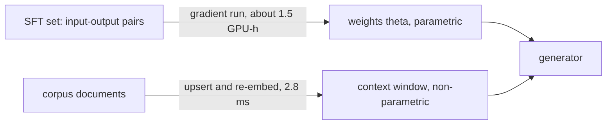
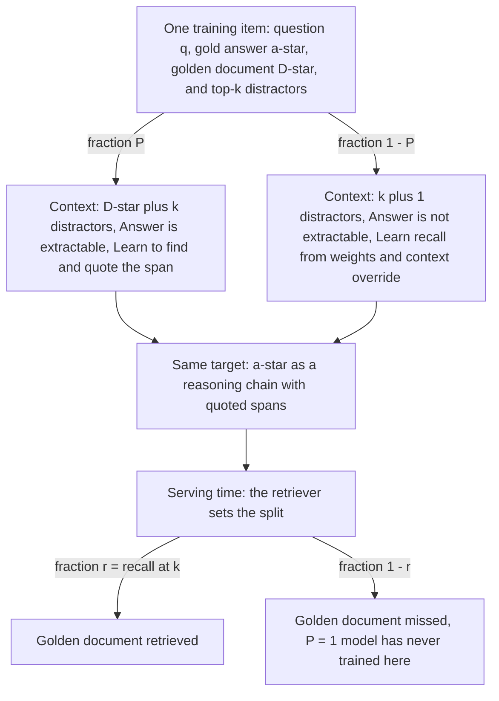
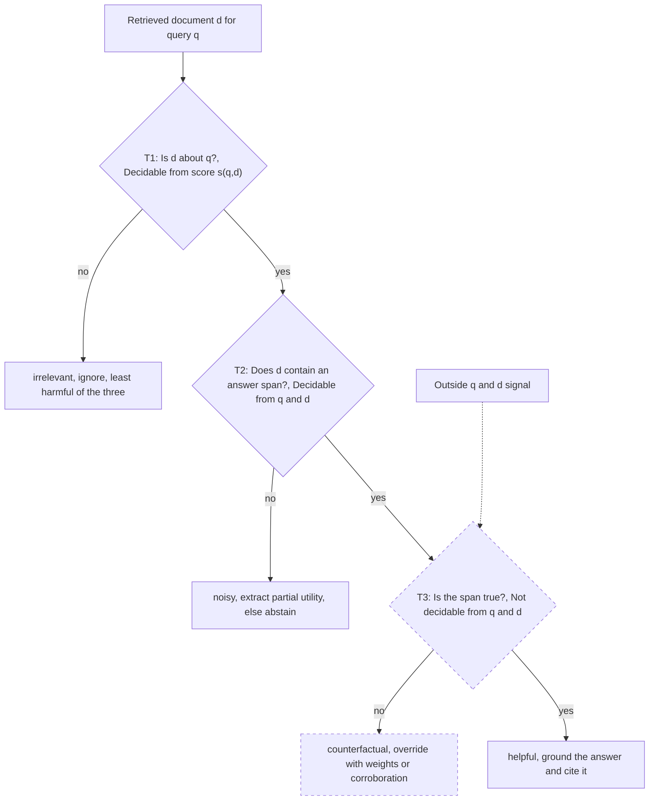
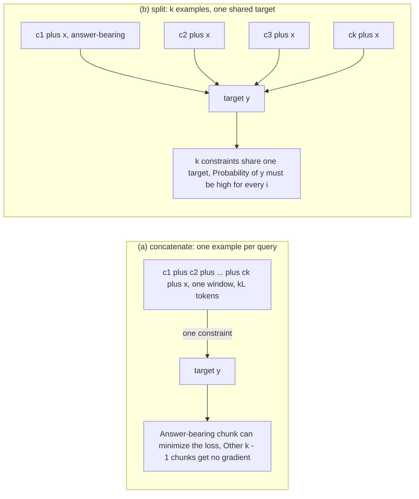
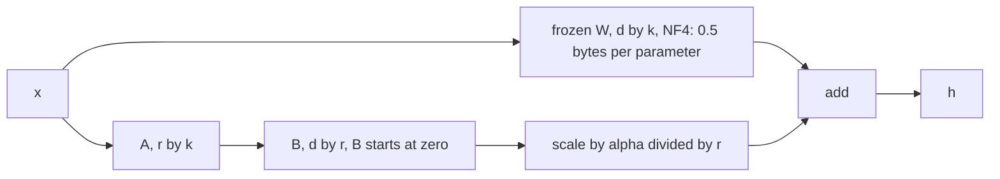

# Chapter 27: Fine-tuning the Generator

Purpose: Decide when Retrieval-Augmented Generation (RAG) errors belong to the generator, choose a training objective that matches the retrieval defects seen in production, and size the resulting fine-tuning job without confusing behavior, knowledge, robustness, invariance, or memory efficiency.

## TL;DR

- Supervised fine-tuning (SFT) changes shared behavior in the weights. Retrieval changes the query-time evidence. Use oracle-context accuracy, distractors-only accuracy, and recall at k to decide which loop deserves funding.

- Retrieval Augmented Fine-Tuning (RAFT) deliberately removes the golden document from a fraction of training items. Those items teach the model to distrust insufficient context and answer from its weights. They do not teach abstention.

- Retrieval defects are not one class. Noisy documents are on topic but answerless. Irrelevant documents are off topic. Counterfactual documents contain an answer-shaped false claim.

- Robust fine-tuning against retrieval defects (RbFT) adds per-document defect detection and utility extraction. This supplies the credit assignment that one answer-level loss cannot provide.

- Answer invariance uses one fixed target across separate single-context examples. It lowers attention cost and penalizes context sensitivity, but it is ill-posed when neither the context nor the weights can supply the answer.

- Parameter-efficient fine-tuning (PEFT) changes the memory budget by freezing the base. Low-Rank Adaptation (LoRA) shrinks the trainable update. Quantized Low-Rank Adaptation (QLoRA) also stores the frozen base in 4-bit NormalFloat (NF4).

- The chapter's repeated rule is diagnostic. Measure the production slices first, then choose the data recipe, objective, adapter placement, and precision that address those slices.

## The story

Imagine a clinical assistant as a hospital with a library and a physician. The retriever is the librarian. The generator is the physician. The index is the set of shelves the librarian can update. The model weights are the physician's habits and memory. When a guideline changes overnight, the librarian can replace the page on the shelf. Teaching the physician to cite an identifier, answer in two sentences, and name a contraindication is different. That is a behavior lesson, so it belongs in training. The first diagnostic is an open-chart exam. Place the correct passage in front of the physician. If the answer is still wrong, the physician has a behavior deficit. If the answer becomes right, the librarian has a knowledge-delivery deficit. The next drill is RAFT. Sometimes the correct chart is present among near misses. Sometimes it is deliberately removed while the target stays unchanged. The second case is the only drill that teaches the physician what to do when the chart cannot answer the question. The lesson is distrust plus recall from memory. It is not a lesson to abstain. The third drill audits every chart. An irrelevant chart concerns another patient. A noisy chart concerns the right patient but contains no answer. A counterfactual chart contains a convincing but false answer. The first two defects can be detected by reading the query and chart together. The third requires evidence outside that pair. RbFT gives the physician explicit audit labels and trains extraction of any useful fragment. The fourth drill rotates the charts while keeping the question and answer fixed. The physician must give the same answer from each single-chart view. This teaches invariance to the chart choice. It also exposes the limit. If the answer is absent from both the chart and the physician's memory, the drill can only reward memorizing that training pair. The final decision is how much of the physician to retrain. Full fine-tuning changes the whole physician and stores optimizer state for every trainable parameter. LoRA fits removable spectacles over the frozen base. QLoRA stores the frozen base more compactly while leaving the learned lenses trainable at higher precision. The hospital should update shelves for facts, train habits for behavior, rehearse the retrieval failures it actually sees, and buy only enough training memory for the chosen intervention.

## Decoder table

| Source term or symbol | Plain-language decoder | Why it matters and what fails if misread |
|---|---|---|
| Supervised fine-tuning (SFT) | Maximum-likelihood training on labeled input-output pairs | It changes a function shared by every query. Treating it as a document store makes facts stale and can perturb old knowledge |
| Dataset `𝒟` and pair `(x, y)` | The labeled training set, one input, and its target output | They define what the gradient can teach. A target absent from both input and weights becomes unreachable |
| Parameters `θ`, token index `t`, and target length | Shared weights, one output position, and the number of target tokens | They locate the trainable object and summed token losses. Confusing weights with context erases the chapter's main boundary |
| Retrieval-Augmented Generation (RAG) | Query-time conditioning on retrieved chunks | It supplies current, attributable knowledge. Treating retrieval failure as generator failure funds the wrong loop |
| Query `q`, chunks `c_i`, and retrieval depth `k` | The question, one retrieved context, and number of contexts | They define the query-time evidence. A missing answer-bearing chunk caps every generator objective |
| Parametric update | A gradient writes into model weights | The change affects every query. A single fact competes with behavior shared across inputs |
| Non-parametric update | A document update changes the context | A fact can go live on the next query. The generator still fails if it cannot use correct evidence |
| End-to-end accuracy `A_rag` | Accuracy after retrieval and generation | It mixes retrieval-success and retrieval-failure behavior. One blended score hides which loop failed |
| Oracle-context accuracy `A_orc` | Accuracy with the golden passage pasted into context | It measures generator behavior when evidence is guaranteed. Without it, low recall and weak context use look identical |
| Distractors-only accuracy `A_ng` | Accuracy when the retrieved set contains only distractors | It exposes behavior under retrieval misses. A blended score can hide active harm from bad context |
| Recall `R` or `r` | Chance that the golden document appears within top `k` | It weights success and failure slices. Training priors drift when the retriever changes |
| Behavior deficit `1 - A_orc` | Errors that remain with gold evidence present | It is the ceiling on gain from better evidence use. More retrieval cannot repair it |
| Knowledge deficit `1 - R` | Queries whose answer document never arrives | It bounds what generation can use. Fine-tuning cannot read a missing document |
| Closed-book accuracy `A_closed` | Accuracy with no retrieved evidence | It exposes parametric recall and the distraction penalty. Omitting it hides when bad context hurts |
| Conditional accuracies `g` and `b` | Generator accuracy when retrieval succeeds and when it fails | They reveal the two production slices. Optimizing only `g` leaves misses undefined |
| Parameter count `N` and training tokens `D` | Model size and token volume in the `6ND` training estimate | They price the parametric loop. Ignoring either understates training compute |
| Retrieval Augmented Fine-Tuning (RAFT) | Domain SFT that mixes golden-document and missing-gold contexts | It rehearses production retrieval failures. It does not by itself teach abstention |
| Gold answer `a*` and golden document `D*` | The fixed target and the context that supports it | RAFT keeps the answer fixed while changing evidence. Changing both would remove the intended contrast |
| Retention fraction `P` | Share of RAFT items that keep the golden document | It is the training prior over context sufficiency. `P = 1` gives no learned behavior for missing-gold contexts |
| Missing-gold branch `1 - P` | Golden document deleted while the target stays fixed | It teaches recall from weights and context distrust. Calling it abstention misstates the target |
| Retriever top-k distractors | Near misses produced by the deployed retriever | They match the production error distribution. Random negatives are often too easy |
| Reasoning chain with quoted spans | A target that names the evidence it uses | It gives the loss a handle on evidence use. Bare answers hide whether the model grounded or guessed |
| Noisy document | On-topic and high-scoring, but without an answer span | It can tempt the model into an adjacent claim. Calling it irrelevant hides its observed harm |
| Irrelevant document | Off-topic for the query | It is usually easy to ignore. A broad noise label mixes defects with opposite empirical signs |
| Counterfactual document | Relevant and answer-shaped, but false | Relevance filters cannot detect falsity. A faithful generator can become confidently wrong |
| Tests `T1`, `T2`, and `T3` | Ask whether a document is about the query, contains an answer, and states truth | The first two are pair-local while the third is not. Treating `T3` as relevance makes falsity undecidable |
| Corruption rate `f` and count `X` | Per-document error probability and number of corrupt documents | They define the majority-vote calculation. Correlation breaks its binomial guarantee |
| Corroboration | Agreement across documents | It can reduce independent corruption. Syndication and coordinated poisoning break independence |
| Robust fine-tuning against retrieval defects (RbFT) | Answer training plus defect detection and utility extraction | It gives per-document supervision. One scalar answer loss leaves a `k`-way credit assignment problem |
| Defect detection | Emit a label for each document before answering | The answer can condition on the audit. A global trust gate cannot identify one bad document |
| Utility extraction | Recover the usable fragment from a partial document | Thin long-tail topics may lack one complete source. A binary filter discards partial evidence |
| Answer invariance | Keep target `y` fixed across separate contexts | It declares context a nuisance variable. It is wrong when the answer should vary by context or tenant |
| RA-DIT | The source-named recipe that creates one fixed-target example per retrieved chunk | It makes invariance an actual constraint. Concatenation lets one supporting chunk satisfy the loss alone |
| Per-context probability `p_i` and mean `p_bar` | Answer probability under context `i` and its average across contexts | Their spread is the invariance signal. Mean accuracy alone cannot reveal context sensitivity |
| Jensen gap | Non-negative spread term in the averaged loss | It is zero only when all per-context answer probabilities match. Ignoring it misses half the objective |
| Variance `σ^2` and coefficient of variation `CV` | Absolute probability spread and spread relative to the mean | Their small-spread relation checks the derivation. A large spread means answers depend on retrieval variance |
| Closed-book accuracy `b0` | Accuracy from the question and weights without retrieval | It bounds what unsupported invariance examples can teach. Near-zero `b0` makes fixed targets unreachable |
| Concatenate layout | Put all `k` chunks into one training window | One answer-bearing chunk can satisfy the loss. Other chunks can receive no useful gradient |
| Split layout | Make `k` single-context examples with one shared target | It creates `k` constraints and cuts attention by `k`. It silently changes the sufficient-context mix |
| Supporting fraction `r/k` | Share of split instances containing the answer when one chunk supports it | It quantifies the new mix. Treating it as `r` understates unsupported examples |
| Reweighting `w` and retained count `n` | Weight on supporting examples and kept non-supporting examples per query | They restore a chosen context-sufficiency mix. Leaving both at defaults makes the retriever choose the training prior |
| REPLUG and REALM | Frozen-generator ensembling and retrieval-aware pre-training alternatives | They bound the design space. REPLUG cannot retrain context distrust, while REALM costs a pre-training run |
| Parameter-efficient fine-tuning (PEFT) | Adaptation that freezes most base parameters | It changes the optimizer-state budget. Counting only weights misses full-tuning memory |
| Adam moments `m` and `v` | Running mean and variance stored for each trainable parameter | Their 32-bit storage dominates memory. Freezing the base removes them for base weights |
| Base matrix `W` and update `ΔW` | Frozen full-rank weights and the learned correction | LoRA compresses the update, not the base. Confusing them overstates what low rank can learn |
| Factors `A`, `B`, dimensions `d`, `k`, and rank `r` | Two thin matrices whose product forms the correction | Their count is `r(d + k)` rather than `dk`. Here `k` and `r` are matrix width and adapter rank, not retrieval depth and recall |
| Scale `α/r`, input `x`, and output `h` | Correction scale, layer input, and adapted layer output | Holding the scale fixed isolates rank capacity. Fixed `α` makes a rank sweep change step size |
| Low-Rank Adaptation (LoRA) | Learn a low-rank correction while freezing the base | It removes base gradients and Adam state. Counting only base weights misses full-tuning cost |
| Quantized Low-Rank Adaptation (QLoRA) | LoRA with the frozen base stored in NF4 | It composes low-rank training with compact storage. It does not reduce tensor-core arithmetic |
| 4-bit NormalFloat (NF4) | Storage format for frozen weights at 0.5 bytes per parameter | It reduces base memory. Matrices still dequantize to bfloat16 for computation |
| Double quantization | Quantize per-block scaling constants | It saves about 0.37 bits per parameter. It does not compress the adapter |
| Paged optimizer | Spill optimizer state to host memory during allocation spikes | It avoids spike-driven crashes. It does not erase underlying compute or state |
| Adapter coverage | Linear matrices that receive adapters | Coverage can matter more than rank. High rank on only `q` and `v` may lose to lower rank on all seven matrices |
| Folded adapter | Replace `W` with `W + (α/r)BA` after training | It restores base-model inference cost. Per-domain merged bases destroy sharing |
| bfloat16, 16-bit floating point (FP16), and 32-bit floating point (FP32) | Two 16-bit formats and one 32-bit format | Precision choices set byte counts. Mixing their budgets produces false capacity claims |
| Graphics processing unit (GPU), floating-point operations (FLOPs), and high-bandwidth memory (HBM) | Accelerator, operation count, and memory bandwidth | They separate compute from memory traffic. Confusing them misprices training and decoding |
| Best Matching 25 (BM25) and Dense Passage Retrieval (DPR) | Source-named lexical and dense retrieval methods | They anchor worked retrieval choices. Their reported thresholds do not transfer automatically |
| Large language model integer inference (LLM.int8()) | Integer serving with outlier columns kept in higher precision | It is a serving decision. Confusing it with NF4 training storage hides the outlier caveat |
| Index vector quantization | Compression applied to retrieval vectors | It affects retrieval storage and search. It is unrelated to generator training precision |

## Core mechanics

### 27.1 SFT teaches behavior, RAG supplies knowledge

#### What

The source opens two months into a clinical-guideline assistant project. One team proposes a cross-encoder reranker. Another proposes fine-tuning a 7B model on 20,000 question-answer pairs from the same portable document format (PDF) files. Each asks for roughly one quarter of the graphics processing unit (GPU) budget, and the source frames the wrong choice as a two-quarter cost.

SFT minimizes negative log-likelihood over labeled input-output pairs.

$$
\mathcal{L}_{\mathrm{SFT}}(\theta) = -\sum_{(x,y)\in\mathcal{D}} \sum_{t=1}^{|y|} \log P_{\theta}(y_t\mid y_{1:t-1},x)
$$

The only free variable is the shared weight set theta. Retrieval leaves theta unchanged. It changes the conditioning event to the query q and retrieved chunks c1 through ck.

$$
P_{\theta}(y\mid c_1,\ldots,c_k,q)
$$

A behavior is one function shared across inputs. A fact is one datum about one input. Examples that repeatedly demand a guideline identifier, two sentences, and a contraindication estimate one shared behavior. The source says rank 8 or 16 LoRA often suffices for such a behavior. A fact has a sample size of one. Writing it into shared weights can interfere with other facts. The boundary exception is a required output vocabulary the model has never emitted, such as internal ontology identifiers or a proprietary domain-specific language (DSL). That is still behavior because it maps intent to a shared surface form.

#### Why

Let R be recall at k. Let A_orc be oracle-context accuracy. Let A_ng be accuracy with distractors only. End-to-end accuracy is a mixture.

$$
A_{\mathrm{rag}} = R A_{\mathrm{orc}} + (1-R)A_{\mathrm{ng}}
$$

The marginal rates are:

$$
\frac{\partial A_{\mathrm{rag}}}{\partial R} = A_{\mathrm{orc}}-A_{\mathrm{ng}}
$$

$$
\frac{\partial A_{\mathrm{rag}}}{\partial A_{\mathrm{orc}}} = R
$$

$$
\frac{\partial A_{\mathrm{rag}}}{\partial A_{\mathrm{ng}}} = 1-R
$$

Retrieval work moves R. It earns A_orc minus A_ng per unit of recall. Generator work moves the two conditional accuracies. The quantity one minus A_orc is the behavior deficit. The quantity one minus R is the knowledge deficit. The quickest diagnostic is to paste the golden passage into the prompt and see whether the model still fails.

#### Failure without it

Fine-tuning on documents to make the model know them can misallocate a training cycle. The checkpoint becomes stale when the documents change. Gekhman et al. (2024) report that fitting new facts increases hallucination on facts the model previously had right. Ovadia et al. (2024) found retrieval augmentation consistently beat unsupervised fine-tuning on the same corpus for knowledge injection. These are source-reported findings, not a claim that every fine-tuning run behaves identically. A retriever cannot repair low A_orc. A generator cannot use a document that was never fetched.

#### Cost and complexity

A full fine-tuning pass costs about 6ND floating-point operations (FLOPs) for N parameters and D training tokens. For a 7 billion parameter model and 50 million training tokens:

$$
6 \times 7\times 10^9 \times 5\times 10^7 = 2.1\times 10^{18}\ \mathrm{FLOPs}
$$

At effective throughput of 3.4 times 10^14 FLOPs per second, that is 6,180 seconds or about 1.7 GPU-hours. The estimate excludes evaluation and release. The index path embeds ten 512-token chunks with a 110 million parameter encoder.

$$
2 \times (10\times 512) \times 1.1\times 10^8 = 1.1\times 10^{12}\ \mathrm{FLOPs}
$$

At the same throughput, that is 3.2 milliseconds. The compute ratio is 1.9 times 10^6 for the same single fact. The text's analytical estimate is 1.7 GPU-hours versus 3.2 milliseconds.

Figure 27.1 separately labels the schematic loops as about 1.5 GPU-hours and 2.8 milliseconds.

#### Worked example

The clinical assistant has 2,000 held-out question-answer pairs and a top-5 retriever. Closed-book accuracy is 41%. A_orc is 82%. A_ng is 31%. Recall at 5 is 0.75.

$$
A_{\mathrm{rag}} = 0.75(0.82) + 0.25(0.31) = 0.615 + 0.078 = 69.3\%
$$

Configuration 1 reranks top-50 BM25 and dense fusion candidates with a cross-encoder, then keeps five. Recall at 5 rises from 0.75 to 0.85.

$$
(0.82-0.31)(0.10)=5.1\ \mathrm{points}
$$

The result is 74.4%. Configuration 2 uses distractor-aware SFT. A_orc rises from 0.82 to 0.88. A_ng rises from 0.31 to 0.60.

$$
A_{\mathrm{rag}} = 0.75(0.88) + 0.25(0.60) = 0.66 + 0.15 = 81.0\%
$$

The gain is 11.7 points. The distractors-only term supplies 0.25 times 0.29, or 7.3 points. The mixture predicts 69.3% against 69% measured end to end. The distraction penalty is 41 minus 31, or 10 points. Mallen et al. (2023) report that RAG flips roughly 10% of correct closed-book PopQA answers to incorrect. That published statistic is over all questions. The worked statistic is conditioned on the golden document being absent. They are not the same statistic. The source says a 40-point penalty would suggest broken labels or chunking.

Dropping retrieval and fine-tuning the guideline text offers at most one minus 0.41, or 59 points of headroom. The source prices that route at 1.5 GPU-hours per refresh and the corresponding figure's index path at 2.8 milliseconds per document.

#### Decisions and claim limits

Run the oracle-context probe on a few hundred labeled queries. Track A_orc, A_ng, and recall at k separately. With no gold annotation, use the top-ranked human-judged chunk as an optimistic bound. Default dated facts to the index. The source lists prices, policies, model versions, guideline revisions, and staffing. Consider a cached system prompt before weights when latency binds and a fact never changes. Default format, tone, refusal, and citation discipline to prompting or SFT. Prompt first when fewer than 500 system-prompt tokens already produce the behavior. Use different release cadences. The source suggests index refresh on the hour and weights on the quarter. An immutable corpus is the stated exception where the fast index loop may have nothing to do.

As recall approaches 1, the one minus R return on distractor robustness vanishes. The source's staff example says to reconsider the budget past roughly R equal to 0.9 and to remeasure all constants after a checkpoint ships.

### 27.2 RAFT trains with distractors on purpose

#### What

The opening deployment improves clean held-out accuracy from 61% to 86%, then receives production complaints two weeks later. Roughly one context in five lacks the answer, matching the later worked recall of 0.80.

Define r as retrieval recall at k. Define g as accuracy when the golden document is retrieved. Define b as accuracy when it is missed.

$$
A = rg + (1-r)b
$$

A clean training set with the answer in every context can optimize g while leaving b undefined. RAFT builds each item from question q, gold answer a-star, golden document D-star, and top-k distractors from the retriever. The target is a reasoning chain that quotes supporting spans. For fraction P, keep D-star. For fraction one minus P, delete D-star and leave the target unchanged. P acts as the training prior over whether context contains the answer. On the P branch, the gradient teaches span location and quotation. On the one minus P branch, the gradient teaches recall from weights and distrust of the supplied context.

The source's exam analogy calls ordinary SFT closed-book study, ordinary RAG an open-book exam without study, and RAFT study for the open-book exam.

#### Why

The one minus P examples are the only items where the gradient sees a context that cannot answer the question. They align training with the one minus r production slice. Distractors must come from the deployed retriever's top-k because those near misses share the product family, vocabulary, or adjacent tier. Random negatives can be trivially separable. Quoted spans make the evidence relation explicit. The published format uses ##begin_quote## markers.

#### Failure without it

At P equal to 1, copying the context is a lowest-loss policy. The model has no learned behavior for a retrieval miss. An inference instruction to say the context does not answer fights a full training distribution that said the opposite. At P equal to 0, g and b converge because the model stops reading context. That is domain SFT wearing a RAG prompt. RAFT does not train abstention. Its target on missing-gold examples is still the correct answer. An abstention string on those examples would define a different objective and failure mode.

#### Cost and complexity

This is an ordinary SFT run and can use LoRA. The main project is corpus construction. Golden-document annotation noise cannot be repaired by changing P. After a retriever update, P must be re-derived because recall and distractor hardness both change. The source permits skipping the sweep only when recall changes by under about two points.

#### Worked example

Use k equal to 5 and measured recall at 5 of 0.80. When retrieval succeeds, context contains one golden document and four distractors. When it fails, context contains five distractors. Configuration 1 uses P equal to 1.00. It produces g equal to 0.86 and b equal to 0.04.

$$
A = 0.80(0.86) + 0.20(0.04) = 0.688 + 0.008 = 0.696
$$

Configuration 2 uses P equal to 0.60. It produces g equal to 0.83 and b equal to 0.33.

$$
A = 0.80(0.83) + 0.20(0.33) = 0.664 + 0.066 = 0.730
$$

It trades three points on the retrieval-success slice for 29 points on the failure slice. Configuration 3 uses P equal to 0.00. It produces g equal to 0.44 and b equal to 0.41. The blended accuracy is 0.434. The P equal to 0.60 gain over P equal to 1.00 is 0.034, or 3.4 points and 4.9% relative. The failure slice contributes:

$$
0.20(0.33-0.04)=0.058
$$

The success slice costs:

$$
0.80(0.83-0.86)=-0.024
$$

The sum is 0.034. Holding the P equal to 1 conditional accuracies fixed, retrieval alone must satisfy:

$$
0.86r + 0.04(1-r) = 0.730
$$

$$
0.04 + 0.82r = 0.730
$$

This gives r equal to 0.841. Recall at 5 must rise from 80.0% to 84.1%. At r equal to 0.65, configuration 1 scores 0.573 and configuration 2 scores 0.655. The gap is 8.2 points, or 2.4 times the original 3.4-point gap. Karpukhin et al. (2020) report Dense Passage Retrieval (DPR) top-20 retrieval accuracy of 78.4% on Natural Questions. The source therefore calls 80% at k equal to 5 optimistic for open-domain retrieval and defensible only for a narrow, curated index. At r equal to 0.92, the P equal to 1 model scores 0.794. The P equal to 0.60 model scores 0.790. They tie when:

$$
0.04 + 0.82r = 0.33 + 0.50r
$$

This gives r equal to 0.906. Above roughly 91% recall, the old always-golden conditional accuracies win. That threshold must be recomputed after the reranker changes the distractor distribution. A 0.4-point margin at r equal to 0.92 is within the noise of one held-out split.

#### Decisions and claim limits

Start P at measured recall at k and sweep downward. The source's worked optimum is P equal to 0.60 against recall 0.80. Move upward only when g collapses faster than b recovers. Report g and b separately. Use the blended A only after exposing both terms. Re-sweep when the retriever changes.

### 27.3 Robustness to noisy, irrelevant, and counterfactual retrieval

#### What

The opening failure repeats a rate-limit number retired eighteen months earlier. The interview framing gives recall at 5 of 85%, leaving 15% of queries without an answer in context.

The source uses the question "Which album features the song Time by Pink Floyd?" The gold answer is The Dark Side of the Moon. A noisy document is a general band overview with no answer. An irrelevant document is about a different artist. A counterfactual document says the song appears on Wish You Were Here. T1 asks whether d is about q. T2 asks whether d contains a span answering q. T3 asks whether that span is true. T1 and T2 are functions of the query-document pair. T3 is a property of the world. Its signal must come from the model's parametric prior or agreement across documents.

#### Why

Cuconasu et al. (2024) tested related answerless documents separately from random documents. They found that related but answerless documents degraded accuracy sharply. Random documents from elsewhere in the corpus did not hurt and helped in their setting. The source warns that literature uses noise for both categories even though their empirical signs can differ. For k equal to 5, per-document corruption f equal to 0.2, and independent corruptions:

$$
\Pr[X\geq 3] = \binom{5}{3}(0.2)^3(0.8)^2 + \binom{5}{4}(0.2)^4(0.8) + (0.2)^5
$$

$$
= 0.0512 + 0.0064 + 0.00032 \approx 5.8\%
$$

Voting reduces 20% document-level corruption to 5.8% answer-level corruption, a factor of 3.5. Independence is the load-bearing assumption. Syndicated content and one adversary controlling all five documents break it.

#### Failure without it

Standard answer-only SFT rewards copying an answer-shaped span. RAFT with one answer loss can learn a global context gate. It does not identify which of k documents should be distrusted. RbFT adds two auxiliary tasks. Defect detection labels each document as helpful, possibly relevant but unhelpful, or incorrect. The labels are emitted before the answer. Utility extraction recovers usable text from a partially useful document. A binary relevance filter fails on counterfactual documents because they are relevant. It can also discard partial utility. The filter still wins on cost and auditability as a pre-filter. It is not the complete answer. The source associates this pre-filter pattern with Yoran et al. (2024).

#### Cost and complexity

Audit 200 live queries at top-5 to obtain 1,000 query-document pairs. The source calls that an afternoon of labeling. Five defect tags at four tokens each add 20 decoded tokens. An 8 billion parameter model in 16-bit floating point (FP16) streams 16 GB of weights per decoded token. At 3.35 terabytes per second of high-bandwidth memory (HBM), each token costs:

$$
16/3350 = 4.8\ \mathrm{ms}
$$

Twenty tags cost 96 milliseconds. A 40-token answer costs 192 milliseconds under the same roofline. The tags add 50% to decode time. Adding 30 tokens of extracted spans pushes the extra path to 239 milliseconds. The same constant caps single-stream decode at:

$$
1/0.0048 = 209\ \mathrm{tokens/s}
$$

A measured throughput above that means the weights are not FP16 under this model.

#### Worked example

The 1,000 labeled pairs contain 240 helpful, 610 noisy, 120 irrelevant, and 30 counterfactual pairs. Recall at 5 is 0.85, so 170 of 200 queries are covered. The 240 helpful pairs give 240 divided by 170, or 1.41 helpful documents per covered query. The 30 counterfactual pairs occur on 30 distinct queries. Twenty-five of those queries are covered. Traffic partitions into four groups. Group A has 145 covered, clean queries. Group B has 25 covered queries with a counterfactual present. Group C has 25 uncovered, clean queries. Group D has 5 uncovered queries with a counterfactual. Assume 0.90 accuracy with uncontested support. Assume 0.50 when two context claims compete. Assume 0.05 from a topical noisy document. Assume 0.20 parametric accuracy on the private corpus. Configuration 1 is answer-only SFT on gold contexts.

$$
A=145(0.90)=130.5
$$

$$
B=25(0.90)(0.50)=11.25
$$

$$
C=25(0.05)=1.25
$$

$$
D=0
$$

The total is 143.0, or 71.5% exact match. Because nothing abstains, confidently wrong is 28.5%. Configuration 2 adds RAFT-style withholding.

$$
C=25(0.20)=5.0
$$

$$
D=5(0.20)=1.0
$$

Groups A and B are unchanged. The total is 147.75, or 73.9%. The 2.4-point gain comes entirely from outright retrieval misses. Configuration 3 adds per-document defect detection and utility extraction. Counterfactual detection recall is 0.60.

$$
B = 25(0.90)(0.60+0.40(0.50)) = 18.0
$$

Utility extraction raises group A accuracy from 0.90 to 0.94.

$$
145(0.94)=136.3
$$

The total is 160.3, or 80.2%. That is 6.3 points over RAFT. Of 12.55 recovered answers, 6.75 come from group B. Group B is 12.5% of traffic but supplies 6.75 divided by 12.55, or 54% of headroom. The source says the RGB benchmark of Chen et al. (2024) scores noise robustness, negative rejection, information integration, and counterfactual robustness separately. It reports counterfactual robustness among the weakest axes.

#### Decisions and claim limits

Label your own defect sample before choosing a recipe. Go directly to RAFT-style withholding only when uncovered queries exceed 30%. Per-document supervision cannot help when the entire context contains nothing. Emit defect labels at inference. Keep utility extraction training-only unless the extracted span is needed as a citation anchor. Never expect a relevance filter to catch counterfactual evidence. Pair it with recency, source authority, or agreement across independent documents. Set the counterfactual training fraction from the audit. The worked rate is 30 divided by 1,000, or 3% of pairs. Over-training can make the model discount legitimate updates. The source connects that tension to the entity-substitution result of Longpre et al. (2021). The source permits increasing that fraction under adversarial exposure. Report exact match and confidently-wrong rate separately. The source allows collapsing that distinction only for low-stakes internal search where wrong and unhelpful answers have similar cost. If legal requires faithfulness while the model team wants factual override, the conflict cannot be solved from an unannotated context alone. Add timestamps or source authority before generation. Without such metadata, the source's worked decision favors faithfulness at 3% counterfactual pairs and override at 20%.

### 27.4 Answer invariance to context as a training objective

#### What

The opening interview reports 71% exact match and 84% self-consistency for repeated runs. In its motivating trace, the same question is asked ten minutes apart and rank four changes after an index-graph refresh.

Standard training concatenates all k chunks into one window.

$$
-\log p_{\theta}(y\mid c_1\oplus\cdots\oplus c_k\oplus x)
$$

One answer-bearing chunk can minimize that loss. The other chunks can remain gradient-inert. The RA-DIT recipe from Lin et al. (2023) makes each chunk a separate example and keeps y fixed.

$$
\mathcal{L}_{\mathrm{inv}}(\theta) = -\frac{1}{k} \sum_{i=1}^{k} \log p_{\theta}(y\mid c_i\oplus x)
$$

The constant target says the answer belongs to the question, while context is a nuisance variable. Write:

$$
p_i = p_{\theta}(y\mid c_i\oplus x)
$$

$$
\bar p = \frac{1}{k}\sum_i p_i
$$

Add and subtract the log of the mean.

$$
-\frac{1}{k}\sum_i\log p_i = -\log\bar p + \left( \log\bar p - \frac{1}{k}\sum_i\log p_i \right)
$$

The first term means be right on average. The bracketed Jensen gap is non-negative. It is zero exactly when every pi is equal. For small spread:

$$
\mathrm{gap} \approx \frac{\sigma^2}{2\bar p^2} = \frac{1}{2}\mathrm{CV}^2
$$

For pi values 0.7 and 0.5:

$$
\log 0.6 - \frac{1}{2}(\log 0.7+\log 0.5) = -0.511 + 0.525 = 0.014
$$

The approximation is:

$$
\frac{1}{2}(0.1/0.6)^2 = 0.014
$$

#### Why

The averaged loss combines accuracy and low spread. Negative log probability is unbounded as probability approaches zero. The least-supportive context therefore receives the strongest gradient. Splitting also changes the computational shape. It holds token volume constant while reducing attention pairs by a factor of k. It creates k constraints with one shared target.

#### Failure without it

Setting temperature to zero or fixing the seed removes sampling variance. It does not remove retrieval variance. REPLUG freezes the language model and trains only the retriever. It can ensemble per-chunk output distributions using token log-probabilities from an application programming interface (API). It does not train the generator to discount bad context. If every retrieved chunk repeats the same stale fact, the ensemble can be unanimously wrong. REALM trains retrieval into pre-training. The source calls it more robust at the cost of a pre-training run and periodic index re-encoding. The critical scope condition is closed-book accuracy. If a fact appears in neither ci nor the weights, the target is unreachable. The reachable minimum then becomes memorization of the specific pair. The objective is inappropriate for a private post-cutoff corpus with near-zero closed-book accuracy. It is also inappropriate for genuinely multi-hop items requiring two chunks jointly. It is wrong when the answer should vary by context, such as per-tenant corpora.

#### Cost and complexity

Use 10,000 question-answer pairs. Let k equal 10. Let each chunk-plus-question instance have 256 tokens. Let recall at 10 be 0.80. Assume one answer-bearing chunk when retrieval succeeds. Concatenation creates 10,000 examples of 2,560 tokens. The total is 25.6 million context tokens. Splitting creates 100,000 examples of 256 tokens. That is also 25.6 million context tokens. Repeating a 12-token target ten times adds 1.1 million target tokens. That is under 5% of the total. Answer-bearing instances number:

$$
10{,}000 \times 0.80 \times 1 = 8{,}000
$$

The supporting fraction is 8,000 divided by 100,000, or 8%. The insufficient-context fraction rises from 20% to 92%. Attention pairs per query under concatenation are:

$$
2560^2 = 6{,}553{,}600
$$

Attention pairs under splitting are:

$$
10 \times 256^2 = 655{,}360
$$

The ratio is exactly 10. The source describes this as the Fusion-in-Decoder argument applied to training loss. To restore a 60% sufficient-context mix, solve:

$$
\frac{0.08w}{0.08w+0.92} = 0.60
$$

$$
0.08w = 0.048w + 0.552
$$

$$
w = 17.25
$$

The answer-bearing instances need weight 17.25. Alternatively, keep n non-supporting instances per query.

$$
\frac{0.8}{0.8+n} = 0.6
$$

This gives n equal to 0.53 of the 9.2 available. Discard 94% of the non-supporting instances. At DPR top-20 retrieval accuracy 0.784, one supporting chunk gives:

$$
0.784/20 = 3.9\%
$$

With three answer-bearing chunks:

$$
3(0.784)/20 = 11.8\%
$$

#### Decisions and claim limits

Measure closed-book accuracy b0 on held-out domain questions. The invariance objective can move retrieval-miss accuracy b toward b0 and no further. Split into single-context instances when the answer does not require joint evidence. Re-weight answer-bearing instances to the sufficient-context rate selected by a RAFT-style sweep. Track the coefficient of variation of answer probability across chunks. Mean accuracy cannot show whether invariance improved. Freeze the retriever while the generator trains. Alternating rounds require index re-encoding and fresh measurement of recall. Train at the k used for serving. The source says this objective exists only at the text interface. The chunks must be tokens prepended to the question. An embedding or parameter interface needs a different differentiable objective.

If policy requires abstention, retain target y only when the fact is verifiably parametric and use an abstention target elsewhere. Evaluate the two behaviors separately. A prompt-only patch does not reverse a full training objective, and any retriever fine-tuning moves recall, the r divided by k mix, and the required weights.

### 27.5 PEFT with LoRA, QLoRA, and quantization

#### What

The opening sizing mistake treats a 7B bfloat16 model as a 14 GB job on one 80 GB A100. The first optimizer step then asks for another 56 GB.

Adam stores each trainable weight, its gradient, and two optimizer moments. For bfloat16 weights and gradients with 32-bit floating point (FP32) moments, the budget is:

$$
2 + 2 + 4 + 4 = 12\ \mathrm{bytes\ per\ trainable\ parameter}
$$

An FP32 master weight copy raises it to 16 bytes. For 7 billion trainable parameters:

$$
7\times 10^9 \times 12 = 8.4\times 10^{10}\ \mathrm{bytes} = 84\ \mathrm{GB}
$$

The 14 GB of bfloat16 base weights are only one-sixth of the bill. LoRA freezes a weight matrix W and learns a factored update.

$$
h = Wx + \frac{\alpha}{r}BAx
$$

$$
B\in\mathbb{R}^{d\times r}
$$

$$
A\in\mathbb{R}^{r\times k}
$$

$$
r\ll\min(d,k)
$$

The trainable count falls from dk to r times d plus k. An 8 by 6 matrix has 48 values. A rank-1 factorization has 8 plus 6, or 14 values. A rank-2 factorization has 28 values. The source connects this to the truncated singular value decomposition (SVD) and the Eckart-Young theorem. The low-rank object is the update delta W, not the frozen full-rank W. The source also compares rank to image resolution. It cites Aghajanyan et al. (2021) for the claim that fine-tuning objectives have intrinsic dimensionality far below the parameter count. B starts at zero and A starts with small Gaussian noise. The update is zero before the first step. The adapted model therefore starts as the base model. QLoRA stores the frozen base in NF4 at 0.5 bytes per parameter. That is 3.5 GB for a 7 billion parameter base. Double quantization saves about 0.37 bits per parameter. For a 65 billion parameter model:

$$
65\times 10^9 \times 0.37/8 \approx 3.0\ \mathrm{GB}
$$

Paged optimizers spill state to host memory during allocation spikes.

#### Why

LoRA removes gradient and Adam state for the frozen base. QLoRA then reduces storage of that frozen base. The order matters because LoRA removes the two largest optimizer-related bars. Quantization then shrinks the remaining base-weight bar by four times. Adapter layers insert serial bottlenecks and add depth. LoRA is parallel and foldable after training.

$$
W' = W + \frac{\alpha}{r}BA
$$

Prefix tuning consumes sequence length. The source rejects that cost in RAG because retrieval already competes for context. NF4 is a storage format. Each matrix multiply dequantizes the 4-bit block to bfloat16 before tensor-core computation. It saves memory, not FLOPs. True integer inference is separate. The source says LLM.int8() keeps outlier feature columns in FP16 because naive quantization degrades accuracy once transformers pass roughly 6.7 billion parameters. Generator-training quantization, serving quantization, and retrieval-index vector quantization are separate decisions.

#### Failure without it

Full fine-tuning requires 84 GB before activations and creates one full checkpoint per domain. Counting only the 14 GB base causes an out-of-memory failure at the first optimizer step. Quantizing a trainable adapter makes gradients vulnerable to quantization noise. The source says to keep A and B in bfloat16. An adapter is a delta against an exact base. Failing to pin the base checkpoint hash can cause quality regression after an infrastructure change. Merging every tenant adapter into a separate base eliminates sharing. LoRA is not a free substitute for full fine-tuning. Biderman et al. (2024) found it underperformed full fine-tuning on code and mathematics domains requiring genuinely new knowledge. It also forgot markedly less of the base model's original capability. The source interprets this as consistent with keeping facts in the index.

#### Cost and complexity

The worked RAFT run uses Llama-2-7B with 32 layers. Model dimension is 4,096. Multilayer perceptron (MLP) width is 11,008. Sequence length is 4,096. Each example has one query and four retrieved documents. Batch size is 1. The setup uses gradient checkpointing and FlashAttention. Configuration 1 full-tunes the model. Trainable state is 84 GB. Checkpointed activations store one block input per layer.

$$
32 \times 4096 \times 4096 \times 2 = 1.07\ \mathrm{GB}
$$

The total is 85.1 GB. It does not fit on one 80 GB A100. Configuration 2 uses rank 16 LoRA on q and v. Each 4,096 by 4,096 projection receives:

$$
16(4096+4096) = 131{,}072\ \mathrm{parameters}
$$

Two projections across 32 layers give 8,388,608 parameters. That is 8.4 million, or 0.12% of the model. Trainable state is:

$$
8.4\ \mathrm{M} \times 12 = 0.10\ \mathrm{GB}
$$

The total is:

$$
14 + 0.10 + 1.07 = 15.2\ \mathrm{GB}
$$

It fits on a 24 GB card. The shipped adapter is:

$$
8.4\ \mathrm{M} \times 2 = 16.8\ \mathrm{MB}
$$

That is about 830 times smaller than a 14 GB per-domain full checkpoint. Configuration 3 uses rank 64 QLoRA on every linear layer. It adapts q, k, v, o, gate, up, and down. Per layer:

$$
4(64)(8192) + 2(64)(15104) + 64(15104) = 4{,}997{,}120
$$

Across 32 layers, that is 160 million parameters. It is 2.3% of the model and 19 times the trainable weight of configuration 2. Its trainable state is 1.92 GB. The NF4 base is 3.5 GB. The total is:

$$
3.5 + 1.92 + 1.07 = 6.5\ \mathrm{GB}
$$

Raising batch size to 8 adds 8.6 GB of activations. Activations then become the largest line item in configuration 3. As an external arithmetic check contained in the source, GPT-3 175B has 96 layers at dimension 12,288. Rank 4 LoRA on q and v gives:

$$
96 \times 2 \times 4 \times 24576 = 18.9\ \mathrm{M\ parameters}
$$

At two bytes each, that is 37.7 MB. Hu et al. report 35 MB for that configuration. The estimate is within 8%.

#### Decisions and claim limits

Budget optimizer state first, activations second, and weights last. The default source budget is 12 bytes per trainable parameter for 16-bit Adam. Eight-bit optimizer state changes that to 2 plus 2 plus 1 plus 1, or 6 bytes. For 7 billion parameters, that is 42 GB. The source recommends parameter coverage before high rank. Its default is rank 16 on every block linear layer rather than rank 128 on q and v. The stated memory-bound alternative is q and v only. Hold alpha divided by rank constant in a rank sweep. Quantize the frozen base and never the adapter. Pin the exact base hash into adapter metadata. For 40 customers, merging gives 40 times 14 GB, or 560 GB. Unmerged serving uses one 14 GB base plus:

$$
40 \times 16.8\ \mathrm{MB} = 0.67\ \mathrm{GB}
$$

The extra low-rank work per adapted matrix is:

$$
\frac{16(8192)}{4096^2} = 0.78\%
$$

If one customer carries 80% of requests, the source proposes merging that customer on a dedicated replica and serving the tail unmerged.

## Diagrams

### Figure 27.1

Panel A, two write loops:

Panel B, oracle-context probe:

| Oracle-context accuracy | Recall at k high | Recall at k low |
|---|---|---|
| A_orc high | Ship it. Residual error is elsewhere | Knowledge deficit. Rerank and raise R |
| A_orc low | Behavior deficit. Fine-tune the generator | Both. Fix retrieval first because it is cheaper |

Figure 27.1: Gradients write into weights and documents write into the context, at costs separated by a factor of 1.9 × 10^6. Measuring accuracy with the gold passage pasted in tells you which of the two your errors live in.

### Figure 27.2

Figure 27.2: Deleting the golden document for a fraction 1 - P of training items is the only point at which the gradient ever sees a context that cannot answer the question, which is why a model trained with P = 1 has no learned behavior for the 1 - r slice it will meet in production.

### Figure 27.3

Figure 27.3: The three defect classes fall out of three tests, and the third one breaks the pattern: T1 and T2 are functions of the query-document pair, so a defect-detection head can learn them from the context alone, while T3 asks whether a claim is true and needs evidence the context cannot contain. Dashed boxes mark the branch that no amount of reading decides.

### Table 27.1

Table 27.1: Five techniques, one move: hide part of the input and force the learner to cope without it. Retrieval-defect training is the RAG-shaped member of the family - it projects away rows of the evidence set the way dropout projects away columns of a hidden layer.

| Technique | What is hidden | Projection |
|---|---|---|
| Dropout | hidden units | features (columns) |
| Masked language modeling | input tokens | features (columns) |
| Bagging, random forests | training rows and features | instances (rows) |
| Mixture of experts | every expert but the routed ones | features, at inference |
| RAFT, defect training | the golden document | rows of the evidence set |

### Figure 27.4

Figure 27.4: Splitting one retrieved set into k single-context examples that share a target converts a single fit-the-window constraint into k constraints whose only common solution is a context-insensitive answer - at the same token count and one-kth the attention cost.

### Figure 27.5

LoRA path:

Memory bars under the figure assumptions:

| Training row | Base and trainable state plus activations | Total | Fits one 80 GB A100 |
|---|---:|---:|---|
| Full fine-tuning, bfloat16 | 84 GB trainable state plus 1.07 GB activations | 85.1 GB | No |
| LoRA, bfloat16 base, rank 16 on q and v | 14 GB base plus 0.10 GB adapter state plus 1.07 GB activations | 15.2 GB | Yes |
| QLoRA, NF4 base, rank 16 on q and v | 3.5 GB base plus 0.10 GB adapter state plus 1.07 GB activations | 4.7 GB | Yes |

Figure 27.5: Full fine-tuning of a 7B generator does not fit on an 80 GB A100 once optimizer state is counted. freezing the base deletes the two largest bars, and quantizing what remains shrinks the last one by 4×. All three rows assume batch 1, sequence 4,096, and r = 16 adapters on q and v.

## Whiteboard pack

### What to draw

1. Draw two inputs into one generator. Label the left path weights and the right path retrieved context.

2. Under the generator, write the mixture A_rag equals R times A_orc plus one minus R times A_ng.

3. Add the oracle-context decision matrix with recall high or low across columns and A_orc high or low across rows.

4. Draw the RAFT fork. Keep the golden document on fraction P and remove it on fraction one minus P.

5. Draw the defect cascade T1, T2, and T3. Mark T3 as requiring evidence outside the query-document pair.

6. Draw concatenate versus split. Show one window against k single-context constraints with one shared target.

7. Finish with the memory bars 85.1 GB, 15.2 GB, and 4.7 GB.

### Spoken script

Start by separating the two write paths. Fine-tuning changes shared behavior in weights, while retrieval changes query-time evidence. I diagnose them with recall, oracle-context accuracy, and distractors-only accuracy. Then I match training to production. RAFT removes gold evidence on some items, RbFT adds per-document defect supervision, and invariance holds one target across separate contexts. Each has a scope limit, especially when the answer exists in neither context nor weights. Finally, I size memory correctly. Full Adam training needs 12 bytes per trainable parameter. LoRA freezes the base, and QLoRA also compresses its storage.

## Interview traps

### 1. Should a nightly policy change go into LoRA?

Put a dated fact in the index by default because the source prices the analytical 7B training loop at about 1.7 GPU-hours, while re-embedding ten 512-token chunks takes 3.2 milliseconds at the same throughput. Fine-tune shared behavior such as format, tone, refusal, citation discipline, or proprietary output vocabulary. Reverse the choice only if the oracle-context probe shows that the model still fails with the correct passage present.

### 2. Why train RAFT without the golden document?

Always-golden contexts provide no gradient for the insufficient-context case. The `1 - P` branch teaches recall from weights and distrust of near misses from the deployed retriever, but it does not teach abstention. Anchor `P` to measured recall, sweep it on `A = rg + (1 - r)b`, and report `g` and `b` separately.

### 3. Why can RAFT miss a plausible false claim?

RAFT supplies one answer-level scalar across `k` documents, so it can learn a global trust gate but cannot assign blame to one document. A counterfactual is relevant and answer-shaped, while its truth test requires evidence outside the query-document pair. Add per-document defect labels and utility extraction, then source the falsity signal from known construction, metadata, model prior, or independent corroboration.

### 4. Why hold one target across every retrieved chunk?

The fixed target says `y` labels the question rather than the question-context pair, and splitting turns that claim into `k` constraints whose probability spread is part of the loss. At recall 0.80 and `k = 10`, only 8% of instances support the target, so weight them by 17.25 or discard 94% of non-supporting instances to restore the worked 60% sufficient mix. Reject invariance when closed-book accuracy is near zero, when answers vary by tenant, or when multiple chunks are jointly required.

### 5. Why does a 14 GB model not fit full fine-tuning?

Adam uses 12 bytes per trainable parameter before activations, so 7 billion parameters require 84 GB. Rank-16 LoRA on `q` and `v` yields 15.2 GB, while the matching NF4 figure row is 4.7 GB and the rank-64 all-linear QLoRA worked run is 6.5 GB. Treat NF4 as memory compression, choose matrix coverage before excessive rank, hold `alpha/rank` constant, keep adapters in bfloat16, and pin the exact base hash.

## Key numbers

| Topic | Number | Interpretation |
|---|---:|---|
| Opening resource choice | 7B model, 20,000 pairs, one quarter of GPU budget per option | Wrong-loop decision in section 27.1 |
| Opening time horizon | Two months into the project, two quarters of consequence | Scope of the motivating decision |
| Behavior adapter rank | 8 or 16 | Source's usual LoRA range for shared behavior |
| Oracle diagnostic example | A_closed 41%, A_orc 82%, A_ng 31%, R 0.75 | Baseline decomposition inputs |
| Predicted baseline | 69.3% | Matches 69% measured end to end on 2,000 items |
| Reranker option | Recall 0.75 to 0.85, gain 5.1 points, result 74.4% | Retrieval-only intervention |
| Distractor-aware SFT option | A_orc 0.82 to 0.88, A_ng 0.31 to 0.60, result 81.0% | Gain 11.7 points |
| Distractor term | 7.3 of 11.7 points | Gain supplied by the usually unmeasured failure slice |
| Distraction penalty | 10 points | Closed-book 41% minus distractors-only 31% |
| Fine-tuning compute | 2.1 times 10^18 FLOPs, 6,180 seconds, about 1.7 GPU-hours | 7B over 50 million tokens |
| Index update compute | 1.1 times 10^12 FLOPs, 3.2 ms | Ten 512-token chunks through a 110M encoder |
| Compute ratio | 1.9 times 10^6 | Parametric versus non-parametric single-fact update |
| Figure 27.1 labels | About 1.5 GPU-hours and 2.8 ms | Schematic values shown separately from analytical estimates |
| Prompt threshold | Fewer than 500 system-prompt tokens | Source boundary favoring prompt before weights |
| Release cadence | Index on the hour, weights on the quarter | Source's separate update clocks |
| Clean RAFT opening | 61% to 86% held-out, tickets two weeks later | Clean contexts hid production misses |
| RAFT P sweep | 0.696 at P 1.00, 0.730 at P 0.60, 0.434 at P 0.00 | Worked recall is 0.80 |
| RAFT conditional scores | g and b are 0.86 and 0.04 at P 1.00, then 0.83 and 0.33 at P 0.60 | Three success points buy 29 failure-slice points |
| RAFT gain | 3.4 points at recall 0.80, 8.2 points at recall 0.65 | Value rises as the failure slice grows |
| RAFT contribution check | Plus 0.058 and minus 0.024 | Failure and success slices sum to plus 0.034 |
| Equivalent recall | 80.0% to 84.1% | Retrieval gain needed to match the 3.4-point data-recipe gain |
| DPR plausibility check | 78.4% top-20 | Source benchmark for judging recall 0.80 at top-5 |
| Old-model crossover | r 0.906, roughly 91% | Must be remeasured after reranking |
| Reranked comparison | 0.794 versus 0.790 at recall 0.92 | The 0.4-point margin is within one split's noise |
| Re-sweep exception | Recall change under about two points | Source boundary for skipping a fresh P sweep |
| Defect opening | 18-month-old number, recall@5 85%, misses 15% | Motivating stale-evidence failure |
| Corruption vote | 20% per document to 5.8% answer level | Requires independent errors |
| Corruption reduction | Factor 3.5 | Majority vote benefit under independence |
| Defect audit | 240 helpful, 610 noisy, 120 irrelevant, 30 counterfactual | 1,000 pairs from 200 top-5 queries |
| Covered-query audit | 170 covered, 30 uncovered, 1.41 helpful documents per covered query | Traffic and evidence partition |
| Answer-only SFT | 71.5% exact match, 28.5% confidently wrong | No abstention |
| RAFT-style withholding | 73.9% | Gain comes from uncovered queries |
| Per-document RbFT | 80.2% | 6.3 points over RAFT |
| Counterfactual headroom | 12.5% of traffic supplies 54% of headroom | 6.75 of 12.55 recovered answers |
| Defect labels | Five tags at four tokens each | Twenty extra decoded tokens |
| Decode roofline inputs | 8B FP16 model, 16 GB per token, 3.35 TB/s HBM | Gives 4.8 ms per token |
| Defect-tag decode | 96 ms | 20 tags at 4.8 ms per token |
| Answer decode | 40 tokens and 192 ms | Tag path adds 50% under the roofline |
| Extracted-span decode | 239 ms | Adds 30 extracted tokens |
| Single-stream roofline | 209 tokens per second | Under the stated FP16 and HBM assumptions |
| Audit policy gates | Above 30% uncovered, 3% observed counterfactual, 20% override example | Boundaries for withholding and faithfulness choices |
| Invariance opening | 71% exact match, 84% self-consistency, ten-minute repeat | Retrieval variance remains after decode is fixed |
| Jensen check | Probabilities 0.7 and 0.5 give gap 0.014 | Exact and second-order values agree |
| Invariance corpus | 10,000 pairs, k 10, length 256, recall 0.80 | Worked data-layout inputs |
| Equal token volume | 25.6M context tokens per layout | Concatenate and split process the same context volume |
| Split instance count | 100,000 instances | Ten single-context examples per query |
| Repeated targets | 1.1M added target tokens, under 5% | Cost of repeating a 12-token answer ten times |
| Split training mix | 8% supporting, 92% insufficient | Recall 0.80, k 10, one answer-bearing chunk |
| Split attention | 655,360 versus 6,553,600 pairs | Ten times lower at equal context-token volume |
| Mix restoration | weight 17.25 or discard 94% | Restores 60% sufficient-context mix |
| Deep retrieval support | 3.9% for one support or 11.8% for three at top-20 | DPR 0.784 divided across split instances |
| Full-tuning budget rule | 12 bytes, or 16 with an FP32 master copy | State per trainable parameter |
| Base-only mistake | 14 GB base and another 56 GB requested | Opening 7B out-of-memory failure |
| LoRA toy factorization | 8 by 6 gives 48, rank 1 gives 14, rank 2 gives 28 | Shows the `r(d + k)` count |
| Frozen NF4 base | 0.5 bytes per parameter, 3.5 GB at 7B | Storage before adapter state and activations |
| Full 7B fine-tuning | 85.1 GB | 84 GB state plus 1.07 GB activations |
| LoRA q and v | 15.2 GB, 8.4M parameters, 16.8 MB artifact | Rank 16 |
| LoRA compression | 0.12% trainable and about 830 times smaller artifact | Adapter versus full per-domain checkpoint |
| QLoRA figure row | 4.7 GB | Rank 16 on q and v |
| QLoRA worked row | 6.5 GB, 160M parameters | Rank 64 on all seven linear matrices |
| QLoRA coverage count | 4,997,120 per layer, 2.3% of model, 19 times q-v setup | q, k, v, o, gate, up, and down adapters |
| Larger batch | 8.6 GB added activations | Batch 8 in the worked QLoRA setup |
| Double quantization | 0.37 bits per parameter, about 3.0 GB at 65B | Quantized scaling constants |
| Outlier threshold | Roughly 6.7B parameters | Source caveat for naive int8 quantization |
| GPT-3 check | 175B, 96 layers, dimension 12,288, rank 4 | Gives 18.9M parameters and 37.7 MB versus 35 MB reported |
| GPT-3 agreement | Within 8% | Independent adapter-count check in the source |
| Eight-bit optimizer | 6 bytes per parameter and 42 GB at 7B | Full-tuning memory alternative |
| Rank-coverage choice | Rank 16 on every linear layer versus rank 128 on q and v | Source favors coverage when quality matters |
| Forty adapters | 0.67 GB of adapters plus one 14 GB base versus 560 GB of merged bases | Fleet memory trade-off |
| Adapter arithmetic overhead | 0.78% on each touched matrix | Rank-16 q-v adapter work relative to base matrix work |
| Heavy tenant boundary | 80% of requests | Source case for merging one adapter on a dedicated replica |
| Publication years | 2019 through 2024 | Source lineage spans adapters, RAFT, RbFT, retrieval invariance, and quantization |
