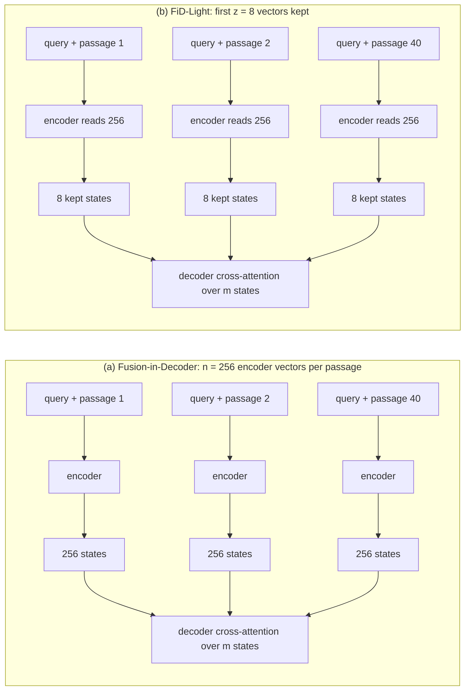
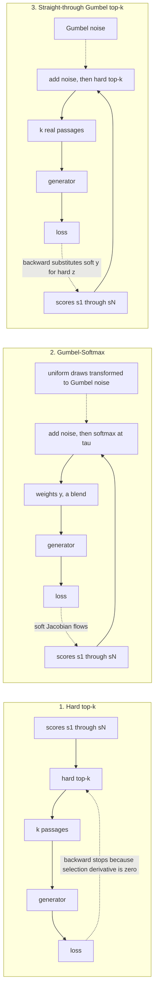
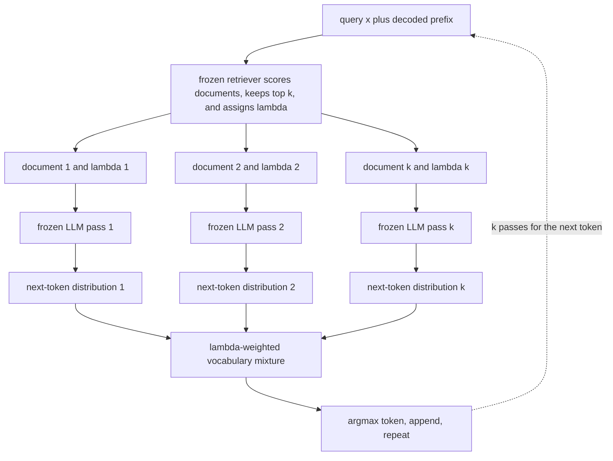
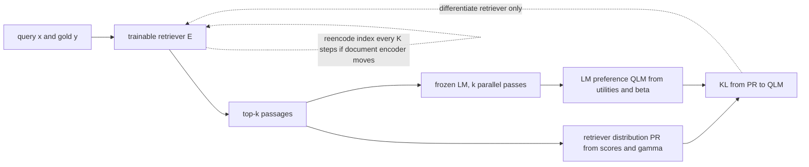
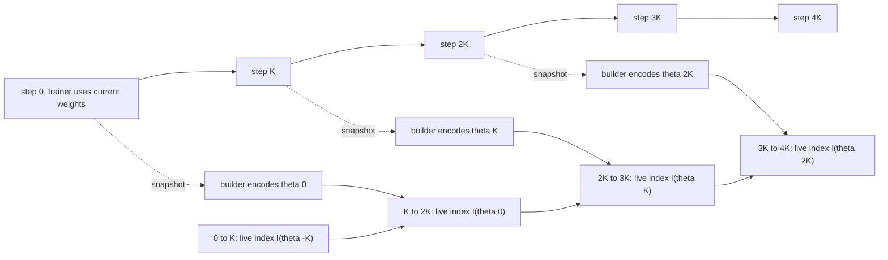
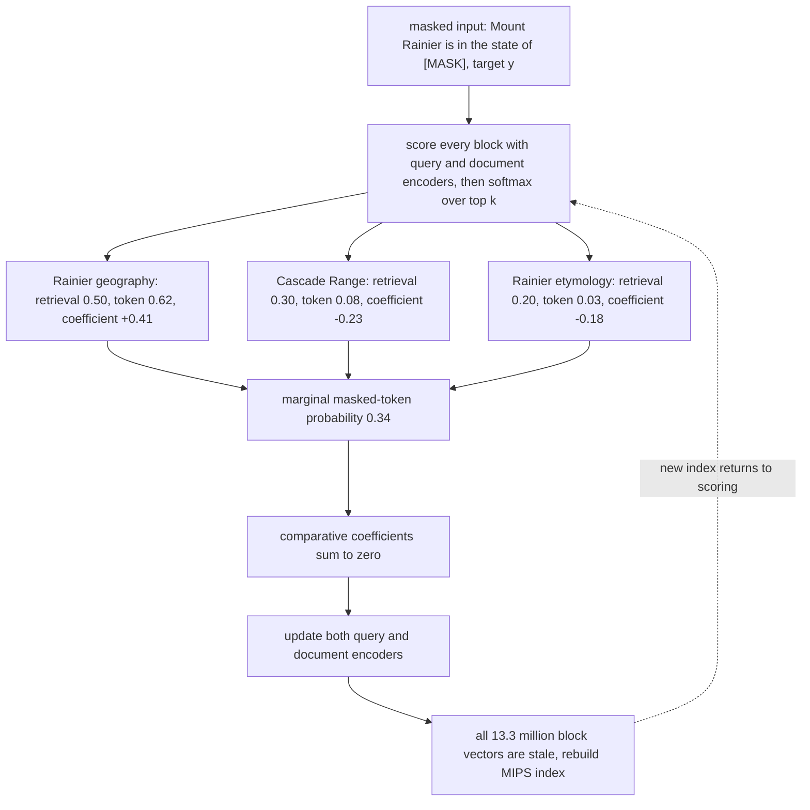

# Chapter 28: Training the Retriever

Purpose: decide which Retrieval-Augmented Generation (RAG) component to train, connect generator utility to a discrete retriever, and price the index work that retriever updates create.

## TL;DR

- Expose two parameter sets before choosing a training plan. Freeze or train the retriever, and independently freeze or train the generator.
- Run the oracle-context ablation first. A large gain with the gold passage points to retrieval. A flat result points to generation.
- Fusion-in-Decoder (FiD) removes the passage-count square from encoder attention. FiD-Light then reduces decoder key/value (KV) traffic without truncating the passage.
- Hard top-k blocks answer-loss gradients. Marginalization, REINFORCE, and Gumbel relaxation are the three routes around that discrete boundary.
- REPLUG uses a frozen black-box large language model (LLM) application programming interface (API) by mixing one next-token distribution per passage. Its bill grows with every generated token.
- Language model (LM) supervision aligns the retriever with the frozen generator's within-query passage preference. It can reorder only the passages already retrieved.
- Retriever training changes the document embeddings. A refresh schedule must respect builder capacity, measured staleness, and a final full re-encode. Retrieval-Augmented Language Model Pre-training (REALM) puts retrieval inside masked pre-training. Its signal is elegant, but the worked configuration costs 33 times closed-book pre-training.

## The story

Imagine a library with a catalog clerk and a reader.
The clerk is the retriever. The reader is the generator. The catalog cards are the stored document vectors. The first management question is not how hard both people should work. It is which person is failing.
Give the reader the correct book directly. If the answer improves, the clerk failed to bring the evidence. If the answer stays wrong, the reader failed to use evidence already on the desk.
The library has four staffing plans. Both people can stay fixed. Only the clerk can train. Only the reader can train. Both can train together.
Moving the reader to training is expensive because the reader is large. Moving the clerk to training looks cheap until the catalog cards become stale.
The checkout gate creates another problem. It hands over exactly the top k books. Small score changes do nothing until two books swap rank. An answer-level correction cannot pass smoothly through that gate. One remedy lets every candidate book cast a weighted vote. Another adds Gumbel noise, keeps a real book in the forward pass, and uses a soft surrogate in the backward pass.
FiD changes the reading room. The reader examines each book at a separate desk, then combines the notes in one decoder. FiD-Light keeps only a trained summary from each desk for decoder access.
REPLUG is the plan for a reader hired through a locked service window. The library cannot alter that reader. It sends one book through each window, collects one next-token distribution per book, and mixes the votes by catalog score.
Language-model supervision lets the reader grade the clerk. The reader reports how likely the gold answer is under each retrieved book. The clerk moves probability mass toward the books that help this reader and away from those that hurt it.
That feedback still cannot reward a book the clerk never brought. The lesson can rerank the cart, but it cannot discover a book outside the cart.
Every change to the document-side clerk also rewrites the meaning of the catalog. A builder must snapshot the clerk, regenerate every card, and publish the new catalog later.
REALM turns the library into an apprenticeship. During pre-training, the reader predicts a masked token, and each retrieved block earns credit only when it beats the retrieved-set average.
The apprenticeship teaches reader and clerk together. It also closes every lesson through the whole catalog, so the catalog rebuild becomes part of the training bill.

## Decoder table

| Source term | Plain-language decode | Interview consequence |
|---|---|---|
| RAG | Retrieval-Augmented Generation | Separate retrieval failure from generation failure before training. |
| Retriever weights, phi | Parameters that score and select passages | They receive no answer-loss gradient through hard top-k by default. |
| Generator weights, theta | Parameters that produce the answer | They can train directly from answer loss when weights are available. |
| Datastore, D | The corpus of N chunks | Document-side retriever updates make every stored vector stale. |
| Query and evidence symbols x, q, y, c_i, p_i, and d_i | Query, answer, retrieved chunk, passage, or document according to the section | They keep each objective tied to the object it scores. |
| Parameter symbols phi, theta, and eta | Retriever, generator, and trainable retriever parameters | Theta means generator weights in section 28.1 and encoder version in section 28.6. |
| Encoder functions E, E_Q, E_P, Emb_q, and Emb_d | Generic, query-side, and document-side representation functions | Only a changed document-side function invalidates stored vectors unless the encoder is tied. |
| Shape symbols N, k, n, d, l, and m | Corpus size, retrieved count, passage length, hidden width, layer count, and decoder-visible states | They expose which costs grow with the corpus, passage count, or decoder context. |
| Compute symbols P_r, P_g, T_c, C, C_r, and C_s | Retriever parameters, generator parameters, chunk tokens, throughput, refresh cost, and step cost | Their ratios price training and refresh before a run starts. |
| Symbol B | Bytes per parameter in section 28.2 and batch size in section 28.7 | Its meaning changes between the FiD cache and REALM examples. |
| Symbol L | Answer length in FiD, loss in the differentiability sections, and chunk length in refresh or REALM | The section scope prevents three different quantities from being conflated. |
| Symbol z | FiD-Light kept-state count, Gumbel selection vector, or latent REALM block | It is deliberately overloaded across sections and must be decoded locally. |
| Candidate sets D prime, Z, and Z_k | REPLUG top-k passages, the REALM block corpus, and REALM's retrieved support | Both learning objectives normalize only over a retrieved subset. |
| Sequence symbols y_t, y_before_t, and d circle x | Current output token, decoded prefix, and a document prepended to a query | They define REPLUG's repeated next-token mixture. |
| Gumbel symbols u_i, g_i, y_i, and delta_ij | Uniform draw, Gumbel noise, relaxed weight, and identity indicator in section 28.3 | They define the reparameterized sample and its Jacobian. |
| Distillation symbols u_i, ell_i, beta, and gamma | LM utility, log probability ratio, LM temperature, and retriever temperature in section 28.5 | These quantities define the teacher, student, KL loss, and gradient. |
| Timeline symbols theta_0, theta_t, theta_jK, K_min, and rho | Stored-vector version, current version, builder snapshot, minimum interval, and relative builder throughput | They make asynchronous staleness and capacity explicit. |
| Top k | The selected passage set | It is a discrete support and a hard ceiling on downstream evidence. |
| Oracle-context ablation | Give the generator the gold passage directly | A gain points right in the quadrant grid. A flat result points down. |
| Quadrant I | Freeze retriever and generator | Use prompting, chunking, k, reranking, and layout. |
| Quadrant II | Train retriever and freeze generator | Use generator likelihood as supervision and budget re-encoding. |
| Quadrant III | Freeze retriever and train generator | FiD, FiD-Light, and Retrieval-Augmented Fine-Tuning (RAFT) fit here. |
| Quadrant IV | Train both | Pay both training bills, refresh the index, and own generator gradients. |
| Query-side fine-tuning | Train only the query encoder | Reshape query projection without changing stored document vectors. |
| Document-side fine-tuning | Train the passage encoder | Fix document geometry, but invalidate the index. |
| Tied encoder | One encoder serves queries and passages | Contriever has no document tower that can stay fixed independently. |
| FiD | Encode each query-passage pair separately, then fuse in one decoder | Preserve all passages while dividing encoder attention by k. |
| FiD-Light | Expose only the first z trained encoder states per passage to the decoder | Reduce decoder KV traffic while the encoder still reads every token. |
| Decoder-visible states, m | The total states offered to decoder cross-attention | For FiD-Light, m equals k times z. |
| KV cache | Decoder cross-attention keys and values | It creates a sequential memory-bandwidth bill per generated token. |
| Marginalization | Mix output distributions from separate passage-conditioned passes | RAG-Sequence and REPLUG use it. It is exact but costs k generator passes and cannot fuse facts across passes. |
| Hard top-k | Return row indices for the k highest scores | Its Jacobian is zero almost everywhere and undefined at ties. |
| Selection vector, z | A binary vector with k selected entries | The generator sees real passages, but gradients stop at selection. |
| REINFORCE | A score-function gradient estimator | It is unbiased and uses one pass, but one scalar reward drives all candidates. |
| Standard Gumbel noise | Noise sampled from transformed uniform draws | Perturb-and-argmax becomes an exact softmax sample. |
| Gumbel-Softmax | Replace noisy argmax with a temperature softmax | It is also the Concrete distribution. It gives a nonzero per-candidate Jacobian. |
| Gumbel-top-k | Take the k largest noisy scores | It samples k documents without replacement from the softmax. |
| Straight-through estimator | Use hard selection forward and soft weights backward | It gives real text to the generator at the price of gradient bias. |
| Temperature, tau | Sharpness of the Gumbel relaxation or REPLUG weights | Lower values sharpen choices and can collapse or destabilize gradients. |
| REPLUG | Run a frozen LLM once per document and mix next-token distributions | It needs probabilities, not weights or gradients. |
| Retrieval weight, lambda | Softmax-normalized retriever score over the top k | It explicitly bounds each passage's token-level influence. |
| LM-supervised retrieval | Use generator answer likelihood as the retriever's teacher | It targets what helps the deployed generator, not human relevance alone. |
| Utility, u | Gold-answer log-likelihood under one passage | Normalize it within a query because raw values depend on answer length. |
| LM preference, QLM | Softmax over utilities with temperature beta | It is the teacher distribution on the retrieved set. |
| Retriever distribution, PR | Softmax over retriever scores with temperature gamma | It is the student distribution on the same top-k support. |
| Kullback-Leibler divergence, KL | Distribution mismatch from PR to QLM | This direction suppresses harmful high-mass passages strongly. |
| Top-k blind spot | Zero support outside the retrieved candidates | LM supervision cannot teach the retriever to find a passage it never surfaced. |
| Hard-negative mining | Refresh difficult negative examples | Pair it with LM supervision because LM supervision mainly reorders. |
| Index version | The encoder weights that produced stored vectors | Query and document vectors become inconsistent when versions diverge. |
| Negative stagnation | Old candidates become easy under the current model | Loss can keep falling while recall stops improving. |
| Refresh cost, Cr | Floating-point operations (FLOPs) for one corpus re-encode | Compare it with the cost of one training step before choosing cadence. |
| Step cost, Cs | FLOPs for one current training step | Adding an LLM teacher can make refresh cheaper in relative terms. |
| Refresh interval, K | Steps between builder snapshots | Capacity sets a lower bound. Staleness sets an upper bound. |
| Builder ratio, rho | Builder throughput relative to trainer throughput | It determines whether an asynchronous builder can keep up. |
| Asynchronous refresh | Build beside the trainer and publish one interval later | It bounds staleness between K and 2K steps. It does not remove staleness. |
| Flat training search | Exact graphics processing unit (GPU) search over current vectors | It can remove graph rebuilding from the training critical path. |
| Hierarchical Navigable Small World (HNSW) | Approximate-nearest-neighbor graph structure | Its graph build is far cheaper in FLOPs than corpus encoding here. |
| Maximum inner product search (MIPS) | Search by bi-encoder inner product | REALM rebuilds this index asynchronously. |
| REALM | Retrieval inside masked language-model pre-training | The masked-token probability trains the retriever without relevance labels. |
| Salient span masking | Mask entities, dates, numbers, or domain identifiers | It makes retrieved evidence affect the masked-token likelihood. |
| Inverse Cloze Task (ICT) | A retriever warm start named in the source | It avoids the zero-signal cold start from uniformly useless retrieval. |
| RETRO | Retrieval inside pre-training with a frozen retriever | It gives up document-retriever updates to scale the database. |

## Core mechanics

### 28.1 Four quadrants: freeze or train × retriever or generator

#### What

Expose both parameter sets.
$$
c_1,\ldots,c_k = \mathop{\text{RET}}_{\phi}(x,D), \qquad y = \mathop{\text{GEN}}_{\theta}(x,c_1,\ldots,c_k)
$$
The retriever scores N chunks and returns k. The generator consumes that evidence. Each parameter set can be frozen or trainable.
Run the oracle-context ablation on current failures. Put the gold passage directly in the generator context and rescore.

- Accuracy jumps: the evidence was not arriving. Train or repair retrieval.
- Accuracy stays flat: the generator saw evidence but failed to use it. Train or repair generation.
- If recall at k is 0.6, generator training cannot lift end-to-end accuracy above 0.6 on those queries.

#### Why

The four choices carry different signals and obligations.

- Quadrant I has zero gradient steps.
- Quadrant II uses generator likelihood or another retriever objective and owes a full re-encode when the document tower moves.
- Quadrant III uses answer loss and leaves the index fixed.
- Quadrant IV couples both models, both bills, a refresh schedule, and generator ownership.

Query-side-only training is the half-step. It changes query projection without invalidating stored document vectors. It cannot fix document-side vocabulary mismatch.

#### Failure without it

A reflexive generator fine-tune wastes the schedule when the gold passage never reaches top k.
Hard top-k also blocks answer-loss gradients to the retriever. Joint loss syntax alone does not train phi.
Joint optimization loses when the generator is a hosted interface, when the corpus changes, or when the next generator version would force full retraining. For generator training, the source defaults to parameter-efficient fine-tuning (PEFT), especially Low-Rank Adaptation (LoRA), unless the base model cannot produce the target format.

#### Cost and complexity

The source uses Bidirectional Encoder Representations from Transformers base (BERT-base) for the retriever and an 8 billion parameter generator.
$$
P_r = 1.1 \times 10^8, \qquad P_g = 8 \times 10^9, \qquad \frac{P_g}{P_r} = 72.7
$$
For ten million 256-token chunks at 3.4 times 10 to the 14 FLOPs per second:
$$
\frac{2(1.1\times10^8)(256)(10^7)}{3.4\times10^{14}} = 1{,}656\ \text{s} = 27.6\ \text{minutes}
$$
One contrastive step on 9,216 tokens costs:
$$
\frac{6(1.1\times10^8)(9{,}216)}{3.4\times10^{14}} = 1.79\times10^{-2}\ \text{s} = 17.9\ \text{ms}
$$
One refresh therefore costs 9.3 times 10 to the 4 retriever steps.
The worked training set has 50,000 question-answer pairs, five passages per example, 1,344 tokens per example, and three generator epochs.

- Quadrant III costs 2.6 hours per epoch and 7.9 hours total.
- Quadrant II uses 10,000 steps and refreshes every 1,000. Gradient work is 179 seconds. Refresh work is 16,565 seconds. Total time is 16,744 seconds, with 98.9 percent in re-encoding.
- Quadrant IV costs 12.6 hours and holds optimizer state for both models.
- Parameter-count budgeting predicts three minutes for Quadrant II. Actual time is 4.65 hours, a 94 times miss.
- At K equal to 500, refresh work is 186 times gradient work.
- At 100,000 chunks, the same re-encode takes 16.6 seconds.
- Five percent weekly turnover over ten million chunks means encoding 500,000 new chunks takes 83 seconds when phi is frozen. A retriever model update raises the operation to 27.6 minutes, a 20 times jump.

### 28.2 Fusion-in-Decoder and FiD-Light

#### What

Let q be the query. Let k passages each contain n tokens. Let encoder width be d and layer count be l.
Naive concatenation encodes one sequence of length kn.
$$
\text{naive attention per layer} \approx 4(kn)^2d
$$
FiD separately encodes every query-passage pair.
$$
H_i \in \mathbb{R}^{n\times d}, \qquad H = [H_1,\ldots,H_k] \in \mathbb{R}^{kn\times d}
$$
The decoder cross-attends to all kn states once. Encoder attention becomes:
$$
\text{FiD attention per layer} \approx k(4n^2d)
$$
The ratio is exactly k.
FiD-Light passes only the first z trained states from each encoder output to the decoder. The decoder sees kz states, but each bidirectional encoder still reads all n passage tokens.

#### Why

FiD relocates cross-passage evidence combination from a quadratic encoder to linear decoder cross-attention.
FiD-Light targets the cost FiD leaves in the decoder.
$$
\text{KV cache bytes} = 2B k n d l
$$
The factor 2 counts keys and values. This memory traffic repeats for every decoded token.

#### Failure without it

Concatenation makes passage count quadratic in encoder attention.
Marginalization runs one decoder pass per passage. No single pass sees two passages, so an answer needing a fact from passage 3 and passage 7 is structurally unreachable.
FiD-Light does not support post hoc output truncation of a FiD checkpoint. The leading states carry a learned summary only when training enforced that constraint.
Cutting k can destroy real multi-passage capability when the gain is not merely recall.

#### Cost and complexity

For k equal to 40, n equal to 256, d equal to 1,024, and 24 layers:

- Concatenated attention costs 4.30 times 10 to the 11 FLOPs per layer and 10.3 trillion FLOPs (TFLOP) over 24 layers.
- FiD attention costs 0.26 TFLOP.
- Text-to-Text Transfer Transformer large (T5-large) uses d equal to 1,024, feed-forward width 4,096, 24 encoder layers, and 24 decoder layers.
- Each encoder layer has 12.58 million derived parameters, or 302 million total.
- Each decoder layer has 16.78 million derived parameters, or 403 million total.
- The derived 771 million total matches the published 770 million after including the 32.9 million embedding table on input and output sides.

With Brain Floating Point 16 (bf16) at 2 bytes, 3.35 TB per second bandwidth, and 3.4 times 10 to the 14 FLOPs per second:

- One concatenated encoder costs 16.5 TFLOP and 48.5 ms.
- FiD costs 6.45 TFLOP and 19.0 ms.
- FiD decoder weights consume 0.81 GB per token step.
- Its cross-attention cache is 1.01 GB.
- Total traffic is 1.82 GB and 0.54 ms per decoded token.
- The cache is 55 percent of bytes read.

With FiD-Light z equal to 8:

- Decoder-visible states fall from 10,240 to 320.
- The cache falls to 0.031 GB.
- Total traffic is 0.84 GB and 0.25 ms per token.
- Decode is 2.2 times faster. The 19.0 ms encoder pass is unchanged.
$$
\text{FiD latency} = 19.0 + 0.54L\ \text{ms}, \qquad \text{FiD-Light latency} = 19.0 + 0.25L\ \text{ms}
$$
- At L equal to 3, the result is 20.6 ms against 19.8 ms, a 4 percent saving.
- At L equal to 256, the result is 157.5 ms against 83.0 ms, a 1.9 times speedup.
- Independent encoding is the default once k exceeds roughly five.
- Turn on FiD-Light when answers are long or decoder-visible states exceed about 8,200 and the cache overtakes decoder weights.
- Set z from a total state budget. Latency depends on m equal to kz.
- At k equal to 5, encoder time falls to 2.4 ms and cache size to 0.13 GB.
- Source pointing adds a passage identifier to the answer and supplies provenance.

### 28.3 Relevance is discrete: Gumbel noise and the differentiability fix

#### What

The retriever produces scores and a binary selection vector.
$$
s_i = E_{\eta}(q)^\top E(d_i), \qquad z \in \{0,1\}^N, \qquad \sum_i z_i = k
$$
The generator loss is:
$$
\mathcal{L} = -\log p_{\theta}\left(y\mid q,\{d_i:z_i=1\}\right)
$$
The desired chain contains the broken factor:
$$
\frac{\partial \mathcal{L}}{\partial \eta} = \frac{\partial \mathcal{L}}{\partial z} \frac{\partial z}{\partial s} \frac{\partial s}{\partial \eta}
$$
Hard top-k makes the middle Jacobian zero almost everywhere and undefined at score ties.
Three routes remain.

1. Marginalize passage-conditioned output distributions, as RAG-Sequence and REPLUG do.
2. Use the REINFORCE score-function estimator.
3. Reparameterize selection with Gumbel noise and a soft or straight-through relaxation.
$$
p(y\mid q)=\sum_i p_{\eta}(d_i\mid q)p_{\theta}(y\mid q,d_i)
$$
The REINFORCE estimator is:
$$
\nabla_{\eta}\mathbb{E}[R] = \mathbb{E}\left[(R-b)\nabla_{\eta}\log p_{\eta}(z)\right]
$$
For a categorical sample:

$$
\frac{\partial\log p_{\eta}(z)}{\partial s_i} = \mathbb{1}[i=z]-p_i
$$
Draw standard Gumbel noise from uniforms.

$$
u_i \sim \mathop{\text{Uniform}}(0,1), \qquad g_i = -\log(-\log u_i)
$$
Its cumulative distribution is:

$$
F(g)=\exp(-e^{-g})
$$
The maximum of shifted Gumbels remains Gumbel.

$$
\Pr\left[\max_j(s_j+g_j)\le t\right] = \exp\left(-e^{-t}\sum_j e^{s_j}\right)
$$
Therefore:

$$
\Pr\left[\mathop{\text{arg max}}\limits_j(s_j+g_j)=i\right] = \frac{e^{s_i}}{\sum_j e^{s_j}}
$$
The temperature relaxation and its Jacobian are:

$$
y_i = \frac{\exp((s_i+g_i)/\tau)} {\sum_j\exp((s_j+g_j)/\tau)}, \qquad \frac{\partial y_i}{\partial s_j} = \frac{1}{\tau}y_i(\delta_{ij}-y_j)
$$
Gumbel-top-k samples k documents without replacement. Straight-through Gumbel uses hard real text forward and substitutes the soft y in backward.

#### Why

Gumbel noise moves randomness into an external source that does not depend on retriever parameters.
The soft relaxation gives a full per-candidate derivative. REINFORCE gives one scalar reward for the sampled choice.
For a 30-token answer at 2.0 nats per token, that REINFORCE scalar is near 60 and varies across examples.
Straight-through preserves the serving input. A weighted blend of passage embeddings is not a passage.

#### Failure without it

Hard top-1 always selects the same passage until a rank crossing. Other candidates receive zero generator feedback.
Plain soft passage blends create a train-serve mismatch.
Starting with a very small temperature produces nearly zero gradients on typical draws and huge gradients near ties.
Gaussian perturbations produce the Thurstone probit model. For more than two candidates, its categorical choice probabilities have no closed form. It is not an exact softmax sampler.

#### Cost and complexity

The five-logit example is:

$$
s=(2.0,1.5,0.5,0.0,-1.0), \qquad \mathop{\text{softmax}}(s) =(0.496,0.301,0.111,0.067,0.025)
$$
The Gumbel draw uses:

$$
u=(0.42,0.91,0.77,0.15,0.63), \qquad g=(0.142,2.361,1.342,-0.640,0.772), \qquad s+g=(2.142,3.861,1.842,-0.640,-0.228)
$$
The draw selects passage 2. Gumbel-top-2 selects passages 2 and 1.
At tau equal to 1:

$$
y=(0.134,0.746,0.099,0.008,0.013)
$$
The selected Jacobian entry is 0.189.
At tau equal to 0.1, the first weight is 3.4 times 10 to the -8 and the typical Jacobian is 3.4 times 10 to the -7. The typical gradient is 5.6 times 10 to the 5 smaller than at tau equal to 1.
At a near tie, the same expression reaches 2.5. This seven-order spread motivates annealing from 1.0 downward.
Because the difference of two independent standard Gumbels is Logistic, a 90 percent Bradley-Terry pairwise preference requires:

$$
\Delta=\log(0.9/0.1)=\log 9=2.197
$$
The current 0.5 margin gives 0.622 preference, so training must add 1.697 logits.
With k equal to 8, 200-token passages, a 50-token query, and a 30-token answer:

- Marginalization processes 2,000 prompt tokens and eight decoder passes.
- Straight-through top-1 processes 250 prompt tokens and one pass.
- The compute reduction is 8 times and the gradient is biased.

Use marginalization by default when generator weights are available and k is at most 8. Use straight-through Gumbel when k is large or the choice is a hard commitment.
Track score entropy every few hundred steps. Entropy near zero means noise has stopped mattering. Entropy near log N means the retriever does not discriminate. If top-1 softmax mass already exceeds 0.9, ask whether relaxation is still useful.

### 28.4 REPLUG: black-box LLM, ensembled output distributions

#### What

REPLUG scores each document with a frozen dual encoder, keeps top k, and normalizes the scores.

$$
s(d,x)=\cos(E(d),E(x))
$$
$$
\lambda(d,x)= \frac{\exp(s(d,x)/\tau)} {\sum_{d'\in D'}\exp(s(d',x)/\tau)}
$$
The frozen LLM runs once per document. REPLUG mixes next-token distributions.

$$
p(y_t\mid x,y_{1:t-1}) = \sum_{d\in D'}\lambda(d,x) p_{\mathrm{LM}}(y_t\mid d\circ x,y_{1:t-1})
$$
Take the argmax token, append it, and repeat.

#### Why

The interface needs only next-token probabilities. It does not need weights, hidden states, or gradients.
Each pass sees one document, so context per pass falls from query plus k documents to query plus one document.
Each source contribution is the explicit product of its retrieval weight and token probability.
REPLUG is the black-box alternative when FiD cannot modify decoder cross-attention.

#### Failure without it

Concatenation discards explicit retriever weights at the prompt boundary and lets position compete with relevance.
At tau equal to 1, narrow cosine scores make the mixture nearly uniform.
A frozen reader cannot learn to ignore misleading context.
The mixture rewards agreement. Nine wrong passages can outvote one correct passage.
REPLUG never drops a document during an answer. Every retrieved chunk votes on every generated token with the same lambda.

#### Cost and complexity

For scores 0.82, 0.79, and eight scores at 0.70:

- At tau equal to 1, the gold weight is 0.110. Each low-scoring passage gets 0.098.
- At tau equal to 0.05, the weights are 0.440 for gold, 0.241 for the distractor, and 0.040 for each remaining passage.
- If gold assigns 0.85 to the correct token and the rest assign 0.10, the mixture assigns 0.183 at tau equal to 1 and 0.430 at tau equal to 0.05.
- Top-1 conditioning assigns 0.85.
- If nine non-gold passages assign 0.90 to one wrong token, the wrong token gets 0.504 against 0.430 for the correct token.
- Flipping that vote needs gold weight above 0.514, which requires tau below roughly 0.04. The mixture then approaches retriever top-1.

The metered example uses ten 128-token chunks, a 100-token question and instruction, a 64-token answer, 3 dollars per million input tokens, and 15 dollars per million output tokens.

- Concatenation uses 1,380 prefill tokens and costs 0.00510 dollars per query.
- In-process REPLUG prefills 2,280 tokens, 1.65 times concatenation, and performs 640 decode passes.
- Batching can hide wall time while compute rises tenfold.
- An endpoint without persistent KV cache receives 166,080 input tokens and costs 0.508 dollars per query.
- That endpoint bill is just under 100 times concatenation.
- Prefix caching can return the input bill near the in-process case.

Reported results are 6.3 percent improvement for Generative Pre-trained Transformer 3 (GPT-3) 175B language modeling and 5.1 percent for Codex five-shot Massive Multitask Language Understanding (MMLU).
The economics depend on output length. Ten passages over a 500-token answer mean 5,000 forward passes for the same scale of gain.
Tune tau before k. The source defaults to enough concentration for the top document to hold at least one third of mass, near tau equal to 0.05 for these dense-retriever cosines.
Use token-level ensembling for outputs under about 50 tokens. Above that, use lambda to select one document and generate once.
Verify that the endpoint returns usable log-probabilities. A text-only endpoint cannot implement the mixture. A truncated top-m probability list mixes only a renormalized vocabulary fragment.

### 28.5 LM-supervised retrieval: KL between retriever and LM preference

#### What

For query x, gold answer y, and retrieved passage i, ask the frozen generator for:

$$
u_i=\log P_{\mathrm{LM}}(y\mid d_i\oplus x)
$$
Normalize utility over the retrieved set with LM temperature beta.

$$
Q_{\mathrm{LM}}(d_i\mid x,y) = \frac{\exp(u_i/\beta)} {\sum_{j=1}^{k}\exp(u_j/\beta)}
$$
Normalize retriever scores on the same support with temperature gamma.

$$
P_R(d_i\mid x) = \frac{\exp(s(d_i,x)/\gamma)} {\sum_{j=1}^{k}\exp(s(d_j,x)/\gamma)}
$$
Train only the retriever by minimizing:

$$
\mathcal{L} = \mathop{\text{KL}}(P_R\Vert Q_{\mathrm{LM}})
$$
Let:

$$
\ell_i=\log(P_i/Q_i)
$$
Then:

$$
\frac{\partial\mathcal{L}}{\partial z_j} = P_j(\ell_j-\mathcal{L})
$$
The updates sum to zero.

#### Why

Human labels estimate passage relevance. The deployed pipeline needs passages that raise this generator's probability of the gold answer.
Raw answer log-likelihoods are not comparable across queries because answer lengths differ. Within-query softmax keeps only relative preference.
The generator acts as a consumer-teacher through k frozen forward passes. It can be a log-probability API.

#### Failure without it

Human relevance can reward a lexicalization the generator misreads, a topical distractor, or a correct passage that adds nothing beyond parametric knowledge.
Pointwise regression on raw utility learns answer length as much as passage quality.
Both distributions live only on retrieved top k. This assumes that set carries essentially all probability mass. A passage outside top k gets exactly zero.
Every gradient is scaled by current retriever mass. The KL direction demotes a harmful high-mass passage more strongly than it promotes a useful low-mass passage.
This method can reorder what the retriever found. It cannot teach discovery from outside the support.

#### Cost and complexity

The worked example uses k equal to 4, gamma equal to 0.1, and cosine scores:

$$
s=(0.82,0.79,0.71,0.68), \qquad z=(8.2,7.9,7.1,6.8), \qquad P_R=(0.431,0.319,0.143,0.106)
$$
The frozen generator returns:

$$
u=(-2.30,-1.20,-0.92,-3.00)\ \text{nats}
$$
At beta equal to 1:

$$
Q_{\mathrm{LM}}=(0.118,0.354,0.469,0.059), \qquad \mathcal{L}=0.418\ \text{nats}
$$
The negative gradients used as score updates are:

$$
(-0.378,+0.167,+0.230,-0.019)
$$
They sum to zero. The largest move demotes passage 1. Passage 3 receives the largest promotion.
At beta equal to 0.5:

$$
Q_{\mathrm{LM}}=(0.038,0.346,0.606,0.009)
$$
The divergence rises to 1.067 nats, 2.6 times the prior value. Passage 4's update magnitude rises from 0.019 to 0.144, a factor of 7.6.
Treat beta like a second learning rate. Start at 1. Lower it only when answers have a fixed short form and the generator ordering is trusted.
A batch of 64 queries with k equal to 20 needs 1,280 generator passes and 327,680 tokens.

- A frozen 7B generator costs 4.6 times 10 to the 15 FLOPs.
- A 110 million parameter contrastive bi-encoder batch costs 4.5 times 10 to the 13 FLOPs including backward.
- LM supervision costs roughly 100 times more per step.

Use it as a short fine-tune over a pretrained retriever. The source examples are the LM-supervised REPLUG variant over Contriever and Retrieval-Augmented Dual Instruction Tuning (RA-DIT) over an existing dense retriever.
Choose k for the distractors that need demotion. Default to serving top k or 20, whichever is larger. Pair misses with hard-negative mining.
For several generators, keep a shared label-supervised document tower and index. Fork only the query encoder per generator, or move model-specific adaptation into a reranker.

### 28.6 Index refresh during training

#### What

A dense retriever scores:

$$
s(q,p)=E_Q(q,\theta)^\top E_P(p,\theta)
$$
The index stores passage embeddings evaluated at one theta version.
After an encoder update, current queries can be compared with stale document vectors. The old index also returns an old candidate set.
Refresh the corpus every K steps. Let Cr be one full re-encode, Cs one training step, and rho builder throughput relative to trainer throughput.

$$
C_r=N(2PL)
$$
$$
C_s=1{,}280(6PL)
$$
For the source constants:

$$
C_r=5.632\times10^{17}, \qquad C_s=2.163\times10^{14}, \qquad \frac{C_r}{C_s}=2{,}604
$$
Builder capacity requires:

$$
K\ge K_{\min}=\frac{C_r}{\rho C_s}
$$
Inline refresh has compute multiplier:

$$
1+\frac{C_r}{KC_s}
$$
An asynchronous builder snapshots at step jK and publishes at step jK plus K. The live index remains between K and 2K steps behind.

#### Why

Score inconsistency compares a current query representation with obsolete document geometry.
Stale candidates weaken the hard negatives. Approximate Nearest Neighbor Negative Contrastive Estimation (ANCE) calls this negative stagnation.
The loss can keep falling because the negatives get easier while held-out recall stays flat.

#### Failure without it

A tied Contriever encoder cannot move only on the query side. Any update invalidates document vectors.
Refreshing only after training means the entire run used obsolete candidates.
Partial refresh favors yesterday's most retrieved documents and calcifies ranking.
Skipping the final re-encode ships final query weights against an index up to 2K steps behind.

#### Cost and complexity

The base calculation uses ten million chunks, width 768, BERT-base, length 256, batch 64, and k equal to 20.

- One refresh equals 2,604 bare contrastive steps.
- HNSW rebuilding costs 6.4 times 10 to the 10 distance evaluations and 9.83 times 10 to the 13 FLOPs.
- The graph build is 5,730 times lower in FLOPs than corpus encoding.
- Training-time refresh is primarily an encoder problem.

The 25,000-step example uses eight A100 accelerators at 312 TFLOP per second each and 40 percent model FLOP utilization.

- Sustained throughput is 9.98 times 10 to the 14 FLOPs per second.
- One step is 0.217 seconds.
- One full re-encode is 564 seconds, or 9.4 minutes.
- Refresh-free training is 5,425 seconds, or 1.51 hours.
- Refresh every step makes the run 164 days.
- Inline K equal to 500 gives multiplier 6.21, 9.4 hours total, and 84 percent of GPU-hours in encoding.
- Its staleness bound is 1,000 steps.
- With an equal-throughput asynchronous builder, minimum K is 2,604.
- Hardware doubles while trainer wall time stays fixed.
- Staleness reaches 5,208 steps, or 21 percent of the run.

Flat GPU search over ten million 768-dimensional 16-bit floating-point (fp16) vectors needs 15.4 GB.

$$
64(2dN)=9.83\times10^{11}\ \text{FLOPs}
$$
That search costs 0.45 percent of Cs.
Add a frozen 7B teacher and Cs rises to 5.59 times 10 to the 15 FLOPs.

$$
\frac{C_r}{C_s}=101
$$
A 500-step inline cadence then costs:

$$
1+\frac{101}{500}=1.20
$$
The teacher makes refresh 26 times cheaper in relative terms.
A staleness probe re-encodes 100,000 chunks and checks 1,000 queries.

- It costs 5.632 times 10 to the 15 FLOPs, or 26 steps.
- That is 1.0 percent of a 2,604-step interval.
- The source proposes a top-k overlap floor of 0.8.

REALM's 500-step cadence would need builder ratio at least 5.2 under the bare-step constants.
Use inline refresh when Cr divided by Cs falls below about 100. The source says these constants also cover a training datastore below 400,000 chunks.
Train with flat exact search where it fits. Build the approximate index once at the end. Always perform one final full re-encode.

### 28.7 REALM and retrieval inside pre-training

#### What

REALM treats a retrieved block as a latent variable in masked-token prediction.

$$
p(y\mid x) = \sum_{z\in Z_k}p(y\mid z,x)p(z\mid x), \qquad p(z\mid x) = \frac{\exp f(x,z)} {\sum_{z'\in Z_k}\exp f(x,z')}, \qquad f(x,z)=\mathop{\text{Emb}}_q(x)^\top\mathop{\text{Emb}}_d(z)
$$
The retriever-score gradient is:

$$
\frac{\partial\log p(y\mid x)}{\partial f(x,z)} = p(z\mid x) \left[ \frac{p(y\mid z,x)}{p(y\mid x)}-1 \right]
$$
A block receives a positive update exactly when it makes the masked token more likely than the retrieved-set marginal.
The coefficients sum to zero. The top-k supplies its own negatives.

#### Why

No relevance labels enter the objective. The masked-token likelihood teaches both retriever encoders.
Salient span masking creates signal. Named entities, dates, and numbers are more likely than locally predictable tokens to require retrieved evidence.
The source's figure masks the state in "Mount Rainier is in the state of [MASK]".

#### Failure without it

If all retrieved blocks are equally useless, each bracket becomes zero. A random retriever can cold-start with no signal.
Masking a locally predictable token also makes the bracket collapse.
Uniform random masking is therefore one of the most damaging reported REALM ablations.
Moving the document encoder invalidates all block vectors. REALM rebuilds its MIPS index asynchronously every 500 steps and accepts staleness.
The objective teaches "helps predict this masked token," not general human relevance. It can silently mismatch counter-argument retrieval or claim verification.

#### Cost and complexity

The figure uses three blocks.

| Block | Retriever mass | Masked-token probability | Gradient coefficient |
|---|---:|---:|---:|
| Rainier geography | 0.50 | 0.62 | +0.41 |
| Cascade Range | 0.30 | 0.08 | -0.23 |
| Rainier etymology | 0.20 | 0.03 | -0.18 |

The marginal masked-token probability is 0.34. The coefficients sum to zero.
The worked run uses two 110 million parameter encoders, 13.3 million blocks of 288 tokens, masked inputs of 288 tokens, k equal to 8, batch 512, 200,000 steps, refresh every 500 steps, and 10 to the 14 FLOPs per second.

- Closed-book pre-training costs 1.90 times 10 to the 11 FLOPs per example.
- Retrieval processes 4,608 tokens per example and costs 3.04 times 10 to the 12 FLOPs, a 16 times increase before refresh.
- A full corpus re-encode covers 3.83 times 10 to the 9 tokens and costs 8.43 times 10 to the 17 FLOPs.
- One re-encode takes 2.3 hours on the stated accelerator.
- The trainer uses 7.79 times 10 to the 17 FLOPs in a 500-step window.
- Refresh is 1.08 times the training work and 52 percent of total compute.
- Total per window is 1.62 times 10 to the 18 FLOPs, against 4.87 times 10 to the 16 closed-book.
- Retrieval inside pre-training costs 33 times closed-book pre-training.
- Across 400 windows, the run costs 1,800 device-hours against 54.
- On 64 accelerators, this is about 28 hours against under one.

The reported REALM result is 40.4 exact match on Natural Questions Open (NQ-Open) with roughly 330 million parameters. The closed-book T5-11B baseline scores 34.5 and is about 33 times larger.
RETRO freezes the retriever, uses a 2 trillion token database, and reports performance comparable to GPT-3 on the Pile with 25 times fewer parameters.
That database is 522 times this corpus. Refreshing every 500 steps would cost 565 times trainer compute per window and roughly half a million device-hours across the run.
Default to attaching retrieval after pre-training. RAFT-style distractor training can usually approximate the robustness for a few GPU-days. Deviate when the knowledge is absent from public checkpoints and the pre-training run is owned.
Warm-start with ICT or an existing Contriever or Dense Passage Retrieval (DPR) checkpoint.
Train both encoders while corpus rebuilds remain minutes. Freeze the document encoder when one full re-encode approaches the compute between refreshes, near 10 to the 10 corpus tokens in the source arithmetic.
## Diagrams

### Figure 28.1

|  | Retriever frozen | Retriever trained |
|---|---|---|
| Generator frozen | I. Prompt-only RAG. Off-the-shelf embedder plus hosted generator. Levers are chunk size, k, reranking, and prompt layout. Gradient steps are 0. | II. Train the retriever. REPLUG and LM-supervised retrieval. Signal is generator likelihood of the gold answer. Obligation is full re-encode. |
| Generator trained | III. Train the generator. FiD, FiD-Light, and RAFT. Signal is backpropagated answer loss. The index never moves. | IV. Joint. REALM and Atlas. Signal is coupled. Obligations are both bills, refresh, and owning theta. |

Below the frozen-retriever column: index built once. The corpus grows on its own schedule.
Below the trained-retriever column: crossing this boundary re-encodes all N vectors. It costs 9.3 times 10 to the 4 gradient steps, or 27.6 minutes at N equal to 10 to the 7.

> Figure 28.1: The costly boundary in the grid is vertical, not horizontal: moving down trains more parameters, but moving right invalidates every vector already in the datastore and forces a full re-encode that dwarfs the gradient step which caused it.

### Figure 28.2

FiD has m equal to 40 times 256, or 10,240 states, a 1.01 GB cache, and 0.54 ms bandwidth per token.
FiD-Light has m equal to 40 times 8, or 320 states, a 0.031 GB cache, and 0.25 ms bandwidth per token. The encoder pass is unchanged.

> Figure 28.2: Fusion-in-Decoder confines the quadratic attention term inside each passage and pays for the passage count once, in the decoder's cross-attention. FiD-Light shrinks that decoder-side cost by a factor of n/z without touching the encoder, which is why its end-to-end benefit scales with how many tokens you generate.

### Figure 28.3

> Figure 28.3: Only the operator in the second column changes. The Gumbel noise enters as an external source (dashed) that carries no gradient, and straight-through recovers row 1's forward pass while keeping row 2's backward pass.

### Figure 28.4

Naive RAG fuses at one concatenated prompt. REPLUG fuses at the vocabulary distribution.

> Figure 28.4: Each retrieved document reaches the answer through its own forward pass and its own softmax weight, so a document's influence on the generated token is bounded by its retrieval score rather than by where attention happens to land in a concatenated prompt.

### Figure 28.5

| Passage | Retriever PR | LM preference QLM | Score update |
|---|---:|---:|---:|
| d1 | 0.431 | 0.118 | -0.38 |
| d2 | 0.319 | 0.354 | +0.17 |
| d3 | 0.143 | 0.469 | +0.23 |
| d4 | 0.106 | 0.059 | -0.02 |
| d5 and below | Outside top k | Outside top k | 0 |

> Figure 28.5: LM supervision moves probability mass between retrieved passages rather than assigning labels to them. In (a) the retriever's favorite d1 is pushed down hardest (-0.38) because the frozen generator answers worst from it, while d3 - the passage the generator actually answers best from - is pulled up by +0.23. d4 moves by -0.02 because the update on every passage is scaled by the mass PR already gave it, and d5 and below, outside the top k, are in neither distribution and receive exactly zero. The updates sum to zero. In (b) only the retriever is differentiated: the language model appears solely as k parallel forward passes returning ui = log PLM (y | di ⊕ x), which is why the method runs against a log-probability API.

### Figure 28.6

| Refresh interval K | Inline compute multiplier |
|---:|---:|
| 500 | 6.21 times |
| 1,000 | 3.604 times |
| 2,604 | 2.00 times |
| 10,000 | 1.2604 times |
| 100,000 | 1.02604 times |

At equal builder throughput, Kmin is 2,604. Live-index staleness rises from K to just below 2K within each interval.

> Figure 28.6: The refresh interval is bounded from below by builder capacity and from above by the staleness you will tolerate. In (a) the builder snapshots θjK and publishes one interval later, so the index in use is always between K and 2K steps behind the weights being trained - asynchronous refresh bounds staleness rather than removing it. In (b) the curve is the compute multiplier for refreshing in line, 1+Cr /(KCs ) with Cr /Cs = 2,604. Left of the dashed line an equal-throughput asynchronous builder cannot keep up, so you are either paying the curve or falling further behind every interval.

### Figure 28.7

> Figure 28.7: The retriever's only teacher is the masked-token probability: a block is pushed up exactly when it beats the marginal, the coefficients sum to zero so the signal is purely comparative, and the dashed return path is the index the training step just invalidated.

## Whiteboard pack

### What to draw

1. Draw two boxes called retriever phi and generator theta.
2. Put a hard top-k gate between them.
3. Make a two-by-two freeze and train matrix.
4. Draw the oracle-context arrow directly into the generator.
5. Under top-k, draw three exits: marginalization, REINFORCE, and Gumbel.
6. Add FiD as separate passage encoders feeding one decoder.
7. Add REPLUG as k frozen LLM branches feeding one token mixture.
8. Add PR and QLM distributions meeting at KL.
9. Draw a separate index builder with snapshot, encode, publish, and a K-to-2K staleness band.
10. Close with the REALM loop from masked token to both encoders and back through index rebuild.

### Spoken script

Start by separating retriever and generator parameters, then use the gold-passage ablation to choose a quadrant. Hard top-k blocks answer gradients, so retriever learning needs marginalization, REINFORCE, Gumbel relaxation, or generator-derived supervision. FiD trains the reader while preserving cross-passage fusion. REPLUG handles a frozen API by mixing k next-token distributions, but pays k passes per token. LM supervision matches retriever mass to generator preference only inside top k. If document weights move, every stored vector gets a version, so refresh capacity and staleness set K. REALM closes this loop during masked pre-training, at a 33-fold worked cost.

## Interview traps

### Probe 1: "Our RAG assistant is wrong. Should we fine-tune the LLM?"

Answer: Run the oracle-context ablation before choosing a freeze-train quadrant. A gold-context gain points to retrieval, while a flat result points to generation. Use query-only retriever tuning to avoid rebuilds when possible, or use FiD for multi-passage reader training and expect FiD-Light to save only 4 percent at three output tokens but 1.9 times at 256.

### Probe 2: "Why did joint training move the generator but not the retriever?"

Answer: Hard top-k is piecewise constant, so its Jacobian is zero almost everywhere. The three exits are exact k-pass marginalization, unbiased but high-variance REINFORCE, and a dense Gumbel relaxation with straight-through hard text. Gumbel perturb-and-argmax is exact, while bias comes from finite tau and straight-through substitution, so anneal from 1.0 instead of starting at 0.1.

### Probe 3: "The generator is a black-box API. How do we use ten passages?"

Answer: Use REPLUG only when the endpoint exposes next-token probabilities, then mix one frozen LLM distribution per passage with normalized retriever weights. Tune tau before k and price every generated token, since the uncached 64-token example costs 0.508 dollars instead of 0.00510 dollars. If weights become available, prefer FiD's one decoder pass unless explicit per-source contribution is a requirement.

### Probe 4: "Recall improved, answer accuracy did not, and the index is old. What do you train?"

Answer: Build QLM from frozen-generator answer likelihoods and minimize KL from PR to QLM, while stating that current PR scales the gradient and support outside top k stays at zero. Pair this mainly demotive signal with hard negatives and version every document index. Choose K between the builder-capacity floor from Cr divided by rho Cs and the measured-overlap ceiling, accept K-to-2K asynchronous staleness, and complete a final full re-encode.

### Probe 5: "REALM uses no relevance labels. What trains its retriever, and why not scale it to two trillion tokens?"

Answer: REALM rewards a block only when its masked-token probability beats the retrieved-set marginal, and the zero-sum coefficients give no signal when top k is uniformly useless. Warm-start the retriever, mask salient spans, and rebuild MIPS because both encoders move. The 13.3 million block run costs 33 times closed-book training with 52 percent in refresh, while a 522 times larger corpus makes refresh about 565 times trainer work and motivates RETRO's frozen retriever.

## Key numbers

| Topic | Exact source values and interpretation |
|---|---|
| Opening case | 71 percent accuracy, 85 percent target, 8 weeks, 4 accelerators, 10 million chunks, and only 2 points gained after 6 weeks without stage attribution |
| Model sizes | 110 million retriever parameters, 8 billion generator parameters, ratio 72.7 |
| Basic refresh | 1,656 seconds or 27.6 minutes, 17.9 ms per retriever step, 93,000-step ratio |
| Quadrant runs | 50,000 pairs, 5 passages, 1,344 tokens, 3 generator epochs, 10,000 retriever steps, K equal to 1,000, generator 7.9 hours, retriever 4.65 hours, 98.9 percent refresh share, 94 times estimate miss, joint 12.6 hours |
| Corpus-scale contrast | 100,000-chunk refresh 16.6 seconds, five percent weekly update 83 seconds, model update 27.6 minutes |
| FiD shape | 40 passages, 256 tokens per passage, 10,240 concatenated states, and a 3-word opening answer |
| FiD attention | Concatenated 10.3 TFLOP, independent FiD 0.26 TFLOP |
| FiD encoder time | Concatenated 48.5 ms, FiD 19.0 ms |
| FiD decoder traffic | 1.01 GB KV cache, 1.82 GB total, 0.54 ms per token |
| FiD-Light | z equal to 8, 320 states, 0.031 GB cache, 0.25 ms per token, 2.2 times faster decode |
| FiD-Light by answer length | L equal to 3 saves 4 percent, L equal to 256 gains 1.9 times |
| FiD cache crossover | About 8,200 decoder-visible states |
| Gumbel base and Jacobians | Exponential-logit sum 14.887, top mass 0.496, other mass 0.504, tau 1 Jacobian 0.189, tau 0.1 typical Jacobian 0.00000034 |
| Gumbel variance | Typical gradient shrinks 560,000 times, near-tie Jacobian reaches 2.5 |
| Pairwise calibration | A 90 percent preference needs 2.197 logits |
| Gumbel compute | k equal to 8 marginalization uses 2,000 prompt tokens and 8 passes, while top-1 uses 250 tokens and 1 pass, an 8 times reduction |
| REPLUG weights | Gold mass is 0.110 at tau 1 and 0.440 at tau 0.05 |
| REPLUG correct-token mass | 0.183 at tau 1 and 0.430 at tau 0.05 |
| REPLUG wrong majority | Wrong token 0.504, reversal needs gold above 0.514 and tau below roughly 0.04 |
| REPLUG bills | Concatenation 0.00510 dollars, endpoint input 166,080 tokens or 0.4982 dollars, endpoint output 0.0096 dollars, total 0.508 dollars, just under 100 times |
| REPLUG reported gains | GPT-3 language modeling 6.3 percent, Codex five-shot MMLU 5.1 percent |
| LM-supervised PR | Opening fine-tune uses 40,000 labeled pairs over 6 weeks and raises recall@5 by 4 points with exact match flat. Worked PR is 0.431, 0.319, 0.143, 0.106 |
| LM-supervised QLM and KL | At beta 1, QLM is 0.118, 0.354, 0.469, 0.059 and KL is 0.418 nats |
| LM-supervised updates | -0.378, +0.167, +0.230, -0.019, summing to zero |
| Lower-beta target | At beta 0.5, QLM is 0.038, 0.346, 0.606, 0.009 and KL is 1.067 nats, 2.6 times higher |
| Lower-beta d4 effect | Update magnitude increases 7.6 times |
| LM-supervision cost | Batch 64 at k equal to 20 gives 1,280 passes and 327,680 tokens, costing 4.6 times 10 to the 15 FLOPs against 4.5 times 10 to the 13, or roughly 100 times a contrastive step |
| Bare refresh economics | Opening in-batch accuracy exceeds 90 percent while recall@20 stalls at step 3,000, query weights reach step 40,000, and document vectors predate step 1. Cr divided by Cs is 2,604 steps, while HNSW graph FLOPs are 5,730 times lower |
| Refresh extremes | 25,000 steps on 8 A100s at 312 TFLOP per second and 40 percent model FLOP utilization (MFU) give 0.217 seconds per step and 564 seconds per refresh, a 1.51-hour refresh-free run, or 164 days with refresh every step |
| Inline K 500 | 6.21 times multiplier, 9.4 hours, 84 percent encoding share |
| Asynchronous builder | Minimum K 2,604, maximum staleness 5,208 steps or 21 percent of the run |
| Flat search | 15.4 GB of vectors, 0.45 percent of Cs |
| Teacher-adjusted refresh | Ratio 101 steps, K 500 inline multiplier 1.20 |
| Staleness trigger | Probe costs 26 steps, proposed top-k overlap floor 0.8 |
| REALM setup | Opening system uses a frozen 70B generator. Worked run uses two 110 million parameter encoders, 13.3 million blocks, 288-token inputs, k equal to 8, batch 512, 200,000 steps, and refresh every 500 steps |
| REALM reader cost | 1.90 times 10 to the 11 closed-book FLOPs against 3.04 times 10 to the 12 retrieval FLOPs per example, or 16 times before refresh |
| REALM total cost | Refresh is 52 percent, total is 33 times closed-book |
| REALM device-hours | 1,800 with retrieval, 54 closed-book |
| REALM result | 40.4 NQ-Open exact match, versus 34.5 for T5-11B at about 33 times the parameters |
| RETRO scale | 2 trillion tokens, 522 times the REALM worked corpus |
| RETRO refresh counterfactual | 565 times trainer compute per window |
