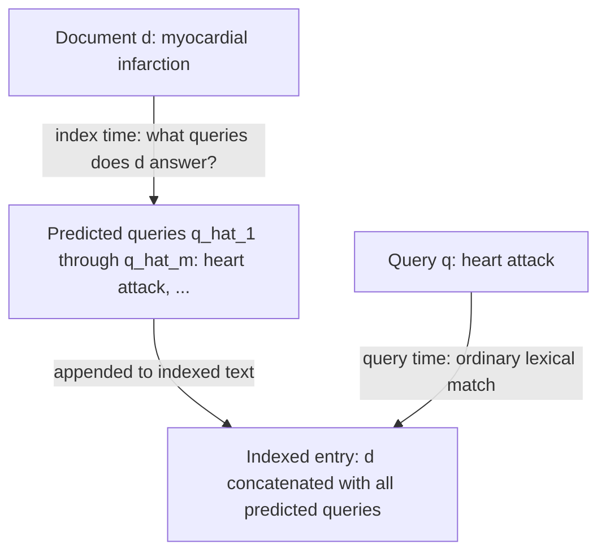
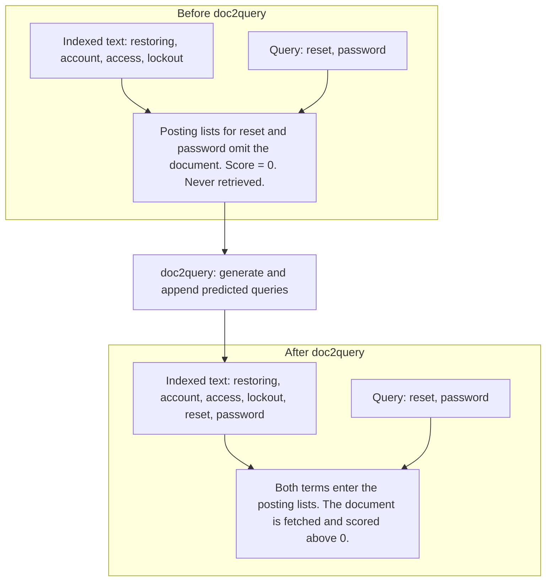
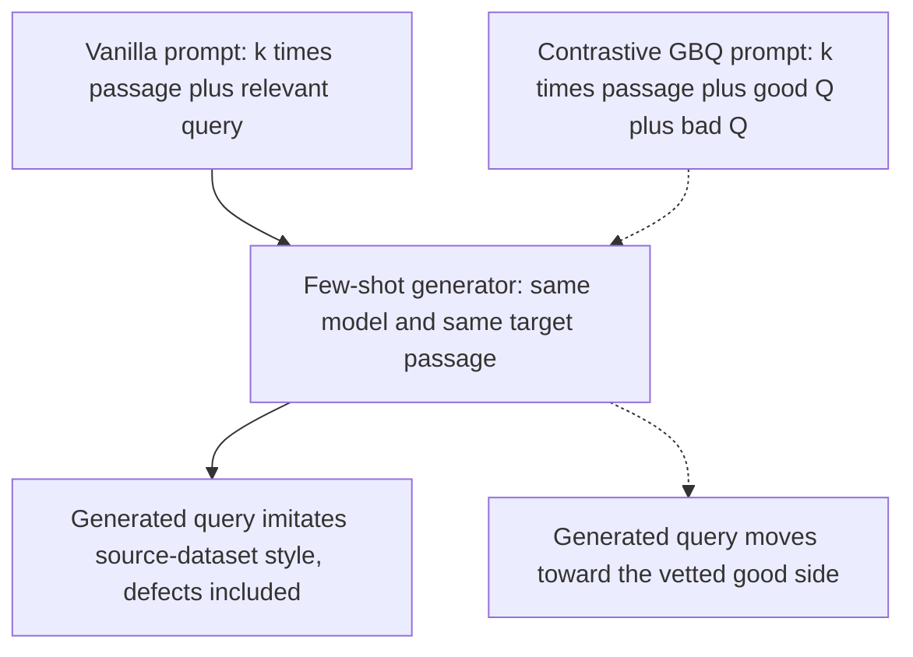
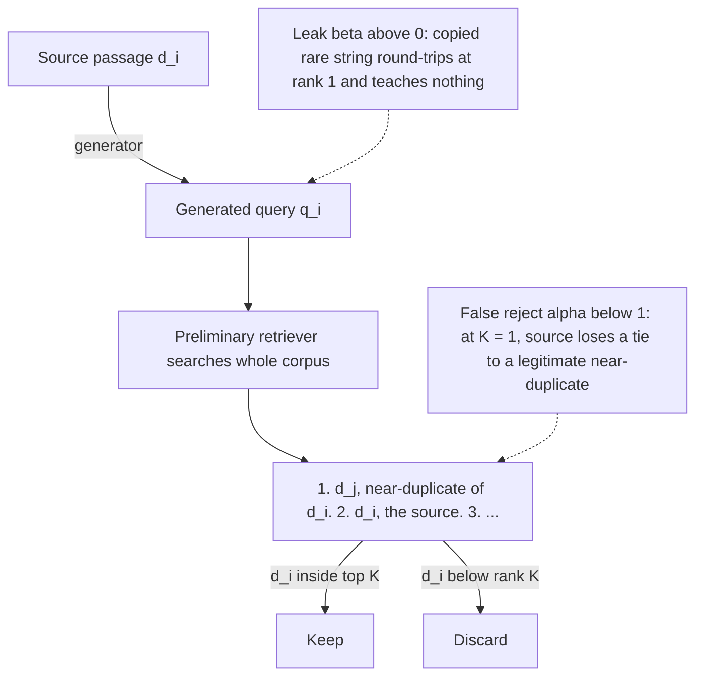
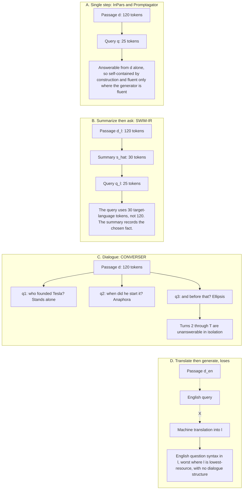
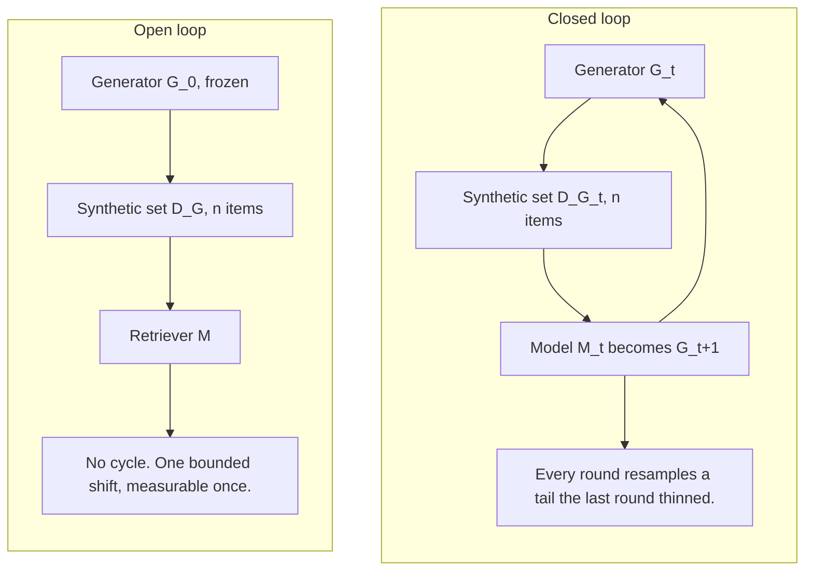

# Chapter 29: Bootstrapping Training Data

Purpose: explain how to manufacture useful retrieval supervision when query logs or expert labels are scarce, while preserving the task's relevance relation, filtering known failure modes, measuring distribution shift, and locating the teacher ceiling.

## TL;DR

- Invert retrieval at index time. Ask what queries each document can answer, then append those predicted queries so lexical retrieval can reach vocabulary the document never used.
- doc2query repairs a candidate-generation failure. It changes indexed text, not the BM25 ranking rule, and pays generation cost once rather than on every search.
- InPars shows that few-shot examples set the generator's quality ceiling. A good/bad question pair teaches discrimination better than a lone dataset query teaches imitation.
- Promptagator treats relevance as task-specific. Two to eight seed examples can steer synthetic generation toward entailment, exhaustive coverage, stance opposition, or another target relation.
- Consistency filtering makes a round trip from generated query back to source passage. It raises precision when sound pairs survive more often than broken pairs, but strict filtering can delete the hard positives the retriever needs.
- Multilingual and conversational bootstrapping must change the output type. SWIM-IR summarizes before asking, while CONVERSER generates a dialogue with anaphora and ellipsis.
- Synthetic data is a sampling procedure, not a validity category. Inspect coverage, cycles, prompt selection, calibration against real traffic, and label provenance. A student's asymptotic ceiling is set by repeatable teacher error, not by single-draw teacher accuracy. Filtering removes draw-to-draw noise. A genuinely different label source moves the ceiling.

## The story

Picture a library whose shelves are full but whose catalog is poor. A nurse asks for "heart attack," while the right clinical note says "myocardial infarction." The book exists. The catalog simply offers no route to it.

The first move is to let every book draft extra catalog cards for the questions it can answer. That is document-side inversion. doc2query turns those cards into searchable terms and files them once, before patrons arrive.

The library then hires an apprentice to write more cards for collections with no query logs. InPars teaches the apprentice with examples. A weak example makes the apprentice imitate vague wording. A good card beside a bad card teaches the apprentice to tell quality from plausibility.

The library also has rooms with different rules. The general search room wants topical answers. The fact-checking room wants entailment or contradiction. The debate room wants the strongest opposing argument. Promptagator gives the apprentice a few room-specific cards because one definition of relevance cannot govern every room.

An inspector then performs a round trip. The inspector reads a generated card and checks whether it returns to its source book. That is consistency filtering. The inspector can still approve a useless card that copies a unique clause number. The inspector can also reject a valuable card when a near-duplicate book wins a tie. The right policy therefore audits discarded cards and uses a small top-K window.

The foreign-language desk needs another workflow. SWIM-IR asks the apprentice to summarize a passage before writing its query. The conversation desk needs complete exchanges, not isolated cards. CONVERSER writes later turns such as "when did he start it?" so the training set contains context dependence.

Finally, the head librarian audits the apprentice. Gold labels are the ruler. Silver and bronze labels provide volume. Repeated samples reveal which mistakes vary and which mistakes recur. More apprentices from the same school can cancel noisy slips. Only a teacher with different blind spots can move a systematic ceiling.

## Decoder table

| Term or symbol | Meaning in this chapter | Interview use and boundary |
|---|---|---|
| q, d, score(q, d) | Query, document, and their relevance score | Retrieval accepts two arguments. Inversion fixes d instead of q, but it does not make facts reachable from model weights. |
| N, Q, c | N is corpus size or paired-evaluation size by context. Q is daily query volume in 29.1 and predicted queries per document in 29.2. c is one call cost. | Compare one-time N times c with cumulative Q times c. Check the overloaded meanings before using the symbols. |
| q_hat_i, m | Predicted query i and number of predicted queries in Figure 29.1 | m later denotes prompt count in the selection calculation. Context resolves the overload. |
| Inverse query generation | Fix a document and generate queries it could answer | It changes index reachability. It does not change the later retrieval direction. |
| Document-side inversion | Generate and append predicted queries before indexing | Pay once at index time and amortize over future searches. |
| Query-side reformulation | Rewrite each incoming query before retrieval | It adapts to a live query but pays a large language model (LLM) cost on every search. |
| Vocabulary mismatch | Searcher and document use different words for one concept | Ranker tuning cannot repair a term that the lexical index never stored. |
| BM25 | Lexical score using term frequency, inverse document frequency, and length normalization | A zero-overlap document never enters the candidate set. |
| t_i, tf(t, d), IDF(t) | Query term i, its frequency in d, and its inverse document frequency | A missing term has tf equal to zero. IDF cannot rescue it. |
| Document length, avgdl | Current document length and corpus mean document length | Appended queries change the length-normalization term as well as posting-list membership. |
| k1, b | BM25 saturation and length-normalization controls | Tuning them cannot repair a missing posting-list entry. |
| Inverted index | Map from each term to documents containing it | Candidate generation reads posting lists before BM25 scores documents. |
| Posting list | Documents indexed under one term | doc2query moves a document into lists a matching query will touch. |
| doc2query | Sequence-to-sequence generation of plausible queries from a passage | Append several sampled queries to indexed text. It needs supervised query-passage pairs for its generator. |
| docTTTTTquery | T5-based follow-up to doc2query | It yields more diverse queries and a larger lexical retrieval gain. The ranker itself stays unchanged. |
| Microsoft Machine Reading Comprehension (MS MARCO) | Source query-passage dataset used by doc2query and several baselines | Its relevant-query field can be useful as a label yet poor as a generation exemplar. |
| Pseudo-relevance feedback (PRF) | Expand a query from its first retrieval pass | It can help ambiguity after a useful first pass. Total mismatch gives it nothing to mine. |
| Top-k sampling | Sample among likely next tokens instead of taking one greedy completion | Several outputs cover more phrasing. They cost storage and generation compute. |
| Mean reciprocal rank at 10 (MRR@10) | Reciprocal-rank metric cut at rank 10 | The docTTTTTquery result moves from 0.184 to 0.277. It does not measure a new ranker. |
| InPars | Few-shot LLM generation of synthetic query-passage pairs | It needs no target-domain labeled query beyond the prompt seeds. Query quality inherits exemplar defects. |
| k in a few-shot prompt | Number of prompt exemplars | It is distinct from retrieval cutoff K. More exemplars increase prompt cost. |
| Vanilla InPars prompt | k passage and relevant-query examples | It teaches imitation. A relevant dataset query can still be a weak exemplar. |
| Good-bad question (GBQ) prompt | k passage, good-question, and bad-question triples | It teaches discrimination but needs a few curated good questions. |
| Contrastive prompting | Show positive and negative query forms before generation | It shapes outputs before training. It complements post-hoc filtering. |
| T, R_T(q, d) | Retrieval task and its binary relevance relation | T later denotes a label teacher. State which meaning applies. More data from the wrong relation entrenches the mismatch. |
| d+ and d- | Positive and negative documents in a contrastive triple | Their task-specific relation pulls one toward q and pushes the other away. |
| Benchmarking Information Retrieval (BEIR) | Benchmark containing structurally different retrieval tasks | Performance on one relation does not grant transfer to the others. |
| FEVER | Claim-verification task in Table 29.1 | Relevant evidence entails or contradicts. Topicality alone is insufficient. |
| DBpedia-Entity | Entity-retrieval task in Table 29.1 | Relevance demands exhaustive mentions, not one strong topical hit. |
| ArguAna | Counter-argument task in Table 29.1 | Relevance demands stance opposition. Shared stance can be a distractor. |
| Promptagator | Task-specific generation, filtering, and dual-encoder training | Two to eight seeds steer a full synthetic set. The seeds are not the final training set. |
| Preliminary retriever | Filter model trained on unfiltered synthetic pairs | Use it for one round trip. Do not continue it as the shipped model. |
| K | Retrieval window used by the consistency filter | K = 1 is strict. A small window rescues ties but admits more broken pairs. |
| Consistency filtering | Keep a pair when its source passage returns within top K | It tests retrievability, not answerability. |
| pi, alpha, beta | Sound-pair rate, sound keep rate, and broken keep rate | Precision rises exactly when alpha exceeds beta for pi below one. |
| r, pi prime | Retention and retained precision in 29.5 | r is also the relevance variable in P* in 29.7. Budget generation at N divided by retention r. |
| Hard positive | Correct source that a weak retriever finds difficult | Strict filtering can erase exactly this useful signal. |
| Near-duplicate collision | Another similar passage outranks the source | Audit discards and use a small top-K window when duplicates remain. |
| InPars+ | Generator tuning with reward and chain-of-thought prompting | It raises source quality but does not remove the need to filter. |
| l, d_l, q_l | Target language, passage in that language, and query in that language | Low-resource reading and natural query writing can fail at different rates. |
| s, s_hat | Possible summary and selected summary | s later counts teacher draws. SWIM-IR makes fact selection inspectable before query generation. |
| SWIM-IR | Multilingual summarize-then-ask generation | It shortens low-resource conditioning text but adds output tokens. |
| H_t, q_t, a_t | Dialogue history, current query, and current or earlier answers | Conversation retrieval must use history because later turns can be incomplete alone. |
| CONVERSER | Generate a whole multi-turn dialogue over a passage | It creates anaphora and ellipsis that single-query generation cannot produce. |
| Translationese | Target-language text retaining English syntax and choices | Translate-then-generate is weakest where language resources are weakest. |
| P*, P_G | Production joint distribution and generator-induced distribution | Neither human nor synthetic data equals production traffic. Measure their shift. |
| n, p | n is query-term count in BM25 or sample count in coverage. p is passage in P* or true intent mass in coverage. | Coverage is 1 minus (1 minus p) to the n. State the local overload before calculating. |
| Open loop, G_0, D_G, M | Frozen generator, one synthetic set, and trained retriever | The topology causes one bounded shift. The shift can still be biased. |
| Closed loop, G_t, D_G_t, M_t | Generator, synthetic set, and model at round t | When M_t becomes the next generator, each round can thin the prior tail. |
| p01, p10 | Paired cases won by only one of two systems | Their sum is the discordance rate used in paired-gap uncertainty. |
| sigma_D | Standard error of a paired performance gap | It equals the square root of discordance divided by N under the source setup. |
| m, delta, z | Prompt count, target effect, and normal quantile | m controls selection inflation. Delta and z values size a powered evaluation. |
| Selection inflation | Best result chosen across generated evaluation prompts | Report prompt count. Retry noise can explain a large headline gain. |
| Calibration anchor | Small real set used to measure generator shift | Reserve it from training. A tiny anchor cannot decide a small system gap. |
| Gold label | Domain-expert adjudicated ground truth | Use it as the ruler for audits and calibration. It remains expensive. |
| Silver label | Non-expert human or strong-model label | Use it for bulk training after filtering. One model's errors can repeat. |
| Bronze label | Weak-model or in-family model label | Use it only with an out-of-family cross-check. |
| l star, l_T | True label and one label drawn from teacher T | Repeated teacher labels reveal varying and repeatable errors. |
| a_T, a_M | Teacher and student accuracy | The student can beat one-draw teacher accuracy only through removable noise. |
| y_hat, y | Student's conditional-mode prediction and a candidate label | With enough data and capacity, y_hat follows the teacher distribution's mode. |
| s draws, S | Number of teacher draws and inputs whose plurality label is wrong | More same-teacher draws do not repair S. |
| epsilon_sys | Repeatable error where the teacher's plurality label is wrong | It fixes the asymptotic student ceiling. |
| epsilon_noise | Wrong labels that vary across draws | Redundancy can cancel it without changing blind spots. |
| rho | Systematic blind-spot overlap across teacher families | Measure it before buying a second teacher. Same-lineage teachers can leave it near one. |
| Execution-based label | Label obtained by running and verifying behavior | It replaces a judge ceiling with verifier error plus generator variance. |

## Core mechanics

### 29.1 Inverting the relation: what queries does this document answer?

#### What

Ordinary retrieval fixes query q and searches for document d that maximizes score(q, d). Inversion fixes d and asks which queries would score highly against it.
A sequence-to-sequence model reads a passage, generates plausible queries, and appends them to the document's indexed text. The original passage does not change. Its lexical reachability changes.
The clinical example maps document text "myocardial infarction" to predicted query "heart attack." The document-to-query pass runs once before search. The ordinary query-to-document match runs on every later search.

#### Why

BM25 gives an absent term exactly zero contribution. If every query term is absent, tuning k1 or b cannot recover the document.
Document-side work uses the full passage to anticipate future search vocabulary. It also amortizes one offline generation call over every later query.
The source compares this move to an experienced librarian who imagines the book that would answer a vague question, then searches with the book's likely index terms.

#### Failure without it

Query-side PRF needs an initial retrieval pass. It has nothing to expand when total mismatch returns no useful candidate. Query reformulation also pays forever.
Do not confuse index reachability with generation-time reachability from model weights. If the document appears in top K but the generator ignores it, re-indexing is the wrong fix.
Inversion also adds nothing to an already symmetric shared-embedding dual encoder.

#### Cost and complexity

Let N = 10,000,000 documents, Q = 2,000,000 queries per day, and c = $0.0001 per LLM call.
Query-side reformulation costs Q times c = $200 per day and $6,000 after 30 days.
Document-side inversion costs N times c = $1,000 once.
The break-even condition is cumulative query count equal to N.
At 2,000,000 queries per day, break-even arrives after 5 days.
Re-index only documents that change.
Choose more predicted queries for jargon-heavy legal, clinical, or internal documents.
Choose fewer for plain, query-like documents.
Use expansion beside a dense retriever by default.
For continuously changing corpora, index literal text immediately and reconsider whether expansion will repay before staleness.
The source's sanity check says production search systems, including Google's synonym and related-term expansion, precompute query-adjacent work where possible and reserve query-time work for residuals such as spelling and session context.

### 29.2 doc2query and vocabulary mismatch

#### What

BM25 scores query terms against a document as follows.

$$
\operatorname{score}(d,q)=\sum_{i=1}^{n}\operatorname{IDF}(t_i)\cdot\frac{\operatorname{tf}(t_i,d)(k_1+1)}{\operatorname{tf}(t_i,d)+k_1\left(1-b+b\frac{|d|}{\operatorname{avgdl}}\right)}
$$

Here tf is raw term count, document length is |d|, avgdl is mean corpus length, and k1 and b control saturation and length normalization.
doc2query trains on query-passage pairs, originally from Microsoft Machine Reading Comprehension (MS MARCO), to predict queries a passage could answer.
At index build time, it samples several predicted queries per passage and appends their text.
docTTTTTquery replaces the generator with T5, which yields more diverse predicted queries and a larger gain.

#### Why

An inverted index fetches posting lists before BM25 scores anything.
A zero-overlap document is not ranked low.
It is never fetched.
Adding "reset" and "password" to an article titled "Restoring Account Access After a Lockout" moves that article into both posting lists.
The mechanism needs token co-occurrence, not semantic understanding.
Furnas, Landauer, Gomez, and Dumais found only about 10% to 20% agreement when two people independently chose one keyword for the same familiar concept.
A short synonym list cannot cover that combinatorial mismatch.

#### Failure without it

PRF loses here for three reasons.
First, it inherits a zero-candidate first pass.
Second, it guesses from a three-word or four-word query rather than a full passage.
Third, it adds a second retrieval and reranking pass to every search.
A purely dense system may gain less from lexical expansion.
Generated terms also go stale when product names or slang change.

#### Cost and complexity

Before expansion, use N = 10,000 articles, avgdl = 150, df(reset) = 500, df(password) = 300, and document length 120.
Both query term frequencies are zero, so the score is zero.
After adding predicted queries such as "how do I reset my password" and "steps to reset a forgotten password," document length becomes 128 and each target term frequency becomes 1.
Use k1 = 1.2 and b = 0.75.

$$
\operatorname{IDF}(\text{reset})=\ln\left(1+\frac{10{,}000-500+0.5}{500+0.5}\right)\approx2.99
$$

$$
\operatorname{IDF}(\text{password})=\ln\left(1+\frac{10{,}000-300+0.5}{300+0.5}\right)\approx3.50
$$

The length term is 1 - 0.75 + 0.75 times 128 divided by 150, which is about 0.89.
The per-term multiplier is 2.2 divided by 1 + 1.2 times 0.89, which is about 1.06.
The resulting score is about (2.99 + 3.50) times 1.06, or 6.9.
Top-k sampling of 10 queries with 12 tokens each for 10,000 articles generates 1.2 million tokens once.
On MS MARCO passage retrieval, docTTTTTquery moved BM25 mean reciprocal rank at 10 (MRR@10) from 0.184 to 0.277.
That is roughly a 50% relative gain without changing the ranking function.
For near-real-time ingestion, index literal text immediately and backfill expansion later.

### 29.3 InPars: contrasting good and bad generated queries

#### What

InPars uses k few-shot passage-query examples to prompt GPT-3 for a query about each unlabeled target passage.
It then trains a dense retriever on the generated query-passage pairs.
The vanilla prompt shows k pairs of passage and "relevant query."
The GBQ prompt shows k triples of passage, good question, and bad question.
The human-written question is the good example.
The MS MARCO "relevant query" used as vanilla's positive becomes GBQ's bad example.

#### Why

Real search-engine queries can be short, underspecified, and click-driven while remaining relevant under dataset labels.
A lone positive teaches the generator to imitate those surface statistics.
A good/bad pair supplies an implicit decision boundary.
The idea mirrors hard-negative training.
A positive teaches attraction.
A positive-negative contrast teaches discrimination.

#### Failure without it

A larger generator does not repair a mediocre exemplar.
It can reproduce the same defect more fluently and at greater scale.
Synthetic pairs may look plausible while the retriever learns a poor relevance signal.
Do not call the pipeline label-free.
It still needs a few examples.
The useful economy is a fixed handful of curated examples rather than a labeled target dataset. If even that is unavailable, use keyword or noun-phrase extraction as the bad exemplar rather than dropping contrast.

#### Cost and complexity

Use 50,000 documents, k = 3, 100-token passages, and 12-token queries.
The vanilla prompt has 3 times 112 + 100 = 436 input tokens and a 12-token completion, or 448 tokens per call.
The GBQ prompt has 3 times 124 + 100 = 472 input tokens and a 12-token completion, or 484 tokens per call.
At an illustrative $0.02 per 1,000 tokens, vanilla costs about $448.
GBQ costs about $484.
The contrastive design adds about 8% and roughly $36 for the whole corpus.
The fixed human cost is two or three good questions, while the general few-shot budget is 2 to 8 examples.
The reported InPars retriever beat BM25 and several self-supervised dense baselines with no human-labeled query in the target domain.
Use prompt contrast and post-hoc consistency filtering together.
If rate limits bind, shorten exemplar passages before removing the contrast.

### 29.4 Promptagator: retrieval tasks are not one task

#### What

Each task T defines a binary relevance relation.

$$
R_T(q,d)\in\{0,1\}
$$

A contrastive retriever observes triples of query, positive document, and negative document sampled from that relation.
Promptagator starts with 2 to 8 hand-written examples of the target relation.
It few-shot-prompts an LLM to generate task-matched queries for documents in the unlabeled target corpus.
It trains a preliminary retriever on all generated pairs.
It keeps only pairs whose generated query retrieves its source passage.
It trains the shipped dual encoder from scratch on the survivors.

#### Why

Web search usually rewards topical overlap.
FEVER-style verification needs entailment or contradiction.
DBpedia-Entity needs exhaustive entity coverage.
ArguAna needs stance opposition.
A passage can share every content word with a claim and still have the wrong stance.
More web-search data cannot teach a relation its loss never demonstrates.

#### Failure without it

One shared checkpoint can average incompatible objectives without solving any one of them.
Fine-tuning on a new corpus changes topic exposure but does not teach stance opposition.
The quiet verification failure is ranking a topically close same-stance passage above the needed evidence.
Write the target relation in one sentence before generating data.
Use separate retrievers for structurally different task families unless budget forces sharing.
For stance and entailment, inspect the top five results for about a dozen claims by hand.

#### Cost and complexity

Use N = 100,000 passages and six seed claims with supporting or refuting evidence.
Generate four candidate claims per passage.
Each call uses about 720 seed tokens, 200 passage tokens, and 80 instruction tokens, or 1,000 input tokens.
Four candidates per passage produce 400,000 calls, 400 million input tokens, and 8 million output tokens at 20 output tokens per claim.
At $0.25 per million input tokens and $1.00 per million output tokens, generation costs $100 + $8 = $108.
Filtering leaves a task-matched set on the order of 100,000 pairs.
A comparable 500,000-query human set at $1 per judgment costs $500,000.
That is roughly 4,630 times the $108 generation bill.
Six seeds versus 500,000 labels is about an 83,000-fold reduction in hand-labeling volume.
Promptagator used as few as eight real examples per task and beat ColBERTv2 and SPLADEv2 trained on roughly 500,000 MS MARCO queries across all eleven Benchmarking Information Retrieval (BEIR) tasks.
The claim is task-matched supervision, not that eight pairs directly train the final retriever.

### 29.5 Consistency filtering

#### What

Run this algorithm in order.

1. Generate synthetic query-passage pairs over the target corpus.
2. Train a preliminary retriever on the unfiltered set.
3. Search the whole corpus with every generated query.
4. Keep a pair only when its source passage appears in top K.
5. Train the shipped dual encoder from scratch on the survivors.

Let pi be the sound-pair fraction.
Let alpha be the probability of keeping a sound pair.
Let beta be the probability of keeping a broken pair.
The retained fraction r and retained precision pi prime are as follows.

$$
r=\pi\alpha+(1-\pi)\beta
$$

$$
\pi'=\frac{\pi\alpha}{\pi\alpha+(1-\pi)\beta}
$$

For any pi below 1, retained precision exceeds pi exactly when alpha exceeds beta.

#### Why

Wrong positives drive contrastive gradients in the wrong direction.
The round trip checks whether a generated query can recover its source without labeling every pair.
A small top-K window rescues a correct source that loses rank 1 to a near-duplicate.
The source traces this idea to round-trip consistency for synthetic question answering, then applies its retrieval form in Promptagator.

#### Failure without it

The filter has two opposite errors.
Beta stays above zero when a generated query copies a rare string and round-trips at rank 1 without teaching meaning.
The legal example is "what does clause 14(b)(iii) of the 2019 amendment provide?"
Alpha falls below one when a near-duplicate outranks the source.
That rejected pair can be the hardest and most useful positive.
The filter measures whether the current retriever finds a pair easy, not whether the query is good.
Do not iterate keep, retrain, and re-filter with the same lineage.
Each round selects what the checkpoint already likes and shrinks corpus coverage.
Train the final encoder from scratch so it does not inherit the preliminary filter's boundary.
Generating three times more data does not dilute wrong positives because it also triples them.
InPars+ instead raises source quality through a reward signal and chain-of-thought prompting, while still retaining a filter.

#### Cost and complexity

Use 500,000 passages and a 500-pair audit with 350 sound pairs and 150 broken pairs.
This gives pi = 0.70.
With K = 1, alpha = 273 divided by 350 = 0.78 and beta = 27 divided by 150 = 0.18.
Then r = 0.70 times 0.78 + 0.30 times 0.18 = 0.546 + 0.054 = 0.600.
Retained precision is 0.546 divided by 0.600 = 0.91.
The filter keeps 300,000 pairs and discards 200,000.
The discard pile contains 123,000 broken pairs and 77,000 sound pairs.
With K = 10, alpha = 0.94 and beta = 0.42.
Then r = 0.658 + 0.126 = 0.784.
The filter keeps 392,000 pairs at 84% precision.
Its sound reject rate is 0.06, so it discards 21,000 sound pairs and keeps 63,000 broken pairs, compared with 27,000 broken pairs at K = 1.
Relative to K = 1, it recovers 56,000 sound pairs and admits 36,000 additional broken pairs.
That is 1.56 sound pairs bought per broken pair.
If 68 of 100 audited K = 1 false rejects lost to a near-duplicate, the recovered subset contains about 0.68 times 56,000, or 38,000 hard positives.
The source default is K from 5 to 10.
Use K = 1 only after corpus deduplication.
Audit 100 rejected pairs as broken, near-duplicate collision, or fine but unlucky.
Treat r below roughly 0.5 as an upstream warning unless the corpus is highly repetitive.
Generation uses 500 million input tokens and 10 million output tokens, or $125 + $10 = $135 at the stated rates.
Passage encoding takes 1,250 seconds at 400 passages per second.
Query encoding takes 250 seconds at 2,000 queries per second.
One preliminary epoch takes 1,302 seconds for 3,906 batches of 128 at 3 steps per second.
Those 3,906 full batches cover 499,968 examples, so the source's one-epoch line implicitly drops or omits a final 32-example partial batch.
Five hundred thousand hierarchical navigable small world (HNSW) searches at 1 millisecond take 500 seconds.
Total filter work is 3,302 seconds and about $2.30 at $2.50 per graphics processing unit (GPU)-hour.
The worked cost line calls this 1.7% of generation cost.
The source takeaway rounds it to about 1.5%.
At r = 0.600, usable-pair price rises from $0.00027 to $0.00045.
Generate N divided by r pairs and expect 1.67 times the naive price.

### 29.6 Multilingual and conversational extensions

#### What

For target language l, let d_l be a passage and q_l be a query.
SWIM-IR factorizes query generation through summary s.

$$
P(q_l\mid d_l)=\sum_s P(q_l\mid s)P(s\mid d_l)\approx P(q_l\mid \hat{s}),\qquad \hat{s}=\arg\max_s P(s\mid d_l)
$$

The implementation is "summarize then ask."
A roughly 120-token passage becomes a roughly 30-token summary before producing a roughly 25-token query.
SWIM-IR used this design across 33 languages and trained retrievers competitive with human-supervised multilingual models.
For dialogue, session history at turn t is as follows.

$$
H_t=(q_1,a_1,\ldots,q_{t-1},a_{t-1})
$$

The conversational retriever must score history, current query, and document together.
CONVERSER generates a full dialogue so later turns contain anaphora and ellipsis.
It reports matching retrievers trained on real dialogues from roughly six example dialogues.

#### Why

Low-resource reading can be stronger than low-resource query writing.
A summary separates fact selection from query phrasing and makes the selected fact inspectable.
The query is written from one quarter as much target-language text.
Single-step passage-to-query generation creates self-contained queries by construction.
It therefore assigns zero training mass to turns such as "when did he start the company?" and "and before that?"
Dialogue generation changes the output type so context dependence exists at all.

#### Failure without it

Direct low-resource generation can copy an opening clause, drift into English, or emit a grammatical query no speaker would type.
Translate-then-generate produces target-language strings with English syntax and lexical choices.
It is weakest where target-language data is scarcest.
It also cannot create dialogue structure from a self-contained English query.
Consistency filtering is least reliable in the language where its preliminary retriever is weakest.
Loosen the threshold and report retention per language when no parallel English source exists.

#### Cost and complexity

Use 12 languages, 200,000 passages per language, 120 tokens per passage, $1 per million input tokens, and $5 per million output tokens.
The 8-shot prompt uses 8 times (120 + 15) = 1,080 exemplar tokens.
Human queries at $0.30 each cost $150,000 per language for 500,000 queries and $1.8 million for 12 languages. For four or five languages, annotator supply can bind before price.
Single-step generation uses 1,200 input tokens and 25 output tokens per call.
Per language, that is 240 million input tokens for $240 and 5 million output tokens for $25, or $265.
Summarize-then-ask keeps input fixed and emits 55 output tokens, or 11 million output tokens per language.
It costs $295 per language.
The ratio 295 divided by 265 is 1.11, or an 11% premium.
Twelve languages cost $3,540, which is 508 times less than $1.8 million under the source's assumptions.
A four-turn dialogue emits about 4 times (25 + 30) = 220 output tokens.
That is nearly 9 times the single-step output per passage.
It yields four training queries, so the per-query output is 55 tokens, a 2.2 times multiplier.
Three of those four queries are context-dependent.
At r = 0.4, obtaining 100,000 filtered pairs requires 250,000 generations.
The seed-volume comparison is 500,000 real queries divided by 8 seeds = 62,500.
That ratio counts human effort, while the 508 ratio prices replacement inference.
Buy 6 to 8 seeds from speakers rather than translating English seeds. If no speaker is reachable, mark the language unvalidated rather than merging it silently into the same index.
Track the fraction of queries that are unanswerable in isolation.
For a multi-turn surface, the source default is at least half.
Pin and version the generator model.
If one index must serve both surfaces, a single-turn retriever plus query rewriter is an alternative that adds one serial LLM call per query.
With 2,000 reviewed items across 12 languages, spend 8 per language as seeds, or 96 total.
Use the remaining 1,904 as roughly 159 test queries per language.
At n = 159, a proportion has standard error at most 0.5 divided by the square root of 159, or 4.0 percentage points.
Two standard errors can resolve an 8-point gap but not a 2-point gap.

### 29.7 Synthetic data: the right question is how, not whether

#### What

Let P* be the production joint distribution over query, passage, and relevance.
Let P_G be the generator distribution conditioned on corpus and prompt.
Human labels and synthetic labels both sample approximations to P*.
The opening design-review example trains on 118,000 synthetic pairs and reports a 4.1-point recall@5 gain on a synthetic evaluation, while only 500 real tickets from three enterprise customers exist.
Analyze three risks.
The first is finite-sample coverage.
An intent with true mass p appears at least once in n draws with this probability.

$$
1-(1-p)^n\approx1-e^{-np}
$$

The second risk is self-consumption through a closed loop.
The third risk is selection after trying multiple prompts.

#### Why

At n = 100,000, mass 0.00001 appears with probability 0.63.
Mass 0.000001 appears with probability 0.095.
Mass 0.0001 appears with probability 0.99995.
The coverage floor is near 1 divided by n.
A 500-query human set has a floor of 0.002, which is 200 times coarser than 0.00001.
Figure 29.6 calls this a two-decade shift. The source's stated 200-fold ratio corresponds to about 2.30 decades, so the caption is approximate.
Synthesis is the lever that lowers that floor.
Model collapse requires a cycle.
A frozen generator feeding a retriever once is an open loop with one bounded shift.
If model M_t becomes generator G at t + 1, every round resamples a tail thinned by the prior round.
Early collapse loses tails.
Late collapse converges toward a low-variance distribution unlike the original.

#### Failure without it

A blanket synthetic-data ban does not detect loops, selection, or finite-sample underpower.
Human data can also participate in a feedback loop.
Consistency filtering is safe only as one bounded keep-drop pass.
Iterating it converges toward pairs the retriever already liked.
Never let the evaluated model generate or filter its own evaluation set.
Fix the generation prompt before reading results and report how many prompts were tried.
If prompt iteration is necessary, tune on one corpus split and generate the reported set from another.

#### Cost and complexity

For a paired evaluation, let p01 + p10 be the fraction where exactly one of two systems succeeds.
The standard error of their paired gap is as follows.

$$
\sigma_D=\sqrt{\frac{p_{01}+p_{10}}{N}}
$$

At N = 500 and discordance 0.20, sigma_D = 0.020.
The expected maximum of 8 independent standard normals is 1.42.
The stated upper bound is the square root of (2 times the natural log of 8), or 2.04.
Best-of-eight selection therefore adds an expected 1.42 times 0.020 = 0.028, or 2.8 points.
In the semantic-chunking example, 500 synthetic queries and eight prompts produce a reported +4.1 points.
After expected selection inflation, 1.3 points remain against a 2.0-point standard error.
One fixed prompt reports +1.5 plus or minus 2.0 points.
That result is honest and uninformative.
To resolve delta = 0.015 at 95% confidence and 80% power, use this lower bound.

$$
N\geq\frac{(z_{0.975}+z_{0.80})^2(p_{01}+p_{10})}{\delta^2}
=\frac{(1.96+0.84)^2\cdot0.20}{(0.015)^2}
=\frac{1.568}{2.25\times10^{-4}}
=6{,}969
$$

Use roughly 7,000 queries.
Each generated query uses about 800 input tokens and 25 output tokens.
At $3 and $15 per million tokens, each query costs $0.002775 and the set costs $19.43.
At $1.50 per human judgment, equivalent power costs $10,500.
The ratio is 540.
Use 120 real queries as a calibration anchor rather than as the decision set.
Mean query-to-gold-passage term Jaccard overlap is 0.38 for generated queries and 0.11 for real tickets.
With per-query standard deviation 0.12, 120 real queries pin the mean to plus or minus 0.011.
The generator copies source vocabulary and under-samples the vocabulary-mismatch cases that chunk boundaries affect.
The source reports that semantic chunking's apparent advantage largely disappears on real corpora because synthetic benchmarks are more topic-diverse while real documents are topically contiguous.
Above roughly 5,000 real labels, the real set can carry the decision and synthetic data can become a stress case.
Three hundred real queries have a floor near 0.003 and cannot resolve effects under about 6 points in the source's staff scenario.

### 29.8 Gold, silver, bronze: label provenance and the teacher ceiling

#### What

Let l* of x be the true label and l_T of x be a draw from teacher T.
Teacher accuracy is the probability that those labels match.

$$
a_T=\Pr[l_T(x)=l^*(x)]
$$

Draw s labels per input by changing temperature or paraphrasing the prompt.
Let S contain inputs where the correct label is not the plurality across draws.
Split teacher error into repeatable systematic error and varying noise.

$$
1-a_T=\Pr[x\in S]+\Pr[l_T(x)\neq l^*(x),x\notin S]
=\epsilon_{\mathrm{sys}}+\epsilon_{\mathrm{noise}}
$$

With enough data and capacity, a student trained under a proper loss converges to the teacher label distribution's conditional mode.

$$
\hat{y}(x)=\arg\max_y\Pr[l_T(x)=y]
$$

Its limit is as follows.

$$
a_M\longrightarrow1-\epsilon_{\mathrm{sys}}=a_T+\epsilon_{\mathrm{noise}}
$$

#### Why

The student can average away draw-to-draw noise.
It faithfully learns repeatable teacher mistakes.
The folk claim that a student cannot beat its teacher misses exactly epsilon_noise.
Burns et al. fine-tuned GPT-4 on GPT-2-level supervision and, with an auxiliary confidence loss, recovered roughly 80% of the gap between weak-supervisor training and gold-label fine-tuning on natural language processing tasks.
Non-expert humans often err differently across people.
Repeated samples from one model often reproduce the same misreading.
Redundancy pays according to independence, not headcount.

#### Failure without it

Scaling the student cannot move a fixed teacher mode.
A plateau across 110 million, 340 million, and 1.3 billion parameters, with gains of 0.4 points and then zero, indicates a label ceiling.
Generating, filtering, and consuming labels within one model family can increase systematic error over rounds.
Do not assume a larger same-lineage teacher has different blind spots.
Change teacher family before teacher size when the goal is decorrelation.
When the domain is unseen by every available family, expert gold is the only source with a different blind spot.

#### Cost and complexity

If two teacher families' blind spots overlap on fraction rho, surviving systematic error is rho times epsilon_sys.
The ceiling rises by (1 - rho) times epsilon_sys.
Execution is a second lever.
Adaptive retrieval-augmented generation (Adaptive-RAG) runs three pipelines and keeps the cheapest whose answer exact-matches a gold answer. Reinforcement learning with verifiable rewards makes the same execution-based move at policy level.
That replaces label judgment with measurement.
The ceiling then reflects verifier error plus generator variance.
In the worked audit, one teacher produces 62% correct pairs.
Across three draws at temperature 0.8, 22 of 100 are wrong in all three and 16 are wrong in one or two.
Thus epsilon_sys = 0.22, epsilon_noise = 0.16, and the student ceiling is 78%.
Three draws plus filtering discard 5 of 22 systematic cases and 9 of 78 sound cases.
Of 69 sound retained passages, 2 keep a noise-corrupted draw.
The retained set has 86 pairs and 67 correct, or 78%, leaving 172,000 pairs from a 200,000-passage corpus.
A second teacher family with rho = 0.4 moves the ceiling to 1 - 0.4 times 0.22 = 91%.
It catches both noise cases and all but rho of the 17 remaining systematic cases, leaving 6.8 errors.
Retention falls from 86 to 73.8 points, or about 148,000 pairs.
Accuracy is 67 divided by 73.8 = 91%, assuming the second family rarely rejects correct pairs.
That assumption is the next audit target.
Three draws over 200,000 passages require 600,000 calls.
Each uses 400 input tokens and 30 output tokens, for 240 million input and 18 million output tokens.
At $0.25 and $1.25 per million tokens, one teacher pass costs $60 + $22.50 = $82.50.
The second family costs another $82.50 and moves the ceiling 13 points.
Hand-labeling 200,000 pairs at two minutes each takes 6,667 hours and about $400,000 at $60 per hour.
That is about 4,800 times one teacher pass.
A 2,000-pair expert audit takes 67 hours and costs $4,000.
At accuracy near 0.8, its standard error is as follows.

$$
\sqrt{\frac{p(1-p)}{n}}=\sqrt{\frac{0.16}{2{,}000}}=0.0089
$$

The corresponding 95% interval is plus or minus 1.8 points.
Spend gold on measurement.
Prefer labels produced by execution when the task has an exact answer, unit test, or source-passage retrieval check.
Re-audit labels when two consecutive model-size increases yield less than one point.
Never let one family generate, filter, and consume the same labels without a cross-family audit.
The source cites Promptagator as Dai et al. (2022) in section 29.4 and as Dai et al. (2023) in section 29.8. Preserve that year mismatch as a source inconsistency.

## Diagrams

### Figure 29.1


Figure 29.1: The inversion (top two arrows) runs once per document, before the corpus is ever searched, so the ordinary query-time retrieval step (bottom arrow) can later succeed on vocabulary the original document never contained.

### Figure 29.2



Figure 29.2: doc2query appends model-predicted query terms to a document's indexed text at build time, moving the document into the posting lists that a matching query will actually touch.

### Figure 29.3



Same generator and same target passage. The exemplar shape changes the output distribution.
Figure 29.3: The prompt's exemplars set an implicit quality ceiling: a single positive example teaches imitation, a good/bad pair teaches discrimination.

### Table 29.1

| Task | Query looks like | Relevant document is | Dominant signal |
|---|---|---|---|
| MS MARCO | "salary of a surgeon per year" | a passage answering it directly | topical overlap |
| FEVER | "Christina Aguilera's profession is a musician" | a passage that entails or contradicts the claim | entailment / contradiction |
| DBpedia-Entity | an entity name | any passage mentioning it, exhaustively | exhaustive coverage |
| ArguAna | an argument for a position | the best argument against that position | stance opposition |

Table 29.1: Four BEIR retrieval tasks define "relevant" on four structurally different relations. A retriever trained to approximate one does not automatically approximate the others.

### Figure 29.4



A window of K = 10 keeps the illustrated hard positive.
Figure 29.4: The round trip verifies that a retriever can recover the source passage from the generated query, so its two errors are a degenerate query that round-trips anyway and a hard positive that loses a tie to a near-duplicate.

### Figure 29.5



Figure 29.5: Both extensions change the generator's output type rather than its prompt wording: SWIM-IR inserts a summary so the query is written from a quarter as much low-resource text, and CONVERSER emits a dialogue so that context-dependent turns exist in the training set at all.

### Figure 29.6



Panel (b), n = 100,000 draws:

| True intent mass p | Probability intent appears | Figure annotation |
|---:|---:|---|
| 0.0000001 | near 0 | deleted by the finite draw |
| 0.000001 | 0.095 | below the coverage floor |
| 0.00001 | 0.63 | p = 1 divided by n |
| 0.0001 | 0.99995 | nearly certain to appear |
| 0.001 | near 1 | plateau |

Figure 29.6: Whether a synthetic set is safe is a question about topology and sample size, not about provenance. In (a) the same generator is benign on the left and divergent on the right, because only the cycle lets one round's truncation feed the next. In (b) a draw of n = 10^5 items puts a hard floor under what any set can contain: an intent carrying mass 10^-5 appears with probability 0.63, one at 10^-6 with probability 0.095, and after fitting, whatever failed to appear has no support at all. A 500-item human set has the same curve shifted two decades right.

### Table 29.2

| Tier | Produced by | Error structure | What it is for |
|---|---|---|---|
| Gold | adjudicated domain experts | residual ambiguity in the task definition | measurement: the audit set that locates your ceiling |
| Silver | non-expert humans, or a strong model | idiosyncratic across people, repeatable within one model | bulk training, after filtering |
| Bronze | a weak model, or one in the student's family | repeatable, so it survives sampling and majority vote | bulk training only with an out-of-family cross-check |

Table 29.2: The tier tells you the error structure, and the error structure tells you whether redundancy is worth buying.

### Figure 29.7

```text
ceiling 1 - ϵsys
                                      |
one teacher, one draw per passage     | correct 62 | noise 16 | systematic 22 |
                                      |------------ ceiling -----------------|
plus three draws, consistency filter  | correct 78            | systematic 22 |
                                      |------------ ceiling -----------------|
only a new label source moves this                         ---> new ceiling
plus a second teacher family          | correct 91                         | systematic 9 |
Legend: correct | noise = wrong differently on each draw | systematic = wrong the same way on every draw
```

Figure 29.7: Filtering converts the teacher's draw-to-draw noise into accuracy and then stops dead at 1 - ϵsys. Only a label source with different blind spots moves the ceiling itself. Figures are percentages of the retained set in the worked example.

## Whiteboard pack

### What to draw

1. Draw a document box labeled "myocardial infarction."
2. Draw an offline arrow to generated query "heart attack," then append it to an indexed-entry box.
3. Draw a normal query-time arrow from "heart attack" back to that entry.
4. Add two prompt boxes, vanilla and good/bad, feeding one generator.
5. Add a task-relation gate before Promptagator generation.
6. Draw the consistency round trip through a preliminary retriever, with keep and discard branches at top K.
7. Add a summary branch for multilingual data and a dialogue branch for conversational data.
8. Finish with gold, silver, and bronze bars. Mark the 78% systematic ceiling and show a second teacher moving it to 91%.

### Spoken script

Start with a document that says myocardial infarction and a query that says heart attack. I generate likely queries offline and append them to the index, which fixes lexical reachability. When no labels exist, InPars uses good and bad exemplars, while Promptagator adds task-specific seeds because relevance differs across search, verification, and counter-argument retrieval. I round-trip each synthetic query through a preliminary retriever, keep sources found in top K, and train the final model from scratch. For multilingual data I summarize first. For conversation I generate dialogues. Finally, I audit gold labels to separate removable noise from systematic teacher error.

## Interview traps

### 1. Why generate queries from documents instead of rewriting incoming queries?

Inverse query generation appends predicted terms once, which moves a zero-overlap document into posting lists that BM25 can score. For 10 million documents, 2 million daily queries, and a $0.0001 call, offline expansion costs $1,000 and breaks even with $200-per-day rewriting after 5 days. Query-time rewriting wins when the corpus changes faster than it is searched or the live intent could not be anticipated.

### 2. How do InPars and Promptagator differ?

InPars improves exemplar quality by contrasting a human-written good question with a bad one, even when the bad one came from a dataset's relevant field. Promptagator encodes the target relevance relation with 2 to 8 seeds, generates over an unlabeled corpus, filters the pairs, and trains a dual encoder from scratch. Both need seeds, but neither claims that those few pairs directly train the final retriever.

### 3. Does consistency filtering prove that a synthetic pair is correct?

No, because the round trip only proves that a preliminary retriever recovers the source within top K, so a copied clause identifier can pass and a hard positive can fail at K = 1 when a near-duplicate wins. Use K from 5 to 10, audit 100 discards, run one pass, and train from scratch. Precision rises when alpha exceeds beta, but the filter never replaces a real-query evaluation.

### 4. How do you extend bootstrapping to low-resource languages and conversations?

Do not translate a self-contained English query. SWIM-IR summarizes the target-language passage and writes from about 30 tokens instead of 120, while CONVERSER generates dialogues so anaphora and ellipsis exist in training. Buy 6 to 8 seeds from speakers, report retention per language, and remember that single-step generation creates zero context-dependent queries at any budget.

### 5. Is synthetic supervision valid, and can a student beat its teacher?

Replace the validity question with distribution, topology, prompt-selection, and real-traffic calibration checks. Gold measures the ceiling, while silver and bronze provide volume with different error structures. A student can beat one-draw teacher accuracy by epsilon_noise but cannot exceed 1 - epsilon_sys under the stated limit, so only an out-of-family teacher or execution-based verifier moves systematic blind spots.

## Key numbers

| Topic | Source value | Meaning |
|---|---:|---|
| Inversion corpus | 10,000,000 documents | one offline call per document |
| Inversion traffic | 2,000,000 queries per day | query-side calls recur daily |
| Call price | $0.0001 | equal per direction in the example |
| Query-side daily cost | $200 | $6,000 after 30 days |
| Document-side cost | $1,000 | paid once |
| Break-even | 5 days | cumulative queries equal corpus size |
| Opening reachability examples | rank 40,000 hits deep and an unloved-book analogy of 30 years | the clinical note misses index scoring, while inversion cannot repair generation-time reachability from weights |
| Human keyword agreement | 10% to 20% | Furnas et al. result |
| BM25 example | 10,000 articles, avgdl 150, document length 120, then 128 | reset and password each occur once after expansion |
| BM25 settings | k1 = 1.2 and b = 0.75 | worked example parameters |
| BM25 result | IDF values 2.99 and 3.50, then score about 6.9 | previous score was 0 |
| doc2query output | 1.2 million tokens | 10 queries times 12 tokens times 10,000 articles |
| docTTTTTquery MRR@10 | 0.184 to 0.277 | roughly 50% relative gain |
| Near-real-time ingestion trap | searchable within 5 minutes | index literal text first and backfill expansion |
| InPars corpus | 50,000 documents | k = 3 and 100-token passages |
| InPars calls | vanilla 448 tokens and about $448, GBQ 484 tokens and about $484 | whole-corpus costs at the stated rate |
| GBQ premium | 8% and about $36 | stated illustrative rate |
| InPars postmortem | 6 weeks and hundreds of thousands of pairs | volume does not repair a weak exemplar ceiling |
| Promptagator seeds | 2 to 8 | target-relation examples |
| Promptagator reuse trap | 1 year of logs, 8 labeled examples, and 1 week | test the task relation before reusing a search retriever |
| Promptagator corpus | 100,000 passages | six seeds and four candidates each |
| Promptagator generation | 400,000 calls, 400 million input tokens, 8 million output tokens, and $108 | $100 input plus $8 output |
| Promptagator human comparison | $500,000, about 4,630 times generation, and about 83,000-fold label-volume reduction | six seeds versus 500,000 labels |
| Filter audit | 500 pairs | pi = 0.70 |
| Filter windows | K = 1 gives alpha 0.78, beta 0.18, r 0.600, 300,000 pairs at 91%. K = 10 gives alpha 0.94, beta 0.42, r 0.784, 392,000 pairs at 84% | stricter precision versus looser hard-positive recovery |
| Window trade | 56,000 sound for 36,000 broken | 1.56 sound per broken |
| Hard-positive estimate | about 38,000 | 68% of recovered sound pairs |
| Filter compute | 3,302 seconds and about $2.30 | source gives 1.7%, then rounds to about 1.5% |
| Yield multiplier | 1.67 times | r = 0.600 |
| Filter interview probes | 2,000,000 pairs, 60% tightened to 30%, and 3 rounds | inspect discard composition and reject iterative self-filtering |
| SWIM-IR languages | 33 | summarize-then-ask result |
| Multilingual corpus | 12 times 200,000 passages | 120 tokens each |
| Single-step cost | $265 per language | 1,200 input and 25 output tokens per call |
| Summary cost | $295 per language | 11% premium |
| Twelve-language cost | $3,540 | 508 times below $1.8 million annotation example |
| Dialogue output | 220 tokens for four turns | 55 per query and 2.2 times single-step per query |
| Filtering at r = 0.4 | 250,000 generations | yields 100,000 pairs |
| Speaker-review allocation | 2,000 across 12 languages | 96 seeds and about 159 tests per language |
| Even split before seeds | about 167 per language | too small for training but useful for evaluation |
| Low-resource interview probe | 8 languages with labels in 1, leaving 7, and recall@10 of 0.41 in Telugu | representation changes do not create target-language supervision |
| Test-set resolution | 4.0-point maximum standard error | resolves 8 points at two standard errors, not 2 |
| Coverage n | 100,000 | floor near 0.00001 |
| Intent mass 0.00001 | 0.63 appearance probability | n times p = 1 |
| Intent mass 0.000001 | 0.095 appearance probability | below coverage floor |
| Intent mass 0.0001 | 0.99995 appearance probability | well above floor |
| Prompt selection | N = 500, discordance 20%, m = 8 | expected inflation 2.8 points |
| Chunking headline | +4.1 points | residual 1.3 against 2.0 standard error |
| Synthetic review setup | week 11, 118,000 training pairs, 500 real tickets, and 3 enterprise customers | the evaluation is also synthetic in the opening scenario |
| Closed-loop dispute | 5 rounds and 300 real queries | break the cycle and reserve the real set as a calibration anchor |
| Powered synthetic set | 6,969, rounded to 7,000 | resolves 1.5 points at 80% power |
| Synthetic evaluation cost | $19.43 | human comparison $10,500 and factor 540 |
| Calibration overlap | 0.38 synthetic versus 0.11 real | 120 real queries pin mean to plus or minus 0.011 |
| Student scale check | stuck 3 weeks across 110M, 340M, and 1.3B | gain 0.4 points, then zero |
| One-teacher audit | 62 correct, 16 noise, 22 systematic | ceiling 78% |
| Filtered labels | 67 correct of 86 | 78% and 172,000 pairs |
| Second family | rho = 0.4 | ceiling 91% and about 148,000 pairs |
| One teacher pass | $82.50 | 240 million input and 18 million output tokens |
| Full expert labeling | about $400,000 | 6,667 hours and about 4,800 times one teacher pass |
| Gold audit | 2,000 pairs and $4,000 | 67 hours and plus or minus 1.8 points |
| Annotation-budget dispute | $50,000, 25,000 expert pairs, rounded $83 second teacher, and $4,000 audit | measure blind-spot overlap before choosing volume or decorrelation |
| Source years | 1987, 2019, 2021, 2022, 2023, and 2024 | Furnas, Alberti, BEIR and SPLADEv2, InPars and Promptagator and ColBERTv2, Burns and the conflicting Promptagator citation, then SWIM-IR and model collapse |
| Source cross-references | 4.3, 11.3, 13.6, 20.5, 23.4, 24.5, 24.6, 25.6, 26.7, and 32.3 | generation reachability, self-reflection, chunking, low-resource translation, generative retrieval, query rewriting, dense inversion, Adaptive-RAG, verifiable rewards, and ceiling diagnosis |
