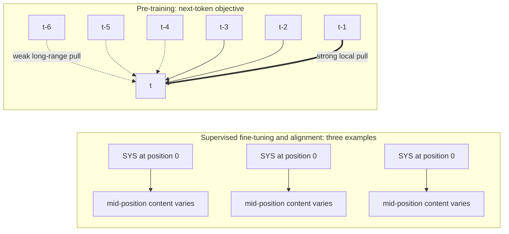
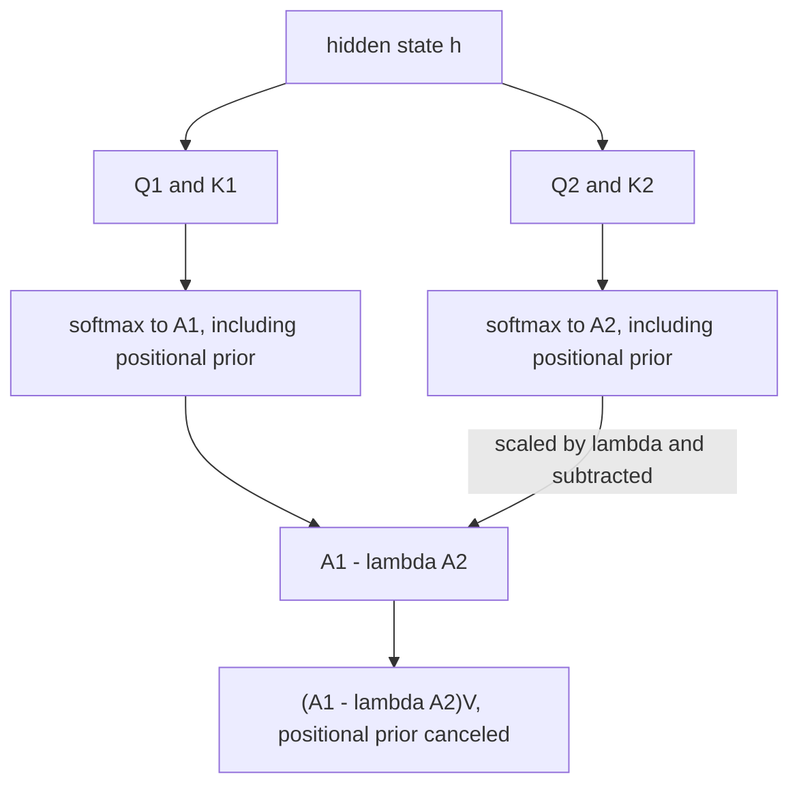

# Chapter 30: Lost in the Middle

This chapter prepares you to diagnose and mitigate position-dependent failures in Retrieval-Augmented Generation (RAG) systems.

## TL;DR

- A large language model (LLM) can receive the correct chunk and still miss it. Accuracy often follows a U-curve, with strong use of the beginning and end but weak use of the middle.
- The trough can fall below the closed-book baseline. Retrieval can replace a correct parametric answer with a wrong context-driven answer.
- A longer accepted context window does not automatically flatten the U. Robustness tracks the sequence lengths and attention patterns used in training.
- Primacy and recency have different learned causes. The fixed system-message position supports primacy, while local next-token prediction supports recency.
- Prompting can help moderately. Outside-in reordering and ranked-list truncation act more directly by controlling where evidence lands.
- Rotary Position Embedding (RoPE) rescaling and attention calibration can change attention at inference time, but they require access to model internals.
- IN2 position-rotated training and DIFF Transformer attack the problem during training or in the architecture. They cost more and cannot serve as simple wrappers around every existing checkpoint.

## The story

Imagine a judge working with a very long evidence table. The retriever is the court clerk. The clerk fetches evidence cards for a case. The reranker sorts those cards by expected importance. The assembled prompt is the final table that the judge actually sees.

The gold chunk is the one card that contains the decisive fact. Finding that card is not enough. The clerk must also place it where the judge reliably notices it.

This judge has a peculiar reading habit. Cards at the near end of the table get strong attention. Cards at the far end also get strong attention. Cards across the broad middle are easy to overlook. If we plot success against card position, the line looks like a U. The near end is the primacy zone. The far end is the recency zone. The middle is the trough.

The judge sometimes knows a common fact from memory before any cards arrive. That is the closed-book answer. If the decisive card sits in the trough, distracting cards can pull the judge away from a correct remembered answer. The full evidence table can then perform worse than an empty table.

Buying a longer table does not cure the habit. It adds more places to put cards. It does not prove that the judge trained to inspect every new place well. It can also make the inspection bill much larger.

Part of the habit came from training. At school, the most authoritative instruction always sat in the first seat. The next prediction usually depended most on nearby words. The judge therefore learned one reason to favor the start and another reason to favor the end.

The clerk has several same-day workarounds. The clerk can add an instruction that says to inspect the middle. The clerk can place the best cards at both ends of the table. The clerk can also stop adding low-value cards once both safe ends are full.

If the court controls the judge's reading machinery, it can adjust the position ruler or subtract the judge's usual end-favoring prior. Those changes work inside attention during the reading pass. They are unavailable when the court can only send text through a closed service.

If the court owns training, it can rotate the decisive card through many seats. That teaches the judge that importance and position are separate. It can also train a judge with two attention maps whose shared positional habit cancels when one map is subtracted from the other.

The final lesson is operational. Do not grade the clerk only on whether the decisive card entered the room. Plot the judge's accuracy by the card's final position. Then test each intervention against that same position-controlled curve.

## Decoder table

| Technical term | Plain-English meaning | Why it matters |
|---|---|---|
| Retrieval-Augmented Generation (RAG) | A system that retrieves external text and gives it to a generator | Retrieval can help only if the generator uses the retrieved evidence |
| Large language model (LLM) | The generator that reads the prompt and produces the answer | Its use of context varies by position |
| Retriever | The component that fetches candidate documents or chunks | It controls recall but not final prompt placement |
| Chunk | A bounded piece of a retrieved document | Each chunk occupies a position in the model's context |
| Gold chunk or gold document | The one retrieved item that contains the answer | The experiments move this item while holding its relevance fixed |
| Context window | The token capacity a model accepts in one request | Capacity does not guarantee equal comprehension at every position |
| Assembled prompt | The exact instruction, query, and chunk sequence sent to the model | Downstream assembly can change the reranker's intended order |
| Reranker | A model or rule that sorts retrieved candidates by relevance | Its rank confidence should guide placement and truncation |
| Rank | A candidate's place in the relevance ordering | Rank and final prompt position can differ after reordering |
| Top-k retrieval | Returning the first k ranked candidates | Larger k raises recall but can enlarge the positional trough |
| Recall@k | Whether the gold item appears anywhere among the first k candidates | It ignores where the gold item lands |
| Normalized Discounted Cumulative Gain (NDCG) | A retrieval metric that rewards useful ranking | It still does not measure whether the generator reads a position well |
| End-to-end accuracy | Correctness of the final generated answer | This is the quantity positional bias can lower |
| Serial position effect | Better use of list items near the beginning and end than in the middle | It produces the chapter's central U-shaped accuracy curve |
| U-curve | Accuracy that is high at both ends and low in the middle | It shows that position effects are not a monotonic falloff |
| Primacy | Strong use of information near the beginning | The first safe zone should hold high-value evidence |
| Recency | Strong use of information near the end | The second safe zone should not be wasted on the worst candidate |
| Trough | The weak middle region of the U | Evidence there can perform below the closed-book baseline |
| Position-controlled probe | An evaluation that moves the same gold item across positions | It isolates position from retrieval relevance and task difficulty |
| Multi-document question answering (QA) | Answering from a list in which one document contains the answer | It tests the effect in a realistic retrieval setting |
| Natural Questions (NQ) label | The source's label for the underlying question set in the closed-book comparison | It identifies the benchmark slice behind the roughly 56 percent result |
| Synthetic key-value retrieval | Looking up a named random key in a long set of pairs | It removes semantics and reasoning as confounds |
| JavaScript Object Notation (JSON) | The fixed-format object used for the synthetic key-value pairs | Its regular entries make token density easy to check |
| Base model | A model trained for language prediction without instruction alignment | Its U shows that the system-message account is incomplete |
| Instruction-tuned model | A model further trained to follow prompts | Its fixed chat template can strengthen primacy |
| Decoder-only model | A model that generates from left to right using causal attention | The reported evaluation found the U consistently in this class |
| Encoder-decoder model | A model that first encodes input bidirectionally, then generates | It is robust only through lengths represented in training |
| Closed-book generation | Answering with no retrieved context | It provides the no-retrieval baseline A0 |
| Parametric knowledge | Facts already stored in model weights | Retrieval can displace a correct parametric answer |
| A0 | Accuracy with no retrieval | It is the floor that retrieval can cross below |
| A(p) | Accuracy when the gold item is at position p | It makes the position effect explicit |
| Delta, Δ(p) | Retrieval value at position p, computed as A(p) - A0 | A negative value means retrieval is worse than closed-book |
| p and n | Gold-item position p and the document-list or sequence length n | They locate the answer and define the context over which position changes |
| k | Retrieval depth, reranked rank, or token-distance index, as identified in each formula | Its local meaning determines whether the chapter is changing list width, candidate order, or predictive distance |
| Ā and Ā(k) | Expected accuracy overall or at truncation depth k | They combine position probabilities with zone-specific accuracy |
| P(gold in zone) | Probability that the gold item occupies a named zone or is excluded | These weights turn a position curve into expected pipeline accuracy |
| Prefill | The pass that processes the supplied context before generation | Long-context attention cost and calibration occur here |
| Attention | The mechanism that assigns weight to tokens or chunks | Its positional prior can overpower content relevance |
| Attention logit | A raw score before normalization | Calibration subtracts estimated positional bias here |
| Softmax | The normalization that converts logits into attention shares | Bias subtraction before softmax changes the resulting mass |
| Attention mass | The normalized share assigned to an item | The worked example tracks gold attention before and after calibration |
| Positional bias or positional prior | Attention preference caused by location rather than content | It creates end-favoring behavior that can be measured and corrected |
| Training-time sequence length | The input length represented during training | It predicts positional robustness better than accepted window size |
| Accepted context window | The longest prompt a checkpoint allows at inference | It is an admission limit, not proof of effective use |
| Self-attention | Attention in which tokens compare against other tokens in the sequence | Standard prefill cost grows quadratically with sequence length |
| Attention head | One independently parameterized attention pathway inside a layer | MS-PoE scores and rescales heads separately |
| Floating-point operations (FLOPs) | A count of arithmetic work | The book uses it to compare long-context prefill cost |
| Sparse or windowed attention | Attention that does not compare every token with every other token | Its cost can be lower than the standard quadratic curve, but that does not prove positional robustness |
| Query-aware contextualization | Repeating the query before and after the document list | It helps the synthetic lookup task more than multi-document QA |
| Task drift | Producing the wrong kind of output rather than only a wrong value | LongChat generated retrieval code instead of the requested value |
| System message | The high-leverage instruction fixed at the start of a chat template | Its consistent position supplies a strong primacy signal |
| Supervised fine-tuning (SFT) | Training on prompt and answer examples | Its fixed template reinforces position 0 |
| Alignment | Training that shapes instruction-following behavior | It shares the fixed-position system-message effect |
| Next-token objective | Predicting the next token from preceding tokens | Nearby context usually carries the strongest predictive signal |
| Next-token locality | The falloff in predictive signal with token distance | It supplies the recency-side training pressure |
| Harmonic decay | The illustrative weight rule w(k) proportional to 1/k | It quantifies how much predictive signal can concentrate nearby |
| Attention with Linear Biases (ALiBi) | The source-named attention bias that subtracts a distance term from logits | Its design independently supports the locality account |
| m x abs(i - j) | The distance-scaled term that ALiBi subtracts from an attention logit | It makes the locality preference explicit |
| Position encoding | The mechanism that represents token locations | Its math can add positional effects, but training also matters |
| Rotary Position Embedding (RoPE) | A position method that rotates paired query and key dimensions | Its distance-dependent envelope can reduce the attention budget for some locations |
| Query and key vectors | Representations whose dot product helps set attention | RoPE changes their relationship as relative position grows |
| Decay envelope | A distance-dependent bound on a rotated query-key dot product | It supplies a mechanism for position-dependent raw attention |
| MS-PoE | The source-named inference method that rescales positions per head | It compresses effective distances for position-sensitive heads |
| Position-awareness score | A measure of how much a head changes with relative position | MS-PoE uses it to decide which heads to rescale |
| Adaptive scaling ratio | A per-head factor applied to effective position indices | It avoids changing heads that already aggregate over long ranges |
| Attention calibration | Estimating and subtracting average positional bias | It aims to leave content-driven attention |
| Open-weight model | A model whose internals can be modified in the serving stack | Model-level inference wrappers require this access |
| Closed Application Programming Interface (API) | A service that exposes requests and outputs but not attention internals | It blocks RoPE rescaling and logit calibration |
| Inference-time wrapper | A change around an existing checkpoint during serving | It avoids retraining but needs the right internal hooks |
| Faithfulness | Whether generated text reflects the supplied source | Wan et al. measured its decline for middle-position content |
| Hierarchical merging | Combining chunks through a multi-stage summary structure | The reported study found this could hurt faithfulness |
| Incremental summarization | Repeatedly updating a running summary as more text arrives | The reported study also found this could hurt faithfulness |
| Outside-in reordering | Alternating top-ranked items into the start and end positions | It fills both safe zones with trusted evidence |
| LongContextReorder | The source-named transform that realizes outside-in placement | It is an example implementation of the reordering rule |
| Ranked-list truncation | Sending only a prefix or selected subset of candidates | It can prevent a trough from forming |
| Score cliff | A sharp drop in the reranker's relevance scores | Liu et al.'s practical rule truncates at this drop |
| Gold-rank distribution and geometric decay | Probabilities assigned to the rank where the answer appears, with the illustrative top ranks halving | This distribution determines how much reordering or truncation changes expected accuracy |
| Safe-zone width | The combined primacy and recency capacity | It gives a default cap when no score cliff appears |
| d1 through dn | Candidates ordered from highest to lowest reranker relevance | Outside-in placement maps this order onto both safe ends |
| wp and wr | Widths of the primacy and recency zones | Their sum defines the derived truncation depth |
| Aprimacy, Atrough, and Arecency | Accuracy associated with each positional zone | Their ordering determines the value of deeper retrieval |
| Amiss | Accuracy when the gold item is excluded | It decides whether exclusion is safer than trough placement |
| k* | The derived optimal truncation depth wp + wr | It is optimal only under the chapter's stated accuracy ordering |
| Confidence-gated router | A component that decides whether to retrieve for a query | It can protect strong parametric answers but needs reliable confidence |
| Uncertainty estimate | A score for how confident the model is in an unaided answer | An unreliable estimate can make retrieval routing expensive and unsafe |
| IN2 training | The source-named position-rotated fine-tuning method | It breaks the correlation between importance and position |
| Position-rotated fine-tuning | Moving answer evidence through many context locations during training | It supplies gradient signal at positions natural data under-trains |
| Gradient signal and position-content correlation | Training feedback and the learned link between location and importance | IN2 changes where that feedback appears so importance need not track position |
| FILM-7B | The Mistral-7B model produced by the reported IN2 training | It is the chapter's training-data example |
| DIFF Transformer | The source-named architecture with differential attention | It changes the attention arithmetic rather than the data |
| Continued pre-training | An additional training cycle before task-specific fine-tuning | It is one route required to adopt a new differential-attention architecture |
| Differential attention | Subtracting one learned attention map from another | A shared positional pattern can cancel while content signal survives |
| A1 and A2 | Two independently parameterized attention maps over the same sequence | Their difference is the DIFF Transformer core |
| Lambda, λ | A learned scale on the second attention map | It controls how much of A2 is subtracted |
| Value matrix V | The representations weighted by the final attention map | DIFF Transformer applies the difference map to V |
| Q1, K1, Q2, K2, and d | Two query-key projection pairs and the dimension term used in their attention scaling | They produce the two maps that differential attention subtracts |
| ℓ and s | Conversation length and system-message length, with s much smaller than ℓ | Their occupancy difference explains why position 0 receives unusually consistent supervision |
| x at t, t - 1, and t - 2 | A predicted token and its nearest preceding tokens | They express the local signal behind recency |
| w(k), H(n), and γ | Illustrative distance weight, harmonic sum, and the constant approximated as 0.58 | They quantify how much predictive signal can collect near the generation point |
| Ltrain | The longest sequence length represented in training | Inputs beyond it can recover the U even when the accepted window is larger |
| O(n²d) | Standard self-attention work for sequence length n and fixed width d | It makes long-context prefill cost grow quadratically in n |
| c(p), b(p), and z(p) | Content score, positional-bias score, and their combined logit at position p | Calibration tries to remove b(p) so z(p) reflects content |
| floor and choose operations | Counting non-overlapping answer placements and unordered pairs of placements | They yield 266 single positions and 35,245 two-position combinations |
| Two-segment IN2 variant | Rotating two evidence pieces independently | It forces integration across arbitrary position pairs |

## Core mechanics

### 30.1 The U-curve and the serial position effect

#### What

- Liu et al. (2023) moved one gold chunk through a retrieved list while keeping its content and relevance fixed.
- The first task used an instruction, a query, and multiple documents with exactly one answer-bearing document.
- The second task used random JSON key-value pairs and asked for one named value.
- The synthetic task removed reasoning and paraphrase as explanations for the result.
- Accuracy was highest near the start, nearly as high near the end, and lower throughout the middle.
- Base models and instruction-tuned models showed the pattern.
- The reported decoder-only models showed it consistently. The source states that this was the only architecture in production use at scale.

#### Why

- The two tasks separate a positional effect from a task-specific difficulty effect.
- The human serial position effect supplies a useful shape analogy.
- Human primacy comes from rehearsal into longer-term memory.
- Human recency comes from items remaining in working memory.
- The chapter does not claim that the human and transformer mechanisms are the same.
- The practical metric is accuracy by final prompt position, not retrieval success alone.

#### Failure without it

- Recall@k and NDCG can improve while downstream accuracy stays flat or falls.
- A team may tune embeddings or reranking even though the gold chunk was already retrieved.
- A chunk at rank 8 of 20 can sit near the worst part of the curve despite outranking 12 candidates.
- A missing chunk indicates truncation or context assembly failure.
- A present but ignored middle chunk indicates a positional use failure.

#### Stated cost and complexity

- The position-controlled evaluation reruns the same query with the gold chunk at each location.
- The synthetic probe is cheaper and cleaner than starting with a full multi-document QA rerun.
- The book says a very small list, roughly k at most 3, can keep every position inside the primacy zone by construction.
- Stakeholder reporting should include trough depth and width, not only the existence of a U.

#### Experiments and arithmetic

- The key-value settings were 75 pairs at about 4k tokens, 140 pairs at about 8k tokens, and 300 pairs at about 16k tokens.
- Token cost per pair was 4,000/75 = 53.3, 8,000/140 = 57.1, and 16,000/300 = 53.3.
- The three estimates agree within 7 percent.
- For 300 pairs, pair 150 begins around token offset 150 x 53.3 = 8,000.
- The approximate context sizes correspond to 4,096, 8,192, and 16,384 tokens.
- The source frames these as ordinary production context tiers at the time of the study.

### 30.2 Worse than closed-book

#### What

- Let A0 be accuracy with no retrieved context.
- Let A(p) be accuracy with the gold document at position p.
- Define retrieval value as Δ(p) = A(p) - A0.
- The comforting hypothesis is Δ(p) at least 0 everywhere.
- Liu et al. instead measured Δ(p) below 0 for positions in the trough.
- The correct document was present, yet retrieval-augmented accuracy fell below no-retrieval accuracy.

#### Why

- A U that stays above A0 only motivates better placement.
- A U that crosses below A0 creates downside risk from retrieval itself.
- Common, well-established facts are especially exposed because the model may already know the right answer.
- The source examples are capital cities and chemical symbols.
- A prompt that tells the model to use search results can make attended distractors override parametric knowledge.
- Attention during prefill is a finite, contested resource rather than a free skim.

#### Failure without it

- An always-retrieve policy can silently make a high-confidence query class worse.
- A team can mistake a position failure for a retrieval miss.
- Aggregate gains can hide a net-negative subpopulation.
- Comparing only with ground truth misses whether retrieval displaced a correct closed-book answer.

#### Stated cost and complexity

- Expected accuracy must be weighted by the pipeline's actual gold-position distribution.
- A confidence-gated router needs reliable uncertainty estimates.
- The source calls that estimation an unsolved and expensive problem.
- With one engineer-month, the chapter recommends testing truncation and front placement before building routing infrastructure.
- A no-retrieval path does not help domains the base model could not know, such as private enterprise data or future values.

#### Formula and worked example

- The illustrative 20-document list uses 2 primacy slots, 16 trough slots, and 2 recency slots.
- Zone accuracies are 70 percent, 50 percent, and 65 percent.
- A0 is 60 percent.
- Under uniform placement:

$$
\bar{A} = \frac{2(70) + 16(50) + 2(65)}{20} = \frac{1{,}070}{20} = 53.5\%
$$

- The net change is 53.5 percent - 60 percent = -6.5 points.
- The trough is 10 points below A0 even though both edge zones beat A0.
- These round values are illustrative, not reproduced measurements from the paper.
- The reported qualitative comparison uses GPT-3.5-Turbo on an NQ-based question set.
- Its closed-book accuracy is roughly 56 percent.
- Middle-third positions fall below that line, while positions 1 and 20 clear it.

#### Decisions and limits

- Measure Δ(p) on each query slice before assuming retrieval is a strict upgrade.
- Keep a closed-book comparison for high-confidence parametric queries.
- Diff the RAG and closed-book answers during failure analysis.
- If truncation cannot lift the worst position above A0, the router becomes more justified.

### 30.3 Longer context windows do not help

#### What

- Liu et al. compared standard-context and extended-context checkpoints from the same model family.
- They tested 75, 140, and 300 key-value pairs at about 4k, 8k, and 16k tokens.
- The standard and extended checkpoints traced essentially the same U at every size.
- Models already near ceiling stayed near ceiling.
- Models with position trouble retained it as the accepted window grew.

#### Why

- Encoder-decoder models were more robust only through sequence lengths represented in training.
- The U returned when evaluation exceeded their training-time sequence length.
- Accepted window size says which tokens may enter.
- Training length and learned attention patterns determine how well positions are used.
- Query-aware contextualization repeats the query before and after the documents.
- It substantially improved synthetic key-value lookup but barely moved multi-document QA.

#### Failure without it

- A larger window can add more places for evidence to hide.
- It can preserve the same trough while increasing compute.
- More context can supply more information and more opportunities for confusion.
- LongChat showed a qualitative failure at the 140-pair setting.
- With the answer at the start, it generated code to retrieve the key rather than returning the value.
- This was task drift at a position otherwise expected to be safe.

#### Stated cost and complexity

- Standard self-attention prefill cost scales as O(n²d) for sequence length n and fixed width d.
- The exact figure caption says "Tripling," but the worked arithmetic compares 4k with 16k as a 4 times length increase:

$$
\frac{\mathrm{FLOPs}(16k)}{\mathrm{FLOPs}(4k)} = \left(\frac{16{,}000}{4{,}000}\right)^2 = 4^2 = 16
$$

- A 4 times longer context therefore creates a 16 times larger attention bill in this comparison.
- Architectures with sparse or windowed attention can have a different cost curve.
- A different cost curve does not itself prove a flatter positional curve.

#### Training-length threshold

- The chapter gives an illustrative encoder-decoder checkpoint trained to Ltrain = 2,048 tokens.
- It is placed behind an 8k accepted context window.
- The 4k, 8k, and 16k test settings all exceed Ltrain.
- The chapter therefore expects the U to reappear in all three settings.

#### Decisions and limits

- Probe the candidate checkpoint by position before a model migration.
- Ask whether context extension included continued training at the longer length.
- Do not infer effective 128k use from a 128k admission limit alone.
- Try reranking and truncation first when one sprint and a fixed latency budget constrain the choice.
- Inspect outputs qualitatively so a wrong output type does not disappear inside aggregate accuracy.

### 30.4 Where the bias comes from

#### What

- The chapter separates primacy and recency into two learned effects.
- Primacy is linked to the system message's fixed location during SFT and alignment.
- Recency is linked to locality in the next-token pre-training objective.
- A single positional-encoding explanation is incomplete.
- Encoder-decoder models reproduce the U beyond their trained length even without the same RoPE geometry.

#### Why primacy appears

- In a fixed chat template, the system message occupies position 0 in essentially every example.
- If the message length is s and conversation length is ℓ with s ≪ ℓ, positions 0 through s have a stable role.
- The system message shapes the loss on the assistant tokens that follow it.
- Mid-context positions vary in occupancy and semantic role.
- The model therefore receives a consistent high-leverage association at the start but an aliased signal elsewhere.

#### Why recency appears

- For target token xt, nearby tokens such as xt-1 and xt-2 usually carry more predictive signal than distant tokens.
- This pressure exists before chat templates or instruction alignment.
- It explains why recency also appears in base models.
- Press et al. (2021) used the ALiBi term m × abs(i - j), subtracted from attention logits, to encode locality for extrapolation.
- The source treats that independent design choice as corroboration, not as proof of the whole U.

#### Claim limit for base models

- Base and instruction-tuned models both show the U.
- A system-message explanation cannot by itself explain primacy in a base model.
- The chapter gives a likely, not complete, resolution.
- Natural documents often front-load titles, abstracts, and topic sentences.
- This pre-training prior may combine with the later system-message prior in aligned models.
- The source calls the system-message account the best available explanation in the surveyed literature, not a complete explanation.

#### Worked arithmetic

- The illustrative SFT corpus has conversation length uniform from 500 to 4,000 tokens.
- Position 0 holds the system message in 100 percent of examples.
- Offset 2,000 is occupied only when ℓ is at least 2,000:

$$
P(\ell \ge 2{,}000) = \frac{4{,}000 - 2{,}000}{4{,}000 - 500} = \frac{2{,}000}{3{,}500} \approx 57.1\%
$$

- Its raw positional consistency is about 43 points below position 0.
- The illustrative locality model uses w(k) proportional to 1/k over 2,048 tokens.
- H(2,048) = ln(2,048) + γ is approximately 7.62 + 0.58 = 8.20.
- H(64) = ln(64) + γ is approximately 4.16 + 0.58 = 4.74.
- The nearest 64 tokens are about 3 percent of the window.
- Their cumulative share is H(64)/H(2,048) = 4.74/8.20, or about 57.8 percent.
- This harmonic model is explicitly illustrative.

#### Failure without it

- Saying only that attention decays with distance explains at most part of the curve.
- Rotating evidence positions can target recency while leaving a fixed position-0 system-message signal intact.
- Reordering at inference changes placement but does not remove the learned pre-training prior.
- Treating the U as one cause can produce a fix that addresses only one side.

#### Stated cost and complexity

- Restating the query near the end is cheap.
- It helps the synthetic key-value task more than multi-document QA.
- A vendor recipe can suggest the likely cause, but a position-controlled probe remains stronger evidence.
- The chapter allows a blunt k of 2 or 3 when the measured trough is shallow enough that precise attribution adds no practical value.

### 30.5 Mitigation by prompting and reordering

#### What

- Wan et al. (2024) studied long-form summarization faithfulness by source position.
- Faithfulness declined when relevant content sat in the middle.
- A system instruction to attend to the middle was moderately effective.
- Hierarchical chunk merging and incremental updating of a running summary hurt faithfulness relative to doing nothing.
- The chapter treats the instruction as partial evidence, not a complete fix.

#### Outside-in reordering

- Let d1, d2, through dn be candidates in descending relevance order.
- Naive order puts d1 first and dn last.
- That gives d1 primacy but gives the least relevant candidate recency.
- The outside-in rule maps d1 to position 1, d2 to position n, d3 to position 2, and d4 to position n - 1.
- The pattern continues until low-ranked items fill the middle.
- LangChain's LongContextReorder is the source-named example transform that implements this kind of placement.
- Liu et al. directly recommend placing the most relevant chunk near the start.
- Filling both ends generalizes that advice.

#### Why

- Reordering exploits the measured U instead of asking the model to unlearn it at inference.
- With 2 primacy slots and 2 recency slots, the top 4 candidates occupy safe zones.
- The least trusted candidates absorb the trough.
- Reordering follows reranking and composes with truncation.

#### Failure without it

- Strict descending order buries candidates 2 and 3 while placing the worst candidate at the end.
- A prompt-only instruction can remain too weak for load-bearing use.
- Elaborate summarization structures can add engineering effort while lowering faithfulness.
- Reordering cannot repair a reranker whose top candidates are wrong.

#### Stated cost and complexity

- The prompt intervention costs one line of the system template.
- Reordering requires no weight update.
- The outside-in transform is a deterministic post-reranking operation.
- When n is at most 3 under the chapter's running zone assumption, every item already lies in primacy.
- For n greater than 4, both safe zones can matter.

#### Worked arithmetic

- The illustrative gold-rank distribution assigns 50 percent to rank 1.
- It assigns 25 percent to rank 2, 12.5 percent to rank 3, and 6.25 percent to rank 4.
- Ranks 5 through 20 share the remaining 6.25 percent.
- Naive order places ranks 1 and 2 in primacy.
- Ranks 19 and 20 contribute effectively no recency probability in the rounded example.
- With zone accuracies 70, 50, and 65:

$$
\bar{A}_{naive} \approx (0.50 + 0.25)(70) + (0.125 + 0.0625 + 0.0625)(50) + 0(65) = 65.0\%
$$

- Reordering places ranks 1 and 3 in primacy, ranks 2 and 4 in recency, and the tail in the trough:

$$
\bar{A}_{reordered} = (0.50 + 0.125)(70) + (0.25 + 0.0625)(65) + (0.0625)(50) \approx 67.2\%
$$

- Reordering gains about 2.2 points over naive descending order.
- Sorting and placing relevant candidates already gained 11.5 points over the 53.5 percent uniform baseline.
- Both arrangements exceed the illustrative closed-book A0 of 60 percent.

#### Decisions and limits

- Use reordering after a fixed reranker so its effect can be measured cleanly.
- Send the second-best candidate to the far end, not the worst.
- Test the middle-attention instruction cheaply, but prefer structural placement when context assembly is controllable.
- Combine reordering with truncation.
- Rerun the position-controlled probe after either change.

### 30.6 Ranked-list truncation

#### What

- Recall@k cannot decrease as k grows.
- Downstream answer accuracy can decrease because adding candidates changes every candidate's final zone.
- A list of length k has primacy width wp, recency width wr, and trough width max(0, k - wp - wr).
- The running example uses wp = 2 and wr = 2.
- It uses Aprimacy = 70 percent, Atrough = 50 percent, Arecency = 65 percent, and A0 = 60 percent.
- Amiss is accuracy when the gold document is excluded.
- The example takes Amiss approximately equal to A0.

#### Expected-accuracy rule

$$
\bar{A}(k) = P(\mathrm{gold\ in\ primacy})A_{\mathrm{primacy}} + P(\mathrm{gold\ in\ trough})A_{\mathrm{trough}} + P(\mathrm{gold\ in\ recency})A_{\mathrm{recency}} + P(\mathrm{gold\ excluded})A_{\mathrm{miss}}
$$

- Once k grows past wp + wr, a former recency item moves into the trough.
- The new candidate also enters through the trough.
- Under Aprimacy greater than Arecency greater than Amiss greater than Atrough, both moves reduce expected value.
- The derived optimum is k* = wp + wr.
- With 2 slots at each end, k* = 4.

#### Practical score-cliff rule

- Liu et al. recommend watching the reranker's score curve.
- If scores drop sharply after rank 2, send the top 2 and stop.
- Tail candidates are both unlikely to contain the answer and risky in the trough.
- If scores decay smoothly, use measured zone widths and Amiss rather than guessing.

#### Failure without it

- Filling the entire accepted context enlarges the trough.
- Ranks that were safe at k = 4 become middle ranks at k = 6.
- Higher recall can coexist with lower generation accuracy.
- A fixed k inherited from an older reranker can remain wrong after the rank distribution changes.

#### Claim limit

- The k* rule depends on Amiss being above Atrough.
- A system that hard-fails, returns empty output, or hallucinates freely when evidence is absent can have Amiss below Atrough.
- In that case, deeper retrieval can be worthwhile even inside the trough.
- The chapter says to measure Amiss rather than assume it equals A0.

#### Worked arithmetic

- At k = 2, ranks 1 and 2 occupy primacy and all lower ranks are excluded:

$$
\bar{A}(2) = (0.50 + 0.25)(70) + (0.125 + 0.0625 + 0.0625)(60) = 67.5\%
$$

- At k = 4, ranks 1 and 2 occupy primacy while ranks 3 and 4 occupy recency:

$$
\bar{A}(4) = (0.75)(70) + (0.125 + 0.0625)(65) + (0.0625)(60) = 68.4\%
$$

- At k = 6, ranks 3 and 4 move into the trough.
- Ranks 5 and 6 take recency and each carries roughly 0.39 percent of the tail probability:

$$
\bar{A}(6) = (0.75)(70) + (0.1875)(50) + (0.0078)(65) + (0.0547)(60) \approx 65.7\%
$$

- k = 4 beats k = 2 and k = 20 in the running example.
- k = 6 already erases most of the gain.

#### Stated cost and complexity

- At 200 tokens per chunk, k = 4 sends 800 tokens.
- k = 20 sends 4,000 tokens.
- This is a 5 times reduction in context tokens.
- Under quadratic attention, the attention component falls by (4,000/800)² = 25 times.
- Cost and accuracy therefore point in the same direction for this example.
- For a low-query-volume internal tool, cost can be secondary while accuracy still determines k.

### 30.7 Positional encoding and attention calibration

#### What RoPE contributes

- RoPE rotates paired query and key dimensions by an angle tied to token index.
- The source names LLaMA and Mistral as examples that use it.
- Su et al. (2021) showed a distance-dependent decay envelope on the rotated query-key dot-product bound.
- The envelope depends on relative distance before content similarity is considered.
- The source frames keys near the start or end as favored anchors and a middle key as starting with a smaller raw attention budget.
- It does not replace the training-distribution account from section 30.4.

#### MS-PoE

- MS-PoE, from the first paper titled "Found in the Middle," computes a per-head position-awareness score during prefill.
- The score measures sensitivity to relative position while content is held fixed.
- High-scoring local heads receive an adaptive position-index compression.
- The compression brings middle keys closer in effective relative distance.
- Low-scoring long-range heads remain unchanged.
- The method needs no fine-tuning and adds no parameters.
- The source describes it as applied once per model at inference time.
- It applies as an inference-time wrapper to a model whose internals are accessible.

#### Attention calibration

- A second "Found in the Middle" paper from Google Cloud AI Research, Hsieh et al. (2024), measured a U-shaped raw attention distribution.
- Their method estimates the average positional shift while holding content roughly fixed across many queries.
- It subtracts that estimated bias from raw attention logits before softmax.
- The intended remainder is content-driven attention.

#### Failure without it

- A genuinely relevant middle chunk can receive less total mass than two weak edge distractors.
- One global position rescale can harm heads that already aggregate over long ranges.
- A closed API exposes neither effective position indices nor raw attention logits.
- Reordering and truncation remain available behind a closed API. They can stack with calibration when internal access exists.

#### Caveats and stated cost

- Bias may not separate cleanly from content.
- The calibration authors call the interactions intricate and dynamic.
- Calibration adds inference-time compute.
- Calibration does not explain why the bias exists.
- Some tasks should preserve recency.
- Dialogue is the chapter's example because the latest turn may deserve the highest weight.
- Validate any wrapper on a held-out position-controlled probe for the exact model family.

#### Worked arithmetic

- Three chunks sit at positions 1, 11, and 20 in a 20-slot context.
- The gold middle chunk has content c = 3.0 and positional bias b = 0.
- Each edge distractor has c = 1.0 and b = 1.5.
- With z(p) = c(p) + b(p), the raw logits are 2.5, 3.0, and 2.5.
- Their exponentials are about 12.18, 20.09, and 12.18.
- The sum is 44.45.
- Gold attention is 20.09/44.45, or about 45.2 percent.
- The two distractors receive 54.8 percent together.
- After subtracting b(p), the logits are 1.0, 3.0, and 1.0.
- Their exponentials are about 2.72, 20.09, and 2.72.
- The new sum is 25.53.
- Gold attention becomes 20.09/25.53, or about 78.7 percent.
- The swing is 33.5 points with no weight update.
- The calibrated logits exactly equal the assumed content logits.
- If position and content are not separable, that equality and the method's premise can fail.

### 30.8 Training and architecture fixes

#### IN2 training

- An et al. (2024) propose position-rotated fine-tuning in "Make Your LLM Fully Utilize the Context."
- Natural long-context data can keep position correlated with importance.
- Documents front-load predictive content.
- Chat templates keep the system message at position 0.
- More data with the same skew can reinforce the skew.
- IN2 places a roughly 120-token answer segment at positions sampled across contexts from 4K to 32K tokens.
- A question can be answered only from that rotated segment.
- Every example supplies a gradient signal at the sampled evidence position.
- A second variant splits evidence across two independently rotated segments.
- The authors fine-tuned Mistral-7B and named the result FILM-7B.
- FILM-7B is reported comparable to GPT-4-Turbo on long-context tasks.

#### DIFF Transformer

- Ye et al. (2024) replace standard softmax attention with differential attention.
- Each head splits its query and key projections into two independent groups.
- The groups produce A1 and A2 over the same positions.

$$
A_1 = \mathrm{softmax}((Q_1K_1^\top)/\sqrt{d})
$$

$$
A_2 = \mathrm{softmax}((Q_2K_2^\top)/\sqrt{d})
$$

- The head output is (A1 - λA2)V.
- λ is learned.
- A positional pattern shared by both maps can cancel in the subtraction.
- Content-specific signal that differs across the maps can survive.
- The source prints the broken cross-reference `sec-04` in this explanation. The surrounding argument points to section 30.4.
- The mechanism is present at every layer from the first forward pass.
- It cannot be retrofitted onto a checkpoint whose heads do not produce two maps.

#### Why these fixes have a higher ceiling

- IN2 changes where training signal appears.
- DIFF Transformer changes the attention computation.
- Inference wrappers correct the output of a learned checkpoint.
- Training and architecture changes can alter what the model learns.
- IN2 and DIFF Transformer are orthogonal and can be combined in principle.

#### Failure without it

- Fine-tuning on more unrotated long documents preserves the position-content correlation.
- Sampling only a few fixed positions leaves most of the context under-supervised.
- Rotating evidence alone can leave the fixed system-message primacy signal intact.
- Treating DIFF Transformer as a configuration switch ignores its required parameterization.

#### Worked arithmetic

- A 32,000-token context and 120-token segment provide floor(32,000/120) = 266 non-overlapping positions.
- Uniform rotation puts the answer at any one position in about 1/266 = 0.38 percent of examples.
- Two independently chosen positions provide:

$$
\binom{266}{2} = \frac{266 \times 265}{2} = 35{,}245
$$

- Ordinary SFT puts the system message at position 0 in 100 percent of the illustrative examples.
- Offset 2,000 is occupied in about 57.1 percent of the earlier illustrative corpus.
- IN2's roughly 0.38 percent occupancy is described as two orders of magnitude flatter.

#### Stated cost and complexity

- IN2 requires a training run for the production checkpoint.
- Rotate across the full context, not only a handful of positions.
- Production telemetry can justify denser sampling where evidence often lands.
- Vary system-message salience or position if primacy also needs correction.
- DIFF Transformer belongs in a new architecture or continued pre-training cycle.
- The interview scenario gives a six-week deadline for an IN2-style fine-tune.
- It contrasts that with a multi-month DIFF Transformer commitment from scratch or continued pre-training.
- Validate both with the same per-position probe used to establish the U.

## Diagrams

### Figure 30.1

```text
answer accuracy
high | LLL\\                               /LLL   L = LLM, solid
     |  hhh\\                           /hhh     h = human recall, dashed
     |      \\LLL\\                 /LLL/
low  |           \\___LLL___/
     + start -------- middle -------- end
       primacy         trough         recency
       position of relevant chunk
```

Figure 30.1: The serial position effect measured in humans (dashed) and the same U measured in an LLM reading a retrieved context (solid, after Liu et al., 2023): accuracy is highest when the correct chunk sits at the start or end of the context and lowest when it sits in the middle, regardless of whether the chunk is actually relevant.

### Figure 30.2

```text
accuracy
high | A(p)\\                         /A(p)
A0   | - - - \\ - closed-book - - / - - -
low  |          \\______/
     + 1 ---------- 10 ---------- 20
       Delta(p) < 0 through the trough
       gold-document position in a 20-document context
```

Figure 30.2: The U-curve is not bounded below by the closed-book baseline: for gold-document positions in the trough, retrieval-augmented accuracy A(p) falls under the no-retrieval accuracy A0, after Liu et al. (2023).

### Figure 30.3

```text
retrieval accuracy
high | 4k \\                         / 4k
     | 8k  \\                       /  8k
     | 16k  \\______middle________/  16k
     + start ---------------------- end
       position of relevant key-value pair
```

Figure 30.3: Tripling the context window from 4k to 16k tokens does not flatten the trough - the same U reappears at every scale, after Liu et al. (2023), because the effect tracks trained sequence length and attention pattern, not the number of tokens the window admits.

### Figure 30.4



Figure 30.4: Primacy and recency are learned at different points in training: next-token pre-training concentrates predictive signal on nearby preceding tokens (top), while SFT and alignment fix the system message at position 0 in every example (bottom), so only that position accumulates a consistent, high-leverage training signal.

### Figure 30.5

| Layout | Position 1 | Position 2 | Position 3 | Position 4 | Position 5 | Position 6 | Position 7 | Position 8 | Position 9 | Position 10 |
|---|---:|---:|---:|---:|---:|---:|---:|---:|---:|---:|
| Naive relevance rank | 1 | 2 | 3 | 4 | 5 | 6 | 7 | 8 | 9 | 10 |
| Outside-in relevance rank | 1 | 3 | 5 | 7 | 9 | 10 | 8 | 6 | 4 | 2 |
| Zone | primacy | primacy | trough | trough | trough | trough | trough | trough | recency | recency |

Figure 30.5: Sorting by relevance rank already gives the top candidate primacy, but wastes the recency zone on the least relevant chunk and buries the second- and third-best candidates in the trough. Filling both safe zones from the outside in instead concentrates the reranker's confidence exactly where the U-curve rewards it.

### Figure 30.6

| Truncation depth | Position 1 | Position 2 | Position 3 | Position 4 | Position 5 | Position 6 |
|---|---|---|---|---|---|---|
| k = 4 | rank 1, primacy | rank 2, primacy | rank 3, recency | rank 4, recency | not sent | not sent |
| k = 6 | rank 1, primacy | rank 2, primacy | rank 3, trough | rank 4, trough | rank 5, recency | rank 6, recency |

Figure 30.6: Extending the retrieved list past the safe-zone width does not add new safe positions - it pushes ranks that were safely in the recency zone at k = 4 into a newly created trough at k = 6.

### Figure 30.7

```text
attention weight
high | raw \\                     / raw
     |      \\___           ___/
     | calibrated ___/\\* /\\___
low  + start ------ gold ------ end
                      chunk
     solid raw positional prior, dashed calibrated content signal
```

Figure 30.7: Raw attention already favors both ends of the context before content is considered. Subtracting the estimated positional bias lets the genuinely relevant chunk in the middle dominate instead of being swamped by the prior.

### Figure 30.8



Figure 30.8: Differential attention computes two independently parameterized attention maps over the same positions and subtracts them, so a positional prior shared by both maps cancels while content-specific signal, present in one map more than the other, survives.

## Whiteboard pack

### What to draw

1. Draw a horizontal context bar from start to middle to end.
2. Draw a U-shaped accuracy curve above it.
3. Label the ends primacy and recency, and label the center trough.
4. Add a flat A0 closed-book line that crosses above the trough.
5. Draw retrieved ranks flowing through a reranker.
6. Place ranks 1 and 3 at the start, then ranks 2 and 4 at the end.
7. Mark k* = wp + wr and cross out candidates beyond the safe-zone width.
8. Add two branches for model access: inference calibration, then IN2 or differential attention when training is owned.

### Spoken script

Lost in the middle means the model can receive correct evidence and still miss it because attention depends on position. Accuracy forms a U: strong at the beginning and end, weak in the middle, sometimes below the no-retrieval baseline. A larger window does not automatically help because trained sequence use matters. I rerank, place top candidates at both ends, and truncate before a trough grows. With model access, I rescale positions or calibrate attention. With a training budget, I rotate evidence positions or use differential attention. I validate each fix by plotting accuracy against gold-chunk position.

## Interview traps

### 1. Why does the U-curve establish a position effect rather than a harder-middle benchmark artifact?

Liu et al. reproduced it in both multi-document QA and semantics-free key-value lookup while moving the same gold item through the list. The synthetic control removes reasoning and paraphrase, so agreement across both tasks isolates position more strongly than either task alone.

### 2. How can RAG be worse than closed-book, and when would you avoid a no-retrieval path?

The trough can make A(p) lower than A0 because finite attention favors distractors and a context-use instruction can displace correct parametric knowledge. Keep a closed-book option for high-confidence known facts, but not for private or future information the base model could not know.

### 3. Why does a longer context window fail to solve the problem?

Accepted length is capacity, while positional robustness tracks training length and learned attention patterns. The 4k, 8k, and 16k probes retained the U, and moving from 4k to 16k costs 16 times the standard attention FLOPs without a measured flattening.

### 4. What mechanism and serving fixes would you propose before retraining?

Primacy is linked to fixed position-0 supervision, recency to next-token locality, and RoPE adds a distance-dependent attention envelope. First reorder high ranks to both ends and truncate at a score cliff or safe-zone width, then consider per-head MS-PoE or attention calibration only when model internals are accessible and recency is not a desired task signal.

### 5. How do IN2 and DIFF Transformer differ, and which fits a six-week deadline?

IN2 changes training data by rotating evidence positions, while DIFF Transformer changes each head to subtract two learned attention maps. The source's deadline scenario favors IN2 on the current architecture because DIFF Transformer cannot be retrofitted and belongs to a longer new-model or continued-pre-training cycle.

## Key numbers

| Topic | Number or range | Status in the chapter | Meaning |
|---|---|---|---|
| Human analogy | 10 list items | Illustrative | Simple setup for the serial position effect |
| Initial pipeline | 20 chunks | Illustrative scenario | A correct chunk can still be ignored after assembly |
| Position examples | rank 1, rank 8 of 20, ranks 6 through 14 of 20 | Diagnostic examples | Assembly can move a strong retrieval into the trough |
| Retrieval-depth debate | k = 5 versus k = 20 | Interview scenario | Recall can rise while final accuracy falls |
| Synthetic probe sizes | 75, 140, 300 pairs | Reported experimental settings | Three lookup scales |
| Synthetic token sizes | about 4k, 8k, 16k | Reported experimental settings | Context lengths for those pair counts |
| Tokens per pair | 53.3, 57.1, 53.3 | Derived | Pair density agrees within 7 percent |
| Long synthetic midpoint | pair 150, about token 8,000 | Derived | Literal center of the 300-pair, 16k setting |
| Power-of-two tiers | 4,096, 8,192, 16,384 | Study-era comparison | Approximate production tiers cited by the source |
| Small-list exception | k at most 3 | Chapter heuristic | Every position is treated as primacy in this assumption |
| Uniform 20-slot zones | 2, 16, 2 | Illustrative | Primacy, trough, and recency widths |
| Uniform zone accuracy | 70, 50, 65 percent | Illustrative | Primacy, trough, and recency accuracy |
| Closed-book A0 | 60 percent | Illustrative | Comparison floor for worked examples |
| Uniform expected RAG | 53.5 percent | Derived from illustrative values | Retrieval loses 6.5 points against A0 |
| Trough gap | 10 points below A0 | Illustrative | Middle placement can be net negative |
| Rollout and engineering scenarios | 3 weeks, 1 engineer-month | Interview framing | Time pressure favors direct truncation tests before routing |
| GPT-3.5-Turbo baseline | roughly 56 percent | Reported qualitative comparison | Closed-book result on the NQ-based set |
| Best edge positions | 1 and 20 | Reported qualitative comparison | Both clear the roughly 56 percent line |
| Migration comparison | 4k to 16k | Reported scale comparison | The caption says tripling, while the worked arithmetic is a 4 times increase |
| Standard attention cost | 16 times | Derived | Quadratic FLOPs increase from 4k to 16k |
| Training-length example | Ltrain = 2,048, accepted window 8k | Illustrative | All 4k, 8k, and 16k probes exceed training length |
| LongChat failure | 140 pairs, answer at start | Reported qualitative failure | It generated code rather than the value |
| Vendor probe example | 128k | Interview scenario | Accepted length still needs position testing |
| SFT length range | 500 to 4,000 tokens | Illustrative | Uniform conversation-length model |
| Mid-context offset | 2,000 tokens | Illustrative | Occupied in about 57.1 percent of examples |
| Position-0 occupancy | 100 percent | Illustrative | Fixed system-message role |
| Positional consistency gap | about 43 points | Derived | Offset 2,000 versus position 0 |
| Harmonic window | 2,048 tokens | Illustrative | Locality calculation base |
| Nearest-token band | 64 tokens, about 3 percent | Illustrative | Holds about 57.8 percent of harmonic weight |
| Harmonic sums | 8.20 and 4.74 | Derived | H(2,048) and H(64) |
| Training schematic | 3 SFT examples | Figure structure | Every example fixes SYS at position 0 |
| Gold-rank probabilities | 50, 25, 12.5, 6.25 percent | Illustrative | Ranks 1 through 4 |
| Tail probability | 6.25 percent | Illustrative | Shared by ranks 5 through 20 |
| Reordering schematic | 10 context positions | Figure structure | Outside-in rank order is 1, 3, 5, 7, 9, 10, 8, 6, 4, 2 |
| Naive versus reordered | 65.0 versus about 67.2 percent | Derived | Outside-in placement gains about 2.2 points |
| Rank sorting gain | 11.5 points | Derived | Naive rank order versus 53.5 percent uniform placement |
| Safe-zone optimum | k* = 4 | Derived under stated ordering | wp = 2 plus wr = 2 |
| Score-cliff scenarios | 10 candidates, cliff after rank 2 | Interview heuristic | Truncate to the top 2 under a clear score drop |
| Truncation comparison | 67.5, 68.4, 65.7 percent | Derived | Results at k = 2, 4, and 6 |
| Tail ranks in recency at k = 6 | about 0.39 percent each | Illustrative | Probability on ranks 5 and 6 |
| Chunk budget | 200 tokens each | Illustrative | k = 4 sends 800 and k = 20 sends 4,000 tokens |
| Truncation savings | 5 times fewer tokens, 25 times less attention work | Derived | 4,000 versus 800 tokens under quadratic attention |
| Calibration positions | 1, 11, 20 of 20 | Illustrative | Two edge distractors and one middle gold chunk |
| Imperfect-rank scenario | relevant rank 10 of 20, top 3 retained | Section setup | Truncation can exclude a late gold chunk |
| Content and bias logits | gold 3.0 plus 0, edges 1.0 plus 1.5 | Illustrative | Raw logits become 3.0 and 2.5 |
| Raw exponentials and sum | 20.09, 12.18, 12.18, sum 44.45 | Derived | Softmax inputs before calibration |
| Raw attention split | 45.2 versus 54.8 percent | Derived | Gold versus combined distractors |
| Calibrated exponentials and sum | 20.09, 2.72, 2.72, sum 25.53 | Derived | Position terms removed |
| Calibrated gold mass | 78.7 percent | Derived | A 33.5-point gain with no weight update |
| MS-PoE update cost | 0 fine-tuning steps, 0 added parameters, once per model | Reported method properties | It is a plug-and-play inference intervention when internals are accessible |
| IN2 context and segment | 4K to 32K, roughly 120 tokens | Reported method scale | Rotated evidence length and context span |
| Buried evidence example | token 18,000 of 32,000 | Method motivation | Natural data does not ensure equal signal there |
| Non-overlapping IN2 positions | 266 | Derived | floor(32,000/120) |
| Per-position occupancy | about 0.38 percent | Derived | 1/266 under uniform rotation |
| Two-position combinations | 35,245 | Derived | 266 choose 2 |
| Training models | Mistral-7B, FILM-7B, GPT-4-Turbo | Reported comparison | FILM-7B is reported comparable on long-context tasks |
| Deadline comparison | 6 weeks versus multiple months | Interview scenario | IN2 fine-tune versus a DIFF Transformer cycle |
| Study dates | 2021, 2023, 2024 | Source attributions | Su and Press, Liu, then Wan, An, Hsieh, and Ye |
