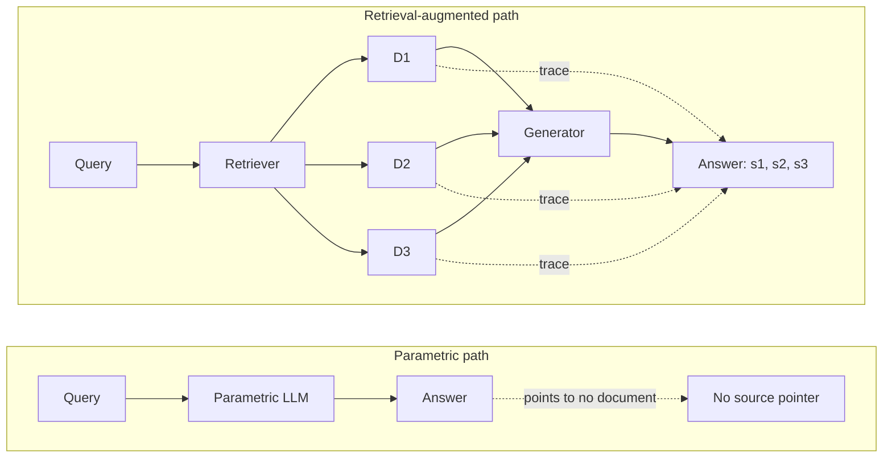
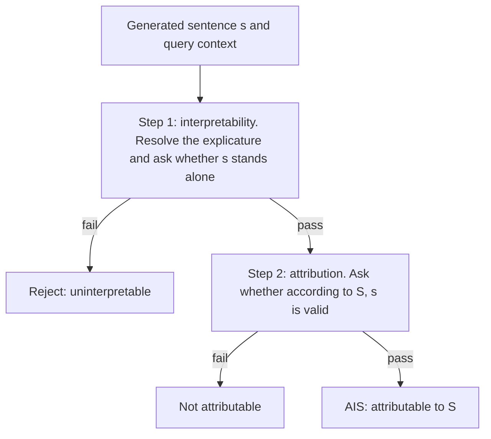
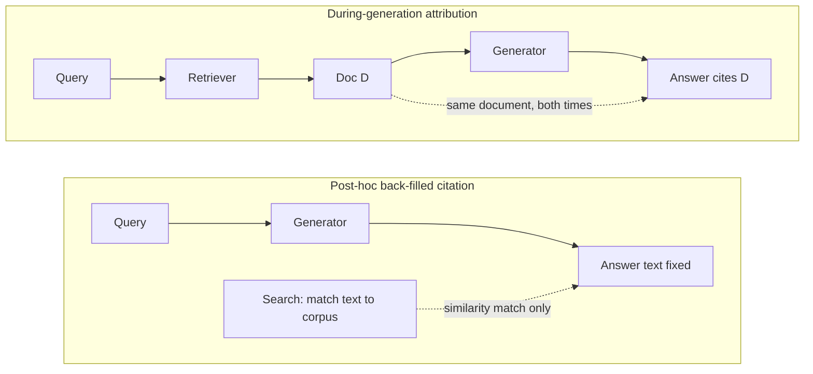
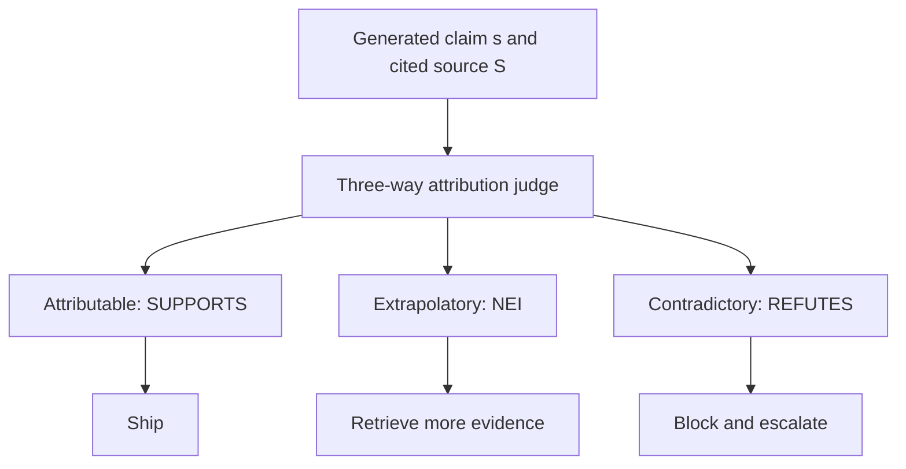
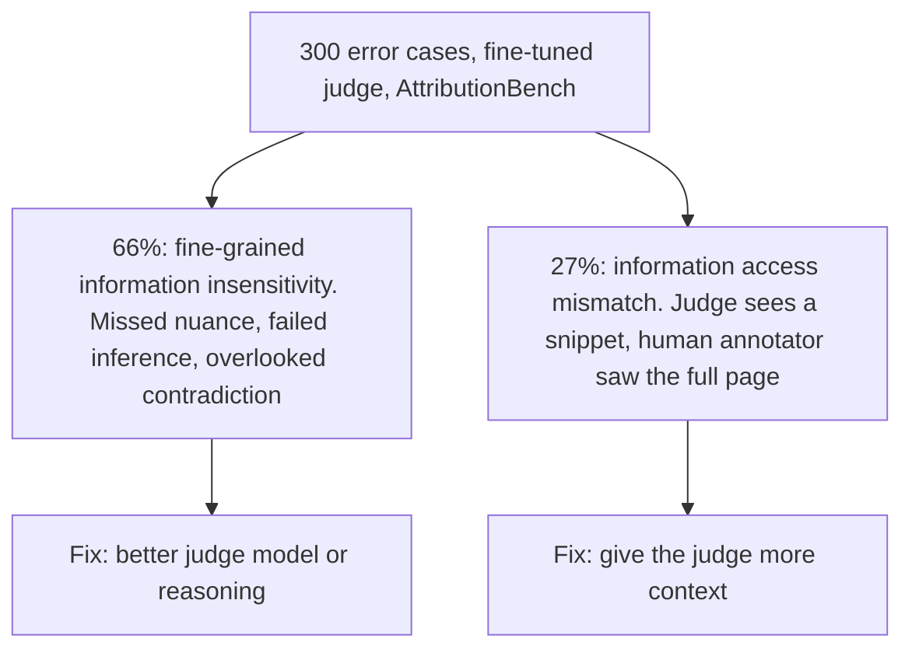

# Chapter 31: Attribution and Citation

This chapter explains why attribution is the defining promise of Retrieval-Augmented Generation (RAG) and how to test, route, and measure cited claims.

## TL;DR

- RAG can attach each factual claim to the retrieved chunk that supplied it. A model answering only from its parameters has no comparable source pointer.
- A genuine attribution link records where a claim came from. A citation mark alone does not prove that the source caused, supports, or makes the claim true.
- Attributable to Identified Sources (AIS) uses two ordered checks. First make the sentence understandable, then ask whether its source supports the resolved claim.
- A post-hoc citation search runs after an answer is fixed. It can find similar text without showing that the source caused or verified the answer.
- Use three claim labels when remediation differs. Ship attributable claims, retrieve more evidence for extrapolatory claims, and block contradictory claims for review.
- Automatic attribution judges remain fallible. The best fine-tuned AttributionBench system reported about 80% macro-F1, and its errors came from both reasoning failures and missing source context.

## The story

Picture a newspaper newsroom that must keep a receipt for every factual line it prints.

The reporter is the generator.
The archive clerk is the retriever.
The clippings are retrieved chunks.
The copy editor is the attribution judge.

A reporter who writes only from memory may produce a correct sentence, such as "the capital of Canada is Ottawa."
The newsroom still cannot name the one clipping that produced it.
The sentence came from everything the reporter remembers, mixed together.
That is the parametric model's problem.
Its memory may be accurate, but it has no receipt.

In the RAG newsroom, the archive clerk first hands the reporter a small set of visible clippings.
The reporter writes while those clippings sit on the desk.
The newsroom can then record which clipping supplied each output span.
This does not guarantee a true article.
It gives every reviewer a concrete place to check.

The copy editor follows the AIS checklist in a fixed order.
First, the editor rewrites a vague sentence into the full claim a reader would understand from the conversation.
For example, "It was released on September 19, 2025" becomes "The iPhone 17 was released on September 19, 2025."
That fully resolved claim is the explicature.
Second, the editor asks whether the cited clipping actually supports that claim without borrowing outside knowledge.

A careless newsroom can fake the appearance of receipts.
It can let the reporter finish the article and then ask an assistant to search for a similar-looking clipping.
That post-hoc process proves only that a search ran.
The clipping did not guide the writing, and similarity does not establish support.
A correct line may get a decorative citation, and a wrong line may get one too.

The careful copy desk uses three trays.
The attributable tray holds claims fully supported by their clippings, so they can ship.
The extrapolatory tray holds claims that the clipping never addresses, so the archive clerk must retrieve more evidence.
The contradictory tray holds claims that conflict with the clipping, so the newsroom blocks and escalates them.
These trays match the older fact-checking labels SUPPORTS, NOT ENOUGH INFO, and REFUTES.

The copy editor also needs an audit.
On AttributionBench, the best fine-tuned judge reached only about 80% macro-F1.
In a review of 300 judge errors, 66% came from missed nuance, failed inference, or overlooked contradiction.
Another 27% came from a simpler mismatch.
The human saw the full page, while the judge saw only a snippet.
The first problem needs a better reader.
The second needs the newsroom to hand the reader more of the clipping file.

The newsroom lesson is simple.
Build the receipt into writing, test the receipt in two ordered steps, route each failure by its cause, and audit the person who audits everyone else.

## Decoder table

| Technical term | Plain-English meaning | Why it matters |
|---|---|---|
| Retrieval-Augmented Generation (RAG) | A system that retrieves source text and gives it to a generator before the answer is written | It creates a visible evidence set that claims can point back to |
| Attribution | A trace from a generated claim to the source passage that supplied or supports it | It makes a claim checkable even when the claim is wrong |
| Citation | A marker that points a reader to a source | Its value depends on how the source was connected to generation and whether support was checked |
| Large language model (LLM) | A model that generates text from learned parameters and the current input | It may answer fluently without retaining a pointer to one training document |
| Parametric model | A model whose learned facts are mixed into its numerical weights | It cannot identify one training document as the origin of a generated claim |
| Closed-book model | A model that answers from its parameters without retrieving a source at answer time | It may know the answer but cannot provide a source pointer by construction |
| Parametric knowledge | Information encoded across model weights during training | It supplies answers without keeping document-level receipts |
| Probability distribution | The model's numerical weighting over possible next tokens | It explains how a parametric model produces text without a corpus pointer |
| `P(x_n | x_1, ..., x_(n-1))` | Probability of next token `x_n` given all earlier tokens | It formalizes generation from fixed parameters without a source index |
| Context window | The visible input text available to the generator for the current answer | Retrieved chunks must enter this window to condition the write |
| Datastore | The searchable collection that holds source material | It supplies the finite set of chunks used for attribution |
| Retriever | The component that selects source passages for a query | Its misses create extrapolatory claims and missing evidence |
| Retrieved chunk | A bounded source passage placed in the generator's context | Chunk-level pointers reduce a reviewer's search burden |
| `D_1, ..., D_k`, `k`, and `s_1, s_2, s_3` | Retrieved chunks, retrieval depth, and example answer spans | They label the finite evidence and traceable spans in Figure 31.1 |
| Chunk identifier (chunk ID) | The identifier stored for a retrieved passage | Logging it beside a generated span preserves the audit trail |
| Generator | The component that writes the answer from the query and available context | Its use or neglect of evidence determines whether retrieval helps |
| Output span | A specific part of a generated answer | Fine-grained attribution links each claim-sized span to evidence |
| Source pointer | A direct reference from a claim to the chunk or passage behind it | This is the structural capability retrieval adds |
| Span attribution | A mapping from an answer span to one or more source chunks | It lets a reviewer inspect the exact evidence for a claim |
| During-generation attribution | Writing a claim while the cited source is already in context | The text and citation share the same causal input |
| Causal origin | A shared source that actually influenced both the written claim and its citation | It separates during-generation attribution from later similarity matching |
| Post-hoc citation | Searching for a source after the answer text is fixed | It can attach similar text without proving origin or support |
| Back-filled citation | Another name for a post-hoc citation | The name highlights that the citation is added after writing |
| Atomic claim | One small factual assertion that can be checked separately | Claim-level checks avoid hiding one bad fact inside a long sentence |
| Support check | A test of whether a cited passage actually backs a claim | It distinguishes evidence from a decorative citation mark |
| Grounding | Tying a generated claim to evidence that supports it | A citation marker is not grounding unless the relation is actually tested |
| Factuality | Whether a factual claim is correct | It must be separated from citation presence and source origin |
| Attributable to Identified Sources (AIS) | A two-step framework for deciding whether a sentence is understandable and supported by its named source | It gives human raters and automatic judges a shared ordered test |
| `s` and `S` | Generated sentence and identified source passage | AIS resolves `s` before testing whether `S` supports it |
| Interpretability | The first AIS gate that asks whether the sentence can be understood as a complete claim | An ambiguous sentence should not reach the source-support test |
| Explicature | The fully resolved proposition a reader constructs from immediate conversational context | It resolves pronouns and ellipses before attribution is judged |
| Attribution test | The second AIS gate that asks whether the source supports the resolved claim | It measures source support without using outside knowledge to bridge gaps |
| Boolean test | A check with a pass or fail result | AIS keeps interpretability and attribution as separate boolean columns |
| Outside world knowledge | Facts a grader knows but the cited source does not provide | Using it can silently repair unsupported claims |
| Entailment | The relation in which the evidence supports the claim | A one-step entailment score can hide unresolved ambiguity |
| Natural language inference (NLI) | Automated classification of whether one text supports or conflicts with another | A single NLI pass can conflate coherence and grounding failures |
| WebGPT | A browsing system that writes answers with inline markers tied to browsed excerpts | It demonstrates visible, checkable span attribution |
| Bing Chat | A consumer system that retrieves web pages and attaches citations to recommendations | It demonstrates attribution at user-facing scale |
| GopherCite | A system trained to quote from retrieved passages | It makes the cited text part of the generation objective rather than an added label |
| Fine-grained Atomic Evaluation of Factual Precision (FActScore) | An atomic-fact audit used to examine factual support and citation behavior in long-form biographies | Its citation rates show why mere citation presence can carry little evidence |
| Bayes' rule | A rule for updating odds after observing evidence | It quantifies how little a citation helps when correct and incorrect claims cite at similar rates |
| `c`, `P(c | correct)`, and `P(c | incorrect)` | Citation event and its rates for correct and incorrect claims | Their ratio measures how much a marker should change belief |
| Prior odds | The belief about correctness before seeing a citation | The citation's likelihood ratio updates this starting point |
| Posterior odds | The belief about correctness after seeing a citation | It shows the actual evidentiary value of the citation marker |
| Likelihood ratio | The citation rate for correct claims divided by the citation rate for incorrect claims | A value near 1 means the citation barely changes belief |
| Attributable claim | A claim fully supported by its cited source | The router can ship it |
| Extrapolatory claim | A claim that goes beyond a source that is silent on the needed fact | The router should retrieve more evidence |
| Contradictory claim | A claim that conflicts with its cited source | The router should block and escalate it |
| Fact Extraction and VERification (FEVER) | A fact-checking benchmark with three evidence labels | Its taxonomy maps exactly to the three attribution labels |
| SUPPORTS | The FEVER label for evidence that backs a claim | It maps to attributable |
| NOT ENOUGH INFO (NEI) | The FEVER label for evidence that does not resolve a claim | It maps to extrapolatory |
| REFUTES | The FEVER label for evidence that conflicts with a claim | It maps to contradictory |
| Remediation | The action taken after a claim receives a verdict | Different failures need different owners and fixes |
| Router | Logic that sends each verdict to shipping, retrieval, or review | It needs the three-way label to choose the right action |
| Retrieval depth k | The number of chunks requested from a retriever | Increasing it is one possible response to missing evidence |
| AttributionBench | A benchmark for evaluating automatic attribution judges | It supplies the reported macro-F1 result and error analysis |
| Automatic attribution judge | A classifier that compares a generated claim with its cited source | Its own mistakes propagate into ship, retry, and block decisions |
| Generative Pre-trained Transformer 3.5 (GPT-3.5) | The best fine-tuned judge family reported in the source | Its benchmark result anchors the worked error budget |
| Fine-tuning | Task-specific training applied to a model | AttributionBench's best reported judge used it and still remained fallible |
| Per-class F1 | The F1 score computed separately for one label | It reveals whether a judge fails one class while looking strong overall |
| Macro-F1 | The unweighted average of the per-class F1 scores | It prevents a majority class from hiding poor minority-class performance |
| `F1_attr` and `F1_non-attr` | Per-class F1 for attributable and non-attributable claims | Their unweighted mean is macro-F1 |
| Raw accuracy | The fraction of all predictions marked correct | It can look high on an imbalanced dataset even when one class fails |
| Class balance | The relative number of examples from each label | It changes how informative raw accuracy is |
| Class base rate | The frequency of a label in a particular data source | A shift can require separate judge calibration even when labels stay the same |
| Calibration threshold | The score cutoff used to turn a judge's output into a label | Different evidence sources may need different cutoffs |
| In-distribution data | Evaluation data drawn from the kinds of data used for training | It tests held-out performance on familiar patterns |
| Out-of-distribution data | Evaluation data held outside the training distributions | It tests whether the judge generalizes beyond benchmark phrasing |
| Fine-grained information insensitivity | A judge error caused by missed nuance, failed inference, or overlooked contradiction | More source context alone does not fix this reasoning problem |
| Information access mismatch | A judge error caused by seeing less source text than the human labeler | Giving the judge the same source context can remove this mismatch |
| Input parity | Giving the judge and human reviewer the same evidence | It must be checked before blaming disagreement on the model |
| Confusion matrix | A per-label count of which classes the judge confuses | It reveals whether extrapolatory and contradictory claims are being routed incorrectly |
| Corpus coverage gap | A missing source document that no query rewrite can retrieve | It needs corpus repair rather than retrieval tuning |
| Attribution coverage | The share of factual claims that carry a source pointer | It must be measured separately from answer accuracy |
| Faithfulness rate | The measured rate at which citations truly support their adjacent claims | It strengthens a citation signal but still does not guarantee truth |

## Core mechanics

### 31.1 Attribution as RAG's core promise

#### Parametric generation has no corpus receipt

- What: A parametric language model samples the next token from `P(x_n | x_1, ..., x_(n-1))` using fixed learned weights.
- Why: The formulation explains how many training documents can shape one answer without any one document producing it.
- Failure without it: Asking the model to justify its answer produces another parametric guess. That guess is no more grounded than the first.
- Cost or complexity: The source states a structural limit, not a tunable cost. No amount of tuning creates a source pointer when the architecture kept none.

The Canada example makes the limit concrete.
"The capital of Canada is Ottawa" is likely correct.
A closed-book model still cannot identify the one document that produced the sentence because no single document did.

#### Retrieval creates something concrete to point to

- What: A RAG pipeline retrieves a finite set of chunks `D1, ..., Dk` and places them in the generator's context window.
- Why: Each generated span can, in principle, link back to the chunk that supplied it.
- Failure without it: A reviewer must reconstruct evidence with an independent search.
- Cost or complexity: The pipeline must preserve chunk IDs and span mappings at inference time.

Retrieval changes what the system can expose.
It does not merely change what the model knows.

#### Concrete systems show three implementations

- What: WebGPT searches, browses, and writes answers with inline markers such as `[1]` and `[2]` tied to specific excerpts.
- Why: A human or automatic checker can open the cited excerpt and compare it with the adjacent claim.
- Failure without it: A marker with no excerpt-level connection asks the reviewer to trust the model again.
- Cost or complexity: The system must store the browsed excerpt behind each marker.

- What: Bing Chat searches the web and cites pages behind recommendations, such as attractions in a two-day Toronto itinerary.
- Why: It exposes user-facing sources at consumer scale.
- Failure without it: The recommendation may remain plausible but uncheckable.
- Cost or complexity: The source gives no numeric serving cost for this example.

- What: GopherCite rewards the model for quoting verbatim from a retrieved passage.
- Why: The citation becomes part of what the model actually copied rather than a label attached later.
- Failure without it: A later citation service can only search for a match to already-fixed text.
- Cost or complexity: The mechanism changes the training objective rather than only the display layer.

WebGPT was reported by Nakano et al. in 2021.
GopherCite was reported by Menick et al. in 2022.

#### Attribution is a categorical advantage

- What: RAG's defining advantage is that a claim can be checked against a visible source.
- Why: Retrieval accuracy varies by domain and fact popularity, and it can underperform a closed-book model on some question slices.
- Failure without it: Selling RAG only as an accuracy improvement makes the architecture look unjustified whenever retrieval hurts accuracy.
- Cost or complexity: Attribution requires source-aware generation and logging even when accuracy metrics do not improve.

The claim limit matters.
Attribution proves a checkable origin.
It does not prove that the origin supports the claim.
It does not prove the claim is true.

#### Worked audit economics

- What: A support assistant handles 50,000 answered queries per month with 5 factual claims per answer.
- Why: A 5% answer audit creates 2,500 reviewed answers and 12,500 claims to verify.
- Failure without it: A reviewer independently searches for each claim at an assumed 90 seconds per claim.
- Cost or complexity: `12,500 × 90 seconds = 1,125,000 seconds`, which is about 312.5 reviewer-hours per month.

With WebGPT-style span attribution, each claim points to 1 to 2 chunks.
The example uses an average of 1.5 citations per claim.
A citation is about 50 words.
At 200 words per minute, one excerpt takes `50 / 200 = 0.25 minute = 15 seconds` to read.

The attributed review cost is:

`1.5 × 15 seconds = 22.5 seconds per claim`

`12,500 × 22.5 seconds = 281,250 seconds`, which is about 78.1 reviewer-hours per month.

- What: Attribution changes the review task from search to reading a short excerpt.
- Why: The excerpt is shorter than the work required for an independent search.
- Failure without it: The reviewer pays the full search cost for every claim.
- Cost or complexity: The worked example falls from 312.5 to 78.1 hours per month, a 4× reduction.

The 15-second assumption follows from the stated 50-word excerpt and 200-words-per-minute pace.
The result is only as trustworthy as that reading-speed assumption.

#### Production defaults and their limits

- What: Treat "every generated factual claim links to a retrieved chunk" as a hard requirement.
- Why: It preserves the source pointer that defines the architecture's value.
- Failure without it: Unsupported claims can reach users without an audit trail.
- Cost or complexity: Purely conversational turns such as greetings and clarifying questions can skip attribution because they assert no facts.

- What: Measure attribution coverage separately from answer accuracy.
- Why: A system can be accurate yet unattributable when citations are attached after generation.
- Failure without it: One dashboard number hides whether the system is correct, traceable, or both.
- Cost or complexity: The source allows a fused shortcut only for an internal prototype with no external users.

- What: Cite the chunk the generator actually saw rather than a whole document.
- Why: A citation to a 50-page Portable Document Format (PDF) file recreates the expensive search that attribution should remove.
- Failure without it: Reviewers must locate the relevant passage themselves.
- Cost or complexity: Document-level citation is reasonable when one chunk already equals one short frequently asked question (FAQ) entry.

- What: Log retrieved-but-unused chunks as well as cited chunks.
- Why: The log separates evidence retrieved and ignored from evidence never retrieved.
- Failure without it: Teams cannot distinguish a generation failure from a retrieval failure after an incident.
- Cost or complexity: Keeping only cited chunks saves storage but gives up that diagnosis.

- What: Report a during-generation citation as proof of origin rather than proof of correctness.
- Why: A separate faithfulness check must establish whether the source supports the claim.
- Failure without it: Stakeholders can mistake a pointer for verification.
- Cost or complexity: Even a measured AIS-style faithfulness rate is only a stronger signal, not a guarantee.

Citation metadata can remain logged even if a product hides citation markers in the user interface.
This preserves compliance and incident-review value without assuming citations must improve satisfaction scores.

### 31.2 The AIS framework: interpretability then attribution

#### AIS defines an ordered two-gate test

- What: AIS takes a generated sentence `s` and an identified source passage `S`.
- Why: It asks whether a competent reader can conclude that `S` supports `s` without outside knowledge.
- Failure without it: Different raters can answer different hidden questions and produce inconsistent verdicts.
- Cost or complexity: The judge must run two sequential boolean checks rather than one fused score.

Rashkin et al. introduced AIS in 2023 in Computational Linguistics.
The ordering is the design.

#### Gate one resolves the explicature

- What: Interpretability asks whether the sentence can stand as an understandable proposition after immediate conversational context resolves pronouns and ellipses.
- Why: Ordinary generated text often uses context-bound phrases that a reader can resolve.
- Failure without it: A bare sentence such as "It was released on September 19, 2025" leaves "it" undefined.
- Cost or complexity: The resolver should use the immediate preceding turn by default and reach farther back only in long conversations with topic drift.

Given the question "When was the iPhone 17 released?", the explicature is "The iPhone 17 was released on September 19, 2025."
The source passage must not supply the missing referent.
Outside world knowledge must not supply it either.

- What: Reject an explicature when the referent remains ambiguous.
- Why: Guessing would contaminate the interpretability gate with the source under evaluation.
- Failure without it: The grader can silently repair a sentence the generator never made coherent.
- Cost or complexity: The source allows a practical exception for one overwhelmingly dominant referent when formal rejection only adds overhead.

#### Gate two tests source support

- What: The attribution gate asks whether "According to S, the resolved claim" is a reasonable and checkable utterance.
- Why: It tests whether the named passage itself supports the proposition.
- Failure without it: A claim can pass because it is true in the world even when the citation is silent, contradictory, or merely related.
- Cost or complexity: The judge must read the source closely enough to detect specific numbers, dates, qualifications, and conflicts.

Only a sentence that passes interpretability can reach attribution.
A sentence can be true and still fail AIS with respect to its cited source.

#### A single entailment pass loses diagnostic information

- What: A one-step NLI-style checker scores the source and raw sentence together.
- Why: It appears simpler and costs less than two passes.
- Failure without it: The checker may resolve ambiguity using the very source it should evaluate, then report confidence for a claim the generator never committed to.
- Cost or complexity: A low fused score cannot tell the team whether to fix generation coherence or source grounding.

AIS keeps these failure causes separate.
It has been validated across conversational question answering (QA), summarization, and table-to-text generation.
These tasks have different rates of context-dependent wording.
The two-stage meaning stays stable across them.

#### Worked AIS audit

- What: The example audits 50 generated sentences, each with a cited passage.
- Why: It shows how the two pass rates combine.
- Failure without it: A single overall score would hide where claims fail.
- Cost or complexity: Human graders must resolve each sentence before comparing it with its source.

Step one finds 3 sentences that remain uninterpretable.
The other 47 pass.

`47 / 50 = 94% interpretable`

Step two finds 8 failures among the 47 interpretable sentences.
Five cited passages are silent on the asserted number or date.
Three passages mildly contradict the claim with a different date or qualified figure.
The remaining 39 pass.

`39 / 47 = about 83% attributable among interpretable sentences`

The end-to-end AIS rate is:

`(47 / 50) × (39 / 47) = 39 / 50 = 78%`

- What: The 78% result is compared with the roughly 80% macro-F1 of an automatic judge later in the chapter.
- Why: The two statistics differ, but their shared order of magnitude is a sanity check.
- Failure without it: A reported 99% attribution rate should trigger scrutiny of whether graders actually separated the two gates.
- Cost or complexity: The 78% figure is a batch pass rate. The 80% figure is judge quality. They must not be treated as the same metric.

#### AIS implementation defaults

- What: Log interpretability and attribution as separate boolean columns.
- Why: Each column points to a different owner and fix.
- Failure without it: A single "supported" score cannot distinguish incoherent output from unsupported output.
- Cost or complexity: A combined number is reasonable only after both stage-level rates are independently healthy.

- What: Automate AIS with two prompts or passes.
- Why: Automation should preserve the same ordered semantics as human rating.
- Failure without it: A one-shot entailment prompt repeats the NLI failure mode.
- Cost or complexity: Under a hard latency budget, use a cheap rule-based or small-model interpretability filter first, then call the expensive attribution judge only for sentences that pass.

At a scale of one million sentences per day, this staged cost split preserves the ordering without doubling expensive judge calls on every sentence.

### 31.3 Post-hoc citations and why they are nearly worthless

#### Post-hoc citation changes the question

- What: The generator first writes free text from parametric knowledge. A separate service then searches for a similar passage and attaches a marker.
- Why: It can ship in a week when retrieval-conditioned generation may require a quarter of engineering work.
- Failure without it: The search answers "what looks like this sentence" rather than "what source caused or supports this sentence."
- Cost or complexity: It avoids changes to the generation path, which makes it faster to build and weaker as evidence.

During-generation attribution gives the text and citation one causal input.
Post-hoc search runs after producing has ended.
The answer is already fixed, whether right or wrong.

#### Citation presence can be nearly uninformative

- What: Min et al. reported in 2023 that more than 30% of both supported and unsupported sentences in their FActScore biography audit carried a citation.
- Why: Similar conditional citation rates make citation presence weak evidence of correctness.
- Failure without it: A product may present a decorative marker as verification.
- Cost or complexity: The system must measure citation rates separately for correct and incorrect claims to know whether the marker discriminates.

Write `c` for the event that a sentence carries a citation.
Bayes' rule gives the odds update:

`P(correct | c) / P(incorrect | c) = [P(correct) / P(incorrect)] × [P(c | correct) / P(c | incorrect)]`

The final factor is the likelihood ratio.
A perfectly uninformative citation signal has a likelihood ratio of exactly 1.
When both conditional citation rates sit just above 30%, the ratio stays close to 1.

#### A correct answer can still have a decorative citation

- What: Post-hoc search can attach an unrelated or tangentially related passage to a correct claim.
- Why: Similarity search optimizes topical resemblance rather than the support relation.
- Failure without it: A reader clicks the source and still cannot tell whether the number came from another source or was hallucinated.
- Cost or complexity: An independent support check must inspect each proposed citation.

The claim can be right while the citation remains evidentially empty.

#### Worked likelihood-ratio example

- What: A support bot produces 1,000 answers per month with 5 atomic claims each, for 5,000 claims.
- Why: The team wants to know whether "has a citation" can stand in for "is correct."
- Failure without it: The product may ship a trust signal that hardly changes the probability of correctness.
- Cost or complexity: The source uses a deliberately generous 35% citation rate for correct claims and 31% for incorrect claims.

The four-point gap gives:

`likelihood ratio = 0.35 / 0.31 = about 1.13`

Starting from 50% prior probability, the posterior is:

`1.13 / (1 + 1.13) = about 53%`

The citation moves belief by only three percentage points.
It is not verification.

The AIS support check in the earlier worked batch moved from 94% interpretable to 78% attributable overall.
That is a 16-point swing.
The comparison shows that a citation mark and a citation check are different instruments.

#### Deployment rules for post-hoc citations

- What: Prefer during-generation attribution when a confidently cited wrong claim carries real cost.
- Why: Health, legal, financial, and compliance surfaces need verifiable support rather than a similar passage.
- Failure without it: A likelihood ratio near 1 can be presented as a sourced answer.
- Cost or complexity: Low-stakes exploratory tools may use post-hoc citations when a bad citation costs only a wasted click.

- What: Gate post-hoc candidates with an independent factuality or support check.
- Why: The gate can turn a decorative candidate into a checked citation without rebuilding the full generation loop.
- Failure without it: Bare similarity search never tests truth or support.
- Cost or complexity: The shortcut is valid only when the search step itself includes an entailment test rather than a bare match.

- What: Measure `P(cited | correct)` and `P(cited | incorrect)` on the deployment's own evaluation set.
- Why: A large difference is the evidence that citation presence carries useful information.
- Failure without it: Teams can call a feature grounding without measuring whether it grounds anything.
- Cost or complexity: Close rates create a compliance and trust liability.

- What: Label bare post-hoc citations as "related sources" or "further reading."
- Why: The product label should describe the actual mechanism.
- Failure without it: "Sources for this claim" implies a support relation the pipeline did not test.
- Cost or complexity: Use the stronger label only after moving to during-generation attribution or adding a real support gate.

The FActScore result is evidence against search-after-generate as an architecture.
It is not a fixed ceiling on attribution in general.

### 31.4 Attributable, extrapolatory, contradictory, and the fact-checking mapping

#### Binary failure hides two different causes

- What: A binary attribution judge returns attributable or not attributable.
- Why: It provides a simple ship-or-fail metric.
- Failure without it: The failed bucket mixes a missing-evidence case with an active conflict.
- Cost or complexity: A router either retries everything and wastes retrieval calls, or blocks everything and overloads human review.

The natural split has three labels.

- Attributable means the source fully supports the claim.
- Extrapolatory means the source is silent on the claim.
- Contradictory means the source states something incompatible with the claim.

#### The taxonomy maps exactly to fact-checking

- What: AttributionBench uses attributable, extrapolatory, and contradictory.
- Why: FEVER already uses the identical evidence relation under different names.
- Failure without it: Separate teams may rebuild the same three-way judge twice.
- Cost or complexity: A vocabulary layer maps attributable to SUPPORTS, extrapolatory to NEI, and contradictory to REFUTES.

Thorne et al. introduced FEVER in 2018.
The two communities reached the same three cases from different starting points.
One checks human-written claims against curated evidence.
The other checks model-written claims against retrieved passages.

#### Each label drives a different action

- What: Ship an attributable claim.
- Why: Its cited source fully supports it.
- Failure without it: Sending all supported claims to review wastes the router's value.
- Cost or complexity: The automatic judge still has an error rate, so shipping inherits judge risk.

- What: Return an extrapolatory claim to retrieval with a broader query, a larger `k`, or a second index.
- Why: The evidence was not found.
- Failure without it: Rewriting the same claim cannot create missing evidence.
- Cost or complexity: Repeated misses for the same absent document reveal a corpus coverage gap that retrieval tuning cannot fix.

- What: Hard-block and escalate a contradictory claim.
- Why: The claim conflicts with its own cited evidence.
- Failure without it: An automatic retry can reproduce a high-cost error without resolving which side is wrong.
- Cost or complexity: A reviewer must also check whether the retrieved source is stale or wrong before treating it as ground truth.

#### The difficult boundary is silence versus conflict

- What: Judges must distinguish a source that lacks information from one that contradicts the claim.
- Why: Those labels send work to different owners.
- Failure without it: A good attributable-versus-fail score can still leave the router guessing.
- Cost or complexity: Long, nuance-dense references, misapplied label definitions, and symbolic or arithmetic operators make this boundary harder.

A judge can miss the one clause that resolves a claim.
A fluent reader can also fail to verify whether cited numbers compute to the claimed result.

#### Worked three-way routing example

- What: A pipeline judges 1,000 claims per day and flags 30%, or 300 claims, as not attributable.
- Why: The example compares a binary queue with a routed queue.
- Failure without it: Every failed claim goes to a human for about 3 minutes.
- Cost or complexity: `300 × 3 minutes = 900 minutes = 15 hours per day` of human review.

The source states an illustrative split because it does not supply a measured split for this pipeline.
It assigns 60% of the failed claims to extrapolatory and 40% to contradictory.
That produces 180 extrapolatory claims and 120 contradictory claims.

The router sends the 180 extrapolatory claims back to retrieval at a compute cost described as cents rather than reviewer minutes.
Only the 120 contradictory claims reach a human.

`120 × 3 minutes = 360 minutes = 6 hours per day`

`(15 hours - 6 hours) / 15 hours = 60% ideal review-load reduction`

- What: The 60% result is an ideal routing saving.
- Why: It shows the action value of the three labels.
- Failure without it: Treating the number as guaranteed ignores judge mistakes.
- Cost or complexity: At about 80% macro-F1, roughly one in five routing decisions is wrong, so realized savings fall below the ideal 60%.

#### Production label decisions

- What: Use the three-way label whenever verdicts trigger different remediation.
- Why: A router needs action-specific information.
- Failure without it: A single fail state hides ownership.
- Cost or complexity: Binary remains adequate for a final ship-or-do-not-ship gate backed by one common human queue.

- What: Reuse existing SUPPORTS, NEI, and REFUTES infrastructure when evidence is comparable.
- Why: The label spaces are structurally identical.
- Failure without it: A new build duplicates the difficult silence-versus-conflict discrimination.
- Cost or complexity: Retrieved-at-query-time evidence can shift class base rates relative to a curated static corpus, so the shared judge may need separate calibration thresholds.

- What: Audit the full three-class confusion matrix.
- Why: Aggregate accuracy can hide confusion between extrapolatory and contradictory.
- Failure without it: The router assigns the wrong team and remedy.
- Cost or complexity: Per-class monitoring adds evaluation work but exposes the operationally important errors.

### 31.5 How good are automatic attribution judges?

#### AttributionBench measures both classes

- What: AttributionBench's underlying task is binary attributable versus non-attributable classification against held-out human labels.
- Why: It tests whether an automatic judge agrees with the reference judgments.
- Failure without it: A router assumes a perfect classifier at the top of the pipeline.
- Cost or complexity: The benchmark draws from 7 datasets. Four support fine-tuning and in-distribution evaluation, while 3 are held out for out-of-distribution tests.

The out-of-distribution split tests whether the judge learned entailment rather than one benchmark's surface phrasing.

#### Macro-F1 blocks the majority-class shortcut

- What: Compute F1 for attributable and non-attributable separately, then average them without class weighting.
- Why: Each class must perform well regardless of test-set balance.
- Failure without it: A judge that predicts attributable on nearly everything can look strong on raw accuracy when that class dominates.
- Cost or complexity: Teams must retain per-class predictions and labels rather than report one raw count.

The metric is:

`macro-F1 = (F1_attributable + F1_non-attributable) / 2`

A lopsided classifier drags one class score down and therefore lowers the average.

#### The reported ceiling is about 80% macro-F1

- What: The best fine-tuned system in the paper was GPT-3.5 trained for attribution, at about 80% macro-F1.
- Why: It anchors the quality of a strong 2024-era judge on the benchmark's 7 datasets.
- Failure without it: A production router may treat automatic verdicts as near-perfect.
- Cost or complexity: `1 - 0.80 = 0.20`, which is roughly one wrong judgment in five.

This number is not a warranty for another judge, chunking scheme, class balance, or deployment.
Measure macro-F1 on a local labeled sample before letting the judge gate production traffic.

#### Error analysis separates reasoning from access

- What: The authors manually reviewed 300 misclassified cases.
- Why: Aggregate error rate alone does not identify the right fix.
- Failure without it: A team can treat a data-pipeline problem as a model problem.
- Cost or complexity: The analysis assigns 66% to fine-grained information insensitivity and 27% to information access mismatch.

`300 × 0.66 = 198` information-insensitivity cases.

These include missed nuance, failed inference, and overlooked contradiction.
The source's representative claim says Thailand's population is about 63 million.
The cited reference contains the number only in passing amid unrelated material.
GPT-3.5 marks the claim non-attributable even though the figure appears correctly.
A careful reader reaches the attributable ground truth.
More context alone does not fix a judge that misses information it already has.

`300 × 0.27 = 81` information-access-mismatch cases.

In these cases, the human labeler reads the full web page.
The judge sees only the retrieved snippet.
The graders do not have equal evidence.
Giving the judge the full source can fix this pipeline mismatch.

`66% + 27% = 93%`

The source leaves the remaining 7% outside those two named categories.
It does not decompose that residual further.

#### Worked judge-quality example

- What: A support bot judges 10,000 generated claims per day at the reported 80% macro-F1.
- Why: The example turns the benchmark result into a daily error budget.
- Failure without it: An aggregate benchmark score hides the number of wrong routing decisions.
- Cost or complexity: Because the benchmark balances the evaluation set, the example reads macro-F1 roughly as the fraction of judgments correct.

`10,000 × 0.20 = 2,000 wrong verdicts per day`

Applying the error-audit proportions gives:

`2,000 × 0.66 = 1,320 information-insensitivity errors`

`2,000 × 0.27 = 540 information-access-mismatch errors`

Now give the judge the full source document instead of the snippet.
The source treats this as an input-plumbing change rather than a model change.
It leaves the 1,320 reasoning misses in place and removes essentially all 540 access-mismatch errors by definition.

`2,000 - 540 = 1,460 wrong verdicts per day`

`1,460 / 10,000 = 14.6% effective error rate`

- What: Full-source input moves the effective error rate from 20% toward 14.6% in this calculation.
- Why: It removes a mismatch between judge evidence and human evidence.
- Failure without it: Training harder spends effort on errors caused by missing text.
- Cost or complexity: Longer judge inputs increase latency or cost. If measured improvement is near zero, the judge may already receive full-document context.

The change cuts judge errors by 27% before retraining.
The effective rate moves from about one in five toward about one in seven.

#### Production judge decisions

- What: Report macro-F1 rather than raw accuracy.
- Why: A 95% accuracy claim can still hide a failed minority class on a skewed test set.
- Failure without it: A majority-class classifier can auto-ship the very claims the judge should catch.
- Cost or complexity: Raw accuracy is acceptable only after balance and per-class behavior are already checked.

- What: Feed the judge the full retrieved source when it may differ from the generator's chunk.
- Why: More than a quarter of the audited errors came from the judge seeing less than the human.
- Failure without it: Missing evidence looks like weak reasoning.
- Cost or complexity: Under a hard latency or cost budget, log which verdicts may suffer access mismatch rather than hiding the gap.

- What: Treat about 80% macro-F1 as a limit to route around rather than a target that prompt engineering will quickly close.
- Why: Two thirds of audited errors were genuine fine-grained reasoning failures.
- Failure without it: Teams expect a prompt rewrite to fix missed nuance and contradiction.
- Cost or complexity: Change the prompt only when evaluation shows it reduces the named information-insensitivity bucket.

- What: Test a new judge on out-of-distribution data.
- Why: A model can pattern-match one dataset's phrasing rather than reason about entailment.
- Failure without it: In-distribution results overstate production robustness.
- Cost or complexity: A narrow single-domain deployment may accept an in-distribution focus only when distribution shift genuinely will not occur.

- What: Spend human review on the costliest verdict class.
- Why: A missed contradictory claim that ships is more damaging than an attributable claim that receives an extra look.
- Failure without it: Full automation accepts a known nontrivial error rate, while universal review discards the judge's value.
- Cost or complexity: A practical policy can auto-ship attributable verdicts, reroute extrapolatory verdicts, and require human review for contradictory verdicts until local per-class error rates justify a change.

## Diagrams

### Figure 31.1

Figure 31.1: A parametric model's answer has no pointer back into the corpus that shaped it. A retrieval-augmented answer is built from a visible, finite set of chunks, so its spans can be traced back to the specific chunk that supplied them.

### Figure 31.2

Figure 31.2: Interpretability gates attribution: a sentence is only checked against its source after its explicature has been resolved, so an ambiguous claim never reaches the attribution test in the first place.

### Figure 31.3

Figure 31.3: A post-hoc citation search matches already-fixed text to a passage that looks similar. During-generation attribution conditions the text on the same document it later cites, so text and citation share a causal origin.

### Figure 31.4

Figure 31.4: The three-way attribution label routes each failure to a different fix: silence sends the claim back to retrieval, a conflict sends it to a block, and only a full match ships.

### Figure 31.5

Figure 31.5: Two thirds of a fine-tuned attribution judge's errors are a reasoning problem no prompt fixes quickly. Over a quarter are a context-budget problem fixable by feeding the judge more of the source.

## Whiteboard pack

### What to draw

1. Draw a top lane labeled "parametric path."
2. Add Query, Parametric Model, and Answer boxes from left to right.
3. Draw a dotted line from Answer to "no source pointer."
4. Draw a lower lane labeled "RAG path."
5. Add Query, Retriever, Chunks, Generator, and Answer boxes.
6. Draw trace lines from the chunks to claim spans in the answer.
7. Add two gates after the answer. Label them "resolve explicature" and "check source support."
8. Add a side path that searches after the answer is fixed. Label it "post-hoc similarity only."
9. Split the supported-check output into Attributable, Extrapolatory, and Contradictory.
10. Route those branches to Ship, Retrieve More, and Block and Review.
11. Add a final judge-quality note: about 80% macro-F1, with 66% reasoning errors and 27% access mismatch inside a 300-error audit.

### Spoken script

RAG's core promise is not guaranteed accuracy. It is a receipt for each claim. A parametric model writes from weights, so it cannot point to one source. A RAG system retrieves chunks first and writes from them. Then AIS checks each sentence in order: resolve what the sentence means, then ask whether the cited source supports it. A post-hoc citation skips that causal link and may only find similar text. Route supported claims to ship, missing evidence back to retrieval, and conflicts to review. Finally, measure the judge with macro-F1 because the judge itself can be wrong.

## Interview traps

### 1. If retrieval can hurt accuracy, why is attribution still RAG's core promise?

Attribution is categorical rather than an accuracy guarantee. A RAG answer can point to the finite chunks used to write it, while a parametric model has no architectural source pointer even when its answer is correct.

### 2. What does AIS test, and why must the order stay fixed?

AIS first resolves the sentence's explicature so the claim is understandable. Only then does it ask whether the identified source supports that resolved claim, which prevents the source or the grader's outside knowledge from silently repairing ambiguity.

### 3. When would you use post-hoc citations, and what must you call them?

Use them for low-stakes exploratory surfaces where a wrong match costs only a wasted click, or gate them with an independent support check. Without that gate, call them related sources or further reading because similarity after generation does not prove origin, support, or truth.

### 4. Why are attributable, extrapolatory, and contradictory better than one failure label?

They map to different actions and to FEVER's SUPPORTS, NEI, and REFUTES labels. Ship attributable claims, retrieve more evidence for source silence, and block a claim that conflicts with its cited source.

### 5. Is an automatic judge at about 80% macro-F1 good enough to remove human review?

No single benchmark score justifies full automation. Check local macro-F1, input parity, out-of-distribution behavior, and per-class errors, then reserve mandatory review for the costliest class while routing lower-cost cases automatically.

## Key numbers

| Number or formula | Meaning and claim limit |
|---|---|
| 2021 | Year attached to Nakano et al.'s WebGPT example |
| 2022 | Year attached to Menick et al.'s GopherCite example |
| 2-day itinerary | Bing Chat example used for cited Toronto recommendations |
| 50,000 answers per month | Volume in the first audit example |
| 5 claims per answer | Claim density in the first audit example and the post-hoc example |
| 5% of answers | Monthly spot-check rate in the first audit example |
| 2,500 answers | Answers reviewed after applying the 5% rate to 50,000 |
| 12,500 claims | Claims reviewed after multiplying 2,500 answers by 5 claims |
| 90 seconds per claim | Assumed independent-search time without attribution |
| 1,125,000 seconds | Total unattributed claim-review time in the first audit example |
| 312.5 reviewer-hours per month | Unattributed review load in the first audit example |
| 1 to 2 chunks | Citation range per claim in the attributed configuration |
| 1.5 citations per claim | Average used in the attributed audit calculation |
| 50 words | Approximate cited-excerpt length in the reading-cost calculation |
| 200 words per minute | Stated proofreading pace used to derive excerpt reading time |
| 0.25 minute or 15 seconds | Time to read one 50-word excerpt at 200 words per minute |
| 22.5 seconds per claim | Review time from 1.5 citations times 15 seconds |
| 281,250 seconds | Total attributed claim-review time in the first audit example |
| 78.1 reviewer-hours per month | Attributed review load in the first audit example |
| 4× reduction | Drop from 312.5 to 78.1 reviewer-hours |
| 50-page PDF | Example of document-level citation that leaves too much search work |
| 2023 | Year attached to Rashkin et al.'s AIS publication and Min et al.'s FActScore audit |
| 2 AIS gates | Interpretability first, then attribution |
| September 19, 2025 | Date in the iPhone 17 explicature example |
| 50 sentences | Size of the hand-run AIS audit |
| 3 sentences | Cases still uninterpretable after explicature resolution |
| 47 sentences or 94% | Cases that pass interpretability |
| 8 sentences | Interpretable cases that fail attribution |
| 5 silent and 3 conflicting | Split of the 8 attribution failures |
| 39 of 47 or about 83% | Attribution pass rate among interpretable sentences |
| 39 of 50 or 78% | End-to-end AIS pass rate |
| About 80% macro-F1 | Comparison anchor for automatic judge quality, not the same statistic as the 78% pass rate |
| 1 million sentences per day | Scale in the staged AIS latency interview example |
| 1 week versus 1 quarter | Illustrative post-hoc ship time versus retrieval-conditioned engineering time |
| More than 30% | Citation rate reported for both supported and unsupported sentences in the FActScore audit |
| 1 | Likelihood ratio of a perfectly uninformative signal |
| 1,000 answers per month | Volume in the post-hoc citation worked example |
| 5,000 claims | Total from 1,000 answers times 5 atomic claims |
| 35% versus 31% | Generous illustrative citation rates for correct versus incorrect claims |
| 4 percentage points | Difference between the 35% and 31% illustrative rates |
| About 1.13 | Likelihood ratio from 0.35 divided by 0.31 |
| 50% to about 53% | Posterior correctness change after a citation under the illustrative likelihood ratio |
| 3 percentage points | Size of that citation-only update |
| 16 percentage points | Difference from 94% interpretable to 78% AIS-attributable in the comparison |
| 3 labels | Attributable, extrapolatory, and contradictory |
| 2018 | Year attached to Thorne et al.'s FEVER benchmark |
| 1,000 claims per day | Volume in the three-way routing example |
| 30% or 300 claims | Binary not-attributable bucket in the routing example |
| 3 minutes per claim | Human review time in the routing example |
| 900 minutes or 15 hours per day | Binary human-review load |
| 60% or 180 claims | Stated illustrative extrapolatory share of the failed bucket |
| 40% or 120 claims | Stated illustrative contradictory share of the failed bucket |
| 360 minutes or 6 hours per day | Review load when only contradictory claims escalate |
| 60% ideal reduction | Review-load reduction before judge errors are applied |
| Roughly 1 in 5 | Routing decisions treated as wrong at about 80% macro-F1 |
| 7 datasets | Total in AttributionBench's judge evaluation |
| 4 in-distribution datasets | Datasets used for fine-tuning and familiar-distribution evaluation |
| 3 out-of-distribution datasets | Datasets held out to test generalization |
| 2 class scores | Attributable and non-attributable F1 values averaged for macro-F1 |
| About 80% macro-F1 | Best reported fine-tuned GPT-3.5 judge result |
| 20% | Approximate error share from 1 minus 0.80 in the worked interpretation |
| 1 in 20 versus 1 in 5 | Contrast used to show why the judge's actual error rate matters |
| 300 errors | Size of the manual AttributionBench error audit |
| 66% or 198 cases | Fine-grained information-insensitivity bucket |
| 27% or 81 cases | Information-access-mismatch bucket |
| 93% | Combined share of the two named error buckets |
| 7% | Residual not further decomposed by the source |
| About 63 million | Thailand population claim in the buried-evidence example |
| 10,000 claims per day | Volume in the judge-quality worked example |
| 2,000 wrong verdicts per day | Approximate daily errors at a 20% rate |
| 1,320 errors | Information-insensitivity share of the 2,000 daily errors |
| 540 errors | Access-mismatch share of the 2,000 daily errors |
| 1,460 wrong verdicts per day | Residual after removing the 540 access-mismatch errors |
| 14.6% | Effective error rate from 1,460 divided by 10,000 |
| About 1 in 7 | Plain-language approximation of the 14.6% effective rate |
| 27% cut in judge errors | Reduction from removing the access-mismatch bucket before retraining |
| 95% accuracy | Interview example of a raw metric that still requires class-balance and macro-F1 checks |
