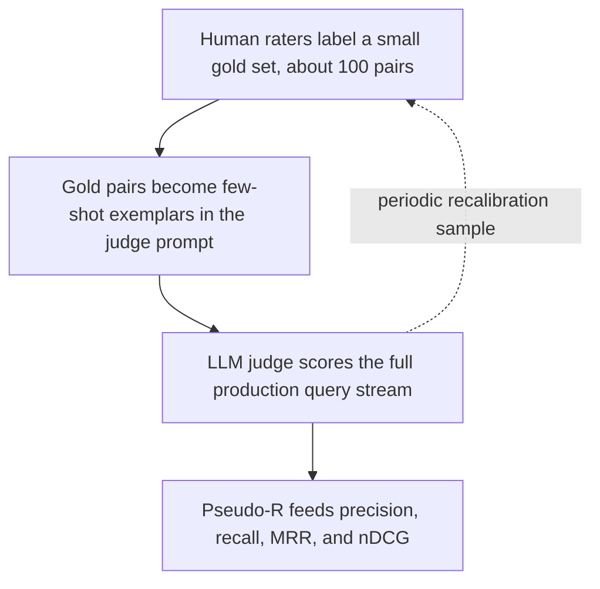
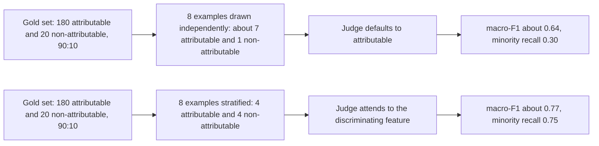

# Chapter 32: Evaluating Retrieval

Purpose: Build a retrieval evaluation that measures both coverage and ordering, remains computable when no relevance set exists yet, and exposes judge failures that accuracy can hide.

## TL;DR

- Retrieval-augmented generation (RAG) consumes an ordered list under a context cutoff. Precision, recall, and F1 only measure set overlap, so they cannot tell whether useful documents arrive early enough.
- Report recall at the exact k sent downstream. Pair it with mean reciprocal rank (MRR) or normalized discounted cumulative gain (nDCG) so coverage and rank quality stay separate.
- MRR uses only the first relevant hit for each query. nDCG uses every graded hit, discounts lower ranks, and normalizes against the best order for that query.
- Without a labeled relevant set, the standard metrics are uncomputable. Humans, a calibrated large language model (LLM) judge, or a trained classifier must first supply relevance labels.
- A small human gold set anchors an LLM judge. Few-shot exemplars transfer the rubric, while periodic human checks detect judge drift.
- Judge prompts need balanced, boundary-focused exemplars. Proportional sampling can copy the majority-class bias already present in production traffic.
- Use macro-F1 as the headline judge metric under class imbalance. Accuracy can look strong while minority-class recall collapses.

## The story

Think of retrieval as the stage crew for a play. The corpus is the prop warehouse. A query is the scene request. The relevant set contains every prop that belongs in the scene. The retriever sends a ranked cart toward the stage.

Set metrics inspect the cart after ten slots. They ask how many correct props are somewhere on it. They do not ask where those props sit. A cart with every needed prop in slots 1 through 4 looks identical to one with the same props in slots 7 through 10.

The generator is the actor. It can reach only the first five slots before the curtain rises. The first cart supports the scene. The second cart technically contains the same props, but the actor never touches them. Recall at the stage cutoff and a rank metric expose that difference.

MRR behaves like a stage manager who stops checking after finding the first usable prop. That works when one prop completes the scene. It fails when the scene needs several props or when one prop is much better than another. nDCG keeps walking down the cart, records each relevance grade, and discounts items that arrive late.

Now remove the prop checklist. Nobody knows which warehouse items truly belong in the scene. The formulas still mean the same thing, but they cannot run. Human raters can build the checklist. An LLM judge can extend a small, human-labeled checklist across a much larger stream, but only after the production rubric is shown through examples.

The rehearsal examples shape the judge. If seven of eight examples show a good citation, the judge may learn that most citations should pass. A balanced rehearsal forces it to study what separates a sound citation from a broken one. Macro-F1 then scores both classes equally, so a polished majority-class performance cannot hide failure on the rare class.

The whole evaluation is one stage pipeline. Retrieval owns whether the needed props enter the candidate cart. Ranking owns how soon they appear. Human labels anchor what relevance means. The judge scales that decision. Balanced exemplars and macro-F1 keep the judge from rewarding its own easiest habit.

## Decoder table

| Term | Decoder | Why it matters |
| --- | --- | --- |
| Query q | One information need being evaluated | Every relevance set and ranked list is tied to a specific query. |
| Query set Q | All evaluation queries | MRR averages one reciprocal-rank value per query across Q. |
| Retrieval-Augmented Generation (RAG) | A generator that answers from retrieved evidence | Retrieval metrics must reflect the evidence slice the generator can read. |
| Relevant set R | Documents certified as relevant to q | Precision, recall, MRR, and nDCG all require relevance judgments. |
| Retrieved set S_k | The top k returned documents treated as a set | Its intersection with R drives set metrics. |
| k | The retrieval cutoff | It should match the list depth that the next stage actually consumes. |
| Corpus size N | Total documents that could be retrieved | A huge N creates overwhelming numbers of true negatives. |
| Set intersection, S_k intersect R | Retrieved documents that also belong to R | Its size ignores the order of the retrieved documents. |
| Set size bars, such as absolute value of R | The number of items in a set | They turn set overlap into metric numerators and denominators. |
| Precision@k | Relevant documents among the top k, divided by k | It measures purity inside the cutoff. |
| Recall@k | Relevant documents among the top k, divided by all relevant documents | It measures coverage inside the cutoff. |
| Precision P and recall R in the F1 formula | Short names for the two set metrics after they are computed | Their harmonic mean produces F1. |
| F1 score at k | Harmonic mean of precision@k and recall@k | It collapses toward zero when either component does. |
| Accuracy | Correct positive and negative calls divided by all calls | It is a trap when rare relevant items are swamped by true negatives. |
| True positive (TP) | A relevant item correctly predicted as relevant | It increases both precision and recall. |
| True negative (TN) | An irrelevant item correctly predicted as irrelevant | Its huge count can make retrieval accuracy misleading. |
| False positive (FP) | An irrelevant item predicted as relevant | It lowers precision. |
| False negative (FN) | A relevant item missed by the system | It lowers recall. |
| Set metric | A metric based on membership, not sequence | Permuting a result set does not change it. |
| Rank metric | A metric that changes when hit positions change | It measures whether useful documents arrive early enough. |
| Rank-decreasing weight | Less credit for a hit at a lower position | It turns presence into positional usefulness. |
| Top-k context cutoff | The slice that reaches the generator | Documents below it cannot help generation in that run. |
| Context budget | The token capacity available for the query, instructions, and retrieved chunks | It turns rank position into a practical serving constraint. |
| Position bias | A model's tendency to use earlier context more strongly | It makes early evidence valuable even within the cutoff. |
| Candidate depth d | The retrieval depth handed to a reranker | Recall@d is the ceiling a reranker cannot repair. |
| Reranker | A stage that reorders retrieved candidates | It can improve order but cannot recover an absent document. |
| First relevant rank, rank_q | Position of the first relevant hit for query q | It is the denominator of reciprocal rank. |
| Reciprocal rank, RR_q | One divided by the first relevant rank | It is zero when no relevant hit appears. |
| Mean reciprocal rank (MRR) | Mean of reciprocal rank across Q | It rewards an early first hit and ignores later relevant hits. |
| Binarization threshold | Grade cutoff that turns graded relevance into relevant or not relevant | MRR changes if this threshold changes. |
| Graded relevance | A relevance strength such as 0, 1, 2, or 3 | It preserves more information than a binary label. |
| Rank index i | The current position while summing a ranked list | It selects both the relevance grade and its discount. |
| Relevance grade rel_i | The judged relevance of the document at rank i | It supplies the gain term at that position. |
| Cumulative gain (CG) | Sum of relevance grades through k | It uses grades but still ignores order. |
| Discounted cumulative gain (DCG) | Sum of each relevance grade divided by a logarithmic rank discount | It gives lower positions less credit while retaining every hit. |
| Ideal DCG (IDCG) | DCG for the best possible order under that query's judgments | It supplies the per-query normalization ceiling. |
| Normalized discounted cumulative gain (nDCG) | DCG divided by IDCG | It places each query on a 0 to 1 scale. |
| Reciprocal Rank Fusion | A way to merge several ranked lists using reciprocal-rank contributions | It is not the mistaken per-query MRR calculation that sums all hits. |
| Microsoft Machine Reading Comprehension (MS MARCO) passage ranking | A benchmark leaderboard that reports MRR@10 in the source | It demonstrates why first-hit position matters. |
| Text Retrieval Conference (TREC) Deep Learning Track | A benchmark with four-level relevance judgments scored by nDCG@10 | It demonstrates why graded order should not be collapsed to a binary first hit. |
| TREC pooling | Human judgment over the union of top-ranked benchmark results | It limits labeling work when exhaustive corpus judgment is impossible. |
| Human panel | People who label query-document pairs against a rubric | It offers the closest stated proxy to user judgment but costs time and money. |
| Query-document pair | One query joined with one candidate passage for labeling | Evaluation cost scales with query count times candidate depth. |
| Relevance rubric | The written rule that defines a relevant label | Humans and automated judges need the same target definition. |
| Gold set | A small set of human-labeled query-document pairs | It anchors judge calibration and later checks. |
| Large language model (LLM) | A general language model used here to judge relevance from a prompt | It can scale labels after human calibration. |
| Zero-shot judge | An LLM judge with no worked relevance examples | It follows its own unstated relevance standard. |
| Few-shot exemplars | Human-labeled examples placed in the judge prompt | They pull the model toward the product rubric. |
| In-context learning | Behavior adjustment from prompt examples without retraining | It lets a small gold set guide a much larger evaluation stream. |
| Pseudo-R | The relevance set produced by judge labels | It allows the standard retrieval metrics to run at scale. |
| Judge calibration | Comparing and aligning judge decisions with human labels | It establishes whether the proxy matches the intended rubric. |
| Recalibration | Repeating a human agreement check on fresh samples | It catches model updates and task drift. |
| Agreement rate | Fraction of judge labels that match held-out human labels | It is a required gate before trusting judge outputs. |
| Judge drift | A change in labeling behavior after model or traffic changes | It can look like a retrieval regression without fresh human checks. |
| Trained classifier judge | A supervised model trained on labeled relevance data | It trades up-front label cost for cheap, fast repeated inference. |
| Corrective Retrieval-Augmented Generation (CRAG) evaluator | A fine-tuned Text-to-Text Transfer Transformer large (T5-large) classifier with correct, incorrect, or ambiguous outputs | It is not a cosine-similarity threshold. |
| Cosine similarity threshold | A rule that labels a pair from the angle between embedding vectors | The source explicitly says this is not how the CRAG evaluator works. |
| Out-of-distribution risk | Failure when live queries differ from training data | It limits trained judges and motivates separate evaluation slices. |
| Haystack evaluation harness | Existing tooling named for the semi-automatic judge workflow | It shows that the calibration pattern can use established infrastructure. |
| Attribution judgment | Whether a cited passage supports a generated claim | It is the imbalanced binary task used in the judge-design example. |
| AttributionBench | The benchmark named for evaluating automatic attribution judges | It supplies the macro-F1 result and error analysis used in the chapter. |
| Class imbalance | One label appears much more often than another | It can inflate accuracy and distort exemplar sampling. |
| Class index c | One label in a C-class judgment task | It keeps each class's confusion counts separate. |
| Class count C | Number of possible labels | It is the divisor in macro-F1. |
| True positive for class c, TP_c | Correct prediction of class c | It enters class-specific precision and recall. |
| False positive for class c, FP_c | Incorrect prediction of class c | It lowers precision for class c. |
| False negative for class c, FN_c | Missed example of class c | It lowers recall for class c. |
| Per-class precision, P_c | Correct class-c predictions divided by all class-c predictions | It asks how trustworthy that predicted label is. |
| Per-class recall, R_c | Correct class-c predictions divided by all true class-c examples | It exposes a judge that misses the rare class. |
| Per-class F1, F1_c | Harmonic mean of class-c precision and recall | It balances both failure types within one class. |
| Macro-F1 | Unweighted mean of per-class F1 values | Each class counts equally, regardless of frequency. |
| Majority class | The more common label | A judge can guess it and earn misleading accuracy. |
| Minority class | The rarer label | Its recall reveals whether the judge catches uncommon failures. |
| Proportional exemplars | Prompt examples drawn at the gold set's natural class rate | They can reproduce the existing imbalance. |
| Stratified exemplars | Prompt examples selected with roughly equal class counts | They force attention onto the discriminating feature. |
| Boundary exemplar | A near-miss close to the decision threshold | It teaches subtle differences better than an obvious case. |
| Base rate | The natural frequency of each label in a dataset | A prompt can copy this shortcut instead of learning the distinction. |
| Class weighting | Training-time reweighting that gives rare classes more influence | It replaces prompt stratification when a dedicated classifier is trained. |
| Independent and identically distributed draw | Random sampling from the same underlying class mixture | An eight-example draw from a 90:10 set gives about seven majority cases and one minority case in expectation. |
| In-distribution slice | Evaluation data like the exemplar source | Strong performance here may reflect surface-pattern fit. |
| Out-of-distribution slice | Evaluation data from a new domain | It tests whether the judge learned the rule rather than one dataset's patterns. |
| Fine-grained information insensitivity | Missing nuance, inference, summaries, or subtle contradictions | It accounts for 66% of 300 analyzed judge errors in the cited analysis. |
| Information access mismatch | Humans see the full page while the judge sees only a snippet | It accounts for another 27% and cannot be fixed by exemplar tuning alone. |
| Concurrency | Number of judge calls run at the same time | It converts total calls into illustrative wall-clock time. |

## Core mechanics

### 32.1 Set metrics vs rank metrics

#### What it measures

Fix query q. Let R be the ground-truth relevant set. Let the retrieved set at cutoff k be S sub k. Then:

$$
\mathrm{Precision@}k = \frac{|S_k \cap R|}{k}
$$

$$
\mathrm{Recall@}k = \frac{|S_k \cap R|}{|R|}
$$

$$
\mathrm{F1@}k = \frac{2PR}{P+R}
$$

F1 uses the harmonic mean. It moves toward zero when either precision or recall does. This punishes a trade that improves one side by abandoning the other.

Plain accuracy is:

$$
\mathrm{Accuracy} = \frac{TP+TN}{TP+TN+FP+FN}
$$

For a corpus of ten million documents with four relevant documents, retrieving nothing gives:

$$
\frac{10^7-4}{10^7} \approx 99.99996\%
$$

The source prints 99.9996%. Direct recomputation gives 99.99996%, which is the value shown above. This file preserves the discrepancy instead of treating the printed percentage as exact.

True negatives dominate. Accuracy therefore says almost nothing useful in this retrieval setting.

Precision, recall, and F1 all depend on the size of the same set intersection. Any permutation of the top-k documents leaves those values unchanged.

Rank metrics replace equal membership credit with weights that decrease with rank. MRR uses one divided by rank for the first hit. nDCG uses one divided by the base-2 logarithm of rank plus one for every graded hit.

#### Why it matters

A RAG pipeline passes an ordered list into a fixed token budget. The generator may read only the first few documents. Position bias can make early placement matter even within that slice.

The worked example fixes four relevant chunks and a ten-document result set. System A puts the four hits at ranks 1 through 4. System B puts the same four hits at ranks 7 through 10.

At k equal to 10, both systems score:

$$
\mathrm{Precision@10} = \frac{4}{10} = 0.4
$$

$$
\mathrm{Recall@10} = \frac{4}{4} = 1.0
$$

$$
\mathrm{F1@10} = \frac{2(0.4)(1.0)}{0.4+1.0} = \frac{0.8}{1.4} \approx 0.571
$$

Suppose the prompt fits five 500-token chunks alongside the question and instructions. The source calls this a realistic slice of a 4k-token prompt.

System A has recall@5 equal to 1.0. System B has recall@5 equal to 0. Their first-hit reciprocal ranks are:

$$
RR_A = \frac{1}{1} = 1.0
$$

$$
RR_B = \frac{1}{7} \approx 0.143
$$

The source uses the MS MARCO passage-ranking leaderboard as a sanity check. It reports MRR@10 rather than F1@10 or accuracy because the rank of a relevant passage matters.

#### Failure without it

A dashboard built only from set metrics can call Systems A and B identical even though only A supplies relevant context inside the production cutoff.

An accuracy dashboard can reward a retriever that returns nothing.

A reranker cannot fix missing coverage. If retrieval omits a relevant item from candidate depth d, no later reordering can recover it.

A single F1@k number therefore cannot establish that a retriever change helped downstream use.

#### Cost and decision rules

The chapter states no runtime complexity for these formulas. The practical cost comes from obtaining one consistent relevance sample and computing all set and rank metrics from it.

- Report recall at the exact k passed to the generator. Use a curve across k only for isolated retriever diagnosis before top-k is fixed.
- Pair every set metric with at least one rank metric. Use rank-aware judge protocols when no relevance judgments exist.
- Treat retrieval accuracy as a red flag. Use it only on a deliberately balanced binary judgment set.
- Compute set and rank metrics from the same relevance judgments. If annotation is expensive, sample once and compute every metric from that sample.
- Check recall at reranker candidate depth separately from post-rerank rank quality. Merge them only in a single-stage pipeline.

### 32.2 MRR, nDCG, and recall@k derived

#### What MRR measures

For each query q, rank sub q is the position of the first relevant hit. Reciprocal rank is zero when no relevant hit appears.

$$
RR_q = \frac{1}{\mathrm{rank}_q}
$$

MRR averages one reciprocal rank per query:

$$
\mathrm{MRR} = \frac{1}{|Q|}\sum_{q \in Q} RR_q
$$

MRR stops after the first relevant document. Later relevant documents never enter its per-query term.

For hits at ranks 1 and 10, adding one plus one tenth and dividing by list length gives 0.11. That number is not MRR. The correct reciprocal rank for that query is 1.0. Summing reciprocal contributions across several lists belongs to Reciprocal Rank Fusion, not per-query MRR.

#### What nDCG measures

A relevance judge can score documents on a 0 to 3 scale. The levels are irrelevant, marginally relevant, relevant, and highly relevant.

Cumulative gain sums the grades:

$$
\mathrm{CG@}k = \sum_{i=1}^{k} \mathrm{rel}_i
$$

CG still ignores order. Discounted cumulative gain adds a rank discount:

$$
\mathrm{DCG@}k = \sum_{i=1}^{k} \frac{\mathrm{rel}_i}{\log_2(i+1)}
$$

The plus one keeps rank 1 undiscounted:

$$
\log_2(1+1) = \log_2 2 = 1
$$

The logarithmic discount is gentler than one divided by rank. Rank 2 divides by about 1.585. Rank 10 divides by about 3.459. A hit at rank 4 or 5 still contributes real weight.

Raw DCG is not comparable across queries with different relevant-set sizes. Sort that query's judged documents by descending true relevance. Compute DCG on the ideal order to get IDCG. Then normalize:

$$
\mathrm{nDCG@}k = \frac{\mathrm{DCG@}k}{\mathrm{IDCG@}k}
$$

nDCG lies between 0 and 1. A score of 1.0 means the system achieved the best ordering available under that query's relevance judgments.

#### Why the three metrics disagree

The worked example has two relevant documents. Document A has grade 3. Document B has grade 1.

Configuration X puts B at rank 1 and A at rank 4. Configuration Y puts A at rank 1 and B at rank 4.

Both configurations have reciprocal rank 1.0. Both have recall@10 equal to 1.0. MRR and recall therefore call them a tie.

For Configuration X:

$$
\mathrm{DCG}_X = \frac{1}{\log_2 2} + \frac{3}{\log_2 5}
= 1.000 + 1.292 = 2.292
$$

For Configuration Y:

$$
\mathrm{DCG}_Y = \frac{3}{\log_2 2} + \frac{1}{\log_2 5}
= 3.000 + 0.431 = 3.431
$$

The ideal order puts A at rank 1 and B at rank 2:

$$
\mathrm{IDCG} = \frac{3}{\log_2 2} + \frac{1}{\log_2 3}
= 3.000 + 0.631 = 3.631
$$

The normalized scores are:

$$
\mathrm{nDCG}_X = \frac{2.292}{3.631} \approx 0.631
$$

$$
\mathrm{nDCG}_Y = \frac{3.431}{3.631} \approx 0.945
$$

The gap is 0.314. nDCG separates rankings that MRR and recall score identically.

The source uses the TREC Deep Learning Track as a sanity check. Its four-level judgments support nDCG@10. Binarizing them for MRR would discard the grade signal.

#### Failure without it

MRR has amnesia after the first hit. A multi-hop pipeline can score MRR equal to 1.0 while missing two of three required supporting chunks.

MRR also hides whether the first nonzero grade is merely marginal while a highly relevant document falls lower.

CG has the same order blindness as a set sum.

Raw DCG favors queries with more available relevant documents. Without a per-query IDCG, the value is not nDCG and is not comparable across queries.

nDCG alone does not replace recall. The source states that a relevant document absent from the top-k candidate pool contributes nothing to the measured ordering. Track recall separately to expose coverage failure.

#### Cost and decision rules

The chapter states no runtime complexity for MRR or nDCG. The design complexity lies in collecting relevance grades, fixing the MRR binarization threshold, and computing IDCG separately for each query.

- Prefer nDCG when relevance is graded or when the downstream task needs several passages.
- Use MRR when one top document genuinely completes the lookup. It may still appear beside nDCG.
- Write down the binary relevance threshold before computing MRR from graded labels. A threshold where grade 1 counts and a threshold where only grade 2 or higher counts produce different MRR values. Never change it silently between releases.
- Report nDCG at the k that the generator reads. nDCG@100 can look excellent while nDCG@5, the slice that enters the prompt, remains mediocre. Use a curve only for offline diagnosis before that k is fixed.
- Pair nDCG with recall@k, unless recall at rerank depth is already tracked upstream.
- Compute IDCG from each query's own judgments. Never replace it with a global constant.

### 32.3 Evaluating without ground truth

#### What changes when R is missing

Precision, recall, MRR, and nDCG assume that someone has identified relevant documents for each query. When R does not exist, the formulas stay valid but become uncomputable.

One of three sources must supply labels:

1. Human raters read query-document pairs against a rubric.
2. A prompted LLM judges relevance at evaluation time.
3. A supervised classifier learns the judgment task from labeled data.

Humans require no assumption that a model's relevance opinion matches a person's. They also consume rater time and money on every new evaluation pass.

A zero-shot LLM judge can start without a labeled corpus, but it applies its own unstated notion of relevance. A model may accept a document that mentions the entity even when the product rubric requires an answer.

A small gold set fixes that gap. Hand-label query-document pairs. Put worked examples in the prompt. Use in-context learning to pull the judge toward the product definition. Then compare the judge with fresh human samples over time.

A trained classifier moves the cost to an up-front labeled training set. The source identifies CRAG's evaluator as a fine-tuned T5-large model that predicts correct, incorrect, or ambiguous. It is not an embedding cosine-similarity threshold. It can run cheaply after training, but it carries out-of-distribution risk when queries drift.

#### Why calibration matters

An LLM judge does not replace human judgment. It amortizes a small, carefully labeled human set across a production stream that humans cannot cover continuously.

The default pipeline has four steps:

1. Define the relevance rubric.
2. Label a gold set of roughly 100 pairs.
3. Format gold pairs as few-shot prompt exemplars.
4. Let the judge label the larger stream and periodically compare it with a fresh human sample.

The judged labels form pseudo-R. The usual precision, recall, MRR, and nDCG formulas then apply.

The source names Haystack's evaluation harness as existing tooling for this semi-automatic workflow.

#### Worked cost example

Take 500 held-out production queries at candidate depth 20. The evaluation needs:

$$
500 \times 20 = 10{,}000
$$

query-document judgments.

For a human-only panel, assume 2 judgments per minute, or 120 per hour:

$$
\frac{10{,}000}{120} \approx 83.3 \text{ rater-hours}
$$

At the illustrative rate of 25 dollars per hour:

$$
83.3 \times 25 \approx 2{,}083 \text{ dollars}
$$

One rater needs more than ten workdays. Ten parallel raters need about 8.3 hours.

For the calibrated LLM judge, assume 300 input tokens and 20 output tokens per call. The illustrative prices are 0.50 dollars per million input tokens and 1.50 dollars per million output tokens.

$$
300 \times \frac{0.50}{10^6} + 20 \times \frac{1.50}{10^6}
= 0.00018 \text{ dollars per call}
$$

All 10,000 pairs cost:

$$
10{,}000 \times 0.00018 \approx 1.80 \text{ dollars}
$$

At 50 concurrent requests and about one second per call:

$$
\frac{10{,}000}{50} \approx 200 \text{ seconds} \approx 3.3 \text{ minutes}
$$

The initial 100 human labels take about 0.83 rater-hours and cost around 21 dollars.

Across ten weekly iterations, the human-only path costs about 20,833 dollars and 833 rater-hours.

The LLM path costs about 102 dollars when each pass costs 1.80 dollars and a fresh 21-dollar gold sample is collected every third pass. Ten passes use four such samples. The source reports under one hour of total wall-clock time.

The source calls the gap roughly three orders of magnitude in cost and latency. These are illustrative assumptions, not universal provider prices or measured production guarantees.

TREC pooling provides the chapter's sanity check. A one-time benchmark judges only the union of top-ranked results because exhaustive manual judgment does not scale. Continuous per-release evaluation reaches the same wall sooner.

#### Failure without it

A zero-shot judge with no human agreement check measures an uncalibrated opinion.

If the model behind the judge changes, its leniency can change. Without recalibration, a team cannot separate retrieval regression from judge drift.

A team that retrains a retriever against disputed judge labels can optimize the retriever toward an unverified proxy.

A trained classifier can fail after a domain shift even when it was reliable on its training distribution.

#### Cost and decision rules

- Build a human gold set of roughly 100 query-document pairs before writing a decision-grade judge prompt. Use zero-shot only for disposable exploration.
- Draw few-shot examples from the gold set. Do not trust the model's unstated relevance standard.
- Recalibrate after every judge-model swap and at least every few evaluation passes. A pinned model and demonstrably stable task distribution are the stated rare exception.
- Prefer a prompted LLM judge for offline periodic evaluation. Reserve a trained classifier for low-latency judgment inside the serving path when prompt-time latency is the bottleneck.
- Reserve full human panels for launch-grade decisions and judge repair. A major model or index migration can justify the cost.
- If human agreement falls below the chosen threshold, fix the rubric, prompt, or exemplars. Do not keep shipping on the judge's numbers.

### 32.4 Judge design, class balance, and macro-F1

#### What accuracy hides

Consider an attribution judge. It labels each generated claim and cited passage as attributable or non-attributable.

If 90% of the gold set is attributable, a judge that predicts attributable almost every time gets about 90% accuracy without learning to catch broken citations.

Accuracy pools both classes:

$$
\mathrm{Accuracy} = \frac{TP+TN}{N}
$$

Macro-F1 first computes precision, recall, and F1 separately for each class c:

$$
P_c = \frac{TP_c}{TP_c+FP_c}
$$

$$
R_c = \frac{TP_c}{TP_c+FN_c}
$$

$$
F1_c = \frac{2P_cR_c}{P_c+R_c}
$$

Then it gives every class equal weight:

$$
\mathrm{macro\text{-}F1} = \frac{1}{C}\sum_{c=1}^{C} F1_c
$$

A class with 20 examples counts as much as a class with 180. The minority-class term therefore lowers the average when the judge misses rare failures.

AttributionBench uses macro-F1 for attributable versus non-attributable judgments. The source reports that a fine-tuned, purpose-built judge reaches roughly 80% macro-F1. It describes about one verdict in five as wrong and treats this result as a ceiling that a handful of prompt exemplars should not be expected to exceed.

#### Why exemplar balance matters

Prompt construction decides class balance before scoring starts.

A random eight-example draw from a 90:10 gold set yields about seven attributable examples and one non-attributable example in expectation. The judge sees many demonstrations of success and only one demonstration of failure. It can learn the base rate instead of the decision boundary.

Stratifying the eight exemplars into four per class removes that prompt-level shortcut. Boundary cases teach the judge the subtle distinction that the metric rewards.

AttributionBench's error analysis covers 300 cases. It assigns 66% to fine-grained information insensitivity. These failures include missed nuance, failed inference or summarization, and overlooked subtle contradictions.

Another 27% comes from information access mismatch. The human annotator saw the full source page, while the model saw only the retrieved snippet. Exemplar tuning cannot repair information that never enters the prompt.

The benchmark checks generalization on four in-distribution datasets and three out-of-distribution datasets. This separates learning the decision rule from matching one dataset's surface patterns.

#### Worked class-balance example

Take 200 held-out query-claim-passage triples. There are 180 truly attributable cases and 20 truly non-attributable cases.

The two configurations are illustrative constructions. The source anchors them against the published roughly 80% macro-F1 figure. It does not present them as measured benchmark runs.

Configuration 1 uses seven attributable exemplars and one non-attributable exemplar.

The judge correctly calls 171 of 180 attributable pairs. It correctly calls 6 of 20 non-attributable pairs. The recalls are 0.95 and 0.30.

It predicts 185 cases as attributable. That total is 171 correct calls plus 14 missed non-attributable cases. It predicts 15 as non-attributable. That total is 6 correct calls plus 9 missed attributable cases.

$$
P_{\mathrm{attrib}} = \frac{171}{185} = 0.924
$$

$$
F1_{\mathrm{attrib}} = \frac{2(0.924)(0.95)}{0.924+0.95} = 0.937
$$

$$
P_{\mathrm{non}} = \frac{6}{15} = 0.40
$$

$$
F1_{\mathrm{non}} = \frac{2(0.40)(0.30)}{0.40+0.30} = 0.343
$$

$$
\mathrm{macro\text{-}F1} = \frac{0.937+0.343}{2} = 0.640
$$

$$
\mathrm{accuracy} = \frac{171+6}{200} = 0.885
$$

The 88.5% accuracy hides a judge that catches only 30% of the broken citations.

Configuration 2 uses four exemplars from each class.

The judge correctly calls 165 of 180 attributable pairs and 15 of 20 non-attributable pairs. The recalls are 0.917 and 0.75.

It predicts 170 cases as attributable. That total is 165 correct calls plus 5 missed non-attributable cases. It predicts 30 as non-attributable. That total is 15 correct calls plus 15 missed attributable cases.

$$
P_{\mathrm{attrib}} = \frac{165}{170} = 0.971
$$

$$
F1_{\mathrm{attrib}} = 0.943
$$

$$
P_{\mathrm{non}} = \frac{15}{30} = 0.50
$$

$$
F1_{\mathrm{non}} = 0.600
$$

$$
\mathrm{macro\text{-}F1} = \frac{0.943+0.600}{2} = 0.772
$$

$$
\mathrm{accuracy} = \frac{165+15}{200} = 0.900
$$

Stratification moves macro-F1 from 0.640 to 0.772. Accuracy also rises from 88.5% to 90%. The majority recall drops from 0.95 to 0.917, but minority recall rises from 0.30 to 0.75.

The constructed macro-F1 of 0.772 sits just below the roughly 0.80 fine-tuned result. The source says a constructed prompted result above that ceiling would deserve distrust.

#### Failure without it

Accuracy can approve a judge that misses every minority-class case.

Proportional prompt sampling can reproduce the class imbalance that evaluation should expose.

Obvious exemplars can teach output format without teaching fine distinctions near the boundary.

An in-distribution split can hide domain failure. The source interview case reports 78% macro-F1 in distribution, 61% on a new domain, and 89% accuracy on that new domain. The 17-point macro-F1 drop is the meaningful signal.

No exemplar strategy can correct information access mismatch when the judge lacks the evidence used for the gold label.

#### Cost and decision rules

The chapter gives no per-call cost for this attribution judge. Its design cost comes from balanced exemplar selection, boundary-case review, per-class scoring, and separate out-of-distribution validation.

- Report macro-F1 as the headline number under class imbalance. Keep accuracy only as a secondary metric beside per-class recall.
- Stratify few-shot exemplars by class. Use class weighting instead once enough labeled data supports a dedicated classifier.
- Prefer boundary cases over random, obvious examples. Use obvious cases only for a disposable format check.
- Validate on an out-of-distribution slice. Skip it only for a judge permanently limited to one fixed narrow domain.
- Treat macro-F1 in the 60s as a prompt-rework signal. If human raters disagree on the minority class, enlarge or repair the gold set instead.

## Diagrams

### Figure 32.1

| Rank | System A | System B | Inside top-5 generator cutoff |
| ---: | :---: | :---: | :---: |
| 1 | R | - | Yes |
| 2 | R | - | Yes |
| 3 | R | - | Yes |
| 4 | R | - | Yes |
| 5 | - | - | Yes |
| 6 | - | - | No |
| 7 | - | R | No |
| 8 | - | R | No |
| 9 | - | R | No |
| 10 | - | R | No |

> Figure 32.1: Systems A and B retrieve the same four relevant documents (shaded, marked R) among the same ten candidates, so precision@10, recall@10, and F1@10 are identical for both - but only System A's relevant documents survive the top-5 cutoff that actually reaches the generator.

### Figure 32.2

| Metric view | Rank 1 | Rank 2 | Rank 3 | Rank 4 | Rank 5 | Rank 6 | Rank 7 | Rank 8 | Rank 9 | Rank 10 | Result |
| --- | --- | --- | --- | --- | --- | --- | --- | --- | --- | --- | --- |
| MRR | 1 | - | - | 3, ignored | - | - | - | - | - | - | RR = 1/1 = 1.0 |
| nDCG | 1 | - | - | 3 | - | - | - | - | - | - | DCG about 2.292 |

> Figure 32.2: MRR stops scoring at the first relevant hit, at rank 1. nDCG discounts and sums every relevant hit by its graded relevance, so it alone registers the far more relevant document sitting at rank 4.

### Figure 32.3

> Figure 32.3: A small human-labeled gold set is not replaced by the LLM judge. It calibrates the judge once and re-checks it periodically, while the judge itself carries the evaluation load at scale.

### Figure 32.4

> Figure 32.4: Sampling exemplars in proportion to the gold set's natural class frequency reproduces that imbalance inside the judge. Stratifying the exemplar set instead raises macro-F1 by fixing recall on the class accuracy was hiding.

## Whiteboard pack

### Drawing order

1. Draw a query box labeled q and a ground-truth set labeled R.
2. Draw a ranked list with a horizontal cutoff at the production k.
3. Write precision@k, recall@k, and F1@k beside the list.
4. Show System A hits at ranks 1 through 4 and System B hits at ranks 7 through 10.
5. Write reciprocal rank, MRR, DCG, IDCG, and nDCG in derivation order.
6. Draw the human gold set feeding few-shot exemplars, the LLM judge, and pseudo-R.
7. Add a dotted recalibration loop from the judge to a fresh human sample.
8. Finish with two 90:10 exemplar paths, one proportional and one stratified, then write per-class F1 and macro-F1.

### 96-word script

Start with coverage. Precision and recall use set intersection, so they ignore order. At the production cutoff, recall tells me whether relevant evidence reaches the generator. Then I add rank quality. MRR averages the reciprocal rank of the first hit. nDCG sums every graded hit with a logarithmic discount and divides by the ideal ordering. If relevance labels do not exist, I build a small human gold set, calibrate a few-shot LLM judge, and recheck agreement periodically. For imbalanced judge labels, I stratify exemplars and report macro-F1 plus per-class recall, because accuracy can hide minority failure.

## Interview traps

### 1. Two retrievers have identical precision@10 and recall@10. Which one ships?

Answer: The two numbers cannot decide because they ignore order, so inspect recall plus MRR or nDCG at the actual production cutoff. In the source example, both systems have precision@10 equal to 0.4, recall@10 equal to 1.0, and F1@10 about 0.571, while at k equal to 5 System A has recall 1.0 and System B has recall 0. Their first-hit reciprocal ranks are 1.0 and about 0.143, so only System A supplies relevant evidence to the generator.

### 2. Derive recall, MRR, and nDCG instead of quoting them.

Answer: Recall@k divides relevant hits inside the top k by all relevant documents, while MRR averages one divided by each query's first relevant rank and uses zero when no hit appears. CG sums grades, then DCG divides every grade by the base-2 logarithm of rank plus one, where the plus one preserves full credit at rank 1. IDCG applies DCG to the ideal per-query order, nDCG divides DCG by IDCG, and recall remains necessary because ordering does not replace coverage.

### 3. There is no ground-truth relevant set. Can retrieval still be evaluated?

Answer: The standard metrics become uncomputable until human raters, a prompted LLM judge, or a supervised classifier supplies R. For recurring offline evaluation, start with roughly 100 human-labeled pairs, use them as few-shot examples, run the judge at scale, check fresh human agreement, and treat the outputs as pseudo-R. The illustrative 10,000-pair pass costs about 2,083 dollars and 83.3 rater-hours with humans versus about 1.80 dollars and 3.3 minutes for the calibrated LLM pass, plus calibration cost.

### 4. A judge reaches 91% accuracy on a 90:10 gold set. Do you ship it?

Answer: Do not ship from accuracy alone because a majority-only policy can earn 90% accuracy for free, so ask for per-class recall and macro-F1. Build the prompt with roughly equal boundary-focused examples per class and validate on an out-of-distribution slice. The construction raises minority recall from 0.30 to 0.75 and macro-F1 from 0.640 to 0.772, but missing source context still requires an information-access fix rather than more examples.

### 5. The reranking team says it can fix retrieval order. Does retrieval-stage evaluation still matter?

Answer: Yes, because retrieval owns recall at candidate depth d and a reranker can reorder only documents that enter that pool. Measure recall@d before reranking, then measure MRR or nDCG after reranking at the generator's final k. This separates the retrieval ceiling from ordering quality and prevents either team from using one aggregate number to stand in for the other.

## Key numbers

| Topic | Exact source value | Meaning or claim limit |
| --- | --- | --- |
| Accuracy trap | N = 10,000,000 and four relevant documents | The source prints 99.9996%. Direct recomputation gives 99.99996% accuracy. |
| Set-ranking example | Four relevant chunks among ten results | System A ranks them 1 through 4. System B ranks them 7 through 10. |
| Set metrics | Precision@10 = 0.4, recall@10 = 1.0, F1@10 about 0.571 | The two orders tie. |
| Production cutoff | k = 5 | System A recall is 1.0. System B recall is 0. |
| Prompt slice | Five chunks of 500 tokens in a 4k-token prompt | This is the source's stated realistic slice. |
| Reciprocal rank | 1.0 versus about 0.143 | First relevant ranks are 1 and 7. |
| False MRR calculation | 1.1 divided by list length 10 gives 0.11 | This is not MRR because one query contributes only its first relevant hit. |
| Relevance scale | 0 to 3 | Irrelevant through highly relevant. |
| MRR threshold examples | Grade at least 1 versus grade at least 2 | The source says the chosen binary threshold changes MRR. |
| Log discounts | log base 2 of 3 about 1.585 and log base 2 of 11 about 3.459 | These are rank-2 and rank-10 denominators. |
| Graded example | Grade 1 at rank 1 and grade 3 at rank 4, then reversed | MRR and recall@10 tie both orders. |
| DCG | 2.292 versus 3.431 | The grade-3-first order scores higher. |
| IDCG | 3.631 | Grade 3 at rank 1 and grade 1 at rank 2. |
| nDCG | 0.631 versus 0.945 | The gap is 0.314. |
| nDCG range | 0 to 1 | A value of 1 means the best available per-query ordering. |
| Multi-hop warning | Three supporting chunks with two missing | MRR can still equal 1.0 after the first hit. |
| Dashboard prompt | MRR rises from 0.62 to 0.81 | The source says this alone does not justify shipping. |
| Human gold anchor | Roughly 100 pairs | It calibrates and periodically checks the judge. |
| Production evaluation | 500 queries at depth 20 | This produces 10,000 query-document pairs. |
| Human throughput | 2 judgments per minute or 120 per hour | 10,000 labels need about 83.3 rater-hours. |
| Human rate | 25 dollars per hour | One pass costs about 2,083 dollars. |
| Human wall time | More than ten workdays for one rater or about 8.3 hours for ten raters | These values follow the stated throughput. |
| LLM prompt | 300 input tokens and 20 output tokens | These are illustrative averages. |
| LLM prices | 0.50 dollars per million input tokens and 1.50 dollars per million output tokens | These are illustrative hosted-model prices. |
| LLM call cost | 0.00018 dollars | 10,000 calls cost about 1.80 dollars. |
| LLM concurrency | 50 calls at about one second each | Wall time is about 200 seconds or 3.3 minutes. |
| Calibration cost | 100 labels, 0.83 rater-hours, about 21 dollars | Human labels remain part of the process. |
| Ten human passes | About 20,833 dollars and 833 rater-hours | This is the source's ten-week comparison. |
| Ten LLM passes | About 102 dollars and under one hour | It includes four fresh 21-dollar samples, one every third pass. |
| Scaling gap | Roughly three orders of magnitude | The source limits this to its illustrative cost and latency setup. |
| Disagreement probe | 15% | The source says inspect disagreements before retraining. |
| Accuracy scene | 91% reported accuracy on a 90% majority set | The number does not prove minority performance. |
| AttributionBench result | Roughly 80% macro-F1 | The source treats the fine-tuned result as an approximate ceiling for a prompted judge. |
| Error analysis | 300 cases | The analysis assigns 66% to fine-grained insensitivity and 27% to information access mismatch. |
| Dataset slices | Four in-distribution and three out-of-distribution datasets | They test generalization. |
| Gold class split | 180 attributable and 20 non-attributable | The ratio is 90:10. |
| Proportional prompt | Seven attributable and one non-attributable exemplar | The minority recall is 0.30. |
| Stratified prompt | Four attributable and four non-attributable exemplars | The minority recall is 0.75. |
| Proportional calls | 171 of 180 attributable and 6 of 20 non-attributable correct | Macro-F1 is 0.640 and accuracy is 0.885. |
| Stratified calls | 165 of 180 attributable and 15 of 20 non-attributable correct | Macro-F1 is 0.772 and accuracy is 0.900. |
| Majority recall trade | 0.95 down to 0.917 | The judge becomes more willing to predict non-attributable. |
| Minority recall gain | 0.30 up to 0.75 | This drives the macro-F1 improvement. |
| Prompt-rework signal | Macro-F1 in the 60s | The source treats this as a judge that should not ship. |
| Out-of-distribution probe | 78% macro-F1 down to 61%, while accuracy remains 89% | The 17-point macro-F1 drop blocks shipping in the source answer. |
