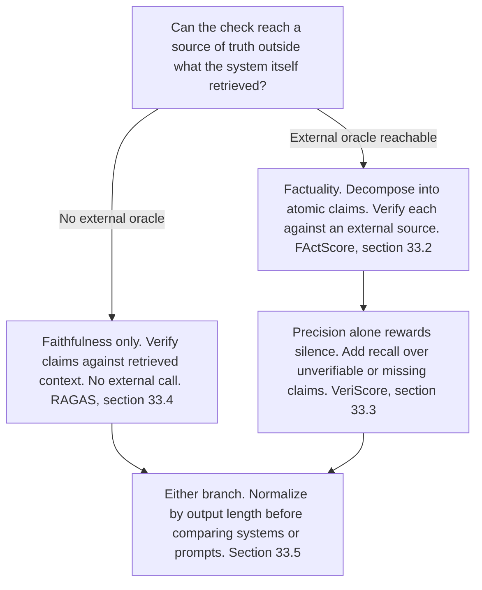
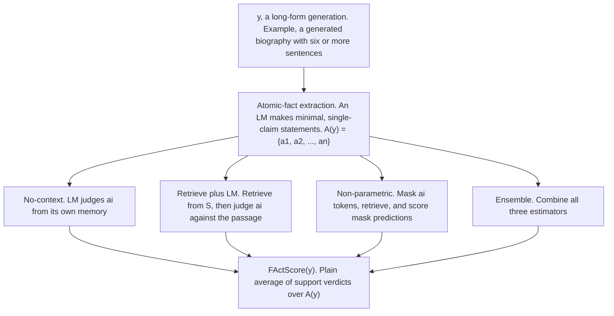
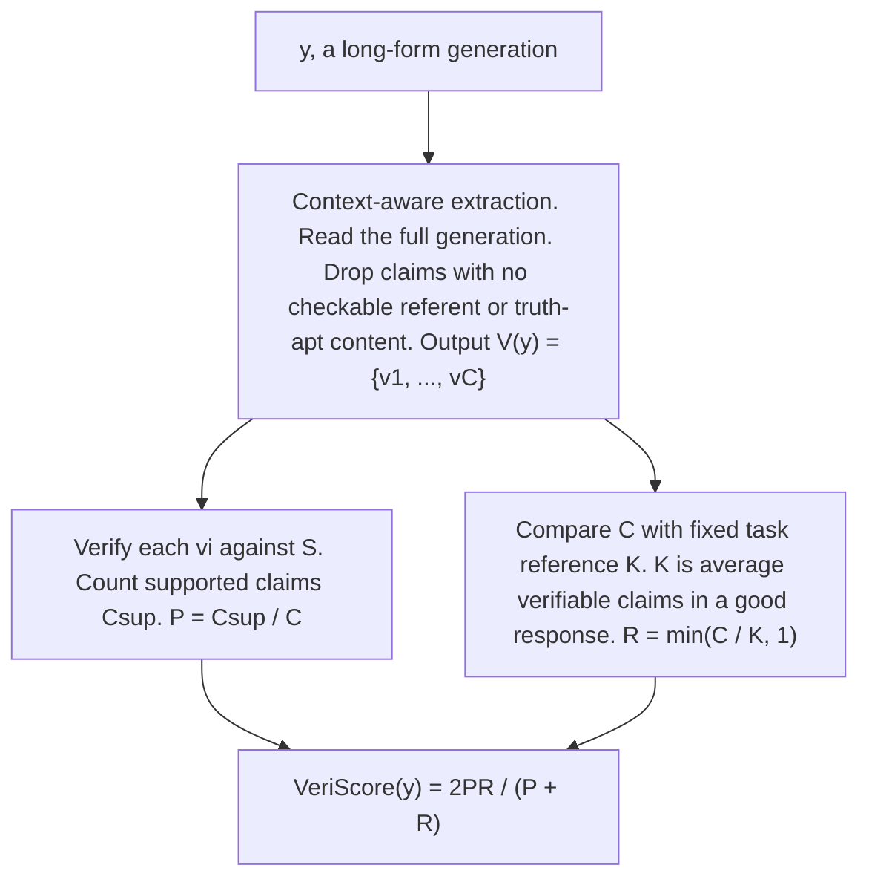
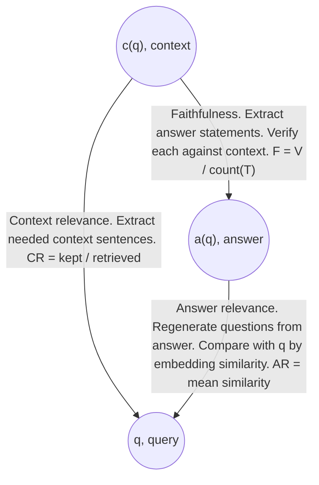

# Chapter 33: Evaluating Generation

This chapter explains how to choose and interpret generation metrics for a Retrieval-Augmented Generation (RAG) system when oracle access, claim coverage, output length, and summarization behavior all affect the result.

## TL;DR

- Faithfulness asks whether an answer follows the retrieved context. Factuality asks whether it is true in the world.
- Oracle access decides where a metric can run. Context-only checks fit a per-request gate. External-source checks usually belong in scheduled evaluation.
- Fine-grained Atomic Evaluation of Factual Precision (FActScore) splits a long answer into atomic facts, verifies each fact, and averages the support verdicts.
- FActScore is precision-only. A system can earn a perfect score by stating one safe fact and omitting everything else.
- VeriScore adds context-aware claim extraction and a recall term based on how many verifiable claims a good answer should contain.
- Retrieval Augmented Generation Assessment (RAGAS) separately scores answer support, answer relevance, and retrieved-context relevance with no external ground truth.
- Longer outputs tend to accumulate more unsupported facts. Report scores by position or length bucket, not only as one pooled average. Abstractive summarization has no settled zero-hallucination target. A checker can confuse useful bridging inference with fabrication.

## The story

Picture a newsroom that publishes answers from a research desk.
The retriever, meaning the search stage, is the researcher who puts source pages on a reporter's desk.
The generator, meaning the writing model, is the reporter who turns those pages into an answer.
The evaluator is the fact-checking editor.
The editor first asks which archive is open before deadline.
If only the reporter's source packet is available, the editor can test faithfulness, meaning whether every claim follows from that packet.
If the editor can also reach a trusted outside archive, the editor can test factuality, meaning whether every claim is true beyond the packet.
That outside archive is the oracle, meaning the evidence source used to decide support.
An outside archive may answer slowly, reject too many requests, or be unavailable.
The editor therefore uses the packet-only check on every draft and saves the outside-archive check for a scheduled audit.
FActScore is the editor's claim-card method.
The editor cuts a long article into atomic facts, meaning minimal cards that each make one independently checkable claim.
Each card gets a supported or unsupported mark.
The average of those marks gives a fine-grained precision score.
The method can distinguish an article with three wrong details from one that invents nearly everything.
The claim-card method has a loophole.
A reporter can submit one safe sentence, earn one supported mark out of one, and receive a perfect score.
VeriScore closes that newsroom loophole in two ways.
First, the editor reads the whole article while making cards, so a word such as "its" keeps the earlier noun it refers to.
The editor also removes cards that no available source could settle.
Second, the editor compares the card count with the usual number of verifiable claims in a good article.
That comparison supplies recall, meaning a penalty for saying too little.
Precision and recall then combine into an F1 score, meaning their harmonic balance.
RAGAS turns the newsroom into a three-way desk check.
The assignment is the query.
The research packet is the retrieved context.
The article is the answer.
The editor checks whether the article follows the packet, whether the article answers the assignment, and whether the packet actually serves the assignment.
Those three checks identify whether the reporter, the researcher, or the assignment match caused the problem.
One final newsroom problem remains.
A longer article often begins with well-supported headline facts and ends with weaker details.
An early invented detail can also shape later sentences because the reporter keeps writing from the draft already on the page.
The editor must therefore chart errors by sentence position instead of hiding them inside one average.
Summaries create a harder boundary.
A good editor may join two source facts into one compressed sentence.

A simple entailment check can mark that bridging inference, meaning a reasonable connection made during compression, exactly as it marks an invention.
Driving every flag to zero can force the reporter to copy source sentences and stop summarizing.
The newsroom can set policy for its own risk, but the chapter leaves the acceptable amount of bridging-type unsupported content as an open question with no settled threshold.

## Decoder table

| Technical term | Plain-English meaning | Why it matters |
|---|---|---|
| Retrieval-Augmented Generation (RAG) | A system that retrieves source text before generating an answer | Its query, context, and answer create the artifacts these metrics inspect |
| Retriever | The stage that finds and returns context | Poor retrieval can make a grounded answer wrong in the world |
| Generator | The model that writes from retrieved context | It can ignore, distort, or extend beyond the context |
| Query | The user's question, written as q in the formulas | Answer relevance and context relevance both compare against it |
| Retrieved context | The text returned for the query, written as c(q) | It is the reachable oracle for faithfulness |
| Answer | The generated response, written as a(q) in RAGAS | It supplies the claims being evaluated |
| Generation y | One complete generated response in the FActScore and VeriScore formulas | Its extracted claims form the unit being scored |
| Oracle | The evidence source used to decide whether a claim is supported | Oracle reachability determines which metric can run at a given cadence |
| External oracle | A trusted source outside the retrieved prompt context | It enables factuality checks but adds retrieval latency, rate limits, and availability risk |
| Faithfulness | Whether a claim is entailed by the retrieved context | It tests generator grounding against evidence already in hand |
| Factuality | Whether a claim is true in the world | It catches wrong retrieved context that a generator repeats faithfully |
| Entailment | A judgment that evidence supports a claim | Faithfulness and document-level gates depend on this judgment |
| Truthfulness gate | An automated check that blocks a change when measured truthfulness falls | Its cadence must fit the metric's oracle cost |
| Continuous integration (CI) | The per-push or pull-request checking pipeline | It favors context-only checks that finish within a request-scoped budget |
| Canary check | A limited check on live traffic | It is another place where seconds of latency matter |
| Request-scoped budget | The latency and cost allowed around one request or change | External retrieval per claim often does not fit it |
| Scheduled offline pass | A nightly or weekly evaluation batch | It can tolerate external retrieval and controlled query volume |
| Reference-free metric | A metric that needs no labeled answer or outside ground truth | RAGAS can run where only query, context, and answer exist |
| Human-judgment correlation | Agreement between a metric and human ratings in a study | It says how a runnable metric behaves, not whether a pipeline can afford it |
| Atomic fact | A minimal, self-contained, independently verifiable statement | It gives long-form evaluation finer resolution than sentence or response labels |
| Atomic-fact set A(y) | All atomic facts extracted from generation y | Its size is the FActScore denominator |
| Atomic-fact item a_i | The atomic fact at index i | Each item receives one support verdict |
| Set cardinality bars | The number of items in a set, such as the size of A(y) or T | They turn extracted sets into metric denominators |
| Long-form generation | A response containing many claims, such as a biography or report | One binary grade loses the location and count of partial errors |
| Atomic-fact extraction | A language model call that decomposes text into single-claim statements | Every downstream score depends on extraction quality |
| Language model (LM) | A model used to extract or judge claims | It adds cost and can introduce its own errors |
| Large language model (LLM) | The model used by RAGAS and other judge pipelines | It manufactures statements, questions, or relevance filters for comparison |
| Verification source S | The trusted source used to check a fact | Source choice controls what "supported" means |
| Support indicator | A binary value that is 1 for a supported fact and 0 otherwise | FActScore averages these verdicts |
| Fine-grained Atomic Evaluation of Factual Precision (FActScore) | The average support verdict across extracted atomic facts | It turns whole-response pass or fail into per-claim precision |
| Per-response precision | Supported claims divided by claims made in one response | It measures correctness among stated claims but rewards silence |
| No-context estimator | An LM judges a fact from its own memory | It is cheapest and weakest because it consults no outside oracle |
| Retrieve-and-judge estimator | Retrieval finds evidence from S, then an LM judges the fact against it | It provides a genuine external check at the highest per-fact cost |
| Non-parametric probability estimator | A masked model predicts claim tokens with retrieved evidence | It reuses a forward pass and is noisier than full retrieve-and-judge verification |
| Masked-language model | A model asked to reconstruct hidden claim tokens | Its reconstruction score supplies the non-parametric estimate |
| Ensemble | A combination of the no-context, retrieve-and-judge, and non-parametric estimates | It combines the three verification signals |
| Extractor failure | A merged, dropped, split, or unresolved claim created during extraction | It changes what the verifier sees before support judgment begins |
| Versioned source snapshot | A fixed copy of the verification source | It prevents source drift from looking like a model regression |
| Claim count | The number of extracted facts in an answer | A falling count can inflate precision without improving the model |
| VeriScore | An F1 combination of claim precision and claim-count recall | It penalizes systems that earn precision by under-generating |
| Context-aware extraction | Claim extraction that reads the full generation | It resolves pronouns and omitted subjects across sentences |
| Verifiable claim | A claim whose truth a source can settle | VeriScore scores only this set |
| Verifiable set V(y) and item v_i | The filtered claims from generation y and one indexed claim | Verification counts support only over this set |
| Unverifiable claim | An opinion, prediction, or context-dependent claim with no checkable ground truth | Counting it as false would confuse non-verifiability with hallucination |
| Truth-apt content | Content that can be judged true or false | Claims without it are removed before VeriScore verification |
| C | The number of verifiable claims in a response | It forms the precision denominator and recall numerator |
| C_sup | The number of verifiable claims supported by S | It forms the precision numerator |
| Precision P | C_sup divided by C | It identifies factuality among the claims the system chose to make |
| Reference constant K | The average verifiable-claim count in good responses for one task | It defines how much content recall expects |
| Recall R | The smaller of C divided by K and 1 | It penalizes under-generation and saturates for sufficiently complete answers |
| F1 score | Two times precision times recall, divided by their sum | VeriScore uses it to balance support and coverage |
| Under-generation | Saying too little to avoid making risky claims | Precision-only metrics can reward it |
| Retrieval Augmented Generation Assessment (RAGAS) | A metric suite for faithfulness, answer relevance, and context relevance | It separates three failures without an external oracle |
| Statement set T | The checkable statements extracted from an answer | Its size is the denominator of RAGAS faithfulness |
| Supported-statement count V | The number of T statements entailed by context | It is the numerator of RAGAS faithfulness |
| RAGAS faithfulness F | V divided by the size of T | It measures answer support against retrieved context |
| Answer relevance AR | Mean similarity between the real query and questions regenerated from the answer | It detects a supported answer to the wrong question |
| Regenerated question | A question an LLM infers from answer text alone | It supplies the missing artifact for answer relevance |
| Regenerated-question count n and item q'_i | The number of generated questions and one indexed question | They define the mean used for answer relevance |
| Embedding | A numeric representation used to compare question meaning | RAGAS uses it for generated-question similarity |
| Cosine similarity | The similarity used between the real and regenerated question embeddings | Averaging it across questions yields AR |
| Similarity function sim | The formula symbol for cosine similarity | It scores each real-query and regenerated-query pair before averaging |
| Context relevance CR | Kept relevant context sentences divided by retrieved context sentences | It measures how much returned text was useful for the query |
| Extracted sentence set S_ext | Context sentences an LLM judges necessary for the query | Its size is the numerator of CR |
| Holistic LLM judge | One call that gives the query, context, and answer one overall score | It is cheaper to build but hides which pipeline stage failed |
| Diagnostic separation | Keeping retriever, generator, and query mismatch signals distinct | It turns a low score into an actionable failure location |
| Output-length dependence | The tendency for accuracy to decline as generation continues | Raw scores can compare length as much as quality |
| Document support d(f) | How often a fact is supported in the pre-training corpus | High-support facts tend to appear early and be recalled more accurately |
| Autoregressive generation | Generation that conditions each next step on earlier output | One fabrication can become context for later fabrications |
| Pooled average | One score across every claim position | It hides whether errors cluster late in an answer |
| Position bucket | A sentence-index or token-range group used for separate scoring | It reveals where unsupported-fact density rises |
| Hallucination | Unsupported or contradictory generated content | Its meaning becomes difficult around abstractive compression |
| Intrinsic hallucination | A generated claim that contradicts the source | It calls for a different response than a merely absent claim |
| Extrinsic hallucination | A generated claim that adds something the source does not state | It can be fabrication or a reasonable bridging inference |
| Bridging inference | A compressed connection between source facts that the source never states in one sentence | An entailment checker can confuse it with invention |
| Abstractive summarization | Summarization that paraphrases and combines facts | A zero flag target can destroy the intended abstraction |
| Extractive summarization | Summarization that copies source spans | It can satisfy a strict checker while losing abstractive value |
| Tolerance band | A policy range for acceptable bridging-type unsupported content | The field supplies no settled universal threshold |
| Document-level entailment gate | A checker that compares each summary sentence with its own source document | It avoids an external retrieval round trip |
| Natural language inference (NLI) | A model judgment about whether one text supports another | It provides the cheap document-level check in the worked example |
| SummaC | The named style of document-level NLI checker in the example | It represents a first-line summarization gate |

## Core mechanics

### 33.1 Faithfulness versus factuality, restated for evaluation

#### What it is

Faithfulness and factuality answer different questions.

A claim is faithful when the retrieved context entails it.
A claim is factual when it is true in the world.

The context is already present.
The world is not.
Each metric therefore uses a different oracle.

Faithfulness re-reads text already in the prompt.
Its main operation is one more entailment judgment over content that retrieval and generation already produced.
Its cost and latency are of the same order as the original generation call.

Factuality must consult something the generator did not produce.
The checker may query a search application programming interface (API), read a live database, or fetch a page outside the retriever's index.
It must do this for every atomic claim or every batch of claims.

That work adds a retrieval round trip.
It inherits external latency, rate limits, and availability.

#### Why it exists

The distinction first localizes a wrong answer to the generator or retriever.
For evaluation, it also decides which check can run at a given cadence.

A context-only RAGAS faithfulness check can fit in CI, a canary, or another seconds-scale budget.
An external-source FActScore pass fits better in a nightly benchmark or weekly regression suite.
The metric should follow reachable evidence, not a preference for one truth axis.

Es et al. (2024) motivate RAGAS's faithfulness, answer relevance, and context relevance as reference-free.
A fielded system cannot assume external ground truth for every query at evaluation time.

#### What fails without it

Choosing a metric only because its paper reports stronger human correlation can break the evaluation pipeline.

Correlation describes metric quality after the check runs.
It does not prove that the required oracle can answer at the needed latency or volume.
A factuality gate can fail on quota or timeout while the RAG system itself remains unchanged.

A precision-only factuality score also rewards answers that make fewer claims.
VeriScore addresses that later.
Raw scores also vary with output length.

A system that writes more creates more opportunities for unsupported claims.

#### Cost and complexity

The chapter's illustrative documentation benchmark uses Q = 200 questions.
Each answer averages 4 atomic claims.
That yields 200 × 4 = 800 claims.

Batching 5 claims per verifier call yields 800 / 5 = 160 calls.
The external-oracle configuration takes 3 seconds per call.
Its serial runtime is 160 × 3 = 480 seconds, or 8 minutes.

The context-only configuration takes 0.8 seconds per call.
Its serial runtime is 160 × 0.8 = 128 seconds, or about 2.1 minutes.
The team merges about 20 pull requests per day and averages 3 pushes per request.

That creates 60 CI runs.
Running 160 external calls on every run creates 60 × 160 = 9,600 external verification calls per day.
The illustrative endpoint cap is 2,000 automated queries per API key per day.

The CI plan is 9,600 / 2,000 ≈ 4.8 times over budget.
The context-only plan makes zero external calls.

Removing the fetch makes each call about 3.75 times faster in the example.

#### Practical decisions

Use context-only faithfulness for a default CI or regression gate.
An internal database or pinned snapshot can support a tighter factuality cadence when the team controls it at CI volume.
Schedule external-oracle factuality as an offline batch sized to source capacity.

Tighten that schedule after a corpus refresh or document migration, when faithfulness and factuality may diverge.
Run faithfulness and factuality on the same generated output when possible.
That choice removes sampling noise between separately generated answers.

If factuality needs a separate slow harness, log the two runs' faithfulness scores as a control.
Pair factuality precision with recall unless abstention is intentionally the safe objective.
In that abstention case, also track claims delivered per question.

Report output length with every comparison unless both systems have verified, statistically indistinguishable lengths on the same evaluation set.
Use periodic human-audited samples to catch a stale or wrong automated oracle. If faithfulness stays flat while factuality drops after a system change, inspect retrieved context and the factuality oracle before calling it a generation regression.

### 33.2 FActScore and atomic facts

#### What it is

A whole-response binary label uses the wrong unit for long-form text.
One wrong birth year amid fourteen correct details and an invented career both receive the same zero.

FActScore changes the unit to an atomic fact.
An atomic fact is minimal, self-contained, verifiable, and limited to one piece of information.
"Bridget Fonda is an actress" is atomic.

"Bridget Fonda is an American actress, model, and producer" contains several claims.
One generated sentence can produce two, three, or more atomic facts.
An LM processes the generation sentence by sentence.

For generation y, it emits A(y) = {a₁, a₂, ..., aₙ}.
Each aᵢ receives a binary support verdict against trusted source S.

The score is:
FActScore(y) = (1 / |A(y)|) Σᵢ₌₁^|A(y)| 𝟙[aᵢ is supported by S]
The value is bounded between 0 and 1.

It is per-response precision.

#### Why it exists

Atomic facts create as many score gradations as the answer has claims.
That resolution lets a weekly report distinguish partial improvement from total failure.
FActScore's contribution is the unit being averaged, not a new support classifier.

#### Verification choices

The no-context estimator asks an LM to judge aᵢ from parametric memory.

It is the cheapest option.
It is also the weakest because it asks the same kind of model that may hallucinate to catch the error.
The retrieve-and-judge estimator retrieves a relevant passage from S.

An LM then judges aᵢ against that passage.
It is the only estimator in the set with a genuine external oracle.
It is also the most expensive per fact.

The non-parametric probability estimator masks the tokens in aᵢ.
A retrieval-augmented masked-language model predicts those tokens.
It reuses one forward pass instead of a full retrieval-plus-judgment call.

It is cheaper and noisier.
The ensemble combines the no-context, retrieve-and-judge, and non-parametric estimators.

#### What fails without it

Sentence-level scoring still bundles true and false clauses.

For example, one sentence can correctly call Bridget Fonda an American actress and falsely call her a two-time Olympic medalist.
A sentence verifier must choose one label or average internally.
Either choice loses the fine-grained location of the error.

The extraction step is itself an LM call.
It can merge two facts, drop an asserted fact, or split a compound entity in a way that changes support.
Every score sits downstream of this extraction risk.

#### Worked example and cost

A six-sentence biography contains three errors.

The current university is wrong.
The fellowship is invented.
The graduation year is wrong.

Binary grading returns 0.
Atomic extraction produces |A(y)| = 14 facts, or roughly 2.3 per sentence.
Retrieve-and-judge finds 11 supported facts and 3 unsupported facts.

FActScore(y) = 11 / 14 ≈ 0.79.
A second system supports only 2 of the same 14 facts.
Binary grading also returns 0 for it.

FActScore returns 2 / 14 ≈ 0.14.
The gap from 0.79 to 0.14 preserves the regression signal.
One retrieve-and-judge check takes about 0.9 seconds.

Fourteen checks take 14 × 0.9 ≈ 12.6 seconds serially.
A 250-biography benchmark at 14 facts each needs 3,500 checks.

At 0.9 seconds each, that is 3,500 × 0.9 ≈ 3,150 seconds.
The total is about 52 minutes serially.
This matches an overnight batch better than a per-push gate.

#### Precision-only edge case

"Marie Curie was a scientist" is one trivial, supported atomic fact.

For that answer, |A(y)| = 1 and FActScore = 1 / 1 = 1.0.
The answer says almost nothing yet earns a perfect score.
The formula has no term that rewards coverage.

#### Practical decisions

Use atomic facts when a regression smaller than a full right-to-wrong flip matters.

Skip decomposition for single-field outputs where every sentence already contains one claim.
Use retrieve-and-judge by default when factuality needs a real outside source.
Use non-parametric scoring or an ensemble when per-fact LM judgment is unaffordable and a noisier signal is acceptable.

Pin S to a fixed, versioned snapshot when model comparison is the goal.
If the goal is current-world factuality, pin the query date instead of source content.
Report |A(y)| beside every FActScore value.

Human-audit a sample after deploying a new estimator or judge model.
Agreement measured on biographies does not automatically transfer to medical or legal generation.
Check claim count and source-snapshot stability before trusting an apparent score jump from 0.62 to 0.89.

### 33.3 VeriScore, unverifiable claims, and the recall correction

#### What it is

VeriScore answers the silence loophole in FActScore.

The motivating dashboard rises from a season average near 0.75 to 0.97.
At the same time, summaries shrink from six sentences to two terse sentences.

The system became quieter, not more accurate.
Song et al. (2024) add two independent corrections.
The first correction changes claim extraction.

The extractor reads the whole generation as context.
This resolves references across sentences.
In the source example, "The plant is native to South America" supplies the referent for "Its large, starchy, sweet-tasting tuberous roots are a staple food crop."

A sentence-only extractor sees "its" without an antecedent and can emit a broken claim.
Context-aware extraction avoids that failure.
It also drops opinions, predictions, and claims whose truth no available source can settle.

Those claims are unverifiable.
They are not automatically unsupported.
The result is V(y) = {v₁, ..., v_C}, the set of C verifiable claims.

The second correction adds claim-count recall.
Let C_sup be the number of vᵢ claims supported by S.
Precision remains:

P = C_sup / C
K is the average number of verifiable claims in good, human-written responses for this task.
The team estimates K once from a reference corpus.

It holds K fixed for every response in the run.
Recall is:

R = min(C / K, 1)
Responses with at least K verifiable claims saturate recall at 1.
Shorter responses receive a penalty in direct proportion to C / K.

VeriScore combines the terms:
VeriScore(y) = 2PR / (P + R)

#### Why it exists

Context-aware extraction fixes what gets counted.
Recall fixes the incentive around how much gets counted.

VeriScore does not improve the support verifier beyond FActScore.
It changes what the system receives credit for.

#### What fails without it

Fixing only pronoun resolution still leaves precision divided by whatever the model chose to say.
That score remains perfect at C = 1 when the one claim is supported.

Treating unverifiable claims as false confuses lack of checkable ground truth with hallucination.
Borrowing one K across unrelated tasks can punish correct terseness.
Recomputing K per response gives C / C = 1.

That silently removes the recall correction.

#### Worked example and cost

The illustrative summarization task uses K = 12 verifiable claims.
This is a stated, plausible constant for the example.
It is not a published universal constant.

The full-effort response has C = 14 and C_sup = 11.
P = 11 / 14 ≈ 0.786.
R = min(14 / 12, 1) = 1.

VeriScore = (2 × 0.786 × 1) / (0.786 + 1) ≈ 0.880.
The hedging response has C = 2 and C_sup = 2.

FActScore gives 2 / 2 = 1.0.
For VeriScore, P = 1.0.
R = min(2 / 12, 1) ≈ 0.167.

VeriScore = (2 × 1.0 × 0.167) / (1.0 + 0.167) ≈ 0.286.
The response falls from 1.0 to 0.286.
The source describes this as a nearly 3.5 times swing.

Whole-generation extraction uses one call at roughly 1.5 seconds.
Six sentence-level extraction calls at about 0.4 seconds each total about 2.4 seconds.
Verification remains 14 retrieve-and-judge calls at 0.9 seconds each.

That is about 12.6 seconds per response.
Verification dominates extraction by close to an order of magnitude.
The one-fact Marie Curie answer also changes.

With K = 12, C = 1 and C_sup = 1.
P = 1.0.
R = min(1 / 12, 1) ≈ 0.083.

VeriScore ≈ (2 × 1.0 × 0.083) / 1.083 ≈ 0.154.
The edge case moves from a perfect FActScore to near the bottom of the scale.

#### Practical decisions

Remove unverifiable claims from both numerator and denominator.

Skip that filter only when every generated field is verifiable by construction.
Use full-document context for outputs longer than one or two sentences.
Sentence-level extraction can remain for self-contained, single-fact sentences with no cross-sentence references.

Estimate K from the task's own good-response distribution.
Re-estimate it only when the task or expected response length changes.
Hold K fixed for the full evaluation run.

Report P, R, and VeriScore together.
A drop with stable P and falling R indicates under-generation.
A drop with falling P indicates a factuality regression.

### 33.4 RAGAS, faithfulness, answer relevance, and context relevance

#### What it is

RAGAS starts from three artifacts available for every response.

They are query q, retrieved context c(q), and answer a(q).
It needs no labeled question-answer pairs, reference answer, external database, or human in the loop.
It creates three directed comparisons.

Faithfulness compares answer with context.
An LLM reads the question and answer and extracts statements T = {t₁, ..., tₙ}.
Each tᵢ is checked for inference from c(q) alone.

Let V be the number supported by context.
The score is:
F = V / |T|

The check costs one extraction call plus |T| verification calls.
It adds no retrieval round trip.

Answer relevance compares answer with query.
An LLM reads only the answer and generates n questions {q'₁, ..., q'ₙ} that the answer would fit.
Each regenerated question and the real query receive embeddings.

The score averages their cosine similarities:
AR = (1 / n) Σᵢ₌₁ⁿ sim(q, q'ᵢ)
Context relevance compares context with query.

An LLM extracts S_ext, the context sentences needed to answer q.
The score is:
CR = |S_ext| / |sentences in c(q)|

#### Why it exists

Each score asks an LLM to manufacture the missing half of a direct comparison.

Faithfulness manufactures statements from the answer.
Answer relevance manufactures questions from the answer.
Context relevance manufactures a relevance filter over the context.

The three edges keep retrieval noise, unsupported generation, and wrong-question answering separate.

#### What fails without it

A single end-to-end LLM judge is faster to build and cheaper to run.
It returns one holistic score.
A low holistic score does not reveal whether the retriever returned noise, the generator exceeded good context, or the generator answered another question.

Blending F, AR, and CR into one diagnostic number recreates the same collapse.
RAGAS faithfulness also cannot prove world truth.

A confidently wrong context can support a perfectly faithful but factually wrong answer.

#### Worked example and cost

The query asks, "What is the timeout for a stuck deployment job?"
The retriever returns 10 context sentences.
The context-relevance extractor keeps 3.

CR = 3 / 10 = 0.30.
The other 7 sentences describe an unrelated configuration flag under a shared heading.
The generator writes a two-sentence answer.

Extraction yields |T| = 4 statements.
Context supports 3 and does not support 1 specific timeout value.
F = 3 / 4 = 0.75.

Answer relevance regenerates n = 3 questions.
Their cosine similarities to the real query are 0.91, 0.88, and 0.52.
AR = (0.91 + 0.88 + 0.52) / 3 ≈ 0.77.

The combination localizes the main problem to retrieval.
The passage is 70 percent irrelevant material.
The generator still mostly follows it and mostly answers the right question.

Faithfulness costs 1 extraction call and 4 verification calls.
Answer relevance costs 1 question-generation call and 3 embedding comparisons.
Context relevance costs 1 extraction call.

At roughly 0.8 seconds per LLM call, the three-score pipeline runs in under 10 seconds for one response.
All three calls stay context-only.

#### Practical decisions

Compute all three scores together by default.

Use faithfulness alone only after context relevance has proven consistently high and a cheaper generator-regression signal is enough.
Use RAGAS for per-push or canary checks.
Pair it with an offline FActScore or VeriScore pass when world truth matters.

Use at least n = 3 regenerated questions for answer relevance.
Increase n only after measuring run-to-run variance on a held-out sample.
Route low CR to chunking, ranking, or retriever ownership.

Route high CR with falling F to generator ownership.
Log F, AR, and CR separately.
A top-line blend can serve a dashboard, but debugging and on-call views need all three signals.

If CR falls after the evaluator swaps to a cheaper extraction model, rerun the same saved contexts through the previous extractor.
A recovered score identifies evaluator drift.
A score that stays low supports a real retrieval regression.

### 33.5 Error length dependence and summarization's open question

#### What it is

FActScore and VeriScore pool every atomic fact in a response.

That average treats an early claim and a late claim as exchangeable.
Min et al. (2023) report that biography-generation accuracy declines with length.
The first sentence or two tend to use salient, high-frequency facts.

Those facts have high document support d(f) in the pre-training corpus.
Later sentences reach for lower-support facts such as a specific graduation year, minor collaborator, or obscure award.
Parametric recall is less reliable in that low-d(f) region.

Autoregressive generation compounds the effect.
A fabricated detail in sentence three becomes conditioning context for sentence four.

The model receives no decoding signal that the earlier claim was wrong.
Errors can seed later errors rather than accumulate independently.

#### Why it exists

Position-stratified reporting separates uniform fabrication from late-answer degradation.
The evaluator can bucket facts by sentence index or token quartile.

It then reports precision for each bucket.
The evaluation cost adds only bookkeeping.
A rising unsupported-fact curve supports a targeted length cap or early stop.

One pooled score cannot expose that pattern.

#### The summarization boundary

Biography evaluation has a clean target.
Every atomic fact should be entailed by its source.
Summarization has a harder target because compression can require bridging inference.

The source example combines a 2011 company join date with a later chief executive officer appointment.
The summary says the person became chief executive officer within the decade.
The source states the two facts separately and never uses the word "promoted."

An entailment checker can treat this bridge exactly like an outright invention.
The intrinsic-versus-extrinsic split does not settle the issue.
Intrinsic content contradicts the source.

Extrinsic content adds something the source does not state.
An extrinsic addition may be a reasonable bridge or a fabrication.

Maynez et al. (2020) report hallucinations in more than 70 percent of generated abstractive summaries.
Roughly 90 percent of those hallucinations are factually wrong, unsupported by or contradictory to the source.
Forcing a summary to one sentence does not settle whether hallucination comes from output amount or abstraction itself.

A one-sentence summary can still bridge.
It can also fabricate its one claim.

#### What fails without it

Driving a summarization flag rate to zero rewards copying source spans.
The dashboard can improve while an abstractive summarizer quietly becomes extractive.

A length cap applied before locating the error region also removes information from every answer.
A generic faithfulness checker can flag good bridging and fabrication identically.
The field has not published a settled threshold for acceptable bridging-type unsupported content.

That boundary remains an open question.

#### Worked example and cost

The illustrative support desk closes 8,000 tickets per day.
Each ticket receives a one-paragraph abstractive summary.
At a 70 percent hallucination floor:

8,000 × 0.70 = 5,600 summaries contain at least one hallucination.
If 90 percent of those are factually wrong:
5,600 × 0.90 = 5,040 summaries contain a wrong claim.

That is 5,040 / 8,000 = 63 percent of all summaries.
A document-level NLI gate in the style of SummaC compares each summary sentence with its own ticket.
It needs no external retrieval because the source is already present.

The example assumes, illustratively, that the gate catches 60 percent of genuinely wrong summaries.
The remaining count is:

5,040 × (1 - 0.60) = 2,016 per day.
One NLI forward pass takes well under 200 milliseconds per summary.
Using 0.2 seconds for the arithmetic, 8,000 × 0.2 ≈ 1,600 seconds.

That is under 27 minutes serially and can run in parallel.
Retrieve-and-judge costs about 0.9 seconds per atomic fact.
The document-level gate is roughly 4 to 5 times cheaper per item because it already has the source document.

The 70 percent figure is a conservative floor, not a worst case.
More extractive, copy-heavy systems hallucinate less.
More abstractive systems hallucinate more.

#### Practical decisions

Report factuality by position or length bucket whenever output length varies.

Use one pooled score only for fixed-length, single-field outputs with no useful position axis.
Use a tolerance band for bridging-type unsupported content in abstractive summarization.
Use a strict zero target only when any unsupported claim is unacceptable, such as in the legal, medical, or downstream-agent examples named by the source.

Label flags as intrinsic or extrinsic before choosing a fix.
A coarse binary flag can support first-pass triage if finer labels follow later.
Use a document-level entailment gate before full atomic-fact retrieval verification for single-document summaries.

Use atomic-fact verification for synthesis across multiple retrieved documents.
Treat length or truncation caps as last-resort mitigation.
Apply them after position-stratified reporting identifies where error density rises.

## Diagrams

### Figure 33.1



Figure 33.1: Which of this chapter's four metrics you can run, and where in a pipeline you can afford to run it, is decided by which oracle is reachable at check time, not by which axis matters more.

### Figure 33.2



FActScore(y) = (1 / |A(y)|) Σᵢ₌₁^|A(y)| 𝟙[aᵢ is supported by S]

Figure 33.2: FActScore's contribution is the extraction step: once a generation is split into independently checkable atomic facts, verification is a choice of how much oracle strength you can afford per fact, and the score is a plain average of the verdicts.

### Figure 33.3



Figure 33.3: VeriScore adds two independent corrections to FActScore: extraction reads the whole generation instead of one sentence, and a recall term R = min(C/K, 1) stops a system from buying a perfect precision score by claiming almost nothing.

### Figure 33.4



Figure 33.4: RAGAS scores every edge of the query-context-answer triangle, so a low score points at the retriever, the generator, or a mismatched question independently.

### Figure 33.5

```text
fraction unsupported

0.5 |                                      *  per-position rate
    |
0.4 |
    |                               *
0.3 |
    |                        * * * * * *  pooled average
0.2 |          * * * * * * * * * * * *
    |                 *
0.1 |          *
    |    *
0.0 +----------------------------------------> sentence position
       1     2     3     4     5     6
```

Figure 33.5: Illustrative per-position hallucination rates, constructed to show the shape of the effect Min et al. (2023) report qualitatively: unsupported-fact density rises with position in the generation, while a single pooled FActScore number reports one flat average that hides where the generation actually breaks down.

## Whiteboard pack

### What to draw

1. Draw three boxes labeled query q, context c(q), and answer a(q).
2. Draw an arrow from answer to context. Label it faithfulness and write F = V / |T|.
3. Draw an arrow from answer to query. Label it answer relevance and write AR = mean question similarity.
4. Draw an arrow from context to query. Label it context relevance and write CR = relevant sentences / retrieved sentences.
5. Above the triangle, draw a decision diamond labeled "External oracle reachable?"
6. On the no branch, point to the RAGAS triangle and label it per-request.
7. On the yes branch, draw answer to atomic facts to source verdicts. Label the average FActScore.
8. Add a second branch from the fact count to R = min(C / K, 1). Merge it with precision into VeriScore.
9. Under both branches, draw a six-position error curve rising toward the right.
10. End with a note: report claim count and length, and keep the summarization bridging threshold open.

### Spoken script

Start with the oracle, because it determines the metric. If I only have retrieved context, I score faithfulness and RAGAS can separate answer, query, and context failures. If I can reach a trusted external source, I split the output into atomic facts and run FActScore. Then I add VeriScore's recall term so the model cannot win by saying almost nothing. I always report claim count and output length, because longer answers expose more chances to fail. For summarization, I bucket errors by position and avoid a zero hallucination target, since valid bridging and fabrication can trigger the same entailment check.

## Interview traps

### 1. Why can a weekly factuality metric fail as a per-push truthfulness gate?

Faithfulness uses retrieved context already in the request, while factuality needs an outside oracle for every claim or batch. Check the source's latency, rate limit, availability, and daily call budget before reusing the metric. Use a context-only gate when external access cannot meet CI volume.

### 2. What does FActScore fix, and what can still make its score misleading?

It fixes the unit of evaluation by splitting a long answer into independently verifiable atomic facts and averaging their verdicts. It remains precision-only, depends on an LM extractor, and can rise when claim count falls or when source S changes. Check |A(y)| and the pinned source before treating a jump as model improvement.

### 3. Why does VeriScore need both context-aware extraction and recall?

Whole-generation extraction resolves references and removes claims that no source can verify. Recall R = min(C / K, 1) separately prevents a model from winning by making very few safe claims. Use a task-specific fixed K because a biography and a deliberately terse support reply should not share one expected claim count.

### 4. What does high RAGAS faithfulness with low answer relevance mean?

The answer's claims follow the retrieved context, but they do not address the actual query. Inspect query understanding and retrieval scope before changing grounding behavior. Also keep F, AR, and CR separate because one blended score would hide this diagnosis.

### 5. Why should a team reject a zero hallucination target for every abstractive summary?

A basic entailment checker can flag reasonable bridging inference and outright fabrication in the same way. Driving the flag rate to zero can turn the system extractive, while a pooled score can also hide late-answer degradation. Separate intrinsic from extrinsic flags, bucket errors by position, and set policy from the product's harm profile because the chapter reports no settled universal threshold.

## Key numbers

| Number or expression | Meaning in the source | Boundary or interpretation |
|---|---|---|
| 200 questions | Illustrative documentation benchmark size | Used only in the oracle-cost example |
| 4 claims per answer | Illustrative mean atomic-fact count | Produces 800 claims across 200 questions |
| 800 claims | 200 × 4 | Full-run claim volume |
| 5 claims per call | Illustrative verifier batch size | Produces 160 calls |
| 160 calls | 800 / 5 | Full-run batched verifier volume |
| 3 seconds per call | Illustrative external-oracle latency | Includes retrieval and reading before judgment |
| 480 seconds | 160 × 3 | External-oracle serial runtime |
| 8 minutes | 480 seconds | Comfortable for an overnight run |
| 0.8 seconds per call | Illustrative context-only judge latency | No external fetch |
| 128 seconds | 160 × 0.8 | Context-only serial runtime |
| About 2.1 minutes | 128 seconds | Falls further with concurrency |
| 20 pull requests per day | Illustrative merge volume | Multiplied by 3 pushes each |
| 3 pushes per pull request | Illustrative push volume | Produces 60 CI runs per day |
| 60 CI runs per day | 20 × 3 | Per-push evaluation cadence |
| 9,600 external calls per day | 60 × 160 | Factuality check reused on every push |
| 2,000 automated queries per day | Illustrative public endpoint cap per API key | External source cannot sustain 9,600 calls |
| About 4.8 times over budget | 9,600 / 2,000 | Pipeline fails on quota, not truthfulness |
| Zero external calls | Context-only configuration | Removes source quota and rate-limit failure |
| About 3.75 times lower latency | 3 / 0.8 | Comes only from removing the external fetch |
| Two, three, or more facts | Typical decomposition of one generated sentence | Shows why sentence scoring is too coarse |
| 0 to 1 | FActScore range | Per-response precision |
| 4 automatic estimators | No-context, retrieve-and-judge, non-parametric probability, and their ensemble | They trade oracle strength for verification cost |
| Six or more sentences | Long-form example in Figure 33.2 | Descriptive example, not a universal threshold |
| 6 sentences | Worked biography length | Contains 3 located errors |
| 1 wrong fact amid 14 correct details | Opening binary-grading contrast | Whole-response grading still returns the same zero as a fabricated career |
| 3 errors | Wrong university, invented fellowship, wrong graduation year | Binary grading still returns 0 |
| 14 atomic facts | Extracted from the 6-sentence biography | About 2.3 facts per sentence |
| 11 supported and 3 unsupported | First FActScore result | 11 / 14 ≈ 0.79 |
| 2 supported of 14 | Worse comparison system | 2 / 14 ≈ 0.14 |
| 0.9 seconds per fact | Retrieve-and-judge cost | One retrieval plus one LM judgment |
| About 12.6 seconds | 14 × 0.9 | Serial cost for one biography |
| 250 biographies | Original FActScore evaluation scale cited by the source | Produces 3,500 checks at 14 facts each |
| 3,500 checks | 250 × 14 | Full benchmark fact volume |
| About 3,150 seconds | 3,500 × 0.9 | Serial benchmark runtime |
| About 52 minutes | 3,150 seconds | Fits an overnight batch before concurrency |
| 1 fact and score 1.0 | Marie Curie edge case | Exposes the precision-only loophole |
| 0.62 to 0.89 | Interview scenario score jump | Check claim count and source drift before shipping |
| 0.75 to 0.97 | Support-summary dashboard change | Coincides with under-generation |
| 6 sentences to 2 | Summary-length contraction | Explains why precision rises without better coverage |
| K = 12 | Illustrative good-summary verifiable-claim average | Task-specific and not a published universal constant |
| C = 14, C_sup = 11 | Full-effort VeriScore example | P ≈ 0.786 |
| R = 1 | min(14 / 12, 1) | Recall saturates above K |
| VeriScore ≈ 0.880 | Full-effort combined score | Uses P ≈ 0.786 and R = 1 |
| C = 2, C_sup = 2 | Hedging VeriScore example | FActScore precision is 1.0 |
| R ≈ 0.167 | min(2 / 12, 1) | Penalizes the low claim count |
| VeriScore ≈ 0.286 | Hedging combined score | Nearly 3.5 times below the perfect precision score |
| 1.5 seconds | One context-aware extraction call | Reads the whole generation |
| 6 × 0.4 ≈ 2.4 seconds | Six sentence-level extraction calls | More extraction time than the one context-aware call |
| 14 × 0.9 ≈ 12.6 seconds | Verification after extraction | Dominates extraction by close to an order of magnitude |
| R ≈ 0.083 | min(1 / 12, 1) | Recall for the one-fact edge case |
| VeriScore ≈ 0.154 | One-fact edge-case score | Closes the FActScore loophole |
| More than 1 or 2 sentences | Default point for document-level claim context | Self-contained single-fact outputs can remain sentence-level |
| n at least 3 | Default regenerated-question count for AR | Increase only after variance testing |
| 10 context sentences | RAGAS worked example retrieval | Only 3 are needed |
| 3 / 10 = 0.30 | Context relevance | Indicates 70 percent irrelevant material |
| 2 answer sentences | RAGAS worked example output | Extracts into 4 statements |
| 3 / 4 = 0.75 | RAGAS faithfulness | One timeout claim lacks context support |
| 3 regenerated questions | Answer-relevance example | Similarities are 0.91, 0.88, and 0.52 |
| About 0.77 | (0.91 + 0.88 + 0.52) / 3 | Answer relevance |
| 1 extraction plus 4 verification calls | Faithfulness cost in the RAGAS example | Context-only |
| 1 generation plus 3 comparisons | Answer-relevance cost | Embedding comparisons are described as cheap |
| 1 extraction call | Context-relevance cost | Produces the relevant sentence subset |
| Under 10 seconds | Full RAGAS three-score runtime per response | Uses roughly 0.8 seconds per LLM call |
| 3 artifacts and 3 directed scores | Query, context, and answer form the RAGAS triangle | The scores preserve separate failure locations |
| 40 percent | Summarization checker flag rate in the opening scenario | Zero is not an obviously valid target |
| 2011 | Join year in the bridging-inference example | The later appointment is stated separately, so the compressed bridge is not a verbatim source claim |
| First 1 or 2 sentences | Region associated with salient, high-support facts | Later facts move into the low-support tail |
| Sentence 3 to sentence 4 | Autoregressive error example | An earlier fabrication becomes later conditioning context |
| 6 sentence positions | Figure 33.5 horizontal range | The plotted unsupported rate rises with position |
| About 0.05, 0.08, 0.15, 0.22, 0.35, and 0.48 | Figure 33.5 illustrative per-position rates, with a pooled line near 0.22 | The constructed curve shows shape, not measured benchmark values |
| More than 70 percent | Maynez et al. floor for summaries containing hallucinations | The source calls 70 percent conservative, not worst case |
| Roughly 90 percent | Share of those hallucinations that are factually wrong | Not benign paraphrase |
| 1 sentence | Maximum-compression probe | Brevity can still bridge or fabricate |
| 8,000 tickets per day | Illustrative support-desk volume | One summary per ticket |
| 5,600 summaries | 8,000 × 0.70 | Contain at least one hallucination |
| 5,040 summaries | 5,600 × 0.90 | Contain a factually wrong claim |
| 63 percent | 5,040 / 8,000 | Wrong-claim share before a gate |
| 60 percent caught | Illustrative NLI gate effectiveness | Not a published threshold |
| 2,016 per day | 5,040 × (1 - 0.60) | Wrong-claim summaries remaining |
| Well under 200 milliseconds | NLI forward pass per summary | Source already in hand |
| About 1,600 seconds | 8,000 × 0.2 | Serial gate runtime |
| Under 27 minutes | About 1,600 seconds | Batch can also parallelize |
| Roughly 4 to 5 times cheaper | Document entailment versus 0.9-second retrieve-and-judge item | Savings come from no retrieval |
| No settled threshold | Acceptable bridging-type unsupported content | Explicit open-question boundary |
