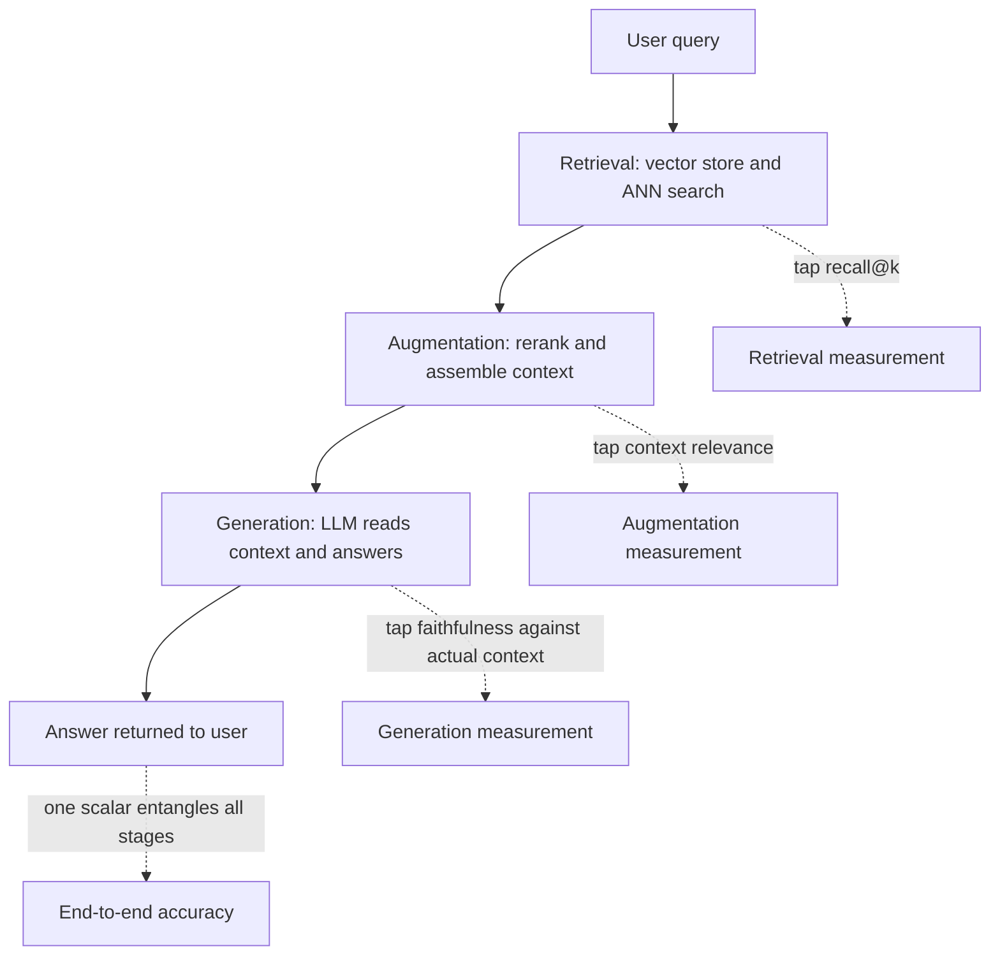
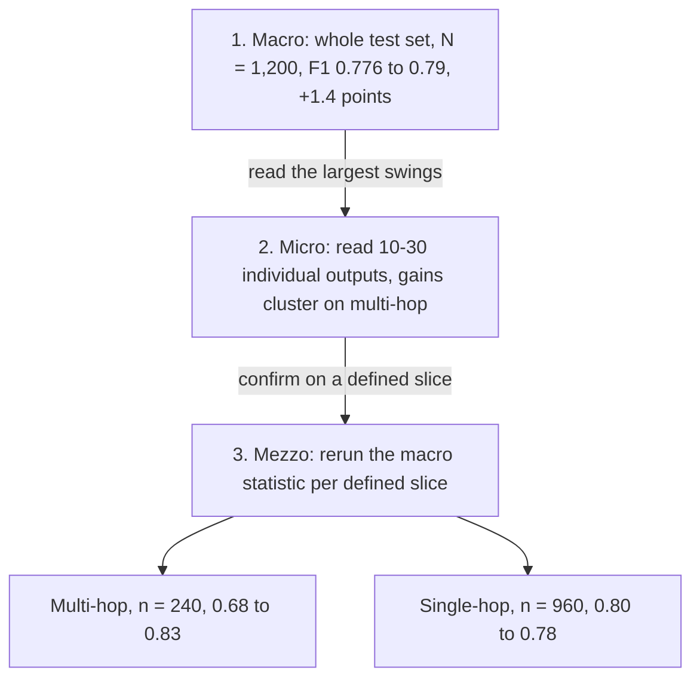
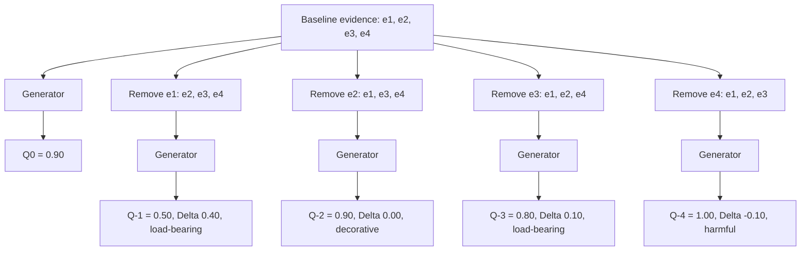
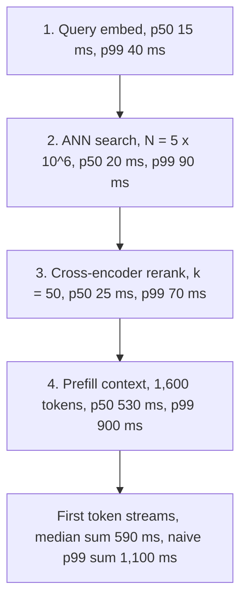
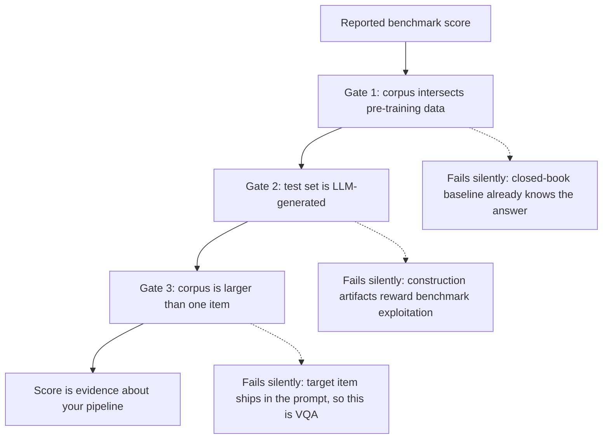

# Chapter 34: Evaluating the System

This chapter is for diagnosing, validating, and stress-testing a Retrieval-Augmented Generation (RAG) system before a launch decision.

## TL;DR

- A final answer score cannot identify whether retrieval, augmentation, or generation caused a failure. Measure each stage boundary.
- Run macro, micro, and mezzo analysis in that order. The whole-set score opens the investigation, examples suggest a cause, and a defined slice tests that cause.
- A useful ablation turns one component off while everything else stays fixed. It checks easy target cases, hard target cases, and a control bucket that should not move.
- To learn whether cited evidence mattered, remove one cited passage, regenerate, and rescore. Positive, near-zero, and negative changes mean load-bearing, decorative, and harmful evidence.

- Evaluate behavior across repeated runs. Track stage latency, answer agreement, and resistance to planted instructions in retrieved documents.

- Audit a benchmark before trusting its headline. Check training-data contamination, synthetic-set artifacts, and whether the task actually exercises retrieval.

- Keep claim limits visible. Approximate significance checks, learned judges, leave-one-out tests, and public benchmarks each have blind spots.

## The story

Imagine that you inspect a restaurant kitchen that prepares one meal from a diner's order.

The pantry runner acts as the retriever. The runner finds candidate ingredients for the order.

The sous-chef acts as augmentation, which means sorting, removing duplicates, and arranging the ingredients that the chef will actually see.

The head chef acts as the large language model (LLM). The chef reads the prepared tray and produces the final dish.

A diner can dislike the dish even when the pantry runner found the right ingredient. The sous-chef may have buried it, or the chef may have misused it.

One satisfaction score at the dining-room door is end-to-end accuracy, which means the final result across the whole kitchen. That score says whether dinner worked, but it cannot tell the inspector which worker caused the failure.

The inspector therefore places a measurement tap, which is a direct checkpoint, after the pantry, after the prep table, and after cooking. Pantry recall asks whether the needed ingredient was found. Context relevance asks whether the right ingredient reached the chef. Faithfulness asks whether the chef stayed with the ingredients on the tray.

The inspector first reads the restaurant's whole-night average. That is macro analysis, or one score over every order.

Next, the inspector opens a small set of tickets with the biggest gains and losses. That is micro analysis, or close reading of individual cases to form a hypothesis.

Then the inspector groups all similar tickets, such as multi-course orders, and recomputes the average for that group. That is mezzo analysis, or a whole-set metric rerun on one coherent slice to test the hypothesis.

Suppose the kitchen adds a calculator for bills. The inspector runs an ablation, which means disabling only that tool while keeping everything else fixed.

Easy arithmetic orders check the ceiling. Hard arithmetic orders should show the largest gain. Food questions that never use numbers form the control bucket, which should not move at all.

The same logic tests evidence. A citation is like an ingredient receipt attached to the dish.

The inspector removes one cited ingredient at a time and asks the kitchen to cook again. A large quality drop marks a load-bearing ingredient. No measurable change marks a decorative receipt. Better food after removal marks a harmful ingredient.

The inspector also watches the live dinner rush. Stage percentiles describe how slow the pantry, prep table, and stove become in their tails, which are their worst ordinary delays.

The inspector repeats the same order to measure self-consistency, which means how often the kitchen gives an equivalent answer. The inspector also plants a hostile note inside a pantry package to measure indirect prompt injection, which means an instruction hidden in retrieved evidence.

Finally, the inspector audits the practice kitchen. Memorized recipes are contamination. Artificially easy orders are synthetic artifacts. A test that hands the chef the exact ingredient is visual question answering, not retrieval, because the pantry runner never had to search.

The launch decision now rests on a full inspection. The inspector knows whether the meal worked, where it failed, why a component helped, whether evidence mattered, how the kitchen behaves under load, and whether the practice test deserved trust.

## Decoder table

| Technical term | Plain-English meaning | Why it matters |
|---|---|---|
| Retrieval-Augmented Generation (RAG) | A system that finds external evidence and gives it to a generator | Evaluation must separate search, context preparation, and answer writing |
| Retrieval | Finding candidate passages or items for a query | A bad answer may begin with missing evidence |
| Vector store | A store that searches numerical representations of content | It supplies candidates to the retrieval stage |
| Approximate Nearest Neighbor (ANN) search | A fast search for vectors that are close to the query vector | It can trade exactness and determinism for speed |
| Augmentation | Reranking, deduplicating, and assembling retrieved content | It can discard evidence that retrieval found |
| Reranking | Reordering retrieved candidates with a second scorer | It changes which evidence reaches the generator |
| Deduplication | Removing repeated candidates | It changes context composition and available evidence |
| Context assembly | Building the final prompt context from candidates | Stage metrics must use this actual context, not an oracle context |
| Generation | Writing an answer from the query and assembled context | It can misread good evidence or ignore it |
| Large Language Model (LLM) | The model that judges or generates language in the examples | It can add parametric knowledge, judge noise, and sampling variance |
| End-to-end accuracy | The fraction of final answers graded correct | It is a launch summary, not a stage diagnosis |
| Gold answer | A reference answer used for grading | It anchors final correctness measurements |
| Gold evidence | The reference passage or source needed for an answer | It lets the evaluator label retrieval hits and misses |
| Evaluation tap | A measurement placed at a stage boundary | It preserves information that a final aggregate destroys |
| Recall@k | Whether relevant evidence appears within the top k retrieved items | It measures retrieval before later stages alter the candidates |
| Context relevance | Whether the assembled context contains useful material for the query | It exposes augmentation failures |
| Faithfulness | Whether the answer stays supported by the context it actually received | It exposes generation that goes beyond evidence |
| Hit rate h | The fraction of queries whose needed evidence reaches the generator | It measures evidence delivery, not just candidate retrieval |
| c1 | Generator accuracy when needed evidence arrives | A drop points toward generation given adequate evidence |
| c0 | Generator accuracy when needed evidence does not arrive | A large value can expose parametric leakage or an easy evaluation set |
| Parametric knowledge | Information stored in model weights | It can let a model answer despite retrieval failure |
| Oracle context | Ideal evidence supplied directly for an isolated test | It can make generation look cleaner than the shipped pipeline |
| Corrective Retrieval Augmented Generation (CRAG) evaluator | A learned classifier that labels retrieval quality at scale | It adds its own drift and out-of-distribution risk |
| Out-of-distribution risk | Failure when production inputs differ from training inputs | A learned evaluation component is not a neutral instrument |
| Macro analysis | One statistic over the whole evaluation set | It answers whether the system is ahead on average |
| Micro analysis | Close reading of a small number of individual outputs | It generates hypotheses about what changed |
| Mezzo analysis | A macro statistic rerun on a coherent subset | It tests whether a micro pattern generalizes |
| Per-query score | A score assigned to one query and answer | It supports ranking examples by their changes |
| Slice | A defined subset that shares an actionable property | It reveals gains and losses hidden by the average |
| Precision | The share of predicted positives that are correct | It is one part of a classification summary |
| Recall | The share of actual positives that the system finds | It is one part of a classification summary |
| F1 score | The harmonic mean of precision and recall | It can summarize performance but still hide slice behavior |
| Confusion matrix | Counts of prediction outcomes by actual and predicted class | It supports precision, recall, and F1 analysis |
| Bilingual Evaluation Understudy (BLEU) | A reference-overlap score | It is another possible macro statistic |
| Recall-Oriented Understudy for Gisting Evaluation (ROUGE) | A reference-overlap score with recall-oriented variants | It is another possible macro statistic |
| LLM-as-judge | A language model that scores an answer | It scales evaluation but can be noisy or miscalibrated |
| Multi-hop query | A query that needs several supporting passages or reasoning steps | The reranker example improves sharply on this slice |
| Single-hop query | A query that needs one supporting fact | The reranker example shows a small possible regression here |
| Weighted average | A combined score in which larger slices count more | It explains how opposite slice movements collapse into one macro score |
| Standard error (SE) | A rough estimate of sampling variation | It helps separate large slice effects from noise |
| Bernoulli approximation | Treating each result as an independent pass or fail | It gives a quick significance filter with explicit limits |
| Paired bootstrap | A resampling test that compares systems on matched cases | It is the stronger check when an effect sits near the line |
| Router | A component that sends different query types to different paths | It can preserve a slice-specific gain if query type is reliable |
| Ablation | Disabling one component while holding everything else fixed | It tests whether that component caused a change |
| Trivial-target bucket | Easy cases inside a component's intended remit | It checks for regressions and ceiling effects |
| Hard-target bucket | Difficult cases the component was designed to help | The intended effect should concentrate here |
| Control bucket | Cases the component should never affect | Movement exposes noise, leakage, or a confound |
| Ceiling effect | A small measured gain because the baseline is already near perfect | It explains a compressed easy-case delta |
| Confound | An unintended change that can explain the measured effect | It invalidates a causal claim about the named component |
| Matched-complexity placebo | A control input with the same shape but without the claimed information | It tests the mechanism rather than extra processing alone |
| Pseudo-instruction chunking | Chunking guided by an LLM-generated document summary | The chapter uses placebos to isolate the summary's information |
| Retrieval-conditioned generator | A generator that receives evidence before writing | Evidence removal can intervene on its actual input |
| During-generation attribution | Citing evidence while producing the answer | It connects citations to the conditioned generation process |
| Post-hoc citation search | Finding citations after answer text is fixed | It cannot show which evidence the generator needed |
| Cited-evidence set C | The passages that the answer cites | Leave-one-out operates on this set, not the whole candidate pool |
| Baseline quality Q0 | The answer score with all cited evidence present | It anchors every evidence-removal delta |
| Leave-one-out quality Q-i | The score after removing cited passage i and regenerating | It measures the effect of that intervention |
| Evidence delta Delta_i | Q0 minus Q-i | Its sign and size classify the citation's role |
| Load-bearing evidence | Evidence whose removal causes a real quality drop | The answer depends on it |
| Decorative evidence | Evidence whose removal stays inside the noise floor | It looks relevant but was not individually necessary |
| Harmful evidence | Evidence whose removal improves quality | It points to a source-credibility problem |
| Entailment | A relation in which a passage could support a claim | It does not prove that the generator used the passage |
| Noise floor sigma | Baseline variation across repeated generations or judge calls | It sets a data-driven decorative threshold |
| Shapley values | A feature-importance idea that accounts for combinations | It exposes the redundancy blind spot of leave-one-out |
| Atomic fact | One checkable statement inside an answer | Atomic-fact scoring gives the evidence example a quality measure |
| Fine-grained Atomic Evaluation of Factual Precision (FActScore) | Atomic-fact precision for generated text | It is one possible quality judge Q |
| Retrieval-Augmented Generation Assessment (RAGAS) | A framework with a faithfulness measure | It is another possible quality judge Q |
| System-level property | Behavior that emerges across stages or repeated runs | Single query-answer grading does not capture it |
| Latency | Time spent serving a request | A correct system can still be unusably slow |
| p50 | The median of a latency distribution | It describes a typical request |
| p95 and p99 | High latency percentiles | They expose the slow tail hidden by the median |
| Tail risk | The chance that at least one stage becomes unusually slow | It compounds across sequential stages |
| Time-to-first-token | Time until a streaming generator emits its first token | It matches the user's initial wait in a streaming interface |
| Service-Level Agreement (SLA) | A stated performance commitment | Its metric must match the interface and downstream use |
| Self-consistency | Agreement across repeated calls with the same query | It measures variance, not correctness |
| Semantic-equivalence cluster | A group of answers judged to mean the same thing | It supports the repeated-run agreement score |
| Sampling temperature | A setting that controls decoding randomness | Nonzero temperature can change answers across runs |
| Hierarchical Navigable Small World (HNSW) index | A graph index used for ANN search | Parallel traversal can add retrieval nondeterminism |
| Retrieval nondeterminism | Different retrieved results for the same query | It changes context before generation begins |
| Upsert | Adding or updating an item in a live index | It can change top-k results between repeated calls |
| Robustness | Failure behavior under inputs designed to break the system | Normal held-out accuracy does not measure it |
| Direct jailbreak | A hostile instruction in the user's query | It attacks the model through the query |
| Indirect prompt injection | A hostile instruction hidden in a retrieved document | It attacks through the corpus and is specific to retrieval |
| Red-team set | A standing collection of adversarial cases | It makes robustness a repeatable metric |
| Injection-success rate | The share of runs that follow a planted instruction | It quantifies indirect prompt-injection failure |
| Benchmark hygiene | Checks that a benchmark measures the claimed system | A reproducible score can still be irrelevant |
| Contamination | Overlap between evaluation content and model training data | It can distort the apparent benefit of retrieval |
| Closed-book baseline | A generator answering without retrieval | Contamination can make this baseline unfairly strong |
| n-gram overlap | Matching sequences of n tokens across corpora | The chapter cites a 13-gram contamination check |
| Synthetic evaluation set | Questions or documents generated by an LLM | Construction artifacts can make a method look better than it is |
| Lexical-overlap control | A keyword-style baseline used on synthetic items | It tests whether surface wording explains the result |
| Model collapse | Distribution degradation from repeated training on a model's own outputs | It marks the extreme risk of overusing self-generated data |
| Visual Question Answering (VQA) | Answering from an image already supplied to the model | It does not test search over a corpus |
| Multimodal RAG | Retrieval and generation over text, images, or both | Its benchmark must exercise retrieval before reading |
| Multimodal Retrieval-Augmented Generation Benchmark (MRAG-Bench) | The cited vision-centric benchmark used for an external scale check | Its population and modality-removal results do not replace a production ablation |
| Information Retrieval (IR) benchmark | A test focused on finding relevant items | A recycled task may not measure full multimodal RAG |
| Modality-removal ablation | Removing text or images and measuring the score drop | It checks whether fusion actually contributes |
| Exact match | A score that requires the output to match a reference exactly | It supplies the benchmark worked example's headline accuracy |
| Dense Passage Retrieval (DPR) | A dense retriever used in the cited retrieval comparison | Its published top-20 result anchors a sanity check |
| Normalized Discounted Cumulative Gain (nDCG) | A ranking metric that rewards relevant items near the top | It appears in the reranker interview probe |

## Core mechanics

### 34.1 RAG is not end-to-end: attributing failure to a stage

#### What the aggregate hides

- **What:** Treat retrieval, augmentation, and generation as composed black boxes with separate inputs and failure modes.

- **Why:** The final answer can fail because retrieval found the wrong material, augmentation buried good material, or generation misread adequate context.

- **Failure without it:** A team may swap the embedding model when generation broke. The next evaluation then wastes a sprint and leaves the score unchanged.

- **Cost or complexity:** Direct attribution needs per-query evidence labels and at least two stage taps. Add a third tap when augmentation reranks, deduplicates, compresses, or truncates evidence.

Let h be the fraction of queries for which needed evidence reaches the generator.
Let c1 be generator accuracy conditioned on a hit.
Let c0 be generator accuracy conditioned on a miss.
The final accuracy is `A = h c1 + (1 - h)c0`.
One value of A cannot recover three unknowns.
An unbounded family of h, c1, and c0 triples can yield the same A.
Addition destroys stage identity.
Measure recall after retrieval.
Measure context relevance after augmentation.
Measure faithfulness against the actual assembled context after generation.
Keep end-to-end accuracy as a fourth number.
Do not replace the other three with it.

#### Worked example

The example uses 400 held-out runbook queries with gold runbook identifiers and gold answers.
It is illustrative, although the chapter calls it typical of a mature internal evaluation set.
The gold runbook appears in the top 10 passages for 340 queries.
Therefore `h = 340 / 400 = 0.85`.
Among those 340 hits, 255 answers are correct.
Therefore `c1 = 255 / 340 approximately 0.75`.
The remaining 60 queries are misses.
Nine answers are still correct from related evidence, parametric knowledge, or luck.
Therefore `c0 = 9 / 60 = 0.15`.
The final score is `(255 + 9) / 400 = 264 / 400 = 0.66`.
A second system also scores 0.66.
It has 260 hits, so `h = 0.65`.
It gets 252 of those hits correct, so `c1 approximately 0.97`.
It gets 12 of 140 misses correct, so `c0 approximately 0.086`.
The first system has the higher hit rate but weaker generation given a hit.
The second system has weaker retrieval but stronger generation given a hit.
Equal dashboards imply opposite fixes.

#### Sanity case and claim limit

Karpukhin et al. (2020) report 78.4% top-20 retrieval accuracy for DPR on open-domain Natural Questions.
The chapter says 85% at depth 10 is not suspicious for a narrow internal runbook corpus.
That corpus is orders of magnitude smaller and less lexically ambiguous than open-domain Wikipedia question answering.
This comparison is a directional sanity check, not proof that the internal evaluator is correct.

#### Practical decisions

- Instrument post-retrieval and post-generation on every run.

- Add post-augmentation measurement as soon as the pipeline changes retrieved content before generation.

- Label whether gold evidence reached the generator, not merely whether it appeared somewhere in a longer candidate list.

- Treat a c0 well above a few percent as a finding to investigate. It often means the set is answerable from parametric knowledge, but confirm that explanation.

- Recompute h, c1, and c0 on the same slice whenever end-to-end accuracy moves. A four-point drop is still only a symptom until this split identifies the stage.

- Fix the stage whose own metric moved. If both move after one deploy, roll back one stage at a time.

- If retrieval reports 92% recall and generation reports 95% faithfulness on gold context while end-to-end correctness is 58%, rerun faithfulness on the actual assembled context. A gap there identifies augmentation loss that both isolated tests missed.

- Validate any learned retrieval evaluator or routing classifier on its own held-out set.

### 34.2 Macro, micro, mezzo analysis

#### The three analysis levels

- **What:** Macro reports the whole-set statistic. Micro reads individual outputs. Mezzo reruns the statistic on a coherent subset.

- **Why:** Macro says whether the system is ahead. Micro says where to look. Mezzo tests whether the observed pattern generalizes.

- **Failure without it:** A small aggregate gain can hide a large win on one slice and a regression on another. Extreme examples alone can also create a false conclusion.

- **Cost or complexity:** Macro is cheap. Micro requires reading about 10-30 outputs in each chosen direction. Mezzo requires tagging the full set and recomputing slice metrics.

Let the evaluation set contain N queries.
Let s_i lie from 0 to 1 for query i.
Macro can report mean score, precision, recall, F1, BLEU, ROUGE, or an LLM-judge average.
Micro should usually inspect the largest positive and negative per-query score swings.
Mezzo can slice by source corpus, generation-length tercile, hop count, chunk length, or retrieval confidence.
If slices j have weights w_j and means s_bar_j, then `s_bar = sum_j w_j s_bar_j`.
The sum discards slice identity.
Run macro first because launch review needs the headline.
Run micro second to form a mechanism hypothesis.
Run mezzo third to test that hypothesis on a defined population.
Do not estimate general behavior from the extreme examples selected for micro inspection.

#### Worked example

The full set has 1,200 queries.
A dense retriever is the baseline.
A cross-encoder reranker is the candidate system.
Macro F1 moves from 0.776 to 0.79.
That is a gain of 1.4 points.
Micro inspection pulls 20 queries.
Ten are the most improved and ten are the most regressed.
Eight of the ten improved queries need two or more supporting passages.
Seven of the ten regressed queries are single-hop fact lookups.
The suspected mechanism is that the reranker helps multi-hop evidence but can promote a topically similar wrong passage on simple lookups.
Mezzo tags 240 multi-hop queries, which are 20% of the set.
It also tags 960 single-hop queries, which are 80%.
Multi-hop F1 moves from 0.68 to 0.83.
That is a gain of 15 points.
Single-hop F1 moves from 0.80 to 0.78.
That is a loss of 2 points.
The candidate weighted score is `0.2(0.83) + 0.8(0.78) = 0.79`.
The baseline weighted score is `0.2(0.68) + 0.8(0.80) = 0.776`.
The arithmetic exactly reconciles the macro values.

#### Significance filter and claim limit

The chapter uses `SE = sqrt(p_bar(1 - p_bar) / n)` as a back-of-envelope filter.
For multi-hop, `p_bar approximately 0.755` and `n = 240`.
The standard error is about 2.8 points.
The 15-point swing is about 5.4 standard errors from zero.
The chapter treats that effect as unambiguously real.
For single-hop, `p_bar approximately 0.79` and `n = 960`.
The standard error is about 1.3 points.
The 2-point regression is about 1.5 standard errors from zero.
The chapter treats that result as inside conventional noise.
F1 and LLM-judge scores are not exactly independent Bernoulli trials.
Use this formula only to separate obviously large effects from obvious noise.
Use a proper paired bootstrap when a result sits close to the line.

#### Practical decisions

- Use macro as a gate, never as the diagnosis.

- Pull 10-30 largest score changes in each direction for micro analysis.

- If the automated judge may be miscalibrated, add a random sample to test whether steering only surfaces judge noise.

- Define mezzo slices along axes the pipeline can act on.

- Compute uncertainty before trusting a slice delta. Under a deadline, the example supports shipping the clear multi-hop win with a single-hop monitor and a pre-committed rollback trigger because the small loss remains unconfirmed.

- Consider a router when one reliable query class improves and another regresses.

- Do not route when the slices cannot be classified reliably at query time.

### 34.3 Ablation design and sanity cases

#### The ablation matrix

- **What:** Remove or disable exactly one component while fixing all other inputs and settings.

- **Why:** A controlled removal tests whether the component caused the measured change.

- **Failure without it:** A whole-set before-and-after score cannot distinguish the designed mechanism, an unrelated side effect, and sampling noise.

- **Cost or complexity:** Run both component states over at least three case buckets. Size each bucket so its noise floor is below the effect that matters.

The opening whole-set example moves answer accuracy from 71% to 74%.
A calculator that serves roughly one query in five can produce a large target-slice gain that appears as only a few aggregate points.
Use an easy bucket inside the component's remit.
It checks for regression and shows a ceiling effect when the baseline already works.
Use a hard bucket inside the remit.
The designed effect should concentrate there.
Use a control bucket outside the remit.
Write down a prediction of zero delta before the run.
The control bucket is the load-bearing cell.
If it moves, the harness may be noisy or the component may touch cases it should not reach.
Other confounds include a shared prompt edit and a reallocated latency budget.

#### Noise calculation

For n independent pass or fail trials with pass rate p, use `SE = sqrt(p(1 - p) / n)`.
Variance is largest at `p = 0.5`.
At `n = 100`, `SE = sqrt(0.5 x 0.5 / 100) = sqrt(0.0025) = 0.05`.
That is five percentage points.
A rough 95% band is about two standard errors.
That is roughly ten points at this sample size.
A control swing under about ten points is not yet distinguishable from sampling noise.
A larger control swing is a confound worth investigating.
In the interview probe, a 15-point target gain and a 4-point control move at n = 100 put the control inside the rough ten-point noise band.

#### Matched placebos

A bare component-off comparison asks only whether more processing helps.
A matched-complexity placebo asks whether the claimed information causes the gain.
For pseudo-instruction chunking, replace the real document summary with a random other document's summary, a random sentence, or an average sentence embedding.
All placebos have the shape of the extra signal but lack the claimed content.
The chapter reports that all three underperform the genuine pseudo-instruction condition.
This supports the summary-content mechanism rather than extra processing alone.

#### Worked example

The calculator example uses three constructed buckets of 100 held-out queries each.
No published benchmark reports this exact ablation.
Easy contains single-step arithmetic such as `12 x 11`.
Hard contains multi-step word problems.
Control contains factual retrieval questions without numbers.
Without the calculator, scores are 96% on Easy, 41% on Hard, and 57% on Control.
With the calculator, scores are 98% on Easy, 83% on Hard, and 58% on Control.
Easy gains 2 points under a ceiling effect.
Hard gains 42 points, which is the designed effect.
Control gains 1 point, which sits well inside the rough ten-point band.
The nearly flat control makes the hard-bucket gain trustworthy.

#### External sanity case and claim limit

MRAG-Bench reports a human gain of 33.16 points when images are added to a text-only question.
The cited GPT-4o result gains much less from the same images.
Its overall accuracy still lies in a similar 66%-80% range across question types.
The chapter compares the tens-of-points scale to the 42-point hard-bucket gain.
This is a scale sanity check across different populations, not a claim that the two mechanisms are equivalent.
A separate decision case compares a published gain above 33 points with a 4-point production gain and a flat control.
The gap suggests a different query mix, so the next test is a mezzo slice restricted to image-dependent traffic.

#### Practical decisions

- Default to easy target, hard target, and control buckets.

- Use a whole-set ablation only as an early smoke test.

- Pre-register the control prediction for any component intended to ship.

- Choose n before seeing results.

- Report a wider interval when rare cases cannot supply the desired n.

- Prefer matched-complexity placebos when claiming a specific mechanism.

- Rerun the control whenever shared prompts, routers, or latency budgets change.

### 34.4 The remove-the-evidence ablation

#### Necessity versus support

- **What:** Remove one cited passage, regenerate the answer, and compare quality with the all-evidence baseline.

- **Why:** An entailment judge can say a passage could support fixed text. Only an input intervention tests whether the generator needed it.

- **Failure without it:** Several citations can all pass attribution while only one does work. A harmful source can also hide behind an on-topic citation.

- **Cost or complexity:** For n cited passages, one baseline plus n ablations costs n + 1 generations per example.

Let the query be q.
Let cited evidence be `C = {e1, ..., en}`.
Let `y0 = Generate(q, C)`.
Let `Q0 = Q(y0)` for one fixed answer-quality judge Q.
For each i, remove e_i and regenerate.
Let `y-i = Generate(q, C without e_i)`.
Let `Q-i = Q(y-i)`.
Define `Delta_i = Q0 - Q-i`.
A large positive Delta_i marks load-bearing evidence.
A Delta_i inside the resampled noise floor marks decorative evidence.
A negative Delta_i marks harmful evidence.
Do not merge negative and near-zero values.
The chapter notes that an attribution judge discussed earlier gives about one wrong verdict in five even on its intended question.
The deeper limitation remains even with a perfect judge.
Entailment is non-exclusive.
Two passages can each support the same claim while either one alone is sufficient.

#### Leave-one-out blind spot

Two passages can be jointly sufficient but individually redundant.
Removing either alone can yield `Delta approximately 0` for both.
Removing both together may collapse quality.
Testing every subset fixes the blind spot.
That cost grows exponentially with n.
Leave-one-out is the practical default because cited sets are small, not because the blind spot disappears.

#### Worked example

The question asks when insulin was discovered and by whom.
Evidence e1 is the Nobel Prize history page with the year and both names.
Evidence e2 explains what insulin treats but contains no date.
Evidence e3 corroborates the year and adds where the discovery was announced.
Evidence e4 is an uncredentialed forum post with a different, wrong year.
The judge uses FActScore-style atomic-fact precision against the subject's Wikipedia article.
Each answer has 10 atomic facts.
With all four passages, 9 of 10 facts hold.
Therefore `Q0 = 0.90`.
Removing e1 leaves 5 of 10 facts correct.
Therefore `Q-1 = 0.50` and `Delta_1 = 0.40`.
Evidence e1 is load-bearing.
Removing e2 changes nothing.
Therefore `Q-2 = 0.90` and `Delta_2 = 0.00`.
Evidence e2 is decorative.
Removing e3 leaves 8 of 10 facts correct.
Therefore `Q-3 = 0.80` and `Delta_3 = 0.10`.
Evidence e3 is load-bearing for a smaller, unique detail.
Removing e4 yields 10 of 10 facts correct.
Therefore `Q-4 = 1.00` and `Delta_4 = -0.10`.
Evidence e4 is harmful.

#### Cost and noise check

The audit set has 300 questions.
Each answer cites an average of 4 passages.
The run needs 300 baseline generations.
It also needs `300 x 4 = 1,200` ablation generations.
The total is 1,500 calls.
That is a `4 + 1 = 5x` multiplier over a generation-only evaluation.
The chapter compares this scale with a 3,500-call FActScore audit batch.
It treats both as overnight jobs rather than live gates.
Five baseline samples at temperature 0.7 give `sigma approximately 0.03`.
The decorative band is `about 2 sigma approximately 0.06`.
Delta_2 at 0.00 is decorative.
Delta_3 at 0.10 and Delta_4 at -0.10 exceed the band.
Their signs survive the stated noise check.

#### Practical decisions

- Regenerate on every leave-one-out pass.

- Do not merely rescore the fixed baseline answer against less context.

- If generation cost is binding, use a smaller calibrated model for ablation passes and keep the full model for baseline generation.

- Set the decorative threshold from repeated baseline variance.

- Use exactly zero only with a deterministic judge such as exact match or a rule-based check.

- Ablate cited evidence, not the full top-k pool, when testing generator reliance.

- Use a retrieval-level ablation when the target is the retriever or reranker.

- Route a repeatably negative delta to source-credibility review.

- Run the test periodically offline.

- Consider a per-query gate only for small medical, legal, or financial templates with low citation counts.

### 34.5 System-level properties: latency, self-consistency, robustness

#### Why single-answer scores are insufficient

- **What:** Evaluate latency, repeated-run agreement, and adversarial behavior across many calls.

- **Why:** Faithfulness, context relevance, and correctness describe one query-answer pair. Production is a live sequence of repeated stages.

- **Failure without it:** A system can be accurate on held-out examples yet slow, inconsistent, or vulnerable to instructions hidden in retrieved documents.

- **Cost or complexity:** Instrument every stage, repeat fixed queries N times, and maintain a standing adversarial corpus.

The representative stage chain is embed, search, fuse, rerank, context assembly, prefill, and decode.
Each stage has its own latency distribution.
Each call can also receive different evidence or decoding outcomes.

#### Latency and tail compounding

For sequential stages with independent slow-event probabilities p_i, use `P(any stage slow) = 1 - product_i(1 - p_i)`.
Four stages with `p_i = 0.01` yield `1 - 0.99^4 approximately 3.94%`.
That is about 1 in 25 requests, not 1 in 100.
A fifth stage pushes the exposure past 4.9%.
The independence assumption belongs to this calculation.
When every stage percentile moves together, shared infrastructure such as graphics processing unit contention, a noisy neighbor, or a network hop is a better first suspect.
Track p95 and p99 for each stage.
For streaming interfaces, write the SLA against time-to-first-token.
For agentic pipelines that require the complete answer before acting, budget full completion time.
For asynchronous or batch jobs, watch throughput and queue depth instead of a user's per-call tail.

#### Latency worked example

The support bot indexes `N = 5 x 10^6` chunks at `d = 768` dimensions behind HNSW.
Query embedding has p50 15 ms and p99 40 ms.
ANN search has p50 20 ms and p99 90 ms.
The cross-encoder reranks `k = 50` candidates at p50 25 ms and p99 70 ms.
Prefill uses 1,600 context tokens at p50 530 ms and p99 900 ms.
The median time-to-first-token estimate is `15 + 20 + 25 + 530 = 590 ms`.
The naive p99 sum is `40 + 90 + 70 + 900 = 1,100 ms`.
The chapter calls that sum an upper bound on the tail.
Nielsen's cited thresholds say an interface feels instantaneous below 0.1 seconds.
They say it keeps a user's flow of thought below about 1 second.
Attention drifts beyond that.
The 590 ms median is inside the flow threshold.
The 1,100 ms tail estimate has crossed it.
The comparison explains why a healthy median can coexist with recurring slow-user complaints.
A separate latency probe gives a 400 ms median against a 1-second SLA and still asks for per-stage p95 and p99 before dismissing slow-user reports.
A security probe adds 180 ms for document scanning while product holds time-to-first-token fixed.
Measure the injection-rate reduction, scan lower-trust sources selectively, or move scanning to ingestion when the evidence supports it.

#### Self-consistency

Run the same query N times.
Cluster semantically equivalent answers.
Let c_j count answers in cluster j.
Define the self-consistency score (SC) as `SC = max_j c_j / N`.
Wang et al. (2022) use self-consistency as a decoding method that samples reasoning paths and takes a majority vote.
This chapter inverts the use.
It measures disagreement itself because a live user sees one run, not the majority.
A closed-book model varies with sampling temperature.
RAG adds retrieval nondeterminism.
Multithreaded HNSW traversal, a load-balanced ANN replica pool, or a live-index upsert can change top-k results.
Changed retrieval changes context before decoding begins.
Correctness and consistency are orthogonal.
A system can agree with itself and remain wrong every time.
When an answer flakes, rerun against a pinned index snapshot at temperature 0.
If disagreement disappears, investigate retrieval or decoding nondeterminism before changing prompts or ranking logic.
Skip the canary only when temperature is 0 and the index is a frozen, versioned snapshot.

#### Robustness

A direct jailbreak arrives in the user's query.
An indirect prompt injection arrives inside a document that later gets retrieved.
Once evidence and instructions share one context window, the generator has no structural way to tell them apart.
Build a standing red-team set of queries paired with documents carrying planted instructions.
Report the fraction of runs that follow the planted instruction instead of the user's request.
Run the set on every retriever or prompt change.
Use a periodic cadence only for a closed, fully curated corpus with no third-party or user-submitted content.

### 34.6 Benchmark hygiene: contamination, synthetic sets, VQA-in-RAG-clothing

#### The three gates

- **What:** Check contamination, synthetic construction, and task format before treating a benchmark score as evidence.

- **Why:** A real and reproducible score may measure memorization, construction artifacts, or answer reading without retrieval.

- **Failure without it:** A leaderboard can support a launch even when the retriever was never tested.

- **Cost or complexity:** Run overlap checks, simple controls on synthetic slices, candidate-pool inspection, modality removal, and a small internal held-out slice.

The opening probe reports 84% accuracy, five points above the replaced system, but the number has not cleared any gate.
Gate 1 asks whether benchmark sources overlap the generator's pre-training data.
Public web corpora, especially Wikipedia-based sets, can overlap general model training data.
If the model answers with retrieval off, a closed-book comparison understates or distorts retrieval value.
Brown et al. (2020) ran a 13-gram overlap check for Generative Pre-trained Transformer 3 (GPT-3) evaluation sets.
They reported clean scores beside standard scores because contamination can move results by several points in either direction.
Gate 2 asks how synthetic questions or documents were generated.
Synthetic data is not automatically invalid.
It can be useful when it approximates deployment and a preliminary model must work to solve it.
It fails when construction leaves an exploitable signature.
A corpus built by concatenating unrelated documents creates sharp topic boundaries.
A semantic chunker can exploit those boundaries but lose most of the advantage on real documents where topics drift gradually.
A cited interview case makes this concrete. A synthetic set shows a 12-point recall gain for semantic chunking while production shows no difference.
Shumailov et al. (2023) call the extreme repeated-training failure model collapse.
Using the same model family to write and grade a benchmark is a milder version of that concern.
Gate 3 asks whether the inference-time corpus is larger than the answer's source.
VQA supplies the one needed image.
RAG requires finding the right item among thousands or millions of candidates before reading it.
A system that never searches cannot fail at search.
Some tasks with RAG labels are VQA with a retrieval step bolted on or older IR benchmarks reused under a new name.
Statistical significance does not repair any gate.
It says a difference is unlikely to be noise.
It does not say the benchmark measured retrieval, generation, or the shipped task.

#### Worked example

The example begins with 10,000 image-question pairs from Wikipedia figures and captions.
The pipeline scores 82% exact match.
The closed-book baseline scores 76%.
The apparent retrieval lift is 6 points.
The contamination check finds 1,800 overlapping items, or 18%.
The closed-book baseline scores 91% on those 1,800 contaminated items.
It scores 71% on the clean 8,200.
The decontaminated retrieval lift is `82% - 71% = 11 points`.
That is nearly twice the reported 6-point lift.
The example next identifies 3,000 LLM-generated questions without a consistency filter.
A keyword baseline is routed over that slice.
If it scores within a few points of the full pipeline, the slice rewards lexical overlap rather than semantic retrieval.

On the 7,000 human-written questions, the same keyword baseline trails by more than 15 points.

The example then finds 2,500 items that supply the target image directly.

Those items do not exercise retrieval.

After the three checks, roughly 4,700 items remain contamination-clean, non-synthetic, and retrieval-gated.

The chapter calls that reduced set the score worth defending.

The word roughly is important because the source does not assert that every excluded group is disjoint.

#### Sanity case and claim limit

MRAG-Bench reports that humans gain 33.16 points from image access.

Its strongest evaluated model, GPT-4o, reaches roughly human parity.

Its score lies in the 66%-80% range depending on question type.

An unaudited homemade benchmark at 82% should trigger the three gates.

It does not by itself prove a state-of-the-art system.

#### Practical decisions

- Run contamination checks before trusting closed-book versus RAG comparisons.

- If RAG beats a closed-book baseline by only 2 points despite 92% recall@10, test contamination before blaming retrieval.

- The chapter says an n-gram or substring pass can take an afternoon and can change the measured lift by a factor of two in its example.

- For time-sensitive facts after the model's training cutoff, prefer a temporal slice as the clean control.

- Treat an LLM-generated set as provisional until it survives a lexical-overlap baseline.

- Give more provisional trust to filtered synthetic data that matches a real target distribution, as in the cited Promptagator approach.

- Confirm that the candidate corpus is larger than the target source before calling a multimodal task RAG.

- Candidate-pool size or explicit retrieval recall is useful evidence that retrieval was exercised.

- Report modality-removal ablations beside the headline score.

- If removing text or images does not lower the score, fusion may not be doing useful work.

- Keep a small hand-curated slice of real traffic for the final launch decision.

- If traffic is too sparse for a reliable internal slice, treat the launch as provisional and lean harder on the three gates.

## Diagrams

### Figure 34.1

**Figure 34.1:** Each stage boundary is a place to take a direct measurement. The end-to-end score at the bottom of the bracket sums all of them into one number that cannot be un-summed after the fact.

### Figure 34.2

**Figure 34.2:** Macro alone cannot tell you that a 1.4-point aggregate gain is really a +15-point win on one slice and a -2-point loss on another - only mezzo, run after micro generates the hypothesis, can.

### Figure 34.3

| Case bucket | Baseline off | Component on | Intended visual pattern |
|---|---:|---:|---|
| Easy, near ceiling | High | High | Small compressed gap |
| Hard, designed target | Lower | Much higher | Large delta |
| Control, should not move | Similar | Similar | Delta approximately 0 |

**Figure 34.3:** A well-designed ablation buckets cases by relationship to the mechanism: the gap concentrates in the bucket the component was built for, compresses under a ceiling effect on easy cases, and must stay near zero on the control bucket the component should never touch.

### Figure 34.4

**Figure 34.4:** Removing one cited passage at a time and regenerating turns a fixed set of "attributable" citations into four distinct verdicts - load-bearing, decorative, and harmful - that a static entailment check cannot tell apart.

### Figure 34.5

**Figure 34.5:** Time-to-first-token sums the stage medians, but end-to-end tail risk compounds across every stage in the chain.

### Figure 34.6

**Figure 34.6:** A reported RAG benchmark score earns trust only after clearing three gates - contamination, synthetic-set artifacts, and task format - and each one can fail without moving the headline number.

## Whiteboard pack

### What to draw

1. Draw four boxes down the left: query, retrieval, augmentation, and generation.

2. Add an answer box below generation.

3. Put a metric tap beside retrieval for recall@k.

4. Put a tap beside augmentation for context relevance.

5. Put a tap beside generation for faithfulness against actual context.

6. Put one bracket around the pipeline and label its bottom end-to-end accuracy.

7. Draw three analysis boxes to the right: macro, micro, and mezzo.

8. Connect macro to micro with "inspect largest swings."

9. Connect micro to mezzo with "test a defined slice."

10. Draw a two-state ablation grid with Easy, Hard, and Control columns.

11. Circle the Control column and write "predicted delta = 0."

12. Draw one evidence set branching into leave-one-out regenerations.

13. Label the outcomes load-bearing, decorative, and harmful.

14. Add a final checklist with latency tails, repeated-run agreement, injection success, and the three benchmark gates.

### Spoken script

A RAG score is the last light on a long circuit, so I never diagnose from it alone. I tap retrieval, augmentation, and generation separately. Then I use macro to see the whole result, micro to inspect the biggest changes, and mezzo to test the pattern on a defined slice. For causality, I ablate one component across easy, hard, and control cases. For citations, I remove each passage and regenerate. Before launch, I also measure stage tails, repeated-answer agreement, injection success, and benchmark hygiene. That tells me what failed, why it changed, and whether the score deserves trust.

## Interview traps

### 1. Two systems both score 66% end-to-end. Are they equally good?

No. Decompose accuracy into hit rate h, correctness given a hit c1, and correctness despite a miss c0, then measure the stage boundaries on the same slice. The chapter's two 66% systems have opposite bottlenecks, so one needs generation work and the other needs retrieval work.

### 2. A reranker gains 1.4 F1 points on 1,200 queries. What analysis comes next?

Run micro analysis on the largest gains and losses to form a hypothesis, then run mezzo analysis on a defined slice to test it. The example's macro gain hides a 15-point multi-hop win and a 2-point single-hop loss, and the stated standard-error check says only the first is clearly outside noise.

### 3. How do you prove a component or a citation actually caused an improvement?

For the component, compare off and on across easy target, hard target, and pre-registered control buckets, with matched-complexity placebos when possible. For a citation, remove it, regenerate, and compare quality against a resampled noise floor because static entailment tests support, not necessity.

### 4. Correctness is green. What can still block launch?

Stage-level p95 and p99 can reveal tail latency, repeated calls can reveal retrieval or decoding inconsistency, and a planted-document corpus can reveal indirect prompt injection. Correctness and consistency are separate, and a shared shift across every latency stage points first to infrastructure.

### 5. A multimodal RAG benchmark reports 84% accuracy. Do you ship?

Not from that number. First check overlap with pre-training data, test synthetic slices with a lexical baseline, and confirm that inference requires search over multiple candidates rather than receiving the target image directly. Keep the final decision tied to a small hand-curated traffic slice when one is available.

## Key numbers

| Topic | Number or calculation | Meaning and limit |
|---|---:|---|
| Source figures | 6 | Every source figure is recreated above |
| Source tables | 0 | The source unit contains no numbered tables |
| Attribution example size | 400 queries | Illustrative internal runbook evaluation |
| Regression probe | 4-point end-to-end drop | Requires h, c1, and c0 before attribution |
| Isolated-stage paradox | 92% recall, 95% gold-context faithfulness, 58% end-to-end | Re-score faithfulness on actual assembled context |
| System 1 hit rate | 340 / 400 = 0.85 | Needed evidence reaches the generator |
| System 1 correctness on hits | 255 / 340 approximately 0.75 | Points to generation as its weaker stage |
| System 1 correctness on misses | 9 / 60 = 0.15 | May reflect related evidence, parametric knowledge, or luck |
| System 1 end-to-end accuracy | 264 / 400 = 0.66 | Same aggregate as a different stage split |
| System 2 hit rate | 260 / 400 = 0.65 | Retrieval is its weaker stage |
| System 2 correctness on hits | 252 / 260 approximately 0.97 | Strong generation given a hit |
| System 2 correctness on misses | 12 / 140 approximately 0.086 | Residual correct answers after misses |
| DPR sanity reference | 78.4% top-20 | Open-domain Natural Questions result cited from Karpukhin et al. (2020) |
| Macro example size | 1,200 queries | Full reranker evaluation set |
| Macro F1 change | 0.776 to 0.79 | Aggregate gain of 1.4 points |
| Micro inspection | 20 queries | Ten largest gains and ten largest losses |
| Micro pattern | 8 of 10 and 7 of 10 | Improved cases cluster on multi-hop and regressed cases on single-hop |
| Multi-hop slice | 240 queries, 20% | F1 rises from 0.68 to 0.83, a 15-point gain |
| Single-hop slice | 960 queries, 80% | F1 falls from 0.80 to 0.78, a 2-point loss |
| Reweighted candidate | 0.2(0.83) + 0.8(0.78) = 0.79 | Reconciles the candidate macro score |
| Reweighted baseline | 0.2(0.68) + 0.8(0.80) = 0.776 | Reconciles the baseline macro score |
| Multi-hop uncertainty | SE approximately 2.8 points | The 15-point effect is about 5.4 standard errors out |
| Single-hop uncertainty | SE approximately 1.3 points | The 2-point loss is about 1.5 standard errors out |
| Micro range | 10-30 outputs per direction | Default metric-steered inspection range |
| Opening ablation headline | 71% to 74% accuracy | Whole-set movement does not identify the mechanism |
| Narrow calculator remit | Roughly 1 query in 5 | A large target gain dilutes in the aggregate |
| Narrow target-slice illustration | 40% to 85% on roughly 1 query in 5 | A 45-point slice gain can look like only a few aggregate points |
| Reranker ablation probe | +3 nDCG points | Requires target, easy, and control buckets |
| Target and control probe | +15 and +4 points at n = 100 | The control move remains inside the rough ten-point band |
| Ablation bucket size | n = 100 | Used for the illustrative calculator experiment |
| Worst-case SE at n = 100 | sqrt(0.5 x 0.5 / 100) = 0.05 | Five-point standard error under the Bernoulli approximation |
| Rough 95% band | About 10 points | About two standard errors at n = 100 |
| Figure 34.3 ceiling | 100% | The easy bucket compresses against the top of the accuracy axis |
| Calculator baseline | 96%, 41%, 57% | Easy, Hard, and Control without the tool |
| Calculator on | 98%, 83%, 58% | Easy, Hard, and Control with the tool |
| Calculator deltas | +2, +42, +1 points | Ceiling, designed effect, and flat control |
| Published versus production probe | Above 33 points versus 4 points | Suggests a query-mix difference to test with mezzo analysis |
| MRAG-Bench human image gain | 33.16 points | External scale sanity check, not the same population |
| GPT-4o range | 66%-80% | Overall accuracy varies by question type in the cited comparison |
| Attribution-judge error reference | 1 wrong verdict in 5 | Cited earlier-section rate on the judge's intended question |
| Evidence baseline | 9 / 10 = 0.90 | Atomic-fact precision with all four passages |
| Remove e1 | 5 / 10 = 0.50, Delta 0.40 | Load-bearing |
| Remove e2 | 9 / 10 = 0.90, Delta 0.00 | Decorative |
| Remove e3 | 8 / 10 = 0.80, Delta 0.10 | Load-bearing for one unique fact |
| Remove e4 | 10 / 10 = 1.00, Delta -0.10 | Harmful |
| Evidence audit size | 300 questions | Held-out offline audit |
| Average citations | 4 | One baseline plus four leave-one-out generations |
| Evidence audit calls | 300 + 1,200 = 1,500 | A 5x multiplier over generation only |
| FActScore comparison | 3,500 calls | Same order of magnitude as the cited audit batch |
| Baseline resamples | 5 at temperature 0.7 | Used to estimate the evidence noise floor |
| Evidence noise floor | sigma approximately 0.03 | Repeated-run baseline variation |
| Decorative band | about 2 sigma approximately 0.06 | Effects inside the band count as decorative |
| Tail event per stage | 1% | Assumed independent in the compounding example |
| Four-stage tail | 1 - 0.99^4 approximately 3.94% | About 1 in 25 requests, not 1 in 100 |
| Five-stage tail | More than 4.9% | Adding a sequential stage adds another tail opportunity |
| Index scale | 5 x 10^6 chunks at d = 768 | Representative support-bot setup |
| Embedding latency | p50 15 ms, p99 40 ms | First measured stage |
| ANN latency | p50 20 ms, p99 90 ms | Search stage |
| Rerank latency | k = 50, p50 25 ms, p99 70 ms | Cross-encoder stage |
| Prefill latency | 1,600 tokens, p50 530 ms, p99 900 ms | Dominant representative stage |
| Median time-to-first-token | 590 ms | Sum of stage medians |
| Naive p99 sum | 1,100 ms | Stated upper-bound estimate |
| Interaction thresholds | 0.1 seconds and about 1 second | Cited instantaneous and flow-of-thought thresholds |
| Latency interview probe | 400 ms median versus 1-second SLA | Still requires per-stage p95 and p99 |
| Security scan probe | 180 ms added | Weigh measured injection reduction and off-path scanning |
| Benchmark size | 10,000 pairs | Wikipedia image-question example |
| Opening benchmark probe | 84%, 5 points ahead | Not launch evidence before the three gates |
| Headline benchmark | 82% versus 76% | Apparent 6-point retrieval lift |
| Contamination probe | 2-point RAG lift with 92% recall@10 | Test baseline memorization before blaming retrieval |
| Contaminated slice | 1,800 items, 18% | Closed-book score is 91% there |
| Clean slice | 8,200 items | Closed-book score is 71% there |
| Clean retrieval lift | 82% - 71% = 11 points | Nearly twice the contaminated headline lift |
| Synthetic slice | 3,000 questions | Generated without a consistency filter |
| Synthetic chunking mismatch | +12 recall points versus no production difference | Construction artifacts can create the apparent gain |
| Human-written slice | 7,000 questions | Keyword baseline trails by more than 15 points |
| Non-retrieval items | 2,500 | Target image ships directly in the prompt |
| Defensible remainder | Roughly 4,700 | Clean, non-synthetic, and retrieval-gated under the example's checks |
| Contamination method | 13-gram overlap | Method cited from Brown et al. (2020) |
