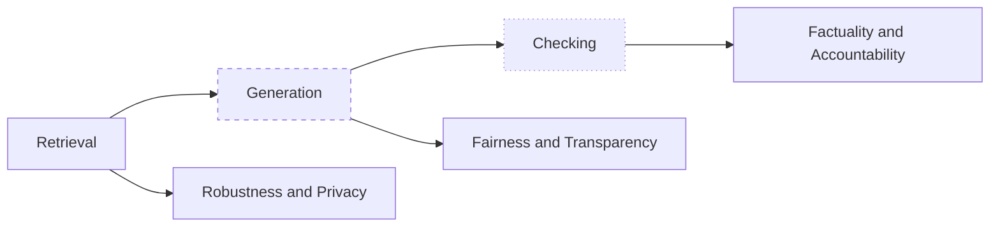
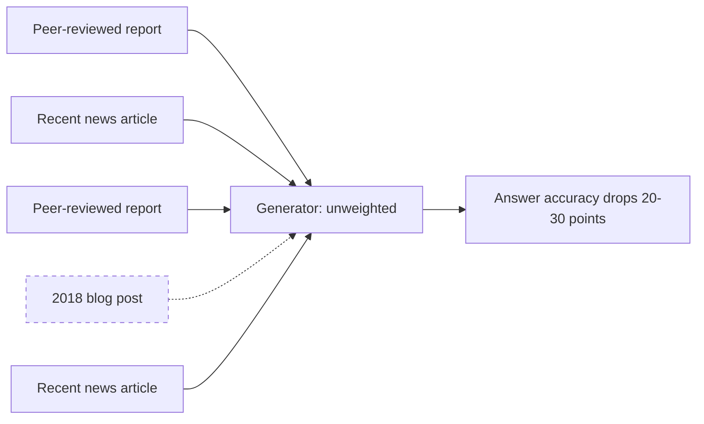
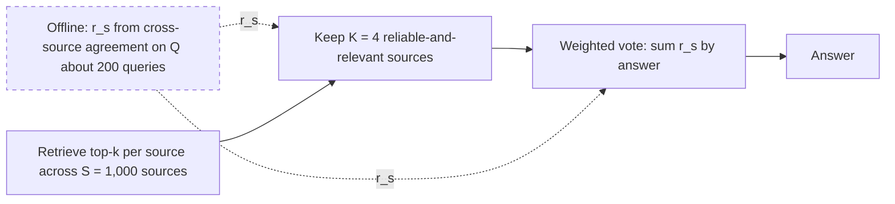
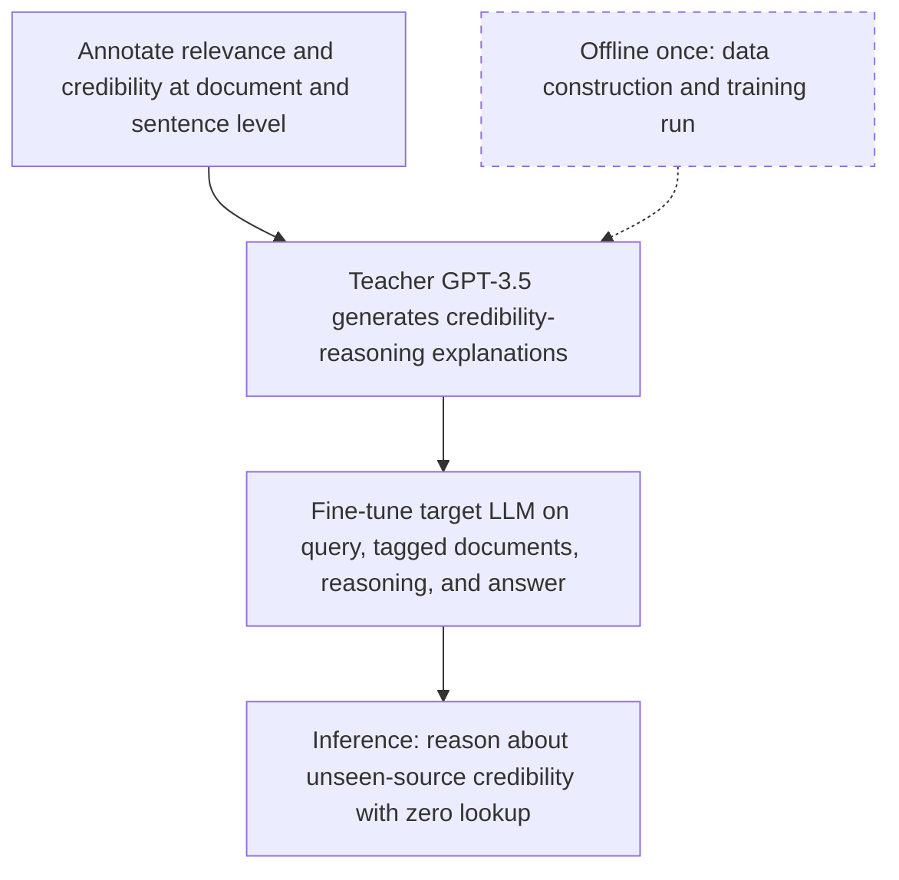
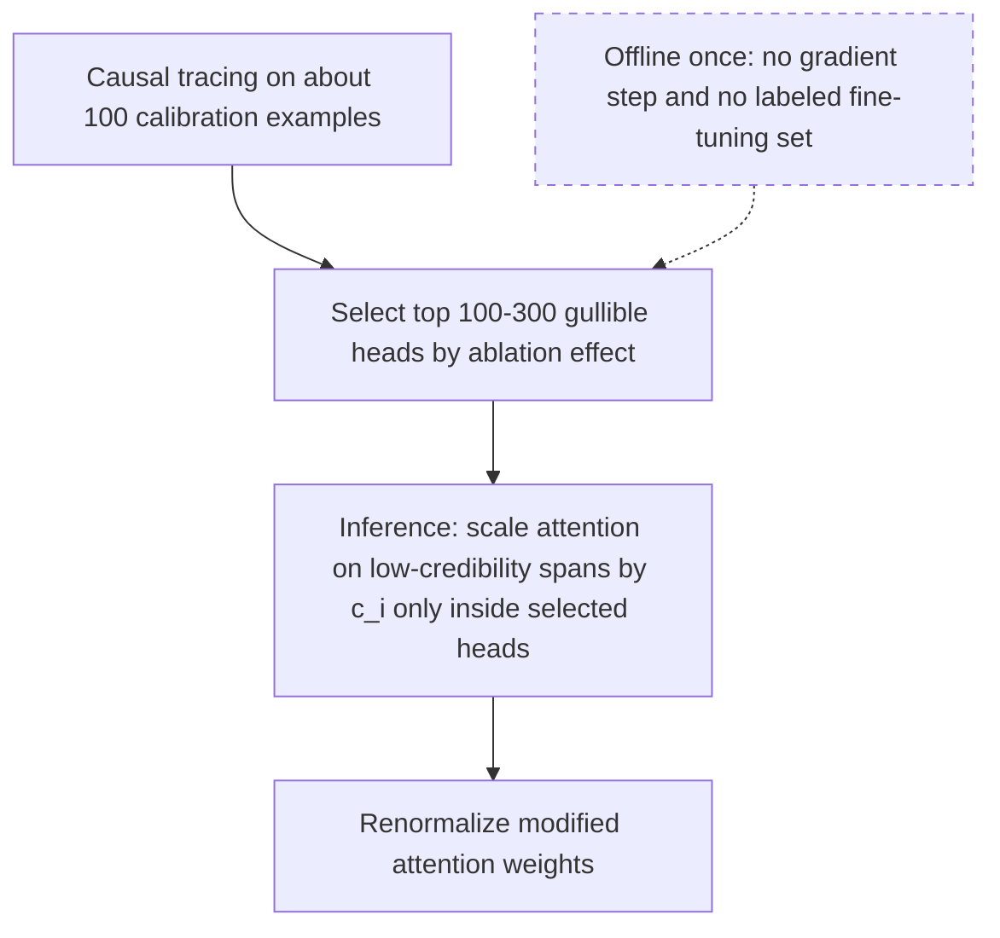
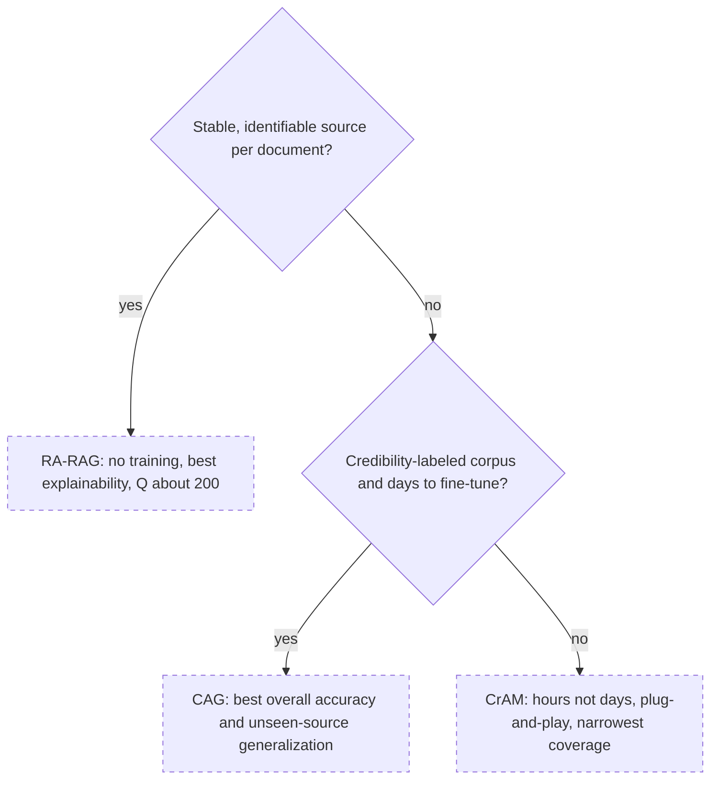
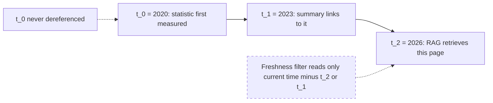
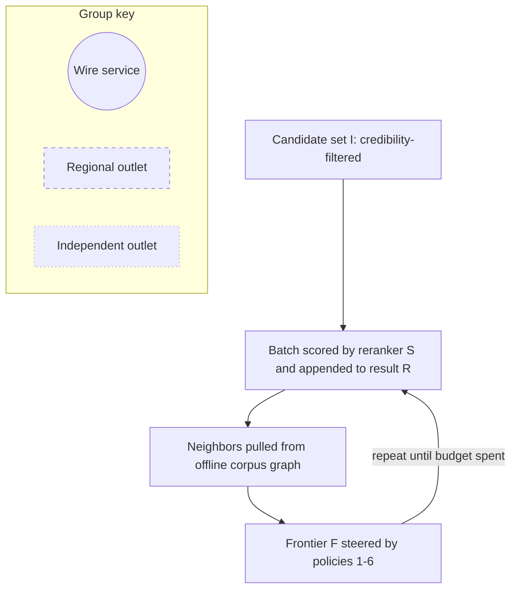

# Chapter 35: Source Credibility

This chapter explains how Retrieval-Augmented Generation (RAG) systems measure source credibility, act on weak evidence, and preserve freshness, pluralism, and fair exposure.

## TL;DR

- Trustworthiness has six aspects tied to three pipeline stages. A single blended score cannot tell an engineer which component failed.
- Relevance and credibility are separate axes. One low-credibility document can reduce answer accuracy by 20-30 percentage points even inside an otherwise credible context.
- The RA-RAG method estimates source reliability from cross-source agreement, then gives each selected source one reliability-weighted vote.
- Credibility-aware generation (CAG) trains a model on document-level and sentence-level credibility labels plus teacher-generated reasoning traces.
- The CrAM method uses causal tracing to find gullible attention heads, then scales only those heads on low-credibility spans without retraining the model.
- Choose RA-RAG when stable source identity exists, CAG when labeled data and training time exist, and CrAM when neither resource is available and a fast intervention is needed.
- Source credibility does not measure claim freshness or viewpoint coverage. Citation chains can launder stale facts, and credible sources can share one blind spot. Fair exposure requires a ranking policy over repeated queries. A doubly stochastic matrix can balance credibility-weighted utility with group exposure.

## The story

Picture a newsroom preparing a public briefing from a crowded clipping archive.

The assignment desk is the retriever.
The reporter is the generator.
The fact-check desk is the checking stage.

The newsroom tracks six trust questions at those three desks.
The assignment desk owns robustness and privacy because it controls what enters the room.
The reporter owns fairness and transparency because those shape how the clippings become a story.
The fact-check desk owns factuality and accountability because it verifies claims and assigns failures.
A single newsroom score would hide which desk needs repair.

The assignment desk also learns that relevance is not credibility.
One polished but outdated clipping can sway the reporter even when every other clipping is sound.
The cure is not simply to use fewer clippings.
Each clipping needs an independent credibility signal.

The newsroom has three ways to create or use that signal.
RA-RAG keeps a reputation ledger for named outlets.
It watches which outlets agree with reliable consensus across checkable questions, then gives each outlet one weighted vote.
CAG trains the reporter with high-, medium-, and low-credibility examples plus explanations of why one claim should beat another.
CrAM finds the reporter's gullible attention channels, meaning the specific model heads that carry misinformation, and lowers only those channels when a weak clipping appears.

The editor chooses by available resources.
A stable byline or publisher identity supports RA-RAG.
Credibility-labeled examples and days for training support CAG.
If neither exists, CrAM can provide a same-day, narrower intervention when an upstream score is already attached to each span.

Even a well-run newsroom can still fail.
A 2020 statistic republished in a 2023 summary can look newly measured when the source chain is never followed back.
That is credibility laundering, or old evidence wearing a new date.

The newsroom can also gather five excellent clippings that all discuss the same Michael Jordan.
The problem is then coverage, not credibility.
The editor must spend some rank slots on distinct disambiguation candidates rather than five redundant accounts of one candidate.

Finally, the largest wire services can occupy every visible slot forever while credible regional outlets receive none.
The newsroom replaces one fixed ordering with a rotation policy.
Across many editions, exposure follows a chosen fairness constraint while each reader still receives one concrete ranked list.

The newsroom lesson is to separate the questions.
Trust, credibility, freshness, coverage, and exposure interact, but no one score or method answers all five.

## Decoder table

| Technical term | Plain-English meaning | Why it matters |
|---|---|---|
| Retrieval-Augmented Generation (RAG) | A system that retrieves documents before a model writes an answer | Its trust depends on retrieval, generation, and checking, not only the model |
| Large language model (LLM) | A model that generates text from learned parameters and current context | The generator may synthesize all retrieved documents without a credibility distinction |
| Trustworthiness | The collection of properties that make a system safe, inspectable, and dependable | The chapter splits it into six actionable aspects |
| Pipeline stage | One functional part of the end-to-end system | Each trust failure belongs to a stage with a different fix |
| Retrieval | Selecting documents for the query | It owns robustness and privacy |
| Generation | Synthesizing an answer from the query and retrieved context | It owns fairness and transparency |
| Checking | Verifying the generated answer after writing | It owns factuality and accountability |
| Robustness | Graceful behavior under noisy or adversarial queries | A retriever should not collapse when the input is disturbed |
| Privacy | Avoiding sensitive information in retrieved context | Retrieval can expose records even before an answer is written |
| Fairness | Treating comparable entities or viewpoints comparably | The generator can privilege one group or view |
| Transparency | Making the path from evidence to answer inspectable | It exposes how the generator synthesized the retrieved material |
| Factuality | Whether a claim is true | It is only one of six trust aspects |
| Accountability | Assigning responsibility for an error to a specific component | It lets teams route incidents to an owner |
| Credibility laundering | Re-citing an old fact through newer pages until it appears current | A recent page date can hide an old origin date |
| False-negative citation | A relevant source omitted from one reference list and then omitted by later work | Citation chains can propagate missing evidence as if coverage were complete |
| Radar chart | A plot with one axis per trust aspect | Its shape reveals a weak axis that an aggregate can hide |
| Radar symbols r_i and Area | Per-axis score i and the hexagon area formed by all six scores | They expose why two different failure shapes can have almost equal total area |
| Cyclic index i+1 mod 6 | The next radar axis, wrapping the sixth axis back to the first | It closes the sixth triangle in the area sum |
| Ground-truth reasoning trace | The reference sequence of reasoning steps used for evaluation | Transparency prompts can be scored against it |
| Personally identifiable information (PII) | Data that can identify a person | It is the sensitive content used in the retrieval-privacy example |
| Relevance | How well a document matches the query | It does not say whether the document is trustworthy |
| Query q, document d, and answer a | The input, one evidence item, and the generated result | They keep retrieval and generation formulas scoped to the objects they consume |
| Relevance score rel(q,d) | Query-document match used by the baseline ranker | It omits the separate credibility value c_i |
| Credibility | How much a document or source should be trusted | It must enter separately from relevance |
| Dot product | A similarity score between vector representations | It can rank an on-topic but unreliable document highly |
| Cosine similarity | A normalized comparison between two embeddings | Tightening its threshold cannot separate credibility tiers |
| Embedding | A vector representation of a query or document | It supports relevance ranking and geometric diversity measures |
| Cross-encoder reranker | A model that jointly scores a query and passage after retrieval | It can refine relevance while still omitting credibility |
| Top-k retrieval | Selecting the k highest-ranked items | Lowering k can remove useful corroboration without removing the bad source |
| Credibility tier | A high, medium, or low trust label | It gives the generator an explicit source-quality signal |
| Credibility tag c_i | The score or tier attached to document or span i | CAG uses such labels in training, while CrAM consumes c_i at inference |
| RA-RAG | The source's name for reliability from cross-source agreement | It works when documents have stable source identities |
| Source identity | A stable publisher, domain, account, or other origin key | RA-RAG indexes reliability by this key |
| Source reliability r_s | A scalar from 0 to 1 for source s | It weights which source votes count |
| RA-RAG symbols S, Q, k, and K | Source count, calibration-query count, documents per source, and retained source count | Lowercase k and uppercase K control different stages of the online reduction |
| Source answer answer_s(q) | The answer returned by source s for query q | Agreement compares it with the current consensus |
| Indicator function | A value of 1 when a source answer equals consensus and 0 otherwise | Averaging it over Q queries defines r_s |
| Cross-source agreement | Measuring which sources agree across checkable questions | It creates reliability scores without manual source labels |
| Calibration query | A checkable question used to estimate reliability or inspect heads | It supports an offline reusable artifact |
| Consensus | The answer supported by the current reliability-weighted source pool | RA-RAG estimates it jointly with source reliability |
| Fixed point | A stable result after reliability and consensus repeatedly update each other | It prevents raw source volume from defining truth |
| Per-source voting | Giving one ballot to each source instead of each document | A content farm cannot gain votes by adding duplicates |
| Weighted majority vote | Adding reliability scores for all sources supporting an answer | Reliability rather than volume determines the result |
| Argmax | Selecting the answer with the largest summed score | It defines RA-RAG's final vote |
| Credibility-aware generation (CAG) | Fine-tuning a generator to reason about credibility from document content | It generalizes to unseen or unidentified sources |
| Multi-granularity annotation | Labeling credibility at both document and sentence levels | One weak sentence cannot hide inside a strong document |
| Teacher model | A capable model that produces training explanations | CAG uses it to demonstrate how to weigh conflicting claims |
| Reasoning trace | An explanation connecting credibility labels to an answer | It teaches conflict resolution rather than label classification alone |
| Fine-tuning | Updating model weights on task-specific examples | CAG pays this offline cost to create a general skill |
| Zero-shot prompting | Giving instructions without task-specific training | Bare credibility labels may remain just more competing context |
| Synthetic noise | Artificially injected low-quality context | It tests whether CAG remains robust to unseen noise |
| CrAM | The source's name for the targeted attention intervention | The assigned pages do not expand the method name |
| Attention head | One model component that selects which token information to carry forward | CrAM changes only heads causally linked to misinformation |
| Attention weight alpha | The influence one head gives to one token | CrAM multiplies it by span credibility in selected heads |
| CrAM symbols alpha_(h,i), scaled alpha, and alpha prime | Original, credibility-scaled, and renormalized attention for head h and token i | They separate the selective multiply from the normalization actually used by the head |
| Residual stream | The shared model representation that attention writes into | Gullible heads can carry misinformation into it |
| Causal tracing | Patching or removing a component and measuring the output change | It identifies heads that actually propagate a false claim |
| Ablation | Temporarily suppressing a component to test its effect | A large probability shift marks a causally important head |
| Gullible-head set H_gullible | The selected heads whose removal reduces reliance on misinformation | CrAM limits its intervention to this set |
| Renormalization | Rescaling modified attention weights so they sum correctly | It converts credibility-scaled values into usable attention shares |
| Upstream scorer | A separate component that supplies credibility scores | CrAM acts on c_i but does not produce it |
| Resource gate | A yes-or-no check for an implementation prerequisite | Stable identity and labeled data choose among the three methods |
| Origin date t_0 | The date when a fact or statistic was first established | It is the correct reference point for claim freshness |
| Citation hop t_n | A later page that repeats or cites the fact | Its newer date can reset apparent age |
| Citation symbols C_i, n, and current time | Hop i, chain length, and the evaluation date | They distinguish the retrieved wrapper from the origin and the time of scoring |
| Freshness half-life tau_(1/2) | The decay interval in the exponential freshness weight | Changing it rescales decay but does not reveal a hidden t_0 |
| Freshness weight | A score that favors recent evidence | It becomes misleading when computed from the wrong hop |
| Half-life | The time required for an exponential freshness weight to halve | The worked example uses one year |
| Time-persistent fact | A fact expected to remain fixed, such as a historical date | It can tolerate a stable credibility check |
| Time-sensitive fact | A value that may change, such as a count or price | It needs re-verification even without laundering |
| Re-citation velocity | How often a claim is repeated by new sources | High velocity may indicate laundering rather than independent consensus |
| Pluralism | Representing distinct credible entities, subtopics, or viewpoints | Credible sources can still share a blind spot |
| Permutation | One ordered arrangement of candidate documents | A classical ranker chooses one fixed list |
| Ranking symbols pi and L | A permutation and the selected top-K document list | The source moves from an ordered position-weighted objective to a set-level diversity objective |
| Utility u(d) | A document's credibility-weighted relevance | Pure utility ranking can return redundant documents |
| Position bias v(k) | The attention discount at rank k | Higher positions receive more exposure |
| Normalized discounted cumulative gain (NDCG) | A ranking metric that uses position discount | The source relates its discount to v(k) |
| Intra-list average distance (ILAD) | Mean pairwise embedding distance inside the result list | It measures geometric spread but not meaningful stance coverage |
| Coverage | The fraction of a known stance or entity set touched by the result list | It detects missing disambiguation candidates |
| Stance set S | The global set of entities, subtopics, or positions that matter | Coverage needs this reference set |
| Document embedding e_i and covered set S_d | Geometry for item i and the stances covered by document d | ILAD uses e_i while coverage uses S_d, so the metrics answer different questions |
| Lambda weights | The coefficients that trade utility against ILAD and coverage | Setting both to zero recovers credibility-only ranking |
| Maximal marginal relevance (MMR) | A greedy method that trades relevance against distance from selected documents | It removes near-duplicates but cannot define diverse with respect to what |
| Group exposure | The average rank attention received by a document group | It reveals credible groups that stay invisible |
| Hard ranking | One deterministic list with each item either placed or absent | Documents below the cutoff receive zero exposure |
| Assignment matrix P | A matrix saying which document occupies which position | Relaxing it creates a probabilistic ranking policy |
| Assignment entry P_(d,k) | Probability or hard indicator that document d occupies position k | Multiplying it by v(k) produces expected document exposure |
| Matrix dimensions N and K | Candidate count and displayed position count | They expose the source's rectangular-matrix claim limit when N differs from K |
| Doubly stochastic matrix | A soft assignment with fractional position probabilities | It makes exposure continuous and constrainable |
| Demographic parity | Equal exposure for groups regardless of utility | It can override measured credibility differences |
| Disparate treatment | Exposure proportional to average group utility | It is usually the preferred credibility-compatible constraint |
| Linear program (LP) | An optimization with a linear objective and linear constraints | It can maximize utility under an exposure requirement |
| Birkhoff-von Neumann theorem | The decomposition of a doubly stochastic matrix into weighted hard permutations | It turns the soft policy into rankings that can be served |
| Convex combination | Weighted components whose nonnegative weights sum to 1 | It supplies the permutation-sampling probabilities |
| Birkhoff symbols alpha_i and Pi_i | Mixture weight i and hard permutation matrix i | Sampling Pi_i with probability alpha_i serves the soft policy in expectation |
| Amortized guarantee | A target satisfied on average across repeated rankings | It costs less utility than forcing every query to meet the target |
| FAIR | The source's name for a deterministic prefix swap rule | It gives a hard per-query group floor but cannot express utility-proportional exposure |
| Corpus graph | An offline graph linking each document to nearby documents | It supports a faster online exposure approximation |
| Frontier | The candidate queue expanded from graph neighbors | Group-aware rules steer which documents enter each batch |
| Frontier symbols I, S, R, CG, and F | Candidate set, reranker, result list, corpus graph, and frontier | They name every state in Figure 35.9's repeated online loop |
| Queries per second (QPS) | The serving rate of the system | Solving an LP for every query is too slow at production scale |

## Core mechanics

### 35.1 Six aspects across three stages: a trustworthiness taxonomy

#### Stage-aware trust

- What: Retrieval owns robustness and privacy, generation owns fairness and transparency, and checking owns factuality and accountability.
- Why: Each axis points to one component and one incident owner.
- Failure without it: A 2% sentence-level hallucination rate says nothing about patient-record leakage, viewpoint bias, traceability, or responsibility.
- Cost or complexity: Teams must maintain six evaluation scores and stage tags instead of one dashboard number.

Credibility laundering is a transparency failure with a factuality symptom.
A false-negative citation is an accountability failure because the citation graph propagates an omission without one clear author introducing it.

#### Survey-style evaluation and radar area

- What: A 2024 survey attributed to Zhou et al. uses structured prompts and a six-axis radar chart.
- Why: The chart's shape exposes a collapsed axis.
- Failure without it: Total area can make a spiky model look almost identical to a uniformly mediocre one.
- Cost or complexity: Transparency evaluation can require generated intermediate reasoning and overlap against a ground-truth reasoning trace.

The source reports LLaMA-2-13B as uniformly weak.
It reports GPT-3.5-Turbo as strong on five axes but weak on privacy.
It reports GPT-4 as strongest overall among the three in that 2024 evaluation.

For six equally spaced axes, the area is:

`Area = 0.5 × sin(60 degrees) × sum from i=1 to 6 of r_i r_(i+1 mod 6)`

Model A scores `(0.80, 0.30, 0.75, 0.70, 0.85, 0.60)`.
Its consecutive products sum to 2.575, so `0.5 × 0.866 × 2.575 = about 1.115`.
Model B scores 0.65 on all six axes.
Its products sum to 2.535, so `0.5 × 0.866 × 2.535 = about 1.098`.
The areas differ by less than 2% despite opposite failure shapes.

#### Operating rules

- What: Report all six scores, tag every prompt by stage, and keep privacy independently visible.
- Why: Privacy can collapse while the other five axes remain strong.
- Failure without it: Averaging can hide a disqualifying privacy weakness.
- Cost or complexity: If policy proves personal data can never enter context, use a five-axis deployment chart but retain an auditable privacy-exclusion flag.

Re-run all six axes when the base generator changes.
Route an incident to its stage before choosing a fix.

### 35.2 One bad document among many good ones

#### Relevance is not credibility

- What: Standard retrieval ranks by `rel(q,d)` and generates `a = LLM(q, d_1, ..., d_k)`.
- Why: Relevance finds on-topic text.
- Failure without it: A current article, an outdated report, and artificial intelligence (AI) generated text can use similar language while deserving different trust.
- Cost or complexity: A second score must be computed and attached as `a = LLM(q, {(d_i, c_i)} from i=1 to k)`.

High credibility includes recent established reporting or peer-reviewed work with real citation impact.
Medium credibility includes a general encyclopedia reference.
Low credibility includes a six- or seven-year stale report or model-generated text republished as fact.

One low-quality document can reduce answer accuracy by 20-30 percentage points.
The generator weights every document equally by default.
Raising a relevance threshold or shrinking k attacks the wrong axis and can remove the one good anchor.

#### Contamination experiment

- What: A medical RAG benchmark has 1,000 questions, k = 5 documents, and an 82% credible-context baseline.
- Why: It quantifies the effect of replacing one retrieved item with an on-topic low-credibility document.
- Failure without it: Aggregate accuracy can hide the mixed-quality queries that users actually encounter.
- Cost or complexity: Applying the reported drop gives `82 - 30 = 52%` to `82 - 20 = 62%` accuracy, so roughly one in four to one in three answers flips.

Source arithmetic defect: a 20-30 point loss over 1,000 questions means 200-300 total flips, or one in five to three in ten questions. Relative to the 820 initially correct answers, it is 24.4-36.6%, so the source's one-in-four to one-in-three wording does not exactly match either denominator.

Keeping only the top three documents does not guarantee removal of the contaminant.
Search-optimized misinformation can survive while a terse credible source disappears.

#### Operating rules

- What: Tag credibility at ingestion, treat one contaminant as an incident, and never use k reduction as a credibility control.
- Why: One offline score per document directly targets the missing signal.
- Failure without it: Query-time relevance stays blind to trust.
- Cost or complexity: The source calls one index-time score negligible beside embedding and reranking already paid on requests.

Escalate credibility weighting first in medical, legal, and financial domains.
Skip the axis only when the corpus is already homogeneous from end to end.

### 35.3 RA-RAG: reliability from cross-source agreement

#### Offline reliability estimation

- What: For each source s, RA-RAG estimates `r_s` in `[0,1]` over about Q = 200 fact-checkable queries.
- Why: Cross-source agreement supplies a label without a human-maintained allowlist.
- Failure without it: A raw majority lets many weak sources define consensus.
- Cost or complexity: Reliability and consensus update iteratively until they converge.

The score is:

`r_s = (1 / Q) × sum over q of indicator[answer_s(q) = consensus(q)]`

Sources close to the current consensus gain weight.
The next consensus uses reliability-weighted votes.
The source warns that agreement measures consensus, not correctness, so a shared blind spot survives.

#### Online per-source voting

- What: Retrieve top-k documents per source, keep K sources using reliability plus query relevance, then vote once per source.
- Why: One source cannot gain influence by flooding the index with near-duplicates.
- Failure without it: Document-pooled voting rewards volume.
- Cost or complexity: The answer is `argmax over a of the sum of r_s for sources voting for a`.

In the coronavirus disease 2019 (COVID-19) example, Cable News Network (CNN), Mayo Clinic, and Wikipedia answer severe acute respiratory syndrome coronavirus 2 (SARS-CoV-2).
A conspiracy blog answers fifth-generation (5G) networks.
Reliabilities are 0.95, 0.93, 0.90, and 0.20.
Two more weak sources at 0.15 each create a 3-to-3 raw tie.
Weighted totals are 2.78 for SARS-CoV-2 and 0.50 for 5G.

#### Cost and measured results

- What: S = 1,000 sources with k = 5 create 5,000 candidates, but K = 4 sends only 20 documents to the generator.
- Why: Offline scores let online inference consult a tiny reliable subset.
- Failure without it: Consulting every source creates an unusable context.
- Cost or complexity: `1 - 20 / 5,000 = 0.996`, or 99.6% token reduction. At about 500 tokens per document, the comparison is 10,000 tokens versus 2.5 million.

Hwang et al. report 73.7% versus 63.4% on Natural Questions.
They report 91.3% versus 81.2% on TriviaQA.
Both gains are roughly 10 percentage points.

Use RA-RAG when stable source identity exists and labeled training data does not.
Size Q by convergence and answer checkability rather than treating 200 as universal.
Choose K from token cost versus corroboration recall.
Re-estimate reliability when agreement drops or a source changes, not only on a calendar.

### 35.4 CAG: training the model to reason about credibility

#### Multi-granularity training

- What: CAG labels relevance and credibility at both document and sentence level, then fine-tunes the generator.
- Why: Content-based judgment works on sources with no stable identity or prior score.
- Failure without it: A document-only label either hides one rumor inside a good article or discounts an otherwise useful article.
- Cost or complexity: Building labels, generating explanations, and running a fine-tune take days.

A GPT-3.5 teacher produces explanations that weigh high-, medium-, and low-tier claims.
The model can learn from register, specificity, internal consistency, and the presence of authoritative citations.
The target trains on `(query, tagged documents, reasoning trace, answer)` tuples.
Bare labels teach classification.
Reasoning traces teach how to resolve disagreement by tier.

#### Why prompting alone loses

- What: The zero-shot alternative appends credibility labels to the prompt without training.
- Why: It is cheap and exposes the same labels.
- Failure without it: The labels remain tokens competing for attention, with no learned rule that the higher-tier claim should win.
- Cost or complexity: CAG pays one offline training run so ordinary inference needs no source lookup.

In the Nobel example, the official record says Wilhelm Röntgen won the first Nobel Prize in Physics in 1901.
An unaffiliated blog says Albert Einstein.
The teacher explains why the official high-tier source wins and notes that Einstein won a Nobel Prize, but not the first physics prize.

#### Reported experiments and operating rules

- What: Pan et al. report 50.9% HotpotQA accuracy, described as an 82% relative improvement.
- Why: Solving backward gives `50.9 / 1.82 = about 28.0%` for the base RAG model.
- Failure without it: Reporting only 82% can hide the absolute starting point.
- Cost or complexity: Under 80% synthetic noise, CAG reaches 89% versus 77.3%, an 11.7-point gap.

The absolute HotpotQA difference from the inferred baseline is 22.9 points.
Source wording defect: the source later calls 22.9 a relative gap. It is the absolute percentage-point gap, while 82% is the stated relative improvement.
The source treats these gains as the same broad order as other credibility interventions, not as a universal guarantee.

Choose CAG for varied queries when labels and training runway exist.
Use sentence-level labels unless documents are short or internally homogeneous.
Re-annotate and retrain when label quality or misinformation patterns drift.
Choose CrAM when the deployment cannot absorb the training cycle.

### 35.5 CrAM: down-weighting attention on gullible heads

#### Causal head selection

- What: CrAM patches or ablates every attention head on about 100 examples containing a true and a false claim.
- Why: The probability change after ablation identifies heads that causally carry misinformation.
- Failure without it: Uniform scaling damages positional, syntactic, and copying behavior in heads unrelated to source trust.
- Cost or complexity: Keep the top 100-300 heads in `H_gullible`. The offline artifact is only a list of indices, with no gradient step or labeled fine-tuning corpus.

The calibration is task-specific.
Recalibrate when the deployment moves to a materially different domain.

#### Inference-time intervention

- What: Multiply attention on span i by credibility c_i only when head h belongs to `H_gullible`, then renormalize.
- Why: The intervention turns down the mechanism that brings weak evidence into the residual stream.
- Failure without it: A prompt asking the model to ignore a source still competes for attention like every other token.
- Cost or complexity: CrAM requires an upstream credibility score and adds a per-token multiply plus renormalization in selected heads.

The piecewise rule is:

`scaled_alpha_(h,i) = alpha_(h,i) × c_i when h is in H_gullible`

`scaled_alpha_(h,i) = alpha_(h,i) otherwise`

`alpha_prime_(h,i) = scaled_alpha_(h,i) / sum over j of scaled_alpha_(h,j)`

CrAM does not judge credibility.
If c_i is wrong, it can confidently suppress the correct document.

#### Attention arithmetic and measured scope

- What: Document A has c_A = 0.8 and 30% initial attention. Document B has c_B = 0.1 and 20% initial attention.
- Why: The Nobel example compares Wilhelm Röntgen in 1901 with the incorrect Einstein claim.
- Failure without it: Initial document-only share favors A by only `0.30 / (0.30 + 0.20) = 60%`.
- Cost or complexity: Scaling gives 0.24 and 0.02, a 12-to-1 ratio, then `0.24 / 0.26 = 92.3%` for A after renormalization.

A 32-layer model with 32 heads per layer has 1,024 heads.
Selecting 100-300 touches about 10-29% and leaves 71-90% unchanged.

CrAM reports 91.3% accuracy on targeted adversarial misinformation injection, described as near-Oracle.
It reports only 33.6% on Natural Questions, versus RA-RAG at 73.7%.
The source connects that spread to CrAM's narrow calibration target.
Source defect: the sanity-check sentence calls CrAM a 12-head-class intervention, which conflicts with the 100-300 gullible-head range stated and computed throughout the section.

Use CrAM for an hours-not-days intervention with no training budget.
Restrict it to causally selected heads.
Treat it as a stopgap when broad accuracy matters, and investigate head coverage or renormalized attention when correctly scored attacks still pass.

### 35.6 Choosing among the three

#### Two resource gates

- What: Check stable source identity first. If it exists, choose RA-RAG. If not, check for a credibility-labeled corpus and days to fine-tune. Choose CAG when both exist and CrAM when they do not.
- Why: Each headline result assumes the resource its mechanism consumes.
- Failure without it: Picking the largest benchmark number can select a method with no input or training artifact to act on.
- Cost or complexity: RA-RAG and CrAM setup are measured in hours. CAG setup is measured in engineer-days.

CrAM is the residual leaf, not a universal default.
Source prerequisite gap: the two-gate tree sends the neither branch to CrAM, but CrAM still needs an independent upstream scorer to supply c_i.
The methods can compose.
RA-RAG's r_s can feed CrAM's c_i at effectively zero marginal scoring cost.

#### Per-pool marketplace example

- What: Pool 1 has seller listings and regulator notices with publishers, so it routes to RA-RAG.
- Why: Pool 2 has anonymous reviews but an existing labeled spam corpus, so it routes to CAG.
- Failure without it: Pool 3 is a same-week partner launch with neither resource, so waiting for RA-RAG identity or CAG labels misses the deadline.
- Cost or complexity: Pool 3 routes to CrAM as the same-day option.

Run the decision tree per content pool rather than once for the product.
Standardize the interface as a credibility score, not as one credibility mechanism.

#### Timed CrAM calibration

- What: Reuse 100 examples and a 32-layer, 32-head model.
- Why: The arithmetic makes the same-day claim testable.
- Failure without it: "No training" can hide a real calibration cost.
- Cost or complexity: `100 × 1,024 = 102,400` ablation passes. At 50 milliseconds each, `102,400 × 0.05 = 5,120 seconds`, or about 85 minutes.

The source describes RA-RAG as an afternoon of application programming interface (API) calls.
It describes CrAM as under two hours of compute plus engineering integration.
It describes CAG as engineer-days because annotation dominates.
The calibration-set sizes do not scale with corpus size in these examples.

Re-walk the tree when a resource changes.
Give CrAM a migration date for broad traffic.
Escalate to human review whenever r_s, a credibility label, or c_i itself is suspect.

### 35.7 Temporal awareness and credibility laundering

#### The citation-chain blind spot

- What: A fact originates at t_0 and is repeated through pages C_1 to C_n with newer dates t_1 through t_n.
- Why: A naive freshness filter sees `current time - t_n`, while the claim's real age is `current time - t_0`.
- Failure without it: Each citation hop resets apparent age without re-measuring the fact.
- Cost or complexity: Query-time chain dereferencing scales with corpus size and query volume, so origin dates should be annotated offline where possible.

A 2020 statistic can look like 2023 research when a 2023 summary links to it.
A chain re-cited frequently can pass a strict recent-publication filter indefinitely because the filter checks the wrong timestamp.

The mirror failure is a false-negative citation.
Later authors inherit a missing reference because they trust the most recent reference list.

#### Freshness-weight experiment

- What: Use `w(t) = 2^(-(current time - t) / half-life)` with a one-year half-life in 2026.
- Why: The statistic began in 2020 but the retrieved summary was published in 2023.
- Failure without it: The summary date produces `2^-3 = 0.125`, while the origin date produces `2^-6 = about 0.0156`.
- Cost or complexity: `0.125 / 0.0156 = about 8`, so one laundering hop gives an 8-fold overestimate.

A second hop in 2025 gives a weight of 0.5 against the unchanged 0.0156, or a 32-fold overestimate.
Each additional hop multiplies distortion by about `2^delta`, where delta is the apparent date advance.
The source states no upper bound as chain length grows.
The one-year half-life is a domain-tuned example, not a universal constant.

#### Operating rules and claim limits

- What: Prefer first-published or origin dates over last-modified or last-cited dates, and label facts as time-persistent or time-sensitive.
- Why: A reliable source can still carry stale evidence.
- Failure without it: RA-RAG, CAG, and CrAM source scores are mistaken for claim freshness.
- Cost or complexity: When provenance stops after one hop, discount the freshness boost rather than trusting it fully.

Treat high re-citation velocity as an audit signal, not automatic consensus.
Three independent measurements and three citations of one 2020 measurement can look identical until provenance is checked.
The source specifically contrasts `datePublished` with `dateModified` metadata.
Audit reference-list omissions as well as stale dates.
An offline earliest-origin annotation can satisfy a one-year provenance requirement without a chain walk on every query.

### 35.8 Pluralism: when every credible source shares a blind spot

#### Credibility-only ranking misses ambiguity

- What: A classical ranker chooses a permutation maximizing `sum from k=1 to K of u(d_at_k) × v(k)`.
- Why: Utility rewards credible relevance and v(k) accounts for position bias.
- Failure without it: The objective contains no relationship between documents, so 14 excellent candidates about one Michael Jordan can fill every slot.
- Cost or complexity: Raising the credibility threshold can strengthen the dominant cluster rather than diversify it.

The position discount is the same type used by NDCG.

The source's query intends Michael I. Jordan, the Berkeley machine learning researcher, but credible results all describe the basketball player.
The sources are correct, attributable, and mutually corroborating.
The candidate set is still incomplete.

#### ILAD, coverage, and the combined objective

- What: ILAD measures mean pairwise embedding distance inside list L.
- Why: It catches near-duplicate retrieval.
- Failure without it: Geometric distance can reward an irrelevant tangent rather than a missing credible stance.
- Cost or complexity: `ILAD(L) = 2 / (K(K-1)) × sum over i less than j of (1 - cosine(e_i,e_j))`.

Coverage uses a known stance set S:

`coverage(L) = size of the union of S_d for d in L, divided by size of S`

The combined objective is:

`maximize over lists L of size K: sum of u(d) + lambda_1 × ILAD(L) + lambda_2 × coverage(L)`

At lambda_1 = lambda_2 = 0, the objective becomes the classical credibility-only ranker.
Source claim limit: zero diversity weights recover the same top-K set by utility, but not the earlier position-weighted permutation objective because the combined formula omits v(k).
MMR from Carbonell and Goldstein in 1998 uses relevance plus distance but no explicit stance coverage.

#### Michael Jordan worked example

- What: The pool has 20 documents and four candidates: 14 basketball, 3 footballer, 2 actor, and 1 researcher.
- Why: Mean utilities are 0.90, 0.75, 0.70, and 0.62.
- Failure without it: Pure utility with K = 5 returns five basketball documents totaling 4.40, coverage 1/4 or 0.25, and ILAD 0.08.
- Cost or complexity: With lambda_1 = 0.3 and lambda_2 = 0.5, the list totals 3.85, a 12.5% credibility drop, but reaches coverage 4/4 and ILAD 0.68.

The diversified list keeps two basketball documents and adds the footballer, actor, and researcher.
Among 10 pairs, one has distance 0.08 and nine have about 0.75.
`(0.08 + 9 × 0.75) / 10 = about 0.68`, an 8.5-fold ILAD increase.

The source cites a 2015 survey by Santos, Macdonald, and Ounis for the broader trade-off shape.
A 60% credibility loss for only a 25-point coverage gain would signal an over-weighted coverage term.

Activate lambda_2 only for genuine ambiguity.
The source says 95% of queries are not ambiguous in this example framing.
Build S from Wikipedia disambiguation pages, Wikidata instance-of collisions, or a domain taxonomy before embedding clusters.
Use ILAD alone only as a last resort when no enumerable stance set exists.
Filter for credibility before running pluralism selection.
Cap acceptable aggregate-credibility loss, for example at 15-20%.

### 35.9 Fair exposure: doubly stochastic rankings and group constraints

#### From a list to an exposure policy

- What: A hard ranking uses a 0-or-1 assignment matrix P. Relaxing entries to `[0,1]` creates the source's doubly stochastic soft ranking.
- Why: Exposure becomes continuous rather than zero below a hard cutoff.
- Failure without it: Credible regional outlets can receive zero exposure forever even when they express the same stance.
- Cost or complexity: `exposure(d) = sum from k=1 to K of P_(d,k) × v(k)`, and group exposure averages over group members.

In the hard matrix, each document row sums to at most one and each position column sums to exactly one.
For the relaxed policy, the source states that rows and columns sum to one.
Source dimensional defect: the source also defines P as N by K with K smaller than N and earlier gives document rows sums of at most one. Every row and column cannot both sum to one unless N equals K, so the rectangular claim and the later Birkhoff invocation are not jointly valid as written.

Demographic parity requires equal group exposure.
Disparate treatment requires exposure ratios to match average utility ratios.
In formulas, `exposure(G_1) = exposure(G_2)` for parity, while `exposure(G_1) / exposure(G_2) = mean_u(G_1) / mean_u(G_2)` for disparate treatment.
The source usually prefers disparate treatment because it preserves credibility differences.

The optimization maximizes `sum over d of u(d) × exposure(d)` subject to the soft-ranking and exposure constraints.
Singh and Joachims formalized this LP in 2018.
Biega, Gummadi, and Weikum argued in 2018 for fairness across a sequence of rankings.

#### Serving and approximation

- What: The Birkhoff-von Neumann theorem decomposes P as `P = sum_i alpha_i Pi_i`, with weights summing to 1.
- Why: Sampling hard permutation Pi_i with probability alpha_i serves one list while preserving fairness in expectation.
- Failure without it: The LP returns a matrix rather than a displayable ranking.
- Cost or complexity: FAIR from Zehlike et al. in 2017 gives a per-query prefix floor but costs more aggregate accuracy and cannot express utility-proportional exposure.

Production systems avoid solving an LP per query at high QPS.
They build a corpus graph offline and use an online frontier loop.
The source lists six steering policies.
Two graph-building policies link across groups and cap neighbor domination.
Four in-process policies skip same-group neighbors, balance batch proportions, guarantee each group a batch share, and prefer earlier-discovered neighbors within a group.

#### Exposure worked example

- What: Twelve documents include 8 wire-service items at mean utility 0.90, 3 regional items at 0.75, and 1 independent item at 0.60.
- Why: Six rank discounts are 1.000, 0.631, 0.500, 0.431, 0.387, and 0.356, summing to 3.305.
- Failure without it: A hard top-6 gives every slot to Group A. Average exposures are 0.413 for A and 0 for B and C, producing an infinite A-to-B ratio instead of the utility ratio 1.2.
- Cost or complexity: Under disparate treatment, solve `a=0.90t`, `b=0.75t`, `c=0.60t`, and `8a+3b+c=3.305`. This gives t=0.329, a=0.296, b=0.247, and c=0.197.

Group A drops from 0.413 to 0.296, a 28% reduction.
Groups B and C rise from zero to utility-proportional exposure.

Default to disparate treatment unless policy requires parity.
Amortize across the query stream, and use FAIR only for a mandatory per-query floor.
Solve the exact LP offline for stable group structures and validate the frontier approximation against measured group exposure.
Do not intervene when exposure already matches utility.

## Diagrams

### Figure 35.1

Figure 35.1: Each of the six trustworthiness aspects is native to one pipeline stage, so a failure on any one axis points to a specific component to fix, not to "the model."

### Figure 35.2

Figure 35.2: One low-credibility document (dashed) mixed into an otherwise credible context set is enough to measurably degrade answer accuracy, because the generator weights every document equally by default.

### Figure 35.3

Figure 35.3: Reliability is estimated once offline from cross-source agreement, then reused at query time to select which sources vote and how much each vote counts.

### Figure 35.4

Figure 35.4: CAG spends a training run once, offline, so that at inference time credibility reasoning runs on document content alone, with no source lookup required.

### Figure 35.5

Figure 35.5: CrAM spends a one-time calibration pass identifying which heads propagate misinformation, then reweights only those heads' attention at every subsequent query, with no training run.

### Figure 35.6

Figure 35.6: Both gates test for a resource you already have or lack - source identity, then labeled training data - not for which method scores best on a benchmark.

### Figure 35.7

Figure 35.7: Every hop in the citation chain resets the apparent age to zero. The freshness filter only ever sees the box on the right, never the origin date on the left.

### Figure 35.8

| Rank | Credibility-only, lambda_1 = lambda_2 = 0 | Combined, lambda_1 = 0.3 and lambda_2 = 0.5 |
|---|---|---|
| 1 | Basketball, u = 0.90 | Basketball, u = 0.90 |
| 2 | Basketball, u = 0.89 | Basketball, u = 0.88 |
| 3 | Basketball, u = 0.88 | Footballer, u = 0.75 |
| 4 | Basketball, u = 0.87 | Actor, u = 0.70 |
| 5 | Basketball, u = 0.86 | Researcher, u = 0.62 |

Figure 35.8: Sorting by credibility alone returns five mutually redundant, individually correct documents. Adding coverage to the objective spends two of five slots on redundancy and recovers all four disambiguation candidates.

### Figure 35.9

Figure 35.9: The frontier loop approximates fair exposure by steering which documents enter each batch, not by solving the exposure LP directly.

## Whiteboard pack

### What to draw

1. Draw three pipeline boxes: Retrieval, Generation, and Checking.
2. Put Robustness and Privacy under Retrieval.
3. Put Fairness and Transparency under Generation.
4. Put Factuality and Accountability under Checking.
5. Draw five retrieved documents entering one generator.
6. Mark one document as low credibility and write "20-30 point drop."
7. Draw the RA-RAG lane: offline agreement, source scores, per-source weighted vote.
8. Draw the CAG lane: multi-level labels, teacher explanations, fine-tuning, unseen-source inference.
9. Draw the CrAM lane: causal tracing, 100-300 gullible heads, credibility scaling, renormalization.
10. Draw the resource tree: stable source identity, labeled data, then neither.
11. Draw a 2020 to 2023 to 2026 citation chain and circle the hidden 2020 origin.
12. Draw a credibility-only list containing five basketball results.
13. Draw a coverage-aware list containing basketball, footballer, actor, and researcher results.
14. Draw a soft ranking matrix feeding sampled hard rankings.
15. Add group-exposure constraints and a corpus-graph frontier loop.

### Spoken script

Source credibility starts by separating six trust axes across retrieval, generation, and checking. Relevance alone is unsafe because one bad document can cut accuracy by 20 to 30 points. If sources have stable identities, RA-RAG learns reliability from cross-source agreement. If labeled examples and training time exist, CAG teaches the generator to reason about credibility. Otherwise, CrAM down-weights low-credibility spans only in causally identified gullible heads. Then add two separate controls: trace claim origin dates to stop credibility laundering, and optimize coverage plus group exposure so credible sources do not share one blind spot or monopolize every rank.

## Interview traps

### 1. A RAG system has a 2% hallucination rate. Is it trustworthy?

Not from that number alone. Map robustness and privacy to retrieval, fairness and transparency to generation, and factuality and accountability to checking, then inspect all six scores and the stage behind each failure.

### 2. Why does one bad document matter when nine others are credible?

The generator weights the retrieved passages equally unless credibility enters explicitly, so one fluent contaminant can reduce accuracy by 20-30 points. Raising the relevance threshold or shrinking k cannot solve an independent credibility problem and may remove useful corroboration.

### 3. What makes RA-RAG resistant to a content farm?

It estimates r_s from reliability-weighted cross-source agreement and gives one weighted ballot to each selected source. A source with a thousand duplicate documents still casts one vote, so volume cannot replace reliability, though shared blind spots can still fool consensus.

### 4. When does CAG beat CrAM, and when does CrAM win?

CAG is the broader choice when sentence-level labels, teacher explanations, and days for fine-tuning exist because its judgment generalizes from content. CrAM wins on deployment speed when the model cannot be retrained, but it needs an upstream c_i and remains narrow outside its calibrated misinformation pattern.

### 5. How do you choose among RA-RAG, CAG, and CrAM?

Check stable source identity first and choose RA-RAG when it exists. Otherwise choose CAG if labeled data and training runway exist, or CrAM if neither does, while remembering that none of the three solves claim freshness, pluralism, or group exposure by itself.

## Key numbers

| Number or formula | Meaning and claim limit |
|---|---|
| 3 stages | Retrieval, generation, and checking in the trust taxonomy |
| 2 aspects per stage | Six total trust aspects |
| 6 aspects | Robustness, privacy, fairness, transparency, factuality, and accountability |
| 2% hallucination rate | Opening hospital example that covers only a narrow factuality-adjacent measure |
| 2020 to 2023 | First credibility-laundering example, where an old statistic receives a newer wrapper |
| 2024 survey | Evaluation attributed to Zhou et al. on the six-aspect taxonomy |
| 6 axes scored on 0 to 1 | Radar-chart setup |
| 60 degrees | Included angle between equally spaced radar axes |
| Model A scores 0.80, 0.30, 0.75, 0.70, 0.85, 0.60 | Spiky privacy-weak profile |
| 0.24, 0.225, 0.525, 0.595, 0.51, 0.48 | Model A's six consecutive radar-axis products |
| 2.575 | Sum of Model A's consecutive radar products |
| About 1.115 | Model A radar area from 0.5 times 0.866 times 2.575 |
| Model B score 0.65 on every axis | Uniformly mediocre comparison |
| 0.4225 | Each consecutive product for Model B |
| 2.535 | Sum of Model B's six products |
| About 1.098 | Model B radar area |
| Within 2% | Difference in area despite very different failure shapes |
| LLaMA-2-13B, GPT-3.5-Turbo, GPT-4 | Three systems compared in the survey account |
| 9 credible passages plus 1 weak blog | Opening contamination scenario |
| Position 10 of 10 | Weak blog's location in that scenario |
| 3-year-old blog | Age in the opening retrieval log |
| 3 credibility tiers | High, medium, and low |
| 6-7 years stale | Low-credibility outdated-report example |
| 1 bad document | Contaminant sufficient for a measurable accuracy drop |
| 20-30 percentage points | Reported degradation range from one low-quality document |
| k = 5 | Retrieved documents per medical benchmark question |
| 1,000 questions | Size of the contamination worked example |
| 82% | Clean high- or medium-credibility baseline |
| 52-62% | Accuracy range after subtracting the 30- or 20-point degradation |
| Roughly 1 in 4 to 1 in 3 | Previously correct questions flipped in the example |
| Top 3 of 5 | Naive stricter relevance-filter configuration |
| 1 extra score per document | Stated ingestion-time credibility-tag cost |
| 30% latency cut | Interview scenario that should not remove an offline credibility score |
| r_s from 0 to 1 | RA-RAG reliability range |
| Q about 200 | Calibration-query anchor, not a universal fixed size |
| S = 1,000 | Sources in the RA-RAG cost example |
| K = 4 | Sources retained for weighted voting |
| 2024 | Year attached to Hwang et al.'s RA-RAG report |
| 0.95, 0.93, 0.90 | CNN, Mayo Clinic, and Wikipedia reliability values |
| 0.20 | Conspiracy-blog reliability |
| Two additional sources at 0.15 | Values used to create a 3-to-3 raw vote tie |
| 2.78 versus 0.50 | Reliability-weighted totals for SARS-CoV-2 versus 5G |
| k = 5 per source | Documents retrieved before source selection |
| 5,000 candidates | 1,000 sources times 5 documents |
| 20 generator documents | 4 retained sources times 5 documents |
| 99.6% | Calculated token reduction from 5,000 to 20 documents |
| Roughly 99% | Paper-level comparison anchor cited by the source |
| About 500 tokens per document | Context-size assumption |
| 10,000 versus 2.5 million tokens | Retained context versus consulting all sources |
| 73.7% versus 63.4% | RA-RAG versus standard RAG on Natural Questions |
| 91.3% versus 81.2% | RA-RAG versus standard RAG on TriviaQA |
| Roughly 10 points | Size of both reported RA-RAG gains |
| 3 CAG tiers | High, medium, and low credibility |
| 2 annotation levels | Document and sentence |
| GPT-3.5 teacher | Model used to generate CAG explanations |
| 1901 | Year Wilhelm Rontgen won the first Nobel Prize in Physics in the training example |
| 50.9% | CAG accuracy on HotpotQA |
| 82% relative improvement | Reported gain over base RAG |
| About 28.0% | Baseline inferred from 50.9 divided by 1.82 |
| 22.9 points | Absolute difference between 50.9 and the inferred 28.0 baseline |
| 80% synthetic noise | CAG robustness condition |
| 89% versus 77.3% | CAG versus standard RAG under that noise |
| 11.7 points | Noise-robustness gap |
| Days versus hours | CAG setup compared with RA-RAG and CrAM setup |
| About 100 examples | CrAM causal-tracing calibration size |
| Top 100-300 heads | Gullible-head selection range |
| c_A = 0.8 and c_B = 0.1 | Credibility scores in the attention example |
| 30% and 20% | Initial attention weights on Documents A and B |
| 60% | A's initial share of the two documents' attention |
| 0.24 and 0.02 | Credibility-scaled attention values |
| 8-to-1 credibility ratio | Relative document credibility |
| 1.5-to-1 attention ratio | Relative initial attention |
| 12-to-1 scaled ratio | Product of credibility and attention ratios |
| 92.3% | A's share after renormalization |
| 32 layers times 32 heads | Plausible model configuration used for the head budget |
| 1,024 heads | Total in that configuration |
| 10-29% | Share of heads CrAM modifies |
| 71-90% | Share of heads left unchanged |
| 91.3% | CrAM targeted adversarial-injection accuracy, described as near-Oracle |
| 33.6% | CrAM Natural Questions accuracy |
| 73.7% | RA-RAG Natural Questions comparison |
| 2 resource gates | Stable identity first, then labeled data and fine-tuning runway |
| 3 marketplace pools | Example showing a system can use all three methods |
| Same-week launch | Pool 3 deadline that routes to CrAM |
| 100 times 1,024 | Timed CrAM calibration setup |
| 102,400 ablation passes | Product of examples and heads |
| 50 milliseconds per pass | Plausible batched forward-pass assumption |
| 5,120 seconds | Total compute from 102,400 times 0.05 seconds |
| About 85 minutes | Rounded CrAM calibration time |
| Under 1.5 hours | Plain-language bound on that compute |
| Under 2 hours | CrAM cost-check summary before integration time |
| 2020 origin, 2023 summary, 2026 retrieval | Freshness-laundering timeline |
| 1-year half-life | Domain-tuned freshness example, not a universal constant |
| 3 years | Apparent age from 2026 minus 2023 |
| 6 years | True age from 2026 minus 2020 |
| 0.125 | Laundered freshness weight, equal to 2 to the power -3 |
| About 0.0156 | True-origin freshness weight, equal to 2 to the power -6 |
| 1/8 and 1/64 | Exact fractional forms of the two freshness weights |
| 8-fold | First freshness overestimate |
| 2025 second hop | Additional laundering example |
| 0.5 | Freshness weight after a one-year apparent age |
| 32-fold | Second example's overestimate against 0.0156 |
| 18-month re-citation example | Illustration that repeated new wrappers can keep resetting apparent age |
| 24 months to 6 months | Interview example showing threshold tightening does not reveal t_0 |
| Top 14 candidates | Redundant dominant cluster in the pluralism setup |
| 1998 | Carbonell and Goldstein MMR reference |
| lambda_1 = 0.3 and lambda_2 = 0.5 | Combined-objective weights in the worked list |
| 20 candidate documents | Michael Jordan pool size |
| 14, 3, 2, and 1 | Basketball, footballer, actor, and researcher counts |
| 0.90, 0.75, 0.70, and 0.62 | Mean utilities for those four groups |
| K = 5 | Result-list size |
| 4.40 | Pure-credibility utility sum |
| 1 of 4 or 25% | Pure-ranking coverage |
| 0.92 cosine similarity and 0.08 distance | Redundant basketball cluster |
| 10 pairs | Pair count in a five-document list |
| 3.85 | Combined-list utility sum |
| 12.5% | Aggregate-credibility cost of full coverage |
| About 12% | Rounded operating-rule description of the same worked credibility cost |
| 4 of 4 or 100% | Combined-list coverage |
| 1 pair at 0.08 and 9 at about 0.75 | ILAD calculation inputs |
| About 0.68 | Combined-list ILAD |
| 8.5-fold | ILAD increase from 0.08 to 0.68 |
| 2015 | Santos, Macdonald, and Ounis survey reference |
| 60% cost for 25-point gain | Example that signals excessive coverage weight |
| 95% unambiguous | Source's example framing for queries that should not pay a coverage tax |
| 15-20% | Example cap on acceptable aggregate-credibility loss |
| 2018 | Singh and Joachims LP reference and Biega et al. amortized-fairness reference |
| 2017 | Zehlike et al. FAIR reference |
| 6 steering policies | Two graph-building and four in-process frontier policies |
| 12 documents | Fair-exposure pool size |
| 8, 3, and 1 | Wire-service, regional, and independent group sizes |
| 0.90, 0.75, and 0.60 | Average utilities for Groups A, B, and C |
| K = 6 | Exposed rank slots |
| 1.000, 0.631, 0.500, 0.431, 0.387, 0.356 | Position-bias values for ranks 1 through 6 |
| 3.305 | Total exposure mass |
| 0.413 | Hard-ranking average exposure for Group A |
| 0 | Hard-ranking exposure for Groups B and C |
| Infinite versus 1.2 | Hard A-to-B exposure ratio versus utility ratio |
| 10.05t = 3.305 | Disparate-treatment normalization equation |
| t = 0.329 | Solved common scale |
| a = 0.296, b = 0.247, c = 0.197 | Utility-proportional group exposures |
| 28% | Group A exposure reduction from 0.413 to 0.296 |
