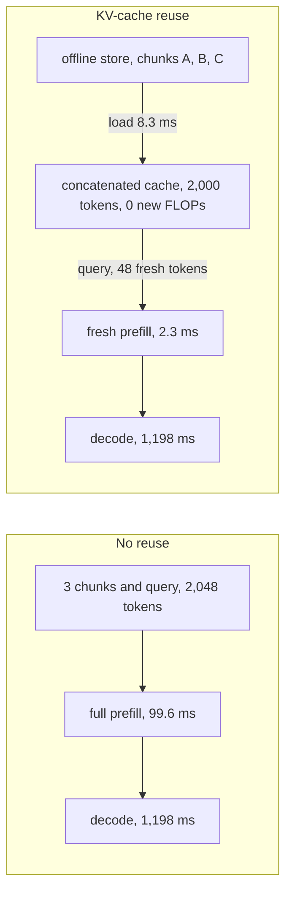
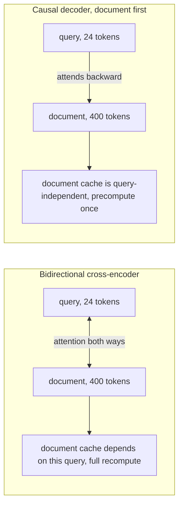
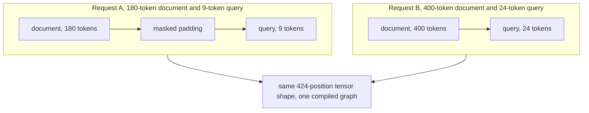
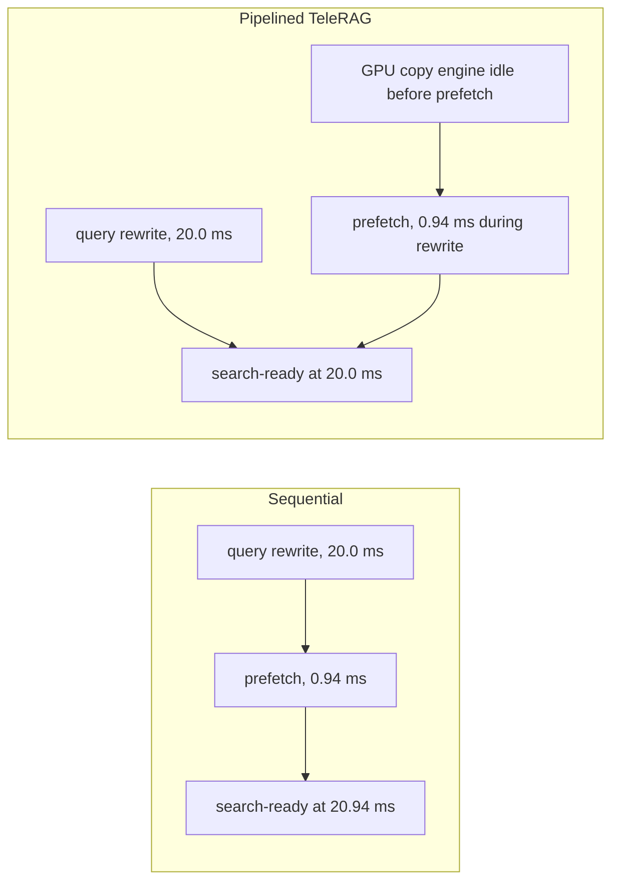
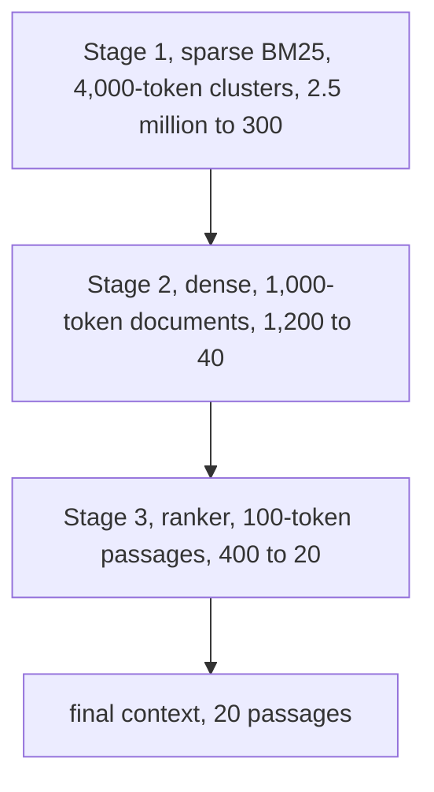
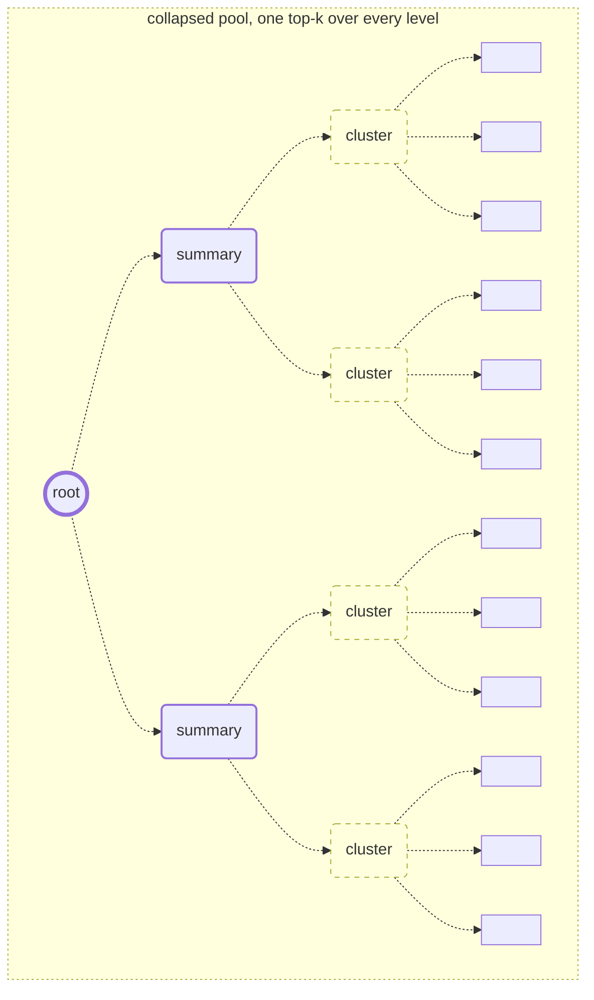

# Chapter 37: Latency, Cost, and Systems

Purpose: Build a stage-level model of Retrieval-Augmented Generation (RAG) latency and cost, then use caching, batching, kernel design, pipelining, retrieval cascades, and multi-resolution indexing only where the measured bottleneck justifies them.

## TL;DR

- A RAG request has five timed stages. Measure query embedding, approximate nearest neighbor (ANN) search, candidate reranking, context processing called prefill, and token emission called decode separately.
- In the worked 8 billion parameter example, decode takes 1,221 ms of a 1,343 ms request. It dominates because every output token rereads the model weights from memory.
- Prefill is limited by arithmetic after roughly 170 tokens in the stated two-byte bfloat16 setup. Decode is limited by memory bandwidth at batch size one, so smaller weight bytes and shared weight reads attack the right resource.
- Key-value (KV) cache reuse stores a recurring chunk's attention state. It loses interaction between chunks and creates duplicate positions, which a short mask-aware fine-tune and Rotary position embeddings (RoPE) re-offsetting address.
- A document-first causal reranker processes the reusable document before the unique query. Fixed-shape layouts then let compiled or captured graphics processing unit (GPU) kernels replay without rebuilding their execution plan.
- Pipelining hides a transfer inside work that already runs. A retrieval funnel sends broad candidates through cheap stages before expensive ones. Recursive summaries create retrievable answers for themes that no short chunk states.
- Cost per query depends on achieved throughput, or how many requests the hardware actually serves. At decode batch size 32, the worked cost falls from $933 to $125 per million queries, and prefill becomes the largest cost line.

## The story

Picture the RAG system as a warehouse that assembles one shipment per query.

Five stations touch the shipment. The clerk labels the order, the locator finds bins, the inspector ranks items, the packing station loads context, and the dispatch line emits the answer one token at a time.

The dispatch line looks simple, but it rereads the entire catalog for every item it releases. That repeated memory trip makes it the slow station even when the packing station performs much more arithmetic.

The warehouse can stamp reusable labels onto popular bins. Chunk KV caches do that for retrieved text. A document-first causal reranker gives the same treatment to hot documents because the document is processed before the unique query arrives.

The floor layout matters too. If every parcel has a new shape, the machinery must be reset for every order. Fixed slots and a few size buckets let the same compiled motion replay, while fusion keeps intermediate material on the machine instead of sending it back to storage.

At larger scale, the catalog no longer fits beside the machinery. The warehouse predicts which shelves an unfinished order will need and moves those shelves while the order is still being rewritten. The bytes still move, but they leave the critical path.

A funnel sends a broad set through cheap gates before the expensive inspector sees it. A summary tree adds mezzanine views of a long document, so a thematic question can retrieve a whole-book abstraction instead of a pile of local scenes.

The invoice finally changes the apparent bottleneck. Batching lets many dispatches share one weight read, so decode's cost share falls. The right optimization therefore depends on the stage, the hardware regime, the traffic level, and whether the target is latency, time to first token, throughput, or dollars.

## Decoder table

| Technical term | Plain-English meaning | Why it matters |
|---|---|---|
| Median latency, or p50 | The middle request latency | It sets the 1.3 second to 500 ms scenario, but one total timer cannot identify the stage to cut |
| Five-stage budget | Embed, ANN search, rerank, prefill, decode | It exposes the bottleneck before a change spends recall or engineering time |
| Arithmetic intensity | Floating-point operations (FLOPs) per byte moved | It predicts compute-bound versus bandwidth-bound execution, so peak FLOPs do not help a stage waiting on memory |
| Roofline model | Compare arithmetic intensity with a hardware ridge | It explains which resource limits a stage before optimization begins |
| Ridge point | Peak or sustained FLOPs divided by memory bandwidth | It separates hardware regimes, with the stated H100 setup at 170 FLOPs per byte |
| bfloat16 and 32-bit floating point (fp32) | Two-byte model precision and four-byte vector precision | Byte width sets model traffic, cache traffic, and index memory |
| Bi-encoder | Encode query and chunks separately | It makes ANN search possible, while call overhead can dominate its short query pass |
| Prefill | One forward pass over the assembled context | Its intensity grows with context, and long context raises compute plus attention work |
| Decode | One dependent step per output token | It rereads weights once per token and takes 90.9% of the unbatched worked request |
| Quantization | Reduce bytes per parameter | It cuts decode weight traffic, subject to measured evaluation tolerance |
| Continuous batching | Share one weight read across concurrent decode streams | It raises intensity toward `2B/b`, but waiting for a batch raises time to first token (TTFT) and tail latency |
| TTFT | Delay before streaming begins | It makes prefill visible even when decode dominates total response time |
| Response cache | Store an answer keyed by a repeated query | It helps near-duplicates, but paraphrased requests usually miss it |
| Chunk KV cache | Store per-layer keys and values for a recurring chunk | It removes repeated prefill work when retrieval hits are concentrated |
| Cross-attention | Let tokens use information from the other text segment | It improves joint reasoning but can destroy a reusable document-only artifact |
| Cross-chunk attention loss | Independently cached chunks never attend to earlier chunks | It can hurt comparison questions, while mask-aware fine-tuning closes most of the measured gap |
| Causal mask | Let each token attend only to earlier positions | It makes the leading document independent of the later query |
| Retrieval hit rate | Fraction of requests that find an existing cache entry | It decides whether cache construction and storage amortize |
| Hot set and storage tier | Frequently reused items and where their caches live | High-bandwidth memory (HBM) serves the hottest items, while host memory or recompute handles the tail |
| Position collision | Each isolated chunk starts at position zero | Duplicate positions corrupt relative distance, so concatenation needs disjoint offsets |
| RoPE re-offset | Rotate cached keys for the new position range | It avoids recomputation, while absolute learned positions do not permit the cheap fix |
| Provider prompt cache | Reuse an exact byte-for-byte prefix | It serves static prefixes, but reordered RAG chunks do not match literally |
| Bidirectional cross-encoder | Query and document tokens attend both ways | It extracts strong pairwise relevance but makes every document vector query-dependent |
| Bidirectional Encoder Representations from Transformers (BERT) | The encoder family used in the reranker example | It represents the bidirectional baseline whose attention pattern prevents document caching |
| Document-first causal decoder | Put document tokens before query tokens under causal masking | It makes the document cacheable, but a same-size decoder can lose ranking quality |
| Query-first causal decoder | Put unique query tokens first | It makes the wrong side independent and leaves the recurring document query-dependent |
| Kernel fusion | Combine adjacent operations into one kernel | It avoids intermediate high-bandwidth memory (HBM) round trips, but dynamic operations can block reuse |
| Eager execution | Launch each operation separately | It accepts variable shapes but writes and rereads intermediates at each boundary |
| FlashAttention | Fuse score, softmax, and value application | It avoids the full attention matrix in HBM, subject to mask support and validation |
| `torch.compile` | Trace a forward pass and generate fused work | It amortizes setup over repeated shapes, while new shapes retrace or fall back |
| Compute Unified Device Architecture (CUDA) graph | Capture and replay a fixed kernel sequence | It removes repeated dispatch only when operation sequence and shapes stay fixed |
| Static slot | Pack document left and query right with masked padding | It gives one request shape, but a wrong mask or position identifier silently changes scores |
| Attention mask | Block padded or disallowed token interactions | An incorrect mask changes scores even when the latency benchmark looks good |
| Tensor shape | The dimensions presented to a kernel | Repeated shapes reuse compiled work, while new shapes retrace |
| Activation | An intermediate value between model operations | Eager execution can write it to HBM and read it back unnecessarily |
| Feed-forward network | The per-layer expansion and contraction block | Its intermediate supplies the fusion example's measurable round-trip traffic |
| Shape bucket | Reuse one of a few fixed lengths | It balances padding against graph reuse, unlike one expensive global maximum |
| Central processing unit (CPU) and GPU pipeline | Overlap host work, transfer, and device search | It turns a sum into a maximum when work fits in the window |
| Dynamic random-access memory (DRAM) | Large host memory for an oversized index | It holds a corpus that cannot fit in HBM, at slower search and transfer speeds |
| Inverted file (IVF) index | Partition chunks around learned centroids | It searches selected clusters, although the full vector store still scales with corpus size |
| `nlist` | Number of IVF clusters | It sets average cluster size and must match corpus scale |
| `nprobe` | Number of clusters searched or prefetched | It trades coverage for bytes and work, with a safe value set by the rewrite window |
| Query rewrite | Reformulate a raw query before retrieval | Its generation window can hide centroid prediction and transfer |
| Cold index | An index not resident on the fast path | It can turn a single-digit ANN stage into hundreds of milliseconds |
| TeleRAG prefetch | Predict and move likely clusters during query rewrite | It hides transfer, while concurrent CPU search covers wrong predictions |
| Hierarchical Navigable Small World (HNSW) search | A graph-based ANN stage | Its p50 can stay stable while fixed top-k recall falls among more distractors |
| Retrieval funnel | Cheap coarse search followed by narrower expensive stages | It caps final-ranker work, but the first stage sets the recall floor |
| Top-k | Keep the k highest-ranked candidates | A fixed k can lose recall as distractors grow, while widening k raises downstream cost |
| Coarse-stage recall | Whether the first funnel stage retains answer-bearing groups | Later stages cannot recover a group that the first stage removed |
| Reciprocal Rank Fusion (RRF) | Merge independent sparse and dense rankings | It covers complementary misses but does not shrink either full-corpus search |
| Recursive Abstractive Processing for Tree-Organized Retrieval (RAPTOR) | Repeatedly cluster, summarize, and embed | It creates multi-resolution nodes at an offline construction and rebuild cost |
| Soft Gaussian-mixture clustering | Let a leaf belong to more than one related group | It lets one passage support more than one theme |
| Branching factor | Average number of children compressed into a parent | It controls tree height, storage overhead, and summary granularity |
| Cosine similarity | Rank query and node embeddings in one shared space | It lets one score compare leaves and summaries directly |
| Collapsed-tree retrieval | Rank every tree node in one shared pool | The query chooses its resolution because every level shares one embedding space |
| Tree traversal | Keep a fixed quota per level and descend | It can guarantee level-specific output but imposes one resolution schedule on every query |
| Cost per query | Infrastructure spend divided by achieved throughput | It prices the operating point rather than treating cost as a pipeline constant |
| Fixed index cost | Hourly memory cost paid without traffic | It dominates at low volume, with the worked crossover near 0.69 queries per second (QPS) |
| Variable compute cost | Per-query stage time at the achieved batch and throughput | It grows with traffic, and compute-bound stages do not receive decode's batching discount |
| Formula symbols | `N` is parameters, corpus items, or leaves by section. `b` is bytes per parameter. `s`, `s_c`, and `s_f` are total, cached, and fresh tokens. `L` is layers. `d` is hidden or vector width. `B` is batch size. `m` is repeats or cascade stages. `M` is index bytes. `r_i` is a stage reduction. `k_m` is final candidates. `l` is leaf length. `h` is tree height. `P` is hourly price. `t_i` is stage time. `C_q` is query cost. `c` is branching factor or per-stream cache GB. | The source overloads several letters, so each formula must be read in its own section |

## Core mechanics

### 37.1 Where the milliseconds actually go

#### What

The opening interview allows thirty seconds to cut p50 from 1.3 seconds toward 500 ms. A request crosses query embedding, ANN search, reranking, generator prefill, and token-by-token decode.

The embedding and graph-search stages are overhead-dominated in the stated example.

A 110 million parameter bi-encoder on a 24-token query performs about 5.3 billion FLOPs. An HNSW walk visits a few thousand candidate distances, but tokenization, service calls, and graph pointer chasing can dominate what the trace shows.

Measure those first two stages. Derive the last three from arithmetic and bytes only after fixing the hardware and shapes.

#### Why

The stated H100 80 GB Peripheral Component Interconnect Express (PCIe) setup sustains 340 trillion FLOPs per second and moves 2,000 GB per second from HBM.

Its ridge point is:

$$
R = \frac{3.4 \times 10^{14}}{2.000 \times 10^{12}} = 170\ \mathrm{FLOPs/byte}
$$

For `N` parameters, `b` bytes per parameter, and `s` context tokens, prefill intensity is:

$$
I_{\mathrm{prefill}} = \frac{2Ns}{Nb} = \frac{2s}{b}
$$

At `b = 2`, prefill clears the ridge after roughly 170 tokens and becomes compute-bound.

Decode processes one new token at a time. Its intensity is independent of model size:

$$
I_{\mathrm{decode}} = \frac{2N}{Nb} = \frac{2}{b}
$$

At bfloat16, decode provides 1 FLOP per byte. That is 170 times below the ridge for both an 8 billion and a 70 billion parameter model because `N` cancels.

Batching `B` streams raises the useful work per shared weight read toward `2B/b`.

#### Failure without it

Cutting rerank depth from 50 to 10 removes 80% of candidates but can save only a few milliseconds from a 1,343 ms request.

That cut can also remove answer-bearing candidates.

A faster GPU with more peak FLOPs helps compute-bound prefill and reranking. It does not remove a decode weight-read bottleneck.

Shrinking the KV cache first also misses this example's bottleneck. The average 0.28 GB cache read is under 2% of the 16.28 GB moved per step.

#### Cost and complexity

The worked pipeline uses Llama 3.1 8B with 32 layers, hidden dimension 4,096, 8 KV heads, head dimension 128, and bfloat16 weights.

The 10 million chunk corpus returns 50 candidates. Embed and search measure 8 ms and 6 ms.

The 110 million parameter cross-encoder scores 50 pairs of 256 tokens:

$$
2 \times 110 \times 10^6 \times 256 \times 50
= 2.82 \times 10^{12}\ \mathrm{FLOPs}
$$

$$
\frac{2.82 \times 10^{12}}{3.4 \times 10^{14}}
\approx 8.3\ \mathrm{ms}
$$

The source states that five 400-token chunks plus 200 query and instruction tokens round to a 2,048-token context. Those components sum to 2,200, so the subsequent formulas use the source's stated 2,048-token context rather than the component sum.

Prefill performs:

$$
2Ns + 2Ls^2d
= 3.39 \times 10^{13}\ \mathrm{FLOPs}
$$

That takes 99.6 ms at the stated sustained rate.

Decode reads 16 GB of weights plus about 0.28 GB of KV cache per step:

$$
\frac{16.28 \times 10^9}{2.000 \times 10^{12}}
\approx 8.14\ \mathrm{ms/token}
$$

For 150 tokens, decode takes about 1,221 ms.

The total is 8 + 6 + 8.3 + 99.6 + 1,221, or about 1,343 ms.

Decode performs 2.4 trillion FLOPs across the answer. Prefill performs fourteen times more arithmetic, yet decode takes about twelve times longer.

The single-stream rate is about 123 tokens per second, which the source limits to an order-of-magnitude sanity check around 100 tokens per second for this configuration.

#### Decisions and limits

- Instrument all five stages independently.

- Attack decode with shorter answers, int8 or int4 weights, or batching when total latency is the target.

- Attack prefill when a streaming interface makes TTFT the target.

- Leave embed and ANN search alone below roughly 1% unless the index is cold, disk-backed, or missing hot-path caching.

- Cut rerank depth only when recall data shows the tail is unused. A heavy large language model (LLM) reranker is the stated exception.

- Quantize before shrinking the generator, subject to evaluation tolerance.

- A proposed 30 billion parameter model moves 3.75 times the weight bytes of the 8 billion parameter model at the same precision. Decode moves toward 4.6 seconds.

- Int8 roughly halves that multiplier to 1.875 times. The 500 ms service-level agreement (SLA) can still require a different output-length or batching policy.

### 37.2 KV-cache reuse for retrieved chunks

#### What

A causally masked decoder computes a chunk's per-layer keys and values from that chunk and its left context.

When a chunk leads its own isolated sequence, its cache is a deterministic function of its tokens.

Precompute that artifact once. At request time, load the selected chunk caches, concatenate them, append fresh query tokens, and compute only the fresh part.

This targets a support workload with thousands of paraphrases, roughly twenty recurring questions, and 500 knowledge-base articles.

#### Why

Response caching keys on repeated queries. Chunk caching keys on repeated documents.

The source example reuses 2,000 chunk tokens and computes 48 fresh tokens.

The fresh work is:

$$
2Ns_f + 2Lds_fs
= 7.94 \times 10^{11}\ \mathrm{FLOPs}
$$

That takes about 2.3 ms instead of the 99.6 ms full prefill.

The 128 KiB per-token cache is 131,072 bytes and occupies about 262 MB for 2,000 tokens.

An HBM-resident load takes about 0.13 ms, for a 2.5 ms total and a 40 times stage reduction.

A host-memory load over a 31.5 GB per second PCIe Gen4 x16 link takes 8.3 ms, for a 10.7 ms total and a 9.3 times stage reduction.

#### Failure without it

An independently cached chunk B never attended to chunk A.

This lost coupling can hurt questions that compare documents even when single-fact questions remain stable.

Attention maps in the source show most mass stays local or points toward the query. A short fine-tune with the cross-chunk mask closes most of the reported gap.

Each independent chunk also starts at position zero. Naive concatenation creates duplicate position identifiers.

Assign disjoint offsets in concatenation order. Chunk one uses positions `0` through `l - 1`, chunk two uses `l` through `2l - 1`, and later chunks continue the pattern. Under RoPE, this is one rotation per cached key vector rather than a full forward pass.

Absolute learned position embeddings are the stated exception. Reordering then requires recomputation.

Provider prompt caching is not a substitute. It matches an exact static prefix, while RAG mixes and reorders chunks.

#### Cost and complexity

TurboRAG reports peak TTFT speedup of 9.4 times, average speedup of 8.6 times on LongBench multi-document question answering (QA), and 98.46% less online compute.

The independent arithmetic gives 9.3 times for prefill and a 97.7% FLOP reduction.

The full request improves only about 6.7% when 99.6 ms in a roughly 1,320 ms budget falls to 10.7 ms.

Figure 37.2 holds decode at 1,198 ms in both branches. Reuse changes prefill, not decode.

HBM bandwidth is roughly 63 times the stated PCIe bandwidth, at 2,000 versus 31.5 GB per second.

#### Decisions and limits

- Build reuse only after measuring retrieval-hit concentration.

- Cache the highest-frequency chunks in HBM. Use host memory or recompute for the tail.

- Pair the independent-attention mask with the short fine-tune unless chunks are already near-independent.

- Reassign offsets by concatenation order at generation time.

- Treat reuse mainly as a throughput and GPU-seconds lever.

- Treat TTFT and very long contexts as the cases where wall-clock latency can justify it directly.

### 37.3 Reordering a decoder to make caching possible

#### What

A standard bidirectional reranker mixes the query into every document token.

Changing the token order cannot remove that coupling because the attention mask still runs both ways.

A causal decoder makes the first sequence segment independent of everything that follows it.

Place the document first and the query last. The document cache becomes query-independent, while the query still attends backward over the document.

HyperRAG uses this document-first decoder pattern for reranking.

#### Why

Bidirectional attention can resolve the phrase "high interest rate in Japan" because the token "interest" can use "rate" three tokens later.

A left-to-right representation of "interest" cannot see that later disambiguator at the moment it is computed.

The systems trade is therefore explicit. Bidirectional interaction can extract more relevance signal per FLOP, while causal ordering creates the reusable artifact.

Query-first ordering grants independence to the query, which is normally unique, and leaves the recurring document query-dependent.

#### Failure without it

A cache built from a bidirectional cross-encoder changes whenever the query changes.

A query-first causal design caches the wrong side of the pair.

A same-size decoder swap can regress ranking quality because it gives up full bidirectional interaction.

At under 5% repeat rate, about 95% of document caches are built, used once, and discarded.

#### Cost and complexity

The example uses a 110 million parameter reranker, a 400-token document, a 24-token query, and 340 trillion FLOPs per second.

The full 424-token pair costs:

$$
2 \times 110 \times 10^6 \times 424
= 9.328 \times 10^{10}\ \mathrm{FLOPs}
\approx 0.274\ \mathrm{ms}
$$

The one-time document cache costs:

$$
2 \times 110 \times 10^6 \times 400
= 8.8 \times 10^{10}\ \mathrm{FLOPs}
\approx 0.259\ \mathrm{ms}
$$

Each fresh query costs:

$$
2 \times 110 \times 10^6 \times 24
= 5.28 \times 10^9\ \mathrm{FLOPs}
\approx 0.0155\ \mathrm{ms}
$$

Steady-state reuse is about 17.7 times cheaper.

The break-even repeat count is:

$$
m \approx \frac{0.259}{0.274 - 0.0155} \approx 1.0
$$

The document contributes 94% of the pair. The fresh query contributes about 5.7%.

#### Decisions and limits

- Use document-first and query-last for a causal decoder reranker.

- Swap architectures only when retrieval logs show a concentrated hot set.

- Budget a larger decoder if needed, then remeasure ranking quality.

- Share tiered document-cache storage with generator-side reuse when the fleets permit it.

- Make ordering the prerequisite. Cache compression, quantization, and memory-layout work come after a reusable artifact exists.

### 37.4 Kernel fusion, static layouts, and GPU-shaped design

#### What

Eager execution launches matrix multiplication, softmax, normalization, and elementwise operations as separate kernels.

Each boundary can write an intermediate tensor to HBM and read it back for the next operation.

Kernel fusion consumes an intermediate on chip.

FlashAttention fuses attention score computation, softmax, and value application so the full square score matrix is not materialized in HBM.

Its traffic scaling changes from quadratic in sequence length for that matrix to linear storage traffic for the fused path described by the source.

`torch.compile` traces and fuses eligible operations. CUDA graphs capture and replay a fixed launch sequence.

Both mechanisms need reusable tensor shapes.

#### Why

HyperRAG packs document tokens from the beginning of a fixed slot and query tokens against the end.

It masks the gap between them.

A 180-token document with a 9-token query and a 400-token document with a 24-token query both present a 424-position tensor.

The static shape can reuse one compiled graph. It also allows compatible requests to stack into a batch.

#### Failure without it

Variable shapes trigger a new trace or an eager fallback.

The compile setup can cost more than the microseconds that the pass was meant to save.

One global 2,000-token maximum avoids retracing but wastes work on short requests.

A wrong padding mask or position identifier silently changes model scores. Output parity is a required correctness gate.

#### Cost and complexity

The example uses the 12-layer, 110 million parameter BERT-base architecture cited to Devlin et al. (2019), with hidden dimension 768.

Only 24 fresh query positions run after the document cache is warm.

The feed-forward network (FFN) expands to width 3,072.

Its intermediate activation is:

$$
24 \times 3{,}072 \times 2 = 147{,}456\ \mathrm{bytes} = 144\ \mathrm{KiB}
$$

Two write-read round trips move 576 KiB per layer.

Across 12 layers, 7.08 million bytes take about 3.54 microseconds at 2,000 GB per second.

The source writes 0.00347 ms for the traffic term even though its preceding 3.54 microseconds converts to 0.00354 ms. It reports the unfused pass at about 0.0190 ms and the fused pass at 0.0155 ms.

Fusion removes about 18% of the steady-state latency in this isolated example.

Dao et al. (2022) report FlashAttention training BERT-large 15% faster than the MLPerf 1.1 record named in the source. The source treats this only as a same-order sanity check across a different sub-block and regime.

Padding all 50 rerank candidates to 2,000 tokens costs:

$$
2 \times 110 \times 10^6 \times 2{,}000 \times 50
= 2.2 \times 10^{13}\ \mathrm{FLOPs}
\approx 64.7\ \mathrm{ms}
$$

That is nearly eight times the original 8.3 ms rerank batch and approaches the 99.6 ms prefill.

#### Decisions and limits

- Compile or capture fixed, repeated passes. Dynamic control flow and early exits are stated exceptions.

- Use a few shape buckets instead of fully dynamic input or one global maximum.

- The source suggests 512, 1,024, and 2,048 as an illustrative bucket set for the 2,000-token case.

- Prefer a validated fused-attention kernel when its mask pattern is supported.

- Validate output parity for masks and position identifiers before trusting speed.

- Size batch and shape bucket together. Low traffic in a rare bucket can limit batching even when graph reuse still helps.

### 37.5 CPU/GPU pipelining and prefetching

#### What

The motivating ANN stage measures 6 ms while a 10 million chunk, 768-dimensional, 32-bit floating point (fp32) index occupies 3.072 x 10^10 bytes, or 30.72 GB. It can fit on the stated 80 GB card beside 16 GB of generator weights and cache headroom, but the same search can reach 200 ms after production-scale movement to host memory.

At 500 million chunks, the same index occupies 1.536 x 10^12 bytes, or about 1.54 TB, which is about 19 times the card's entire HBM capacity before generator weights. Quantization cannot close that gap on one card, so the index moves to CPU DRAM, which the source describes as about an order of magnitude cheaper per GB and available in terabytes.

An IVF index still stores every vector even though each query searches only `nprobe` clusters from `nlist` partitions.

TeleRAG overlaps cluster prediction and host-to-device prefetch with a query rewrite that already runs. The GPU searches prefetched clusters while the CPU searches the remainder, then the system merges scores. Pipelining neither shrinks the transfer nor speeds CPU search.

The idle resource is the retrieval link and destination buffer, not necessarily the whole GPU. Its copy engine can run separately from the rewrite model's decode work.

#### Why

Index memory scales as:

$$
M = N \times d \times 4\ \mathrm{bytes}
$$

The index guidance cited to Johnson, Douze, and Jégou (2019) places `nlist` between roughly four and sixteen times the square root of `N`.

For 10 million vectors, the lower estimate is about 12,649 and the example rounds to `nlist = 16,384`.

An average cluster then holds about 610 vectors. Prefetching `nprobe = 16` moves about 3.00 x 10^7 bytes, or 30.0 MB.

At the 32 GB per second PCIe Gen4 x16 ceiling, transfer takes about 0.94 ms. At the stated practical 25 GB per second, it takes about 1.2 ms, which is under 7% of the rewrite window.

A 1 billion parameter bfloat16 rewriter that emits 20 tokens reads 2 GB per step. At 2,000 GB per second, that is 1.00 ms per token and creates a 20.0 ms rewrite window.

Sequential readiness is 20.0 + 0.94, or 20.94 ms. Pipelined readiness is the maximum of 20.0 and 0.94, or 20.0 ms.

#### Failure without it

Launching prefetch only after rewrite returns creates two sequential stages with a pipelined label.

Waiting for a final embedding before estimating centroids also removes the overlap.

Prefetch-only search can lose recall when its prediction misses. Concurrent CPU search over non-prefetched clusters is the recovery path.

With no rewrite step, there is no idle window to hide the transfer behind.

#### Cost and complexity

The 0.94 ms saving is 4.5% of the 20.94 ms sequential total.

Raising `nprobe` from 16 to 128 multiplies the bytes by eight. Transfer becomes about 7.5 ms at the ceiling or 9.6 ms at the practical rate, still inside this 20.0 ms window.

The limit is the rewrite-window length. A faster rewriter can put the same transfer back on the critical path.

Use HBM as a prefetch cache when the full corpus does not fit. Keep the whole index resident only when memory leaves room for weights, KV cache, and activations.

Start centroid prediction from the best available draft embedding. Refine it as more rewrite tokens arrive when the interface exposes intermediate drafts.

Batch prefetch transfers only when traffic amortizes driver overhead without adding more queueing delay than the transfer itself.

### 37.6 Funnel retrieval: coarse-to-fine cascades

#### What

The scenario absorbs a dozen more sources, including wikis from three acquired teams, and grows from 10 million to 200 million chunks. HNSW p50 barely moves because its search cost grows logarithmically, but the old top five now competes against twenty times more distractors.

A flat pipeline sends `k` candidates to a downstream stage with per-item cost `c`, so that stage costs `k` times `c`.

A cascade of `m` stages keeps fractions set by reduction factors `r`:

$$
k_m = \frac{N}{r_1 r_2 \cdots r_m}
$$

FunnelRAG first runs BM25 over roughly 4,000-token clusters, then dense retrieval over roughly 1,000-token documents, then a ranking model over roughly 100-token passages.

#### Why

Corpus growth can be absorbed by a cheap early stage instead of widening the most expensive final stage.

Figure 37.6 starts with 2.5 million clusters and keeps 300. Those clusters contain 1,200 candidate documents, of which dense retrieval keeps 40. Those documents contain 400 passages, of which the ranker keeps 20 for context.

The expensive ranker sees 400 candidates rather than the full corpus.

RRF solves a different problem. It merges sparse and dense rankings that each searched the corpus, so it does not reduce either search space.

#### Failure without it

The first stage sets the recall floor. No later model can recover a cluster that BM25 removed.

Monitor recall after every stage rather than only end-to-end answer quality.

Stale clusters can quietly lower coarse-stage recall as topics drift.

Widening the flat top-k transfers corpus growth into rerank cost, prompt length, and lost-in-the-middle risk.

#### Cost and complexity

The worked corpus contains 100 million passages of 100 tokens each.

A flat 768-dimensional fp32 passage index costs 307.2 GB, which forces sharding or quantization before further growth in the source's example.

Grouping ten passages per 1,000-token document reduces the dense index to 30.72 GB, a ten times footprint reduction.

Only 400 of 100 million passages reach full cross-attention. The source calls this a five-order-of-magnitude reduction.

FunnelRAG reports roughly 40% lower end-to-end retrieval latency with accuracy held or improved at its tested scale. The worked 100 million passage example is deliberately one order of magnitude larger than that reported scale.

Use the funnel once a flat index no longer fits comfortably on one node, at tens of millions of items and up in the source, or when memory, cold start, or reindex time appears in profiling. Treat it mainly as a throughput and footprint lever unless the index itself is cold or disk-backed.

Put sparse retrieval first by default. The stated exception is paraphrase-heavy text with little lexical structure, where a measured coarse dense pass may recall better.

Size each cutoff from downstream cost and per-stage recall. Recluster on a maintenance schedule, with faster rebuilds when topic drift is rapid. If one sprint cannot fit a three-stage build, the source recommends a minimal sparse prefilter before the existing dense stage.

### 37.7 Recursive summarization for thematic queries

#### What

Leaf retrieval returns rank one for the local mentor question in the source's 300-page novel. The central-conflict query instead returns five chunks about five scenes because no 100-token span states the whole-book theme.

It can fail on the central conflict because no 100-token span states a whole-book theme.

RAPTOR builds a multi-resolution index with a repeated cluster, summarize, and embed loop.

It splits leaves at about 100 tokens on sentence boundaries. It embeds them, uses soft Gaussian-mixture clustering in a dimension-reduced space, summarizes each cluster with a cheap instruction-tuned model, embeds each summary, and recurses to one root. The paper uses gpt-3.5-turbo for the summarizer.

Soft membership lets one leaf support more than one theme.

For average branching factor `c`, leaf count `N`, and a height that includes the leaf layer:

$$
h \approx \left\lceil \log_c N \right\rceil + 1
$$

#### Why

Every node uses the same embedding space. One cosine-similarity ranking can compare a sentence, section summary, and book-level summary.

Collapsed retrieval flattens every level into one candidate pool and takes one global top-k.

A factual query can favor leaves. A thematic query can favor higher summaries.

Tree traversal instead reserves a fixed quota for every level and descends through retained parents. That quota imposes the same resolution prior on every query.

#### Failure without it

Increasing leaf top-k returns more locally related scenes but does not create the missing aggregate claim.

A bigger embedding model or reranker only reorders the same leaf candidates.

Weak summaries can discard facts. Round-trip a sample against its source leaves before trusting the tree.

Material source changes can invalidate every ancestor up to the root.

#### Cost and complexity

A 120,000-token novel yields 1,200 leaves at 100 tokens each.

At branching factor 10, the levels contain 1,200, 120, 12, 2, and 1 nodes. Height is 5.

The 1,335 total nodes add 135 embeddings, about 11% over the flat index, and require 135 internal summarization calls.

Each internal call compresses roughly ten 100-token inputs in the worked construction.

Traversal with 20 nodes across 5 levels touches 100 nodes for every query. A factual query pays for 80 summary nodes it does not need.

Collapsed retrieval keeps one global top 20. A factual result near the leaf layer gives about a 2,000-token context, while a thematic result lands mostly at levels 2 through 4 and uses summaries that cover many leaves.

Sarthi et al. (2024) report a 20 percentage point absolute QA accuracy gain on QuALITY over their strongest compared baseline when RAPTOR is coupled with GPT-4, and their ablations favor collapsed retrieval over traversal.

Build the tree for a novel, long contract, multi-hundred-page report, or other linked corpus with thematic, comparative, or change-over-time questions. Independent short articles gain little.

Use a cheap summarizer by default. Treat construction as a background job. Rebuild after material changes, or name a bounded stale-summary window and trigger targeted ancestor work when changed leaf embeddings shift cluster membership.

At branching factor `c`, the source estimates internal-node overhead near `1/(c - 1)` of leaf count. Larger `c` reduces storage at the cost of summary granularity.

### 37.8 Cost per query, end to end

#### What

Self-hosted cost is hardware price multiplied by occupied wall-clock time at the achieved operating point.

For hourly GPU price `P` and stage times `t_i` in milliseconds:

$$
C_q = \frac{P}{3{,}600{,}000}\sum_i t_i
$$

Prefill and rerank are compute-bound in the stated regime. Batching `B` requests performs about `B` times their work in about `B` times the GPU time, so billed time per query barely changes.

Decode is memory-bound. Concurrent requests share the same model-weight read.

With `Nb` GB of weights, `c` GB of cache per stream per step, `s` output tokens, and 2,000 GB per second bandwidth:

$$
t_{\mathrm{decode}}(B)
= \frac{s}{2{,}000}\left(\frac{Nb}{B} + c\right)
$$

As `B` grows, the weight term amortizes and the per-stream cache term remains.

#### Why

At batch size one, embed, search, rerank, and prefill total 121.9 ms. Decode takes 1,221 ms.

At $2.50 per GPU-hour, the 1,343 ms request costs about $0.000933, or $933 per million queries.

At `B = 32`, decode becomes:

$$
150 \times \frac{16/32 + 0.28}{2{,}000}
= 0.0585\ \mathrm{s}
= 58.5\ \mathrm{ms}
$$

The total becomes 180.4 ms. Cost becomes about $0.000125, or $125 per million queries, which is about 7.4 times cheaper.

Decode's cost share falls from 90.9% to 32.4%. Prefill becomes 55.2%.

#### Failure without it

Using the unbatched latency share as the production cost share overstates decode after batching.

Replacing 8 billion parameters with 4 billion roughly halves the weight term. The source calls that term a minority at production batch sizes, but its own `B = 32` values give 0.50 GB of weight per query versus 0.28 GB of cache, so the weight term is still larger at that operating point. Decode is only 32.4% of the total bill there, which still rules out the proposed 30% total saving and leaves the source's possible faithfulness cost at the same context budget.

Treating batch size 32 as free ignores queueing. A request can wait for 31 peers, which trades dollars for TTFT and 99th-percentile (p99) latency.

#### Cost and complexity

The 10 million vector, 768-dimensional fp32 store occupies 30.72 GB before HNSW link overhead.

At the source's assumed $0.01 per GB-hour, it costs about $0.31 per hour whether or not a query arrives.

The fixed and variable costs cross at about 2,500 queries per hour, or 0.69 queries per second (QPS).

Below roughly one QPS, the always-on index can dominate. Above it, its per-query share becomes small beside generation compute.

Decode-only cost at batch 32 is about $0.0000406 per query. Across 150 output tokens, that is about $0.27 per million output tokens.

Model cost as spend divided by achieved throughput. Raise decode utilization before shrinking the model when quality is still needed.

After decode is batched, trim retrieved chunks and rerank depth when evaluation supports the recall trade. Those changes reduce compute-bound prefill and rerank.

Use shared or serverless index capacity for low average traffic when cold-start latency is acceptable. The source maps a steady 50 QPS tenant to dedicated batched capacity and a 0.3 QPS tenant with 20 QPS bursts to shared or serverless capacity. Use dedicated capacity after the crossover when tail-latency stability justifies it.

For a third-party application programming interface (API), price the invoiced input and output units directly. The provider has already amortized its own fleet. If it publishes one blended rate, reconstruct the input and output split before trusting the total.

## Diagrams

### Figure 37.1

> Latency in milliseconds on one linear scale
> embed      `#` 8 ms (0.6%)
> ANN search `#` 6 ms (0.4%)
> rerank     `#` 8.3 ms (0.6%)
> prefill    `#####` 99.6 ms (7.4%)
> decode     `#############################################################` 1,221 ms (90.9%)
> axis        0, 200, 400, 600, 800, 1,000, and 1,200 ms, all bars start at 0

**Figure 37.1:** Decode is 91% of a 1.34-second RAG query even though prefill performs fourteen times more arithmetic in a tenth of the time - the other four stages are barely visible at this scale because they are not the bottleneck.

### Figure 37.2

**Figure 37.2:** Concatenating precomputed, per-chunk KV caches turns an online 2,048-token prefill into a 48-token one, loaded rather than recomputed. Decode, still 91% of the query (section 37.1), is identical either way.

### Figure 37.3

**Figure 37.3:** Bidirectional attention entangles document and query key/value vectors regardless of order. Causal masking with the document placed first decouples them, so only the document-first ordering leaves a cacheable artifact.

### Figure 37.4

**Figure 37.4:** A fixed-size slot packs the document from the start and the query flush against the end, masking whatever is left in between, so every request presents the identical tensor shape to a compiled or captured kernel graph regardless of actual document or query length.

### Figure 37.5

**Figure 37.5:** The prefetch transfer is identical in both timelines - only its placement changes - so moving it inside the rewrite window removes it from the query's critical path entirely.

### Figure 37.6

**Figure 37.6:** Each stage hands a shrinking, purpose-matched candidate set to the next - the funnel's cost is set by what survives to the narrowest stage, not by the corpus size feeding the widest one.

### Figure 37.7

**Figure 37.7:** Cluster-summarize-embed builds one tree from leaves to root, and collapsed retrieval treats every node on that tree, regardless of level, as a single candidate pool for one similarity ranking.

### Figure 37.8

> B = 1                         B = 32
> `+------------------+`        `+------------------+`
> `| decode 90.9%     |`        `| decode 32.4%     |`
> `|                  |`        `+------------------+`
> `|                  |`        `| prefill 55.2%    |`
> `+------------------+`        `+------------------+`
> `| prefill 7.4%     |`        `| combined other  |`
> `| combined other  |`        `+------------------+`
> `+------------------+`        $125 per million queries
> $933 per million queries

**Figure 37.8:** Batching decode from B = 1 to B = 32 collapses decode's share of the bill from 90.9% to 32.4% and makes prefill - untouched by batching because it is compute-bound - the largest line item at 55.2%.

## Whiteboard pack

### What to draw

1. Draw the five request stages and write 8, 6, 8.3, 99.6, and 1,221 ms below them.
2. Put the 170 FLOPs per byte ridge above the line. Mark prefill as compute-bound and decode as bandwidth-bound.
3. Split the cache lane into full prefill and 2,000 cached plus 48 fresh tokens.
4. Draw bidirectional query-document arrows, then replace them with a document-first causal arrow.
5. Pack two unequal requests into the same 424-position slot and circle the reusable compiled graph.
6. Place the 0.94 ms prefetch inside the 20.0 ms rewrite window.
7. Draw the sparse, dense, and ranker funnel beside the collapsed RAPTOR tree.
8. Finish with the B = 1 and B = 32 cost bars and label the fixed-index crossover at 0.69 QPS.

### Spoken script

> Draw the five-stage latency bar. Mark decode at 1,221 of 1,343 milliseconds. The roofline explains why. Prefill grows with context and clears the ridge, while decode rereads weights for every token. Next, add cached chunks, document-first reranking, and fixed-shape fused kernels as three reuse lanes. Then draw the overlapped prefetch window, the retrieval funnel, and the RAPTOR tree. Finish with the cost bars. Batching decode from one to thirty-two cuts cost from 933 to 125 dollars per million queries, so prefill becomes the largest cost line. Profile first, then optimize the stage and operating point you pay for.

## Interview traps

### Probe 1: Product wants p50 below 500 ms. What do you change first?

Answer: Profile all five stages because the worked request is already 2.7 times above target and decode owns 90.9%. Shorter output, quantization, or batching attacks that bottleneck, while rerank and ANN cuts can spend recall for only a few milliseconds. Switch attention to prefill when TTFT, not total response time, is the product metric.

### Probe 2: Can every repeated document be cached and served through one fast compiled path?

Answer: No. Chunk reuse needs retrieval concentration, mask-aware fine-tuning, and position re-offsetting, while reranker reuse needs a document-first causal model. Compiled serving also needs fixed shapes, supported masks, output-parity checks, and a few buckets that balance graph reuse against padding.

### Probe 3: A production index becomes slow and recall falls as the corpus grows. Is one systems fix enough?

Answer: Separate the failures. If the index no longer fits in HBM, prefetch likely IVF clusters during rewrite and search the rest on CPU. If a fixed top-k loses recall among more distractors, add a coarse-to-fine funnel that caps expensive work without removing the first stage's recall floor.

### Probe 4: Why does a larger top-k not fix thematic questions?

Answer: The answer may not exist in any leaf, so RAPTOR creates summary nodes through recursive cluster, summarize, and embed steps. Collapsed retrieval lets one embedding ranking choose leaves for factual queries and summaries for thematic queries. Use tree traversal only when the product requires a fixed contribution from particular levels.

### Probe 5: Decode is 90.9% of latency. Is it also 90.9% of production cost?

Answer: Only at batch size one in this example. At batch 32, shared weight reads cut decode to 58.5 ms and 32.4% of cost, while prefill reaches 55.2%. Price achieved throughput, queueing, input work, output work, and the always-on index separately before assuming a smaller generator gives the largest saving.

## Key numbers

| Item | Exact source values and limits |
|---|---|
| H100 reference | 80 GB PCIe, 2,000 GB/s HBM2e, 3.4 x 10^14 sustained FLOPs/s, about 45% of 756 TFLOPs/s peak, 170 FLOPs/byte ridge |
| Query encoder | 110 million parameters, 24 tokens, about 5.3 x 10^9 FLOPs, measured embed latency 8 ms |
| Five-stage trace | p50 1.3 seconds, 500 ms target, 30-second interview window, expected decode region 85% to 90% plus for a few thousand tokens, stages 8 ms, 6 ms, 8.3 ms, 99.6 ms, and 1,221 ms, total about 1,343 ms |
| Rerank | 50 candidates, 256 tokens per pair, 2.82 x 10^12 FLOPs, 8.3 ms |
| Prefill | Five 400-token chunks plus 200 sum to 2,200 even though the source uses 2,048 for its formulas, giving 3.39 x 10^13 FLOPs and 99.6 ms |
| Decode | 16 GB weights plus 0.28 GB average cache, 8.14 ms/token, 150 tokens, 1,221 ms, about 123 tokens/s |
| Larger generator check | 30 billion versus 8 billion parameters gives 3.75 times bytes and about 4.6 s decode, while int8 reduces the multiplier to about 1.875 |
| Reuse context | Thousands of paraphrases, 20 recurring questions, 500 articles, 2,000 cached tokens, 48 fresh tokens, 131,072 bytes per token, 262 MB cache, 7.94 x 10^11 fresh FLOPs, 2.3 ms compute |
| HBM reuse | 0.13 ms load, about 2.5 ms total, about 40 times prefill reduction |
| Host reuse | 31.5 GB/s PCIe, 8.3 ms load, about 10.7 ms total, about 9.3 times reduction, HBM about 63 times faster |
| TurboRAG checks | 9.4 times peak TTFT, 8.6 times average LongBench speedup, 98.46% reported online-compute cut, 97.7% derived FLOP cut, about 6.7% end-to-end latency cut |
| Causal reranker | 424-token pair 0.274 ms, 400-token cache build 0.259 ms, 24-token fresh query 0.0155 ms, 94% document share, 5.7% fresh share, 17.7 times steady-state saving, break-even near one repeat, under 5% repeats means about 95% one-use caches |
| Fusion | 147,456 bytes or 144 KiB activation, 576 KiB per layer, 7.08 MB over 12 layers, 3.54 microseconds, source also states 0.00347 ms, 0.0190 to 0.0155 ms, 18% cut, 15% external sanity check |
| Global padding warning | 2,000 tokens across 50 candidates gives 2.2 x 10^13 FLOPs and 64.7 ms, nearly eight times 8.3 ms |
| Index scale | 10 million fp32 vectors at dimension 768 cost 3.072 x 10^10 bytes or 30.72 GB, while 500 million cost 1.536 x 10^12 bytes or about 1.54 TB, about 19 times 80 GB |
| Base prefetch | `nlist = 16,384`, about 610 vectors/cluster, `nprobe = 16`, about 30.0 MB, 0.94 to 1.2 ms inside a 20.0 ms rewrite |
| Deeper prefetch | `nprobe = 128` moves about eight times the bytes and takes about 7.5 to 9.6 ms under the two bandwidth assumptions |
| Funnel | 10 million to 200 million chunks after a dozen added sources and wikis from three acquired teams, 20 times more distractors, worked 100 million passages, 2.5 million clusters to 300, 1,200 documents to 40, 400 passages to 20, 307.2 to 30.72 GB dense footprint, roughly 40% reported latency cut |
| RAPTOR | 300-page motivating novel, five returned scenes, 120,000 tokens, 1,200 leaves, branching factor 10, five levels, 1,335 nodes, 135 summaries, about 11% storage overhead, 20 percentage point reported gain |
| Batched cost | $933 per million at B = 1 versus $125 at B = 32, 58.5 ms batched decode, 180.4 ms total, about 7.4 times cheaper, 32.4% decode and 55.2% prefill |
| Fixed store | 30.72 GB at $0.01/GB-hour gives about $0.31/hour, crossover about 2,500 queries/hour or 0.69 QPS, tenant rates 50 QPS and 0.3 QPS with 20 QPS bursts, batched decode about $0.27 per million output tokens |
