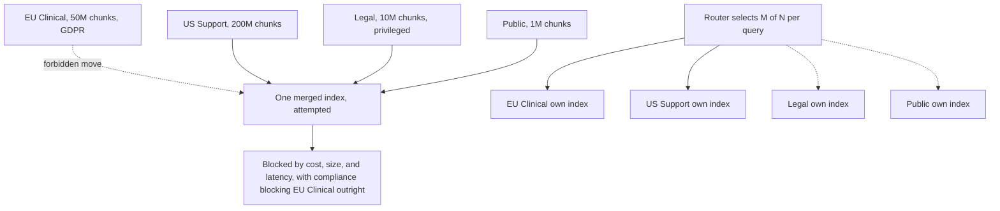
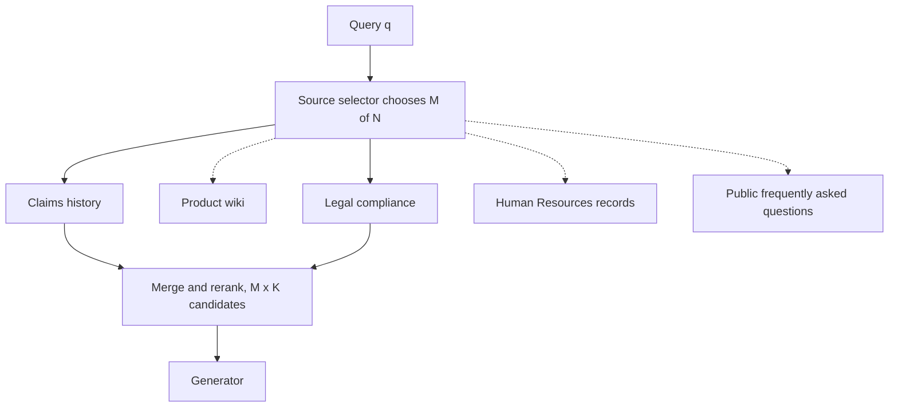
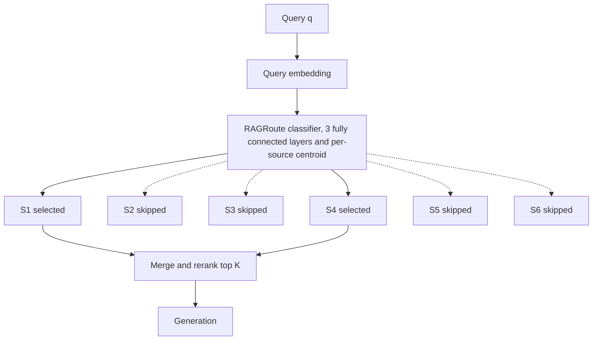
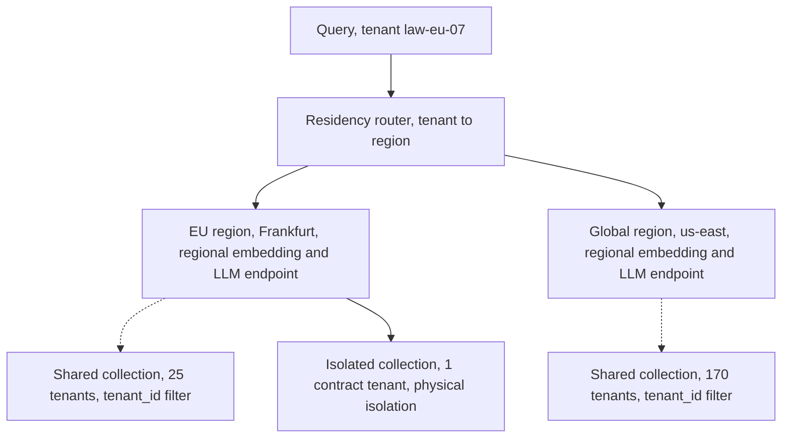
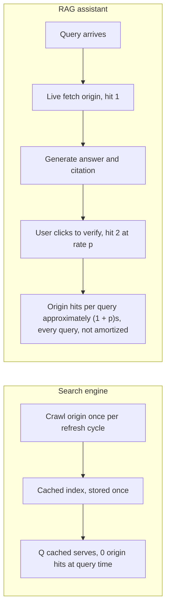

# Chapter 38: Distributed and Federated RAG

This chapter is for designing Retrieval-Augmented Generation (RAG) across independently governed sources, regions, tenants, and shared public infrastructure.

## TL;DR

- Keep sources separate when ownership or legal residency differs. Cost, size, and latency are budget dials, but compliance can forbid a merge outright.

- Federated search chooses which sources to ask before retrieving candidates. Querying M useful sources instead of all N sources reduces candidates, calls, and slow-tail exposure.

- RAGRoute learns source selection with a shallow classifier. It gets silver labels from one offline full broadcast and avoids that broadcast during serving.

- Tenant filtering and data residency solve different problems. Filters control who can retrieve data, while regional deployment controls where bytes are processed and stored.

- Treat General Data Protection Regulation (GDPR), healthcare agreements, audit attestations, and erasure as distinct obligations with distinct evidence.

- Live web grounding pushes request and energy costs onto source sites. Scheduled refresh, caching, bot identification, and bulk interfaces restore amortization.

- Keep every claim bounded. Several prices are stated assumptions, the 10x energy figure is directional operator evidence, and learned routers require broadcast audits for drift.

## The story

Imagine an international library consortium that answers questions for patrons.

Each library owns its books, staff rules, catalog, and building. Some collections must remain inside their country.

A central super-library sounds efficient. It fails when moving one protected collection across a border is forbidden, even if the consortium can afford the shelves and trucks.

The consortium therefore uses federation, which means the libraries stay independent while cooperating on a patron's question.

A routing librarian first decides which buildings to call. N is every library that exists, M is the smaller number selected, and K is how many candidate books each selected library returns.

Calling every library is broadcast retrieval, which means asking all sources on every question. The patron must wait for the slowest librarian, and the central desk receives N times K books to sort.

Calling only relevant libraries reduces that pile to M times K. It also lowers the chance that one slow building delays the whole answer.

RAGRoute is a trained routing clerk. The clerk reads the patron's question plus a compact description of each library and predicts which sources are worth calling.

The clerk learns from an expensive practice round. The consortium calls every library offline, observes which libraries supplied the globally best books, and turns that evidence into training labels.

The consortium still checks the clerk. A small sample of questions goes to every library so managers can detect when new patrons or new collections make the clerk's old habits stale.

The same consortium serves many member organizations. A tenant filter is like checking a patron's library card before showing a shelf.

That card check provides isolation, which means one member cannot see another member's books. It does not provide residency, which means protected books and their numerical representations stay in the required country.

Residency needs separate regional buildings, local cataloging machinery, and local answer desks. Inside each region, most members can share filtered shelves while a contract can require one physically separate room.

Deletion also has two stages. A tombstone is an immediate do-not-serve marker, while a later catalog rebuild removes the record physically.

The final inspection looks beyond the consortium's own invoice. A live request to a public library makes that library spend energy and bandwidth even when the patron never pays it.

A search catalog visits once and reuses its copy. A live RAG assistant can visit for grounding on every question and prompt a second visit when the patron verifies a citation.

A public ledger does not reduce those visits. It may prove provenance, which means who produced content and whether it changed, but the commons problem is who pays to keep serving it.

The complete design keeps legal boundaries intact, routes selectively, audits the router, separates isolation from geography, and counts costs that land outside its own walls.

## Decoder table

| Technical term | Plain-English meaning | Why it matters |
|---|---|---|
| Retrieval-Augmented Generation (RAG) | Retrieval supplies evidence to a generator | Distributed RAG must coordinate sources without erasing their boundaries |
| Corpus | A collection of documents or chunks | Each corpus can have a different owner, region, and update schedule |
| Silo | A corpus governed independently from others | A silo may be impossible or unwise to merge |
| Vector database | A system that stores and searches embeddings | One database is not always a legal or operational option |
| Vector index | The searchable structure built over embeddings | Its memory and graph overhead drive capacity planning |
| Embedding | A numerical representation of content | Embeddings consume memory and can inherit source-data restrictions |
| Large Language Model (LLM) | Model that generates an answer from retrieved evidence | Regional stacks must keep generation in the required location |
| Dimension d | The number of values in one embedding | Raw memory scales linearly with d |
| 32-bit floating point (fp32) | Four-byte storage for each embedding value | The worked memory calculations use four bytes per value |
| Approximate Nearest Neighbor (ANN) search | Fast similarity search that may not be exact | It supports large vector indexes and introduces graph mechanics |
| Hierarchical Navigable Small World (HNSW) | A graph-based ANN index | Its neighbor identifiers add the stated graph overhead |
| Resident copy | An index copy held in memory | Low latency requires enough machines for this copy |
| Replication | Keeping multiple copies for availability | Two copies double the machine count in the example |
| Sharding | Splitting one logical index across machines | It solves scale under one owner, not jurisdiction or ownership |
| Federation | Querying separate systems without merging their data | It preserves source governance and residency boundaries |
| Federated search | Sending a query to selected independent sources and merging results | It changes retrieval from one-index depth to source selection |
| Source endpoint | One independently queried retrieval service | Every selected endpoint adds a call, payload, and tail opportunity |
| Source selector | A rule or model that chooses endpoints for a query | It reduces fan-out before retrieval begins |
| N | The total number of available sources | Full broadcast cost scales with N |
| M | The number of sources selected for one query | Selective retrieval aims for M much smaller than N |
| K | Candidates returned by each queried source | Candidate volume is N x K or M x K |
| HNSW graph degree M | Neighbor-link setting used in the memory example | This M is separate from selected-source count M |
| Broadcast | Querying every source | It maximizes source coverage but scales calls and tail risk |
| Fan-out | Parallel calls from one query to many sources | Synchronous fan-out waits for the slowest participant |
| Candidate volume | The number of retrieved items entering merge and rerank | Excess candidates add bandwidth, latency, and noise |
| Tail latency | Slow behavior in the high end of a latency distribution | More independent sources create more chances to hit a slow tail |
| Per-source miss probability p | Chance one source misses its latency budget | It feeds the fan-out risk formula |
| Service-Level Agreement (SLA) | A stated performance commitment | Source reliability determines affordable fan-out width |
| Callan, Lu, and Croft collection selection | A lexical source-scoring algorithm introduced by the cited 1995 work | It is cheap but depends on terms and synchronized statistics |
| Best Matching 25 (BM25) | A lexical ranking method based on term statistics | Raw scores can differ from dense-source scores |
| Reciprocal Rank Fusion (RRF) | Merging lists through rank positions rather than raw scores | It combines sources with incomparable score scales |
| Shared reranker | One model that reorders merged candidates | It offers another scale-compatible merge policy |
| Raw score concatenation | Sorting all results by their backend scores | It can silently favor the backend with larger numeric scores |
| Source hit rate | How often a source contributes useful results for a query type | It reveals source usefulness drift |
| RAGRoute | A learned classifier that predicts useful sources | It replaces online broadcast with cheap source decisions |
| Medical Information Retrieval-Augmented Generation Evaluation (MIRAGE) | Medical question-answering benchmark used in the reported router evaluation | It supplies one setting for the reported call, transfer, and accuracy results |
| Massive Multitask Language Understanding (MMLU) | Broad language-understanding benchmark used in the reported router evaluation | It supplies the second setting named with those results |
| Fully connected classifier | A shallow neural network in which each layer connects to the next | The router uses three such layers |
| Query embedding | Numerical representation of the incoming query | It carries query intent into the router |
| Source centroid | Average embedding for one source | It summarizes where that source sits in embedding space |
| Spread statistics | Values describing how tightly source embeddings cluster | They enrich the cached source summary |
| Per-source probability | Router estimate that one source is useful | A threshold can select zero, one, or several sources |
| Probability threshold | Minimum router score required to query a source | It trades source recall against cost |
| Fixed top-M | Always querying a fixed number of highest-scored sources | It enforces a hard cost cap but ignores confidence variation |
| Global top-kappa | Best merged results from one full offline broadcast | Source contribution to this set creates training labels |
| Silver label | Automatically generated label rather than a human label | It makes router training scalable |
| Binary cross-entropy | Loss for training independent yes-or-no source predictions | It fits the router's per-source labels |
| Label-generating broadcast | One full offline retrieval pass used to build labels | It pays broadcast cost in batch instead of every live query |
| Distribution shift | Production queries changing relative to router training data | It can reduce router recall silently |
| Sampled full broadcast | Exhaustive retrieval on a small traffic sample | It audits routed results against the full baseline |
| Multi-tenancy | Many customers sharing one serving stack | The system must isolate each tenant's data |
| Tenant identifier (tenant_id) | Metadata naming the tenant that owns a chunk | Pre-search filtering uses it for logical isolation |
| Metadata pre-filter | Restricting eligible vectors before ANN search | It preserves k results inside a tenant's subset |
| Post-filter | Filtering only after ANN returns global neighbors | It can return fewer than k items for a thin tenant |
| Data residency | Requirement that processing and storage stay in a jurisdiction | It requires regional deployment, not query filtering |
| Compliance | Rules and evidence governing data handling | Different regimes ask different questions |
| Jurisdiction | Legal region that controls data handling | It is a federation and sharding key when residency applies |
| European Union (EU) | The region used in the residency example | Protected tenant processing stays in its regional stack |
| General Data Protection Regulation (GDPR) | European data-protection statute | It governs transfers, residency evidence, fines, and erasure |
| Data Processing Agreement (DPA) | Contract stating data-processing obligations | An in-region DPA triggers regional deployment in the example |
| Regional stack | Vector store plus regional embedding and generation endpoints | It makes in-region processing true by construction |
| Embedding inversion | Recovering attributes or substrings from an embedding | It supports treating personal-data embeddings as personal data |
| Health Insurance Portability and Accountability Act (HIPAA) | United States healthcare privacy regime | It requires a vendor agreement for protected health information |
| Protected Health Information (PHI) | Health data protected under HIPAA | Every subprocessor touching it must satisfy the stated gate |
| Business Associate Agreement (BAA) | Signed agreement with a healthcare subprocessor | A vendor that will not sign is disqualified for the tenant |
| System and Organization Controls 2 Type II (SOC 2 Type II) | Auditor attestation that controls operated over time | It proves control operation, not data location |
| High availability (HA) | Redundant serving intended to survive failures | Every regional or isolated cluster pays a fixed HA floor |
| Namespace | Vendor feature that separates tenant data logically | It can implement isolation inside one region |
| Noisy neighbor | One tenant degrading latency for others on shared infrastructure | It can justify physical separation without a legal mandate |
| Right to erasure | Requirement to remove a person's data | ANN deletion often needs logical and later physical stages |
| Soft delete | Marking a vector unavailable without immediately rebuilding the graph | It revokes access quickly |
| Tombstone | The marker used for a soft delete | Query filtering honors erasure before physical removal |
| Physical rebuild | Reconstructing the index without deleted nodes | It provides later physical removal at maintenance cost |
| Audit trail | Immutable record of who queried what and under which filter | It must survive the same bug it records |
| Externality | Cost imposed on a party outside the transaction | Origin energy and bandwidth do not appear on the RAG team's bill |
| Commons resource | Shared resource funded outside each individual use | Wikipedia and arXiv bear retrieval traffic costs |
| Origin | Website or service that serves the source content | Live grounding repeatedly hits it |
| Crawl cycle | Scheduled origin refresh into a cached index | It amortizes one origin fetch over many searches |
| Cache | Reused local copy of source content | It drives marginal origin cost toward zero between refreshes |
| Live grounding | Fetching source content at query time | It pays origin cost on every qualifying query |
| Verification click-through rate p | Share of queries whose user opens a citation | It adds another origin request under the worked click model |
| Marginal origin cost | Extra source-side cost caused by one more query | Search cache makes it near zero after crawling |
| Coalition for Content Provenance and Authenticity (C2PA) | Content-credential standard named in the provenance discussion | Provenance does not solve origin request volume |
| Public distributed ledger | Shared append-only record maintained through network consensus | It adds computation and addresses a different problem |
| Signed hash | Cheaper cryptographic proof of content integrity | It is the default when a public ledger is unnecessary |
| Bot identification | Declaring automated retrieval traffic honestly | It supports rate limits and prevents abusive traffic behavior |
| robots.txt | Website policy file for automated crawlers | The retriever should honor it |
| Application Programming Interface (API) | Supported machine-to-machine interface | Bulk or paid APIs can replace live scraping |

## Core mechanics

### 38.1 Why there is no single vector database

#### Four forces and one hard boundary

- **What:** Evaluate size, cost, latency, and compliance before merging independently governed corpora.

- **Why:** One index simplifies retrieval only when one owner can legally and operationally control all data.

- **Failure without it:** A team may solve a capacity problem while still moving protected bytes across a forbidden boundary.

- **Cost or complexity:** Size, memory, machines, writes, reads, and replicas can be modeled. Compliance must be checked before those models matter.

Enterprise corpora have grown from tens of thousands of documents to hundreds of millions and billions.
Size is a capacity problem that more budget can address.
Cost is continuous because a low-latency index remains resident in memory.
Latency rises when writes and fresh reads cross networks between silos and a central store.
Replication can move service closer only where compliance allows the replica.
Compliance is not a price dial.
Residency can forbid moving the European clinical archive to a United States store regardless of budget.

Sharding does not convert a federation into one compliant system.
A shard assumes one owner for schema, embedding model, access control, and ingestion.
Independent silos may share none of those controls.
Turning four corpora into twelve shards still crosses the same ownership and legal boundary.

#### Worked memory example

The four silos contain 200 million United States support chunks, 50 million European clinical chunks, 10 million privileged legal chunks, and 1 million public chunks.
The total is `N = 261 million` chunks.
Each vector has `d = 768` fp32 values.
Raw memory is `261 x 10^6 x 768 x 4 = 801,792,000,000 bytes`, or approximately 801.8 GB.

The HNSW setting uses `M = 16` bidirectional links per node.
Layer 0 stores up to `2M = 32` neighbor identifiers.
Each identifier uses four bytes.
Graph storage at layer 0 is `32 x 4 = 128 bytes` per vector.
Higher layers contain an exponentially shrinking node fraction and add negligible bytes in this estimate.
Raw vector storage is `768 x 4 = 3,072 bytes` per vector.
The ratio is `128 / 3,072 approximately 4.2%`.
The chapter rejects the 1.5x-2x graph-overhead folklore for this stated configuration.
The total estimate is `801.8 x 1.042 approximately 835.5 GB`.

A machine has a stated 128 GB memory tier.
One resident copy needs `ceil(835.5 / 128) = 7` machines.
Two-times replication needs 14 machines.
That count excludes query compute and reranking.
The 50 million European clinical chunks still cannot join the other data, no matter how many machines are purchased.

#### Sanity check and decisions

English Wikipedia has roughly 6.8 million articles in the chapter's comparison.
The 261 million chunks are about 38 times that count.
The comparison supports the scale direction, not a one-to-one document equivalence.

- Default to per-source indices across organizational or legal boundaries.

- Merge when one team owns both silos under one compliance regime, then shard for capacity if needed.

- Check compliance before cost, size, or latency.

- Budget raw memory as `N x d x 4 bytes` and add roughly 4%-5% HNSW overhead at `M approximately 16` under the stated assumptions.

- Route to independent indices when ownership or compliance blocks centralization.

- A projected 40% merge saving cannot override legal limits. Ask what fraction survives under federation.

### 38.2 Federated search and source selection

#### Selection before retrieval

- **What:** Keep N independent endpoints and choose a subset of size M for each query.

- **Why:** Source selection reduces candidate volume and tail risk without making any individual source faster.

- **Failure without it:** Full broadcast grows calls, handshakes, payloads, merge work, and exposure to the slowest source.

- **Cost or complexity:** A selection layer adds policy and monitoring. Below a few sources, that overhead may exceed its savings.

Each selected endpoint returns top K candidates.
The selected count satisfies `M <= N`.
Broadcast uses `M = N` and creates `N x K` candidates.
Selective retrieval creates `M x K` candidates.
A synchronous merge waits for the slowest selected endpoint.

If each source independently misses its latency budget with probability p, then `P(miss) = 1 - (1 - p)^N` for full broadcast.
At `p = 0.05` and `N = 8`, the risk is `1 - 0.95^8 = 1 - 0.663 = 0.337`.
Roughly one request in three pays the tail.
At `N = 20`, it becomes `1 - 0.95^20 = 1 - 0.358 = 0.642`.
Most requests then pay the tail.
At `M = 3`, it becomes `1 - 0.95^3 = 0.143`, below 15%.
The formula assumes independent source misses.

Every unnecessary source costs bandwidth, latency, and merged-context noise.
Classical CORI collection selection uses stored source-level term-frequency statistics.
It is cheap and requires no training data.
It can miss semantic relevance when query and source use different vocabulary.
It also requires statistics to stay synchronized with independently updated sources.
The chapter therefore motivates learned routing in embedding space.

#### Worked cost example

The insurer has eight sources.
They include claims history, legal compliance, three regional policy stores, Human Resources, a product wiki, and a public frequently asked questions index.
Each returns `K = 40` candidates.
Each has `p = 0.05` latency-miss probability.
The price is a stated assumption of `$0.10 per 1,000 vector-search calls`.
The chapter calls it a plausible managed-database order of magnitude for 2025, not a measurement.

Broadcast creates `8 x 40 = 320` candidates.
Its tail risk is 33.7%.
Eight calls cost `$0.0008` per user query.
At 1,000,000 queries per day, retrieval fan-out costs `$800 per day` before generation.

A static category router averages `M = 3` sources.
It creates `3 x 40 = 120` candidates.
Its tail risk is 14.3%.
Three calls cost `$0.0003` per query and `$300 per day`.
The reduction is `(800 - 300) / 800 = 62.5%`.

The learned-router sanity comparison reports 77.5% fewer queries and 76.2% less data transferred.
Accuracy stays essentially flat from 72.22% to 72.24%.
The learned result exceeds the hand-built 62.5% reduction without giving back accuracy.

#### Operating choices and claim limits

- Broadcast while `N <= 3-4` unless a source has unstable tail behavior.

- Add source selection around the fourth or fifth source when its savings justify the new layer.

- Start with auditable rules such as account region and keyword-to-domain maps.

- Move to a learned router when intents overlap, such as a ticket that is both legal and billing-related.

- Budget fan-out against tail latency, not average latency.

- Log per-source and per-query-type hit rates. Audit monthly for slow corpora and weekly during active migration.

- Merge with RRF or a shared reranker when backend scores are incomparable.

- Compare raw scores only when every source uses the same embedding model and ANN backend.

- Separate routing policy, merge policy, and audit policy.

- For an audit dispute, log eligible and skipped sources or broadcast a low-frequency sample such as 1 in 1,000 requests.

### 38.3 RAGRoute: learning which sources to query

#### Architecture and labels

- **What:** Use a shallow three-layer classifier to predict useful sources from the query and cached source summaries.

- **Why:** Query-to-source relevance is concentrated enough to learn, and a small classifier avoids irrelevant remote calls.

- **Failure without it:** Broadcast remains correct but unaffordable. Hand rules become brittle, while a per-query LLM call restores hundreds of milliseconds of expense.

- **Cost or complexity:** Train and refresh a router, maintain source summaries, tune thresholds, and audit drift against sampled broadcasts.

The input concatenates the query embedding with each source centroid and spread statistics.
The output is one probability per source.
Serving queries sources above a threshold or the highest few probabilities.
The router reads cached summaries and never touches a source index to decide.
Online retrieval falls from `N x K` to `M x K`, with M much smaller than N.

Training begins with one offline full broadcast over representative queries.
Merge all retrieved candidates and take the global top-kappa.
Label source S_i positive if it contributed any item to that set.
Label it negative otherwise.
Train the per-source outputs with binary cross-entropy.
The expensive broadcast runs once in batch, where latency is not a serving constraint.

A large language model can reason about routing but costs a full model call and adds hundreds of milliseconds.
A hand-written table costs little at runtime but breaks when a source or query pattern changes.
It also cannot represent a query that is 70% legal and 30% finance gracefully.
The shallow classifier runs in microseconds in the chapter's comparison and produces tunable probabilities.

#### Worked RAGRoute example

The federation has `N = 8` sources and `K = 40` candidates per source.
Full broadcast makes eight calls and returns `8 x 40 = 320` candidates.
The setup matches the shape of the RAGRoute evaluation on MIRAGE medical question answering and Massive Multitask Language Understanding (MMLU).

Reported retrieval calls fall by 77.5%.
Reported data transfer falls by 76.2%.
End-to-end accuracy moves from 72.22% to 72.24%.

The call reduction implies `M = 8 x (1 - 0.775) = 8 x 0.225 = 1.8`, or approximately two sources per query.
The data reduction implies `320 x (1 - 0.762) = 320 x 0.238 approximately 76` embeddings.
That is approximately `1.9 x K`.
Two independent measurements imply the same effective M near two.

The example classifier has widths `768 -> 256 -> 64 -> 8`.
Its stated weight count is `768 x 256 + 256 x 64 + 64 x 8 approximately 213,500 parameters`.
Its forward pass is an order of magnitude below one millisecond even on a Central Processing Unit (CPU).
Moving from eight to about two sources avoids six network calls.
Each avoided call carries tens of milliseconds in the representative enterprise comparison.
Skipping one pays for the router thousands of times over under that comparison.

#### Operating choices and claim limits

- Use a probability threshold so a query can select zero, one, or several sources.

- Use fixed top-M only for a strict per-query cost ceiling.

- Generate labels from an offline broadcast, not manual annotation.

- Bootstrap with rules when no representative query log exists.

- Include centroids and spread features so inference avoids source indexes.

- Prefer a hand lookup only when three or four sources remain small and static.

- Audit against a sampled full broadcast. The chapter suggests 1% during routine operation.

- Reduce the sample only after months of stable agreement.

- Increase it when a source is added or query patterns shift.

- Lower thresholds or force broadcast for specific audit-sensitive query classes, not globally.

- A learned router inherits silent distribution-shift risk that broadcast does not have.

### 38.4 Multi-tenancy, compliance, and data residency

#### Three axes and two layers

- **What:** Separate tenant isolation, compliance regime, and physical residency.

- **Why:** Each property lives at a different layer and needs different evidence.

- **Failure without it:** A correct tenant filter can coexist with an illegal cross-border embedding call.

- **Cost or complexity:** Regional stacks and isolated tenants add fixed HA floors, vendor gates, audit evidence, and deletion operations.

Multi-tenancy asks whether tenant A can retrieve tenant B's chunks.
Compliance asks which regime applies and what it requires.
Residency asks where bytes are processed and stored.

A shared collection with tenant_id metadata is the default isolation pattern.
The database must filter before ANN search.
Post-filtering global nearest neighbors can return fewer than k items when one tenant's subset is thin.

Isolation does not decide geography.
If storage and embedding run in `us-east-1`, a German tenant's text leaves the EU during the embedding call.
Song and Raghunathan (2020) showed partial inversion from embeddings to attributes and substrings.
The chapter says compliance teams therefore treat embeddings derived from personal data as personal data.
GDPR Chapter V, Articles 44-49, governs the cited transfer restrictions.

Route each tenant into a required regional stack.
Use a regional vector cluster and regional embedding and generation endpoints.
Inside the region, use tenant filters or namespaces for shared tenants.
Use a separate collection when a contract requires physical isolation.
The cited vendor patterns include Pinecone namespaces, Weaviate per-class multi-tenancy, and a Qdrant collection per tenant.
The compliance sharding key is legal region, not load or corpus size.

#### Different compliance evidence

GDPR is a statute about location, transfers, and erasure in this section.
Article 83(5) caps the cited fine at 4% of global annual revenue or 20 million euros, whichever is larger.

HIPAA requires a signed BAA with every subprocessor touching PHI under Title 45 of the Code of Federal Regulations (CFR), section 164.502(e).
A vendor that will not sign is disqualified regardless of deployment region.

SOC 2 Type II is an external-auditor attestation.
It covers whether access control, change management, and logging operated over an observation window.
The typical window stated here is 6-12 months.
It does not prove vector location.
A platform can hold SOC 2, hold a BAA, and still violate residency.

#### Erasure mechanics

HNSW deletion requires relinking neighbor edge lists.
The chapter says production systems almost universally tombstone a vector and filter it immediately.
They physically remove it during a later rebuild.
GDPR Article 12(3) requires action without undue delay, operationalized here as within one month.
A tombstone plus access revocation clears the immediate practical bar in the chapter's account.
The vector remains physically present until rebuild.

#### Worked regional example

The platform has 200 tenants with 25,000 chunks each on average.
Embeddings have 768 fp32 dimensions.
Thirty EU law-firm tenants have a DPA requiring in-region processing.

One shared collection contains `200 x 25,000 = 5,000,000` vectors.
Raw memory is `5,000,000 x 768 x 4 = 15.36 GB`.
Tenant filtering can make isolation airtight but does not satisfy EU residency in a non-EU stack.

The EU cluster holds 30 tenants and 750,000 vectors.
Its raw memory is `750,000 x 768 x 4 = 2.30 GB`.
The global cluster holds 170 tenants and 4,250,000 vectors.
Its raw memory is `4,250,000 x 768 x 4 = 13.06 GB`.
The two regions still sum to 15.36 GB because the design partitions instead of duplicates.

The chapter states plausible pricing assumptions rather than measurements.
A minimum three-node HA regional cluster costs roughly `$1,800 per month`.
A single consolidated cluster costs roughly `$2,400 per month`.
The global cluster after removing EU tenants costs roughly `$2,100 per month`.
Two regions cost `$1,800 + $2,100 = $3,900 per month`.
The premium is `$3,900 - $2,400 = $1,500 per month`.
The small EU data volume would cost closer to `$400 per month` if pooled.
The premium is almost entirely the regional HA floor.
Annual premium is `$1,500 x 12 = $18,000`.

The chapter compares $18,000 per year with the GDPR exposure.
It frames the spend as insurance for a company with at least a few million in annual revenue.
The comparison is directional and rests on the stated infrastructure assumptions.

#### Operating choices and claim limits

- Use shared regional collections with tenant_id pre-filtering by default.

- Use physical per-tenant collections only for contractual isolation or material noisy-neighbor risk.

- Build a new region when the first in-region DPA is signed, not speculatively.

- Treat personal-data embeddings as personal data and call in-region embedding endpoints.

- Use tombstone and filter by default, then rebuild for physical removal.

- Expedite a rebuild for a legal hold or court deadline shorter than normal maintenance.

- Keep the audit log in a store the retrieval path cannot write to.

- In the interview deletion case, 50 million vectors take six hours to rebuild and the system can rebuild once per day. A 24-hour commitment can still combine immediate logical removal with the next physical rebuild, but the residual must be stated.

### 38.5 RAG's externalities: the commons and the energy bill

#### Origin costs and amortization

- **What:** Count source-side requests and energy imposed on public origins, not only the system's own cloud invoice.

- **Why:** Live grounding and verification visits can repeatedly charge sites that fund shared information resources.

- **Failure without it:** Usage growth can trigger rate limits or blocks even while the internal cost dashboard looks healthy.

- **Cost or complexity:** Scheduled crawls, caches, bulk feeds, bot policy, and origin-request metrics add operational work but reduce repeated source load.

Commons sources include Wikipedia, arXiv, government archives, news archives, and documentation sites.
A search engine crawls an origin once per refresh cycle.
Its cached index answers later queries without another origin request until refresh.
Marginal origin cost per cached query approaches zero for a popular page.

Live RAG grounding fetches the origin during a user query.
The citation interface can prompt a second origin visit when the user verifies the answer.
The Wikimedia Foundation reports RAG and artificial-intelligence crawler traffic costing roughly 10x the energy of a normal cached request.
The chapter attributes this to uncached and long-tail access patterns.

The 10x value is an operator-reported order of magnitude.
It is not a peer-reviewed benchmark with controlled methodology.
Use it as directional evidence and measure the production origin mix directly.

#### Two click models in the source

Figure 38.5 labels origin hits per query as approximately `(1 + p)s` for s sources and click rate p.
The worked example instead assumes one verification click on each clicking query.
That worked model produces `s + p`, or `3 + 0.1 = 3.1` hits per query.
The two expressions represent different assumptions about how many sources a verifier opens.
Preserve the distinction instead of treating 3.1 as a direct evaluation of `(1 + p)s`.

#### Worked externality example

The assistant serves `Q = 10 x 10^6` queries per day.
Each answer uses `s = 3` live sources.
One cached edge request costs the origin energy e.
One RAG-attributable uncached request is modeled as `10e`.

Grounding creates `Q x s = 10 x 10^6 x 3 = 30 x 10^6` origin requests per day.
At 10e each, that is `300 x 10^6 e` of origin-side energy before user clicks.

The click-through rate is `p = 10%`.
The worked assumption adds one click for each clicking query.
Clicks add `Q x p = 10 x 10^6 x 0.10 = 1 x 10^6` requests per day.
Daily total is `31 x 10^6` origin requests.
That is 3.1 origin hits per query.
At 10e per hit, the illustrative total is 31e per satisfied query.

A classical cached search index has near-zero marginal origin cost per query between crawls.
The reported load-bearing input is the directional 10x value.
The 31e result is the chapter's own illustrative extension, not a second published measurement.

#### Provenance is a different problem

A public cryptographic ledger can prove edit history or provenance.
It does not reduce origin requests.
It requires an honestly participating majority, is difficult to bootstrap globally, and adds consensus computation.
The chapter says every write can be replicated across billions of computations at global scale.
That energy cost sits on top of an energy-heavy generation system.
Use signed hashes for the cheaper trust problem.
Consider a ledger only for genuinely cross-organizational and adversarial trust requirements, then include its energy in the design.

#### Operating choices and claim limits

- Refresh a self-owned grounding corpus on a schedule.

- Fetch live only for genuinely time-sensitive sources such as breaking news, prices, and status pages.

- Render citations from the cached snapshot that grounded the answer.

- Fetch again only when the product promises verification against the live page.

- Identify the retriever as a bot and honor rate limits, robots.txt, and paid or bulk API tiers.

- Never hide automated identity to bypass a source's policy.

- Prefer source-provided bulk access such as Wikipedia dumps and API access or arXiv bulk access.

- Track origin requests per answer beside latency and internal dollar cost.

- Instrument low-volume prototypes before launch even when their current volume is negligible.

- If usage triples and a source threatens a block, reduce request volume through caching and batching before adding parallel workers.

- Negotiate an API or data partnership in parallel with the traffic reduction.

## Diagrams

### Figure 38.1

**Figure 38.1:** Merging four independently governed corpora into one index fails for a mix of soft constraints (cost, size, latency) and one hard constraint (compliance). Leaving each silo its own index and routing queries to a relevant subset avoids the hard constraint entirely.

### Figure 38.2

**Figure 38.2:** A source selector cuts both candidate volume and tail-latency risk by querying M sources instead of all N, not by making any single source faster.

### Figure 38.3

**Figure 38.3:** RAGRoute's classifier flags S1 and S4 as relevant (solid arrows) and skips the rest (dashed), so retrieval cost scales with the number of sources selected, not the number of sources that exist.

### Figure 38.4

**Figure 38.4:** Residency is decided once, by which regional stack a tenant is routed into. Isolation is decided again, inside that region, by whether the tenant shares a filtered collection (dashed) or sits in a physically separate one (solid).

### Figure 38.5

**Figure 38.5:** A search engine pays the origin once per crawl and amortizes it over every cached query that follows. A RAG assistant that fetches live and sends the user back to verify pays the origin on every query, up to twice.

## Whiteboard pack

### What to draw

1. Draw four source boxes with different owners and regions.

2. Cross out a single merged index and label cost, size, latency, and compliance.

3. Circle compliance and label it a hard boundary.

4. Draw one independent index under each source.

5. Put a source selector above them and label N total, M selected, K candidates each.

6. Draw solid arrows to selected sources and dashed arrows to skipped sources.

7. Add merge, rerank, and generator boxes.

8. Write `P(miss) = 1 - (1 - p)^M` beside the selected fan-out.

9. Replace the selector with a three-layer RAGRoute box fed by query embedding and source summaries.

10. Add an offline full-broadcast loop that creates top-kappa silver labels.

11. Draw a residency router that splits tenants into EU and global stacks.

12. Inside each region, draw a dashed shared collection and a solid isolated collection.

13. Draw a search crawl leading to a cache with zero query-time origin hits.

14. Beside it, draw live grounding and a verification click as repeated origin hits.

### Spoken script

Distributed RAG starts with a boundary question, not a database choice. If sources have different owners or residency rules, I keep separate indexes and route queries to M of N sources. That reduces candidates from N times K to M times K and lowers slow-tail exposure. A router can learn the choice from one offline broadcast, but I audit it for drift. For tenants, I separate query-time isolation from regional processing and storage. Finally, I count origin requests, because live grounding and citation clicks shift cost onto source sites. The design optimizes retrieval without crossing legal or operational boundaries.

## Interview traps

### 1. Why not merge every embedding into one large vector database?

Size, memory, and latency can often be bought down, but compliance may forbid the move. Sharding still assumes one owner and does not turn a machine boundary into a jurisdiction boundary.

### 2. When does federated broadcast stop being a good default?

Full broadcast creates N x K candidates and a tail probability of `1 - (1 - p)^N`, so source count and slow-source risk matter more than average latency. The chapter defaults to broadcast at three or four sources, then introduces auditable selection around the fourth or fifth source when the savings justify it.

### 3. How does RAGRoute learn without hand-labeling every query-source pair?

Run one full offline broadcast, take the global top-kappa candidates, and mark each contributing source positive. Train the shallow classifier with binary cross-entropy, then compare routed traffic with a sampled full broadcast because production drift can silently reduce recall.

### 4. Does tenant_id filtering prove an EU tenant's data stayed in the EU?

No. The filter proves logical isolation, while the regional embedding call, vector cluster, and generator prove residency. A BAA, SOC 2 report, or tenant filter cannot substitute for evidence about physical processing location.

### 5. Why is a provenance ledger not the fix for RAG's commons cost?

It can address content history and tampering, but it does not reduce live fetches or verification visits. Cache and batch refreshes, honor source policies, use bulk interfaces, and track origin requests per answer before paying consensus energy for an orthogonal problem.

## Key numbers

| Topic | Number or calculation | Meaning and limit |
|---|---:|---|
| Source figures | 5 | Every source figure is recreated above |
| Source tables | 0 | The source unit contains no numbered tables |
| United States support silo | 200 million chunks | Largest source in the merged-index example |
| EU clinical silo | 50 million chunks | GDPR blocks its proposed move |
| Privileged legal silo | 10 million chunks | Independently governed source |
| Public silo | 1 million chunks | Smallest source in the example |
| Total merged scale | 261 million chunks | Sum across the four silos |
| Vector width | d = 768 fp32 values | Four bytes per value in the memory model |
| Raw vector memory | 261 x 10^6 x 768 x 4 = 801.8 GB | Excludes graph overhead and serving compute |
| HNSW degree | M = 16 | Produces up to 32 layer-0 neighbor identifiers |
| Neighbor bytes | 32 x 4 = 128 bytes per vector | Four-byte identifiers |
| Raw bytes per vector | 768 x 4 = 3,072 bytes | fp32 assumption |
| HNSW overhead | 128 / 3,072 approximately 4.2% | Higher layers are treated as negligible in this estimate |
| Rejected folklore | 1.5x-2x | Not the stated graph overhead for this configuration |
| Total resident estimate | 801.8 x 1.042 approximately 835.5 GB | Raw vectors plus stated HNSW overhead |
| Machine memory tier | 128 GB | Stated widely available tier |
| Resident machines | ceil(835.5 / 128) = 7 | One copy before query compute |
| Replicated machines | 14 at 2x | Availability replication doubles the count |
| Wikipedia comparison | 261 million / 6.8 million approximately 38x | Directional scale sanity check |
| Departmental shards probe | 12 shards | Hash sharding can still mix EU and United States data |
| Merger saving probe | 40% projected | Legal boundaries still remove a full merge from consideration |
| Per-source miss chance | p = 0.05 | One call in twenty runs long |
| Eight-source tail risk | 1 - 0.95^8 = 0.337 | Roughly one request in three |
| Twenty-source tail risk | 1 - 0.95^20 = 0.642 | Most requests pay the tail |
| Three-source tail risk | 1 - 0.95^3 = 0.143 | Below 15% under independence |
| Broadcast guideline | N <= 3-4 | Selection overhead may exceed savings below this range |
| Selector trigger | Fourth or fifth source | Re-evaluate routing economics and tail risk |
| Healthy-source probability | 95% | Complement of the stated 5% per-source miss chance |
| Source-metric cadence | Monthly or weekly | Monthly for a slow corpus and weekly during active migration |
| Source-audit sample | 1 in 1,000 requests | Low-frequency exhaustive audit example |
| Federated source count | N = 8 | Insurer worked example |
| Candidates per source | K = 40 | Used in broadcast and routed pools |
| Assumed search price | $0.10 per 1,000 calls | Plausible 2025 order of magnitude, not a measurement |
| Broadcast candidates | 8 x 40 = 320 | Pre-merge embeddings |
| Broadcast query cost | $0.0008 | Eight metered calls |
| Broadcast daily cost | $800 at 1 million queries | Retrieval only |
| Static routed candidates | 3 x 40 = 120 | Average M = 3 |
| Static routed query cost | $0.0003 | Three metered calls |
| Static routed daily cost | $300 | At 1 million queries per day |
| Static routing saving | 62.5% | `(800 - 300) / 800` |
| RAGRoute retrieval-call saving | 77.5% | Reported on MIRAGE and MMLU |
| RAGRoute transfer saving | 76.2% | Independent savings cross-check |
| RAGRoute accuracy | 72.22% to 72.24% | Essentially flat in the reported evaluation |
| Effective routed sources | 8 x 0.225 = 1.8 approximately 2 | Implied by call reduction |
| Effective candidate volume | 320 x 0.238 approximately 76 | Approximately 1.9 source pools of K = 40 |
| Classifier widths | 768 -> 256 -> 64 -> 8 | Three-layer router example |
| Router parameters | Approximately 213,500 | Weight-only arithmetic stated in the chapter |
| Router latency | Order of magnitude below 1 ms on CPU | Representative cost claim |
| Avoided calls | About 6 | Eight-source broadcast versus about two selected |
| Network-call scale | Tens of milliseconds | Representative enterprise comparison |
| Routine router audit | 1% sample | Full broadcast comparison during operation |
| Routing-overlap illustration | 70% legal and 30% finance | A fixed keyword rule cannot express graded source relevance naturally |
| Router alternative latency | Hundreds of milliseconds | Per-query LLM routing restores the serving delay the classifier avoids |
| Router payoff claim | Thousands of times | One avoided remote call exceeds the stated shallow-router cost by this order |
| Interview federation | 12 sources | Core interview probe about replacing exhaustive broadcast |
| Opening tenant count | 500 | Legal-tech design scene |
| GDPR fine cap | 4% of global annual revenue or 20 million euros | Whichever is larger under Article 83(5) |
| GDPR transfer articles | Articles 44-49 | Chapter V references |
| HIPAA vendor rule | 45 CFR 164.502(e) | Signed BAA for subprocessors touching PHI |
| SOC 2 observation window | Typically 6-12 months | Control-operation evidence, not residency |
| Erasure timing | Within 1 month | Chapter's operationalization of Article 12(3) |
| Regional example tenants | 200 | Each averages 25,000 chunks |
| Total tenant vectors | 200 x 25,000 = 5,000,000 | Shared global configuration |
| Total raw vector memory | 15.36 GB | Same before and after residency partitioning |
| EU tenants | 30 | Law firms under an in-region DPA |
| EU vectors | 750,000 | 2.30 GB raw memory |
| Figure EU shared pool | 25 tenants | Shared filtered collection inside the Frankfurt region |
| Figure EU isolated pool | 1 tenant | Physically separate collection required by contract |
| Global tenants | 170 | Remaining tenants |
| Global vectors | 4,250,000 | 13.06 GB raw memory |
| EU HA floor | About $1,800 per month | Stated plausible minimum for a three-node cluster |
| Consolidated cluster | About $2,400 per month | Stated plausible assumption |
| Post-split global cluster | About $2,100 per month | Stated plausible assumption |
| Two-region total | $3,900 per month | $1,800 plus $2,100 |
| Residency premium | $1,500 per month | Mostly the fixed EU HA floor |
| Pooled EU data estimate | Closer to $400 per month | Counterfactual pooled cost |
| Annual residency premium | $18,000 | $1,500 x 12 |
| Single-tenant probe | 5 of 500 tenants | Government contracts require physical isolation |
| Deletion probe scale | 50 million vectors | Shared collection in the interview case |
| Rebuild time | 6 hours | Can run at most once per day in the case |
| Legal deletion commitment | 24 hours | Logical and physical states must stay explicit |
| Reported origin premium | Roughly 10x | Directional Wikimedia operator report, not controlled benchmark |
| Daily RAG queries | Q = 10 million | Externality worked example |
| Sources per answer | s = 3 | Live grounding fan-out |
| Grounding requests | 10 million x 3 = 30 million per day | Before verification clicks |
| Grounding energy units | 300 million e | Thirty million requests at 10e each |
| Verification click rate | p = 10% | One click per clicking query in the worked model |
| Verification requests | 1 million per day | Q x p |
| Total origin requests | 31 million per day | Thirty million grounding plus one million clicks |
| Origin hits per query | 3.1 | Worked model uses s + p |
| Figure origin formula | Approximately (1 + p)s | Different click assumption from the worked 3.1 model |
| Illustrative energy per query | 31e | Chapter extension, not a second published result |
| Ledger replication scale | Billions of computations | Global consensus adds work without reducing origin requests |
| Usage incident | Traffic triples overnight | Interview case that requires volume reduction first |
