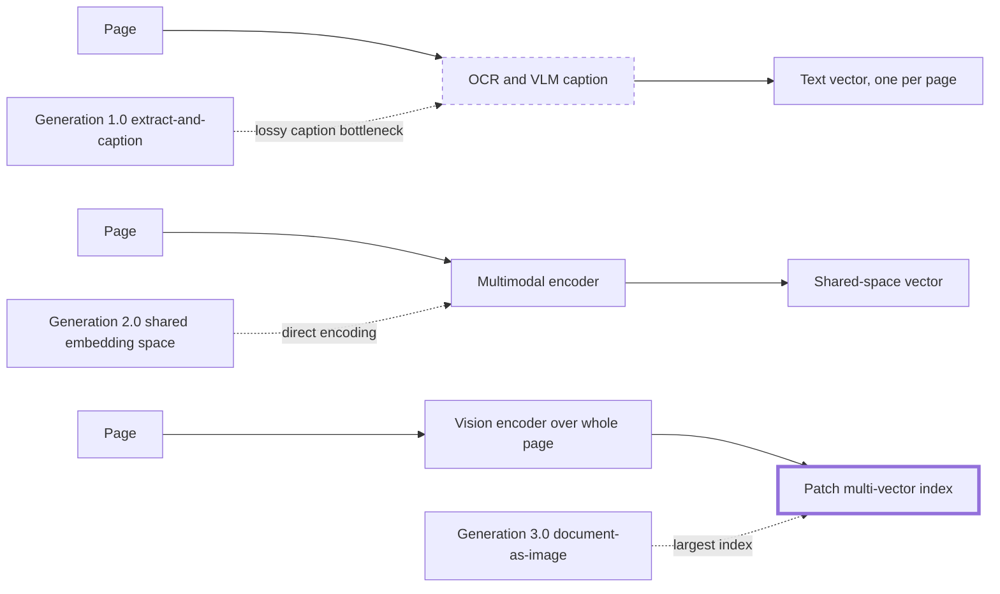
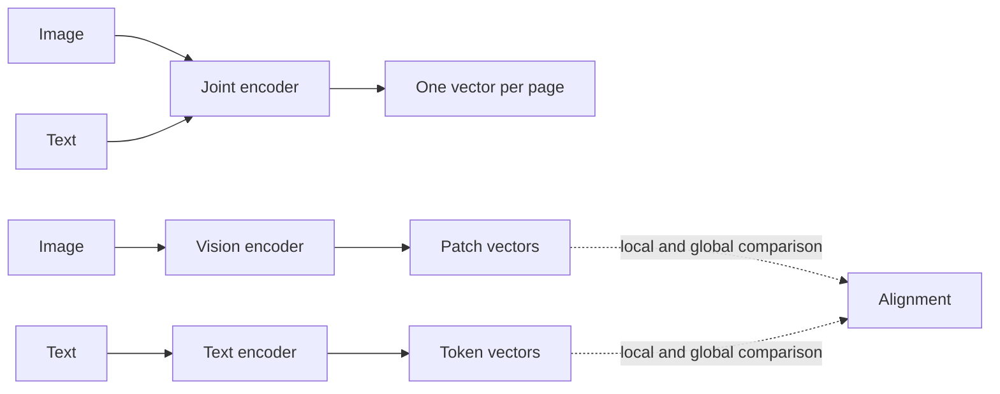
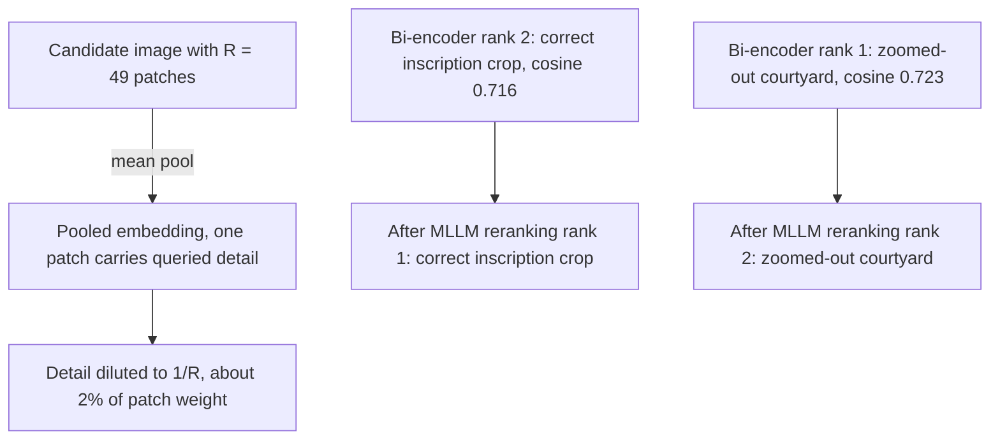
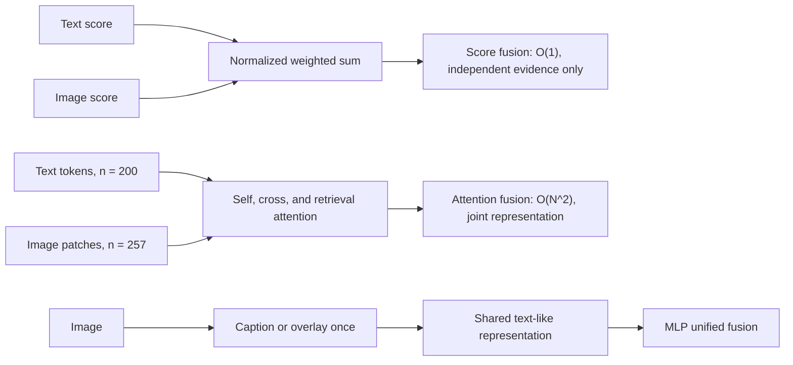
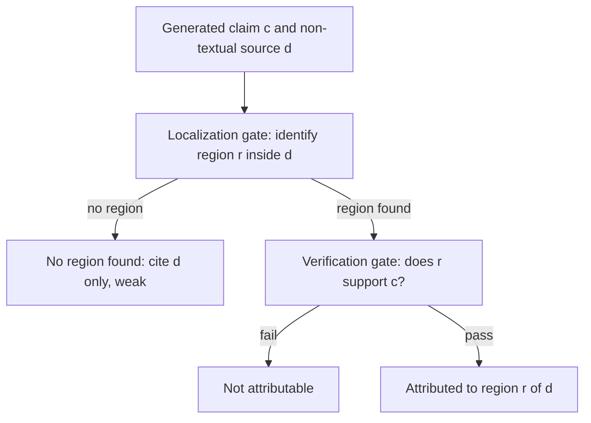
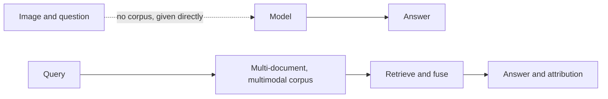

# Chapter 39: Multimodal RAG

This chapter explains how Retrieval-Augmented Generation (RAG) systems index, retrieve, fuse, generate from, attribute, and evaluate text, images, tables, audio, and video.

## TL;DR

- Multimodal indexing has three generations. Captions are cheap and lossy, shared embeddings remove the caption bottleneck, and page-as-image indexes preserve layout at a large storage cost.
- One vector per page is cheap but forgets local detail. Patch and token vectors preserve detail but require a cheap first-stage shortlist before late interaction.
- Contrastive Language-Image Pre-training (CLIP) learns whole-image and whole-caption agreement. It does not supervise entity position, demographic fairness, or composition.
- Every modality and source collection needs its own admission threshold because score distributions are not comparable.
- Raising top-k cannot fix a pooled vector that confuses a detailed crop with a same-scene distractor. A multimodal reranker must inspect local content.
- Score fusion is cheap and blind to cross-modal agreement. Attention fusion sees agreement at quadratic cost. Unified fusion moves work and information loss to ingestion.
- Video needs shot-level key frames and an explicit time representation. Non-text evidence needs localization before verification. A benchmark measures multimodal RAG only when retrieval over a real corpus is in the loop and search, synthesis, and modality contribution are evaluated separately.

## The story

Imagine a museum archive that stores reports, photographs, diagrams, recordings, and films. The archivist is the retriever. The curator is the large language model (LLM). The catalog is the index. A visitor's question is the query.

The first cataloger writes one caption for every non-text object. This is fast, but the caption may say "rising chart" and omit the axis value the visitor asks for. Once omitted, that detail does not exist in the catalog.

The second cataloger gives text and images compatible catalog codes. A visitor can now search a photograph with words without translating the photograph into a caption. One code still summarizes the whole object, so fine print can disappear.

The third cataloger stores a code for every tile on a page. Exact cells, labels, and spatial relationships survive. The archive bill grows because one page now owns hundreds or about a thousand codes instead of one.

The archivist also learns that catalog codes have habits. A whole-image model often remembers the first named object, inherits skew from old captions, and confuses "mug left of laptop" with the reverse. A specialist checks multi-object and spatial questions after the cheap search.

Each gallery uses a different measuring stick. A score that is strong for text may be impossible for an image model to reach. The archivist sets separate admission bars for text, images, video, and each distinct collection.

Some visitors ask about a tiny inscription inside a broad courtyard photograph. The global catalog code captures courtyard gist and dilutes the inscription. The archivist retrieves a short list, then a conservator examines all local tiles and restores the correct order.

The curator must combine evidence across galleries. Adding normalized scores is cheap but cannot tell whether a diagram agrees with a manual. Letting all tokens and image patches attend to each other catches agreement, but the compute grows with the square of the combined sequence.

Films add time. The archive stores one key frame per shot rather than every near-duplicate frame. For questions such as "what happened before approval," it rotates event codes by time so ordering changes similarity instead of living in a disconnected timestamp column.

The curator's citation must point to the exact evidence. An image needs a bounding box, a video needs a time span, and a table needs a cell range. The archive first localizes the region, then verifies the claim against that region.

Finally, the museum tests itself. A fake test hands the curator one image and asks a question. A real archive test makes the archivist search many mixed documents before the curator answers. The task shape, not the word RAG on the test label, decides what the score proves.

## Decoder table

| Technical term | Plain-English meaning | Why it matters |
|---|---|---|
| Multimodal RAG | Retrieval and generation over more than text | The representation choice determines what can ever be found |
| Modality | A data type such as text, image, table, audio, video, or geolocation | Each modality has different encoders, scores, and evidence regions |
| Generation 1.0, extract-and-caption | Convert non-text content into prose, then index that prose | It reuses text infrastructure but permanently drops unmentioned detail |
| Optical character recognition (OCR) | Conversion of pixels into machine-readable text | It helps text pipelines but can lose layout and visual structure |
| Vision-language model (VLM) | A model that reads images and language | Generation 1.0 uses it to caption non-text content |
| Generation 2.0, shared embedding space | Encode text and images directly into compatible vectors | It removes natural-language captioning as an information bottleneck |
| Contrastive Language-Image Pre-training (CLIP) | A joint image and text encoder trained on paired examples | It is the reference shared-space encoder and source of several biases |
| Generation 3.0, document-as-image | Encode a full rasterized page without extracting regions first | It preserves layout and exact visual detail at high storage cost |
| ColPali | A page-image retriever with patch embeddings and late interaction | It is the reference Generation 3.0 design |
| ColBERT | A text retriever that keeps token vectors for late interaction | It supplies the structural analogy for patch-level page retrieval |
| Caption bottleneck | Loss caused by forcing rich content through one prose summary | A reranker cannot recover a fact the caption omitted |
| Mean pooling | Averaging local vectors into one global vector | It lowers cost and dilutes localized detail |
| Patch embedding | A vector for one image tile | Patch vectors preserve local page information |
| Multi-vector index | An index storing many vectors per document | It improves granularity and increases memory and comparisons |
| Late interaction | Query-time matching between query tokens and document patches or tokens | It recovers fine detail after cheap first-stage retrieval |
| Pivot language | One language used as an intermediate translation target | It is the multilingual analogue of a caption bottleneck |
| LaBSE | The named shared multilingual embedding model | It illustrates retrieval without translating through English |
| 32-bit floating point (fp32) | Four-byte storage per numeric dimension | The Generation 1.0 and 3.0 storage examples use it |
| 16-bit floating point (fp16) | Two-byte storage per numeric dimension | The encoder comparison uses it to price storage |
| Joint encoding | One shared training space and usually one vector per item | It makes retrieval cheap and caps local resolution |
| Decoupled-and-aligned encoding | Separate patch and token encoders followed by alignment | It preserves local detail and moves cost to query comparisons |
| Global average pooling | A global summary built by averaging local features | Fine print can vanish even when the page is retrieved |
| Class token | One learned summary token used by some vision backbones | It creates the same one-vector bottleneck as pooling |
| AlignMamba | The named architecture using local and global cross-modal alignment | It illustrates two-scale alignment after separate encoding |
| Approximate nearest neighbor (ANN) search | Fast retrieval of nearby vectors | A pooled first stage narrows the corpus before expensive matching |
| Residual compression | Storage of compact differences from shared vector structure | ColBERTv2 uses it to reduce multi-vector index size |
| Product quantization | Compression of vectors into compact codebook references | It cuts storage without first reducing patch resolution |
| Contrastive learning | Training matched pairs close and mismatched pairs apart | CLIP's supervision stops at whole-image and whole-caption agreement |
| L2 normalization | Scaling a vector to unit length | It makes dot products behave as cosine similarity |
| Temperature τ | A learned scale applied to contrastive similarities | It controls how sharply CLIP separates pairs |
| InfoNCE | The contrastive objective used in both retrieval directions | It supervises diagonal batch pairs and treats off-diagonal pairs as negatives |
| Position bias | Overweighting the entity named first in a caption | Multi-entity retrieval can favor caption order over the query |
| Demographic bias | Unequal behavior associated with protected attributes | Scraped image-caption correlations can skew retrieval and classification |
| Gist-only bias | Capturing broad topic while missing word order and binding | Spatial and compositional queries need a second stage |
| ARO benchmark | The cited test of attributes, relations, and order | It exposes CLIP's weak compositional sensitivity |
| Entity-aware reranking | Rescoring named objects or local patches separately | It corrects whole-vector bias only where queries need it |
| Per-modality threshold | A separate admission cutoff θ_m for each data type | One global threshold can disable images and leak text noise at once |
| Per-collection threshold | A cutoff indexed by modality and source collection | Caption quality and collection size change score distributions |
| Modality gap | Geometric separation between modality populations | Raw cosine values are not universally comparable |
| Dense Passage Retrieval (DPR) | A text dense-retrieval encoder used for comparison | Its score distribution need not match CLIP's |
| Sentence-BERT (SBERT) | A sentence embedding model used on the text axis | Figure 39.4 contrasts its scores with CLIP image scores |
| Quality floor | A threshold below which the system shows nothing | The best bad result can be worse than an empty modality slot |
| Indicator function | A function returning 1 when a condition holds and 0 otherwise | It expresses modality admission compactly |
| Calibration | Choosing a threshold from labeled score distributions | It is offline work, not model retraining |
| Multi-granularity noise correspondence | Confusion caused by comparing a part-level query with whole-unit vectors | It separates ranking failure from retrieval coverage failure |
| Bi-encoder | Independent query and candidate encoders compared by one score | It retrieves cheaply and cannot jointly inspect local structure |
| Cosine margin | Difference between candidate similarity scores | A margin inside the measured noise floor is unstable |
| Multimodal large language model (MLLM) | A generator or reranker that jointly reads language and visual input | It can inspect patches that pooling averaged away |
| Pointwise reranker | A model scoring each query-candidate pair separately | It needs labeled pairs and can serve cheaply after training |
| Listwise reranker | A model ranking several candidates in one context | Prompting enables a zero-shot first implementation |
| DELG | The cited landmark method using global retrieval then local verification | It shows the same two-stage principle predates multimodal RAG |
| Fusion | Reconciliation of evidence from different modalities | Different modality encoders were not trained to emit comparable evidence |
| BM25 | A lexical text retrieval score | Its unbounded scale cannot be added raw to CLIP cosine |
| Automatic speech recognition (ASR) | Speech-to-text processing | Video retrieval may combine transcript and visual signals |
| Score fusion | Combination of normalized scalar modality scores | It costs O(1) per candidate and cannot test cross-modal agreement |
| Attention fusion | Joint attention over tokens and patches | It detects agreement at O(N^2) sequence cost |
| Self-attention | Interaction within one modality | It connects text-to-text or patch-to-patch content |
| Cross-attention | Interaction across modalities | It checks whether image and text evidence agree |
| Retrieval attention | Interaction between the query and candidates | It answers relevance rather than cross-modal consistency |
| Unified or projection fusion | Conversion of modalities into one representation before query-time fusion | It moves expense and information loss to ingestion |
| Multilayer perceptron (MLP) | A feed-forward network used after projection | It cheaply fuses standardized representations |
| Vision Transformer (ViT) | An image encoder operating on patches | Its patch count drives attention cost and detail dilution |
| Classification (CLS) token | A ViT summary token | It adds one token to the image sequence in the cost example |
| Key frame | A representative frame at a scene boundary | One key frame per shot removes near-duplicate video vectors |
| Shot | One continuous take bounded by cuts | It is the default video retrieval unit |
| Scene | A higher narrative or procedural unit made from shots | It supports coarser retrieval for broad queries |
| Moving Picture Experts Group (MPEG) codec | A video compression family using reference frames and deltas | It supplies the key-frame analogy for retrieval |
| H.264 | A video codec with inter-frame compression | It illustrates why nearby frames are redundant |
| Order invariance | A representation that is unchanged when event order swaps | Mean pooling cannot answer before or after questions |
| Rotary Position Embedding (RoPE) | Rotation of vectors by position-dependent angles | Applied to time, it makes elapsed offset affect similarity |
| Rotation frequency ω | The angle rate used to encode time | A bad period can alias distant events |
| Correlation | Events that tend to co-occur | A pooled vector can preserve this relation |
| Causality or sequence | Events whose order changes the answer | A rotated representation is needed for relative-time queries |
| Attributable to Identified Sources (AIS) | A text attribution test based on interpretable claims and source support | Non-text evidence needs an added localization gate |
| Portable Document Format (PDF) | A fixed-layout document format named in the benchmark comparison | Page length and mixed content make corpus shape part of benchmark fit |
| Question answering (QA) | Producing an answer to a supplied question | A QA set tests retrieval only when the system must first search a corpus |
| Localization gate | Identification of the exact source region behind a claim | It turns a broad citation into checkable evidence |
| Verification gate | A modality-specific test that the localized region supports the claim | Localization alone can be confidently wrong |
| Bounding box | A rectangular image region | It localizes visual evidence |
| Timestamp span | A start and end time in audio or video | It localizes temporal evidence |
| Cell range | A set of table cells | It localizes structured evidence |
| MMed-RAG | The cited clinical system retrieving chest X-rays | It shows localized medical claims are a production shape, not a hypothetical |
| Multimodal-in, text-out | A model that reads mixed input and emits only text | Its localization is an attention or prompting byproduct |
| InstructBLIP | The cited multimodal-in, text-out model | It represents indirect localization |
| Querying Transformer (Q-Former) | Learnable queries extracting visual features for an LLM | Its attention can suggest a region without guaranteeing it |
| BLIP-2 | The cited architecture introducing the Q-Former | It supplies the visual-to-language bridge |
| Multimodal-in, multimodal-out | A model that emits evidence media as well as text | It can make a crop or clip a first-class output |
| NExT-GPT | The cited multimodal-in, multimodal-out model | It raises localization quality and training and serving cost |
| Chain- or tree-of-retrieval | Decomposition of a complex claim into smaller grounded subclaims | It replaces one uncheckable claim with several verifiable steps |
| Visual question answering (VQA) | Answering a question about a provided image | It does not test retrieval when the image is handed to the model |
| Benchmark task shape | The actual inputs and required pipeline stages in an evaluation | It determines which capability a score can support |
| Top-k recall | Fraction of examples whose evidence appears in retrieved top-k | It evaluates search separately from generation |
| Exact match and F1 | Answer metrics based on exact equality or token overlap | They measure generation after retrieval |
| Mean reciprocal rank (MRR) | An aggregate score based on the first relevant result's rank | It can look healthy while demographic parity fails |
| ROUGE-L | A longest-common-subsequence answer metric | It is another synthesis metric named by the chapter |
| Ablation by modality removal | Re-evaluation after withholding one modality | It measures the marginal value of fusion |
| Multiple-choice question (MCQ) | A question with fixed answer choices | MRAG-Bench uses this VQA-descended shape |
| Multimodal question answering (MMQA) | Question answering over multiple data types | M2RAG includes it as one component task |
| Standard error of a difference | Sampling uncertainty for two reported proportions | It provides a conservative score-delta filter |
| McNemar's test | A paired test for matched binary outcomes | It is more appropriate when systems answer the same questions |
| Noise floor | The score difference not distinguishable from sampling variation | A delta inside it should not be sold as a real win |

## Core mechanics

### 39.1 Three generations, and the multilingual analogy

#### What it is

Generation 1.0 runs every chart, photograph, or scanned form through OCR or a VLM, then embeds the resulting caption.
It adds no new index type and produces a human-readable audit trail.
Generation 2.0 uses a jointly trained multimodal encoder such as CLIP to place images and text in one space.
It removes the language intermediate but still parses pages into text, table, and chart regions.
Its two encoder outputs are typically merged by mean pooling.
Generation 3.0 encodes a full page screenshot directly.
ColPali produces roughly a thousand patch vectors per page and uses ColBERT-style late interaction.

#### Why it exists

The generations move the lossy step progressively farther from the document.
Generation 1.0 is analogous to translating all languages through English.
Generation 2.0 matches LaBSE's shared multilingual space, where Vietnamese queries and German documents meet without a pivot language.
Generation 3.0 has a textual analogue in the cited DeepSeek OCR-compression work, which encodes text as pixels rather than first extracting tokens.

#### Failure without it

A caption such as "a chart showing an upward trend" can omit an axis labeled "EBITDA, $M" and every exact value.
No downstream reranker can recover absent index content.
Generation 1.0 therefore loses on financial tables, diagrams, forms, cells, numbers, and spatial relations.
Generation 3.0 avoids that loss but turns infrastructure cost into the limiting failure.

#### Cost, complexity, and decisions

The opening case has 200-page quarterly filings and asks for the year-over-year change in operating margin.
The worked corpus has 10,000 financial-filing pages and about two charts or tables per page.
At $0.0005 per caption, 20,000 caption calls cost about $10 once.
One 1,536-dimensional fp32 vector per page costs 10,000 x 1,536 x 4 = 61.4 MB.
Generation 2.0 keeps the same 61.4 MB shape and avoids the $10 caption pass.
Generation 3.0 stores about 1,030 patch vectors at 128 dimensions per page.
One page costs 1,030 x 128 x 4 = 527,360 bytes, about 527 KB.
Ten thousand pages cost about 5.27 GB.
The ratio 5.27 GB / 61.4 MB is about 86 times.
This is the same multi-vector storage trade first established for text late interaction.
Default to Generation 2.0 for general production.
Use Generation 1.0 for natural photography or when readable captions are an explicit requirement.
Use Generation 3.0 only where layout and exact values are retrieval targets.
Price the multiplier at projected scale. It is manageable at 10,000 pages and prohibitive at 100 million.
Segment mixed corpora. A filing that is 95% prose and 5% dense tables should route only table-heavy pages to the patch index.

### 39.2 Encoding: joint vs decoupled-and-aligned

#### What it is

A joint encoder maps each image and text input into one shared d-dimensional vector. In the chapter's notation, f_img(image) and f_txt(caption) both lie in R^d.
CLIP commonly emits a 512- or 768-dimensional global vector and supports one dot product per candidate.
Its symmetric batch objective has N positive diagonal pairs and N^2 - N off-diagonal negatives.
A decoupled design keeps image patches and text tokens separate, then aligns them locally and globally.
ColPali rasterizes pages and skips OCR, preserving axis labels, cell alignment, and margin marks.
AlignMamba is the cited local-global alignment example.

#### Why it exists

The motivating corpus contains 200-page annual reports, dense tables, bar charts, and footnotes in 8-point type. The failed query asks for the year-over-year change in the Q3 gross-margin table on page 47 even though that page was retrieved.
One vector is efficient for a coherent photograph with one dominant subject.
A dense page with 40 rows contains many independently retrievable facts that global pooling was never trained to preserve.
Patch and token vectors let a query match the relevant local unit.
Late interaction purchases detail with many comparisons at query time.

#### Failure without it

Caption-then-embed hard-limits recall to what the caption mentions.
A larger joint model does not remove the one-vector architecture ceiling.
Late interaction against the full corpus costs O(corpus x patches) and stops scaling beyond a few thousand documents.
Reducing patch resolution first destroys the granularity the decoupled architecture was chosen to preserve.

#### Cost, complexity, and decisions

The example stores 10,000 pages in fp16.
Joint encoding uses one 768-dimensional vector per page.
The index is 10,000 x 768 x 2 = 15,360,000 bytes, about 15.4 MB.
Decoupled encoding uses a 32 x 32 grid, 1,024 patches, and 128 dimensions per patch.
The index is 10,000 x 1,024 x 128 x 2 = 2,621,440,000 bytes, about 2.62 GB.
The storage multiplier is about 171 times.
First mean-pool each page to one vector and retrieve a shortlist of a few hundred candidates.
Run patch late interaction only on that shortlist.
ColBERTv2's cited residual compression cuts a ColBERT-style index by roughly 6 to 10 times without materially hurting rank quality.
Use residual or product quantization before shrinking the patch grid.
Default to joint encoding for product photos, scenes, and portraits.
Use decoupled encoding for charts, tables, forms, slide decks, and compliance documents needing exact localization.
OCR-then-embed remains cheaper and sufficient for plain prose with no valuable layout.
When legal requires exact traceability but the chief financial officer (CFO) wants the index memory bill cut in half, keep patch detail for compliance documents, quantize it, and route non-traceability content to joint encoding instead of applying one encoder everywhere.

### 39.3 CLIP's three biases

#### What it is

CLIP trains on N paired images I_i and captions T_i.
The encoders produce L2-normalized vectors v_i = f_img(I_i) and u_i = f_txt(T_i).
Every pair receives a temperature-scaled score:

```text
S_ij = (v_i dot u_j) / tau
```

The N x N matrix has N true pairs on its diagonal and N^2 - N negatives elsewhere, however semantically close an off-diagonal pair may be.
The symmetric InfoNCE objective is:

```text
Loss = (1 / 2N) sum_i [
  -log(exp(S_ii) / sum_j exp(S_ij))
  -log(exp(S_ii) / sum_j exp(S_ji))
]
```

The two terms cover image-to-text and text-to-image retrieval.

#### Why it exists

The objective makes CLIP a strong zero-shot classifier because matching a whole image to class captions only needs global comparisons.
It never assigns credit from a word to a region or from one caption noun to one object.
Position bias follows because web captions tend to name the most salient entity first.
Demographic bias follows because no term enforces invariance to race, gender, or other protected attributes.
Gist-only bias follows because pooling does not reliably preserve word order or attribute binding.

#### Failure without it

The cited audit reports offensive and stereotype-laden classification errors at different rates by race and skewed occupation results. The opening support-tool examples are a crowded classroom losing to an unrelated panel, an "engineer" search skewing gender, and a fluent caption describing the wrong object.
The ARO result shows CLIP scoring a shuffled caption almost like the correct one.
"The mug is left of the laptop" can land near its reversed relation.
Fine-tuning one bias set preserves the pooled objective, can relocate the pattern, and creates a diverged encoder that needs repeated auditing.
The durable correction belongs downstream through probes, curated captions, parity checks, and entity-aware reranking.

#### Cost, complexity, and decisions

The illustrative image contains 15 students and one wall-mounted monitor.
The comparison photo is an unrelated close-up monitor.
The chapter explicitly labels the cosine values as constructed and illustrative, within the 0.15 to 0.35 range typical of true pairs.
For the query "our meeting room setup," the classroom scores 0.17 and the close-up scores 0.33.
The wrong photo wins by 0.33 - 0.17 = 0.16.
Keep CLIP for top-k = 20, then probe entities or patches separately.
The classroom recovers to roughly 0.29 on the monitor entity and returns to top-1.
The aggregate claim remains limited. ViT-L/14@336px reaches 76.2% zero-shot top-1 on ImageNet and is competitive with a supervised ResNet-50.
Audit entity swaps and caption reorderings before launch.
Use a second stage for multiple entities or spatial relations, but skip it for single-entity gist queries.
Measure retrieval-hit-rate parity with paired protected-class probes when the corpus contains people.
Own ingestion captions when possible.
Use the largest CLIP variant the latency service-level objective (SLO) allows, but do not expect scale to add missing local supervision.
When a heavier reranker would double p99 latency, route only structurally compositional queries to it.

### 39.4 Per-modality thresholds

#### What it is

The opening search surface fans one query across four pools: text, image, video, and geolocation. Let m identify a modality, D_m its collection, E_q and E_d the query and document embeddings, and s their similarity.
Admit a modality only when its best item clears its own cutoff:

```text
admit(m) = indicator[max over d in D_m of s(E_q, E_d) >= theta_m]
```

The survey's more precise notation is theta_(m,D_i), indexed by modality and source collection.

#### Why it exists

A quality floor lets a sparse modality return nothing rather than show the best bad result.
CLIP image-text scores, DPR text scores, and SBERT scores occupy different distributions.
The cited modality-gap result shows image and text populations remain geometrically separated in CLIP-style spaces.
Collection size and annotation density differ by orders of magnitude across text, image, video, and geolocation. The source gives a collection two orders of magnitude smaller as the concrete tail-shift case.
One numeric similarity level cannot represent the same precision and recall trade-off everywhere.

#### Failure without it

A global text-tuned threshold can sit above every genuine image score and silently disable image retrieval.
Lowering that global value enough for images can leak text noise.
Raw scores must not form one cross-modality ranking after admission. A 0.28 image match and a 0.75 text match are not comparable on their raw scales.
A video threshold from a well-captioned YouTube corpus does not transfer to a sparse internal surveillance archive.

#### Cost, complexity, and decisions

The chapter's distributions are illustrative constants, not measured CLIP data.
Text relevant scores follow N(0.75, 0.05^2) and text noise follows N(0.35, 0.10^2).
Image relevant scores follow N(0.30, 0.03^2) and image noise follows N(0.18, 0.04^2).
At global theta = 0.50, image recall is effectively 0 because z = 6.67.
Text recall is essentially 100% because z = -5, while text-noise leakage is 6.68% at z = 1.5.
Set theta_image = 0.25 and theta_text = 0.60.
Image recall becomes about 95.2% at z = -1.67, with 4.01% noise leakage at z = 1.75.
Text recall becomes about 99.87% at z = -3, while leakage falls to about 0.62% at z = 2.5.
Calibration takes a few offline hours per modality rather than retraining.
Default to one held-out calibration per modality and collection.
If labels are missing, borrow only from a structurally similar encoder and spot-check precision, or use a conservative high-precision cutoff until labels arrive.
In the chapter's five-modality interview case, only two modalities have labeled sets. Apply those fallbacks to the other three rather than copying the global text cutoff.
Allow empty modality results and render an explicit fallback when product design requires a slot.
Compose admitted modalities in separate presentation slots.
Recalibrate after every encoder swap.

### 39.5 Multi-granularity noise correspondence and reranking

#### What it is

Multi-granularity noise correspondence appears when a query targets one local detail but a retriever compares whole-unit summaries. The opening museum query asks what the inscription above the west door says.
A ViT-B/32 over a 224 x 224 image creates R = (224/32)^2 = 49 patches.
Let g be a unit gist direction present in every patch and s an orthogonal unit detail direction present in one patch.
The correct pooled candidate is g + s/R, the distractor is g, and the query is q = g + s.
Their similarities are:

```text
cos(q, g + s/R) = (1 + 1/R) / (sqrt(2) x sqrt(1 + 1/R^2)) = 0.7215
cos(q, g)       = 1 / sqrt(2)                                  = 0.7071
margin          = 0.0144
```

The displayed expression evaluates to about 0.7214 with a 0.0143 margin. The chapter prints 0.7215 and 0.0144, a roughly 0.0001 rounding discrepancy that does not change the noise-floor argument.
The locally confined detail contributes only 1/R, about 2% of its patch weight.

#### Why it exists

Image, video, and audio information density varies across regions and time.
Pooling preserves globally repeated gist and divides a local feature by R.
Crop boundaries, Joint Photographic Experts Group (JPEG) compression, and ANN quantization can each perturb cosine by a percent or more.
A 0.0144 raw edge therefore sits inside ordinary system noise.
An MLLM reranker jointly reads the query and full candidate content, like a cross-encoder for text.

#### Failure without it

Raising k improves coverage but does not change the weak ranking function.
More same-scene distractors increase the chance that noise flips the order.
A wider hidden dimension does not remove the 1/R pooling factor.
The figure's noise-perturbed order puts the courtyard at 0.723 above the correct crop at 0.716.
A reranker fed the same pooled representation reproduces the loss instead of fixing it.

#### Cost, complexity, and decisions

The worked cluster has eight photos, one correct crop and seven same-gist distractors.
Treating top-1 as uniform gives 1/8 = 12.5%.
A listwise reranker receives top-k = 8, about 170 tokens per image, 30 query tokens, and about 20 output tokens.
Input is 8 x 170 + 30 = 1,390 tokens.
At the stated vendor-unspecified prices of $2.50 per million input tokens and $10 per million output tokens, the call costs about $0.0037.
That estimate is representative, not a vendor promise.
A pointwise alternative uses eight independent passes of about 200 tokens each and needs labeled pairs plus a training run.
Prompt listwise first when labels are absent.
Fine-tune a smaller dedicated pointwise model when volume and logged judgments justify fixed training cost.
Send full-resolution images or a high-resolution retrieved crop to the second stage.
Use first-stage k near cluster size, roughly 10 to 20, after diagnosing coverage versus order.
Route by the measured rank-1 to rank-2 margin and skip reranking when the gap exceeds the corpus noise floor.
The cited DELG pattern validates global retrieval followed by local geometric verification for landmarks.
For a 150 ms p99 limit, 50 candidates, a self-hosted 7B model, and no hosted application programming interface, threshold to a single-digit ambiguous cluster or use a smaller parallel pointwise model.

### 39.6 Fusion: score, attention, unified

#### What it is

Score fusion combines normalized scalar evidence, for example:

```text
s(d) = alpha x normalized_text_score(d) + (1 - alpha) x normalized_image_score(d)
```

It costs O(1) per candidate and never compares modalities with each other.
Attention fusion concatenates text tokens, image patches, and other modality units.
Self-attention acts within a modality, cross-attention across modalities, and retrieval attention between query and candidates.
Unified fusion projects or reformats modalities once, such as captioning an image or overlaying text, then uses an ordinary MLP.

#### Why it exists

BM25 text scores, CLIP cosine, and video confidence from ASR plus object detection were not trained to agree numerically. The opening case combines a product-manual hit with a wiring-diagram score for "why won't the belt engage."
Fusion has no direct single-modality analogue because it reconciles heterogeneous representations rather than two scores describing the same kind of relevance.
Score fusion is cheap but blind to whether a diagram actually depicts the part named in text.
Attention fusion detects agreement and contradiction at quadratic sequence cost.
Unified fusion moves most work to ingestion and pays with whatever detail the standardization omits.

#### Failure without it

Adding raw BM25 and CLIP values elects the modality with the larger dynamic range.
Fixing one fusion architecture for every query either overpays or discards detail.
Captioning loses label-, region-, count-, and cell-specific evidence.
Raw attention over every candidate makes O(N^2) the system bottleneck.
Combining retrieval attention and cross-modal agreement in one unexamined block makes failures hard to diagnose.

#### Cost, complexity, and decisions

The baseline text plus query length is n_text = 200 tokens, with attention proportional to 200^2 = 40,000.
A ViT-L/14 processes 224 x 224 pixels as 16 x 16 = 256 patches plus one CLS token, so n_image = 257.
Raw fusion has N = 200 + 257 = 457 and N^2 = 208,849.
The ratio 208,849 / 40,000 is about 5.2 times.
Adding another diagram or four key frames contributes 4 x 257 = 1,028 more tokens.
For N = 1,485, the ratio 1,485^2 / 200^2 is about 55.1 times.
A typical caption has 15 to 25 tokens. The example uses 20.
Text plus one caption gives N = 220 and a 1.21-times cost ratio.
The chapter states that text, one caption, and four frame captions produce about a 2.9-times ratio rather than 55.1. Its displayed expression, (200 + 20 + 4 x 20)^2 / 200^2, evaluates to 2.25, so 2.9 is a source arithmetic inconsistency rather than a derived result.
The chapter therefore describes a repeated 5 to 55-times economic advantage for captioning at ingestion.
Default to score fusion when adding a modality to mature retrievers.
Normalize per modality before combining.
Caption at ingestion for broad content questions and route detail-specific questions to raw attention.
Keep retrieval relevance and cross-modal agreement as distinguishable computations.
Pre-filter with score fusion before attention unless k is already in single digits.

### 39.7 The time dimension: key frames, hierarchy, causality

#### What it is

Video consists of frames, shots, scenes, and a full recording.
At 24 frames per second, one hour contains 86,400 raw frames, mostly near-duplicates inside each shot.
Scene-cut detection creates one shot per continuous take and indexes the key frame.
Edited video gets this hierarchy from cuts. Raw meeting audio or an unedited security feed does not.
Mean pooling is order-invariant because pooling {v1, v2} equals pooling {v2, v1}.
RoPE-style time encoding rotates event embedding e at time t by theta = omega x t.
Relative similarity then carries theta_2 - theta_1 = omega x (t_2 - t_1).

#### Why it exists

Key frames remove vectors that add size, ANN cost, and clutter without new retrievable information.
The hierarchy supports scene-level broad questions and shot-level moment questions.
Rotation lets the same nearest-neighbor score answer "before," "after," and relative-time queries.
The source examples include a manager's budget approval, a support call asking what changed before an error, and a technical video asking for the connector that comes loose at 31 minutes.
It costs one matrix multiplication after the modality embedding already exists.
Pooled and rotated forms serve different needs. Pooled vectors preserve co-occurrence, while rotated vectors preserve order.

#### Failure without it

Per-frame indexing buries real matches under thousands of near-duplicates.
Timestamp metadata applied after semantic retrieval uses two disconnected passes.
A topically right but temporally wrong item can win before filtering.
A pooled vector cannot recover discarded order through later reranking.
A global rotation period can wrap and alias events when a setting tuned to one video is reused across months.
Forcing causal separation onto every correlated event can destroy useful co-occurrence information.

#### Cost, complexity, and decisions

The example video lasts 60 minutes, or 3,600 seconds, at 24 frames per second.
It contains 86,400 frames.
At 768 dimensions and fp32, per-frame storage is 86,400 x 768 x 4 = 265,420,800 bytes, about 265 MB.
A cut every four seconds produces 3,600/4 = 900 shots.
Shot storage is 900 x 768 x 4 = 2,764,800 bytes, about 2.76 MB.
The ratio is exactly 96 because 24 frames per second x 4 seconds per shot = 96.
At 15 ms per embedding, frame encoding costs 1,296 seconds, or 21.6 minutes, while shot encoding costs 13.5 seconds.
Set one turn over the video's 3,600 seconds, so omega = 2pi/3,600.
A 240-second gap rotates by (2pi/3,600) x 240 ≈ 0.419 radians, about 24 degrees.
The MPEG-1 analogy provides a sanity check. Full reference frames appear at key points and intervening change is redundant.
Default to one key-frame embedding per shot.
Keep raw frames addressable beneath a shot for forensic or frame-exact work.
Add rotation only when the workload asks about order.
Set omega to the corpus's natural time span.
Store both pooled and rotated vectors when budget allows. Keep rotation for procedural or safety-critical material when budget forces a choice.

### 39.8 Generation and non-textual attribution

#### What it is

A document-level image, video, audio, or table citation may be real and still be impossible to verify.
The opening clinical example cites a 2,000 x 2,000 chest X-ray for a right-lower-lobe opacity without marking the relevant lung region.
AIS assumes a source a reader can quote.
That assumption fails for a 45-minute video or a spreadsheet with 40,000 rows.
Non-text attribution first localizes region r inside source d, then verifies claim c against r.
For images r is a bounding box, for video or audio a timestamp span, and for tables a cell range.
Verification can use visual entailment, OCR plus cell lookup, or transcript plus text entailment.

#### Why it exists

Captioning the source and checking the caption repeats the retrieval bottleneck.
A generic caption can support a proxy statement while never consulting the pixels needed for the specific claim.
MMed-RAG shows that localized claims from retrieved chest X-rays already occur in production-shaped research systems.
If no region is found, retain only a weak document-level citation.
If a region is found but verification fails, the claim is not attributable.
Only a localized and verified region earns full attribution.

#### Failure without it

Multimodal-in, text-out models such as InstructBLIP use a Q-Former from BLIP-2 and emit text only.
Cross-attention weights or prompted coordinates provide indirect localization that was not their training objective.
Treating that byproduct as a verdict can confidently point to the wrong region.
Multimodal-in, multimodal-out systems such as NExT-GPT can emit a crop or clip directly, but require a larger training and serving surface.
Complex claims spanning regions remain hard for either architecture.

#### Cost, complexity, and decisions

Chain- or tree-of-retrieval decomposition splits a complex claim into sequential subclaims and re-grounds each one.
The worked lecture recording lasts 45 minutes, or 2,700 seconds.
The claim is localized to 31:02 through 31:17, a 15-second span.
Verification cost falls by 2,700/15 = 180 times.
A 60-word quotation read at 250 words per minute takes 60/250 x 60 ≈ 14 seconds.
The 15-second localized clip therefore matches the order of ordinary text-citation review.
Default to region or timestamp attribution when a source exceeds what a reader can skim in seconds. The interview case cites a 40-page PDF for "Q3 churn was 4.2%," which is too broad to verify efficiently.
A minute-plus video, multi-page report, or large spreadsheet needs localization. A single page, short clip, or small table may not.
Treat localization as a hypothesis and always run the verification gate.
Use text-out systems for internal provenance when attention-based grounding is enough.
Use multimodal-out systems when the product must render the crop or jump to the timestamp.
Log localization confidence and verification score separately.
For the chapter's 2% wrong-region medical example, route low-confidence cases to radiologist review and decompose errors by finding type and region size rather than blocking every citation or shipping silently.

### 39.9 Benchmarks and what they actually measure

#### What it is

The opening failure adds table extraction and reranking, then validates them with a benchmark that hands over one image and one question. A RAG benchmark item is (q, C, y), with corpus size |C| >> k.
The system retrieves R(q, C), then generates:

```text
y_hat = G(q, R(q, C))
```

A VQA item has |C| = 1 because the correct image is supplied directly.
Two systems can tie on that shape while having different retrieval quality because retrieval is absent.

#### Why it exists

Use a three-part benchmark checklist.
First, require search over a corpus meaningfully larger than the answer set.
Second, report retrieval and generation separately through top-k recall plus exact match, F1, or ROUGE-L.
Third, remove each modality in turn to measure fusion's marginal contribution.
REAL-MM-RAG finds fusion degrading on long documents because models ignore visual and tabular evidence without specific prompting.
VLR-Bench, also called VRAG-Bench in some sources, finds multimodal context helping low-resource languages.
UniDoc-Bench reports multimodal RAG as more accurate and cheaper than text-only retrieval by avoiding OCR loss.
M2RAG finds performance falling when either modality is removed.

#### Failure without it

MRAG-Bench is close to classic single-image VQA and cannot validate long-document table retrieval.
M2RAG has the largest raw corpus but its four tasks often isolate captioning, MMQA, fact verification, and image reranking rather than the whole loop.
Leaderboard name recognition cannot reveal those structural limits.
A blended score cannot identify whether search or synthesis improved.
A delta below sampling noise should not support a launch or publication claim.

#### Cost, complexity, and decisions

MRAG-Bench reports roughly 66% to 80% accuracy over just above 1,000 MCQs. The source says its best model, GPT-4o, lands roughly at human level depending on question type.
The worked approximation uses p = 0.73 and n = 1,000.
For independent samples:

```text
SE_diff = sqrt(2 x p x (1 - p) / n)
        = sqrt(2 x 0.73 x 0.27 / 1,000) = sqrt(0.000394)
        ≈ 1.99%
```

At 95% confidence with z = 1.96, the conservative floor is 1.96 x 1.99% ≈ 3.9 percentage points.
For UniDoc-Bench n = 1,600, SE is about 1.57% and the floor is about 3.1 points.
A 60% larger set yields only about a 21% tighter floor because uncertainty scales as 1/sqrt(n).
For a 2-point floor:

```text
n = 2 x p x (1 - p) x (z / margin)^2
  = 2 x 0.1971 x (1.96 / 0.02)^2
  ≈ 3,786 questions
```

That is about 3.8 times the rounded MRAG-Bench set.
The reported human image gain is +33.16%, about 33.16/3.9 = 8.5 times the conservative floor.
A claimed 1.5-point gain lies inside that floor.
The independent-samples calculation is a conservative upper bound, not the final publication test.
Systems usually answer the same items, so use McNemar's paired test before publishing.
Match benchmark corpus shape to production before citing a score.

## Diagrams

### Figure 39.1



**Figure 39.1:** Each generation moves the lossy step further from the document: Generation 1.0 forces every non-text element through a captioning bottleneck (dashed), Generation 3.0 removes the bottleneck entirely at the cost of a far larger index (heavy border).

### Figure 39.2



**Figure 39.2:** A joint encoder collapses a page to one vector and pays for it in lost detail. A decoupled-and-aligned encoder keeps a vector per patch and per token and pays for it in comparisons at query time.

### Figure 39.3

| Image and caption score | T1 | T2 | T3 | T4 |
|---|---|---|---|---|
| I1 | **S11 supervised** | S12 negative | S13 negative | S14 negative |
| I2 | S21 negative | **S22 supervised** | S23 negative | S24 negative |
| I3 | S31 negative | S32 negative | **S33 supervised** | S34 negative |
| I4 | S41 negative | S42 negative | S43 negative | **S44 supervised** |

**Figure 39.3:** CLIP's contrastive loss supervises only the shaded diagonal - whether a whole caption matches a whole image - leaving every within-caption and within-image credit assignment unconstrained, which is the shared root of all three biases.

### Figure 39.4

```text
                         theta_global = 0.50
                                |
Text, SBERT     0   o  o  o  o  |  o |  * ** **     1.0
                                      theta_text = 0.60

Image, CLIP     0     o o o * **|                   1.0
                          |
                    theta_image = 0.25

* genuine match     o noise
```

**Figure 39.4:** A single global threshold zeroes out every CLIP image match (open and filled circles alike sit left of θglobal) while still leaking one borderline text match through. Separate, modality-calibrated thresholds recover the image matches and catch the leak. Filled circles are genuine matches, open circles are noise.

### Figure 39.5



**Figure 39.5:** A pooled vector gives the correct, detail-matching candidate only a 0.014 raw-cosine edge over a same-scene distractor - inside typical encoder noise - so the bi-encoder's order flips. A reranker that reads all 49 patches jointly, not the pooled average, recovers the correct order.

### Figure 39.6



**Figure 39.6:** The three fusion families trade compute for cross-modal sensitivity in opposite directions: score fusion is cheapest and blindest, attention fusion is most expensive and most sensitive, and unified fusion moves the expense to ingestion - which is why production systems route between them by query complexity rather than fixing one architecture.

### Figure 39.7

```text
key frame    dashed frames    cut    key frame    dashed frames    cut    key frame
 [frame]   [frame] [frame]     |      [frame]   [frame] [frame]     |      [frame]
    |                                  |                                  |
 shot 1: e1, t = 0 s              shot 2: e2, t = 4 s              shot 3: e3, t = 9 s

Frames between cuts merge into one shot embedding.

Time as rotation, not pooling:

             .--------.
          .-'      e2  '-.
         /         /       \
        |         / theta    |
        |        o------ e1   |
         \                  /
          '----------------'

theta = omega x delta_t, so e1 dot e2 carries elapsed time.
```

**Figure 39.7:** Video collapses to one embedding per shot at each key frame (top), and event time is folded into similarity itself by rotating the embedding by an angle proportional to elapsed time rather than pooling frames into an order-blind average (bottom).

### Figure 39.8



**Figure 39.8:** Non-textual attribution adds a localization gate before verification: a claim is only checked against the specific region of the source it depends on, never against the source as a whole.

### Table 39.1

| Benchmark | Corpus | Size | Task focus | RAG-tested? |
|---|---|---|---|---|
| MRAG-Bench | Images | 16,000 images / 1,000+ MCQs | Visual-centric QA | Partial |
| REAL-MM-RAG | Reports, decks | 153 documents, 50 to 100+ pages | Table retrieval, long-document QA | Yes |
| VLR-Bench | Images + text, multilingual | 100,000+ samples | Open-ended retrieval + VQA | Yes |
| UniDoc-Bench | PDFs with text, images, and tables | 70,000 pages / 1,600 QA pairs | Factual retrieval, reasoning | Yes |
| M2RAG | Images + text | 380,000 images / 540,000 text samples | Captioning, MMQA, fact verification, reranking | Mixed |

**Table 39.1:** Corpus size alone does not indicate whether a benchmark exercises retrieval: M2RAG's corpus dwarfs the others, but its four component tasks (Mixed) mostly test one pipeline stage at a time rather than the full retrieve-fuse-generate loop, and MRAG-Bench's Partial reflects its single-image, VQA-descended item shape.

### Figure 39.9



**Figure 39.9:** A VQA-shaped benchmark skips the corpus entirely (dashed box). A RAG-shaped benchmark forces search over a multi-document, multi-modal corpus (heavy box) before generation - the structural difference a benchmark's name does not reveal.

## Whiteboard pack

### What to draw

1. Draw three index lanes: caption to one text vector, shared encoder to one vector, and whole-page encoder to patch vectors.
2. Split encoding into one global vector versus patch and token vectors with late alignment.
3. Draw CLIP's N x N score matrix and shade only the diagonal.
4. Draw separate text and image score axes with theta_text and theta_image.
5. Draw 49 image patches collapsing into one pooled vector, then a local-content reranker reversing two candidates.
6. Draw score, attention, and unified fusion side by side with O(1), O(N^2), and ingestion-cost labels.
7. Draw video key frames separated by cuts, then two event vectors separated by a time angle.
8. Draw localization before verification, with bounding-box, timestamp, and cell-range examples.
9. Finish with VQA receiving one image and RAG searching a multi-document corpus.

### Spoken script

Multimodal RAG starts with representation. Captions are cheap but lose unmentioned detail, shared encoders remove that bottleneck, and patch indexes preserve layout at high cost. Global vectors also inherit CLIP's whole-pair biases and dilute local evidence, so we calibrate thresholds per modality and rerank ambiguous clusters with full-resolution content. Fusion then trades cheap independent scores against expensive cross-modal attention. Video adds shot hierarchy and order-aware time encoding. Generated claims need region localization before verification. Finally, evaluation must include real corpus search, separate retrieval and generation metrics, and modality-removal ablations, or the benchmark is only visual question answering.

## Interview traps

### 1. Why not caption every non-text item and keep the existing text stack?

Captioning is a fixed-vocabulary compression. It works for broad natural photographs and audit trails, but an omitted axis value, cell, or spatial relation becomes permanently unretrievable, so use shared embeddings or patch indexes where exact detail is the target.

### 2. Why can a strong CLIP retriever still fail multi-object queries?

Its InfoNCE loss supervises whole-image and whole-caption pairs, not word-region credit assignment, demographic invariance, or composition. Keep its cheap recall, audit those blind spots, and route multi-entity or spatial queries to an entity-aware local reranker.

### 3. Should one similarity threshold and one fusion architecture serve every modality?

No. Score populations differ by modality and collection, while score, attention, and unified fusion place cost and information loss in different locations. Calibrate admission separately, then route detail-specific questions to raw attention and broader questions to cheaper score or unified fusion.

### 4. What changes when the corpus includes video and non-text citations?

Index one key frame per shot and add rotation only when event order matters. For attribution, identify the exact frame span, image region, or table cells first, then verify the claim against that region rather than trusting a document-level citation.

### 5. When does a multimodal benchmark fail to support a RAG claim?

It fails when the correct image is handed to the model, retrieval and generation are blended into one score, or modality removal is absent. Match corpus shape to production and compare score deltas against an appropriate uncertainty test before claiming a gain.

## Key numbers

| Number or threshold | Source context | Meaning or claim limit |
|---|---|---|
| 3 generations | Index architecture | Caption, shared space, and document-as-image |
| 200 pages and operating-margin query | Generation 1.0 opening case | Quarterly filings whose chart axis value can vanish from a caption |
| About 1,000 or 1,030 patches/page | ColPali-style index | Approximate page-level multi-vector count |
| 10,000 pages and 2 elements/page | Generation example | 20,000 caption calls |
| $0.0005/caption and about $10 | Generation 1.0 | One-time stated caption cost |
| 1,536 dimensions and 4 bytes | Single-vector fp32 | Inputs to the 61.4 MB calculation |
| 61.4 MB | Generations 1.0 and 2.0 | Storage for 10,000 single-vector pages |
| 128 dimensions and 527,360 bytes/page | Generation 3.0 | Patch-vector shape and per-page storage |
| About 5.27 GB and 86 times | Generation 3.0 | Storage over 10,000 pages and multiplier |
| 100 million pages | Scale warning | Example where an 86-times multiplier becomes prohibitive |
| 95% prose and 5% tables | Segmented corpus | Example motivating mixed index generations |
| 512 or 768 dimensions | CLIP-style joint encoder | Typical one-vector page width stated in the chapter |
| 40 rows | Dense-page example | Local facts competing inside one global vector |
| 200 pages, 8-point footnotes, Q3, page 47 | Encoder opening case | Retrieved page can still lose a gross-margin table fact in one global vector |
| 10,000 pages, fp16, 2 bytes | Encoding example | Shared storage assumptions |
| Memory cut in half | Staff encoder trade-off | Exact traceability and index cost pull in opposite directions |
| 15,360,000 bytes or 15.4 MB | Joint encoding | One 768-dimensional vector per page |
| 32 x 32 = 1,024 patches | Decoupled encoding | Page tiling |
| 128 dimensions and 2.62 GB | Decoupled encoding | Patch width and total storage |
| About 171 times | Encoder trade-off | Decoupled versus joint storage |
| A few hundred candidates | Two-stage retrieval | Shortlist before late interaction |
| 6 to 10 times | ColBERTv2 | Reported residual-compression reduction |
| A few thousand documents | Full late interaction | Approximate scale beyond which the chapter says it fails |
| N true and N^2 - N negative pairs | CLIP objective | Diagonal supervision and off-diagonal negatives |
| 2020 to 2025 | Cited chronology | Named retrieval, compression, bias, alignment, attribution, and survey work spans these years |
| 15 students and 1 monitor | Bias example | Multi-entity classroom image |
| 0.15 to 0.35 | CLIP illustration | Explicitly constructed typical true-pair range |
| 0.17, 0.33, and 0.16 | Raw CLIP ranking | Classroom, close-up, and wrong-photo margin |
| top-k = 20 and about 0.29 | Entity-aware rerank | Candidate depth and recovered classroom score |
| 76.2% top-1 | ViT-L/14@336px | Zero-shot ImageNet result, not evidence that biases vanish |
| p99 latency doubles | Compositional-query trade-off | Route only the structurally compositional slice to the heavier reranker |
| theta_global = 0.50 | Threshold example | Global cutoff that disables images |
| N(0.75, 0.05^2) and N(0.35, 0.10^2) | Text distributions | Illustrative relevant and irrelevant scores |
| N(0.30, 0.03^2) and N(0.18, 0.04^2) | Image distributions | Illustrative relevant and irrelevant scores |
| z = 6.67 and effectively 0% | Global image threshold | Relevant image survival |
| z = -5 and about 100% | Global text threshold | Relevant text recall |
| z = 1.5 and 6.68% | Global text threshold | Irrelevant text leakage |
| theta_image = 0.25 | Image calibration | Separate image cutoff |
| z = -1.67 and 95.2% | Image calibration | Relevant image recall |
| z = 1.75 and 4.01% | Image calibration | Image noise leakage |
| theta_text = 0.60 | Text calibration | Separate text cutoff |
| z = -3 and 99.87% | Text calibration | Relevant text recall |
| z = 2.5 and 0.62% | Text calibration | Text noise leakage |
| A few hours/modality | Threshold calibration | Offline work, not retraining |
| 4 opening pools, then 5 modalities with labels for 2 | Threshold cases | Calibrate four pools, then borrow carefully or bias high precision for three unlabeled modalities |
| 2 orders of magnitude smaller | Collection-size example | A thinner tail shifts the precision and recall trade-off |
| 224 x 224, 32 x 32, and R = 49 | ViT-B/32 | Image size, patch size, and patch count |
| 1/R about 2% | Detail dilution | Local feature's pooled contribution |
| 0.7215, 0.7071, and 0.0144 printed | Granularity derivation | Expression gives about 0.7214 and 0.0143, leaving the claim unchanged |
| 0.723 and 0.716 | Noise-perturbed order | Distractor above correct crop in Figure 39.5 |
| 8 images and 1/8 = 12.5% | Reranking cluster | Uniform top-1 baseline |
| 170 tokens/image, 30 query, 20 output | Listwise reranker | Token assumptions |
| 1,390 input tokens | Listwise reranker | 8 x 170 + 30 |
| $2.50/M input and $10/M output | Reranker pricing | Vendor-unspecified representative rates |
| About $0.0037/query | Listwise reranker | Stated eight-candidate cost |
| 8 passes and about 200 tokens/pass | Pointwise reranker | Similar token volume with training cost |
| k about 10 to 20 | Production reranking | Recommended cluster-scale depth |
| 150 ms p99, 50 candidates, 7B | Staff trade-off | Self-hosted reranker constraint |
| O(1) | Score fusion | Per-candidate combination cost |
| O(N^2) | Attention fusion | Concatenated sequence cost |
| 200 tokens and 40,000 | Text-only attention | n and n^2 baseline |
| 224/14 = 16, 256 patches, 1 CLS | ViT-L/14 | Image token construction |
| 257 image tokens | Attention fusion | Patches plus CLS token |
| N = 457 and 208,849 | One raw diagram | Combined length and N^2 |
| About 5.2 times | One raw diagram | Cost relative to text only |
| 4 key frames, 1,028 tokens, N = 1,485 | Video fusion | Added raw visual sequence |
| About 55.1 times | Video fusion | Cost relative to text only |
| 15 to 25 tokens, using 20 | Unified fusion | Caption length |
| N = 220 and 1.21 times | One caption | Cost relative to text only |
| Source states about 2.9 times, expression gives 2.25 times | Captioned video case | Preserve the printed claim and its arithmetic inconsistency |
| 24 frames/s and 86,400 frames/hour | Video indexing | Raw frame volume |
| 60 min or 3,600 s | Video example | Product-demo duration |
| 31 min | Technical-video query | Example requiring the time axis to participate in similarity |
| 768 dimensions and 265,420,800 bytes | Per-frame video | About 265 MB |
| 4 s/shot and 900 shots | Key-frame video | Scene-cut assumption and count |
| 2,764,800 bytes or 2.76 MB | Shot index | Key-frame storage |
| 96 times | Video reduction | 24 frames/s x 4 s/shot |
| 15 ms/frame | Ingestion example | Encoding-time assumption |
| 1,296 s or 21.6 min | Frame ingestion | Per-hour video compute |
| 13.5 s | Shot ingestion | Per-hour video compute |
| omega = 2pi/3,600 | Time rotation | One full turn per video |
| 240 s, 0.419 rad, about 24 degrees | Time rotation | Four-minute event gap |
| 2,000 x 2,000 pixels | Clinical example | Chest X-ray size |
| 45 min and 40,000 rows | Attribution limits | Sources too large for document-level checking |
| 31:02 to 31:17, 15 s | Localized lecture evidence | Exact video span |
| 2,700 s and 180 times | Attribution verification | Full video and reduction |
| 60 words, 250 words/min, about 14 s | Text citation | Comparison verification cost |
| 40 pages and 4.2% | Interview citation example | Report size and churn claim |
| About 2% | Medical localization | Wrong-region tail requiring confidence routing |
| 3 benchmark checks | Evaluation | Corpus search, separate metrics, modality ablation |
| 5 compared benchmarks | Evaluation table | MRAG, REAL-MM-RAG, VLR, UniDoc, M2RAG |
| 16,000 images and 1,000+ MCQs | MRAG-Bench | Partial RAG coverage |
| 153 documents and 50 to 100+ pages | REAL-MM-RAG | Long reports and decks |
| 100,000+ samples | VLR-Bench | Multilingual image and text corpus |
| 70,000 pages and 1,600 QA pairs | UniDoc-Bench | Long-document evaluation |
| 380,000 images and 540,000 text samples | M2RAG | Largest raw corpus in the comparison |
| 4 component tasks | M2RAG | Captioning, MMQA, fact verification, reranking |
| 66% to 80% | MRAG-Bench | Reported range by question type |
| p = 0.73 and n = 1,000 | Noise-floor approximation | Rounded midpoint and sample size |
| SE about 1.99% | MRAG-Bench | Conservative independent-samples uncertainty |
| z = 1.96 and 95% | Noise-floor threshold | Confidence multiplier and level |
| About 3.9 points | MRAG-Bench | Conservative unpaired floor |
| n = 1,600, SE 1.57%, floor 3.1 points | UniDoc-Bench | Larger-set comparison |
| 60% larger and 21% tighter | Sample-size trade-off | Consequence of 1/sqrt(n) scaling |
| 2-point floor and about 3,786 questions | Labeling cost | Required sample size under the approximation |
| About 3.8 times | Labeling cost | Relative to rounded MRAG-Bench size |
| +33.16% and about 8.5 times | Human image benefit | Headline effect and noise-floor ratio |
| 1.5 points | Vendor comparison | Example improvement inside the unpaired floor |
