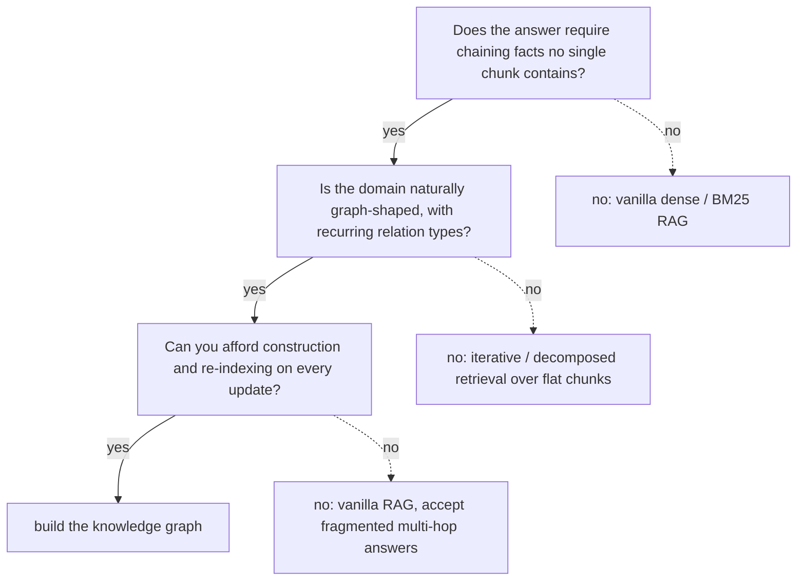
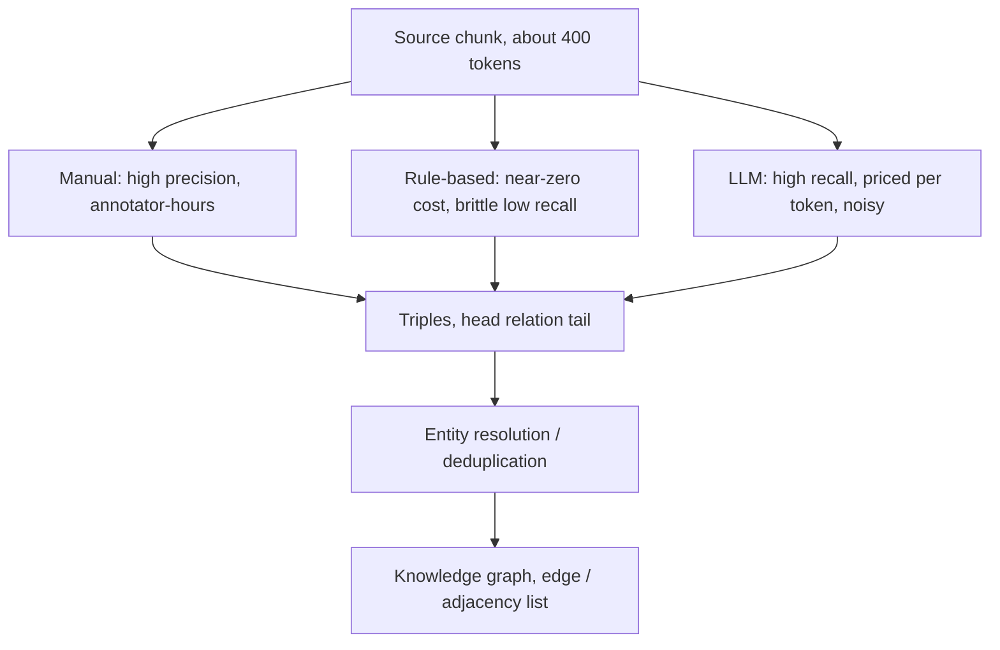
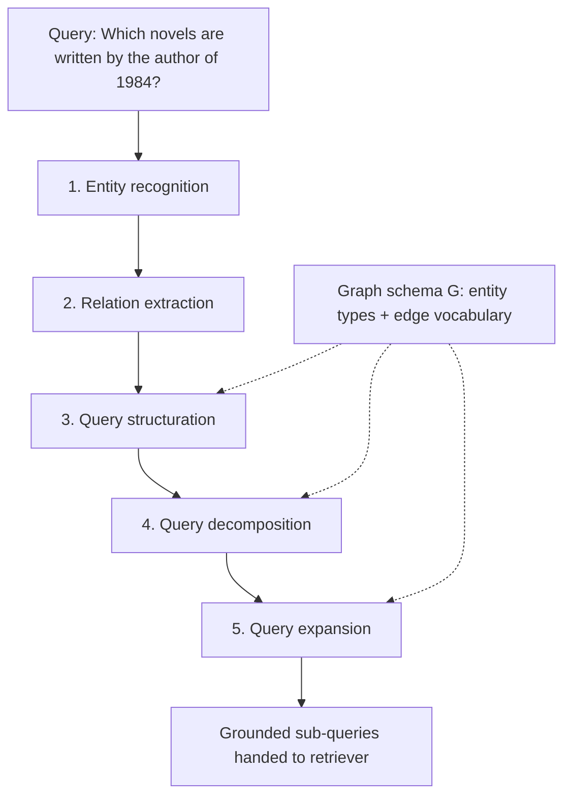
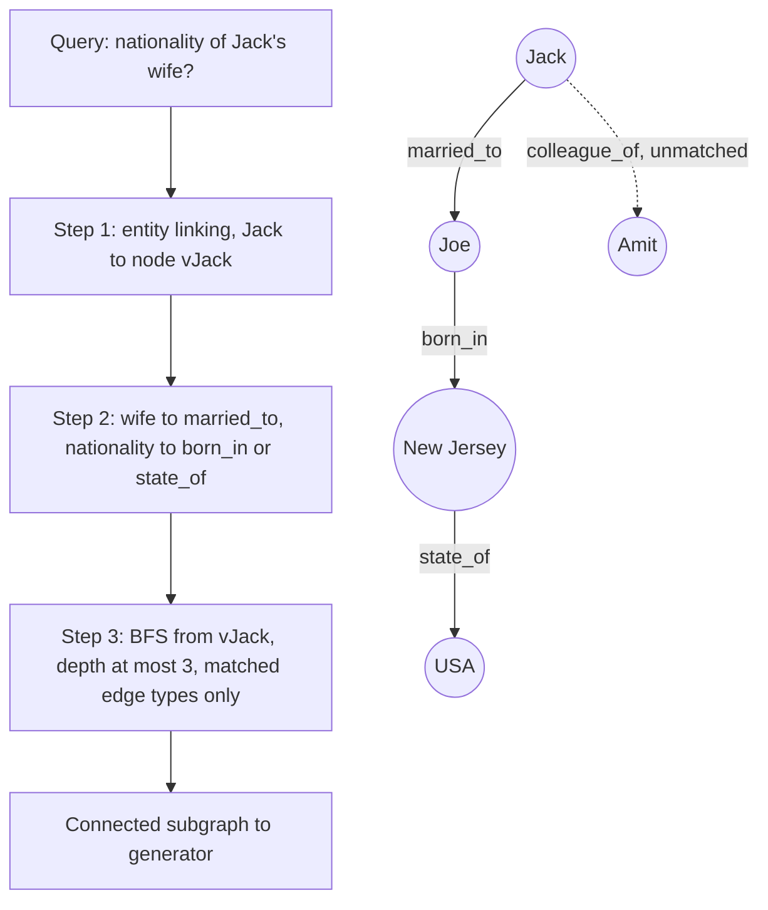
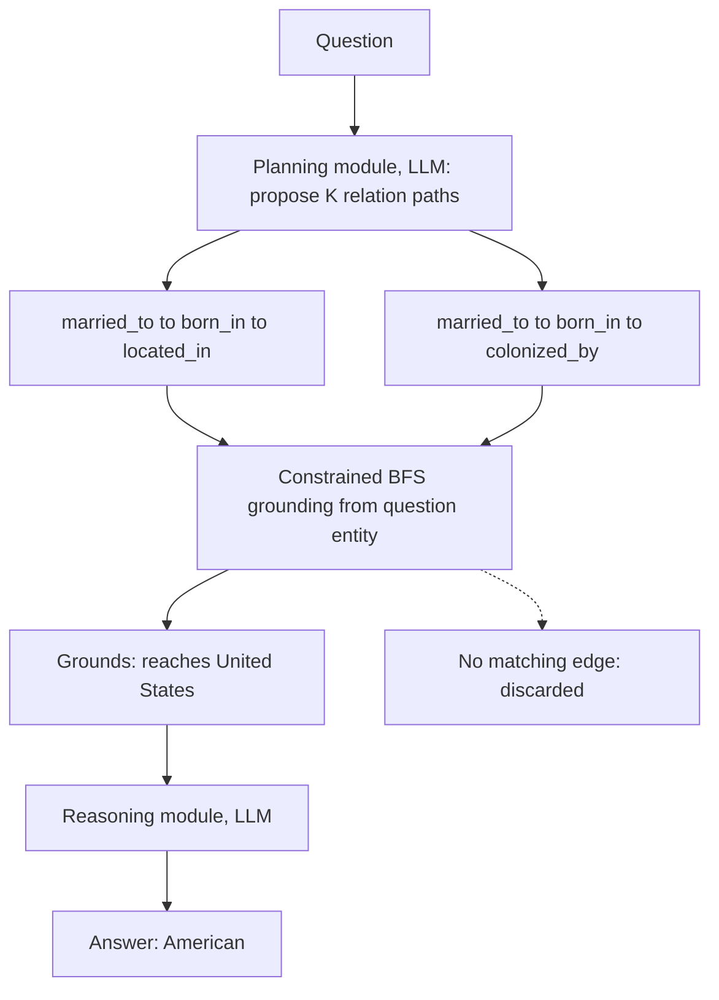
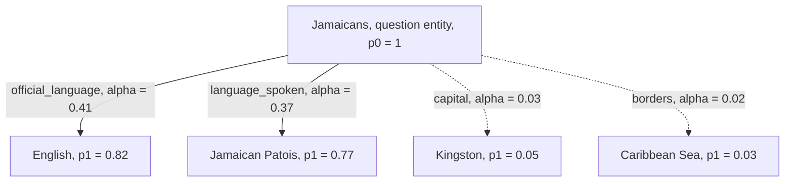
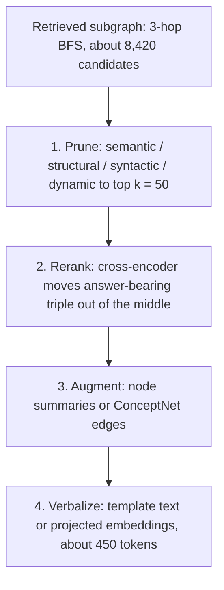
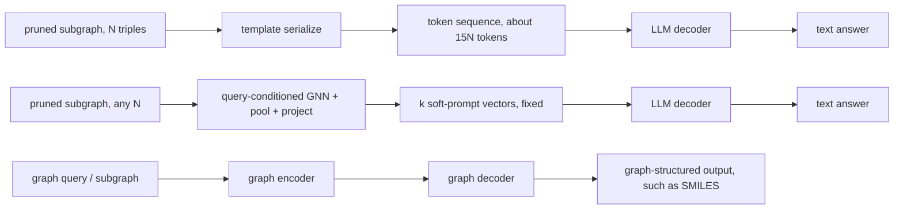

# Chapter 40: Graph RAG

This chapter prepares you to defend every stage, cost, failure, and claim boundary of graph-based Retrieval-Augmented Generation (RAG), from construction and grounded retrieval through generation and the GraphRAG versus LightRAG choice.

## TL;DR

- Build a graph only when answers need connected facts, relation types recur, and construction plus updates are affordable.
- Graph construction moves cost from cheap chunk embeddings into extraction, entity resolution, typed-edge quality, and recurring re-indexing.
- Query processing has five stages, but only structuration, decomposition, and expansion consult the graph schema.
- Heuristic retrieval links entities, matches phrases to real relation types, and traverses a bounded connected path.
- Grounding turns a graph from a fact store into a reasoning source by rejecting every proposed path that has no real walk.
- Graph neural network retrieval moves repeated inference-time model calls into offline training, but it needs a symbolic fallback for unseen relations.
- Prune, rerank, augment, and verbalize before generation. A correct but raw subgraph can still overflow context or bury the answer. Choose GraphRAG communities for global sense-making and LightRAG dual-level keys for point or multi-hop factual retrieval with frequent updates.

## The story

Think of the system as a rail network built for questions.

Flat retrieval is a shelf of timetables. It can return several correct pages, but it does not prove that the listed stations connect.

A graph is the track map. Entities are stations. Typed relations are named tracks. A multi-hop answer is a route that must stay on existing rails.

The first decision is whether to build the railway at all. A route is wasteful when one timetable already contains the answer, when every trip needs a one-off track type, or when the track crew cannot keep pace with updates.

Construction lays the rails. Manual extraction is careful and slow. Rules are cheap but miss unusual phrasing. A large language model (LLM) finds more candidate tracks, then creates a second job in deduplication and entity resolution.

The query processor reads the passenger's request. It identifies stations and relation phrases, translates them into the network's vocabulary, breaks a long trip into legs, and expands aliases. Only the last three jobs need the official track schema.

Heuristic retrieval acts like a dispatcher. It fixes the departure station, maps the requested relation to real track names, and runs a bounded search. Two named endpoints invite a meet-in-the-middle search. One named endpoint requires an outward route.

Reasoning on Graphs (RoG) writes candidate sequences of track types before choosing stations. Constrained breadth-first search (BFS) then checks whether each planned route exists. A fictional rail is rejected before it can support an answer.

Graph neural network RAG (GNN-RAG) trains an automated signal system. Query-matching relations carry more importance. Off-topic relations fade. The trained system is fast, but an unfamiliar track type can fool it silently, so the human-readable symbolic route remains a fallback.

The organizer is the switching yard. It removes excess cars, orders the useful ones, adds missing labels, and converts the consist into text or embeddings the generator can consume.

Generation chooses the vehicle. Verbalization pays per triple in context tokens. Embedding fusion compresses the route into a fixed number of vectors after training. Graph-native generation stays on the rails when the output itself must remain graph-shaped.

Finally, GraphRAG builds a hierarchy of regional rail maps and summaries for questions about the whole network. LightRAG keeps a flat station directory with specific and thematic keys. The right system follows the trip shape, not the better-known name.

## Decoder table

| Term | Decode | Why it matters |
|---|---|---|
| RAG | Retrieve evidence before generation | A graph changes the evidence structure, not the need for grounded generation |
| Knowledge graph (KG) | Entities joined by typed directed relations | It represents connected facts explicitly |
| Graph | `G = (V, E)` | It contains entity nodes and relation-labeled edges |
| `V` | Entity-node set | Linking chooses anchors in this set |
| `R` | Relation vocabulary | Matching and planning must stay inside it |
| `E` | Directed typed edges with `E` contained in `V x R x V` | Traversal accepts only real connections |
| Triple | `(h, r, t)` for head, relation, tail | It is the extraction and storage unit |
| Typed edge | A specific relation such as `born_in` | Generic `related_to` removes selective retrieval value |
| Graph-shaped domain | A domain with recurring relational topology | It can amortize graph construction across queries |
| Recurring relation | The same edge type serves many future queries | It is the economic gate for graph construction |
| Multi-hop necessity | No single chunk contains the complete answer | It is the capability gate for graph retrieval |
| Adjacency matrix | A cell for every possible node pair | It wastes space on sparse extracted graphs |
| Edge list | Three identifiers per real edge | It stores sparse connectivity directly |
| Entity resolution | Merge mentions that refer to one entity | Without it, duplicate nodes split paths |
| Deduplication | Collapse repeated relations or mentions | It turns noisy extraction into usable topology |
| Gleaning | A second extraction pass for missed entities | It raises recall and roughly doubles extraction calls |
| Explicit graph format | A machine-readable structure such as Simplified Molecular Input Line Entry System (SMILES) or citations | It removes the need for prose extraction |
| Schema | Entity types plus allowed edge labels | It bounds valid structured queries and reasoning hops |
| Entity recognition | Find literal things named in the question | A missed or wrong anchor cannot be repaired later |
| Relation extraction | Find phrases that connect mentioned things | It identifies the requested relation intent |
| Query structuration | Convert a question into the store's query language | It makes the request executable |
| Query decomposition | Split a multi-hop request into single-hop legs | It exposes the intermediate variables |
| Query expansion | Add synonyms, acronyms, aliases, or neighbor labels | It bridges user phrasing and stored labels |
| Grounded decomposition | Permit only sub-questions licensed by the schema | It prevents plausible but nonexistent hops |
| Entity linking | Map a mention to a node | It fixes the traversal anchor |
| Relational matching | Map a phrase to one or more real edge types | It narrows the allowable traversal relations |
| BFS | Explore a graph frontier by hop depth | It finds bounded connected paths |
| Bidirectional search | Expand from two named endpoints and intersect | It cuts the touched-node count for two-anchor queries |
| `b` | Average branching factor | Traversal cost grows rapidly with it |
| `h` | Required hop depth | It bounds symbolic traversal and compounding error |
| `K` | Number of candidate relation plans | A wider beam can reduce grounding failure at added BFS cost |
| RoG | Plan relation paths, ground them, then answer | Its model-call count stays roughly fixed in hop depth |
| Think-on-Graph (ToG) | Ask an LLM to choose neighbors at every hop | It sees entity context but pays per branch and hop |
| Constrained BFS | Follow only the next relation in a proposed plan | An empty result rejects an invented route |
| Planning module | Propose ordered relation-type paths | It separates route intent from entity grounding |
| Reasoning module | Answer from grounded entity paths | It receives only routes backed by real edges |
| GNN-RAG | Learned query-conditioned graph retrieval | It replaces sequential retrieval calls with one forward pass |
| Node importance `p_v at layer l` | Relevance of node `v` at layer `l` | It propagates answer likelihood across hops |
| Relation relevance `alpha_k(r)` | Match between a query head and relation type | It gates which edges carry importance |
| Message `m_v at layer l` | Aggregated importance-weighted neighbor signal | It updates a node from query-relevant incoming edges |
| GNN depth `L` | Number of message-passing layers | It sets the receptive field to exactly `L` hops |
| Over-smoothing | Distant node representations converge at excess depth | It reduces precision when depth exceeds the workload |
| Union fallback | Merge learned results with grounded symbolic paths | It catches out-of-distribution learned failures |
| Organizer | Prune, rerank, augment, then verbalize | It turns a raw subgraph into usable generator context |
| Semantic pruning | Score candidates against the query | It is relevant but costs a model pass per query |
| Structural pruning | Use graph position such as PageRank | It is query-agnostic and can be precomputed |
| Syntactic pruning | Use dependency distance | It favors candidates close in the question structure |
| Dynamic pruning | Mask the graph inside successive GNN layers | It learns a changing relevance function |
| PageRank | Propagate structural importance through incoming links | It gives a reusable pruning score |
| Teleport term | Send probability mass uniformly with probability `1 - d` | It prevents a dense cluster from trapping all mass |
| Reranking | Reorder surviving nodes before serialization | It prevents answer evidence from being buried |
| Feature augmentation | Add context to existing nodes | It is reversible and preserves topology |
| Structure augmentation | Add nodes or edges | It can bridge gaps but injects unverified topology |
| Verbalization | Serialize triples into text | It is portable and traceable, with token cost linear in triples |
| Learned projector | Map graph representations into token-embedding space | It avoids text tokens after training |
| Embedding fusion | Pool a variable graph into fixed soft-prompt vectors | It holds per-query context cost constant |
| Discrimination generator | Produce a label or score from a graph | It fits classification, not written explanations |
| Graph-native generator | Produce graph-shaped or sequence-native output | It avoids lossy translation through prose |
| GraphRAG | Community hierarchy plus recursive summaries | It targets global corpus sense-making |
| Leiden | Connected-community partitioning by modularity gain | It constructs GraphRAG's hierarchy |
| Modularity `Q` | Within-community connection strength beyond chance | It is the partition objective |
| Map-reduce | Answer over community summaries, then merge partial answers | It serves global queries without reopening raw chunks |
| LightRAG | Flat key-value graph with dual-level retrieval | It favors point queries and incremental updates |
| Low-level key | Specific entity or relation key | It behaves like entity linking for facts |
| High-level key | Abstract thematic key | It retrieves broader related material |
| Sense-making query | Ask for themes across a corpus | It matches GraphRAG's summary hierarchy |
| Point query | Ask for a specific fact or short path | It matches LightRAG's flat lookup |

## Core mechanics

### 40.1 When a graph earns its place, and when it does not

#### What

A graph represents entities as `V` and directed typed relations as `E`.

$$
G=(V,E), \qquad E\subseteq V\times R\times V
$$

The build gate asks three questions in sequence.

1. Does the answer require chaining facts that no single chunk contains?
2. Is the domain naturally graph-shaped, with recurring relation types?
3. Can the team afford construction and re-indexing on corpus updates?

Any `no` returns to flat retrieval. The first `no` favors dense or Best Matching 25 (BM25) lexical RAG. The second favors iterative or decomposed retrieval over flat chunks. The third favors vanilla RAG with known multi-hop fragmentation.

#### Why

Vector retrieval scores chunks independently. It can retrieve individually correct facts without guaranteeing a connected path. A graph makes reachability auditable.

Construction pays off only when relations recur across many future questions. Named entities alone do not justify a graph.

Topology does not transfer automatically. Airport networks have hub-and-spoke structure. Citation networks connect papers directly to papers. Traversal depth, community resolution, and GNN radius require corpus-specific retuning.

#### Failure without it

Building immediately after one multi-hop miss can spend heavily on a capability that iterative retrieval already fixes.

Vague edges such as `related_to` collapse distinct connections. Any traversal or community algorithm then optimizes meaningless topology.

#### Cost and complexity

For one million chunks of 300 tokens, vanilla embedding covers 300 million tokens. At the illustrative rate of $0.02 per million tokens, it costs $6.

Graph extraction uses about 450 input tokens and 100 output tokens per chunk. At $3 per million input tokens and $15 per million output tokens:

$$
10^6\left(450\frac{3}{10^6}+100\frac{15}{10^6}\right)
=1350+1500=\$2850
$$

The ratio is `2850 / 6 = 475`. At 5 percent monthly churn, 50,000 changed chunks cost $0.30 to re-embed and $142.50 to re-extract.

#### Decisions, ablation, and claim limit

First ablate the graph. Decompose the query, retrieve each sub-question from flat chunks, and run a second pass. Build the graph only if recurrent typed relations still add value.

Scope the graph to high-value relation types. Treat extraction as a recurring per-triple bill, not a one-time project.

The $2,850, $6, and 475 times figures use illustrative prices. They compare cost shape, not a provider benchmark. A full re-extraction that takes six hours cannot meet a same-day compliance update without incremental or hybrid indexing.

### 40.2 Constructing the graph: extraction, cost, and quality

#### What

Construction converts prose into triples `(h, r, t)`, resolves duplicate entity mentions, deduplicates repeated relations, and writes an edge or adjacency list.

Three extraction paths place cost differently.

- Manual extraction offers high precision and consumes annotator-hours. Wikidata illustrates volunteer and bot-assisted curation sustained for more than a decade.
- Rule-based extraction is deterministic, runs in milliseconds on a central processing unit without an external application programming interface (API), and misses passive, coordinated, or cross-sentence relations. Stanford OpenIE-style dependency patterns are the source example.
- LLM extraction has higher recall across paraphrases and clauses, but it costs tokens and can create duplicates, hallucinated relations, or relations outside the licensed schema.

No extractor is needed when structure is already explicit. SMILES molecule strings, citation edges, and foreign keys can be parsed directly.

#### Why

Extraction quality fixes the topology that every later method sees. Entity resolution is a separate stage because two mentions of one entity otherwise form disconnected nodes.

Sparse storage is essential. With 150,000 entities and 500,000 directed edges, a bit-packed adjacency matrix uses:

$$
150000^2=2.25\times10^{10}\text{ bits}\approx2.8\text{ GB}
$$

An edge list with three four-byte identifiers per edge uses:

$$
500000\times3\times4\text{ bytes}=6\text{ MB}
$$

The matrix is about 469 times larger for connectivity alone.

#### Failure without it

Manual-only extraction does not scale. Rule-only extraction misses legitimate edges outside stable patterns. Unchecked LLM extraction builds noisy topology and pushes the cost downstream into deduplication.

Exhaustive pairwise entity comparison becomes quadratic. Embedding-similarity blocking is needed after a few thousand entities.

#### Cost and complexity

For 50,000 chunks of about 400 tokens, add 180 prompt tokens. Six triples at 14 tokens each in compact JavaScript Object Notation (JSON) produce 84 output tokens. At $0.15 per million input tokens and $0.60 per million output tokens:

$$
580\frac{0.15}{10^6}+84\frac{0.60}{10^6}=\$0.0001374
$$

Single-pass extraction costs `50000 x 0.0001374 = $6.87`. One gleaning pass doubles it to $13.74.

The 300,000 raw mentions reduce to about 150,000 unique entities, a 2 to 1 duplication ratio. Embedding one 400-token chunk costs $0.000008 at the illustrative $0.02 per million rate, so extraction is about 17 times more expensive.

At 5 percent weekly churn, changed-chunk extraction costs about $0.69. A full $13.74 rebuild is 20 times that local update.

#### Decisions, ablation, and claim limit

Use LLM extraction plus one gleaning pass for open prose. Use rules for narrow and stable legal or clinical fields. Skip extraction for explicit structures. Reserve manual review for high-stakes drug or regulatory edges.

Ablate the extraction method on a few hundred hand-labeled examples. A rule system with 95 percent precision may still lose through missing recall.

Use incremental extraction with periodic full entity resolution and community repartition. The prices are illustrative, and the examples compare mechanisms rather than measured production quality.

### 40.3 Query processing: five sub-processes and grounded decomposition

#### What

The query processor maps a natural-language question and schema into grounded sub-queries.

$$
\widehat{Q}=\omega(Q,G)
$$

Its five fixed stages are entity recognition, relation extraction, query structuration, query decomposition, and query expansion.

Entity recognition and relation extraction are schema-free. Structuration, decomposition, and expansion consult the graph schema.

Structuration can emit SPARQL Protocol and RDF Query Language (SPARQL) for a Resource Description Framework (RDF) triple store or Cypher for a property graph such as Neo4j. Decomposition turns `Which novels are written by the author of 1984?` into a lookup for the author and a second lookup for that author's novels. Expansion maps `written by` to `authored_by` and can use `Apple Inc.`, `AAPL`, and `market_capitalization` to distinguish a company from fruit.

#### Why

Grounded decomposition validates every planned hop against existing entity and relation types. A general LLM can invent a plausible hop such as an author's political leanings even when the extractor never built that edge.

An empty result from an invalid label looks like a true missing fact unless validation separates the cases.

Entity recognition also controls the ceiling. An ambiguous acronym such as `CRP` can link to the wrong node, and no later traversal can repair that anchor.

#### Failure without it

Without expansion, user language and stored labels never meet. Without structuration, the graph cannot execute the request. Without decomposition, one prompt hides which hop failed. Without schema validation, the generator can fall back to parametric memory after an empty invented hop.

#### Cost and complexity

Assume a 600-token schema, 50 query or intermediate tokens per schema-aware stage, 60 output tokens per stage, $0.15 per million input tokens, $0.60 per million output tokens, 80 decoded tokens per second, and 300 milliseconds of fixed overhead per call.

Three calls consume 1,950 input and 180 output tokens. They cost $0.0004005 and take 3,150 milliseconds.

One structured call consumes 650 input and 180 output tokens. It costs $0.0002055 and takes 2,550 milliseconds.

The structured call cuts cost by 48.7 percent and latency by 19.0 percent. Decoding still dominates. A graph or approximate nearest neighbor lookup takes tens of milliseconds, so the roughly 2.5-second query processor is the bottleneck by two to three orders of magnitude.

#### Decisions, ablation, and claim limit

Combine the last three stages in one structured-output call, but retain a field for each stage so the trace remains auditable. Validate every label before execution.

Use lighter components for recognition and extraction. Use a stronger model for structuration and decomposition. Bound expansion by result count or node count. Use community cardinality estimates and clarify when it grows too broad. The worked 2.55-second processor cannot meet a 300-millisecond p95 target without another design change.

Ablate five separate calls against one structured call. The measured savings come from shared schema input and one fixed overhead, not faster decoding.

### 40.4 Heuristic retrieval: linking, matching, traversal

#### What

Heuristic graph retrieval has three separable steps.

1. Entity linking maps a mention to an anchor node.
2. Relational matching maps each relation phrase to one or more real edge types.
3. Bounded traversal returns a connected subgraph.

For `nationality of Jack's wife`, linking fixes Jack. Matching maps `wife` to `married_to` and `nationality` to both `born_in` and `state_of`. A depth-three BFS finds Jack to Joe to New Jersey to USA. An unmatched `colleague_of` edge to Amit is not traversed.

Descriptions of edge types work better than literal names when phrases differ. If several relation scores are close, traversal can try each candidate and keep the one that connects.

#### Why

Dense retrieval over verbalized triples can return individually relevant but disconnected facts. Graph traversal preserves reachability.

When a query names two entities, bidirectional meet-in-the-middle search expands from both anchors and intersects their frontiers. The source uses a biomedical EZH2 and epithelioid sarcoma query as this shape. When only one anchor is linkable, single-source traversal must discover the rest outward.

#### Failure without it

A wrong entity link poisons the entire route. Literal matching silently misses paraphrases. Flat similarity loses connectivity. Excess traversal depth explodes the frontier.

Depth beyond three or four hops is usually a decomposition or planning failure, not a reason to expand BFS farther.

#### Cost and complexity

Single-source traversal grows as `O(b^h)`. Meet-in-the-middle traversal touches about `O(2b^(h/2))`.

With branching factor 12 and depth three, a single-source search touches about:

$$
12^3=1728
$$

Expanding each of two anchors to depth two touches:

$$
2\times12^2=288
$$

That is `288 / 1728 = 0.167`, an 83 percent reduction.

Knowledge Graph Generative Pre-trained Transformer (KG-GPT) splits a query into one-relation sentences and uses an LLM for relation matching plus top-k relation selection. An `h`-relation query costs at least `h + 2` LLM calls, excluding entity linking.

#### Decisions, ablation, and claim limit

Default to alias tables and candidate-node reranking for entity linking. Precompute embeddings for natural-language edge descriptions. Hand-written lookup fits only a closed schema under roughly 20 edge types. At about 1,000 edge types, escalate to an LLM only when top embedding scores lie within a small margin.

Default to bidirectional search for two concrete anchors. Use single-source traversal for an open fan-out query. Rank the frontier instead of increasing depth when branching explodes.

Ablate connected traversal against dense retrieval over verbalized nodes. If retrieved triples are correct but disconnected, the failure is structural, not an embedding-quality problem.

### 40.5 Knowledge graphs as reasoning sources

#### What

A graph becomes a reasoning source only when every proposed inference step is checked against a real edge before it counts as evidence.

Free-text reasoning can invent a tidy path. A false trace might move from Jack through Joan and New Jersey to Canada even though the real location edge reaches the United States.

RoG separates three operations. A fine-tuned planning module proposes `K` ordered relation paths. Constrained BFS starts at the real question entity and follows only the proposed relation sequence. A reasoning module answers from paths that ground successfully and cites the selected path.

Planning supervision comes from shortest relation paths between question and answer entities in the graph. This bounds proposals to the graph's relation vocabulary.

#### Why

Relation names such as `born_in`, `located_in`, and `citizen_of` can sound similar while licensing different facts. Fluent free text does not reveal whether a hop exists.

Grounding returns an empty set for an impossible relation walk and discards it before generation. It does not ask the model to repair the plan.

ToG takes the alternative route. It asks an LLM to score actual neighboring relations at every hop. This sees entity-specific context that a relation-only RoG plan lacks, but its call count compounds with beam width and depth.

#### Failure without it

One false intermediate entity poisons all later hops. A generated chain can look fully reasoned while containing no valid walk.

Repairing a failed plan with another free-form model call reopens the same hallucination channel that grounding closed.

#### Cost and complexity

The source begins with average graph branching factor `b = 8`. At beam width `w` and depth `h`, hop-by-hop traversal calls are:

$$
\sum_{k=1}^{h}w^{k-1}=\frac{w^h-1}{w-1}
$$

With `w = 3`, a two-hop question needs four traversal calls and one final call, or five total. A four-hop question needs 40 traversal calls and one final call, or 41 total.

RoG uses one planning call, zero model calls for exact grounding, and one reasoning call. It stays at two calls independent of `h`.

At about $0.002 per short call, two hops cost $0.010 for ToG and $0.004 for RoG, a 2.5 times gap. Four hops cost about $0.082 and $0.004, roughly a 20 times gap.

#### Decisions, ablation, and claim limit

Use plan-then-ground when depth is uncertain. Consider hop-by-hop selection when the graph is shallow, dense, and almost always at most two hops.

Size `K` from the measured grounding-failure rate. A wider beam adds constrained BFS runs, not LLM calls. If failures come from missing edges, beam width cannot fix them.

Ablate free-text reasoning by removing the supporting graph walk. A robust answer must disappear or abstain. If it remains, the model is using unsupported memory.

RoG's fixed call count trades away entity-specific planning context. Union grounded relation plans with a learned context-aware retriever when entity identity changes the correct route.

### 40.6 Learned retrieval: GNN-RAG and query-conditioned message passing

#### What

GNN-RAG moves query-to-graph matching from sequential inference-time LLM calls into offline graph training.

A shared Bidirectional Encoder Representations from Transformers (BERT) or Robustly Optimized BERT Pretraining Approach (RoBERTa) scale encoder maps query heads and relation labels into one space. Linked question entities start with importance one. Other nodes start at zero.

$$
p_v^{(0)}=
\begin{cases}
1 & \text{if }v\text{ is a linked question entity}\\
0 & \text{otherwise}
\end{cases}
$$

For query head `k`, relation relevance is:

$$
\alpha_k(r)=\frac{\exp(q_k^{\mathsf T}r)}{\sum_{r'\in R}\exp(q_k^{\mathsf T}r')}
$$

A node receives importance-weighted messages over incoming edges.

$$
m_v^{(l)}=\sum_{k=1}^{K}\sum_{(u,r,v)\in E}p_u^{(l)}\alpha_k(r)h_u^{(l)}
$$

$$
h_v^{(l+1)}=\mathop{\text{MLP}}(h_v^{(l)},m_v^{(l)},W^{(l)}),
\qquad
p_v^{(l+1)}=g(m_v^{(l)},W_p^{(l)})
$$

After scoring, retrieval selects top nodes and extracts shortest paths from linked question entities to answer candidates.

#### Why

Importance compounds across layers. Relations that fit the question carry signal. Off-topic paths decay. Exactly `L` layers reach exactly `L` hops.

The displayed equations preserve the source mechanism, importance times relevance followed by aggregation and update. They simplify the published formulation, which normalizes across heads instead of summing them bare.

#### Failure without it

Symbolic LLM traversal dominates latency at query volume. A learned retriever instead fails silently on graph regions or relation types missing from training.

Too much depth causes over-smoothing. New nodes under known relations are less disruptive than a new relation type. The learned route is less precise and much denser than the symbolic route it replaces.

#### Cost and complexity

For a candidate graph with 500 nodes, about 2,000 edges, dimension 768, and three layers, one layer uses roughly:

$$
2Ed=2\times2000\times768\approx3.07\text{ million multiply-adds}
$$

Three layers use about 9.2 million multiply-adds. Kernel-launch overhead dominates arithmetic at this graph size.

The worked symbolic route caps three beam expansions across three hops at nine sequential calls. At 700 milliseconds each, retrieval takes 6.3 seconds.

The worked GNN route uses 50 milliseconds to encode the query and about 5 milliseconds for three message-passing layers on a graphics processing unit. Total retrieval latency is 55 milliseconds.

$$
6300/55\approx115
$$

The roughly 115 times difference supports the stated two-orders-of-magnitude throughput direction. It assumes one batched forward pass, not one GNN invocation per candidate.

#### Decisions, ablation, and claim limit

Start with the symbolic route. Train GNN-RAG once query volume justifies fixed training cost or shortest-path labels already exist.

Never ship the learned graph alone in the source design. Union its subgraph with grounded symbolic paths and often a dense-retrieval pass. Log which route supplied each surviving answer.

Retrain on schema change, not calendar time. Set `L` from measured hop count. Feed the generator an extracted shortest path, not only an opaque answer-node score.

Ablate each union member. If the GNN appears accurate only while the symbolic fallback supplies the hard tail, the union instrumentation should reveal that dependence.

### 40.7 Organizing: pruning, reranking, augmenting, verbalizing

#### What

The organizer runs four operations in order.

1. Prune candidate nodes and edges.
2. Rerank survivors before serialization.
3. Augment missing node context or graph structure.
4. Verbalize triples or project graph embeddings.

Pruning has four families. Question-answering GNN (QA-GNN) style semantic pruning scores candidates against the query. A semantic variant scores edges after repeated relation types are deduplicated. PageRank supplies a structural score. PipeNet style syntactic pruning uses dependency distance. JointLK style dynamic pruning masks the graph across roughly five GNN layers.

PageRank is:

$$
PR(i)=\frac{1-d}{N}+d\sum_{j\in In(i)}\frac{PR(j)}{Out(j)}
$$

The source uses `d` approximately equal to 0.85. The teleport term prevents one dense cluster from trapping all mass and gives dangling nodes somewhere to send score.

#### Why

A raw traversal is an unordered and unbounded set. A cross-encoder reranks the pruned candidates because answer evidence can be buried after the graph becomes a token sequence.

Feature augmentation adds a summary to an existing node and keeps topology unchanged. Structure augmentation adds nodes or edges, such as ConceptNet bridges, and introduces content the source graph did not verify.

Template verbalization is portable and auditable. A learned projector is cheaper per node after training but tied to a base model.

#### Failure without it

Breadth-first traversal can overwhelm the context window. Verbalizing BFS order can place the answer in a weak position. Irrelevant nodes dilute useful evidence. Raw graph objects are also incompatible with a token-only generator.

#### Cost and complexity

For two inbound PageRank neighbors with scores 0.30 and 0.50, out-degrees four and two, and `N = 100`:

$$
PR(i)=\frac{0.15}{100}+0.85\left(\frac{0.30}{4}+\frac{0.50}{2}\right)
=0.278
$$

At branching factor 20 over three hops:

$$
20+20^2+20^3=20+400+8000=8420
$$

At seven tokens per triple, the raw traversal costs about 58,940 tokens. This is about seven times an 8K context and leaves little room even in a 32K deployment.

Prune to 50 triples, rerank them, and add five 20-token node summaries:

$$
50\times7+5\times20=450\text{ tokens}
$$

The source compares this with about 2,000 tokens in a text retrieval funnel. Both organized pipelines land in the hundreds to low thousands, not tens of thousands.

#### Decisions, ablation, and claim limit

Default to precomputed structural pruning at scale. Pay for semantic pruning when relevance is query-dependent, as in company-versus-fruit disambiguation.

Compute `b + b^2 + ... + b^h` before choosing the scorer. Rerank before verbalizing. Skip reranking only when `k` is at most 5 and leaves no meaningful middle.

Prefer feature augmentation because it is reversible. Add topology only when the source graph cannot connect any plausible answer.

Ablate each organizer operation separately. Measure answer-path recall after pruning, answer position after reranking, unsupported edges after augmentation, and context size after verbalization. In the source case, accuracy is flat between `k = 10` and a full 128K context, but p99 latency triples for the large context. That favors pruning plus reranking unless a harder multi-hop slice proves the extra graph is load-bearing.

### 40.8 Generation: verbalize, fuse, or stay in graph space

#### What

Generation has three top-level families.

- LLM generation either verbalizes triples or fuses graph embeddings.
- Discrimination generation uses a graph convolutional network or graph transformer to emit a label or score.
- Graph-native generation keeps the output in graph or sequence form, as with a SMILES molecule representation.

Verbalize-then-prompt renders each triple as literal text. Embedding fusion uses a query-conditioned GNN, cross-modality pooling, and a domain projector to create a fixed number of soft-prompt vectors in the LLM embedding space.

Graph Neural Prompting is the source example. Its graph becomes another input modality. No literal triple string survives in the fused representation.

Discrimination architectures can compose graph convolutional and transformer blocks in serial, alternating, or parallel-then-merged patterns. They fit classification or regression, not open prose.

#### Why

Verbalization needs no training and leaves traceable facts. Its context cost grows with subgraph size. Fusion pays training compute to keep the input footprint fixed. Graph-native generation preserves domain structure when prose would lose constraints.

#### Failure without it

Verbalizing an unbounded hub subgraph can consume the prompt. Fusion removes literal evidence needed for citations. A discrimination head cannot write an explanation. Translating a structure-native output through prose can violate the structure that mattered.

#### Cost and complexity

At 15 tokens per triple, 40 triples cost:

$$
T_{verbalize}=40\times15=600\text{ tokens}
$$

At 200 triples, the cost is 3,000 tokens. With a fixed fusion budget of `k = 32` vectors, the structure-position ratios are:

$$
600/32\approx19, \qquad 3000/32\approx94
$$

The fusion footprint stays fixed because `k` is a hyperparameter. The source connects 32 to the fixed query budget of the BLIP-2 Q-Former.

A five-chunk dense prompt at 250 tokens per chunk costs 1,250 tokens. A well-pruned 600-token graph prompt is not inherently larger. The risk begins when pruning allows hundreds of triples.

#### Decisions, ablation, and claim limit

Default to verbalization for low-hundreds-of-token subgraphs and products that require literal evidence. Reuse an existing query-conditioned GNN before funding a standalone fusion pipeline. A regulated one-quarter launch that needs human-checkable facts favors verbalization until fused attribution exists.

Use a discrimination generator for verification or link prediction. Switch families when the output must be an explanation. Reserve graph-native generation for graph-shaped or sequence-native outputs.

Even with fusion, verbalize a top-ranked justification subset when citations matter.

Ablate the graph evidence from the generator. Remove the verbalized triples or fused vectors and rerun. An unchanged answer shows that the generator was not using retrieved evidence.

### 40.9 GraphRAG vs LightRAG: communities vs dual-level keys

#### What

GraphRAG extracts triples, builds a knowledge graph, partitions it into a hierarchy of Leiden communities, recursively summarizes every level, and answers by map-reduce over summaries. It targets global sense-making.

Leiden starts with each node in its own community. It moves a node to the neighboring community with the highest modularity gain, collapses settled communities into super-nodes, and repeats. Unlike its Louvain predecessor, the resulting communities remain internally connected. Repeated coarsening has the same layered shape as Hierarchical Navigable Small World (HNSW) approximate search.

Modularity is:

$$
Q=\frac{1}{2m}\sum_{i,j}\left[A_{ij}-\frac{k_i k_j}{2m}\right]\delta(c_i,c_j)
$$

LightRAG skips community summaries. It profiles each entity name as a key and surrounding text as its value, deduplicates relations, and searches the flat graph with a low-level entity or relation key plus a high-level thematic key.

#### Why

GraphRAG's hierarchy can answer questions about major themes without reopening raw chunks. LightRAG avoids the summarization tax and accepts local incremental updates. `Which plan tier includes single sign-on?` is the source point-query example for LightRAG.

GraphRAG loses on point lookup because a map-reduce pass reads summaries written for another question. LightRAG loses on a genuinely global query because local key matching cannot replace a summary that was never written.

#### Failure without it

A vague edge inflates node degree, corrupts modularity, damages a community, and then damages every recursive summary above it.

Frequent updates can shift GraphRAG community boundaries far from the changed document because modularity is global. LightRAG stays local but has no community-level synthesis.

#### Cost and complexity

In the four-node toy, nodes one through three form a triangle and node four hangs from node three. There are four edges and `2m = 8`. Keeping the triangle together and node four alone gives `Q = -0.03125`. Merging all four gives `Q = 0`, a gain of 0.03125. One dangling edge changes the preferred partition.

For a constructed 10,000-chunk corpus with about 30,000 extracted nodes and communities of about 10 nodes, GraphRAG summary calls are:

$$
3000+300+30+3=3333
$$

Add 10,000 extraction calls for 13,333 total. LightRAG stops at the same 10,000 extraction calls. GraphRAG pays a 1.33 times call count, or a 33 percent premium, before higher-level calls become longer.

For 50 new documents, LightRAG adds about 50 local extraction units. GraphRAG reruns Leiden globally and can repeat the 3,333-summary bill in the worst case.

#### Decisions, ablation, and claim limit

Default to LightRAG for point and multi-hop factual queries. Use GraphRAG for global themes. A source decision threshold treats at most about 10,000 chunks with rare edits as the small and static case where GraphRAG's one-time premium may be acceptable.

For a corpus growing 5 percent daily under a one-hour freshness target, combine an incremental LightRAG-style key store with a scheduled GraphRAG rebuild for sense-making queries.

Audit edge quality before comparing architectures. Fall back to dense retrieval when extraction cannot produce relations more precise than co-occurrence.

Benchmark hygiene matters. GraphRAG reports subjective, LLM-scored comprehensiveness, diversity, and empowerment. It does not evaluate HotpotQA-style multi-hop correctness. That leaves multi-hop ability untested, not proven weak. Run the benchmark that matches the shipped query shape.

The 33 percent construction premium is an order-of-magnitude illustration from constructed community sizes, not a benchmark result. Real community size skew and higher-level prompt lengths change the overhead.

## Diagrams

### Figure 40.1

**Figure 40.1:** A graph earns its place only after multi-hop necessity, recurring relational structure, and affordable maintenance all clear the gate - any "no" routes back to flat retrieval.

### Figure 40.2

**Figure 40.2:** The extraction method decides where the graph's cost lands - annotator-hours, missed edges, or a token bill that reappears downstream as a deduplication pass.

### Figure 40.3

**Figure 40.3:** Only the last three sub-processes ever consult the graph schema. Grounding a decomposition means constraining it to that schema, not to the LLM's own notion of a plausible next hop.

### Figure 40.4

**Figure 40.4:** Heuristic retrieval is three checkable steps rather than one similarity score: linking fixes the anchor node, matching narrows the query's phrases to real edge types, and bounded traversal finds the connected path, while an unmatched relation like colleague_of is never traversed.

### Figure 40.5

**Figure 40.5:** Reasoning on Graphs proposes relation paths before touching an entity, then grounds each one against real edges: a plan with no matching walk from the question entity is discarded before it can reach the answer.

### Figure 40.6

**Figure 40.6:** Query-conditioned message passing raises importance on relations that match the question's intent and lets the rest decay toward zero, without a hand-written rule for which edge types matter. Scores shown are illustrative, one layer in, for the query "which language do Jamaican people speak."

### Figure 40.7

**Figure 40.7:** Four operations sit between a retrieved subgraph and the generator, and each one earns its place by removing a specific failure mode - unbounded size, positional burial, missing context, or an incompatible format - rather than by convention.

### Figure 40.8

**Figure 40.8:** Verbalizing pays in context tokens that grow with subgraph size, embedding fusion pays in training compute to hold that cost constant, and graph-native generation never routes through natural-language text at all.

### Figure 40.9

```mermaid
flowchart TB
    subgraph G["GraphRAG"]
        G1["chunks"] --> G2["LLM extraction: triples"] --> G3["knowledge graph"] --> G4["Leiden partition, maximize Q"] --> G5["community hierarchy, recursive LLM summaries"] --> G6["query: map-reduce over summaries"] --> G7["answer"]
    end
    subgraph L["LightRAG"]
        L1["chunks"] --> L2["LLM extraction: triples"] --> L3["knowledge graph"] --> L4["key-value profile + dedup, entity = key"] --> L5["no community layer"] --> L6["query: dual-level low + high keys"] --> L7["answer"]
    end
```

**Figure 40.9:** GraphRAG spends index-time budget on a community hierarchy so a query can be answered by map-reduce over summaries. LightRAG spends none of that budget and answers by searching a flat key-value graph at two granularities.

## Whiteboard pack

### What to draw

1. Draw the three graph gates: multi-hop need, recurring relations, affordable maintenance.
2. Under the gates, draw manual, rule-based, and LLM extraction converging on resolved triples.
3. Draw the five query-processing boxes and connect the schema only to boxes three through five.
4. Draw link, match, and bounded traverse as three separate retrieval checks.
5. Add a two-anchor bidirectional frontier and label its intersection.
6. Draw RoG as relation planning, constrained BFS grounding, and grounded-answer generation.
7. Add GNN-RAG as a fast learned route and union it with the symbolic fallback.
8. Draw the organizer funnel: prune, rerank, augment, verbalize.
9. Split generation into verbalized text, fixed-vector fusion, and graph-native output.
10. Finish with GraphRAG's community hierarchy beside LightRAG's flat dual-level keys.
11. Write the dominant costs under each stage: extraction, model calls, branching, context, and rebuilds.
12. Circle the audit path from final claim back through grounded edges to source extraction.

### Spoken script

Start with the three-gate decision: a graph needs multi-hop questions, recurring typed relations, and affordable maintenance. Then build resolved triples and ground the last three query-processing stages in the schema. Retrieval links an anchor, matches real edge types, and traverses a bounded connected path. RoG plans relations and rejects paths that fail constrained search. GNN-RAG trades offline training for fast serving, with a symbolic fallback. The organizer prunes, reranks, augments, and verbalizes. Generation then chooses traceable text, fixed-vector fusion, or graph-native output. Use GraphRAG communities for global themes and LightRAG keys for factual, frequently updated workloads.

## Interview traps

### 1. The final answer is wrong. Which stage owns the failure?

Start at the macro level by testing whether the workload should use a graph and whether GraphRAG or LightRAG matches the query shape. At the mezzo level, isolate construction, query processing, retrieval, reasoning, organization, or generation. At the micro level, inspect the exact entity link, edge label, truncated hop, pruned node, evidence position, or unsupported claim.

### 2. How do you prove that graph construction and traversal add value?

First compare the graph with iterative decomposition over the flat index, then compare extraction methods on precision, recall, duplicate rate, and typed-edge validity. Hold the graph fixed and ablate entity linking, relation matching, and connected traversal. Connectivity is decisive because a graph has not earned its recurring cost when flat retrieval already supplies a connected answer or decomposition closes the hops.

### 3. What is the remove-the-evidence test for graph reasoning?

Record the grounded path, remove one load-bearing edge or withhold the whole path, and rerun. A grounded system should change, abstain, or surface the missing connection because an unchanged confident answer shows that parametric memory drove generation. For a learned-symbolic union, remove the GNN subgraph and RoG path separately to reveal which route supplied usable evidence.

### 4. How do latency, consistency, and robustness trade across the pipeline?

Attribute latency before optimizing because one structured schema call takes 2,550 milliseconds, bidirectional traversal touches 288 nodes, GNN-RAG takes 55 milliseconds, and organization cuts 58,940 raw tokens to 450. Consistency comes from schema validation, exact grounding, and stable typed edges, while robustness comes from route unions, bounded depth, schema-change retraining, and organizer ablations. A learned route is fast but can fail silently on unseen relations, so route by confidence and log whether learned or symbolic evidence supplied the answer.

### 5. Is GraphRAG better than LightRAG because its reported evaluation looks stronger?

No, because the query shape and benchmark must be named first. GraphRAG targets global sense-making through community summaries, while LightRAG targets factual retrieval through low-level and high-level keys. GraphRAG's reported comprehensiveness, diversity, and empowerment are subjective and LLM-scored, so test point accuracy, global coverage, update freshness, and cost on the workload that will ship.

## Key numbers

| Source section | Number or formula | Meaning and claim boundary |
|---|---|---|
| 40.1 | One million x 300 = 300 million tokens | Vanilla embedding workload |
| 40.1 | $6 | Illustrative embedding cost at $0.02 per million tokens |
| 40.1 | 450 input and 100 output tokens per chunk | Graph extraction workload |
| 40.1 | $1,350 input + $1,500 output = $2,850 | Illustrative full extraction cost |
| 40.1 | `2850 / 6 = 475` times | Construction-to-embedding cost ratio |
| 40.1 | 5 percent = 50,000 changed chunks | Monthly churn case |
| 40.1 | $0.30 versus $142.50 | Re-embedding versus re-extraction at that churn |
| 40.1 | 6 hours | Example full re-extraction duration under a same-day compliance constraint |
| 40.2 | 150,000 nodes and 500,000 edges | Sparse storage example |
| 40.2 | 2.8 GB versus 6 MB, about 469 times | Bit-packed matrix versus edge list |
| 40.2 | 50,000 chunks, 400 + 180 = 580 input tokens | Extraction example input |
| 40.2 | 6 triples at 14 tokens = 84 output tokens | Extraction example output |
| 40.2 | $0.0001374 per chunk | Illustrative extraction cost |
| 40.2 | $6.87 single pass and $13.74 with gleaning | One pass versus two passes |
| 40.2 | 300,000 mentions to 150,000 entities, 2 to 1 | Deduplication load |
| 40.2 | $0.000008 per chunk, extraction about 17 times higher | Embedding comparison |
| 40.2 | 5 percent update about $0.69 versus $13.74, 20 times | Incremental versus full rebuild |
| 40.3 | 600 schema, 50 stage input, 60 stage output tokens | Query processor assumptions |
| 40.3 | 80 tokens per second and 300 milliseconds fixed per call | Latency assumptions |
| 40.3 | 1,950 input, 180 output, $0.0004005, 3,150 ms | Three-call configuration |
| 40.3 | 650 input, 180 output, $0.0002055, 2,550 ms | One structured-call configuration |
| 40.3 | 48.7 percent cost and 19.0 percent latency reduction | Structured-call savings |
| 40.4 | `12^3 = 1728` versus `2 x 12^2 = 288` | Single-source versus bidirectional search |
| 40.4 | 83 percent fewer touched nodes | Meet-in-the-middle reduction |
| 40.4 | `h` at most 3 or `h` at most 4 | Explicit practical depth bound from the source |
| 40.4 | `h + 2` calls | KG-GPT minimum for an `h`-relation query |
| 40.4 | Roughly 20 edge types | Upper region where hand lookup can remain practical |
| 40.5 | `b = 8` and `w = 3`, then 5 calls at two hops | Graph branching example and ToG-style two-hop total including generation |
| 40.5 | 41 calls at four hops | ToG-style four-hop total including generation |
| 40.5 | 2 calls independent of `h` | RoG planning plus reasoning |
| 40.5 | $0.010 versus $0.004, then $0.082 versus $0.004 | Two-hop and four-hop illustrative costs |
| 40.5 | 2.5 times and roughly 20 times | Cost gaps as depth increases |
| 40.6 | 500 nodes, degree 4, about 2,000 edges, dimension 768 | Candidate graph example |
| 40.6 | 3 layers and 9.2 million multiply-adds | Learned retrieval arithmetic |
| 40.6 | 9 calls at 700 ms = 6.3 seconds | Constructed symbolic latency |
| 40.6 | 50 ms encoder + 5 ms GNN = 55 ms | Constructed learned latency |
| 40.6 | `6300 / 55` is about 115 times | Two-orders-of-magnitude latency direction |
| 40.7 | `d` about 0.85 and toy `PR(i) = 0.278` | PageRank settings and check |
| 40.7 | `20 + 400 + 8000 = 8420` candidates | Three-hop branching example |
| 40.7 | 7 tokens each = 58,940 tokens | Raw verbalization cost |
| 40.7 | Top 50 plus five 20-token summaries = 450 tokens | Organized context |
| 40.7 | About 7 times an 8K context | Raw-context overflow |
| 40.7 | `k` at most 5 | Source condition where reranking may be skipped |
| 40.7 | `k = 10` versus 128K context, p99 latency 3 times | Large-context adjudication with flat offline accuracy |
| 40.8 | 40 triples at 15 tokens = 600 tokens | Verbalized graph context |
| 40.8 | 200 triples = 3,000 tokens | Hub-growth case |
| 40.8 | `k = 32` vectors | Fixed fusion budget |
| 40.8 | About 19 times and 94 times fewer positions | Fusion ratios at 40 and 200 triples |
| 40.8 | `5 x 250 = 1250` tokens | Dense-prompt comparison |
| 40.9 | Four-node toy with `Q = -0.03125` to `Q = 0` | Leiden modularity gain check |
| 40.9 | 10,000 chunks and about 30,000 nodes | Constructed indexing example |
| 40.9 | 3,000 + 300 + 30 + 3 = 3,333 summaries | Recursive hierarchy calls |
| 40.9 | 13,333 versus 10,000 calls | GraphRAG versus LightRAG build |
| 40.9 | 1.33 times or 33 percent | Constructed premium, not benchmark result |
| 40.9 | 50 new documents versus worst-case 3,333 summary calls | Local update versus global rebuild |
| 40.9 | 5 percent daily growth and one-hour freshness | Staff update-SLA case |
| 40.9 | At most about 10,000 chunks with rare edits | Source region where batch hierarchy cost may be tolerable |
