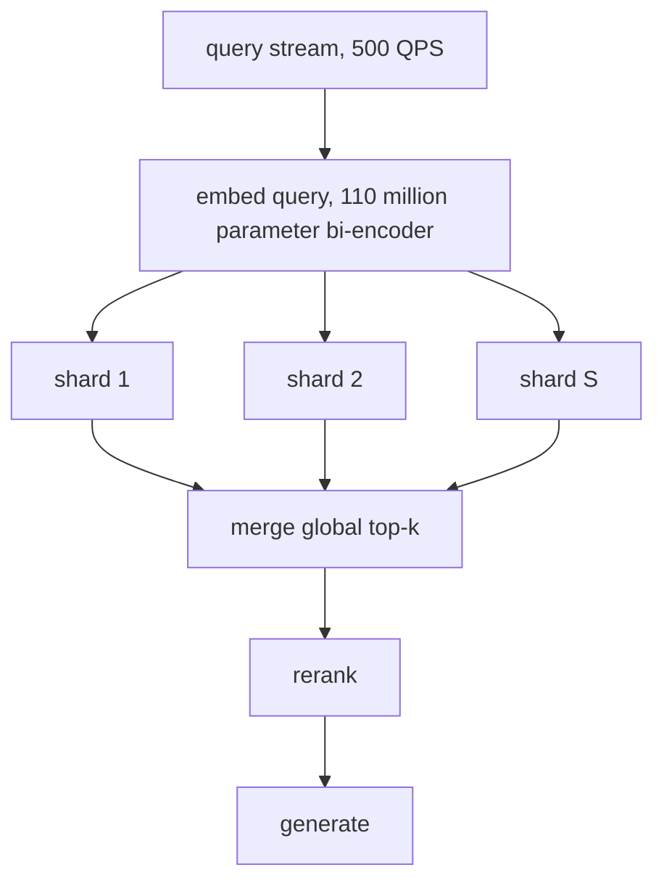
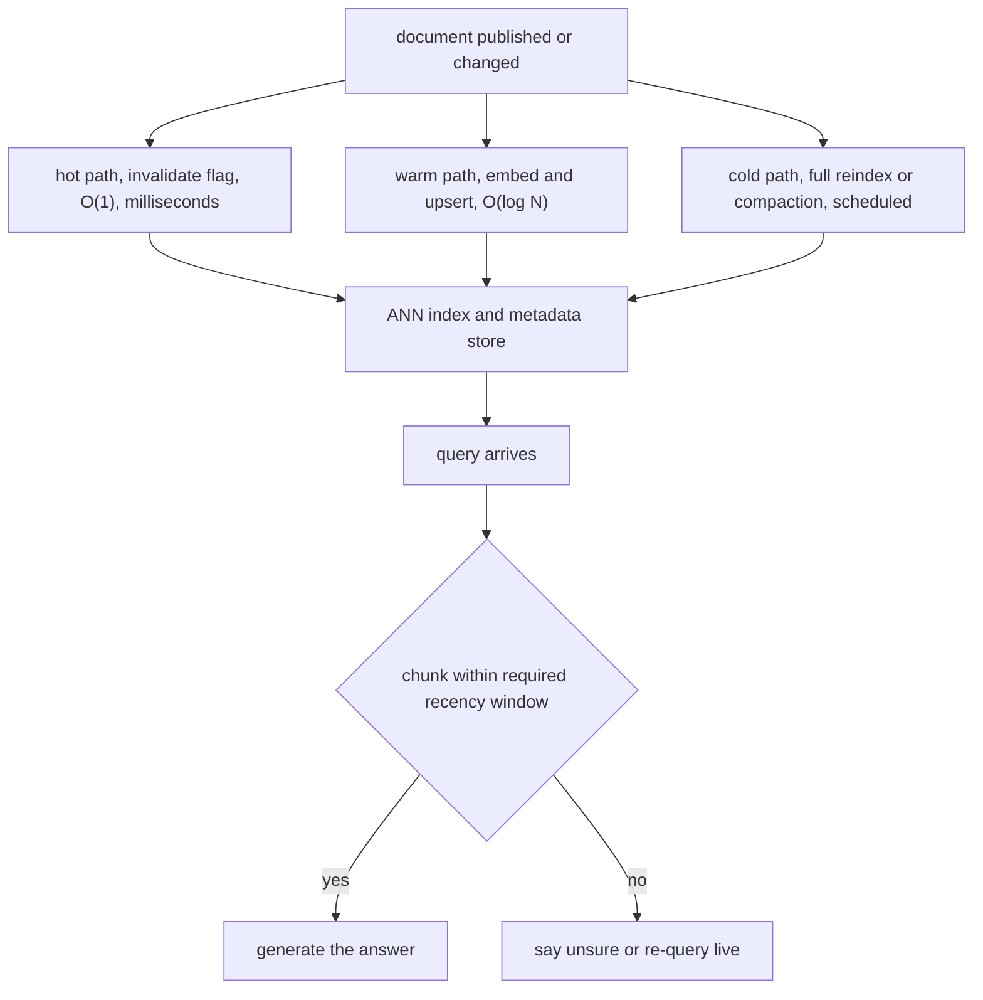
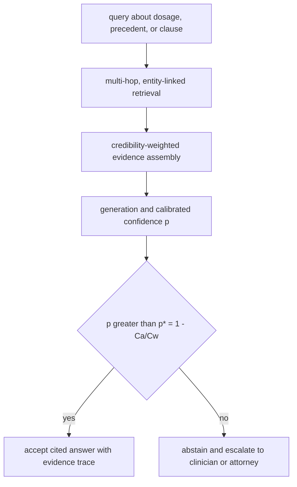
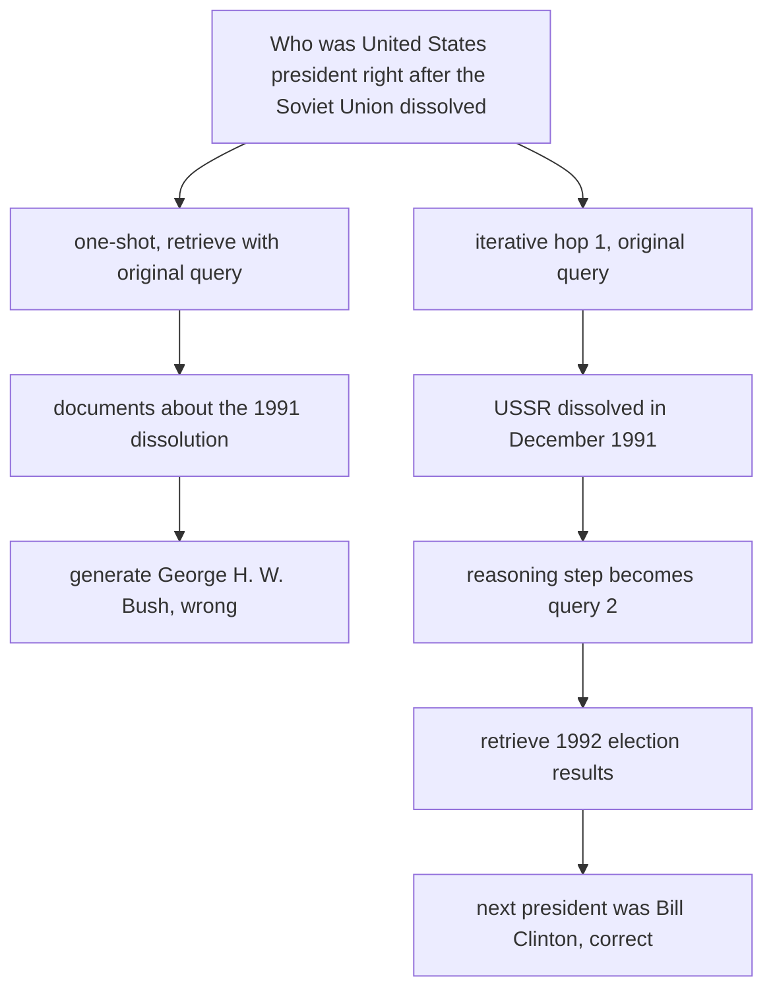
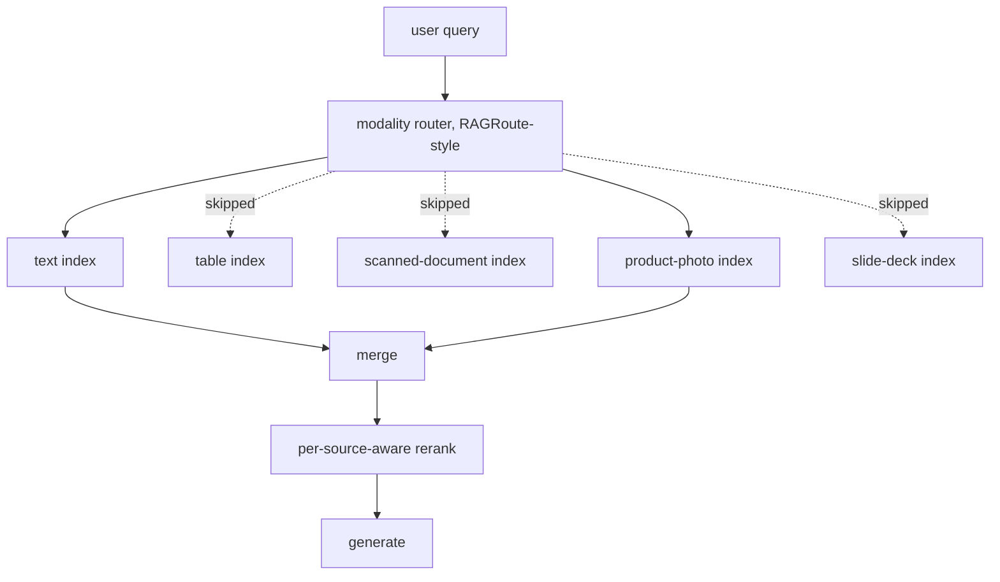
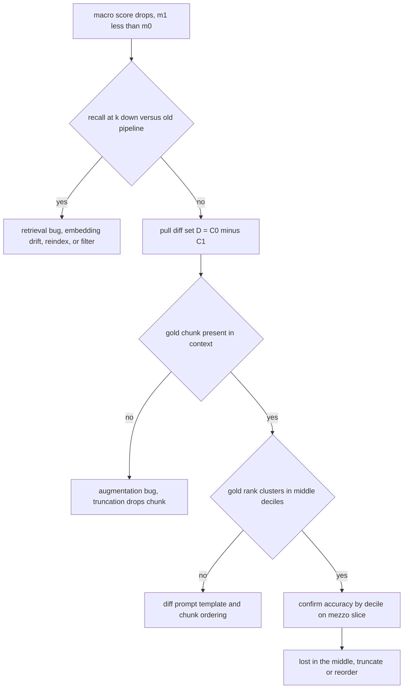
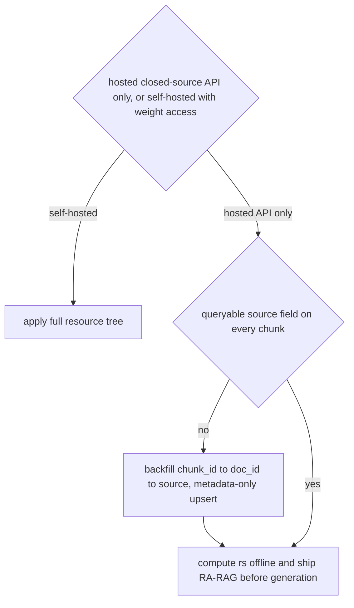

# Chapter 41: End-to-End Design Drills

Purpose: Turn seven Retrieval-Augmented Generation (RAG) interview prompts into measurable architectures, explicit trade-offs, and answers that start from the binding constraint rather than a product name.

## TL;DR

- For 100 million documents at 500 queries per second (QPS), corpus size sets random-access memory (RAM) capacity while query rate sets compute. Scatter-gather sends the full 500 QPS to every shard.
- Freshness needs three clocks under one service-level agreement (SLA). Invalidate stale content immediately, ingest replacements asynchronously, and compact the index away from the critical path.
- High-stakes RAG should answer only when calibrated confidence clears a threshold derived from the cost of a wrong answer and the cost of human escalation.
- Multi-hop questions need a new retrieval query after an intermediate fact appears. Interleaving retrieval with chain-of-thought (IRCoT) and self-ask create that next query, while adaptive routing avoids charging every request for extra hops.
- Multimodal enterprise search should route each query to relevant, authorized modality sources. Skipped sources incur no retrieval or reranking cost.
- Debug a regression by measuring retrieval, context presence, and answer position in that order. Do not blame the model before those branches are ruled out.
- A hosted application programming interface (API) blocks CrAM's attention-head intervention and makes CAG's labeled fine-tuning too slow for a sprint. RA-RAG's source-grouping layer remains insertable after a metadata-only backfill.

## The story

Picture the whole chapter as a railway control room running one large station network.

The first board separates yard capacity from train traffic. The amount of track needed for parked cars acts like index memory, while trains per minute act like QPS. Adding yards does not divide traffic when every train must check every yard.

The timetable board has three clocks. A red cancellation light removes an obsolete schedule immediately, a dispatcher inserts the replacement soon after, and a maintenance crew cleans old records later. The passenger sees only schedules that pass a final recency check.

A safety officer stands before departure. The officer compares the harm of dispatching the wrong train with the cost of holding passengers for expert review. A low-risk trip can leave at a lower confidence than a medical or legal trip.

Some journeys require transfers. The passenger cannot ask for the second train until the first stop reveals its station name. Iterative retrieval works the same way because an intermediate fact becomes the next search query.

Different cargo types use different platforms. Text, tables, scanned pages, photos, and slides each have their own search system and access rules. A router acts like the switchboard that opens only the platforms relevant and permitted for that passenger.

When on-time performance falls, the control room follows gauges rather than hunches. It checks whether the right train entered the station, whether it reached the passenger's platform, and whether it was buried in the middle of a crowded schedule.

The final drill is a retrofit. The station cannot replace its locomotive or close for reconstruction, so engineers inspect the surfaces they can change. A source label added to existing records can support a credibility checkpoint without modifying the hosted generator.

## Decoder table

| Technical term | Plain-English meaning | Why it matters |
|---|---|---|
| Workload axes | Corpus size and query rate as separate inputs | They drive memory and compute independently |
| Corpus size `N` | Number of indexed documents or chunks in the current drill | It sets memory footprint and appears inside insertion complexity |
| Vector dimension `d` | Number of components in one dense vector | Here `d = 768` sets raw vector bytes |
| Shard | One partition of the retrieval index | Capacity decides how many partitions are required |
| `S`, by section | Shard count in 41.1 or source count in 41.7 | The symbol is overloaded, so its section determines whether it counts partitions or publishers |
| Scatter-gather | Send one query to every shard, then merge results | Every shard receives full system QPS |
| Bi-encoder | Encode a query and documents separately | It supplies vectors for fast retrieval |
| Approximate nearest neighbor (ANN) search | Find close vectors without scanning every vector exactly | Its measured time converts QPS into core count |
| Hierarchical Navigable Small World (HNSW) graph | A graph index with neighbor pointers per vector | Pointer storage adds to raw vector memory |
| Complexity `O(1)` and `O(log N)` | Constant work or work that grows slowly with corpus size | The freshness hot and warm paths stay fast as the corpus grows |
| 32-bit floating point (fp32) | Four bytes for each vector dimension | It makes a 768-dimensional vector cost 3,072 bytes |
| HNSW `M` and `M0` | Neighbor count and doubled base-layer count | With `M = 16`, the base layer stores 32 identifiers |
| Product Quantization (PQ) | Replace vector subvectors with compact codebook identifiers | It reduces each vector from thousands of bytes to a short code |
| PQ `m` | Number of vector subvectors | Here 96 groups of 8 dimensions cover all 768 dimensions |
| `k`, by section | PQ centroid count, retrieval depth, or documents per source | Its meaning changes from `k = 256` in compression to candidate counts in later drills |
| `M`, by section | HNSW neighbor count or routed modality-source count | Section 41.1 uses `M = 16`, while 41.5 uses `M < N` for selected sources |
| Scalar or binary quantization | Store each vector component with fewer bits | It is another capacity option once raw vectors exceed one node |
| Inverted-file Product Quantization (IVF-PQ) | Partition compressed vectors into lists | It shrinks the worked corpus from 320 GB to 10 GB |
| Compression ratio | Raw bytes divided by compressed bytes | It changes capacity shards from five to one in the drill |
| Usable RAM budget | Memory left after operating-system and serving headroom | Shard sizing must use usable rather than advertised memory |
| Replication factor | Number of copies kept for availability | It is sized separately from capacity and throughput |
| Recall SLA | Required probability that retrieval retains the answer | It limits how much compression loss is acceptable |
| Freshness SLA | Maximum time before a published change affects answers | It rules out nightly-only update paths |
| Parametric memory | Facts stored in generator weights | It is slow and risky to edit for live factual updates |
| Catastrophic forgetting | Losing unrelated learned behavior during continued training | It is one reason not to chase live factual changes through weights |
| Model editing | Change selected weights to alter a fact | It is too costly and fragile for a live stream of fee changes |
| Invalidation | Mark superseded content ineligible immediately | Removing stale truth is more urgent than adding its replacement |
| Warm ingestion path | Re-embed and upsert only changed content | Its work scales with the change rather than the corpus |
| Tombstone | Marker for a logically deleted index entry | Too many dead nodes can degrade search until compaction |
| Compaction | Rebuild or clean accumulated dead index state | It belongs off the publish-to-query critical path |
| Recency check | Verify effective-date metadata before generation | It catches replication lag and partial ingestion failures |
| Append-only corpus | Content that is never superseded | It can omit the invalidation path |
| Calibrated confidence | A score whose frequency matches correctness on held-out domain data | The abstention rule needs a trustworthy probability |
| Confidence `p` | Calibrated probability that the generated answer is correct | It is compared with the deployment threshold after generation |
| Acceptance threshold `p*` | Minimum confidence for automatic answering | The cost ratio, or a governing review rule, sets it |
| Wrong-answer cost `Cw` | Harm when the system answers incorrectly | Higher stakes push the acceptance threshold upward |
| Abstention cost `Ca` | Cost of routing to a human | Faster escalation lowers the cost of refusing automation |
| Reject option | Choose between automatic prediction and abstention | It minimizes expected deployment cost |
| Abstention gate | Final accept-or-escalate decision after generation | It prevents low-confidence output from shipping |
| Evidence trace | Document identifier, source, and offset attached to an answer | It makes accepted errors auditable |
| Entity-linked graph | Stable entities connected by domain relations | It supports composed medical and legal facts |
| Credibility-weighted evidence | Evidence adjusted for source reliability and history | A cited but outdated source can still be unsafe |
| Causal tracing | Test model internals to identify which components drive an output | CrAM uses it to find gullible attention heads |
| Attention head | One internal attention component in the generator | A hosted API does not expose the surface CrAM needs to scale |
| Multi-hop question | A question whose later search depends on an earlier answer | The next query does not exist at the start |
| Hop facts `fi` and documents `di` | Fact and source document at hop `i` | Query `i` can depend on the fact resolved at hop `i - 1` |
| Missing-candidate failure | The needed document never entered the first candidate pool | A wider reranker cannot promote an absent document |
| IRCoT | Use the latest reasoning sentence as the next retrieval query | It supports flexible iterative search but is harder to audit |
| Self-ask | Generate an explicit follow-up question for each hop | Its queries can be logged, cached, and shown |
| ITER-RETGEN | Reissue the previous generation as the next query | It is the iterative variant named by the source taxonomy |
| FLARE | Retrieve when a generated token probability falls below a threshold | It makes retrieval adaptive rather than fixed per hop |
| Adaptive-RAG | Route zero-hop, one-hop, and multi-hop questions differently | It avoids unconditional iteration cost |
| Silver hop label | Best-performing hop budget used as a generated training label | No natural dataset directly labels required hop count |
| Hop cap | Maximum number of retrieval-generation rounds | It bounds latency and prevents an unending loop |
| Modality source | Separate retriever for text, tables, scans, photos, or slides | Each source has its own score and access policy |
| Modality router | Choose which modality sources a query should touch | Skipped sources contribute no search or rerank work |
| RAGRoute-style classifier | Predict relevant sources from a query representation and source summaries | It avoids sending every query to every modality |
| Source centroid | Precomputed summary vector for one retrieval source | The lightweight router compares the query with source-level summaries |
| Query-type heuristic | Route from simple cues before labeled router data exists | It is the source's acceptable floor below a trained router |
| Shared embedding space | Put different modalities under one score | Different score distributions and costs can make it misleading |
| Contrastive Language-Image Pre-training (CLIP)-style joint encoder | Map images and text into one shared space | It is the naive multimodal baseline that the source stress-tests |
| Per-modality threshold | Acceptance cutoff calibrated for one source type | One global cutoff does not fit all modalities |
| ColPali-style page encoding | Represent one page with roughly 1,030 patch vectors | Scanned-page retrieval is more expensive than one-vector text search |
| MaxSim | Late interaction that keeps the best patch match per query token | It prices scanned-document retrieval differently |
| Document-as-image encoding | Index a rendered page through visual patch representations | It preserves layout but costs more than extracted text |
| Optical character recognition (OCR) | Convert scanned page pixels into text | Its error cost helps choose the ingestion method for each modality |
| Access pre-filter | Remove unauthorized sources before vector comparison | Post-filtering can leak relevance into the ranking process |
| Per-source rerank | Refine results inside each source before fusion | Raw scores from different encoders are not comparable |
| Cross-encoder reranker | Score a query and candidate together after first-stage retrieval | It improves ordering at a per-candidate latency cost |
| Reciprocal rank fusion (RRF) | Merge rankings by rank rather than raw score | It combines modality sources after local scoring |
| Visual question answering (VQA) | Answer a question about one image | It does not test corpus-scale multimodal retrieval |
| Macro pass | Inspect the overall evaluation score | It says that a regression exists but not where |
| Micro pass | Inspect newly broken individual questions | It localizes failure patterns efficiently |
| Mezzo pass | Measure a structured slice across the full evaluation set | It confirms whether a micro pattern generalizes |
| Scores `m0` and `m1` | End-to-end metric before and after a deploy | Their difference detects a regression but does not localize it |
| Correct sets `C0` and `C1` | Questions answered correctly before and after | Their set difference creates the newly broken sample |
| Recall at k | Fraction of questions whose answer evidence appears in top k | A stable value rules out retrieval as the regression source |
| Normalized Discounted Cumulative Gain (nDCG) | Rank-sensitive retrieval quality | It helps compare old and new retrieval ordering |
| Diff set `D` | Questions correct before and wrong after | Every sampled item is a true regression |
| Gold-chunk presence | Whether supporting evidence reached the actual prompt | Absence points to augmentation or truncation |
| Context assembly | Select and order retrieved chunks for the generator | It can drop or bury evidence even when retrieval succeeds |
| Token-budget truncation | Remove context that exceeds the prompt budget | It can create an augmentation-stage miss |
| Rank decile | Position bucket computed from evidence rank and context depth | Middle deciles reveal positional failure |
| Rank `r`, depth `k`, and decile `d` | Gold rank, context size, and the resulting position bucket | The source computes `d` as the ceiling of ten times `r` divided by `k` |
| Exact match (EM) | Percentage of answers that exactly match the evaluation target | It is the end-to-end score in the regression drill |
| Macro-F1 | Unweighted average of class-level F1 scores | The source uses it to limit what a generic support judge can certify |
| P50 latency | Median response latency | The multi-hop interview probe compares its 800 ms budget with modeled iteration |
| Lost in the middle | Lower answer use when evidence sits away from context edges | More context can bury useful evidence without removing it |
| Prompt-template diff | Compare separators, fields, and ordering | Format changes can lower accuracy without moving documents |
| Ranked-list truncation | Send fewer top-ranked chunks to generation | It moves strong evidence toward a context edge |
| Pipeline bisection | Change or revert one bundled knob at a time | It separates several components shipped in one deploy |
| Access-surface audit | Check which models, weights, metadata, and APIs can change | It removes unreachable retrofit choices before comparison |
| Hosted generation API | Closed model endpoint without direct weight or attention access | It categorically blocks CrAM in the retrofit drill |
| Foreign key | Stored identifier that connects a chunk to its document record | It supports the metadata-only source backfill |
| CrAM | Scale identified gullible attention heads at inference time | It requires white-box model access and recurring recalibration |
| CAG | Fine-tune on credibility-tagged examples and reasoning | It requires labeled data and more than a sprint in this drill |
| RA-RAG | Group candidates by source and aggregate reliable sources | It can run before a hosted generator without changing weights |
| Source identity | Publisher, domain, or account attached to each chunk | RA-RAG needs it as the key for reliability |
| Metadata-only upsert | Add a field without recomputing embeddings | It restores source identity cheaply |
| Reliability score `rs` | Offline credibility value indexed by source | It weights the source-selection stage |
| Selected-source count `K` | Number of reliable and relevant sources retained | It bounds the documents sent to generation |
| Calibration-query count `Q` | Number of fact-checkable questions used to estimate source reliability | The worked example uses about 200 but says production sizing must follow the incident |
| Reliability-weighted vote | Aggregate after selecting trusted sources | It is RA-RAG's pre-generation decision rather than a reranker replacement |
| Feature flag | Reversible switch around the new credibility layer | It lets the retrofit roll back independently |
| Recalibration | Reidentify model-specific gullible heads after a model change | CrAM setup is recurring rather than one-time |

## Core mechanics

### 41.1 Enterprise RAG over 100M documents at 500 QPS

#### What

Treat 100 million documents and 500 QPS as two sizing problems.

Corpus size determines whether the index fits in memory and how many shards hold it.

Query rate determines how many cores each searched shard needs.

Scatter-gather embeds each query once, broadcasts it to every shard, merges global top-k, reranks, and generates.

#### Why

The 110 million parameter bi-encoder emits 768-dimensional vectors.

At fp32, each vector uses:

$$
768 \times 4 = 3{,}072\ \mathrm{bytes}
$$

HNSW uses `M = 16` and `M0 = 2M = 32` four-byte neighbor identifiers at the base layer.

The source states that `M = 16` is the default in both hnswlib and FAISS and falls inside the original paper's recommended range.

That adds 128 bytes, so one document costs 3,200 bytes and 100 million documents cost:

$$
10^8 \times 3{,}200 = 3.2 \times 10^{11}\ \mathrm{bytes} = 320\ \mathrm{GB}
$$

PQ splits 768 dimensions into 96 eight-dimensional subvectors. A 256-centroid codebook needs one byte per subvector.

Adding a four-byte posting identifier gives 100 bytes per document:

$$
10^8 \times 100 = 10^{10}\ \mathrm{bytes} = 10\ \mathrm{GB}
$$

The compression ratio is 3,200 divided by 100, or 32 times.

With 64 GB usable RAM per node, raw HNSW needs `ceil(320/64) = 5` shards. IVF-PQ needs one.

#### Failure without it

Dividing 500 QPS by five shards is wrong under scatter-gather. Every shard sees every query.

Sizing only from QPS can create a memory-starved cluster even when compute is comfortable.

Keeping full-precision vectors adds shards, replicas, and rebuild cost for a resource the QPS budget did not need.

Five independently built raw graphs also multiply full-reindex construction cost by five.

Compression can lower recall. Widen the per-shard candidate set into reranking when evaluation shows that loss.

Use scalar or binary quantization as alternatives once raw memory exceeds one node. Broadcast less than full QPS only when metadata routing proves that a query touches a shard subset.

#### Cost and complexity

The source prices one ANN shard search at 8 ms, or about 125 queries per second per core.

Four cores reach 500 QPS at saturation. Eight provide the stated headroom.

Raw HNSW uses five 64 GB shards. Two copies of each shard produce ten memory-heavy nodes.

Compressed IVF-PQ fits in one 10 GB shard. Three replicas produce three lightweight nodes.

The source sanity check compares roughly 50 GB dense storage with 10.5 GB learned-sparse storage for a comparably large but different corpus. It claims only order-of-magnitude agreement.

At 5,000 QPS with corpus size unchanged, memory shard count stays fixed. The source calls 40 cores the needed headroom per searched shard.

Direct division gives `5,000/125 = 40`, which is saturation capacity under the earlier arithmetic. Retaining the earlier two-times headroom policy would imply 80 cores, so the printed 40-core label is internally inconsistent even though its division is correct.

Split into smaller shards only if a tighter latency target requires lower per-query work. Do not repartition merely because QPS rose.

### 41.2 A RAG system that must stay fresh

#### What

The fee-schedule assistant must reflect a published change within 15 minutes and must not serve a superseded fee beyond that window.

Use three clocks.

The hot path writes an invalidation flag immediately.

The warm path embeds and upserts the changed chunk asynchronously.

The cold path compacts tombstones or fully reindexes on a measured schedule.

A generation-time recency check rejects stale chunks before an answer ships.

#### Why

A nightly job cannot beat its cadence.

One day divided by 15 minutes is:

$$
\frac{1{,}440}{15} = 96
$$

A same-day midnight run can leave a 9 am change stale for 900 minutes, or 60 times the SLA.

The invalidation write is constant in corpus size. The example places it near 10 ms including serving-cache replication.

For 20 million chunks, HNSW insertion grows logarithmically:

$$
\log_2(20 \times 10^6) \approx 24.3
$$

The hosted embedding round trip is about 100 ms. Graph insertion adds at most a few milliseconds in the source estimate.

The changed fact becomes queryable in roughly 100 to 300 ms, three to four orders of magnitude inside 15 minutes.

#### Failure without it

One atomic update makes removal of stale content wait for replacement ingestion.

An on-write full reindex makes each small change scale with the corpus.

Fine-tuning or model editing misses the SLA, risks catastrophic forgetting, and touches weights unnecessarily.

Replication lag, partial ingestion failure, and clock skew can still expose a stale index record. The serving-time check is the backstop.

#### Cost and complexity

Compaction runs in hours or days and stays off the critical path.

Set its cadence from a tombstone-ratio threshold measured in staging. Shorten it if recall or latency drifts earlier than expected.

The source uses a one-second near-real-time refresh interval as a sanity check for the 100 to 300 ms derivation, not as a guarantee for this system.

Keep generator weights unchanged for factual updates. The stated exception is a behavioral or stylistic change.

Append-only corpora can omit invalidation because nothing is superseded.

Report invalidation latency, ingestion latency, and compaction cadence separately rather than hiding them in one freshness number.

### 41.3 High-stakes RAG: medicine and law

#### What

Place an abstention gate after generation and before delivery.

Let `p` be calibrated confidence, `Cw` the cost of an accepted wrong answer, and `Ca` the cost of human escalation.

Automatic answering has expected cost `(1 - p)Cw`. Abstention costs `Ca`.

The cost-minimizing rule is:

$$
(1-p)C_w < C_a
\quad\Longleftrightarrow\quad
p > p^{*} = 1 - \frac{C_a}{C_w}
$$

The threshold belongs to the deployment cost ratio, not to the model.

The source identifies this as the classical reject-option rule and credits Chow (1970).

#### Why

A general assistant with `Cw = 1` and `Ca = 0.05` uses `p* = 0.95`.

A clinical dosage assistant with `Cw = 1,000` and `Ca = 2` uses:

$$
p^{*} = 1 - \frac{2}{1{,}000} = 0.998
$$

The same model can therefore face different gates without any calibration change.

Lower `Ca` through a fast, staffed escalation path. A disclaimer does not reduce the harm or liability represented by `Cw`.

Some regulatory or professional-review regimes effectively push `p*` toward one. Confidence then prioritizes a human queue instead of authorizing autonomous action.

#### Failure without it

An off-the-shelf 0.9 threshold silently assumes `Ca/Cw = 0.1`. The source also rejects importing 0.7 from another product without the cost ratio.

Token probabilities are not risk-aware. The same model confidence does not encode the different consequences of a store-hours error and a dosage error.

Single-hop prose retrieval can miss composed relations such as drug-gene-disease links or precedent history.

Use entity-linked graphs for those relations, while recognizing that entity resolution trades recall for precision.

Check source reliability and later legal history. Presence in a corpus does not mean a holding remains valid.

Split genuinely low-risk sub-questions from high-risk ones and gate each against its own cost ratio rather than forcing every answer through one threshold.

#### Cost and complexity

Among 500 calibrated queries, 415 clear 0.95 and 61 clear 0.998.

The general assistant auto-answers 83%. The clinical assistant auto-answers 12.2% and escalates 439 of 500, or 87.8%.

The source cites automatic support judges near 80% macro-F1, or roughly one wrong decision in five. That resolution cannot certify a 0.998 threshold.

Calibrate on held-out data from the deployment domain.

Attach document identifier, source, and offset to every accepted answer. If tracing is temporarily absent, raise the threshold rather than silently shipping at the normal gate.

A source interview answer calls evidence tracing a `Ca`-side infrastructure lever even though `Ca` was defined as the cost of abstaining. Treat that phrase as an internal notation mismatch and preserve its operational recommendation to raise `p*` until offsets are available.

Use a cheaper cross-source agreement scheme when sources are identifiable. Train a credibility model only when labeled data and observed reliability drift justify it.

### 41.4 Multi-hop question answering

#### What

A multi-hop question needs facts `f1` through `fn` from documents `d1` through `dn`.

The source's opening example asks for the country whose capital contains the university attended by a film director. The university search term appears only after an earlier film fact is resolved.

The query for document `di` depends on the fact resolved at hop `i - 1`.

One-shot retrieval embeds only the original question. It cannot search for an intermediate name, year, or relation that the user never supplied.

IRCoT turns the model's latest reasoning sentence into the next query.

Self-ask emits an explicit follow-up question, retrieves its answer, and either asks again or returns a final answer.

#### Why

The source asks who was United States president right after the Soviet Union dissolved.

One-shot retrieval finds December 1991 collapse documents and answers George H. W. Bush, who was president at dissolution.

Iterative retrieval turns the December 1991 finding into a query about the 1992 election and reaches Bill Clinton.

IRCoT is flexible for comparison and aggregation. Its free-form reasoning query is harder to audit.

Self-ask produces a named question that can be logged, cached, cited, or shown in a user interface (UI). Its fixed question-answer schema can strain on comparisons.

The source taxonomy also names ITER-RETGEN, which reissues the prior generation, and FLARE, which retrieves when token probability falls below a threshold.

#### Failure without it

Widening top-k or cross-encoding 100 candidates cannot recover a hop-two document that never entered the pool.

Unconditional iteration charges every query for extra retrieval, generation, and growing context.

An unbounded loop creates a latency and cost incident when a question does not terminate cleanly.

Log the query, retrieved documents, and generated reasoning at every hop. Otherwise decomposition, retrieval, and bridging hallucination failures look identical.

#### Cost and complexity

The workload mix is 70% single-hop and 30% multi-hop.

Retrieval takes 80 ms per hop. Decode runs at 50 tokens per second. A 30-token reasoning sentence takes 600 ms, and a 60-token final answer takes 1,200 ms.

One-shot latency is:

$$
80 + 1{,}200 = 1{,}280\ \mathrm{ms}
$$

The source reports an always-iterate latency of 3,240 ms and calls it 2.5 times the one-shot latency.

It prints `2 x 680 + 1,200 = 3,240` after describing two 680 ms intermediate hops. Direct arithmetic gives 2,560 ms. Three 680 ms intermediate hops plus 1,200 ms give the reported 3,240 ms.

The later source calculations consistently use 3,240 ms, so this chapter preserves that modeled value while exposing the internal mismatch.

An Adaptive-RAG classifier adds 5 ms and routes the mix:

$$
5 + 0.7(1{,}280) + 0.3(3{,}240) = 1{,}873\ \mathrm{ms}
$$

Relative to the source's 3,240 ms always-iterate value, that is a 42% latency reduction.

Jeong et al. (2024) report always-iterate latency near ten times a single step on their benchmarks. The source limits this comparison because their system runs more hops and repeatedly embeds and reranks growing context.

Route zero-hop, one-hop, and multi-hop queries with a classifier trained from silver labels.

The source names HotpotQA and MuSiQue as rare benchmark settings with hop-oriented structure. It otherwise says natural datasets do not label the required hop count.

Misclassification costs are asymmetric. Over-triggering iteration wastes latency, while under-triggering can return a plausible wrong answer, so the source recommends tuning toward extra retrieval.

Cap hop depth at three or four and require an explicit generated stop condition. Always iterate only when low volume or high stakes makes a missed hop more costly than added latency.

In the source interview probe, a median latency budget falls from 3 seconds to 800 ms. The preserved 3,240 ms always-iterate value is about four times the new budget, which makes unconditional iteration infeasible in that scenario.

When a maintained knowledge graph already encodes the relations, structured traversal can replace inference-time iteration at the cost of graph construction and maintenance.

### 41.5 Multimodal enterprise search

#### What

The corpus contains 40 million text chunks, 6 million finance tables, 3 million scanned pages, 2 million product photos, and 1 million slide decks.

Treat each modality as a retrieval source with its own encoder, score threshold, and access grant.

A lightweight RAGRoute-style classifier uses the query embedding and source centroids to choose `M` relevant sources from `N` total sources.

Apply access control during source selection. Search, locally rerank, fuse surviving rankings, and generate.

#### Why

One shared image-text space cannot assume comparable score distributions for text, tables, scans, photos, and slides.

The source uses a CLIP-style joint encoder as the naive baseline, then rejects one global score across all modalities.

A ColPali-style scan represents a page with roughly 1,030 patch vectors and late-interaction MaxSim. A text-only query should not pay that cost when scans are irrelevant.

A merged index also weakens provenance. A restricted table and a public product photo require different grants.

The source example restricts finance tables to two departments, which makes pre-search authorization part of the retrieval design.

Routing skips irrelevant expensive sources rather than merely giving them low rank.

#### Failure without it

Full broadcast makes every query pay for all five sources.

Post-filtering after fusion lets a restricted document affect ranking before removal.

Raw score addition combines values from incompatible encoder distributions.

Use RRF after each source reranks its own results. Use a shared space only when at most two modalities have sufficiently comparable scores or when the corpus is too small for router savings.

A VQA benchmark tests one-image question answering, not corpus-scale routing and fusion. It validates the wrong failure mode for this enterprise design.

#### Cost and complexity

The example retrieves `k = 20` candidates per source and prices a BERT-base cross-encoder at 0.195 ms per candidate.

Broadcast across all five sources sends 100 candidates to reranking:

$$
5 \times 20 \times 0.195 = 19.5\ \mathrm{ms}
$$

The return-policy and packaging-photo query routes only to text and product photos. It sends 40 candidates:

$$
2 \times 20 \times 0.195 = 7.8\ \mathrm{ms}
$$

Routing cuts candidates by 60% and saves 11.7 ms of reranking before generation.

It also avoids ANN work in the skipped table, scan, and slide sources.

RAGRoute reports 77.5% fewer retrieval calls and 76.2% less data transfer with accuracy essentially unchanged. The source treats the 60% drill result only as same-order support for the mechanism.

Use a query-type heuristic when router labels do not exist yet. Full broadcast remains the fallback when no more than two sources make routing overhead hard to repay.

Choose document-as-image encoding where optical character recognition (OCR) error is expensive, such as contracts and finance tables. Use cheaper extraction and captioning where that error is tolerable.

### 41.6 Debugging a RAG system that got worse

#### What

The overall score drops from baseline `m0` to post-deploy `m1`.

First, recompute recall at k on the same evaluation set with old and new retrieval.

If recall falls, inspect embedding drift, reindexing, and filters.

If recall holds, pull the diff set:

$$
D = C_0 \setminus C_1
$$

Here `C0` contains questions correct before and `C1` contains questions correct after.

Check whether the gold chunk appears in the actual context and where it ranks.

Map rank `r` in a `k`-chunk context to decile:

$$
d = \left\lceil \frac{10r}{k} \right\rceil
$$

Confirm any micro pattern with accuracy by decile over the full mezzo slice.

#### Why

Stable or improved recall exonerates retrieval. Re-embedding or reverting a better reranker would waste effort.

A missing gold chunk points to augmentation or token-budget truncation.

A present chunk clustered in middle deciles points to the U-shaped lost-in-the-middle effect.

A flat decile slice redirects the investigation to prompt separators, field order, delimiters, or another format change. The source notes that format changes alone can move accuracy by double digits.

#### Failure without it

Guessing at the newest or least legible component can revert an improvement and preserve the actual bug.

A random micro sample contains background failures. The diff set guarantees that each sampled item regressed.

One recovered macro score can hide a new pocket of failures. Verify the fix on mezzo slices.

Treat candidate-pool width and generator-context depth as separate choices. More rerank candidates do not require sending more chunks to generation.

Revert one change when a deploy changed one surface. When reranker, pool width, and context depth moved together, bisect one knob at a time.

#### Cost and complexity

The baseline retrieves top 5, reranks, sends top 3 chunks of about 200 tokens each, and scores 68% exact match (EM) on 500 questions.

The deploy retrieves top 20 and sends 10 chunks, or about 2,000 tokens. EM falls to 59%, with 205 wrong instead of 160.

A later source interview probe calls the move from 68% to 59% an 8-point drop. Direct subtraction gives a 9-point drop, so the endpoints are preserved and the probe wording is an internal numeric inconsistency.

Recall at 20 rises from 71% to 86%. Gold presence rises from 68% to 84%.

The diff set has 90 questions. In a sample of 30, 22 cases, or 73%, contain the gold chunk. Median rank is 6 of 10.

Across all 500 questions, accuracy is 81% in deciles 1 to 2, 44% in deciles 3 to 7, and 76% in deciles 8 to 10.

Keep the improved reranker and truncate generation context to top 4.

Accuracy recovers to 74%, gold presence becomes 79%, and median rank becomes 2 of 4.

The source treats the 59% to 74% swing as same-order support for a positional diagnosis, not proof from another task.

### 41.7 Retrofitting credibility onto an existing pipeline

#### What

The inherited system has served for 18 months. It uses one flat vector index, a hosted closed-source generator, no downtime budget, and no credibility-aware source field.

The triggering incident treats a two-year-old blog post like an authoritative regulatory bulletin. The worked audit also finds no fine-tuning or attention access through the hosted API.

Audit generator access and chunk metadata before comparing mechanisms.

CrAM scales a small set of gullible attention heads found through causal tracing. A hosted generator exposes no required attention surface.

CAG fine-tunes on credibility-tagged documents, reasoning traces, and answers. It needs document- and sentence-level labels measured in engineer-weeks.

RA-RAG retrieves per source, keeps the most reliable and relevant sources, and aggregates before generation. It changes neither embedding nor generator weights.

Its source-level aggregation uses reliability-weighted voting after the existing reranker scores relevance within each source.

Insert it after existing retrieval and reranking. The reranker orders documents within a source, and RA-RAG decides which sources count.

#### Why

Legacy chunks may store only `chunk_id`, embedding, and text.

The upstream document table often retains `doc_id` and `source_domain`.

Recover source identity with `chunk_id` to `doc_id` to `source_domain`, then metadata-only upsert the field.

No embedding is recomputed and no document is recrawled.

#### Failure without it

CrAM is architecturally unreachable through a hosted API.

CAG may be technically reachable through hosted fine-tuning, but a two-week sprint cannot create its labeled corpus.

RA-RAG cannot group or look up reliability without source identity.

Choosing from benchmark accuracy before checking these surfaces can select a mechanism the system cannot run.

The source says a five-minute access-surface audit would expose a hosted API with no attention access before a team commits to CrAM.

Self-hosting does not make CrAM one-time work. Its 100 to 300 identified heads depend on one model's weights and architecture, so a generator change requires recalibration.

#### Cost and complexity

The example backfills 2 million chunks.

A join at 50,000 rows per second takes:

$$
\frac{2{,}000{,}000}{50{,}000} = 40\ \mathrm{s}
$$

A metadata upsert at 2,000 vectors per second takes 1,000 seconds, or about 17 minutes. Total machine time stays under 20 minutes.

The backfill finds `S = 40` sources. RA-RAG retrieves `k = 3` documents from each source, creating 120 candidates, then keeps `K = 5` sources and sends 15 documents.

Context reduction is:

$$
1 - \frac{15}{120} = 0.875 = 87.5\%
$$

At 500 tokens per document and $0.01 per 1,000 input tokens, 120 documents cost $0.60 per query and 15 cost $0.075.

The saving is $0.525 per query, or about $26,250 per day at 50,000 daily queries.

The source compares this with Hwang et al. (2024), who report 99.6% token reduction at 1,000 web sources and `K = 4`. The smaller 40-source pool should filter less.

The source calls 40 sources two orders of magnitude below 1,000. Directly, the ratio is 25 times, or about 1.4 orders of magnitude, so the stated order count is approximate and numerically high.

Calibrate source reliability on about 200 fact-checkable internal queries in the worked example, but size the real calibration set to the incident's failure mode.

Ship RA-RAG behind a feature flag and record the resource change that would reopen CAG or CrAM, such as self-hosting or a labeled corpus.

## Diagrams

### Figure 41.1

**Figure 41.1:** Scatter-gather broadcasts every query to all S shards, so shard count is set by memory capacity while each shard still absorbs the full system query rate.

### Figure 41.2

**Figure 41.2:** Freshness is three clocks, not one: a fast invalidation write, a sub-second ingestion path, and a slow, off-critical-path compaction job, all gated by a recency check before generation.

### Figure 41.3

**Figure 41.3:** The abstention gate sits after generation and before the answer ships, and its threshold is set by the deployment's cost ratio, not by the model's raw confidence.

### Figure 41.4

**Figure 41.4:** One-shot retrieval never forms a query for the fact hop 2 needs. Iterative retrieval promotes the model's own intermediate finding into the next query and reaches the correct answer.

### Figure 41.5

**Figure 41.5:** The router queries only the modality sources relevant to a given query. Skipped sources never run a search, so their retrieval and reranking cost never enters the query path.

### Figure 41.6

**Figure 41.6:** Every branch of the debugging tree is a measurement, not a guess. Retrieval and augmentation are ruled out before the model or its context window is ever blamed.

### Figure 41.7

**Figure 41.7:** A hosted generation API forecloses CrAM outright and CAG on any sprint timeline. A missing source field forecloses RA-RAG only until a cheap metadata-only backfill restores it.

## Whiteboard pack

### Numbered drawing order

1. Write 100 million documents and 500 QPS on separate axes labeled memory and compute.
2. Draw one query fanning to every shard, then merge, rerank, and generate.
3. Add the freshness hot, warm, and cold paths plus the final recency gate.
4. Draw the high-stakes decision threshold between generation and delivery.
5. Split one-shot retrieval from a two-hop path where the first finding becomes query two.
6. Draw five modality sources and cross out the three that the router skips.
7. Add the debugging tree in order: recall, presence, position, mezzo confirmation.
8. Finish with the hosted-generator and source-metadata gates that lead to RA-RAG.

### 90 to 100 word script

> Start by separating capacity from traffic. One hundred million documents set index memory, while 500 QPS hits every scatter-gather shard. Next, draw freshness as hot invalidation, warm ingestion, and cold compaction behind a recency gate. Add the high-stakes threshold, where wrong-answer cost sets abstention. Then show an intermediate fact becoming the next multi-hop query and a modality router skipping irrelevant or unauthorized sources. For regressions, follow recall, context presence, and rank position before touching the model. Finish with the retrofit gate. Hosted generation blocks CrAM and makes RA-RAG, after source metadata backfill, the sprint-sized choice.

## Interview traps

### Probe 1: How do 100 million documents, 500 QPS, and a 15-minute freshness SLA change one architecture?

Answer: Size memory and compute separately because every scatter-gather shard sees the full 500 QPS. Then add constant-time invalidation, asynchronous changed-chunk ingestion, scheduled compaction, and a generation-time recency check. More capacity nodes do not create freshness, and a faster ingest does not remove stale content by itself.

### Probe 2: A clinical question is both low-confidence and multi-hop. Which problem do you solve first?

Answer: Build the missing hop sequence so confidence is computed against the required composed evidence, then apply the threshold derived from `Ca/Cw`. A disclaimer cannot replace abstention, and widening one-shot top-k cannot form the missing hop-two query. Regulation can still require human review even after retrieval and calibration improve.

### Probe 3: Why not place text, tables, scanned contracts, photos, and slides in one shared index?

Answer: Their scores, retrieval costs, and access grants differ. Route only to relevant authorized sources, rerank locally, and fuse rankings rather than raw scores. Use full broadcast only when the source count is at most two or the corpus is too small for routing savings.

### Probe 4: Recall improves from 71% to 86%, yet exact match falls from 68% to 59%. Do you revert the reranker?

Answer: No. Pull newly broken cases, verify gold-context presence, measure rank deciles, and confirm the pattern on the full evaluation set. The source diagnosis keeps the better reranker, truncates generation context from ten chunks to four, and recovers 74% exact match.

### Probe 5: Leadership wants CrAM after a credibility incident, but generation uses a hosted API. What ships this sprint?

Answer: CrAM is unreachable without attention access, and CAG misses the timeline without labeled data. Recover source identity through the document foreign key and metadata-only upsert, then feature-flag RA-RAG before generation. Revisit CAG or CrAM only when the missing resource changes.

## Key numbers

| Drill | Exact source values and limits |
|---|---|
| Interview setup | 30 seconds to turn 100 million documents and 500 QPS into an architecture |
| Enterprise workload | 100 million documents and 500 QPS |
| Encoder vectors | 110 million parameter bi-encoder, dimension 768, fp32 at 4 bytes, 3,072 bytes per vector |
| HNSW overhead | `M = 16`, `M0 = 32`, 32 four-byte identifiers, 128 bytes of base-layer pointers |
| Raw HNSW footprint | 3,200 bytes per document and 320 GB for 100 million documents |
| PQ layout | 96 subvectors, 8 dimensions each, 256 centroids, one byte per subvector, four-byte posting identifier |
| IVF-PQ footprint | 100 bytes per document, 10 GB total, 32 times compression |
| Node memory | Typical box 128 GB, worked usable budget 64 GB |
| Capacity shards | Five raw HNSW shards versus one IVF-PQ shard |
| Search throughput | 8 ms per shard search, about 125 QPS per core, four cores at saturation, eight with headroom |
| Available retrieval tier | Ten memory-heavy raw nodes versus three lightweight compressed replicas |
| Storage sanity check | Roughly 50 GB dense versus 10.5 GB learned-sparse on a different comparable corpus |
| Traffic expansion | 5,000 QPS with unchanged corpus gives 40 saturation cores, although the source calls them headroom cores. The earlier two-times policy would imply 80 |
| Freshness promise | Fee change visible within 15 minutes |
| Nightly miss | `1,440/15 = 96` times worst case, while 900 minutes is 60 times the SLA |
| Fresh index | 20 million chunks, about 10 ms invalidation, roughly 500 changed tokens, about 100 ms embedding call |
| HNSW insertion | `log2(20 million) = 24.3`, about 24 graph hops plus a few milliseconds |
| Write to queryable | Roughly 100 to 300 ms, three to four orders inside 15 minutes |
| Compaction | Scheduled in hours or days, with a one-second near-real-time refresh used only as a sanity comparison |
| Tombstone symptom | Query latency up 30% over three months with no corpus growth in the interview probe |
| Missing ingestion symptom | An index built once at launch serves a deprecated API six months later |
| General risk gate | `Cw = 1`, `Ca = 0.05`, `p* = 0.95` |
| Clinical risk gate | `Cw = 1,000`, `Ca = 2`, `p* = 0.998` |
| Gate traffic | 500 queries, 415 clear 0.95 or 83%, 61 clear 0.998 or 12.2%, 439 escalate or 87.8% |
| Confidence limit | Automatic support judges near 80% macro-F1, about one judgment in five wrong |
| Faithfulness probe | Two systems at 92% faithfulness still have different risk from the residual 8% |
| Threshold warning | The source rejects unpriced 0.7, 0.9, and 0.95 cutoffs. A 0.9 gate implies `Ca/Cw = 0.1` |
| Reject-option attribution | Classical rule credited by the source to Chow (1970) |
| Hop mix | 70% single-hop and 30% multi-hop |
| One-shot candidate depths | Opening retrieval returns 10 chunks, while the losing ranking-only fix widens to 100 |
| Hop timing | 80 ms retrieval, 50 tokens/s decode, 30-token reasoning sentence at 600 ms, 60-token final answer at 1,200 ms |
| One-shot timing | 1,280 ms |
| Always-iterate source value | 3,240 ms and 2.5 times one-shot, with an internal printed equation that directly evaluates to 2,560 ms |
| Adaptive routing | 5 ms classifier, 1,873 ms weighted latency, 42% below the source's 3,240 ms value |
| External hop check | Always-iterate reported near ten times single-step under more hops and growing-context work |
| Hop cap | Three or four rounds with an explicit stop condition |
| Tightened latency probe | P50 budget moves from 3 seconds to 800 ms. The preserved 3,240 ms path is about four times the new budget |
| Multimodal corpus | 40 million text, 6 million tables, 3 million scanned pages, 2 million photos, 1 million slide decks |
| Restricted modality | Finance tables are limited to two departments in the source example |
| Scan encoding | Roughly 1,030 patch vectors per ColPali-style page |
| Rerank unit | `k = 20` candidates per source at 0.195 ms each |
| Full modality broadcast | Five sources, 100 candidates, 19.5 ms rerank |
| Routed modalities | Two sources, 40 candidates, 7.8 ms rerank, 60% candidate cut, 11.7 ms saving |
| RAGRoute check | 77.5% fewer retrieval calls and 76.2% less data transfer, with accuracy essentially unchanged |
| Router reversal | Full broadcast acceptable at no more than two sources when routing buys little |
| Debug baseline | Top 5 retrieved, top 3 generated, about 200 tokens each or 600 total, 68% EM on 500 questions |
| Debug deploy | Top 20 retrieved, top 10 generated, 2,000 context tokens, 59% EM, 205 wrong versus 160 before |
| Debug arithmetic defect | 68% to 59% is 9 points, although a later source probe calls it 8 points |
| Retrieval evidence | Recall rises 71% to 86%, and gold presence rises 68% to 84% |
| Micro evidence | Diff set 90, sample 30, gold present in 22 or 73%, median rank 6 of 10 |
| Mezzo evidence | 81% at deciles 1 to 2, 44% at 3 to 7, 76% at 8 to 10 |
| Debug fix | Top 4 context, 74% EM, 79% gold presence, median rank 2 of 4 |
| Format sensitivity limit | The source says prompt-format changes alone can move accuracy by double digits |
| Retrofit constraints | Production age 18 months, two-year-old blog incident, two-week sprint, no downtime |
| Retrofit audit | The source says a five-minute access audit would catch the hosted-API mismatch |
| CrAM scope | Roughly 100 to 300 model-specific heads, plus a 91.3% adversarial-injection result cited in the interview probe |
| Metadata backfill | 2 million rows, 50,000-row/s join for 40 seconds, 2,000-upsert/s write for 1,000 seconds or about 17 minutes, under 20 minutes total |
| RA-RAG pool | 40 sources, about 200 calibration queries, 3 documents per source, 120 candidates, 5 retained sources, 15 final documents |
| RA-RAG reduction | 87.5% token reduction in the drill versus 99.6% reported at 1,000 sources with `K = 4` |
| Source-scale wording defect | 1,000 divided by 40 is 25, or about 1.4 orders, although the source says two orders |
| Hosted input cost | 500 tokens per document and $0.01 per 1,000 tokens, $0.60 unfiltered versus $0.075 filtered |
| Daily saving | $0.525 per query and roughly $26,250 per day at 50,000 queries per day |
